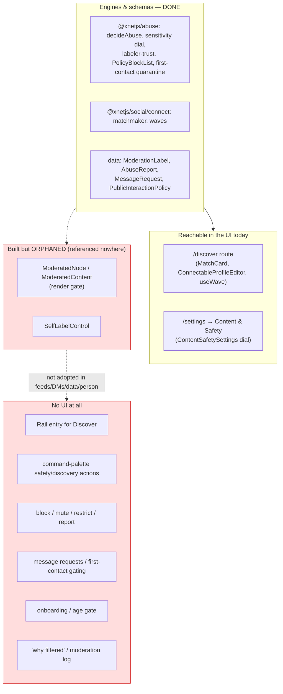
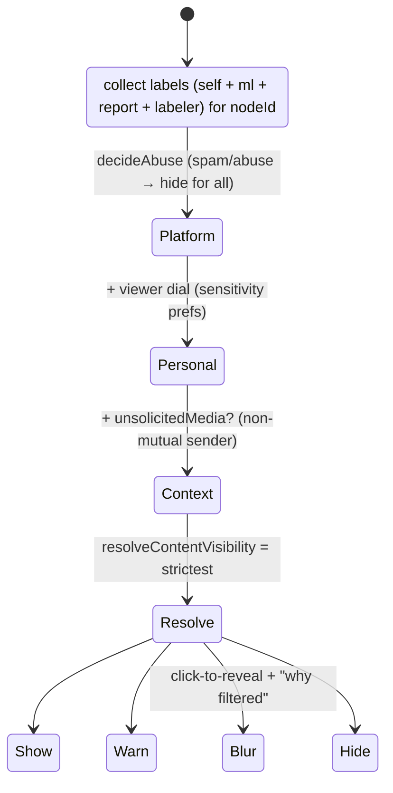
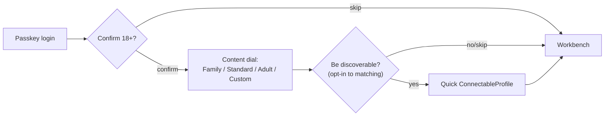

# Discovery And Safety UI Integration

> **Status:** Exploration
> **Date:** 2026-06-13
> **Author:** Claude
> **Tags:** ui, ux, discovery, matching, moderation, nsfw, safety, content-warnings,
> blur, block, mute, report, message-requests, first-contact, onboarding, age-gate,
> command-palette, rail, transparency, moderation-log, labelers, render-gate
> **Follows:** 0174 (People Matching) · 0175 (NSFW Content Moderation)

## Problem Statement

Explorations 0174 and 0175 shipped the *engines* — a people-matching primitive
(`ConnectableProfile`, `ConnectionIntent`, double-opt-in waves, the matchmaker)
and a per-viewer NSFW moderation stack (sensitivity labels, the visibility dial,
`SensitiveContent`/`ModeratedContent`/`ModeratedNode`, self-labeling) — plus two
entry points: the `/discover` route and a Content & Safety settings section.

But the **connective tissue is missing**. An audit of the UI finds that the
render gate (`ModeratedNode`, `ModeratedContent`) and the self-label control are
**built but orphaned** — they are not wired into the surfaces where content
actually lives: feeds, the data workspace, chat messages, person cards. There is
no discovery entry in the navigation rail, no command-palette actions, no
block/mute/report controls anywhere, no first-contact gating on DMs, no
onboarding or age gate, and no transparency about *why* something was filtered.
The features exist; the user can barely reach them.

This exploration asks: **how do we weave discovery and abuse/NSFW controls
coherently into every UI surface — and what new surfaces should we add — so that
matching is reachable, filtering is applied everywhere content renders, contact
is safe by default, and the user understands that filtering is their personal,
client-side choice rather than platform censorship?**

## Executive Summary

The audit is blunt: **the plumbing is done, the faucets aren't connected.** The
`@xnetjs/abuse` decision engine, the `ModeratedNode` render gate, and the data
schemas for the *hard* parts (`MessageRequestSchema`, `AbuseReportSchema`,
`PolicyBlockList`, `PublicInteractionPolicySchema`, first-contact quarantine in
`decideAbuse`) already exist. What's missing is almost entirely **UI wiring +
a handful of new surfaces**, not new infrastructure.

The prior art converges on a clear pattern language:

1. **Blur-then-reveal**, per-post, with the warning label visible (Mastodon's
   readable CW beats Bluesky's opaque gray cover; use a BlurHash-style gradient
   for media, a labeled cover for text). Per-post reveal is *intentional
   friction* — don't make one tap open everything.
2. **Composer self-label** as a shield button, **auto-prompted when media is
   attached** (Bluesky's own #1 workflow-failure request) — the cheapest,
   highest-precision signal.
3. **Discovery as a dedicated rail tab**, not a buried route; seed cold-start
   with **Starter-Pack-style curation** (Bluesky's Starter Packs drove ~20% of
   all follows). Explain *why* each match surfaced.
4. **First-contact gating**: non-mutual contact goes to a **message-requests
   inbox**; rich media is **blurred until accepted** (Instagram's single-text-
   message rule; Bumble's hold-to-view + watermark; Hinge's like-with-context).
   Instagram's on-device nudity blur even works in E2E chats — the 0175 on-device
   classifier is exactly this.
5. **Four-tier safety**: **Restrict · Mute · Block · Report** on a `⋯` overflow,
   plus subscribable blocklists — surfaced consistently on every person and post.
6. **Command-palette safety/discovery actions** ("Mute @x", "Mark sensitive",
   "Discover people") — *no major app does this*; it's a differentiator.
7. **Progressive onboarding**: age confirmation + a one-screen content dial +
   a discovery opt-in, all skippable — never gate core app use behind a wizard.
8. **Transparency** — a filter-count indicator ("4 posts filtered — review") and
   a **moderation event log** with labeler attribution. *No current decentralized
   app has this*; it is the antidote to "is this censorship?".

**Recommended shape:** a single reusable content-render gate adopted across all
surfaces, a `Discover` rail entry + contextual command-palette actions, a shared
`PersonActions` overflow menu (Connect/Wave + Restrict/Mute/Block/Report), a
message-requests inbox with media-blur-until-accepted, a composer self-label
control, a progressive onboarding flow (age + content dial + discovery opt-in),
and a transparency layer (filter indicator + moderation log) framed as *your
personal filters*. Sequenced so the highest-leverage, lowest-risk wiring (the
orphaned render gate + the rail entry) lands first.

## Current State In The Repository

### What's wired vs. orphaned



### Surface-by-surface inventory (real paths)

| Surface | File(s) | Discovery/moderation today | The natural hook |
| --- | --- | --- | --- |
| **Rail (left nav)** | [Rail.tsx](apps/web/src/workbench/Rail.tsx) — `LEFT_VIEW_ITEMS` (Explorer/Chats/Tasks/Data) | none | add a **Discover** item + an inbox/badge |
| **Navigation** | [navigation.ts](apps/web/src/workbench/navigation.ts) `navigateToNode` (page/db/canvas/dashboard/tasks/tag/channel/person) | has `person`/`channel` | no `discover`/`connections` case |
| **Home** | [index.tsx](apps/web/src/routes/index.tsx) — recent pages/dbs list | none | discovery suggestion card + safety/onboarding banner |
| **Command palette** | [WorkspaceCommands.tsx](apps/web/src/components/WorkspaceCommands.tsx) `registry.register({id,title,key,run})`; [GlobalSearch.tsx](apps/web/src/components/GlobalSearch.tsx) | nav.home/tasks/data/settings only | add discover + contextual safety commands |
| **Feeds / data workspace** | [DataWorkspaceView.tsx](apps/web/src/components/DataWorkspaceView.tsx), `packages/views` Gallery/Table | **no render gate** | wrap media rows in `ModeratedNode`; label column; row self-label |
| **Chat / DMs** | [ChannelChat.tsx](apps/web/src/comms/ChannelChat.tsx) `MessageBody` (LinkifiedText, no media field), [channel.$channelId.tsx](apps/web/src/routes/channel.$channelId.tsx) | none | media → `ModeratedNode` w/ `unsolicitedMedia`; message `⋯` → self-label/report |
| **Inbox** | [InboxTray.tsx](apps/web/src/comms/InboxTray.tsx) — reasons: mention/dm/assigned/reply/comment/keyword/call | none | add `match-request` + `message-request` reasons |
| **Person** | [PersonView.tsx](apps/web/src/components/PersonView.tsx), [PersonHovercard.tsx](apps/web/src/components/PersonHovercard.tsx), [person.$did.tsx](apps/web/src/routes/person.$did.tsx) | one-click DM | Connect/Wave; Restrict/Mute/Block/Report; matching profile |
| **Settings** | [settings.tsx](apps/web/src/routes/settings.tsx) → `safety` section ([ContentSafetySettings.tsx](apps/web/src/components/ContentSafetySettings.tsx)) | dial ✓ | blocked accounts, labeler subs, report/match history |
| **Onboarding** | *(none found)* — passkey login only | none | age gate + content dial + discovery opt-in |
| **Mobile/Electron** | `apps/expo`, `apps/electron` | no parity | follow-up after web |

### Orphan status (confirmed)

`ModeratedNode`, `ModeratedContent`, and `SelfLabelControl` are referenced **only
by each other / their own definitions** — they appear in *no* feed, chat,
person, or data-workspace render path. `useSelfLabel` is used only by the orphan
`SelfLabelControl`. The render gate works (it has tests) but governs nothing the
user sees.

### Data layer already supports the "hard" UI

- **First contact:** `MessageRequestSchema` ([moderation.ts:546](packages/data/src/schema/schemas/moderation.ts)) and `decideByFirstContact` (quarantines first contact on `messageInbox`) in [decision.ts](packages/abuse/src/decision.ts).
- **Report:** `AbuseReportSchema` ([moderation.ts:341](packages/data/src/schema/schemas/moderation.ts)).
- **Block/blocklists:** `PolicyBlockList`/`PolicyBlockEntry` ([policy-blocks.ts](packages/abuse/src/policy-blocks.ts), `subjectType: 'did'`, `action: 'hide' | 'block-peer'`).
- **Labeler subscriptions:** `PolicyListSchema`/`PolicySubscriptionSchema` + `labeler-trust.ts`.

## External Research

(Full report with citations in **References**; condensed to load-bearing UI
detail.)

### Content-warning / blur UX

- **Bluesky:** per-post opaque gray cover with the label name + "Show anyway";
  `blurs: media` (blur image, keep text) vs `blurs: content` (cover everything);
  per-label **Hide / Warn / Ignore** in settings; adult content **age-gated** and
  unavailable on iOS (App Store policy). Per-post reveal is deliberate friction.
- **Mastodon:** the author's **CW text is visible** before reveal (more
  respectful than an opaque cover); images blurred with **BlurHash** gradients;
  a global "always expand" preference. CW free-text is flexible but
  un-filterable ("food" vs "food cw" vs "mention of food").
- **Twitter/X & Reddit & Tumblr:** sensitive overlay + "Show"; Reddit's hard
  *logged-in + 18+ interstitial*; Tumblr Safe Mode on-by-default.
- **Warning fatigue (Bridgland et al. 2023, 9-study meta-analysis):** content
  warnings **do not reduce** view-through and **increase anticipatory anxiety** —
  i.e., the "warn" pattern is largely compliance theatre. Design implication:
  prefer **blur/hide** (which actually changes what's seen) over a bare text
  warning, and make the dial honest about that.

### Self-labeling

Shield button in the composer toolbar (Bluesky's established position); Mastodon
`Alt+X` to toggle CW. The #1 request (Bluesky #6815): **auto-open the label
dialog when media is attached**, because authors forget. Categorical labels
(scannable, filterable) beat free-text for automated filtering.

### Discovery surfaces

"Who to follow" right-rail (Twitter), "People you may know" (LinkedIn, with
"2 mutual connections" as a lightweight *why*), Discord server discovery (gated
at 1,000 members → cold-start problem), dating card-stack vs Hinge's
**like-with-context** feed. **Bluesky Starter Packs** (curated lists of ≤50
accounts, one-tap follow-all) drove **~20% of all follow relationships** —
human-curated scaffolding beats cold algorithmic suggestion at launch.

### First-contact / message-requests

Instagram: non-followers get **one text-only message**; rich media requires
acceptance; a **Hidden Requests** folder for flagged senders; **on-device nudity
blur** that works in E2E chats. Bumble **Opening Moves** (initiator answers a
prompt; receiver decides) + **hold-to-view, watermarked** photos. Hinge
like-with-comment = contextual first contact. LinkedIn connect-request note =
the literal first message.

### Block / mute / report

Instagram's **four tiers** — **Restrict** (shadow-limit without notifying),
**Mute** (hide, keep following), **Block** (full sever, extends to new accounts),
**Report** (categorized, anonymous). Bluesky adds **subscribable block/mute
lists**. The end-of-blocking backlash (users fled Twitter→Bluesky in 24h)
confirms hard blocking is non-negotiable for safety-minded users.

### Command palette, onboarding, transparency

- **Command palette:** contextual actions by state (Superhuman), fuzzy synonyms
  ("hide"→Block/Mute/Filter). **No major app surfaces moderation in ⌘K** — open
  differentiator.
- **Onboarding:** progressive disclosure; age (soft, self-reported) at DOB step;
  safety primer framed as *empowerment* not rules; **60–70% of dating-app churn
  is at onboarding** → keep it short and skippable. Bluesky routes new users
  through a Starter Pack before the feed.
- **Transparency:** Facebook's "Why am I seeing this?" is the gold standard;
  Bluesky attributes filtering to a *named labeler* (linkable) — correctly framing
  it as a *choice*, not platform censorship — but has **no moderation event log
  and no active-filter indicator**. Both are novel, high-value, and decentralized-
  native ("your filters, not ours").

## Key Findings

1. **It's a wiring problem, not a build problem.** The render gate + safety
   schemas exist; ~80% of this work is adopting `ModeratedNode` at content render
   paths and adding action menus.
2. **One render gate, adopted everywhere.** The single highest-leverage task: a
   reusable wrapper around *every* place content/media renders (feed, chat, data
   workspace, person, even MatchCard). Wire once, govern everywhere.
3. **Discovery needs a front door.** A `Discover` rail entry + a command + a home
   suggestion turns an unreachable route into a feature.
4. **Contact safety is structural, not algorithmic.** Message-requests +
   blur-media-until-accepted + the four-tier overflow menu matter more than any
   ranker; the schemas (`MessageRequest`, first-contact quarantine) are already
   there.
5. **Self-labeling must be in the composer and auto-prompted on media** — the
   politest, cheapest signal, and the one authors forget without a nudge.
6. **Frame filtering as personal, not censorship.** A filter-count indicator + a
   moderation log with labeler attribution is both a trust feature and a
   decentralization differentiator.
7. **Onboarding is the only place to set safe defaults with consent** — age,
   content dial, discovery opt-in — but it must stay short and skippable.
8. **Web first; mobile/electron parity is a follow-up**, but build the shared
   pieces (PersonActions, ModeratedMedia) so parity is cheap.

## Options And Tradeoffs

### A. How is the render gate adopted across surfaces?

| Option | How | Pros | Cons | Verdict |
| --- | --- | --- | --- | --- |
| **A1. Wrap at each call site** | Manually wrap media/posts in `<ModeratedNode>` in each surface | Explicit, local | Easy to miss a surface; the orphan problem recurs | partial |
| **A2. One shared content-render primitive** | A `<ModeratedMedia>` / `<ModeratedPost>` that *every* surface routes media through | Wire once; impossible to forget; consistent veil | Requires refactoring render paths to a common component | **Recommended** |
| **A3. Render-context provider** | A context that auto-gates any ``/media descendant | Zero per-call wiring | Magic; hard to target labels per node; perf | reject |

Recommended **A2**: introduce `<ModeratedMedia nodeId media>` and `<ModeratedPost
nodeId>` thin wrappers over `ModeratedNode`, and route the four content surfaces
(chat, data workspace, feed, person) through them.

### B. Where does discovery live in the IA?

| Option | Pros | Cons | Verdict |
| --- | --- | --- | --- |
| **Dedicated Rail tab → `/discover`** | Front-and-center; matches "dedicated tab" prior art | One more rail icon | **Recommended** |
| Home-feed module ("suggested people") | Contextual, low commitment | Easy to ignore; home is a doc list, not a feed | as a secondary surface |
| Command-palette only | Minimal | Undiscoverable | complement, not primary |

Recommended: **Rail entry** + a **home suggestion card** + a **command**.

### C. Blur visual

Flat labeled cover for **text** CWs (the warning is readable, Mastodon-style);
**BlurHash gradient** for **media** (aesthetic, gives composition without
revealing). Per-post reveal (intentional friction). The existing
`SensitiveContent` does a CSS blur veil today — upgrade media to BlurHash later.

### D. First-contact model

| Option | Pros | Cons | Verdict |
| --- | --- | --- | --- |
| Open DMs | Frictionless | The unsolicited-media problem | reject |
| **Message-requests + blur-media-until-accepted** | Safe by default; uses `MessageRequestSchema` + first-contact quarantine; matches Instagram/Bumble | Slight delay to first contact | **Recommended** |
| Mutual-wave-only (no requests) | Strongest | Too restrictive for non-dating DMs | dating intents only |

### E. Safety action taxonomy

Ship **Mute + Block + Report** first (the table stakes), add **Restrict**
(shadow-limit) and **subscribable blocklists** next. All on a shared `⋯`
`PersonActions`/`PostActions` menu, mirrored into the command palette.

### F. Onboarding

Progressive, skippable: **age confirm → one-screen content dial (Family/Standard/
Adult/Custom) → discovery opt-in**. Not a hard wizard (churn). Reactively deep-
link to the same controls in settings.

### G. Transparency

Ship a **filter-count indicator** ("N filtered — review") in feed/data headers
first (cheap, high-trust); a full **moderation event log** settings page second.
Always attribute to the *source* (self-label / your dial / a named labeler), never
"policy violation".

## Recommendation

Adopt a **layered integration**: one shared render gate everywhere, a discovery
front door, a universal person/post action menu, safe-by-default contact, a
composer self-label, progressive onboarding, and a transparency layer — framed
throughout as *your personal, client-side filters*.

```mermaid
flowchart LR
    subgraph L1["Layer 1 — Render gate everywhere (wire the orphans)"]
        MM["ModeratedMedia / ModeratedPost\n(thin wrappers over ModeratedNode)"]
        MM --> chat[Chat media] & data[Data workspace rows] & feed[Feed items] & match[MatchCard media]
    end
    subgraph L2["Layer 2 — Front doors"]
        rail["Rail: Discover + Inbox badge"]
        cmd["⌘K: Discover, Mute @x, Mark sensitive, Filters"]
        home["Home: suggested people + safety banner"]
    end
    subgraph L3["Layer 3 — Person & post actions"]
        pa["PersonActions ⋯ : Connect/Wave · Restrict · Mute · Block · Report"]
        poa["PostActions ⋯ : Mark sensitive · Report · Mute author"]
    end
    subgraph L4["Layer 4 — Safe contact"]
        req["Message-requests inbox\n(blur media until accepted)"]
    end
    subgraph L5["Layer 5 — Author & onboard"]
        compose["Composer self-label (auto-prompt on media)"]
        onb["Onboarding: age · content dial · discovery opt-in"]
    end
    subgraph L6["Layer 6 — Transparency"]
        ind["Filter-count indicator"]
        modlog["Moderation log (labeler attribution)"]
    end
    L1 --> L2 --> L3 --> L4 --> L5 --> L6
```



### First-contact + media-blur flow (ties 0174 + 0175 together)

```mermaid
sequenceDiagram
    participant A as Alice
    participant Sys as Client (decideAbuse + sensitivity)
    participant B as Bob
    A->>Sys: send DM / media to Bob (no prior mutual wave)
    Sys->>Sys: decideByFirstContact → quarantine → MessageRequest
    Sys-->>B: Inbox: "Message request from Alice" (text preview only)
    Note over B: media rendered via ModeratedMedia\nunsolicitedMedia=true → BLUR
    B->>Sys: Accept request
    Sys-->>B: media un-gates per Bob's dial; DM moves to main inbox
    B->>Sys: (or) Decline / Block / Report → PersonActions
    Note over A,B: a prior mutual wave (0174) skips the request → direct DM
```

### Content visibility — one resolution, every surface



### Onboarding (short, skippable)



## Example Code

### Rail: a Discover entry

```tsx
// apps/web/src/workbench/Rail.tsx — add to LEFT_VIEW_ITEMS / nav
import { Compass } from 'lucide-react'
// ...
<RailButton
  label="Discover people"
  icon={Compass}
  active={false}
  onClick={() => void navigate({ to: '/discover' })}
/>
// + an inbox badge button when pending match/message requests > 0
```

### Command palette: discovery + contextual safety

```tsx
// apps/web/src/components/WorkspaceCommands.tsx — alongside nav.*
registry.register({ id: 'nav.discover', title: 'Discover people', key: 'g m',
  run: () => void navigate({ to: '/discover' }) })
registry.register({ id: 'safety.filters', title: 'Content filters',
  run: () => void navigate({ to: '/settings', search: { section: 'safety' } }) })

// Contextual (registered by the open surface, disposed on unmount):
// when a person is focused →
registry.register({ id: 'person.mute', title: `Mute ${handle}`, run: () => mute(did) })
registry.register({ id: 'person.block', title: `Block ${handle}`, run: () => block(did) })
registry.register({ id: 'person.report', title: `Report ${handle}`, run: () => openReport(did) })
registry.register({ id: 'person.wave', title: `Wave at ${handle}`, run: () => wave(did, intent) })
```

### Shared person action menu (Connect/Wave + Restrict/Mute/Block/Report)

```tsx
// apps/web/src/components/PersonActions.tsx (new) — used by PersonView,
// PersonHovercard, MatchCard, and the chat message ⋯ menu.
export function PersonActions({ did }: { did: string }) {
  const { wave } = useWave()
  const { restrict, mute, block, report } = useSafetyActions(did) // see below
  return (
    <Overflow>
      <Item onClick={() => wave(did, 'friends')}>Wave 👋</Item>
      <Separator />
      <Item onClick={restrict}>Restrict</Item>
      <Item onClick={mute}>Mute</Item>
      <Item onClick={block} danger>Block</Item>
      <Item onClick={report} danger>Report…</Item>
    </Overflow>
  )
}
```

```ts
// apps/web/src/hooks/useSafetyActions.ts (new) — block/mute via a signed
// PolicyBlockList entry (subjectType 'did'); report via AbuseReportSchema.
export function useSafetyActions(did: string) {
  const bridge = useDataBridge()
  const me = useXNet().authorDID ?? ''
  const block = () => addPolicyBlockEntry(bridge, me, { subject: did, subjectType: 'did', action: 'block-peer', reason: 'user-block' })
  const mute = () => addPolicyBlockEntry(bridge, me, { subject: did, subjectType: 'did', action: 'hide', reason: 'user-mute' })
  const restrict = () => addPolicyBlockEntry(bridge, me, { subject: did, subjectType: 'did', action: 'quarantine', reason: 'user-restrict' })
  const report = () => openReportDialog(did) // creates AbuseReportSchema node
  return { block, mute, restrict, report }
}
```

### Wire the render gate into chat media + composer self-label

```tsx
// apps/web/src/comms/ChannelChat.tsx — MessageBody / attachments
function MessageMedia({ message, fromMutual }: { message: ChatMessageRow; fromMutual: boolean }) {
  if (!message.mediaId) return null
  return (
    <ModeratedNode targetId={message.id} unsolicitedMedia={!fromMutual}>
      <MediaAttachment id={message.mediaId} />
    </ModeratedNode>
  )
}
// Composer: a shield button that auto-opens on media attach (Bluesky #6815)
<Composer
  onAttachMedia={() => setSelfLabelOpen(true)}
  trailing={<SelfLabelControl targetId={draftId} />}
/>
```

### Filter-count indicator (transparency)

```tsx
// A header chip: "4 filtered — review" → opens the moderation log.
function FilterIndicator({ filteredCount }: { filteredCount: number }) {
  if (filteredCount === 0) return null
  return (
    <button className="text-xs text-muted-foreground" onClick={openModerationLog}>
      🛡 {filteredCount} filtered by your preferences — review
    </button>
  )
}
```

### Inbox: new reasons

```ts
// extend the comms inbox reasons (0168) with match/message requests
type InboxReason = 'mention' | 'dm' | 'assigned' | 'reply' | 'comment'
  | 'keyword' | 'missed-call' | 'match-request' | 'message-request'
```

## Risks And Open Questions

- **Don't recreate the orphan problem.** If we wrap at each call site (A1)
  instead of a shared primitive (A2), a future surface ships unfiltered.
  Mitigation: lint/checklist that every media render goes through
  `ModeratedMedia`.
- **Warning fatigue (research-backed).** Bare "warn" banners don't change
  behavior and raise anxiety. Mitigation: default sensitive media to **blur**
  (not just warn), keep per-post reveal, and let the dial truly hide.
- **Performance.** `ModeratedNode` fetches labels per node via `useContentLabels`
  → N queries in a long feed. Mitigation: a batched `useContentLabels(ids[])` /
  a feed-level label prefetch; memoize visibility.
- **Block/mute data model.** Reusing `PolicyBlockList` entries vs. a dedicated
  `BlockSchema` — open question. PolicyBlockList is signed + federation-aware
  (good) but heavier than a simple per-user mute. Recommendation: PolicyBlockList
  for block (federates), a lightweight local list for mute.
- **First-contact UX vs. utility.** Over-gating non-dating DMs annoys; under-
  gating exposes harassment. Mitigation: requests only for *non-mutual,
  non-roster* senders; mutual waves and existing contacts skip the gate.
- **Age gate honesty.** Self-reported DOB is weak; hard verification is
  privacy-hostile. Keep self-report at onboarding; defer VC/ZK age proofs
  (0174 §7 / 0175) and gate only adult-content reveal, not app use.
- **"Is this censorship?"** Personal client-side filtering can read as platform
  suppression. Mitigation: always attribute (self/dial/named-labeler), the
  filter indicator, the moderation log, and never the words "policy violation".
- **Mobile/electron divergence.** Building only web grows a parity gap.
  Mitigation: factor `PersonActions`, `ModeratedMedia`, the dial, and onboarding
  as shared/portable pieces.
- **Scope creep.** Labeler marketplace, restrict tier, BlurHash, moderation log
  are each meaningful. Phase them; ship the wiring + front door + table-stakes
  safety first.

## Implementation Checklist

### Phase 1 — Wire the orphans + a front door (highest leverage)
- [x] Add a `Discover` entry to the Rail ([Rail.tsx](apps/web/src/workbench/Rail.tsx)) + a `nav.discover` command (`g m`) in [WorkspaceCommands.tsx](apps/web/src/components/WorkspaceCommands.tsx).
- [x] Introduce shared `ModeratedMedia` / `ModeratedPost` wrappers over `ModeratedNode`.
- [ ] Adopt them at the four content render paths: chat ([ChannelChat.tsx](apps/web/src/comms/ChannelChat.tsx)), data workspace ([DataWorkspaceView.tsx](apps/web/src/components/DataWorkspaceView.tsx)), feed/content views, and `MatchCard`.
- [x] Batch label lookups (`useContentLabels(ids[])`) to avoid N queries per feed.

### Phase 2 — Person/post actions + composer self-label
- [x] `PersonActions` overflow (Connect/Wave + Restrict/Mute/Block/Report) on `PersonView`, `PersonHovercard`, `MatchCard`, and the chat message `⋯`.
- [x] `useSafetyActions` (block/mute/restrict via `PolicyBlockList`; report via `AbuseReportSchema`) + a report dialog (category picker).
- [x] Wire `SelfLabelControl` into the page editor + chat composer; **auto-prompt on media attach**.
- [x] Apply blocks/mutes in `decideAbuse` facts at render (`actor.localBlocked`).

### Phase 3 — Safe contact (first-contact gating)
- [ ] Message-requests inbox: route non-mutual/non-roster DMs to a request state (`MessageRequestSchema`); accept/decline/block.
- [ ] Blur unsolicited media until accepted (`ModeratedMedia unsolicitedMedia`).
- [ ] Inbox reasons `match-request` + `message-request` in [InboxTray.tsx](apps/web/src/comms/InboxTray.tsx) + a Rail inbox badge.

### Phase 4 — Onboarding + transparency
- [x] `/welcome` onboarding: age confirm → content dial → discovery opt-in (skippable); set sensitivity defaults + optionally seed `ConnectableProfile`.
- [x] Home suggestion card ("Discover people") + a first-run safety banner on [index.tsx](apps/web/src/routes/index.tsx).
- [x] Filter-count indicator in feed/data headers.
- [x] Moderation log settings page (filtered items + labeler attribution + override).

### Phase 5 — Depth + reach (follow-up)
- [ ] Settings: blocked/muted accounts manager + labeler subscriptions + report/match history.
- [ ] Restrict tier + subscribable blocklists; BlurHash media previews.
- [ ] Contextual command-palette safety actions (per-focused-person/post).
- [ ] Mobile (expo) + electron parity for the dial, PersonActions, discover, onboarding.

## Validation Checklist

- [ ] Every place media renders (chat, data workspace, feed, match) routes
      through `ModeratedMedia` — verified by grep + a render test; no orphan path.
- [ ] A `porn`-labelled image is blurred in chat **and** the data workspace for a
      default-prefs viewer; an adult-opted-in viewer with `porn: warn` sees a warn.
- [x] `Discover` is reachable from the Rail and `⌘K` ("Discover people"); the
      route renders matches.
- [x] Mute hides a person's content app-wide; Block severs interactions; both
      persist and flow through `decideAbuse` (`actor.localBlocked`).
- [ ] A first DM from a non-mutual, non-roster sender lands in **requests** with
      media blurred; accepting un-gates it; a prior mutual wave skips the request.
- [x] Reporting a person creates an `AbuseReport` node with the chosen category.
- [x] Self-labeling from the composer auto-prompts on media attach and writes a
      `ModerationLabel`; the label immediately affects the author's own render.
- [x] Onboarding sets sensitivity defaults + an optional discoverable profile and
      is fully skippable; nothing is discoverable without explicit opt-in.
- [ ] The filter indicator shows a non-zero count when items are filtered and
      opens a log that attributes each to self/dial/labeler (never "policy").
- [x] `pnpm test`, `pnpm typecheck`, `pnpm lint`, and `fallow audit` green across
      `apps/web`, `@xnetjs/ui`, and touched packages.

## References

### xNet code seams
- [Rail.tsx](apps/web/src/workbench/Rail.tsx), [navigation.ts](apps/web/src/workbench/navigation.ts), [WorkspaceCommands.tsx](apps/web/src/components/WorkspaceCommands.tsx), [GlobalSearch.tsx](apps/web/src/components/GlobalSearch.tsx)
- [ChannelChat.tsx](apps/web/src/comms/ChannelChat.tsx), [InboxTray.tsx](apps/web/src/comms/InboxTray.tsx), [DataWorkspaceView.tsx](apps/web/src/components/DataWorkspaceView.tsx)
- [PersonView.tsx](apps/web/src/components/PersonView.tsx), [PersonHovercard.tsx](apps/web/src/components/PersonHovercard.tsx)
- [discover.tsx](apps/web/src/routes/discover.tsx), [MatchCard.tsx](apps/web/src/components/MatchCard.tsx), [ConnectableProfileEditor.tsx](apps/web/src/components/ConnectableProfileEditor.tsx)
- [ModeratedNode.tsx](apps/web/src/components/ModeratedNode.tsx), [ModeratedContent.tsx](apps/web/src/components/ModeratedContent.tsx), [SelfLabelControl.tsx](apps/web/src/components/SelfLabelControl.tsx), [ContentSafetySettings.tsx](apps/web/src/components/ContentSafetySettings.tsx)
- [self-label.ts](apps/web/src/lib/self-label.ts), [sensitivity-preferences.ts](apps/web/src/lib/sensitivity-preferences.ts), [useConnect.ts](apps/web/src/hooks/useConnect.ts)
- Data/abuse: `MessageRequestSchema`/`AbuseReportSchema`/`PublicInteractionPolicySchema` ([moderation.ts](packages/data/src/schema/schemas/moderation.ts)); `PolicyBlockList` ([policy-blocks.ts](packages/abuse/src/policy-blocks.ts)); `labeler-trust` ([labeler-trust.ts](packages/abuse/src/labeler-trust.ts)); `decideAbuse` ([decision.ts](packages/abuse/src/decision.ts))
- Prior explorations: 0166 (workbench shell/Rail), 0167/0168 (chat/inbox), 0170 (feeds), 0174 (matching), 0175 (moderation)

### Content-warning / blur UX
- [Bluesky moderation architecture](https://docs.bsky.app/blog/blueskys-moderation-architecture) · [labels & moderation](https://docs.bsky.app/docs/advanced-guides/moderation) · [self-labeling for posts (TechCrunch)](https://techcrunch.com/2023/08/16/bluesky-adds-self-labeling-for-posts-and-a-dedicated-media-tab-for-profiles/) · [auto-prompt request #6815](https://github.com/bluesky-social/social-app/issues/6815)
- [Mastodon content warnings (Fedi.Tips)](https://fedi.tips/how-to-use-content-warnings-cws-on-mastodon-and-the-fediverse/) · [CW image blur #25732](https://github.com/mastodon/mastodon/issues/25732) · [CW hotkey PR #13987](https://github.com/mastodon/mastodon/pull/13987)
- [Twitter/X sensitive media settings](https://help.x.com/en/rules-and-policies/media-settings) · [Reddit NSFW gating](https://support.reddithelp.com/hc/en-us/articles/360061032831-How-do-I-view-NSFW-communities) · [Tumblr Safe Mode (TechCrunch)](https://techcrunch.com/2017/06/20/tumblr-rolls-out-new-content-filtering-tools-with-launch-of-safe-mode)
- [Content warnings do not reduce distress — Bridgland et al. 2023 (APS)](https://www.psychologicalscience.org/news/2023-october-content-warnings-distress.html)

### Discovery, first-contact, safety, onboarding, transparency
- [Bluesky Starter Packs](https://bsky.social/about/blog/06-26-2024-starter-packs) · [Starter Packs fueled growth (TechXplore)](https://techxplore.com/news/2025-06-curated-starter-fueled-rapid-user.html) · [LinkedIn PYMK algorithm](https://webupon.com/blog/linkedin-people-you-may-know-algorithm/) · [Discord Server Discovery](https://support.discord.com/hc/en-us/articles/360023968311-Server-Discovery)
- [Instagram Restrict/Mute/Block/Report](https://about.instagram.com/blog/tips-and-tricks/restrict-mute-block-report-guide) · [Instagram nudity blur in DMs (Meta)](https://about.fb.com/news/2024/04/new-tools-to-help-protect-against-sextortion-and-intimate-image-abuse/) · [Bumble Opening Moves (TechCrunch)](https://techcrunch.com/2024/04/30/bumbles-opening-move-feature-takes-the-pressure-off-women-to-come-up-with-a-new-message-every-time/) · [Hinge 2025 product evolution](https://hinge.co/newsroom/hinge-2025-product-evolution)
- [Bluesky moderation lists / end-of-blocks backlash (TechCrunch)](https://techcrunch.com/2023/08/18/bluesky-buckled-following-twitter-xs-announcement-about-the-end-of-blocks/) · [Bluesky launches Ozone (TechCrunch)](https://techcrunch.com/2024/03/12/bluesky-launches-ozone-a-tool-that-lets-users-create-and-run-their-own-independent-moderation-services) · [bluesky-labelers.io](https://www.bluesky-labelers.io/)
- [Command palette design (Superhuman)](https://blog.superhuman.com/how-to-build-a-remarkable-command-palette/) · [Command palette interfaces (Davis)](https://philipcdavis.com/writing/command-palette-interfaces)
- [Dating app onboarding UX (PG Dating Pro)](https://www.datingpro.com/blog/ux-labyrinth-designing-the-perfect-onboarding-flow-for-a-dating-service/)
