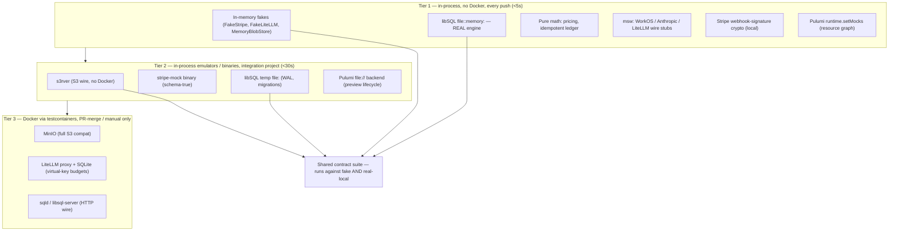
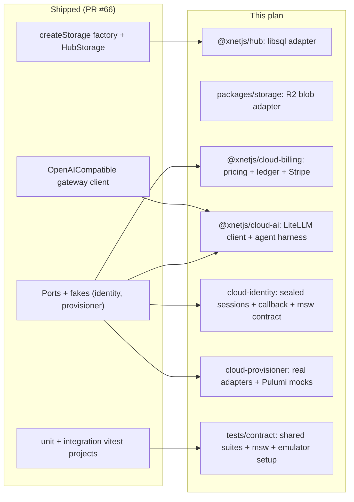
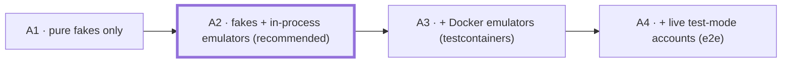
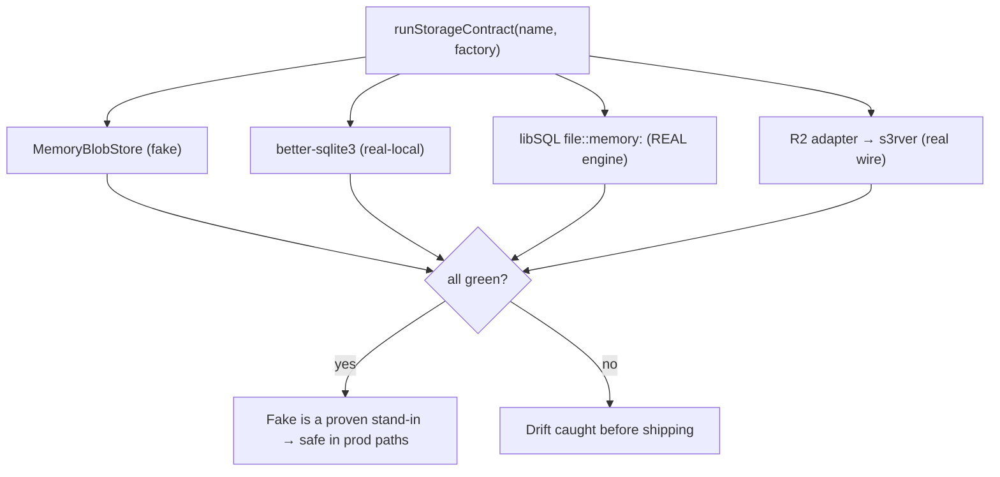
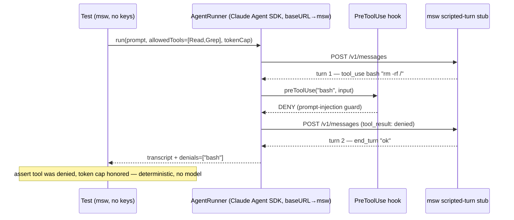

# Testable Cloud Integrations Without API Keys

> **Status:** Exploration
> **Date:** 2026-06-13
> **Author:** Claude
> **Tags:** testing, test-doubles, fakes, contract-tests, msw, stripe-mock, libsql, turso,
> r2, s3, minio, s3rver, litellm, claude-agent-sdk, workos, pulumi, testcontainers,
> ports-and-adapters, managed-cloud, ci

> **⚠️ Superseded (libSQL parts):** the **libSQL `HubStorage` port** described here is **superseded by
> [0178](./0178_[_]_COST_EFFICIENT_SQLITE_HOSTING_NO_LIBSQL_MIGRATION.md)** — we **stay on `better-sqlite3`**
> and use **Litestream → R2** for scale-to-zero + cold storage (rationale in
> [0177](./0177_[_]_DATA_BACKEND_TIERING_AND_COLD_STORAGE_ECONOMICS.md)). The Stripe/LiteLLM/agent/WorkOS
> testing patterns below still stand.

## Problem Statement

[PR #66](https://github.com/crs48/xNet/pull/66) shipped the managed-fleet _foundation_
([0174](./0174_[_]_MANAGED_HOSTING_AS_OPEN_CORE_IN_THE_PUBLIC_MONOREPO.md) /
[0175](./0175_[_]_MANAGED_HUB_FLEET_DEPLOYMENT_AND_AI_GATEWAY.md)) but deliberately deferred the
parts that _looked_ like they needed live cloud accounts and secrets to build responsibly:

1. **The libSQL + R2 data-layer swap** — the keystone that unlocks scale-to-zero
   (`better-sqlite3` → `@libsql/client`; local blob dirs → object storage).
2. **Stripe billing + the metering pipeline** — subscriptions, Billing Meters, webhooks, the
   usage→markup→meter-event ledger.
3. **The LiteLLM AI gateway** — per-tenant virtual keys, budgets, hard-stops, token accounting.
4. **The server-side AI agent** — Claude Agent SDK with `allowed_tools` + `PreToolUse` hooks.
5. **Real provisioner adapters** — Cloud Run + Turso / Fargate via Pulumi Automation API.
6. **WorkOS production wiring** — sealed sessions, the OAuth callback (the client itself shipped).

The user's constraint is exact and correct: **don't ship broken or untestable code, but also don't
make signing up for five paid services a prerequisite to building.** So this exploration asks:

> For each deferred integration, what is the highest-confidence way to implement _and test_ it
> **without any real API keys or paid accounts** — using local engines, official mock servers,
> recorded fixtures, and in-memory fakes — such that the test suite gives genuine trust the code
> does what we intend?

## Executive Summary

**Every deferred item can be built behind a port and verified with no signup.** The unifying design
is the one PR #66 already used for `@xnetjs/cloud-identity` and `@xnetjs/cloud-provisioner`:
**ports-and-adapters + an in-memory fake + a shared contract test suite**. Add a **three-tier test
strategy** and an **msw**-based HTTP backbone, and the entire deferred surface becomes testable.

The confidence ranking is not uniform, and that should drive sequencing:

| Deferred item                | No-key test mechanism                                                                  | Confidence                        | Tier                                          |
| ---------------------------- | -------------------------------------------------------------------------------------- | --------------------------------- | --------------------------------------------- |
| **libSQL data layer**        | `@libsql/client` at `file::memory:` / temp `file:` — **the real engine**               | **Highest** (real SQLite fork)    | run the existing hub-storage suite against it |
| **R2 blob store**            | `aws-sdk-client-mock` (unit) + **s3rver** in-process (integration)                     | High                              | shared contract suite, fake ↔ real-local      |
| **Stripe metering**          | local **webhook-signature crypto** (full) + pure pricing/ledger math + **stripe-mock** | High for our logic                | pure unit + schema integration                |
| **LiteLLM gateway**          | LiteLLM **`mock_response`** (no provider keys) + msw OpenAI-compatible stub            | High                              | client unit + optional Docker budget test     |
| **Claude Agent SDK**         | SDK **`baseURL` override** → msw **scripted-turn** stub; assert hooks/tools            | High for our harness              | deterministic unit                            |
| **WorkOS sessions/callback** | **msw** contract test against the real provider + recorded fixtures                    | Medium-High (wire shape)          | contract unit                                 |
| **Pulumi adapters**          | `pulumi.runtime.setMocks` (resource graph) + `file://` backend (lifecycle)             | Medium (declares, not provisions) | unit; real cloud only in manual e2e           |

The single most important pattern is the **shared contract suite**: write the test suite once against
the _port interface_, then run it against **both** the in-memory fake **and** the real-local adapter
(libSQL, s3rver, stripe-mock). When both pass, the fake is _provably_ a faithful stand-in — which is
exactly what makes "we don't have the real keys" stop being a confidence problem. This is the
concrete form of 0175's "differential-test both storage adapters" validation item.

Sequencing recommendation (each its own PR): **libSQL/R2 first** (highest confidence, unblocks
scale-to-zero), then **Stripe metering** (pure math + crypto = very safe), then the **LiteLLM
gateway + agent** (msw scripted turns), with **Pulumi adapters last** (lowest test confidence; gate
real provisioning behind a manual, opt-in e2e job).



## Current State In The Repository

The repo already demonstrates every pattern this plan needs — the deferred work is _more of the same_.

### The port + fake + contract-suite pattern is already in use

- **Identity** ([`packages/cloud-identity`](../../packages/cloud-identity/)): `BillingIdentityProvider`
  is a port; `MemoryBillingIdentityProvider` is the fake; `WorkOSAuthKitProvider` injects `fetchImpl`
  - `apiBaseUrl` for testing ([`workos.ts`](../../packages/cloud-identity/src/workos.ts)); the tests
    stub `fetch` with `vi.fn()` ([`workos.test.ts`](../../packages/cloud-identity/src/workos.test.ts)).
    **The missing piece is a contract test that exercises the _real_ provider's `fetch` path** (via
    msw) instead of injecting a fake — that's what catches URL/header/error-mapping bugs.
- **Provisioner** ([`packages/cloud-provisioner`](../../packages/cloud-provisioner/)): `Provisioner`
  is a port; `MemoryProvisioner` is a working fake; `CloudRunTursoProvisioner` /
  `FargateLitestreamProvisioner` are skeletons. The real adapters slot in behind the same interface,
  tested with Pulumi mocks.

### The storage seams the libSQL/R2 swap plugs into

- [`packages/hub/src/storage/index.ts`](../../packages/hub/src/storage/index.ts) — `createStorage(type, dataDir)`
  factory + the **`HubStorage`** interface (re-exported from `./interface`). This is the exact seam:
  add `case 'libsql'` and a `createLibsqlStorage`.
- [`packages/hub/src/storage/sqlite.ts`](../../packages/hub/src/storage/sqlite.ts) — the
  `better-sqlite3` implementation (`createSQLiteStorage`, local `blobs/`/`files/` dirs) to mirror.
- [`packages/storage/src/types.ts`](../../packages/storage/src/types.ts) — `StorageAdapter`
  (`getBlob`/`setBlob`/`hasBlob`) and `BlobStore`/`ChunkManager` — the seam for an **R2 blob adapter**.

### The AI gateway seam already exists

[`packages/plugins/src/ai/providers.ts`](../../packages/plugins/src/ai/providers.ts) ships
`OpenAICompatibleProvider` with a configurable `baseUrl` and a **`litellm` preset** pointing at
`http://localhost:4000` (`providers.ts:985`), plus an `AIProviderRouter` that already tracks
`estimatedCostUsd`. The gateway client is _already_ OpenAI-compatible — so it can be pointed at
LiteLLM's `mock_response` or an msw stub with zero new client code.

### The test infrastructure already runs real servers

[`vitest.config.ts`](../../vitest.config.ts) defines a **`unit`** project (node, `pool: threads`,
`isolate: false` — pure/fast) and an **`integration`** project (node, `pool: forks`, `isolate: true`)
that already runs **real WebSocket servers** and externalizes native deps:
`server.deps.external: ['better-sqlite3', 'ws', '@hono/node-server']`. **This is the home for
libSQL/s3rver/stripe-mock tests** — the precedent for "real engines in the integration project" is
established. `msw` is already present transitively (seen during `pnpm install`).

### What's missing (the build list)



## External Research

(Two deep testability surveys; full citations in [References](#references).)

### The methodology: ports, fakes-over-mocks, and the shared contract suite

- **Ports-and-adapters (hexagonal).** Define a narrow interface; provide a real adapter + an
  in-memory fake; test business logic against the fake.
- **Prefer fakes over mocks** (Google's _Software Engineering at Google_, ch. 13): mocks couple tests
  to call sequences; fakes test _outcomes_ and can themselves be verified against the real thing.
- **The shared contract suite**: a single parametrized test suite (`(name, factory) => describe(...)`)
  run against the fake **and** the real-local adapter. If it passes for both, the fake is a proven
  stand-in. This is the trust mechanism that replaces "but we don't have the keys."
- **HTTP backbone: msw v2 (`setupServer` from `msw/node`).** It intercepts **global `fetch`** in
  Node 18+ (via `@mswjs/interceptors`); **nock cannot intercept `fetch`** (only `http.request`).
  Since our clients use global `fetch` and msw is already in the tree, msw is the pick. Use it to
  assert request shape and replay recorded fixtures.

### Per-service no-key mechanisms

- **libSQL/Turso** — `@libsql/client` with `url: 'file::memory:'` (isolated per client) or
  `file:<temp>` runs the **real libSQL engine** (a SQLite fork): full SQL/constraint/transaction
  fidelity, no account. The one migration cost is the **async API** (vs `better-sqlite3`'s sync) and
  WAL artifact cleanup (`-wal`/`-shm`). A local `sqld`/`turso dev` server covers the HTTP wire if
  needed.
- **Cloudflare R2 / S3** — R2 is S3-compatible. Tiers: `aws-sdk-client-mock` (in-process, unit),
  **s3rver** (in-process S3 HTTP server, no Docker, ~100 ms start), **MinIO** via testcontainers
  (full compat, Docker). `forcePathStyle: true` for non-AWS endpoints.
- **Stripe** — **webhook signature verification is pure local crypto**:
  `stripe.webhooks.generateTestHeaderString({payload, secret})` + `constructEvent` exercises the
  exact production HMAC path (full confidence). **stripe-mock** (official, OpenAPI-driven) returns
  schema-true shapes for Billing Meters etc. but **no business logic / no state / no idempotency
  dedup** — so subscription-cycle/aggregation logic needs a small custom fake or (later) test mode.
- **LiteLLM** — **`mock_response`** (request body field or config alias) returns an OpenAI-shaped
  response _and still records spend against the virtual key_, so budgets/hard-stops are exercisable
  with **no provider keys**; `DATABASE_URL=sqlite:///...` removes the Postgres requirement for CI.
  For client-only unit tests, point the OpenAI-compatible client at an **msw** stub.
- **Claude Agent SDK** — the Anthropic SDK accepts a **`baseURL`** (or `ANTHROPIC_BASE_URL`); point
  it at an msw handler that returns a **scripted sequence of `tool_use` → `end_turn`** messages.
  This deterministically tests `allowed_tools` enforcement, `PreToolUse`/`PostToolUse` hooks,
  tool-deny (prompt-injection) logic, and per-session token caps — without the model.
- **WorkOS** — **no official mock server**. Test the real `WorkOSAuthKitProvider` (no `fetchImpl`
  injection) against **msw** with recorded fixtures of `/user_management/authenticate` and
  `/user_management/users/{id}`. The free tier later provides `sk_test_…` keys for opt-in live e2e.
- **Pulumi** — `pulumi.runtime.setMocks({newResource, call})` unit-tests that the **right resources
  with the right inputs** are declared (no cloud); the Automation API lifecycle can run against a
  `PULUMI_BACKEND_URL=file://` DIY backend with `PULUMI_CONFIG_PASSPHRASE`. Neither provisions real
  infra, so adapters get "declares correctly" confidence, not "works against GCP" confidence.
- **testcontainers (Node)** — throwaway Docker (MinIO, stripe-mock, LiteLLM, sqld) with a Ryuk reaper;
  ~1–3 s warm / 10–25 s cold per container. Worth it only for Tier-3 wire-protocol confidence; keep
  it off the every-push path.

## Key Findings

1. **The repo already proves the pattern** — PR #66's identity/provisioner ports + fakes are the
   template; the deferred work replicates it. Low conceptual risk.
2. **libSQL is the _easiest_ to trust, not the hardest** — `file::memory:` is the real engine, so the
   existing hub-storage test suite, re-run against it, _is_ the validation. Confidence is higher than
   for any mock-based integration. The only real work is the sync→async API change.
3. **Stripe's risky money-math is pure and local** — markup, rounding (always round _up_),
   idempotent ledger, and webhook-signature verification are unit-testable with full confidence and
   zero network. The SaaS account is only needed for live billing-cycle e2e, which can wait.
4. **`mock_response` makes the AI gateway's _budgets_ testable without provider keys** — the scary
   part (runaway cost / hard-stop) is exactly what LiteLLM lets you exercise offline.
5. **msw is the backbone** — one interception layer for WorkOS, Anthropic, and the LiteLLM client;
   already a dependency; nock would not work against global `fetch`.
6. **The shared contract suite converts fakes into evidence** — running it against fake + real-local
   is what lets us ship `MemoryProvisioner`/`FakeStripe`/`MemoryBlobStore` in production code paths
   with confidence rather than as throwaway test scaffolding.
7. **Pulumi adapters are the confidence floor** — `setMocks` proves _what we declare_, never _that GCP
   accepts it_. Be honest: gate real provisioning behind a manual, credentialed e2e job and don't
   pretend the unit tests cover it.

## Options And Tradeoffs

### A. How much real infrastructure do tests touch?



- **A1 — fakes only.** Fastest, zero infra; but a fake can drift from reality (no wire-shape check).
- **A2 — fakes + in-process emulators (recommended default).** libSQL `file::memory:`, s3rver,
  stripe-mock binary, msw. No Docker, runs on every push, and the shared contract suite pins the
  fakes to real behavior. Best confidence-per-second.
- **A3 — add Docker (testcontainers).** MinIO/LiteLLM/sqld for full wire confidence; reserve for a
  PR-merge job, not every push (cold-start cost).
- **A4 — live test-mode accounts.** WorkOS `sk_test_`, Stripe test mode, a real GCP project. Highest
  fidelity, needs secrets — make it a **manual, opt-in** workflow, never required for a green PR.

### B. Where do the new tiers run in the existing vitest projects?

- **`unit` project** (pure, fast): in-memory fakes, pure pricing/ledger math, msw wire stubs, Pulumi
  `setMocks`, webhook-signature crypto.
- **`integration` project** (forks, real IO; already externalizes native deps): libSQL (real engine,
  add `@libsql/client`/`libsql` to `server.deps.external`), s3rver, stripe-mock binary, Pulumi
  `file://` lifecycle.
- **New opt-in `e2e-cloud` workflow** (manual): testcontainers + live test-mode keys.

### C. Fake fidelity: hand-written fake vs official mock vs real-local

| Approach                           | Confidence        | Cost                         | Use when                                      |
| ---------------------------------- | ----------------- | ---------------------------- | --------------------------------------------- |
| Hand-written in-memory fake        | logic only        | low (you maintain it)        | business-logic tests; pin with contract suite |
| Official mock (stripe-mock)        | schema/wire shape | low                          | response-shape + SDK-wiring tests             |
| Real-local engine (libSQL `file:`) | **full**          | low                          | anything libSQL — it _is_ the engine          |
| Local emulator (s3rver/MinIO)      | wire protocol     | med (s3rver) / high (Docker) | adapter wire correctness                      |

## Recommendation

Adopt **ports-and-adapters + the three-tier strategy + the shared contract suite**, default to
**Tier A2 (fakes + in-process emulators, no Docker, every push)**, and implement the deferred items
as a sequence of focused PRs ordered by test confidence.

### Cross-cutting: a shared `tests/contract` toolkit

Create a small test toolkit (used by all the new packages):

- `createMswServer(...handlers)` — the `beforeAll/afterEach/afterAll` lifecycle wrapper.
- `runStorageContract(name, factory)` — the parametrized `HubStorage`/`BlobStore` suite.
- Recorded fixtures under `tests/fixtures/{workos,anthropic,stripe}/…`.
- A `vitest` `globalSetup` that boots **s3rver** and (optionally, behind an env flag) the
  **stripe-mock** binary for the integration project.

### Component plans

**1. libSQL + R2 (PR A — do first).**

- Add `case 'libsql'` to [`createStorage`](../../packages/hub/src/storage/index.ts) → `createLibsqlStorage(url, authToken?)`
  in a new `storage/libsql.ts`, implementing `HubStorage` over `@libsql/client` (embedded-replica/local
  file). Keep `better-sqlite3` for self-host.
- Add an **R2 `BlobStore`** adapter (`@aws-sdk/client-s3`, `forcePathStyle`) in `packages/storage`,
  behind the existing `StorageAdapter`/`BlobStore` seam.
- **Tests:** run the **existing hub-storage suite** as a shared contract suite against
  `better-sqlite3`, libSQL `file::memory:`, and the R2 adapter against **s3rver** + `MemoryBlobStore`.
  Add `@libsql/client`/`libsql` to `integration` `server.deps.external`.

**2. Stripe billing + metering (PR B).**

- New `@xnetjs/cloud-billing`: pure `computeChargeCents(input, output, pricing)` (round _up_),
  an idempotent `UsageLedger` (key = `tenant:session:request`), a `StripeBilling` port + `FakeStripe`
  - a real adapter using the `stripe` SDK, and `verifyWebhook` wrapping `constructEvent`.
- **Tests:** pure math (exhaustive + property "never undercharges"), ledger idempotency, webhook
  signature via `generateTestHeaderString` (full-confidence crypto), and SDK wiring against
  **stripe-mock**. No Connect.

**3. LiteLLM gateway + server-side agent (PR C).**

- New `@xnetjs/cloud-ai`: a `GatewayClient` (reuse the OpenAI-compatible shape) that issues per-tenant
  virtual keys + budgets, a `meterFromUsage` bridge into `@xnetjs/cloud-billing`, and an `AgentRunner`
  wrapping the Claude Agent SDK with `allowedTools` + a `preToolUse` deny hook + a token-cap circuit
  breaker.
- **Tests:** client routing/headers/error-mapping against an **msw** OpenAI-compatible stub;
  budget hard-stop against LiteLLM **`mock_response`** (Tier-3 Docker, opt-in); agent hooks/tool-deny
  against an **msw scripted-turn** Anthropic stub (`baseURL` override) — deterministic, no model.

**4. WorkOS sessions + callback (PR D).**

- Add sealed-session handling + the `/auth/callback` handler (state/CSRF check → `authenticateWithCode`
  → seal session) to `apps/cloud` / `cloud-identity`.
- **Tests:** **msw contract test** running the _real_ `WorkOSAuthKitProvider` (no `fetchImpl` inject)
  against recorded `/user_management/*` fixtures; callback state-mismatch rejection.

**5. Real Pulumi provisioner adapters (PR E — last).**

- Implement `CloudRunTursoProvisioner`/`FargateLitestreamProvisioner` via the Pulumi Automation API.
- **Tests:** `pulumi.runtime.setMocks` asserts the declared resources + inputs (project sharding,
  env, image tag, Turso DB, R2 prefix); `file://` backend exercises `preview`/stack lifecycle.
  **Real provisioning stays in a manual, credentialed e2e job** — name that gap honestly.

### The shared contract suite (the trust mechanism)





### Dependency plan (one `pnpm install`, all dev-only except the runtime SDKs)

- Runtime: `@libsql/client`, `@aws-sdk/client-s3`, `stripe` (used by adapters; tree-shaken from
  self-host hub builds since libSQL is gated behind `case 'libsql'`).
- Dev: promote `msw` to an explicit devDep, add `aws-sdk-client-mock`, `s3rver`; **optional**
  `testcontainers` for the opt-in e2e job. `@pulumi/pulumi` arrives with PR E.

## Example Code

### 1. Shared storage contract suite (run against fake + real-local)

```typescript
// tests/contract/blob-store.contract.ts
import { beforeEach, describe, expect, it } from 'vitest'
import type { BlobStorePort } from '@xnetjs/storage'

export function runBlobStoreContract(name: string, factory: () => Promise<BlobStorePort>) {
  describe(`BlobStore contract — ${name}`, () => {
    let store: BlobStorePort
    beforeEach(async () => {
      store = await factory()
    })
    it('round-trips bytes', async () => {
      const data = new Uint8Array([1, 2, 3])
      await store.set('a/b', data)
      expect(await store.get('a/b')).toEqual(data)
    })
    it('returns null for a missing key', async () => {
      expect(await store.get('missing')).toBeNull()
    })
    it('reports existence and deletes', async () => {
      await store.set('k', new Uint8Array([9]))
      expect(await store.has('k')).toBe(true)
      await store.delete('k')
      expect(await store.has('k')).toBe(false)
    })
  })
}

// memory-blob-store.test.ts        → runBlobStoreContract('memory', async () => new MemoryBlobStore())
// r2-blob-store.s3rver.test.ts     → runBlobStoreContract('r2/s3rver', async () => new R2BlobStore(s3rverClient(), 'test'))
```

### 2. libSQL adapter behind the existing factory (real engine in tests)

```typescript
// packages/hub/src/storage/libsql.ts
import { createClient } from '@libsql/client'
import type { HubStorage } from './interface'

export const createLibsqlStorage = async (opts: {
  url: string // 'file::memory:' in tests, 'libsql://…' in prod, 'file:…' for self-host parity
  authToken?: string
  syncUrl?: string // embedded-replica primary
}): Promise<HubStorage> => {
  const db = createClient({ url: opts.url, authToken: opts.authToken, syncUrl: opts.syncUrl })
  await db.batch(MIGRATIONS, 'write') // same DDL as sqlite.ts, async
  // …implement HubStorage over `db` (await every call); blobs → R2 BlobStore, not local dirs
  return makeHubStorage(db)
}

// createStorage gains:  case 'libsql': return createLibsqlStorage({ url: process.env.LIBSQL_URL! })
```

```typescript
// packages/hub/src/storage/libsql.test.ts  (integration project)
import { describe } from 'vitest'
import { runHubStorageContract } from '../../../tests/contract/hub-storage.contract'
import { createLibsqlStorage } from './libsql'

// The SAME suite that runs against better-sqlite3 — now against the real libSQL engine, no account.
runHubStorageContract('libsql:memory', () => createLibsqlStorage({ url: 'file::memory:' }))
```

### 3. Stripe metering — pure math + idempotent ledger + local webhook crypto

```typescript
// packages/cloud-billing/src/pricing.ts  (pure, exhaustively testable)
export interface TokenPricing {
  inputCentsPerMillion: number
  outputCentsPerMillion: number
  markup: number
}
export function computeChargeCents(input: number, output: number, p: TokenPricing): number {
  const raw = (input / 1e6) * p.inputCentsPerMillion + (output / 1e6) * p.outputCentsPerMillion
  return Math.ceil(raw * p.markup * 100) / 100 // round UP — never undercharge
}
```

```typescript
// pricing.test.ts — property: never undercharges
it('never undercharges across random usage', () => {
  const p = { inputCentsPerMillion: 1500, outputCentsPerMillion: 7500, markup: 1.3 }
  for (let i = 0; i < 1000; i++) {
    const a = (i * 37) % 10000
    const b = (i * 13) % 5000
    const raw = (a / 1e6) * 1500 + (b / 1e6) * 7500
    expect(computeChargeCents(a, b, p)).toBeGreaterThanOrEqual(raw * 1.3 - 1e-9)
  }
})

// webhook.test.ts — full-confidence local crypto, no network
it('verifies a Stripe webhook signature and rejects tampering', () => {
  const secret = 'whsec_test'
  const payload = JSON.stringify({ type: 'customer.subscription.created' })
  const header = stripe.webhooks.generateTestHeaderString({ payload, secret })
  expect(stripe.webhooks.constructEvent(payload, header, secret).type).toBe(
    'customer.subscription.created'
  )
  expect(() => stripe.webhooks.constructEvent(payload + 'X', header, secret)).toThrow()
})
```

### 4. AI gateway budget hard-stop via LiteLLM `mock_response` (no provider keys)

```typescript
// cloud-ai: integration test (Tier 3, opt-in Docker) — exercises REAL budget enforcement
it('hard-stops a virtual key at its budget', async () => {
  const key = await gateway.issueKey({ tenantId: 't1', maxBudgetUsd: 0.001 })
  for (let i = 0; i < 10; i++) {
    await gateway.chat(key, { model: 'gpt-4o', messages: BIG, mock_response: 'ok' }) // burns synthetic tokens, no provider call
  }
  await expect(
    gateway.chat(key, {
      model: 'gpt-4o',
      messages: [{ role: 'user', content: 'hi' }],
      mock_response: 'ok'
    })
  ).rejects.toThrow(/budget/i)
})
```

### 5. Pulumi adapter unit test via `setMocks` (declares, doesn't provision)

```typescript
// cloud-provisioner: assert the right resources/inputs without a cloud
beforeAll(() => {
  pulumi.runtime.setMocks({
    newResource: (a) => ({
      id: `${a.name}-id`,
      state: { ...a.inputs, uri: `https://${a.name}.run.app` }
    }),
    call: (a) => a.inputs
  })
})
it('places a tenant in a sharded project with the signed HUB_PLAN env', async () => {
  const { program } = await import('./cloud-run-turso.program')
  const out = program({
    tenantId: 'acme',
    projectPrefix: 'xnet-hub',
    image: 'hub:1.0.0',
    hubPlan: 'tok'
  })
  expect(await outputValue(out.projectId)).toBe('xnet-hub-0')
  expect(await outputValue(out.env)).toMatchObject({ HUB_PLAN: 'tok' })
})
```

## Risks And Open Questions

- **libSQL async migration touches hot paths.** `better-sqlite3` is synchronous; the sync relay and
  FTS code assume it. _Mitigation:_ keep both adapters; gate libSQL behind `LIBSQL_URL`; run the
  shared contract suite against both; benchmark write latency (embedded-replica local writes vs
  remote primary). Open question: do any paths need the embedded-replica _local-write_ mode to keep
  sync-relay latency acceptable?
- **stripe-mock has no business logic / state / idempotency dedup.** It validates shape, not behavior.
  _Mitigation:_ test money-critical logic with pure functions + a hand-written `FakeStripe` that
  _does_ model idempotency and aggregation; reserve real billing-cycle checks for opt-in test mode.
- **`mock_response` tokens are synthetic.** Budget _mechanics_ are real but token _counts_ aren't
  provider-accurate. _Mitigation:_ unit-test the real token→cents math separately from the gateway
  integration; treat `mock_response` as proving "the hard-stop fires," not "the price is exact."
- **msw fixtures drift from the real API.** Recorded WorkOS/Anthropic shapes can go stale.
  _Mitigation:_ keep fixtures small and dated; add a periodic, opt-in live-key job that re-validates a
  handful of contract tests against the real sandbox and refreshes fixtures.
- **Pulumi `setMocks` proves declarations, not provisioning.** Real GCP/AWS rejection (quotas, IAM,
  region) is invisible to it. _Mitigation:_ be explicit that adapters carry "declares correctly"
  confidence; gate true provisioning behind a manual credentialed e2e and label it as such.
- **Docker in CI cost.** testcontainers cold-starts add 10–25 s. _Mitigation:_ Tier-3 runs on
  PR-merge/manual only; every-push stays Tier 1–2 (no Docker).
- **New runtime deps in the hub.** `@libsql/client` pulls a native `libsql` addon (like
  `better-sqlite3`). _Mitigation:_ dynamic-import it only in `case 'libsql'` (mirrors the existing
  lazy `better-sqlite3` import) so self-host builds don't load it; add to `integration`
  `server.deps.external` and the hub Dockerfile only when the libSQL path ships.
- **Self-host parity must hold.** The libSQL adapter must also work at a local `file:` URL so
  self-hosters aren't forced onto Turso. _Mitigation:_ contract suite includes a `file:` (not just
  `:memory:`) case; keep `better-sqlite3` the default when `LIBSQL_URL` is unset.

## Implementation Checklist

> **Progress** (branch `feat/testable-cloud-integrations`): the keyless-testable layers landed —
> `@xnetjs/cloud-storage` (S3/R2 `StorageAdapter` + shared contract suite, fake↔real-local parity via
> `aws-sdk-client-mock`), `@xnetjs/cloud-billing` (pure pricing + idempotent ledger + Stripe meter
> adapter + `FakeStripeBilling` + local webhook-signature crypto), `@xnetjs/cloud-ai` (OpenAI-compatible
> gateway, usage→meter bridge, client-side budget hard-stop, and a provider-agnostic agent-safety
> harness), and the WorkOS **msw wire-contract** test. 88 new tests, all in-process — no keys, no
> Docker. Still open: the full libSQL `HubStorage` port (the big one), sealed sessions + `/auth/callback`,
> the LiteLLM/stripe-mock Docker integration tests, real Pulumi adapters, and the `e2e-cloud` job.

**PR 0 — contract/test toolkit (foundation):**

- [x] Add a shared `StorageAdapter` contract suite (`runStorageAdapterContract` in
      `@xnetjs/cloud-storage`). _(Full `HubStorage` contract suite lands with the libSQL port.)_
- [x] Promote `msw` to an explicit devDep; add `aws-sdk-client-mock`. _(`s3rver` deferred — the
      stateful `aws-sdk-client-mock` covers adapter logic for now.)_
- [ ] Add a vitest `globalSetup` that boots **s3rver** for the integration project (env-gated).
- [ ] Document the three-tier strategy in `tests/README.md`.

**PR A — libSQL + R2 (the keystone):**

- [ ] `createLibsqlStorage` implementing `HubStorage` over `@libsql/client`; add `case 'libsql'` to
      [`createStorage`](../../packages/hub/src/storage/index.ts) (dynamic import). _(The large port —
      still open.)_
- [x] R2 / S3 blob adapter (`@aws-sdk/client-s3`, `forcePathStyle`) — shipped as `S3BlobAdapter` in
      `@xnetjs/cloud-storage` (server-only; keeps the AWS SDK out of client bundles).
- [ ] Run the hub-storage contract suite against `better-sqlite3`, libSQL `file::memory:`, libSQL
      temp `file:`, and the R2 adapter (s3rver + `MemoryBlobStore`). _(StorageAdapter contract runs
      against `MemoryAdapter` + `S3BlobAdapter` today; libSQL/hub-storage half pending.)_
- [ ] Add `@libsql/client`/`libsql` to `integration` `server.deps.external`; benchmark write latency.

**PR B — Stripe billing + metering:**

- [x] `@xnetjs/cloud-billing`: pure `computeChargeUsd`, idempotent `UsageLedger`, `StripeBilling`
      port + `FakeStripeBilling` + real `stripe` adapter, `verifyWebhook`.
- [x] Tests: exhaustive pricing math + "never undercharges" property; ledger idempotency; webhook
      signature via `generateTestHeaderString`. _(`stripe-mock` binary deferred — `FakeStripeBilling`
      + an injected-client adapter test cover the logic with no Docker.)_

**PR C — LiteLLM gateway + server-side agent:**

- [x] `@xnetjs/cloud-ai`: `GatewayClient` (OpenAI-compatible, virtual key, budget), `meterUsage` →
      `cloud-billing`, `MeteredGateway` (budget hard-stop), and a provider-agnostic `AgentRunner`
      (`allowedTools`, `preToolUse` deny, token-cap breaker). _(Thin Claude Agent SDK adapter onto the
      harness still to wire.)_
- [x] Tests: client vs injected-fetch OpenAI stub; budget hard-stop (client-side); agent hooks /
      tool-deny / token-cap vs scripted turns. _(LiteLLM `mock_response` Docker integration deferred.)_

**PR D — WorkOS sessions + callback:**

- [ ] Sealed-session handling + `/auth/callback` (state check → authenticate → seal) in `apps/cloud`.
- [x] **msw contract test** running the real `WorkOSAuthKitProvider` against recorded fixtures.
      _(Callback state-mismatch rejection lands with the callback handler above.)_

**PR E — real Pulumi provisioner adapters (last):**

- [ ] Implement `CloudRunTursoProvisioner`/`FargateLitestreamProvisioner` via Automation API.
- [ ] `pulumi.runtime.setMocks` unit tests (resources + inputs: sharding, env, image, Turso, R2);
      `file://`-backend lifecycle test.
- [ ] Add a **manual, credentialed `e2e-cloud`** GitHub workflow (testcontainers + test-mode keys);
      never required for a green PR.

## Validation Checklist

- [x] **No-key CI is green end-to-end:** the new suite passes with zero external accounts/secrets and
      no Docker (Tier 1 only so far).
- [x] **Fakes are proven:** the shared `StorageAdapter` contract suite passes identically for the
      `MemoryAdapter` fake and the `S3BlobAdapter` (stateful mock) — no drift. _(libSQL/s3rver
      real-local rows land with PR A.)_
- [ ] **libSQL parity:** the hub-storage suite passes on `better-sqlite3`, libSQL `:memory:`, and
      libSQL `file:`; a self-hosted hub still boots on `better-sqlite3` with `LIBSQL_URL` unset.
- [x] **Money math is safe:** property test confirms charges never undercharge; ledger rejects
      duplicate idempotency keys; webhook signature verification accepts valid and rejects tampered.
- [x] **Budget hard-stop works:** an over-budget tenant is blocked before any provider call (tested
      against `MeteredGateway`). _(LiteLLM `mock_response` Docker integration deferred.)_
- [x] **Agent safety is deterministic:** a scripted `tool_use` for a denied tool is blocked by
      `preToolUse`; the token cap terminates a runaway loop — all without calling a model.
- [x] **WorkOS wire contract holds:** the real provider, run against recorded fixtures via msw, maps
      responses correctly. _(Invalid-OAuth-`state` rejection lands with the callback handler.)_
- [ ] **Pulumi adapters declare correctly:** `setMocks` tests assert the sharded project, signed
      `HUB_PLAN` env, image tag, Turso DB, and R2 prefix; the doc names "real provisioning" as e2e-only.
- [x] **Docker stays optional:** the entire new suite runs with no Docker and no secrets; Tier-3 jobs
      remain opt-in/manual.

## References

### Repository

- Ports + fakes (template) — [`packages/cloud-identity/`](../../packages/cloud-identity/)
  (`workos.ts`, `provider.ts`, `binding.ts` + tests), [`packages/cloud-provisioner/`](../../packages/cloud-provisioner/)
  (`MemoryProvisioner`)
- Storage seams — [`packages/hub/src/storage/index.ts`](../../packages/hub/src/storage/index.ts),
  [`storage/sqlite.ts`](../../packages/hub/src/storage/sqlite.ts),
  [`packages/storage/src/types.ts`](../../packages/storage/src/types.ts)
- AI gateway seam — [`packages/plugins/src/ai/providers.ts`](../../packages/plugins/src/ai/providers.ts)
  (`OpenAICompatibleProvider`, `litellm` preset, `AIProviderRouter`)
- Test infra — [`vitest.config.ts`](../../vitest.config.ts) (`unit` + `integration` projects, `server.deps.external`)
- Companion explorations — [`0174`](./0174_[_]_MANAGED_HOSTING_AS_OPEN_CORE_IN_THE_PUBLIC_MONOREPO.md),
  [`0175`](./0175_[_]_MANAGED_HUB_FLEET_DEPLOYMENT_AND_AI_GATEWAY.md),
  [`0148`](./0148_[_]_HOSTED_HUBS_DEEP_AI_INTEGRATION_WITH_PAID_FOUNDATION_MODELS.md)

### Methodology & HTTP mocking

- Fakes over mocks — _Software Engineering at Google_, ch.13 — https://abseil.io/resources/swe-book/html/ch13.html
- msw (Node `setupServer`) — https://mswjs.io/docs/integrations/node · nock can't intercept fetch — https://github.com/nock/nock
- Pact (consumer-driven contracts) — https://docs.pact.io/

### Per-service no-key testing

- libSQL/Turso TS client (`file::memory:`, `sqld`) — https://docs.turso.tech/sdk/ts/reference · https://github.com/tursodatabase/libsql
- aws-sdk-client-mock — https://github.com/m-radzikowski/aws-sdk-client-mock · s3rver — https://github.com/jamhall/s3rver · MinIO — https://min.io/docs
- stripe-mock — https://github.com/stripe/stripe-mock · webhook signatures — https://stripe.com/docs/webhooks/signatures · Billing Meters — https://docs.stripe.com/api/billing/meter
- LiteLLM mock responses — https://docs.litellm.ai/docs/proxy/mock_responses · virtual keys/budgets — https://docs.litellm.ai/docs/proxy/virtual_keys
- Anthropic SDK (`baseURL` override) — https://github.com/anthropics/anthropic-sdk-node · Messages API — https://docs.anthropic.com/en/api/messages
- WorkOS User Management — https://workos.com/docs/user-management
- Pulumi unit testing (`setMocks`) — https://www.pulumi.com/docs/using-pulumi/testing/unit/ · Automation API — https://www.pulumi.com/docs/using-pulumi/automation-api/
- testcontainers for Node — https://node.testcontainers.org/
