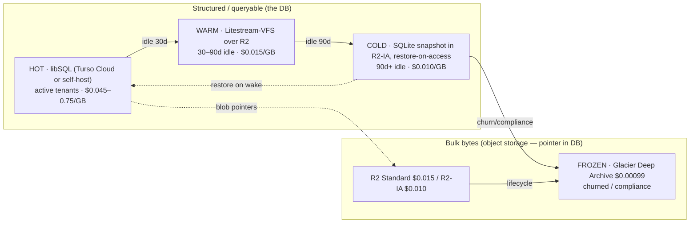
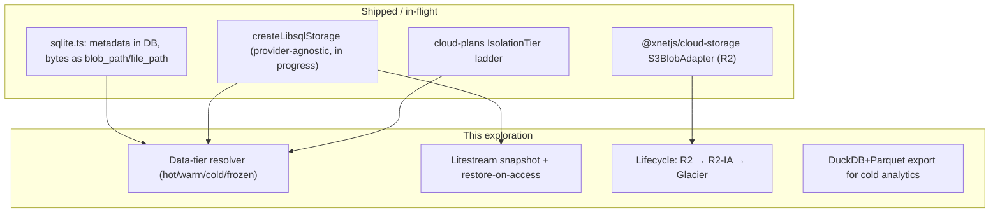
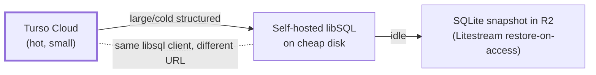
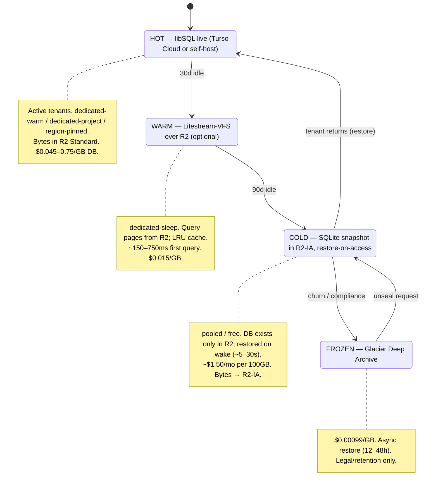

# Data Backend Tiering And Cold-Storage Economics (libSQL / Turso vs The Field)

> **Status:** Exploration
> **Date:** 2026-06-13
> **Author:** Claude
> **Tags:** data-backend, libsql, turso, neon, d1, supabase, aurora, r2, s3, b2, glacier,
> litestream, duckdb, parquet, cold-storage, tiering, hot-warm-cold-frozen, scale-to-zero,
> cost, managed-cloud

## Problem Statement

The managed-fleet plan (explorations [0175](./0175_[_]_MANAGED_HUB_FLEET_DEPLOYMENT_AND_AI_GATEWAY.md)
/ [0176](./0176_[_]_TESTABLE_CLOUD_INTEGRATIONS_WITHOUT_API_KEYS.md)) chose **Turso / libSQL** as the
per-tenant database, on the strength of its **database-per-tenant** model: cheap to have *thousands*
of small databases, scale-to-zero, embedded replicas. That reasoning holds — **for many small, hot
databases**. But Turso's bill is **metered on rows and priced per-GB for storage**, and the per-GB
storage rate is steep: **$0.75/GB-month** on Free/Developer, **$0.50/GB** on Scaler, and even the
best published rate is **$0.45/GB** — and that one is gated behind the **$416.58/month Pro plan**.

So the question this exploration answers:

> What happens to a tenant whose dataset is **large and infrequently accessed**? At $0.45–0.75/GB-month,
> a 100 GB cold tenant costs **$45–75/month in Turso storage alone** — against a few dollars of
> revenue. Turso is the wrong home for cold bulk data. **Where should each *kind* of data live so the
> hot path stays fast and the cold path stays cheap — and how do we pick the backend per tenant
> without locking ourselves to one vendor?**

This is deliberately a *data-backend economics* deep dive: libSQL vs Turso vs Neon vs D1 vs Supabase
vs self-hosting, **and** the object-storage / cold-archival tier underneath them. It directly informs
the libSQL storage port currently in flight (the `createLibsqlStorage` work) and the plan→isolation
tiering from 0175.

## Executive Summary

**Tier the data; don't pick one database for everything.** The single most important finding: the
hub's storage layer *already* separates structured data from bulk bytes — the SQLite DB holds
metadata and the actual backup/file bytes live as blobs on disk
([`packages/hub/src/storage/sqlite.ts`](../../packages/hub/src/storage/sqlite.ts):
`backups.blob_path`, `file_meta.file_path`). The managed plan already routes those blobs to
**Cloudflare R2** via the `S3BlobAdapter` shipped in PR #68
([`packages/cloud-storage`](../../packages/cloud-storage/)). The job now is to **finish the tiering**
and **stop treating "the database" as one thing**:

1. **libSQL is the hot tier — and it's provider-agnostic, which is the escape hatch.** The
   `libsql` client speaks `file:`, `:memory:`, `libsql://` (Turso Cloud), *and* a self-hosted
   `sqld`/`libsql-server`. The in-progress `createLibsqlStorage` port means **one storage
   implementation, many backends** — so a tenant can be on Turso Cloud (hot, small), a self-hosted
   libSQL on cheap disk (large structured data), or a local file restored from R2 (cold), with no
   code change. Pick the backend by tenant tier, not by lock-in.

2. **Never store large, cold *structured* data in Turso.** For a big dataset, the cheapest options are
   **self-hosted libSQL on a Hetzner volume (~$0.047/GB-month — ~10× cheaper than Turso Pro)** or, for
   genuinely cold tenants, a **SQLite snapshot living only in R2** (`$0.015/GB`) restored on access via
   **Litestream** — a sleeping tenant's data then costs **object-storage rates (~$1.50/mo for 100 GB)**,
   not database rates ($45–75/mo).

3. **Bulk/cold *bytes* go to object storage, tiered by coldness.** R2 ($0.015/GB, **zero egress**) for
   hot/warm blobs; R2-IA / S3-IA ($0.010–0.0125/GB) for cold; **Glacier Deep Archive ($0.00099/GB)** or
   Scaleway Glacier for frozen/compliance. The DB holds only the pointer (hash, key, size) — it already
   does.

4. **Map the four data tiers onto the plan/isolation tiers we already have.**
   **HOT** (active) → libSQL (Turso Cloud or self-host) · **WARM** (30–90d idle) → Litestream-VFS over
   R2 · **COLD** (90d+ idle) → SQLite snapshot in R2-IA, restore-on-access · **FROZEN** (churned /
   compliance) → Glacier Deep Archive. This is the storage-cost realization of 0175's
   "pooled → dedicated-sleep → dedicated → region-pinned" ladder.

5. **DuckDB + Parquet on R2 for large cold *analytical* data.** If a tenant accumulates big time-series
   / event / log tables that are scanned, not point-queried, export them to Parquet on R2 and query
   with DuckDB — 3–10× better compression and far faster scans than row-storage SQLite, at the same
   $0.015/GB.

The economic punchline, for a 100 GB mostly-cold tenant:

| Approach | ~$/month | vs all-Turso |
|---|---:|---|
| All-in Turso (Scaler) | **$63** | 1× |
| Hot metadata in Turso + cold bytes in R2 | **$6.50** | ~10× cheaper |
| Self-hosted libSQL on Hetzner | **$10** | ~6× cheaper |
| SQLite snapshot in R2, restore-on-access | **$1.50** | ~42× cheaper |
| Glacier Deep Archive (frozen) | **$0.10** | ~600× cheaper |



## Current State In The Repository

The architecture this exploration recommends is **already half-built** — the hub separates structured
from bulk data, and PR #68 added the R2 blob tier.

### The DB already holds metadata, not bulk bytes

[`packages/hub/src/storage/sqlite.ts`](../../packages/hub/src/storage/sqlite.ts) (2,313 lines) defines
the hub schema. Crucially, **bulk content is not in the DB** — it's referenced:

- `backups` table stores **`blob_path TEXT`** (`sqlite.ts:112`); the bytes live under
  `join(dataDir, 'blobs')` (`sqlite.ts:630`).
- `file_meta` stores **`file_path TEXT`** (`sqlite.ts:125`); bytes under `join(dataDir, 'files')`.
- The DB itself holds: `doc_state`/`doc_meta` (CRDT state — can be large but is the working set),
  `grant_index`, `share_links`, `schemas`, the FTS5 `search_index`/`schema_search`/`database_rows_fts`,
  `federation_*`, `shard_*`, `crawl_*`, `node_changes`, `database_rows`.

So the **"metadata in DB, bytes in object storage"** split is the existing shape. The bulk tier is
just pointed at local disk today; PR #68 gives it an R2 destination.

### The R2 bulk tier shipped in PR #68

[`packages/cloud-storage`](../../packages/cloud-storage/)'s `S3BlobAdapter` implements
[`@xnetjs/storage`](../../packages/storage/)'s `StorageAdapter` against any S3-compatible store
(R2 / S3 / B2 / MinIO), with a shared contract suite. This is the **bulk/cold byte tier** — it just
needs to be wired into the hub's blob path (replacing the local `blobs/`/`files/` dirs) and pointed at
R2 with lifecycle/IA tiering.

### The provider-agnostic libSQL port is the tiering enabler

The libSQL storage port in progress (`createLibsqlStorage` behind
[`createStorage`](../../packages/hub/src/storage/index.ts)'s `case 'libsql'`, using the
better-sqlite3-compatible `libsql` driver) is what makes tiering *cheap to implement*: the same
`HubStorage` runs over a `libsql://` Turso URL, a self-hosted `sqld` endpoint, a local `file:` (a
snapshot restored from R2), or `:memory:`. **One code path, every backend** — so "which tier is this
tenant on" becomes a connection-string + restore decision, not a rewrite.

### Plan/isolation tiers to map onto

[`@xnetjs/cloud-plans`](../../packages/cloud-plans/) defines `IsolationTier`
(`pooled` → `dedicated-sleep` → `dedicated-warm` → `dedicated-project` → `region-pinned`). This
exploration adds the **data tier** as the storage-cost twin of that compute ladder.



## External Research

(Two deep pricing surveys, June 2026; full citations in [References](#references).)

### The database tier — storage $/GB-month is the deciding axis

| Backend | Storage $/GB-mo | Scale-to-zero | Node access | Notes |
|---|---:|---|---|---|
| **Turso** Free / Developer | **0.75** | yes (per-DB) | direct | row-metered; unlimited DBs; $4.99 Dev |
| **Turso** Scaler ($24.92) | **0.50** | yes | direct | 24 GB incl. |
| **Turso** Pro ($416.58) | **0.45** | yes | direct | best rate, gated behind $417/mo |
| **Cloudflare D1** | **0.75** | yes | **Workers only** ✗ | 10 GB/DB cap; needs a Worker proxy from Node |
| **Neon** (Postgres) | **0.35** | yes (~0.3–3 s wake) | direct | Databricks-owned; cut storage 80% in Aug 2025 |
| **Supabase** (Postgres disk) | **0.125** | pause/resume | direct | best *managed* rate; per-project overhead |
| **Aurora Serverless v2** | **0.10** | yes (~15 s wake) | direct | per-cluster overhead; bad for many tiny tenants |
| **Self-hosted libSQL / Hetzner volume** | **~0.047** | manual | direct | ~10× cheaper than Turso Pro; you run `sqld` |
| **SQLite file on S3 Standard-IA** | **~0.0125** | n/a (restore) | via restore | cheapest; needs load-on-demand |

Notable 2025–2026 shifts: **Neon → Databricks (~$1B, May 2025) then an 80% storage price cut to
$0.35/GB**; **Turso is rewriting SQLite in Rust** ("Turso Database", v0.6.1 May 2026 — *not yet
production*; libSQL remains the production engine) and now offers **unlimited databases on all tiers**;
**D1 stays Workers-only with a hard 10 GB/DB cap** (a real blocker for a Node hub). **PlanetScale killed
its free tier** and targets scale-out, not cheap cold storage.

### The object-storage tier — where cold bytes belong

| Tier | Provider/class | $/GB-mo | Egress | Retrieval | When |
|---|---|---:|---|---|---|
| Hot/warm | **Cloudflare R2 Standard** | **0.015** | **$0** | instant | default blob store |
| Warm | R2 Infrequent Access | 0.010 | $0 | instant + $0.01/GB | 30d+ idle |
| Warm | **Backblaze B2** | 0.006 | $0* | instant | cheapest hot-ish (egress caveats) |
| Warm | S3 Standard-IA | 0.0125 | $0.09/GB | instant + $0.01/GB | AWS-native |
| Cold | S3 Glacier Instant | 0.004 | $0.09 | ms + $0.03/GB | rare but fast |
| Frozen | **S3 Glacier Deep Archive** | **0.00099** | — | 12–48 h + $0.01/GB | compliance/last-resort |
| Frozen | Scaleway Glacier | 0.00254 | — | hours | EU frozen |

**R2 is the keystone** — zero egress, no 90-day minimum (unlike Wasabi), no CDN agreement required
(unlike B2's free-egress-via-Cloudflare). R2's one gap: **no automatic lifecycle transitions yet**
(you move objects to IA explicitly), so true auto-tiering to Glacier needs S3.

### Making cold structured data cheap: Litestream, VFS, DuckDB

- **Litestream** continuously streams a live SQLite WAL to S3/R2 (every ~1 s); restore a cold DB with
  `litestream restore`. Storage overhead ≈ 1–2× DB size in R2 (a 5 GB DB ≈ $0.075–0.15/mo). The
  **sleeping-tenant pattern**: the DB exists *only* in R2 while idle (object-storage rates), and is
  restored to a machine on wake (~5–30 s for ~1 GB).
- **Litestream-VFS** (Fly.io) serves *individual SQLite pages* from R2 via HTTP Range requests with an
  LRU cache — a cold page hit is ~50–150 ms (one round-trip), an index lookup ~150–750 ms. Lets a warm
  tenant query "from R2" without a full restore.
- **`sql.js-httpvfs`** (phiresky) proves a read-only SQLite over HTTP range requests is viable —
  an 8M-row indexed query touches ~10–20 GETs / ~130–270 KB. Good for cold, read-only, static datasets.
- **DuckDB + Parquet on R2** for large *analytical/columnar* cold data: 3–10× compression and
  vectorized scans (10M-row GROUP BY in <1 s vs 20 s+ in row-SQLite), queried natively via `httpfs`.

### Cost model — 100 GB tenant, ~5 GB hot / ~95 GB cold

| Option | Monthly | How |
|---|---:|---|
| A · all-in Turso (Scaler) | **~$63** | $24.92 + 76 GB × $0.50 |
| B · hot meta in Turso Dev + cold bytes in R2 | **~$6.50** | $4.99 + 95 GB × $0.015 |
| C · self-hosted libSQL on Hetzner | **~$10.30** | CX22 €3.79 + 100 GB volume |
| D · SQLite snapshot in R2, restore-on-access | **~$1.50** | 100 GB × $0.015, compute on wake only |
| E · Glacier Deep Archive (frozen) | **~$0.10** | 100 GB × $0.00099 |

## Key Findings

1. **The repo already does the right split** — metadata in the DB, bulk bytes by pointer. The cold-data
   problem is therefore mostly about (a) where the *bytes* tier lives (R2 + lifecycle) and (b) what to do
   for the *minority* of tenants whose **structured** data is itself large and cold.
2. **Turso is a hot-small-DB tool, not a bulk store.** Its row-metering + $0.45–0.75/GB storage is great
   for thousands of tiny active DBs and ruinous for large cold ones. Use it for HOT; never for COLD bulk.
3. **The provider-agnostic libSQL port is the unlock.** One `HubStorage` over `file:` / `libsql://` /
   self-hosted `sqld` means the *same tenant* can move HOT↔COLD by changing a connection string and
   restoring a snapshot — no rewrite. This is the highest-leverage reason to finish that port.
4. **Self-hosted libSQL on Hetzner (~$0.047/GB) is ~10× cheaper than Turso Pro** and is the right home
   for tenants with large *structured* data who still need live SQL. Operational cost is real (you run
   `sqld`, manage migrations across files, wire bottomless-S3 backup).
5. **Litestream restore-on-access makes a sleeping tenant cost object-storage rates** (~$1.50/mo for
   100 GB) — the storage-cost form of 0175's scale-to-zero. This is the killer pattern for the long tail
   of idle/free tenants.
6. **R2 is the byte keystone** (zero egress, $0.015), with **S3 Glacier Deep Archive ($0.00099)** for
   frozen/compliance — but R2's lack of auto-lifecycle means frozen tiering wants S3 (or manual moves).
7. **DuckDB+Parquet on R2** beats row-SQLite for large cold *analytical* tables at the same $/GB.
8. **D1 is out** for the hub: Workers-only access + a 10 GB/DB cap don't fit a Node backend with
   potentially large tenants. **Neon ($0.35) / Supabase ($0.125)** are credible managed fallbacks if we
   ever want Postgres, but they abandon the SQLite/libSQL embedded-replica story.

## Options And Tradeoffs

### A. Where the *structured* (DB) tier lives



- **Turso Cloud** — best for HOT, many small DBs; managed replication/edge; row-metered; expensive
  per-GB. *Use for active tenants with small working sets.*
- **Self-hosted libSQL (`sqld`)** — ~10× cheaper storage, no row metering, full control; you own ops,
  migrations-across-files, and backups. *Use for large structured datasets / cost-sensitive scale.*
- **SQLite snapshot in R2 + Litestream** — near-zero at-rest cost for idle tenants; restore latency on
  wake. *Use for the cold/free long tail.*
- **Neon / Supabase (Postgres)** — cheaper per-GB than Turso ($0.35 / $0.125) with scale-to-zero, *but*
  abandon SQLite/libSQL + embedded replicas and add per-project overhead. *Fallback only if we adopt
  Postgres.*

### B. Where the *bulk bytes* live (already pointer-referenced)

- **R2 Standard** (default) → **R2-IA / S3-IA** (warm) → **Glacier Deep Archive / Scaleway Glacier**
  (frozen). Lifecycle auto-transitions need S3; R2 is manual today.
- **DuckDB+Parquet on R2** for large cold *analytical* tables.

### C. How aggressively to tier (operational complexity vs savings)

| Stance | Tiers | Complexity | Savings |
|---|---|---|---|
| Minimal | HOT libSQL + R2 bytes only | low (≈ today + PR #68) | already ~10× on blobs |
| **Recommended** | + COLD SQLite-snapshot-in-R2 restore-on-access | medium (Litestream + wake) | ~40× on idle tenants |
| Maximal | + WARM Litestream-VFS + FROZEN Glacier + DuckDB/Parquet | high | marginal beyond cold |

## Recommendation

Adopt a **four-tier data model**, mapped onto the existing plan/isolation ladder, with **libSQL as the
provider-agnostic structured tier** and **R2 (+ lifecycle to Glacier) as the byte tier**. Sequence it so
the high-savings, low-complexity pieces land first.

### The four tiers ↔ plan/isolation ladder



### Restore-on-access (the sleeping-tenant pattern)

```mermaid
sequenceDiagram
  participant U as User
  participant CP as Control plane
  participant Inf as Substrate (Cloud Run / Hetzner)
  participant LS as Litestream
  participant R2 as R2 (snapshot)
  participant Hub as Hub (libSQL file:)

  U->>CP: request (cold tenant)
  CP->>Inf: wake a machine (scale-to-zero)
  Inf->>LS: litestream restore -o /data/hub.db r2://t/acme
  LS->>R2: fetch snapshot + WAL
  R2-->>LS: ~5–30s for ~1GB
  Inf->>Hub: boot libSQL over the restored file:
  Hub-->>U: serve (show "waking up…" if needed)
  Note over LS,R2: Litestream streams WAL back to R2 during the session;<br/>on idle TTL the machine sleeps — data already durable in R2
```

### Concrete decisions

1. **Finish the provider-agnostic `createLibsqlStorage`** (in flight) — it's the prerequisite for every
   tier. `LIBSQL_URL` selects Turso Cloud / self-hosted `sqld` / a restored `file:`.
2. **Wire the hub blob path to `@xnetjs/cloud-storage` (R2)**, replacing local `blobs/`/`files/` dirs;
   default bytes to R2 Standard, lifecycle to R2-IA/Glacier for cold.
3. **Add a data-tier resolver** keyed off `IsolationTier` + last-activity: HOT→live libSQL,
   COLD→snapshot-in-R2 + restore-on-wake. Make COLD the default for free/pooled tenants.
4. **Add Litestream** (or an equivalent snapshot/restore) to the hub image; snapshot on idle, restore on
   wake. This is the storage twin of compute scale-to-zero.
5. **Offer self-hosted libSQL on cheap disk** as the large-structured-data tier (and the BYOC path).
6. **Defer** WARM Litestream-VFS, FROZEN Glacier automation, and DuckDB/Parquet until a tenant profile
   demands them — they're high-complexity, lower-marginal-savings.

## Example Code

Illustrative sketches; not final APIs.

### 1. Resolve the structured backend by tier (one libSQL client, many URLs)

```typescript
// The provider-agnostic port means "which backend" is just a URL + restore decision.
type DataTier = 'hot' | 'warm' | 'cold' | 'frozen'

interface DataPlacement {
  tier: DataTier
  /** libSQL connection target for HOT/WARM. */
  libsqlUrl?: string // 'libsql://acme.turso.io' | 'http://sqld-host:8080' | 'file:/data/hub.db'
  authToken?: string
  /** R2 object holding the snapshot for COLD/FROZEN. */
  snapshot?: { bucket: string; key: string; class: 'STANDARD' | 'STANDARD_IA' | 'DEEP_ARCHIVE' }
}

function placeData(tier: DataTier, tenantId: string): DataPlacement {
  switch (tier) {
    case 'hot':
      // Turso Cloud for small active tenants, OR self-hosted sqld for large ones.
      return { tier, libsqlUrl: process.env.LIBSQL_URL, authToken: process.env.LIBSQL_AUTH_TOKEN }
    case 'cold':
    case 'frozen':
      // No live DB — it lives only in R2 until the tenant wakes.
      return {
        tier,
        snapshot: {
          bucket: 'xnet-db-snapshots',
          key: `t/${tenantId}/hub.db`,
          class: tier === 'frozen' ? 'DEEP_ARCHIVE' : 'STANDARD_IA'
        }
      }
    default:
      return { tier, libsqlUrl: `file:/data/${tenantId}/hub.db` } // WARM: VFS/local
  }
}
```

### 2. Restore-on-wake before booting the hub (cold → hot)

```typescript
// On a cold tenant's first request, restore the snapshot, then boot libSQL over the file.
async function wakeColdTenant(p: DataPlacement, dataDir: string): Promise<string> {
  if (!p.snapshot) throw new Error('not a cold tenant')
  // litestream restore pulls the latest snapshot + WAL from R2 into dataDir.
  await litestreamRestore({ output: `${dataDir}/hub.db`, replicaUrl: r2Url(p.snapshot) })
  // Litestream then streams the WAL back to R2 for the duration of the session.
  await litestreamReplicate({ db: `${dataDir}/hub.db`, replicaUrl: r2Url(p.snapshot) })
  return `file:${dataDir}/hub.db` // hand to createLibsqlStorage
}
```

### 3. Cost guard — refuse to keep large cold data in Turso

```typescript
// Control-plane policy: a large, idle tenant must NOT sit on Turso Cloud storage.
function enforceTierPolicy(usage: { dbBytes: number; idleDays: number; backend: string }) {
  const GiB = 1024 ** 3
  if (usage.backend === 'turso-cloud' && usage.dbBytes > 5 * GiB && usage.idleDays > 30) {
    // Demote to COLD: snapshot to R2-IA and release the Turso database.
    return { action: 'demote-to-cold' as const, reason: 'large+idle on premium DB storage' }
  }
  return { action: 'keep' as const }
}
```

## Risks And Open Questions

- **Restore latency is user-visible.** Cold wake is ~5–30 s (Litestream restore) or ~150–750 ms
  (VFS first query). *Mitigation:* pooled/free tenants accept a "waking up…" state; pre-warm on a login/
  auth ping; keep paid tiers HOT (always-on). Open question: what DB size makes full-restore latency
  unacceptable, pushing us to VFS?
- **Litestream is single-writer.** Fine for one-hub-per-tenant, but the snapshot/restore lifecycle must
  be airtight to avoid split-brain (restore while a stale machine still writes). *Mitigation:* the
  control plane owns wake/sleep; fence with a lease; LiteFS is explicitly *not* for scale-to-zero (0175).
- **R2 has no auto-lifecycle transitions yet.** Frozen tiering to Glacier needs S3 or a manual mover.
  Open question: keep frozen on S3 Glacier (auto-lifecycle) while hot/warm stay on R2 (zero egress)?
- **Self-hosting libSQL is real ops.** `sqld` is beta-ish; migrations across thousands of files, backup
  monitoring, and sharding across VMs are on us. *Mitigation:* offer self-host only for large/BYOC/
  enterprise tiers; keep Turso Cloud for the small-hot majority.
- **FTS index size.** The hub's FTS5 indexes (`search_index`, `database_rows_fts`) can grow with content
  and *are* structured DB data — a tenant with a huge searchable corpus has a large *hot* DB, not just
  large blobs. Open question: cap/tier the FTS index (e.g., recent-window FTS + cold-archive search via
  DuckDB/Parquet)?
- **Vendor concentration / churn.** Turso's Rust rewrite, Neon→Databricks, PlanetScale's free-tier death
  show the DB market is volatile. *Mitigation:* the provider-agnostic libSQL port + R2 bytes are the hedge
  — we can move backends without a data-model rewrite. Self-host is the ultimate escape.
- **Snapshot consistency for CRDT `doc_state`.** Restoring a snapshot must not lose in-flight Yjs
  updates. *Mitigation:* Litestream's continuous WAL streaming + a clean idle→snapshot barrier; verify
  with a restore-equivalence test.

## Implementation Checklist

**Foundation (unblocks tiering):**
- [ ] Finish provider-agnostic `createLibsqlStorage` (`file:` / `libsql://` / self-hosted `sqld`) behind
      [`createStorage`](../../packages/hub/src/storage/index.ts) `case 'libsql'`; keep `better-sqlite3`
      for self-host default.
- [ ] Wire the hub blob/file path to `@xnetjs/cloud-storage` `S3BlobAdapter` (R2), replacing local
      `blobs/`/`files/` dirs; keep the `blob_path`/`file_path` pointer schema.

**Cold tier (highest savings):**
- [ ] Add **Litestream** (or equivalent) to the hub image: replicate the live SQLite to R2; `restore` on
      wake.
- [ ] Add a **data-tier resolver** (`placeData`) keyed on `IsolationTier` + last-activity; default
      free/pooled tenants to COLD (snapshot-in-R2, restore-on-access).
- [ ] Control-plane **demotion job**: large + idle Turso tenants → snapshot to R2-IA + release the Turso
      DB (the cost-guard policy).
- [ ] Wake path: restore snapshot → boot libSQL over `file:` → stream WAL back to R2 → sleep on idle TTL.

**Byte lifecycle:**
- [ ] R2 Standard default for blobs; move to R2-IA after N idle days; **S3 Glacier Deep Archive** for
      frozen/compliance (lifecycle policy on S3 or a manual mover for R2).

**Large / analytical (deferred until a tenant needs it):**
- [ ] Self-hosted libSQL on Hetzner volume as the large-structured-data / BYOC tier.
- [ ] WARM **Litestream-VFS** page serving for "query without full restore".
- [ ] **DuckDB + Parquet on R2** export path for large cold analytical tables (FTS/time-series archive).

## Validation Checklist

- [ ] **Cold tenant is cheap at rest:** a 100 GB idle tenant's measured storage bill is object-storage
      rate (~$1.50/mo), not Turso rate ($45–75/mo).
- [ ] **Restore round-trips correctly:** a snapshot restored from R2 yields a byte-identical, queryable
      `HubStorage` (contract suite passes against the restored `file:`), including FTS and CRDT state.
- [ ] **Wake latency is within tier SLA:** cold wake (restore) completes within the pooled-tier budget;
      paid tiers never cold-start (always-on).
- [ ] **No split-brain:** a fenced wake/sleep test shows a restored DB never races a stale writer; final
      WAL is durable in R2 before the machine sleeps.
- [ ] **Provider-agnostic proven:** the same `HubStorage` passes its tests over `:memory:`, a `file:`
      restored from R2, and a self-hosted `sqld` endpoint — no code change.
- [ ] **Demotion policy fires:** a large+idle Turso tenant is automatically demoted to COLD and the Turso
      database released; the bill drops accordingly.
- [ ] **Bytes tier verified:** blobs land in R2 (zero egress on read), transition to R2-IA when cold, and
      frozen data reaches Glacier; pointers in the DB stay valid across transitions.
- [ ] **Self-host escape intact:** a hub runs on local `better-sqlite3` + local blobs with `LIBSQL_URL`
      and R2 unset (no managed dependency).

## References

### Repository
- DB/blob split — [`packages/hub/src/storage/sqlite.ts`](../../packages/hub/src/storage/sqlite.ts)
  (`backups.blob_path`, `file_meta.file_path`), [`storage/index.ts`](../../packages/hub/src/storage/index.ts)
- R2 byte tier — [`packages/cloud-storage`](../../packages/cloud-storage/) (`S3BlobAdapter`),
  [`packages/storage`](../../packages/storage/) (`StorageAdapter`)
- Plan/isolation tiers — [`packages/cloud-plans`](../../packages/cloud-plans/) (`IsolationTier`)
- Companion explorations — [`0175`](./0175_[_]_MANAGED_HUB_FLEET_DEPLOYMENT_AND_AI_GATEWAY.md),
  [`0176`](./0176_[_]_TESTABLE_CLOUD_INTEGRATIONS_WITHOUT_API_KEYS.md),
  [`0174`](./0174_[_]_MANAGED_HOSTING_AS_OPEN_CORE_IN_THE_PUBLIC_MONOREPO.md)

### Database tier pricing
- Turso pricing — https://turso.tech/pricing · Rust rewrite ("Turso Database") — https://github.com/tursodatabase/turso ·
  libSQL server (self-host) — https://github.com/tursodatabase/libsql/blob/main/libsql-server/README.md
- Neon pricing — https://neon.com/pricing · Databricks acquisition — https://www.cnbc.com/2025/05/14/databricks-is-buying-database-startup-neon-for-about-1-billion.html · price-cut analysis — https://www.vantage.sh/blog/neon-acquisition-new-pricing
- Cloudflare D1 pricing/limits — https://developers.cloudflare.com/d1/platform/pricing/ · https://developers.cloudflare.com/d1/platform/limits/
- Supabase pricing — https://supabase.com/pricing · PlanetScale — https://planetscale.com/pricing ·
  CockroachDB Basic — https://www.cockroachlabs.com/docs/cockroachcloud/plan-your-cluster-serverless ·
  Aurora Serverless v2 — https://aws.amazon.com/rds/aurora/pricing/ + scale-to-zero https://aws.amazon.com/about-aws/whats-new/2024/11/amazon-aurora-serverless-v2-scaling-zero-capacity

### Object storage & cold archival
- Cloudflare R2 — https://developers.cloudflare.com/r2/pricing/ · Backblaze B2 — https://www.backblaze.com/cloud-storage/pricing ·
  Wasabi — https://wasabi.com/pricing/faq · Hetzner Object/Block — https://www.hetzner.com/storage/object-storage/ ·
  Tigris — https://www.tigrisdata.com/pricing/ · Scaleway Glacier — https://www.scaleway.com/en/glacier-cold-storage/
- AWS S3 classes + Glacier — https://aws.amazon.com/s3/pricing/ · retrieval options — https://docs.aws.amazon.com/AmazonS3/latest/userguide/restoring-objects-retrieval-options.html

### SQLite-over-object-storage
- Litestream — https://litestream.io/how-it-works/ · restore — https://litestream.io/reference/restore/ ·
  Litestream VFS — https://fly.io/blog/litestream-vfs/ · LiteFS — https://github.com/superfly/litefs
- sql.js-httpvfs (phiresky) — https://phiresky.github.io/blog/2021/hosting-sqlite-databases-on-github-pages/ ·
  mvSQLite — https://github.com/losfair/mvsqlite · Turbolite (SQLite VFS over S3) — https://github.com/russellromney/turbolite
- DuckDB httpfs / Parquet on object storage — https://duckdb.org/docs/extensions/httpfs/overview
