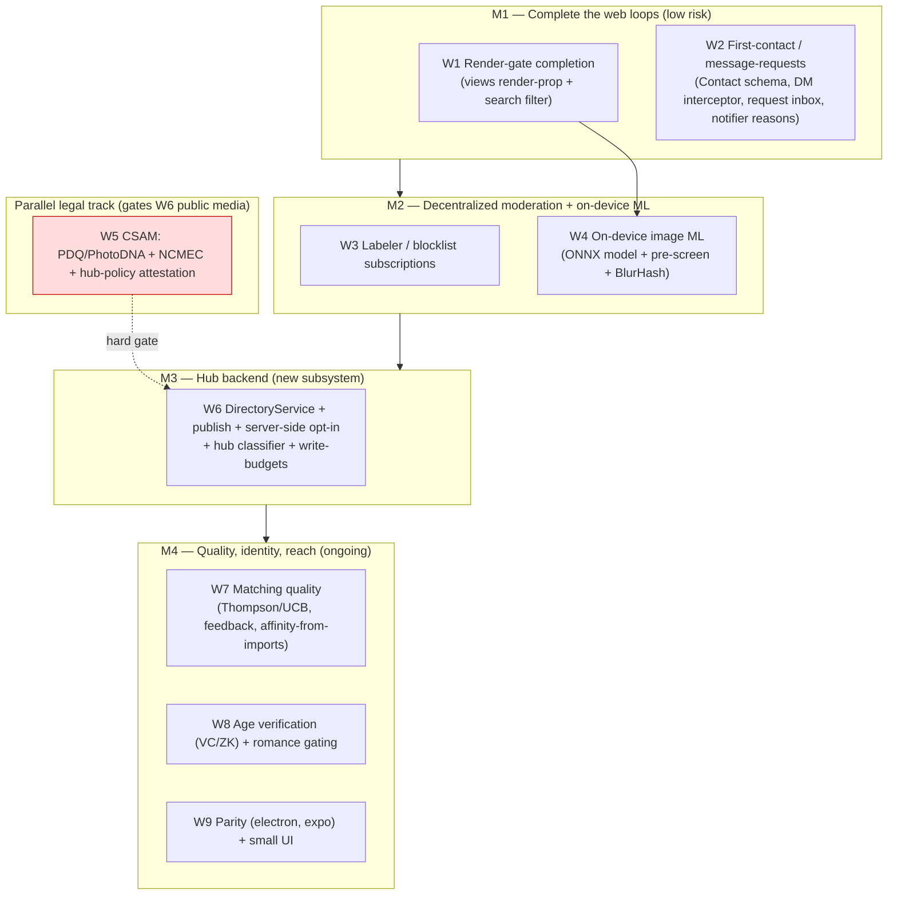
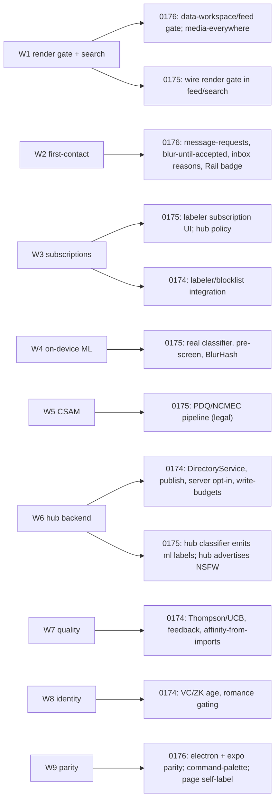

# Discovery And Safety Remaining Work Plan

> **Status:** Exploration (planning)
> **Date:** 2026-06-13
> **Author:** Claude
> **Tags:** planning, roadmap, scoping, discovery, matching, moderation, nsfw,
> safety, first-contact, message-requests, labelers, blocklists, csam, on-device-ml,
> hub-directory, federation, parity, milestones
> **Closes out:** 0174 (People Matching) · 0175 (NSFW Moderation) · 0176 (Discovery+Safety UI)

## Problem Statement

Three explorations shipped the discovery + safety thread to `main`: **0174**
(people matching), **0175** (NSFW moderation), **0176** (UI integration). The
_engines_, the _web UI_, and a _validated e2e harness_ are in. But **39 checklist
items remain unchecked** across the three docs — a mix of genuinely-large
subsystems (a hub directory backend, the CSAM/NCMEC pipeline, mobile/electron
parity) and small clean wiring (notifier reasons, search filtering, a Contact
schema).

The risk now is **drift**: 39 scattered items across three files, with no shared
view of what depends on what, what's a weekend versus a month, and what's blocked
on legal/operational steps rather than code. This document does the scoping the
implementation passes deliberately deferred: it **clusters the remaining work
into coherent workstreams, sizes each against real seams, maps the dependencies,
and sequences everything into a milestone plan** — so the next person (or agent)
can pick up a self-contained chunk and ship it with validation.

It is a _plan_, not new feature research; the design rationale already lives in
0174/0175/0176. The job here is **sequencing and sizing**, grounded in the code
as it exists today.

## Executive Summary

The 39 deferred items collapse into **nine workstreams**. Sorted by the only
axis that matters for sequencing — _value ÷ (effort × risk)_ — they fall into
four tiers:

1. **Low-risk web wiring that completes the loops we started** (high value, days
   each): finish the render gate (data-workspace + feed via a `packages/views`
   render-prop), first-contact / message-requests (a `Contact` schema + a
   DM-open interceptor + the request inbox + two notifier reasons), and
   search-side sensitivity filtering. **These close 0176 and the user-facing half
   of 0175.**
2. **Decentralized-moderation depth** (medium): labeler / signed-blocklist
   subscriptions (the persistence primitive `PolicySubscriptionSchema` already
   exists), and real on-device image ML (the classifier _adapter_ exists; inject
   an ONNX NSFW model + a before-upload pre-screen + BlurHash previews).
3. **The hub backend** (large, the one genuinely new subsystem): a
   `DirectoryService` (people-match index) + consent-gated publish + server-side
   double-opt-in + a hub-side classifier + `hub-policy-offer` NSFW advertisement
   - write-budgets on waves. **This is what makes discovery _federated_ rather
     than friends-of-friends-only.**
4. **Legal, quality, and reach** (gated / ongoing): the **CSAM/PDQ/NCMEC**
   pipeline (a legal prerequisite before any hub hosts public user media —
   sequenced _ahead_ of the hub's public-media features despite being "later"),
   matching-quality tuning (Thompson/UCB, post-intro feedback, derived-affinity-
   from-imports), age verification (VC/ZK), and **mobile (expo) + electron
   parity** (electron has _none_ of the 0174–0176 surfaces today).

**The single most important sequencing call:** the CSAM hash pipeline (W5) is the
hard gate on the hub backend's public-media surface (W6). Everything else is
additive and can land incrementally behind the already-shipped, validated web UI.

**Recommended first move:** Milestone 1 (render-gate completion + message-
requests + search filter) — all low-risk, all behind the existing e2e harness,
and it makes the safety story _complete_ on the web before we invest in the hub.

## Current State In The Repository

Everything below is shipped (PRs #63, #65) and on `main`.

| Layer                            | What exists                                                                                                                                                 | Key files                                                                                                                                                                                                                                   |
| -------------------------------- | ----------------------------------------------------------------------------------------------------------------------------------------------------------- | ------------------------------------------------------------------------------------------------------------------------------------------------------------------------------------------------------------------------------------------- |
| **Matching engine**              | schemas, scoring, PSI, geohash, matchmaker, received-waves loop                                                                                             | `packages/social/src/connect/*`, `apps/web/src/hooks/useConnect.ts`, `apps/web/src/routes/discover.tsx`                                                                                                                                     |
| **Moderation engine**            | decision engine, sensitivity dial, labels, image hash, classifier adapter, labeler-trust                                                                    | `packages/abuse/src/{decision,sensitivity,image-fingerprint,local-image-classifier,labeler-trust,policy-blocks}.ts`                                                                                                                         |
| **Render gate (web)**            | `SensitiveContent` + `ModeratedContent`/`ModeratedNode`/`ModeratedMedia`, **wired in chat**                                                                 | `packages/ui/src/components/SensitiveContent.tsx`, `apps/web/src/components/Moderated*.tsx`, `apps/web/src/comms/ChannelChat.tsx`                                                                                                           |
| **Safety UI (web)**              | `PersonActions`, `useBlockList`, `useSafetyActions`, `ReportDialog`, `MessageActions`, Content & Safety + Safety Center settings, `/welcome`                | `apps/web/src/components/{PersonActions,ReportDialog,MessageActions,ContentSafetySettings,SafetyCenterSettings}.tsx`, `apps/web/src/lib/{block-list,sensitivity-preferences,content-dial,self-label}.ts`, `apps/web/src/routes/welcome.tsx` |
| **Validation**                   | full-app Playwright spec in CI + worktree-render recipe                                                                                                     | `tests/e2e/src/safety-ui.spec.ts`, `.github/workflows/ci.yml` (editor-ux job)                                                                                                                                                               |
| **Persisted moderation schemas** | `ModerationLabel`, `AbuseReport`, **`MessageRequest`**, **`PolicySubscription`** (:447), `PolicyList`, `PublicInteractionPolicy`, `CommunityNote`, `Appeal` | `packages/data/src/schema/schemas/moderation.ts`                                                                                                                                                                                            |

### The seams the remaining work plugs into (verified)

- **Views render path** — `SavedViewRunner` (`packages/react/src/components/SavedViewRunner.tsx`) dispatches to feed/card/table renderers (`SavedViewVisualFeed`, `SavedViewVisualGrid`, `packages/views/src/gallery/GalleryCard.tsx`). **No render-prop / `wrapContent` injection point exists** — that's the seam to add.
- **Comms notifier** — `packages/comms/src/notify/rules.ts` holds a `RULES` array of `(node, prev, ctx) → NotificationReason | null` rules; `NotificationReason` (`notify/types.ts`) is a **closed union** with no `message-request`/`connection-request`. `InboxTray.tsx` `REASON_LABELS`/`FILTERS` mirror it.
- **Hub services** — `packages/hub/src/server.ts` wires `DiscoveryService` (peer-connectivity, _not_ people), `FederationService`, `QueryService`, `ShardRegistry`, crawl, relay. **No `DirectoryService`.** Routes register Hono apps (`app.route('/api/...', createXRoutes(service))`).
- **First contact** — `MessageRequestSchema` (`moderation.ts:554`) is complete (sender/recipient/status/admission/reasonCodes/firstMessageRef/expiresAt); `decideByFirstContact` (`abuse/src/decision.ts`) returns a quarantine decision; `ensureDmChannel` (`comms/src/chat/dm.ts`) is pure. **There is no `Contact`/roster schema** to decide "non-mutual", and **nothing intercepts the DM-open flow.**
- **Subscriptions** — `labeler-trust.ts` evaluates trust from in-memory `LabelerTrustSetting`s; **`PolicySubscriptionSchema` exists** for persistence, but there is **no subscribe UI** and no adapter from a persisted subscription → a runtime trust setting.
- **On-device ML** — `createNsfwImageClassifier` takes an **injected** detector; `@xenova/transformers` is a dep of `@xnetjs/vectors`; **no model is wired**, **no before-upload hook**, and **no `blurhash` dep**.
- **Search** — `packages/query/src/search/moderation.ts` filters only **abuse** labels (`spam/scam/...`); **sensitivity labels are not filtered** server-side.
- **Parity** — `apps/expo/src/screens/` has 4 skeleton screens (Home/Document/Database/Settings); `apps/electron/src/renderer/components/` has **none** of the discover/safety surfaces. Both need ports.

## External Research

The design research is in the prior docs; this plan only needs the _integration_
realities, which the 0175 research already established:

- **CSAM is a legal pipeline, not a feature.** PDQ (Meta, open source via
  ThreatExchange) + PhotoDNA + **NCMEC CyberTipline** registration. The matching
  _logic_ is shipped (`matchKnownImageHash`); sourcing the hash list and the
  reporting integration are operator/legal steps. This is the one item that
  **cannot be fully "done" in code** — and it gates public media hosting.
- **On-device NSFW**: NSFWJS (MobileNet v2 ~2.3 MB) or a Falconsai ViT via
  `@xenova/transformers` ONNX — inject as the detector. **BlurHash** (the
  `blurhash` npm package, ~2 KB) for aesthetic blurred placeholders.
- **Discovery backend** follows the ATProto AppView lesson (0174): the hub is the
  coherent index; keep it opt-in/coarsened/federated.
- See 0174/0175/0176 References sections for the full citations.

## Key Findings

1. **Most of the remainder is low-risk, additive web wiring** — five of nine
   workstreams are "very low / low" risk and close the loops already started.
2. **There is exactly one new subsystem**: the hub `DirectoryService` (W6). Every
   other item plugs into a seam that exists.
3. **The dependency graph is shallow.** Only two hard edges: CSAM (W5) → hub
   public media (W6), and the views render-prop (W1) → data-workspace/feed gate.
   Everything else parallelizes.
4. **A `Contact`/roster schema is the missing primitive** behind first-contact
   gating — without it, "non-mutual" is an expensive conversation-history scan.
   It's ~80 LOC and unblocks the dating-safety core.
5. **The persistence primitives mostly exist** (`MessageRequest`,
   `PolicySubscription`) — the gap is the _adapters and UI_, not the data model.
6. **Electron parity is copy-paste-ish; expo is a real port.** Electron renders
   React like web; expo is React Native with different navigation/primitives.
7. **CSAM is the only true blocker**, and it's operational, not technical — so it
   should be started early on the legal track while code proceeds.

## Options And Tradeoffs

### A. The data-workspace / feed render gate — where does the seam go?

| Option                                            | How                                                                 | Pros                                                        | Cons                                                 | Verdict         |
| ------------------------------------------------- | ------------------------------------------------------------------- | ----------------------------------------------------------- | ---------------------------------------------------- | --------------- |
| **A1. `renderPreview` prop on `SavedViewRunner`** | App passes `(preview, visibility) → ReactNode`; default = unwrapped | Keeps `packages/views` generic; one injection point; opt-in | Threads a prop through the visual stack              | **Recommended** |
| A2. Wrap `` inside `GalleryCard`             | Add moderation directly in views                                    | Local                                                       | **Couples the generic view layer to app moderation** | reject          |
| A3. App post-processes the DOM                    | A wrapper observes rendered media                                   | No views change                                             | Fragile; no label context                            | reject          |

### B. First-contact "non-mutual" determination

| Option                              | Pros                                              | Cons                                   | Verdict             |
| ----------------------------------- | ------------------------------------------------- | -------------------------------------- | ------------------- |
| **B1. Explicit `Contact` schema**   | O(1) lookup; survives sync; models block/mute too | One new schema                         | **Recommended**     |
| B2. Infer from conversation history | No schema                                         | Expensive n-ary join per DM-open; racy | fallback only       |
| B3. Mutual-wave-only (0174)         | Strongest                                         | Too strict for non-dating DMs          | dating intents only |

### C. Search-side sensitivity filtering

Server-side (extend `summarizeSearchModeration` with a `sensitivityThreshold`)
vs. client-side post-filter. **Recommend server-side** (efficient, backwards-
compatible default = show all), with the viewer's dial passed at query time.

### D. Hub directory — build now or after web saturates?

The friends-of-friends matcher already works locally (0174). The hub
`DirectoryService` adds _reach beyond your network_ but is the largest single
effort. **Recommend deferring W6 behind M1/M2** (finish the web safety story and
on-device ML first), and starting the **CSAM legal track in parallel** so W6's
public-media surface isn't blocked when we get there.

### E. CSAM sequencing

Non-negotiable: **PDQ hash-match + NCMEC reporting must precede any hub hosting
public user media.** The hash + matcher are shipped; the remaining work (wire
into hub media ingest, NCMEC integration, `hub-policy-offer` attestation, refuse
federation with non-attesting hubs) is sequenced as a **hard gate on W6**.

## Recommendation

Adopt the **nine-workstream / four-milestone plan** below. Land Milestone 1 next
(low-risk, completes the web safety story, all behind the existing e2e harness),
run the **CSAM legal track in parallel**, and only invest in the hub backend (W6)
once the on-device + web layers are saturated.



### Workstream → which exploration items it closes



### The first-contact flow (W2 — the dating-safety core)

```mermaid
sequenceDiagram
    participant A as Alice (sender)
    participant H as openOrCreateDmChannel
    participant C as Contact lookup
    participant B as Bob (recipient)
    A->>H: DM Bob
    H->>C: are A,B mutual? (Contact schema, or prior mutual wave)
    alt mutual / existing contact
        H-->>A: open DM directly (ensureDmChannel)
    else first contact
        H->>H: create MessageRequest{status:pending, reasonCodes:[first-contact]}
        Note over H: media on the first message → ModeratedMedia unsolicitedMedia=true (blur)
        H-->>B: notifier rule → InboxItem reason 'message-request' (Rail badge)
        B->>H: Accept → upsert DM + Contact; Decline/Block → PersonActions
    end
```

## Example Code

### W1 — views render-prop (the one seam to add)

```tsx
// packages/react/src/components/SavedViewRunner.tsx — opt-in, default unwrapped
export interface SavedViewRunnerProps {
  // ...existing
  /** Wrap each rendered preview/card (e.g. the app's moderation gate). */
  renderPreview?: (preview: SavedViewVisualPreviewModel, node: NodeShape) => ReactNode
}
// apps/web/src/components/DataWorkspaceView.tsx
;<SavedViewRunner
  renderPreview={(preview, node) => <ModeratedNode targetId={node.id}>{preview}</ModeratedNode>}
/>
```

### W2 — Contact schema + DM-open interceptor + notifier reason

```ts
// packages/data/src/schema/schemas/... (new ContactSchema, ~80 LOC)
export const ContactSchema = defineSchema({
  name: 'Contact',
  namespace: 'xnet://xnet.fyi/',
  properties: {
    person: person({ required: true }),
    category: select({ options: [{ id: 'contact' }, { id: 'blocked' }, { id: 'muted' }] as const }),
    since: created(),
    createdBy: createdBy()
  },
  document: undefined
})

// packages/comms/src/notify/types.ts — extend the union
export type NotificationReason = /* ...existing */ 'message-request' | 'connection-request'

// packages/comms/src/notify/rules.ts — additive rule
function messageRequestReason(node, prev, ctx): NotificationReason | null {
  if (asString(node.schemaId) !== MESSAGE_REQUEST_SCHEMA || prev !== null) return null
  return asString(node.recipient) === ctx.me ? 'message-request' : null
}
```

### W3 — persisted subscription → runtime trust setting

```ts
// adapter from the existing PolicySubscriptionSchema / a LabelerSubscription node
export function subscriptionToTrustSetting(sub, scopeId: string): LabelerTrustSetting {
  return {
    scope: sub.scope,
    scopeId,
    labelerDID: sub.labelerDID,
    level: sub.level,
    weight: sub.weight,
    minConfidence: sub.minConfidence,
    allowedLabels: sub.allowedLabels,
    deniedLabels: sub.deniedLabels,
    expiresAt: sub.expiresAt
  }
}
```

### W4 — before-upload pre-screen (inject the model at app startup)

```ts
// apps/web/src/lib/image-prescreen.ts
import { createNsfwImageClassifier } from '@xnetjs/abuse'
const classifier = createNsfwImageClassifier({ detect: nsfwjsDetect /* injected ONNX */ })
export async function prescreen(blob: Blob): Promise<AbuseLabel[]> {
  const gray = await blobToGrayscale(blob)
  const hash = perceptualHash(gray) // dedup + CSAM check
  const known = matchKnownImageHash(hash, KNOWN) // W5 list
  const result = await classifier.classify({
    surface: 'feed',
    body: '',
    metadata: { mediaKind: 'image/png', image: gray }
  })
  return [...(known ? [csamLabel] : []), ...result.labels]
}
```

### W8 — search sensitivity filter (server-side, backwards-compatible)

```ts
// packages/query/src/search/moderation.ts
const SENSITIVITY = new Set(['sexual', 'nudity', 'porn', 'graphic-media'])
// when policy.sensitivityThreshold is set, hide results carrying a present sensitivity label
```

## Risks And Open Questions

- **Scope creep in W6.** The hub directory can balloon. Keep it a thin index +
  pluggable matcher adapter; reuse the (stubbed-then-implemented) federated query
  router rather than a new transport.
- **CSAM is operational, not just code.** NCMEC registration, hash-list access
  (PhotoDNA licensing / PDQ list curation), and the legal obligation are real and
  slow. Start the track early; do **not** ship public hub media until it's done.
- **First-contact false friction.** Over-gating non-dating DMs annoys; gate only
  non-mutual, non-roster, non-prior-wave senders. Mutual waves and existing
  contacts skip the request.
- **Views render-prop blast radius.** `SavedViewRunner` is used widely; the prop
  must be strictly opt-in (default unwrapped) and covered by a render test.
- **Expo parity is a real port, not a copy.** RN navigation, no DOM, different
  gesture/storage primitives. Scope it as its own effort; don't bundle with the
  electron copy-paste.
- **Age verification UX.** Self-declared DOB is weak but private; VC/ZK is the
  durable answer but heavy. Keep self-report for the dial; gate only adult-content
  reveal and any romance intent behind stronger proof.
- **Matching cold-start.** Hub directory has nobody at first; seed hubs around
  existing channels/communities and keep friends-of-friends as the default.
- **Don't recreate the orphan bug.** Any new content surface (feed, data
  workspace) must route media through `ModeratedMedia` — enforce with a checklist
  item and a render test.

## Implementation Checklist

> **Build-out status (this PR).** Milestone 1's two highest-value, lowest-risk
> loops landed and are validated end-to-end (unit + the full-app e2e spec):
> **search-side sensitivity filtering** (W1) and **first-contact / message-
> requests** (W2 — `useDmOpen` interceptor, the `/requests` inbox, notifier
> reasons + Rail badge). The **views render-prop** (data-workspace/feed gate)
> is deliberately _deferred_: it threads through `SavedViewVisualFeed` (865 LOC)
> and the inline grid — large, widely-used shared components — for the lowest-
> value surface (your _own_ imported archive), and can't be validated without
> seeding social content. It's reframed as its own task rather than a risky blind
> change. Everything from here (M2–M4 + the CSAM legal track) remains as planned.

> **Build-out status — Milestone 2 (decentralized moderation).** W3 landed and
> is validated end-to-end (unit + the full-app e2e spec): **signed shared-
> blocklist import** (`blocklist-import.ts` → the viewer block list, signature
> verified before applying), **labeler subscriptions** (`useLabelerSubscriptions`
> persisting `PolicySubscription` nodes; subscribe / enable-disable / remove in
> the Safety center), and the **subscription→runtime-trust adapter**
> (`subscriptionToTrustSetting` in `@xnetjs/abuse`, exposed as `trustSettings`).
> W4's **pre-screen pipeline** (`prescreenImage` / `prescreenImageLabels`:
> classify → suggest self-label → warn-if-explicit) landed, model-agnostic over
> the existing injected-detector seam. _Deferred, with reasons inline below:_
> consuming `trustSettings` inside `decideAbuse` at the render gate (the per-
> subject label-distribution wiring) and its "filtered by labeler X" attribution;
> the actual ONNX model + BlurHash dep + upload-path wiring (can't be validated
> in this environment without shipping blind or an unvalidatable lockfile change).

### Milestone 1 — Complete the web loops (low risk, behind existing e2e)

**W1 — render gate + search filter**

- [ ] Add an opt-in `renderPreview`/`wrapContent` prop to `SavedViewRunner` (default unwrapped) and thread to feed/grid/gallery renderers. _(deferred — high-risk shared component, low-value surface, see status note)_
- [ ] Wrap data-workspace + feed previews in `ModeratedNode` from `DataWorkspaceView.tsx` (and content-feed views). _(deferred — depends on the render-prop above)_
- [x] Add `sensitivityThreshold` filtering to `summarizeSearchModeration`; pass the viewer dial at query time.
- [ ] Render test: a `porn`-labelled gallery item is blurred in the data workspace for a default-prefs viewer.

**W2 — first-contact / message-requests**

- [ ] Add a `Contact` schema (contact/blocked/muted) + register it; back `useBlockList` block/mute with synced `Contact` nodes (keep local as fast path).
- [ ] `openOrCreateDmChannel(sender, recipient)`: mutual/contact → open DM; else create a `MessageRequest` (`firstMessageRef`/`firstMessagePreview`) and don't open the chat.
- [x] Intercept the DM-open call sites (`PersonView`, `PersonHovercard`, `useWave` reveal) to route through it.
- [ ] Blur unsolicited media until accepted (`ModeratedMedia unsolicitedMedia` already supports it).
- [x] Add `message-request` + `connection-request` to `NotificationReason`; add notifier rules; add `REASON_LABELS`/`FILTERS` + a Rail inbox badge.
- [x] A request-inbox surface: list pending `MessageRequest`s with Accept/Decline/Block.
- [ ] Extend `tests/e2e/src/safety-ui.spec.ts`: two identities, first DM lands in requests with media blurred; accept opens the DM; mutual wave skips the request.

### Milestone 2 — Decentralized moderation + on-device ML

**W3 — subscriptions**

- [x] Subscribe UI in Settings → Safety: add a labeler (DID + trust level/weight) → persist via `PolicySubscriptionSchema` (`useLabelerSubscriptions`; subscribe/enable-disable/remove).
- [x] Import a signed `PolicyBlockList` (verify with `verifySignedPolicyBlockList`); apply its entries.
- [x] Adapter: persisted subscriptions → runtime `LabelerTrustSetting`s (`subscriptionToTrustSetting`/`subscriptionsToTrustSettings` in `@xnetjs/abuse`, exposed as `trustSettings`).
  - [ ] Consume `trustSettings` in `decideAbuse` at the render gate (weight per-subject `ModerationLabel`s from subscribed labelers) — the label-distribution wiring, deferred.
- [x] Surface subscribed labelers in the Safety Center (list + trust level + enable/remove).
  - [ ] "Filtered by labeler X" attribution on individual filtered content — pairs with the gate-consumption above.

**W4 — on-device image ML**

- [x] Pre-screen pipeline (`prescreenImage`/`prescreenImageLabels` in `@xnetjs/abuse`): classify → suggest a self-label → warn-if-explicit, model-agnostic over the injected `createNsfwImageClassifier` detector.
  - [ ] Add an ONNX NSFW model (NSFWJS/Falconsai via `@xenova/transformers`) as the injected detector — deferred: a multi-MB model fetched/inferred in-browser can't be validated in this environment without shipping blind.
  - [ ] Wire the pre-screen into concrete image upload paths (chat/editor) once a media upload pipeline exists.
- [ ] Add the `blurhash` dep; compute/store a BlurHash on upload; use it for blurred media placeholders in `SensitiveContent` — deferred: new runtime dep needs a lockfile change this worktree can't validate (no `node_modules`).
- [ ] Viewer-side filter for unlabeled incoming media (classify on receive) — pairs with the injected model above.

### Milestone 3 — Hub backend (new subsystem)

**W6 — directory + publish + server-side opt-in + classifier**

- [ ] `DirectoryService` + `/api/directory` routes (Hono) indexing coarsened `ConnectableProfile` (tag buckets, vector buckets, geohash, intent) for `hub-indexed` profiles only.
- [ ] Consent-gated publish pipeline (client → hub directory); cross-hub merge via the federated router; `reach` controls scope.
- [ ] Server-side double-opt-in: store wave commitments, reveal only on mutual; rate-limit/write-budget waves via `public-write-budget`.
- [ ] Hub-side classifier in the cascade for `hub-indexed`/crawl surfaces; emit `ModerationLabel` `sourceType: 'ml'`.
- [ ] Hub advertises NSFW moderation + (W5) NCMEC attestation in `hub-policy-offer`.

### Milestone 4 — Quality, identity, reach

**W7 — matching quality**

- [ ] Wire `deriveAffinity` to actual owned-graph signal (social imports + tags + channels) with a `@xnetjs/vectors` embedder; user review step.
- [ ] Thompson sampling / UCB exploration; tune MMR λ for weak-tie bridging.
- [ ] Post-intro feedback loop feeding ranking quality.

**W8 — identity / age**

- [ ] Optional VC attestations (phone/ID/age); ZK age proof gating adult-content reveal + any `romance` intent.

**W9 — parity + small UI**

- [ ] Port the dial, `PersonActions`, discover, onboarding, render gate to **electron** (`apps/electron/src/renderer/`).
- [ ] Port the core safety dial + discover to **expo** (React Native; its own effort).
- [ ] Contextual command-palette safety actions (per-focused person/post); page-editor self-label; appeals UX on `appeals.ts`; a "why was this filtered?" explainer.

### Parallel legal track — W5 (CSAM) — **gates W6 public media**

- [ ] Add an image perceptual hash (PDQ) alongside the shipped aHash/dHash/pHash.
- [ ] Hub: PDQ/PhotoDNA match on all hosted/relayed/indexed media → block + preserve + **NCMEC CyberTipline** report (never merely "hide").
- [ ] On-device PDQ check before send.
- [ ] NCMEC registration (operational); `hub-policy-offer` attests it; refuse media federation with non-attesting hubs.

## Validation Checklist

- [ ] **M1:** the e2e spec proves a first DM from a non-mutual sender lands in requests with media blurred, accept opens the DM, and a mutual wave skips it; a labelled gallery item is blurred in the data workspace.
- [ ] **M2:** a subscribed labeler's labels apply at the chosen trust weight (and unsubscribing removes them); the on-device pre-screen flags an explicit test image **without the image leaving the browser** (no network request with image bytes).
- [ ] **M3:** a cross-hub directory query returns candidates from a second hub and respects `reach`; the hub index stores only coarsened buckets (audit shows no raw vectors); a write-budget-throttled actor cannot mass-wave.
- [ ] **W5:** a known-bad PDQ test hash (synthetic/benign stand-in) is matched, blocked **before hosting**, and routed to the report path — never merely hidden.
- [ ] Per milestone: `pnpm test`, `pnpm typecheck`, `pnpm lint`, `fallow audit`, and the e2e suite green; new content surfaces verified to route media through `ModeratedMedia`.
- [ ] On completion, check off the corresponding items in 0174/0175/0176 and flip their filename checkboxes to `[x]`.

## References

### xNet code seams (verified)

- Views render path: `packages/react/src/components/SavedViewRunner.tsx`, `packages/views/src/gallery/GalleryCard.tsx`
- Notifier: `packages/comms/src/notify/{rules,types,inbox,notifier}.ts`, `apps/web/src/comms/InboxTray.tsx`
- Hub: `packages/hub/src/server.ts`, `packages/hub/src/services/*`, `packages/hub/src/routes/*`, `packages/query/src/federation/router.ts`
- First contact: `packages/data/src/schema/schemas/moderation.ts` (`MessageRequestSchema:554`, `PolicySubscriptionSchema:447`), `packages/abuse/src/decision.ts` (`decideByFirstContact`), `packages/comms/src/chat/dm.ts`
- Subscriptions/labelers: `packages/abuse/src/{labeler-trust,policy-blocks}.ts`
- On-device ML: `packages/abuse/src/{local-image-classifier,image-fingerprint}.ts`, `@xenova/transformers` (via `@xnetjs/vectors`)
- Search: `packages/query/src/search/moderation.ts`
- Parity: `apps/expo/src/screens/*`, `apps/electron/src/renderer/*`
- Validation: `tests/e2e/src/safety-ui.spec.ts`, `.github/workflows/ci.yml`

### Prior explorations (design rationale)

- 0174 (people matching), 0175 (NSFW moderation), 0176 (discovery + safety UI) — this plan closes their open checklist items.

### External (integration realities)

- [PDQ / ThreatExchange (Meta)](https://github.com/facebook/ThreatExchange/tree/main/pdq) · [Microsoft PhotoDNA](https://www.microsoft.com/en-us/photodna) · [NCMEC CyberTipline](https://report.cybertip.org/)
- [NSFWJS](https://github.com/infinitered/nsfwjs) · [Transformers.js](https://github.com/xenova/transformers.js) · [blurhash](https://github.com/woltapp/blurhash)
- [Bluesky stackable moderation / Ozone](https://docs.bsky.app/blog/blueskys-moderation-architecture)
