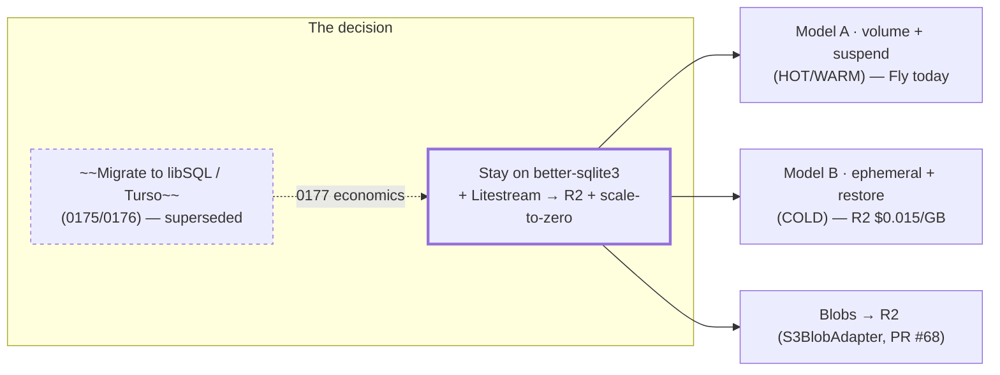
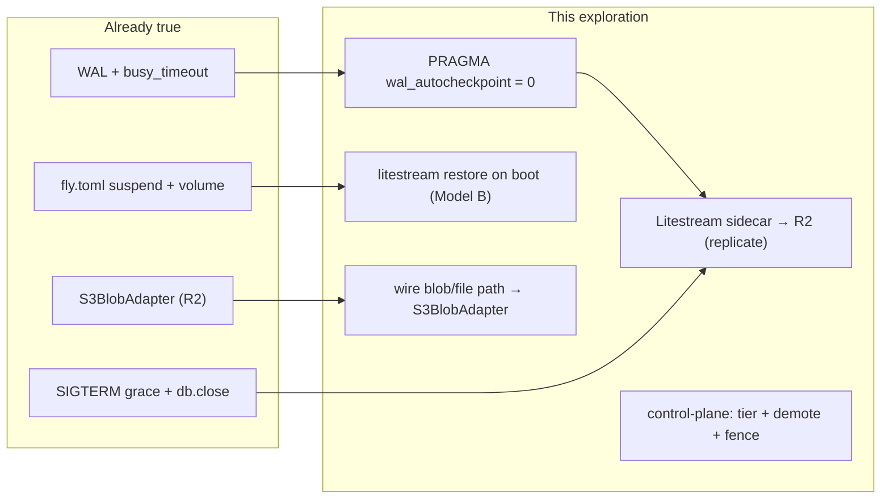
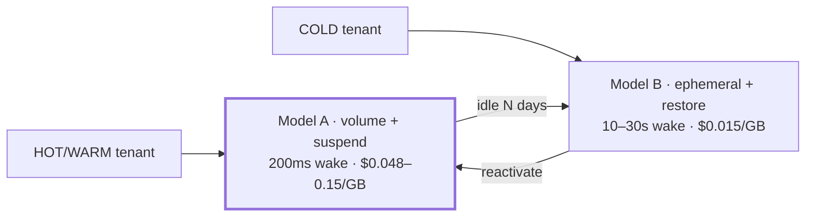
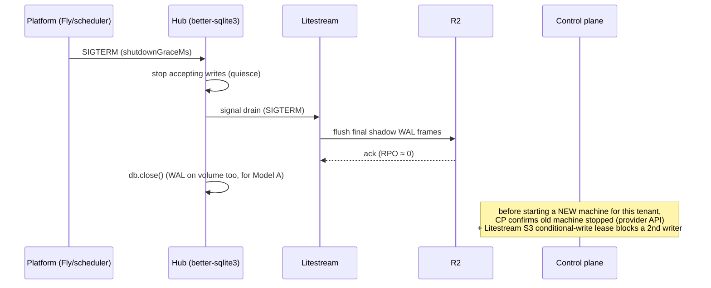

# Cost-Efficient SQLite Hosting (No libSQL Migration)

> **Status:** Exploration
> **Date:** 2026-06-13
> **Author:** Claude
> **Tags:** sqlite, better-sqlite3, litestream, r2, scale-to-zero, fly, hetzner, fargate,
> cloud-run, kubernetes, wal, backup, cold-storage, managed-cloud, decision, supersedes-libsql

## Problem Statement

Explorations [0175](./0175_[_]_MANAGED_HUB_FLEET_DEPLOYMENT_AND_AI_GATEWAY.md) /
[0176](./0176_[_]_TESTABLE_CLOUD_INTEGRATIONS_WITHOUT_API_KEYS.md) recommended migrating the hub's
data layer from `better-sqlite3` to **libSQL / Turso** to get scale-to-zero. Then
[0177](./0177_[_]_DATA_BACKEND_TIERING_AND_COLD_STORAGE_ECONOMICS.md) priced the field and found
Turso storage costs **$0.45–0.75/GB-month** — ruinous for large/cold tenants — and, more importantly,
that the **cold pattern it recommends (a SQLite snapshot in R2, restored on access) works with plain
`better-sqlite3` and Litestream, with no libSQL at all.**

That collapses the original justification. The scale-to-zero goal that motivated libSQL is better
served — cheaper, lower-risk, no vendor premium — by **staying on SQLite** and replicating it to cheap
object storage. So this exploration makes the call and designs the hosting:

> **Decide to stay on `better-sqlite3` (no libSQL migration), and define the most cost-efficient,
> effective way to host a fleet of mostly-idle per-tenant SQLite hubs** — durable, scale-to-zero,
> low-data-loss, on a reselling-permitted substrate. This is intended to be the *final* data-layer
> decision, superseding the libSQL parts of 0175/0176.

## Executive Summary

**Keep SQLite. Add Litestream. Tier by activity. Done.** The hub already does almost all of this — the
remaining work is small and additive, not a rewrite.

1. **No libSQL migration.** Keep the 2,313-line `better-sqlite3` implementation
   ([`packages/hub/src/storage/sqlite.ts`](../../packages/hub/src/storage/sqlite.ts)) exactly as is.
   It already runs in **WAL mode** with `busy_timeout=5000` — the prerequisites for Litestream. Leave
   the `case 'libsql'` seam *unbuilt* (a cheap future option), don't make it the path.

2. **Litestream is the durability + cold-storage engine.** Run [Litestream](https://litestream.io)
   (by Ben Johnson @ Fly.io; v0.5, actively maintained) as a sidecar that streams the SQLite WAL to
   **Cloudflare R2** (~1 s RPO, near-zero on graceful shutdown). This gives continuous backup *and* the
   ability to **restore a cold tenant's DB on demand** — so an idle tenant's data lives in R2 at
   **$0.015/GB-month**, not on a premium DB at $0.45–0.75.

3. **Two hosting models, mapped to activity tiers** (the realization of 0177's hot/warm/cold ladder):
   - **Model A — durable volume + suspend** (HOT/WARM). The SQLite file lives on a persistent per-tenant
     volume; the machine **suspends** when idle and **resumes with the file intact (no restore)**.
     This is *exactly what the demo hub does on Fly today* — [`fly.toml`](../../packages/hub/fly.toml)
     already sets `auto_stop_machines = "suspend"`, `min_machines_running = 0`, and a `/data` volume.
     Wake ≈ 200–500 ms (Fly suspend). Volume cost $0.048–0.15/GB. Litestream = DR backup only.
   - **Model B — ephemeral + Litestream restore** (COLD). No volume; the DB exists *only* in R2;
     `litestream restore` runs on boot before the app opens the file. Cheapest at rest ($0.015/GB);
     wake ≈ 5–30 s (restore). For the long tail of cold/free tenants.
   - **Hybrid by tenant activity**: active → Model A; after N days idle → demote to Model B (destroy the
     volume, keep the R2 backup); reactivate → restore.

4. **Blobs already go to R2.** Bulk bytes are already pointer-referenced in the DB
   (`backups.blob_path`, `file_meta.file_path`); route them through the `S3BlobAdapter` shipped in PR
   #68 ([`packages/cloud-storage`](../../packages/cloud-storage/)) to R2, lifecycle to IA/Glacier when
   cold (0177).

5. **Substrate (reselling-permitted, volume-capable, scale-to-zero):** **Fly** (used today; fastest
   wake; ToS ambiguous but community-accepted for "running your product"), **Hetzner** (cheapest
   volumes ~$0.048/GB, unambiguous ToS — the at-scale cost optimizer), with **Cloud Run** as the
   ephemeral Model-B option and **Fargate+EBS / K8s+PVC+KEDA** for AWS/enterprise. This refines 0175's
   "Cloud Run + Turso" to "**Fly/Hetzner volume-suspend + SQLite/Litestream**."

6. **Operational must-dos:** set `PRAGMA wal_autocheckpoint = 0` when Litestream runs (else it races
   SQLite's autocheckpoint and silently misses frames); drain Litestream on SIGTERM *before*
   `db.close()`; **fence single-writer** (control-plane verifies the old machine stopped before
   starting a new one, plus Litestream's S3 conditional-write lease); **pin Litestream v0.5.3** (v0.5.6/
   v0.5.7 have a silent-replication bug, [#1083](https://github.com/benbjohnson/litestream/issues/1083)).

Cost: a 1,000-tenant fleet at 1 GB/tenant (100 active on volumes + 900 cold in R2) ≈ **$28.50/month in
storage**, with near-zero compute when suspended. The cold-tenant floor is **$0.015/GB-month**.



## Current State In The Repository

The hub is **already a scale-to-zero SQLite deployment** — the demo hub on Fly runs this design today.
The gap to a managed fleet is small and additive.

### Already in place (the prerequisites are met)

- **WAL mode + busy_timeout** — [`sqlite.ts:636`](../../packages/hub/src/storage/sqlite.ts):
  `db.pragma('journal_mode = WAL')`, `db.pragma('busy_timeout = 5000')`. These are *exactly* what
  Litestream requires.
- **Graceful shutdown** — [`lifecycle/shutdown.ts:32`](../../packages/hub/src/lifecycle/shutdown.ts)
  registers `SIGTERM`/`SIGINT` handlers; [`config.ts:131`](../../packages/hub/src/config.ts) computes a
  `shutdownGraceMs` (4 s on Fly, 8 s default); the storage layer calls `db.close()` on stop
  (`sqlite.ts:1920`). This is the hook to drain Litestream before exit (near-zero RPO).
- **Scale-to-zero already configured** — [`fly.toml`](../../packages/hub/fly.toml):
  `auto_stop_machines = "suspend"`, `auto_start_machines = true`, `min_machines_running = 0`, and a
  `[mounts]` volume `xnet_hub_data → /data`. **This is Model A, live.**
- **Platform detection** — [`config.ts`](../../packages/hub/src/config.ts) already branches on
  `fly`/`railway`/`cloud-run`/`fargate`/`local` (added in PR #66/#68).
- **The DB already separates metadata from bulk bytes** — `backups.blob_path`, `file_meta.file_path`
  point at files; only metadata + CRDT state + FTS live in the DB (0177).
- **R2 blob adapter shipped** — [`packages/cloud-storage`](../../packages/cloud-storage/)'s
  `S3BlobAdapter` (PR #68) is the R2 destination for those bytes.
- **The storage seam is clean** — [`storage/index.ts`](../../packages/hub/src/storage/index.ts)
  `createStorage(type, dataDir)` switches `sqlite`/`memory`; **no `libsql` case** (good — leave it that
  way unless a concrete need appears).

### What's missing (the additive work)



## External Research

(Focused Litestream/hosting survey, June 2026; full citations in [References](#references).)

### Litestream mechanics, risks, and status

- **Continuous WAL → object storage**, default **1 s sync interval** → worst-case **~1 s RPO** on a
  hard kill; **near-zero on graceful SIGTERM** (Litestream flushes its shadow WAL on `Close()`). Lower
  `sync-interval` for tighter RPO at more R2 PUTs.
- **Restore-on-boot**: `litestream restore -if-db-not-exists -if-replica-exists /data/hub.db`. v0.5's
  **LTX format + hierarchical compaction** means restore pulls "a dozen or so files," not every WAL
  frame: ~**1–3 s (100 MB), 5–15 s (500 MB), 10–30 s (1 GB)**.
- **Single-writer rule**: two writers on one replica path diverge into separate "generations" and
  cannot be merged. Fence via **control-plane serialization** (don't start a new instance until the old
  one is confirmed stopped) **+ Litestream v0.5's S3 conditional-write lease** (works on S3/R2/Tigris).
- **Status**: maintained by **Ben Johnson at Fly.io**; **v0.5.x** (v0.5.0 Oct 2025) added LTX, PITR,
  the conditional-write lease, and a VFS read-replica proof-of-concept. **Pin v0.5.3** — v0.5.6/v0.5.7
  carry a **silent replication-skip bug** ([#1083](https://github.com/benbjohnson/litestream/issues/1083)).
- **better-sqlite3 + Litestream is the canonical Node setup.** Required pragmas:
  `journal_mode=WAL` (✓ have), `busy_timeout=5000` (✓ have), **`wal_autocheckpoint=0`** (✗ must add —
  otherwise SQLite's autocheckpoint races Litestream and frames are missed).

### The two scale-to-zero models

| Dimension | **Model A** — volume + suspend | **Model B** — ephemeral + restore |
|---|---|---|
| DB at rest | on a durable per-tenant volume | only in R2 |
| Storage $/GB-mo | Fly $0.15 · EBS gp3 $0.08 · Hetzner ~$0.048 · GKE pd $0.10 | **R2 $0.015** (zero egress) |
| Wake latency | **200–500 ms** (Fly suspend) · 2–5 s (Fly stop) · 15–30 s (Fargate) · 30–90 s (K8s) · 10–30 s (Hetzner boot) | 5–30 s (restore) |
| Hard-kill loss | none (WAL on volume, replayed on open) | ≤ 1 s (Litestream) |
| Litestream role | DR backup only | the wake path |
| Best for | active tenants, lowest latency | cold/free long tail, cheapest at rest |

### Substrate × reselling

| Substrate | Volume + s2z | Reselling ToS | Volume $/GB | Notes |
|---|---|---|---|---|
| **Fly Machines** | suspend + Fly Volume | "benefit of third party" clause — **community-accepted for running your product** | $0.15 | used today; sub-second suspend; RAM ≤ 2 GB for suspend |
| **Hetzner** VM + block volume | power-off + volume | **unambiguous, allowed** | **~$0.048** | cheapest; ~10–30 s boot; more ops |
| **AWS Fargate + EBS** | task stop + EBS | **allowed (ISV/SaaS)** | $0.08 | gotcha: *service*-managed tasks **delete EBS on stop** — use standalone tasks + volume lifecycle |
| **GKE/EKS + PVC + KEDA** | scale-to-zero | **allowed** | $0.08–0.10 | RWO PVC reattach latency; most ops |
| **Cloud Run** | **no durable volume** → Model B only | **allowed** | n/a (R2) | ephemeral; always restore-on-cold-start |

### Litestream alternatives (and why plain Litestream wins here)

- **LiteFS** — HA via FUSE + leader election; **explicitly not for scale-to-zero** (needs a node always
  up; LiteFS Cloud shut down Oct 2024). Wrong tool for a sleeping fleet.
- **Marmot / cr-sqlite** — multi-writer eventual consistency / CRDTs; unnecessary for one-writer-per-
  tenant and add write overhead.
- **rqlite / dqlite** — distributed Raft SQLite; HTTP/C-only, no `better-sqlite3`, network per write.
  Overkill.
- **`VACUUM INTO` → R2** — a clean, compacted point-in-time snapshot; a good *complement* (hourly cold
  archive) to Litestream's continuous stream, or a low-complexity standalone backup if a 1 h RPO is fine.

### Cost model (1,000 tenants, 1 GB each, mixed activity)

- 100 active (Fly volume): 100 × $0.15 = **$15/mo** + ~$0 compute when suspended
- 900 cold (R2 only): 900 × $0.015 = **$13.50/mo**
- **≈ $28.50/mo total storage** for 1,000 tenants. Cold-tenant floor: **$0.015/GB-mo**.

## Key Findings

1. **The migration was solving the wrong problem.** Scale-to-zero needs *the DB to survive sleep
   cheaply*, not *a different database*. better-sqlite3 + Litestream + R2 delivers it at $0.015/GB with
   zero rewrite risk; libSQL added a vendor, a per-GB premium, and a 2,313-line async port.
2. **The hub is already a Model-A deployment.** WAL, busy_timeout, SIGTERM grace, and a Fly suspend +
   volume config are all present. We're hardening + tiering an existing design, not building a new one.
3. **Litestream is the one mechanism for both backup and cold storage.** It gives DR for hot tenants
   *and* the restore-on-access path for cold ones — the same tool spans 0177's tiers.
4. **Hybrid by activity is the cost win.** Hot on a volume (fast wake), cold demoted to R2-only (10×
   cheaper at rest). Demotion is a control-plane job, not a data-model change.
5. **Substrate shifts from "Cloud Run + Turso" to "Fly/Hetzner volume-suspend + SQLite/Litestream."**
   Fly now (already running, fastest wake), Hetzner for at-scale cost, Cloud Run as the ephemeral
   Model-B fallback. All reselling-workable; Hetzner is the cleanest.
6. **Three operational invariants are non-negotiable:** `wal_autocheckpoint=0`, drain-Litestream-before-
   close, and single-writer fencing (control-plane + conditional-write lease). Plus: pin v0.5.3.
7. **No new Node deps.** Litestream is a Go sidecar binary — lighter than the `libsql`/`@libsql/client`
   native modules the migration would have added.

## Options And Tradeoffs

### A. Hosting model



- **Model A only** — simplest, fastest wake; but every tenant pays volume rates at rest (10× R2). Bad
  for a large cold long tail.
- **Model B only** — cheapest at rest; but every cold start pays restore latency, and hot tenants get
  slower wakes. Forced on Cloud Run (no volume).
- **Hybrid (recommended)** — A for active, B for cold. Best cost/latency; needs a demotion/reactivation
  job + fencing.

### B. Substrate

- **Fly (now)** — already running the exact design; sub-second suspend; ToS "benefit of third party" is
  the only smudge (community-accepted for products). *Use today; keep.*
- **Hetzner (at scale)** — cheapest volumes, clean ToS; more ops (VM/volume lifecycle, bin-packing).
  *The cost optimizer.*
- **Cloud Run** — ephemeral → Model B always; great if cold-restore latency is acceptable and you want
  zero per-tenant infra at rest.
- **Fargate+EBS / K8s** — for AWS-native/enterprise; watch the EBS-delete-on-service-stop gotcha and PVC
  reattach latency.

### C. Replication tool

- **Litestream (recommended)** — purpose-built for single-writer SQLite → object storage backup +
  restore. *The right tool.*
- **+ `VACUUM INTO` hourly** — optional clean compacted cold archive alongside Litestream.
- **LiteFS / Marmot / cr-sqlite / rqlite** — for HA / multi-writer / distributed; not our shape.

## Recommendation

**Stay on `better-sqlite3`. Adopt Litestream → R2. Run Model A (volume + suspend) for active tenants
and Model B (ephemeral + restore) for cold ones, hybrid by activity. Host on Fly now, Hetzner at
scale, Cloud Run as the ephemeral option.** Mark the libSQL migration in 0175/0176 as superseded; keep
the `case 'libsql'` seam as a dormant future option.

### Per-tenant lifecycle

```mermaid
stateDiagram-v2
  [*] --> Provisioning
  Provisioning: provision machine + volume; litestream restore -if-replica-exists
  Provisioning --> Active
  Active: serving; Litestream → R2 every ~1s
  Active --> Suspended: idle (Fly auto-suspend)
  Suspended: machine suspended; volume intact; resume ~200ms
  Suspended --> Active: request
  Active --> Cold: idle N days (control-plane demote)
  Suspended --> Cold: idle N days
  Cold: volume+machine destroyed; DB lives only in R2 ($0.015/GB)
  Cold --> Reactivating: tenant returns
  Reactivating: provision machine; litestream restore (10–30s); fence old writer
  Reactivating --> Active
  Cold --> [*]: churn (lifecycle → R2-IA/Glacier)
```

### Graceful stop (near-zero RPO) + single-writer fence



### Concrete decisions

1. **Add `PRAGMA wal_autocheckpoint = 0`** in `sqlite.ts` *when running under Litestream* (gate on an
   env flag so self-host without Litestream keeps default autocheckpoint).
2. **Ship Litestream as a sidecar** in the hub image; config replicates `/data/hub.db` → `r2://…/t/<id>/db`.
   Pin **v0.5.3**.
3. **Restore-on-boot** entrypoint for Model B: `litestream restore -if-db-not-exists -if-replica-exists`
   before the hub opens the DB.
4. **Drain Litestream before `db.close()`** in the shutdown handler (sequence: quiesce writes → SIGTERM
   Litestream → wait exit → close).
5. **Wire the blob/file path to `@xnetjs/cloud-storage`** (R2), keeping the pointer schema.
6. **Control-plane tiering + fence**: track per-tenant activity; demote idle→cold (snapshot final, destroy
   volume); on reactivate, verify old machine stopped (provider API) before starting the new one.
7. **Keep self-host trivial**: with no Litestream env + local volume, the hub runs exactly as today.

## Example Code

### 1. Pragmas — add `wal_autocheckpoint=0` only under Litestream

```typescript
// packages/hub/src/storage/sqlite.ts (near line 636)
db.pragma('journal_mode = WAL')
db.pragma('synchronous = NORMAL')
db.pragma('busy_timeout = 5000')
// When Litestream owns checkpointing, disable SQLite autocheckpoint so they don't race.
if (process.env.LITESTREAM === '1') db.pragma('wal_autocheckpoint = 0')
```

### 2. Litestream config (pinned v0.5.3) → R2

```yaml
# /etc/litestream.yml  — one DB per tenant container
dbs:
  - path: /data/hub.db
    replicas:
      - type: s3
        endpoint: ${R2_ENDPOINT}        # https://<acct>.r2.cloudflarestorage.com
        bucket: xnet-db-snapshots
        path: t/${TENANT_ID}/db
        access-key-id: ${R2_ACCESS_KEY_ID}
        secret-access-key: ${R2_SECRET_ACCESS_KEY}
        sync-interval: 1s               # ~1s RPO; lower for tighter at more PUTs
```

### 3. Entrypoint — restore-on-boot (Model B) then run hub under Litestream

```sh
#!/bin/sh
# Model B (ephemeral): pull the latest DB from R2 before the hub opens it. Idempotent.
litestream restore -if-db-not-exists -if-replica-exists /data/hub.db
# Replicate + run the hub as a supervised child; Litestream drains on SIGTERM.
exec litestream replicate -exec "node packages/hub/dist/cli.js --port $PORT --data /data"
```

### 4. Shutdown drain (sequence Litestream before close)

```typescript
// lifecycle/shutdown.ts — extend the existing SIGTERM handler
async function shutdown(signal: string) {
  stopAcceptingWrites()                 // quiesce
  if (litestream) await drainLitestream(litestream) // SIGTERM child, await flush → RPO ≈ 0
  storage.close()                       // db.close()
}
```

### 5. Control-plane: demote idle → cold, and fence reactivation

```typescript
// apps/cloud — activity-driven tiering + single-writer fence
async function demoteIfCold(t: Tenant) {
  if (daysIdle(t) < COLD_AFTER_DAYS) return
  await waitForFinalSync(t)             // confirm Litestream's last R2 upload
  await provisioner.destroy(t.substrateRef) // drop volume+machine; DB remains in R2 ($0.015/GB)
  await tenants.setTier(t.id, 'cold')
}
async function reactivate(t: Tenant) {
  await assertStopped(t.substrateRef)   // provider API: old machine is gone (fence #1)
  // Litestream S3 conditional-write lease is fence #2 (blocks a 2nd concurrent writer).
  return provisioner.provision({ ...spec(t), restoreFromR2: `t/${t.id}/db` })
}
```

## Risks And Open Questions

- **~1 s data-loss window on a hard kill.** Acceptable for most hub data (CRDT updates re-sync from
  clients), but name it. *Mitigation:* graceful SIGTERM drain (RPO ≈ 0) for all planned stops; lower
  `sync-interval` for write-sensitive tiers. Open question: is any hub table intolerant of 1 s loss?
- **Split-brain on reactivation.** A stale machine writing while a new one starts diverges generations.
  *Mitigation:* control-plane fence (confirm old stopped) **+** Litestream conditional-write lease.
  Open question: is the provider "is it stopped?" signal authoritative enough, or do we always rely on
  the lease?
- **Litestream version risk.** The v0.5.6/0.5.7 silent-skip bug means **pin v0.5.3** and add a
  replication-freshness check (alert if R2 last-modified lags writes). Litestream is one maintainer
  (Ben Johnson) — a bus-factor to note; `VACUUM INTO → R2` is the low-tech fallback.
- **`wal_autocheckpoint=0` without Litestream would grow the WAL unbounded.** *Mitigation:* gate it on
  the `LITESTREAM` env flag; self-host keeps default autocheckpoint.
- **Cold wake latency is user-visible** (10–30 s restore). *Mitigation:* pooled/free tiers accept a
  "waking up…" state; pre-warm on auth ping; paid tiers stay HOT (Model A, never cold).
- **Substrate ToS ambiguity (Fly/Railway).** "benefit of third party" is unresolved. *Mitigation:* keep
  Hetzner (unambiguous) as the at-scale substrate; confirm with Fly for the managed product; self-host
  is always the escape.
- **Fargate EBS deletes on service-stop; K8s RWO PVC reattach latency.** *Mitigation:* standalone
  Fargate tasks + volume lifecycle, or prefer Fly/Hetzner for Model A.
- **FTS index size is still hot-DB cost.** A tenant with a huge searchable corpus has a large *hot* DB
  on a volume. Open question (from 0177): cap/window the FTS index or archive cold search to
  DuckDB/Parquet?
- **The `case 'libsql'` seam stays dormant.** If a real need (managed multi-region, hosted-DB-zero-ops)
  appears, the `libsql` better-sqlite3-compatible driver makes it a cheap future add — but we are
  *not* building or maintaining it now.

## Implementation Checklist

**Litestream durability (works on Fly today):**
- [ ] Add Litestream (pinned **v0.5.3**) to the hub Docker image; `litestream.yml` replicating
      `/data/hub.db` → R2 (`r2://xnet-db-snapshots/t/<id>/db`).
- [ ] Gate `PRAGMA wal_autocheckpoint = 0` behind a `LITESTREAM` env flag in
      [`sqlite.ts`](../../packages/hub/src/storage/sqlite.ts).
- [ ] Sequence shutdown: quiesce writes → drain Litestream (SIGTERM child, await flush) → `db.close()`,
      in [`lifecycle/shutdown.ts`](../../packages/hub/src/lifecycle/shutdown.ts).
- [ ] Add a replication-freshness alert (R2 last-modified vs last write) to catch silent skips.

**Cold tier (Model B):**
- [ ] Entrypoint `litestream restore -if-db-not-exists -if-replica-exists` before the hub opens the DB.
- [ ] Control-plane **demotion** job: idle ≥ N days → final-sync → destroy volume+machine → tier `cold`.
- [ ] Control-plane **reactivation**: assert old machine stopped (provider API) → provision +
      restore-from-R2; rely on Litestream conditional-write lease as the second fence.

**Bytes + blobs:**
- [ ] Wire the hub blob/file path to `@xnetjs/cloud-storage` `S3BlobAdapter` (R2), keep
      `blob_path`/`file_path` pointers; lifecycle to R2-IA/Glacier for cold (0177).

**Substrate:**
- [ ] Keep Fly Model A for now; size machines ≤ 512 MB RAM to stay suspend-eligible (≤ 2 GB).
- [ ] Add a **Hetzner** Model-A provisioner adapter (cheapest volumes) for at-scale cost; **Cloud Run**
      Model-B adapter for the ephemeral path. (Provisioner interface from PR #66.)

**Docs:**
- [ ] Mark the libSQL migration items in 0175/0176 **superseded by this exploration**; keep `case
      'libsql'` documented as a dormant option.

## Validation Checklist

- [ ] **Graceful RPO ≈ 0:** a SIGTERM stop flushes Litestream's final frames before exit (R2
      last-modified ≥ last write); a chaos hard-kill loses ≤ 1 s of writes and no more.
- [ ] **Restore round-trips:** a DB restored from R2 is byte-consistent and passes the hub storage tests
      (FTS, CRDT `doc_state`, grants) — Model B wake works.
- [ ] **No Litestream/SQLite checkpoint race:** with `wal_autocheckpoint=0` + Litestream, no WAL frames
      are missed over a sustained write test; without the flag (self-host), the WAL is bounded.
- [ ] **Model A fast wake:** a suspended Fly tenant resumes < 1 s with the SQLite file intact (no
      restore).
- [ ] **Cold is cheap:** a demoted tenant's measured at-rest cost is R2 rate (~$0.015/GB-mo), volume
      released.
- [ ] **No split-brain:** a forced reactivation-while-stale-writer test never diverges generations
      (control-plane fence + conditional-write lease both verified).
- [ ] **Self-host intact:** the hub runs with no Litestream/R2 env on a local volume exactly as today;
      no libSQL dependency anywhere.
- [ ] **Version pin honored:** CI/image uses Litestream v0.5.3; an upgrade gate references bug #1083.

## References

### Repository
- SQLite engine + WAL/pragmas — [`packages/hub/src/storage/sqlite.ts`](../../packages/hub/src/storage/sqlite.ts)
  (`:636` WAL, `:638` busy_timeout, `:1920` close), [`storage/index.ts`](../../packages/hub/src/storage/index.ts)
- Shutdown grace — [`lifecycle/shutdown.ts`](../../packages/hub/src/lifecycle/shutdown.ts),
  [`config.ts`](../../packages/hub/src/config.ts) (`shutdownGraceMs`, platform detect)
- Scale-to-zero config (live) — [`fly.toml`](../../packages/hub/fly.toml) (`auto_stop_machines = suspend`, volume)
- R2 blob tier — [`packages/cloud-storage`](../../packages/cloud-storage/) (`S3BlobAdapter`, PR #68)
- Superseded plan — [`0175`](./0175_[_]_MANAGED_HUB_FLEET_DEPLOYMENT_AND_AI_GATEWAY.md),
  [`0176`](./0176_[_]_TESTABLE_CLOUD_INTEGRATIONS_WITHOUT_API_KEYS.md);
  pricing basis — [`0177`](./0177_[_]_DATA_BACKEND_TIERING_AND_COLD_STORAGE_ECONOMICS.md)

### Litestream
- How it works — https://litestream.io/how-it-works/ · tips (pragmas, single-writer) — https://litestream.io/tips/ ·
  restore — https://litestream.io/reference/restore/
- v0.5 (LTX, PITR, lease) — https://fly.io/blog/litestream-v050-is-here/ · revamp — https://fly.io/blog/litestream-revamped/ ·
  repo — https://github.com/benbjohnson/litestream · silent-skip bug #1083 — https://github.com/benbjohnson/litestream/issues/1083 ·
  multi-master unsupported #228 — https://github.com/benbjohnson/litestream/issues/228

### Substrates (volume + scale-to-zero + reselling)
- Fly suspend/resume — https://fly.io/docs/reference/suspend-resume/ · volumes — https://fly.io/docs/volumes/overview/ ·
  autostop — https://fly.io/docs/launch/autostop-autostart/ · pricing — https://fly.io/docs/about/pricing/ ·
  ToS — https://fly.io/legal/terms-of-service/ · reselling thread — https://community.fly.io/t/server-reselling/10218
- AWS Fargate+EBS — https://aws.amazon.com/about-aws/whats-new/2024/01/amazon-ecs-fargate-integrate-ebs · EBS pricing — https://aws.amazon.com/ebs/pricing/
- Hetzner block storage — https://www.hetzner.com/cloud/block-storage/ · KEDA scale-to-zero — https://keda.sh/
- Cloudflare R2 pricing — https://developers.cloudflare.com/r2/pricing/

### SQLite replication alternatives
- LiteFS — https://github.com/superfly/litefs · Marmot — https://github.com/maxpert/marmot ·
  cr-sqlite — https://github.com/vlcn-io/cr-sqlite · SQLite backup strategies (`VACUUM INTO`) — https://oldmoe.blog/2024/04/30/backup-strategies-for-sqlite-in-production/
