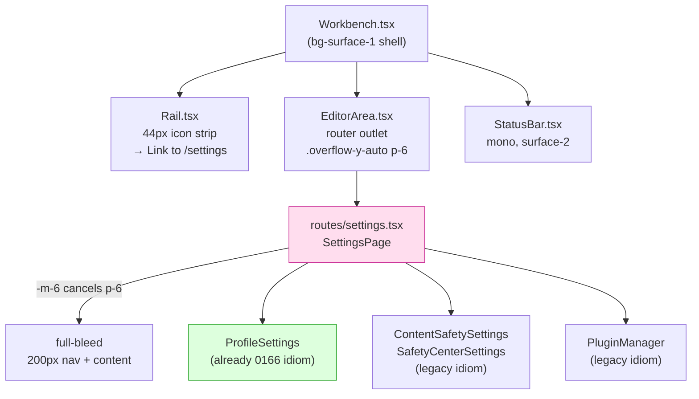
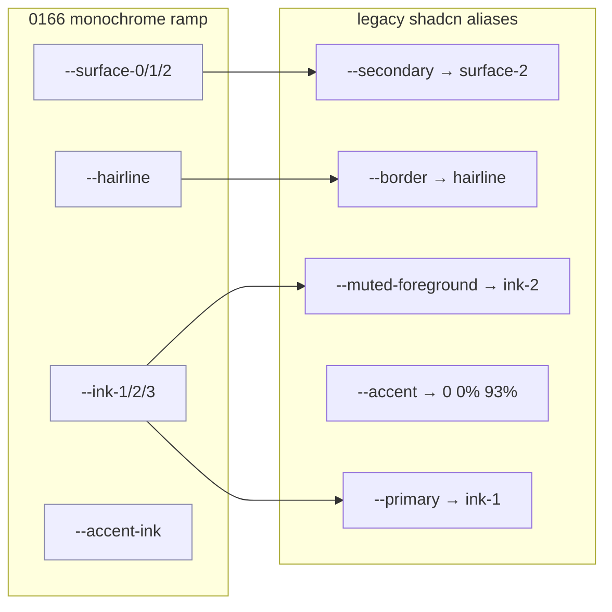
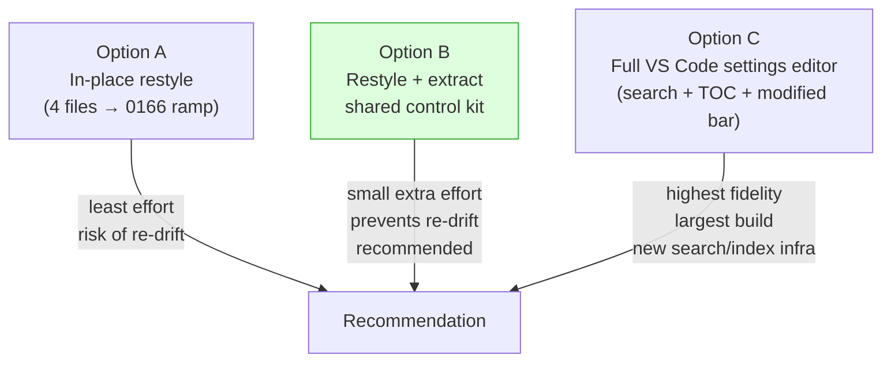

# Settings UI Alignment With The Workbench (VS Code) Aesthetic

## Problem Statement

The xNet web app shell adopted a VS Code–style "workbench" idiom in
exploration 0166: a 44px icon **Rail**, collapsible panels, a 9px-tall
**TabBar**, a mono **Status Bar**, and a strict monochrome design
language ("data may have color; chrome may not"). The whole shell reads
as a quiet, dense, IDE-like workspace.

The **Settings page** (`/settings`) never got that memo. It still
renders in an older, "web-app-y" idiom: a 200px sidebar of **rounded
pill** nav items with a trailing chevron, `text-lg`/`text-2xl`
headings, `rounded-lg` cards, raw HTML checkboxes, and the legacy
shadcn token names (`bg-secondary`, `border-border`, `bg-accent`,
`text-muted-foreground`, `bg-primary`). Because Settings opens **inside
the editor area as a routed tab**, it sits one keystroke away from the
workbench chrome — and the seam shows.

The ask: make Settings clean, minimal, and consistent with the rest of
the VS Code workspace UI.

## Executive Summary

- **This is not a color problem.** Both idioms already resolve to the
  *same* APCA-tuned monochrome ramp — the legacy shadcn tokens
  (`--secondary`, `--accent`, `--border`, `--muted-foreground`,
  `--primary`) are **aliases onto the 0166 ramp** in
  [`tokens.css`](packages/ui/src/theme/tokens.css). The divergence is
  **density, type scale, corner radius, icon stroke weight, and
  active-state idiom** — not hue.
- **The target idiom already exists in the same file.**
  [`ProfileSettings`](apps/web/src/comms/ProfileSettings.tsx) — one of
  the panels Settings renders — is *already* written in the workbench
  vocabulary (`text-ink-1`, `border-hairline`, `bg-surface-0`,
  `text-[11px] uppercase tracking-wider text-ink-3`). It is the working
  proof that the migration is mechanical, not speculative.
- **Scope is small and contained:** four files carry ~164 legacy-token
  uses; `ProfileSettings` (already converted) carries 2. No data,
  routing, or state changes are required — this is a styling pass plus
  one shared primitive.
- **There are three settings implementations**, all web-app-y and none
  on the workbench idiom: the web route
  ([`routes/settings.tsx`](apps/web/src/routes/settings.tsx)), the
  shared [`SettingsView`](packages/ui/src/composed/SettingsView.tsx) in
  `@xnetjs/ui` (currently unused by web), and a third in
  [`apps/electron`](apps/electron/src/renderer/components/SettingsView.tsx).
- **Recommendation:** restyle the four web settings files in place onto
  the 0166 ramp, mirroring the Rail's activity-bar active indicator and
  the Explorer's section labels; extract a tiny **settings control kit**
  (`SettingsScaffold` / `SettingRow` / `SettingToggle`) so the look
  can't drift again; swap raw checkboxes for the existing `<Switch>`
  primitive. Defer the full VS Code "settings *editor*" (search + table
  of contents + modified indicator) to an optional phase 2.

## Current State In The Repository

### Where Settings lives in the shell

Settings is a TanStack route mounted inside the workbench editor area,
so it renders immediately adjacent to the workbench chrome.



The `flex h-full -m-6` on `SettingsPage`
([`settings.tsx:106`](apps/web/src/routes/settings.tsx)) deliberately
cancels the editor area's `p-6` padding so the settings sidebar can run
edge-to-edge — confirming it's designed to read as a full workspace
surface, which makes the aesthetic mismatch more conspicuous, not less.

### The two vocabularies, side by side

| Aspect | Workbench idiom (0166) | Settings idiom (legacy) |
| --- | --- | --- |
| Surfaces | `bg-surface-0/1/2` | `bg-secondary`, `bg-card` |
| Borders | `border-hairline` | `border-border` |
| Text roles | `text-ink-1/2/3` | `text-foreground`, `text-muted-foreground` |
| Headings | `text-base`/`text-sm font-medium` | `text-lg`, `text-2xl font-semibold` |
| Radius | `rounded-sm`/`rounded-md`, flat | `rounded-md`/`rounded-lg` cards |
| Icons | `size={17} strokeWidth={1.5}` | `size={18}` default stroke (2) |
| Nav active | 2px left bar (`w-0.5 bg-accent-ink`) | filled pill (`bg-accent`) + `ChevronRight` |
| Section label | `text-[10px] uppercase tracking-wider text-ink-3` | `text-lg` header + paragraph |
| Toggles | (none yet) → `<Switch>` exists | raw `<input type="checkbox">` |
| Data/IDs | mono (`font-mono text-[10px/11px]`) | mixed |

### Important: the tokens already converge

[`tokens.css`](packages/ui/src/theme/tokens.css) defines the ramp once
and aliases the shadcn names onto it:



So `bg-secondary` and `bg-surface-2` paint nearly the same pixels. The
settings page does not look "off" because of *color* — it looks off
because of **bigger type, rounder corners, heavier icons, pill-shaped
active states, and card chrome**. Naming aside, the fix is to move the
*scale and shape* onto the workbench idiom (and, while we're there,
prefer the canonical `surface/ink/hairline` names so intent is legible).

### The reference implementation already in the file

`ProfileSettings` is rendered by the very same Settings route yet is
written entirely in the target idiom:

```tsx
// apps/web/src/comms/ProfileSettings.tsx
<span className="text-[11px] font-medium uppercase tracking-wider text-ink-3">{label}</span>
<input className="h-8 ... rounded-md border border-hairline bg-surface-0 px-2 text-sm
                  text-ink-1 outline-none placeholder:text-ink-3 focus:border-border-emphasis" />
<button className="... rounded-md border border-hairline bg-surface-0 px-3 py-1.5 text-xs
                   text-ink-1 hover:bg-surface-2 ..." >Save profile</button>
```

This is exactly what the rest of Settings should look like. The
migration is "make the other panels look like the one panel that's
already right."

### Scope, quantified

`grep` of legacy vs. workbench token uses per file:

| File | Legacy hits | Workbench hits | Status |
| --- | ---: | ---: | --- |
| [`routes/settings.tsx`](apps/web/src/routes/settings.tsx) | 59 | 0 | restyle |
| [`PluginManager.tsx`](apps/web/src/components/PluginManager.tsx) | 64 | 0 | restyle |
| [`SafetyCenterSettings.tsx`](apps/web/src/components/SafetyCenterSettings.tsx) | 30 | 0 | restyle |
| [`ContentSafetySettings.tsx`](apps/web/src/components/ContentSafetySettings.tsx) | 11 | 0 | restyle (2 raw checkboxes) |
| [`ProfileSettings.tsx`](apps/web/src/comms/ProfileSettings.tsx) | 2 | 20 | **reference (done)** |

### Idioms to mirror (the "muscle memory" the shell already teaches)

- **Activity-bar active indicator** — Rail marks the active view with a
  2px left bar, not a fill:
  [`Rail.tsx:66`](apps/web/src/workbench/Rail.tsx) →
  `{active && <span className="absolute left-0 top-2 bottom-2 w-0.5 bg-accent-ink" />}`.
  Settings nav should do the same instead of `bg-accent` pills +
  `ChevronRight`.
- **Section labels** — Explorer uses
  `text-[10px] font-medium uppercase tracking-wider text-ink-3`
  ([`Explorer.tsx:120`](apps/web/src/workbench/views/Explorer.tsx)).
- **Inputs/filter fields** — Explorer's filter and ProfileSettings'
  fields share `border-hairline bg-surface-0 ... focus:border-border-emphasis`.
- **Mono for data** — Status Bar, DIDs, version, and IDs read in
  `font-mono` at 10–11px.
- **`<Switch>` exists and is unused in web** —
  [`Switch.tsx`](packages/ui/src/primitives/Switch.tsx) is exported
  from `@xnetjs/ui` but the web app hand-rolls raw checkboxes
  everywhere. Adopting it both modernizes the look and removes bespoke
  markup.

## External Research

- **VS Code settings *editor* anatomy.** The canonical reference for
  "IDE settings UI" is a three-part layout: a **search bar** at the top
  that filters live (`@modified`, `@builtin` operators), a **table of
  contents** tree on the left that scroll-syncs with the list, and a
  **settings list** grouped by category. Modified settings get a
  **colored left bar** (the same affordance VS Code uses for modified
  editor lines), and a gear menu resets to default. This is the
  full-fidelity target, but it is a *much* larger build than aesthetic
  alignment. ([code.visualstudio.com/docs/getstarted/settings](https://code.visualstudio.com/docs/getstarted/settings),
  [dev.to: all-new VSCode settings editor UI](https://dev.to/vscode/all-new-vscode-settings-editor-ui-----3j48))
- **Linear's "feels like an IDE" minimalism.** Linear deliberately
  reads closer to an IDE than a web app: stripped-down chrome, no busy
  sidebars or card stacks, fast keyboard nav, and a custom design system
  ("Orbiter") on top of Radix primitives. The relevant takeaway for us
  is *restraint*: flat surfaces, hairline separators, tight type scale,
  and one accent — which is precisely the 0166 doctrine.
  ([linear.app: how we redesigned the UI](https://linear.app/now/how-we-redesigned-the-linear-ui),
  [logrocket: the Linear aesthetic](https://blog.logrocket.com/ux-design/linear-design-ui-libraries-design-kits-layout-grid/))
- **Prior art in-repo.** Exploration 0166 (workbench shell) is the
  governing design doc; this exploration is its natural cleanup tail.
  `ProfileSettings`, the Explorer, and the Rail are the concrete
  pattern library to copy from.

## Key Findings

1. **The fix is shape and scale, not color.** Aliased tokens mean a
   find-and-replace of token *names* alone would barely move the
   needle; the type scale, radius, stroke weight, and active-state
   shape are what must change.
2. **A correct reference already ships in the same screen**
   (`ProfileSettings`), de-risking the whole effort.
3. **Settings styling has drifted three ways** (web route, shared
   `SettingsView`, electron). Without a shared primitive it will drift
   again. The shared `SettingsView` is itself web-app-y (`text-2xl`,
   `rounded-lg` cards, `bg-primary/10` icon chips) and unused by web —
   a good candidate to either rewrite into the idiom or retire.
4. **The design system is under-used.** `<Switch>`, `<Select>`,
   `<Button>` exist in `@xnetjs/ui` but Settings hand-rolls buttons and
   raw checkboxes. Adopting them improves both consistency and a11y
   (focus rings, keyboard, `aria-checked`).
5. **No behavioral change is needed.** Routing, the section state
   machine, theme persistence, export/clear, and hub-url logic all stay
   as-is. This keeps the change reviewable and low-risk.

## Options And Tradeoffs



### Option A — In-place restyle only
Convert the four files to the 0166 ramp, mirror the Rail/Explorer
idioms, swap checkboxes for `<Switch>`. **Pros:** smallest diff, fastest
to ship, zero new abstractions. **Cons:** the same look is re-authored
inline in four places; nothing stops the next panel from drifting back
to web-app-y; the unused shared `SettingsView` keeps rotting.

### Option B — Restyle **and** extract a settings control kit *(recommended)*
Do Option A, but lift the recurring pieces into a tiny set of
primitives — `SettingsScaffold` (nav rail + content), `SettingsGroup`
(uppercase section label + rows), `SettingRow` (label/description +
control), `SettingToggle` (label + `<Switch>`) — living in `@xnetjs/ui`
beside (or replacing) `SettingsView`. The web route composes them; the
panels render inside them. **Pros:** one source of truth for the
idiom, electron can adopt later, future panels stay consistent by
construction. **Cons:** slightly larger surface; must decide the fate of
the existing `SettingsView` (rewrite into the idiom vs. deprecate).

### Option C — Full VS Code settings *editor*
Add a top search box with operator filtering, a scroll-synced table of
contents, and a per-setting modified indicator + reset. **Pros:** the
most literal interpretation of "like VS Code." **Cons:** requires a
settings *registry/index* (search needs structured metadata about every
setting), modified-state tracking against defaults, and far more code —
disproportionate to a request that is fundamentally about visual
consistency. Best treated as a follow-up once the idiom is unified.

## Recommendation

Ship **Option B**: restyle in place **and** extract a small shared
control kit, with these concrete moves.

1. **Nav rail** — replace the rounded `bg-accent` pill + `ChevronRight`
   with the workbench activity-bar pattern: a flat row, `text-ink-3 →
   text-ink-1` on active/hover, and a 2px `bg-accent-ink` left bar for
   the active item (copy [`Rail.tsx:66`](apps/web/src/workbench/Rail.tsx)).
   Drop the section icons down to `size={16} strokeWidth={1.5}`. Keep
   the 200px width but use `border-hairline` + `bg-surface-1`.
2. **Headings** — `text-base font-medium text-ink-1` for panel titles
   (matching `ProfileSettings`), `text-xs text-ink-3` for descriptions.
   Retire `text-lg`/`text-2xl font-semibold`.
3. **Rows** — adopt one `SettingRow` (label + description + control on a
   `border-b border-hairline` divider; no card chrome). Replace
   `rounded-lg` cards in `PluginManager`/`SafetyCenterSettings` with
   hairline-separated rows or, at most, `rounded-md border-hairline`
   list rows.
4. **Controls** — `<Switch>` for booleans (adult content, blur
   unsolicited media, plugin enable/disable); segmented `text-xs` pill
   group for the per-label dial but on `border-hairline`/`accent-ink`
   active rather than `bg-accent`; buttons styled like ProfileSettings'
   (`border-hairline bg-surface-0 hover:bg-surface-2`), keeping
   `bg-destructive` only for the genuinely destructive "Clear data".
5. **Data as mono** — DIDs, version, "SQLite OPFS", hub URL input stay
   `font-mono` at 10–11px (already partly true).
6. **Tokens** — prefer the canonical `surface/ink/hairline/accent-ink`
   names over the legacy aliases for new/edited code so intent reads
   clearly; semantic hues (`destructive`, `success`, `warning`) survive
   only for genuine state.
7. **Shared kit** — house `SettingsScaffold/Group/Row/Toggle` in
   `@xnetjs/ui`; rewrite or deprecate the current `SettingsView`.

Defer Option C (search/TOC/modified-indicator) to a follow-up
exploration; note it explicitly so it isn't lost.

## Example Code

### Settings nav item — pill+chevron → activity-bar left bar

```tsx
// Before (routes/settings.tsx) — web-app-y pill
<button className={`w-full flex items-center gap-3 px-3 py-2.5 rounded-md text-sm transition-colors ${
  active ? 'bg-accent text-foreground' : 'text-muted-foreground hover:text-foreground hover:bg-accent/50'
}`}>
  <span>{icon}</span>
  <span className="flex-1 text-left">{label}</span>
  {active && <ChevronRight size={14} className="text-muted-foreground" />}
</button>

// After — workbench idiom (mirrors Rail.tsx active bar)
<button className={`relative flex w-full items-center gap-2.5 px-3 py-1.5 text-sm transition-colors ${
  active ? 'text-ink-1' : 'text-ink-3 hover:text-ink-1'
}`}>
  {active && <span className="absolute left-0 top-1.5 bottom-1.5 w-0.5 bg-accent-ink" />}
  <span className="flex-shrink-0">{icon /* size={16} strokeWidth={1.5} */}</span>
  <span className="flex-1 text-left">{label}</span>
</button>
```

### Shared control kit (sketch for `@xnetjs/ui`)

```tsx
export function SettingsGroup({ label, children }: { label: string; children: ReactNode }) {
  return (
    <section>
      <h2 className="px-0 pb-2 text-[10px] font-medium uppercase tracking-wider text-ink-3">
        {label}
      </h2>
      <div>{children}</div>
    </section>
  )
}

export function SettingRow({ label, description, children }: {
  label: string; description?: string; children: ReactNode
}) {
  return (
    <div className="flex items-center justify-between gap-4 border-b border-hairline py-3 last:border-0">
      <div className="min-w-0">
        <div className="text-sm text-ink-1">{label}</div>
        {description && <div className="text-xs text-ink-3">{description}</div>}
      </div>
      <div className="flex-shrink-0">{children}</div>
    </div>
  )
}

// boolean rows stop hand-rolling <input type="checkbox">
export function SettingToggle(props: { label: string; description?: string;
  checked: boolean; disabled?: boolean; onChange: (v: boolean) => void }) {
  return (
    <SettingRow label={props.label} description={props.description}>
      <Switch checked={props.checked} disabled={props.disabled}
              onCheckedChange={props.onChange} />
    </SettingRow>
  )
}
```

### Adult-content toggle — raw checkbox → `<Switch>`

```tsx
// Before (ContentSafetySettings.tsx)
<label className="flex items-center gap-2 text-sm">
  <input type="checkbox" checked={adultEnabled} disabled={!ageConfirmed}
         onChange={(e) => setAdultContentEnabled(e.target.checked)} />
  <span>{adultEnabled ? 'Enabled' : 'Disabled'}</span>
</label>

// After
<SettingToggle
  label="Adult content"
  description="Off hides all sexual / nudity / explicit content regardless of the dials below."
  checked={adultEnabled}
  disabled={!preferences.ageConfirmed}
  onChange={setAdultContentEnabled}
/>
```

## Risks And Open Questions

- **Fate of the shared `SettingsView`.** Rewrite into the idiom and
  adopt it in web, or deprecate it and keep web's bespoke scaffold?
  Recommendation leans toward a fresh small kit and retiring the old
  `SettingsView`, but electron currently has its *own* copy, so a
  shared kit only pays off if both apps adopt it. Decide before
  building the kit (Option B) vs. just restyling (Option A).
- **`<Switch>` interaction parity.** The per-label sensitivity dial is a
  4-way radiogroup (show/warn/blur/hide), not a boolean — keep it a
  segmented control, don't force a Switch. Only the true booleans
  migrate.
- **Active-bar a11y.** The 2px left bar is a *visual* cue; keep
  `aria-current`/`aria-selected` and a visible focus ring so keyboard
  and screen-reader users aren't worse off than the current pill.
- **Theme/contrast.** Verify the restyle in light, dark, and the
  `true-black` OLED variant — hairline-only structure must still read in
  true-black where surfaces collapse to `#000`.
- **No scope creep into Option C.** Resist adding search/TOC now; the
  request is aesthetic alignment.
- **Visual regression coverage.** There don't appear to be screenshot
  tests for `/settings`; confirm whether any e2e selectors key off the
  current class names before renaming.

## Implementation Checklist

- [ ] Decide Option A vs. B (shared kit) and the fate of
      `packages/ui/src/composed/SettingsView.tsx`.
- [ ] (Option B) Add `SettingsScaffold` / `SettingsGroup` / `SettingRow`
      / `SettingToggle` to `@xnetjs/ui`, on the `surface/ink/hairline`
      ramp, mirroring `ProfileSettings` and `Rail`.
- [ ] Restyle the Settings nav in
      [`routes/settings.tsx`](apps/web/src/routes/settings.tsx): flat
      rows, `text-ink-3 → text-ink-1`, 2px `accent-ink` left active bar,
      `size={16} strokeWidth={1.5}` icons, remove `ChevronRight`,
      `bg-surface-1` + `border-hairline`.
- [ ] Convert panel headers to `text-base font-medium text-ink-1` +
      `text-xs text-ink-3`; drop `text-lg`/`text-2xl font-semibold`.
- [ ] Convert `AppearanceSettings`, `DataSettings`, `NetworkSettings`,
      `AccountSettings`, `AboutSettings` rows to `SettingRow` + ramp
      tokens; keep `bg-destructive` only on "Clear data".
- [ ] Restyle [`ContentSafetySettings.tsx`](apps/web/src/components/ContentSafetySettings.tsx):
      `<Switch>` for the two booleans, hairline rows for the dial,
      `accent-ink` active on the segmented control.
- [ ] Restyle [`SafetyCenterSettings.tsx`](apps/web/src/components/SafetyCenterSettings.tsx):
      replace `rounded-lg`/`border-border` cards with hairline rows;
      mono for DIDs.
- [ ] Restyle [`PluginManager.tsx`](apps/web/src/components/PluginManager.tsx):
      `<Switch>` for enable/disable, hairline list rows, ramp tokens.
- [ ] Mono-format data atoms: DID, version, "SQLite OPFS", hub URL.
- [ ] Replace hand-rolled buttons with ProfileSettings-style buttons (or
      `@xnetjs/ui` `<Button>`).
- [ ] Sweep for residual legacy tokens in the four files
      (`muted-foreground|border-border|bg-secondary|bg-accent|rounded-lg|text-lg|text-2xl`).
- [ ] (Optional, later) Open a follow-up exploration for the VS Code
      settings *editor* (search + TOC + modified indicator).

## Validation Checklist

- [ ] `/settings` visually matches the workbench: flat surfaces,
      hairline separators, 13px base type, mono data, activity-bar
      active indicator — verified against the Rail/Explorer/StatusBar
      side by side.
- [ ] Verified in **light**, **dark**, and **`true-black`** variants
      (preview screenshots attached).
- [ ] Every booleans-as-`<Switch>` row toggles and persists exactly as
      the prior checkbox did (adult content gated on age confirm; blur
      unsolicited; plugin enable/disable).
- [ ] The per-label sensitivity dial still functions as a 4-way
      radiogroup with correct `aria-checked`.
- [ ] Keyboard navigation and focus rings work on the nav and all
      controls; `aria-current`/`aria-selected` present on active nav.
- [ ] Theme switch, data export, clear-data (with confirm), and hub-url
      save/reset behave unchanged.
- [ ] `grep` shows no remaining legacy `bg-secondary`/`bg-accent`/
      `text-muted-foreground`/`text-lg`/`rounded-lg` in the four files.
- [ ] Typecheck, lint, and existing settings/route tests pass; no e2e
      selector broke from class renames.

## References

- In-repo: [`routes/settings.tsx`](apps/web/src/routes/settings.tsx),
  [`ProfileSettings.tsx`](apps/web/src/comms/ProfileSettings.tsx) (target
  idiom), [`ContentSafetySettings.tsx`](apps/web/src/components/ContentSafetySettings.tsx),
  [`SafetyCenterSettings.tsx`](apps/web/src/components/SafetyCenterSettings.tsx),
  [`PluginManager.tsx`](apps/web/src/components/PluginManager.tsx)
- Idiom sources: [`Rail.tsx`](apps/web/src/workbench/Rail.tsx),
  [`Explorer.tsx`](apps/web/src/workbench/views/Explorer.tsx),
  [`TabBar.tsx`](apps/web/src/workbench/TabBar.tsx),
  [`StatusBar.tsx`](apps/web/src/workbench/StatusBar.tsx)
- Design system: [`tokens.css`](packages/ui/src/theme/tokens.css),
  [`Switch.tsx`](packages/ui/src/primitives/Switch.tsx),
  [`SettingsView.tsx`](packages/ui/src/composed/SettingsView.tsx),
  [`ui/index.ts`](packages/ui/src/index.ts)
- Governing doc: exploration `0166_[x]_WORKBENCH_SHELL...` (workbench
  shell + design tokens)
- External: [VS Code — User and workspace settings](https://code.visualstudio.com/docs/getstarted/settings),
  [DEV — all-new VSCode settings editor UI](https://dev.to/vscode/all-new-vscode-settings-editor-ui-----3j48),
  [Linear — how we redesigned the UI](https://linear.app/now/how-we-redesigned-the-linear-ui),
  [LogRocket — the Linear aesthetic](https://blog.logrocket.com/ux-design/linear-design-ui-libraries-design-kits-layout-grid/)
