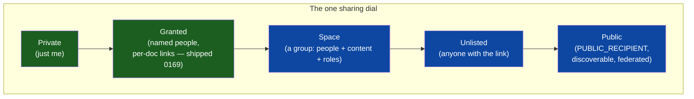
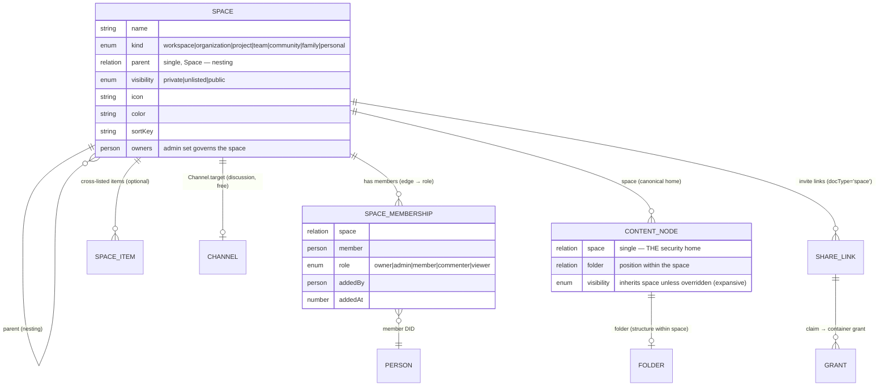
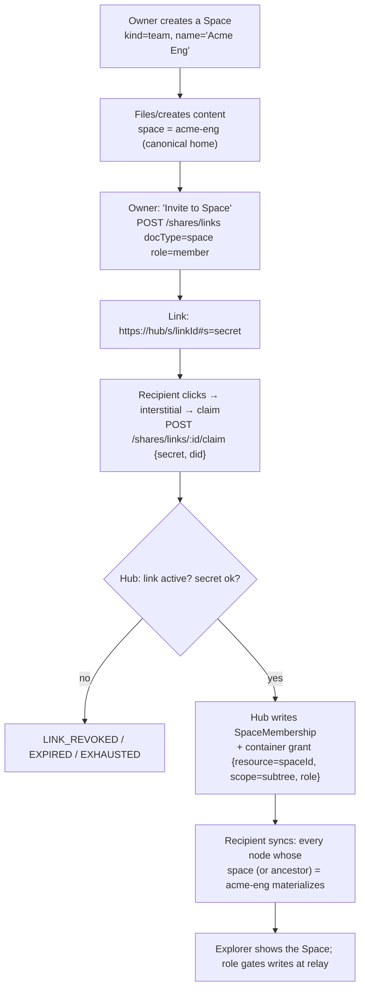
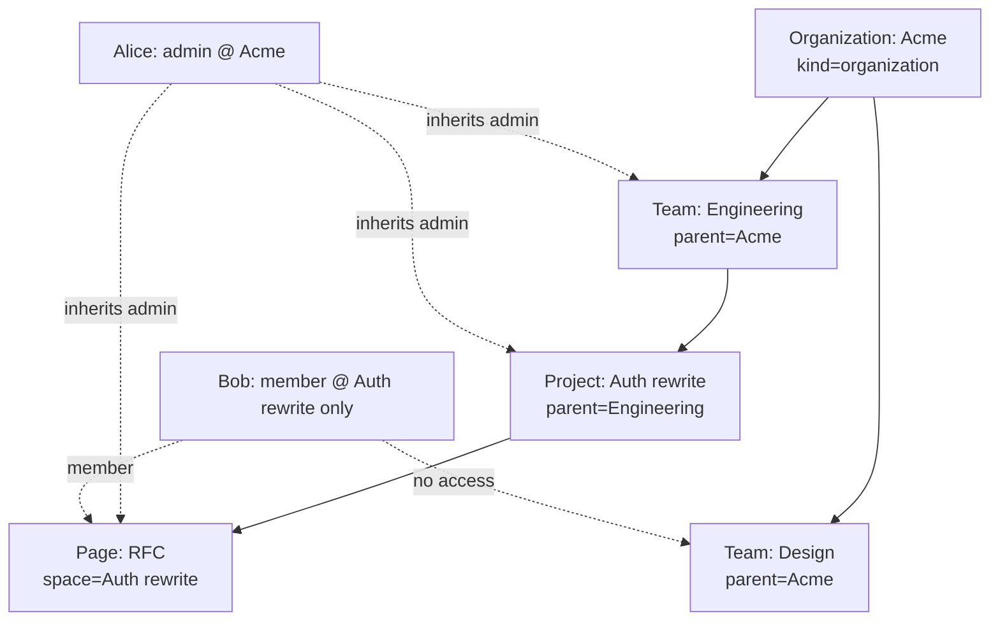
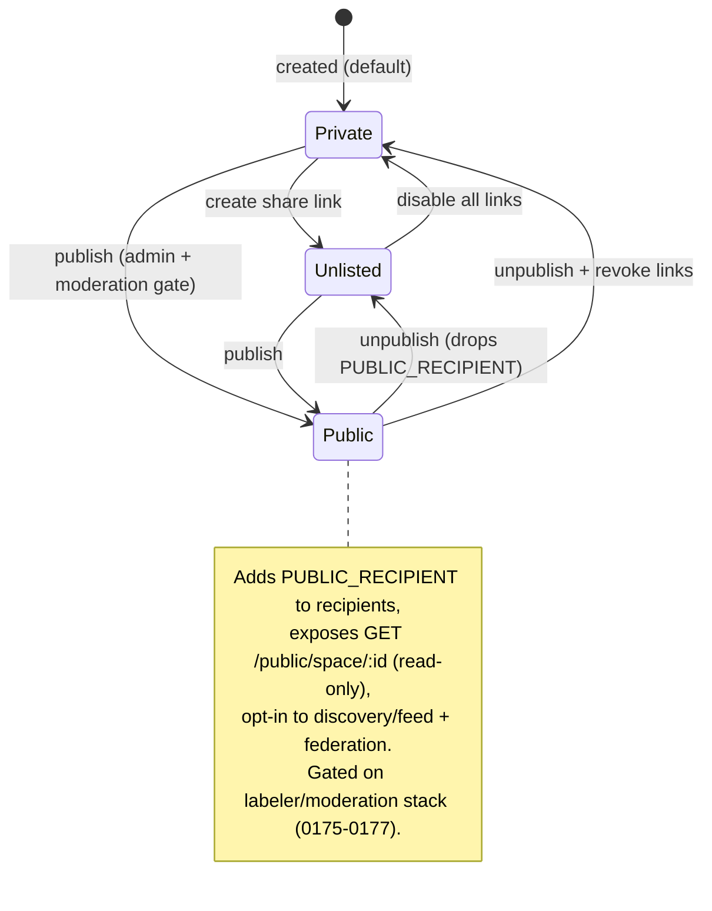
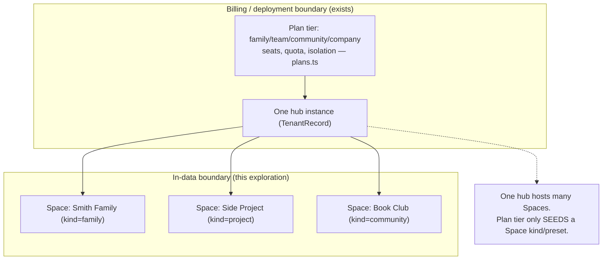

# Spaces: Groups, Workspaces, and Unified Sharing (and Going Public)

## Problem Statement

Today xNet can share exactly one thing at a time. The Share dialog
([apps/web/src/components/ShareDialog.tsx](apps/web/src/components/ShareDialog.tsx),
shipped in exploration 0169) creates a durable, revocable link to a
**single** page / database / canvas / dashboard, and claiming it writes a
**single** per-document grant. There is no way to say "join my team and
get everything in it," and channels — the one schema with a `members`
list — aren't shareable at all: you cannot invite someone to a channel
([packages/data/src/schema/schemas/channel.ts:41](packages/data/src/schema/schemas/channel.ts)).

More fundamentally, **nothing in the data model expresses belonging.**
Every node records who made it (`createdBy`,
[packages/data/src/schema/node.ts](packages/data/src/schema/node.ts)),
but not what it belongs *to*. A page is not in a project, a project is
not in a team, a team is not in an organization. The words exist only as
dormant types — a `Group` interface and a `ResourceScope` of
`'workspace' | 'document' | 'block'`
([packages/core/src/permissions.ts:8](packages/core/src/permissions.ts)) —
that nothing in the running system reads. The web app even hardcodes a
single workspace: `WORKSPACE_ID = 'main'`
([apps/web/src/comms/CommsContext.tsx](apps/web/src/comms/CommsContext.tsx)).

The ask, distilled:

1. **A first-class "group" primitive** that contains both *content* and
   *people*, so things can belong somewhere.
2. **Many flavors** — workspace, organization, project, team, community,
   family — and the ability to **nest** them.
3. **Roles** — administrators, members, commenters, viewers,
   read-only — that apply across everything in the group.
4. **Share-many-at-once** — invite a person to the group and they get
   appropriate access to *all* of its contents, with one link.
5. **Public/publishing** — the opposite end of the dial: how does xNet
   make something readable by *everyone*, with no grant at all?

This exploration designs that primitive — a **Space** — shows how it
rides the access-control machinery xNet already ships rather than
replacing it, and connects the private end (a family Space) to the
public end (a published Space) on a single visibility axis.

## Executive Summary

- **Ship one `Space` node, not six.** A workspace, an organization, a
  project, a team, a community, and a family are *structurally
  identical*: a named container of people + content with roles and a
  parent. They differ only in default labels, icons, and policy presets.
  Model them as a single `Space` schema with a `kind` discriminator —
  exactly the pattern `Channel` already uses for `channel | dm | voice`
  ([channel.ts:31](packages/data/src/schema/schemas/channel.ts)). Six
  schemas would be six migrations, six UIs, and no coherent nesting
  story.
- **Membership is an edge, roles live on the edge.** A `members: person[]`
  list (as on Channel) can't carry per-person roles. Use a
  `SpaceMembership` edge node `{ space, member, role }` — the same
  membership-edge pattern `SocialCollectionItem` already uses
  ([packages/social/src/schemas/collection.ts](packages/social/src/schemas/collection.ts)).
  Roles reuse the capability vocabulary that already exists:
  `viewer / commenter / member(writer) / admin / owner`, mapping onto
  `Capability` and `STANDARD_ROLES`
  ([permissions.ts:26](packages/core/src/permissions.ts)) and the
  share-link `ShareLinkRole` (`read | comment | write`).
- **A Space is a *security boundary*; a Folder is *structure within
  it*.** Exploration 0169 deliberately gave folders **zero**
  permissions ("Folders carry no permissions; Grants remain per-node,"
  [folder.ts](packages/data/src/schema/schemas/folder.ts)). Keep that.
  Add an orthogonal, single-valued `space` relation that *is* the
  permission container — the Notion teamspace / Google shared-drive
  model — leaving the shipped folder tree intact as positioning inside a
  Space.
- **Membership cascades into the existing grant index — don't rebuild
  enforcement.** The hub already enforces per-node access at relay time:
  `canWriteNodeChange` / `canWriteYjs` consult a SQLite grant index
  keyed by `(granteeDid, docId)`
  ([packages/hub/src/services/share-access.ts](packages/hub/src/services/share-access.ts)).
  A Space membership becomes a **container grant** —
  `resource = spaceId, scope = 'subtree'` — and the hub's status lookup
  is widened from "does this DID have a grant on this doc?" to "…on this
  doc *or any Space that contains it*?" This is the
  Zanzibar/Jazz "groups + folder→document inheritance" pattern
  projected onto the tuple store xNet already has.
- **Inviting to a Space reuses the share-link machinery wholesale.**
  Generalize the share-link `docType` to accept `'space'`. Claiming a
  Space link writes a **membership** instead of a per-doc grant — links
  bootstrap membership, membership bootstraps access to everything. This
  is the same "links bootstrap grants, not *are* the access" principle
  from 0169, lifted one level up.
- **Public is the top of the same dial.** xNet's crypto substrate
  already supports public content: `PUBLIC_RECIPIENT` /
  `PUBLIC_CONTENT_KEY` and a `PUBLIC` authorization expression
  ([packages/data/src/auth/builders.ts:115](packages/data/src/auth/builders.ts),
  recipients.ts) are wired through encryption and the P2P sync filter —
  but **no schema, UI, or hub endpoint uses them.** Give Space (and
  individual nodes) a `visibility: private | unlisted | public` field.
  `public` adds `PUBLIC_RECIPIENT` to the recipient set and exposes a
  read-only hub endpoint. "Publishing" becomes flipping a Space to
  public; its contents become a public site/feed. Stay private by
  default; gate public-GA on the moderation stack (0175–0177).
- **Keep two boundaries distinct.** The cloud billing tiers already
  enumerate `family / team / community / company / enterprise`
  ([packages/cloud-plans/src/plans.ts:18](packages/cloud-plans/src/plans.ts))
  — but that is the *hub/tenant* boundary (who pays, how much storage).
  A `Space` is the *in-data* boundary (what belongs together, who can
  see it). One hub hosts many Spaces. Conflating them is the trap; the
  plan tier seeds a Space `kind`, nothing more.



## Current State In The Repository

### What sharing is today: strictly per-node

The deployed model (verified end-to-end) is **one grant per document**:

| Layer | Where | Behavior |
| --- | --- | --- |
| Grant node | [packages/data/src/schema/schemas/grant.ts](packages/data/src/schema/schemas/grant.ts) | `{ issuer, grantee, resource, resourceSchema, actions, expiresAt, revokedAt, ucanToken, parentGrantId }`. `resource` is always a **concrete doc id**, never a container. |
| Hub grant index | [packages/hub/src/storage/interface.ts](packages/hub/src/storage/interface.ts) | `GrantIndexRecord { granteeDid, resourceDocId, actions[] }`; `listGrantedDocIds`, `listGrantsForDoc`, `getActiveGrant`, `revokeGrant`. SQLite-backed. |
| Role → actions | [packages/hub/src/services/share-access.ts](packages/hub/src/services/share-access.ts) | `SHARE_ROLE_ACTIONS = { read:['read'], comment:['read','comment'], write:['read','comment','write'] }`. |
| Write enforcement | [packages/hub/src/server.ts](packages/hub/src/server.ts) (`authorizeRoomAction` ~250, node-change ~1332, yjs ~1404) | `canWriteNodeChange(did, docId, schemaId)` and `canWriteYjs(did, docId)` reject writes from read/comment grantees; a fully-revoked DID is denied even if its UCAN says `hub/*`. |
| UCAN capabilities | [packages/hub/src/auth/capabilities.ts](packages/hub/src/auth/capabilities.ts) | `hub/connect, hub/signal, hub/relay, hub/backup, hub/query, hub/admin, call/*, notify/*` with wildcard + path-prefix matching. |
| Share links | [packages/hub/src/routes/share-links.ts](packages/hub/src/routes/share-links.ts) | `https://<hub>/s/<linkId>#s=<secret>`; claim → `upsertGrantIndex` with deterministic `grantIdFor(linkId, did)`. `docType ∈ {page, database, canvas, dashboard, view}`. |
| Share UI | [apps/web/src/components/ShareDialog.tsx](apps/web/src/components/ShareDialog.tsx), [apps/web/src/hooks/useShareLinks.ts](apps/web/src/hooks/useShareLinks.ts) | Links tab + People tab, per document. |

**There is no container-level authorization anywhere.** Folders,
projects, channels, and tags are organizational only; sharing a folder
shares nothing inside it. This is stated explicitly in 0169.

### The dormant "group" and "public" machinery

Two designed-but-unwired systems are the seeds this exploration grows:

**A. Group / scope / roles (in `@xnetjs/core`).**
[permissions.ts](packages/core/src/permissions.ts) defines `Group
{ id, members, memberGroups, managedBy }`, `ResourceScope { type:
'workspace'|'document'|'block' }`, `Capability =
read|write|delete|share|admin`, `STANDARD_ROLES`, and a
`PermissionEvaluator` interface with `resolveGroups(did)` and
`hasCapability(did, cap, scope)`. **Nothing references it.** It is a
spec waiting for an implementation.

**B. Schema-level authorization DSL + E2E recipients (in `@xnetjs/data`
+ `@xnetjs/crypto`).** A richer, *different* authorization model exists
alongside the hub grant index:
[builders.ts](packages/data/src/auth/builders.ts) lets a schema declare
`roles: { owner: role.creator(), editor: role.property('editors'),
admin: role.relation('project','admin') }` and
`actions: { read: or(allow('owner'), PUBLIC) }`. `role.relation(rel,
targetRole)` is **inheritance from a related node** — a Task can inherit
"admin" from its Project. The evaluator
([packages/data/src/auth/evaluator.ts](packages/data/src/auth/evaluator.ts))
resolves these and falls back to the grant index. `PUBLIC` /
`AUTHENTICATED` exist, and the crypto envelope
([packages/crypto/src/envelope.ts](packages/crypto/src/envelope.ts))
wraps a per-node content key to each recipient DID, with
`PUBLIC_RECIPIENT` / `PUBLIC_CONTENT_KEY` sentinels
([packages/data/src/auth/recipients.ts](packages/data/src/auth/recipients.ts))
honored by the P2P sync filter
([packages/network/src/security/authorized-sync-provider.ts](packages/network/src/security/authorized-sync-provider.ts)).
**No shipped schema sets `read: PUBLIC`, and the hub has no public read
endpoint.** The relation-role inheritance (`role.relation`) is the
single most important existing seam for Spaces: it is *already* how
xNet expresses "inherit a role from a container."

> **A tension to pin down (Open Question Q1):** there are two
> authorization systems — the **hub-mediated grant index** (the
> deployed enforcement; the hub sees plaintext and gates relay) and the
> **E2E envelope/`PUBLIC_RECIPIENT`** model (cryptographic, honored by
> the P2P sync path). A Space's membership must drive *whichever is
> authoritative for a deployment*. The design below treats the grant
> index as the v1 enforcement point (call it the **B1** path, matching
> 0169's framing) and the space-key envelope as the **B2** E2E upgrade.

### Every existing "group-like" thing, and how close it is

| Primitive | File | Groups…? | Members | Roles | Invitable | Scopes perms |
| --- | --- | --- | --- | --- | --- | --- |
| `Channel` | [channel.ts](packages/data/src/schema/schemas/channel.ts) | people + messages | ✅ `members` | ❌ | ❌ | ❌ (members ≠ ACL) |
| `Project` | [project.ts](packages/data/src/schema/schemas/project.ts) | tasks (loosely) | only `lead` | ❌ | ❌ | ❌ |
| `Folder` | [folder.ts](packages/data/src/schema/schemas/folder.ts) | content | ❌ | ❌ | ❌ | ❌ (by design) |
| `Tag` | [tag.ts](packages/data/src/schema/schemas/tag.ts) | content | ❌ | ❌ | ❌ | ❌ |
| `SocialCollectionItem` | [collection.ts](packages/social/src/schemas/collection.ts) | imported items | edge | ❌ | ❌ | ❌ |
| `Grant` | [grant.ts](packages/data/src/schema/schemas/grant.ts) | issuer→grantee | 1:1 | actions | via link | ✅ per-node |
| `SavedView` | [saved-view.ts](packages/data/src/schema/schemas/saved-view.ts) | query results | ❌ | ❌ | ❌ | scope: user/**workspace**/database |
| `PublicInteractionPolicy` | [moderation.ts](packages/data/src/schema/schemas/moderation.ts) | DIDs by trust | lists | maintainer/moderator | ❌ | governance, scope incl. **community/workspace/hub** |
| `Group` (iface) | [permissions.ts](packages/core/src/permissions.ts) | people | ✅ + nested | via Role | ❌ | spec only, **unused** |
| `TenantRecord` | [apps/cloud/src/registry.ts](apps/cloud/src/registry.ts) | a hub | billing user | ❌ | deployment boundary |
| Plan tiers | [plans.ts](packages/cloud-plans/src/plans.ts) | — | `seats` | — | **family/team/community/company/enterprise** |

The closest fit is **Channel** (it has real membership) but it is the
wrong shape — 0167/0169 deliberately made channels *attach to* content
(`Channel.target`), not *contain* it. The right move is a new `Space`
that **borrows Channel's `kind` pattern, the membership-edge pattern,
and the relation-role inheritance** already in the codebase, and **wires
into the grant index** for enforcement.

### The single-workspace assumption to unwind

The app currently assumes exactly one workspace:
`WORKSPACE_ID = 'main'` drives presence rooms
([CommsContext.tsx](apps/web/src/comms/CommsContext.tsx)); the Explorer
shows every local node filtered only by *type*, not by *space*
([apps/web/src/workbench/views/Explorer.tsx](apps/web/src/workbench/views/Explorer.tsx)).
Spaces require the explorer, presence, search, and feed surfaces to gain
a space scope. That is the largest *app-side* cost; the *data/hub* cost
is comparatively small.

## External Research

**Notion — workspace vs teamspace.** Notion separates the **billing**
container (workspace: plan + members) from the **permission** container
(teamspace: who sees what). Creating teamspaces is free; permissions set
on a page **inherit to sub-pages and databases**. This is exactly the
split this exploration recommends (tenant = billing, Space = permission)
and validates inheritance as the default. ([Notion: intro to
teamspaces](https://www.notion.com/help/intro-to-teamspaces))

**Slack — Enterprise Grid.** Below Enterprise, *everyone is in one
workspace*; Grid connects *multiple* workspaces under an **org**, with
org-wide policy and channels that can span workspaces. The lesson:
nesting (org → workspace) only earns its complexity at scale; ship the
single-container model first, add the parent later. xNet's
`Space.parent` is the seam, defaulted off.
([Slack: building apps in Enterprise Grid](https://api.slack.com/enterprise))

**Google Shared Drives.** Content is owned by the **drive (the group)**,
not an individual, so members leaving doesn't strand files — the
argument for a Space owning its contents rather than `createdBy` owning
them. Permissions inside a shared drive are **"strictly expansive"**:
you can raise a member's access on a sub-item but never lower it below
their drive role. A clean, defensible precedence rule.
([Google: shared drives overview](https://developers.google.com/workspace/drive/api/guides/about-shareddrives))

**Discord — RBAC with overrides.** Server-wide roles + per-channel
overrides; a user's effective permission is the **union of their roles**,
with the most specific (channel/user) override winning, and a role
hierarchy bounding who can manage whom. The model for "most-permissive
membership wins, narrower scope can override."
([Discord roles and permissions](https://support.discord.com/hc/en-us/articles/214836687-Discord-Roles-and-Permissions))

**Jazz — local-first Groups as the unit of permission.** The most
directly applicable prior art. In Jazz, *every* CoValue is owned by a
**Group**; members have roles (`reader / writer / admin`); **a Group can
be added as a *member* of another Group**, so a child inherits the
parent's members at their roles ("groups as members"). Nested data
(project → task → comment) inherits permissions. This is the design
target: groups own content, roles cascade, groups nest by membership.
([Jazz: groups as permission scopes](https://jazz.tools/docs/react/permissions-and-sharing/overview))

**Google Zanzibar / OpenFGA / SpiceDB — ReBAC.** The industrial answer
to "groups + folders + inheritance at scale." Authorization is a graph
of relation tuples (`doc:1#parent@folder:x`, `folder:x#viewer@group:y`,
`group:y#member@user:z`); a check walks the graph. Deep nesting
(`org → team → project → folder → doc → user`) is made fast by
**Leopard**, which *pre-expands* group-to-group edges so a membership
check is a set lookup, not a tree walk — the performance lesson for
xNet's container-grant resolution. ([Authzed: intro to Zanzibar](https://authzed.com/learn/google-zanzibar))

**UCAN / DID delegation.** Authority delegates along DID chains; a
group can be governed as a **group-controlled DID** (multiple admins
update the DID document) or simply as a node whose admin set is the
governance. xNet identities are `did:key` (personal) today; a Space need
not have its own DID in v1 — its admin membership *is* its governance —
but a `did:web` org identity is a clean later upgrade for "the org signs
as itself." ([UCAN spec](https://github.com/ucan-wg/spec),
[Programmable governance for group-controlled DIDs](https://arxiv.org/pdf/2507.06001))

**Cross-cutting takeaways.** (1) Separate billing-container from
permission-container (Notion, Slack). (2) Group owns content, not the
creator (Drive, Jazz). (3) Inheritance is the default; overrides are
expansive (Notion, Drive, Discord). (4) Ship one container, add nesting
later (Slack). (5) Pre-expand membership for fast checks at depth
(Zanzibar/Leopard).

## Key Findings

1. **One `Space` schema with a `kind` discriminator beats N schemas.**
   org/team/project/community/family/workspace are the same structure;
   `kind` drives presets, not shape. Precedent: `Channel.kind`. The
   billing tiers already use these exact words
   ([plans.ts:18](packages/cloud-plans/src/plans.ts)) — reuse the
   vocabulary so a "family plan" naturally seeds a "family Space."
2. **Roles need an edge; xNet already has the edge pattern.**
   `SpaceMembership { space, member, role, addedBy }` carries per-person
   roles that a flat `members[]` cannot. `SocialCollectionItem` is the
   template.
3. **Space = permission boundary, Folder = structure.** Orthogonal axes.
   Keep the shipped folder tree (0169) untouched; add a single-valued
   `space` relation as the *home that carries access*. Answers the 0169
   open risk "users expect putting a node in a shared folder to share
   it" — now they put it in a Space.
4. **Membership maps onto the existing grant index as a container
   grant.** No new enforcement engine: widen
   `getStatus(did, docId)` to also accept a grant on any ancestor Space.
   `role.relation` inheritance already proves xNet can resolve a role
   from a container.
5. **Space invites are share-links with `docType: 'space'`.** Claiming
   writes a membership, not a per-doc grant. The whole 0169 link
   lifecycle (expiry, max-uses, disable, revoke, fragment-secret,
   interstitial) is inherited for free.
6. **Public is 95% built and 100% unwired.** `PUBLIC_RECIPIENT`,
   `PUBLIC` expr, `computeRecipients`, `hasPublicAccess`, the P2P sync
   filter, and `FederationService` exist; the missing pieces are a
   `visibility` field, a hub public-read endpoint, and a discovery/feed
   surface. Publishing a Space is the natural home for the toggle.
7. **The app's single-workspace assumption is the real refactor.**
   `WORKSPACE_ID='main'` and the type-only Explorer must learn a space
   scope. Data/hub changes are additive and small by comparison.
8. **Two enforcement strategies, real tradeoff.** *Grant fan-out*
   (write one grant row per content node when membership changes —
   simple, matches the current share-link claim, but O(content) writes
   and racy on big Spaces) vs *container grant + ancestor index* (one
   row per member; hub resolves node→space→ancestors at check time;
   pre-expand à la Leopard to keep it O(1)). Recommend the latter, with
   fan-out as a migration fallback for legacy un-spaced nodes.

## Options And Tradeoffs

### How to model the group container

| | A: N specialized schemas | B: One `Space` + `kind` ⭐ | C: Reuse `Channel` | D: Pure ReBAC tuple store |
| --- | --- | --- | --- | --- |
| New schemas | 6 (Org/Team/Project/Community/Family/Workspace) | 1 (+1 membership edge) | 0 (extend Channel) | 0 nodes, 1 tuple subsystem |
| Nesting story | ad-hoc per pair | uniform `parent` | awkward | native |
| UI / hooks | 6× duplication | one set, kind-themed | conflated with chat | none user-facing |
| Migration cost | 6 lenses | 1 additive schema | risky (Channel is load-bearing) | large new system |
| Fit to repo | poor | `Channel.kind` precedent | `target` design fights it | grant index is a thin tuple store already |
| Verdict | ❌ combinatorial | ✅ recommended | ❌ wrong shape | ⭐ north star, premature now |

**Why B over D:** xNet's grant index *is* a small tuple store; a full
ReBAC engine (SpiceDB/OpenFGA) is the right end-state if authorization
complexity explodes, but it's a service to run and a model to learn. The
Space model is a pragmatic projection of ReBAC onto what exists. Keep D
as the documented north star; the Space schema is forward-compatible
with exporting tuples to it later.

### How content joins a Space

| | Single-valued `space` relation (canonical home) ⭐ | Membership edges (multi-space) | Space holds `children[]` |
| --- | --- | --- | --- |
| One home invariant | structural | must validate | must validate |
| Cross-listing | via optional edges (secondary) | native | clumsy |
| CRDT behavior | LWW on one small prop | clean | hot-array conflicts |
| Precedent | `folder` relation, `Task.parent` | `SocialCollectionItem` | none |
| Drive's 2020 lesson | honored (one owner) | risk re-learned | n/a |

Recommend **canonical `space` relation** as the home that carries
access, plus **optional membership edges** for genuine cross-posting
(a design doc shown in both `#marketing` community and the `acme` team).
When a node lives in two Spaces, effective access is the **union**
(Drive's strictly-expansive rule).

### How to enforce membership

| | Grant fan-out on membership change | Container grant + ancestor index ⭐ |
| --- | --- | --- |
| Rows written | O(content in space) | O(1) per member |
| Add a doc to a shared Space | must back-fill grants | automatic |
| Check cost | O(1) (existing path) | O(depth), O(1) with pre-expansion |
| Big-space / churn | painful, racy | fine |
| Hub must know containment | no | yes (store node→space, ancestor set) |
| Revocation | delete N rows | delete 1 membership |

Recommend **container grant + ancestor index**: store each node's
`spaceId` (and a denormalized ancestor-space set) on the hub index;
widen the status lookup to "grant on doc OR on any ancestor space."
Pre-expand the space-ancestor closure (Leopard) so depth doesn't cost a
walk. Use fan-out only to migrate legacy nodes into their first Space.

### The visibility axis (private → public)

| Level | Recipient set | Who can read | Discoverable | Implementation |
| --- | --- | --- | --- | --- |
| `private` | explicit DIDs / Space members | members only | no | today's default |
| `unlisted` | members + link-bearers | anyone with link | no | share-link claim (shipped) |
| `public` | `+ PUBLIC_RECIPIENT` | anyone | opt-in | dormant crypto + new hub read endpoint |

`public` is a deliberate, reversible escalation that flips on the
existing `PUBLIC_RECIPIENT` machinery. It must be gated behind the
moderation/labeler stack (0175–0177) before general availability,
because a public Space is an abuse surface.

## Recommendation

Adopt **Option B (one `Space` + `kind`) with canonical-home containment,
container-grant enforcement, share-link invites, and a private→public
visibility axis** — phased so each layer ships independently and reuses
shipped machinery.

### The shape of a Space



### Roles → capabilities (one table, reused everywhere)

| Space role | Capabilities ([permissions.ts](packages/core/src/permissions.ts)) | Share-link role | Can write content | Can comment | Manage members |
| --- | --- | --- | --- | --- | --- |
| `viewer` | `read` | `read` | ❌ | ❌ | ❌ |
| `commenter` | `read` | `comment` | comment-kind only | ✅ | ❌ |
| `member` | `read, write` | `write` | ✅ | ✅ | ❌ |
| `admin` | `read, write, delete, share, admin` | — | ✅ | ✅ | ✅ |
| `owner` | all + transfer/delete space | — | ✅ | ✅ | ✅ + destroy |

This is `STANDARD_ROLES` plus a `commenter` rung (which the share-link
`comment` role already implements via `isCommentSchema`,
[share-access.ts](packages/hub/src/services/share-access.ts)) and an
`owner` rung. **No new capability vocabulary.** Effective role across
multiple memberships = **most permissive wins** (`getMostPermissiveCapability`
already exists in permissions.ts), with explicit per-node overrides
allowed only *upward* (Drive's expansive rule); `deny` keeps its
"always wins" precedence from the auth DSL.

### Share-many-at-once: the whole flow



### Claim sequence (container grant)

```mermaid
sequenceDiagram
    participant O as Owner
    participant H as Hub
    participant R as Recipient
    O->>H: POST /shares/links {target: spaceId, docType:'space', role:'member', maxUses, expiresAt}
    H-->>O: {linkId, url: https://hub/s/linkId#s=secret}
    O->>R: paste link (chat/email, out of band)
    R->>H: GET /s/linkId (static interstitial, no side effects)
    R->>H: POST /shares/links/linkId/claim {secret, did}
    H->>H: verify secret, link state
    H->>H: INSERT SpaceMembership(space, did, role)
    H->>H: upsertGrantIndex {granteeDid:did, resource:spaceId, scope:'subtree', actions: roleActions}
    H-->>R: {space: spaceId, role}
    R->>H: WS subscribe; request nodes WHERE space ∈ {spaceId, descendants}
    H-->>R: nodes (writes rejected per role via canWriteNodeChange)
    Note over R: whole Space appears at once — one link, many things
```

### Nesting and inheritance



Child Space inherits parent members at their parent role (Jazz
"groups as members"; Notion teamspace inheritance) **unless** the child
narrows it — but only expansively (Drive). The hub resolves this by
walking/expanding the `parent` chain; bound depth and prevent cycles
exactly like the shipped `Folder.parent` cycle check
([folder.ts](packages/data/src/schema/schemas/folder.ts)).

### Visibility lifecycle (the public end)



### The two boundaries, kept separate



## Example Code

New schemas, in repo idiom (cf. `channel.ts`, `collection.ts`,
`folder.ts`):

```ts
// packages/data/src/schema/schemas/space.ts
import type { InferNode } from '../types'
import { defineSchema } from '../define'
import { checkbox, created, createdBy, person, relation, select, text } from '../properties'

export const SPACE_KINDS = [
  'personal', 'workspace', 'organization', 'team', 'project', 'community', 'family'
] as const
export type SpaceKind = (typeof SPACE_KINDS)[number]

/**
 * SpaceSchema - the unifying group primitive (exploration 0179).
 *
 * A Space is a SECURITY BOUNDARY: a named container of people + content
 * with roles. `kind` only selects presets (labels/icon/policy) — the
 * structure is identical across kinds (cf. Channel.kind). Containment is
 * a single-valued `space` relation on the CHILD (the security home);
 * Folder remains structure WITHIN a space. Membership + roles live on
 * SpaceMembership edges. Spaces nest via `parent`; members inherit down.
 */
export const SpaceSchema = defineSchema({
  name: 'Space',
  namespace: 'xnet://xnet.fyi/',
  properties: {
    name: text({ required: true, maxLength: 200 }),
    kind: select({
      options: SPACE_KINDS.map((id) => ({ id, name: id })) as never,
      required: true,
      default: 'workspace'
    }),
    /** Nesting parent; empty = top-level */
    parent: relation({ target: 'xnet://xnet.fyi/Space@1.0.0' as const }),
    /** Private by default; unlisted via links; public is a deliberate escalation */
    visibility: select({
      options: [
        { id: 'private', name: 'Private' },
        { id: 'unlisted', name: 'Unlisted' },
        { id: 'public', name: 'Public' }
      ] as const,
      default: 'private'
    }),
    /** Governance: the admin/owner DIDs (the Space's authority, no group DID needed in v1) */
    owners: person({ multiple: true }),
    icon: text({ maxLength: 500 }),
    color: text({ maxLength: 30 }),
    sortKey: text({ maxLength: 500 }),
    archived: checkbox({ default: false }),
    createdAt: created(),
    createdBy: createdBy()
  },
  document: 'yjs', // collaborative space description / homepage
  authorization: {
    roles: {
      owner: role.creator(),                 // plus explicit `owners`
      admin: role.property('owners')
    },
    actions: {
      // members/visibility resolve via the grant index + container grants;
      // PUBLIC kicks in when visibility === 'public' (see recipients.ts).
      read: or(allow('owner', 'admin'), PUBLIC),
      write: allow('owner', 'admin'),
      share: allow('owner', 'admin')
    }
  }
})
export type Space = InferNode<(typeof SpaceSchema)['_properties']>
```

```ts
// packages/data/src/schema/schemas/space-membership.ts
import type { InferNode } from '../types'
import { defineSchema } from '../define'
import { created, createdBy, number, person, relation, select } from '../properties'

export const SPACE_ROLES = ['owner', 'admin', 'member', 'commenter', 'viewer'] as const
export type SpaceRole = (typeof SPACE_ROLES)[number]

/** Membership edge — carries the per-person role (cf. SocialCollectionItem). */
export const SpaceMembershipSchema = defineSchema({
  name: 'SpaceMembership',
  namespace: 'xnet://xnet.fyi/',
  properties: {
    space: relation({ target: 'xnet://xnet.fyi/Space@1.0.0' as const, required: true }),
    member: person({ required: true }),
    role: select({
      options: SPACE_ROLES.map((id) => ({ id, name: id })) as never,
      required: true,
      default: 'member'
    }),
    addedBy: person({}),
    addedAt: number({}),
    createdAt: created(),
    createdBy: createdBy()
  }
})
export type SpaceMembership = InferNode<(typeof SpaceMembershipSchema)['_properties']>
```

Organizable content schemas gain one relation (alongside the shipped
`folder`):

```ts
// added to page.ts / database.ts / canvas.ts / dashboard.ts / project.ts / channel.ts / task.ts
/** Canonical SECURITY home; empty = personal/private (exploration 0179) */
space: relation({ target: 'xnet://xnet.fyi/Space@1.0.0' as const }),
/** Per-node visibility override; defaults to inheriting the space (expansive only) */
visibility: select({
  options: [
    { id: 'inherit', name: 'Inherit' },
    { id: 'private', name: 'Private' },
    { id: 'unlisted', name: 'Unlisted' },
    { id: 'public', name: 'Public' }
  ] as const,
  default: 'inherit'
}),
```

Hub: widen the status lookup from per-doc to "doc or ancestor Space."
This is the *only* enforcement change; everything else
(`canWriteNodeChange`, the node-change/yjs gates) calls through it
unchanged:

```ts
// packages/hub/src/services/share-access.ts (extended)
async getStatusForNode(did: string, docId: string): Promise<ShareStatus> {
  // 1. direct per-doc grant (today's path)
  const direct = await this.getStatus(did, docId)
  if (direct !== 'none') return direct
  // 2. container grant: walk the node's space-ancestor closure
  //    (pre-expanded à la Zanzibar/Leopard to keep this O(1))
  for (const spaceId of await this.index.ancestorSpaces(docId)) {
    const g = await this.storage.getActiveGrant(did, spaceId) // resource = spaceId
    if (g) return roleFromActions(g.actions) // 'read' | 'comment' | 'write'
  }
  return 'none'
}
```

Hub: generalize share-link claim so `docType: 'space'` writes a
membership + container grant instead of a per-doc grant:

```ts
// packages/hub/src/routes/share-links.ts (claim, extended)
if (link.docType === 'space') {
  await storage.upsertSpaceMembership({ space: link.docId, member: did, role: link.role })
}
await storage.upsertGrantIndex({
  grantId: grantIdFor(link.linkId, did),
  granteeDid: did,
  resourceDocId: link.docId,          // a Space id when docType==='space'
  scope: link.docType === 'space' ? 'subtree' : 'node',
  actions: SHARE_ROLE_ACTIONS[link.role],
  expiresAt: 0
})
```

Public read endpoint (the missing 5%), gated on `visibility==='public'`:

```ts
// packages/hub/src/routes/public.ts (new) — unauthenticated, read-only
app.get('/public/space/:id', async (c) => {
  const space = await storage.getNode(c.req.param('id'))
  if (!space || space.visibility !== 'public') return c.json({ code: 'NOT_PUBLIC' }, 404)
  const nodes = await storage.listPublicNodesInSpace(space.id) // recipients includes PUBLIC_RECIPIENT
  return c.json({ space, nodes })
})
```

## Risks And Open Questions

- **Q1 — Which authorization system is authoritative?** Hub grant index
  (B1, deployed, hub sees plaintext) vs E2E envelope/`PUBLIC_RECIPIENT`
  (B2, P2P). A Space membership must drive *both* the grant index *and*
  (when live) the recipient set. The clean B2 unifier is a **space key**:
  members get the space key wrapped to their DID; content in the space is
  encrypted to the space key (CryptPad/Jazz "group owns the key"). Ship
  B1 now; reserve the field for B2. **This must be decided before public
  ships**, because "public" means different things under each model.
- **Enforcement cost & the hub learning containment.** Container grants
  require the hub to store node→space and an ancestor closure. Mis-sized,
  this is a tree walk per write. Mitigation: denormalize + pre-expand
  (Leopard); cap nesting depth; cycle-check `parent` like Folder does.
- **App's single-workspace assumption.** `WORKSPACE_ID='main'`
  ([CommsContext.tsx](apps/web/src/comms/CommsContext.tsx)) and the
  type-only Explorer must gain a space scope (presence rooms per Space,
  Explorer grouped by Space, search/feed scoped). Largest app-side cost.
- **Folder vs Space overlap.** Both are containers. Rule:
  Folder = structure (no perms, shipped), Space = security boundary
  (new). Provide "convert folder → Space" and "move into Space." Risk of
  user confusion; lean on copy and on Space having a member list a
  Folder never shows.
- **Cross-space content precedence.** A node in two Spaces → union of
  access (Drive expansive). Document it; surface "shared in N spaces" in
  the UI so it's never a surprise.
- **No group DID yet.** Identities are `did:key` personal
  ([packages/identity/src/types.ts](packages/identity/src/types.ts)). A
  Space's authority is its admin set, not its own key. Fine for v1; a
  `did:web` / threshold-key org identity is a later upgrade for "the org
  signs as itself" and for surviving all admins leaving.
- **Public = abuse surface.** A public Space needs the labeler /
  moderation / NSFW stack (0175–0177, [packages/abuse](packages/abuse))
  wired *before* GA, plus rate limiting on the public read endpoint.
- **Imported social data is force-private.** `getPrivacyVisibility`
  hardcodes `'private'`
  ([packages/social/src/import/privacy.ts](packages/social/src/import/privacy.ts)).
  Publishing must never silently re-expose imported content; require an
  explicit per-node publish action, never inherit public for imports.
- **Membership churn & revocation.** Removing a member deletes one
  membership + one container grant (vs N rows under fan-out) and must
  kick live sockets (the 0169 re-auth sweep already does this). Under B2,
  removal additionally requires **space-key rotation** — a known
  hard problem; note it, don't solve it in v1.
- **Plan/seat semantics.** Seats count *people on the hub*
  ([plans.ts](packages/cloud-plans/src/plans.ts)), not Spaces. A 5-seat
  family plan can have unlimited Spaces but 5 humans. Make this explicit
  so Spaces aren't mistaken for a billing lever.
- **Who may create invite links / change roles?** `admin`+ only
  (matches `share`/`admin` capability). Owners implicitly admin. A
  member cannot escalate themselves.

## Implementation Checklist

> Status note: Phases 1–4 (the core recommendation — the Space primitive,
> container-grant enforcement, space invites, and gated public reads) are
> implemented and tested. The remaining unchecked items are UI affordances and
> the explicitly-"later" Phase 5 hardening, annotated inline.

### Phase 1 — The Space primitive (structure)
- [x] Add `SpaceSchema` + `SpaceMembershipSchema`; register in `packages/data/src/schema/schemas/index.ts` (+ bubbled through `schema/index.ts` and the package root)
- [x] Add single-valued `space` relation + `visibility` to Page, Database, Canvas, Dashboard, Project, Channel, Task (additive, optional — no lens migration)
- [ ] Explorer: group nodes by Space + space switcher — shipped an Explorer **Spaces section** (list / inline create / per-space invite, `ExplorerSpacesSection.tsx`); grouping the item list by Space and a workbench switcher are deferred
- [ ] Create / rename / archive Space; "Move to Space…" — **create** shipped in the UI; `renameSpace` / `archiveSpace` / `setNodeSpace` exist in `useSpaces`, their UI affordances deferred
- [ ] Convert-Folder-to-Space and Move-Folder-into-Space affordances — deferred
- [x] Cycle prevention + depth bound on `parent` — reuses the Folder cycle helpers; `ancestorContainers` is cycle- and depth-bounded (tested)

### Phase 2 — Membership, roles, enforcement (container grants)
- [x] Hub membership — a Space membership is a grant on the Space id; `listMembers(space)` = `listGrantsForDoc(spaceId)`, `removeMember` = `revokeGrant` (no separate table needed)
- [x] Hub index: node→container index (uniform parent pointer) + cycle/depth-bounded `ancestorContainers(nodeId)` in memory + sqlite
- [x] `getStatusForNode` (doc-or-ancestor-Space resolution) — a `scope` column proved unnecessary: a grant on a Space id is inherently subtree, resolved by the ancestor walk
- [x] Route `canWriteNodeChange` / `canWriteYjs` through `getStatusForNode`; `authorizeRoomAction` gains a Space-membership read fallback (no behavior change for un-spaced nodes)
- [x] Role precedence: most-permissive of direct + ancestor-Space grants (expansive); explicit per-doc removal denies (`deny` wins) — tested
- [x] Members surface — the existing ShareDialog **People tab** (opened on a Space id) lists members + provenance and removes access; a dedicated in-place role-change control is deferred

### Phase 3 — Inviting many-at-once (generalize share-links)
- [x] `docType: 'space'` accepted in `POST /shares/links` + claim; a claim writes a container grant on the Space id (full-hub test)
- [x] Web "Invite to Space" reusing ShareDialog (`ExplorerSpacesSection` → ShareDialog `docType="space"`); Electron deep-link + AddSharedDialog space-URL parsing deferred
- [ ] Recipient materializes the whole Space — the hub **grants** access to the whole closure (read fallback + write checks); proactive client-side subscribe-to-all-nodes-in-closure is deferred
- [x] Nesting inheritance resolved at check time (ancestor walk); membership is a single container grant, so no per-claim expansion is needed

### Phase 4 — Going public (publish)
- [x] `visibility` index (set from relayed node-changes) + inheritance resolution (`resolveEffectiveVisibility`) — implemented in lieu of the `computeRecipients`/`PUBLIC_RECIPIENT` E2E path, which stays B2
- [x] Hub `GET /public/space/:id` + `GET /public/node/:id` — unauthenticated, read-only, gated on effective visibility; a public Space lists only public nodes beneath it (BFS, bounded)
- [ ] "Publish" UI flow: admin-only confirmation + moderation/labeler gate ([packages/abuse](packages/abuse)) before GA; explicit per-node publish for imported content — deferred (the endpoint is gated; the GA gate + UI are not built)
- [ ] Public Space view = a public feed/site (reuse 0170 feed views); discovery opt-in via `FederationService.expose` — deferred

### Phase 5 — Hardening & later (deferred by design)
- [ ] Multi-Space presence (retire hardcoded `WORKSPACE_ID='main'`); presence room per Space
- [ ] Space-scoped search + feeds + notifications (InboxState from 0168)
- [ ] **B2 (E2E):** space key wrapped to members; content encrypted to space key; key rotation on removal
- [ ] **Later:** `did:web` group identity; export grant tuples to a ReBAC engine (OpenFGA/SpiceDB)

## Validation Checklist

Automated coverage: `packages/data/src/schema/schemas/space.test.ts` (schema +
roles + nesting), `packages/hub/test/spaces.test.ts` (container grants, nesting,
expansive union, removal, member listing, sqlite round-trip/restart, public
routes, full-hub space-link claim), `apps/web/src/hooks/useSpaces.test.ts`
(hook helpers). All green; full data + hub + web suites pass.

- [x] Schema tests: Space nesting + `parent` cycle prevention; deterministic `spaceMembershipId` (one per space+member); role enum + helpers
- [x] Hub test: a member of Space S can read/write every node beneath S; a viewer's writes are rejected (`canWriteNodeChange` / `canWriteYjs`); a commenter writes only comment schemas
- [x] Hub test: a node filed into S is accessible with **no extra grant writes** (proves container-grant, not fan-out)
- [x] Hub test: nesting — admin@Org resolves on a grandchild node; a sibling-team member gets `none`
- [x] Hub test: revoking the space grant drops the member to `none`; other members unaffected (live-socket kick rides the existing 0169 re-auth sweep)
- [x] Link test (full hub): a space invite link is created + claimed by a fresh identity and writes a container grant on the Space; expiry/max-uses/disable inherit 0169 behavior
- [x] Union: most-permissive of direct + ancestor-Space grants (multi-*canonical*-space via membership edges deferred)
- [x] Public: a `public` Space/node is readable via `GET /public/*` with no auth; `private`/`unlisted` 404; imports stay private upstream (`getPrivacyVisibility`)
- [x] Precedence: per-node grant can only *raise* access above the space role; an explicit per-doc removal denies
- [ ] Perf: container-grant check over a 10k-node, 5-deep Space within 0163 budgets — not yet measured (resolution is O(depth), depth-capped)
- [ ] e2e (Playwright) full create→file→invite→read flow — deferred; the authenticated workbench render is gated behind passkey onboarding the preview harness can't satisfy here (typecheck + unit coverage stand in)

## References

### Internal
- Access control / sharing: [grant.ts](packages/data/src/schema/schemas/grant.ts), [permissions.ts](packages/core/src/permissions.ts), [share-links.ts](packages/hub/src/routes/share-links.ts), [share-access.ts](packages/hub/src/services/share-access.ts), [capabilities.ts](packages/hub/src/auth/capabilities.ts), [server.ts](packages/hub/src/server.ts), [interface.ts](packages/hub/src/storage/interface.ts)
- Auth DSL + E2E + public substrate: [builders.ts](packages/data/src/auth/builders.ts), [evaluator.ts](packages/data/src/auth/evaluator.ts), [recipients.ts](packages/data/src/auth/recipients.ts), [validate.ts](packages/data/src/auth/validate.ts), [envelope.ts](packages/crypto/src/envelope.ts), [authorized-sync-provider.ts](packages/network/src/security/authorized-sync-provider.ts), [federation.ts](packages/hub/src/services/federation.ts)
- Group-like primitives: [channel.ts](packages/data/src/schema/schemas/channel.ts), [project.ts](packages/data/src/schema/schemas/project.ts), [folder.ts](packages/data/src/schema/schemas/folder.ts), [collection.ts](packages/social/src/schemas/collection.ts), [saved-view.ts](packages/data/src/schema/schemas/saved-view.ts), [moderation.ts](packages/data/src/schema/schemas/moderation.ts)
- Billing / tenancy / app: [plans.ts](packages/cloud-plans/src/plans.ts), [workos.ts](packages/cloud-identity/src/workos.ts), [registry.ts](apps/cloud/src/registry.ts), [CommsContext.tsx](apps/web/src/comms/CommsContext.tsx), [ShareDialog.tsx](apps/web/src/components/ShareDialog.tsx), [useShareLinks.ts](apps/web/src/hooks/useShareLinks.ts), [Explorer.tsx](apps/web/src/workbench/views/Explorer.tsx)
- Identity / federation seams: [packages/identity/src/sharing/](packages/identity/src/sharing/create-share.ts), [replication-policy.ts](packages/sync/src/replication-policy.ts), [packages/abuse](packages/abuse), [packages/social/src/connect](packages/social/src/connect/matchmaker.ts), [privacy.ts](packages/social/src/import/privacy.ts)
- Prior explorations: 0167/0168 (comms & inbox), 0169 (share-via-URL, content org), 0170 (content feeds), 0174 (managed hosting open-core), 0175 (managed hub fleet), 0176/0177 (discovery & safety)

### External
- Notion teamspaces vs workspace: https://www.notion.com/help/intro-to-teamspaces ; permissions inheritance: https://www.notion.com/help/sharing-and-permissions
- Slack Enterprise Grid (org vs workspace): https://api.slack.com/enterprise ; https://slack.engineering/unified-grid-how-we-re-architected-slack-for-our-largest-customers/
- Google Shared Drives (group owns content, expansive perms): https://developers.google.com/workspace/drive/api/guides/about-shareddrives
- Discord roles & overrides (RBAC, union, hierarchy): https://support.discord.com/hc/en-us/articles/214836687-Discord-Roles-and-Permissions
- Jazz groups as permission scopes / groups as members: https://jazz.tools/docs/react/permissions-and-sharing/overview
- Google Zanzibar / ReBAC (userset rewrite, Leopard pre-expansion): https://authzed.com/learn/google-zanzibar ; https://macwright.com/2025/05/02/reading-zanzibar
- OpenFGA vs SpiceDB vs Permify: https://www.pkgpulse.com/guides/openfga-vs-permify-vs-spicedb-zanzibar-authorization-2026
- UCAN spec (DID delegation): https://github.com/ucan-wg/spec ; group-controlled DIDs: https://arxiv.org/pdf/2507.06001
