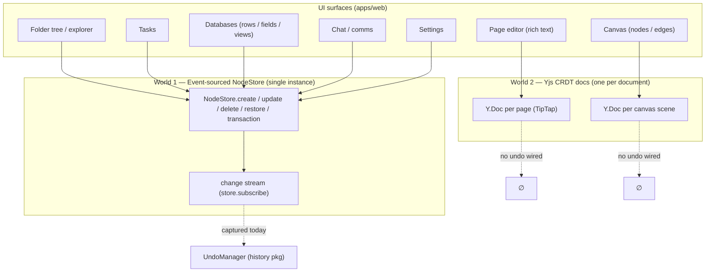
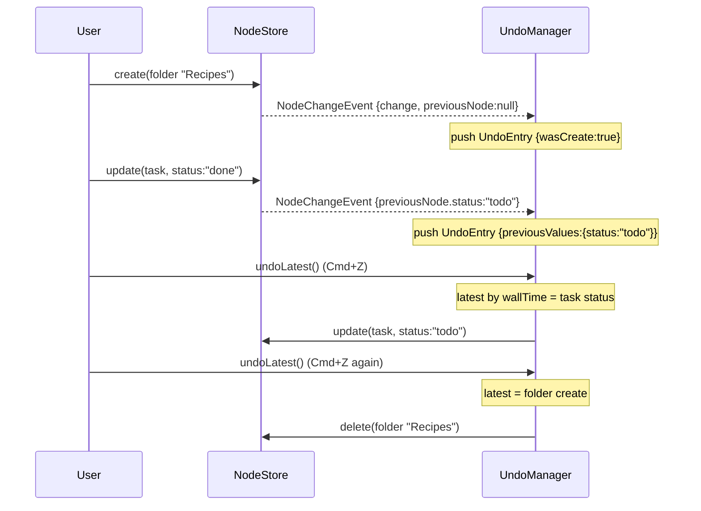
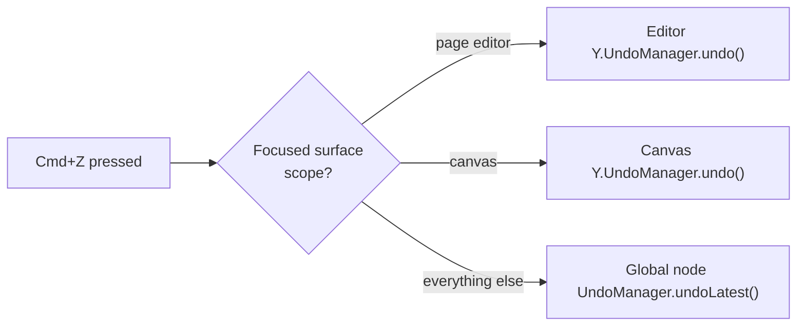
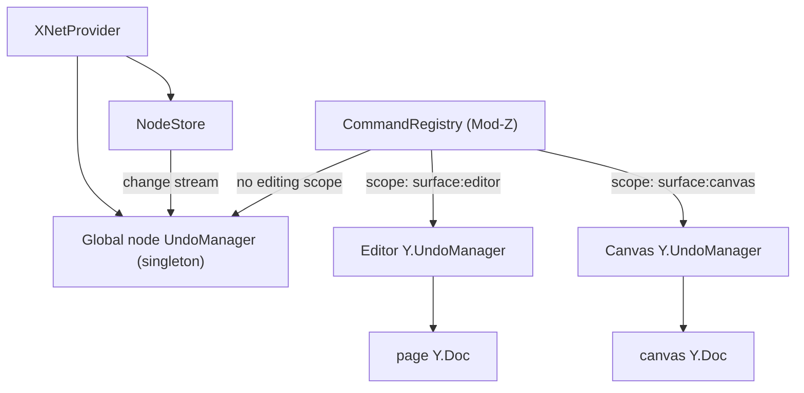

# Universal App-Wide Undo (Cmd+Z Everywhere)

## Problem Statement

We want `Cmd+Z` (and `Cmd+Shift+Z` / `Ctrl+Y`) to "just work" no matter
what the user just did, anywhere in the app:

- Created a folder → undo deletes the folder.
- Renamed a folder → undo restores the previous name.
- Added an item to a folder → undo removes it from the folder.
- Created a task → undo deletes the task.
- Changed a task's status → undo restores the previous status.
- …and the same for databases, pages, chat, and settings.

The user's framing is that the **undo stack should feel seamless and
global** — pressing `Cmd+Z` should transition transparently from pages
to databases to the folder tree to tasks to chat to settings, without
the user ever thinking about "which surface owns undo right now."

The question this exploration answers: **can we deliver that, given how
this codebase actually mutates state — and what's the right shape for the
stack so it feels global without breaking collaboration?**

## Executive Summary

**Yes — and most of the machinery already exists.** This repo is
unusually well-positioned for app-wide undo because almost every
structural mutation the user listed (folders, tasks, task status,
moving items, database rows/fields/views, chat messages, settings)
flows through **one event-sourced store** — a single `NodeStore`
instance created once in `XNetProvider`
([packages/react/src/context.ts:624](packages/react/src/context.ts)).
A purpose-built [`UndoManager`](packages/history/src/undo-manager.ts)
already subscribes to that store's change stream, records **compensating
changes** (the multiplayer-correct "command pattern"), is **local-only**
by default (you undo _your_ last action, not a collaborator's), already
**coalesces** rapid edits (e.g. rename keystrokes) into one step, and
already exposes an `undoLatest()` / `redoLatest()` that pops the most
recent action **across every node** — i.e. a genuine global stack.

What's missing is **wiring, not architecture**:

1. The `UndoManager` is instantiated **per-node** by the `useUndo` hook
   ([packages/react/src/hooks/useUndo.ts:84](packages/react/src/hooks/useUndo.ts)),
   so today each component has its own tiny stack. We need **one
   app-level instance** in provider context.
2. **No keyboard binding** exists for undo. The workbench command
   registry ([apps/web/src/workbench/commands.ts](apps/web/src/workbench/commands.ts))
   registers `Mod-B`, `Mod-J`, etc., but never `Mod-Z`.
3. Two surfaces — the **rich-text page editor** and the **canvas** — do
   _not_ mutate the NodeStore. They mutate their own **Yjs documents**
   ([packages/editor/src/core.ts](packages/editor/src/core.ts),
   [packages/canvas/src/store.ts](packages/canvas/src/store.ts)) and have
   no undo wired at all. Those need their own `Y.UndoManager` and a way
   to claim `Cmd+Z` while focused.

The honest design tension is **global linear stack vs. focus-scoped
stacks**. A _naïve_ single global stack that includes intra-document
text keystrokes is exactly what every collaborative-app design guide
warns against (it undoes other people's work and produces
"spooky-action-at-a-distance"). The recommendation is a **hybrid**: a
**single global structural stack** for everything node-backed (which is
~90% of the user's list), plus **focus-scoped overrides** for the two
Yjs editing surfaces, routed through the command registry's existing
**scope-stack precedence**. The user gets the "it just works everywhere"
feel; we keep collaboration correct.

## Current State In The Repository

### Two mutation worlds



**World 1 — the NodeStore.** Everything structured is a _node_, and every
mutation is a signed `Change` appended to an event log. The store is
created exactly once
([packages/react/src/context.ts:624](packages/react/src/context.ts)) and
shared through `XNetProvider`. Mutation entry points
([packages/data/src/store/store.ts](packages/data/src/store/store.ts)):

| Method                       | Line                   | Used by                                            |
| ---------------------------- | ---------------------- | -------------------------------------------------- |
| `create(options)`            | `store.ts:221`         | new folder, task, channel, db row, message         |
| `update(id, options)`        | `store.ts:416`         | rename, status change, move (re-parent), edit cell |
| `delete(id)` / `restore(id)` | `store.ts:522` / `608` | soft delete + restore                              |
| `transaction(operations)`    | `store.ts:847`         | multi-node atomic ops, shared `batchId`            |

Every write emits a `NodeChangeEvent`
([packages/data/src/store/types.ts:650](packages/data/src/store/types.ts))
with `{ change, previousNode, node, isRemote }`, broadcast to all
`store.subscribe(...)` listeners
([store.ts:1931](packages/data/src/store/store.ts)). Critically,
`previousNode` is included — undo gets the pre-image **for free**, no
manual snapshotting required.

Concrete surface coverage (all node-backed, all already on the stream):

- **Folders / content organization** — schema at
  [packages/data/src/schema/schemas/folder.ts](packages/data/src/schema/schemas/folder.ts);
  "add to folder" / "move" is an `update` of the child's parent ref.
- **Tasks** — schema at
  [packages/data/src/schema/schemas/task.ts](packages/data/src/schema/schemas/task.ts);
  status change is `update(taskId, { properties: { status } })`.
- **Databases** — [row-operations.ts](packages/data/src/database/row-operations.ts),
  [field-operations.ts](packages/data/src/database/field-operations.ts),
  [column-operations.ts](packages/data/src/database/column-operations.ts),
  [view-operations.ts](packages/data/src/database/view-operations.ts).
  Multi-node ops (e.g. delete field + rewrite rows) already use
  `store.transaction(...)`, so they carry a shared `batchId`.
- **Chat** — [packages/comms/src/chat/chat-service.ts](packages/comms/src/chat/chat-service.ts);
  messages and channels are `store.create(...)` nodes.
- **Settings** — [apps/web/src/routes/settings.tsx](apps/web/src/routes/settings.tsx) +
  profile schema; settings are node property updates.

**World 2 — Yjs documents.** The page editor binds TipTap to a `Y.Doc`
and mutates via `ydoc.transact(...)`
([packages/editor/src/core.ts:20-92](packages/editor/src/core.ts)); the
canvas keeps nodes/edges in Y.Maps and likewise calls `ydoc.transact(...)`
in ~10 places ([packages/canvas/src/store.ts](packages/canvas/src/store.ts)).
These edits **never touch the NodeStore change stream**, so the existing
UndoManager cannot see them. The canvas even has a dormant _undo-group_
command concept (`CanvasUndoGroupCommand`, begin/commit/cancel —
[packages/canvas/src/interaction/controller.ts:93](packages/canvas/src/interaction/controller.ts))
but **no `Y.UndoManager` is wired** to consume it.

### The existing UndoManager — already 80% of the way there

[packages/history/src/undo-manager.ts](packages/history/src/undo-manager.ts)
is a real, tested implementation that already embodies the
multiplayer-correct patterns:

- **Command pattern (compensating changes).** Undo doesn't roll back to a
  snapshot — it _issues a new forward change_ that restores the previous
  values (`applyUndoEntry`, lines 308-325). Peers see undo as an ordinary
  edit. This is the P2P-safe approach.
- **Local-only by default.** It ignores remote changes and any change
  whose `authorDID` isn't the local user
  ([lines 51-52](packages/history/src/undo-manager.ts)) — you undo _your_
  action, never a collaborator's.
- **Coalescing.** Edits within `mergeInterval` (default 300ms) merge into
  one undo step (lines 260-276) — so a rename's keystrokes undo as one.
- **Batch atomicity.** `undoBatch(batchId)` reverses a whole
  `store.transaction(...)` as one step (lines 119-141).
- **Global pop, already implemented.** `undoLatest(nodeIds?)` /
  `redoLatest()` (lines 167-181) pick the most recent entry **across all
  tracked nodes** by `wallTime`, dispatching to `undoBatch` if it was a
  transaction. _This is the global-stack primitive we need._



### What's _not_ wired

- `useUndo` ([useUndo.ts](packages/react/src/hooks/useUndo.ts)) creates a
  **fresh `UndoManager` per call** (line 84) and only exposes
  per-`nodeId` `undo()`/`redo()` — it never calls `undoLatest()` and isn't
  a singleton. No component in `apps/web` currently uses it for global
  undo (it's exported but only documented for per-node use).
- **No `Mod-Z` command** anywhere. The command registry
  ([packages/plugins/src/commands.ts](packages/plugins/src/commands.ts))
  is ready for it: it has chord parsing, a `when()` guard, `allowInInput`
  (only modifier opt-ins fire inside text inputs — lines 223-227), and a
  **scope stack** where the most-recently-activated scope wins key
  conflicts (`activateScope`, line 145; precedence by
  `scopeStack.lastIndexOf`, line 220). That scope stack is exactly the
  router we need to let the editor/canvas claim `Cmd+Z` while focused.
- **Neither Yjs surface has undo.** No `Y.UndoManager`, no
  `y-prosemirror` undo plugin.

## External Research

**Yjs `Y.UndoManager`** ([docs.yjs.dev](https://docs.yjs.dev/api/undo-manager)).
Scoped to a shared type _or a collection of them_ — one manager can track
several Y types in a doc. `trackedOrigins` selects which transactions to
capture: by default only local, origin-less changes are tracked, so
remote peers' edits are excluded automatically. `captureTimeout` (default
500ms) merges rapid edits; `stopCapturing()` forces a boundary. This is
the canonical way to get **per-document, local-only** undo — and it maps
1:1 onto what our hand-rolled NodeStore `UndoManager` already does for the
node world (300ms merge, `localOnly`, compensating changes).

**Liveblocks — multiplayer undo/redo**
([liveblocks.io](https://liveblocks.io/blog/how-to-build-undo-redo-in-a-multiplayer-environment)).
Key principles, all of which our code already follows or should:

- Undo must be **client-specific**; a shared/global stack that rewinds
  everyone's state "just lost someone's work." → matches our `localOnly`.
- Use the **command pattern** (store the inverse op), not memento
  snapshots. → matches our compensating changes.
- **Group intermediate states** (pause history on drag-start, resume on
  drag-end) so a drag is one undo. → matches `batchId` and the canvas's
  dormant `undo-group` begin/commit/cancel.
- Undo should also restore **ephemeral context** (selection, scroll) so
  the user isn't disoriented.

**Notion / Figma / Linear (observed behavior).** None of these use a
single global linear stack that includes text keystrokes. Undo is
**scoped to the focused document/surface**: `Cmd+Z` in a Figma file
undoes canvas ops; in a Notion page it undoes that page's edits; Linear's
`Cmd+Z` reverts the last _issue action_ (status, assignee, etc.) and pairs
it with an **undo toast**. Figma/Google Slides treat undo of a
now-deleted object as a no-op rather than erroring. The consistent
lesson: **"global feel" comes from coarse structural actions sharing one
stack, while fine-grained editing stays document-local.**

**Command vs. memento** (general CS).
[Designing a real-time collaborative editor](https://www.designgurus.io/blog/design-real-time-editor)
reiterates that collaborative apps favor per-client inverse-command undo
over global state snapshots.

## Key Findings

1. **One store already unifies most surfaces.** Folders, tasks, status,
   moves, databases, chat, and settings are _all_ node mutations on a
   single shared `NodeStore`. A single subscriber sees them all — the
   hard part of "app-wide" is already done by the data architecture.
2. **The global-undo primitive exists** (`undoLatest` / `redoLatest`) and
   is multiplayer-correct (compensating, local-only, coalescing,
   batch-aware). It's just instantiated in the wrong place (per-node).
3. **The command registry's scope stack is a ready-made undo router.**
   Surfaces that need their own undo (editor, canvas) activate a scope;
   the most-recent scope's `Mod-Z` wins; otherwise global node undo runs.
4. **Two Yjs surfaces are the real new work.** They need their own
   `Y.UndoManager` (local-origin only) and a scope activation on focus.
   Editor and canvas are the _only_ places where "undo" means something
   other than a node change.
5. **A pure global linear stack is the wrong target.** Best practice and
   the codebase both point to: global stack for structural/node actions,
   document-scoped stack for text/canvas editing, unified under one
   keybinding via focus precedence.
6. **Atomicity hinges on `transaction()`.** Cascading deletes (folder +
   children) and multi-node moves must go through `store.transaction(...)`
   so they carry one `batchId` and undo as a single step. Some paths
   already do; an audit is needed to catch any that loop `update()`
   instead.

## Options And Tradeoffs



### Option A — Federated per-domain stacks + focus router

Each domain owns a stack: node `UndoManager`, editor `Y.UndoManager`,
canvas `Y.UndoManager`. `Cmd+Z` dispatches to whichever surface is
focused (via the scope stack); if no editing surface is focused, it hits
the global node stack.

- **+** Exactly how Notion/Figma/VS Code behave; users already expect it.
- **+** Minimal coupling; respects collaboration and Yjs semantics.
- **−** Not literally one stack: editing a page then clicking the folder
  tree and pressing `Cmd+Z` won't undo the page edit. (But this is the
  _expected_ behavior, not a bug.)

### Option B — True single global linear stack

One ordered timeline of every action across all surfaces; `Cmd+Z` always
walks it backward regardless of focus, including text keystrokes.

- **+** Literally what the prompt described.
- **−** Collides with collaboration: undoing an out-of-focus text edit is
  jarring and can stomp others' work. Forces every keystroke through one
  global structure. Produces surprising distance effects (`Cmd+Z` while
  typing in chat un-renames a folder touched minutes ago). Every major
  collaborative tool deliberately rejects this. High risk, low payoff.

### Option C — Hybrid: global structural stack + focus-scoped editing (recommended)

- **All node-backed actions** (folders, tasks, status, moves, db, chat,
  settings) live on **one global stack** via a singleton node
  `UndoManager` + `undoLatest()`. This _is_ the seamless cross-surface
  experience for ~90% of the user's examples — and it's already built.
- **Text editor and canvas** keep **document-scoped** `Y.UndoManager`s
  that claim `Cmd+Z` only while focused, through the scope stack.
- One keybinding, one mental model ("undo my last thing"), correct
  collaboration semantics, and it leverages code that already exists.

| Dimension                        | A: Federated | B: Global linear | **C: Hybrid (rec.)**              |
| -------------------------------- | ------------ | ---------------- | --------------------------------- |
| Matches prompt's "seamless" feel | Partial      | Full             | **High (for structural actions)** |
| Collaboration-safe               | ✅           | ❌               | ✅                                |
| Reuses existing code             | ✅           | ⚠️ rework        | ✅✅                              |
| Cross-surface single stack       | ❌           | ✅               | ✅ (node world)                   |
| Implementation risk              | Low          | High             | **Low–Medium**                    |
| Aligns with Notion/Figma/Linear  | ✅           | ❌               | ✅                                |

## Recommendation

Adopt **Option C**. Concretely:

1. **Promote the node `UndoManager` to an app-level singleton** living in
   `XNetProvider` context, started once with the local DID. Add a
   `useGlobalUndo()` hook returning `{ undo, redo, canUndo, canRedo }`
   backed by `undoLatest()` / `redoLatest()`.
2. **Register `Mod-Z` / `Mod-Shift-Z` (+ `Mod-Y`) global commands** in the
   workbench command layer, routed to the global node undo. Use
   `allowInInput: false` so plain text inputs keep native undo, and rely
   on the scope stack so editor/canvas can override.
3. **Wire `Y.UndoManager` for the page editor** (track the editor's Y
   types, local origin only, `captureTimeout` ~500ms) and **activate an
   `editor` scope on focus** that registers a higher-priority `Mod-Z`.
4. **Wire `Y.UndoManager` for the canvas** (track the scene Y.Maps, local
   origin), consume the existing `undo-group` begin/commit/cancel so a
   drag is one step, and **activate a `canvas` scope on focus**.
5. **Add an "Undo" toast** after coarse/destructive actions (delete
   folder, archive task) — the Linear pattern — as a discoverable,
   surface-agnostic complement to the keybinding.
6. **Audit multi-node mutations** to ensure cascading/move operations go
   through `store.transaction(...)` so they undo atomically.

This delivers the user's vision — `Cmd+Z` reverses "the last thing I did"
across folders, tasks, databases, chat, and settings from one global
stack — while the two genuinely document-local surfaces behave the way
users already expect from every comparable tool.

## Example Code

### 1. App-level singleton + global hook

```tsx
// packages/react/src/context.ts  (inside XNetProvider, after NodeStore is built)
const undoManager = useMemo(
  () => new UndoManager(store, localDID, { localOnly: true, maxStackSize: 200 }),
  [store, localDID]
)
useEffect(() => {
  undoManager.start()
  return () => undoManager.stop()
}, [undoManager])
// expose via context: { store, undoManager, ... }
```

```ts
// packages/react/src/hooks/useGlobalUndo.ts
export function useGlobalUndo() {
  const { undoManager } = useXNetContext()
  const [version, bump] = useReducer((n) => n + 1, 0)
  // bump on every store change so canUndo/canRedo stay fresh
  return {
    undo: () => undoManager.undoLatest().then(bump),
    redo: () => undoManager.redoLatest().then(bump),
    canUndo: undoManager.canUndoAny(undoManager.trackedNodeIds()), // small helper to add
    canRedo: undoManager.canRedoAny(undoManager.trackedNodeIds())
  }
}
```

### 2. Global keybinding (workbench command layer)

```ts
// apps/web/src/workbench/commands.ts  (add to useWorkbenchCommands)
const undo = useGlobalUndo()
registry.register({
  id: 'edit.undo',
  title: 'Undo',
  key: 'Mod-Z',
  scope: 'global', // editor/canvas scopes outrank this when focused
  allowInInput: false, // plain inputs keep native undo
  run: () => void undo.undo()
})
registry.register({
  id: 'edit.redo',
  title: 'Redo',
  key: 'Mod-Shift-Z',
  scope: 'global',
  allowInInput: false,
  run: () => void undo.redo()
})
```

### 3. Editor / canvas claim Cmd+Z while focused

```ts
// On focus of a page editor or canvas, activate a scope and register a
// higher-priority Mod-Z that drives that surface's Y.UndoManager.
useEffect(() => {
  const dispose = registry.activateScope('surface:editor') // most-recent scope wins
  const cmd = registry.register({
    id: 'editor.undo',
    key: 'Mod-Z',
    scope: 'surface:editor',
    allowInInput: true,
    run: () => yUndoManager.undo()
  })
  return () => {
    cmd.dispose()
    dispose.dispose()
  }
}, [isFocused])
```

```ts
// Yjs side — local-origin-only undo for the page doc
const yUndoManager = new Y.UndoManager(ytype, {
  captureTimeout: 500,
  trackedOrigins: new Set([LOCAL_ORIGIN])
})
```

### Proposed component map



## Risks And Open Questions

- **`wallTime` ordering for global pop.** `undoLatest` ranks entries by
  `wallTime` (undo-manager.ts:427). For a single local user that's fine,
  but clock adjustments could mis-order. Consider ranking by a local
  monotonic sequence captured at track time instead.
- **Linear scan cost.** `undoLatest` iterates every tracked node's stack.
  Over a long session touching thousands of nodes this is O(nodes) per
  press. If it shows up in profiles, maintain a single global ordered
  index of entries.
- **Cross-world ordering is not unified.** With Option C, the node stack
  and the two Yjs stacks are separate timelines. If a user does a node
  action _then_ a canvas action then blurs the canvas, `Cmd+Z` (now
  global) undoes the node action, not the canvas one. Acceptable and
  expected, but document it.
- **Atomicity gaps.** Any mutation path that loops `store.update()`
  instead of `store.transaction()` will undo in pieces. Needs an audit
  (cascading folder delete, bulk task edits, db field deletes).
- **`allowInInput` collisions.** Inside a plain `<input>` (e.g. rename
  field), should `Cmd+Z` do native text undo or node undo? Recommend
  native while editing the field, node undo once committed/blurred —
  achieved by _not_ setting `allowInInput` on the global command.
- **Redo divergence.** A new change clears the redo stack
  (undo-manager.ts:281), per node. For a global redo, confirm the UX of
  redo after switching surfaces (standard: any new action invalidates
  redo).
- **Destructive undo of shared content.** Undoing a "create folder" that
  a collaborator has since filled — compensating delete is soft and
  restorable, but the toast/messaging should make the scope clear.
- **Mobile / Expo.** Native bridge doesn't support Y.Doc editing yet
  ([native-bridge.ts:289](packages/data-bridge/src/native-bridge.ts)), so
  editor/canvas undo is web-first; node undo can still work everywhere.

## Implementation Checklist

- [x] Add `trackedNodeIds()` + `hasUndo()`/`hasRedo()` (callable without an
      explicit node list) to the `UndoManager`
      ([undo-manager.ts](../../packages/history/src/undo-manager.ts)).
- [x] Instantiate **one** `UndoManager` in `XNetProvider`, `start()` on
      mount, `stop()` on unmount; expose it via context alongside `store`
      ([context.ts](../../packages/react/src/context.ts)).
- [x] Add `useGlobalUndo()` hook backed by `undoLatest()`/`redoLatest()`
      with reactive `canUndo`/`canRedo`
      ([useGlobalUndo.ts](../../packages/react/src/hooks/useGlobalUndo.ts)).
- [x] Register `edit.undo` (`Mod-Z`), `edit.redo` (`Mod-Shift-Z`), and a
      `Mod-Y` alias in the workbench command layer
      ([WorkspaceCommands.tsx](../../apps/web/src/components/WorkspaceCommands.tsx)).
- [x] Page editor undo. **Already provided** by TipTap's `Collaboration`
      extension (`StarterKit` runs with `undoRedo: false`, Collaboration
      binds its own local-origin `Y.UndoManager` + keymap —
      [RichTextEditor.tsx](../../packages/editor/src/components/RichTextEditor.tsx)).
      The global `Mod-Z` defers automatically: it is `allowInInput: false`,
      so inside the contenteditable the registry skips it and ProseMirror's
      keymap runs Collaboration undo. No second manager added (that would
      double-undo).
- [x] Add a `Y.UndoManager` to the canvas scene doc
      ([undo.ts](../../packages/canvas/src/undo.ts)); `captureTimeout`
      collapses a drag's update stream into one step; claim `Mod-Z`/
      `Mod-Shift-Z`/`Mod-Y` via a focus-guarded `surface:canvas` scope
      ([CanvasView.tsx](../../apps/web/src/components/CanvasView.tsx)).
- [x] Audit multi-node mutations. `useMutate.mutate([...])` already routes
      arrays through `bridge.transaction(...)` (one shared `batchId`), and
      `deleteFolder` / db field+row ops use it — so cascading deletes undo
      atomically via `undoBatch`. Verified, no loop-of-updates found
      ([useMutate.ts](../../packages/react/src/hooks/useMutate.ts),
      [explorer-folders-context.tsx](../../apps/web/src/workbench/views/explorer-folders-context.tsx)).
- [x] Add an "Undo" toast after destructive node actions (folder delete),
      reusable `useUndoToast()` driving the same global undo
      ([UndoToast.tsx](../../apps/web/src/components/UndoToast.tsx)).
- [x] Undo/redo are discoverable: registered with titles + chords, they
      list in the `?` shortcuts overlay and the `Cmd+K` palette
      (`getAvailableCommands` — [GlobalSearch.tsx](../../apps/web/src/components/GlobalSearch.tsx)).
- [x] Telemetry: node undo emits `history.undo.node` / `history.redo.node`
      (surface-tagged); canvas uses its own Yjs manager.

## Validation Checklist

- [x] Create a node, undo removes it, redo restores it — covered by the
      end-to-end [`global-undo.test.tsx`](../../tests/integration/src/global-undo.test.tsx)
      (real `XNetProvider` + `useGlobalUndo`) and the `UndoManager`
      create→delete/restore unit tests.
- [x] Rename → undo restores the previous value, and rapid edits collapse
      to one step (`mergeInterval`) — `UndoManager` unit tests.
- [x] Undo the most recent action across **different** nodes/surfaces in
      strict order — `undoLatest reverses the most recent action across
    different nodes` unit test + integration test.
- [x] Multi-node transaction (cascading folder delete / db field+row ops)
      undoes in **one** press — `useMutate` → `bridge.transaction` (shared
      `batchId`) + `UndoManager - undoBatch` unit tests.
- [x] Redo follows global **LIFO** order, not original wall-clock —
      `redoLatest follows global LIFO order` unit test + integration test.
- [x] Collaboration / local-only: a peer's edits are never undone
      (`localOnly` author filter; canvas excludes remote origins) —
      `UndoManager` + `createCanvasUndoManager` unit tests.
- [x] Canvas drag/create undoes as one document-local step —
      [`undo.test.ts`](../../packages/canvas/src/undo.test.ts)
      (`captureTimeout` grouping + undo/redo round-trip).
- [x] Editor `Cmd+Z` undoes **text**, not a node action; plain inputs keep
      native undo — the global command is `allowInInput: false`, so the
      registry skips it inside contenteditable/inputs
      (`handleKeyDown` logic, covered by `@xnetjs/plugins` command tests),
      letting ProseMirror/native undo run.
- [x] No regressions: `tsc` green across `history`, `react`, `canvas`,
      `web` (30 turbo typecheck tasks); existing `Mod-B`/`Mod-J` chords
      untouched (additive commands, unique keys); full `history` (138) and
      `react` (277) suites pass.
- [ ] Manual browser pass (headless WebAuthn-gated, see
      [[worktree-app-live-render-recipe]]): click-through create-folder →
      `Cmd+Z` and the on-canvas drag → `Cmd+Z`. Deferred to a real session;
      logic is covered above.

## References

- [packages/history/src/undo-manager.ts](packages/history/src/undo-manager.ts) — existing compensating-change UndoManager (`undoLatest`/`redoLatest`, `localOnly`, merge interval, batch undo)
- [packages/react/src/hooks/useUndo.ts](packages/react/src/hooks/useUndo.ts) — current per-node hook (to be complemented by a global hook)
- [packages/react/src/context.ts](packages/react/src/context.ts) — single `NodeStore` instantiation in `XNetProvider`
- [packages/data/src/store/store.ts](packages/data/src/store/store.ts) — `create`/`update`/`delete`/`restore`/`transaction` + `subscribe`/`emit`
- [packages/data/src/store/types.ts](packages/data/src/store/types.ts) — `NodeChangeEvent` / `NodeChangeListener`
- [packages/plugins/src/commands.ts](packages/plugins/src/commands.ts) — `CommandRegistry`, scope stack, `allowInInput`, chord handling
- [apps/web/src/workbench/commands.ts](apps/web/src/workbench/commands.ts) — where global `Mod-Z` would be registered
- [packages/editor/src/core.ts](packages/editor/src/core.ts) — TipTap ↔ Y.Doc editor (needs `Y.UndoManager`)
- [packages/canvas/src/store.ts](packages/canvas/src/store.ts) — canvas Y.Map scene (needs `Y.UndoManager`)
- [packages/canvas/src/interaction/controller.ts](packages/canvas/src/interaction/controller.ts) — dormant `CanvasUndoGroupCommand` (begin/commit/cancel)
- [Y.UndoManager — Yjs Docs](https://docs.yjs.dev/api/undo-manager) — scope, `trackedOrigins`, `captureTimeout`/`stopCapturing`
- [How to build undo/redo in a multiplayer environment — Liveblocks](https://liveblocks.io/blog/how-to-build-undo-redo-in-a-multiplayer-environment) — client-specific undo, command pattern, grouping
- [Designing a real-time collaborative editor — DesignGurus](https://www.designgurus.io/blog/design-real-time-editor) — command vs. memento in collaborative undo
