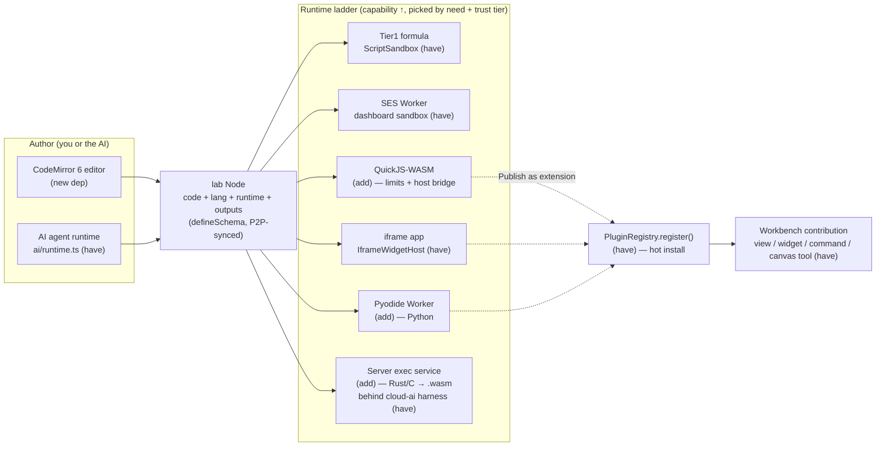
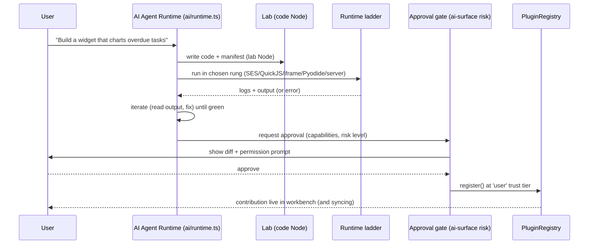

# Code As A First-Class Citizen: Labs, Runtimes, And In-App Extensibility

> Status: exploration / not yet implemented
> Sequence: 0180
> Theme: making xNet programmable from inside xNet — a "Lab" surface, a layered
> code-execution runtime ladder, and AI-authored extensions that hot-install
> into the live workbench.

## Problem Statement

xNet is a local-first workspace built from a large set of open packages
(`@xnetjs/*`). Today the workspace lets you author **content** (pages,
databases, canvases, dashboards, chat) but not **behavior**. The closest we get
is the formula/script tier: AST-validated arrow functions for computed columns
and triggers. There is no place where a user can:

- write and run a real program (JavaScript today; ideally Python, Rust, C too),
- iterate on a small app or visualization in a sandbox ("a little mini-lab"),
- ask the AI to generate that app or an *extension*, and then
- **plug the result into xNet itself** — a new view, widget, slash command,
  canvas tool, or property handler — without leaving the app or shipping a build.

The ask is a *metaprogramming layer*: the same open APIs that we use to build
xNet, surfaced inside xNet so the product becomes "easy to modify and extend and
customize" from within. The goal is not to turn xNet into VS Code. It is to make
**code a first-class node type** alongside pages and canvases, and to let agentic
coding produce running, installable artifacts.

The hard parts are (1) safely executing untrusted code in a local-first app that
also runs in Electron and on mobile, (2) supporting genuinely different languages
(interpreted JS vs. compiled Rust/C) without pretending the browser can do
things it cannot, and (3) connecting generated artifacts to the existing plugin
contribution surface without weakening the trust model.

## Executive Summary

**xNet already has ~70% of the metaprogramming substrate** — it is just not
surfaced as a first-class "code" experience:

- A full **plugin/extension system** with a manifest (`XNetExtension`,
  `defineExtension`), a wide contribution surface (views, widgets, commands,
  slash commands, editor extensions, blocks, property handlers, canvas
  cards/tools/layouts/ingestors, settings, schemas), a `PluginRegistry` with
  hot `register/activate/deactivate`, a `PluginPermissions` model, and plugins
  **stored as Nodes** so they P2P-sync like any other data
  (`packages/plugins/`).
- **Three execution tiers already shipped**:
  1. **Formula/script tier** — `ScriptSandbox` with `acorn` AST validation,
     global shadowing, and a timeout (`packages/plugins/src/sandbox/`).
  2. **User-widget tier** — SES `lockdown()` + `Compartment` inside a
     terminable Web Worker, returning a serializable `SafeNode` tree
     (`packages/dashboard/src/sandbox/`).
  3. **Marketplace tier** — sandboxed `iframe` / Electron webview
     (`IframeWidgetHost`).
- **Host-assigned trust tiers** (`first-party | user | marketplace`) that are
  *never self-declared* by the code (`packages/dashboard/src/types.ts`).
- An **AI authoring path**: `ScriptGenerator` (Anthropic/OpenAI/Ollama), an
  in-app agent runtime with threads/approvals/events (`ai/runtime.ts`), in-tab
  model connectors (WebLLM + Prompt API), a propose/approve mutation surface
  (`ai-surface/`), an **MCP server**, a localhost REST API, and a files-first
  agent skill (`ai-surface/skill.ts`).

**What is missing** is the connective tissue and the heavyweight runtimes: a
**code editor** (no CodeMirror/Monaco today), a **first-class `lab` node type**
in the workbench, a **runtime ladder** that climbs from formula-tier up through
QuickJS-WASM, iframe apps, Pyodide, and a server-side compile/exec service for
Rust/C, and the **AI→manifest→hot-install** loop that turns a lab into an
installed extension.

**Recommendation:** build a **Lab** node type and a **runtime ladder**, reusing
the existing trust-tier and sandbox machinery rather than inventing new
isolation. Ship in four arcs:

1. **Lab MVP** — CodeMirror editor + a `lab` node + the SES-Worker JS runtime we
   already have, with console/output capture. (Pure client, no new infra.)
2. **App labs** — QuickJS-WASM for deterministic untrusted JS, and an
   `iframe`-tier "app preview" for DOM-bearing mini-apps; `esbuild-wasm`/SWC for
   in-browser TS/JSX transpile.
3. **Polyglot** — Pyodide (Python) in a Worker; a **server-side exec service**
   (hub/cloud) for Rust and C compile-to-WASM, returning `.wasm` to run locally.
4. **Lab → Extension** — "Publish as extension": the AI/user emits a manifest,
   the host installs it at the `user` trust tier, and it hot-registers into the
   live `PluginRegistry`. This is the metaprogramming payoff.

## Current State In The Repository

### The plugin/extension substrate (`packages/plugins/`)

The manifest and contribution model is already broad and stable:

- `packages/plugins/src/manifest.ts` — `XNetExtension` (id, version,
  `platforms`, `permissions`, `contributes`, `activate/deactivate`) and
  `validateManifest` / `defineExtension`.
- `packages/plugins/src/contributions.ts` — the full contribution surface:
  `ViewContribution`, `WidgetContribution`, `CommandContribution`,
  `SlashCommandContribution`, `EditorContribution`, `BlockContribution`,
  `PropertyHandlerContribution`, `SettingContribution`, `SchemaContribution`,
  and a deep canvas set (`CanvasCardContribution`, `CanvasToolContribution`,
  `CanvasLayoutContribution`, `CanvasIngestorContribution`, …). Trust tier is
  *host-assigned* at registration; "plugins never self-declare it."
- `packages/plugins/src/registry.ts` — `PluginRegistry` with
  `register/activate/deactivate/getAll/onChange` (subscribed by the UI).
- `packages/plugins/src/types.ts` — `PluginPermissions` (`schemas.read/write/
  create`, `capabilities.network` as bool|domain-allowlist, `storage`,
  `clipboard`, `notifications`, `processes`) and `getPlatformCapabilities()`
  (Electron unlocks `processes`, `localAPI`, `filesystem`; mobile is the most
  restricted).
- `packages/plugins/src/schemas/script.ts` + `schemas/plugin.ts` — scripts and
  plugins are **`defineSchema` Nodes**, so they sync over P2P like everything
  else. `ScriptNode` already has `code`, `triggerType`
  (`manual|onChange|onView|scheduled`), `outputType`
  (`value|mutation|decoration|void`), `inputSchema`, `enabled`, `lastError`,
  `lastRun`.
- `apps/web/src/components/PluginManager.tsx` — install / enable / disable /
  uninstall UI, wired to `useXNet().pluginRegistry`.

### The three execution tiers that already exist

```mermaid
flowchart TD
  subgraph T1["Tier 1 · Formula/Script — packages/plugins/src/sandbox"]
    A1["acorn AST validation<br/>FORBIDDEN_GLOBALS (no fetch/Function/timers/DOM)"]
    A2["global shadowing + timeout"]
    A3["ScriptSandbox.execute / executeSync"]
    A1 --> A2 --> A3
  end
  subgraph T2["Tier 2 · User Widget — packages/dashboard/src/sandbox"]
    B1["SES lockdown() frozen intrinsics"]
    B2["Compartment endowments: JSON, Math, console.log"]
    B3["Web Worker: CPU isolation + terminate()"]
    B4["returns serialized SafeNode tree (no live refs)"]
    B1 --> B2 --> B3 --> B4
  end
  subgraph T3["Tier 3 · Marketplace — IframeWidgetHost"]
    C1["sandboxed iframe / Electron webview"]
    C2["postMessage bridge"]
    C1 --> C2
  end
  T1 -. "more capability, weaker determinism" .-> T2 -. .-> T3
```

- **Tier 1 — formula/script.** `packages/plugins/src/sandbox/sandbox.ts`
  (`ScriptSandbox`), `ast-validator.ts` (acorn; `FORBIDDEN_GLOBALS` includes
  `window/document/fetch/eval/Function/setTimeout/...`), and `runner.ts`
  (`ScriptRunner` reacts to triggers). This is the right tier for computed
  columns and small transforms; it is *deliberately* incapable of running an
  app. There are also two formula engines proper: `packages/formula/`
  (lexer/parser/evaluator) and `packages/data/src/database/formula/`.
- **Tier 2 — user widgets.** `packages/dashboard/src/sandbox/compartment.ts`
  (`evaluateUserWidget` inside a SES `Compartment`), `user-widget-worker.ts`
  (locks down the realm, serves render requests, forces JSON-pure output),
  `UserWidgetHost.tsx` (Worker with a 2s render timeout + respawn-on-runaway),
  and a `safe-node.ts` renderer. `ses` is a real dependency
  (`packages/dashboard/package.json`).
- **Tier 3 — marketplace.** `IframeWidgetHost.tsx` for fully untrusted UI code.

Trust tiers: `WidgetTrustTier = 'first-party' | 'user' | 'marketplace'`
(`packages/dashboard/src/types.ts`), assigned by the host from the install
source. This invariant — *capability follows provenance, not self-declaration* —
is the backbone any new runtime must inherit.

### The AI / agentic surface

- `packages/plugins/src/ai/generator.ts` — `ScriptGenerator` (NL → script).
- `packages/plugins/src/ai/runtime.ts` — in-app agent runtime: threads,
  turns, **approvals** (`waiting-approval`), an event stream
  (`model.delta`, `tool.call`, `approval.requested`, `background.*`), and an
  `AiAgentOrchestratorMode = 'custom' | 'codex-app-server' | 'hybrid'`.
- `packages/plugins/src/ai/connectors/` — `webllm-provider.ts` (in-tab WebGPU
  model via `@mlc-ai/web-llm`, structurally typed so the package stays
  node-safe), `prompt-api-provider.ts` (browser built-in AI), `detect.ts`.
- `packages/plugins/src/ai-surface/` — `AiMutationPlan`, `AiScope`,
  `AiRiskLevel` (the propose/approve write model), and `skill.ts`
  (`XNET_AGENT_SKILL_MD`, the files-first "vault checkout + `xnet` CLI"
  contract; token-budgeted, kept stable for prompt caching).
- `packages/plugins/src/services/` — `mcp-server.ts` + `mcp-http.ts` +
  `mcp-guardrail.ts` (expose xNet to agents over MCP, with a write guardrail),
  `local-api.ts` (localhost REST on `:31415`, Electron), `process-manager.ts`,
  `webhook-emitter.ts`.
- `packages/cloud-ai/src/agent-runner.ts` — a **server-side agent-safety
  harness**: `allowedTools` allow-list, `preToolUse` deny point
  (prompt-injection), per-session **token-cap circuit breaker**, model injected
  as a `ModelStep` for deterministic testing. This is exactly the harness a
  server-side code-exec service should sit behind.
- `packages/cli/src/commands/agent.ts` — CLI agent commands.

### The workbench seam where a "Lab" plugs in

The workbench is a node-type-keyed tab system:

- `apps/web/src/workbench/state.ts` — `TabNodeType =
  'page'|'database'|'canvas'|'dashboard'|'savedview'|'tasks'|'data'|'channel'|
  'tag'|'person'`.
- `apps/web/src/workbench/ViewHost.tsx` — `HOSTED_VIEWS: Record<TabNodeType,
  Component>` direct-mounts each view.
- `apps/web/src/workbench/tabs.ts` — `TAB_VIEWS` (label + icon per type).
- `apps/web/src/workbench/Rail.tsx` — `LEFT_VIEW_ITEMS` (Explorer, Chats, Tasks,
  Data, AI).

Adding a first-class `lab` (or `code`) surface is mechanically a known move:
extend `TabNodeType`, add to `TAB_VIEWS`/`HOSTED_VIEWS`, add a schema, optionally
add a Rail entry. We have done this repeatedly (dashboard, tasks, channel, tag,
person are all the same shape).

### What does **not** exist yet

- **No code editor.** No `monaco`, `codemirror`, `@codemirror/*`, `shiki`, or
  `prismjs` anywhere (`grep` is empty). We render rich text with TipTap, not
  code.
- **No heavyweight runtimes.** No `@webcontainer/api`, `pyodide`,
  `quickjs-emscripten`, `esbuild-wasm`, `@swc/wasm`, `wasmer`/`wasmtime`. WASM is
  used in exactly one place: `packages/canvas-core/src/wasm-density.ts`.
- **No `lab`/`code` node type**, no "run" surface, no output/console capture, no
  compile pipeline.
- **No Lab→Extension publish flow** (the registry exists; the authoring-to-
  install bridge does not).

## External Research

(Full technical detail and sources in the runtime survey gathered for this
exploration; condensed here.)

### In-browser JS execution

- **QuickJS-WASM** (`quickjs-emscripten`, MIT; ~500 KB gz sync, ~1 MB async):
  Fabrice Bellard's interpreter compiled via Emscripten. **The** primitive for
  untrusted JS with hard limits: `runtime.setInterruptHandler(
  shouldInterruptAfterDeadline(...))` (wall-clock kill) and
  `setMemoryLimit(bytes)`. No DOM/network/timers unless explicitly imported.
  Interpreter — ~2–10× slower than V8, irrelevant for plugin-shaped code.
  **Figma runs all plugin logic in QuickJS** for exactly this reason (after a
  Realm-based sandbox was breached). `quickjs-ng` is the active fork.
- **WebContainers** (StackBlitz): full Node.js + npm in-browser via WASM.
  Powerful, but **not open source**, custom license (free for OSS; commercial
  plans include ~500 sessions/mo, beyond that needs a commercial license), and
  it **requires cross-origin isolation** (`COOP: same-origin` +
  `COEP: require-corp`, HTTPS, every third-party asset CORP-tagged). Heavy
  coupling and licensing risk for a product that is otherwise fully open.
- **Sandpack** (CodeSandbox, MIT): embeddable bundler/runner; the bundler runs
  in a cross-subdomain iframe + Workers, self-hostable
  (`sandpack-bundler`). Good for React/TS previews; fetches npm deps from a CDN
  at runtime (needs network or a pre-populated cache).
- **esbuild-wasm** (~7–8 MB gz, ~10× slower than native) and **@swc/wasm-web**
  (transpile-only, no bundling) for in-browser TS/JSX → JS.

### Python / Rust / C

- **Pyodide** (CPython 3.12 → WASM, ~6.4 MB core, ~4–5 s cold start, sub-second
  warm): runs great in a Web Worker; `micropip` installs pure-Python and
  pre-built WASM wheels (the scientific stack). No threads/subprocess; no
  COOP/COEP needed by default. The standard way to run Python in a browser app.
- **Rust in the browser is not feasible to *compile* client-side** — `rustc`
  depends on LLVM (hundreds of MB to >1 GB as WASM). There is no Pyodide-for-
  Rust. The real patterns are: (a) **build-time** `wasm-pack`/`wasm-bindgen` for
  shipped Rust, and (b) **server-side compile** (the official Rust Playground is
  open source: an Axum backend spawning **per-request Docker** with no network +
  cgroup limits) returning a `.wasm` the browser then runs.
- **C in the browser**: same story — Emscripten/clang is build-time/server-side;
  in-browser you run **pre-compiled WASM**. `PicoC`-WASM exists as a tiny C
  *interpreter* subset for education, not production.

### Server-side sandboxes for untrusted code

- **e2b.dev** — managed Firecracker microVMs for agent code; ~150 ms cold start;
  ~$0.05–0.10/hr/sandbox. Purpose-built for "run LLM-generated code."
- **Cloudflare Workers for Platforms** — V8 isolates, ~ms cold start, software
  (not hardware) isolation; great for TS, weaker for adversarial native code.
- **Deno Subhosting** — permissioned TS isolates (zero perms by default).
- **Fly.io Machines / Firecracker** — hardware-isolated microVMs (~125 ms boot,
  <5 MiB overhead); the strongest practical isolation. **gVisor** (user-space
  kernel, ~10–30% syscall overhead) is a middle option. Plain Docker is *not*
  sufficient alone for adversarial code.
- **wasmtime/wasmer + WASI 0.2 Component Model**: near-native, capability-scoped
  (no ambient authority), ~1–10 ms instantiation — the cleanest server-side host
  for **compiled** user WASM (the output of the Rust/C compile step).

### Prior art for "build/run inside the app"

- **Figma plugins** — UI in a sandboxed iframe, logic in QuickJS with an
  explicit host API bridge. This is the closest analog to what xNet should do.
- **Observable / notebooks** — reactive cells, value-as-output; a model for the
  Lab UX.
- **Obsidian / Raycast / VS Code-web extensions** — manifest + contribution
  points + a marketplace; xNet's plugin system is already shaped like these.
- **Notion/Coda formulas, Retool** — the low end of the same ladder we already
  occupy at Tier 1.

## Key Findings

1. **We should not build one runtime; we should build a ladder.** "Run
   JavaScript" and "run Rust" are not the same problem. The right model is a set
   of tiers ordered by capability and isolation, each picked by what the code
   *needs* and what trust tier it was *installed at* — and we already have the
   bottom three rungs.
2. **Trust must follow provenance, not the language.** The existing invariant
   (host assigns `first-party|user|marketplace`) is the load-bearing wall. A lab
   the user typed is `user`-tier; an AI-generated artifact the user approved is
   `user`-tier; something pulled from a marketplace is `marketplace`-tier and
   gets the iframe. The runtime ladder is orthogonal to and gated by this.
3. **The browser cannot compile Rust/C, and we should not pretend otherwise.**
   Polyglot belongs on a **server-side exec service** behind the existing
   `cloud-ai` agent-safety harness, returning artifacts (`.wasm`, stdout) the
   client runs/renders. This keeps the local-first promise intact: JS/Python run
   locally; Rust/C *compile* remotely but *execute* as local WASM.
4. **The extensibility payoff is the registry, not the editor.** The unique
   value is "AI writes an extension and it hot-installs into the running app."
   The editor and runtimes are means; `PluginRegistry.register()` +
   contribution points are the end. A Lab that can `Publish as extension` is the
   thing nothing else in this space does locally-first.
5. **Most of the agent loop already exists.** `ai/runtime.ts` (threads +
   approvals), `ai-surface` (propose/approve, risk levels), `mcp-server`,
   `cloud-ai/agent-runner` (allow-list + token cap). Agentic coding is mostly a
   matter of giving the agent **file/exec tools scoped to a Lab** and surfacing
   its diffs in the approval UI.
6. **Determinism vs. capability is the core tension.** Tier 1 is fully
   deterministic but can't render; iframe apps are fully capable but opaque.
   **QuickJS sits in the sweet spot** for "trusted-ish compute that must not
   touch the network/DOM" and is the most valuable single addition.

## Options And Tradeoffs

### A. JS runtime for Labs — which engine?

| Option | Isolation | DOM? | Net? | Determinism / limits | Cost | Verdict |
|---|---|---|---|---|---|---|
| **SES Worker (have it)** | Frozen intrinsics + thread | No | No | terminable, JSON-pure out | 0 new | Reuse for compute Labs |
| **QuickJS-WASM** | Separate VM in WASM | No (unless imported) | No | **gas/deadline + memory cap** | ~0.5 MB | **Add — best untrusted JS** |
| **iframe app** | Browser origin sandbox | **Yes** | gated | weak | 0 new | For DOM mini-apps |
| **WebContainers** | WASM OS | Yes (Node) | Yes | weak | license + COOP/COEP | Avoid (licensing/coupling) |

QuickJS is the highest-leverage addition: it gives hard CPU/memory limits and a
clean host-API bridge (the Figma model) that the SES Worker can't, while staying
fully offline and tiny.

### B. The Lab surface — node type vs. panel vs. canvas card

- **First-class `lab` node type (recommended).** Consistent with page/canvas/
  dashboard; gets tabs, explorer placement, sharing, P2P sync, and history for
  free. One more entry in `TabNodeType`/`HOSTED_VIEWS`.
- **Ephemeral panel** (like the AI chat panel). Lower commitment, but labs are
  artifacts worth keeping/sharing — they deserve to be nodes.
- **Canvas card.** Great as a *secondary* surface (drop a Lab onto a canvas via
  the existing `canvasCards` contribution) but not the primary home.

### C. Polyglot execution placement

| Language | Where it runs | Mechanism | Local-first? |
|---|---|---|---|
| JS / TS | client | QuickJS / SES Worker / iframe; SWC/esbuild-wasm to transpile | ✅ |
| Python | client | Pyodide in a Worker | ✅ |
| Rust | **server compiles**, client runs | `wasm-pack` in a sandboxed exec service → `.wasm` to the client | ⚠️ compile online, run local |
| C | **server compiles**, client runs | Emscripten → `.wasm` to the client | ⚠️ same |
| anything heavy | server | e2b-style microVM / wasmtime behind `cloud-ai` harness | ❌ (cloud feature) |

### D. Server-side exec service — build vs. buy

- **Self-host (Rust Playground pattern):** Axum/Node service spawning per-request
  **gVisor or Firecracker** (Docker alone is insufficient for adversarial code),
  behind `cloud-ai/agent-runner` (allow-list + token/time cap). Fits the
  open-core hub story (the `packages/hub` + `packages/cloud-*` line).
- **Buy (e2b/Fly Machines):** fastest path, ~150 ms cold start, usage-priced;
  but introduces a vendor and a non-local dependency. Reasonable for a managed
  tier, not for the OSS default.
- **Recommendation:** make polyglot-compile a **cloud capability** of the managed
  hub (so OSS users get JS+Python locally, managed users get Rust/C), with a
  pluggable backend so self-hosters can wire their own sandbox.

### E. AI authoring → install path

- **Scripts (have it):** `ScriptGenerator` already emits Tier-1 scripts.
- **Labs:** the agent writes Lab `code` and we run it in the chosen runtime; the
  agent runtime's **approval gate** is the human-in-the-loop.
- **Extensions (the goal):** the agent emits an `XNetExtension` manifest +
  contribution code; `validateManifest` + a capability review render a
  permission prompt; on approve, the host assigns the `user` tier and calls
  `PluginRegistry.register()` — the contribution appears live. No build, no
  reload.

## Recommendation

Build **Labs** and the **runtime ladder**, reusing the trust-tier and sandbox
machinery, and land the **Lab → Extension** loop as the headline capability.



### Why this shape

- **Maximal reuse:** three rungs (R0/R1/R3), the registry, the contribution
  surface, the agent runtime, the approval/risk model, and the trust tiers all
  already exist. The genuinely new pieces are: a code editor, a `lab` node +
  view, QuickJS, Pyodide, and the server exec service.
- **Local-first preserved:** JS and Python execute on-device; only Rust/C
  *compilation* needs the network, and the *result* runs locally as WASM.
- **Security inherited, not reinvented:** every rung is gated by the existing
  host-assigned trust tier; QuickJS adds hard CPU/memory caps; the server tier
  sits behind the `cloud-ai` allow-list + token-cap harness and a microVM.
- **The differentiator is the loop:** "describe an extension → AI writes it →
  approve → it's live in your workspace and syncs to your devices." That is the
  metaprogramming layer the prompt is really asking for.

### Concrete next steps (sequenced)

1. **Lab MVP (client-only).** New `lab` node type + `LabView`; CodeMirror 6
   editor; run JS in the existing SES Worker; capture `console`/return value into
   an outputs panel. No new infra, no new isolation.
2. **QuickJS rung + transpile.** Add `quickjs-emscripten` for untrusted JS with
   deadline + memory caps and a small, explicit host-API bridge (xNet query/read
   tools, mirroring the MCP tool surface). Add `@swc/wasm-web` (or
   `esbuild-wasm`) so TS/JSX Labs transpile locally.
3. **App Labs.** An `iframe`-tier "app preview" for DOM-bearing mini-apps,
   reusing `IframeWidgetHost`'s postMessage bridge; live reload on edit.
4. **Python.** Pyodide in a dedicated Worker; lazy-loaded; `micropip` opt-in.
5. **Server exec service.** A hub/cloud `exec` endpoint that compiles Rust
   (`wasm-pack`) and C (Emscripten) inside a gVisor/Firecracker sandbox behind
   `cloud-ai/agent-runner`, returning `.wasm` + stdout. Client runs the `.wasm`
   in a Worker.
6. **Lab → Extension.** "Publish as extension": emit an `XNetExtension`, run
   `validateManifest`, show a capability/permission prompt, assign the `user`
   tier, `PluginRegistry.register()`. Surface installed Labs in
   `PluginManager.tsx`.
7. **Agentic coding in a Lab.** Give the agent runtime Lab-scoped file/exec/run
   tools; surface its edits as approvals; let it iterate (write → run → read
   output → fix).

## Example Code

### 1. A `lab` node schema (mirrors `ScriptSchema`, P2P-synced)

```typescript
// packages/plugins/src/schemas/lab.ts
import { defineSchema, text, select, json } from '@xnetjs/data'

export const LAB_LANGUAGES = [
  { id: 'javascript', name: 'JavaScript', color: 'yellow' },
  { id: 'typescript', name: 'TypeScript', color: 'blue' },
  { id: 'python', name: 'Python', color: 'green' },
  { id: 'rust', name: 'Rust', color: 'orange' },
  { id: 'c', name: 'C', color: 'gray' }
] as const

/** Which rung of the runtime ladder a Lab is allowed to use. */
export const LAB_RUNTIMES = [
  { id: 'sandbox', name: 'Sandbox (deterministic)', color: 'gray' }, // SES/QuickJS
  { id: 'app', name: 'App (iframe DOM)', color: 'purple' },
  { id: 'server', name: 'Server (compiled)', color: 'red' }
] as const

export const LabSchema = defineSchema({
  name: 'Lab',
  namespace: 'xnet://xnet.dev/',
  properties: {
    name: text({ required: true }),
    description: text({}),
    language: select({ options: LAB_LANGUAGES, default: 'javascript' }),
    runtime: select({ options: LAB_RUNTIMES, default: 'sandbox' }),
    code: text({ required: true }),
    /** Last run's captured stdout/console + return value (display only). */
    lastOutput: json({}),
    lastError: text({})
  }
})
```

### 2. Untrusted JS with hard limits (QuickJS rung)

```typescript
// packages/plugins/src/sandbox/quickjs-runtime.ts
import { getQuickJS, shouldInterruptAfterDeadline } from 'quickjs-emscripten'

export interface LabRunResult {
  ok: boolean
  value?: unknown
  logs: string[]
  error?: string
}

/** Run untrusted JS with a wall-clock deadline + memory cap and an explicit,
 *  empty-by-default host surface. The Figma model: no DOM, no fetch, no timers
 *  unless we choose to import them. */
export async function runInQuickJS(code: string, opts: {
  timeoutMs?: number
  memoryBytes?: number
  host?: Record<string, (...a: unknown[]) => unknown>
} = {}): Promise<LabRunResult> {
  const QuickJS = await getQuickJS()
  const runtime = QuickJS.newRuntime()
  runtime.setMemoryLimit(opts.memoryBytes ?? 16 * 1024 * 1024)
  runtime.setInterruptHandler(
    shouldInterruptAfterDeadline(Date.now() + (opts.timeoutMs ?? 1000))
  )
  const vm = runtime.newContext()
  const logs: string[] = []

  // Endow ONLY what we choose — e.g. console.log and host-provided xNet tools.
  const consoleObj = vm.newObject()
  const logFn = vm.newFunction('log', (...args) => {
    logs.push(args.map((a) => vm.dump(a)).join(' '))
  })
  vm.setProp(consoleObj, 'log', logFn)
  vm.setProp(vm.global, 'console', consoleObj)
  logFn.dispose(); consoleObj.dispose()

  try {
    const result = vm.evalCode(code)
    if (result.error) {
      const err = vm.dump(result.error)
      result.error.dispose()
      return { ok: false, logs, error: String(err) }
    }
    const value = vm.dump(result.value)
    result.value.dispose()
    return { ok: true, value, logs }
  } finally {
    vm.dispose()
    runtime.dispose()
  }
}
```

### 3. Lab → Extension: hot-install into the live registry

```typescript
// apps/web/src/components/labs/publishLabAsExtension.ts
import { validateManifest, type XNetExtension } from '@xnetjs/plugins'

/** Turn an authored Lab into a running extension. The host (not the Lab)
 *  assigns the trust tier; user-authored & AI-authored both install as 'user'. */
export async function publishLabAsExtension(input: {
  manifestSource: string            // emitted by the AI or hand-written
  registry: import('@xnetjs/plugins').PluginRegistry
  requestPermission: (perms: XNetExtension['permissions']) => Promise<boolean>
}): Promise<{ id: string }> {
  // 1. Parse + structurally validate the manifest.
  const candidate = JSON.parse(input.manifestSource) as unknown
  const manifest = validateManifest(candidate) // throws PluginValidationError

  // 2. Human-in-the-loop capability review (network/storage/schema scopes).
  const approved = await input.requestPermission(manifest.permissions)
  if (!approved) throw new Error('Extension install declined')

  // 3. Hot-register. Contributions (views/widgets/commands/canvas tools…)
  //    appear in the live workbench; the plugin Node syncs over P2P.
  await input.registry.register(manifest /* trustTier assigned by host = 'user' */)
  await input.registry.activate(manifest.id)
  return { id: manifest.id }
}
```

### 4. AI authors → runs → installs (the loop)



## Risks And Open Questions

- **Editor weight.** CodeMirror 6 is modular and light (recommended over Monaco,
  which is ~heavy and tied to web workers/AMD). Confirm bundle budget and that it
  fits the workbench's minimalist idiom (exploration 0166/0179).
- **QuickJS host-bridge surface.** Every host function we import into QuickJS is
  attack surface and a capability grant. Keep it to a read-mostly xNet tool set
  that mirrors the **MCP server** tools, gated by `PluginPermissions`.
- **Cross-origin isolation.** If we ever want WebContainers/`SharedArrayBuffer`
  threads, COOP/COEP changes ripple through CSP (we just fixed unfurl CSP in
  PR #83) and the Pages/preview deploys. Default plan avoids COOP/COEP entirely
  (QuickJS + Pyodide-in-Worker don't need it).
- **Server exec service is a cloud feature.** Rust/C compile breaks the
  fully-offline promise. Frame it as a **managed-hub capability** (the
  `cloud-*`/`hub` line), keep JS+Python local, and make the backend pluggable for
  self-hosters. Decide: build (gVisor/Firecracker self-host) vs. buy (e2b/Fly).
- **Determinism of `onView`/computed Labs.** If a Lab feeds a computed column,
  it must be deterministic and side-effect-free — i.e. Tier 1 / QuickJS only,
  never iframe/server. Enforce per-`triggerType` runtime constraints.
- **P2P-synced executable code is a propagation vector.** A Lab/extension Node
  syncs to your other devices and possibly to collaborators. Installation must
  *always* re-prompt for capabilities on the receiving device; trust tier is
  re-derived from the *local* install action, never carried in the synced
  payload. (Reinforces the "trust follows provenance" invariant.)
- **Mobile (Expo).** `getPlatformCapabilities('mobile')` is the most restricted;
  QuickJS-WASM should work, iframe apps and Pyodide may not. Gate Lab runtimes by
  platform capability.
- **Resource exhaustion in the UI thread.** Always run heavy rungs in Workers
  (we already terminate-on-runaway in `UserWidgetHost`); never `evalCode` a hot
  loop on the main thread.
- **Marketplace abuse.** If Labs become shareable extensions, we inherit a
  supply-chain surface. Lean on the existing `packages/abuse` + labeler/blocklist
  work (exploration 0177) and the `marketplace` tier's iframe isolation.

## Implementation Checklist

- [ ] Add `lab` to `TabNodeType` (`apps/web/src/workbench/state.ts`),
      `TAB_VIEWS` (`tabs.ts`), and `HOSTED_VIEWS` (`ViewHost.tsx`); optional Rail
      entry (`Rail.tsx`).
- [ ] Add `LabSchema` (`packages/plugins/src/schemas/lab.ts`) with
      `language`, `runtime`, `code`, `lastOutput`, `lastError`; export from
      `@xnetjs/plugins`.
- [ ] Add CodeMirror 6 (`@codemirror/*`) as a dependency; build a `CodeEditor`
      component in `@xnetjs/ui` with language modes for JS/TS/Python/Rust/C.
- [ ] Build `LabView` (`apps/web/src/components/LabView.tsx`): editor + run
      button + outputs/console panel + runtime selector.
- [ ] Wire the **SES-Worker JS runtime** (reuse `packages/dashboard/src/sandbox`)
      for the default `sandbox` runtime; capture console + return value.
- [ ] Add `quickjs-emscripten`; implement `runInQuickJS` with deadline + memory
      caps; define a minimal, permission-gated host-API bridge mirroring the MCP
      tool surface.
- [ ] Add `@swc/wasm-web` (or `esbuild-wasm`) for in-browser TS/JSX transpile.
- [ ] Build the **App rung**: iframe-tier preview reusing `IframeWidgetHost`'s
      postMessage bridge; live reload on edit.
- [ ] Add **Pyodide** in a dedicated Worker (lazy-loaded; `micropip` opt-in;
      platform-gated).
- [ ] Build the **server exec service** (hub/cloud) for Rust (`wasm-pack`) and C
      (Emscripten) inside gVisor/Firecracker, behind `cloud-ai/agent-runner`
      (allow-list + token/time cap); return `.wasm` + stdout; run `.wasm` in a
      client Worker.
- [ ] Implement `publishLabAsExtension` + a capability/permission prompt; assign
      `user` tier; `PluginRegistry.register()`; surface installed Labs in
      `PluginManager.tsx`.
- [ ] Extend the **AI agent runtime** with Lab-scoped write/run/read tools; route
      generated Labs/extensions through the existing approval + risk surface.
- [ ] Enforce per-`triggerType` runtime constraints (computed/`onView` Labs may
      only use deterministic rungs).
- [ ] Re-derive trust tier on the receiving device for P2P-synced Labs/
      extensions; never trust a tier carried in the payload.

## Validation Checklist

- [ ] A user can create a `lab` node, write JS, hit Run, and see
      console output + the return value in an outputs panel.
- [ ] A `while(true){}` in a Lab is killed by the deadline/timeout and the UI
      stays responsive (Worker terminate / QuickJS interrupt fires).
- [ ] QuickJS Labs cannot reach `fetch`/`window`/`document`/timers unless a host
      function is explicitly imported; a memory bomb hits the cap and aborts.
- [ ] A TS/JSX Lab transpiles and runs locally with no network.
- [ ] A Python Lab runs via Pyodide in a Worker; `micropip` installs a pure-
      Python wheel; main thread never blocks.
- [ ] A Rust Lab compiles on the server exec service and the returned `.wasm`
      runs locally and produces correct output; the service rejects
      network/over-time/over-memory attempts (sandbox holds).
- [ ] "Publish as extension" validates the manifest, shows a permission prompt,
      and on approval the contribution (e.g. a new widget or slash command)
      appears **live** in the workbench without a reload.
- [ ] An installed Lab-extension Node syncs to a second device and **re-prompts**
      for capabilities there before activating (trust is re-derived locally).
- [ ] The AI agent can author a Lab, run it, read the error, fix it, and converge
      to a working result, with the human approving the final install.
- [ ] Mobile (Expo) gates runtimes correctly: QuickJS available; iframe/Pyodide/
      server rungs hidden or degraded per `getPlatformCapabilities('mobile')`.
- [ ] Lab code that feeds a computed column is constrained to deterministic
      rungs; selecting an iframe/server runtime for an `onView` Lab is rejected.

## References

### Repository

- `packages/plugins/src/manifest.ts`, `contributions.ts`, `registry.ts`,
  `types.ts` — extension manifest, contribution surface, registry, permissions.
- `packages/plugins/src/sandbox/{sandbox,ast-validator,runner}.ts` — Tier-1
  formula/script execution.
- `packages/plugins/src/schemas/{script,plugin}.ts` — scripts/plugins as
  P2P-synced Nodes.
- `packages/plugins/src/ai/{generator,runtime}.ts`,
  `ai/connectors/{webllm-provider,prompt-api-provider}.ts`,
  `ai-surface/{skill,service,types}.ts` — AI authoring + agent runtime.
- `packages/plugins/src/services/{mcp-server,mcp-http,mcp-guardrail,local-api,
  process-manager}.ts` — agent/integration surface.
- `packages/dashboard/src/sandbox/{compartment,user-widget-worker,
  UserWidgetHost,IframeWidgetHost,safe-node}.{ts,tsx}` — Tier-2/3 sandboxes.
- `packages/dashboard/src/types.ts` — `WidgetTrustTier` invariant.
- `packages/cloud-ai/src/agent-runner.ts` — server-side agent-safety harness.
- `packages/formula/`, `packages/data/src/database/formula/` — formula engines.
- `packages/canvas-core/src/wasm-density.ts` — existing WASM usage.
- `apps/web/src/workbench/{state,tabs,ViewHost,Rail}.{ts,tsx}` — workbench
  view-type seam.
- `apps/web/src/components/PluginManager.tsx` — plugin install/enable UI.
- `docs/reference/canvas-plugin-authoring.md` — existing plugin authoring guide.

### External

- QuickJS / `quickjs-emscripten` — https://github.com/justjake/quickjs-emscripten ·
  `quickjs-ng` — https://quickjs-ng.github.io/quickjs/
- Figma plugin sandbox (QuickJS) — https://www.figma.com/blog/an-update-on-plugin-security/ ·
  https://developers.figma.com/docs/plugins/how-plugins-run
- Pyodide — https://pyodide.org · 0.26 release notes —
  https://blog.pyodide.org/posts/0.26-release/
- WebContainers — https://webcontainers.io/guides/browser-support ·
  enterprise/licensing — https://webcontainers.io/enterprise
- Sandpack — https://github.com/codesandbox/sandpack ·
  self-host bundler — https://sandpack.codesandbox.io/docs/guides/hosting-the-bundler
- esbuild-wasm — https://esbuild.github.io/faq/ · `@swc/wasm-web` —
  https://swc.rs/docs/usage/wasm
- Rust Playground (server-side Docker sandbox) —
  https://github.com/rust-lang/rust-playground · `wasm-pack` —
  https://rustwasm.github.io/wasm-pack/
- Emscripten (C/C++ → WASM) — https://emscripten.org/docs/compiling/WebAssembly.html
- e2b.dev — https://e2b.dev · Fly Machines / Firecracker —
  https://fly.io/machines · https://firecracker-microvm.github.io/
- gVisor — https://gvisor.dev · Cloudflare Workers for Platforms —
  https://developers.cloudflare.com/cloudflare-for-platforms/workers-for-platforms/ ·
  Deno Subhosting — https://deno.com/subhosting
- wasmtime / WASI 0.2 Component Model — https://docs.wasmtime.dev/security.html ·
  https://wasi.dev/interfaces
- CodeMirror 6 — https://codemirror.net/

### Related explorations

- `0161_[x]_TOKEN_EFFICIENT_AGENT_INTERFACES` — files-first agent surface
  (`ai-surface/skill.ts`).
- `0162_[x]` dashboard/widgets — the user-widget sandbox tiers this builds on.
- `0166_[x]_MINIMAL_WORKBENCH_SHELL_REDESIGN` — the tab/view seam a Lab plugs
  into.
- `0174_[_]_BRING_YOUR_OWN_MODEL_AI_CHAT_PANEL` — in-tab model connectors.
- `0175_*` / `0177_*` — cloud-ai agent harness, abuse/safety substrate.
