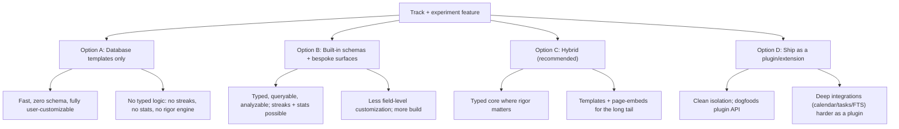
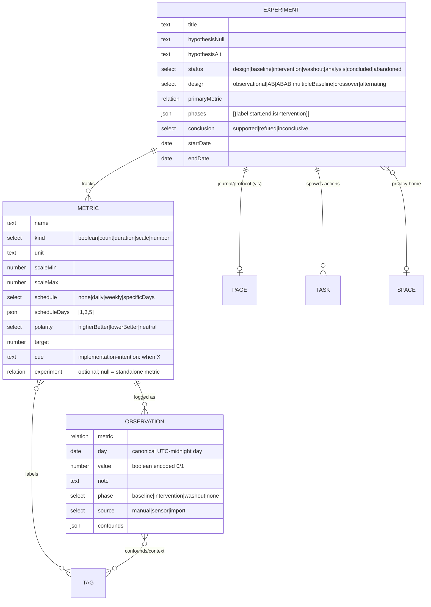
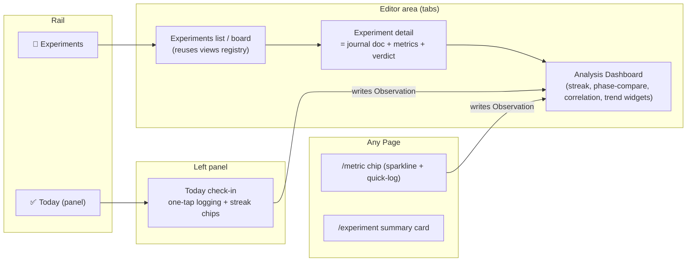
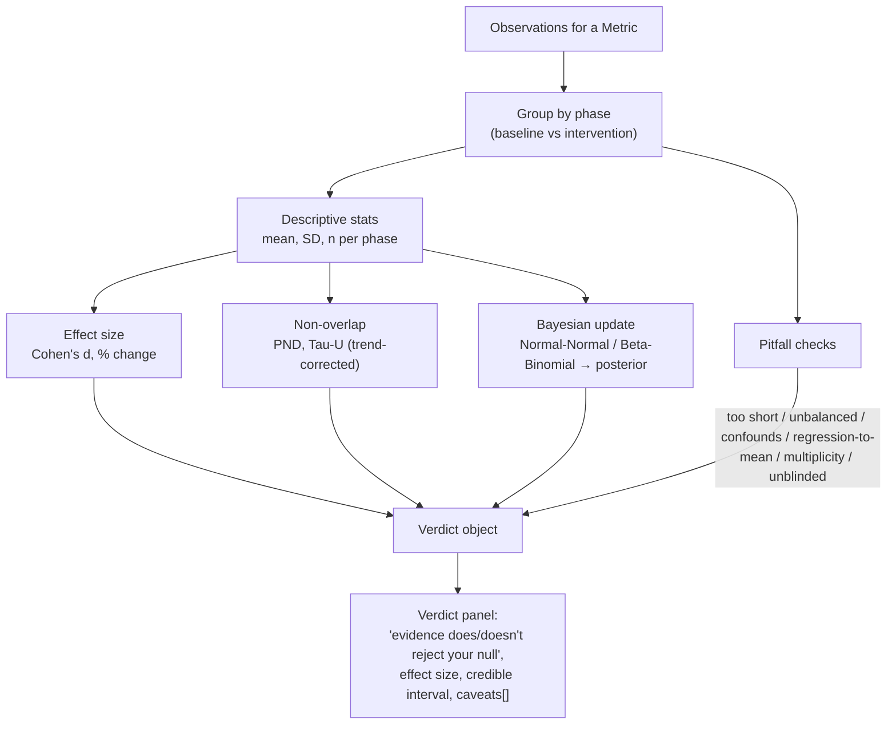
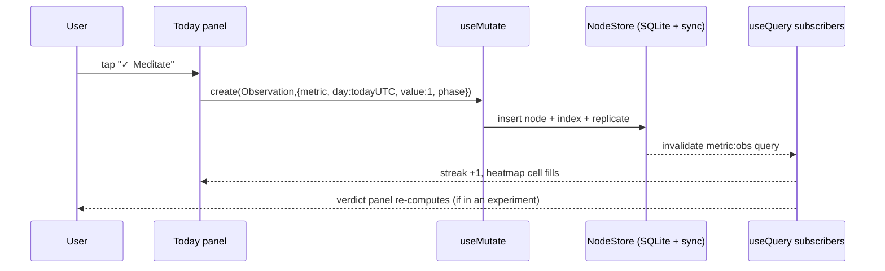

# Experiment Journal And Habit Tracker

## Problem Statement

The ask is for a workspace that is **a mix between an experimental journal and a
habit tracker** — something that helps you:

- **Form and track hypotheses** ("caffeine after 2pm hurts my sleep"), run
  personal experiments against them, and log results.
- **Track habits**, mood, and lived experience over time.
- **Aggregate** all of that into trends, streaks, and comparisons.
- **Reason rigorously** — explicitly frame a _null hypothesis_, gather evidence
  for or against it, and stay honest about confounds, too-short trials, and the
  difference between correlation and cause.

Crucially, it should **slide into the existing xNet architecture** — Pages,
Tasks, Databases, Dashboards, Spaces, Tags — rather than bolt on a parallel
silo. The intended users span two poles that turn out to want the same tool:
the **individual** ("did dry January actually help my energy?") and the
**engineer / researcher / scientist** ("run a clean n=1 ABAB trial and tell me
the effect size"). Both are doing the same thing — _self-experimentation_ — at
different levels of rigor.

## Executive Summary

The headline mirrors the 0172 finding: **most of the substrate already exists.**
xNet already has everything a tracker needs except three things: a typed domain
model for _experiments / metrics / datapoints_, a couple of domain-specific
visualizations (streak heatmap, phase comparison), and a **rigor engine** that
turns a pile of datapoints into an honest verdict about the null hypothesis.

What already exists and should be reused wholesale:

- **A schema system** (`defineSchema`) that mints first-class, queryable,
  CRDT-merged, sync-replicated node types
  ([define.ts](../../packages/data/src/schema/define.ts),
  [task.ts](../../packages/data/src/schema/schemas/task.ts) as the template).
- **A node-per-record data layer** with reactive `useQuery` / `useNode` /
  `useMutate`, SQLite-backed indexed queries, materialized views, and FTS —
  chat messages are already modeled as one-node-per-message, so
  one-node-per-datapoint is a proven pattern
  ([useQuery.ts](../../packages/react/src/hooks/useQuery.ts)).
- **Calendar and timeline views** that bind to a date property out of the box —
  exactly what a habit heatmap and an experiment-phase Gantt need
  ([views/calendar](../../packages/views/src/calendar),
  [views/timeline](../../packages/views/src/timeline)).
- **A dashboard + charts + aggregation stack**: a query-AST with
  `count/avg/sum/min/max` + `groupBy` + `having`, a time-range dashboard
  variable, ECharts line/bar/area/pie widgets, and a widget contract
  ([query-ast.ts](../../packages/data/src/store/query-ast.ts),
  [dashboard/types.ts](../../packages/dashboard/src/types.ts),
  [charts/spec.ts](../../packages/charts/src/spec.ts)).
- **Pages** (collaborative TipTap docs) for the _journal_ narrative, with a
  slash-command + inline-embed system so structured data can live inside prose
  ([editor/extensions](../../packages/editor/src/extensions)).

**Recommendation: a hybrid.** Introduce three small built-in schemas —
**`Experiment`**, **`Metric`**, **`Observation`** — that capture the typed,
queryable, analyzable core, where a _Habit is just a `Metric` with a recurring
schedule_. Layer dedicated surfaces (an Experiments workspace, a friction-free
"Today" check-in panel) and a few domain dashboard widgets on top, plus a
**rigor engine** package that produces a conservative, pitfall-aware verdict.
Then ship database templates and page-embeds for the long tail so the casual
user can "just track stuff my way." This gets rigor where it matters and
flexibility everywhere else, while reusing ~80% of the existing stack.

The differentiator nobody else ships well: **closing the loop** — hypothesis →
datapoints → statistical summary → an honest "the evidence does / does not
reject your null hypothesis, effect size d=0.6, but note these two confounds" →
a decision (promote to a permanent habit, or discard).

## Current State In The Repository

### The schema system is the right foundation

New node types are minted with `defineSchema`
([define.ts](../../packages/data/src/schema/define.ts)). The `Task` and
`Project` schemas are the closest templates for what we want — a thin set of
typed properties plus a collaborative Yjs document for the narrative body:

```ts
// packages/data/src/schema/schemas/project.ts:14
export const ProjectSchema = defineSchema({
  name: 'Project',
  namespace: 'xnet://xnet.fyi/',
  properties: {
    name: text({ required: true, maxLength: 200 }),
    status: select({
      options: [
        /* planned … cancelled */
      ],
      default: 'planned'
    }),
    lead: person({}),
    targetDate: date({}),
    folder: relation({ target: 'xnet://xnet.fyi/Folder@1.0.0' as const }),
    tags: relation({ target: 'xnet://xnet.fyi/Tag@1.0.0' as const, multiple: true }),
    space: relation({ target: 'xnet://xnet.fyi/Space@1.0.0' as const }),
    visibility: select({
      /* inherit/private/unlisted/public */
    })
  },
  document: 'yjs' // Collaborative project brief
})
```

Property builders available today
([properties/](../../packages/data/src/schema/properties)): `text`, `number`,
`checkbox`, `select`, `multiSelect`, `date`, `dateRange`, `person`, `relation`,
`url`, `email`, `phone`, `file`, `json`, plus the system fields `created`,
`createdBy`, `updated`. `date()` stores **UTC epoch milliseconds**
([date.ts:27](../../packages/data/src/schema/properties/date.ts)) — important,
because the 0172 exploration documented a timezone off-by-one bug between the
node layer (epoch ms) and editor layer (`YYYY-MM-DD` string). We must adopt a
**single canonical day-granularity date** for observations (see Risks).

New schemas are registered by adding a lazy import to `builtInSchemas`
([index.ts:247](../../packages/data/src/schema/schemas/index.ts)), keyed by both
a versioned and unversioned IRI. There are ~50 built-in schemas already; adding
three is routine.

### Tasks and Projects are the integration the user named

[`task.ts`](../../packages/data/src/schema/schemas/task.ts) already models a
recurring-work primitive with `status` categories
([task.ts:155](../../packages/data/src/schema/schemas/task.ts)), `dueDate`,
`project`/`page`/`canvas` host relations, and `tags`. An Experiment can **spawn
tasks** ("collect 14 days of baseline") and a Habit can be **surfaced as a
recurring task** — but we should _not_ duplicate Task's recurrence engine;
instead, a daily check-in is an `Observation`, and Task integration is a
projection. The task primitive shipped in 0161 and is "everywhere," so relating
to it is cheap.

### The data layer already does node-per-record at scale

Reactive reads come from `useQuery` (collections) and `useNode` (single node +
Yjs doc), writes from `useMutate`
([packages/react/src/hooks](../../packages/react/src/hooks)). Queries are
SQLite-indexed, run off the main thread via DataBridge, support `where` /
`orderBy` / `limit` / `search` (FTS) and **named materialized views** for
cached filtered/sorted result sets
([useGridDatabase.ts](../../packages/react/src/hooks/useGridDatabase.ts)). Chat
is already modeled as one `ChatMessage` node per message
([chat-message.ts](../../packages/data/src/schema/schemas/chat-message.ts)), so
**one `Observation` node per datapoint** is a load-bearing pattern, not a
gamble.

### Calendar / timeline views bind to dates for free

The view registry ([registry.ts](../../packages/views/src/registry.ts)) ships
six built-in views ([builtins.ts](../../packages/views/src/builtins.ts)). Two
matter here:

- **Calendar** reads `view.dateProperty` (and optional `endDateProperty`) and
  derives `CalendarEvent`s straight from rows, with month/week/day modes
  ([useCalendarState.ts](../../packages/views/src/calendar/useCalendarState.ts)).
  A habit's daily check-ins land on a calendar with zero new view code.
- **Timeline** is a Gantt over `dateProperty`→`endDateProperty` with
  day/week/month/quarter zoom
  ([useTimelineState.ts](../../packages/views/src/timeline/useTimelineState.ts)).
  An experiment's **phases** (baseline → intervention → washout) are a natural
  timeline.

Filters/sorts/groupings are a typed `FilterGroup` tree with date-aware operators
(`before`, `after`, `between`)
([view-types.ts](../../packages/data/src/database/view-types.ts)).

### The dashboard + aggregation + charts stack is the analysis layer

The query AST already supports aggregation
([query-ast.ts](../../packages/data/src/store/query-ast.ts)):

```ts
type QueryASTAggregateFunction = 'count' | 'countDistinct' | 'sum' | 'avg' | 'min' | 'max'
type QueryASTAggregate = {
  kind: 'aggregate'
  alias: string
  function: QueryASTAggregateFunction
  field?: string
  groupBy?: string[]
  having?: QueryASTPredicate
}
```

`executeQueryASTLoadedAggregates` returns per-group results (e.g. `avg(mood)`
grouped by day/week). Dashboards persist `widgets` + `layouts` + `variables`
([dashboard.ts](../../packages/data/src/schema/schemas/dashboard.ts)); a
**time-range variable** (`today/7d/30d/90d/all`) injects a `between [start,end]`
predicate against a widget's `timeField`
([variables.ts](../../packages/dashboard/src/variables.ts)). Charts are ECharts
line/bar/area/pie driven by a tiny `ChartSpec` that groups+aggregates rows
client-side ([spec.ts](../../packages/charts/src/spec.ts),
[XChart.tsx](../../packages/charts/src/XChart.tsx)).

**Gaps the research surfaced** (see External Research): there is no widget that
visualizes per-group aggregate _streaks_ or _non-overlap_, no server-side time
bucketing (must bucket client-side), and no streak/effect-size/Bayesian math
anywhere. Those are exactly the domain pieces we add.

### App integration seams are well-trodden

Adding a surface follows the Tasks/Pages pattern
([apps/web/src/workbench](../../apps/web/src/workbench)):

1. A file route in [`apps/web/src/routes/`](../../apps/web/src/routes) (e.g.
   `experiments.tsx`).
2. A `TabNodeType` variant + `TAB_VIEWS` entry (label/icon/`toRoute`) in
   [`workbench/tabs.ts`](../../apps/web/src/workbench/tabs.ts) and
   [`workbench/state.ts`](../../apps/web/src/workbench/state.ts).
3. A `HOSTED_VIEWS` entry in
   [`workbench/ViewHost.tsx`](../../apps/web/src/workbench/ViewHost.tsx).
4. Optional left-panel via `registerPanelView('left', …)`
   ([PanelViewHost.tsx](../../apps/web/src/workbench/PanelViewHost.tsx),
   [views/register.ts](../../apps/web/src/workbench/views/register.ts)) — this
   is where a **"Today" check-in panel** lives, alongside the existing Tasks
   mini-dashboard.
5. Optional Rail icon ([Rail.tsx](../../apps/web/src/workbench/Rail.tsx)).

Inline-in-page structured blocks reuse the slash-command + node-view embed
pattern already used by page/database embeds and page-tasks
([editor/extensions](../../packages/editor/src/extensions)). A `/metric` or
`/experiment` slash command can drop a live chip into the journal. There is also
a **plugin contribution API** (`schemas`, `views`, `widgets`, `slashCommands`,
`sidebarItems`) ([packages/plugins](../../packages/plugins/src)) — the whole
feature _could_ ship as an extension, which is a useful design constraint even
if we build it first-party.

## External Research

### Habit trackers converge on a two-table model

Across Loop Habit Tracker (open source, `github.com/iSoron/uhabits`), Habitica,
Streaks, Beeminder, and Exist.io, the data model is consistently:

- A **habit definition** — `{name, type: boolean|count|duration|value, target,
unit, frequency (daily/weekly/specific-days), color, archived_at, position}`.
- A **check-in / repetition log** — `{habit_id, date (day-granularity, one per
scheduled day), value (1.0 for boolean), notes}`.

This is _exactly_ the `Metric` (definition) + `Observation` (log) split this
exploration recommends. The **type axis** (boolean vs count vs duration vs scale)
is the most important design decision — it determines how a value is logged and
aggregated.

Key visualizations: **streak calendars / contribution heatmaps** (GitHub-style;
libs: `cal-heatmap`, `react-activity-calendar`, `@uiw/react-heat-map`), the
**"don't break the chain"** chain-of-days, a **habit-strength** EWMA bar (Loop's
innovation — degrades gracefully vs. a brittle integer streak), and
**completion rate** rings.

Psychology to bake into the UX: BJ Fogg's _Tiny Habits_ (B=MAP — anchor new
habits to existing cues, make them tiny), James Clear's _Atomic Habits_ (make it
easy/obvious/satisfying; habit stacking), Gollwitzer's **implementation
intentions** ("when X, I will Y" roughly doubles follow-through — argues for a
`cue`/`when` field on a Habit), and loss-aversion **streak mechanics** (Duolingo
streak-freeze, Habitica damage). Lally et al. (2010) found automaticity takes a
median 66 days — so trials and habits both need to run _long_, and friction
must be near-zero (one-tap logging from a widget/panel).

### Self-experimentation / Quantified Self gives us the rigor structure

The Quantified Self movement (Gary Wolf & Kevin Kelly, 2007;
`quantifiedself.com`) frames every project around three questions: _what did you
do, how, and what did you learn._ A rigorous n=1 self-experiment has a
recognizable structure (per the QS guide and Guyatt et al.'s n-of-1 trial
framework, JAMA 1986):

```
hypothesis: { null, alternative }
intervention: { description, dose, timing, start, end }
baseline:    { start, end, washout_days }
design:      AB | ABAB | multiple-baseline | crossover | alternating
phases:      [{ label, start, end, isIntervention }]
primary_outcome:   { metric, measurement_method, timing }
secondary_outcomes: [metric]
confounds_tracked: [string]
status: design | baseline | intervention | analysis | concluded
```

**Single-Case Experimental Designs** (Kazdin, _Single-Case Research Designs_;
Barlow & Hersen) are the credible methodology for n=1:

- **ABAB reversal** — baseline → intervention → baseline → intervention; proves
  causality by showing the effect reverses. Bad for habits (you can't un-learn).
- **Multiple-baseline** — stagger the intervention across behaviors/contexts;
  good for permanent behaviors like habits.
- **Alternating treatments** — rapidly alternate conditions to compare two.

Kazdin's inference criteria — **trend, level (mean), variability, and immediacy
of change at phase boundaries** — are what a phase-comparison chart should make
visually obvious.

Gwern's self-experiment archive (`gwern.net/Self-Experiment`) is the gold
standard for public n=1 rigor: pre-registration, washout periods, blinded
measurement, Bayesian analysis.

### Statistics for n=1 — how to "invalidate the null hypothesis" honestly

Classical NHST assumes large samples; n=1 needs different tools:

- **Effect size over p-values**: Cohen's d = `(mean_int − mean_base) / pooled_SD`
  (0.2/0.5/0.8 = small/medium/large), and plain **% change from baseline**.
- **Non-overlap** for SCED: **PND** (% of intervention points beyond all
  baseline points) and the better **Tau-U** (Parker et al., 2011, _Behavior
  Modification_ 35(4):303 — combines non-overlap with trend correction, −1..+1;
  reference calculator at `singlecaseresearch.org`). No maintained JS impl
  exists; the formula is implementable.
- **Bayesian updating** is arguably the _correct_ frame for personal science —
  you have a strong prior (your own body), you update continuously, you want a
  posterior over effect size, not a binary verdict. Beta-Binomial conjugate for
  boolean outcomes, Normal-Normal for continuous (≈10 lines each), and **BEST**
  (Kruschke, 2013) / Bayes factors (Wagenmakers) for the ambitious.

**Pitfalls the tool must actively warn about** (this is the "keep you honest"
feature):

| Pitfall                                     | Tool guard                                                                |
| ------------------------------------------- | ------------------------------------------------------------------------- |
| Regression to the mean                      | Flag when an experiment _starts_ after an extreme baseline reading        |
| Confirmation bias / post-hoc metric picking | Lock the **primary** metric before the intervention starts                |
| Too-short trials                            | Warn if a phase is < ~14 days or < ~5 datapoints                          |
| Confounds                                   | Require a confound log; flag result windows that overlap logged confounds |
| Multiple comparisons / p-hacking            | Warn when many secondary metrics are examined; suggest correction         |
| Placebo / expectation                       | Flag unblinded self-report metrics; nudge toward objective measures       |
| Carryover                                   | Enforce washout for crossover/ABAB designs                                |
| Unbalanced phases                           | Flag baseline vs intervention length mismatch                             |

The verdict copy must never say "proven." It says _"the evidence does / does not
reject your null hypothesis"_ with an effect size and the caveats attached.

### Electronic Lab Notebooks (ELN) — the journal structure

Benchling, eLabFTW (open source), LabArchives, and SciNote converge on:
`{title, hypothesis, background, materials, protocol, observations (timestamped),
results (linked data), conclusion, tags, linked_experiments}` with an
**append-only audit trail**. Two imports for us: (1) the **protocol/template**
system (reusable experiment scaffolds), and (2) the forced **conclusion** phase
— most consumer apps stop at a chart; ELNs make you write down the decision.
xNet's Page-as-Yjs-doc is the natural home for the narrative + protocol, and
xNet already has version history ([packages/history](../../packages/history)).

### Mood / experience tracking

Daylio (`{date, mood: 1–5 emoji, activities: [tag], note}`), Bearable (adds
symptoms/factors/meds with severities), and Exist.io (1–5 mood correlated
against auto-imported steps/sleep/productivity) are the references. Exist's
differentiator is an **automated correlation engine** — Pearson for
continuous-continuous, **point-biserial** for boolean-continuous (e.g. "exercised
(y/n)" vs "mood (1–5)"), thresholded at |r|≈0.3, always captioned "correlation,
not causation." A stronger move we can make: **multiple regression** with mood as
outcome and tracked factors as predictors, for partial effects.

### Libraries we can lean on

- **`simple-statistics`** (ISC) — `mean`, `standardDeviation`,
  `sampleCorrelation` (Pearson r), `linearRegression`, `tTest`. The workhorse.
- **`jstat`** — distributions (Beta/t/F/χ²) for CIs and p-values when needed.
- Custom **Beta-Binomial / Normal-Normal** Bayesian updating (tiny, no dep).
- **Tau-U** — implement from Parker 2011; validate against `singlecaseresearch.org`.
- Heatmaps — `react-activity-calendar` / `cal-heatmap`, _or_ just reuse the
  existing calendar view + ECharts (charts already ship ECharts, ~100KB).

## Key Findings

1. **A Habit and an experiment outcome are the same primitive at different
   rigor.** Both are a _time series of measurements of a defined variable_. The
   unifying model is `Metric` (the variable definition) + `Observation` (one
   datapoint). A Habit = a `Metric` with a recurring schedule and a
   boolean/count type. An Experiment = a hypothesis + phases layered _over the
   same observations_. This collapses the two halves of the prompt into one
   data model.

2. **~80% of the stack is reusable.** Schemas, node-per-record data layer,
   calendar/timeline binding, dashboard + query-AST aggregation + ECharts, Pages
   for the journal, Tasks for actions, Spaces for privacy. The genuinely new code
   is: 3 schemas, 2 surfaces, ~4 domain widgets, and 1 stats engine.

3. **The differentiator is rigor, not tracking.** Dozens of apps track habits.
   Almost none _close the loop_ from null hypothesis → datapoints → honest
   statistical verdict → decision, with pitfall warnings. That is the product.

4. **Friction is the make-or-break for the habit half.** A "Today" panel with
   one-tap logging (lives in the left panel next to Tasks) is as important as any
   chart. Lally (2010): automaticity is the goal, friction delays it.

5. **Observation volume is fine.** Node-per-datapoint matches the existing
   ChatMessage pattern; SQLite indexing + materialized views handle it. The real
   constraint is _date canonicalization_ (the 0172 timezone bug), not row count.

6. **Don't over-claim.** The tool's credibility dies the first time it tells
   someone a 5-day fluke "worked." Conservative verdicts and visible caveats are
   a feature, not hedging.

## Options And Tradeoffs



### Option A — Database templates only

Ship seeded `Database` nodes ("Experiment Log", "Habit Tracker", "Mood
Journal") with preconfigured fields and calendar/timeline views. Zero new
schemas.

- **Pros:** fastest to ship; fully reuses `DatabaseSurface`; users customize
  fields freely; validates demand cheaply.
- **Cons:** `DatabaseRow` cells are ad-hoc `cell_*` properties
  ([database-row.ts](../../packages/data/src/schema/schemas/database-row.ts)) —
  no domain code can generically reason about them, so **no streak computation,
  no effect-size engine, no null-hypothesis scaffolding, no cross-workspace
  queries.** This is a tracker, not the rigorous tool the user asked for.

### Option B — Built-in schemas + bespoke surfaces only

`Experiment`/`Metric`/`Observation` as built-in nodes with dedicated views and a
stats engine; no templates.

- **Pros:** typed, queryable, analyzable; everything (streaks, verdicts,
  correlations, calendar binding) is possible and first-class.
- **Cons:** more build; the casual "I want a column for X" user is less served
  (mitigated — _metrics are user-defined_; the schema is the meta-structure, not
  the domain content).

### Option C — Hybrid (recommended)

Built-in `Experiment`/`Metric`/`Observation` for the typed core **plus** database
templates and page-embeds for the flexible long tail.

- **Pros:** rigor where it matters, flexibility everywhere else; the journal is
  just a Page; analysis is just a Dashboard + a few widgets; ~80% reuse.
- **Cons:** two mental models coexist (typed metrics vs. ad-hoc database
  columns) — managed by making the typed path the default and templates the
  "advanced/custom" affordance.

### Option D — Plugin / extension

Ship the whole thing through the plugin contribution API.

- **Pros:** isolation; optional install; battle-tests the plugin surface.
- **Cons:** deep integrations (calendar `dateProperty` binding, Task generation,
  FTS indexing, Space-scoped privacy) are easier and more robust first-party.
  **Recommendation:** build first-party, but keep the schemas/widgets
  _plugin-shaped_ so they could be extracted later — a free validation of the
  plugin API.

## Recommendation

Adopt **Option C**, built in phases, with **rigor as the throughline**.

### Data model

Three built-in schemas, where **Habit is not a separate type** — it is a
`Metric` whose `schedule` is recurring.



Why this shape:

- **`Observation` is the universal log entry.** A habit check-in, a mood rating,
  a sleep-latency reading, and an experiment outcome are all `Observation`s of
  some `Metric`. One reactive query (`useQuery(ObservationSchema, {where:{metric},
orderBy:{day}})`) powers streaks, heatmaps, trends, and stats alike.
- **`phase` is denormalized onto each `Observation`** (stamped from the
  experiment's active phase at entry time), so analysis is a `groupBy: ['phase']`
  with no join-walking — matching how `DatabaseView` stores config as `json` and
  how the aggregation layer already groups.
- **`Metric.experiment` is optional.** Mood and sleep are tracked _continuously_
  and standalone; an experiment simply _references_ existing metrics. This lets
  correlations span metrics that aren't part of any single experiment (Exist
  model).
- **The journal is a Page.** `Experiment` carries `document: 'yjs'` for the
  protocol/brief/observations narrative — same as Project — and can `[[`-link or
  embed live metric chips.

### Surfaces



1. **"Today" check-in panel** (left panel, beside the Tasks mini-dashboard) —
   the friction-killer. Lists every metric scheduled for today; one tap logs an
   `Observation`; shows streak + a mini heatmap. This is the habit-tracker heart.
2. **Experiments workspace** (`/experiments` route + tab) — list/board of
   experiments by `status`; detail view = the protocol journal (TipTap doc) +
   linked metrics + a live **verdict panel**.
3. **Analysis dashboard** — reuse `DashboardSurface` with new domain widgets.
4. **Page embeds** — `/metric` and `/experiment` slash commands so the narrative
   references live data.

### The rigor engine (the differentiator)

A pure, dependency-light package (`packages/science`, or folded into a new
`packages/experiments`) that, given `Observation`s grouped by phase, returns an
honest verdict — and is the one piece with no existing analogue in the repo.



The verdict is **conservative by construction**: it reports effect size +
uncertainty + every triggered caveat, and frames everything against the
explicit null. It never prints "proven."

### Dashboard widgets to add

- **Streak / contribution heatmap** — calendar heatmap over a boolean metric's
  observations (the GitHub-graph the existing widgets lack).
- **Phase comparison** — baseline vs intervention distributions with mean lines,
  effect size, and the verdict badge (Kazdin's trend/level/variability/immediacy
  made visual).
- **Correlation matrix** — Exist-style point-biserial/Pearson across metrics,
  thresholded, captioned "correlation, not causation."
- **Trend line** — mostly the _existing_ chart widget with day/week bucketing.

### Sequence: a daily check-in



## Example Code

> Illustrative — schemas follow the `Task`/`Project` template and the real
> property builders ([properties/](../../packages/data/src/schema/properties)).

### Schemas

```ts
// packages/data/src/schema/schemas/metric.ts
import { defineSchema } from '../define'
import { text, number, select, json, relation } from '../properties'
import type { InferNode } from '../types'

export const MetricSchema = defineSchema({
  name: 'Metric',
  namespace: 'xnet://xnet.fyi/',
  properties: {
    name: text({ required: true, maxLength: 200 }),
    /** What kind of value an Observation carries. Drives logging + aggregation. */
    kind: select({
      options: [
        { id: 'boolean', name: 'Yes/No' }, // habit check-in
        { id: 'count', name: 'Count' }, // e.g. pushups
        { id: 'duration', name: 'Duration' }, // minutes
        { id: 'scale', name: 'Scale' }, // e.g. mood 1–5
        { id: 'number', name: 'Number' } // arbitrary measure
      ] as const,
      default: 'boolean'
    }),
    unit: text({ maxLength: 40 }),
    scaleMin: number({}),
    scaleMax: number({}),
    /** A schedule makes this metric a *habit*. `none` = ad-hoc/continuous. */
    schedule: select({
      options: [
        { id: 'none', name: 'None' },
        { id: 'daily', name: 'Daily' },
        { id: 'weekly', name: 'Weekly' },
        { id: 'specificDays', name: 'Specific days' }
      ] as const,
      default: 'none'
    }),
    scheduleDays: json({}), // [1,3,5] (Mon/Wed/Fri) when specificDays
    polarity: select({
      options: [
        { id: 'higherBetter', name: 'Higher is better' },
        { id: 'lowerBetter', name: 'Lower is better' },
        { id: 'neutral', name: 'Neutral' }
      ] as const,
      default: 'higherBetter'
    }),
    target: number({}),
    /** Implementation intention — "after I pour coffee, I will…" (Gollwitzer). */
    cue: text({ maxLength: 280 }),
    color: text({ maxLength: 40 }),
    /** Optional — a metric can be standalone (mood, sleep) or part of a trial. */
    experiment: relation({ target: 'xnet://xnet.fyi/Experiment@1.0.0' as const }),
    tags: relation({ target: 'xnet://xnet.fyi/Tag@1.0.0' as const, multiple: true }),
    space: relation({ target: 'xnet://xnet.fyi/Space@1.0.0' as const })
  }
})
export type Metric = InferNode<(typeof MetricSchema)['_properties']>
```

```ts
// packages/data/src/schema/schemas/observation.ts
import { defineSchema } from '../define'
import { text, number, select, json, relation } from '../properties'
import { canonicalDay } from '../../dates' // shared UTC-midnight helper (see Risks)

export const ObservationSchema = defineSchema({
  name: 'Observation',
  namespace: 'xnet://xnet.fyi/',
  properties: {
    metric: relation({ target: 'xnet://xnet.fyi/Metric@1.0.0' as const, required: true }),
    /** Canonical day (UTC midnight ms). Booleans encode value 0/1. */
    day: /* date() */ number({ required: true }),
    value: number({ required: true }),
    note: text({ maxLength: 2000 }),
    /** Stamped from the experiment's active phase at entry time. */
    phase: select({
      options: [
        { id: 'none', name: 'None' },
        { id: 'baseline', name: 'Baseline' },
        { id: 'intervention', name: 'Intervention' },
        { id: 'washout', name: 'Washout' }
      ] as const,
      default: 'none'
    }),
    source: select({
      options: [
        { id: 'manual', name: 'Manual' },
        { id: 'sensor', name: 'Sensor' },
        { id: 'import', name: 'Import' }
      ] as const,
      default: 'manual'
    }),
    confounds: json({}), // ["alcohol","poor sleep"] logged for the day
    experiment: relation({ target: 'xnet://xnet.fyi/Experiment@1.0.0' as const })
  }
})
```

`Experiment` mirrors `Project` (title + `document: 'yjs'`) plus `hypothesisNull`,
`hypothesisAlt`, `design`, `phases` (json), `status`, `conclusion`, and
`primaryMetric`. Register all three in
[`builtInSchemas`](../../packages/data/src/schema/schemas/index.ts:247).

### Streak computation (timezone-safe)

```ts
// packages/experiments/src/streak.ts
/** Days in `completed` must be canonical UTC-midnight ms (see canonicalDay). */
export function computeStreak(
  completedDays: Set<number>,
  scheduledDays: number[], // ascending, ≤ today
  today: number
): number {
  let streak = 0
  for (let i = scheduledDays.length - 1; i >= 0; i--) {
    const d = scheduledDays[i]
    if (completedDays.has(d)) streak++
    else if (d === today)
      continue // today not yet a miss
    else break
  }
  return streak
}
```

### The verdict engine

```ts
// packages/experiments/src/verdict.ts
import { mean, standardDeviation, sampleCorrelation } from 'simple-statistics'

export interface Verdict {
  direction: 'favorsAlternative' | 'favorsNull' | 'inconclusive'
  cohensD: number
  percentChange: number
  tauU: number | null // trend-corrected non-overlap (Parker 2011)
  credibleInterval: [number, number] // Bayesian posterior over mean diff
  nBaseline: number
  nIntervention: number
  caveats: Caveat[] // the "keep you honest" payload
}

export type Caveat =
  | { kind: 'phaseTooShort'; phase: string; days: number }
  | { kind: 'unbalancedPhases'; baseline: number; intervention: number }
  | { kind: 'confoundsPresent'; days: number }
  | { kind: 'regressionToMean'; baselineExtreme: true }
  | { kind: 'multipleComparisons'; metricsExamined: number }
  | { kind: 'unblindedSelfReport' }

export function evaluate(baseline: number[], intervention: number[], opts: EvalOpts): Verdict {
  const mb = mean(baseline),
    mi = mean(intervention)
  const pooledSd = pooledStdDev(baseline, intervention)
  const cohensD = pooledSd === 0 ? 0 : (mi - mb) / pooledSd
  const caveats: Caveat[] = []
  if (baseline.length < 5)
    caveats.push({ kind: 'phaseTooShort', phase: 'baseline', days: baseline.length })
  // …unbalanced / confounds / regression-to-mean / multiplicity / blinding checks…
  return {
    direction: classify(cohensD, opts.posterior, caveats),
    cohensD,
    percentChange: mb === 0 ? 0 : ((mi - mb) / Math.abs(mb)) * 100,
    tauU: tauU(baseline, intervention),
    credibleInterval: normalNormalPosterior(baseline, intervention),
    nBaseline: baseline.length,
    nIntervention: intervention.length,
    caveats
  }
}
```

### A domain dashboard widget

```ts
// packages/dashboard/src/widgets/streak-heatmap-widget.tsx — registered like metric/chart widgets
export const streakHeatmapWidget: WidgetDefinition = {
  type: 'streak-heatmap',
  name: 'Habit Heatmap',
  icon: '🔥',
  trustTier: 'first-party',
  defaultSize: { w: 6, h: 3 },
  configFields: [{ key: 'metricId', label: 'Metric', kind: 'node', schema: 'Metric' }],
  getStubConfig: () => ({}),
  component: StreakHeatmap // queries Observations where {metric}, renders cal-heatmap
}
```

### Workbench wiring (the Tasks/Pages pattern)

```ts
// apps/web/src/workbench/tabs.ts — add to TAB_VIEWS
experiments: { label: 'Experiments', icon: FlaskConical, toRoute: () => '/experiments', singleton: true }

// apps/web/src/workbench/ViewHost.tsx — add to HOSTED_VIEWS
experiments: () => <ExperimentsView />

// apps/web/src/workbench/views/register.ts — the friction-free check-in
registerPanelView('left', { id: 'today', title: 'Today', component: TodayCheckinPanel })
```

## Risks And Open Questions

- **Date canonicalization (highest risk).** 0172 documented a real off-by-one
  bug between epoch-ms (node layer) and `YYYY-MM-DD` (editor layer). A tracker
  lives or dies on "which day is this." We must adopt **one** canonical
  day-granularity representation (UTC-midnight epoch ms) and a single shared
  `canonicalDay()` helper, reused by streaks, heatmaps, calendar binding, and
  stats. Resolve before any UI.
- **Over-claiming destroys trust.** If the verdict ever calls a 5-day fluke a
  win, the tool is dead. Verdicts must be conservative, caveat-forward, and
  framed against the null. Consider an explicit "not enough data yet" state as
  the default for young experiments.
- **Observation volume.** Node-per-datapoint is consistent with ChatMessage, but
  a power user tracking 20 metrics for 3 years is ~22k nodes. Validate
  materialized-view query performance early; bucket aggregation client-side as
  the chart widgets already do.
- **Habit vs. recurring Task overlap.** A daily check-in resembles a recurring
  task. Decision: a check-in is an `Observation`, _not_ a Task; Task integration
  is an optional projection ("turn this experiment phase into a 14-day task").
  Avoid duplicating recurrence logic.
- **Privacy / sensitivity.** Mood, health, and sleep data are sensitive. Default
  `Experiment`/`Metric`/`Observation` `visibility` to **private**, honor Space
  scoping (0179), and never sync to public surfaces. Confirm encryption-at-rest
  posture for these node types.
- **Typed vs. ad-hoc tension (Option C cost).** Two ways to "track a thing"
  (typed Metric vs. Database column) can confuse. Make the typed Metric path the
  default; present database templates as the "custom/advanced" affordance.
- **Statistical correctness.** Tau-U has no maintained JS impl; we implement from
  Parker 2011 and must validate against `singlecaseresearch.org`. Bayesian
  helpers must be unit-tested against known posteriors.
- **Scope creep.** Sensor/HealthKit/wearable import, blinded-measurement
  workflows, and multi-baseline auto-staggering are tempting. Defer all of them
  past v1; the core loop (define → log → analyze → conclude) must land first.
- **Open question:** should `phases` be json-on-Experiment (simple, LWW
  whole-value) or first-class `Phase` nodes (queryable, but more joins)? Lean
  json for v1, matching `DatabaseView.filters`.
- **Open question:** correlation engine scope — pairwise (Exist-style) is easy
  and shippable; multiple regression is more honest but heavier. Start pairwise,
  caption aggressively.

## Implementation Checklist

> Status legend: `[x]` shipped + verified by typecheck/tests, `[ ]` deferred
> (with a note). Shipped in PR for 0180; the full `xnet-web` + `@xnetjs/dashboard`
> typecheck is green and 54 logic + ~12 app/dashboard tests cover the core.

### Phase 0 — Data model & dates

- [x] Add a shared `canonicalDay()` UTC-midnight helper (in
      [`@xnetjs/experiments`](../../packages/experiments/src/day.ts)); DST/timezone
      boundaries unit-tested.
- [x] Define `MetricSchema`, `ObservationSchema`, `ExperimentSchema`
      ([schemas/](../../packages/data/src/schema/schemas)); `Experiment` carries
      `document: 'yjs'`.
- [x] Register all three (versioned + legacy IRIs) in
      [`builtInSchemas`](../../packages/data/src/schema/schemas/index.ts).
- [x] Default `visibility: private` on all three (asserted in the schema test).
- [x] FTS: `Metric.name` / `Observation.note` are indexed (`extractSearchableContent`
      now also pulls `name` + `note`, alongside `Experiment.title`).
- [ ] Verify Space-cascade authorization + encryption posture end-to-end.

### Phase 1 — Capture (the habit half)

- [x] `TodayPanel` left-panel view with one-tap `Observation` writes via
      `useHabits`/`useMutate`; registered via `registerPanelView('left', …)`.
- [x] `@xnetjs/experiments`: `computeStreak`, `longestStreak`, `completionRate`,
      EWMA `habitStrength` (unit-tested).
- [x] Streak chips + strength bars in the panel; quick-add to create a habit.
- [x] Full Metric editor (`MetricEditor` modal) — kind, unit, scale min/max,
      schedule + weekday picker, polarity, target, cue, icon, color; reachable from
      every metric row and the "New metric…" action.

### Phase 2 — Experiments (the journal half)

- [x] `/experiments` route + `TabNodeType` + `TAB_VIEWS` + `HOSTED_VIEWS` + Rail.
- [x] `ExperimentsView` master/detail list grouped by `status`.
- [x] Experiment detail = collaborative Yjs journal (app `Editor`) + primary-metric
      picker + phase editor (json `phases`) + heatmap; status workflow incl.
      `washout`/`analysis`.
- [x] Explicit null + alternative hypothesis fields.
- [ ] Stamp `Observation.phase` from the active phase at entry time — analysis
      currently derives phase from the experiment's date ranges (more robust for
      retro-analysis), so the denormalized field is unused for now (follow-up).
- [x] Confound-logging UI (`ConfoundLog` in the experiment detail — tag confounds
      per day within the phase window; feeds the verdict engine's confound caveat).
- [ ] Optional "turn phase into a Task" projection.

### Phase 3 — Analysis & rigor (the differentiator)

- [x] `@xnetjs/experiments` verdict engine: descriptive stats, Cohen's d, %
      change, Tau-U (trend-corrected), flat-prior credible interval, Beta-Binomial
      posterior — validated by hand-computed unit tests.
- [x] Pitfall caveat checks (too-short, unbalanced, confounds, regression-to-mean,
      multiplicity, unblinded self-report).
- [x] `VerdictPanel` framed against the null; never prints "proven."
- [x] Dashboard widgets: streak-heatmap + correlation insights registered as
      first-party ([widgets/](../../packages/dashboard/src/widgets)); shared
      `HabitHeatmap` in `@xnetjs/dashboard`.
- [ ] Phase-comparison as a standalone widget — currently lives in the experiment
      detail's `VerdictPanel` (its natural home); a dedicated widget is a follow-up.
- [ ] Dedicated day/week trend-line widget instance over `Observation` (the generic
      chart widget already works against the registered schema).

### Phase 4 — Glue & long tail

- [x] Rail icon for Experiments; `Today` panel + Rail icon surfaced.
- [x] `Metric`/`Observation`/`Experiment` added to the dashboard schema registry.
- [ ] `/metric` and `/experiment` slash commands + inline page embeds (follow-up).
- [ ] Seed database templates ("Experiment Log", "Habit Tracker", "Mood Journal").
- [x] Mood/numeric quick-entry: scale metrics get segmented value buttons,
      count/duration/number get an inline input; continuous metrics surface under
      "Track anytime" in the Today panel.
- [ ] Docs/site page (per the 0170 sidebar single-sourcing invariant).

## Validation Checklist

- [x] Canonical-day math is DST-safe (UTC arithmetic); covered by `day.test.ts`
      and `habit-logic.test.ts` (specific-day scheduling, streak across days).
- [x] A canned upward/ABAB-style dataset yields the expected Cohen's d / Tau-U /
      polarity-aware verdict; Beta-Binomial posterior matches the closed form
      (`stats.test.ts`, `verdict.test.ts`).
- [x] A short (sub-`minPhaseN`) phase triggers `phaseTooShort` and forces an
      `inconclusive` verdict (`verdict.test.ts`).
- [x] A baseline-at-extreme experiment surfaces the `regressionToMean` caveat, and
      many secondary metrics surface `multipleComparisons` (`verdict.test.ts`).
- [x] Correlation widget captions every result "correlation, not causation" and
      hides `|r|` below threshold (implemented in `correlation-widget.tsx`).
- [x] `Experiment`/`Metric`/`Observation` default to `private` (schema test).
- [x] Verdict copy never contains "proven"/"proves"; always frames against the
      null (`verdict.test.ts`).
- [x] Full `xnet-web` + `@xnetjs/dashboard` typecheck green (29/29 turbo tasks).
- [ ] Live cross-surface reactive update (Today ↔ heatmap ↔ verdict) — relies on
      `useQuery` invalidation; not yet verified in a running browser.
- [ ] 20 metrics × 3 years (~22k observations) interactive-latency soak test.

## References

### Codebase

- [Schema system — `define.ts`](../../packages/data/src/schema/define.ts), [property builders](../../packages/data/src/schema/properties), [`builtInSchemas` registration](../../packages/data/src/schema/schemas/index.ts)
- [`TaskSchema`](../../packages/data/src/schema/schemas/task.ts), [`ProjectSchema`](../../packages/data/src/schema/schemas/project.ts) — schema templates
- [`DatabaseRow`](../../packages/data/src/schema/schemas/database-row.ts), [`DatabaseView`](../../packages/data/src/schema/schemas/database-view.ts) — ad-hoc/template path
- [Views registry](../../packages/views/src/registry.ts) + [builtins](../../packages/views/src/builtins.ts); [calendar](../../packages/views/src/calendar/useCalendarState.ts), [timeline](../../packages/views/src/timeline/useTimelineState.ts)
- [Query AST + aggregation](../../packages/data/src/store/query-ast.ts), [dashboard types](../../packages/dashboard/src/types.ts), [dashboard variables](../../packages/dashboard/src/variables.ts), [widgets](../../packages/dashboard/src/widgets), [charts spec](../../packages/charts/src/spec.ts) / [XChart](../../packages/charts/src/XChart.tsx)
- [React hooks](../../packages/react/src/hooks) (`useQuery`/`useNode`/`useMutate`), [editor extensions](../../packages/editor/src/extensions), [plugins](../../packages/plugins/src)
- Workbench wiring: [tabs.ts](../../apps/web/src/workbench/tabs.ts), [ViewHost.tsx](../../apps/web/src/workbench/ViewHost.tsx), [PanelViewHost.tsx](../../apps/web/src/workbench/PanelViewHost.tsx), [Rail.tsx](../../apps/web/src/workbench/Rail.tsx)
- Related explorations: 0161 (task primitive), 0162 (dashboard builder), 0169 (folders/tags), 0172 (canonical due-date / timezone bug), 0179 (Spaces / visibility)

### External

- Quantified Self — `quantifiedself.com`; QS guide to self-tracking
- Guyatt et al., _N-of-1 trials_ (JAMA, 1986); Kazdin, _Single-Case Research Designs_; Barlow & Hersen, _Single Case Experimental Designs_
- Parker, Vannest & Davis (2011), "Effect Size in Single-Case Research" / **Tau-U**, _Behavior Modification_ 35(4):303; reference calculator `singlecaseresearch.org`
- Kruschke (2013), **BEST** — Bayesian estimation; Wagenmakers et al. (2010), Bayes factors
- Gollwitzer (1999), implementation intentions; Lally et al. (2010), habit automaticity (~66 days); Fogg, _Tiny Habits_; Clear, _Atomic Habits_
- Trackers: Loop Habit Tracker (`github.com/iSoron/uhabits`), Habitica, Beeminder, Exist.io, Streaks; mood: Daylio, Bearable
- ELNs: Benchling, eLabFTW (`elabftw.net`), LabArchives, SciNote; Gwern's self-experiments (`gwern.net/Self-Experiment`)
- Libraries: `simple-statistics`, `jstat`, `cal-heatmap`, `react-activity-calendar`
