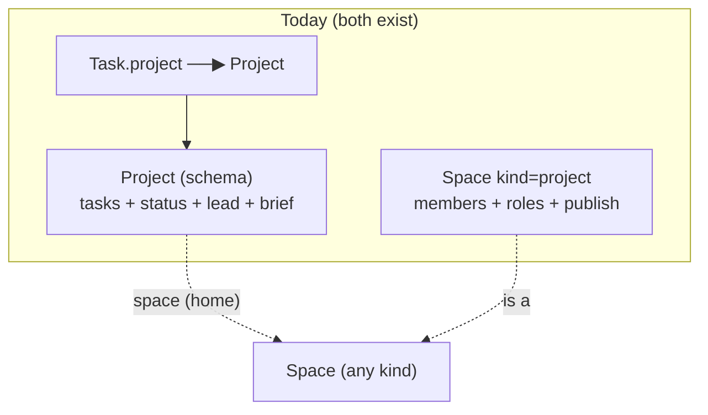
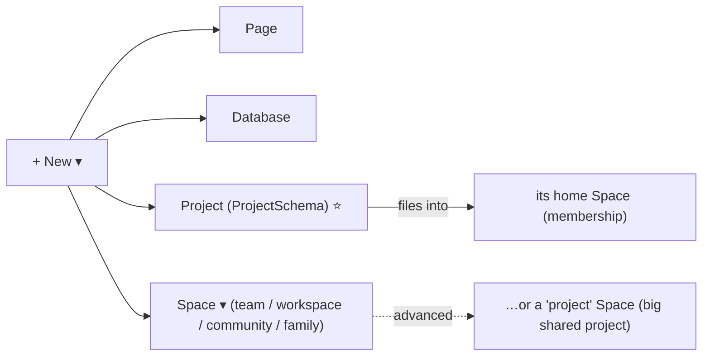
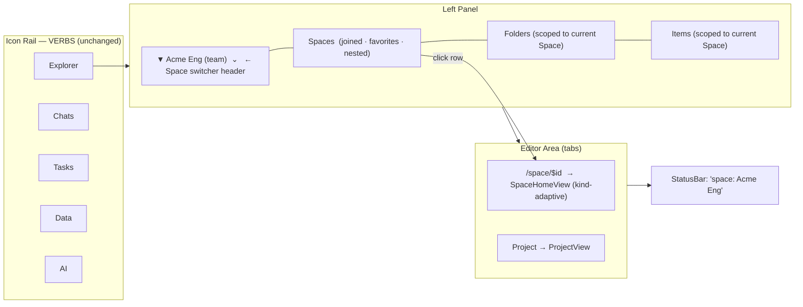
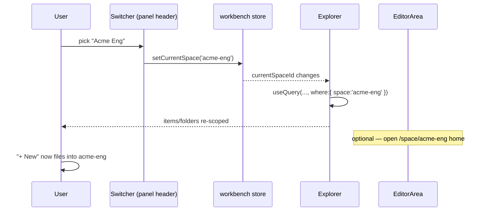
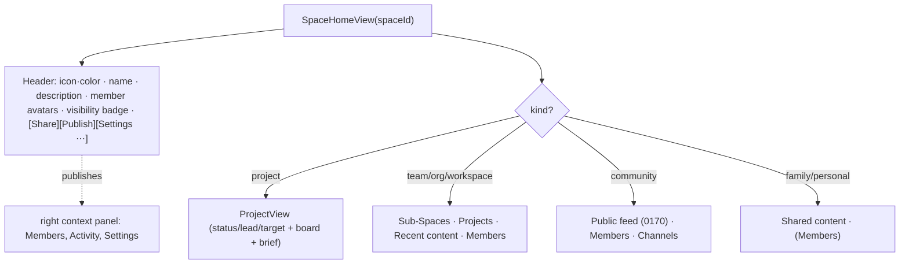
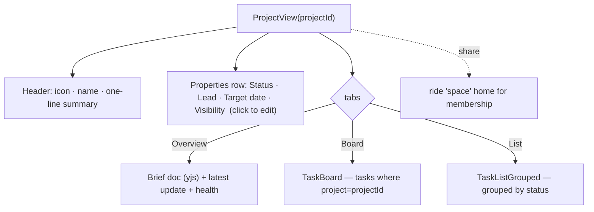
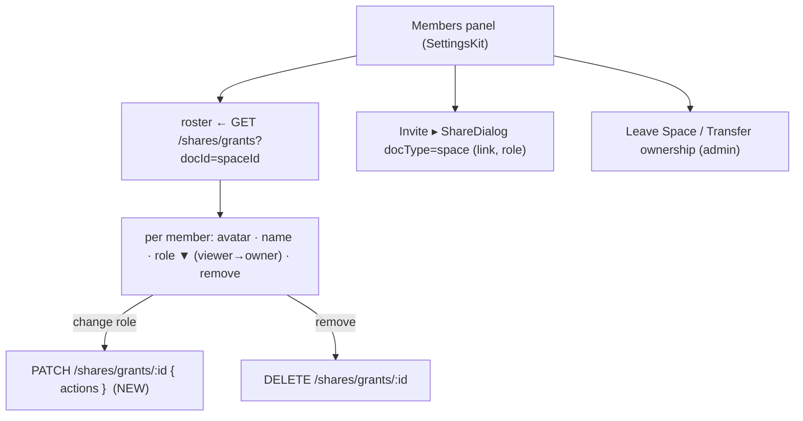
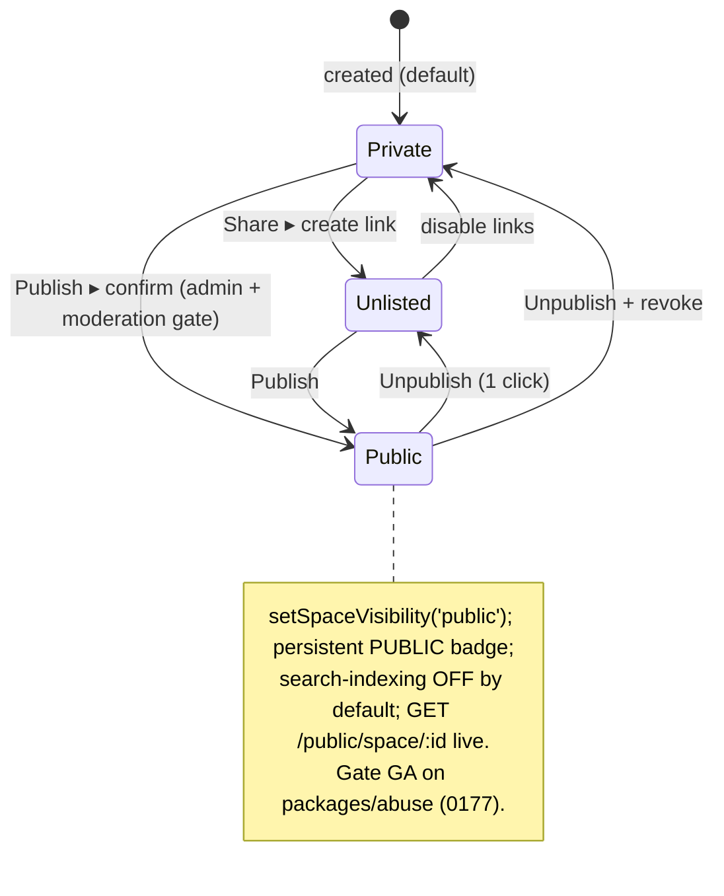

# Exposing Spaces in the UI: Switcher, Space Homes, Projects, and Membership

## Problem Statement

Exploration [0179](docs/explorations/0179_[_]_SPACES_GROUPS_AND_UNIFIED_SHARING.md)
shipped the **Space primitive** end-to-end *underneath* the UI: a single
`Space` schema with a `kind` discriminator
([packages/data/src/schema/schemas/space.ts](packages/data/src/schema/schemas/space.ts)),
membership edges
([space-membership.ts](packages/data/src/schema/schemas/space-membership.ts)),
container-grant enforcement in the hub, `docType: 'space'` invite links, and
gated public read endpoints. What it deliberately **did not** ship is the
product: a person using xNet today can create a Space and invite someone, but
they cannot *navigate* it. The Explorer still queries **all** local nodes
globally with no space scope
([apps/web/src/workbench/views/Explorer.tsx:154](apps/web/src/workbench/views/Explorer.tsx)),
the app still hardcodes `WORKSPACE_ID = 'main'`
([apps/web/src/comms/CommsContext.tsx:30](apps/web/src/comms/CommsContext.tsx)),
and clicking a Space row in
[ExplorerSpacesSection.tsx](apps/web/src/workbench/views/ExplorerSpacesSection.tsx)
does **nothing** — there is no active-space scope, no Space home, no member
roster, no role management, no publish flow, and no way to surface the thing the
user actually asked for: **projects, teams, and workspaces as first-class places
you go.**

The ask, distilled:

1. **Make Spaces a place you can *be*** — a current-space scope that the
   Explorer, search, presence, and "new doc" all respect, with a clean way to
   switch between Spaces.
2. **A Space home** — open a Space and see what's in it: its content, its
   sub-Spaces, its people, its settings.
3. **Projects in particular, done really well** — a Linear-grade project surface
   (status / lead / target date / health + a task board + a brief doc), since
   the product cares most about projects.
4. **Teams / workspaces / organizations / communities / families** — the other
   `kind`s, each feeling purpose-built via presets, not bolted on.
5. **Membership & roles in the UI** — invite, see who's in, change roles, remove,
   leave, transfer ownership — at the five `SpaceRole`s the schema already
   defines, not the three coarse share-roles.
6. **Publish** — the private→public end of the dial, as a distinct, guarded,
   reversible surface.

All of this must land **without growing a second navigation rail** and without
overloading the word "workspace," which already means the VS-Code-style local
shell in this app.

## Executive Summary

- **Spaces are a *scope*, not a new rail.** The workbench already has a
  VS-Code-style icon rail of *verbs* (Explorer, Chats, Tasks, Data, AI)
  ([Rail.tsx:35](apps/web/src/workbench/Rail.tsx)). The single strongest finding
  from prior art (Notion, Linear) is: put the space identity as a **dropdown
  switcher header atop the left Explorer panel** — the "noun" — and keep the rail
  as verbs. A Slack/Discord avatar rail would create a second vertical rail and a
  "which rail tells me where I am?" ambiguity. One switcher, in the panel header.
- **Introduce `currentSpaceId` to the workbench store, and let it filter — not
  fork — every view.** Add `currentSpaceId: string | null` +
  `setCurrentSpace()` to the persisted Zustand workbench state
  ([apps/web/src/workbench/state.ts](apps/web/src/workbench/state.ts)). Explorer
  queries gain `where: { space: currentSpaceId }`; "new page" files into the
  current Space; presence/search inherit it. `null` = "All / personal," exactly
  today's behavior, so the change is additive and the default is unchanged.
- **A Space home is a tab-backed node view, modeled on `PersonView`.** Register
  `space` as a `TabNodeType` and a `HOSTED_VIEWS` entry
  ([ViewHost.tsx:22](apps/web/src/workbench/ViewHost.tsx)); route
  `/space/$spaceId`. `PersonView`
  ([apps/web/src/components/PersonView.tsx:147](apps/web/src/components/PersonView.tsx))
  is the proven template: a header + bounded, sectioned queries. The Space home's
  **sections adapt to `kind`** — the same view, themed by preset.
- **Projects get a dedicated, opinionated `ProjectView`.** The user's priority.
  `ProjectSchema`
  ([packages/data/src/schema/schemas/project.ts](packages/data/src/schema/schemas/project.ts))
  already has `status / lead / folder / space / visibility / tags` + a yjs brief,
  and `Task.project` already relates tasks to it
  ([task.ts:75](packages/data/src/schema/schemas/task.ts)). Build the Linear-grade
  project home by composing **existing** parts: the
  [TaskBoard](packages/views/src/tasks/TaskBoard.tsx) /
  [TaskListGrouped](packages/views/src/tasks/TaskListGrouped.tsx) scoped by
  `project`, a properties header (the "three properties" — status, lead, target),
  and the brief doc. **Projects ride Spaces for membership** via their `space`
  home relation; we do *not* migrate Project into Space (see the "two projects"
  tension below).
- **Reuse the shipped kits wholesale.** Member/settings surfaces use the
  workbench `SettingsKit`
  ([packages/ui/src/composed/settings-kit.tsx](packages/ui/src/composed/settings-kit.tsx));
  the Space tree/rows reuse the Explorer folder tree + move machinery
  ([explorer-folders-context.tsx](apps/web/src/workbench/views/explorer-folders-context.tsx));
  invites reuse the shipped `ShareDialog` with `docType="space"`. Almost nothing
  here is net-new infrastructure; it is **wiring + presentation** over a
  data/hub layer that already works.
- **Two real gaps to close in the data/hub layer, not just UI.** (1) The 5-tier
  `SpaceRole` ladder exists in the schema but the only invite path is the 3-tier
  share-role link, and there is **no grant role-change endpoint** — a member's
  role can only be changed by revoke + re-invite today. (2) `SpaceMembership`
  edges are defined but the client never writes them; membership is inferred from
  grants. Both are surfaced as decisions, not silently papered over.
- **Publish is a separate, guarded surface (Notion's two-tab model).** Keep
  internal *Share* and public *Publish* visually distinct;
  `setSpaceVisibility()` already exists in
  [useSpaces.ts](apps/web/src/hooks/useSpaces.ts); search-indexing off by
  default; a persistent public badge; one-click unpublish; gate GA behind the
  moderation stack ([packages/abuse](packages/abuse), 0177).

```mermaid
flowchart LR
  subgraph SHIPPED["Shipped by 0179 (data + hub)"]
    direction TB
    A["Space + SpaceMembership schemas"]
    B["container-grant enforcement"]
    C["docType=space invite links"]
    D["public read endpoints"]
    E["useSpaces() + ExplorerSpacesSection (list/create/invite)"]
  end
  subgraph THIS["This exploration (UI)"]
    direction TB
    F["Space switcher (panel header)"]
    G["currentSpaceId scope → filters Explorer/search/new-doc"]
    H["Space home view (kind-adaptive)"]
    I["ProjectView (Linear-grade)"]
    J["Members & roles panel (5 roles)"]
    K["Move-to-Space / convert-folder"]
    L["Publish surface (private→public)"]
  end
  SHIPPED ==>|"wire + present"| THIS
  classDef have fill:#1b5e20,color:#fff;
  classDef new fill:#0d47a1,color:#fff;
  class A,B,C,D,E have
  class F,G,H,I,J,K,L new
```



## Current State In The Repository

### What's already wired (the foundation we build on)

| Layer | Where | State |
| --- | --- | --- |
| Space schema + helpers | [space.ts](packages/data/src/schema/schemas/space.ts) | `SPACE_KINDS` (personal/workspace/organization/team/project/community/family), `SPACE_VISIBILITY`, `NODE_VISIBILITY`, role helpers `compareSpaceRoles` / `effectiveSpaceRole` / `canManageSpace` / `spaceRoleGrantActions` / `spaceRoleToShareRole`, tree helpers `buildSpaceTree` / `flattenSpaceTree` / `spaceAncestorIds` / `wouldCreateSpaceCycle`. ✅ |
| Membership edge | [space-membership.ts](packages/data/src/schema/schemas/space-membership.ts) | `SpaceMembershipSchema`, `spaceMembershipId(space, did)` (deterministic upsert), `isSpaceRole`. ✅ schema; ❌ never written by the client. |
| Data hooks | [useSpaces.ts](apps/web/src/hooks/useSpaces.ts) | `createSpace`, `renameSpace`, `archiveSpace`, `setNodeSpace`, `setSpaceVisibility`, plus `spaces` / `allSpaces` / `tree`. ✅ all wired to mutations; `rename`/`archive`/`setNodeSpace`/`setSpaceVisibility` have **no UI affordance yet**. |
| Space list UI | [ExplorerSpacesSection.tsx](apps/web/src/workbench/views/ExplorerSpacesSection.tsx) | Renders active spaces (flat), inline create (name only, no kind/parent), hover "Invite" → `ShareDialog docType="space"`. Clicking a row is a **no-op** — no scope, no navigation. |
| Invite / members | [ShareDialog.tsx](apps/web/src/components/ShareDialog.tsx), [useShareLinks.ts](apps/web/src/hooks/useShareLinks.ts) | Links tab + People tab work for any `docType` including `space`; members = grants on the space id; role is the **3-tier** `read/comment/write`, not the 5-tier `SpaceRole`. No role-*change* (revoke only). |
| Hub endpoints | [share-links.ts](packages/hub/src/routes/share-links.ts), [public.ts](packages/hub/src/routes/public.ts) | `POST/GET/PATCH/DELETE /shares/links`, claim writes a container grant on the space id; `GET /shares/grants?docId=` lists members; `DELETE /shares/grants/:id` removes; `GET /public/space/:id` + `/public/node/:id`. ✅ |

### The workbench shell — where Space UI plugs in

The web app is a VS-Code-style workbench
([Workbench.tsx:102](apps/web/src/workbench/Workbench.tsx)): a left **Rail** of
icon verbs → **left Panel** (Explorer/Chats/Tasks/Data/AI) → tabbed **EditorArea**
→ right **context panel** → **StatusBar**. The concrete seams:

| Seam | File | Role for Spaces |
| --- | --- | --- |
| Icon rail (verbs) | [Rail.tsx:35](apps/web/src/workbench/Rail.tsx) | **Stays verbs.** Do *not* add a space avatar rail here. |
| Left panel host | [PanelViewHost.tsx:36](apps/web/src/workbench/PanelViewHost.tsx) | Hosts the Explorer; the space switcher header lives at its top. |
| Explorer | [Explorer.tsx:154](apps/web/src/workbench/views/Explorer.tsx) | Queries `PageSchema`/`Database`/`Canvas`/`Dashboard` with `limit:500`, **no space filter**. The single highest-leverage change: add `where: { space: currentSpaceId }`. |
| Spaces section | [ExplorerSpacesSection.tsx:23](apps/web/src/workbench/views/ExplorerSpacesSection.tsx) | Becomes the "Spaces" list (joined, nested, favorites); row click sets scope + opens the home. |
| Tab model / state | [state.ts:31](apps/web/src/workbench/state.ts) | Add `currentSpaceId` + `setCurrentSpace`; persisted (`xnet:workbench:v1`). |
| ViewHost | [ViewHost.tsx:22](apps/web/src/workbench/ViewHost.tsx) | `HOSTED_VIEWS` map of `TabNodeType` → component; add `space`. |
| Tab routes | [tabs.ts:32](apps/web/src/workbench/tabs.ts) | Add `space: { toRoute: id => '/space/'+id }`; route `/space/$spaceId`. |
| Navigation | [navigation.ts:11](apps/web/src/workbench/navigation.ts) | `navigateToNode(navigate, 'space', spaceId)` to open a home. |
| Single-scope assumption | [CommsContext.tsx:30](apps/web/src/comms/CommsContext.tsx) | `WORKSPACE_ID='main'` for presence; Phase-2 retire to per-Space presence rooms. |
| StatusBar | [StatusBar.tsx:50](apps/web/src/workbench/StatusBar.tsx) | "Left = workspace scope" — show the current Space here. |

### Reusable building blocks (so the Space UI is composition, not invention)

| To build… | Reuse | From |
| --- | --- | --- |
| Space home page | `PersonView` layout (header + bounded sectioned queries + tab-title sync) | [PersonView.tsx:147](apps/web/src/components/PersonView.tsx) |
| Project board/list | `TaskBoard`, `TaskListGrouped`, `groupTasksByStatus`, `TaskCard`/`TaskRow` | [packages/views/src/tasks](packages/views/src/tasks/TaskBoard.tsx), [packages/ui/src/composed/tasks](packages/ui/src/composed/tasks/TaskCard.tsx) |
| Members / settings panel | `SettingsPanel` / `SettingsGroup` / `SettingRow` / `SettingToggle` | [settings-kit.tsx](packages/ui/src/composed/settings-kit.tsx) |
| Space tree + move | `ExplorerFoldersProvider` (move/create/rename/cycle-safe) + `ExplorerRow` (drag/`NodeTransfer`) | [explorer-folders-context.tsx:89](apps/web/src/workbench/views/explorer-folders-context.tsx), [explorer-rows.tsx:105](apps/web/src/workbench/views/explorer-rows.tsx) |
| Customizable space home (later) | `DashboardSurface` + widget registry | [DashboardSurface.tsx:32](packages/dashboard/src/components/DashboardSurface.tsx) |
| Right-panel sections (members/activity) | `useContextPanel(ownerId, sections)` | [context-panel.tsx:14](apps/web/src/workbench/context-panel.tsx) |
| Lightweight space preview | `PersonHovercard` pattern (popover → open) | [PersonHovercard.tsx:20](apps/web/src/components/PersonHovercard.tsx) |

### The "two projects" tension (must be resolved before building)

The repo contains **two** things called "project":

- **`ProjectSchema`** — a Linear-style *task container*: `name / icon / status /
  lead / folder / space / visibility / tags` + a yjs brief; `Task.project`
  relates tasks to it. This is the everyday "project."
- **`Space` `kind: 'project'`** — a *security boundary* flavored as a project (its
  own members + roles + nesting + publish).

These overlap. Shipping a Space-home for `kind='project'` *and* a ProjectView
would give the user two different "project" surfaces. This must be reconciled
(see Options → "Reconciling Project (schema) with Space kind=project").



## External Research

(Full brief with citations in the References section; the load-bearing findings.)

- **Switcher: dropdown-in-panel beats an avatar rail when one tenant dominates a
  session.** Slack hides its workspace rail by default for single-workspace
  users; Notion and Linear put the tenant as a top-of-sidebar dropdown. Notion
  advises using the *fewest* workspaces possible and structuring *inside* via
  teamspaces. → For xNet (which already has a verb rail), the switcher is a
  **panel header**, never a second rail. ([Notion sidebar](https://www.notion.com/help/navigate-with-the-sidebar), [Slack switching](https://slack.com/help/articles/1500002200741-Switch-between-workspaces))
- **Sidebar IA: "show only mine," collapsible sections, favorites, auto-decay.**
  Notion shows only joined teamspaces with "+ More"; Linear separates "Your
  Teams" (permanent) from "Exploring" (transient, auto-clearing). Depth is
  opt-in, never forced. ([Notion teamspaces](https://www.notion.com/help/intro-to-teamspaces), [Linear teams](https://linear.app/docs/teams))
- **Project home: the "three properties" + a doc + a task surface + an update.**
  Linear's project page = name/icon/summary, a properties block led by **Status,
  Lead, Target date**, a description doc, milestones, and **project updates with a
  health indicator** (on-track/at-risk/off-track). Asana frames one project
  through swappable List/Board/Timeline/Calendar tabs. ([Linear project overview](https://linear.app/docs/project-overview), [Asana views](https://asana.com/features/project-management/project-views))
- **Creation is one required field.** Name only; icon/color/access default and
  are editable in place. First run lands in a *personal* private space — zero team
  setup to start. ([Notion workspaces](https://www.notion.com/help/intro-to-workspaces))
- **Roles: keep the global ladder tiny, scope nuance to containers.** Linear =
  Admin/Member/Guest; Notion adds per-page grants. Default invites to admin-only.
  ([WorkOS: multi-tenant permissions](https://workos.com/blog/multi-tenant-permissions-slack-notion-linear))
- **Publish is a separate, guarded, reversible surface.** Notion splits internal
  *Share* from public *Publish*; indexing off by default; one-click unpublish.
  ([Notion publish to web](https://www.notion.com/help/guides/publish-notion-pages-to-the-web))
- **The "workspace" overloading trap.** The leaders give each scope a *different
  word* (Notion workspace vs teamspace; Linear workspace vs team vs project).
  xNet already uses "workspace" for the local VS-Code shell — so the shareable
  container must stay **"Space,"** and we should be careful that `kind='workspace'`
  doesn't read as "the app shell."

## Key Findings

1. **The cheapest high-impact change is a query filter.** Adding
   `where: { space: currentSpaceId }` to the Explorer's existing `useQuery`
   calls turns the whole left panel space-aware. Everything else (home, members,
   publish) layers on top.
2. **Scope belongs in workbench state, not in every URL.** Threading `spaceId`
   through `/doc/$id`, `/db/$id`, … (Option C from the navigation map) is a large,
   invasive change to `tabFromPathname`/`routeForTab` and the tab id scheme. A
   persisted `currentSpaceId` + a dedicated `/space/$spaceId` *home* route gets
   95% of the value with ~5% of the churn. Deep-link scope can come later.
3. **`PersonView` is a working template for an entity home.** Header + a handful
   of bounded (`limit:200`) `useQuery` sections, client-filtered, tab-title
   synced. A Space home is the same shape with space-scoped queries and
   kind-adaptive sections.
4. **Projects are mostly assembled, not built.** `ProjectSchema` + `Task.project`
   + `TaskBoard`/`TaskListGrouped` + a yjs brief already exist; `TasksView`
   already scopes to a project via `?project=` ([TasksView.tsx:66](apps/web/src/components/TasksView.tsx)).
   A great ProjectView is composition of these plus a properties header.
5. **The role model is half-exposed.** Schema has 5 `SpaceRole`s + helpers; the
   UI exposes 3 via share-links and offers **no role change**. Closing this needs
   a small hub addition (grant role update) — a real, scoped backend task, not
   pure UI.
6. **`SpaceMembership` edges are dead weight today.** Membership is inferred from
   grants (`listGrantsForDoc(spaceId)`). Either (a) keep grants authoritative and
   treat the edge as future B2 metadata, or (b) start writing edges for richer UI
   (addedBy/addedAt, roster without a hub round-trip). Decide explicitly.
7. **No second rail, one switcher.** The biggest IA risk is reflexively copying
   Discord. The repo's rail is verbs; prior art says the switcher is a noun in the
   panel header.
8. **Publish must look different from Share.** Reusing the ShareDialog for "go
   public" would blur "shared with my team" and "on the internet." A distinct
   surface + badge is the guardrail.

## Options And Tradeoffs

### A. How a Space scopes the app

| | A1: Filter via `currentSpaceId` (state) ⭐ | A2: Space in every URL | A3: Space = separate route tree |
| --- | --- | --- | --- |
| Churn | small, additive | large (`tabs.ts`, tab ids, all `toRoute`) | very large |
| Deep-linkable scope | home only (`/space/$id`) | yes, everywhere | yes |
| Default unchanged | yes (`null` = today) | risky | no |
| Presence/search reuse | trivial | trivial | duplicate |
| Verdict | ✅ ship now | ⭐ later, if deep-link scope demanded | ❌ |

**A1**: one persisted field drives Explorer filtering, "new doc" filing, the
StatusBar indicator, and (Phase 2) presence. A space *home* is still URL-addressable
via `/space/$spaceId`. Reserve A2 for when sharing a "doc-in-this-space" URL
becomes a real need.

### B. Where the switcher lives

| | B1: Dropdown header atop left panel ⭐ | B2: Avatar rail (Discord/Slack) | B3: Command-palette only |
| --- | --- | --- | --- |
| Second rail? | no | **yes** (conflicts with verb rail) | no |
| Discoverable | high | high | low |
| Scales to dozens | "More"/search in menu | crowded | great |
| Fits repo | Notion/Linear precedent | fights the verb rail | power-user only |
| Verdict | ✅ | ❌ | augment, not replace |

### C. The Space home, and how `kind` shapes it

One `SpaceHomeView`, **sections selected by `kind`** (presets, not forks):

| `kind` | Home leads with | Sections |
| --- | --- | --- |
| `personal` | your stuff | Recent · Pages · Tasks (no member roster) |
| `workspace` / `organization` | structure | Sub-Spaces (teams/projects) · Recent · Members · Settings |
| `team` | the team | Projects · Members · Channels · Recent |
| `project` | the work | **(see D — ProjectView)** |
| `community` | the feed | Public feed (0170) · Members · Channels |
| `family` | shared life | Shared content · Members (no public option surfaced) |

This mirrors how `Channel.kind` and the task status presets already drive
presentation without separate components.

### D. Reconciling Project (schema) with Space `kind='project'`

| | D1: Project stays the project; Spaces give it membership ⭐ | D2: Collapse Project into Space(kind=project) | D3: Keep both, document the split |
| --- | --- | --- | --- |
| Migration | none | migrate `Task.project`, drop ProjectSchema | none |
| Two "project" surfaces | no (one ProjectView; project-kind de-emphasized in create) | no | **yes (confusing)** |
| Membership for a project | via its `space` home (file it into a Space, or a companion Space) | native | native for kind, none for schema |
| Loses lightweight project | no | yes | no |
| Verdict | ✅ recommended | north star, defer | ❌ |

**D1 in practice:** The everyday "Project" is `ProjectSchema` with a first-class
**ProjectView**. A project's `space` relation is its security home; "Share this
project" shares that home Space (or offers "make this a shared Space"). Hide
`kind='project'` from the default create menu (keep it in the schema for the
advanced "a whole Space organized around one big cross-functional project" case).
One project entry point in the everyday UI; no migration.



### E. Membership & roles — how far to go in v1

| | E1: Grants stay authoritative; expose 5 roles in UI ⭐ | E2: Write `SpaceMembership` edges too | E3: Leave at 3 share-roles |
| --- | --- | --- | --- |
| Role fidelity | 5 (`spaceRoleToShareRole` maps to grant) | 5, with addedBy/addedAt | 3 |
| New hub work | grant role-change (PATCH actions) | + edge sync | none |
| Roster cost | hub round-trip (`/shares/grants`) | local query | hub round-trip |
| Verdict | ✅ v1 | ⭐ when offline roster / provenance needed | ❌ too coarse |

**E1**: present the 5-tier ladder in the Members panel; map to grant actions via
the existing `spaceRoleGrantActions` / `spaceRoleToShareRole`. The one backend
gap is **changing a role without revoke+re-invite** — add a `PATCH /shares/grants/:id`
that rewrites `actions`. Defer edge-writing (E2) until we need a roster without a
hub call or want `addedBy`/`addedAt` provenance.

### F. Publish surface

| | F1: Distinct Publish tab/section (Notion) ⭐ | F2: A visibility dropdown in Share | F3: Reuse ShareDialog |
| --- | --- | --- | --- |
| "team" vs "internet" clarity | high | medium | low (dangerous) |
| Guardrails | confirm + badge + indexing-off | partial | none |
| Verdict | ✅ | acceptable fallback | ❌ |

## Recommendation

Ship the UI in four phases, each independently useful, all additive over 0179.
**Adopt A1 (state scope) + B1 (panel-header switcher) + C (kind-adaptive home) +
D1 (Project stays, rides Spaces) + E1 (5 roles, add grant role-change) + F1
(distinct Publish).**

### The shape of the navigation



### Switching a Space (the core interaction)



### Space home anatomy (kind-adaptive)



### Project home anatomy (the priority)



### Membership & roles



### Publish (private → public), distinct from Share



## Example Code

Scope in the workbench store (additive; `null` = today's global behavior):

```ts
// apps/web/src/workbench/state.ts  (additions)
interface WorkbenchState {
  // …existing…
  currentSpaceId: string | null
  setCurrentSpace: (spaceId: string | null) => void
}
// in the store factory:
currentSpaceId: null,
setCurrentSpace: (spaceId) => set({ currentSpaceId: spaceId }),
// persisted under the existing key 'xnet:workbench:v1'
```

Scope the Explorer queries (the one high-leverage change):

```ts
// apps/web/src/workbench/views/Explorer.tsx
const spaceId = useWorkbench((s) => s.currentSpaceId)
const where = spaceId ? { space: spaceId } : undefined
const pages = useQuery(PageSchema, { where, orderBy: { updatedAt: 'desc' }, limit: 500 })
// …same `where` for Database / Canvas / Dashboard / Project queries…
```

Register the Space home as a tab-backed view:

```ts
// apps/web/src/workbench/state.ts — TabNodeType union gains 'space'
// apps/web/src/workbench/tabs.ts
space: { label: 'Space', icon: Building2, toRoute: (id) => `/space/${id}` },
// apps/web/src/workbench/ViewHost.tsx — HOSTED_VIEWS
space: ({ nodeId }) => <SpaceHomeView spaceId={nodeId} />,
// apps/web/src/routes/space.$spaceId.tsx
export const Route = createFileRoute('/space/$spaceId')({ component: SpaceHomePage })
```

Open a Space + set scope from a row click:

```ts
// ExplorerSpacesSection row onClick
const setCurrentSpace = useWorkbench((s) => s.setCurrentSpace)
function openSpace(spaceId: string) {
  setCurrentSpace(spaceId)
  navigateToNode(navigate, 'space', spaceId) // /space/$spaceId
}
```

Kind-adaptive Space home (modeled on `PersonView`):

```tsx
// apps/web/src/components/SpaceHomeView.tsx
export function SpaceHomeView({ spaceId }: { spaceId: string }) {
  const space = useNode(SpaceSchema, spaceId)
  const where = { space: spaceId }
  const pages = useQuery(PageSchema, { where, orderBy: { updatedAt: 'desc' }, limit: 200 })
  const projects = useQuery(ProjectSchema, { where, limit: 200 })
  const subSpaces = useSpaces().tree.find((n) => n.id === spaceId)?.children ?? []
  // header: icon/color, name, description, member avatars (useShareGrants), visibility badge
  // body by space?.kind === 'project' ? <ProjectView .../> : sectioned(subSpaces, projects, pages, members)
  // right panel: useContextPanel(`space:${spaceId}`, [membersSection, activitySection, settingsSection])
}
```

Project home — compose existing task views, scoped by the `project` relation:

```tsx
// apps/web/src/components/ProjectView.tsx
export function ProjectView({ projectId }: { projectId: string }) {
  const project = useNode(ProjectSchema, projectId)
  const tasks = useQuery(TaskSchema, { where: { project: projectId }, limit: 500 })
  const items = tasks.map(toTaskDisplayData)
  // <PropertiesHeader status lead target visibility onEdit=… />
  // tab Board:  <TaskBoard tasks={items} onStatusChange={…} onOpenTask={openTask} />
  // tab List:   <TaskListGrouped tasks={items} onOpenTask={openTask} />
  // tab Overview: brief (yjs document) + latest update + health pill
}
```

Members panel with the 5-tier ladder (SettingsKit + grants):

```tsx
// apps/web/src/components/SpaceMembersPanel.tsx
const { grants } = useShareGrants(spaceId) // members = grants on the space id
<SettingsPanel title="Members" description="Who can access this Space">
  <SettingsGroup label="Members">
    {grants.map((g) => (
      <SettingRow key={g.grantId} label={<MemberIdentity did={g.granteeDid} />}>
        <RolePicker
          value={roleFromGrantActions(g.actions)}        // map → SpaceRole for display
          options={SPACE_ROLES}
          disabled={!canManageSpace(myRole)}
          onChange={(role) => patchGrantRole(g.grantId, spaceRoleGrantActions(role))} // NEW endpoint
        />
        <button onClick={() => revokeGrant(g.grantId)}>Remove</button>
      </SettingRow>
    ))}
  </SettingsGroup>
</SettingsPanel>
```

Hub: the one backend addition — change a member's role in place:

```ts
// packages/hub/src/routes/share-links.ts  (new handler)
app.patch('/shares/grants/:id', async (c) => {
  const { actions } = await c.req.json()            // e.g. spaceRoleGrantActions('admin')
  await storage.updateGrantActions(c.req.param('id'), c.req.query('docId'), actions)
  // kick live sockets to re-auth (reuse the 0169 re-auth sweep)
  return c.json({ updated: true })
})
```

## Risks And Open Questions

- **Q1 — `SpaceMembership` edges: write them or not?** Today membership = grants;
  the edge schema is unused. Writing edges (E2) buys a local roster + provenance
  (`addedBy`/`addedAt`) but adds a sync path and a consistency burden (edge vs
  grant divergence). Recommendation: **keep grants authoritative in v1**; treat
  the edge as B2 metadata. Decide before building the roster.
- **Q2 — Role change without revoke.** There is no grant role-update endpoint;
  changing a role today is revoke + re-invite (loses provenance, churns sockets).
  The recommended `PATCH /shares/grants/:id` is small but is a **hub change with
  auth implications** (only `admin`+ may call it; cannot self-escalate). Must be
  covered by a hub test like the existing `spaces.test.ts`.
- **Q3 — Scope leakage on un-spaced nodes.** Most existing nodes have no `space`.
  With `currentSpaceId` set, do they vanish from the Explorer? Rule: `null` scope
  = show all; a selected Space shows only `space === id` **plus** an "Unfiled"
  affordance, and "All Spaces" returns to global. Never silently hide a user's
  own content.
- **Q4 — Project ≠ Space confusion (D).** Even with D1, `kind='project'` exists in
  the schema. If we surface it in create, users will ask "Project or project
  Space?" Mitigation: hide `kind='project'` from the default create menu; only the
  ProjectSchema "Project" appears in "+ New." Revisit if D2 (collapse) is ever
  taken.
- **Q5 — "Workspace" overloading.** `kind='workspace'` + `DataWorkspaceView` +
  `social-workspace.ts` + `WORKSPACE_ID='main'` all say "workspace" for different
  things. Keep **"Space"** for the shareable container in all UI copy; never label
  a Space "Workspace" in a way that reads as the app shell. Audit strings.
- **Q6 — Presence still single-scope.** `WORKSPACE_ID='main'` means presence is
  global until Phase 2 retires it to per-Space rooms
  ([CommsContext.tsx](apps/web/src/comms/CommsContext.tsx)). Until then, "who's
  here" is not space-scoped — acceptable, but note it so it isn't read as a bug.
- **Q7 — Publishing imported content.** `getPrivacyVisibility` hardcodes
  `'private'` for imported social data
  ([packages/social/src/import/privacy.ts](packages/social/src/import/privacy.ts)).
  The Publish flow must never bulk-flip imported nodes public; require explicit
  per-node publish and exclude imports from "publish everything in this Space."
- **Q8 — Empty/zero-Space onboarding.** First run has no Spaces. Default to a
  `personal` Space (auto-create on first launch, like the default social
  workspace seeds) so the switcher is never empty and "new doc" always has a home.
- **Q9 — Nesting depth in the sidebar.** Deeply nested Spaces could overwhelm the
  panel. Adopt "show only joined," collapsible parents, and a favorites section
  (Linear/Notion) rather than rendering the full tree.
- **Q10 — Non-admin affordances.** Buttons (invite, settings, publish, role
  change) must be gated by `canManageSpace(myRole)`; a member must never see a
  publish toggle or a role picker they can't use enabled.

## Implementation Checklist

### Phase 1 — Scope + switcher (make a Space a place you can be)
- [x] Add `currentSpaceId: string | null` + `setCurrentSpace()` to the workbench store ([state.ts](apps/web/src/workbench/state.ts)); persisted under `xnet:workbench:v1`
- [x] Space switcher lives **in the Explorer panel** (the Spaces section header + clickable tree), with an **All** reset; **no new rail**
- [x] Scope Explorer item list by `currentSpaceId` (`null` = all); active Space highlighted, **All** clears ([Explorer.tsx](apps/web/src/workbench/views/Explorer.tsx))
- [ ] "+ New" files new nodes into `currentSpaceId` via `setNodeSpace` — deferred (touches every creation path)
- [ ] StatusBar shows the current Space — deferred
- [ ] Auto-create a default `personal` Space on first run (Q8) — deferred

### Phase 2 — Space home (open a Space)
- [x] Register `space` as a `TabNodeType` + `HOSTED_VIEWS` entry + `/space/$spaceId` route ([ViewHost.tsx](apps/web/src/workbench/ViewHost.tsx), [tabs.ts](apps/web/src/workbench/tabs.ts), [space.$spaceId.tsx](apps/web/src/routes/space.$spaceId.tsx))
- [x] `SpaceHomeView` ([SpaceHomeView.tsx](apps/web/src/components/SpaceHomeView.tsx)) modeled on `PersonView`: header (icon/color/name/kind+visibility badges/member count/Invite) + kind-adaptive sections (members, sub-spaces, projects, content, visibility)
- [x] Wire `ExplorerSpacesSection` row click → `setCurrentSpace` + open home; render the **nested collapsible tree** via `buildSpaceTree`
- [x] Kind picker in create (name still the only required field); icon/emoji/color rendered when set
- [x] `renameSpace`/`archiveSpace`/`setSpaceParent`/`updateSpace` exist in `useSpaces`; rename/archive/move-to-parent UI affordances deferred
- [ ] "Move to Space…" on Explorer rows + drag-to-Space + "Convert folder → Space" — deferred

### Phase 3 — Projects (the priority) + members
- [ ] `ProjectView` (Linear-grade): properties header + Overview/Board/List tabs — deferred (the Space home lists projects and links to Tasks)
- [x] Decide D1: ProjectSchema is the "Project"; `kind='project'` removed from `SPACE_KINDS` entirely (exploration 0181) (Q4)
- [ ] Add `target`/`health`/`update` affordances to projects — deferred
- [x] Members roster in `SpaceHomeView` (5-tier `RolePicker`, remove, gated by `canManageSpace`) — reads/writes `SpaceMembership` edges (the 0181 schema-native source of truth) rather than `/shares/grants`
- [ ] "Leave Space" and "Transfer ownership" (admin) actions — deferred

### Phase 4 — Publish (private → public), distinct surface
- [x] A **Visibility** control (Private / Unlisted / Public) on the Space home (admin-gated), with a public warning; `setSpaceVisibility`
- [ ] A fully separate, guarded **Publish** surface (confirm dialog, search-indexing-off default, public badge) — deferred
- [ ] Public Space view reuses the 0170 feed/site rendering for `GET /public/space/:id` — deferred
- [ ] Gate publish GA behind the moderation/labeler stack (0177); exclude imported content (Q7) — deferred

### Phase 5 — Hardening (deferred by design)
- [ ] Multi-Space presence: retire `WORKSPACE_ID='main'`, presence room per Space (Q6)
- [ ] Space-scoped search + feeds + notifications (InboxState, 0168)
- [x] `SpaceMembership` edge-writing: on Space create (owner) and on invite-claim ([AddSharedDialog.tsx](apps/web/src/components/AddSharedDialog.tsx)); roster reads edges (E2/Q1)
- [ ] Optional deep-link scope (`?space=` / `/space/$id/doc/$id`) (A2) — deferred

## Validation Checklist

- [ ] Selecting a Space re-scopes the Explorer to its nodes; "All Spaces" restores the global list; un-spaced nodes remain reachable via "Unfiled" (Q3)
- [ ] "+ New" inside a Space files the node into it (verify via `setNodeSpace` + reload)
- [ ] Opening `/space/$id` renders a kind-correct home (project home for `kind='project'`/a Project; sectioned home otherwise); tab title = Space name
- [ ] ProjectView lists exactly the tasks with `project === id`; status change on the board writes back and the task reflects it everywhere (live binding)
- [ ] Members panel lists current grantees; changing a role updates access (a downgraded member loses write at relay; verify against `canWriteNodeChange`); removing drops them to `none`
- [ ] `PATCH /shares/grants/:id` is admin-only, cannot self-escalate, and kicks live sockets — covered by a `packages/hub/test/spaces.test.ts` case
- [ ] Publish flips visibility, shows the badge, exposes `GET /public/space/:id`; unpublish reverts and 404s; imported content is never auto-published (Q7)
- [ ] First run with zero Spaces auto-creates a `personal` Space; the switcher is never empty (Q8)
- [ ] Non-admins see invite/settings/publish/role controls disabled, not hidden-then-erroring (Q10)
- [ ] No UI string labels a Space "Workspace" in a way that collides with the app-shell meaning (Q5)
- [ ] e2e (Playwright): create Space → file a doc → switch scope → invite (link) → open home → publish → unpublish. (Note: the authenticated workbench is gated behind passkey onboarding the preview harness can't satisfy headless — same constraint 0179 hit; unit + typecheck stand in until a virtual-authenticator e2e is wired.)

## References

### Internal
- 0179 (the data/hub foundation this builds on): [0179_[_]_SPACES_GROUPS_AND_UNIFIED_SHARING.md](docs/explorations/0179_[_]_SPACES_GROUPS_AND_UNIFIED_SHARING.md)
- Space schema + helpers: [space.ts](packages/data/src/schema/schemas/space.ts), [space-membership.ts](packages/data/src/schema/schemas/space-membership.ts)
- Spaces UI + hooks: [useSpaces.ts](apps/web/src/hooks/useSpaces.ts), [ExplorerSpacesSection.tsx](apps/web/src/workbench/views/ExplorerSpacesSection.tsx), [ShareDialog.tsx](apps/web/src/components/ShareDialog.tsx), [useShareLinks.ts](apps/web/src/hooks/useShareLinks.ts)
- Workbench shell: [Workbench.tsx](apps/web/src/workbench/Workbench.tsx), [Rail.tsx](apps/web/src/workbench/Rail.tsx), [PanelViewHost.tsx](apps/web/src/workbench/PanelViewHost.tsx), [Explorer.tsx](apps/web/src/workbench/views/Explorer.tsx), [ViewHost.tsx](apps/web/src/workbench/ViewHost.tsx), [tabs.ts](apps/web/src/workbench/tabs.ts), [navigation.ts](apps/web/src/workbench/navigation.ts), [state.ts](apps/web/src/workbench/state.ts), [StatusBar.tsx](apps/web/src/workbench/StatusBar.tsx), [context-panel.tsx](apps/web/src/workbench/context-panel.tsx), [CommsContext.tsx](apps/web/src/comms/CommsContext.tsx)
- Reusable building blocks: [PersonView.tsx](apps/web/src/components/PersonView.tsx), [PersonHovercard.tsx](apps/web/src/components/PersonHovercard.tsx), [settings-kit.tsx](packages/ui/src/composed/settings-kit.tsx), [TaskBoard.tsx](packages/views/src/tasks/TaskBoard.tsx), [TaskListGrouped.tsx](packages/views/src/tasks/TaskListGrouped.tsx), [grouping.ts](packages/views/src/tasks/grouping.ts), [explorer-folders-context.tsx](apps/web/src/workbench/views/explorer-folders-context.tsx), [explorer-rows.tsx](apps/web/src/workbench/views/explorer-rows.tsx), [DashboardSurface.tsx](packages/dashboard/src/components/DashboardSurface.tsx)
- Projects & tasks: [project.ts](packages/data/src/schema/schemas/project.ts), [task.ts](packages/data/src/schema/schemas/task.ts), [TasksView.tsx](apps/web/src/components/TasksView.tsx), [TasksPanel.tsx](apps/web/src/workbench/views/TasksPanel.tsx)
- Hub endpoints + tests: [share-links.ts](packages/hub/src/routes/share-links.ts), [public.ts](packages/hub/src/routes/public.ts), [spaces.test.ts](packages/hub/test/spaces.test.ts)
- Disambiguation: [social-workspace.ts](apps/web/src/lib/social-workspace.ts), [privacy.ts](packages/social/src/import/privacy.ts), [packages/abuse](packages/abuse)

### External
- Notion — sidebar / teamspaces / workspaces / publish: https://www.notion.com/help/navigate-with-the-sidebar · https://www.notion.com/help/intro-to-teamspaces · https://www.notion.com/help/intro-to-workspaces · https://www.notion.com/help/guides/publish-notion-pages-to-the-web
- Linear — projects / project overview / teams / members & roles: https://linear.app/docs/projects · https://linear.app/docs/project-overview · https://linear.app/docs/teams · https://linear.app/docs/members-roles · https://linear.app/docs/initiative-and-project-updates
- Asana — project views (List/Board/Timeline/Calendar/Dashboard): https://asana.com/features/project-management/project-views
- Slack — workspace switching (rail hidden by default for single-workspace): https://slack.com/help/articles/1500002200741-Switch-between-workspaces
- WorkOS — multi-tenant permissions across Slack/Notion/Linear (small global roles, scoped grants): https://workos.com/blog/multi-tenant-permissions-slack-notion-linear
