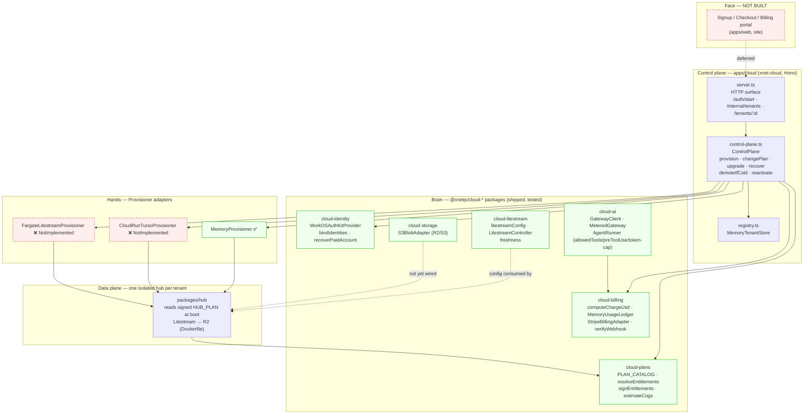

# xNet Cloud — Architecture Map and Completion Status

## Problem Statement

xNet ships as a local-first, self-hostable knowledge graph with a peer-to-peer
hub. "xNet Cloud" is the managed-hosting business layered on top of it: a
control plane that provisions, bills, meters, and upgrades one isolated hub per
paying tenant, plus a managed AI gateway. Over the last several explorations
(0147, 0148, 0173, 0174, 0175, 0176, 0177, 0178) a substantial amount of this
has been designed and a foundation has been shipped to `main` across PRs
[#66](https://github.com/crs48/xNet/pull/66),
[#68](https://github.com/crs48/xNet/pull/68), and
[#73](https://github.com/crs48/xNet/pull/73).

This document answers three questions:

1. **What is the architecture of xNet Cloud as it exists in the repo today?**
2. **Is it complete?**
3. **What work is left to make it a service real customers can pay for?**

## Executive Summary

xNet Cloud is **architecturally complete and code-incomplete**. The hard design
decisions are made, the seams are cut, and the *pure*, *testable*, *substrate-
agnostic* core is shipped with ~124 passing tests and zero required API keys or
Docker. What is missing is almost entirely the part that touches real money,
real cloud APIs, and real users: the provisioner adapters throw
`NotImplementedError`, every store is in-memory, there is no UI, and the
control-plane service is not deployed anywhere.

A useful mental model:

- **The "brain" is built.** Plan catalog, signed entitlements, two-identity
  binding, billing math + ledger, AI gateway with budget hard-stop and agent
  safety harness, Litestream config/controller, cold-tiering orchestration, and
  the `ControlPlane` lifecycle are all implemented and unit-tested behind clean
  interfaces.
- **The "hands" are stubs.** The two `Provisioner` adapters that would actually
  create a Cloud Run service or a Fargate task are skeletons. Nothing has ever
  provisioned a real hub through this code.
- **The "face" doesn't exist.** No signup, checkout, billing portal, or plan
  picker in `apps/web`, `apps/electron`, `apps/expo`, or `site/`. The cloud is
  reachable only as backend packages and an undeployed Hono service.

**Estimated completeness: the foundation/P0 layer is ~90% done; the end-to-end
"a stranger can pay $5 and get a hub" path is ~25–30% done.** The remaining work
is concrete, already enumerated across the explorations, and mostly gated on
credentials and a production deploy rather than on undecided design.

## Current State In The Repository

### Package map

xNet Cloud lives in seven `@xnetjs/cloud-*` packages plus one app. All are
licensed FSL-1.1-Apache-2.0 (source-available, non-compete), deliberately *not*
MIT like the rest of the core — the open-core boundary from exploration 0174.

| Package / app | Role | Status |
|---|---|---|
| [`packages/cloud-plans`](packages/cloud-plans/src/index.ts) | Plan catalog, isolation tiers, signed `HUB_PLAN` entitlement tokens, COGS/pricing model | **Shipped** |
| [`packages/cloud-identity`](packages/cloud-identity/src/index.ts) | Two-identity model: WorkOS billing identity ↔ data DID, dual-proof binding, billing-only recovery | **Shipped** |
| [`packages/cloud-provisioner`](packages/cloud-provisioner/src/index.ts) | Substrate-agnostic `Provisioner` lifecycle, `ShardAllocator`, `MemoryProvisioner` | **Interface + fake shipped; real adapters stubbed** |
| [`packages/cloud-storage`](packages/cloud-storage/src/index.ts) | `S3BlobAdapter` (R2/S3) implementing the `@xnetjs/storage` contract | **Shipped (not wired into hub)** |
| [`packages/cloud-billing`](packages/cloud-billing/src/index.ts) | Pure pricing math, idempotent usage ledger, Stripe Meters adapter + `FakeStripeBilling`, webhook verify | **Shipped** |
| [`packages/cloud-ai`](packages/cloud-ai/src/index.ts) | OpenAI-compatible gateway, budget hard-stop, usage→billing bridge, sandboxed agent-safety harness | **Shipped (LiteLLM/SDK wiring deferred)** |
| [`packages/cloud-litestream`](packages/cloud-litestream/src/index.ts) | `litestream.yml`/argv builders, supervised controller (drain-before-close), freshness checks | **Shipped** |
| [`apps/cloud`](apps/cloud/src/index.ts) (`xnet-cloud`) | Hono control-plane service composing the packages | **Skeleton (in-memory, undeployed)** |

### How the pieces compose

The `ControlPlane` ([apps/cloud/src/control-plane.ts](apps/cloud/src/control-plane.ts))
is the orchestrator. It depends only on interfaces, so the same code runs with
in-memory fakes in dev and real adapters in production
([apps/cloud/src/index.ts:9](apps/cloud/src/index.ts)).



### The control-plane lifecycle (what actually works)

`ControlPlane` ([control-plane.ts](apps/cloud/src/control-plane.ts)) implements
the full managed-fleet lifecycle against the `MemoryProvisioner`:

- **`provisionTenant`** — `bindIdentities` (dual proof: WorkOS billing user +
  signed DID challenge) → `resolveEntitlements(plan)` → `provisioner.provision`
  with a freshly **signed `HUB_PLAN`** in the env → record in the registry.
- **`changePlan`** — `requiresMigration(from, to)` decides between a live
  **entitlement flip** (`provisioner.setEnv` with a new token; storage/seats/
  concurrency bumps inside the same isolation tier) and a **`migration-required`**
  result (crossing an isolation boundary — the migration engine is deferred).
- **`upgradeTenant`** — rolls a tenant's hub to a new immutable image tag (one
  staged-rollout step; tags are pinned per tenant, never `latest`).
- **`recoverAccount`** — recovers a paid account from the billing identity alone;
  clears the data DID for rebind (billing recovery never recovers encrypted data).
- **`demoteIfCold` / `reactivate`** — the cold-tiering loop from exploration 0178:
  confirm the DB is synced to R2 (`assertSynced` demotion gate), destroy the
  machine/volume, mark `dataTier: 'cold'`; on reactivation, provision a fresh hub
  with `restoreFromR2` so Litestream restores the DB on boot. The control plane
  is the single-writer fence.

### The hub seam (anti-lock-in invariant)

The most important architectural property is that **the hub never calls the
control plane at runtime**. A managed hub receives a signed `HUB_PLAN` token in
its environment; it verifies and enforces the limits *locally*:

```
packages/hub/src/config.ts
  6  import { entitlementsFromEnv } from '@xnetjs/cloud-plans'
 71  const resolvePlanLimits = (): Partial<HubConfig> => {
 72    if (!process.env.HUB_PLAN) return {}          // self-host keeps DEFAULT_CONFIG
 73    const entitlements = entitlementsFromEnv(process.env)
 75    defaultQuota:   entitlements.quotaBytes
 76    maxBlobSize:    entitlements.maxBlobBytes
 77    maxConnections: entitlements.maxConnections
```

With no `HUB_PLAN`, `resolvePlanLimits()` returns `{}` and the hub keeps its
own `DEFAULT_CONFIG` (1 GB quota, etc.) — a self-hosted hub has **zero
dependency** on xNet Cloud. The same `config.ts` also fingerprints its substrate
(`K_SERVICE` → Cloud Run, ECS metadata → Fargate, Fly, Railway, local) for
observability.

The Litestream side is wired end-to-end at the container level:
`packages/hub/Dockerfile` installs Litestream **pinned to v0.5.3** and uses a
`litestream-entrypoint.sh` that restores-on-boot then runs
`litestream replicate -exec node`; it falls back to plain `node` when
`LITESTREAM` is unset (self-host / Railway demo unchanged). The hub gates
`PRAGMA wal_autocheckpoint=0` behind `LITESTREAM=1`.

### Plan catalog and economics (shipped)

[plans.ts](packages/cloud-plans/src/plans.ts) defines seven tiers
(`demo → personal → family → team → community → company → enterprise`) mapped to
five isolation tiers (`pooled → dedicated-sleep → dedicated-warm →
dedicated-project → region-pinned`). [pricing.ts](packages/cloud-plans/src/pricing.ts)
encodes a real COGS model (`estimateCogs`) and `PLAN_PRICING` scenarios; entry
tiers default to **annual** billing to amortize the $0.30 fixed Stripe fee
(`DEFAULT_BILLING_PERIOD`). Per exploration 0178: Personal ≈ 86% monthly / ~91%
annual gross margin; Family ~92%, Team ~88%, Enterprise ~55–65%.

### What is *not* in the repo

- **No real provisioning.** [cloud-run-turso.ts](packages/cloud-provisioner/src/adapters/cloud-run-turso.ts)
  and [fargate-litestream.ts](packages/cloud-provisioner/src/adapters/fargate-litestream.ts)
  define config + the `Provisioner` shape but every method throws
  `NotImplementedError` (`TODO(0175): Pulumi Automation API…`).
- **No durable state.** `MemoryTenantStore`, `MemoryBindingStore`,
  `MemoryBillingIdentityProvider`, `MemoryUsageLedger` — all RAM, all reset on
  restart ([registry.ts:5](apps/cloud/src/registry.ts) "Phase 0/1… swap later").
- **No real DID verification.** The dev verifier only checks the challenge is
  well-formed (`TODO(0175): wire to @xnetjs/identity`,
  [index.ts:44](apps/cloud/src/index.ts)).
- **No deploy.** `railway.toml` deploys only the **hub**; `xnet-cloud` is built
  and tested in CI but deployed nowhere. The default plan-signing secret is
  `dev-insecure-plan-secret`.
- **No UI.** No `cloud`/`stripe`/`workos`/`billing` references anywhere in
  `apps/web`, `apps/electron`, `apps/expo`, or `site/`.
- **No blob→R2 in the hub.** `packages/hub` does not depend on
  `@xnetjs/cloud-storage`; user blobs still go to the local `FileStorageAdapter`.
  Only the SQLite DB reaches R2 (via Litestream).

## External Research

**Managed-hosting-of-OSS is a proven pattern with proven economics.** The
"open-core + managed cloud" shape xNet is copying is the standard playbook of
Supabase, PlanetScale, Neon, Turso, Ghost(Pro), GitLab, and Sentry: keep the
engine permissively licensed for adoption, sell the operational burden (backups,
upgrades, scaling, SSO, audit) as the cloud. xNet's twist — a non-custodial,
end-to-end-encrypted data identity *separate* from the custodial billing
identity — is unusual but mirrors how password managers and Tuta/Proton split
"who pays" from "who can read the data," and is what lets the company hold
encrypted bytes it cannot read.

**Litestream is a live, Fly.io-maintained project again, and the v0.5.x caution
in the repo is well-founded.** Ben Johnson shipped v0.5.0 in October 2025 after
Fly paused Litestream for ~two years in favor of LiteFS, then reversed because
users preferred Litestream's operational simplicity. v0.5 adds point-in-time
recovery and S3 streaming, and a forthcoming **Litestream VFS** for read
replicas — pages served straight from S3/R2 while the DB hydrates in the
background — which is exactly the "WARM" tier sketched in exploration 0177. But
the 0.5.x line had real stability bugs (some users hit runaway disk usage; the
repo's memory notes silent-skip bugs in 0.5.6/0.5.7), which validates pinning to
a known-good **v0.5.3** rather than tracking latest.

**The Cloud Run sharding constraint is real and un-raisable.** Google documents
a hard cap of **1,000 Cloud Run services per project per region that cannot be
increased**; the only way past it is more projects/regions. This is precisely
why `cloud-provisioner` ships a `ShardAllocator`
([sharding.ts](packages/cloud-provisioner/src/sharding.ts)) that rolls to a new
GCP project at ~800 services (headroom under 1000) before that limit is hit — a
dedicated-service-per-tenant fleet *must* shard, and the control plane is the
right place to own that.

**Substrate ToS remains the live business risk.** The decision (recorded in
memory and 0174/0175) that Railway and Fly's AUPs prohibit *reselling* compute —
so the managed fleet must run on Fargate / Hetzner / Cloud Run while Railway/Fly
stay the free *self-host* path — is the kind of thing that should be re-checked
against current terms before launch, since AUPs change.

Sources:
[Litestream v0.5.0 (Fly blog)](https://fly.io/blog/litestream-v050-is-here/),
[Litestream v0.5.0 (Simon Willison)](https://simonwillison.net/2025/Oct/3/litestream/),
[Hold off on Litestream 0.5.0 (mtlynch.io)](https://mtlynch.io/notes/hold-off-on-litestream-0.5.0/),
[Cloud Run 1000-service cap (Google Developer forums)](https://discuss.google.dev/t/cloud-run-service-quota-1000-increase-possible/167186),
[Cloud Run quotas (Google Cloud docs)](https://docs.cloud.google.com/run/quotas).

## Key Findings

1. **The architecture is sound and the abstractions are honest.** The
   `Provisioner` interface is the keystone: the control plane is written once and
   the substrate is swappable, so the project is never hostage to one vendor's
   ToS. Cutting that seam *before* building a real adapter is the right order of
   operations.
2. **"Testable without keys" was treated as a first-class architectural goal,
   not an afterthought.** Every external integration has a fake + a shared
   contract suite (exploration 0176): `FakeStripeBilling` with real local webhook
   HMAC, `MemoryProvisioner`, `S3BlobAdapter` against `aws-sdk-client-mock`, the
   `AgentRunner` driven by scripted `ModelStep` turns, WorkOS via msw. This is why
   ~124 tests run green with no credentials and no Docker — and it means the real
   adapters will be validated against the same contracts the fakes already pass.
3. **The money path is mathematically complete but operationally untested.**
   `computeChargeUsd` (rounds up, never undercharges), the idempotent ledger, the
   COGS model, and webhook verification are all implemented and unit-tested. None
   of it has processed a real Stripe event or a real provider invoice.
4. **The biggest single code gap is the provisioner adapter.** Until one of the
   two adapters actually creates a hub on a real substrate, *nothing* about xNet
   Cloud works end-to-end. Everything else (billing, identity, AI, cold-tiering)
   is downstream of "there is a running hub."
5. **The second-biggest gap is the absence of any user-facing surface.** A
   paying customer cannot currently *do* anything — there is no signup, no
   checkout, no `/auth/callback`, no portal. The control plane's `/internal/*`
   routes assume a Stripe webhook and an authenticated session that don't exist
   yet.
6. **Durability/state is a deploy-blocker, not a design gap.** Swapping the four
   in-memory stores for durable ones (Postgres/Turso/Durable Object) is
   mechanical — the interfaces are already defined — but it must happen before
   any real tenant exists, because a control-plane restart currently forgets
   every tenant.
7. **Two known operational hazards are tracked:** the hub Dockerfile's Litestream
   v0.5.3 download has 404'd in CI (`build-and-smoke` breakage noted in memory),
   and split-brain/RPO/wake behavior has never been validated against a real
   deploy.

## Options And Tradeoffs

The completion question is really "what do we build next, and in what order?"
Three credible sequencings:

### Option A — "Dogfood first" (vertical slice on one substrate)

Pick **one** substrate (Cloud Run + Litestream→R2, *not* Turso — 0178 killed
libSQL), implement that single `Provisioner` adapter for real, stand up durable
state, deploy `xnet-cloud`, and run **xNet's own hubs** through it. No public
signup yet; provision via the `/internal` API by hand.

- **Pros:** Proves the entire spine (provision → run → meter → upgrade →
  cold-demote → reactivate) against reality with the fewest moving parts.
  Surfaces the unknowns that only a real deploy reveals (RPO, wake latency,
  split-brain, the Litestream 404). Matches exploration 0174's P0 and 0173's
  "demand before supply / managed before operators."
- **Cons:** No revenue, no external users. Requires GCP credentials and a Pulumi
  (or equivalent) investment.

### Option B — "Money first" (Stripe + WorkOS end-to-end, fake substrate)

Build the user-facing path — WorkOS `/auth/callback` + sealed sessions, Stripe
Checkout + Customer Portal + the webhook that drives `/internal/tenants`, and a
minimal plan-picker UI — but keep provisioning on `MemoryProvisioner` or a
single hand-managed hub.

- **Pros:** Validates pricing, billing, identity binding, and the purchase funnel
  with real humans and real cards. The billing/identity code is the most
  finished, so this is high-leverage.
- **Cons:** You're selling a hub you provision by hand; doesn't scale past a pilot
  and doesn't de-risk the provisioner — the riskiest unbuilt component.

### Option C — "Adapters in parallel, behind contracts"

Treat the two adapters as independent workstreams validated against the existing
`Provisioner` contract suite using `pulumi.runtime.setMocks` / msw, and build the
real cloud calls without a full deploy.

- **Pros:** Keeps the substrate-agnostic promise honest (two substrates, not
  one) and parallelizes well.
- **Cons:** Highest effort; over-invests in optionality before a single tenant
  exists. Premature — the second substrate is a P3 "BYOC/AWS-native" concern.

### Recommendation

**Do A, then B, deferring C.** Sequence:

1. **One real substrate, vertical.** Implement `CloudRunTursoProvisioner` as a
   **Cloud-Run-+-Litestream→R2** adapter (rename/repurpose — Turso is dead per
   0178), validated against the `Provisioner` contract suite with mocked Pulumi,
   then against a real GCP project. This is the single highest-value unit of work.
2. **Durable state.** Replace the four in-memory stores with durable
   implementations of their existing interfaces. Non-negotiable before any real
   tenant.
3. **Deploy `xnet-cloud`** as its own service (not Railway — its AUP is the whole
   reason for the abstraction; use Cloud Run/Fargate), with a real
   `XNET_PLAN_SECRET` and `XNET_CLOUD_INTERNAL_SECRET`.
4. **Dogfood:** run xNet's hubs through it; measure COGS, wake latency, RPO; fix
   the Litestream 404.
5. **Then the money path (Option B):** WorkOS `/auth/callback` + sealed sessions,
   real `@xnetjs/identity` DID verification, Stripe Checkout/Portal/webhook, and a
   minimal Personal-plan signup in `apps/web`/`site`.
6. **Defer C** (second substrate, BYOC, enterprise SSO/SCIM/audit) to a later
   milestone once there is paying demand.

This keeps faith with the explorations' own phasing (0174 P0→P1, 0173 "managed
before operators") and attacks the riskiest unbuilt component — the provisioner —
first.

## Example Code

The shape of the first real adapter, validated against the contract suite the
`MemoryProvisioner` already passes:

```ts
// packages/cloud-provisioner/src/adapters/cloud-run-litestream.ts (sketch)
// Repurposes the dead cloud-run-turso skeleton: SQLite + Litestream→R2 (0178),
// NOT Turso/libSQL (the `case 'libsql'` seam stays dormant).
export class CloudRunLitestreamProvisioner implements Provisioner {
  readonly substrate = 'cloud-run-litestream'
  constructor(private cfg: CloudRunLitestreamConfig, private shards: ShardAllocator) {}

  async provision(spec: ProvisionSpec): Promise<HubHandle> {
    const project = this.shards.allocate()                 // GCP 1000-svc/project cap
    const stack = await pulumiUp(project, {                // Pulumi Automation API
      service: spec.tenantId,
      image: `${this.cfg.imageRepo}:${spec.targetVersion}`, // immutable, never :latest
      env: {
        ...spec.env,                                       // includes signed HUB_PLAN
        LITESTREAM: '1',
        R2_BUCKET: this.cfg.r2Bucket,
        ...(spec.restoreFromR2 ? { LITESTREAM_RESTORE: spec.restoreFromR2 } : {}),
      },
      minInstances: spec.entitlements.isolation === 'dedicated-warm' ? 1 : 0, // scale-to-zero
    })
    return { tenantId: spec.tenantId, hubUrl: stack.url, substrateRef: stack.ref,
             region: spec.region ?? this.cfg.region, targetVersion: spec.targetVersion,
             state: 'running' }
  }
  // upgrade/setEnv/sleep/destroy/get → real Pulumi stack ops, same contract suite.
}
```

And the durable tenant store, a drop-in for `MemoryTenantStore` against the
existing `TenantStore` interface ([registry.ts](apps/cloud/src/registry.ts)):

```ts
export class SqlTenantStore implements TenantStore {
  constructor(private db: Db) {}
  async get(id: string) { return this.db.oneOrNull('select * from tenants where tenant_id=$1', [id]) }
  async put(r: TenantRecord) { await this.db.upsert('tenants', 'tenant_id', serialize(r)) }
  async list() { return this.db.many('select * from tenants') }
}
```

## Risks And Open Questions

- **Substrate ToS drift.** Re-verify Cloud Run / Fargate / Hetzner terms permit
  per-tenant reselling at launch; the whole `Provisioner` abstraction exists to
  survive a "no."
- **Litestream operational maturity.** v0.5.x had runaway-disk and silent-skip
  bugs; pinning v0.5.3 mitigates but split-brain, RPO, and wake latency are
  **unvalidated against a real deploy**. This is the top operational unknown.
- **Single-writer fence under failure.** `demoteIfCold`/`reactivate` assume the
  control plane is the only writer. A control-plane partition or a stale machine
  that didn't actually stop could corrupt a tenant's DB. Needs the Litestream S3
  conditional-write lease + a real chaos test.
- **DID verification is a stub.** Until `apps/cloud/src/index.ts:44` wires real
  `@xnetjs/identity` passkey-challenge verification, the "non-custodial data
  identity" guarantee is unenforced server-side.
- **`dev-insecure-plan-secret`.** Shipping without rotating this would let anyone
  forge `HUB_PLAN` tokens and grant themselves enterprise quotas. Deploy-blocker.
- **Blob→R2 hub wiring is deferred** and is a deep `sqlite.ts`/storage refactor;
  until then large user blobs don't benefit from R2 economics, only the DB does.
- **Open question: one substrate or two at launch?** Recommendation says one
  (Cloud Run + Litestream); revisit only when an AWS-native/BYOC customer appears.
- **Open question: who owns the durable control-plane DB, and where?** It holds
  the tenant registry and identity bindings — itself a tenant-zero hosting problem.

## Implementation Checklist

- [ ] Repurpose the `cloud-run-turso` skeleton into a real
      **`CloudRunLitestreamProvisioner`** (SQLite + Litestream→R2, no libSQL);
      implement `provision/upgrade/setEnv/sleep/destroy/get` via Pulumi Automation API.
- [ ] Validate the real adapter against the existing `Provisioner` contract suite
      with `pulumi.runtime.setMocks`, then against a live GCP project.
- [ ] Implement durable `TenantStore`, `BindingStore`, billing identity store, and
      `UsageLedger` (drop-in for the four `Memory*` fakes).
- [ ] Stand up the control-plane DB (tenant-zero); decide host + region.
- [ ] Wire real DID verification: replace `devDidVerifier` with `@xnetjs/identity`
      passkey-challenge verification ([index.ts:44](apps/cloud/src/index.ts)).
- [ ] Add `/auth/callback`: exchange the WorkOS code via
      `billing.authenticateWithCode` and seal a session.
- [ ] Add the Stripe path: Checkout, Customer Portal, and the
      `checkout.completed` / plan-change webhooks that drive `/internal/tenants`
      and `/internal/tenants/:id/plan` (verify signatures via `verifyWebhook`).
- [ ] Deploy `xnet-cloud` on Cloud Run/Fargate with rotated `XNET_PLAN_SECRET`
      and `XNET_CLOUD_INTERNAL_SECRET`; **not** Railway (reselling AUP).
- [ ] Fix the hub Dockerfile Litestream v0.5.3 download 404 (`build-and-smoke`);
      mirror/cache the pinned binary.
- [ ] Wire the managed AI gateway to a real upstream (LiteLLM virtual keys or a
      direct provider) behind `MeteredGateway`'s budget hard-stop; add the Claude
      Agent SDK adapter onto `AgentRunner`'s `ModelStep`/`preToolUse` hooks.
- [ ] Build a minimal Personal-plan signup + plan-picker + billing portal link in
      `apps/web`/`site`.
- [ ] Wire blob→R2 in the hub (`@xnetjs/cloud-storage` `S3BlobAdapter`) — deeper
      `sqlite.ts` refactor; deferred but tracked.
- [ ] Add the isolation-tier **migration engine** that consumes
      `changePlan`'s `migration-required` result.
- [ ] Add audit logging, staged fleet upgrades (canary→waves→rollback), and the
      second substrate adapter (Fargate) — later milestones.

## Validation Checklist

- [ ] A hub is provisioned on a real substrate through `ControlPlane.provisionTenant`
      and is reachable at its `hubUrl`.
- [ ] The provisioned hub boots with the **signed `HUB_PLAN`** and enforces the
      tenant's quota/concurrency (verify a forged token is rejected).
- [ ] A control-plane restart preserves all tenants (durable stores proven).
- [ ] An end-to-end purchase works: WorkOS sign-in → Stripe Checkout → webhook →
      tenant provisioned → hub reachable, with no manual steps.
- [ ] A plan upgrade within a tier is a live flip (no data movement); a
      cross-tier change returns `migration-required`.
- [ ] Cold-tiering round-trips: an idle tenant demotes to R2-only, and
      `reactivate` restores the DB with **zero data loss** (RPO measured).
- [ ] Measured wake latency and RPO match exploration 0178's Model A/B targets.
- [ ] A metered AI call charges the ledger, surfaces in Stripe, and the budget
      hard-stop blocks an over-budget tenant before any provider call.
- [ ] Dogfood: xNet's own hubs run through the control plane for ≥1 week; measured
      COGS matches the `estimateCogs` model within tolerance.
- [ ] `build-and-smoke` is green (Litestream 404 fixed).

## References

- [0147 — Future Paid Hub Hosting](docs/explorations/0147_[_]_FUTURE_PAID_HUB_HOSTING.md)
- [0148 — Hosted Hubs Deep AI Integration](docs/explorations/0148_[_]_HOSTED_HUBS_DEEP_AI_INTEGRATION_WITH_PAID_FOUNDATION_MODELS.md)
- [0173 — Community-Owned Decentralized Cloud Infrastructure](docs/explorations/0173_[_]_COMMUNITY_OWNED_DECENTRALIZED_CLOUD_INFRASTRUCTURE.md)
- [0174 — Managed Hosting As Open Core](docs/explorations/0174_[_]_MANAGED_HOSTING_AS_OPEN_CORE_IN_THE_PUBLIC_MONOREPO.md)
- [0175 — Managed Hub Fleet Deployment And AI Gateway](docs/explorations/0175_[_]_MANAGED_HUB_FLEET_DEPLOYMENT_AND_AI_GATEWAY.md)
- [0176 — Testable Cloud Integrations Without API Keys](docs/explorations/0176_[_]_TESTABLE_CLOUD_INTEGRATIONS_WITHOUT_API_KEYS.md)
- [0177 — Data Backend Tiering And Cold-Storage Economics](docs/explorations/0177_[_]_COST_EFFICIENT_SQLITE_HOSTING_NO_LIBSQL_MIGRATION.md)
- [0178 — Cost-Efficient SQLite Hosting, No libSQL Migration](docs/explorations/0178_[_]_COST_EFFICIENT_SQLITE_HOSTING_NO_LIBSQL_MIGRATION.md)
- Code: [apps/cloud](apps/cloud/src/control-plane.ts), [cloud-plans](packages/cloud-plans/src/plans.ts), [cloud-provisioner](packages/cloud-provisioner/src/types.ts), [cloud-identity](packages/cloud-identity/src/index.ts), [cloud-billing](packages/cloud-billing/src/index.ts), [cloud-ai](packages/cloud-ai/src/agent-runner.ts), [cloud-litestream](packages/cloud-litestream/src/index.ts), [cloud-storage](packages/cloud-storage/src/index.ts), [hub config seam](packages/hub/src/config.ts)
- PRs: [#66 foundation](https://github.com/crs48/xNet/pull/66), [#68 keyless integrations](https://github.com/crs48/xNet/pull/68), [#73 no-libSQL + Litestream](https://github.com/crs48/xNet/pull/73)
- External: [Litestream v0.5.0 (Fly)](https://fly.io/blog/litestream-v050-is-here/), [Cloud Run quotas](https://docs.cloud.google.com/run/quotas)
