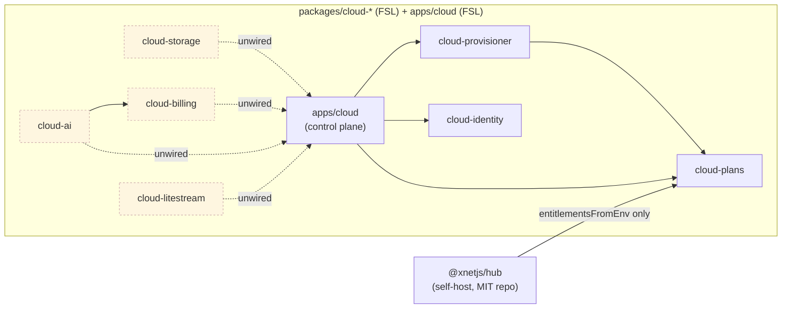
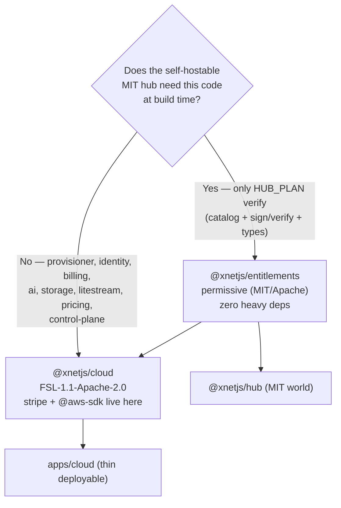

# Consolidate xNet Cloud Into One Package (and Get the License Boundary Right)

## Problem Statement

xNet Cloud currently ships as **seven `@xnetjs/cloud-*` packages plus one app**
(`apps/cloud`). Together they are only ~2,300 lines of source — an average of
~330 LOC per package — yet each carries the full overhead of a standalone
workspace package: its own `package.json`, `tsconfig.json`, build config, README
candidate, and entry in the root `vitest.config.ts` alias table. They are all
`private: true`, all licensed `FSL-1.1-Apache-2.0`, all deployed together as one
control plane, and **none of them is ever versioned or released independently**.

The question this exploration answers: **do we need seven cloud packages, or
should the whole cloud collapse into one simple, clear, shippable unit?** And —
since the user explicitly raised it — **what is the right licensing story for
keeping the cloud in the public monorepo under a different license than the MIT
core?**

The short version of the answer: consolidate, but not to *literally* one package
— to **one FSL `@xnetjs/cloud` package plus one tiny permissively-licensed
entitlement contract** that the self-hostable hub can consume without taking an
FSL dependency. That single seam is the only principled reason not to merge
everything, and it is a *licensing* reason, not a code-structure one.

## Executive Summary

1. **The seven-package split buys almost nothing today.** Four of the seven
   packages (`cloud-storage`, `cloud-billing`, `cloud-ai`, `cloud-litestream`)
   have **no internal consumer at all** yet — nothing in `apps/cloud` or the hub
   imports them (consistent with exploration 0180's finding that AI and blob→R2
   are shipped-but-unwired). The packages are libraries waiting to be composed,
   not independently shipped units. Their boundaries are *module* boundaries
   dressed up as *package* boundaries.

2. **Consolidate 7 → 2.** Merge `cloud-provisioner`, `cloud-identity`,
   `cloud-storage`, `cloud-billing`, `cloud-ai`, `cloud-litestream`, and the
   server-only half of `cloud-plans` (the `pricing.ts` COGS model) into **one
   `@xnetjs/cloud` package (FSL)**, preserving today's ports-and-adapters seams as
   **subpath exports** (`@xnetjs/cloud/provisioner`, `/billing`, `/ai`, …) rather
   than separate packages. Keep `apps/cloud` as a thin deployable that imports it.

3. **Keep exactly one thing split out: the entitlement contract.** The
   self-hostable hub imports `@xnetjs/cloud-plans` to *verify* its signed
   `HUB_PLAN` token ([packages/hub/src/config.ts:6](packages/hub/src/config.ts)).
   That contract — plan catalog + `signEntitlements`/`verifyEntitlements`/
   `entitlementsFromEnv` + types — must stay in a **separate, permissively-licensed
   package** (`@xnetjs/entitlements`, MIT/Apache) so the MIT adoption engine never
   takes an FSL dependency and never pulls `stripe`/`@aws-sdk` into its install
   tree. This is the load-bearing reason the answer is "two," not "one."

4. **Fix the licensing while you're in there.** The cloud is *already* in the
   public monorepo under a different license — the user's instinct is the
   implemented model (exploration 0174's open-core boundary). But FSL is declared
   **only as a `license:` string in eight `package.json` files, with no actual FSL
   license text anywhere in the tree**. That's a real compliance gap: FSL-1.1
   requires the license text plus its "Change Date" and "Change License"
   parameters. Consolidation turns the FSL zone into a *single directory* where one
   real `LICENSE` file lives and a one-line CI check can enforce "everything under
   `packages/cloud/` is FSL; only `@xnetjs/entitlements` crosses into the MIT
   world."

## Current State In The Repository

### The eight units and their sizes

| Unit | Src LOC | Test LOC | External deps | Internal consumers |
|---|--:|--:|---|---|
| [`cloud-plans`](packages/cloud-plans/src/index.ts) | 475 | 274 | — | hub, cloud-provisioner, apps/cloud |
| [`cloud-provisioner`](packages/cloud-provisioner/src/index.ts) | 393 | 130 | `@xnetjs/cloud-plans` | apps/cloud |
| [`cloud-identity`](packages/cloud-identity/src/index.ts) | 390 | 344 | — | apps/cloud |
| [`cloud-storage`](packages/cloud-storage/src/index.ts) | 203 | 98 | `@aws-sdk/client-s3`, core, storage | **none** |
| [`cloud-billing`](packages/cloud-billing/src/index.ts) | 207 | 159 | `stripe` | cloud-ai |
| [`cloud-ai`](packages/cloud-ai/src/index.ts) | 397 | 261 | `@xnetjs/cloud-billing` | **none** |
| [`cloud-litestream`](packages/cloud-litestream/src/index.ts) | 264 | 196 | — | **none** (hub uses the binary, not the pkg) |
| [`apps/cloud`](apps/cloud/src/index.ts) | 504 | — | hono, cloud-{identity,plans,provisioner} | (deployable) |
| **Total** | **~2,833** | **~1,462** | | |

Two facts jump out:

- **The entire cloud is < 3k lines of source** spread across 8 `package.json`
  files. That is heavy packaging ceremony for a small, cohesive, single-deployment
  surface.
- **Only one cross-boundary edge leaves the cloud zone:** `packages/hub` →
  `@xnetjs/cloud-plans` (and only `entitlementsFromEnv`). Everything else is either
  internal to the cloud or not yet wired to anything.

### The dependency graph today



The dashed nodes are shipped-but-unconsumed. The only edge that constrains
consolidation is `hub → cloud-plans`.

### Licensing as it actually exists

```
packages/cloud-*/package.json   →  "private": true, "license": "FSL-1.1-Apache-2.0"
apps/cloud/package.json         →  "private": true, "license": "FSL-1.1-Apache-2.0"
packages/core/package.json      →  "license": "MIT", publishConfig.access: public
packages/hub/package.json       →  (no license field; private)
/LICENSE                        →  MIT License, Copyright (c) 2026 Chris Smothers
```

So the open-core boundary from exploration 0174 — **MIT core / FSL control plane /
private ops repo** — is partly real: the cloud genuinely carries a different
license string than the MIT core, in the same public repo. But:

- There is **no FSL license text file** anywhere (`packages/cloud-*/LICENSE` does
  not exist). FSL-1.1 is a parameterized license; a bare `license:` string is not
  a valid grant.
- The boundary is **scattered across eight manifests** instead of one directory,
  so there is nothing to point a CI check or a human auditor at.
- The hub (MIT-world, self-hostable) takes a build-time dependency on an
  FSL-licensed package (`cloud-plans`). FSL is non-copyleft so this isn't viral
  contamination, but it muddies the clean "the adoption engine is MIT, full stop"
  story.

## External Research

**Package granularity is a friction trade-off, and these packages are on the
wrong side of it.** The consensus guidance is that you split a package when there
is real friction to relieve — independent deploy cadence, coupled change cycles
across teams, divergent scaling, or ambiguous ownership — and that "even a
10-package repo is hard because every package must be versioned and every version
depends on a version of another." None of those forces apply here: the cloud is
one team, one deploy, one version (`0.0.1` everywhere), private (never published),
and changes ripple together anyway. The flip-side risk — a consolidated package
degenerating into "a giant blob where everything imports everything (low
cohesion, high coupling)" — is real, but it is preventable with subpath exports
and an import-boundary lint rule, and it is a smaller risk than the current
ceremony tax. ([microservices granularity tradeoffs](https://medium.com/@arnonrgo/microservices-granularity-tradeoffs-171594fad8ca),
[10 monorepo problems — Digma](https://digma.ai/10-common-problems-of-working-with-a-monorepo/))

**FSL is the right license and it is designed for exactly this.** The Functional
Source License (Sentry, Nov 2023) is a source-available license that grants copy/
modify/redistribute **for any purpose except a competing commercial service**, and
**auto-converts to Apache-2.0 or MIT exactly two years after each version's
release**, so there is no long-term lock-in. It is the Fair Source evolution of
the BSL with a shorter (2-year vs ≤4-year) non-compete and a SaaS-targeted
limitation. This is precisely the xNet Cloud posture: publish the control plane
for trust/auditability/recruiting, but stop a third party from standing up
"someone-else's-xNet-Cloud" from your own source. The cautionary note from 0174
still holds — Cal.com re-closed its source-available `ee/` in 2026 citing
AI-assisted vuln discovery on public code — so the *private ops* repo (secrets,
IaC, fraud heuristics) must stay private regardless of how the FSL zone is
packaged. ([TechCrunch on FSL](https://techcrunch.com/2023/11/20/with-functional-source-license-sentry-wants-to-grant-developers-freedom-without-harmful-free-riding/),
[fsl.software](https://fsl.software/),
[TLDRLegal: FSL](https://www.tldrlegal.com/license/functional-source-license-fsl))

The licensing-relevant takeaway for *consolidation*: FSL cares about a clear
boundary of "what is the licensed work." One directory with one `LICENSE` file is
far easier to defend and to convert-on-schedule than eight `package.json` strings.

## Key Findings

1. **These are nano-packages, not modules with independent lifecycles.** ~330 LOC
   average, shared license, shared deploy, shared version, mostly unconsumed. The
   split encodes a *future* aspiration (independently publishable cloud SDKs) that
   has not materialized and may never need to.
2. **The ports-and-adapters testability that justified the split survives
   consolidation.** The value was the *interfaces* (`Provisioner`,
   `StorageAdapter`, `ChatGateway`, `StripeBilling`) and their fakes + contract
   suites — those are module-level constructs. Subpath exports keep them as crisp
   public surfaces inside one package; the ~124 keyless tests move unchanged.
3. **Exactly one edge forbids a literal single package:** the MIT hub must verify
   `HUB_PLAN` without importing FSL code or `stripe`/`@aws-sdk`. So the *entitlement
   contract* must remain a separate, permissive package. Everything else is free
   to merge.
4. **`pricing.ts` is in the wrong package.** The COGS/margin model lives in
   `cloud-plans` but is a server-only business concern the hub never needs. Moving
   it into `@xnetjs/cloud` shrinks the shared contract to the genuine minimum
   (catalog + entitlement sign/verify/types).
5. **Consolidation is a net *clarity* win for licensing.** It converts a
   scattered, text-less FSL declaration into one directory with one real LICENSE
   file and a trivially enforceable boundary.
6. **Risk is mostly mechanical:** vitest alias churn (7→1), preserving git blame
   (`git mv`), and a lint rule to stop the merged package becoming a blob.

## Options And Tradeoffs

| Option | Shape | Pros | Cons |
|---|---|---|---|
| **A. Status quo** | 7 pkgs + app | No work; "independently publishable" optionality | Ceremony tax on 2.3k LOC; scattered, text-less FSL boundary; optionality unused |
| **B. Literal single package** | 1 `@xnetjs/cloud` (incl. entitlements) + app | Simplest count | MIT hub → FSL dep; hub install pulls `stripe`+`@aws-sdk`; muddies open-core story — **rejected** |
| **C. One cloud pkg + one entitlements pkg (recommended)** | `@xnetjs/cloud` (FSL) + `@xnetjs/entitlements` (permissive) + thin `apps/cloud` | Clean license boundary; hub stays MIT-pure & dep-light; seams kept as subpath exports; one FSL LICENSE file | Two-package nuance to explain; subpath-export config |
| **D. C, but app folded in** | `@xnetjs/cloud` exposes a `bin` / `serve()`; no `apps/cloud` | Fewest units | Breaks the repo's app-vs-package convention (apps = deployables) |
| **E. Split strictly by license, keep sub-packages** | 2 dirs, still many pkgs | Boundary clarity | Keeps the ceremony tax — defeats the purpose |

### Why C over B (the crux)



The decision rule is purely "does the permissive, self-hostable plane consume
it?" Only the entitlement *contract* does. That keeps the hub's dependency tree
free of `stripe`/`@aws-sdk` and free of FSL, which is the whole point of the
open-core boundary.

## Recommendation

Adopt **Option C**. Target end state:

```
packages/
  entitlements/                 ← permissive (MIT or Apache-2.0); shared by both planes
    src/{plans,entitlements,index}.ts          (catalog + sign/verify/fromEnv + types)
  cloud/                        ← FSL-1.1-Apache-2.0; ONE LICENSE file; server-only
    LICENSE                                     (full FSL text + Change Date/License)
    src/
      provisioner/   (types, memory, sharding, adapters/*)
      identity/      (workos, binding, provider)
      billing/       (pricing, ledger, stripe)
      ai/            (gateway, metered-gateway, metering, agent-runner)
      storage/       (s3-adapter, contract)
      litestream/    (config, commands, controller, freshness)
      cost/          (pricing.ts moved out of cloud-plans)
      index.ts       (re-exports; subpath exports per module)
apps/
  cloud/                        ← FSL; thin Hono deployable importing @xnetjs/cloud
```

`@xnetjs/cloud` `package.json` exposes the seams via `exports` so consumers still
get crisp, tree-shakeable entry points and nothing becomes a blob:

```jsonc
{
  "name": "@xnetjs/cloud",
  "private": true,
  "license": "FSL-1.1-Apache-2.0",
  "sideEffects": false,
  "exports": {
    ".":             "./dist/index.js",
    "./provisioner": "./dist/provisioner/index.js",
    "./identity":    "./dist/identity/index.js",
    "./billing":     "./dist/billing/index.js",
    "./ai":          "./dist/ai/index.js",
    "./storage":     "./dist/storage/index.js",
    "./litestream":  "./dist/litestream/index.js"
  },
  "dependencies": {
    "@xnetjs/entitlements": "workspace:*",
    "@xnetjs/core": "workspace:*",
    "@xnetjs/storage": "workspace:*",
    "@aws-sdk/client-s3": "...",
    "stripe": "..."
  }
}
```

Net change: **7 packages + 1 app → 2 packages + 1 app**, one real FSL LICENSE
file, a hub that depends only on permissive code, and the same tests and seams.

Sequencing note vs. exploration 0180: do this **before** building the real
provisioner adapter. Consolidation is cheapest now, while everything is in-memory
and unwired; doing it after the adapter/UI work means moving more code.

## Example Code

Preserving a seam as a subpath export (the provisioner contract the future
adapters and the control plane both import):

```ts
// packages/cloud/src/provisioner/index.ts   (was @xnetjs/cloud-provisioner)
export { type Provisioner, type ProvisionSpec, type HubHandle, NotImplementedError } from './types'
export { MemoryProvisioner } from './memory'
export { ShardAllocator } from './sharding'
export { CloudRunLitestreamProvisioner } from './adapters/cloud-run-litestream'

// apps/cloud/src/control-plane.ts  — import sites barely change:
import { MemoryProvisioner, type Provisioner } from '@xnetjs/cloud/provisioner'
import { bindIdentities } from '@xnetjs/cloud/identity'
import { resolveEntitlements, signEntitlements } from '@xnetjs/entitlements'
```

The hub keeps its single permissive import; only the package name changes:

```ts
// packages/hub/src/config.ts
import { entitlementsFromEnv } from '@xnetjs/entitlements'   // was @xnetjs/cloud-plans
```

An import-boundary lint rule keeps the merged package honest (no reaching across
modules except through their index):

```jsonc
// .eslintrc — no-restricted-imports / boundaries plugin
"packages/cloud/src/billing/**": { "allow": ["@xnetjs/entitlements", "./*"] }
// billing must not import ../ai internals, etc. — only public subpaths.
```

And the licensing boundary becomes a one-line CI assertion:

```bash
# every cloud manifest is FSL; nothing outside imports @xnetjs/cloud except apps/cloud
test "$(jq -r .license packages/cloud/package.json)" = "FSL-1.1-Apache-2.0"
! grep -rl "@xnetjs/cloud\b" packages --include=package.json | grep -v packages/cloud
```

## Risks And Open Questions

- **Blob risk.** A single package can rot into high-coupling. *Mitigation:*
  subpath exports + an import-boundary lint rule so modules touch each other only
  through public entry points (exactly the discipline the package split enforced
  for free).
- **Dependency footprint of the merged package.** `stripe` + `@aws-sdk/client-s3`
  now live in one package. Acceptable because it is server-only and the hub never
  imports `@xnetjs/cloud`; `sideEffects:false` + subpath exports keep tree-shaking
  intact for the app.
- **Git history.** Use `git mv` per file so `git blame` survives the move;
  consolidate in a single mechanical commit separate from any behavior change.
- **Vitest/alias churn.** The root `vitest.config.ts` lists all seven cloud
  aliases and test globs; collapse to `@xnetjs/cloud` + `@xnetjs/entitlements`.
  One-time, low-risk.
- **Relicensing `cloud-plans` → permissive.** Moving the entitlement contract from
  FSL to MIT/Apache is relicensing the repo owner's own code *more* permissively —
  always allowed, no contributor sign-off needed here (solo `Copyright (c) 2026
  Chris Smothers`). Revisit if outside contributors land first.
- **Add the actual FSL text.** Non-negotiable compliance fix: drop the full
  FSL-1.1-Apache-2.0 text into `packages/cloud/LICENSE` with explicit Change Date
  and Change License. Today there is none.
- **Open question — is "entitlements" even a *cloud* concept?** Arguably it is a
  shared *protocol* contract (the hub enforces it whether or not xNet Cloud
  exists). Naming it `@xnetjs/entitlements` (not `cloud-*`) reflects that it
  belongs to the MIT world, which is the cleanest framing.
- **Open question — fold `apps/cloud` in (Option D)?** Recommend no: keep the
  app-vs-package convention. Re-open only if a second deployable never appears.

## Implementation Checklist

- [ ] Create `packages/entitlements` (permissive license, MIT or Apache-2.0); `git mv`
      `cloud-plans/src/{plans,entitlements,index}.ts` into it; **leave `pricing.ts` out**.
- [ ] Move `cloud-plans/src/pricing.ts` → `packages/cloud/src/cost/pricing.ts` (server-only).
- [ ] Create `packages/cloud` with subpath-export `package.json` (`./provisioner`,
      `./identity`, `./billing`, `./ai`, `./storage`, `./litestream`) and `sideEffects:false`.
- [ ] `git mv` the six remaining `cloud-*` packages' `src/` into
      `packages/cloud/src/<module>/`, preserving tests beside their modules.
- [ ] Add `packages/cloud/LICENSE` with the full **FSL-1.1-Apache-2.0** text +
      Change Date / Change License parameters.
- [ ] Rewrite imports: `@xnetjs/cloud-provisioner` → `@xnetjs/cloud/provisioner`, etc.;
      `@xnetjs/cloud-plans` → `@xnetjs/entitlements` (incl. `packages/hub/src/config.ts`).
- [ ] Update root `vitest.config.ts` aliases + test globs (7 cloud entries → `@xnetjs/cloud`
      + `@xnetjs/entitlements`).
- [ ] Add an import-boundary lint rule for `packages/cloud/src/**` modules.
- [ ] Add the CI license-boundary assertion (cloud is FSL; only `apps/cloud` imports it).
- [ ] Delete the seven old `cloud-*` package dirs; update `apps/cloud` deps to
      `@xnetjs/cloud` + `@xnetjs/entitlements`.
- [ ] Update docs: this doc, exploration 0180's package map, and `packages/README.md`.

## Validation Checklist

- [ ] `pnpm i` resolves with two cloud-zone packages; lockfile has no dangling
      `@xnetjs/cloud-*` references.
- [ ] `pnpm turbo run build typecheck` is green across the repo.
- [ ] The full cloud test suite (~124 tests) passes unchanged after the move.
- [ ] `packages/hub` builds and its `config.plan.test.ts` passes importing only
      `@xnetjs/entitlements`; the hub's resolved dependency tree contains **no**
      `stripe`, `@aws-sdk`, or `@xnetjs/cloud`.
- [ ] Each subpath export resolves (`import('@xnetjs/cloud/billing')` etc.) and
      tree-shakes (a build importing only `/identity` does not bundle `stripe`).
- [ ] `git blame` on moved files still points at original authorship.
- [ ] The CI license-boundary check fails if a non-cloud package imports
      `@xnetjs/cloud`, and passes on the consolidated tree.
- [ ] `packages/cloud/LICENSE` exists and contains valid FSL-1.1 parameters.

## References

- [0180 — xNet Cloud Architecture and Completion Status](docs/explorations/0180_[_]_XNET_CLOUD_ARCHITECTURE_AND_COMPLETION_STATUS.md) — the package map this builds on
- [0174 — Managed Hosting As Open Core In The Public Monorepo](docs/explorations/0174_[_]_MANAGED_HOSTING_AS_OPEN_CORE_IN_THE_PUBLIC_MONOREPO.md) — the MIT / FSL / private three-zone licensing model
- [0175 — Managed Hub Fleet Deployment And AI Gateway](docs/explorations/0175_[_]_MANAGED_HUB_FLEET_DEPLOYMENT_AND_AI_GATEWAY.md)
- [0176 — Testable Cloud Integrations Without API Keys](docs/explorations/0176_[_]_TESTABLE_CLOUD_INTEGRATIONS_WITHOUT_API_KEYS.md) — the contract-suite seams to preserve
- [0178 — Cost-Efficient SQLite Hosting, No libSQL](docs/explorations/0178_[_]_COST_EFFICIENT_SQLITE_HOSTING_NO_LIBSQL_MIGRATION.md)
- Code: [cloud-plans](packages/cloud-plans/src/index.ts), [cloud-provisioner](packages/cloud-provisioner/src/types.ts), [hub config seam](packages/hub/src/config.ts), [apps/cloud control plane](apps/cloud/src/control-plane.ts)
- External: [FSL — fsl.software](https://fsl.software/), [TechCrunch: Sentry FSL](https://techcrunch.com/2023/11/20/with-functional-source-license-sentry-wants-to-grant-developers-freedom-without-harmful-free-riding/), [TLDRLegal: FSL](https://www.tldrlegal.com/license/functional-source-license-fsl), [Microservices granularity tradeoffs](https://medium.com/@arnonrgo/microservices-granularity-tradeoffs-171594fad8ca), [10 monorepo problems (Digma)](https://digma.ai/10-common-problems-of-working-with-a-monorepo/)
