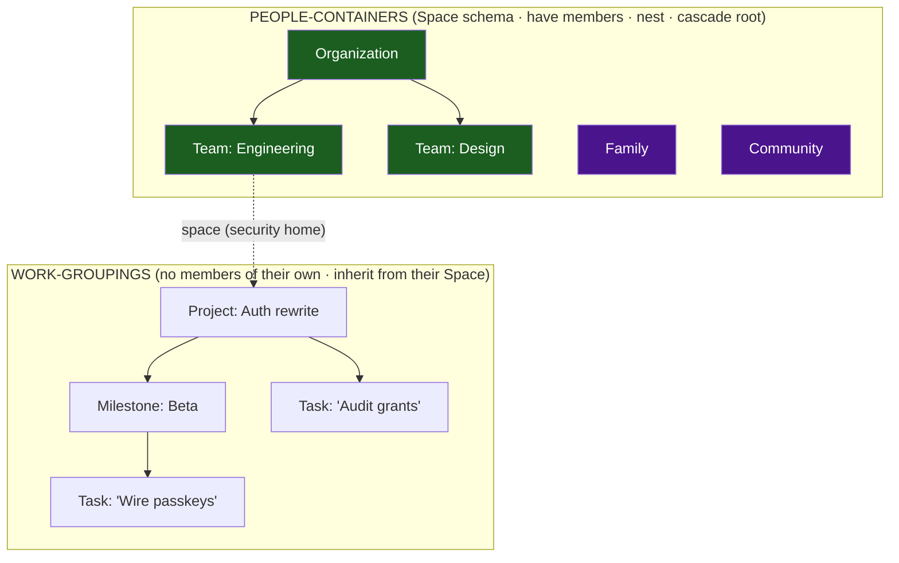
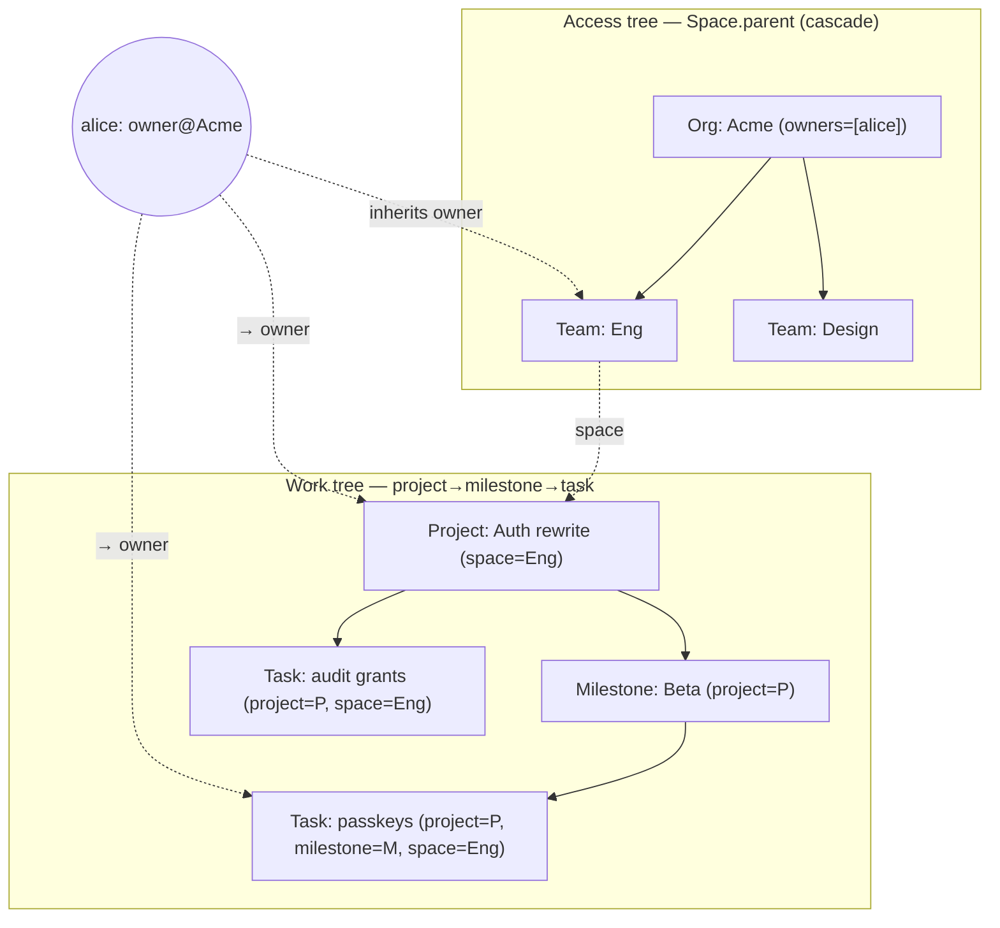
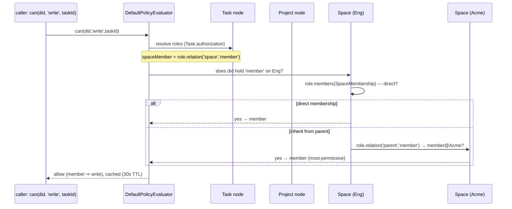
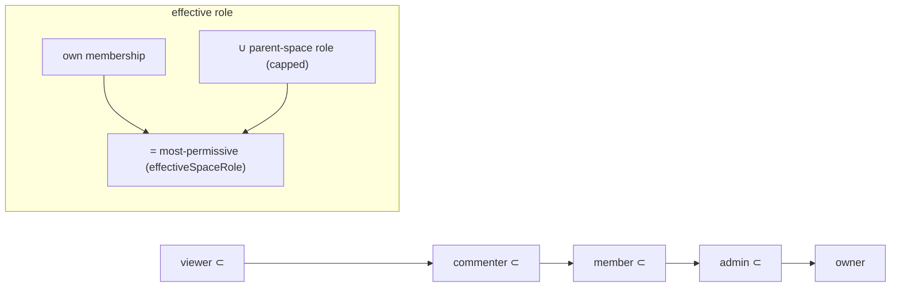
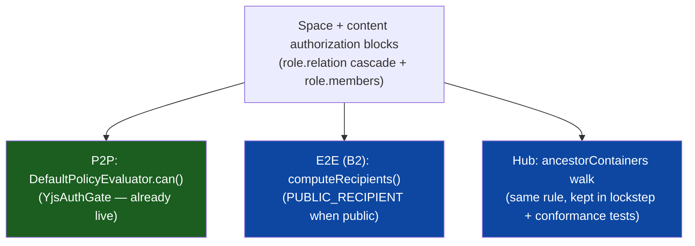

# Spaces as Nested Groupings: People-Containers, Work-Groupings, and Schema-Native Authorization

## Problem Statement

Exploration [0179](docs/explorations/0179_[_]_SPACES_GROUPS_AND_UNIFIED_SHARING.md)
shipped one `Space` schema with a `kind` discriminator and wired it into the
**hub grant index** for enforcement. Exploration
[0180](docs/explorations/0180_[_]_EXPOSING_SPACES_IN_THE_UI.md) designed the UI
to expose Spaces (switcher, scope, project home, members). This exploration goes a
layer deeper, on two questions the previous two left open:

1. **The primitive taxonomy and how things nest.** If we have tasks we should
   have projects; we might want milestones; we obviously want teams, and
   organizations that contain teams. All of these "could nest within each other
   and provide scoping to the children that nest into them." What is the *clean,
   composable* set of primitives — and which of them are the same `Space` schema
   wearing a different name, versus genuinely different things?
2. **How to leverage xNet's built-in *schema* authorization primitives.** 0179
   chose the hub grant index and called the schema-level authorization DSL a
   "dormant spec." That is **wrong**: the DSL (`role.relation`, `allow/deny`,
   `PUBLIC`) is fully implemented, already enforced on the peer-to-peer sync
   path, and already used by a dozen shipped schemas. The real question is how to
   express Space membership and nesting *declaratively in the schema* so the
   permission cascade is written once and honored everywhere — hub, P2P, and
   end-to-end crypto — instead of hand-coded in the hub alone.

The user's instinct — "one spaces schema, leveraged in many places, named
appropriately for each context, with good UX for the sharing primitives" — is
correct, and the prior art (Notion teamspaces, Linear, OpenFGA/SpiceDB, Jazz)
strongly validates it. This document makes that instinct precise.

## Executive Summary

- **Split the world into *people-containers* and *work-groupings*. They are not
  the same primitive and conflating them is the trap.** A **Space** is a
  *people-container / security boundary*: it has members and roles, it nests, and
  it is the root of the permission cascade. A **Project** (and an optional
  **Milestone**) is a *work-grouping*: it organizes content, has **no membership
  of its own**, and **inherits** its access from the Space it lives in. The
  prior art is unanimous here — Notion (teamspace vs page), Linear (team vs
  project), GitHub (team vs repo) all separate the *access tree* from the *work
  tree*.
- **One `Space` schema, renamed per `kind` in the UI — but drop `project` as a
  Space kind.** `SPACE_KINDS` should be the genuine people-containers:
  `personal · workspace · organization · team · community · family`. Remove
  `project` from the list. "Project" is the work-grouping schema
  ([project.ts](packages/data/src/schema/schemas/project.ts)), not a flavor of
  security boundary — this is the principled resolution of the "two projects"
  tension flagged in 0180, and it matches Linear's deliberate decoupling
  (a project can span teams; a single-`parent` Space tree can't model that).
- **The schema authorization DSL is real and already enforced — use it.** Contrary
  to 0179's framing, `DefaultPolicyEvaluator`
  ([packages/data/src/auth/evaluator.ts](packages/data/src/auth/evaluator.ts)) is
  fully implemented: it resolves `role.relation(rel, targetRole)` by walking the
  relation **multi-hop** (default depth 3, cycle-safe), caches decisions, and
  falls back to the grant index. It is **enforced today on the P2P sync path**
  (`YjsAuthGate`, [packages/sync/src/yjs-authorization.ts](packages/sync/src/yjs-authorization.ts)),
  and **12 moderation schemas already declare `authorization` blocks** —
  `PublicInteractionPolicySchema` already uses
  `role.relation('target','owner')` / `role.relation('target','admin')`
  ([moderation.ts](packages/data/src/schema/schemas/moderation.ts)). The
  container-inheritance seam isn't theoretical; it's in production.
- **Express the cascade declaratively with the OpenFGA/SpiceDB idiom:
  `relation = own ∪ (relation from parent)`.** Give content schemas and the
  `Space` schema `authorization` blocks. A Page declares its space-roles via
  `role.relation('space', …)`; a Space declares its parent-roles via
  `role.relation('parent', …)`. Because `parent` is self-referential, this
  recurses to any depth from **one membership edge per node** — no grant
  fan-out. This is exactly what Zanzibar/OpenFGA/SpiceDB do, and the xNet
  evaluator already supports the traversal.
- **Close the one real gap: a *membership resolver*.** The evaluator resolves
  roles from a node's *forward* relations and person-properties. Space membership
  lives on `SpaceMembership` *edge* nodes (a reverse relation) and on hub grants —
  which the evaluator can't currently follow. Add **one** new `RoleResolver`,
  `role.members(edgeSchema, …)` (tag `'membership'`), that resolves "DIDs holding
  role R on this Space" from the `SpaceMembership` edges. With that single
  addition, the Space schema can declare its full role ladder and the entire
  cascade is schema-native. Everything else (depth bound, cycle safety,
  most-permissive-wins, deny precedence, decision cache, `explain()`) already
  exists.
- **Declare once, enforce in three places.** The `authorization` block becomes
  the single source of truth that (a) the **P2P evaluator** reads directly
  (already does), (b) `computeRecipients`
  ([recipients.ts](packages/data/src/auth/recipients.ts)) reads for the **E2E**
  recipient set (the B2 path), and (c) the **hub** grant resolution
  ([share-access.ts](packages/hub/src/services/share-access.ts)) implements — its
  hand-coded `ancestorContainers` walk is the same `relation-from-parent` rule,
  and the two should be kept in lockstep with a shared conformance suite.
- **Milestones need no new container — but a thin work-grouping schema is the
  cleanest.** Every tool models a milestone as a lightweight grouping *under a
  project* with a due date + status, referenced one-per-task (GitHub's rule).
  It has no members, so it is **not** a Space. Add a thin `Milestone` schema (or
  defer it) that inherits authorization from its `project` → `space` chain; no new
  authz code.



## Current State In The Repository

### Two enforcement engines exist; only one is wired to Spaces

| Engine | Where | What it does | Spaces today |
| --- | --- | --- | --- |
| **Hub grant index** | [share-access.ts](packages/hub/src/services/share-access.ts), [storage/interface.ts](packages/hub/src/storage/interface.ts) | `getStatusForNode(did, docId)` walks `ancestorContainers(docId)` and folds container (Space) grants in, most-permissive-wins, explicit removal denies. SQLite-backed. | ✅ 0179 wired Space invites here (container grant keyed by space id). |
| **Schema policy evaluator** | [evaluator.ts](packages/data/src/auth/evaluator.ts), [builders.ts](packages/data/src/auth/builders.ts) | `DefaultPolicyEvaluator.can()` resolves `role.creator/property/relation`, evaluates `allow/deny/and/or/PUBLIC`, caches, falls back to the in-data grant index. **`role.relation` walks multi-hop (depth 3, cycle-safe).** | ❌ `Space` declares **no** `authorization` block (its header says enforcement "rides the hub grant index"). |

### The schema authorization DSL — fully built, and *not* dormant

The DSL ([builders.ts](packages/data/src/auth/builders.ts), AST in
[packages/core/src/auth-types.ts](packages/core/src/auth-types.ts)):

| Builder | Meaning |
| --- | --- |
| `role.creator()` | the DID in `node.createdBy` |
| `role.property(name)` | DIDs in a person/person[] property on the node |
| `role.relation(rel, targetRole)` | **inherit**: DIDs holding `targetRole` on the node referenced by `rel` (the container-inheritance seam) |
| `allow(...roles)` / `deny(...roles)` | grant / revoke for any of these roles (`deny` wins) |
| `and / or / not` | boolean composition |
| `PUBLIC` / `AUTHENTICATED` | anyone / any signed-in DID |

The evaluator's `role.relation` resolution
([evaluator.ts](packages/data/src/auth/evaluator.ts), `checkRole`): loads the
related node(s) via the relation, looks up `targetRole` in *their* schema's
authorization, and recurses (`depth + 1`) — bounded by `maxDepth` (3) and
`maxNodes` (100), with a `visited` cycle guard. `DefaultPolicyEvaluator.can()`
order: cache → load node → resolve roles → field rules → evaluate action expr →
deny check → allow check → **grant-index fallback** → deny. It also exposes
`explain()` returning a step-by-step `AuthTrace`.

**Where it's actually enforced today:** the **P2P sync layer**.
`YjsAuthGate.canApplyUpdate()`
([packages/sync/src/yjs-authorization.ts](packages/sync/src/yjs-authorization.ts))
calls `evaluator.can({ subject, action:'write', nodeId })` to gate incoming Yjs
updates from peers. `computeRecipients()`
([recipients.ts](packages/data/src/auth/recipients.ts)) uses the same role
resolution to compute the **E2E crypto recipient set** (`PUBLIC_RECIPIENT` when
the read expr is `PUBLIC`). The **hub does not** import the evaluator — it uses
its own grant index. So the DSL is real and live, just not on Spaces or the hub.

**Already-shipped proof the seam works:** 12 schemas in
[moderation.ts](packages/data/src/schema/schemas/moderation.ts) declare
`authorization` blocks, and `PublicInteractionPolicySchema` already inherits
roles from related content:

```ts
roles: { /* … */ targetOwner: role.relation('target', 'owner'),
                  targetAdmin: role.relation('target', 'admin') }
```

The truly dead code is [packages/core/src/permissions.ts](packages/core/src/permissions.ts)
(`Group` / `Capability` / `STANDARD_ROLES` / `PermissionEvaluator`) — zero
imports anywhere; a stale parallel spec to delete or ignore.

### The nesting machinery (shared by Folder and Space)

[folder.ts](packages/data/src/schema/schemas/folder.ts) provides the generic tree
helpers — `buildFolderTree`, `flattenFolderTree`, `folderAncestorIds`,
`folderPathIds`, `wouldCreateFolderCycle` (cycle-safe; orphaned cycles lifted to
root). [space.ts](packages/data/src/schema/schemas/space.ts) re-exports them as
`buildSpaceTree` / `spaceAncestorIds` / `wouldCreateSpaceCycle`, plus the role
helpers `compareSpaceRoles`, `effectiveSpaceRole` (most-permissive-wins),
`canManageSpace`, `spaceRoleGrantActions`, `spaceRoleToShareRole`. The hub mirror
is `ancestorContainers(nodeId, maxDepth?)` over a uniform node→container pointer
([storage/interface.ts](packages/hub/src/storage/interface.ts)). Containment is a
single-valued `space` relation **on the child** — `SPACE_KINDS`, `SPACE_ROLES`
(`viewer/commenter/member/admin/owner`), `SPACE_VISIBILITY`, `NODE_VISIBILITY`
all already defined.

### Tasks, Projects, and the (absent) Milestone

- `TaskSchema` ([task.ts](packages/data/src/schema/schemas/task.ts)): `title /
  status (triage→backlog→todo→in-progress→in-review→done→cancelled) / priority /
  dueDate / assignees / parent (subtasks) / project / page / canvas / tags /
  space / visibility`. A Task already relates to a **Project** *and* a **Space**.
- `ProjectSchema` ([project.ts](packages/data/src/schema/schemas/project.ts)):
  `name / icon / status / lead / targetDate / folder / tags / space /
  visibility` + a yjs brief. Header: *"Cycles, milestones, and estimates are
  intentionally out of scope until the task primitive is everywhere."*
- **Milestone: does not exist.** A whole-repo search finds only comments,
  roadmap copy, and sample data. It is greenfield.
- `space` + `visibility` are present on **Page, Database, Canvas, Dashboard,
  Project, Channel, Task** — exactly the content schemas that need the cascade.

## External Research

(Full brief with citations in References; the load-bearing findings.)

- **The Zanzibar/ReBAC inheritance idiom is one self-referential rule.** OpenFGA:
  `define viewer: [user] or viewer from parent`; SpiceDB: `permission view =
  viewer + parent->view`. A node's viewers = its own ∪ its parent's, recursing up
  the `parent` chain from **one edge per node** — no fan-out.
  ([OpenFGA parent-child](https://openfga.dev/docs/modeling/parent-child),
  [SpiceDB schema](https://authzed.com/docs/spicedb/concepts/schema))
- **Resolve at read time; only index group membership if it gets hot.** Zanzibar's
  Leopard index pre-expands *group→group* transitive membership (a set
  intersection), but resource inheritance still resolves through rewrites at check
  time. Modern systems pick read-time resolution + a denormalized index for
  pathological depth — **not** eager grant fan-out.
  ([authzed/zanzibar](https://authzed.com/zanzibar))
- **Jazz proves "groups as members" works local-first/CRDT.** `childGroup.addMember(parentGroup)`
  makes a child inherit a parent's members at their roles, transitively;
  *"the more permissive role wins."* ([Jazz](https://jazz.tools/docs/react/permissions-and-sharing/overview))
- **Keep the role ladder tiny, composed by union; check permissions, not roles.**
  `viewer ⊂ commenter ⊂ member ⊂ admin ⊂ owner`, each a union over the next.
  ([OpenFGA roles](https://openfga.dev/docs/modeling/roles-and-permissions))
- **Default to "strictly expansive": a child may raise access, never silently
  lower it.** Google Drive's rule; make a private/limited subspace an explicit
  opt-out. ([Drive expansive access](https://developers.google.com/workspace/drive/api/guides/limited-expansive-access))
- **Separate the access tree from the work tree.** GitHub: team access inherits
  down nested teams, but *people* don't auto-descend. Linear: a **project can span
  multiple teams** — access anchors at the team, work groupings float. This is the
  decisive argument against making Project a single-`parent` Space.
  ([GitHub nested teams](https://github.blog/news-insights/product-news/nested-teams-add-depth-to-your-team-structure/),
  [Linear conceptual model](https://linear.app/docs/conceptual-model))
- **Milestone = thin grouping under a project, one-ref-per-task.** GitHub
  milestones (due date, one per issue), Linear project milestones (a stage),
  Asana milestone-as-task. Never a heavyweight container.
  ([GitHub milestones](https://docs.github.com/en/issues/using-labels-and-milestones-to-track-work/about-milestones))
- **One entity, renamed per context, is the production-proven choice** (Notion
  teamspace, Linear team/project) — you write inheritance, sharing, breadcrumbs,
  and search **once**. The cost (nullable kind-specific fields) is mitigated by the
  `kind` discriminator. ([DoltHub polymorphic](https://www.dolthub.com/blog/2024-06-25-polymorphic-associations/))

## Key Findings

1. **0179's premise was wrong in a useful way.** The schema authorization DSL is
   implemented, enforced on P2P, and already used with `role.relation` in
   moderation. We are **not building an evaluator** — we are declaring blocks and
   adding *one* resolver. That collapses the cost of "schema-native Space
   permissions" dramatically.
2. **`role.relation` IS the declarative cascade the prior art prescribes.** It is
   `relation-from-parent` by another name, with depth-bounding and cycle-safety
   already implemented. xNet independently built the OpenFGA/SpiceDB idiom.
3. **The single missing capability is reverse-edge membership resolution.** A
   Space's `owners` are a forward property (`role.property('owners')` works), but
   `viewer/commenter/member` live on `SpaceMembership` edges the evaluator can't
   follow. One new resolver closes this.
4. **People-containers and work-groupings are different and must stay different.**
   Spaces have members and cascade; Projects/Milestones organize work and inherit.
   This resolves the "two projects" tension: **drop `project` from `SPACE_KINDS`.**
5. **The access tree must not be forced to equal the work tree.** Anchor
   permissions on durable Spaces (org/team/family); let Projects *reference* a
   Space (and possibly more than one later) rather than nest *as* Spaces.
6. **Declare once, enforce in three engines.** A single `authorization` block can
   drive the P2P evaluator, the E2E recipient set, and (kept in lockstep) the hub
   grant resolution. The hub's `ancestorContainers` walk is the same rule
   implemented imperatively.
7. **Milestones are free.** A thin `Milestone` work-grouping inherits authz from
   `project → space` with zero new policy code; tasks carry one optional ref.
8. **Read-time resolution beats fan-out for a local-first app.** One membership
   edge + cascade-on-read is instantly consistent and avoids rewrite storms;
   reserve the hub's denormalized ancestor index for depth, à la Leopard.

## Options And Tradeoffs

### A. The primitive taxonomy

| | A1: People-containers vs work-groupings ⭐ | A2: Everything is a Space `kind` | A3: A distinct schema per level |
| --- | --- | --- | --- |
| Schemas | `Space` (+kinds) · `Project` · optional `Milestone` | `Space` only | `Org`,`Team`,`Project`,`Milestone`,… |
| "Project spans teams" | natural (Project references a Space) | impossible (single `parent`) | possible but bespoke |
| Membership lives on… | Spaces only | every node (odd for a milestone) | every level (duplication) |
| Cascade engine | one, reused | one | N |
| Verdict | ✅ clear + composable | ❌ conflates access & work | ❌ combinatorial (0179's rejected Option A) |

### B. How a Space resolves its members (the resolver gap)

| | B1: `role.members()` edge resolver ⭐ | B2: members as `person[]` props on Space | B3: keep membership in hub grants only |
| --- | --- | --- | --- |
| Per-member metadata (addedBy/role/at) | ✅ on the edge | ❌ flat arrays | ✅ on grant |
| Scales to large orgs | ✅ (queryable edges) | ❌ CRDT array churn | ✅ |
| Works in the schema evaluator (P2P/E2E) | ✅ | ✅ | ❌ (hub-only) |
| New code | one `RoleResolver` + validate/serialize | none | none |
| Verdict | ✅ principled | ok for tiny spaces | status quo, not schema-native |

**B1**: add `_tag: 'membership'` to the `RoleResolver` union — given the Space
node and a DID, query `SpaceMembership where space === node.id && member === did`
and compare its `role` against the requested rung via `compareSpaceRoles`. The
evaluator already holds a `NodeStoreReader`, so the query is local. This is the
one addition that makes the whole cascade schema-native.

### C. Where enforcement lives

| | C1: Schema block, three engines read it ⭐ | C2: Hub grant index only (0179) | C3: Evaluator only |
| --- | --- | --- | --- |
| Hub relay (authoritative) | hub keeps its index, kept in lockstep | ✅ | ❌ (hub can't run client eval cheaply) |
| P2P sync | ✅ evaluator | ❌ unprotected for spaces | ✅ |
| E2E recipients (B2) | ✅ `computeRecipients` | ❌ | ✅ |
| Single source of truth | ✅ the schema block | ❌ logic in hub TS | ✅ but hub left out |
| Verdict | ✅ unify on the declaration | partial (today) | leaves the hub behind |

### D. Reconciling "Project" (the 0180 open question, resolved)

Drop `project` from `SPACE_KINDS`. `Project` stays a **work-grouping schema** with
a first-class view (0180's `ProjectView`). Its `space` relation is its security
home; "share a project" shares (or files it into) that Space. Rationale: Linear's
project-spans-teams reality breaks a single-`parent` Space tree; and two "project"
entry points confuse users. Migration is a small enum change (few/no
`kind:'project'` spaces exist yet); keep the value reserved for forward-compat but
hide it from the UI.

### E. Milestones

| | E1: Thin `Milestone` schema under Project ⭐ | E2: `Space kind=milestone` | E3: a `milestone` field on Task |
| --- | --- | --- | --- |
| Has members? | no (inherits) | implies members (wrong) | n/a |
| Progress math | clean (one ref per task) | n/a | weak (free-text) |
| New authz code | none (inherits project→space) | none but semantically wrong | none |
| Verdict | ✅ (or defer) | ❌ a milestone isn't a people-container | ❌ too thin |

## Recommendation

Adopt **A1 (people-containers vs work-groupings) + B1 (membership resolver) + C1
(declare once, enforce in three) + D (Project is not a Space) + E1 (thin
Milestone, optional/deferred)**. Concretely:

1. **`Space`** = the people-container. `SPACE_KINDS = personal · workspace ·
   organization · team · community · family`. Nests via `parent`. Members on
   `SpaceMembership` edges; `owners` on the node. The **cascade root**.
2. **`Project`, `Milestone`** = work-groupings. No membership. Anchored to a Space
   via `space`; inherit authorization from it. `Task` references its `project` and
   (optionally) `milestone`, and carries `space`.
3. **Declare the cascade in schemas** using `role.relation('space', …)` on content
   and `role.relation('parent', …)` on Space, plus **one new** `role.members()`
   resolver so a Space resolves its own ladder.
4. **Keep the hub grant index as the hub's fast path**, but treat the schema block
   as canonical and add a conformance suite asserting hub-resolution ≡
   evaluator-resolution for the same fixtures.

### The two trees and the anchor



### How a permission check resolves (schema-native)



### Schema-declared role ladder (union, expansive)



### One declaration, three engines



### Entity model

```mermaid
erDiagram
  SPACE ||--o{ SPACE : "parent (nesting → cascade)"
  SPACE ||--o{ SPACE_MEMBERSHIP : "members (edge → role)"
  SPACE_MEMBERSHIP }o--|| PERSON : "member DID"
  SPACE ||--o{ PROJECT : "space (security home)"
  PROJECT ||--o{ MILESTONE : "project"
  PROJECT ||--o{ TASK : "project"
  MILESTONE ||--o{ TASK : "milestone (optional, one per task)"
  SPACE ||--o{ TASK : "space (inherit authz)"
  SPACE {
    string name
    enum kind "personal|workspace|organization|team|community|family"
    relation parent
    enum visibility "private|unlisted|public"
    person owners
  }
  SPACE_MEMBERSHIP { relation space; person member; enum role; person addedBy; number addedAt }
  PROJECT { string name; enum status; person lead; date targetDate; relation space }
  MILESTONE { string name; enum status; date targetDate; relation project; relation space }
```

## Example Code

The new membership resolver (the one addition):

```ts
// packages/core/src/auth-types.ts — extend the RoleResolver union
export interface MembershipRoleResolver {
  readonly _tag: 'membership'
  readonly edgeSchema: string   // 'xnet://xnet.fyi/SpaceMembership@1.0.0'
  readonly containerProp: string // 'space'  — edge → this node
  readonly memberProp: string    // 'member' — edge → DID
  readonly roleProp: string      // 'role'
  readonly minRole: string       // rung this resolver represents (e.g. 'member')
}

// packages/data/src/auth/builders.ts
role.members = (minRole: SpaceRole) => ({
  _tag: 'membership', edgeSchema: SPACE_MEMBERSHIP_SCHEMA_IRI,
  containerProp: 'space', memberProp: 'member', roleProp: 'role', minRole,
})

// packages/data/src/auth/evaluator.ts — checkRole(), new case
case 'membership': {
  const edges = await this.store.query(resolver.edgeSchema, {
    where: { [resolver.containerProp]: node.id, [resolver.memberProp]: did },
  })
  return edges.some((e) =>
    compareSpaceRoles(e.properties[resolver.roleProp] as SpaceRole, resolver.minRole) >= 0)
}
```

The Space authorization block (cascade + membership):

```ts
// packages/data/src/schema/schemas/space.ts — add authorization
authorization: {
  roles: {
    owner:  role.creator(),                 // plus explicit owners
    admin:  role.property('owners'),
    // own membership ladder (reverse edge)
    mViewer: role.members('viewer'), mCommenter: role.members('commenter'),
    mMember: role.members('member'), mAdmin: role.members('admin'), mOwner: role.members('owner'),
    // inherit from the parent Space (recurses to any depth)
    pViewer: role.relation('parent','viewer'), pMember: role.relation('parent','member'),
    pAdmin:  role.relation('parent','admin'),  pOwner:  role.relation('parent','owner'),
  },
  actions: {
    read:  or(allow('owner','admin','mOwner','mAdmin','mMember','mCommenter','mViewer',
                    'pOwner','pAdmin','pMember','pViewer'),
              // PUBLIC only kicks in when visibility==='public' (recipients.ts honors it)
             ),
    write: allow('owner','admin','mOwner','mAdmin','mMember','pOwner','pAdmin','pMember'),
    share: allow('owner','admin','mOwner','mAdmin','pOwner','pAdmin'),
  },
}
```

Content schemas inherit from their Space (Page/Database/Canvas/Dashboard/Project/Task):

```ts
// added to each content schema's authorization
roles: {
  owner: role.creator(),
  sViewer: role.relation('space','mViewer'),   sCommenter: role.relation('space','mCommenter'),
  sMember: role.relation('space','mMember'),    sAdmin: role.relation('space','mAdmin'),
  // a Task may ALSO inherit from its project (multi-path, most-permissive wins)
  pAdmin: role.relation('project','sAdmin'),
},
actions: {
  read:  allow('owner','sViewer','sCommenter','sMember','sAdmin','pAdmin'),
  write: allow('owner','sMember','sAdmin','pAdmin'),
  comment: allow('owner','sCommenter','sMember','sAdmin','pAdmin'),
  delete: allow('owner','sAdmin'),
},
```

Thin Milestone work-grouping (optional):

```ts
// packages/data/src/schema/schemas/milestone.ts
export const MilestoneSchema = defineSchema({
  name: 'Milestone', namespace: 'xnet://xnet.fyi/',
  properties: {
    name: text({ required: true, maxLength: 200 }),
    status: select({ options: [
      { id: 'upcoming', name: 'Upcoming' }, { id: 'active', name: 'Active' },
      { id: 'done', name: 'Done' }, { id: 'cancelled', name: 'Cancelled' }], default: 'upcoming' }),
    targetDate: date({}),
    project: relation({ target: 'xnet://xnet.fyi/Project@1.0.0' as const, required: true }),
    sortKey: text({ maxLength: 500 }),
    space: relation({ target: 'xnet://xnet.fyi/Space@1.0.0' as const }),
    visibility: select({ options: NODE_VISIBILITY, default: 'inherit' }),
    createdAt: created(), createdBy: createdBy(),
  },
  document: 'yjs',
  authorization: { /* inherits via role.relation('project','sAdmin') / ('space','mMember') */ },
})
// Task gains:  milestone: relation({ target: 'xnet://xnet.fyi/Milestone@1.0.0' as const })
```

## Risks And Open Questions

- **Q1 — Hub vs evaluator drift.** The hub keeps its own `ancestorContainers`
  resolution; the evaluator reads the schema block. They must agree. Mitigation: a
  **conformance suite** (shared fixtures: nesting, expansive union, deny,
  removal, public) asserting both engines return identical decisions — extend
  [spaces.test.ts](packages/hub/test/spaces.test.ts). Long term, derive the hub
  walk from the serialized schema.
- **Q2 — Evaluator cost at depth/breadth with `role.members` queries.** Each
  membership resolver runs a store query; a deep org × many roles could fan out.
  Mitigation: the existing `DecisionCache` (30s TTL), `maxDepth`/`maxNodes` bounds,
  and resolving the *highest* needed rung first (short-circuit). Measure against
  the 0163 perf budgets before enabling on hot paths.
- **Q3 — Membership: edges vs hub grants as the source of truth.** 0179 made hub
  grants authoritative and never writes `SpaceMembership` edges. `role.members()`
  reads edges. Either start writing edges on invite-claim (so the client/P2P/E2E
  can resolve membership offline) or have `role.members()` also consult in-data
  Grant nodes. **Decide before building the resolver.** Recommend: write the edge
  *and* the grant on claim (edge = schema-native truth synced to clients; grant =
  hub fast path), keep them consistent via the deterministic `spaceMembershipId`.
- **Q4 — Removing `project` from `SPACE_KINDS`.** A schema enum change. Low risk
  (feature is days old) but must (a) migrate any existing `kind:'project'` spaces
  to `team`/`workspace` or to a real `Project`, and (b) keep the enum value
  reserved to avoid validation failures on old data. Gate behind a lens/migration
  check.
- **Q5 — "People auto-descend?" vs "access cascades."** GitHub cascades *repo
  access* down nested teams but does **not** auto-add people to child teams.
  Decide once: joining Acme grants *access* to Eng's content (cascade) but does
  **not** make you a *listed member* of Eng. Recommend access-cascades-without-
  auto-membership (the schema models this naturally: inherited roles vs edge
  membership).
- **Q6 — Expansive rule + downward restriction.** Default strictly-expansive (a
  child may raise, never silently lower). A genuinely-private subspace needs an
  explicit `inheritFromParent:false` flag; model it as a `deny('p*')` in that
  Space's block rather than an ad-hoc matrix (keep Discord-level complexity out).
- **Q7 — `PUBLIC` on the cascade and imports.** `PUBLIC` in a read expr makes
  `computeRecipients` emit `PUBLIC_RECIPIENT`. Publishing must be explicit per
  the 0179/0180 guards; never let an inherited `PUBLIC` silently expose imported
  content (`getPrivacyVisibility` stays force-private,
  [privacy.ts](packages/social/src/import/privacy.ts)).
- **Q8 — Delete the dead `core/permissions.ts` spec** so future readers don't
  mistake it for the live model; the live model is the `auth/*` DSL.
- **Q9 — Milestone scope creep.** Keep it thin (name/status/targetDate/project,
  one ref per task). Resist cycles/estimates/burndown until tasks are everywhere
  (the same discipline `project.ts` already states).

## Implementation Checklist

### Phase 1 — Taxonomy cleanup (people vs work)
- [x] Remove `project` from `SPACE_KINDS`; not-live so no migration needed ([space.ts](packages/data/src/schema/schemas/space.ts)) (Q4)
- [x] Confirm `Project`/`Task` carry `space` + `visibility` (they do); content inherits its Space via the cascade block
- [ ] ~~Delete the dead `core/permissions.ts` spec~~ — investigated and **kept**: `Capability` (13 refs) and `evaluateCondition` (4 refs) are still live, so the file is not actually dormant (the exploration overstated this). (Q8)

### Phase 2 — The membership resolver (one addition)
- [x] Add `MembershipRoleResolver` to the `RoleResolver` union ([auth-types.ts](packages/core/src/auth-types.ts)) + `role.members()` builder ([builders.ts](packages/data/src/auth/builders.ts))
- [x] Implement the `'membership'` case in `checkRole` ([evaluator.ts](packages/data/src/auth/evaluator.ts)) with an internal `parent`-chain ancestor walk (cycle/depth-bounded); rank-compare via `roleOrder`
- [x] Extend `validate.ts` (minRole ∈ roleOrder) and `serialize.ts` (round-trip the new resolver)
- [x] Teach `computeRecipients` ([recipients.ts](packages/data/src/auth/recipients.ts)) to expand `role.members()` into member DIDs (via an optional node lister) for the E2E set
- [ ] On invite-claim, write the `SpaceMembership` edge *and* the hub grant (Q3), keyed by `spaceMembershipId` — client wiring (see UI phase)

### Phase 3 — Declare the cascade in schemas
- [x] Add the `authorization` block to `Space` (own ladder via `role.members`; the membership resolver walks the `parent` chain so inheritance is built in — no separate parent roles needed)
- [x] Add inheriting `authorization` blocks to Project, Task, and the new Milestone (`role.relation('space',…)` via the shared `spaceCascadeAuthorization()` helper). Page/Database/Canvas/Dashboard/Channel deferred (they keep the hub-grant path; flipping collaborative docs to enforce-mode is a separate, riskier pass)
- [ ] Wire `PUBLIC` into read actions gated on `visibility==='public'` — **deferred**: the action-expression AST can't condition on a node property, so public stays in the hub visibility index (shipped in 0179). Needs a `propertyEquals` condition expr (Q7)
- [ ] Honor an explicit `inheritFromParent:false` (`deny`) escape hatch (Q6) — deferred

### Phase 4 — Unify enforcement
- [x] Evaluator-level **conformance suite** ([space-cascade.test.ts](packages/data/src/auth/space-cascade.test.ts)): cascade, most-permissive, sibling isolation, owner-only, milestone, deny-stranger — using the real schemas
- [ ] Assert hub `getStatusForNode` ≡ evaluator `can()` on shared fixtures (Q1) — deferred (hub keeps its grant-index fast path; cross-engine parity is a follow-up)
- [ ] Perf-test the evaluator cascade against 0163 budgets (Q2) — deferred

### Phase 5 — Milestones
- [x] Add the thin `Milestone` schema under `Project`; register it ([milestone.ts](packages/data/src/schema/schemas/milestone.ts), [schemas/index.ts](packages/data/src/schema/schemas/index.ts))
- [x] Add `Task.milestone` (single, optional)
- [x] Milestone authz inherits via `space`; no new policy code

## Validation Checklist

- [ ] `role.members('member')` resolves a direct `SpaceMembership` edge to `true`; a viewer edge to `false` for the `member` rung
- [ ] Cascade: a `member@Acme` can `write` a Task in a Project filed into Team `Eng` (Eng nested under Acme) via the `space`→`parent` walk; a sibling-team member gets `none`
- [ ] Multi-path: a Task inheriting `admin` from its `project` AND `member` from its `space` resolves to **admin** (most-permissive)
- [ ] Expansive: a per-node `visibility` can only raise access above the Space; an explicit `inheritFromParent:false` denies inherited roles
- [ ] Deny precedence: an explicit `deny` on a node beats any inherited allow
- [ ] **Conformance:** for a fixed nesting fixture, the hub's `getStatusForNode` and the evaluator's `can()` return identical read/write/comment decisions (Q1)
- [ ] E2E: `computeRecipients` for a Space-scoped node includes exactly the resolved members; a `public` node yields `[PUBLIC_RECIPIENT]`; imports never become public (Q7)
- [ ] Removing a member (delete edge + revoke grant) drops them to `none` on every descendant node; other members unaffected; live sockets re-auth (0169 sweep)
- [ ] Perf: cascade check over a 10k-node, 5-deep Space within 0163 budgets with the cache warm (Q2)
- [ ] `kind:'project'` no longer offered in create; existing such spaces migrated; schema validation accepts legacy data (Q4)
- [ ] Milestone (if shipped): a task referencing a milestone inherits authz identically to one without; progress counts one-ref-per-task

## References

### Internal
- Builds on: [0179_SPACES_GROUPS_AND_UNIFIED_SHARING](docs/explorations/0179_[_]_SPACES_GROUPS_AND_UNIFIED_SHARING.md), [0180_EXPOSING_SPACES_IN_THE_UI](docs/explorations/0180_[_]_EXPOSING_SPACES_IN_THE_UI.md)
- Schema authorization DSL + evaluator: [builders.ts](packages/data/src/auth/builders.ts), [evaluator.ts](packages/data/src/auth/evaluator.ts), [validate.ts](packages/data/src/auth/validate.ts), [serialize.ts](packages/data/src/auth/serialize.ts), [recipients.ts](packages/data/src/auth/recipients.ts), [grants.ts](packages/data/src/auth/grants.ts), AST in [packages/core/src/auth-types.ts](packages/core/src/auth-types.ts)
- Enforcement seams: [yjs-authorization.ts](packages/sync/src/yjs-authorization.ts), [yjs-authorized-sync.ts](packages/sync/src/yjs-authorized-sync.ts), [share-access.ts](packages/hub/src/services/share-access.ts), [storage/interface.ts](packages/hub/src/storage/interface.ts)
- Already-using-the-DSL: [moderation.ts](packages/data/src/schema/schemas/moderation.ts) (12 blocks; `PublicInteractionPolicy` uses `role.relation`)
- Primitives + nesting: [space.ts](packages/data/src/schema/schemas/space.ts), [space-membership.ts](packages/data/src/schema/schemas/space-membership.ts), [folder.ts](packages/data/src/schema/schemas/folder.ts), [project.ts](packages/data/src/schema/schemas/project.ts), [task.ts](packages/data/src/schema/schemas/task.ts), [channel.ts](packages/data/src/schema/schemas/channel.ts), [collection.ts](packages/social/src/schemas/collection.ts), registry [schemas/index.ts](packages/data/src/schema/schemas/index.ts)
- Dead spec to remove: [packages/core/src/permissions.ts](packages/core/src/permissions.ts)

### External
- ReBAC inheritance idiom: OpenFGA [parent-child](https://openfga.dev/docs/modeling/parent-child) · [object-to-object](https://openfga.dev/docs/modeling/building-blocks/object-to-object-relationships) · [roles & permissions](https://openfga.dev/docs/modeling/roles-and-permissions) · SpiceDB [schema](https://authzed.com/docs/spicedb/concepts/schema) · [patterns](https://authzed.com/blog/schema-language-patterns)
- Zanzibar / Leopard (resolve-on-read + group index): https://authzed.com/zanzibar · https://blog.bytebytego.com/p/how-google-manages-trillions-of-authorizations
- Jazz (groups-as-members, most-permissive-wins, local-first): https://jazz.tools/docs/react/permissions-and-sharing/overview
- Google Drive expansive rule: https://developers.google.com/workspace/drive/api/guides/limited-expansive-access
- Discord (union + most-specific override): https://discordjs.guide/legacy/popular-topics/permissions
- Hierarchy in real tools: GitHub [nested teams](https://github.blog/news-insights/product-news/nested-teams-add-depth-to-your-team-structure/) · [milestones](https://docs.github.com/en/issues/using-labels-and-milestones-to-track-work/about-milestones) · Linear [conceptual model](https://linear.app/docs/conceptual-model) · [projects](https://linear.app/docs/projects) · Asana [how it works](https://help.asana.com/s/article/how-asana-works) · Notion [teamspaces](https://www.notion.com/help/intro-to-teamspaces) · [sharing & permissions](https://www.notion.com/help/sharing-and-permissions) · Jira [team vs company-managed](https://support.atlassian.com/jira-software-cloud/docs/what-are-team-managed-and-company-managed-projects/)
- One-entity-many-contexts tradeoff: https://www.dolthub.com/blog/2024-06-25-polymorphic-associations/
