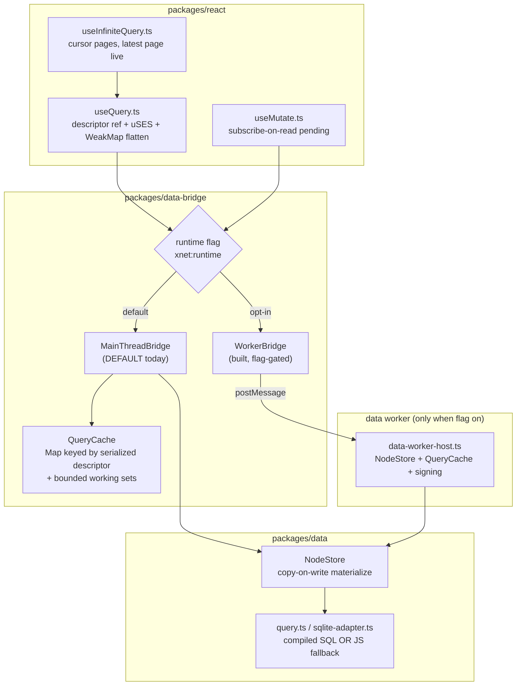
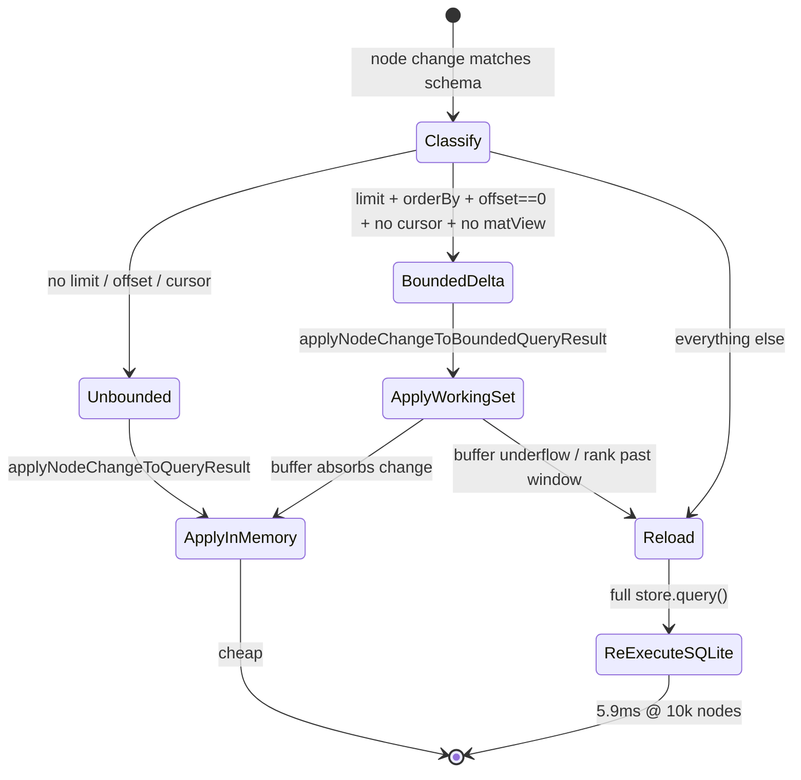
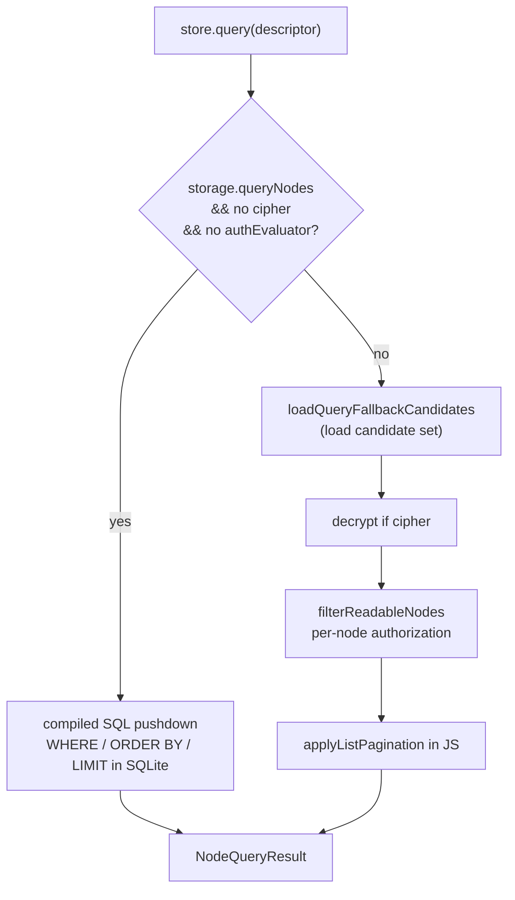
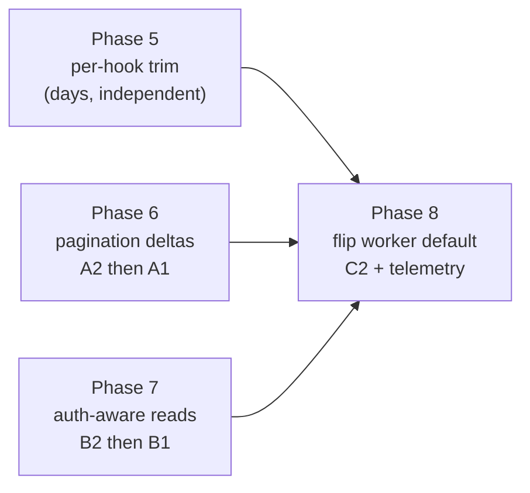

# useQuery / useMutate — The Next Performance Frontier

## Problem Statement

`useQuery` and `useMutate` are the two hot paths through xNet. Almost every
read in the app — lists, sidebars, grids, task rows, canvas widgets, chat,
feeds, dashboards — flows through
[`useQuery`](../../packages/react/src/hooks/useQuery.ts) →
`DataBridge` → `QueryCache` → `NodeStore` → SQLite, and almost every write
flows back through [`useMutate`](../../packages/react/src/hooks/useMutate.ts).
They are mounted by the hundreds on a busy screen (39 distinct call sites in
`apps/web` alone, each rendered many times). Any constant-factor cost in
these hooks is multiplied by every component and every keystroke.

A large body of work has already landed against this path —
[0163 Query And Mutation Hot Path Performance](0163_%5Bx%5D_QUERY_AND_MUTATION_HOT_PATH_PERFORMANCE.md)
(five phases, all checked off) and
[0164 Worker Resident Data Layer](0164_%5Bx%5D_WORKER_RESIDENT_DATA_LAYER.md)
(implemented, flag-gated). This exploration deliberately does **not**
re-litigate those wins. It traces what the path looks like *after* 0163/0164,
identifies where real cost still remains, and recommends the next frontier.

## Executive Summary

0163 solved the dominant problem of its era — *invalidation by
re-execution* — for the common case: a `limit + orderBy` list (no offset, no
cursor) now maintains its result **incrementally** from an overfetch working
set instead of re-running SQLite on every change
([`query-descriptor.ts:225`](../../packages/data-bridge/src/query-descriptor.ts)).
0164 built a worker-resident runtime so the store, signing, and invalidation
can run off the UI thread. Both are excellent. Neither is finished business.

Four concrete frontiers remain, in rough priority order:

1. **The worker runtime is built but not shipped.** The production default is
   still `MainThreadBridge` — the worker path only turns on with
   `localStorage['xnet:runtime'] === 'worker'`
   ([`App.tsx:242`](../../apps/web/src/App.tsx)). Every user today still runs
   query execution, change signing, and delta computation on the UI thread.
   This is the single highest-leverage unshipped win in the repo.

2. **The incremental delta path does not cover paginated reads.** The fast
   path requires `offset === 0` **and** `after === undefined` **and** an
   explicit `orderBy`
   ([`queryDescriptorSupportsBoundedDelta`, query-descriptor.ts:225-235](../../packages/data-bridge/src/query-descriptor.ts)).
   Cursor pages, offset pages, and `orderBy`-less limits all fall back to
   full re-execution. `useInfiniteQuery` — the recommended pattern for feeds
   and long lists — keeps its *live* page on `after` cursor semantics, so
   **every infinite-scroll feed re-runs storage on every matching edit.**

3. **Authorization silently destroys SQL pushdown.** When an `authEvaluator`
   is present, `store.query` abandons the compiled-SQL path entirely and
   does a full candidate load + per-node authorization filter in JS
   ([`store.ts:722`](../../packages/data/src/store/store.ts)). 0163 flagged
   this as a future constraint (Finding #7); it is now **live**, because
   Spaces nested authorization shipped (PR #84) with a membership resolver
   that walks the parent Space chain per node, and every write calls
   `authEvaluator.invalidate(nodeId)`.

4. **Per-hook React overhead is small but ubiquitous.** `useQuery` evaluates
   `Date.now()` and `Math.random()` in `useRef` initializers on *every*
   render, serializes the descriptor every render, runs several
   telemetry/instrumentation effects per data change, and `useMutate`
   returns a fresh object literal every render. None of these is the
   bottleneck individually; together, across hundreds of live hooks, they
   are a measurable constant tax.

There is a critical **interaction** the sequencing must respect: the worker
runtime (1) makes *delta-path* queries nearly free (tiny postMessage), but
makes *reload-path* queries (2, 3) **more** expensive, because each reload
serializes a full snapshot across the worker boundary. Flipping the worker
default before closing the reload tail would regress feed- and auth-heavy
screens. **Fix 2 and 3 alongside or before 1.**

The one-line recommendation: **finish the job 0163/0164 started — extend
incremental maintenance to paginated and authorized reads so that *no* hot
query reloads on edit, then flip the worker runtime to default behind
real-browser telemetry.**

## Current State In The Repository

### The path as it exists today (post-0163/0164)



### Read path anatomy (`useQuery`)

[`useQuery.ts:333-601`](../../packages/react/src/hooks/useQuery.ts) per
render does the following:

- Builds a canonical descriptor and **serializes it every render**
  (`createQueryDescriptor` + `serializeQueryDescriptor`,
  [lines 357-366](../../packages/react/src/hooks/useQuery.ts)). The
  `descriptorRef` correctly reuses the previous *descriptor object* when the
  serialized key is unchanged — so downstream memos stay stable — but the
  serialize still runs each render.
- Subscribes via `useSyncExternalStore` over a folded `{ data, metadata }`
  snapshot ([lines 400-419](../../packages/react/src/hooks/useQuery.ts)).
- Flattens through a module-global `WeakMap` keyed by `NodeState` identity
  ([`flatNodeCache`, lines 207-218](../../packages/react/src/hooks/useQuery.ts)),
  and reuses the *previous array* when every element kept identity
  ([lines 451-462](../../packages/react/src/hooks/useQuery.ts)). This is the
  0163 Phase 2 win and it is genuinely good.

The remaining per-render/per-update costs:

| Cost | Location | Frequency |
| ---- | -------- | --------- |
| `useRef(Date.now())` initializer eval | [useQuery.ts:342](../../packages/react/src/hooks/useQuery.ts) | every render |
| `useRef(\`...${Math.random()}\`)` eval | [useQuery.ts:493](../../packages/react/src/hooks/useQuery.ts) | every render |
| `serializeQueryDescriptor` | [useQuery.ts:360](../../packages/react/src/hooks/useQuery.ts) | every render |
| instrumentation register/update effects | [useQuery.ts:496-549](../../packages/react/src/hooks/useQuery.ts) | per data change (no-op in prod when null) |
| telemetry usage + timing effects | [useQuery.ts:552-578](../../packages/react/src/hooks/useQuery.ts) | mount + first-load + transitions |

`useRef(initialValue)` evaluates `initialValue` on every render even though
it is only consumed once — so `Date.now()` and `Math.random()` and the
template-string build run on every render of every `useQuery`. Lazy
initialization (`useRef<T|null>(null)` then `ref.current ??= ...`) removes
this entirely.

### Write path anatomy (`useMutate`)

[`useMutate.ts:257-525`](../../packages/react/src/hooks/useMutate.ts) is in
good shape post-0163: pending state is *subscribe-on-read* (components that
never read `isPending` pay zero re-renders per mutation, via the
`pendingReadLevelRef` getter trick at
[lines 516-524](../../packages/react/src/hooks/useMutate.ts)), and the
callbacks are `useCallback`-stable. The one residual: the hook **returns a
new object literal every render**
([lines 506-524](../../packages/react/src/hooks/useMutate.ts)), so any
consumer that memoizes on the whole `mutate` object churns.

### The delta-eligibility gap (the core remaining issue)

After 0163, whether an edit triggers a cheap in-memory delta or a full
storage reload is decided by descriptor shape:



The `Reload` bucket still catches a lot of real hot paths:

- **Cursor pagination** (`after !== undefined`) — `useInfiniteQuery`'s live
  page. Confirmed: `useInfiniteQuery` keeps only the *latest* cursor page as
  a live `useQuery`
  ([useInfiniteQuery.ts:120-122](../../packages/react/src/hooks/useInfiniteQuery.ts)),
  with `page.after = cursor`
  ([lines 119-133](../../packages/react/src/hooks/useInfiniteQuery.ts)). That
  descriptor fails `queryDescriptorSupportsBoundedDelta` → full re-execution
  on every matching change. Worse, **earlier pages are frozen snapshots** in
  React state (`pages`), so edits to rows on earlier pages don't reflect at
  all (a freshness gap, not just a perf one).
- **Offset pagination** (`offset > 0`).
- **`limit` without an explicit `orderBy`** (the working set has no derivable
  prefix order).
- **Materialized-view windows** (refreshed in storage by design).
- **Bulk events** above the 250-change threshold (reload affected entries).

### Authorization disables pushdown



[`store.ts:722`](../../packages/data/src/store/store.ts):

```ts
if (this.storage.queryNodes && !this.nodeContentCipher && !this.authEvaluator) {
  const result = await this.storage.queryNodes(descriptor)   // fast SQL path
  ...
}
// otherwise: load candidates, decrypt, filterReadableNodes, paginate in JS
```

Two compounding facts make this newly important:

1. **Spaces nested authorization is live** (PR #84 / memory `0181`). The
   schema-native authorization cascade resolves membership by walking the
   parent Space chain — i.e. `filterReadableNodes` does non-trivial work
   *per node*, and the candidate set is the *whole schema* (pagination is
   applied only *after* the auth filter, [store.ts:697](../../packages/data/src/store/store.ts)).
2. **Every write invalidates the auth cache** for the touched node
   (`this.authEvaluator?.invalidate(node.id)` appears on create/update/
   delete/restore paths, [store.ts:240,289,432,493,540,589](../../packages/data/src/store/store.ts)),
   so an edit-heavy authorized screen keeps re-paying authorization cost.

The net effect: on any Space-scoped, authorized query, the post-0163 fast
path is bypassed *entirely* — back to O(schema) scan + O(nodes × parent-chain
depth) authorization, on the main thread, per reloading query.

### What is already good (do not redo)

- Incremental bounded-delta maintenance for `limit + orderBy` lists (0163).
- WeakMap flatten cache + previous-array identity reuse (0163 Phase 2).
- `QueryCache.set` element-wise equality short-circuit before notify
  ([query-cache.ts:262-292](../../packages/data-bridge/src/query-cache.ts)).
- Copy-on-write `materializeNodeChange` so reference identity is a *sound*
  change signal ([store.ts:2248](../../packages/data/src/store/store.ts)),
  plus `reuseEquivalentNodeReferences` re-grafting identity across reloads
  ([query-descriptor.ts:186-210](../../packages/data-bridge/src/query-descriptor.ts)).
- One-message read-modify-write writes + optimistic apply (0163 Phase 3).
- `useMutate` subscribe-on-read pending state.
- NodeId-indexed dispatch for per-cell/row hooks (0163 independent item).
- A real benchmark harness: `pnpm bench:core-platform`
  ([scripts/collect-core-platform-baselines.ts](../../scripts/collect-core-platform-baselines.ts)).

## External Research

- **RxDB EventReduce** (https://github.com/pubkey/event-reduce) — the prior
  art 0163 already adopted for `limit+orderBy`. Its decision table *also*
  covers `skip` (offset) and `limit` together; xNet implemented the
  `limit`-only subset. Extending toward the full table is the natural next
  step for offset/cursor windows.
- **Rocicorp Zero / ZQL Incremental View Maintenance**
  (https://zero.rocicorp.dev/docs/reactivity) — maintains *keyset* windows
  incrementally, including paginated views, by tracking window boundaries
  rather than re-querying. Directly relevant to the cursor-page gap.
- **TanStack Query render optimizations**
  (https://tanstack.com/query/latest/docs/framework/react/guides/render-optimizations)
  — structural sharing (done here) plus *observer-level* tracking of which
  fields a component reads, so unread metadata changes never re-render. The
  `useMutate` pending getters already use this idea; it could extend to
  `useQuery` result fields (e.g. components that read only `data` shouldn't
  re-render when only `pageInfo.totalCount` changes).
- **Row-level security pushdown** (Postgres RLS, SQLite authorizer
  callbacks) — the standard answer to "auth destroys the query planner" is to
  compile the authorization predicate *into* the query as a coarse
  pre-filter (e.g. `space_id IN (<viewer's spaces>)`) and verify the
  fine-grained rule only on the surviving candidates. This is the model for
  Frontier 3.
- **Comlink / structured-clone transfer costs** — for the worker boundary,
  the established mitigations are (a) transferable `ArrayBuffer`s (already
  used via `binary-state.ts`), (b) sending *deltas* not snapshots (already
  used for the delta path), and (c) chunked/streamed large initial loads
  (not yet done — the reload tail).

## Key Findings

Ranked by expected impact on interactive latency, **net of** what 0163/0164
already shipped:

| # | Finding | Where | Cost today | Expected win |
| - | ------- | ----- | ---------- | ------------ |
| 1 | Worker runtime built but default-off; all query/sign/delta work runs on UI thread | [App.tsx:242](../../apps/web/src/App.tsx), [worker-bridge.ts](../../packages/data-bridge/src/worker-bridge.ts) | main-thread jank under edit load; 3× slower bulk import vs worker (0164) | frees the UI thread for *every* user |
| 2 | Cursor/offset/`orderBy`-less paginated queries fully re-execute on every matching change | [query-descriptor.ts:225-235](../../packages/data-bridge/src/query-descriptor.ts), [useInfiniteQuery.ts:120](../../packages/react/src/hooks/useInfiniteQuery.ts) | 5.9 ms × active feed/list per edit (10k nodes) | 10–50× on feeds, infinite lists, paginated grids |
| 3 | `authEvaluator` (now live via Spaces) disables SQL pushdown → full scan + per-node parent-chain auth, re-paid per edit | [store.ts:722,697](../../packages/data/src/store/store.ts) | O(schema) scan + O(nodes×depth) auth per reload | restores planner; bounded auth cost |
| 4 | `useInfiniteQuery` earlier pages are frozen snapshots — stale after edits | [useInfiniteQuery.ts:133-150](../../packages/react/src/hooks/useInfiniteQuery.ts) | correctness: edits to earlier pages don't reflect | correctness + consistency |
| 5 | Per-hook constant overhead: `Date.now()`/`Math.random()`/serialize per render; new `useMutate` object per render | [useQuery.ts:342,360,493](../../packages/react/src/hooks/useQuery.ts), [useMutate.ts:506](../../packages/react/src/hooks/useMutate.ts) | small × hundreds of live hooks | lower steady-state CPU/GC |
| 6 | Reload tail × worker boundary: each reload serializes a full snapshot across postMessage | [worker-bridge.ts](../../packages/data-bridge/src/worker-bridge.ts), [binary-state.ts](../../packages/data-bridge/src/utils/binary-state.ts) | full snapshot encode+transfer+decode per reload | gates the safety of flipping #1 |
| 7 | Field-granular result subscription absent: any metadata change re-renders all readers of a query | [useQuery.ts:404-419](../../packages/react/src/hooks/useQuery.ts) | extra renders on `pageInfo`/`source` changes | fewer renders on busy screens |

**Honest non-findings:** descriptor serialize (~1 µs) and `structuredClone`
per write (~3 µs) remain noise individually; the WeakMap flatten cache and
LRU dedup are sound; `reuseEquivalentNodeReferences` is the right design for
the reload identity problem (its only issue is the O(n) cost *on reloads*,
which Frontier 2/3 reduce by making reloads rarer).

## Options And Tradeoffs

### A — Close the pagination delta gap (Finding 2, 4)

| Option | Pros | Cons |
| ------ | ---- | ---- |
| **A1. Keyset window maintenance for cursor pages** (extend the working-set model to track lower+upper window bounds, apply deltas within the window) | kills re-execution for the dominant feed pattern; reuses 0163 machinery | the hardest correctness problem (RxDB ships a generated truth table for exactly this); boundary cases at page edges |
| **A2. Make `useInfiniteQuery` one growing `limit` query instead of cursor pages** | the accumulated window becomes a `limit+orderBy` query → already on the fast delta path; also fixes the stale-earlier-pages bug (#4) for free | `limit` grows unbounded as the user scrolls; overfetch buffer math needs a ceiling; large windows raise reload cost |
| **A3. Offset-window delta** (support `offset>0` by overfetching a prefix that covers the offset) | covers numbered pagination | offset windows shift under inserts before the window — frequent reloads anyway |
| **A4. Leave as-is, document the cost** | zero risk | feeds stay slow on edit |

**Lean: A2 for `useInfiniteQuery` (biggest real win, also a correctness
fix), then A1 for standalone cursor queries.** A2 reframes the most common
paginated surface onto the already-proven fast path.

### B — Authorization-aware pushdown (Finding 3)

| Option | Pros | Cons |
| ------ | ---- | ---- |
| **B1. Compile a coarse auth predicate into SQL** (`space_id IN (viewer spaces)`) and verify fine-grained rules only on survivors | restores the planner; candidate set shrinks from O(schema) to O(authorized) | needs the auth model to expose a SQL-expressible coarse predicate; fine rules still run in JS |
| **B2. Per-viewer readable-set cache** (cache membership resolution per `(viewer, space)`, invalidate on membership change, not on every node write) | decouples auth cost from node-edit frequency; the membership graph changes far less often than nodes | cache-coherency design; current code invalidates per node write |
| **B3. Materialize an `authReadable` index** per viewer/space and join against it | fully indexable reads | storage + maintenance overhead; staleness windows |
| **B4. Keep JS fallback, just memoize `filterReadableNodes` better** | smallest change | still O(schema) candidate scan |

**Lean: B2 first (stop invalidating membership on every node write — it's
the parent-chain resolution that's expensive, and it changes rarely), then
B1 to shrink the candidate set.**

### C — Ship the worker runtime (Finding 1, 6)

| Option | Pros | Cons |
| ------ | ---- | ---- |
| **C1. Flip default to worker now** | immediate UI-thread relief | regresses reload-heavy screens (feeds/auth) until A/B land; serialization tax |
| **C2. Flip behind telemetry + progressive rollout, after A/B** | safe; measured | slower to land |
| **C3. Adaptive: worker for delta-friendly schemas, main for reload-heavy** | best of both | complexity; per-schema policy |

**Lean: C2 — sequence the worker flip *after* A2/B2 so the reload tail isn't
amplified, gate on real-browser input-latency telemetry, ship with a kill
switch.**

### D — Trim per-hook overhead (Finding 5, 7)

Low-risk, mechanical: lazy `useRef` initializers, stabilize the `useMutate`
return object, and optionally add field-granular result subscription
(observer pattern) so `data`-only readers skip metadata-driven renders.

## Recommendation

Treat this as **0163 Phase 5–7**: finish incremental maintenance for the
query shapes 0163 left on the reload path, make authorization compatible with
the planner, then ship the worker by default. Sequencing matters because the
worker amplifies reload cost.



1. **Phase 5 — per-hook trim (days, independent).** Lazy-init the `Date.now()`
   / `Math.random()` refs; reuse the serialized descriptor key from the
   `descriptorRef` instead of re-serializing every render; stabilize the
   `useMutate` return object; consider field-granular result subscription.
   Re-run `bench:core-platform`; expect a small steady-state drop.
2. **Phase 6 — pagination deltas.** Reframe `useInfiniteQuery` onto a growing
   `limit + orderBy` window (A2) — this both removes its re-execution on edit
   *and* fixes the stale-earlier-pages bug (#4). Then extend the working-set
   model to standalone cursor queries (A1), property-tested against
   re-execution exactly as 0163 did for `bounded-query-delta.test.ts`.
   Target: `query-update-fanout` for an infinite feed < 0.5 ms.
3. **Phase 7 — auth-aware reads.** Move auth invalidation off the per-node
   write path onto membership-change events (B2); cache per-`(viewer, space)`
   readable resolution. Then compile a coarse `space_id ∈ viewer-spaces`
   predicate into SQL so authorized queries regain pushdown (B1), verifying
   fine-grained rules only on survivors. New bench:
   `query-authorized-fanout` with a Space-scoped descriptor.
4. **Phase 8 — flip the worker default.** Only after 6 & 7, so reloads are
   rare and cheap. Gate on real-browser input-latency telemetry (the metric
   0164 said was needed before flipping), ship progressive rollout +
   `xnet:runtime` kill switch, and add chunked/streamed transfer for any
   large initial loads (Finding 6).

## Example Code

### Phase 5 — lazy refs (remove per-render eval)

```ts
// Before — Date.now()/Math.random() run on EVERY render:
const queryStartRef = useRef<number>(Date.now())
const queryIdRef = useRef(`useQuery-${schemaId}-${nodeId || 'list'}-${Math.random()...}`)

// After — evaluated once, lazily:
const queryStartRef = useRef<number | null>(null)
queryStartRef.current ??= Date.now()

const queryIdRef = useRef<string | null>(null)
queryIdRef.current ??= `useQuery-${schemaId}-${nodeId || 'list'}-${cheapCounter()}`

// And reuse the already-computed key instead of re-serializing:
const queryKey = descriptorRef.current!.key   // already serialized above
```

### Phase 6 (A2) — `useInfiniteQuery` as a growing window

```ts
// Instead of advancing a cursor and freezing prior pages, grow `limit`.
// A `limit + orderBy` (offset 0, no cursor) descriptor IS on the fast
// delta path, so the whole loaded window stays live and incremental.
const [loadedCount, setLoadedCount] = useState(pageSize)

const windowFilter = useMemo<QueryFilter<P>>(
  () => ({ ...baseFilter, limit: loadedCount }),   // no `after`, no offset
  [baseFilter, loadedCount]
)
const current = useQuery(schema, windowFilter)     // single live subscription

const fetchNextPage = useCallback(() => {
  if (!current.hasMore) return
  setLoadedCount((n) => n + pageSize)              // window grows; deltas keep it fresh
}, [current.hasMore, pageSize])
// Earlier rows are no longer frozen — they're part of the live window.
// Cap loadedCount (e.g. virtualized ceiling) so the overfetch buffer stays bounded.
```

### Phase 7 (B1) — coarse auth predicate pushdown (sketch)

```ts
// store.query: when an authEvaluator can express a coarse SQL pre-filter,
// keep the compiled path and verify fine-grained rules on survivors only.
const coarse = this.authEvaluator?.toCoarsePredicate?.(viewer)   // e.g. { space_id: { in: [...] } }
if (this.storage.queryNodes && !this.nodeContentCipher && (!this.authEvaluator || coarse)) {
  const candidates = await this.storage.queryNodes(
    coarse ? mergeWhere(descriptor, coarse) : descriptor          // shrink candidate set in SQL
  )
  const readable = this.authEvaluator
    ? await this.filterReadableNodes(candidates.nodes)            // fine rules on the few survivors
    : candidates.nodes
  return paginate(readable, descriptor)
}
```

## Risks And Open Questions

- **Cursor/offset delta correctness** is the classic subtle-bug source —
  0163 kept the parity audit precisely as the validation harness for this.
  Reuse it: randomized op sequences vs. re-executed ground truth, per
  descriptor shape, before trusting any new delta path.
- **A2 unbounded window growth:** a growing `limit` must be capped (tie it to
  the virtualizer's realized range) or the overfetch buffer and snapshot size
  grow without bound — which would *worsen* Finding 6 under the worker.
- **Coarse auth predicate expressibility:** B1 assumes the Spaces auth model
  can emit a SQL-expressible membership pre-filter. If membership is fully
  dynamic/derived, fall back to B2 (readable-set cache) alone.
- **B2 cache coherency:** moving auth invalidation to membership-change
  events means a missed membership event leaks stale readability. Needs a
  conservative TTL or version stamp as a backstop.
- **Worker flip regressions:** if Phase 8 lands before 6/7, feed and
  authorized screens get *worse* (full snapshot serialize per edit). Enforce
  the sequence; gate the flip on the reload-rate telemetry.
- **Telemetry volume:** Phase 5 should not replace per-render micro-costs
  with per-render telemetry writes — batch/sample (the 0163 lesson).
- **Field-granular subscription (Finding 7)** changes `useQuery`'s render
  semantics subtly; verify no consumer relies on re-rendering when only
  `pageInfo`/`source` changes.

## Implementation Checklist

Phase 5 — per-hook trim (independent):

- [ ] Lazy-init `queryStartRef` and `queryIdRef` in `useQuery` (no `Date.now()`/`Math.random()` per render)
- [ ] Reuse `descriptorRef.current.key` instead of re-serializing the descriptor each render
- [ ] Stabilize the `useMutate` return object (memo/ref the result shape; keep the lazy pending getters)
- [ ] (Optional) Field-granular result subscription so `data`-only readers skip metadata-driven renders
- [ ] Re-run `pnpm bench:core-platform`; confirm no regression and a steady-state render-cost drop

Phase 6 — pagination deltas:

- [ ] Reframe `useInfiniteQuery` onto a growing `limit + orderBy` window (A2); remove frozen-page state
- [ ] Cap window growth to a virtualized ceiling; keep the overfetch buffer bounded
- [ ] Extend the working-set model to standalone cursor queries (A1) with underflow→reload fallback
- [ ] Property-test the new delta paths vs. re-execution (extend `bounded-query-delta.test.ts`)
- [ ] Add `query-update-fanout` benches for an infinite feed and a cursor query at 1k/10k

Phase 7 — auth-aware reads:

- [ ] Move `authEvaluator.invalidate` off the per-node write path onto membership-change events (B2)
- [ ] Add a per-`(viewer, space)` readable-resolution cache with a TTL/version backstop
- [ ] Add a coarse SQL auth pre-filter path in `store.query` so authorized queries keep pushdown (B1)
- [ ] Verify fine-grained rules only on SQL-survivor candidates
- [ ] Add a `query-authorized-fanout` bench (Space-scoped descriptor, edit-heavy)

Phase 8 — flip the worker default:

- [ ] Add chunked/streamed transfer for large initial snapshots (Finding 6)
- [ ] Capture real-browser input-latency telemetry under the worker runtime (the 0164 prerequisite)
- [ ] Flip default to worker behind a progressive rollout + `xnet:runtime` kill switch
- [ ] Re-run `bench:core-platform` (main vs worker) and the new fanout benches; confirm reload tail is bounded

## Validation Checklist

- [ ] `query-update-fanout` for an infinite feed (cursor/growing window, 10k nodes) drops from ~5.9 ms to < 0.5 ms per edit
- [ ] Editing a row on an earlier page of an infinite list now reflects immediately (correctness, Finding 4)
- [ ] `query-authorized-fanout`: a Space-scoped authorized list no longer re-scans the schema per edit; pushdown plan confirmed via `xnet:query:debug`
- [ ] React Profiler: a metadata-only change (e.g. `totalCount`) does not re-render components that read only `data` (if Finding 7 is taken)
- [ ] Per-hook micro-bench: a render of `useQuery` no longer calls `Date.now()`/`Math.random()`/`serializeQueryDescriptor` more than once per descriptor change
- [ ] Worker-runtime real-browser input-latency telemetry shows no regression on feed/authorized screens before the default flip
- [ ] Parity property tests green: randomized op sequences, every new delta path === re-executed ground truth
- [ ] No regression in `pnpm test` across store, bridge, and react hook suites

## References

- [packages/react/src/hooks/useQuery.ts](../../packages/react/src/hooks/useQuery.ts), [useMutate.ts](../../packages/react/src/hooks/useMutate.ts), [useInfiniteQuery.ts](../../packages/react/src/hooks/useInfiniteQuery.ts) — the hooks under study
- [packages/data-bridge/src/query-descriptor.ts](../../packages/data-bridge/src/query-descriptor.ts) — `queryDescriptorSupportsBoundedDelta`, working-set delta math, `reuseEquivalentNodeReferences`
- [packages/data-bridge/src/query-cache.ts](../../packages/data-bridge/src/query-cache.ts), [main-thread-bridge.ts](../../packages/data-bridge/src/main-thread-bridge.ts), [worker-bridge.ts](../../packages/data-bridge/src/worker-bridge.ts), [worker/data-worker-host.ts](../../packages/data-bridge/src/worker/data-worker-host.ts) — bridge layer
- [packages/data/src/store/store.ts](../../packages/data/src/store/store.ts) (`query` pushdown gate at 722; auth invalidation), [query.ts](../../packages/data/src/store/query.ts), [sqlite-adapter.ts](../../packages/data/src/store/sqlite-adapter.ts) — execution core
- [apps/web/src/App.tsx](../../apps/web/src/App.tsx) — `xnet:runtime` worker flag (default off)
- [scripts/collect-core-platform-baselines.ts](../../scripts/collect-core-platform-baselines.ts) — benchmark harness
- Prior explorations: [0163 hot path](0163_%5Bx%5D_QUERY_AND_MUTATION_HOT_PATH_PERFORMANCE.md), [0164 worker resident data layer](0164_%5Bx%5D_WORKER_RESIDENT_DATA_LAYER.md), [0139 improving the useQuery API](0139_%5Bx%5D_IMPROVING_THE_USEQUERY_API.md), [0123 SQLite read scaling & auto indexing](0123_%5Bx%5D_SQLITE_NODE_STORE_READ_SCALING_AND_AUTOMATIC_INDEXING.md), [0157 fast batch writes](0157_%5Bx%5D_IMPLEMENTING_FAST_BATCH_WRITES.md)
- Spaces nested authorization: PR #84 (schema-native authorization cascade, membership resolver walks parent chain)
- RxDB EventReduce — https://github.com/pubkey/event-reduce
- Rocicorp Zero (incremental view maintenance, keyset windows) — https://zero.rocicorp.dev/docs/reactivity
- TanStack Query render optimizations — https://tanstack.com/query/latest/docs/framework/react/guides/render-optimizations
