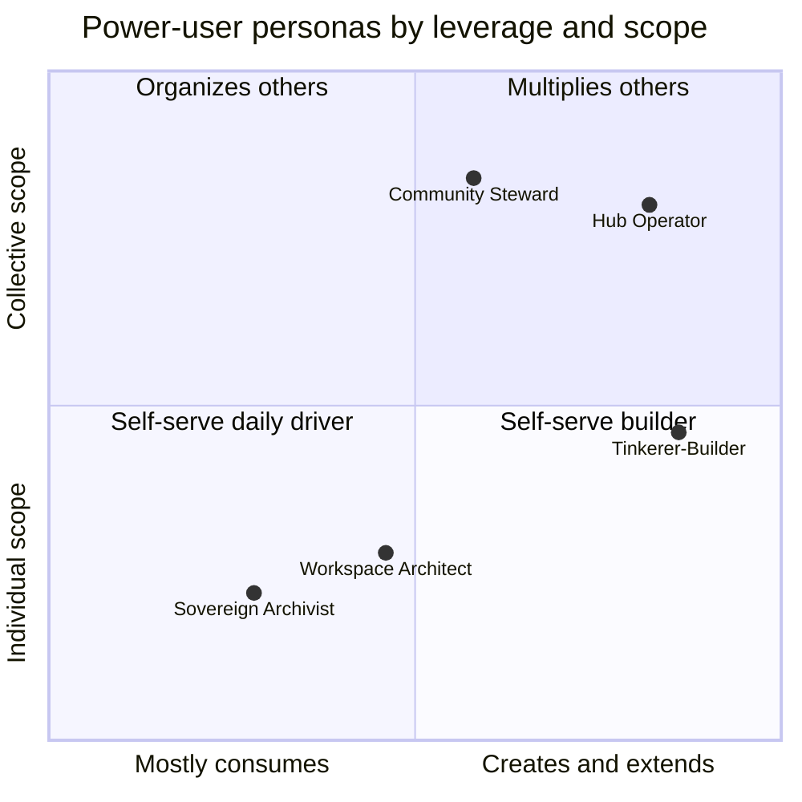
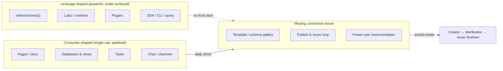
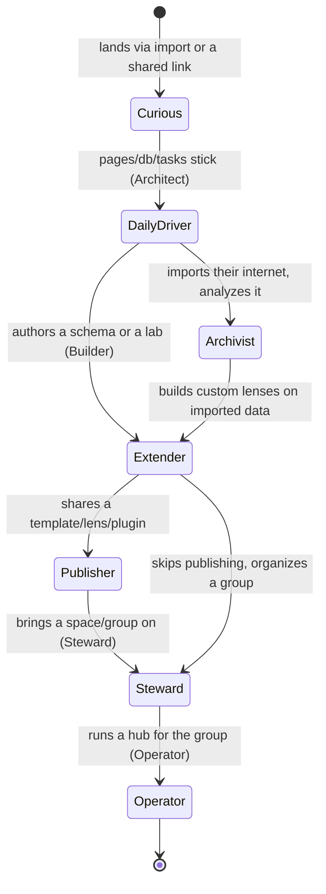
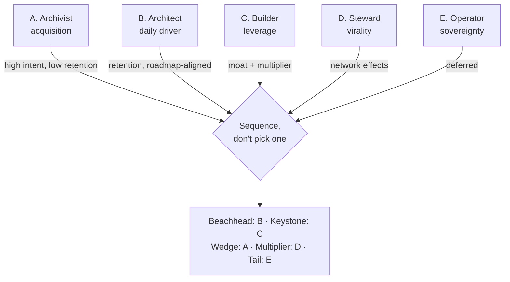
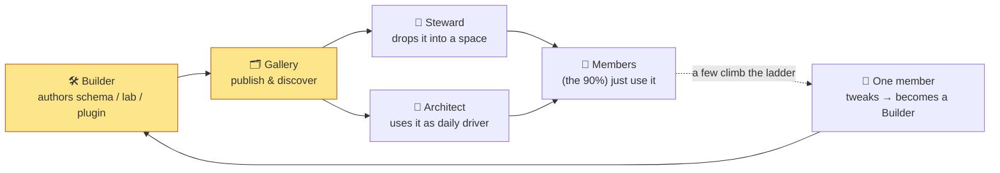

# 0183 - xNet Power Users: Personas And Workflows

**Status:** Draft / Not yet implemented
**Date:** 2026-06-14
**Author:** Claude
**Related:** [VISION](../VISION.md), [ROADMAP](../ROADMAP.md), [0153 - Social Data Workspace UI](./0153_%5Bx%5D_SOCIAL_DATA_WORKSPACE_UI.md), [0180 - Experiment Journal And Habit Tracker](./0180_%5B_%5D_EXPERIMENT_JOURNAL_AND_HABIT_TRACKER.md), [0180 - Code As A First-Class Citizen (Labs)](./0180_%5Bx%5D_CODE_AS_A_FIRST_CLASS_CITIZEN_LABS_AND_RUNTIMES.md), [0181 - Spaces As Nested Groupings](./0181_%5B_%5D_SPACES_AS_NESTED_GROUPINGS_AND_SCHEMA_AUTHORIZATION.md)

## Exploration Checklist

- [x] Compute the next exploration number.
- [x] Read the product vision, roadmap, and the social-data-workspace baseline.
- [x] Inventory the real user-facing capability surfaces (routes, packages, components) so personas
      map to code that exists today.
- [x] Research how power users behave in comparable tools (Notion, Obsidian, Airtable, local-first,
      quantified-self, no-code).
- [x] Define a concrete cast of power-user personas, their jobs-to-be-done, and the surfaces each uses.
- [x] Compare framings, recommend a lead persona strategy, and give concrete next steps with
      checklists, diagrams, and example code.

## Problem Statement

xNet is deliberately broad. The [vision](../VISION.md) spans "from personal notes to planetary-scale
infrastructure," and the app already ships an unusually wide capability surface: pages, databases,
canvases, dashboards, formulas, tasks, tags, a social-graph importer, chat/calls, spaces, labs
(code-as-first-class), experiments/habits, plugins, an SDK, a CLI, and a self-hostable hub. The
[roadmap](../ROADMAP.md) is explicit that the current cycle is **not** about building more first
versions — it is about "convert[ing] broad technical capability into a reliable, adopted daily-driver
product."

That conversion has a protagonist problem. A tool that does everything for everyone is, in practice,
a tool that does nothing for no one in particular. To prioritize navigation depth, onboarding, and
which surfaces get polished first, we need an answer to a prior question:

> **Who pulls xNet into their life hard enough to bend it to their will — and what exactly do they do
> with it?**

Power users are not just "heavy users." In every comparable product they are the people who:

1. **Define the data model** others later reuse (schemas, templates, views, lenses).
2. **Extend the tool** (plugins, labs, automations) and lift the ceiling for everyone.
3. **Bring their network** (a club, a team, a research group, a family) onto the platform.
4. **Generate the proof** that the product is real — the dogfooding signal the roadmap depends on.

Without an explicit power-user thesis, xNet's surface area spreads thin: every route is a plausible
front door, none is clearly *the* front door, and the "leverage" features (schema authoring, labs,
plugins, the SDK) sit underexposed even though they are the product's actual differentiator. This
document names the candidate power users, grounds each in code that already exists, and recommends
which ones to design for first.

## Executive Summary 🧭

xNet should commit to a small, named cast of power-user personas and treat them as design targets —
not as an afterthought to a generic "user."

The cast, mapped onto the vision's micro→meso→macro continuum:

| Persona | One-line | Scale | Keystone surfaces |
| --- | --- | --- | --- |
| **The Sovereign Archivist** | "Give me back my internet, and let me mine it." | Micro | Social import, experiments, dashboards, storage/identity |
| **The Workspace Architect** | "One tool that bends to my model, no lock-in." | Micro | Pages, databases + `defineSchema`, formula, canvas, dashboards |
| **The Tinkerer-Builder** | "I extend it, automate it, and build on top." | Cross-cutting | Labs, plugins, SDK/CLI, query, schemas |
| **The Community Steward** | "My group owns its own data and can't be deplatformed." | Meso | Spaces, comms, sharing/roles, social discovery |
| **The Hub Operator** | "I run the infrastructure — for myself and others." | Macro | Hub, cloud, identity, federation, telemetry |

The core recommendation:

1. **The Tinkerer-Builder is the keystone, not a niche.** `defineSchema`, labs, and plugins are the
   only features that turn one power user's effort into reusable leverage for everyone else. Every
   other persona consumes what builders produce. Invest here first because the ROI compounds.
2. **The Workspace Architect is the daily-driver beachhead.** This is the persona the roadmap's
   Phase 1 (navigation, search, daily-driver polish) already serves. Make xNet *win* as a
   local-first, schema-extensible Notion/Airtable for one person before anything else.
3. **The Community Steward is the virality lever.** A single steward brings a whole graph of people.
   Spaces + comms + share links are the multiplier — but only after the single-player experience is
   sticky.
4. **The Sovereign Archivist is the highest-intent acquisition wedge.** People actively *searching*
   for an exit from platforms are the cheapest to acquire and the most aligned with the vision. Lead
   marketing with import → own → analyze.
5. **The Hub Operator is the long-tail sovereignty story.** Critical for the vision, low priority for
   adoption count. Keep it possible and documented; don't over-invest yet.
6. **Build the flywheel, not just the features.** The thing that turns capability into adoption is the
   *creator → distribution → reuse* loop: schema/template/lens/plugin galleries, a one-click
   "publish & reuse," and power-user-specific instrumentation. This is the missing connective tissue.

In product language:

> xNet wins when a builder defines a schema and a lab once, a steward drops it into a space, and
> twenty ordinary members use it without ever seeing the code — then one of those members becomes the
> next builder.



## Current State In The Repository

xNet already ships the raw material for every persona. The relevant question is which surfaces are
*power-user shaped* (give leverage, reuse, extensibility) versus *consumer shaped* (single-use,
in-app only).

### Capability surfaces (grounded in code)

**Knowledge & data modeling (Architect)**

- Rich-text pages with collaborative editing, comments, backlinks — `packages/editor/src`,
  `apps/web/src/routes/doc.$docId.tsx`, `apps/web/src/components/PageView.tsx`.
- Typed databases with Table/Board/Gallery/Calendar/Timeline/List views, saved views, facets, CSV/JSON
  import — `packages/views/src`, `packages/data/src`, `apps/web/src/routes/db.$dbId.tsx`,
  `apps/web/src/routes/view.$viewId.tsx`.
- Spatial canvas (infinite, auto-layout, drag pages/dbs as cards) — `packages/canvas/src`,
  `apps/web/src/routes/canvas.$canvasId.tsx`.
- Dashboards + charts (grid layout, widgets bound to saved queries) — `packages/dashboard/src`,
  `packages/charts/src`, `apps/web/src/routes/dashboard.$dashboardId.tsx`.
- Notion-compatible formula engine — `packages/formula/src`.
- Tasks (List/Board, due dates, @assign), tags, person dashboards —
  `apps/web/src/routes/tasks.tsx`, `tag.$tagId.tsx`, `person.$did.tsx`.

**The leverage layer (Builder)** — the part that makes xNet more than an app:

- **User-extensible schemas.** `defineSchema()` plus property helpers (`text`, `number`, `select`,
  `multiSelect`, `relation`, `person`, `date`, `dateRange`, `file`, `json`, `url`, `formula`, …) in
  `packages/data/src`. Built-in schemas (Page, Database, Task, Channel, Canvas, Dashboard, Comment,
  ChatMessage) are *the same kind of object* a user can author.
- **Labs / code-as-first-class.** Write JS/TS/Python against your own data in tiered runtimes
  (SES, QuickJS/WASM, iframe, Pyodide), publish a lab as a workbench command — `packages/labs/src`,
  `apps/web/src/routes/lab.$labId.tsx`, `apps/web/src/components/LabView.tsx` (see
  [0180 Labs](./0180_%5Bx%5D_CODE_AS_A_FIRST_CLASS_CITIZEN_LABS_AND_RUNTIMES.md)).
- **Plugins.** Manifest-declared contributions: custom views, dashboard widgets, commands,
  slash-commands, editor extensions, with trust tiers (first-party / user-authored SES / marketplace
  iframe) — `packages/plugins/src`.
- **SDK + CLI + hooks.** `createClient()` (`packages/sdk/src`); `xnet migrate|schema|doctor|agent|mcp`
  (`packages/cli/src/cli.ts`); `useQuery`/`useInfiniteQuery`/`useFind`/`useMutate`/`useNode`/
  `useSavedView` (`packages/react/src`); local query engine with FTS and federation
  (`packages/query/src`).

**Self / measurement (Archivist)**

- Social-graph importer (Reddit, TikTok, Instagram, X, Grok, OpenAI archives), resumable jobs, lenses
  — `packages/social/src`, `apps/web/src/routes/social-import.tsx`.
- Discovery surface with friends-of-friends + opt-in "wave" connection intents —
  `apps/web/src/routes/discover.tsx`.
- Experiments / habit tracker (streaks, EWMA habit strength, verdict engine) — `packages/experiments/src`,
  `apps/web/src/routes/experiments.tsx` (see
  [0180 Experiments](./0180_%5B_%5D_EXPERIMENT_JOURNAL_AND_HABIT_TRACKER.md)).

**Group / collaboration (Steward)**

- Spaces: nested people-containers with hierarchical roles and schema-native authorization cascade —
  `apps/web/src/routes/space.$spaceId.tsx`, `apps/web/src/components/SpaceHomeView.tsx` (see
  [0181 Spaces](./0181_%5B_%5D_SPACES_AS_NESTED_GROUPINGS_AND_SCHEMA_AUTHORIZATION.md)).
- Comms: channels, DMs, presence/typing, WebRTC mesh calls, local-first notification inbox —
  `packages/comms/src`, `apps/web/src/routes/channel.$channelId.tsx`.
- Sharing: durable share links (fragment secret), device handoff, message-request inbox, UCAN role
  grants — `apps/web/src/routes/share.tsx`, `apps/web/src/routes/requests.tsx`.

**Infrastructure (Operator)**

- Self-hostable hub (sync relay, FTS5 search, pub/sub, files, federation primitives) —
  `packages/hub/src`.
- Managed cloud control plane (multi-tenant provisioning, AuthKit, billing, Litestream→R2) —
  `packages/cloud`, `apps/cloud`.
- Self-sovereign identity: DID:key, UCAN, passkey/WebAuthn, seed recovery — `packages/identity/src`.

### The gap: capability exists, leverage is underexposed



Today a power user *can* author a schema, write a lab, or build a plugin — but there is no in-product
path that turns that artifact into something a non-coding user discovers and reuses. The capability is
present; the **distribution loop is not**. That gap is the central finding of this exploration.

## External Research

How power users behave in adjacent products, and why it matters for xNet:

- **Notion / Obsidian / Airtable — "I work here, I think there."** Power users build personal CRMs,
  content calendars, reading lists, and second brains, and frequently run *two* tools because neither
  fully bends to them. Obsidian's moat is plain-Markdown ownership + a **2,500+ community plugin**
  ecosystem; even a "minimalist" power user runs ~40 plugins. The lesson: **extensibility is the
  retention mechanism for power users**, and the plugin author is a distinct, high-value persona who
  multiplies value for thousands of consumers.
  ([Obsidian vs Notion](https://slite.com/learn/obsidian-vs-notion),
  [best plugins for power users](https://www.obsibrain.com/blog/top-obsidian-plugins-in-2026-the-essential-list-for-power-users),
  [community plugins](https://obsidian.md/help/community-plugins))
- **The "second brain" can be a productivity trap.** Critics note that elaborate PKM systems become
  procrastination if the tool doesn't pay back the setup cost. Implication for xNet: power-user
  features must produce *output* (dashboards, automations, shared artifacts), not just storage.
  ([Second brain productivity trap](https://maketecheasier.com/second-brain-productivity-trap/))
- **Local-first as a movement, not a feature.** Local-first has a conference, a podcast (localfirst.fm),
  and a self-identifying community ("LoFi" meetups) — i.e., an audience that already *wants* the thing
  xNet is. These are early adopters with high ownership intent.
  ([Local-first software](https://en.wikipedia.org/wiki/Local-first_software))
- **No-code builders (Airtable, Baserow).** A large prosumer segment builds apps without writing code,
  and open-source (Baserow) attracts self-hosters. xNet's `defineSchema` + views + dashboards + plugins
  position it squarely against this segment, with ownership as the differentiator.
  ([Airtable](https://www.airtable.com/), [Baserow](https://baserow.io/))
- **Quantified-self + data-hoarders.** A durable community logs personal data and explicitly worries
  about **data ownership and privacy**; data hoarders accumulate personal exports. By early 2025, 144
  countries had data-privacy laws covering 79% of the population — ownership is mainstreaming. xNet's
  social importer + experiments speak directly to this group.
  ([Quantified Self forum: ownership & privacy](https://forum.quantifiedself.com/c/quantified-self/data-ownership-privacy/14),
  [Data ownership 2025](https://www.futureagenda.org/foresights/data-ownership/),
  [Data hoarding](https://www.expressvpn.com/blog/data-hoarding/))
- **The 1% / Pareto rule of online communities.** ~1% of users create, ~9% curate, ~90% consume. For a
  tool-with-network like xNet, the strategy is to maximize the *yield* of that 1% — make it trivial for
  a creator's artifact to reach the 90% — rather than to convert everyone into creators.

**Net takeaway:** every comparable success has a *creator class* whose output is *distributed* to a
*consumer class*. xNet has the creator tools (schemas, labs, plugins) and the consumer surfaces; the
strategic move is to wire the distribution between them and to design explicitly for the creator.

## Key Findings

1. **Builders are the keystone persona because they create reusable leverage.** `defineSchema`, labs,
   and plugins are the only surfaces where one person's work compounds into value for many. This is
   xNet's structural advantage over Notion (closed model) and matches Obsidian's plugin moat.
2. **The distribution loop is the missing piece, not the capability.** Schemas/labs/plugins exist but
   have no in-product gallery, no "publish," and no "install into my space." Without it, leverage stays
   trapped in one person's workspace.
3. **Spaces convert a single steward into a graph of users.** The cheapest growth is a steward who
   onboards their whole group; comms + sharing + nested auth already make this technically possible.
4. **Archivists are the highest-intent top-of-funnel.** People searching for a platform exit are
   pre-sold on the value prop; import → own → analyze is a complete, emotionally resonant first session.
5. **The daily-driver beachhead (Architect) is what the roadmap already funds.** Phase 1 navigation /
   search / polish *is* the Architect's onboarding. Naming the persona sharpens those bets.
6. **Operators are strategically essential but adoption-light.** Keep self-hosting first-class and
   documented; don't let it dominate the roadmap.
7. **Personas form an adoption ladder, not separate buckets.** A user can climb curious → daily-driver
   → extender → publisher → steward/operator. Designing the *rungs* matters more than the labels.



## Options And Tradeoffs

The decision is **which persona xNet designs for first** — the framing that orders the roadmap. Five
candidate "lead persona" framings, scored on the dimensions that matter for a product trying to
convert capability into adoption.

### Option A — Lead with the Sovereign Archivist (acquisition-first)

Make "import your internet, own it, mine it" the headline. Optimize social import + experiments +
dashboards.

- **Time-to-value:** Excellent — one session goes from ZIP to insight.
- **Retention:** Weak alone — import is episodic; nothing pulls them back daily.
- **Virality:** Low — a private archive isn't social.
- **Moat:** Medium — ownership is the story, but analysis features are commoditized.
- **Build cost:** Medium — importer + workspace exist (0153), need polish.

### Option B — Lead with the Workspace Architect (daily-driver-first)

Be the local-first, schema-extensible Notion/Airtable. Optimize pages + databases + formula + canvas +
dashboards + navigation.

- **Time-to-value:** Good — familiar mental model, instant local edits.
- **Retention:** Excellent — daily work tool; this is *the* habit surface.
- **Virality:** Low-medium — single-player by default.
- **Moat:** Medium — crowded category; ownership + extensibility differentiate.
- **Build cost:** Medium — aligns with roadmap Phase 1 already.

### Option C — Lead with the Tinkerer-Builder (leverage-first)

Make schema authoring + labs + plugins + SDK the marquee. Court the creator class.

- **Time-to-value:** Lower per-user (requires investment) but **highest leverage per user**.
- **Retention:** Excellent for the few — builders who invest rarely leave.
- **Virality:** **Highest indirect** — every plugin/template serves many consumers.
- **Moat:** **Strongest** — an extension ecosystem is the durable defensibility (the Obsidian lesson).
- **Build cost:** High — needs the distribution loop (gallery, publish, trust/sandboxing maturity).

### Option D — Lead with the Community Steward (virality-first)

Optimize spaces + comms + sharing so one organizer brings a group.

- **Time-to-value:** Medium — value appears once the group is on.
- **Retention:** **Excellent** — social/collaborative lock-in is the stickiest kind.
- **Virality:** **Highest direct** — each steward = N users.
- **Moat:** Medium-high — network effects, but requires single-player to already be good.
- **Build cost:** High — collaboration correctness, invites, moderation, abuse (roadmap Phase 2).

### Option E — Lead with the Hub Operator (sovereignty-first)

Optimize self-hosting, federation, identity, ops docs.

- **Time-to-value:** Low — infra setup is a project, not a session.
- **Retention:** High for the few who deploy.
- **Virality:** Low directly (but operators host others).
- **Moat:** High philosophically (true decentralization), low commercially near-term.
- **Build cost:** High and ops-heavy; explicitly *deferred* by the roadmap.

### Comparison



| Framing | Time-to-value | Retention | Virality | Moat | Cost | Roadmap fit |
| --- | --- | --- | --- | --- | --- | --- |
| A Archivist | ★★★★ | ★★ | ★ | ★★★ | ★★★ | Marketing wedge |
| B Architect | ★★★ | ★★★★ | ★★ | ★★★ | ★★★ | **Phase 1 (now)** |
| C Builder | ★★ | ★★★★ | ★★★★ (indirect) | ★★★★★ | ★ | **Differentiator** |
| D Steward | ★★★ | ★★★★★ | ★★★★★ | ★★★★ | ★★ | Phase 2 |
| E Operator | ★ | ★★★★ | ★ | ★★★★ | ★ | Deferred |

The framings are not mutually exclusive — they are **rungs on one ladder**. The mistake would be to
treat them as a single "average user." The right move is to *sequence* them.

## Recommendation

**Don't pick one persona — sequence them along the adoption ladder, and build the loop that connects
them.**

1. **Beachhead — Workspace Architect (now).** Keep executing roadmap Phase 1, but name the persona.
   Onboarding, navigation depth, templates, and "start from a useful workspace, not a blank page" are
   Architect bets. Success = xNet is someone's *daily* tool within week one.
2. **Keystone — Tinkerer-Builder (parallel, highest strategic priority).** Surface the leverage layer
   that already exists. Give `defineSchema`, labs, and plugins a *front door* and, critically, a
   *publish path*. This is the differentiator no incumbent can copy without re-architecting.
3. **Connective tissue — the creator→reuse flywheel (the actual new work).** Ship a
   **template / schema / lens / plugin gallery** with one-click "use this," scoped to personal and to
   spaces. This is what turns one Builder into value for a hundred Architects.
4. **Wedge — Sovereign Archivist (marketing + a polished import session).** Lead acquisition with
   "own your internet." The import → workspace → dashboard path (0153) is the demo.
5. **Multiplier — Community Steward (after single-player is sticky).** Make "spin up a space, invite my
   group, drop in a shared workspace template" a five-minute flow. Each steward is N users.
6. **Tail — Hub Operator (keep first-class, don't over-invest).** Maintain the self-host docs and the
   one-command hub; let demand pull further investment.



**Concrete next steps (highest leverage first):**

1. **Instrument for personas.** Add lightweight telemetry events that distinguish creator actions
   (`schema.defined`, `lab.published`, `plugin.installed`, `space.created`, `share.created`) from
   consumer actions, so we can *measure* the ladder instead of guessing. (`packages/telemetry/src`.)
2. **Schema/template gallery, personal scope first.** A "New from template" surface in the workbench
   Explorer (`apps/web/src/workbench/views/Explorer.tsx`) backed by a small set of first-party
   workspace templates authored with `defineSchema` (CRM, reading log, fitness journal, project
   tracker). Prove the "start non-blank" path.
3. **Publish-a-lab-as-command, end-to-end.** Close the loop so a Builder's lab becomes a discoverable
   command another user can run (leverage 0180 Labs' "publish a lab as a workbench command").
4. **One-click "use in space."** Let a Steward apply a template/plugin to a space so members inherit it
   (ties to 0181 Spaces nested auth).
5. **Power-user onboarding track.** A second onboarding branch ("I want to build / import / organize")
   distinct from the default Architect path.

## Example Code

Illustrative (not yet wired as a feature) — shows the keystone Builder loop on top of existing APIs.

**1. A Builder defines a custom domain schema** (`packages/data/src` `defineSchema`):

```typescript
import { defineSchema, text, number, select, date, relation, person } from '@xnetjs/data'

// A climber's send log — a domain xNet has no built-in schema for.
export const SendSchema = defineSchema({
  name: 'Send',
  namespace: 'xnet://did:key:z6MkClimber.../schemas/',
  properties: {
    route: text({ required: true }),
    grade: select({ options: ['V0', 'V1', 'V2', 'V3', 'V4', 'V5', 'V6+'] }),
    attempts: number({ default: 1 }),
    gym: relation({ schema: 'Gym' }),
    partner: person(),
    sentOn: date({ includeTime: false }),
  },
  hasContent: true, // freeform beta notes in the body
})
```

**2. A lab turns the data into a derived insight** (`packages/labs/src`, runs in a sandbox with a
scoped `xnet.query`):

```typescript
// Lab: "Hardest grade sent per month" — publishable as a workbench command.
const sends = await xnet.query({ schema: 'Send' })

const byMonth = new Map<string, number>()
const rank = (g: string) => ['V0','V1','V2','V3','V4','V5','V6+'].indexOf(g)

for (const s of sends) {
  const month = s.sentOn.slice(0, 7)            // YYYY-MM
  byMonth.set(month, Math.max(byMonth.get(month) ?? -1, rank(s.grade)))
}

return [...byMonth].sort().map(([month, r]) => ({ month, hardest: `V${r}` }))
```

**3. A plugin packages a reusable widget + command** (`packages/plugins/src` manifest contributions):

```typescript
export default definePlugin({
  id: 'climbing-pack',
  contributes: {
    schemas: [SendSchema],
    widgets: [{ id: 'grade-pyramid', title: 'Grade Pyramid', query: { schema: 'Send' } }],
    commands: [{ id: 'log-send', title: 'Log a send', run: '/labs/log-send' }],
  },
})
```

**4. A consumer never sees the code** — they install "Climbing Pack" from the gallery into their
personal workspace or a space, get the `Send` database, the pyramid dashboard widget, and a
"Log a send" command. The Builder's one-time effort becomes the Architect's daily driver and the
Steward's club template.

## Risks And Open Questions

- **Persona sprawl is the failure mode this doc is trying to avoid** — but naming five personas could
  itself re-spread focus. Mitigation: the recommendation is a *sequence* with one clear "now" (Architect)
  and one clear "differentiate" (Builder); the rest are explicitly later.
- **The leverage layer raises trust/abuse stakes.** A distribution loop for labs/plugins means
  untrusted code and shared artifacts. The trust tiers + SES/iframe sandboxing (0180) and abuse
  tooling (`packages/abuse`) must be solid before a public gallery. Start with first-party + personal
  scope only.
- **Builders are rare (the 1%).** If we over-index on Builder UX, we may polish features few touch.
  Mitigation: measure the *yield* (artifacts consumed per artifact created), not the creator count.
- **Will Stewards trust xNet with a group before single-player is proven?** Probably not — hence the
  sequencing. Open question: what's the minimum collaboration reliability bar (invites, presence,
  revoke) for a steward to commit a real group? (Roadmap Phase 2.)
- **Do Archivists retain?** Import is episodic. Open question: which recurring surface (experiments?
  feed? dashboards refreshed from new exports?) converts a one-time importer into a daily user.
- **Telemetry vs. local-first/privacy ethos.** Persona instrumentation must respect the ownership
  promise — opt-in, local-first aggregates, no content. (`packages/telemetry/src`.)
- **No validated personas yet.** This is a synthesis from capability + prior art, not from interviews.
  The biggest open question is empirical: *who actually shows up?*

## Implementation Checklist

- [ ] Document the persona cast as a short, canonical reference (this doc → a `docs/reference/personas.md`
      one-pager the team can cite).
- [ ] Add persona-distinguishing telemetry events (creator vs consumer actions) in
      `packages/telemetry/src`, opt-in and content-free.
- [ ] Define 4–6 first-party **workspace templates** with `defineSchema` (personal CRM, reading log,
      fitness/quantified journal, project tracker, content calendar, club roster).
- [ ] Build a **"New from template" / gallery** entry in `apps/web/src/workbench/views/Explorer.tsx`,
      personal scope first.
- [ ] Close the **"publish a lab as a command"** loop end-to-end (`packages/labs`, `apps/web` lab route).
- [ ] Add a **plugin install → personal workspace** path (first-party plugins only initially).
- [ ] Add **"apply template/plugin to a space"** for Stewards (ties to `space.$spaceId.tsx`, 0181 auth).
- [ ] Add a **power-user onboarding branch** ("build / import / organize") beside the default flow.
- [ ] Polish the **Archivist import session** (import → workspace → dashboard) per 0153 into a clean demo.
- [ ] Keep **self-host docs** current and a **one-command hub** documented for Operators.

## Validation Checklist

- [ ] Telemetry can produce a funnel: curious → daily-driver → extender → publisher → steward, with
      counts at each rung.
- [ ] A new user can go blank-state → useful workspace via a template in < 2 minutes (Architect TTV).
- [ ] A Builder can author a schema + lab and publish a command another account can run, with no manual
      file plumbing (keystone loop works).
- [ ] At least one first-party template is reused (instantiated) by an account that did not author it
      (distribution loop works).
- [ ] A Steward can create a space, invite a member, and apply a template so the member inherits the
      schema/views (multiplier works) — covered by an e2e test.
- [ ] An Archivist can import an archive and reach a populated dashboard in one session (0153 path).
- [ ] An Operator can stand up a hub and connect a client from documented steps alone.
- [ ] "Yield" metric defined and measurable: artifacts consumed per artifact published.
- [ ] Persona doc reviewed against real usage after first dogfood cohort; personas updated or pruned.

## References

- [xNet Vision](../VISION.md) — micro→meso→macro continuum, namespace, ownership principles.
- [xNet Roadmap](../ROADMAP.md) — current "daily-driver adoption" focus and phase sequencing.
- [0153 - Social Data Workspace UI](./0153_%5Bx%5D_SOCIAL_DATA_WORKSPACE_UI.md) — Archivist import→workspace path.
- [0180 - Code As A First-Class Citizen (Labs)](./0180_%5Bx%5D_CODE_AS_A_FIRST_CLASS_CITIZEN_LABS_AND_RUNTIMES.md) — Builder runtimes & publish-as-command.
- [0180 - Experiment Journal And Habit Tracker](./0180_%5B_%5D_EXPERIMENT_JOURNAL_AND_HABIT_TRACKER.md) — Archivist/measurement surface.
- [0181 - Spaces As Nested Groupings](./0181_%5B_%5D_SPACES_AS_NESTED_GROUPINGS_AND_SCHEMA_AUTHORIZATION.md) — Steward group/auth model.
- [Obsidian vs Notion (2026)](https://slite.com/learn/obsidian-vs-notion) — "work here / think there" power-user split.
- [Best Obsidian plugins for power users (2026)](https://www.obsibrain.com/blog/top-obsidian-plugins-in-2026-the-essential-list-for-power-users) — plugin-author persona & ecosystem moat.
- [Obsidian community plugins](https://obsidian.md/help/community-plugins) — 2,500+ plugin ecosystem scale.
- [The second-brain productivity trap](https://maketecheasier.com/second-brain-productivity-trap/) — output > storage caution.
- [Local-first software (Wikipedia)](https://en.wikipedia.org/wiki/Local-first_software) — the local-first community/audience.
- [Airtable](https://www.airtable.com/) / [Baserow](https://baserow.io/) — no-code builder & self-hoster segments.
- [Quantified Self: data ownership & privacy](https://forum.quantifiedself.com/c/quantified-self/data-ownership-privacy/14) — Archivist motivations.
- [Data Ownership 2025 (Future Agenda)](https://www.futureagenda.org/foresights/data-ownership/) — mainstreaming ownership intent.
- [Data hoarding guide (ExpressVPN)](https://www.expressvpn.com/blog/data-hoarding/) — data-hoarder behavior.
