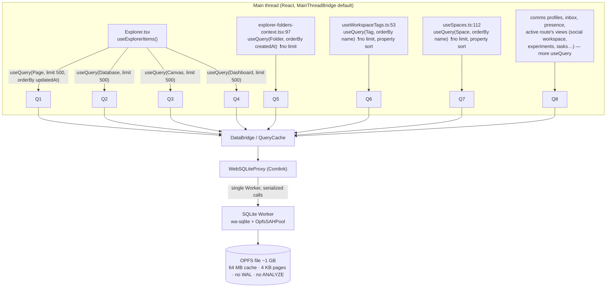
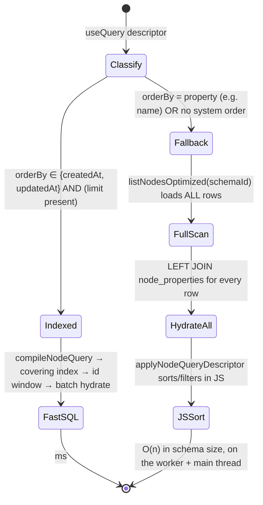
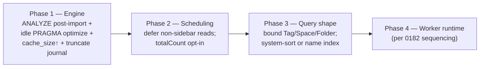

# Initial-Load Performance at Large-Database Scale (the 20–30s Blank Sidebar)

## Problem Statement

After importing social data, a local workspace has grown to **>1 GB** and
**~100k+ nodes**. On a cold page load, the sidebar (Explorer) — the list of
pages, databases, and canvases — shows **nothing for 20–30 seconds** before any
data appears. It was fast when the database was small. We want to understand
*why* the cost scales with database size and *how* to bring first-paint of the
sidebar back to sub-second.

The symptom is precise and important: **the sidebar's own data is small** (a
handful of pages/databases/canvases) yet it loads slowly *only after the
database as a whole got large*. That combination — small result set, large
total database, cost that grows with total size — is the fingerprint of a
**shared-resource contention + cold-I/O + missing-statistics** problem, not a
"too many rows in the list" problem.

## Executive Summary

The Explorer's own queries are **bounded and indexed** and should be fast at any
scale. The 20–30s comes from the *environment those queries run in* after a
100k-node import. Five compounding causes, in order of likely impact:

1. **Single serialized SQLite worker → head-of-line blocking.** Every database
   call in the web app funnels through **one** Comlink-wrapped Web Worker
   ([`web-proxy.ts:90-102`](../../packages/sqlite/src/adapters/web-proxy.ts)).
   At app startup, dozens of `useQuery` hooks fire at once. If *any* of them is
   a full-scan or `COUNT(*)` over a 100k-row **social** schema (content,
   interaction, actor, …), it monopolizes the worker and the sidebar's cheap
   queries wait in line behind it. The sidebar shows nothing until its turn
   comes *and* completes.

2. **Cold OPFS page cache against a 1 GB file.** The web backend is
   wa-sqlite/`OpfsSAHPool` with a **64 MB** page cache, **4 KB** pages, **no
   mmap**, and **rollback-journal** (not WAL) mode
   ([`web.ts` PRAGMAs](../../packages/sqlite/src/adapters/web.ts)). On a cold
   start the cache is empty, so the first queries pay random 4 KB reads from
   OPFS for index, table, *and* the tall `node_properties` table — scattered
   across a 1 GB file. I/O cost grows with file size.

3. **No `ANALYZE` after the bulk import → the planner is flying blind.** The
   import rebuilds indexes
   ([`social-import-job-client.ts:426`](../../apps/web/src/lib/social-import-job-client.ts))
   but **never runs `ANALYZE`/`PRAGMA optimize`** (the helper exists at
   [`diagnostics.ts:289`](../../packages/sqlite/src/diagnostics.ts) but is
   unused in the hot path). SQLite's own docs: *"If a query is running really
   slowly immediately after a large number of inserts, the optimizer may be out
   of sync… [ANALYZE] can turn a 10-second query into a 50-millisecond one."*
   This is the textbook cause of "it got slow after the import."

4. **Unbounded, property-sorted sidebar queries fall off the indexed path.**
   `useQuery(TagSchema, { orderBy: { name } })`
   ([`useWorkspaceTags.ts:53`](../../apps/web/src/hooks/useWorkspaceTags.ts)) and
   `useQuery(SpaceSchema, { orderBy: { name } })`
   ([`useSpaces.ts:112`](../../apps/web/src/hooks/useSpaces.ts)) have **no
   limit** and sort by a **property** (`name`), which cannot be pushed to SQL
   ([`canPushSystemListQuery`, store.ts:847](../../packages/data/src/store/store.ts)).
   They take the **full-schema-scan + hydrate-all + JS-sort** fallback
   ([`queryNodes` fallback, sqlite-adapter.ts:925](../../packages/data/src/store/sqlite-adapter.ts)).
   Small today, but this is a latent O(n) landmine and another worker hog.

5. **Hydration + post-processing run on the main thread.** The production
   default is still `MainThreadBridge`; the worker-resident data runtime is
   built but **not shipped** ([0182](0182_%5B_%5D_USEQUERY_USEMUTATE_PERFORMANCE_FRONTIER.md),
   [`data-runtime.ts`](../../apps/web/src/lib/data-runtime.ts)). So even after
   SQLite returns, node hydration and JS folding block paint.

The one-line recommendation: **stop the sidebar from competing for the worker
with the rest of the app, make its queries trivially cheap, and warm the engine
for a large file** — concretely: (a) run `ANALYZE`/`PRAGMA optimize` after the
import and at idle, (b) raise `cache_size` and switch the web journal to
`truncate`, (c) defer non-sidebar startup queries until after first paint and
prioritize the Explorer queries, (d) drop the unused `COUNT(*)`/`totalCount`
work for list reads that don't show counts, and (e) bound + system-sort the
Tag/Space/Folder queries.

## Current State In The Repository

### The startup query fan-out



Everything below the dashed bridge line is a **single lane**: one worker, one
file, calls processed in arrival order.

### The Explorer's own reads are cheap (and indexed)

[`Explorer.tsx`](../../apps/web/src/workbench/views/Explorer.tsx) →
`useExplorerItems()` issues four bounded reads:

```ts
const options = { orderBy: { updatedAt: 'desc' as const }, limit: QUERY_LIMIT } // 500
useQuery(PageSchema, options)
useQuery(DatabaseSchema, options)
useQuery(CanvasSchema, options)
useQuery(DashboardSchema, options)
```

These hit the **fast path** in
[`store.query`, store.ts:722](../../packages/data/src/store/store.ts) (no
cipher, no `authEvaluator` — the `NodeStore` is built with just
`{ storage, authorDID, signingKey }`,
[context.ts:632](../../packages/react/src/context.ts)), then compile to indexed
SQL in [`queryNodes`, sqlite-adapter.ts:915](../../packages/data/src/store/sqlite-adapter.ts):
the candidate query returns only `id`s using the **covering partial index**
`idx_nodes_live_schema_updated ON nodes(schema_id, updated_at DESC, id) WHERE
deleted_at IS NULL`
([schema.ts](../../packages/sqlite/src/schema.ts)), then
[`hydrateNodesByIds`, sqlite-adapter.ts:1943](../../packages/data/src/store/sqlite-adapter.ts)
batch-loads properties via a single chunked `IN (…)` JOIN. **Top-500-by-recency
per schema is ~milliseconds regardless of total node count** — *when it runs in
isolation on a warm cache with planner stats.*

### Where the cost actually scales

Three repo facts make the *environment* slow at 100k nodes:

**1. One worker, serialized.** `WebSQLiteProxy` creates a single
`new Worker(...)` and wraps it with Comlink
([web-proxy.ts:90-102](../../packages/sqlite/src/adapters/web-proxy.ts)). Comlink
turns each method call into a `postMessage` round-trip handled **one at a time**.
There is no read concurrency, no query prioritization, no cancellation. A slow
query in front of the queue delays everything behind it.

**2. A cold 1 GB file with conservative pragmas.** The web adapter sets:

```text
PRAGMA synchronous = NORMAL
PRAGMA busy_timeout = 5000
PRAGMA cache_size  = -64000   ; 64 MB
PRAGMA temp_store  = MEMORY
; journal_mode: default (rollback) — NOT wal/truncate
; page_size: default 4096 · mmap_size: unset (OPFS has no mmap)
```

By contrast, the **expo** and **electron** adapters do enable WAL
([expo.ts:79](../../packages/sqlite/src/adapters/expo.ts),
[electron.ts:59](../../packages/sqlite/src/adapters/electron.ts)); the web/OPFS
path does not. With 64 MB of cache for a 1 GB database, the working set cannot
stay resident, so cold reads fault 4 KB pages from OPFS — and `node_properties`
is a **tall key-value table** (one row per property per node), so hydrating even
a few hundred result nodes touches property rows scattered across the file.

**3. No statistics after import.** The import path rebuilds the scalar sidecar +
FTS for affected schemas via `rebuildIndexesForSchemas`
([social-import-job-client.ts:411-426](../../apps/web/src/lib/social-import-job-client.ts),
[sqlite-adapter.ts:1722](../../packages/data/src/store/sqlite-adapter.ts)) but
**never `ANALYZE`s**. Without `sqlite_stat1`, the planner uses heuristics; for
the simple covering-index query it usually still picks the right index, but for
any query with a property JOIN, FTS, or multiple candidate indexes it can choose
a full scan — and a full scan over a 100k-row schema on a cold 1 GB OPFS file is
exactly a multi-second stall.

### The unbounded / property-sorted queries



`canPushSystemListQuery`
([store.ts:847-855](../../packages/data/src/store/store.ts)) returns `false` for
property orders, and `compileNodeQuery` returns `null`, dropping to
`listNodesOptimized` ([sqlite-adapter.ts:925](../../packages/data/src/store/sqlite-adapter.ts)).
The sidebar's `Tag`/`Space` reads sort by `name` with **no limit**, so they take
this path. Today Tags/Spaces/Folders are small (the social importers create
`actor`/`content`/`interaction`/`conversation`/`message`/`collection` nodes —
hashtags become `collection` nodes, [tiktok.ts:1029](../../packages/social/src/importers/tiktok.ts) —
*not* Tags), so these aren't the current 100k culprit. But they are the pattern
that detonates the moment any property-sorted, unbounded query targets a large
schema, and each one still occupies the single worker during startup.

### Wasted `COUNT(*)` on list reads

On the compiled path, `queryNodes` computes `totalCount` via
`countCompiledNodeQuery` whenever the query is paginated
([sqlite-adapter.ts:966](../../packages/data/src/store/sqlite-adapter.ts));
`countNodes` is a `SELECT COUNT(*) … WHERE schema_id = ?`
([sqlite-adapter.ts:898](../../packages/data/src/store/sqlite-adapter.ts)). The
sidebar never displays these counts — yet every bounded list read pays an extra
index-wide `COUNT` scan that grows with the schema's size.

### Why first paint waits for all of it

The sidebar renders only when its `useQuery`s resolve. Each hook resolves
independently *in principle*, but they share the one worker with the entire
startup burst. The slowest query in that burst — a cold-cache full scan or
`COUNT(*)` over a 100k-row social schema, or an unbounded property-sorted read —
sets the floor for when the sidebar's cheap queries even get scheduled.

## External Research

- **wa-sqlite / OPFS tuning** (rhashimoto discussions; PowerSync "State of SQLite
  Persistence on the Web", 2026): the single biggest OPFS speedups come from
  **raising the page cache** (e.g. `-DSQLITE_DEFAULT_CACHE_SIZE=-16384` or
  larger via `PRAGMA cache_size`), and **`journal_mode = truncate` outperforms
  both `wal` and `delete` on OPFS**. OPFS access handles are exclusive and
  fastest from a **Web Worker** with `createSyncAccessHandle` — which this repo
  already does. ([discussion #63](https://github.com/rhashimoto/wa-sqlite/discussions/63),
  [discussion #23](https://github.com/rhashimoto/wa-sqlite/discussions/23),
  [PowerSync](https://powersync.com/blog/sqlite-persistence-on-the-web))
- **SQLite `ANALYZE` after bulk load** (sqlite.org docs; multiple write-ups):
  statistics are *not* auto-maintained; after a large insert the optimizer can
  be "out of sync," and a single `ANALYZE` "can turn a 10-second query into a
  50-millisecond one." `PRAGMA optimize` runs `ANALYZE` on an as-needed basis
  and is recommended **before closing each connection**.
  ([sqlite.org/lang_analyze](https://sqlite.org/lang_analyze.html),
  [optoverview](https://sqlite.org/optoverview.html))
- **Incremental adoption / single-flight** — TanStack Query and RxDB both stress
  that on a shared async data source, **query prioritization and request
  deduplication** matter as much as raw query speed; deferring non-critical
  reads keeps the critical path clear.
  ([RxDB storage comparison](https://rxdb.info/articles/localstorage-indexeddb-cookies-opfs-sqlite-wasm.html))
- **Prior xNet work**: [0123 SQLite read scaling & automatic indexing](0123_%5Bx%5D_SQLITE_NODE_STORE_READ_SCALING_AND_AUTOMATIC_INDEXING.md),
  [0163 hot path](0163_%5Bx%5D_QUERY_AND_MUTATION_HOT_PATH_PERFORMANCE.md),
  [0164 worker-resident data layer](0164_%5Bx%5D_WORKER_RESIDENT_DATA_LAYER.md),
  [0182 useQuery/useMutate perf frontier](0182_%5B_%5D_USEQUERY_USEMUTATE_PERFORMANCE_FRONTIER.md).
  This exploration is the **read-startup** complement to 0182's
  **edit-fanout** focus.

## Key Findings

| # | Finding | Where | Scales with | Fix lever |
| - | ------- | ----- | ----------- | --------- |
| 1 | All DB access serialized through one Comlink worker; no prioritization/cancellation | [web-proxy.ts:90-102](../../packages/sqlite/src/adapters/web-proxy.ts) | # concurrent startup queries | defer non-sidebar reads; prioritize Explorer |
| 2 | Cold 64 MB cache, 4 KB pages, no WAL, no mmap vs 1 GB file | [web.ts PRAGMAs](../../packages/sqlite/src/adapters/web.ts) | total file size | raise `cache_size`; `journal_mode=truncate`; warm cache |
| 3 | No `ANALYZE`/`PRAGMA optimize` after 100k-row import | [social-import-job-client.ts:426](../../apps/web/src/lib/social-import-job-client.ts), [diagnostics.ts:289](../../packages/sqlite/src/diagnostics.ts) | rows inserted | run `ANALYZE` post-import + at idle |
| 4 | Unbounded, property-sorted reads fall to full-scan + JS sort | [store.ts:847](../../packages/data/src/store/store.ts), [sqlite-adapter.ts:925](../../packages/data/src/store/sqlite-adapter.ts), [useWorkspaceTags.ts:53](../../apps/web/src/hooks/useWorkspaceTags.ts), [useSpaces.ts:112](../../apps/web/src/hooks/useSpaces.ts) | target schema size | add `limit`; system-sort or add property index |
| 5 | `COUNT(*)` per bounded list read that never shows a count | [sqlite-adapter.ts:898,966](../../packages/data/src/store/sqlite-adapter.ts) | schema size | make `totalCount` opt-in |
| 6 | Hydration + folding on the main thread (worker runtime unshipped) | [data-runtime.ts](../../apps/web/src/lib/data-runtime.ts), [0182](0182_%5B_%5D_USEQUERY_USEMUTATE_PERFORMANCE_FRONTIER.md) | result size × hook count | ship worker runtime (sequenced per 0182) |
| 7 | Tall `node_properties` KV table → scattered reads on hydrate | [schema.ts](../../packages/sqlite/src/schema.ts), [hydrateNodesByIds:1943](../../packages/data/src/store/sqlite-adapter.ts) | properties per node | cache warming; bigger pages reduce read count |

**Honest non-findings:** the Explorer's four document queries are *not*
intrinsically slow — they are bounded and indexed. The social import does *not*
write into the Page/Database/Canvas/Dashboard schemas, so it does not inflate the
sidebar's primary lists. The N+1 hydration risk is already handled (batched
`IN (…)` JOIN). The fix is to stop *starving* the cheap queries and to warm/tune
the engine, not to rewrite the Explorer's data model.

## Options And Tradeoffs

### A — Engine tuning for a large OPFS file (Findings 2, 3)

| Option | Pros | Cons |
| ------ | ---- | ---- |
| **A1. `ANALYZE` after import + `PRAGMA optimize` at idle/close** | textbook fix for "slow after bulk insert"; cheap; matches SQLite guidance | one-time scan cost after import; must persist stats |
| **A2. Raise `cache_size` (e.g. −262144 = 256 MB) + `journal_mode = truncate`** on the web adapter | biggest documented OPFS win; tiny diff | more worker memory; per-device tuning |
| **A3. Larger `page_size` (8–16 KB)** | fewer page reads per scan | requires `VACUUM` to change an existing DB (heavy, one-time) |

**Lean: A1 + A2 immediately** (small, safe, high-leverage), A3 as a follow-up
migration if profiling still shows page-read dominance.

### B — Keep the sidebar off the contended worker (Findings 1, 5)

| Option | Pros | Cons |
| ------ | ---- | ---- |
| **B1. Defer non-critical startup queries** (comms profiles, inbox, social workspace, experiments) until after first paint / on visibility | clears the lane for the sidebar; no schema change | must audit which hooks are truly critical |
| **B2. Query prioritization in the proxy** (a priority lane so Explorer reads jump the queue) | principled; benefits all critical reads | new mechanism in `web-proxy`; Comlink is FIFO today |
| **B3. Make `totalCount` opt-in** so list reads skip `COUNT(*)` | removes a whole class of wasted scans | API change; audit callers that read `totalCount`/`hasMore` |
| **B4. Single-flight + cache warm**: one cheap warm-up read on open to fault in hot index pages before the burst | smooths cold start | heuristic; marginal without A2 |

**Lean: B1 + B3 first** (cut the burst and the wasted work), B2 if contention
persists after B1.

### C — Fix the unbounded/property-sorted reads (Finding 4)

| Option | Pros | Cons |
| ------ | ---- | ---- |
| **C1. Add a `limit` to Tag/Space/Folder sidebar reads** | bounds worst case immediately | a workspace with >limit tags needs paging/search |
| **C2. System-sort (createdAt/updatedAt) + sort by name in JS** on the bounded set | regains the indexed path | name order only within the loaded window |
| **C3. Add a persisted property index for `name`** (scalar sidecar already exists) so property sort can push down | true indexed property sort | index maintenance cost; planner must use it |

**Lean: C1 now (safety bound), C3 later** if name-sorted lists need to be both
complete and large.

### D — Ship the worker-resident data layer (Finding 6)

Defer to [0182](0182_%5B_%5D_USEQUERY_USEMUTATE_PERFORMANCE_FRONTIER.md)'s
sequencing (Phases 6–8). It moves hydration/folding off the UI thread but does
**not** fix the I/O wait — A/B/C are the startup-latency levers; D is the
jank/responsiveness lever. Don't block this work on D.

## Recommendation

Treat this as a **cold-start read-latency** project, separate from 0182's
edit-fanout work. Land cheap engine + scheduling wins first; they need no schema
or API redesign and should move 20–30s to low single-digit seconds on their own.



1. **Phase 1 — Engine (highest leverage, smallest diff).** Run `ANALYZE` at the
   end of the social-import commit (right after `rebuildIndexesForSchemas`) and
   call `PRAGMA optimize` on a `requestIdleCallback` after first paint and before
   close. Raise the web adapter's `cache_size` to ~256 MB and set
   `journal_mode = truncate`. Verify the planner picks `idx_nodes_live_schema_updated`
   via `analyzeQuery`/`EXPLAIN QUERY PLAN`
   ([diagnostics.ts:90](../../packages/sqlite/src/diagnostics.ts)).
2. **Phase 2 — Scheduling.** Audit the startup `useQuery` set; gate non-sidebar
   reads (comms, inbox, social workspace counts, experiments) behind view
   visibility / `after first paint`. Make `totalCount` opt-in so list reads skip
   `COUNT(*)` unless a caller needs it.
3. **Phase 3 — Query shape.** Add `limit`s to the unbounded Tag/Space/Folder
   sidebar reads and either system-sort them or land a persisted `name` property
   index so they stay on the indexed path as those schemas grow.
4. **Phase 4 — Worker runtime.** Adopt 0182's worker-runtime flip (sequenced
   after its pagination/auth fixes) to move hydration off the main thread.

Expected outcome: Phase 1 alone (ANALYZE + cache + journal) typically reclaims
the bulk of a "slow after import" regression; Phases 2–3 remove the head-of-line
stalls so the sidebar's already-cheap queries paint promptly.

## Example Code

### Phase 1 — ANALYZE after import + idle optimize

```ts
// apps/web/src/lib/social-import-job-client.ts — after rebuildIndexesForSchemas(...)
if (input.rebuildIndexesForSchemas && affectedSchemaIds.size > 0) {
  await input.rebuildIndexesForSchemas([...affectedSchemaIds])
  // NEW: refresh planner statistics so post-import reads use the right indexes.
  await input.analyzeDatabase?.()   // wires to diagnostics.runAnalyze(db)
}

// On open / after first paint (apps/web bootstrap):
requestIdleCallback(() => { void sqlite.exec('PRAGMA optimize') })
```

```ts
// packages/sqlite/src/adapters/web.ts — open(): tune for a large OPFS file
this.execSync('PRAGMA cache_size = -262144')   // 256 MB (was -64000 / 64 MB)
this.execSync('PRAGMA journal_mode = truncate') // faster than delete/wal on OPFS
// (page_size change requires VACUUM on an existing DB — handle as a migration)
```

### Phase 2 — make `totalCount` opt-in (sketch)

```ts
// Only pay COUNT(*) when the caller asks for it.
async queryNodes(descriptor: NodeQueryDescriptor): Promise<NodeQueryResult> {
  // …compiled id-window + hydrate as today…
  const totalCount = descriptor.withTotalCount
    ? await this.countCompiledNodeQuery(descriptor, spatialPlan, ftsPlan)
    : undefined            // sidebar lists don't render a count → skip the scan
  // …
}
```

### Phase 3 — bound + system-sort the unbounded sidebar reads

```ts
// useWorkspaceTags.ts / useSpaces.ts — was: { orderBy: { name: 'asc' } } (full scan)
const { data } = useQuery(TagSchema, {
  orderBy: { updatedAt: 'desc' }, // indexed system order → fast path
  limit: 500                       // bound the worst case
})
const sorted = useMemo(() => [...data].sort(byName), [data]) // name order in JS
```

### Diagnose on the live (large) DB

```ts
import { analyzeQuery, gatherDiagnostics } from '@xnetjs/sqlite'
// Is the Explorer query actually using the partial index?
await analyzeQuery(db,
  `SELECT id FROM nodes WHERE schema_id = ? AND deleted_at IS NULL
   ORDER BY updated_at DESC LIMIT 500`, ['page'])
// page_size / cache / journal / wal state:
console.log(await gatherDiagnostics(db))
```

## Risks And Open Questions

- **Which query actually dominates the 20–30s?** This exploration ranks
  hypotheses from the code; the *proof* is a `plan.durationMs` + EXPLAIN trace on
  the user's real DB. Capture per-query timing on a cold load before committing
  to an ordering of fixes. (The plan object already carries `durationMs` and
  `strategy`, [sqlite-adapter.ts:976-989](../../packages/data/src/store/sqlite-adapter.ts).)
- **`ANALYZE` cost on 100k rows** is itself non-trivial; run it once post-import
  and incrementally via `PRAGMA optimize`, not on every open. Persist
  `sqlite_stat1` (it lives in the DB file, so it survives).
- **`journal_mode = truncate` vs WAL on OPFS-SAHPool** — validate it actually
  applies and persists under `OpfsSAHPoolDb`; some journal modes are constrained
  on OPFS. Fall back to `delete` if `truncate` isn't honored.
- **`cache_size = 256 MB`** raises worker memory; verify on low-end devices and
  consider sizing from `navigator.deviceMemory`.
- **`totalCount` opt-in** is an API change — audit `pageInfo.hasMore`/`totalCount`
  consumers (0182 already flagged these as unreliable invariants) before flipping
  the default.
- **Deferring startup queries** must not break views that legitimately need data
  on mount; gate by visibility, not by blanket delay.
- **Page-size migration (A3)** requires `VACUUM`, which rewrites the whole 1 GB
  file once — schedule as an explicit, resumable maintenance step.

## Implementation Checklist

Phase 1 — Engine:
- [ ] Run `ANALYZE` (via `diagnostics.runAnalyze`) at the end of the social-import commit, after `rebuildIndexesForSchemas`
- [ ] Call `PRAGMA optimize` on `requestIdleCallback` after first paint and before connection close
- [ ] Raise web adapter `cache_size` to ~256 MB ([web.ts](../../packages/sqlite/src/adapters/web.ts))
- [ ] Set `journal_mode = truncate` on the web adapter; confirm it's honored under OpfsSAHPool, else fall back to `delete`
- [ ] Add a one-time `VACUUM`+`page_size` migration option (gated, resumable) for existing large DBs
- [ ] Confirm via `EXPLAIN QUERY PLAN` that the Explorer reads use `idx_nodes_live_schema_updated`

Phase 2 — Scheduling:
- [ ] Inventory every `useQuery` that fires before/at first paint; tag each critical vs deferrable
- [ ] Defer comms/inbox/presence/social-workspace/experiments reads until their view is visible or after first paint
- [ ] Add `withTotalCount` (opt-in) to the query descriptor; default list reads to skip `COUNT(*)`
- [ ] (If still contended) add a priority lane to `WebSQLiteProxy` so Explorer reads jump the queue

Phase 3 — Query shape:
- [ ] Add `limit` to `useWorkspaceTags`, `useSpaces`, and the Folder sidebar query
- [ ] System-sort (createdAt/updatedAt) those reads and sort by `name` in JS, **or** add a persisted `name` scalar index and verify pushdown
- [ ] Add a guard/lint so new sidebar `useQuery`s can't be both unbounded *and* property-sorted

Phase 4 — Worker runtime:
- [ ] Adopt 0182's worker-runtime flip (after its Phase 6–7 prerequisites) to move hydration off the main thread

## Validation Checklist

- [ ] On the 1 GB / 100k-node DB, cold-load sidebar **first paint < 2s** (from 20–30s)
- [ ] `EXPLAIN QUERY PLAN` shows the partial index for all four document reads (no `SCAN nodes`)
- [ ] `plan.durationMs` for each Explorer query is single-digit ms on a warm cache, and the cold-load total is dominated by I/O warm-up, not by any single full scan
- [ ] No `COUNT(*)` appears in the SQL trace for the sidebar's list reads after `totalCount` is opt-in
- [ ] The startup query burst (count of DB calls before first paint) is measurably smaller after deferral
- [ ] Tag/Space/Folder reads show `strategy: 'storage-query'` (indexed), never `'list-fallback'`
- [ ] `sqlite_stat1` is populated after import; re-running the slow load post-`ANALYZE` is materially faster
- [ ] No regression in `pnpm bench:core-platform`; existing query/store/sqlite suites green

## References

- [apps/web/src/workbench/views/Explorer.tsx](../../apps/web/src/workbench/views/Explorer.tsx) — `useExplorerItems`, four bounded document reads
- [apps/web/src/workbench/views/explorer-folders-context.tsx:97](../../apps/web/src/workbench/views/explorer-folders-context.tsx), [apps/web/src/hooks/useWorkspaceTags.ts:53](../../apps/web/src/hooks/useWorkspaceTags.ts), [apps/web/src/hooks/useSpaces.ts:112](../../apps/web/src/hooks/useSpaces.ts) — unbounded / property-sorted sidebar reads
- [packages/data/src/store/store.ts:718-855](../../packages/data/src/store/store.ts) — `query` pushdown gate, `canPushSystemListQuery`
- [packages/data/src/store/sqlite-adapter.ts:898,915,925,966,1943](../../packages/data/src/store/sqlite-adapter.ts) — `countNodes`, `queryNodes`, fallback, `totalCount`, `hydrateNodesByIds`
- [packages/sqlite/src/adapters/web.ts](../../packages/sqlite/src/adapters/web.ts), [web-proxy.ts:90-102](../../packages/sqlite/src/adapters/web-proxy.ts) — OPFS-SAHPool open + PRAGMAs; single Comlink worker
- [packages/sqlite/src/adapters/expo.ts:79](../../packages/sqlite/src/adapters/expo.ts), [electron.ts:59](../../packages/sqlite/src/adapters/electron.ts) — WAL enabled on native, absent on web
- [packages/sqlite/src/schema.ts](../../packages/sqlite/src/schema.ts) — node indexes, `idx_nodes_live_schema_updated`, `nodes_fts`
- [packages/sqlite/src/diagnostics.ts:90,289](../../packages/sqlite/src/diagnostics.ts) — `analyzeQuery`, `runAnalyze`, `gatherDiagnostics` (exist; unused in hot path)
- [apps/web/src/lib/social-import-job-client.ts:411-426](../../apps/web/src/lib/social-import-job-client.ts) — import rebuilds indexes, no `ANALYZE`
- [packages/social/src/importers/tiktok.ts:1029](../../packages/social/src/importers/tiktok.ts) — hashtags → `collection` nodes (social schemas, not Pages)
- Prior explorations: [0182](0182_%5B_%5D_USEQUERY_USEMUTATE_PERFORMANCE_FRONTIER.md), [0164](0164_%5Bx%5D_WORKER_RESIDENT_DATA_LAYER.md), [0163](0163_%5Bx%5D_QUERY_AND_MUTATION_HOT_PATH_PERFORMANCE.md), [0123](0123_%5Bx%5D_SQLITE_NODE_STORE_READ_SCALING_AND_AUTOMATIC_INDEXING.md)
- [SQLite `ANALYZE`](https://sqlite.org/lang_analyze.html) · [Query Optimizer Overview](https://sqlite.org/optoverview.html)
- [wa-sqlite OPFS tuning — discussion #63](https://github.com/rhashimoto/wa-sqlite/discussions/63) · [#23 benchmarks](https://github.com/rhashimoto/wa-sqlite/discussions/23) · [PowerSync: State of SQLite Persistence on the Web](https://powersync.com/blog/sqlite-persistence-on-the-web) · [RxDB storage comparison](https://rxdb.info/articles/localstorage-indexeddb-cookies-opfs-sqlite-wasm.html)
