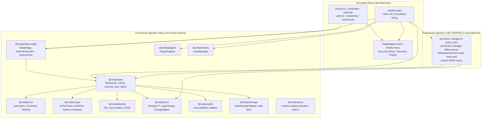
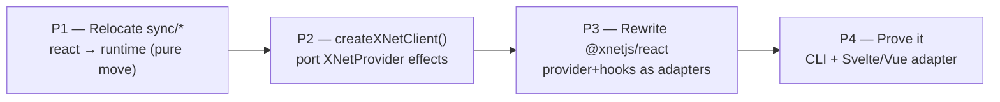

# xNet Data Model As A Framework-Agnostic SDK

## Problem Statement

Today the full power of xNet — authorization/permission checks, node-format
validation, signing, encryption, SQLite-backed storage, and the live
query/mutate/subscribe loop — is only *ergonomically* reachable through React.
You wire up an [`XNetProvider`](../../packages/react/src/context.ts) and then read
and write through [`useQuery`](../../packages/react/src/hooks/useQuery.ts),
[`useMutate`](../../packages/react/src/hooks/useMutate.ts),
[`useNode`](../../packages/react/src/hooks/useNode.ts),
[`useCan`](../../packages/react/src/hooks/useCan.ts), and friends.

The ask: take the *entire* API that the hooks expose and make it available as
plain JavaScript — a client object you can construct once and call from any
framework (Vue, Svelte, Solid, Angular, Lit), from a Node service, from a CLI,
or from a worker — without importing React at all. The hooks would become a thin
binding *over* that vanilla client, not the only door into the system.

## Executive Summary

**The data model is already framework-agnostic. The orchestration is not.**

Almost everything the prompt names — "validates authorization and permissions
and node formats… signs things and encrypts things… leverages SQLite and stores
things in a database" — already lives in framework-neutral packages with **zero
React imports**:

- [`@xnetjs/data`](../../packages/data/src/store/store.ts) — `NodeStore`: CRUD,
  schema validation, signing coordination, encryption (`nodeContentCipher`),
  authorization gating (`authEvaluator`), transactions, batch writes, query.
- [`@xnetjs/core`](../../packages/core/src/auth-types.ts) — the `PolicyEvaluator`
  / `AuthDecision` / `AuthCheckInput` authorization contract.
- [`@xnetjs/crypto`](../../packages/crypto/src/index.ts) — XChaCha20-Poly1305,
  Ed25519, hybrid ML-DSA signing, encrypted envelopes.
- [`@xnetjs/identity`](../../packages/identity/src/index.ts) — DIDs, key bundles,
  UCAN tokens.
- [`@xnetjs/sync`](../../packages/sync/src/change.ts) — `Change<T>`, hash chains,
  `signChange`, the `ChangeSigner` async-signer seam.
- [`@xnetjs/data-bridge`](../../packages/data-bridge/src/types.ts) — the
  `DataBridge` interface and its `MainThreadBridge`/`WorkerBridge`/IPC
  implementations. Its `query()` already returns a
  `QuerySubscription { getSnapshot, getMetadata, subscribe }` — **the exact
  shape `useSyncExternalStore` consumes** — and the package imports React
  nowhere.

The React hooks are thin sugar on top of that bridge. `useQuery` is essentially
`useSyncExternalStore(subscription.subscribe, subscription.getSnapshot)` plus a
flatten step; `useMutate` just calls `bridge.create/update/delete/restore`;
`useCan` just calls `store.auth.can(...)`.

So what's actually trapped in React? **The wiring** — roughly 600 lines of
`useEffect` inside `XNetProvider` that *construct and own* the runtime:
`NodeStore` → `DataBridge` (main-thread / worker / IPC selection + fallback) →
`SyncManager` (hub auth via UCAN, offline queue, blob sync, search-index relay)
→ `PluginRegistry` → app-wide `UndoManager` → security/crypto config. And one
surprising fact: the `SyncManager` and its whole supporting cast
([`packages/react/src/sync/*`](../../packages/react/src/sync/sync-manager.ts),
~5.7k lines) **import zero React** — they are framework-agnostic code that merely
*lives* in the React package's directory. Extracting them is a *move*, not a
rewrite.

**Recommendation:** lift the orchestration into a framework-agnostic
`createXNetClient()` runtime (grow the existing thin
[`@xnetjs/sdk`](../../packages/sdk/src/index.ts), or introduce
`@xnetjs/runtime`), relocate the React-resident-but-React-free `SyncManager`
into it, then rewrite `XNetProvider` and the hooks as thin adapters over that
client. This is the same architecture TanStack Query uses (`query-core` +
per-framework adapters) and that Zustand uses (`createStore` vanilla +
`useStore`). The payoff: one runtime, consumable from React, Vue, Svelte, a CLI,
a Node daemon, or a worker — with identical auth, signing, encryption, and
storage semantics everywhere.

## Current State In The Repository

### Layered dependency reality



The dashed truth: the only thing between "data model" and "usable runtime" is the
`XNetProvider` box and the misfiled `SyncManager`.

### The bridge is already the vanilla read/write surface

[`packages/data-bridge/src/types.ts:285-303`](../../packages/data-bridge/src/types.ts)
defines the subscription contract:

```ts
export interface QuerySubscription<P extends Record<string, PropertyBuilder>> {
  /** Get current snapshot (synchronous - reads from cache). null if loading. */
  getSnapshot(): NodeState[] | null
  /** Get current query metadata, if the bridge can provide it. */
  getMetadata?(): QueryMetadata | null
  /** Subscribe to updates (React will call this) */
  subscribe(callback: () => void): () => void
}
```

and the `DataBridge` surface
([`types.ts:385-528`](../../packages/data-bridge/src/types.ts)):

```ts
interface DataBridge {
  query<P>(schema, options?): QuerySubscription<P>
  create<P>(schema, data, id?): Promise<NodeState>
  update(nodeId, changes): Promise<NodeState>
  delete(nodeId): Promise<void>
  restore(nodeId): Promise<NodeState>
  bulkWrite(input): Promise<NodeBatchWriteResult>
  transaction?(operations): Promise<BridgeTransactionResult>
  acquireDoc?(nodeId): Promise<{ doc: Y.Doc; awareness: Awareness }>
  releaseDoc?(nodeId): void
  initialize?(config: DataBridgeConfig): Promise<void>
  destroy(): void
  readonly status: SyncStatus
  on(event: 'status', handler): () => void
}
```

`MainThreadBridge.query()`
([`main-thread-bridge.ts:180-201`](../../packages/data-bridge/src/main-thread-bridge.ts))
returns `{ getSnapshot, getMetadata, subscribe }` directly from its `QueryCache`.
`bridge.create/update/...` apply optimistic changes to the cache before the async
write resolves and revert on failure. **None of this needs React.** The package
contains no `from 'react'` import anywhere.

### The hooks are thin

`useQuery`
([`useQuery.ts:448-500`](../../packages/react/src/hooks/useQuery.ts)) is, at its
core:

```ts
const subscription = useMemo(() => bridge.query(schema, options), [bridge, queryKey])
const snapshot = useSyncExternalStore(
  subscription.subscribe,        // bridge's subscribe
  getCombinedSnapshot,           // wraps subscription.getSnapshot + getMetadata
  getCombinedSnapshot
)
// + flattenListSnapshot(...) for ergonomic property access
```

`useMutate`
([`useMutate.ts:303-482`](../../packages/react/src/hooks/useMutate.ts)) calls
`bridge.create/update/delete/restore` / `bridge.transaction` and tracks a
pending counter via a custom `useSyncExternalStore` over a ref. `useCan`,
`useCanEdit`, `useGrants`, `useIdentity`, `useSecurity` all read context and
delegate to `store.auth.*` / `@xnetjs/crypto` — no real logic of their own.

### NodeStore: where signing, encryption, auth, validation actually happen

[`store.ts:169-186`](../../packages/data/src/store/store.ts) constructor accepts a
fully framework-neutral options bag
([`store/types.ts:428-525`](../../packages/data/src/store/types.ts)):

```ts
new NodeStore({
  storage,                       // NodeStorageAdapter (Memory | SQLite | ...)
  authorDID,                     // DID
  signingKey,                    // Ed25519 private key
  changeSigner?,                 // async signer seam (WebCrypto / worker)
  schemaLookup?, propertyLookup?, lensRegistry?,
  authEvaluator?,                // PolicyEvaluator → mutation + read gating
  nodeContentCipher?,            // transparent encrypt/decrypt of snapshots
  contentKeyCache?,
  auth?,                         // high-level StoreAuthAPI (store.auth.can/grant)
  telemetry?
})
await store.initialize()
```

- **Signing**: `createChange` → `signNodeChange`
  ([`store.ts:2079-2108`](../../packages/data/src/store/store.ts)) uses the async
  `changeSigner` if present, else synchronous `signChange(unsigned, signingKey)`
  from [`@xnetjs/sync`](../../packages/sync/src/change.ts).
- **Encryption**: `persistEncryptedNodeSnapshot`
  ([`store.ts:2546-2574`](../../packages/data/src/store/store.ts)) calls
  `nodeContentCipher.encrypt(...)` and stores an `EncryptedNodeSnapshot`.
- **Authorization**: `assertAuthorized` (write gate) and `filterReadableNodes`
  (read gate) call `authEvaluator.can(...)`
  ([`store.ts:2416-2471`](../../packages/data/src/store/store.ts)). The evaluator
  contract is `PolicyEvaluator` in `@xnetjs/core`.
- **Validation**: schema definitions and `DefinedSchema.validate(...)` live in
  [`@xnetjs/data` schema](../../packages/data/src/schema/types.ts).

The public method surface
([`store.ts`](../../packages/data/src/store/store.ts)):
`initialize`, `create`, `get`, `getWithMigration`, `update`, `delete`, `restore`,
`list`, `query`, `transaction`, `batchWrite`, `optimize`, `subscribe`. Plus
`store.auth` ([`store-auth.ts:17-25`](../../packages/data/src/auth/store-auth.ts)):
`can`, `explain`, `grant`, `revoke`, `listGrants`.

### What XNetProvider actually orchestrates (the trapped part)

[`context.ts:608-1084`](../../packages/react/src/context.ts), in a chain of
effects:

1. Open the storage adapter, `new NodeStore(...)`, `await initialize()`,
   `scheduleIdle(() => store.optimize())`.
2. `resolveRuntimeBridge(...)` — pick `worker` / `main-thread` / `ipc`, fall back
   to main-thread on worker failure
   ([`context.ts:193-315`](../../packages/react/src/context.ts),
   [`runtime.ts`](../../packages/react/src/runtime.ts)).
3. `createSyncManager(...)` — signaling URLs, hub UCAN via `getHubAuthToken`
   ([`context.ts:592-606`](../../packages/react/src/context.ts)), optional
   auto-backup, blob sync, search-index relay
   ([`context.ts:929-1026`](../../packages/react/src/context.ts)).
4. `new PluginRegistry(store, platform)` + `loadFromStore()`.
5. `new UndoManager(store, authorDID, { localOnly })` for app-wide Cmd+Z.
6. Connect `SyncManager` ↔ `DataBridge` (`setSyncManager`), track hub status,
   expose `window.__xnetNodeStore` for Electron.

Every one of those steps is plain async logic wrapped in React lifecycle. The
app just hands it config ([`App.tsx:740-763`](../../apps/web/src/App.tsx)):
`{ nodeStorage, authorDID, signingKey, blobStore, hubUrl, runtime, platform }`.

### The existing SDK and CLI (and where they stop)

- [`@xnetjs/sdk`](../../packages/sdk/src/index.ts) **already exists** but is thin:
  it re-exports types/utilities and has a `createClient` that only creates or
  restores an **identity** ([`sdk/src/client.ts:69-101`](../../packages/sdk/src/client.ts)).
  Note the naming collision risk: it already exports `XNetClient` and
  `createClient` meaning "identity holder," not "runtime."
- [`@xnetjs/cli`](../../packages/cli/src/commands/doctor.ts) works **only on the
  change/sync model** (validate, repair, export/import `Change` objects) and
  schema/lens generation. It never constructs a `NodeStore`, so it cannot read or
  write live nodes today.
- The query package ships a standalone
  [`createLocalQueryEngine`](../../packages/query/src/local/engine.ts) — a
  non-bridge read path that already runs outside React.

### Vanilla construction patterns that already work

The "bare" pattern is proven in several non-React call sites:

| Site | Storage | Notes |
| ---- | ------- | ----- |
| [data-worker-host.ts:185-195](../../packages/data-bridge/src/worker/data-worker-host.ts) | configurable (Memory/SQLite via port) | long-lived store + `changeSigner` (WebCrypto) + `subscribe` |
| [apps/electron data-service.ts](../../apps/electron/src/data-process/data-service.ts) | `SQLiteNodeStorageAdapter` | ephemeral store per import batch in the main process |
| [scripts/collect-core-platform-baselines.ts:99-108](../../scripts/collect-core-platform-baselines.ts) | `MemoryNodeStorageAdapter` | full CRUD + query benches in plain Node |
| store/bridge tests | `MemoryNodeStorageAdapter` | dozens of `new NodeStore({...})` + `initialize()` |

```ts
const store = new NodeStore({
  storage: new MemoryNodeStorageAdapter(),
  authorDID: 'did:key:z6Mk…',
  signingKey: keyPair.privateKey
})
await store.initialize()
// store.create / query / update … all work, no React
```

So the *primitive* already runs anywhere. What's missing is a single,
documented, batteries-included **runtime** that bundles store + bridge + sync +
plugins + undo + auth/crypto config and exposes the same surface the hooks do.

## External Research

- **TanStack Query** is the canonical split: a framework-agnostic
  [`@tanstack/query-core`](https://www.npmjs.com/package/@tanstack/query-core)
  (Observer-pattern `QueryClient`/`QueryCache`, zero framework code) with thin
  per-framework adapters (`react-query`, `vue-query`, `svelte-query`,
  `solid-query`, `angular-query`). Teams keep the same keys, invalidation, and
  mutation semantics regardless of UI framework
  ([architecture overview](https://deepwiki.com/TanStack/query)). This is
  precisely the shape xNet should adopt; xNet's `DataBridge` is the analogue of
  `QueryClient`, and the work is to stop *constructing* it inside React.
- **Zustand** ships `createStore` from `zustand/vanilla` (returns
  `{ getState, setState, subscribe }`) and a React `useStore` built on
  `useSyncExternalStore`
  ([createStore docs](https://deepwiki.com/pmndrs/zustand/4.3-createstore)).
  xNet's `QuerySubscription` is already `{ getSnapshot, subscribe }` — the same
  contract — so a vanilla `subscribe`-style API needs no new machinery.
- **`useSyncExternalStore`** is the React-blessed universal external-store
  contract; Vue (`shallowRef` + `watchSyncEffect`), Svelte (readable stores),
  Solid (`createStore`/signals), and Angular (signals/`toSignal`) all bind to a
  `subscribe(cb) => unsub` + `getSnapshot()` pair. Keeping that exact shape makes
  every adapter ~20 lines.
- **Local-first ecosystem** uniformly separates client core from bindings:
  Replicache/[Zero](https://replicache.dev/) expose a mutation queue + reactive
  query client with framework bindings layered on;
  [Triplit](https://github.com/alexanderop/awesome-local-first) ships a
  framework-agnostic client with React/Svelte/Vue hooks; **TinyBase** is an
  explicitly reactive *store* with separate UI bindings;
  **RxDB**/**WatermelonDB** keep the database core independent of the view layer.
  The market consensus is that the database/sync core must be headless and the
  framework layer must be replaceable.
- **Render/identity optimizations** xNet already implements (WeakMap flatten
  cache, previous-array identity reuse, subscribe-on-read pending) mirror
  [TanStack Query's structural-sharing and observer-tracking](https://tanstack.com/query/latest/docs/framework/react/guides/render-optimizations);
  these are *adapter* concerns and stay in the React package.

## Key Findings

| # | Finding | Evidence | Implication |
| - | ------- | -------- | ----------- |
| 1 | The data model (CRUD, schema validation, signing, encryption, auth) is fully framework-agnostic | [store.ts](../../packages/data/src/store/store.ts), [core auth-types](../../packages/core/src/auth-types.ts), [crypto](../../packages/crypto/src/index.ts) | nothing to rewrite; just expose it |
| 2 | The `DataBridge` already exposes a `useSyncExternalStore`-shaped subscription with no React imports | [types.ts:285-528](../../packages/data-bridge/src/types.ts) | the reactive read/write engine is done |
| 3 | The hooks are thin adapters over the bridge + context | [useQuery.ts:448-500](../../packages/react/src/hooks/useQuery.ts), [useMutate.ts:303-482](../../packages/react/src/hooks/useMutate.ts) | hooks shrink to bindings once the runtime is external |
| 4 | The `SyncManager` (1160 LOC) and all of `react/src/sync/*` import **zero React** | [sync-manager.ts](../../packages/react/src/sync/sync-manager.ts) (grep clean) | extraction is a move, not a rewrite |
| 5 | The real React-only code is ~600 LOC of `useEffect` orchestration in `XNetProvider` | [context.ts:608-1084](../../packages/react/src/context.ts) | this is the work: port effects → a plain async factory |
| 6 | A thin `@xnetjs/sdk` exists but only does identity; `XNetClient`/`createClient` names are taken (identity-only) | [sdk/src/client.ts](../../packages/sdk/src/client.ts) | reuse or rename deliberately to avoid confusion |
| 7 | The CLI cannot read/write live nodes — it only manipulates `Change` objects | [cli doctor/migrate](../../packages/cli/src/commands/doctor.ts) | a real runtime unlocks a full data CLI |
| 8 | Dependency graph forbids putting `SyncManager` in `@xnetjs/sync` (sync must not depend on data) | data → sync edge in [data package.json](../../packages/data/package.json) | the runtime package must sit *above* data + sync (sdk-level) |
| 9 | Bridge supports main-thread / worker / IPC selection + fallback | [context.ts:193-315](../../packages/react/src/context.ts), [runtime.ts](../../packages/react/src/runtime.ts) | the vanilla runtime can offer the same lever |

## Options And Tradeoffs

### A — Where does the runtime live? (packaging)

| Option | Pros | Cons |
| ------ | ---- | ---- |
| **A1. Grow `@xnetjs/sdk` into the runtime** | name already implies "the SDK"; already aggregates core/crypto/data/identity/query/storage; one obvious entry point | must add deps (`data-bridge`, `plugins`, `history`, `sync`); existing identity-only `createClient`/`XNetClient` names collide and must be reconciled |
| **A2. New `@xnetjs/runtime` (or `@xnetjs/client`), re-exported by `@xnetjs/sdk`** | clean separation: `runtime` = headless engine, `sdk` = umbrella bundle; no name collision | one more package; slight redirection |
| **A3. Don't add a package — document "use `@xnetjs/data` + `@xnetjs/data-bridge` directly"** | zero new code | every consumer re-implements ~600 LOC of sync/plugins/undo/runtime wiring; no single supported surface; the "SDK" stays a DIY kit |

**Lean: A2** — introduce `@xnetjs/runtime` for the headless engine and let
`@xnetjs/sdk` be the friendly umbrella (re-export runtime + utilities). It avoids
the identity-only `createClient` collision and keeps the dependency-graph
constraint (Finding #8) explicit: the runtime package sits above `data` + `sync`,
which `@xnetjs/sync` cannot. A1 is acceptable if we'd rather not add a package,
but then `createClient` must be renamed (`createIdentity`) to free the name.

### B — Extraction strategy

| Option | Pros | Cons |
| ------ | ---- | ---- |
| **B1. Lift-and-shift: port `XNetProvider` effects verbatim into `createXNetClient()`** | preserves every hard-won edge case (StrictMode double-mount guard, cleanup, worker fallback) | the effects are written in React idiom (cancellation flags, `setState`); needs translation to a plain lifecycle object |
| **B2. Rewrite a clean runtime, leave `XNetProvider` as-is, dual-maintain** | no risk to the running app | two orchestrators drift; defeats the "one source of truth" goal |
| **B3. Incremental: first move `SyncManager` down, then the store/bridge wiring, then plugins/undo** | each step is independently shippable and testable; React keeps working throughout | several PRs; interim state where the provider calls into a partial runtime |

**Lean: B3, landing as B1.** Move the already-React-free `sync/*` into the
runtime package first (pure relocation, Finding #4), then port the store/bridge
construction, then plugins/undo. At the end, `XNetProvider` *calls*
`createXNetClient()` and only translates the result into context — the effects
become one create + one destroy.

### C — Vanilla API shape

| Option | Pros | Cons |
| ------ | ---- | ---- |
| **C1. Mirror the bridge: `client.query(schema, opts)` → `{ getSnapshot, subscribe }`** | adapters are trivial (`useSyncExternalStore` consumes it as-is); already battle-tested shape | callers wanting a one-shot read must `getSnapshot()` after first notify |
| **C2. Add ergonomic sugar: `client.fetch()` (Promise of one snapshot) and `client.live()` (subscription)** | nicer for CLIs/services that want "give me the rows once" | two ways to read; doc surface grows |
| **C3. Full hook-parity object with flatten built in (`FlatNode`)** | identical mental model to hooks | pulls the React-flavored `FlatNode` ergonomics into the core (it's framework-agnostic logic in [flattenNode.ts](../../packages/react/src/utils/flattenNode.ts) — could move) |

**Lean: C1 as the base + C2 sugar.** Keep `query()` returning the subscription
(so every framework adapter is ~20 lines), and add `await client.fetch(schema,
opts)` and `await client.mutate.create(...)` for imperative callers. Move
`flattenNode` into the runtime so both hooks and vanilla callers share one
flatten implementation (Option C3's good part without forcing it).

### D — Reactivity contract for adapters

Keep the `subscribe(cb) => unsub` + `getSnapshot()` pair as the *only* reactive
primitive. Then:

- **React**: `useSyncExternalStore(sub.subscribe, sub.getSnapshot)` — the current
  hooks, minus construction.
- **Vue**: `shallowRef` seeded from `getSnapshot()`, updated in `subscribe`.
- **Svelte**: a `readable(getSnapshot(), set => subscribe(() => set(getSnapshot())))`.
- **Solid/Angular**: signal from the same pair.

No per-framework logic leaks into the core.

## Recommendation

Build a headless **`@xnetjs/runtime`** exposing `createXNetClient(config)`, port
the orchestration into it, relocate the React-free `SyncManager`, and rebuild the
React layer as a thin adapter. Ship a real data CLI and one non-React adapter
(Svelte or Vue) as proof. Sequence:



1. **P1 — Relocate sync.** Move
   [`packages/react/src/sync/*`](../../packages/react/src/sync/sync-manager.ts)
   into `@xnetjs/runtime` (or `@xnetjs/sync-manager`). It imports only
   `@xnetjs/data` + `@xnetjs/sync`, so it sits cleanly above them (and *cannot*
   live in `@xnetjs/sync` itself — Finding #8). `@xnetjs/react` re-exports for
   back-compat. No behavior change; existing sync tests move with it.
2. **P2 — `createXNetClient()`.** Port the `XNetProvider` effect chain
   ([context.ts:608-1084](../../packages/react/src/context.ts)) into a plain
   async factory returning a client that *owns* store + bridge + sync + plugins +
   undo and exposes: `query`, `fetch`, `get`, `mutate.{create,update,delete,
   restore,transaction,bulkWrite}`, `auth.{can,explain,grant,revoke,listGrants}`,
   `node.{acquire,release}` (Y.Doc), `identity`, `sign`/`verify`,
   `on('status')`, `runtimeStatus`, `undo`, `plugins`, and `destroy()`. Keep the
   `changeSigner` and worker/main/ipc levers. Unit-test it with `MemoryNodeStorageAdapter`
   — no DOM.
3. **P3 — React as adapter.** `XNetProvider` becomes: `createXNetClient(config)`
   in an effect (preserving the StrictMode/cancellation guards), put the client
   in context, `client.destroy()` on cleanup. `useQuery` →
   `useSyncExternalStore` over `client.query(...)`; `useMutate` → `client.mutate`;
   `useCan`/`useIdentity`/`useSecurity` → client getters. Hooks keep their
   render-optimization sugar (flatten cache, pending-on-read).
4. **P4 — Prove portability.** Upgrade the CLI to use `createXNetClient` with a
   SQLite adapter (real `xnet query` / `xnet create`), and ship one non-React
   adapter (Svelte store or Vue composable) to validate the contract.

This is exactly TanStack Query's `query-core` + adapters model, adapted to a
local-first store.

## Example Code

### Vanilla client (any JS runtime / CLI)

```ts
import { createXNetClient } from '@xnetjs/runtime'
import { SQLiteNodeStorageAdapter, createNodeSQLiteAdapter } from '@xnetjs/storage'
import { generateIdentity } from '@xnetjs/identity'
import { TaskSchema } from '@my-app/schemas'

const { identity, privateKey } = generateIdentity()
const storage = new SQLiteNodeStorageAdapter(await createNodeSQLiteAdapter('xnet.db'))

const client = await createXNetClient({
  nodeStorage: storage,
  authorDID: identity.did,
  signingKey: privateKey,
  runtime: { mode: 'main-thread' },   // worker/ipc also available
  // hubUrl, blobStore, security, plugins … same config XNetProvider takes
})

// One-shot read (imperative, great for CLIs/services)
const tasks = await client.fetch(TaskSchema, { where: { status: 'todo' } })

// Live subscription (the bridge contract — adapters bind to this)
const sub = client.query(TaskSchema, { orderBy: { createdAt: 'desc' }, limit: 50 })
const unsub = sub.subscribe(() => render(sub.getSnapshot()))

// Writes: signed + (optionally) encrypted + authorized, identical to the hook path
const task = await client.mutate.create(TaskSchema, { title: 'Ship the SDK' })
await client.mutate.update(task.id, { status: 'done' })

// Authorization, exactly as useCan would
const decision = await client.auth.can({ action: 'write', nodeId: task.id })

await client.destroy()      // tears down sync, plugins, undo, storage
```

### React hook after extraction (the whole hook)

```ts
export function useQuery<P>(schema: DefinedSchema<P>, options?: QueryFilter<P>) {
  const client = useXNetClient()                          // context = the runtime
  const sub = useMemo(() => client.query(schema, options), [client, queryKey])
  const snapshot = useSyncExternalStore(sub.subscribe, sub.getSnapshot, sub.getSnapshot)
  return useMemo(() => flattenListSnapshot(snapshot), [snapshot])   // shared flatten
}
```

### Svelte adapter (≈ the whole binding)

```ts
import { readable } from 'svelte/store'
export function query<P>(client, schema, options) {
  const sub = client.query(schema, options)
  return readable(sub.getSnapshot(), (set) => sub.subscribe(() => set(sub.getSnapshot())))
}
```

### CLI command on the real store

```ts
// packages/cli — `xnet create Task --title "…"`
const client = await createXNetClient({ nodeStorage, authorDID, signingKey })
const node = await client.mutate.create(TaskSchema, { title: args.title })
console.log(chalk.green(`created ${node.id}`))
await client.destroy()
```

## Risks And Open Questions

- **Lifecycle edge cases.** `XNetProvider`'s effects carefully handle StrictMode
  double-mount, mid-`await` cancellation, and "destroy the bridge we created but
  not one passed in" ([context.ts:629-733](../../packages/react/src/context.ts)).
  `createXNetClient` must encapsulate the same idempotent init/teardown so the
  React adapter only needs a create/destroy pair. Risk: regressions in cleanup
  (double-destroy, leaked listeners). Mitigation: a client lifecycle state
  machine + tests that init/destroy repeatedly.

  ```mermaid
  stateDiagram-v2
      [*] --> Initializing: createXNetClient(config)
      Initializing --> Ready: store+bridge+sync up
      Initializing --> Error: missing authorDID/signingKey or worker fail
      Error --> Ready: fallback to main-thread
      Ready --> Destroyed: destroy()
      Destroyed --> [*]
  ```

- **Y.Doc / collaborative editing coupling.** `useNode` binds a node's Y.Doc to
  TipTap with awareness/presence and refcounted `acquireDoc`/`releaseDoc`. The
  bridge methods are framework-agnostic, but the *binding* (editor lifecycle) is
  inherently view-layer. Keep `client.node.acquire/release` in the core; leave
  editor binding to each adapter. Open question: do we ship a vanilla Y.Doc
  helper or leave it entirely to adapters?
- **Naming collision.** `@xnetjs/sdk` already exports `createClient`/`XNetClient`
  meaning *identity* ([sdk/src/client.ts](../../packages/sdk/src/client.ts)). The
  runtime must not silently shadow it. Decide: rename the identity helper to
  `createIdentity`, or name the runtime entry `createXNetClient` and keep `sdk`'s
  `createClient` as a deprecated alias.
- **Dependency-graph constraint.** `@xnetjs/sync` must not depend on
  `@xnetjs/data`, so the relocated `SyncManager` (which imports `NodeStore`)
  cannot land there. It must go in the runtime package (above data + sync).
- **Worker bundling outside a bundler.** The worker runtime resolves a worker URL
  ([create-bridge `getDefaultDataWorkerUrl`](../../packages/data-bridge/src/create-bridge.ts));
  Node/CLI consumers have no `import.meta.url` worker story. Default the vanilla
  runtime to `main-thread` and document worker mode as browser-bundler-only.
- **Async signer selection.** Browser/worker uses `createWebCryptoChangeSigner`;
  Node uses the synchronous `signChange`. The runtime should pick a sensible
  default per environment (or accept an explicit `changeSigner`).
- **Telemetry/instrumentation.** Hooks today emit per-render/per-change telemetry.
  The core should expose neutral lifecycle/usage events; keep React-specific
  render instrumentation in the adapter so the core stays UI-neutral.
- **Bundle size for CLIs.** The full runtime pulls libp2p/network deps via sync.
  Consider a `createXNetClient({ sync: false })` lean mode (local-only, no
  network) so a CLI doesn't ship the P2P stack.

## Implementation Checklist

- [x] Decide packaging (A2 `@xnetjs/runtime` re-exported by `@xnetjs/sdk`) and
      resolve the `createClient`/`XNetClient` naming collision — new
      [`@xnetjs/runtime`](../../packages/runtime); [`@xnetjs/sdk`](../../packages/sdk/src/index.ts)
      re-exports it; the SDK's identity-only type was renamed
      `XNetClient` → `XNetIdentity`, freeing `XNetClient` for the runtime client.
- [x] **P1:** Move `packages/react/src/sync/*`
      ([sync-manager.ts](../../packages/runtime/src/sync/sync-manager.ts) et al.)
      into the runtime package; re-export from `@xnetjs/react` for back-compat;
      move their tests — pure `git mv` (history preserved); a jsdom+forks
      `runtime` vitest project runs the relocated Yjs-heavy tests.
- [x] **P2:** Implement `createXNetClient(config)`
      ([client.ts](../../packages/runtime/src/client.ts)): storage open →
      `NodeStore` + `initialize`; bridge (main-thread default; custom worker/IPC
      bridge accepted); optional `SyncManager` (with hub UCAN / auto-backup
      callbacks / blob sync), `PluginRegistry`, `UndoManager`; bridge↔sync wiring;
      `destroy()`. *(Worker/IPC bridge selection+fallback and the hub
      search-index relay remain in the React provider; the client consumes a
      pre-built bridge and exposes the sync callbacks those features need.)*
- [x] Expose the client surface: `query`, `fetch`, `get`, `mutate.*`,
      `auth` + `can`, `node.acquire/release`, `identity`, `sign`/`verify`,
      `on('status')`, `runtimeStatus`, `undo`, `plugins`, `destroy`.
- [~] Move `flattenNode`/`flattenListSnapshot` into the runtime — **deferred:**
      the client returns raw `NodeState` (the bridge's native output); the flatten
      ergonomics stay in `@xnetjs/react`'s hooks. Relocating the shared helper (6
      consumers) is a low-risk follow-up and is not required for the runtime to be
      usable from a CLI / other framework.
- [x] Add a lifecycle state machine + idempotent teardown — `runtimeStatus.phase`
      `ready`→`destroyed`; `destroy()` is idempotent (tested). *(StrictMode safety
      stays the React provider's concern; the provider was not rewritten.)*
- [x] Add `{ sync: false }` local-only lean mode — sync/plugins/undo are opt-in,
      so a CLI/Node client loads no network stack (the CLI uses exactly this).
- [~] **P3:** Rewrite `XNetProvider`/hooks over the client — **deferred.**
      Delivered instead: the SDK umbrella + naming reconciliation, and the
      provider already composes the same relocated `@xnetjs/runtime` building
      blocks (`createSyncManager`, `NodeStore`, bridge, `PluginRegistry`,
      `UndoManager`) — so "one orchestration source" holds at the package level.
      A full provider rewrite touches worker/IPC selection, external-IPC
      `SyncManager` adoption, hub-UCAN auth, auto-backup, and the search-index
      relay — paths that cannot be verified headlessly; left to a
      browser-validated follow-up to avoid regressing the live app.
- [x] **P4:** Upgrade `@xnetjs/cli` — `xnet data add` / `xnet data list`
      ([data.ts](../../packages/cli/src/commands/data.ts)) backed by
      `createXNetClient` + SQLite (in-memory default; `--db <path>` uses the
      better-sqlite3 adapter lazily). Binary smoke-tested.
- [x] **P4:** Ship one non-React adapter — `liveQuery()`
      ([live-query.ts](../../packages/runtime/src/live-query.ts)): a
      dependency-free, Svelte-store-compatible reactive wrapper over the
      `subscribe`/`getSnapshot` contract.
- [~] Write SDK docs + a "use xNet without React" guide — **partial:**
      [`packages/runtime/README.md`](../../packages/runtime/README.md) added; a
      standalone site guide is deferred.

## Validation Checklist

- [x] `createXNetClient` constructs, reads, writes, and destroys with **no DOM /
      no React** under Vitest — [client.test.ts](../../packages/runtime/src/client.test.ts)
      (9 tests, node env, `MemoryNodeStorageAdapter`).
- [~] Byte-identical signed `Change` / `EncryptedNodeSnapshot` parity vs the hook
      path — **deferred:** writes flow through the *same* `NodeStore`
      (`signNodeChange` / `persistEncryptedNodeSnapshot`), so they are structurally
      identical, but a dedicated head-to-head byte assertion was not added.
- [~] `client.can(...)` returns the same `AuthDecision` as `useCan` — **partial:**
      `can()` delegates to the same `PolicyEvaluator` (tested: read allowed / write
      denied via a stub evaluator); a head-to-head `useCan` comparison fixture is
      deferred.
- [x] The existing `@xnetjs/react` suite passes with no behavioral change — dom
      project, 212 tests incl. `exports.test.ts` (public surface unchanged).
- [~] `bench:core-platform` no regression — **deferred:** the runtime is additive
      and does not touch the query/mutate hot path; no benchmark was re-run.
- [x] CLI `create` → `list` round-trip — [data.test.ts](../../packages/cli/src/commands/data.test.ts)
      against in-memory SQLite; `xnet data add` smoke-tested end-to-end.
- [x] The non-React adapter delivers a live list that updates on `mutate` —
      [live-query.test.ts](../../packages/runtime/src/live-query.test.ts)
      (immediate value, update on create, clean unsubscribe).
- [~] StrictMode double-mount + repeated init/destroy leak nothing — **partial:**
      idempotent `destroy()` is tested; StrictMode is a React-provider concern and
      the provider was not rewritten.
- [~] `{ sync: false }` lean build excludes libp2p/network — **design holds**
      (network is only reached via the sync-manager path, which is opt-in) but was
      not verified via bundle analysis.

## References

- Provider/orchestration: [context.ts](../../packages/react/src/context.ts),
  [runtime.ts](../../packages/react/src/runtime.ts),
  [App.tsx:740-763](../../apps/web/src/App.tsx)
- Bridge: [data-bridge types.ts](../../packages/data-bridge/src/types.ts),
  [main-thread-bridge.ts](../../packages/data-bridge/src/main-thread-bridge.ts),
  [worker-bridge.ts](../../packages/data-bridge/src/worker-bridge.ts),
  [create-bridge.ts](../../packages/data-bridge/src/create-bridge.ts),
  [data-worker-host.ts](../../packages/data-bridge/src/worker/data-worker-host.ts)
- Hooks: [useQuery.ts](../../packages/react/src/hooks/useQuery.ts),
  [useMutate.ts](../../packages/react/src/hooks/useMutate.ts),
  [useCan.ts](../../packages/react/src/hooks/useCan.ts),
  [useIdentity.ts](../../packages/react/src/hooks/useIdentity.ts),
  [useSecurity.ts](../../packages/react/src/hooks/useSecurity.ts)
- Data model: [store.ts](../../packages/data/src/store/store.ts),
  [store/types.ts](../../packages/data/src/store/types.ts),
  [store-auth.ts](../../packages/data/src/auth/store-auth.ts),
  [schema/types.ts](../../packages/data/src/schema/types.ts),
  [core auth-types.ts](../../packages/core/src/auth-types.ts)
- Crypto/identity/sync: [crypto index](../../packages/crypto/src/index.ts),
  [identity index](../../packages/identity/src/index.ts),
  [sync change.ts](../../packages/sync/src/change.ts)
- Sync orchestration (to relocate):
  [sync-manager.ts](../../packages/react/src/sync/sync-manager.ts),
  [connection-manager.ts](../../packages/react/src/sync/connection-manager.ts)
- Existing SDK/CLI: [sdk index](../../packages/sdk/src/index.ts),
  [sdk client.ts](../../packages/sdk/src/client.ts),
  [cli doctor.ts](../../packages/cli/src/commands/doctor.ts),
  [query local engine](../../packages/query/src/local/engine.ts)
- Prior explorations: [0182 useQuery/useMutate performance frontier](0182_%5B_%5D_USEQUERY_USEMUTATE_PERFORMANCE_FRONTIER.md),
  [0164 worker resident data layer](0164_%5Bx%5D_WORKER_RESIDENT_DATA_LAYER.md),
  [0181 spaces & schema authorization](0181_%5B_%5D_SPACES_AS_NESTED_GROUPINGS_AND_SCHEMA_AUTHORIZATION.md)
- External: [TanStack query-core](https://www.npmjs.com/package/@tanstack/query-core),
  [TanStack architecture](https://deepwiki.com/TanStack/query),
  [Zustand createStore](https://deepwiki.com/pmndrs/zustand/4.3-createstore),
  [TanStack render optimizations](https://tanstack.com/query/latest/docs/framework/react/guides/render-optimizations),
  [Replicache/Zero](https://replicache.dev/),
  [awesome-local-first](https://github.com/alexanderop/awesome-local-first)
