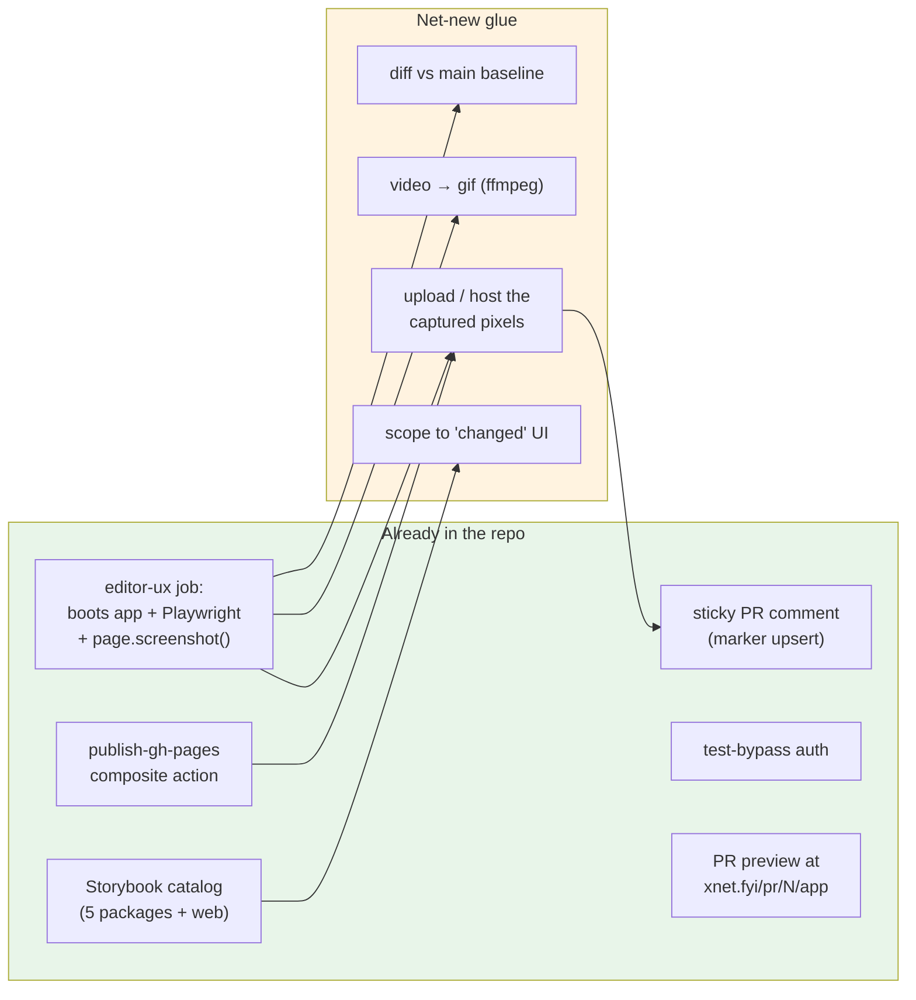
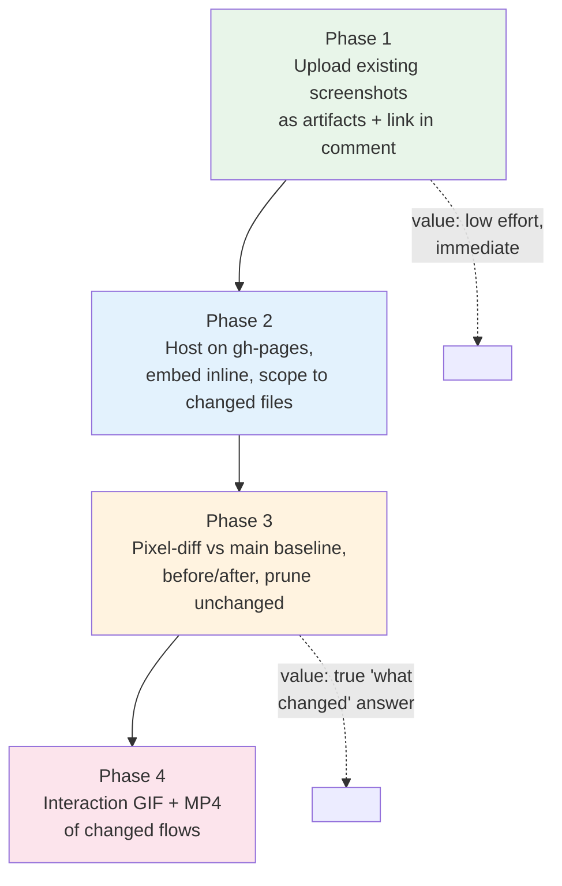
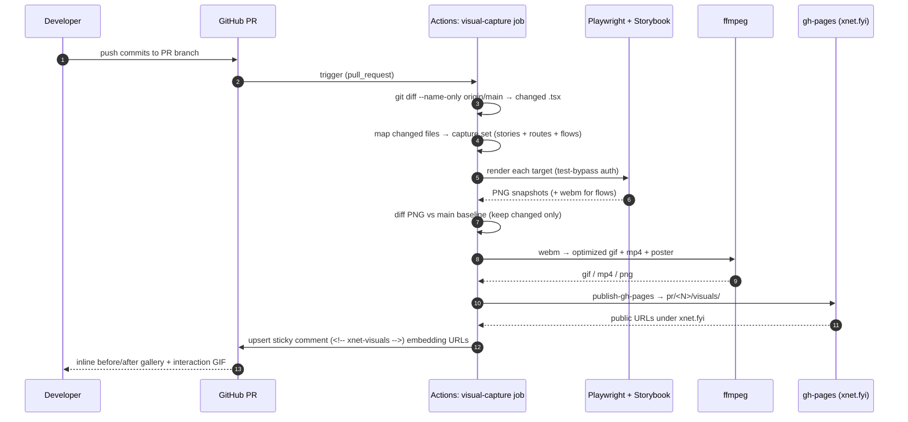
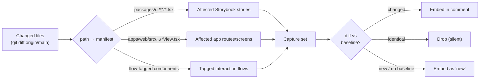

# CI Visual UI Capture: Screenshots, GIFs, and Interaction Video on PRs

## Problem Statement

When a PR touches the UI, a reviewer has to do real work to _see_ the change:
clone the branch, install, run the app, click to the right screen, and
mentally diff it against `main`. The PR-preview deploy
(`https://xnet.fyi/pr/<N>/app/`) helps, but it is a live app a human must
still drive. We already _ask_ for proof — `CONTRIBUTING.md:112` lists
"Screenshots/video for UI changes" as a PR-description requirement — but it is
a manual, easily-skipped chore.

The ask, in two escalating tiers:

1. **Pictures.** Have CI automatically screenshot the UI elements that changed
   in the PR and attach those images to the pull request.
2. **Motion.** Go further: record a short video/GIF of _interacting_ with the
   new UI and post that to the PR too.

This exploration asks whether that is possible (it is, and most of the parts
already exist in this repo), how to scope "what changed," where to host binary
artifacts so GitHub will render them inline, and how to do it without adding a
paid SaaS dependency or a flaky required check.

## Executive Summary

**Recommended path: build it from parts we already own — Playwright +
`ffmpeg` + the existing `gh-pages` publish action + the existing sticky-comment
upsert pattern — gated behind a non-blocking, informational PR comment.**

The repo is unusually well-positioned for this:

- The `editor-ux` job in `.github/workflows/ci.yml` **already** boots the web
  app, installs Playwright (chromium + webkit), drives real flows, and calls
  `page.screenshot(...)` — it just throws the PNGs away (no
  `actions/upload-artifact`, no comment).
- `deploy-pr-preview.yml` **already** builds the PR, publishes a directory to
  the `gh-pages` branch via the reusable `./.github/actions/publish-gh-pages`
  composite action, and **already** posts a sticky, upserted PR comment keyed
  by an HTML marker (`<!-- xnet-pr-preview -->`).
- Storybook (`.storybook/main.ts`) catalogs renderable components across
  `packages/ui`, `editor`, `views`, `canvas`, `dashboard`, and `apps/web` —
  a ready-made, fast, isolated render target for per-component captures.
- A test-auth bypass (`localStorage['xnet:test:bypass']`, see
  `tests/e2e/helpers/test-auth.ts`) lets headless CI reach the authenticated
  app deterministically.

So "attach pictures of changed UI" is mostly _wiring existing pieces
together_, not green-field work. The genuinely new decisions are: (a) **how to
define "changed"** — file-mapping vs. pixel-diff; (b) **where to host** images
and GIFs so GitHub embeds them inline; and (c) **how to keep it non-flaky and
non-blocking.**

The GitHub constraint that shapes everything: **the GitHub API cannot upload
binary attachments to a comment.** Markdown can only embed an image/GIF by URL,
so the bytes must live at a fetchable URL first. We already have the perfect
host: the `gh-pages` branch, reachable at `https://xnet.fyi/...`. That removes
the single biggest reason teams reach for a paid visual-testing SaaS.

Recommended phasing:

| Phase | Deliverable | New surface area |
| ----- | ----------- | ---------------- |
| 1 | Upload the screenshots the `editor-ux` job _already takes_ as artifacts + link them in a sticky comment | ~15 lines of YAML |
| 2 | Host those screenshots on `gh-pages` and embed them **inline** in the comment, scoped to changed areas | reuse `publish-gh-pages` |
| 3 | Pixel-diff against a `main` baseline so only **genuinely changed** UI surfaces, with before/after | Playwright `toHaveScreenshot` + baseline store |
| 4 | Record a Playwright interaction flow → `webm` → `gif`/`mp4`, host + embed | `video: 'on'` + `ffmpeg` |

## Current State In The Repository

### CI already screenshots the UI — and discards it

`.github/workflows/ci.yml` (the `editor-ux` job, lines 67-95) is 90% of a
screenshot pipeline already:

```yaml
editor-ux:
  if: github.event_name == 'pull_request'
  steps:
    - uses: ./.github/actions/setup
    - name: Install Playwright browsers
      run: pnpm --filter @xnetjs/e2e-tests exec playwright install --with-deps chromium webkit
    - name: Start web app
      run: pnpm --filter xnet-web dev --host 127.0.0.1 --port 5173 > /tmp/xnet-web.log 2>&1 &
    - name: Wait for web app
      run: for i in {1..60}; do curl -fsS http://127.0.0.1:5173 >/dev/null && exit 0; sleep 2; done; ...
    - name: Run editor UX smoke tests (desktop + mobile)
      run: pnpm --filter @xnetjs/e2e-tests exec playwright test src/editor-ux.spec.ts ... --project=chromium --project=mobile-chromium
      env:
        PLAYWRIGHT_TEST_BASE_URL: 'http://127.0.0.1:5173'
```

The specs it runs already capture PNGs — e.g.
`tests/e2e/src/editor-ux.spec.ts:70`:

```ts
await page.screenshot({ path: 'tmp/playwright/editor-desktop-selection-toolbar.png', fullPage: true })
```

`tests/e2e/src/authz-validation.spec.ts` alone writes ~11 numbered
screenshots. **None of these are uploaded** — there is no
`actions/upload-artifact` step anywhere in `ci.yml` (it only appears in
`electron-release.yml`). The pixels are generated in CI and immediately
deleted.

### Playwright config — screenshots yes, video no

`tests/e2e/playwright.config.ts` defines four device projects (`chromium`,
`webkit`, `mobile-chromium` for Pixel 7, `mobile-webkit` for iPhone 14) with
`trace: 'on-first-retry'` and `headless: true`. There is **no `video`
setting**, so Playwright records no `.webm` today. Turning on video is a
one-line `use: { video: 'on' }` change.

### A reusable hosting + comment pipeline already exists

`deploy-pr-preview.yml` is a working template for "produce an artifact, push it
to `gh-pages`, comment on the PR":

- `./.github/actions/publish-gh-pages` (composite action) rsyncs a source
  directory into a `target` subpath of the `gh-pages` branch, with 3x retry to
  survive concurrent writers and an `exclude` input to protect sibling paths.
- The job then posts a **sticky comment** via `actions/github-script@v7`,
  finding any prior comment by its HTML marker and updating it in place:

```js
const existing = comments.find((c) =>
  c.user?.login === 'github-actions[bot]' && c.body?.includes('<!-- xnet-pr-preview -->'))
// update if found, else create
```

This upsert-by-marker pattern is exactly what a visual gallery comment wants
(one comment per PR, refreshed on every push — never a pile of stale comments).

### Storybook: a fast per-component render target

`.storybook/main.ts` globs stories from `packages/ui`, `packages/editor`,
`packages/views`, `packages/canvas`, `packages/dashboard`, `apps/web`, and
`apps/electron`, with `@storybook/addon-a11y`, `addon-themes`, and
`addon-vitest`. Storybook gives a **deterministic, isolated, fast** way to
render a single component in a known state — the foundation that Chromatic and
Lost Pixel build on. We already maintain it.

### A latent notion of visual baselines

`tests/README.md` documents a `tests/integration/src/__screenshots__/`
directory for "Visual regression baselines," and the integration suite runs in
**Vitest browser mode with Playwright-backed Chromium**. The scaffolding for
pixel baselines is acknowledged but effectively unused — there is no diff gate.

### Auth bypass for headless capture

`tests/e2e/helpers/test-auth.ts` exposes `setupTestAuth(page)`, which sets
`localStorage['xnet:test:bypass'] = 'true'` before navigation so the app skips
WebAuthn/passkey and mints a deterministic test identity. Any capture job that
needs the _authenticated_ app (most of it) uses this.

### The PR-description expectation already exists

`CONTRIBUTING.md:112` already requires "Screenshots/video for UI changes" in
the PR body. This work simply **automates a rule we already hold humans to.**

### Repo coordinates

- Repo: `github.com/crs48/xNet`; preview host: `https://xnet.fyi`.
- PR previews live at `https://xnet.fyi/pr/<N>/app/`; the natural sibling for
  captures is `https://xnet.fyi/pr/<N>/visuals/`.



## External Research

### The hard GitHub constraint: no API binary upload

GitHub's REST/GraphQL APIs **cannot** attach binary files to issue/PR
comments. Comment bodies are Markdown; an image or GIF renders only if the
Markdown references a URL that already serves the bytes
([cli/cli#1895](https://github.com/cli/cli/issues/1895)). The browser
drag-and-drop that uploads to `github.com/user-attachments/...` (and which
natively supports **MP4 up to 100 MB**) is a web-UI-only path — Actions can't
invoke it. **Therefore every approach must host the bytes somewhere fetchable
first.** Options, cheapest-first:

1. **Push to a branch / GitHub Pages.** `opengisch/comment-pr-with-images`
   formalizes exactly this: its `github_branch` upload mode pushes images to a
   branch and references the raw URLs in the comment
   ([opengisch/comment-pr-with-images](https://github.com/opengisch/comment-pr-with-images)).
   **We already have this primitive** in `publish-gh-pages` + the `xnet.fyi`
   Pages host — no third-party hosting, no Imgur rate limits.
2. **`actions/upload-artifact` + link.** Artifacts can't embed inline (they're
   a zip behind an authenticated download), but a comment can _link_ to them.
   Actions like
   [upload-a-build-artifact-and-post-pr-comment-with-link](https://github.com/marketplace/actions/upload-a-build-artifact-and-post-pr-comment-with-link)
   and `live-codes/pr-comment-from-artifact` do this. Good Phase-1 floor.
3. **External image host (Imgur/S3/Cloudinary).** Inline-embeddable but adds a
   secret and a dependency; rate-limited on free tiers. Avoid — we don't need
   it.

### Visual-regression SaaS / OSS landscape

The mature tools all converge on the same UX (capture → diff vs. baseline →
surface in the PR), differing mainly in hosting model and price:

| Tool | Model | PR integration | Notes |
| ---- | ----- | -------------- | ----- |
| **Chromatic** | Paid SaaS, Storybook-native | GitHub check + UI | Built by Storybook team; per-story snapshots; we already have Storybook |
| **Argos CI** | Free tier + paid; GitHub-focused | Capture, diff, surface in PR with minimal setup | Playwright/Cypress SDK; lightweight |
| **Percy** (BrowserStack) | Paid SaaS | PR check | Enterprise-grade, responsive snapshots |
| **Lost Pixel** | **Open-source, self-hostable** + paid cloud | GitHub Action | Storybook/Playwright/Ladle modes; "balance of features/price" |
| **reg-suit** | **Open-source** | PR comment with report | Pluggable; publishes report to S3/`gh-pages` — same hosting idea we'd use |
| **Playwright `toHaveScreenshot`** | **Built-in, free** | Roll-your-own | Per-element/page snapshots + diff; we already depend on Playwright |

Recent trend worth noting: **AI/perceptual diffing** is displacing strict
pixel-for-pixel comparison to cut anti-aliasing/font-rendering noise
([testguild](https://testguild.com/visual-validation-tools/),
[bug0](https://bug0.com/knowledge-base/visual-regression-testing-tools)).
Pixel diffs are notoriously flaky across OS/font/GPU — directly relevant to our
existing CI-flake history (see the litestream fake-timers de-flake in
exploration 0177).

### Recording interaction as video/GIF

- **Playwright records `.webm`** natively per test with `video: 'on'`. The
  trace viewer is richer but is a Playwright-specific bundle, not an inline
  artifact ([playwright.tech](https://playwright.tech/blog/record-your-browser-tests-with-playwright)).
- **`webm → gif` via `ffmpeg`'s two-pass `palettegen`/`paletteuse`** produces a
  good-quality GIF; reducing `fps` and `scale` first cuts size dramatically
  (one writeup: **7.0 MB → 1.1 MB**)
  ([bannerbear](https://www.bannerbear.com/blog/how-to-make-a-gif-from-a-video-using-ffmpeg/),
  [shotstack](https://shotstack.io/learn/convert-video-gif-ffmpeg/)).
- **GIF vs MP4:** MP4 is far smaller and higher-quality and embeds natively in
  GitHub comments **once hosted** — but autoplay/looping behavior is less
  reliable than a GIF, and animated GIFs sometimes render as a static first
  frame depending on how they're referenced
  ([community#81359](https://github.com/orgs/community/discussions/81359)).
  Pragmatic answer: **host an MP4 _and_ a poster PNG, embed the GIF for the
  glanceable loop, link the MP4 for fidelity.**
- Turnkey examples: `mcpware/pagecast` (Playwright + ffmpeg → optimized
  GIF/MP4), `immense/playwright-readme-videos`, and the
  [PR gif generator](https://github.com/marketplace/actions/pr-gif-generator)
  marketplace action.
- `daun/playwright-report-summary` and `replayio/action-playwright` show the
  PR-comment-from-Playwright-run plumbing if we'd rather not hand-roll it.

## Key Findings

1. **This is ~70% wiring, not invention.** The boot-app + Playwright +
   screenshot loop, the `gh-pages` host, and the sticky-comment upsert all
   exist and run on every PR today.
2. **Hosting is solved.** `publish-gh-pages` + `xnet.fyi` Pages means we can
   embed images **inline** with zero new third-party dependencies or secrets —
   aligning with the repo's strong self-host/no-vendor-lock-in ethos (FSL cloud
   consolidation, "no libSQL," etc.).
3. **"Changed UI" has two definitions**, and they answer different questions:
   - **File-scoped** (changed `.tsx` → affected stories/routes) → "here's what
     the code you touched looks like now." Cheap, deterministic, no baseline.
   - **Pixel-scoped** (diff every snapshot vs. `main`) → "here's what actually
     looks different." Strictly more truthful to the word "changed," but needs
     a baseline store and invites cross-environment flake.
4. **Video → GIF is a solved `ffmpeg` recipe**, but GIFs are heavy; budget
   size aggressively (short flow, ≤10 fps, scaled width) and prefer MP4 + GIF
   together.
5. **Flake is the main risk, and the repo has scar tissue here.** Anything
   pixel-exact or timing-sensitive must be **non-blocking** (informational
   comment, `continue-on-error`), never a required status check.
6. **Scoping keeps cost bounded.** Capturing _everything_ on every PR is slow
   and noisy; mapping changed files → a small capture set keeps the job fast and
   the comment readable.

## Options And Tradeoffs

### Axis A — What renders the UI?

| Option | Pros | Cons |
| ------ | ---- | ---- |
| **A1. Storybook stories** | Fast, isolated, deterministic; already maintained; per-component granularity maps cleanly to "changed component" | Only covers things with a story; not real app composition/routing |
| **A2. Live web app (PR preview build or dev server)** | Real composition, routing, data; reuses `editor-ux` boot + test-bypass | Slower; needs auth/seed; flakier; coarser ("a screen," not "a component") |
| **A3. Both** | Component _and_ screen coverage | Most CI time; two code paths |

### Axis B — How is "changed" defined?

| Option | Pros | Cons |
| ------ | ---- | ---- |
| **B1. File-mapping** (`git diff --name-only` → glob → capture set) | No baseline; deterministic; mirrors the existing `vitest --changed` model in `ci.yml` | "Changed" = "you touched the file," not "it looks different"; needs a path→capture manifest |
| **B2. Pixel-diff vs. `main` baseline** | Truest to "changed UI element"; gives before/after; auto-prunes unchanged | Baseline storage + maintenance; cross-env flake; first-PR/new-component bootstrapping |
| **B3. Capture-all, no diff** | Simplest logic | Slow; noisy; reviewer hunts for the relevant image |

### Axis C — Where do bytes live / how embedded?

| Option | Inline render? | Dep/secret | Verdict |
| ------ | -------------- | ---------- | ------- |
| **C1. `gh-pages` via `publish-gh-pages`** | ✅ inline | none (reuse) | **Recommended** |
| **C2. `upload-artifact` + link** | ❌ link only | none | Good Phase-1 floor |
| **C3. External host (Imgur/S3)** | ✅ inline | secret + rate limits | Avoid |

### Axis D — Motion: still vs. GIF vs. video

| Option | Pros | Cons |
| ------ | ---- | ---- |
| **D1. Stills only** | Cheap, tiny, reliable | No interaction story |
| **D2. GIF of a flow** | Glanceable loop, embeds inline | Large files; needs `ffmpeg`; capped length |
| **D3. MP4 (+ poster) of a flow** | Small, high quality | Inline playback less reliable than GIF; bigger ask |
| **D4. Playwright trace** | Richest debug (DOM, network, timeline) | Not inline; reviewer must open trace viewer |

### Axis E — Build vs. buy

| Option | Pros | Cons |
| ------ | ---- | ---- |
| **E1. Roll our own** (Playwright + ffmpeg + gh-pages) | No vendor, no per-snapshot pricing, full control, fits repo ethos | We own flake/maintenance |
| **E2. Lost Pixel (OSS, self-host)** | Nice diff UI, Storybook mode, GitHub Action | New dep + config; still self-host the storage |
| **E3. Chromatic / Argos / Percy (SaaS)** | Turnkey, robust diffing, polished PR UX | Paid; external dep; data leaves the repo — against the grain here |

## Recommendation

**Build it from owned parts (E1), rendering both via Storybook and the live app
(A3), defining "changed" by file-mapping first then layering pixel-diff (B1 →
B2), hosting on `gh-pages` (C1), and adding interaction GIFs (D2) plus a linked
MP4 (D3) once stills are solid.** Keep the whole thing a **non-blocking,
sticky, informational PR comment** — never a required check.

Rationale: the repo already owns every expensive primitive (Playwright boot,
`gh-pages` publish, sticky-comment upsert, Storybook, test-bypass auth), and
its consistent pattern is to avoid external SaaS/vendor lock-in. A
roll-our-own pipeline reuses four existing mechanisms and adds only `ffmpeg`
and a path→capture manifest. Reserve Lost Pixel (E2) as a drop-in upgrade for
the _diff engine_ in Phase 3 if hand-rolled `toHaveScreenshot` diffs prove
noisy.

### Phased rollout



### End-to-end flow (target state)



### Defining the capture set from changed files



## Example Code

### Phase 1 — upload what we already capture (minimal)

Add to the existing `editor-ux` job in `.github/workflows/ci.yml`, after the
Playwright step (use `if: always()` so failures still yield evidence):

```yaml
    - name: Upload UI screenshots
      if: always()
      uses: actions/upload-artifact@v4
      with:
        name: ui-screenshots-pr-${{ github.event.pull_request.number }}
        path: tmp/playwright/**/*.png
        if-no-files-found: ignore
        retention-days: 14
```

(Playwright already writes to `tmp/playwright/` per `editor-ux.spec.ts:71`.)
Then a small `github-script` step links the run's artifacts in a sticky comment
keyed by `<!-- xnet-visuals -->`, reusing the upsert logic from
`deploy-pr-preview.yml`.

### Phase 2/3 — a dedicated, scoped, hosted capture workflow

```yaml
# .github/workflows/visual-capture.yml
name: Visual UI Capture
on:
  pull_request:
    types: [opened, synchronize, reopened]
permissions:
  contents: write       # publish-gh-pages
  pull-requests: write  # sticky comment
concurrency:
  group: visuals-${{ github.event.pull_request.number }}
  cancel-in-progress: true

jobs:
  capture:
    if: github.event.pull_request.head.repo.full_name == github.repository
    runs-on: ubuntu-latest
    timeout-minutes: 20
    continue-on-error: true   # informational — never a required check
    steps:
      - uses: actions/checkout@v4
        with: { fetch-depth: 0 }
      - uses: ./.github/actions/setup

      - name: Compute changed UI capture set
        id: scope
        run: node scripts/visuals/changed-capture-set.mjs \
               --base "origin/${{ github.base_ref }}" > capture-set.json

      - name: Render + snapshot (Storybook + app, test-bypass)
        run: node scripts/visuals/capture.mjs --set capture-set.json --out tmp/visuals
        # capture.mjs: build Storybook, screenshot affected stories;
        # boot xnet-web, setupTestAuth, screenshot affected routes;
        # for flow-tagged targets, record video (page.video()).

      - name: Diff vs main baseline (keep changed only)
        run: node scripts/visuals/diff.mjs --in tmp/visuals --baseline-ref origin/${{ github.base_ref }}

      - name: Encode interaction clips (webm → gif + mp4)
        run: |
          for v in tmp/visuals/flows/*.webm; do
            base="${v%.webm}"
            ffmpeg -y -i "$v" -vf "fps=10,scale=900:-1:flags=lanczos,palettegen" /tmp/pal.png
            ffmpeg -y -i "$v" -i /tmp/pal.png \
              -lavfi "fps=10,scale=900:-1:flags=lanczos[x];[x][1:v]paletteuse" "$base.gif"
            ffmpeg -y -i "$v" -movflags +faststart -pix_fmt yuv420p -vf "scale=900:-1" "$base.mp4"
          done

      - name: Publish visuals to gh-pages
        uses: ./.github/actions/publish-gh-pages
        with:
          source: tmp/visuals
          target: pr/${{ github.event.pull_request.number }}/visuals
          commit-message: 'deploy(visuals): PR #${{ github.event.pull_request.number }} UI captures'

      - name: Upsert visual gallery comment
        uses: actions/github-script@v7
        with:
          script: |
            const fs = require('fs')
            const base = `https://xnet.fyi/pr/${context.payload.pull_request.number}/visuals`
            const manifest = JSON.parse(fs.readFileSync('tmp/visuals/manifest.json', 'utf8'))
            const rows = manifest.changed.map(c => c.kind === 'flow'
              ? `### ${c.title}\n\n\n\n[▶ MP4](${base}/${c.mp4})`
              : `### ${c.title}\n\n| before | after |\n|---|---|\n|  |  |`)
            const body = ['<!-- xnet-visuals -->', '## 🖼️ UI changes in this PR',
              rows.length ? rows.join('\n\n') : '_No visual differences detected._'].join('\n\n')
            // ...find existing comment by '<!-- xnet-visuals -->' and update, else create
            // (same upsert as deploy-pr-preview.yml)
```

### `changed-capture-set.mjs` — the path→target manifest (sketch)

```js
// Map changed files to a small, ordered capture set.
import { execFileSync } from 'node:child_process'

const base = process.argv[process.argv.indexOf('--base') + 1]
const changed = execFileSync('git', ['diff', '--name-only', base, '--'], { encoding: 'utf8' })
  .split('\n').filter(Boolean)

const RULES = [
  // file glob → how to render it
  { test: /^packages\/ui\/.*\.tsx$/, kind: 'story', resolve: storiesForComponent },
  { test: /^apps\/web\/src\/.*View\.tsx$/, kind: 'route', resolve: routeForView },
  { test: /^packages\/(editor|canvas)\/.*\.tsx$/, kind: 'flow', resolve: flowForComponent },
]

const set = dedupe(changed.flatMap(f => {
  const rule = RULES.find(r => r.test.test(f))
  return rule ? rule.resolve(f).map(t => ({ ...t, kind: rule.kind, from: f })) : []
}))
process.stdout.write(JSON.stringify({ set }, null, 2))
```

## Risks And Open Questions

- **Pixel-diff flake.** Font hinting, anti-aliasing, GPU, and animation timing
  make exact diffs noisy — the repo already fought CI flake (exploration 0177).
  Mitigations: pin a single capture browser/OS, `maxDiffPixelRatio` tolerance,
  `animations: 'disabled'` in `toHaveScreenshot`, mask volatile regions
  (timestamps, avatars), and **keep the job non-blocking**. Consider perceptual
  diffing (Lost Pixel/`odiff`) if strict-pixel proves untenable.
- **Baseline management.** Where does the `main` baseline live, and who blesses
  intentional changes? Options: a `gh-pages` baseline tree refreshed on merge to
  `main`; committed PNGs (bloats git); or Lost Pixel/Argos baseline store.
  Open: how to bootstrap brand-new components with no baseline (treat as
  "new," not "changed").
- **`gh-pages` bloat.** Per-PR `visuals/` trees accumulate. `remove-pr-preview`
  cleanup must also delete `pr/<N>/visuals/` on PR close; GIFs/MP4s are large —
  set retention and prune aggressively.
- **CI minutes & wall-clock.** Booting the app + Storybook + recording video
  adds minutes. Scoping to changed files is the primary cost control; capturing
  on one browser (not all four projects) for visuals keeps it bounded.
- **Auth/data determinism.** Screens depend on seeded state. `setupTestAuth`
  gives an identity but not content; flows must seed deterministically or
  screenshots will diff on data, not UI.
- **GIF size vs. clarity.** A 900px, 10fps, multi-second flow can still be
  several MB. Cap clip length, prefer MP4 for fidelity + GIF for the loop, and
  scale/fps down first.
- **Fork PRs.** `deploy-pr-preview.yml` already guards
  `head.repo.full_name == github.repository`; forks lack `gh-pages` write.
  Fall back to `upload-artifact` links (Phase-1 path) for fork PRs.
- **Security.** Don't capture/host anything with secrets or real user data;
  test-bypass identities only. `gh-pages` is public.
- **Which flows to record, and how are they declared?** A naming/tag convention
  (e.g. `*.visual-flow.spec.ts`, or a `flows/` manifest) keyed off changed
  components needs design.

## Implementation Checklist

> Implemented on branch `feat/ci-visual-ui-capture`. The final build differs from
> the sketch in two deliberate ways: (1) diffing uses **`ffmpeg` SSIM +
> `blend=difference`** rather than Playwright `toHaveScreenshot`/`odiff`, so the
> single binary already needed for GIF encoding also covers diffing — zero extra
> npm deps; (2) the Phase-1 "link artifacts" comment is subsumed by the richer
> Phase-2/3/4 gallery comment, so there is one sticky comment, not two.

- [x] **Phase 1:** `actions/upload-artifact` of the editor-ux smoke screenshots
      (`if: always()`, path `tests/e2e/tmp/playwright/**/*.png`).
- [x] **Phase 1:** sticky `<!-- xnet-visuals -->` comment (delivered by the
      Phase-2 gallery, upsert logic mirrored from `deploy-pr-preview.yml`).
- [x] **Phase 2:** `scripts/visuals/changed-capture-set.mjs` + pure, unit-tested
      `lib/capture-set.mjs` mapping, mirroring the `vitest --changed` model.
- [x] **Phase 2:** `scripts/visuals/capture.mjs` — static Storybook screenshots +
      live-app route screenshots via `setupTestAuth` bypass (verified locally).
- [x] **Phase 2:** `.github/workflows/visual-capture.yml`
      (`continue-on-error`, per-PR `concurrency`, same-repo fork guard).
- [x] **Phase 2:** publish `tmp/visuals` to `pr/<N>/visuals/` via
      `publish-gh-pages`; embed images inline in the sticky comment.
- [x] **Phase 2:** `remove-pr-preview.yml` already deletes the whole `pr/<N>`
      tree on close — visuals nest under it, so cleanup needs no change.
- [x] **Phase 3:** per-flow `page.video()` recording + a `visuals-baseline/`
      store on `gh-pages`, refreshed by the `baseline` job on push to `main`.
- [x] **Phase 3:** `scripts/visuals/diff.mjs` (SSIM + `blend=difference`); keeps
      only changed/new, shows before/after/diff, tolerates AA via a threshold,
      animations disabled at capture (verified locally).
- [x] **Phase 4:** `ffmpeg` `webm → gif + mp4 + poster` encode in `lib/ffmpeg.mjs`;
      flows declared in `manifests.json` + runners in `flows.mjs`, scoped by glob.
- [x] **Phase 4:** GIF embedded + MP4 linked per flow in the comment
      (`comment.mjs`, unit-tested).
- [x] Documented in `CONTRIBUTING.md` + `scripts/visuals/README.md`
      (auto-captures supplement, not replace, the existing expectation).

## Validation Checklist

> `[x]` = verified locally while building (story/route/flow capture, diff
> classification, encode, and comment rendering all exercised end-to-end against
> the real Storybook build + a booted `xnet-web`). The remaining items are
> observable only once the workflow runs on a real PR / on `main`.

- [x] Story capture renders real components — a `packages/ui` Button change
      captured all four Button stories + the catalog (verified image output).
- [x] Route capture renders the live authenticated app (home + tasks) via the
      `xnet:test:bypass` identity.
- [x] An interaction flow records the editor being used → `gif` (~0.5 MB at
      960px) + `mp4` (~90 KB) + poster (verified frames).
- [x] A PR with **no mapped UI change** yields "_No visual differences
      detected._" — not a wall of unchanged screenshots (empty-manifest path).
- [x] A changed still is **caught** (SSIM 0.965 → before/after/diff emitted); an
      identical still is **not** flagged (SSIM 1.0 → dropped as unchanged).
- [x] The comment renders before/after/diff tables, 🆕 for new, and an inline
      GIF + MP4 link for flows (unit-tested in `lib/comment.test.mjs`).
- [x] The job is **not** a required status check and uses `continue-on-error`
      so a capture failure only annotates.
- [x] Closing the PR removes `pr/<N>/visuals/` — it nests under the `pr/<N>`
      tree that `remove-pr-preview.yml` already deletes.
- [ ] On a real PR, opening it produces the sticky comment within the timeout,
      and a follow-up push **updates the same comment** (no duplicates).
- [ ] Embedded images render **inline** in the GitHub comment (URLs resolve on
      `xnet.fyi`) once the `baseline` job has populated `visuals-baseline/`.
- [ ] Fork PRs degrade gracefully to artifact links (no `gh-pages` write
      attempt).
- [ ] Re-running the same commit twice yields a stable diff result (no
      spurious flake) across ≥5 runs.

## References

### In-repo

- `.github/workflows/ci.yml` — `editor-ux` job (boots app + Playwright +
  screenshots, discards them; no `upload-artifact`).
- `.github/workflows/deploy-pr-preview.yml` — gh-pages publish + sticky-comment
  upsert template.
- `.github/actions/publish-gh-pages/action.yml` — reusable gh-pages sync (retry,
  target, exclude).
- `tests/e2e/playwright.config.ts` — 4 device projects; `trace: on-first-retry`;
  no `video`.
- `tests/e2e/src/editor-ux.spec.ts`, `tests/e2e/src/authz-validation.spec.ts` —
  existing `page.screenshot(...)` calls.
- `tests/e2e/helpers/test-auth.ts` — `setupTestAuth` / test-bypass.
- `.storybook/main.ts` — story catalog across 5 packages + web/electron.
- `tests/README.md` — latent `__screenshots__/` visual-baseline notion.
- `CONTRIBUTING.md:112` — existing "Screenshots/video for UI changes"
  requirement.
- `.github/workflows/remove-pr-preview.yml` — preview cleanup to mirror.

### External

- [cli/cli#1895 — Upload/Embed Files to PRs/Comments](https://github.com/cli/cli/issues/1895)
- [opengisch/comment-pr-with-images](https://github.com/opengisch/comment-pr-with-images)
- [Upload-a-build-artifact-and-post-pr-comment-with-link](https://github.com/marketplace/actions/upload-a-build-artifact-and-post-pr-comment-with-link)
- [live-codes/pr-comment-from-artifact](https://github.com/live-codes/pr-comment-from-artifact)
- [PR gif generator (marketplace)](https://github.com/marketplace/actions/pr-gif-generator)
- [daun/playwright-report-summary](https://github.com/daun/playwright-report-summary)
- [replayio/action-playwright](https://github.com/replayio/action-playwright)
- [mcpware/pagecast — Playwright + ffmpeg → GIF/MP4](https://github.com/mcpware/pagecast)
- [immense/playwright-readme-videos](https://github.com/immense/playwright-readme-videos)
- [Playwright: record your browser tests](https://playwright.tech/blog/record-your-browser-tests-with-playwright)
- [FFmpeg video→GIF with palettegen (Bannerbear)](https://www.bannerbear.com/blog/how-to-make-a-gif-from-a-video-using-ffmpeg/)
- [FFmpeg MP4→GIF (Shotstack)](https://shotstack.io/learn/convert-video-gif-ffmpeg/)
- [Lost Pixel — open-source VRT](https://www.lost-pixel.com/)
- [Argos CI visual regression (LogRocket)](https://blog.logrocket.com/visual-regression-testing-argos-ci/)
- [Best UI testing/visual-validation tools 2026 (TestGuild)](https://testguild.com/visual-validation-tools/)
- [Visual regression tools 2026 (Bug0)](https://bug0.com/knowledge-base/visual-regression-testing-tools)
- [awesome-regression-testing](https://github.com/mojoaxel/awesome-regression-testing)
- [GitHub community#81359 — animated GIF renders static](https://github.com/orgs/community/discussions/81359)
