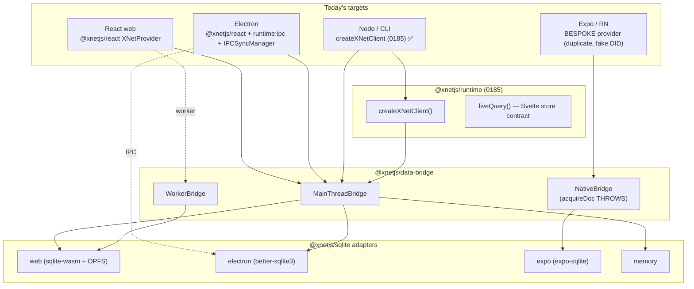
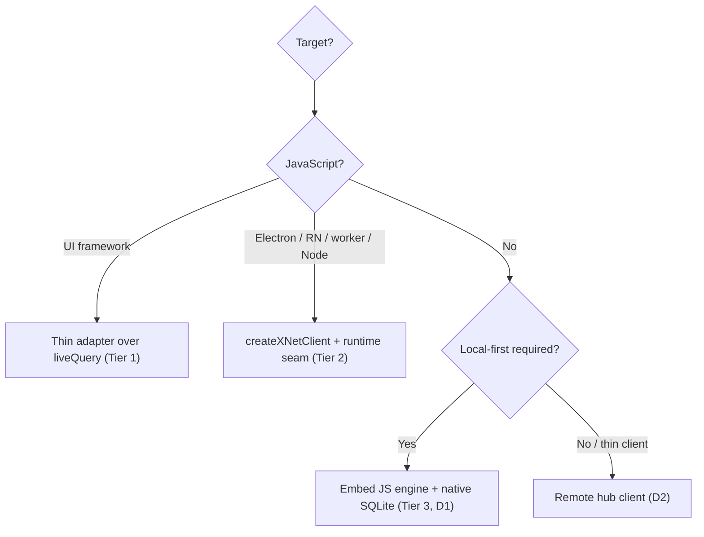
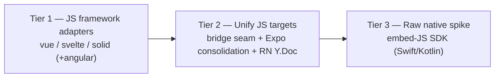

# Multi-Framework And Cross-Platform Client Targets

## Problem Statement

[0185](0185_%5B_%5D_FRAMEWORK_AGNOSTIC_DATA_MODEL_SDK.md) extracted a
framework-agnostic runtime — [`@xnetjs/runtime`](../../packages/runtime) with
`createXNetClient()` and a Svelte-store-compatible `liveQuery()`
([PR #95](https://github.com/crs48/xNet/pull/95)). Now that the data model
(auth, validation, signing, encryption, SQLite, live query/mutate/subscribe)
runs as a plain object outside React, the question is: **what does it actually
take to ship xNet on the rest of the ecosystem?**

Three axes, often conflated:

1. **UI framework** — Vue, Svelte, SolidJS, Angular, Lit, vanilla, alongside the
   existing React.
2. **JS deployment target** — React-in-the-browser, Electron, React Native /
   Expo, plain Node (CLI/daemon), web worker. Same language, very different
   storage/sync/threading.
3. **Non-JS native** — raw Swift (iOS/macOS) and Kotlin (Android), with no React
   Native in between.

These are not equally hard. The honest answer this doc defends: **(1) is nearly
free, (2) is a consolidation job we've half-done three times already, and (3) is
a real project with two viable shapes.** "Raw Node" needs essentially nothing —
the CLI already proves it.

## Executive Summary

- **JS UI frameworks are trivial now.** `client.query()` returns the universal
  `{ getSnapshot, subscribe }` contract and `liveQuery()` already implements the
  Svelte store contract
  ([live-query.ts](../../packages/runtime/src/live-query.ts)). Vue
  (`shallowRef`), Solid (`createSignal`/`from`), and Angular (`toSignal`) each
  bind to that pair in ~20–40 lines. Ship `@xnetjs/vue`, `@xnetjs/svelte`,
  `@xnetjs/solid` (and optionally `@xnetjs/angular`) as thin adapter packages.
- **Raw Node needs nothing extra** — `createXNetClient` + a SQLite (or memory)
  adapter is exactly what the new `xnet data` CLI does
  ([data.ts](../../packages/cli/src/commands/data.ts)). Document it; that's the
  deliverable.
- **The deployment targets are a consolidation problem, not a greenfield one.**
  Three providers already construct the runtime three different ways:
  [`@xnetjs/react` XNetProvider](../../packages/react/src/context.ts) (web +
  Electron-via-IPC), and a **bespoke, duplicated**
  [`apps/expo/src/context/XNetProvider.tsx`](../../apps/expo/src/context/XNetProvider.tsx)
  that re-implements identity, hooks, and lifecycle — and ships a **fake
  `did:key`** (`generateDID` uses the first 16 raw bytes as hex, not multibase)
  instead of [`@xnetjs/identity`](../../packages/identity/src/index.ts). The
  per-platform storage adapters already exist
  ([sqlite/adapters/](../../packages/sqlite/src/adapters)): `web` (sqlite-wasm +
  OPFS), `electron` (better-sqlite3), `expo` (expo-sqlite), `memory`.
- **The linchpin gap:** `createXNetClient` can take a *pre-built* `dataBridge`,
  but the React Native `NativeBridge` and the worker bridge need the **store the
  client creates** — a chicken-and-egg the client can't currently resolve
  ([client.ts](../../packages/runtime/src/client.ts) creates the store
  internally). This is the deferred "adoption seam" from 0185 P3. Add a
  **bridge/runtime factory seam** (`runtime: 'main' | 'worker' | 'native' |
  'ipc'` or `createBridge: (store) => DataBridge`) and `createXNetClient`
  becomes the single constructor for *every* JS target.
- **React Native is 80% done but broken in two places:** the bespoke provider
  duplicates the runtime, and
  [`NativeBridge.acquireDoc()` throws](../../packages/data-bridge/src/native-bridge.ts)
  — so collaborative (Y.Doc) editing doesn't work on mobile. Both are fixable:
  collapse Expo onto `createXNetClient`, and back Y.Doc with
  `op-sqlite` + a Yjs persistence provider (`y-op-sqlite`) or a native WebSocket.
- **Raw Swift/Kotlin is a genuine project with two shapes:** (A) **embed a JS
  engine** (JavaScriptCore on Apple — built in; QuickJS/Hermes via a Zipline-style
  Kotlin binding on Android) and run the `@xnetjs/runtime` bundle behind an
  idiomatic native facade, with a native SQLite adapter implementing
  `SQLiteAdapter`; or (B) a **thin remote client** over the hub (no local-first).
  Recommendation: pursue (A) as an experimental SDK because it preserves
  local-first and reuses the *entire* data model; treat (B) as the fallback for
  thin/online-only clients. The hard dependency is Yjs (CRDT) + `@noble` crypto
  running under the embedded engine.

One-line recommendation: **ship the cheap JS-framework adapters now, add the
bridge-factory seam to unify web/Electron/Expo onto one constructor (fixing the
Expo duplication + fake identity + mobile Y.Doc along the way), and scope raw
native as a separate embed-JS SDK spike.**

## Current State In The Repository

### The deployment-target matrix today



Notice the asymmetry: **only Node goes through `createXNetClient`.** Web/Electron
go through the React provider's effects; Expo goes through its own copy.

### Web (browser) — the reference target

[`apps/web/src/App.tsx:248`](../../apps/web/src/App.tsx) `resolveWebRuntime`
picks `main-thread` by default and `worker` when opted in, then renders
[`<XNetProvider>`](../../packages/react/src/context.ts). Storage is the
sqlite-wasm + OPFS adapter ([web.ts](../../packages/sqlite/src/adapters/web.ts)),
which "must run in a Web Worker for OPFS access." This is the most complete,
best-tested path.

### Electron — IPC runtime, already factored

[`apps/electron/src/renderer/main.tsx:772`](../../apps/electron/src/renderer/main.tsx)
renders the **same** `@xnetjs/react` `XNetProvider` with `runtime: { mode: 'ipc'
}` and a renderer-side `createIPCSyncManager()`; the real store + better-sqlite3
live in the main process
([data-process/data-service.ts](../../apps/electron/src/data-process/data-service.ts)).
Electron is proof that one provider already spans two very different targets via
the `runtime` lever.

### React Native / Expo — duplicated and partly broken

[`apps/expo/src/context/XNetProvider.tsx`](../../apps/expo/src/context/XNetProvider.tsx)
is a **parallel universe**: its own `XNetProvider`, its own `useQuery`
(poll-on-subscribe, not `useSyncExternalStore`), its own `useMutate`, and its own
identity that **does not use `@xnetjs/identity`**:

```ts
// apps/expo/src/context/XNetProvider.tsx:96 — NOT a real did:key
function generateDID(publicKey: Uint8Array): string {
  const keyHex = toHex(publicKey.slice(0, 16))
  return `did:key:z${keyHex}`   // ← not multibase/multicodec; cross-device incompatible
}
```

It does correctly use the shared `NodeStore` + `SQLiteNodeStorageAdapter` +
`ExpoSQLiteAdapter` + `createNativeBridge`, and polyfills
`react-native-get-random-values`. But [`NativeBridge`](../../packages/data-bridge/src/native-bridge.ts)
explicitly throws on `acquireDoc()` (line 288): **no Y.Doc / collaborative
editing on mobile.** So canvas, rich-text pages, and chat composition don't work.

### Node / CLI — already done (0185 P4)

[`packages/cli/src/commands/data.ts`](../../packages/cli/src/commands/data.ts)
builds a client with `createXNetClient` + a SQLite adapter (in-memory default;
`--db` lazily loads the better-sqlite3 adapter). This is the template every
non-React target should follow.

### The bridge-factory chicken-and-egg

`createXNetClient` ([client.ts](../../packages/runtime/src/client.ts)) creates
the `NodeStore` internally, then either uses a supplied `dataBridge` or builds a
`MainThreadBridge` over that store. But `NativeBridge`/`MainThreadBridge` are
*constructed from a store* — so a caller who wants a native bridge cannot pass
one in (it would wrap a different store than the client's). Today's only escape
is the main-thread default. To let `createXNetClient` drive RN, Electron, or the
worker, it must build the bridge **from the store it owns**.

## External Research

- **Framework reactivity converges on one contract.** Svelte stores are
  `subscribe(run) => unsubscribe`; Vue exposes `shallowRef`/`.value`; Solid uses
  `createSignal` (read/write split) and ships `from(producer)` for external
  sources; Angular wraps any `subscribe`/snapshot source with `toSignal`. All
  bind to a `subscribe`+`getSnapshot` pair — exactly what `liveQuery` exposes
  ([Vue reactivity](https://vuejs.org/guide/extras/reactivity-in-depth),
  [vue-signals](https://github.com/johannschopplich/vue-signals),
  [2025 framework overview](https://fleischer.design/en/blog/frontend-frameworks-2025-react-vue-svelte-solid-angular)).
  TanStack Query's `query-core` + per-framework adapters is the proven shape to
  copy.
- **React Native SQLite + Yjs is solved in the ecosystem.**
  [`op-sqlite`](https://github.com/OP-Engineering/op-sqlite) (JSI, "fastest
  SQLite for RN", OPFS on web + native on device) and the official
  [`expo-sqlite`](https://expo.dev/blog/modern-sqlite-for-react-native-apps) both
  exist; [`y-op-sqlite`](https://github.com/malte-j/y-op-sqlite) persists Yjs
  docs in RN SQLite, and projects like
  [replicate](https://github.com/trestleinc/replicate) keep a full SQLite copy
  (OPFS on web, op-sqlite on RN) and sync via Yjs. So `NativeBridge.acquireDoc`
  is a fixable gap, not a wall.
- **Embedding JS in native is mature.**
  [JavaScriptCore](https://github.com/topics/javascriptcore) is built into Apple
  platforms and callable from Swift/Obj-C; [QuickJS](https://bellard.org/quickjs/)
  is a 1.2 MiB engine with JNI bindings for Kotlin; Hermes precompiles to
  bytecode; [NativeScript](https://blog.nativescript.org/nativescript-8-9-node-api-previews/)
  runs V8/Hermes/QuickJS/JSC. Cash App's
  [Zipline](https://medium.com/@santimattius/download-native-code-in-your-mobile-applications-with-zipline-50dc83b581b7)
  is direct prior art: ship a JS (QuickJS) bundle into a native app with
  Kotlin/Swift bindings. This is the local-first-preserving native path.
- **The native-core counter-model.**
  [PowerSync](https://www.powersync.com/blog/build-local-first-kotlin-multiplatform-apps-with-powersync)
  uses Kotlin Multiplatform + native SQLite bindings (no JS); Automerge ships a
  Rust core with native bindings. These are *rewrite-the-core* strategies — out
  of scope for xNet, whose core (Yjs, schema, auth, `@noble`) is TypeScript. A
  widely-cited caveat: CRDTs (Yjs/Automerge) are worth it **only** for real
  collaborative editing; pure offline-queue apps don't need them
  ([offline-first stack analysis](https://docs.boltai.com/blog/tech-stack-analysis-for-a-cross-platform-offline-first-ai-chat-client)).
  Relevant because the CRDT layer is the costliest thing to carry into a native
  engine.

## Key Findings

| # | Finding | Evidence | Implication |
| - | ------- | -------- | ----------- |
| 1 | JS-framework adapters are ~free; the reactive contract already exists | [live-query.ts](../../packages/runtime/src/live-query.ts) | ship Vue/Svelte/Solid/Angular adapters as thin packages |
| 2 | Raw Node already works end-to-end | [cli/data.ts](../../packages/cli/src/commands/data.ts) | document it; no new code |
| 3 | `createXNetClient` can't build native/worker bridges over its own store | [client.ts](../../packages/runtime/src/client.ts) | add a bridge/runtime factory seam (the linchpin) |
| 4 | Expo ships a duplicated provider + fake `did:key` | [expo XNetProvider.tsx:96](../../apps/expo/src/context/XNetProvider.tsx) | consolidate onto `createXNetClient`; restore `@xnetjs/identity` |
| 5 | Mobile has no collaborative editing | [native-bridge.ts:288](../../packages/data-bridge/src/native-bridge.ts) | back Y.Doc via op-sqlite/`y-op-sqlite` or native WS |
| 6 | Per-platform storage adapters already exist and share one schema | [sqlite/adapters](../../packages/sqlite/src/adapters) | the storage axis is solved; just auto-select |
| 7 | Crypto/identity are pure-JS (`@noble`) and run on RN with a getrandom polyfill | [crypto](../../packages/crypto/src/index.ts), expo polyfill | the data model is portable; native embedding is feasible |
| 8 | Electron already spans a 2nd target via the `runtime` lever in one provider | [electron main.tsx:772](../../apps/electron/src/renderer/main.tsx) | the unification pattern is proven |
| 9 | Raw Swift/Kotlin has no path today | (absent) | needs an embed-JS SDK or a remote thin-client |

## Options And Tradeoffs

### A — JS UI framework adapters

| Option | Pros | Cons |
| ------ | ---- | ---- |
| **A1. Per-framework packages** (`@xnetjs/vue`, `@xnetjs/svelte`, `@xnetjs/solid`, `@xnetjs/angular`) over `liveQuery`/client | idiomatic per framework; tiny; mirrors TanStack | N packages to version/test |
| **A2. One `@xnetjs/adapters` package with subpath exports** (`/vue`, `/svelte`, …) | single version; shared test harness | peerDeps for all frameworks in one manifest; heavier install graph |
| **A3. Document `liveQuery` + leave bindings to users** | zero packages | every app re-writes the same 20 lines; no idiomatic `useQuery`/`createQuery` |

**Lean: A1**, starting with Svelte (already works via `liveQuery`) + Vue + Solid;
Angular last (heavier ergonomics). Each is a thin wrapper: Svelte re-exports
`liveQuery`; Vue returns a `shallowRef`; Solid uses `from()`; Angular uses
`toSignal`.

### B — Unifying the JS deployment targets

| Option | Pros | Cons |
| ------ | ---- | ---- |
| **B1. Bridge/runtime factory seam in `createXNetClient`** (`runtime: 'main'\|'worker'\|'native'\|'ipc'` or `createBridge:(store)=>DataBridge`) + per-platform storage auto-select | one constructor for every target; kills the chicken-and-egg; Expo/web/Electron converge | touches the client API; must keep the worker/IPC nuance the React provider has |
| **B2. Keep three providers, just fix Expo's bugs** | smallest change | duplication persists; native stays a fork |
| **B3. Collapse the React provider onto `createXNetClient` too** (finish 0185 P3) | true single source | worker/IPC/hub paths can't be verified headlessly (0185's deferral reason) |

**Lean: B1 now, B2's bug-fixes folded in, B3 later.** The factory seam is the
linchpin (Finding #3). With it, Expo becomes `createXNetClient({ runtime:
'native', nodeStorage: expoAdapter, … })` and drops its bespoke provider, identity,
and hooks — using the real `@xnetjs/identity` for free.

### C — React Native collaborative editing (Y.Doc)

| Option | Pros | Cons |
| ------ | ---- | ---- |
| **C1. `op-sqlite` + `y-op-sqlite` persistence** | proven; fast JSI; local-first offline docs | new native dep; migration from expo-sqlite or dual-support |
| **C2. Native WebSocket Yjs provider** (online-only docs) | reuses hub sync; no local doc store | no offline editing; needs connectivity |
| **C3. WebView-hosted editor** (TipTap in a WebView, bridge messages) | reuse the entire web editor | clunky bridge; perf; two runtimes on device |

**Lean: C1 for offline-first parity, C2 as the interim** (wire `acquireDoc` to a
native-WS Yjs provider so editing at least works online), C3 only if the rich
editor must be byte-identical to web quickly.

### D — Raw Swift / Kotlin (non-JS native)

| Option | Pros | Cons |
| ------ | ---- | ---- |
| **D1. Embed a JS engine** (JSC on Apple, QuickJS/Zipline on Android) running `@xnetjs/runtime`, native `SQLiteAdapter`, idiomatic facade | reuses the *entire* data model incl. Yjs/auth/crypto; preserves local-first; one source of truth | engine + bundle weight; bridging async + binary (Uint8Array) across the boundary; Yjs/`@noble` must run under the engine; build complexity |
| **D2. Remote thin-client** over the hub (HTTP/WS, native networking only) | trivial; tiny; pure Swift/Kotlin | not local-first; offline-broken; server dependency; re-implements read/write/auth surface natively |
| **D3. Reimplement the core in Rust/Kotlin-MP** (PowerSync model) | best native perf; no JS | enormous; forks the data model; Yjs/auth/schema re-write |

**Lean: D1 as an experimental SDK**, because it is the only option that keeps
local-first *and* a single implementation of signing/auth/CRDT. D2 is the
pragmatic fallback for genuinely thin/online clients. D3 is a non-starter given
the TS core.



## Recommendation

Three tiers, in priority order. Tier 1 is days; Tier 2 is the real engineering;
Tier 3 is a scoped spike.



1. **Tier 1 — Framework adapters (now).** Add the bridge-factory seam's
   *prerequisite-free* sibling first: ship `@xnetjs/svelte` (re-export
   `liveQuery` + a `mutate` helper), `@xnetjs/vue` (`useQuery` → `shallowRef`),
   `@xnetjs/solid` (`from()`), each ~20–40 lines with a tiny test. Document raw
   Node + vanilla. This delivers "support other frameworks" immediately and
   validates the contract.
2. **Tier 2 — Unify the deployment targets.** Add the bridge/runtime factory
   seam to `createXNetClient` (`runtime: 'main' | 'worker' | 'native' | 'ipc'`
   plus an injectable `createBridge`), and a per-platform storage selector.
   Then: (a) rebuild `apps/expo` on `createXNetClient` — delete the bespoke
   provider/hooks, restore `@xnetjs/identity` (kill the fake DID); (b) wire
   `NativeBridge.acquireDoc` to a Yjs provider (C2 online first, C1 offline
   next); (c) optionally collapse the web/Electron provider onto the client
   (0185 P3) once browser-verifiable.
3. **Tier 3 — Raw native SDK spike (experimental).** Prove `@xnetjs/runtime`
   runs under JavaScriptCore (Apple) and QuickJS/Zipline (Android) with a native
   `SQLiteAdapter` and a binary-safe bridge for `Uint8Array`. Ship an idiomatic
   `XNetClient` facade in Swift and Kotlin wrapping `createXNetClient`. Gate on
   the Yjs + `@noble` "do they run under the engine" question first; if a hard
   blocker appears, fall back to D2 (remote client) for online-only native.

## Example Code

### Tier 1 — framework adapters (the whole binding, each)

```ts
// @xnetjs/svelte — liveQuery already IS a Svelte store
export { liveQuery } from '@xnetjs/runtime'
export function mutate(client) { return client.mutate }
```

```ts
// @xnetjs/vue
import { shallowRef, onScopeDispose } from 'vue'
import { liveQuery } from '@xnetjs/runtime'
export function useQuery(client, schema, options) {
  const lq = liveQuery(client, schema, options)
  const data = shallowRef(lq.get())
  const stop = lq.subscribe((v) => (data.value = v))
  onScopeDispose(() => { stop(); lq.destroy() })
  return data            // ref<NodeState[] | null>
}
```

```ts
// @xnetjs/solid
import { from } from 'solid-js'
import { liveQuery } from '@xnetjs/runtime'
export function createQuery(client, schema, options) {
  const lq = liveQuery(client, schema, options)
  return from((set) => { const stop = lq.subscribe(set); return () => { stop(); lq.destroy() } })
}
```

### Tier 2 — the bridge/runtime factory seam

```ts
// createXNetClient gains a runtime selector that builds the bridge from the
// store IT owns — resolving the chicken-and-egg for native/worker bridges.
export interface CreateXNetClientOptions {
  // …existing…
  runtime?: 'main' | 'worker' | 'native' | 'ipc'        // default 'main'
  createBridge?: (store: NodeStore) => DataBridge        // escape hatch
}

// inside createXNetClient, after `store` is built:
const bridge =
  options.dataBridge ??
  options.createBridge?.(store) ??
  buildBridgeForRuntime(options.runtime ?? 'main', store, bridgeOptions)
// buildBridgeForRuntime: 'native' → createNativeBridge({ store }),
//                        'main'   → createMainThreadBridgeSync(store), …
```

```ts
// apps/expo — the entire bespoke provider collapses to this
const { identity, privateKey } = await loadOrCreateIdentity()   // @xnetjs/identity!
const { ExpoSQLiteAdapter } = await import('@xnetjs/sqlite/expo')
const sqlite = new ExpoSQLiteAdapter(); await sqlite.open({ path: 'xnet.db' })
const client = await createXNetClient({
  runtime: 'native',
  nodeStorage: new SQLiteNodeStorageAdapter(sqlite),
  authorDID: identity.did,
  signingKey: privateKey
})
```

### Tier 3 — raw native facade (sketch)

```swift
// Swift — JavaScriptCore hosts @xnetjs/runtime; native SQLite via JSExport
let client = try await XNet.createClient(db: "xnet.db")            // wraps createXNetClient
let tasks = try await client.fetch(schema: "xnet://app/Task")     // JSON in/out across JSC
client.query(schema: "xnet://app/Task") { rows in render(rows) }  // subscribe → Swift closure
```

```kotlin
// Kotlin — QuickJS (Zipline) hosts the same bundle; SQLiteAdapter via JNI
val client = XNet.createClient(db = "xnet.db")
client.query("xnet://app/Task").collect { rows -> render(rows) } // Flow over subscribe()
```

## Risks And Open Questions

- **The factory seam must not regress web/Electron.** The React provider's
  worker/IPC selection, fallback, hub-UCAN, and external-IPC SyncManager are
  subtle (0185 P3). Keep `createBridge` an escape hatch and land the seam behind
  the existing `dataBridge` precedence so current callers are untouched.
- **RN Y.Doc dependency choice (op-sqlite vs expo-sqlite).** `op-sqlite` is
  faster and has the Yjs persistence story, but Expo currently uses
  `expo-sqlite`. Decide: migrate the Expo adapter to op-sqlite, dual-support, or
  add a `y-expo-sqlite`-style provider. Affects the storage adapter contract.
- **Embedded-engine viability (Tier 3).** Open questions that must be answered
  by the spike *before* committing: does **Yjs** run cleanly under QuickJS/JSC
  (it expects modern JS + typed arrays)? Does **`@noble`** crypto perform
  acceptably without WebCrypto? How big is the bundle (QuickJS adds ~1.2 MiB +
  the runtime bundle)? How costly is marshaling `Uint8Array`/binary state across
  the native↔JS boundary per operation?
- **Native SQLite under an embedded engine.** Unlike RN (JSI), a raw JSC/QuickJS
  host has no SQLite — you must implement `SQLiteAdapter` against the platform's
  SQLite (SQLite3 C on Apple, `android.database`/`requery` on Android) and bridge
  it into the engine. This is the bulk of Tier 3's work.
- **Threading.** Web puts storage on a worker (OPFS), Electron on the main
  process (IPC), RN on JSI native threads. The factory seam must not assume the
  web threading model.
- **Angular ergonomics.** `toSignal` + DI make the Angular adapter heavier than
  Vue/Solid; consider deferring it until there's demand.
- **DID correctness regression risk.** Fixing the Expo fake `did:key` changes the
  identity bytes — existing Expo-local data is keyed to the old fake DID. Needs a
  migration or a clean-slate note for the (pre-release) mobile app.
- **Scope creep.** "Support a bunch of frameworks" can balloon. Tier 1 should not
  block on Tier 2/3; ship adapters against the *current* `createXNetClient`.

## Implementation Checklist

Tier 1 — JS framework adapters:

- [ ] `@xnetjs/svelte` — re-export `liveQuery` + `mutate(client)`; example + test.
- [ ] `@xnetjs/vue` — `useQuery` (`shallowRef`) + `useMutate`; `onScopeDispose`
      cleanup; test with `@vue/test-utils`.
- [ ] `@xnetjs/solid` — `createQuery` via `from()` + `createMutation`; test.
- [ ] (Optional) `@xnetjs/angular` — `injectQuery` via `toSignal`; defer if no
      demand.
- [ ] Add each to the vitest workspace aliases + a per-package test project.
- [ ] Docs page: "Use xNet with <framework>" + a raw-Node/vanilla section.

Tier 2 — unify deployment targets:

- [ ] Add `runtime: 'main' | 'worker' | 'native' | 'ipc'` + `createBridge`
      to `createXNetClient`; `buildBridgeForRuntime(store)` helper; keep
      `dataBridge` precedence. Tests per runtime (native/main with memory).
- [ ] Per-platform storage selector (or document explicit injection).
- [ ] Rebuild `apps/expo` on `createXNetClient`; delete the bespoke
      provider/hooks; restore `@xnetjs/identity` (remove the fake `generateDID`).
- [ ] Wire `NativeBridge.acquireDoc` to a Yjs provider — C2 (native WS) first,
      then C1 (`op-sqlite`/`y-op-sqlite`) for offline.
- [ ] (Stretch) Collapse the web/Electron `XNetProvider` onto `createXNetClient`
      (finish 0185 P3) once browser-verifiable.

Tier 3 — raw native spike (experimental):

- [ ] Spike: run the `@xnetjs/runtime` bundle under JavaScriptCore and QuickJS;
      confirm Yjs + `@noble` execute and benchmark.
- [ ] Implement a native `SQLiteAdapter` (SQLite3 C on Apple; JNI on Android).
- [ ] Binary-safe bridge for `Uint8Array`/Y.Doc updates across native↔JS.
- [ ] Swift `XNet` facade (JSExport) + Kotlin `XNet` facade (Zipline) wrapping
      `createXNetClient`; query→closure/Flow, mutate→async.
- [ ] Fallback path: a thin remote hub client (D2) for online-only native.

## Validation Checklist

- [ ] A Svelte, a Vue, and a Solid sample each render a live list that updates on
      `client.mutate` (no React) — adapter tests green.
- [ ] `createXNetClient({ runtime: 'native' })` builds a `NativeBridge` over the
      client's own store and round-trips create→fetch (memory adapter, node test).
- [ ] `apps/expo` builds and runs on `createXNetClient` with a **real**
      `@xnetjs/identity` DID (`did:key` validates via `parseDID`).
- [ ] A Y.Doc opens and edits on a device/simulator through `NativeBridge`
      (`acquireDoc` no longer throws).
- [ ] The existing web + Electron suites stay green after the factory seam
      (`dataBridge` precedence unchanged).
- [ ] Tier 3 spike: a Swift and a Kotlin sample create + query a node through the
      embedded runtime, with persistence across app restarts.
- [ ] Bundle/perf budget recorded for the embedded-engine path (size, op latency).

## References

- Runtime foundation: [@xnetjs/runtime](../../packages/runtime),
  [client.ts](../../packages/runtime/src/client.ts),
  [live-query.ts](../../packages/runtime/src/live-query.ts),
  [PR #95](https://github.com/crs48/xNet/pull/95), and
  [0185](0185_%5B_%5D_FRAMEWORK_AGNOSTIC_DATA_MODEL_SDK.md)
- Bridges: [data-bridge types.ts](../../packages/data-bridge/src/types.ts),
  [main-thread-bridge.ts](../../packages/data-bridge/src/main-thread-bridge.ts),
  [worker-bridge.ts](../../packages/data-bridge/src/worker-bridge.ts),
  [native-bridge.ts](../../packages/data-bridge/src/native-bridge.ts)
- Targets: [apps/web App.tsx](../../apps/web/src/App.tsx),
  [apps/electron renderer/main.tsx](../../apps/electron/src/renderer/main.tsx),
  [apps/electron data-process/data-service.ts](../../apps/electron/src/data-process/data-service.ts),
  [apps/expo XNetProvider.tsx](../../apps/expo/src/context/XNetProvider.tsx),
  [cli/data.ts](../../packages/cli/src/commands/data.ts)
- Storage: [sqlite/adapters](../../packages/sqlite/src/adapters)
  (`web`, `electron`, `expo`, `memory`)
- Identity/crypto (portability): [@xnetjs/identity](../../packages/identity/src/index.ts),
  [@xnetjs/crypto](../../packages/crypto/src/index.ts)
- External — frameworks: [Vue reactivity](https://vuejs.org/guide/extras/reactivity-in-depth),
  [vue-signals](https://github.com/johannschopplich/vue-signals),
  [frontend frameworks 2025](https://fleischer.design/en/blog/frontend-frameworks-2025-react-vue-svelte-solid-angular)
- External — RN/Yjs: [op-sqlite](https://github.com/OP-Engineering/op-sqlite),
  [y-op-sqlite](https://github.com/malte-j/y-op-sqlite),
  [modern SQLite for RN](https://expo.dev/blog/modern-sqlite-for-react-native-apps),
  [Expo local-first guide](https://docs.expo.dev/guides/local-first/)
- External — embedding JS: [JavaScriptCore](https://github.com/topics/javascriptcore),
  [QuickJS](https://bellard.org/quickjs/),
  [Zipline](https://medium.com/@santimattius/download-native-code-in-your-mobile-applications-with-zipline-50dc83b581b7),
  [NativeScript engines](https://blog.nativescript.org/nativescript-8-9-node-api-previews/)
- External — native local-first: [PowerSync Kotlin Multiplatform](https://www.powersync.com/blog/build-local-first-kotlin-multiplatform-apps-with-powersync),
  [awesome-local-first](https://github.com/alexanderop/awesome-local-first)
