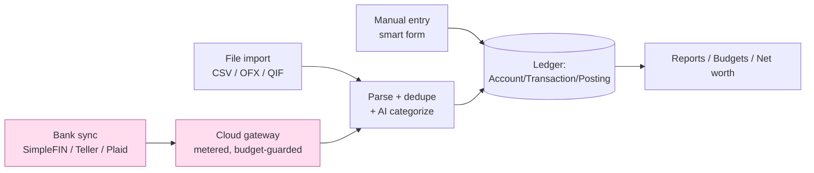
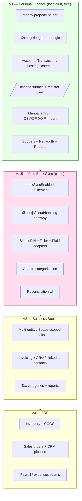
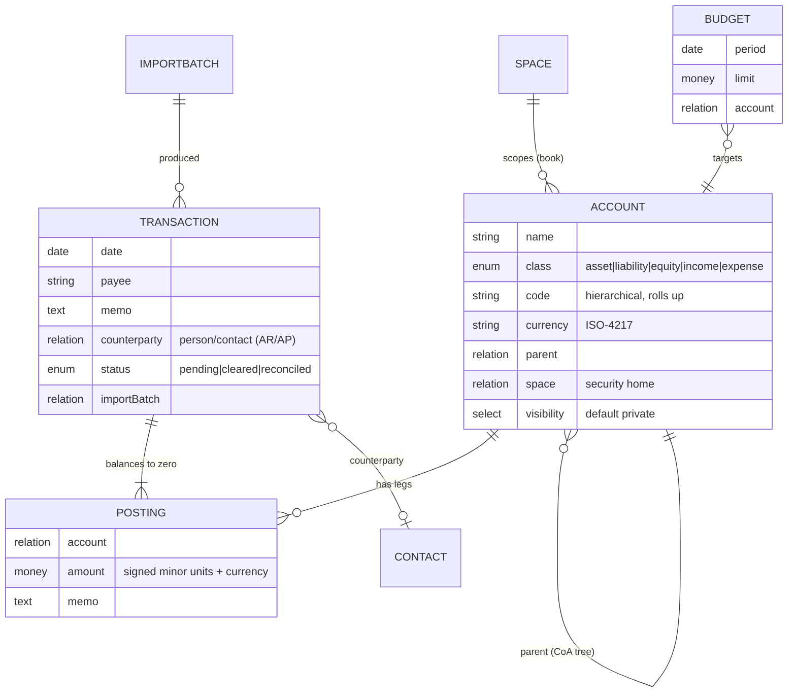
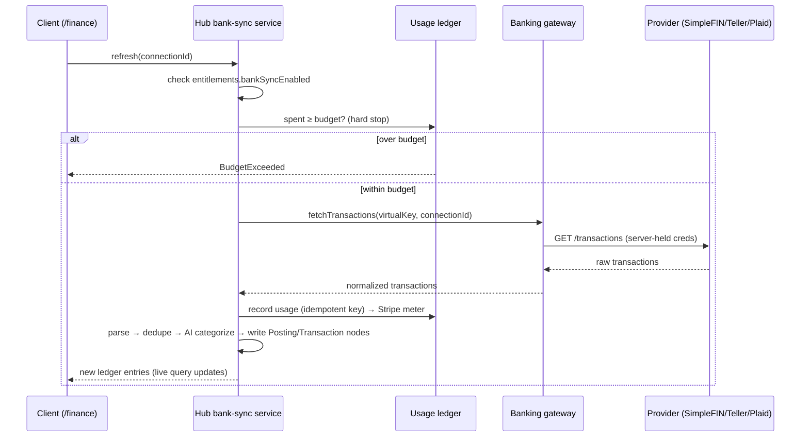

# Double-Entry Accounting, Personal Finance, and the Road to an xNet ERP

## Problem Statement

xNet today is a local-first, schema-native personal data platform: pages,
tasks, databases, a CRM/people-matching primitive, an experiment journal, a
spaces authorization model, and a managed cloud with metered AI. The proposal
is to add **money** to that graph — a first-class double-entry accounting
engine that starts as *personal finance management* (track every dollar of
income and expense, reconcile against real accounts) and grows, over time, into
a *business* accounting and **ERP** layer (invoicing, AR/AP, inventory, sales —
the same surface that a CRM exploration is already converging on).

Concretely, this exploration answers:

1. What does a **double-entry accounting schema** look like inside xNet's node
   model — accounts, journal entries, postings, money?
2. What does **V1 personal-finance UI** look like, and how does it reuse the
   patterns we already have (the experiments package, views, query/mutate
   hooks, spaces auth)?
3. How do we get **transactions in** — manual entry, file import (CSV/OFX/QIF),
   and automated **bank sync** — and which bank-data API do we lean on given
   that Plaid is expensive?
4. How does bank sync become a **paid xNet Cloud service**, mirroring the
   existing metered-AI precedent?
5. What is the **ERP endgame**, and how do we avoid painting ourselves into a
   corner with a personal-finance-only data model?

## Executive Summary

**Build double-entry from day one, but hide it.** Single-entry "I spent $40 on
groceries" tools (Mint, early Actual) hit a ceiling the moment a user wants net
worth, loans, investments, or a business. Double-entry is the data model that
scales from a personal checkbook to a full general ledger — it is the *same
model*. The cost of starting double-entry is a slightly richer schema; the cost
of *not* starting double-entry is a migration we will regret. Firefly III
(double-entry) ages into business use; Actual Budget (envelope/single-entry)
deliberately does not. We want Firefly's spine with Actual's local-first feel.

**Recommended shape:**

- A pure-logic package **`@xnetjs/ledger`** (no data/UI deps) holding the
  balancing rules, account-type sign conventions, trial balance, running
  balances, budget math, reconciliation, and multi-currency arithmetic — the
  exact pattern `@xnetjs/experiments` already established.
- Three (plus two) schemas in **`@xnetjs/data`**: `Account` (chart of
  accounts), `Transaction` (a journal entry / envelope), and `Posting` (a
  single debit/credit leg). Plus `Budget` and `ImportBatch` for V1 ergonomics.
- A new **`money()` property helper**: integer **minor units** (cents) +
  ISO-4217 currency code. **Never floats for authoritative balances** — the
  existing `number`/`formula` paths are IEEE-754 and are fine for *display*
  math but must not own the ledger.
- A **`/finance`** surface (route + view) reusing `useQuery`/`useMutate` and a
  custom **register** view type via the existing `ViewRegistry`.
- Privacy: financial nodes default to **`visibility: 'private'`** and use
  **`spaceCascadeAuthorization()`** so a shared book (family budget, business
  ledger) inherits access from its Space — the most sensitive data in the app
  gets the strictest default.
- Ingestion ladder: **manual → file import (free, local) → bank sync (paid
  cloud)**. Bank sync clones the **metered-AI architecture** exactly (virtual
  key per tenant, budget hard-stop, idempotent usage ledger, Stripe meter
  events). Start with **SimpleFIN Bridge ($15/yr) and Teller (free dev tier)**
  behind a provider-agnostic adapter; keep a **Plaid** adapter for the premium
  tier; treat **GoCardless/Nordigen** as EU-only and *closed to new customers*.
- AI we already bill for becomes the **auto-categorizer** and the
  natural-language "where did my money go?" layer — high-value, on-brand, and
  it reuses the gateway.

**Phasing:** V1 = local-first personal finance (manual + import + double-entry
+ budgets + net worth + reports). V1.5 = paid bank sync. V2 = business books
(multi-entity, invoicing, AR/AP, CRM linkage). V3 = ERP (inventory, sales
orders, payroll seams).

## Current State In The Repository

xNet already has every structural seam this feature needs. Nothing here
requires new platform primitives — only new schemas, one pure-logic package,
one property helper, and one surface.

### The node + schema model

Nodes are minimal and universal — `id`, `schemaId`, `createdAt`, `createdBy`,
plus schema-defined properties — defined in
[packages/data/src/schema/node.ts](packages/data/src/schema/node.ts) and built
with `defineSchema()` in
[packages/data/src/schema/define.ts](packages/data/src/schema/define.ts). The
property DSL (`text`, `number`, `select`, `relation`, `date`, `json`, …) lives
in [packages/data/src/schema/properties/](packages/data/src/schema/properties/).
`number()` already supports an `integer: true` flag
([number.ts:46](packages/data/src/schema/properties/number.ts)) — the basis for
storing money as integer minor units.

The cleanest schema to copy is **`MetricSchema`**
([packages/data/src/schema/schemas/metric.ts](packages/data/src/schema/schemas/metric.ts)):
it shows the full idiom — `relation()` targets by versioned IRI, `select()`
with `as const` option unions, a `space` relation for the security home, and a
`visibility` select that **defaults to `private`** for sensitive data. An
accounting schema is a near-mechanical adaptation. New schemas are registered in
[packages/data/src/schema/schemas/index.ts](packages/data/src/schema/schemas/index.ts).

### Authorization (the part that matters most for money)

Schema-native authorization is live (exploration 0181). Content schemas call
`spaceCascadeAuthorization()` from
[packages/data/src/schema/schemas/space-authorization.ts:83](packages/data/src/schema/schemas/space-authorization.ts),
which inherits every access decision from the node's `space` relation and walks
the parent chain. With no `space`, a node is creator-private. This is exactly
the semantics financial data wants: a personal book is private by construction;
a *family budget* or *business ledger* becomes a Space whose membership governs
the entire book of accounts in one place.

### The pure-logic package precedent

[packages/experiments/](packages/experiments/) is the template for
`@xnetjs/ledger`. It is **"pure, dependency-free logic"** — plain functions over
plain arrays, zero `@xnetjs/*` imports — split into focused modules (`day.ts`,
`streak.ts`, `stats.ts`, `verdict.ts`) and re-exported from
[packages/experiments/src/index.ts](packages/experiments/src/index.ts). Schemas
live in `@xnetjs/data`; UI lives in `apps/web`. We replicate that three-layer
split exactly: balancing/reporting math in `@xnetjs/ledger`, schemas in
`@xnetjs/data`, register/budget UI in `apps/web`.

### Read/write hooks and surfaces

UI reads with `useQuery(Schema, …)` and writes with
`useMutate()` — both support **atomic multi-op transactions**, which is
non-negotiable for double-entry (a journal entry and its postings must commit or
roll back together):

- [packages/react/src/hooks/useQuery.ts](packages/react/src/hooks/useQuery.ts)
- [packages/react/src/hooks/useMutate.ts](packages/react/src/hooks/useMutate.ts)
  — `mutate([{type:'create',…}, …])` returns per-op results + `tempIds`, so a
  parent `Transaction` and its child `Posting`s land in one batch.

Surfaces are file-based TanStack routes
([apps/web/src/routes/](apps/web/src/routes/), e.g. `experiments.tsx`,
`person.$did.tsx`) plus a pluggable **`ViewRegistry`**
([packages/views/src/registry.ts](packages/views/src/registry.ts)) where we can
register a `register` (ledger) view type alongside table/board/gantt.

### The CRM / ERP-adjacent prior art

Exploration
[0174_[_]_GENERALIZED_PEOPLE_MATCHING_AND_CONNECTION.md](docs/explorations/0174_[_]_GENERALIZED_PEOPLE_MATCHING_AND_CONNECTION.md)
and [packages/social/src/connect/](packages/social/src/connect/) establish a
*consent-gated, user-owned* connection primitive and a `/person/$did` profile
dashboard. That same person/contact graph is the **counterparty** dimension of
accounting: an invoice is owed *by a contact*, an expense is paid *to a vendor*.
When we get to AR/AP, postings link to the existing person/profile nodes rather
than inventing a parallel "customer" table — this is the seam that turns
"accounting" into "the data half of a CRM/ERP."

### Cloud, entitlements, and the metered-AI blueprint

The paid-service machinery is already built and is the precise template for paid
bank sync:

- **Entitlements contract** —
  [packages/entitlements/src/plans.ts](packages/entitlements/src/plans.ts)
  defines `PlanEntitlements` with per-feature boolean gates (`aiEnabled: boolean`).
  A `bankSyncEnabled` flag drops in next to it. Tokens are HMAC-signed by the
  control plane and verified by the hub
  ([packages/entitlements/src/entitlements.ts](packages/entitlements/src/entitlements.ts)).
- **Metered gateway** —
  [packages/cloud/src/ai/gateway.ts](packages/cloud/src/ai/gateway.ts) (virtual
  key per tenant),
  [packages/cloud/src/ai/metered-gateway.ts](packages/cloud/src/ai/metered-gateway.ts)
  (budget hard-stop *before* the provider call), and
  [packages/cloud/src/ai/metering.ts](packages/cloud/src/ai/metering.ts)
  (idempotent usage → marked-up dollars → Stripe meter event). A
  `@xnetjs/cloud/banking` module is a structural clone with a different
  provider adapter and a per-connection/per-refresh cost unit.
- **Hub services** — background integrations already live in
  [packages/hub/src/services/](packages/hub/src/services/) (e.g.
  `github-integration.ts`); a `bank-sync.ts` service registers the same way,
  reading entitlements at boot
  ([packages/hub/src/config.ts](packages/hub/src/config.ts)) and persisting
  fetched transactions as `Transaction`/`Posting` nodes via the hub's NodeStore.

### The one real gap: money precision

There is **no decimal/money type today**. Currency is only ever *formatted*
(`Intl.NumberFormat` in
[packages/plugins/src/sandbox/context.ts](packages/plugins/src/sandbox/context.ts)
and a float `round()` in
[packages/formula/src/functions/index.ts](packages/formula/src/functions/index.ts)).
Everything numeric is IEEE-754 `float64`. For a ledger that must balance to the
cent across thousands of rows, float accumulation error is disqualifying. This
is the single most important new primitive: a `money()` property storing
**integer minor units + currency code**, with all arithmetic in
`@xnetjs/ledger` done on integers.

## External Research

### Prior art in open-source personal finance

| Tool | Model | Stack | License | Takeaway for xNet |
| --- | --- | --- | --- | --- |
| **Firefly III** | Full double-entry, chart of accounts, multi-currency, rules engine | PHP/Laravel, self-host | AGPL | The reference for *depth*; proves double-entry scales to near-business use. Heavy/server-bound — the opposite of local-first. |
| **Actual Budget** | Envelope / zero-sum (single-entry-ish) | JS, **local-first (CRDT sync)** | MIT | The reference for *feel* — instant, offline, syncs. Deliberately shallow on account types (no proper investment/loan ledger). |
| **Maybe Finance** | Entry-based **immutable ledger** (transactions, trades, valuations as immutable `Entry` records); `Family` as tenant root | Rails + Postgres + Sidekiq | AGPL (open-sourced, 40k★) | Validates *immutable entries* and a *household tenant boundary* — xNet's `Space` is our `Family`. |
| **Beancount / hledger / Ledger** | Plain-text double-entry, strict, plugin reporting | Python / Haskell / C++ | Various OSS | The *correctness* gold standard. Their account-type sign rules and balance assertions are worth copying wholesale. Text-file UX is not our audience, but the *engine semantics* are. |
| **Blnk / envato `double_entry` / `plutus`** | Embeddable double-entry ledger libraries | Go / Ruby | OSS | Confirm the minimal table shape: accounts + immutable postings that sum to zero; balances are *derived*, never stored authoritatively. |

**Synthesis:** *Firefly's double-entry spine + Actual's local-first runtime +
Maybe's immutable-entry discipline.* xNet is uniquely positioned to deliver all
three because it already *is* a local-first CRDT graph with sync.

### Double-entry, distilled (the rules `@xnetjs/ledger` encodes)

- Five account classes: **Asset, Liability, Equity, Income (Revenue),
  Expense.** The accounting equation `Assets = Liabilities + Equity` (extended:
  `+ Income − Expense`).
- Every transaction is ≥2 postings; **debits = credits** for the transaction
  (per currency). Normal balances: Assets & Expenses are **debit-normal**;
  Liabilities, Equity & Income are **credit-normal**. A posting's effect on a
  balance depends on the account's class.
- **Balances are derived** by summing postings, never stored as a source of
  truth (store snapshots only as a cache/optimization with the running-balance
  trick).
- A chart of accounts is a **hierarchy** (numeric/lettered codes that roll up),
  which maps naturally to xNet's existing folder/tag/parent patterns.

### Bank data APIs — the Plaid problem and the cheaper ladder

Automated bank connectivity is the expensive, regulated part. Findings (mid-2026):

| Provider | Coverage | Cost | Fit |
| --- | --- | --- | --- |
| **Plaid** | US/CA + broad | **Custom/enterprise**; ~$1k+/mo base reported, per-item fees | Premium tier only. Best coverage, but a money pit for a personal product. |
| **SimpleFIN Bridge** | US, thousands of institutions, read-only | **$15/year** flat, daily refresh (~24 req/day) | **Best V1 fit.** Cheap, read-only (safe), explicitly built for self-hosted budgeting (Actual/Firefly users rely on it). |
| **Teller** | US | **100 free live connections** on dev tier + unlimited sandbox | Strong free start; mobile-first, clean API. |
| **GoCardless Bank Account Data (ex-Nordigen)** | EU/UK | Was free ≤50 conn/mo | **EU-only and reportedly closed to new customers in 2025** — do *not* start new builds here; keep as a dormant adapter for existing creds. |
| **MX / Finicity / Yodlee / Tink / TrueLayer** | US / global / EU | Enterprise | Future premium/region options. |

There is no truly free, broad, sustainable bank-data API. The pragmatic ladder
is: **manual + file import (free, always available) → SimpleFIN/Teller (cheap,
paid cloud) → Plaid (premium).** File import (CSV/OFX/QIF) is the universal
escape hatch every serious tool keeps, because *every* bank exports statements.

### Why "paid cloud service" is the right call

The user's instinct is correct and matches the codebase: bank sync needs
server-held provider credentials, scheduled background refresh, and per-call
cost — identical in shape to metered AI. It cannot be a pure local-first feature
(no secret custody, no cron, CORS/regulatory walls). Offering it as a metered
cloud add-on (the way `aiEnabled` works) is both the natural architecture *and*
a clean monetization story, while keeping the **free tier fully functional via
manual entry + import** — preserving the local-first, no-lock-in ethos.

## Key Findings

1. **Double-entry is a schema choice, not a UX choice.** We can present a
   dead-simple "spent $40 at grocery store" form while writing a balanced
   journal entry underneath. The complexity is hidden, not absent.
2. **xNet has every seam already** — schema DSL, atomic mutations, spaces auth,
   pure-logic package pattern, view registry, metered-cloud blueprint. The net
   new surface area is small and well-bounded.
3. **Money precision is the one genuine new primitive.** Integer minor units +
   currency, integer-only ledger math. Get this wrong and balances drift.
4. **The CRM and accounting graphs are the same graph.** Counterparties =
   contacts. This is why "accounting in xNet" is strategically a Trojan horse
   for "ERP in xNet."
5. **Bank sync = metered AI, reskinned.** The provider adapter and cost unit
   change; the gateway/budget/ledger/Stripe machinery is reused verbatim.
6. **Free tier must be complete without sync.** Import + manual keeps the
   local-first promise; sync is a convenience upsell, not a paywall on the core.

## Options And Tradeoffs

### A. Ledger model: single-entry vs double-entry

| | Single-entry (envelope) | **Double-entry (recommended)** |
| --- | --- | --- |
| Schema | One `Transaction` with `amount` + `category` | `Account` + `Transaction` + `Posting` legs |
| Net worth / loans / investments | Bolted on, awkward | Native (just more account types) |
| Business path | Dead end | The *same* model scales to a GL |
| Cognitive load | Lower | Hidden behind smart entry forms |
| Migration risk | High (rewrite to go deeper) | None (it's already the deep model) |

Double-entry. The schema cost is one extra node type (`Posting`); the strategic
payoff is the entire ERP roadmap on one data model.

### B. Money representation

| Option | Verdict |
| --- | --- |
| `number()` float dollars | ✗ float drift; disqualified for balances |
| Integer minor units in a plain `number({integer:true})` + separate currency `text` | ✓ works, but easy to misuse (two fields, no invariant) |
| **New `money()` helper: `{amount:int, currency:ISO4217}`** | ✓✓ encodes the invariant once, validates currency, formats consistently. Recommended. |
| `decimal.js`/`big.js` everywhere | Overkill for storage; integers are exact for fixed-precision currency. Use a decimal lib only if/when we support assets with >2dp (FX, crypto) — and even then store minor units at the currency's exponent. |

### C. Where transactions come from



Free/local: manual + file import. Paid/cloud (pink): bank sync feeds the *same*
parse→categorize→ledger pipeline, so there is one code path regardless of source.

### D. Bank-sync provider strategy

Single provider (Plaid) = best coverage, worst economics, vendor lock-in.
**Adapter pattern** (recommended): a `BankDataProvider` interface with
SimpleFIN, Teller, Plaid implementations; plan tier selects the provider; region
selects availability. Costs scale with the user's plan, and we never hard-depend
on one vendor — the same anti-lock-in stance the hub takes toward cloud.

### E. Package boundaries

Mirror experiments exactly: **`@xnetjs/ledger`** (pure math, no deps) +
**schemas in `@xnetjs/data`** + **UI in `apps/web`** + **`@xnetjs/cloud/banking`**
(server-only, paid). Rejected: a monolithic `@xnetjs/accounting` that mixes math,
schema, and React — it would violate the established layering and the cloud
boundary lint rule.

## Recommendation

Ship **V1 personal finance, local-first, double-entry, no cloud dependency**,
then layer paid bank sync as a metered cloud add-on.



Rationale: V1 stands alone and is shippable without touching the cloud — it
proves the model, delights the local-first audience, and is fully usable with
zero recurring cost. Every later phase is *additive* on the same three schemas.

### Data model (recommended ER shape)



Key invariants enforced by `@xnetjs/ledger` (not the DB): for each
`Transaction`, postings sum to **0** per currency; an `Account`'s balance is the
signed sum of its postings; a posting's contribution to "what the account is
worth" respects its class's normal balance. Transaction + its postings are
written in **one atomic `mutate([...])`** so the book is never unbalanced
mid-write.

## Example Code

### 1. A `money()` property helper (the one new primitive)

```typescript
// packages/data/src/schema/properties/money.ts
import type { PropertyBuilder } from '../types'

/** A fixed-precision monetary amount: integer MINOR units + ISO-4217 code. */
export interface MoneyValue {
  /** Signed minor units. USD $12.34 → 1234; JPY ¥500 → 500 (0-exponent). */
  amount: number
  /** ISO-4217, e.g. "USD", "EUR", "JPY". */
  currency: string
}

export interface MoneyOptions {
  required?: boolean
  /** Restrict to a single currency for this property, if desired. */
  currency?: string
}

export function money(options: MoneyOptions = {}): PropertyBuilder<MoneyValue> {
  return {
    definition: {
      type: 'money',
      required: options.required ?? false,
      config: { currency: options.currency }
    },
    validate(value: unknown): value is MoneyValue {
      if (value == null) return !options.required
      const v = value as MoneyValue
      return (
        typeof v.amount === 'number' &&
        Number.isInteger(v.amount) && // never a float — exact cents only
        typeof v.currency === 'string' &&
        /^[A-Z]{3}$/.test(v.currency) &&
        (!options.currency || v.currency === options.currency)
      )
    },
    coerce(value: unknown): MoneyValue | null {
      if (value == null) return null
      const v = value as Partial<MoneyValue>
      if (typeof v.amount !== 'number' || typeof v.currency !== 'string') return null
      return { amount: Math.round(v.amount), currency: v.currency.toUpperCase() }
    },
    _type: 0 as unknown as MoneyValue
  }
}
```

### 2. The three core schemas (mirrors `MetricSchema` idiom)

```typescript
// packages/data/src/schema/schemas/account.ts
import { defineSchema } from '../define'
import { text, select, relation } from '../properties'
import { spaceCascadeAuthorization } from './space-authorization'

export const AccountSchema = defineSchema({
  name: 'Account',
  namespace: 'xnet://xnet.fyi/',
  properties: {
    name: text({ required: true, maxLength: 200 }),
    class: select({
      options: [
        { id: 'asset', name: 'Asset' },
        { id: 'liability', name: 'Liability' },
        { id: 'equity', name: 'Equity' },
        { id: 'income', name: 'Income' },
        { id: 'expense', name: 'Expense' }
      ] as const,
      default: 'expense'
    }),
    /** Hierarchical code for roll-up, e.g. "1000", "1010". */
    code: text({ maxLength: 40 }),
    /** Default currency for postings against this account. */
    currency: text({ maxLength: 3, default: 'USD' }),
    /** Chart-of-accounts tree. */
    parent: relation({ target: 'xnet://xnet.fyi/Account@1.0.0' as const }),
    /** Security home; empty = personal/private book. */
    space: relation({ target: 'xnet://xnet.fyi/Space@1.0.0' as const }),
    visibility: select({
      options: [
        { id: 'inherit', name: 'Inherit' },
        { id: 'private', name: 'Private' },
        { id: 'unlisted', name: 'Unlisted' },
        { id: 'public', name: 'Public' }
      ] as const,
      default: 'private' // financial data is private by default
    })
  },
  authorization: spaceCascadeAuthorization()
})

// packages/data/src/schema/schemas/transaction.ts — the journal entry
export const TransactionSchema = defineSchema({
  name: 'Transaction',
  namespace: 'xnet://xnet.fyi/',
  properties: {
    date: date({ required: true }),
    payee: text({ maxLength: 200 }),
    memo: text({ maxLength: 2000 }),
    /** Counterparty for AR/AP — links into the CRM/person graph. */
    counterparty: relation({ target: 'xnet://xnet.fyi/ConnectableProfile@1.0.0' as const }),
    status: select({
      options: [
        { id: 'pending', name: 'Pending' },
        { id: 'cleared', name: 'Cleared' },
        { id: 'reconciled', name: 'Reconciled' }
      ] as const,
      default: 'pending'
    }),
    importBatch: relation({ target: 'xnet://xnet.fyi/ImportBatch@1.0.0' as const }),
    space: relation({ target: 'xnet://xnet.fyi/Space@1.0.0' as const }),
    visibility: select({ /* …private default… */ } as const)
  },
  authorization: spaceCascadeAuthorization()
})

// packages/data/src/schema/schemas/posting.ts — one debit/credit leg
export const PostingSchema = defineSchema({
  name: 'Posting',
  namespace: 'xnet://xnet.fyi/',
  properties: {
    transaction: relation({ target: 'xnet://xnet.fyi/Transaction@1.0.0' as const, required: true }),
    account: relation({ target: 'xnet://xnet.fyi/Account@1.0.0' as const, required: true }),
    /** Signed minor units: +debit-side / −credit-side by convention. */
    amount: money({ required: true }),
    memo: text({ maxLength: 500 }),
    space: relation({ target: 'xnet://xnet.fyi/Space@1.0.0' as const })
  },
  authorization: spaceCascadeAuthorization()
})
```

### 3. Pure ledger logic (the `@xnetjs/experiments` pattern)

```typescript
// packages/ledger/src/balance.ts — zero @xnetjs deps, pure functions
export interface Leg { account: string; amount: number; currency: string }

/** A transaction is balanced iff legs sum to 0 within EACH currency. */
export function isBalanced(legs: Leg[]): boolean {
  const byCcy = new Map<string, number>()
  for (const l of legs) byCcy.set(l.currency, (byCcy.get(l.currency) ?? 0) + l.amount)
  for (const total of byCcy.values()) if (total !== 0) return false
  return true
}

/** Signed balance of an account = sum of its postings (integer-exact). */
export function accountBalance(legs: Leg[]): number {
  return legs.reduce((sum, l) => sum + l.amount, 0)
}

/** Normal-balance sign by account class — turns a signed sum into "worth". */
const DEBIT_NORMAL = new Set(['asset', 'expense'])
export function naturalBalance(cls: string, signedSum: number): number {
  return DEBIT_NORMAL.has(cls) ? signedSum : -signedSum
}
```

### 4. Atomic write from the UI (`useMutate` batch)

```typescript
// "Spent $40 at grocery store" → one balanced journal entry, committed atomically
const { mutate } = useMutate()
await mutate([
  { type: 'create', schema: TransactionSchema,
    data: { date: today, payee: 'Grocery Store', status: 'cleared' } },        // → tempIds.txn
  { type: 'create', schema: PostingSchema,
    data: { transaction: '$txn', account: groceriesExpenseId,
            amount: { amount: 4000, currency: 'USD' } } },                      // debit expense
  { type: 'create', schema: PostingSchema,
    data: { transaction: '$txn', account: checkingAssetId,
            amount: { amount: -4000, currency: 'USD' } } }                      // credit asset
]) // balances to 0 → ledger invariant holds; rolls back as a unit on failure
```

### 5. Metered bank-sync gateway (clone of metered AI)



## Risks And Open Questions

- **Money precision discipline.** Every contributor must route balance math
  through `@xnetjs/ledger` integers; a stray `formula`/float path silently
  corrupts totals. Mitigation: lint/CI guard that `money` values never feed the
  float `number` coercion for authoritative sums; property-test that imported
  batches reconcile to the cent.
- **Multi-currency depth.** V1 can be single-currency-per-account with no FX. A
  real ledger needs FX gain/loss accounts and a rate source. Open question:
  how far into multi-currency for V1 (recommend: store currency, forbid mixed
  *uncategorized* transactions, defer FX revaluation to V2).
- **Bank-data regulatory + custody load.** Holding provider credentials and
  user financial data raises security/compliance stakes well above AI. Mandates
  encryption at rest, scoped secrets in the control plane, audit logging, and a
  clear data-retention/delete story. Open question: do we ever store raw
  provider tokens, or always broker through the gateway with short-lived keys?
- **Provider availability churn.** GoCardless/Nordigen closing to new customers
  is a live example. The adapter interface is the hedge; document the dormant
  adapters.
- **Reconciliation UX is the hard part, not the math.** Matching synced/imported
  rows to existing entries, handling duplicates and splits, and a "statement
  balance vs book balance" reconcile flow is where most of the UI effort goes.
- **CRDT + immutable ledger tension.** Local-first edits to financial history
  must preserve auditability. Open question: do we make `Posting`s effectively
  append-only (corrections as reversing entries, à la real accounting) rather
  than mutable — likely **yes** for the business tier, optional for personal.
- **Scope creep into "real" accounting.** Tax rules, GAAP/IFRS, payroll, and
  jurisdictions are bottomless. V1 must resist; it is a *personal ledger*, not a
  CPA-certified system. Be explicit about that boundary in-product.

## Implementation Checklist

### V1 — Personal finance, local-first (no cloud dependency)

- [x] Add `money()` property helper + `MoneyValue` type in
      `packages/data/src/schema/properties/money.ts`; wire into the property
      barrel and validation/coercion paths.
- [x] Define `AccountSchema`, `TransactionSchema`, `PostingSchema` (+ `BudgetSchema`,
      `ImportBatchSchema`) in `packages/data/src/schema/schemas/`; register in
      `schemas/index.ts`; default `visibility: 'private'` +
      `spaceCascadeAuthorization()`.
- [x] Create `@xnetjs/ledger` package (mirror `@xnetjs/experiments`):
      `balance.ts` (isBalanced, accountBalance, naturalBalance, trial balance),
      `currency.ts` (minor-unit parse/format, ISO-4217 exponents),
      `report.ts` (income statement, balance sheet, net worth, cashflow),
      `budget.ts` (period rollups, remaining), `reconcile.ts` (matching/dedupe).
      Zero `@xnetjs/*` deps; full unit + property tests.
- [x] Seed a default chart of accounts (personal preset) generator.
- [x] Add `/finance` route + `FinanceView` in `apps/web/src/components/finance/`;
      use `useQuery`/`useMutate`. Build the **smart entry form** (`TransactionForm`)
      that emits a balanced batch atomically. Singleton workbench surface wired
      into `state.ts`/`tabs.ts`/`ViewHost.tsx` + a `nav.finance` command (`g f`).
- [x] Register view with running balances — shipped as the `RegisterPanel`
      inside the finance surface (per-account register via
      `@xnetjs/ledger.accountRegister`). _Deferred:_ exposing a generic
      `register` view type through `packages/views` `ViewRegistry` (additive
      seam; the running-balance semantics don't fit the row-based `ViewProps`
      cleanly yet).
- [x] File import: OFX/QFX + QIF (self-describing) and CSV with common-header
      auto-detection → parse → dedupe → `ImportBatch` → balanced transactions
      (`ImportPanel`). Parsers live in `@xnetjs/ledger`. _Deferred:_ the full
      interactive CSV column-mapping UI (the parser already accepts an explicit
      mapping).
- [x] Budgets + net-worth + income/expense summaries rendered from
      `@xnetjs/ledger` outputs in `FinanceView`.

### V1.5 — Paid bank sync (cloud, metered)

- [ ] Add `bankSyncEnabled` (and a refresh quota) to `PlanEntitlements` in
      `packages/entitlements`.
- [ ] Build `@xnetjs/cloud/banking`: `BankDataProvider` adapter interface +
      SimpleFIN, Teller, Plaid implementations; metered gateway + budget
      hard-stop + idempotent usage ledger + Stripe meter event (clone the
      `cloud/ai` modules).
- [ ] Add a `bank-sync` hub service in `packages/hub/src/services/`; read
      entitlements at boot; persist normalized transactions to NodeStore.
- [ ] Secret custody in the control plane (encrypted, tenant-scoped); never let
      the hub hold raw provider tokens — broker via the gateway.
- [ ] Reconciliation UI (statement vs book balance, match/split/duplicate
      handling).
- [ ] AI auto-categorization via the existing gateway; "where did my money go?"
      natural-language query over the ledger.

### V2+ — Business / ERP (additive)

- [ ] Space-scoped multi-entity books; per-book chart of accounts.
- [ ] Invoicing + AR/AP linked to `ConnectableProfile`/contact nodes (CRM
      convergence).
- [ ] Append-only postings with reversing-entry corrections for audit; tax
      categories + reports.
- [ ] Inventory/COGS, sales orders tied to the CRM pipeline, payroll/expense
      seams (ERP).

## Validation Checklist

- [ ] **Balancing invariant:** property tests assert every persisted
      `Transaction` has postings summing to 0 per currency; UI cannot commit an
      unbalanced batch.
- [ ] **Precision:** 10k+ random imported transactions reconcile to the exact
      cent; no float drift; round-trip minor-unit ↔ display string is lossless.
- [ ] **Derived balances:** account/trial balances computed from postings match
      hand-computed fixtures; balance sheet `Assets = Liabilities + Equity (+ Income − Expense)`.
- [ ] **Authorization:** a private book is invisible to others; a Space book is
      visible exactly to its members; revoking membership revokes the whole book.
- [ ] **Atomicity:** a forced failure mid-batch leaves no orphan posting and no
      unbalanced transaction.
- [ ] **Import fidelity:** CSV/OFX/QIF samples from ≥3 real banks import with
      correct signs, dates, and dedupe; re-importing the same file creates no
      duplicates.
- [ ] **Metered sync (V1.5):** budget hard-stop blocks over-budget refreshes;
      usage is idempotent under retry; Stripe meter events fire once per
      refresh; entitlement gate denies sync when `bankSyncEnabled` is false.
- [ ] **Free-tier completeness:** the full personal-finance loop (manual +
      import + budgets + reports + net worth) works with **no** cloud
      connection.
- [ ] **Local-first:** the ledger reads/writes/reconciles fully offline and
      syncs without conflict via the existing CRDT layer.

## References

### Codebase

- [packages/data/src/schema/define.ts](packages/data/src/schema/define.ts) — `defineSchema()`
- [packages/data/src/schema/schemas/metric.ts](packages/data/src/schema/schemas/metric.ts) — schema idiom to copy
- [packages/data/src/schema/properties/number.ts](packages/data/src/schema/properties/number.ts) — `integer` flag precedent
- [packages/data/src/schema/schemas/space-authorization.ts](packages/data/src/schema/schemas/space-authorization.ts) — `spaceCascadeAuthorization()`
- [packages/experiments/src/index.ts](packages/experiments/src/index.ts) — pure-logic package template
- [packages/react/src/hooks/useMutate.ts](packages/react/src/hooks/useMutate.ts) — atomic batch writes
- [packages/views/src/registry.ts](packages/views/src/registry.ts) — pluggable view types
- [packages/entitlements/src/plans.ts](packages/entitlements/src/plans.ts) — per-feature plan gates
- [packages/cloud/src/ai/metered-gateway.ts](packages/cloud/src/ai/metered-gateway.ts) — budget hard-stop precedent
- [packages/cloud/src/ai/metering.ts](packages/cloud/src/ai/metering.ts) — idempotent usage → Stripe
- [packages/hub/src/services/](packages/hub/src/services/) — hub background-service pattern
- [docs/explorations/0174_[_]_GENERALIZED_PEOPLE_MATCHING_AND_CONNECTION.md](docs/explorations/0174_[_]_GENERALIZED_PEOPLE_MATCHING_AND_CONNECTION.md) — CRM/contacts prior art (counterparty graph)

### External

- [Firefly III](https://www.firefly-iii.org/) — self-hosted double-entry personal finance
- [Actual Budget](https://actualbudget.org/) — local-first envelope budgeting (architecture comparison: [selfhosting.sh](https://selfhosting.sh/compare/actual-budget-vs-firefly/))
- [Maybe Finance (open source)](https://deepwiki.com/maybe-finance/maybe/1-overview) — immutable entry-based ledger, `Family` tenant
- [Beancount](https://github.com/beancount/beancount/) / [Plain Text Accounting](https://plaintextaccounting.org/) — double-entry correctness reference
- [Blnk Finance](https://www.blnkfinance.com/) / [envato `double_entry`](https://github.com/envato/double_entry) / [`plutus`](https://github.com/mbulat/plutus) — embeddable ledger schemas
- [NetSuite: Double-Entry Accounting guide](https://www.netsuite.com/portal/resource/articles/accounting/double-entry-accounting.shtml) — debit/credit + chart-of-accounts primer
- [Double Entry Bookkeeping: sample chart of accounts](https://www.double-entry-bookkeeping.com/coa/sample-chart-of-accounts-template/)
- [SimpleFIN Bridge](https://www.simplefin.org/) — $15/yr read-only US bank data (best V1 fit)
- [Teller](https://teller.io/) — free dev tier (100 live connections)
- [GoCardless Bank Account Data (ex-Nordigen)](https://gocardless.com/bank-account-data/) — EU/UK, *closed to new customers (2025)*
- [Plaid](https://plaid.com/) — broad coverage, enterprise pricing ([alternatives roundup](https://www.openbankingtracker.com/api-aggregators/plaid/alternatives))
