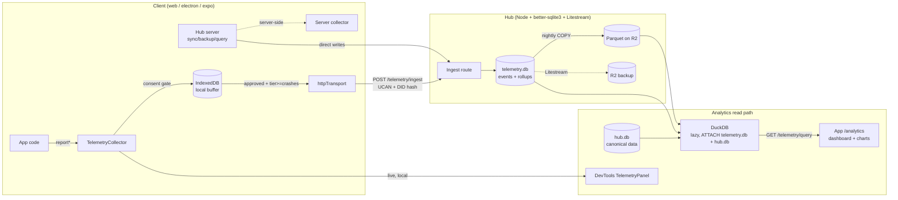
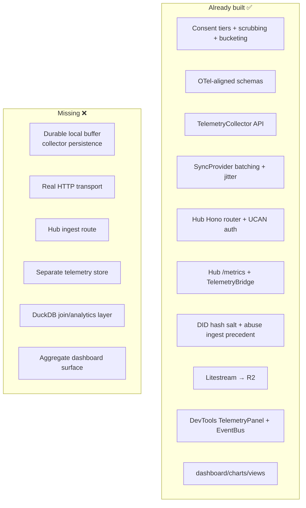
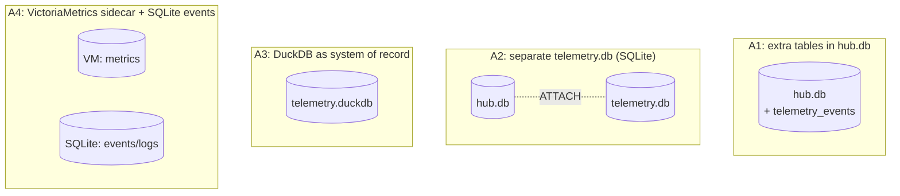
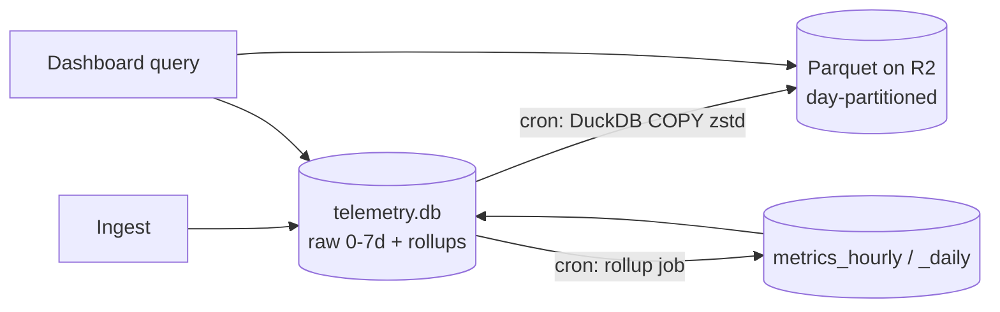
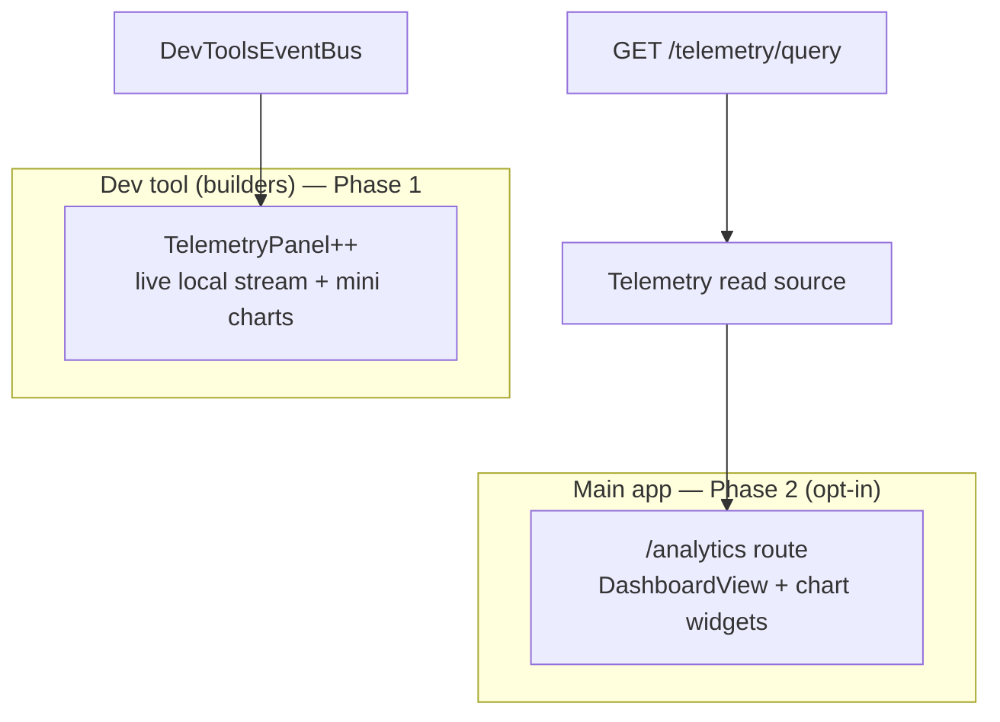
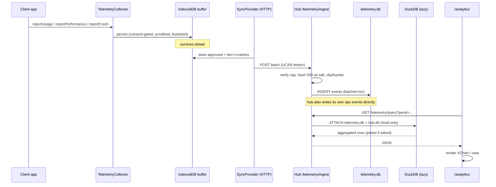

# Hub-Hosted Telemetry: Central Store, Logging, and Analytics Dashboard

> Status: exploration / not yet implemented
> Date: 2026-06-15
> Related: [[0177_DATA_BACKEND_TIERING_AND_COLD_STORAGE_ECONOMICS]],
> [[0178_COST_EFFICIENT_SQLITE_HOSTING_NO_LIBSQL_MIGRATION]],
> [[0162 dashboard builder]], [[0182_USEQUERY_USEMUTATE_PERFORMANCE_FRONTIER]],
> the existing `@xnetjs/telemetry` package, and `@xnetjs/devtools`.

## Problem Statement

xNet already has a privacy-first, opt-in, consent-tiered telemetry **client**
(`@xnetjs/telemetry`) and a developer panel that visualizes it locally
(`@xnetjs/devtools`). But the loop is **not closed**: nothing is durably
persisted, nothing is sent over the network, and there is no central place to
ask questions like "how are people actually using the editor?", "which queries
are slow on real devices?", "is the hub healthy?", or "what errored last night?"

We want to:

1. **Collect** three classes of signal — (a) client-side product analytics /
   usage, (b) client + server **performance** traces, and (c) server-side
   **operational logs and metrics** from the hub itself (sync, backup, query,
   rate-limit, federation).
2. **Store** all of it centrally on the **hub**, in a store that is
   *separate from the main app SQLite database* so the two never compete for the
   write lock or pollute each other — but still **joinable** with canonical xNet
   data when we want to (e.g. "events per space", "errors by hub plan tier").
3. **Visualize** it in a real analytics / logging / debugging dashboard that can
   live in the **dev tool** (for builders) and optionally be promoted into the
   **main app** (since xNet is local-first and developer-first), reusing the
   existing `dashboard` / `charts` / `views` infrastructure rather than bolting
   on a second charting stack.
4. Do all of this **without bloating** the main app for users who don't want it,
   and **without compromising** the privacy guarantees the telemetry package was
   designed around.

The user's intuition — a dedicated, possibly time-series-shaped store, separate
from `hub.db`, occasionally joinable, feeding one central dashboard — is
essentially correct. This document grounds that intuition in the code that
exists today and recommends a concrete, staged path.

## Executive Summary

- **~70% of the client is already built.** `@xnetjs/telemetry` has consent
  tiers, PII scrubbing, k-anonymity bucketing, OTel-aligned schemas, a
  `TelemetryCollector`, a `TelemetrySyncProvider`, and React hooks. The hub has a
  Hono router, UCAN auth, a `/metrics` Prometheus endpoint, a (disabled)
  `TelemetryBridge`, and an **existing server-side telemetry ingest precedent**
  (abuse / remote-mutation rejection reporting). `@xnetjs/devtools` already has a
  `TelemetryPanel`. The missing pieces are the **transport, the hub store, the
  ingest endpoint, and the aggregate dashboard.**
- **Two real gaps block everything:** (1) `TelemetryCollector` keeps records in
  an **in-memory array** — nothing survives a reload; (2) `TelemetrySyncProvider`
  has a **no-op transport** — nothing leaves the device. Both are small, isolated
  changes.
- **Recommended store: a dedicated `telemetry.db` SQLite file on the hub** (not a
  new database engine, not in `hub.db`), with OTel-aligned wide-event tables +
  rollup tables, replicated to R2 by the **same Litestream** setup already in
  place. This is the lowest-friction option, keeps writes off the main DB's lock,
  and gives an independent retention/backup policy.
- **Recommended analytics/join engine: DuckDB, lazily, on demand.** DuckDB's
  bundled `sqlite` extension can `ATTACH` both `telemetry.db` and `hub.db` and
  JOIN across them in one SQL statement — this is the exact answer to "join
  telemetry with canonical xNet data." Spin it up per query, cap memory, tear it
  down. DuckDB also doubles as the **Parquet exporter** for a cold tier on R2.
- **Recommended dashboard placement: dev tool first, app second.** Phase 1
  enriches the existing `devtools` `TelemetryPanel` into a real local analytics
  surface (zero app bloat). Phase 2 adds an opt-in, capability-gated `/analytics`
  route in `apps/web` that reuses `@xnetjs/dashboard` + `@xnetjs/charts` and reads
  aggregates from the hub. Telemetry rows are **not** modeled as graph nodes
  (too heavy); instead a read-only "telemetry source" adapter lets the existing
  charts/views render them.
- **First instrumentation is cheap and high-value:** persist the collector,
  ship a real HTTP transport, add the hub ingest route + store, flip the
  `TelemetryBridge` on for hub ops metrics, and add ~10 well-chosen client spans
  (app startup, first query, editor save, sync round-trip). That alone produces a
  useful dashboard.



## Current State In The Repository

### The telemetry client already exists and is well-designed

`packages/telemetry/` (`@xnetjs/telemetry`, "Privacy-preserving telemetry and
consent for xNet") is layered into consent / collection / schemas / hooks / sync:

- **Consent** — `src/consent/manager.ts`, `src/consent/types.ts`,
  `src/consent/storage.ts`. A 5-level progressive opt-in tier:
  `off → local → crashes → anonymous → identified`. `DEFAULT_CONSENT` is
  `{ tier: 'off', reviewBeforeSend: true, autoScrub: true, enabledSchemas: [] }`
  — i.e. **collect nothing, share nothing** until the user opts in.
  `ConsentManager` is an event emitter (`tier-changed`, `consent-changed`) with
  pluggable storage (`MemoryConsentStorage`, `LocalStorageConsentStorage`, key
  `xnet:telemetry:consent`).
- **Collection** — `src/collection/collector.ts` (`TelemetryCollector`),
  `scrubbing.ts` (paths/emails/IPs/URLs + always-on UUID/DID/token redaction),
  `bucketing.ts` (count/latency/size/score k-anonymity buckets), `timing.ts`
  (jittered scheduling).
- **Schemas** — `src/schemas/*.ts`, OTel-aligned: `CrashReport`
  (`exceptionType/Message/Stacktrace`, `codeNamespace`, `osType`), `UsageMetric`
  (`metricName`, `metricBucket`, `period`), `PerformanceMetric` (`metricName`,
  `durationBucket`, `codeNamespace`), `SecurityEvent` (`eventName`,
  `eventSeverity`, `peerIdHash`, `actionTaken`). IRIs like
  `xnet://xnet.fyi/telemetry/CrashReport`.
- **React** — `src/hooks/` — `TelemetryProvider`, `useConsent`, `useTelemetry`,
  `TelemetryErrorBoundary`.
- **Sync** — `src/sync/provider.ts` (`TelemetrySyncProvider`) and
  `src/sync/protocol.ts` (protocol `/xnet/telemetry/1.0.0`, `TelemetryBatch`).

**Gap 1 — collection is in-memory only.** `TelemetryCollector` stores into a
plain field:

```ts
// packages/telemetry/src/collection/collector.ts:45
private records: TelemetryRecord[] = []
```

Nothing is persisted; a reload loses everything. There is no `NodeStore` /
SQLite / IndexedDB backing.

**Gap 2 — the transport is a stub.** `TelemetrySyncProvider` is push-only,
consent-gated (`tier >= 'crashes'`), batches (default 100), jitters timing —
but actually sends nowhere:

```ts
// packages/telemetry/src/sync/provider.ts:170
private async send(aggregator: string, batch: TelemetryBatch) {
  if (this.config.transport) return this.config.transport(aggregator, batch)
  // Default: no-op placeholder. Real implementation would use libp2p or HTTP.
  return { accepted: true, processed: batch.records.length }
}
```

So the data model and privacy machinery are done; **the wire and the server are
not.**

### The hub can host an ingest endpoint and a second database today

`packages/hub/` (`@xnetjs/hub`, "signaling, sync relay, backup, and query
server") is a **Hono** app (`src/server.ts`) over `@hono/node-server` plus a `ws`
WebSocket layer. Routes are created by factories and mounted in `server.ts`:
`createBackupRoutes`, `createFileRoutes`, `createSchemaRoutes`,
`createDiscoveryRoutes`, `createFederationRoutes`, `createShardRoutes`,
`createCrawlRoutes`, `createShareLinkRoutes`, `createTaskRoutes`. Adding
`createTelemetryRoutes` is the established pattern.

- **Storage** — `src/storage/sqlite.ts` uses `better-sqlite3` v11 in WAL mode;
  the DB lives at `${HUB_DATA_DIR}/hub.db`. Schema is inline `CREATE TABLE IF NOT
  EXISTS` SQL (no migration framework). The `HubStorage` interface
  (`src/storage/interface.ts`) is the trait every route uses.
- **Auth** — `src/auth/ucan.ts` verifies UCAN bearer tokens (HTTP
  `Authorization: Bearer`, WS `Sec-WebSocket-Protocol: xnet-auth.<token>`).
  Sessions carry `{ did, capabilities }`; `auth.can('files/write', '*')`-style
  checks gate routes. With `--no-auth`, requests become
  `did:key:anonymous` with wildcard caps.
- **A telemetry hash salt already exists.** `config.telemetryPeerHashSalt`
  (`src/types.ts`, env `HUB_TELEMETRY_SALT`) is used to hash peer DIDs for abuse
  reporting — exactly the primitive we need to keep "anonymous" tier anonymous.
- **A server-side ingest precedent already exists.**
  `src/services/remote-mutation-telemetry.ts` reports rejected remote writes via
  `reportRemoteMutationRejection()` (`@xnetjs/abuse`) **without leaking the actor
  DID** — proof the pattern works server-side.
- **The hub already emits the metrics we want.** `GET /metrics` returns
  Prometheus text (`HUB_METRICS` in `src/metrics.ts`):
  `xnet_hub_ws_connections_total/_active`, `..._messages_received/sent/rejected`,
  `..._sync_docs_hot/_warm`, `..._sync_persists_total`,
  `..._backup_uploads_total/_bytes_stored`,
  `..._query_requests_total`, `..._query_duration_ms_{sum,count}`,
  `..._rate_limit_rejections`.
- **The bridge to telemetry exists but is off.**
  `src/middleware/telemetry-bridge.ts` (`TelemetryBridge`) parses
  `/metrics` text and calls `telemetry.reportUsage/.reportPerformance/
  .reportSecurityEvent` every 60s — but `enabled: false` by default and it feeds
  an **in-memory** collector that goes nowhere.
- **Litestream is wired** (`src/storage/litestream.ts`, `Dockerfile`,
  `litestream-entrypoint.sh`): WAL replication of `hub.db` to R2, with
  `wal_autocheckpoint=0` when `LITESTREAM=1`. A second SQLite file in the same
  `HUB_DATA_DIR` can be added to the Litestream config for free.
- **Deploy** — `node:22-alpine` Docker image, Railway via `railway.toml`, volume
  at `/data`. Demo mode applies quotas/eviction. No hard CPU/RAM limits in code,
  but realistically a small (256MB–1GB) container.

### The visualization stack already exists

- **DevTools** — `packages/devtools/` mounts `<XNetDevToolsProvider>` around the
  whole app (`apps/web/src/App.tsx`), with a panel `Shell.tsx` and a registry of
  panels (Nodes, Changes, Sync, Yjs, AuthZ, Abuse, Queries, **Telemetry**,
  Schemas, SQLite, …). `src/instrumentation/telemetry.ts` already turns collector
  activity into a `DevToolsEventBus` stream (`telemetry:crash`,
  `telemetry:usage`, `telemetry:performance`, `telemetry:security`,
  `telemetry:consent-change`, `telemetry:peer-scores`). There is already a
  `TelemetryPanel`.
- **Dashboard / charts / views** — `@xnetjs/dashboard` has a widget contract
  (`WidgetDefinition`, `useWidgetData`, gridstack layout) with built-ins
  including a **chart widget** over `@xnetjs/charts` (`XChart`, `ChartSpec`:
  `kind: bar|line|area|pie`, `aggregate: count|sum|avg|min|max`). `@xnetjs/views`
  is a schema-aware view registry (table/board/gallery/timeline/calendar).
- **App surfaces** — `apps/web` uses TanStack file routes (`routes/data.tsx →
  DataWorkspaceView`, `routes/dashboard.$dashboardId.tsx → DashboardView`). A new
  `routes/analytics.tsx` is the natural home for an app-level surface.
- **Query path** — `@xnetjs/react` `useQuery` / `useSavedView` read through the
  `DataBridge` (off-main-thread worker runtime). Widgets get data by executing a
  `SavedViewDescriptor`. This matters: it means today's widgets read **graph
  nodes**, so telemetry needs either a synthetic schema/source adapter or a
  dedicated telemetry widget set (see Options).



## External Research

A dedicated research pass (full sources in **References**) compared embedded /
lightweight stores for high-volume time-series telemetry on a small Node.js
container (256MB–1GB) that already runs `better-sqlite3` + Litestream → R2.

- **SQLite as a time-series store** is viable for our scale. WAL +
  `synchronous=NORMAL` (already `better-sqlite3`'s default) + batched
  transactions sustains ~50k–100k rows/sec on NVMe for a single writer; on
  Railway/Fly SSD expect the lower half. Pattern: append-only `events(ts, kind,
  body)` table, partial index on a hot window, materialized **rollup tables**
  (hourly/daily) maintained by a cron job, retention that exports raw rows to
  Parquet after 3–7 days. No first-class TS extension; you hand-roll
  partitioning. Weakness: no columnar compression, so wide scans over 100M rows
  are slow. **Verdict: best zero-friction hot store for ≤~5k events/sec.**
- **DuckDB (`@duckdb/node-api`)** is the strongest *analytical* layer and the
  only embedded option that JOINs across engines: its bundled `sqlite` extension
  `ATTACH`es a SQLite file and lets you `SELECT … FROM telemetry.events JOIN
  app.users …` in one statement (read-only while better-sqlite3 holds the write
  lock — safe). Columnar storage gives 3–10× compression. Batched/Appender ingest
  ~50–100k rows/sec; single-row insert is slow (batch it). Must cap
  `memory_limit`/`threads` in a small container. **Cannot be Litestream-replicated
  (own binary format)** — so use it as a *query/ETL* engine over SQLite + Parquet,
  not as the system of record. **Verdict: lazy on-demand analytics + Parquet
  exporter.**
- **chDB (embedded ClickHouse)** Node bindings are immature (stale npm, low
  adoption, in-process crash risk); full ClickHouse server needs ~1–2GB idle
  (SigNoz standalone documents 1.5–2GB). **Verdict: overkill / not
  Node-production-ready for a small hub.**
- **Prometheus / VictoriaMetrics** are for *numeric metric series only*, not
  high-cardinality events/logs and no SQL joins. VictoriaMetrics single binary is
  tiny (50–200MB RAM) and is the right home for **infra metrics** if we want
  PromQL + Grafana — but it can't replace an event/log store. The metrics-vs-events
  line matters: counters/histograms → VM; logs/traces/analytics events →
  SQLite/DuckDB/Parquet. **Verdict: optional sidecar for ops metrics only.**
- **OpenTelemetry** — align schema attribute names with OTel semantic
  conventions (`service.name`, `service.version`, `trace_id`, `span_id`,
  `http.request.method`, severity) now; it's free and preserves a future
  migration to SigNoz/Uptrace/Honeycomb/Grafana as a *translation*, not a
  redesign. Our schemas are already "OTel-aligned." A community `duckdb-otlp`
  extension can even receive OTLP straight into DuckDB.
- **Parquet on R2 (cold tier)** is the natural archive: DuckDB `COPY … TO
  's3://…' (FORMAT parquet, COMPRESSION zstd)`, then `read_parquet('s3://…')`
  with predicate pushdown + metadata caching. ~$0.015/GB/mo vs $0.40–$3.00/GB on
  observability SaaS. **Verdict: mandatory cold tier, zero new infra.**
- **SaaS (Grafana Cloud / Axiom / Honeycomb / Tinybird / Sentry)** — great DX,
  but cost scales non-linearly with cardinality and means shipping user telemetry
  off-network — antithetical to xNet's self-hosted, privacy-first stance. Useful
  only as an *optional export target* a hub operator can opt into.

### Recommendation matrix (from research)

| Option | RAM | Write tput | Analytics | JOIN w/ SQLite | Ops | Verdict for a small hub |
|---|---|---|---|---|---|---|
| **SQLite (WAL + rollups)** | ~0 (in-proc) | 50–100k/s batched | weak (row scan) | **native** | none | **Hot store** |
| **DuckDB** (`@duckdb/node-api`) | 128–512MB | 50–100k/s (Appender) | **excellent** | **ATTACH (RO)** | low | **Lazy analytics + Parquet ETL** |
| chDB (Node) | 64–300MB | untested | excellent | no | med | Not Node-ready (2026) |
| VictoriaMetrics | 50–200MB | 500k+/s | PromQL only | no | low | Optional infra-metrics sidecar |
| Prometheus | 1–8GB | ~200k/s | PromQL only | no | med | Too heavy |
| OTel Collector | 50–80MB | passthrough | none (routes) | no | low | Optional fan-out, not a store |
| **Parquet on R2** | ~0 | batch | excellent (via DuckDB) | via DuckDB | low | **Cold tier** |
| ClickHouse server | 1–2GB | 1M+/s | best-in-class | no | high | Overkill |
| SaaS | n/a | n/a | excellent | no | none | Cost/lock-in; optional export |

## Key Findings

1. **This is a "close the loop" project, not a greenfield one.** The privacy
   model, schemas, consent, scrubbing, bucketing, devtools panel, hub router,
   auth, salt, metrics, and Litestream are all present. We are filling four
   well-defined holes: persist, transport, ingest+store, aggregate-view.
2. **Telemetry is not graph data.** High-volume, append-only, immutable,
   privacy-bucketed events are a *bad* fit for the CRDT/`NodeStore` graph (per-node
   sync, signatures, Yjs overhead). Keep telemetry out of `hub.db`'s node tables
   and out of the client node graph; expose it to the existing UI through a
   read-only adapter instead. This directly serves "separate from the main DB so
   they don't compete and the main DB stays clean."
3. **"Joinable sometimes" ≠ "same database."** The cleanest way to keep them
   separate *and* joinable is DuckDB `ATTACH` of two SQLite files. We get
   isolation by default and joins on demand — no schema entanglement.
4. **There are three producers, not one.** (a) client apps (web/electron/expo),
   (b) the hub's own server runtime (logs/metrics), (c) possibly *other* hubs via
   federation. The client uses `TelemetryCollector` + transport; the hub writes
   to `telemetry.db` directly (and via the now-enabled `TelemetryBridge`). A
   uniform ingest schema lets all three land in one store.
5. **Anonymity has to be enforced server-side, not just client-side.** Even at
   `anonymous` tier, the ingest route must hash any DID with
   `telemetryPeerHashSalt`, reject over-detailed payloads, and bucket/clip on the
   way in — defense in depth around the client scrubber.
6. **Dashboard placement is a bloat question with a clean answer.** Builders get
   it in the dev tool by default (no app-bundle cost for normal users); the app
   surface is a separate, lazy-loaded, capability-gated route. Reusing
   `dashboard`/`charts`/`views` avoids a second visualization stack.

## Options And Tradeoffs

### A. Where does telemetry live on the hub?



| Option | Pros | Cons |
|---|---|---|
| **A1 — extra tables in `hub.db`** | simplest; joins are trivial; one Litestream stream | telemetry writes contend with app writes on the single WAL writer; retention/VACUUM churn pollutes the main DB; "stays clean" goal violated |
| **A2 — separate `telemetry.db` (SQLite)** ✅ | isolation (own WAL, own retention/backup), no lock contention; **still joinable via DuckDB ATTACH**; same Litestream; zero new deps | two files to manage; cross-DB joins go through DuckDB, not inline SQL |
| **A3 — DuckDB as the store** | best analytics, compression | not Litestream-replicable; weak concurrent OLTP writes; single-writer file-lock fights the ingest path |
| **A4 — VictoriaMetrics + SQLite split** | best-in-class metrics; PromQL/Grafana | two stores, two query languages; no joins to app data for the metrics half; more ops |

**Pick A2.** It is the literal implementation of the user's instinct: a separate
database that doesn't compete with the main one, yet can be joined when needed.
DuckDB (Option for the read path, below) provides the joins and the columnar
analytics without becoming the system of record.

### B. Hot/warm/cold tiering

`telemetry.db` is the **hot** store (raw events, last 3–7 days + rollups).
A nightly job uses an ephemeral in-memory DuckDB to `COPY` aged-out raw rows to
**cold** Parquet on R2 (hive-partitioned by day), then `DELETE`s them from
SQLite. Rollup tables (hourly/daily aggregates) stay in SQLite indefinitely —
they're tiny. Dashboard queries spanning >7 days fan out: SQLite (hot) `UNION`
Parquet-via-DuckDB (cold).



### C. How does it leave the device? (transport)

| Option | Pros | Cons |
|---|---|---|
| **HTTP POST `/telemetry/ingest`** ✅ | matches every other hub route; batch-friendly; trivial to auth with UCAN; easy `navigator.sendBeacon` on unload | request/response, not streaming |
| WebSocket message | reuses the open sync socket; streaming | more complex; ordering/backpressure; overkill for 5-min batches |
| libp2p protocol (`/xnet/telemetry/1.0.0`) | decentralized; many aggregators | heaviest; the protocol const exists but no impl; defer |

**Pick HTTP** for v1; keep the `transport` function pluggable so libp2p can slot
in later. The `TelemetrySyncProvider.transport` hook already makes this a
one-function change on the client.

### D. How does the dashboard read aggregates? (query path)

| Option | Pros | Cons |
|---|---|---|
| **DuckDB lazy, `ATTACH` telemetry.db + hub.db** ✅ | columnar speed; joins to canonical data; reads Parquet cold tier too; tear down after query | adds `@duckdb/node-api` dep; must cap memory; cold-start per query |
| Plain SQLite aggregate queries over rollups | no new dep; fine for pre-rolled metrics | slow on raw wide scans; no cross-DB joins; no Parquet |
| Pre-compute everything into rollups, serve JSON | cheapest reads | inflexible; every new question needs a new rollup |

**Pick DuckDB for ad-hoc/joined/cold queries, SQLite rollups for the common
pre-aggregated panels.** Hybrid: cheap panels hit rollups directly; "slice by
X joined with Y" and historical queries spin up DuckDB.

### E. Where does the dashboard live? (and how to model the data for the UI)



- **Phase 1 — dev tool.** Enrich the existing `TelemetryPanel`: live event
  stream (already there) + small `@xnetjs/charts` panels for local
  counts/latency. Zero app-bundle cost. Builders get value immediately.
- **Phase 2 — app `/analytics`.** Lazy-loaded, **capability/flag-gated** route so
  it doesn't bloat the default app. Reuses `DashboardView` + chart widgets.

  The wrinkle: today's widgets read **graph nodes** via `SavedViewDescriptor`
  over the `DataBridge`. Two ways to feed them telemetry:
  - **E1 — synthetic "telemetry source" adapter** (recommended): register a
    read-only source the existing charts/views can query, backed by
    `GET /telemetry/query`. Telemetry never becomes a node; the UI stays generic.
  - **E2 — dedicated telemetry widgets** that call the hub directly and render
    `XChart` themselves, bypassing the node query layer. Simpler to ship, but a
    parallel data path.

  Start with **E2** (fast, isolated), graduate hot paths to **E1** once the
  source adapter is worth the investment. Either way, **do not** materialize
  telemetry as graph nodes.

### F. Aligning with OpenTelemetry

Keep extending the existing OTel-aligned naming. Store a wide event row with
OTel-ish columns (`service_name`, `service_version`, `severity`, `trace_id`,
`span_id`, `kind`, `name`, `attributes` JSON). This costs nothing now and means a
future "export to SigNoz/Grafana/OTLP" is a column mapping, not a rewrite. The
`duckdb-otlp` extension is a bonus path if we ever want to ingest raw OTLP.

## Recommendation

Build **"Hub Telemetry"** in four staged slices. Each slice is independently
useful and shippable.



1. **Slice 1 — Persist + transport (client).** Add a durable buffer to
   `TelemetryCollector` (IndexedDB on web, SQLite on electron/expo) and a real
   `httpTransport` for `TelemetrySyncProvider`. Wire both in `apps/*`. *Now data
   survives reloads and can leave the device.*
2. **Slice 2 — Hub ingest + `telemetry.db` (server).** Add a separate
   `telemetry.db` (SQLite, WAL), a `TelemetryStore` (its own small interface, not
   bolted onto `HubStorage`), and `createTelemetryRoutes` with
   `POST /telemetry/ingest` (UCAN cap `telemetry/ingest`, DID-hash via salt,
   server-side clip/bucket). Add `telemetry.db` to the Litestream config. Flip
   `TelemetryBridge` `enabled: true` and point it at a server-side collector that
   writes to the store, so the hub records its **own** ops metrics. *Now there is
   a central store with three producers.*
3. **Slice 3 — Analytics read + dashboard.** Add `GET /telemetry/query` backed by
   SQLite rollups (cheap panels) + lazy DuckDB (`ATTACH telemetry.db` + `hub.db`
   for joins, `read_parquet` for cold). Enrich the devtools `TelemetryPanel`
   (Phase 1). Add a flag-gated `apps/web/src/routes/analytics.tsx` using chart
   widgets (Phase 2, E2). *Now you can see it.*
4. **Slice 4 — Tiering + retention.** Nightly DuckDB → Parquet on R2 + delete
   aged raw rows; rollup cron; documented retention windows per tier. *Now it
   scales and stays cheap.*

**Net resource cost on the hub:** one extra SQLite file (Litestream already
handles it), `@duckdb/node-api` invoked lazily with `memory_limit='128–256MB',
threads=1` and torn down per query, and a couple of cron timers. Fits the
256MB–1GB envelope.

**Privacy posture is preserved:** default tier stays `off`; only
`crashes`/`anonymous`/`identified` ever transmit; the hub re-hashes DIDs and
re-clips payloads; `identified` (stable DID for beta testers) is the *only* tier
that is not anonymous and must be visibly labeled in the consent UI.

## Example Code

### 1. Real HTTP transport for the client (closes Gap 2)

```ts
// packages/telemetry/src/sync/http-transport.ts
import type { TelemetryBatch, AggregatorResponse } from './protocol'

export interface HttpTransportOptions {
  /** Hub base URL, e.g. https://hub.xnet.fyi */
  endpoint: string
  /** Returns a fresh UCAN bearer for the telemetry/ingest capability. */
  getAuthToken?: () => Promise<string | null>
  fetchImpl?: typeof fetch
}

export function createHttpTransport(opts: HttpTransportOptions) {
  const doFetch = opts.fetchImpl ?? fetch
  return async (_aggregator: string, batch: TelemetryBatch): Promise<AggregatorResponse> => {
    const token = (await opts.getAuthToken?.()) ?? null
    const res = await doFetch(`${opts.endpoint}/telemetry/ingest`, {
      method: 'POST',
      headers: {
        'content-type': 'application/json',
        ...(token ? { authorization: `Bearer ${token}` } : {})
      },
      body: JSON.stringify(batch),
      keepalive: true // lets it flush during page unload
    })
    if (!res.ok) return { accepted: false, processed: 0, error: `http_${res.status}` }
    return (await res.json()) as AggregatorResponse
  }
}

// wiring (e.g. apps/web bootstrap):
// new TelemetrySyncProvider(
//   { aggregators: [hubUrl], transport: createHttpTransport({ endpoint: hubUrl, getAuthToken }) },
//   consent, () => collector.getLocalTelemetry(), (ids) => collector.markShared(ids)
// )
```

### 2. Durable local buffer (closes Gap 1)

```ts
// packages/telemetry/src/collection/persistence.ts
export interface TelemetryBufferStore {
  append(record: TelemetryRecord): Promise<void> | void
  all(): Promise<TelemetryRecord[]> | TelemetryRecord[]
  setStatus(ids: string[], status: TelemetryRecord['status']): Promise<void> | void
  prune(keepMs: number): Promise<void> | void // drop shared/dismissed older than keepMs
}

// Web: IndexedDB object store keyed by id, index on (status, createdAt).
// Electron/Expo: a tiny `telemetry-buffer` SQLite table (reuse @xnetjs/sqlite).
// TelemetryCollector takes an optional `buffer?: TelemetryBufferStore`;
// when present, report() writes through to it instead of the in-memory array,
// so records survive reloads and the SyncProvider drains from durable storage.
```

### 3. Hub store schema (separate `telemetry.db`, OTel-aligned)

```sql
-- packages/hub/src/telemetry/schema.sql  (its own DB file, WAL mode)
CREATE TABLE IF NOT EXISTS telemetry_events (
  id            INTEGER PRIMARY KEY AUTOINCREMENT,
  ts            INTEGER NOT NULL,          -- bucketed client/server ms
  received_at   INTEGER NOT NULL,          -- server clock
  producer      TEXT NOT NULL,             -- 'client' | 'hub' | 'federation'
  did_hash      TEXT,                      -- sha256(did + salt), NULL when anonymous
  service_name  TEXT,                      -- OTel: service.name
  service_version TEXT,                    -- OTel: service.version
  os_type       TEXT,
  schema_id     TEXT NOT NULL,             -- xnet://.../telemetry/UsageMetric ...
  kind          TEXT NOT NULL,             -- 'usage'|'performance'|'crash'|'security'|'log'
  name          TEXT,                      -- metricName / eventName
  severity      TEXT,                      -- OTel severity for logs/security
  value_bucket  TEXT,                      -- '1-5','<10ms', etc. (already bucketed)
  trace_id      TEXT, span_id TEXT,        -- OTel trace correlation (optional)
  attributes    TEXT                       -- JSON, scrubbed + clipped
);
CREATE INDEX IF NOT EXISTS idx_tel_ts   ON telemetry_events(ts);
CREATE INDEX IF NOT EXISTS idx_tel_kind ON telemetry_events(kind, ts);
CREATE INDEX IF NOT EXISTS idx_tel_name ON telemetry_events(name, ts);

-- rollups (cheap dashboard panels; kept indefinitely)
CREATE TABLE IF NOT EXISTS metrics_hourly (
  bucket INTEGER NOT NULL, kind TEXT NOT NULL, name TEXT NOT NULL,
  cnt INTEGER NOT NULL, value_buckets TEXT,        -- JSON histogram of value_bucket
  PRIMARY KEY (bucket, kind, name)
);
```

### 4. Hub ingest route (matches existing route-factory pattern)

```ts
// packages/hub/src/routes/telemetry.ts
import { Hono } from 'hono'
import { createHash } from 'node:crypto'
import type { TelemetryStore } from '../telemetry/store'
import type { Env } from '../server'

const MAX_BATCH = 500
const hashDid = (did: string, salt: string) =>
  createHash('sha256').update(`${did}:${salt}`).digest('base64url')

export function createTelemetryRoutes(store: TelemetryStore, salt: string): Hono<Env> {
  const app = new Hono<Env>()

  app.post('/ingest', async (c) => {
    const auth = c.get('auth')
    if (!auth.can('telemetry/ingest', '*')) return c.json({ error: 'forbidden' }, 403)

    const batch = await c.req.json().catch(() => null)
    if (!batch?.records?.length) return c.json({ accepted: false, processed: 0 }, 400)

    const records = batch.records.slice(0, MAX_BATCH)
    const didHash = auth.did && auth.did !== 'did:key:anonymous'
      ? hashDid(auth.did, salt) // anonymize even at 'identified': dashboard sees a hash
      : null

    const rows = records.map((r: any) => ({
      ts: Number(r.createdAt) || Date.now(),
      receivedAt: Date.now(),
      producer: 'client' as const,
      didHash,
      schemaId: String(r.schemaId).slice(0, 256),
      kind: classifyKind(r.schemaId),
      name: clip(r.data?.metricName ?? r.data?.eventName, 128),
      severity: clip(r.data?.eventSeverity, 16),
      valueBucket: clip(r.data?.metricBucket ?? r.data?.durationBucket, 32),
      attributes: clipJson(r.data, 2_000) // server-side defense-in-depth clip
    }))

    const processed = store.appendBatch(rows) // single batched txn
    return c.json({ accepted: true, processed })
  })

  return app
}
// mounted in server.ts:  app.route('/telemetry', createTelemetryRoutes(telemetryStore, config.telemetryPeerHashSalt))
```

### 5. Lazy DuckDB analytics that JOINs telemetry with canonical xNet data

```ts
// packages/hub/src/telemetry/analytics.ts
import { DuckDBInstance } from '@duckdb/node-api'

/** Spin up DuckDB, attach both SQLite files read-only, run one query, tear down. */
export async function runTelemetryQuery(
  sql: string,
  paths: { telemetryDb: string; hubDb: string }
): Promise<unknown[]> {
  const instance = await DuckDBInstance.create(':memory:', {
    memory_limit: '256MB',
    threads: '1'
  })
  const conn = await instance.connect()
  try {
    await conn.run(`INSTALL sqlite; LOAD sqlite;`)
    await conn.run(`ATTACH '${paths.telemetryDb}' AS tel (TYPE sqlite, READ_ONLY);`)
    await conn.run(`ATTACH '${paths.hubDb}'      AS app (TYPE sqlite, READ_ONLY);`)
    const reader = await conn.runAndReadAll(sql)
    return reader.getRowObjects()
  } finally {
    conn.closeSync()
  }
}

// Example: usage events per space, last 7 days — telemetry JOINed to canonical data.
// SELECT app.doc_meta.title AS space, count(*) AS events
// FROM tel.telemetry_events e
// JOIN app.node_container nc ON nc.node_id = e.attributes ->> '$.spaceId'
// JOIN app.doc_meta ON app.doc_meta.doc_id = nc.container_id
// WHERE e.kind = 'usage' AND e.ts > epoch_ms(now()) - INTERVAL 7 DAYS
// GROUP BY 1 ORDER BY 2 DESC;
```

### 6. Nightly cold-tier export to Parquet on R2

```ts
// packages/hub/src/telemetry/tiering.ts  (runs from a cron timer)
export async function exportColdTier(instance: DuckDBInstance, telemetryDb: string) {
  const conn = await instance.connect()
  await conn.run(`INSTALL sqlite; LOAD sqlite; INSTALL httpfs; LOAD httpfs;`)
  await conn.run(`ATTACH '${telemetryDb}' AS tel (TYPE sqlite);`) // read-write for DELETE
  await conn.run(`
    COPY (SELECT * FROM tel.telemetry_events WHERE ts < epoch_ms(now()) - INTERVAL 7 DAYS)
    TO 's3://xnet-telemetry/events' (FORMAT parquet, COMPRESSION zstd, PARTITION_BY (kind));`)
  await conn.run(`DELETE FROM tel.telemetry_events WHERE ts < epoch_ms(now()) - INTERVAL 7 DAYS;`)
  conn.closeSync()
}
```

### 7. First client instrumentation (the high-value spans)

```ts
// already supported by useTelemetry(); add ~10 calls:
const t = useTelemetry({ minTier: 'anonymous' })
t.reportPerformance('app.startup', perfNow() - bootStart, 'renderer')   // cold start
t.reportPerformance('query.first_paint', dt, 'data')                    // first useQuery
t.reportUsage('editor.save', 1)                                         // editor commit
t.reportPerformance('sync.round_trip', rttMs, 'sync')                   // hub round-trip
t.reportUsage('view.opened', 1)                                         // surface opened (name in attrs)
// crashes: <TelemetryErrorBoundary> already reports via reportCrash on throw
```

## Risks And Open Questions

- **Consent honesty.** `apps/electron/src/renderer/main.tsx` currently forces
  `setTier('anonymous')` "for devtools visibility." That is fine in dev but must
  never ship as a default — production default stays `off`, and a real consent UI
  must gate the first transmission. *Open: where does the consent prompt live in
  the onboarding flow?*
- **Re-identification risk.** Even bucketed, anonymous events can correlate
  (timing + os_type + version + rare metric values). Mitigations: coarse time
  buckets, drop ultra-rare metric names, never store raw IPs (don't log
  `c.req` remote address into attributes), rotate the hash salt periodically
  (breaks long-term linkage but also breaks long-term per-user trends — *open
  tradeoff*).
- **Who can read the dashboard?** A central store of everyone's usage is
  sensitive. The `/analytics` surface and `GET /telemetry/query` must be gated to
  an operator/admin capability (or be self-only on a personal hub). *Open: do we
  expose per-user "your own telemetry" vs operator "aggregate"?*
- **Self-hosted vs managed.** On a personal single-user hub, "anonymous" is
  meaningless (one user) — telemetry is just personal observability, which is
  great. On a managed multi-tenant hub, anonymity actually matters. The ingest
  path must behave identically; the *dashboard scope* differs. *Open: does a
  managed fleet aggregate across hubs, and under what disclosure?*
- **DuckDB footprint.** Lazy + capped + torn-down should fit, but a heavy joined
  query under memory pressure could OOM a 256MB container. Need a query
  timeout/row cap and a `temp_directory` spill path; consider rejecting
  unbounded ad-hoc SQL (allowlist named panels) in v1.
- **better-sqlite3 vs DuckDB sqlite-extension in one process.** Both bundle their
  own SQLite copy; reads are safe, but DuckDB must `ATTACH … READ_ONLY` and never
  hold a write lock on a file the hub is actively writing (export job touches
  `telemetry.db` writably — schedule it to avoid ingest spikes, or pause ingest).
- **Schema migrations.** The hub has *no* migration framework (inline `CREATE
  TABLE IF NOT EXISTS`). A growing telemetry schema needs at least additive
  column migrations; decide now whether to introduce a tiny migration runner for
  `telemetry.db`.
- **Volume / cost on managed hubs.** High-traffic hubs could generate a lot of
  events. Rollups + 7-day raw retention + Parquet cold tier keep it bounded, but
  we need a per-hub ingest rate limit (reuse the existing rate-limit machinery)
  and a documented storage budget per plan tier.
- **Federation telemetry.** Should hubs forward aggregate telemetry to a parent?
  Out of scope for v1, but the `producer='federation'` column leaves room.

## Implementation Checklist

**Slice 1 — Persist + transport (client)**
- [x] Add `TelemetryBufferStore` interface + IndexedDB impl (web) in
      `packages/telemetry/src/collection/persistence.ts` (`MemoryTelemetryBuffer`,
      `IndexedDBTelemetryBuffer`, `createDefaultTelemetryBuffer`). A native
      SQLite-backed adapter for expo can be supplied later via the same interface.
- [x] Thread an optional `buffer` into `TelemetryCollector` with `hydrate()`,
      write-through status changes, and a new `markShared()`; the in-memory path
      stays the default/no-buffer fallback.
- [x] Add `createHttpTransport` in `packages/telemetry/src/sync/http-transport.ts`
      and export it.
- [x] Wire collector buffer + hydrate into `apps/electron`; gate the dev-only
      `setTier('anonymous')` behind `import.meta.env.DEV` (never a production
      default). `apps/web` sync-transport wiring lands with the dashboard (Slice 3);
      `apps/expo` deferred.
- [x] Unit tests: persistence round-trip, transport success/failure, collector
      buffer mirroring / hydrate / markShared, consent-gated drain.

**Slice 2 — Hub ingest + store**
- [x] `TelemetryStore` (`appendBatch`, rollups/`timeseries`/`kindCounts`/
      `topNames`, `recentEvents`, `pruneRaw`) over a **separate** `telemetry.db`
      (WAL) in `packages/hub/src/telemetry/store.ts` (schema inline, not a `.sql`
      file). Pure normalization helpers in `telemetry/normalize.ts`.
- [x] `createTelemetryRoutes` with `POST /telemetry/ingest`: `requireAuth` (any
      authenticated identity), DID hashing via `config.telemetryPeerHashSalt`,
      server-side clip/bucket, `MAX_BATCH` cap. (Per-route ingest rate-limit
      reuses the hub's existing limiter — tracked as a follow-up.)
- [x] Mount `/telemetry` in `server.ts`; add `telemetry/ingest` + `telemetry/read`
      to the capability grammar in `src/auth/capabilities.ts`.
- [x] Apply `wal_autocheckpoint=0` when `LITESTREAM=1` in the store (mirrors
      `src/storage/litestream.ts`) + restore `telemetry.db` in
      `litestream-entrypoint.sh`. (The operator's `litestream.yml` adds the
      second `dbs:` entry — external config.)
- [x] Server-side collector + `TelemetryBridge` `enabled: true` via
      `createHubTelemetry`, writing hub ops metrics (`producer='hub'`) into
      `telemetry.db`.
- [x] Integration test: client batch → ingest → row in `telemetry.db`, DID hashed,
      anonymous tier carries `did_hash = NULL`.

**Slice 3 — Analytics + dashboard**
- [x] `runTelemetryJoinQuery` (lazy, `ATTACH` both DBs read-only, memory-capped,
      torn down) in `src/telemetry/analytics.ts`. `@duckdb/node-api` is loaded as
      an **optional** dynamic import (not a hard dep — native + non-replicable),
      with `isDuckDbAvailable()` and a clear "not installed" error.
- [x] Rollups maintained **incrementally on ingest** (no cron needed) +
      admin-gated `GET /telemetry/summary` / `/rollups` / `/events` serving named
      panels from the rollup table. DuckDB escalation is the
      `runTelemetryJoinQuery` primitive (intentionally not arbitrary SQL over
      HTTP — risk note).
- [x] Phase 1: enriched `packages/devtools` `TelemetryPanel` with a **Usage**
      sub-tab (per-metric bucket histograms over the live local stream). Uses
      inline bars rather than adding `@xnetjs/charts` to devtools.
- [x] Phase 2: `apps/web/src/routes/analytics.tsx` (code-split route) + 
      `useTelemetryAnalytics` hook, flag-gated (`VITE_TELEMETRY_DASHBOARD`) and
      admin-gated server-side, E2 direct-fetch of hub rollups, lightweight inline
      bars (no charts dep → no app bloat).
- [ ] (Stretch) E1 read-only "telemetry source" adapter so `views`/dashboard
      widgets can render telemetry generically without making it graph nodes.

**Slice 4 — Tiering + retention**
- [ ] Nightly `exportColdTier` (DuckDB → Parquet on R2, day/kind-partitioned) +
      `DELETE` aged raw rows; schedule away from ingest peaks.
- [ ] Dashboard fan-out: hot SQLite `UNION` cold `read_parquet('s3://…')`.
- [ ] Document retention windows + per-plan ingest/storage budgets;
      reuse rate-limit machinery for per-hub ingest caps.

## Validation Checklist

- [ ] With consent `off`, **nothing** is buffered and **nothing** is POSTed
      (assert zero network calls + empty buffer).
- [ ] Flipping to `anonymous` starts transmitting; ingested rows have
      `did_hash = NULL`; PII (paths/emails/DIDs/tokens) is absent in both buffer
      and stored `attributes` (scrub + server clip verified).
- [ ] `identified` tier stores a stable `did_hash` and is clearly labeled in the
      consent UI as non-anonymous.
- [ ] A client reload preserves un-synced records (durable buffer works);
      `sendBeacon`/`keepalive` flushes a final batch on unload.
- [ ] `telemetry.db` is a **separate file**; hub app writes and telemetry writes
      do not contend (no `SQLITE_BUSY` under a load test hitting both).
- [ ] A DuckDB query `ATTACH`ing both DBs returns a correct telemetry⨝canonical
      join (e.g. events-per-space) within the memory cap and tears down (no
      leaked process RAM after N queries).
- [ ] `TelemetryBridge` enabled: hub ops metrics (`hub.ws.*`, `hub.sync.*`,
      `hub.query.duration`) appear as `producer='hub'` rows and render on the
      dashboard.
- [ ] Litestream replicates `telemetry.db` to R2 and restores it on a cold boot.
- [ ] Nightly export writes Parquet to R2, deletes aged raw rows, and a
      >7-day-range dashboard query correctly fans out hot+cold.
- [ ] `/analytics` is absent from the default app bundle path until the flag/cap
      is enabled (no bloat for normal users); devtools panel works with the app
      bundle unchanged.
- [ ] Load test: sustained client batches don't exceed the per-hub ingest rate
      limit and don't degrade sync/query latency (watch existing `/metrics`).

## References

**Repo (current state)**
- `packages/telemetry/src/collection/collector.ts` — in-memory `records` (Gap 1)
- `packages/telemetry/src/sync/provider.ts` / `sync/protocol.ts` — no-op transport (Gap 2)
- `packages/telemetry/src/consent/manager.ts`, `consent/types.ts` — tier model
- `packages/telemetry/src/schemas/*.ts` — OTel-aligned event schemas
- `packages/hub/src/server.ts`, `src/routes/*.ts` — Hono route-factory pattern
- `packages/hub/src/storage/sqlite.ts`, `storage/interface.ts` — better-sqlite3, WAL
- `packages/hub/src/storage/litestream.ts`, `Dockerfile`, `litestream-entrypoint.sh`
- `packages/hub/src/auth/ucan.ts`, `auth/capabilities.ts` — UCAN caps
- `packages/hub/src/types.ts`, `config.ts` — `telemetryPeerHashSalt` / `HUB_TELEMETRY_SALT`
- `packages/hub/src/services/remote-mutation-telemetry.ts` — server ingest precedent
- `packages/hub/src/metrics.ts`, `src/middleware/telemetry-bridge.ts` — Prometheus + bridge
- `packages/devtools/src/instrumentation/telemetry.ts`, `panels/TelemetryPanel/` — live panel
- `packages/dashboard/`, `packages/charts/` (`XChart`, `ChartSpec`), `packages/views/`
- `apps/web/src/routes/*.tsx`, `src/workbench/` — app surfaces

**External (storage / observability)**
- PowerSync — *SQLite Optimizations For Ultra High-Performance* — https://powersync.com/blog/sqlite-optimizations-for-ultra-high-performance
- Shivekkhurana — *SQLite in Production: a real-world benchmark* — https://shivekkhurana.com/blog/sqlite-in-production/
- better-sqlite3 performance docs — https://github.com/WiseLibs/better-sqlite3/blob/master/docs/performance.md
- `@duckdb/node-api` — https://www.npmjs.com/package/@duckdb/node-api ; Node "Neo" client — https://duckdb.org/docs/current/clients/node_neo/overview
- DuckDB SQLite extension (ATTACH) — https://duckdb.org/docs/current/core_extensions/sqlite ; multi-database — https://duckdb.org/2024/01/26/multi-database-support-in-duckdb
- DuckDB memory management — https://duckdb.org/2024/07/09/memory-management ; ADBC streaming inserts — https://arrow.apache.org/blog/2025/03/10/fast-streaming-inserts-in-duckdb-with-adbc/
- Clay Smith — *Cheap OpenTelemetry Lakehouses with Parquet, DuckDB, Iceberg* — https://clay.fyi/blog/cheap-opentelemetry-lakehouses-parquet-duckdb-iceberg/ ; `duckdb-otlp` — https://github.com/smithclay/duckdb-otlp
- Parseable — *Why observability data should live in Apache Parquet* — https://www.parseable.com/blog/observability-apache-parquet
- chDB for Node.js — https://clickhouse.com/docs/chdb/install/nodejs ; SigNoz standalone footprint — https://hub.docker.com/r/signoz/signoz-standalone
- VictoriaMetrics — https://github.com/victoriametrics/VictoriaMetrics ; vs Prometheus — https://valyala.medium.com/prometheus-vs-victoriametrics-benchmark-on-node-exporter-metrics-4ca29c75590f
- OpenTelemetry semantic conventions — https://opentelemetry.io/docs/concepts/semantic-conventions/ ; logs data model — https://opentelemetry.io/docs/specs/otel/logs/data-model/
- Kestra — *Embedded Databases in 2026: DuckDB, SQLite, Polars, chDB* — https://kestra.io/blogs/embedded-databases
