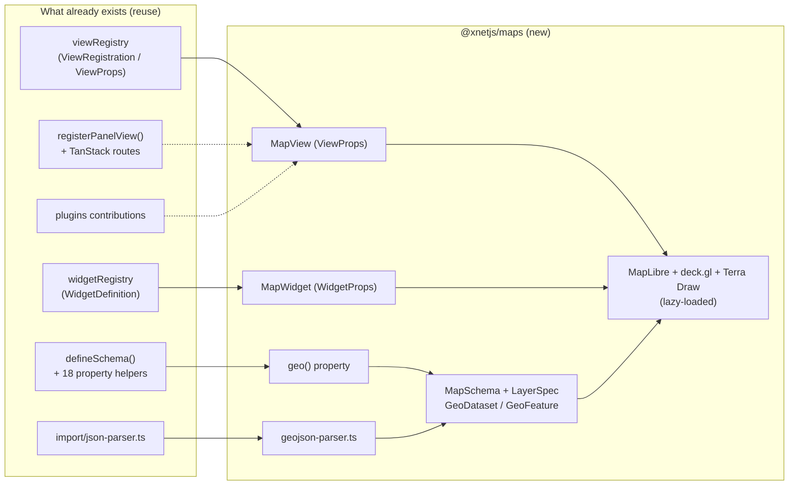
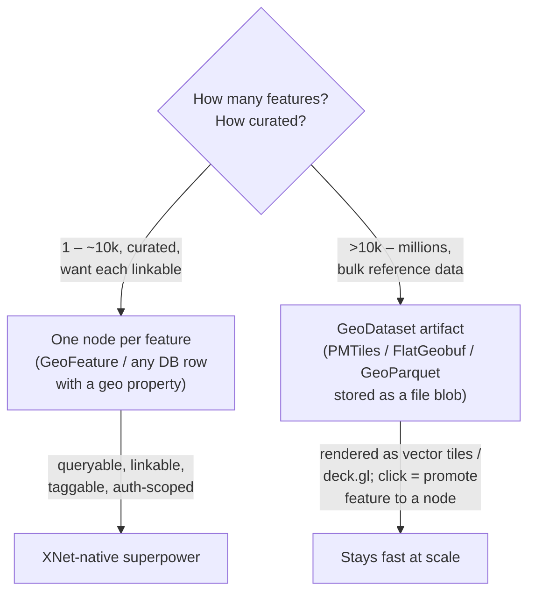
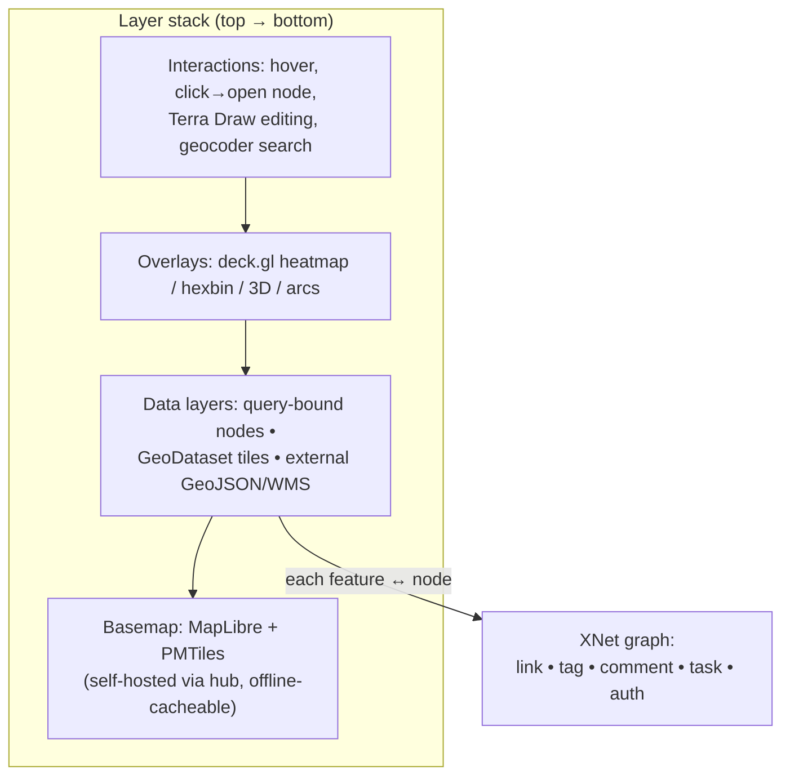

# Mapping and the Geospatial Workspace

## Problem Statement

XNet should grow a **first-class mapping capability**: not a one-off "show
pins on a map" embed, but a durable foundation for geospatial work that scales
from "drop a marker on a page" to "the operational map for an agriculture
company, a logistics fleet, a data-center portfolio, a neighborhood, or a trip."

Concretely, we want to be able to:

- Render a **high-quality world basemap** (streets, satellite, terrain).
- **Import geodata** in the formats people actually have (GeoJSON, CSV with
  lat/lon, KML/GPX, GeoParquet/Shapefile over time).
- **Visualize** that data — points, lines, polygons, heatmaps, choropleths,
  3D extrusions, time animation.
- **Compose multiple layers** on top of the basemap, each from a different
  dataset, with per-layer styling and filtering.
- Build **sophisticated, context-rich map UIs** — a "logistics view", an
  "agriculture view", a "trip planner" — each a saved arrangement of layers,
  filters, and panels.
- Keep it **as open as possible**: open-source rendering engine, open data
  (OpenStreetMap / Overture), self-hostable tiles, no mandatory third-party
  API key, and no leaking the user's location browsing to a tile vendor.

The strategic question is *not* "which map library" in isolation — it's **how a
map plugs into XNet's existing node/schema/view/widget architecture** so that a
place on the map is a *node in the knowledge graph* (linkable, taggable,
shareable, auth-scoped, commentable), not an opaque pin in someone else's
canvas. That node-native quality is the thing Google Maps can never give us, and
it is the whole reason to build this inside XNet rather than iframe a map.

## Executive Summary

**Recommendation in one line:** adopt **MapLibre GL JS** (open-source WebGL
vector renderer) as the base engine, default to a **self-hosted Protomaps
PMTiles basemap** proxied through the hub (open data, no API key, offline-
capable), add **deck.gl** as an optional high-volume overlay engine and
**Terra Draw** for geometry editing — and wire it into XNet through **three
escalating surfaces** that all share one geo data model:

1. **A `geo` property type + a "Map" view** over *any* database — the
   calendar-view pattern, but the required property is a location instead of a
   date. Lowest friction, reuses the entire `DatabaseSurface`/`useQuery`
   plumbing. Ship this first.
2. **A `Map` document schema** (a first-class node like `Canvas`/`Dashboard`)
   that composes **layers**, each bound to a query, an imported dataset, or an
   external source. This is the "build your own layers on the world map" /
   "sophisticated context map" surface.
3. **A `Map` dashboard widget** for embedding a map tile in a dashboard.

The data model is **tiered**: small/curated features become **one node each**
(queryable, linkable, the XNet-native superpower), while bulk datasets (millions
of features) are stored as **dataset artifacts** (PMTiles/FlatGeobuf/GeoParquet
blobs) attached to a `GeoDataset` node and rendered via vector tiles / deck.gl,
with "promote a feature to a node" on click.

Everything lives in a new lazy-loaded **`@xnetjs/maps`** package so the ~200 KB+
WebGL bundle never touches initial paint (relevant to the load-perf work in
[0184](0184_%5B_%5D_INITIAL_LOAD_PERFORMANCE_AT_LARGE_DATABASE_SCALE.md)).
The only core change is a **CSP edit** — and even that shrinks to near-zero if we
proxy tiles through the hub (`https://*.xnet.fyi` is already allowed in
`connect-src`).

## Current State In The Repository

XNet has **zero geo support today** — a repo-wide search for `leaflet`,
`mapbox`, `maplibre`, `geojson`, `latitude`/`longitude` turns up nothing in the
feature sense (the only `coordinate`/`camera` references are the *non-geographic*
infinite-canvas math in `packages/canvas-core`). This is greenfield, which is
good: we can model it natively instead of retrofitting.

The pieces a map plugs into already exist and are clean:

### Schema & property system — where a `geo` type goes

Node types are declared with `defineSchema()` in
[`packages/data/src/schema/define.ts`](../../packages/data/src/schema/define.ts).
Each schema auto-gets `validate()`, `create()`, and an `is()` type guard. Example
shape (from [`schemas/canvas.ts`](../../packages/data/src/schema/schemas/canvas.ts)):

```ts
export const CanvasSchema = defineSchema({
  name: 'Canvas',
  namespace: 'xnet://xnet.fyi/',
  properties: {
    title: text({ required: true, maxLength: 500 }),
    folder: relation({ target: 'xnet://xnet.fyi/Folder@1.0.0' }),
    tags: relation({ target: 'xnet://xnet.fyi/Tag@1.0.0', multiple: true }),
    space: relation({ target: 'xnet://xnet.fyi/Space@1.0.0' }),
    visibility: select({ options: [...], default: 'inherit' }),
  },
  document: 'yjs',
})
```

The property helpers live in
[`packages/data/src/schema/properties/index.ts`](../../packages/data/src/schema/properties/index.ts)
— **18 types**: `text`, `number`, `checkbox`, `json`, `date`, `dateRange`,
`select`, `multiSelect`, `person`, `relation`, `url`, `email`, `phone`, `file`,
`created`, `updated`, `createdBy`. **There is no `geo`/`location` type** — that
is the one schema-layer addition we need. Two relevant existing helpers point the
way: `json()` (we can ship geometry as `json<GeoJSON.Geometry>` on day one) and
[`properties/person.ts`](../../packages/data/src/schema/properties/person.ts)
(the template for a *custom* property type with its own validator/coercer/editor,
which `geo()` should become). `file()` returns a `FileRef`, the natural home for
a large dataset blob.

### Views — where a "Map view" goes

The view registry is a runtime-mutable singleton in
[`packages/views/src/registry.ts`](../../packages/views/src/registry.ts). A view
is a `ViewRegistration` ([registry.ts:81-98](../../packages/views/src/registry.ts))
with a `component: ComponentType<ViewProps>`, optional `configFields`, and
`supportedSchemas`. Every view receives the same
[`ViewProps`](../../packages/views/src/registry.ts) (`schema`, `view` config,
`data: TRow[]`, and `onUpdateRow`/`onRowClick`/… callbacks). Built-ins
(`table`, `board`, `gallery`, `timeline`, `calendar`, `list`) are wired in
[`builtins.ts`](../../packages/views/src/builtins.ts) via thin adapters.

The **calendar view is the exact precedent** for a map view: it declares a
required `dateProperty` config field and plots rows by that property. A map view
declares a required `geoProperty` (or `lat`/`lon` pair) and plots rows by *that*.
This means a Map view drops into the existing `DatabaseSurface` / view-switcher
with no new plumbing — it's just another registration.

### Dashboard widgets — where a "Map widget" goes

[`packages/dashboard/src/registry.ts`](../../packages/dashboard/src/registry.ts)
+ [`types.ts`](../../packages/dashboard/src/types.ts) define `WidgetDefinition`
with a `trustTier` (`first-party` | `user` | `marketplace`), `configFields`,
`defaultSize`, `getStubConfig`, and a `component: ComponentType<WidgetProps>`.
Widgets receive **declarative query results** via `WidgetData` and never touch
the store directly. A first-party map widget fits this contract directly
(`packages/charts/src/XChart.tsx` is the analogous chart precedent). Per memory,
**first-party widgets may use hooks**, which a live map needs.

### Plugins — the same seams, externalized

[`packages/plugins/src/contributions.ts`](../../packages/plugins/src/contributions.ts)
exposes `ViewContribution` and `WidgetContribution` (plus command, slash,
toolbar, editor, sidebar, property-handler, settings contributions). So once a
Map view/widget exists as a first-party registration, the *same shape* can later
ship as a third-party plugin — e.g. a "FAA airspace layer" plugin.

### App shell — where a `/map` surface goes

The web app uses **TanStack Router** file routes in
[`apps/web/src/routes/`](../../apps/web/src/routes) (e.g. `tasks.tsx`,
`experiments.tsx`, `db.$dbId.tsx`, `canvas.$canvasId.tsx`). Left/bottom panels
register via `registerPanelView()` in
[`apps/web/src/workbench/PanelViewHost.tsx`](../../apps/web/src/workbench/PanelViewHost.tsx),
listed in
[`workbench/views/register.ts`](../../apps/web/src/workbench/views/register.ts)
(`explorer`, `chats`, `tasks`, `today`, `data`, `ai-chat`). A `/map` route plus a
"Maps" left-panel entry follows the exact pattern used to add `/experiments` and
`/tasks`.

### Network / CSP — the one core gotcha

The CSP is a `<meta>` tag in
[`apps/web/index.html:8-9`](../../apps/web/index.html). Today:

```
img-src    'self' data: blob:;
connect-src 'self' ws://localhost:* http://localhost:* wss://* \
            https://hub.xnet.fyi https://*.xnet.fyi \
            https://www.youtube.com https://publish.twitter.com;
worker-src 'self' blob:;
```

Two facts matter: **(a)** MapLibre fetches **vector tiles and PMTiles via
`fetch`/XHR (range requests), not ``** — so `connect-src`, not `img-src`,
governs them; and **(b)** `https://*.xnet.fyi` is *already* allowed in
`connect-src`, and `worker-src 'self' blob:` already covers MapLibre's worker.
**If the hub proxies tiles under `*.xnet.fyi`, the CSP barely changes.** Raster
basemaps (Leaflet-style `` tiles) would instead need `img-src` hosts.

### Import pipeline — where GeoJSON import goes

[`packages/data/src/database/import/json-parser.ts`](../../packages/data/src/database/import/json-parser.ts)
already parses JSON into rows + inferred columns (`inferColumnsFromRows`,
`toColumnDefinitions`). A `geojson-parser.ts` sibling (FeatureCollection →
rows, geometry → `geo` property, `properties` → columns) slots in next to it.
The social-import schemas in
[`packages/social/src/schemas/import.ts`](../../packages/social/src/schemas/import.ts)
(`SocialImportArchive`/`SocialImportRun` with provenance + hashing) are the
template for a `GeoDataset`/`GeoImportRun` provenance pair.

### Canvas-core — reusable math, wrong domain

[`packages/canvas-core`](../../packages/canvas-core) has real
tile/camera/LOD/screen↔world machinery (`camera.ts`, `tiles.ts`) but it is
**node-link spatial canvas, not geographic projection**. Don't force a map
through it; MapLibre owns Web Mercator, tiling, and LOD far better. (We *might*
borrow its "tile interest" idea for deciding which features to hydrate.)



## External Research

### Rendering engines

| Engine | License | Tiles | Strength | Weakness |
|---|---|---|---|---|
| **MapLibre GL JS** | BSD-3 (community fork of Mapbox GL JS pre-relicense) | **Vector** (WebGL) | Dynamic styling, 3D, smooth zoom, the open de-facto standard; PMTiles-native | Heavier (~200 KB gz), WebGL required |
| **Leaflet** | BSD-2 | Raster (``) | Tiny, simple, ubiquitous plugins | Raster-only, no dynamic restyle, weak at "many layers / big data" |
| **OpenLayers** | BSD-2 | Raster + vector | Most complete GIS feature set (projections, WMS/WFS) | Steeper API, larger, less "modern app" ergonomics |
| **deck.gl** | MIT (Uber/OpenJS) | Overlay engine | **Millions of points** on GPU; hexbin/heatmap/arc/3D layers; composes *on top of* MapLibre | Not a basemap; pairs with one |

MapLibre GL JS is widely called the right default for new open vector-map
projects in 2026; Leaflet remains the pick for a trivial raster embed. deck.gl is
the standard big-data overlay, integrating with MapLibre via `@deck.gl/mapbox`'s
`MapboxOverlay` (interleaved into the same z-buffer) and with React via
`react-map-gl`.

### Open basemap data & tiles — the "as open as possible" story

- **OpenStreetMap** is the canonical open *basemap data* (ODbL). The public
  `tile.openstreetmap.org` raster service is **not for production apps** and is
  not vector.
- **Protomaps + PMTiles** is the standout fit for a local-first app: an
  **entire-world basemap in a single static `.pmtiles` file**, served from any
  static/object storage and read **directly in the browser via HTTP range
  requests** — no tile server, no API key, no per-tile cost. MapLibre reads
  PMTiles natively (via the `pmtiles` protocol plugin + `protomaps-themes-base`
  styles). Daily world builds exist down to building detail, and the file can be
  cached in OPFS/IndexedDB for **true offline maps** — aligning perfectly with
  XNet's durable-storage direction
  ([0172](0172_%5Bx%5D_DURABLE_STORAGE_WITHOUT_APP_INSTALL.md)).
- **Overture Maps Foundation** (Linux Foundation; Amazon/Meta/Microsoft/TomTom)
  publishes open map data — places, buildings, transportation, addresses — in
  **GeoParquet**, ~40% sourced from OSM plus ~200 other sources. This is the
  premium *open* dataset for analytical layers (POIs, building footprints) and a
  future XNet import target.
- **Hosted open options** (drop-in if we ever want managed tiles without running
  our own): **MapTiler** and **Stadia Maps** both serve OSM-based vector styles
  with free tiers — usable behind a key, but they re-introduce a vendor and
  viewport tracking, so they should be *opt-in*, not the default.

### Geocoding (address ↔ coordinate)

- **Nominatim** (search/reverse-geocode over OSM) and **Photon** (komoot,
  type-ahead geocoder over OSM) are the open self-hostable options.
- **The public OSM Nominatim endpoint forbids apps whose primary function is
  geocoding and caps at ~1 req/s** — so we must **not** point production at it.
  Default to a **hub-proxied / self-hosted** Photon or Nominatim, which also
  keeps the user's typed addresses from leaking to a third party.

### Drawing & editing

- **Terra Draw** is a library-agnostic drawing/editing layer (adapters for
  MapLibre, Leaflet, OpenLayers, Google, Mapbox). It represents everything as
  **GeoJSON Features** and is **agnostic about persistence** — "store it in
  IndexedDB, a remote DB, or any mechanism you wish." That maps *one-to-one* onto
  XNet: each drawn Feature becomes a node. This is the cleanest path to
  draw-a-polygon / edit-a-route UX without reinventing geometry editing.

### Formats to support (in priority order)

GeoJSON (universal, day one) → CSV with lat/lon (ubiquitous) → KML/GPX (Google
Earth / GPS tracks) → **FlatGeobuf** (streamable, indexed, great for medium
vector) → **GeoParquet / PMTiles** (bulk/analytical, Overture-native).

## Key Findings

1. **The architecture already has the right seams.** Schema, view, widget,
   plugin, panel, route, and import registries are all clean extension points.
   The map is additive — essentially one new package plus a CSP line.
2. **The missing primitive is a `geo` property type.** Once any node can carry a
   location, a *map view over any database* falls out for free (calendar-view
   pattern), and that single feature already covers "agriculture/logistics/
   data-center context" for structured data.
3. **A node-native map is the differentiator.** A marker that *is* a node —
   openable, `[[linkable]]`, taggable, commentable, task-assignable,
   auth-scoped via Spaces
   ([0181](0181_%5B_%5D_SPACES_AS_NESTED_GROUPINGS_AND_SCHEMA_AUTHORIZATION.md))
   — is something no embedded Google/Mapbox map can offer. This is the reason to
   build it *inside* XNet.
4. **Open + local-first + private actually compose here.** PMTiles gives an
   open, key-less, offline, self-hostable basemap; hub-proxied tiles & geocoding
   keep the user's location interest from leaking to a vendor. "Open source" and
   "privacy" are the same decision, not a tradeoff.
5. **Scale forces a tiered data model.** "One node per feature" is the
   superpower for hundreds–thousands of curated places, but a parcel dataset or a
   census layer has millions of features — those must be **dataset artifacts**
   (PMTiles/FlatGeobuf), rendered as tiles, with selective promotion to nodes.
6. **CSP + bundle size are the only real friction.** Lazy-load the engine;
   proxy tiles through `*.xnet.fyi` to keep CSP changes minimal.

## Options And Tradeoffs

### A. Which rendering engine

- **MapLibre GL JS (recommended).** Vector, dynamic restyle (essential for
  "color by property" / many layers), 3D, PMTiles-native, open. Cost: bundle
  size + WebGL.
- **Leaflet.** Simpler, smaller, but raster-only and weak for the
  multi-layer/big-data ambitions described. Good *only* if we wanted a trivial
  embed — we don't.
- **OpenLayers.** Most GIS-complete (WMS/WFS, arbitrary projections) but
  heavier ergonomics; revisit only if enterprise GIS interop becomes a hard
  requirement.
- **deck.gl as a complement, not a base.** Add it for heatmaps/hexbins/arcs and
  >100k features, overlaid on MapLibre. Keep it an optional layer-engine, not the
  default (it's a big dependency).

### B. How geo data lives in the model



- **Geo-as-a-property (on any schema).** Add `geo()`; any database (Tasks,
  Contacts, a custom "Farms" DB) becomes mappable. *Pro:* maximal reuse, fits
  the view system. *Con:* one location field per row; not a full layered map.
- **`Map` document with `LayerSpec[]` (recommended for the rich surface).** A
  first-class node composing layers, each bound to a query / dataset / external
  source, each with style + filter + popup template. *Pro:* this *is* the
  "sophisticated context map." *Con:* more to build; needs a layer panel UI.
- **Tiered storage (recommended overall).** Nodes for curated data, dataset
  blobs for bulk, with promotion. *Pro:* correctness at both ends of scale.
  *Con:* two code paths for rendering (GeoJSON source vs. tiled source).

### C. Where the map appears

- **Map *view* over a database (ship first).** Cheapest, reuses everything.
- **Map *document/surface* (`/map`).** The flagship multi-layer experience.
- **Map *widget* (dashboard).** Embed a map among charts/metrics.
- **Map *block* in a page editor (later).** Inline mini-map in a doc.
- **Canvas integration (later/maybe).** Conceptually adjacent but different
  projection; don't couple early.

### D. Tiles & basemap sourcing

- **Self-hosted PMTiles via hub proxy (recommended default).** Open, key-less,
  offline-capable, private; minimal CSP change.
- **Hosted vendor (MapTiler/Stadia) behind a key (opt-in).** Zero ops, premium
  styles/satellite, but a vendor + tracking; make it a setting, never the
  default.
- **Raw OSM raster (avoid).** Against OSM tile policy and raster-only.

## Recommendation

Build a single new package **`@xnetjs/maps`** and roll out in phases:

**Phase 1 — Geo primitive + Map view (the 80%).**
Add a `geo()` property type (geometry as `json<GeoJSON.Geometry>` underneath,
with a proper editor/validator, modeled on `person.ts`). Register a **`map`
view** with a required `geoProperty` config field (plus optional `lat`/`lon`
pair for CSV-shaped data), rendering rows on MapLibre with PMTiles. Add a
GeoJSON/CSV importer that maps features → rows. Result: *any database becomes a
map.* This alone serves the agriculture/logistics/data-center "structured
context" use cases.

**Phase 2 — Map document + layers (the flagship).**
Add `MapSchema` (a node like `Canvas`/`Dashboard`) holding a `layers:
json<LayerSpec[]>`, a `GeoDataset` schema for imported bulk data (FlatGeobuf/
PMTiles blob via `file()`), and a `/map/$mapId` route + "Maps" panel entry. Build
the **layer panel** (add/reorder/toggle/style/filter layers), where each layer
binds to a saved query, a `GeoDataset`, or an external tile/GeoJSON URL. Saved
maps = the "logistics view", "trip planner", etc.

**Phase 3 — Power features.**
deck.gl overlay engine (heatmap/hexbin/3D/time), Terra Draw geometry editing
(draw → node), hub-proxied Photon geocoding + search box, Overture/GeoParquet
import, offline basemap caching in OPFS, a Map dashboard widget, and an inline
map block in the page editor.

**Cross-cutting guardrails:** lazy-load the whole package (dynamic `import()` so
WebGL/MapLibre never hits initial paint); default to self-hosted PMTiles proxied
through `*.xnet.fyi` (minimal CSP delta); make any third-party tile/geocode
provider an explicit opt-in setting; route geo properties through the existing
`visibility`/Spaces auth cascade so locations inherit node privacy.



## Example Code

### A `geo` property and a Map document schema

```ts
// packages/maps/src/schema/geo-property.ts
// Geometry stored as GeoJSON under the hood; modeled on properties/person.ts
export const geo = (opts: GeoOptions = {}) =>
  json<GeoJSON.Geometry>({
    ...opts,
    // future: custom validate() to assert valid GeoJSON + bbox, custom editor
  })

// packages/maps/src/schema/map.ts
export interface LayerSpec {
  id: string
  name: string
  source:
    | { kind: 'query'; schemaIRI: SchemaIRI; geoProperty: string; filter?: unknown }
    | { kind: 'dataset'; datasetId: NodeId }      // GeoDataset (PMTiles/FlatGeobuf)
    | { kind: 'url'; url: string; format: 'geojson' | 'pmtiles' | 'wms' }
  style: { type: 'circle' | 'line' | 'fill' | 'heatmap' | 'extrusion'
           colorBy?: string; sizeBy?: string; opacity?: number }
  visible: boolean
  popupTemplate?: string
}

export const MapSchema = defineSchema({
  name: 'Map',
  namespace: 'xnet://xnet.fyi/',
  properties: {
    title: text({ required: true, maxLength: 500 }),
    icon: text({}),
    layers: json<LayerSpec[]>({}),                 // whole-value LWW, like Dashboard
    viewport: json<{ lng: number; lat: number; zoom: number; pitch?: number }>({}),
    folder: relation({ target: 'xnet://xnet.fyi/Folder@1.0.0' }),
    tags: relation({ target: 'xnet://xnet.fyi/Tag@1.0.0', multiple: true }),
    space: relation({ target: 'xnet://xnet.fyi/Space@1.0.0' }),
    visibility: select({ options: VISIBILITY_OPTIONS, default: 'inherit' }),
  },
})

// GeoDataset: bulk imported data kept as an artifact, not millions of nodes
export const GeoDatasetSchema = defineSchema({
  name: 'GeoDataset',
  namespace: 'xnet://xnet.fyi/',
  properties: {
    title: text({ required: true }),
    format: select({ options: [
      { label: 'PMTiles', value: 'pmtiles' },
      { label: 'FlatGeobuf', value: 'flatgeobuf' },
      { label: 'GeoParquet', value: 'geoparquet' },
    ]}),
    artifact: file({}),            // the blob (FileRef)
    featureCount: number({ min: 0 }),
    bbox: json<[number, number, number, number]>({}),
  },
})
```

### Registering the Map view (calendar-view pattern)

```ts
// packages/maps/src/views/register.ts
viewRegistry.register({
  type: 'map',
  name: 'Map',
  icon: 'map-pin',
  component: MapView,                 // ComponentType<ViewProps>
  supportedSchemas: '*',
  platforms: ['web', 'electron'],
  configFields: [
    { key: 'geoProperty', label: 'Location', type: 'property-select', required: true,
      description: 'A geo/location property, or use lat/lon below' },
    { key: 'latProperty', label: 'Latitude (CSV data)',  type: 'property-select' },
    { key: 'lonProperty', label: 'Longitude (CSV data)', type: 'property-select' },
    { key: 'colorBy',     label: 'Color by',  type: 'property-select' },
    { key: 'basemap',     label: 'Basemap',   type: 'select',
      options: [{ label: 'Streets (open)', value: 'protomaps-light' },
                { label: 'Satellite (opt-in key)', value: 'maptiler-satellite' }],
      defaultValue: 'protomaps-light' },
  ],
})
```

### MapLibre + PMTiles, lazy-loaded, hub-proxied tiles

```ts
// packages/maps/src/engine/createMap.ts  (dynamic import keeps this out of initial bundle)
const { Map } = await import('maplibre-gl')
const { Protocol } = await import('pmtiles')
maplibregl.addProtocol('pmtiles', new Protocol().tile)

const map = new Map({
  container,
  style: {
    version: 8,
    glyphs: 'https://tiles.xnet.fyi/fonts/{fontstack}/{range}.pbf',   // hub-proxied
    sources: {
      basemap: { type: 'vector',
                 url: 'pmtiles://https://tiles.xnet.fyi/basemap.pmtiles' }, // *.xnet.fyi ⇒ already in connect-src
    },
    layers: protomapsThemeLight('basemap'),
  },
})
```

### CSP delta (minimal, with hub proxy)

```diff
- img-src 'self' data: blob:;
+ img-src 'self' data: blob:;
- connect-src 'self' ws://localhost:* http://localhost:* wss://* https://hub.xnet.fyi https://*.xnet.fyi ...;
+ connect-src 'self' ws://localhost:* http://localhost:* wss://* https://hub.xnet.fyi https://*.xnet.fyi ...;
  /* No new connect-src host needed if tiles are served from *.xnet.fyi.
     Only if pointing at a vendor add e.g.  https://api.maptiler.com  here
     (and that host to img-src for raster/satellite). worker-src already allows blob:. */
```

## Risks And Open Questions

- **Bundle weight.** MapLibre (~200 KB gz) + deck.gl is large. *Mitigation:*
  isolate in `@xnetjs/maps`, dynamic-`import()` on first map open, code-split
  deck.gl behind the overlay layer. Watch the
  [0184](0184_%5B_%5D_INITIAL_LOAD_PERFORMANCE_AT_LARGE_DATABASE_SCALE.md)
  budget.
- **Big-dataset hydration.** Rendering 1M nodes through `useQuery` is a
  non-starter — this is exactly the worker/hydration pressure 0184 describes.
  *Mitigation:* the tiered model — bulk data stays as tiled artifacts, never
  individual nodes, until promoted.
- **Tile hosting & cost/ops.** Who builds and serves the world PMTiles file?
  Daily Protomaps builds exist; hosting one global file (tens of GB) on hub
  object storage is the open answer, but it's real bytes/egress. *Open
  question:* bundle a regional extract for offline vs. stream the world file.
- **Geocoding ops.** Self-hosting Nominatim/Photon is heavy (planet import).
  *Open question:* hub-run Photon vs. a privacy-proxied vendor for v1.
- **Coordinate/precision & privacy.** Geo is sensitive personal data. Geo
  properties must honor the Spaces/visibility cascade
  ([0181](0181_%5B_%5D_SPACES_AS_NESTED_GROUPINGS_AND_SCHEMA_AUTHORIZATION.md)),
  and we should consider coordinate-fuzzing for shared/public maps.
- **CRDT geometry editing.** Live-collaborative polygon editing needs a merge
  story; v1 can treat geometry as whole-value LWW (like dashboard `widgets`)
  before attempting fine-grained vertex CRDTs.
- **Projection scope.** MapLibre is Web Mercator; true GIS users may want other
  projections — defer to OpenLayers-style handling only if demanded.
- **Mobile/Expo.** `apps/expo` would need a native map (MapLibre Native / Mapbox
  RN) — out of scope here, tracked alongside the multi-target work in
  [0186](0186_%5B_%5D_MULTI_FRAMEWORK_AND_DEPLOYMENT_TARGETS.md).

## Implementation Checklist

- [ ] Scaffold **`packages/maps`** (`@xnetjs/maps`) with deps `maplibre-gl`,
      `pmtiles`, `protomaps-themes-base` (deck.gl + terra-draw added in Phase 3).
- [ ] Add a **`geo()` property type** (geometry as `json<GeoJSON.Geometry>`),
      with validation and a basic point editor; model on
      [`properties/person.ts`](../../packages/data/src/schema/properties/person.ts).
- [ ] Implement **`MapView`** (`ViewProps`): read `geoProperty`/`lat`/`lon` from
      config, plot rows on MapLibre, `onRowClick` → open node, popups from row
      fields.
- [ ] **Register** `map` in the view registry; lazy-load the engine on mount.
- [ ] Add a **PMTiles basemap** + Protomaps light/dark styles; wire a
      hub/`*.xnet.fyi` tile origin (or local dev origin).
- [ ] Add **`geojson-parser.ts`** + CSV-lat/lon mapping beside
      [`json-parser.ts`](../../packages/data/src/database/import/json-parser.ts);
      hook into the import surface.
- [ ] Update **CSP** in [`apps/web/index.html`](../../apps/web/index.html) only
      as needed (none if tiles are `*.xnet.fyi`).
- [ ] **Phase 2:** add `MapSchema` + `GeoDataset` schemas; `/map/$mapId` route;
      "Maps" panel via
      [`registerPanelView`](../../apps/web/src/workbench/PanelViewHost.tsx).
- [ ] **Phase 2:** build the **layer panel** (add/reorder/toggle/style/filter)
      and the query/dataset/url layer-source binding.
- [ ] **Phase 2:** tiered rendering — GeoJSON source for node layers, tiled
      source (PMTiles/FlatGeobuf) for `GeoDataset` layers; "promote feature →
      node" on click.
- [ ] **Phase 3:** deck.gl overlay (heatmap/hexbin/3D/time); Terra Draw editing →
      nodes; hub-proxied Photon geocoder + search; Overture/GeoParquet import;
      OPFS offline basemap caching; Map dashboard widget; inline page-editor map
      block.
- [ ] Respect **Spaces/visibility** on geo properties and shared maps; add
      coordinate-fuzzing option for public maps.

## Validation Checklist

- [ ] A database with a `geo` property renders in the **Map view**; clicking a
      marker opens the underlying node.
- [ ] Importing a **GeoJSON** file (and a CSV with lat/lon) produces rows that
      appear on the map.
- [ ] The **PMTiles basemap loads with no third-party request** (verify in
      DevTools Network: tiles come from `*.xnet.fyi`/local only) and **no CSP
      violations** in console.
- [ ] The map package is **code-split** — initial app bundle/first-paint is
      unchanged (compare bundle stats; engine chunk loads only on first map open).
- [ ] A **`Map` document** with ≥3 layers (a query layer + a `GeoDataset` tile
      layer + an external GeoJSON layer) renders, toggles, and restyles; reload
      restores layers + viewport.
- [ ] A **10k-node** query layer and a **>100k-feature** dataset layer both pan/
      zoom at ≥30 fps without freezing the SQLite worker (ties to 0184).
- [ ] Geo properties on a **private/Space-scoped** node are not visible on a map
      shared outside that scope.
- [ ] **Offline:** with the network cut after first load, the cached basemap
      still renders (OPFS/IndexedDB).
- [ ] Drawing a polygon with **Terra Draw** creates an editable node;
      geocoder search recenters the map (Phase 3).

## References

- MapLibre GL JS — large-data guide & Leaflet migration: <https://maplibre.org/maplibre-gl-js/docs/guides/large-data/>, <https://maplibre.org/maplibre-gl-js/docs/guides/leaflet-migration-guide/>
- MapLibre vs Leaflet vs OpenLayers popularity & tradeoffs (Geoapify, JAWG): <https://www.geoapify.com/map-libraries-comparison-leaflet-vs-maplibre-gl-vs-openlayers-trends-and-statistics/>, <https://blog.jawg.io/maplibre-gl-vs-leaflet-choosing-the-right-tool-for-your-interactive-map/>
- Protomaps — "the open source map in a file" & PMTiles spec: <https://protomaps.com/>, <https://github.com/protomaps/PMTiles>, <https://docs.protomaps.com/pmtiles/maplibre>
- PMTiles + MapLibre walkthrough (Simon Willison); offline Protomaps maps: <https://til.simonwillison.net/gis/pmtiles>, <https://blog.wxm.be/2024/01/14/offline-map-with-protomaps-maplibre.html>
- Overture Maps Foundation — open data, GeoParquet, OSM relationship: <https://overturemaps.org/blog/2025/why-we-chose-geoparquet-breaking-down-data-silos-at-overture-maps/>, <https://en.wikipedia.org/wiki/Overture_Maps_Foundation>, <https://registry.opendata.aws/overture/>
- deck.gl with MapLibre / react-map-gl: <https://deck.gl/docs/developer-guide/base-maps/using-with-maplibre>, <https://deck.gl/docs/get-started/using-with-react>
- Terra Draw (library-agnostic drawing/editing, GeoJSON store): <https://github.com/JamesLMilner/terra-draw>, <https://terradraw.io/>, <https://maplibre.org/maplibre-gl-js/docs/examples/draw-geometries-with-terra-draw/>
- Nominatim usage policy & Photon self-hosting: <https://operations.osmfoundation.org/policies/nominatim/>, <https://github.com/komoot/photon>
- Hosted open-vector options: <https://www.maptiler.com/>, <https://stadiamaps.com/>
- Related explorations: [0184 Initial-Load Performance](0184_%5B_%5D_INITIAL_LOAD_PERFORMANCE_AT_LARGE_DATABASE_SCALE.md), [0181 Spaces & Schema Authorization](0181_%5B_%5D_SPACES_AS_NESTED_GROUPINGS_AND_SCHEMA_AUTHORIZATION.md), [0172 Durable Storage](0172_%5Bx%5D_DURABLE_STORAGE_WITHOUT_APP_INSTALL.md), [0186 Multi-Framework Targets](0186_%5B_%5D_MULTI_FRAMEWORK_AND_DEPLOYMENT_TARGETS.md)
