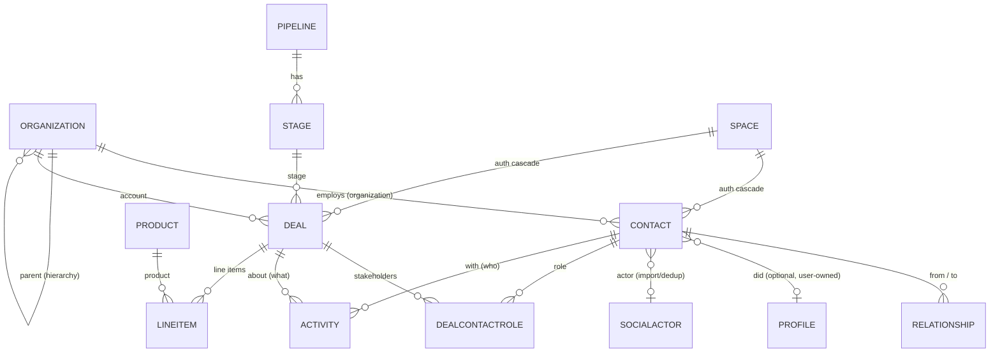
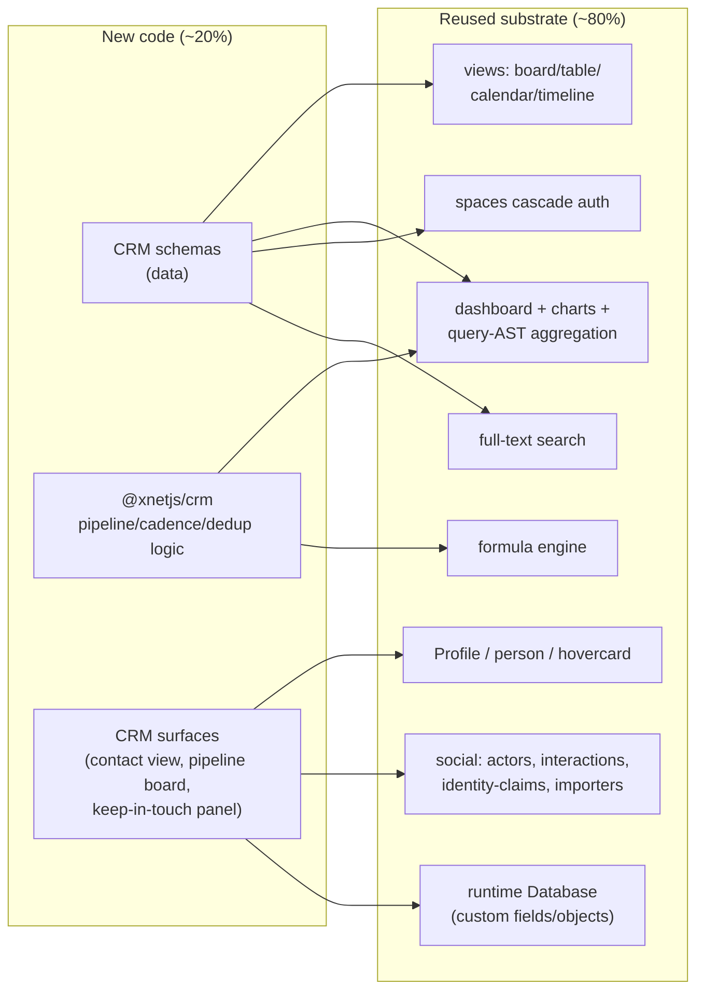
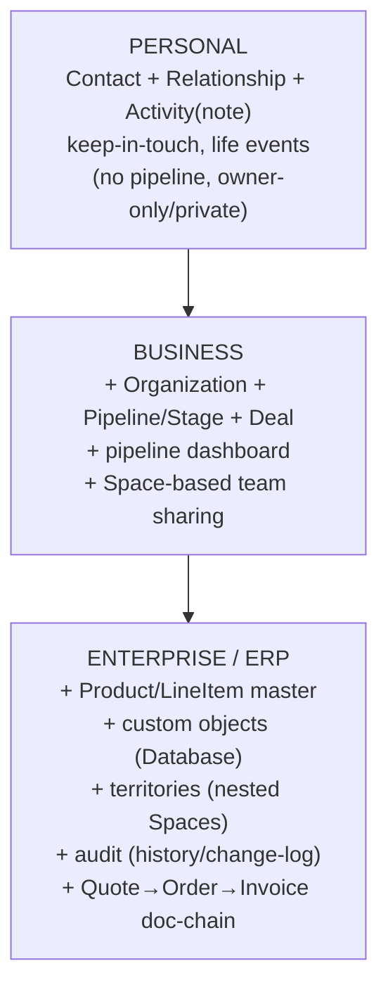
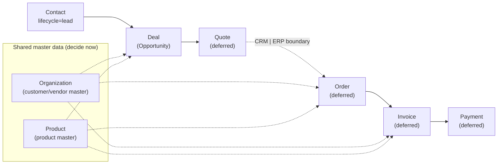

# Native CRM (Growing Into An ERP) On The xNet Graph

## Problem Statement

The ask is to build a **CRM directly into xNet**, designed from day one as the
front edge of an eventual **ERP**. The hard constraint is that **one data model
must serve everybody**:

- **The individual** — a personal CRM. "Keep in touch with Maria every three
  weeks," "remember that this person introduced me to that one," birthdays,
  notes, life events. No pipeline, no quota, no team. (Think Monica / Dex /
  Clay.)
- **The business** — a SMB sales CRM. Contacts attached to companies, a deal
  pipeline with stages and weighted forecasts, activity logging, a few
  dashboards. (Think Pipedrive / HubSpot.)
- **The enterprise** — the customer-lifecycle backbone that integrates into an
  ERP. Shared customer + product master data, quote-to-cash, role-based access,
  audit, territories, custom objects. (Think Salesforce + Dynamics/Dataverse +
  Odoo/ERPNext.)

The standard industry answer to "one model for all three" is **progressive
disclosure**: model for the most complex case (enterprise), but let the simple
cases ignore everything they don't need. The question this exploration answers
is: **what is the smallest set of new schemas + surfaces that lights up a
credible CRM on xNet's existing substrate, and how does that same model extend
cleanly into ERP without a rewrite?**

## Executive Summary

**This is overwhelmingly an _assembly_ problem, not a from-scratch build.** The
same headline that 0172 (task due dates) and
[0180](0180_[_]_EXPERIMENT_JOURNAL_AND_HABIT_TRACKER.md) (experiment journal)
landed on holds again: ~80% of the substrate already exists. xNet already has a
typed, CRDT-merged, sync-replicated, queryable, authorizable node model with
relations; board/table/calendar/timeline views; a dashboard + charts + query-AST
aggregation stack; a formula engine; full-text search; spaces-based
authorization; a person/profile system; and — uniquely relevant — a
**`social` package that already models actors, organizations, interactions, and
cross-platform identity resolution**, plus **importers for LinkedIn-class data**.

What's actually missing is a **typed CRM domain model** (Contact, Organization,
Pipeline, Deal/Opportunity, Activity, Product) and a couple of CRM-specific
surfaces (a relationship-centric contact view, a pipeline board wired to deal
economics, a "who am I overdue to contact" panel) plus a thin **pure-logic
package** for pipeline math (weighted value, win rate, velocity, forecast).

**Recommendation: ship a new `@xnetjs/crm` package** that (a) defines a small
set of first-class schemas via `defineSchema`, (b) reuses — not forks — the
`social` actor/interaction graph and the `Profile`/`person` identity layer for
the people side, and (c) leans on xNet's existing **runtime `Database` system**
(user-defined fields/objects at runtime) for the long tail of custom fields and
custom objects. Adopt a **universal "party" model** (à la Odoo's `res.partner`)
and a **shared product master** from the start — that single decision is what
prevents the CRM→ERP transition from becoming a master-data-management nightmare
later. Model **lifecycle as a field, not a separate Lead object** (HubSpot's
validated simplification). Model **Activity as an append-only timeline** (audit-
and GDPR- and CRDT-friendly).

The genuine differentiator xNet can ship that no incumbent can: a **local-first,
user-owned CRM where a contact can _be_ a real xNet identity (DID) that controls
its own half of the record** — making consent, portability, and GDPR erasure
native properties of the graph rather than bolted-on compliance features.

## Current State In The Repository

### The schema system is the foundation

New first-class entities are minted with `defineSchema`
([packages/data/src/schema/define.ts](../../packages/data/src/schema/define.ts)).
A node is a thin universal container — `id`, `schemaId`, `createdAt`,
`createdBy`, plus schema-defined properties
([packages/data/src/schema/node.ts](../../packages/data/src/schema/node.ts)).
`schemaId` is a versioned IRI like `xnet://xnet.fyi/Task@1.0.0`. The
`Task`/`Project`/`Milestone` schemas are the closest templates for what a CRM
needs — typed properties, an optional collaborative Yjs body, a `space` relation,
a `visibility` select, and `spaceCascadeAuthorization()`:

```ts
// packages/data/src/schema/schemas/milestone.ts (abridged)
export const MilestoneSchema = defineSchema({
  name: 'Milestone',
  namespace: 'xnet://xnet.fyi/',
  properties: {
    name: text({ required: true, maxLength: 200 }),
    status: select({ options: [/* upcoming/active/done/cancelled */], default: 'upcoming' }),
    targetDate: date({}),
    project: relation({ target: 'xnet://xnet.fyi/Project@1.0.0' as const, required: true }),
    sortKey: text({ maxLength: 500 }),
    space: relation({ target: 'xnet://xnet.fyi/Space@1.0.0' as const }),
    visibility: select({ options: [/* inherit/private/unlisted/public */], default: 'inherit' })
  },
  authorization: spaceCascadeAuthorization()
})
```

Property builders available today
([packages/data/src/schema/properties](../../packages/data/src/schema/properties)):
`text`, `number`, `checkbox`, `select`, `multiSelect`, `date`, `dateRange`,
`person` (a DID), `relation` (typed node→node edge, single or `multiple`), `url`,
`email`, `phone`, `file`, `json`, plus system fields `created`, `createdBy`,
`updated`. **`date()` stores UTC epoch milliseconds** — the 0172 timezone
off-by-one bug means CRM must adopt a single canonical day-granularity helper for
"due"/"next-touch" dates (see Risks).

New schemas register by adding a lazy import to `builtInSchemas`
([packages/data/src/schema/schemas/index.ts:247+](../../packages/data/src/schema/schemas/index.ts))
— there are ~57 built-ins already; adding a handful is routine. Relations are
**stored as properties on nodes, not as separate edge rows** (a Datomic-style
model), so "Contact belongs to Organization" is just
`organization: relation({ target: 'xnet://…/Organization' })`.

### Edges/relations and authorization

Authorization is private-by-default and **cascades through `Space`
membership**. `spaceCascadeAuthorization()`
([packages/data/src/schema/schemas/space-authorization.ts](../../packages/data/src/schema/schemas/space-authorization.ts))
resolves `owner` (node creator) plus `spaceOwner/spaceAdmin/spaceMember/
spaceCommenter/spaceViewer` from the node's `space` relation; a node with no
`space` is owner-only (private). Spaces nest (`parent` relation) and membership
walks the parent chain
([0181](0181_[_]_SPACES_AS_NESTED_GROUPINGS_AND_SCHEMA_AUTHORIZATION.md),
[packages/data/src/schema/schemas/space.ts](../../packages/data/src/schema/schemas/space.ts),
[space-membership.ts](../../packages/data/src/schema/schemas/space-membership.ts)).
**This is exactly the primitive an enterprise CRM needs for territories and team
sharing**, and the same primitive a personal CRM ignores entirely (everything
stays owner-only/private).

### Queries, aggregation, search

Reactive reads/writes are `useQuery` / `useNode` / `useMutate` /
`useInfiniteQuery`
([packages/react/src/hooks/useQuery.ts](../../packages/react/src/hooks/useQuery.ts)),
backed by SQLite indexed queries, materialized views, cursor pagination, spatial
filters, and FTS
([packages/data/src/store/query.ts](../../packages/data/src/store/query.ts)).
The **query-AST already supports aggregation**: `count/countDistinct/sum/avg/
min/max` with `groupBy` and `having`
([packages/data/src/store/query-ast.ts](../../packages/data/src/store/query-ast.ts)):

```ts
// "Total pipeline value by stage" is a single aggregate:
{ kind: 'aggregate', alias: 'totalValue', function: 'sum', field: 'amount', groupBy: ['stage'] }
```

Full-text search auto-indexes `text/richText/url/email/phone/select/multiSelect`
fields ([packages/hub/src/services/search-indexer.ts](../../packages/hub/src/services/search-indexer.ts)),
so a Contact's name/email/phone and a Deal's title/stage become searchable with
zero extra wiring.

### Views, dashboards, formulas — the CRM UI is mostly pre-built

- **Views** ([packages/views/src/types.ts](../../packages/views/src/types.ts)):
  `table | board | gallery | timeline | calendar | list`. A **board grouped by a
  `select` property is a Kanban pipeline** out of the box —
  `groupByProperty: 'stage'`
  ([packages/views/src/board/BoardView.tsx](../../packages/views/src/board/BoardView.tsx)).
  The V2 grid has virtual scroll, keyboard nav, drag reorder, TSV paste, cell
  presence, and per-cell comments
  ([packages/views/src/grid/GridSurface.tsx](../../packages/views/src/grid/GridSurface.tsx)).
- **Dashboards + charts**
  ([packages/dashboard/src/types.ts](../../packages/dashboard/src/types.ts),
  [packages/charts/src/spec.ts](../../packages/charts/src/spec.ts)): metric cards
  ("Total Pipeline Value", "Won This Month") and `bar/line/area/pie` widgets with
  `x`, `y`, `aggregate`, `series` — a "pipeline value by stage" bar chart is a
  config object, not code.
- **Formula engine**
  ([packages/formula/src/index.ts](../../packages/formula/src/index.ts)): a
  Notion-compatible expression evaluator for computed fields — weighted value
  (`prop("amount") * prop("probability")`), commission, etc. (Evaluates over
  loaded rows, not at query time — a known limitation.)
- **Property editors** for every field type a CRM needs — relation picker,
  person picker, select with inline-create, date, currency-number
  ([packages/views/src/properties/index.ts](../../packages/views/src/properties/index.ts)).
- **Runtime user-defined objects**: the `Database` family
  (`Database`/`DatabaseField`/`DatabaseSelectOption`/`DatabaseView`/
  `DatabaseRow`) lets users create their own tables with arbitrary fields and
  saved views **at runtime, no code** — xNet's equivalent of Twenty's
  metadata-driven custom objects, and the natural home for the long tail of CRM
  custom fields and bespoke ERP objects.

### The people layer already exists — and it's CRM-shaped

This is the most important finding. xNet is, under the hood, already a
relationship graph:

- **`Profile`**
  ([packages/data/src/schema/schemas/profile.ts](../../packages/data/src/schema/schemas/profile.ts))
  binds a `did` to a `displayName`, `handle`, `avatar`, status. The `person`
  property type is a validated DID reference (`did:key:…`).
- **`PersonView`** ([apps/web/src/components/PersonView.tsx](../../apps/web/src/components/PersonView.tsx),
  route `person.$did.tsx`) is already a **per-person dashboard** — created
  content, assigned tasks, shared channels/DMs, one-click DM — and it renders
  from a bare DID even when no Profile node exists. **`PersonHovercard`** is a
  quick contact card. This is a CRM contact record in everything but name.
- **`@xnetjs/social`** ([packages/social/src/schemas](../../packages/social/src/schemas))
  models `SocialActor` (with `actorKind: person | organization | …`),
  `SocialInteraction` (`follow/like/comment/message/mention/…` with an `actor`
  and a `target`), `SocialConversation` + `SocialMessage`, `SocialContent`,
  `SocialCollection`, and crucially **`SocialIdentityClaim`** — a
  confidence-weighted "these two actors are the same person" edge, i.e. **a
  ready-made deduplication / identity-resolution primitive**. There are
  **importers for 8 platforms** (X, LinkedIn-class profiles, Instagram, YouTube,
  TikTok, Reddit, plus AI chat archives)
  ([packages/social/src/importers](../../packages/social/src/importers)) with a
  staged, provenance-tracked, dedup-safe import pipeline.
- **`connect/`** ([packages/social/src/connect](../../packages/social/src/connect))
  adds `ConnectableProfile`, `ConnectionIntent`, `ConnectionWave` — opt-in
  people-matching with affinity vectors and privacy-preserving matching
  ([0174](0174_[_]_GENERALIZED_PEOPLE_MATCHING_AND_CONNECTION.md)).

There is **no `Organization`/`Company`, `Contact`, `Deal`, or `Activity` schema
today** — `SocialActor{actorKind:'organization'}` is the only org-like concept,
and it lacks business fields (industry, size, address, parent company).

### Headless + framework-agnostic data layer (the ERP integration story)

[0185](0185_[_]_FRAMEWORK_AGNOSTIC_DATA_MODEL_SDK.md) shipped
`@xnetjs/runtime` (`createXNetClient` + a `liveQuery` store contract) so the data
model is usable **outside React**, and `@xnetjs/sdk` as an umbrella. The CLI
already runs `xnet data` on `createXNetClient` + SQLite
([packages/cli/src/commands/data.ts](../../packages/cli/src/commands/data.ts)).
For "an enterprise integrates it into an ERP," this matters: CRM data is
queryable/mutable from scripts, agents, and servers — not just the web app — and
the schema-as-data control plane (`SchemaDefinition` system schema) means CRM
schemas can be published and version-migrated across a federation.

## External Research

A deep survey of CRM/ERP prior art (Salesforce, HubSpot, Pipedrive, Dynamics
365/Dataverse, Twenty, EspoCRM, SuiteCRM, Odoo, ERPNext, Monica, Clay, Dex)
produced the following load-bearing findings.

### The canonical CRM object model

Across Salesforce/HubSpot/Pipedrive the core objects are **Lead, Contact,
Account/Company, Opportunity/Deal, Activity (Task+Event / Engagement), Pipeline +
Stage, Product + PriceBook, Quote/Order, Case/Ticket, Campaign**. Key relations:

- `Account 1—M Contact` (`Contact.AccountId`); `Account 1—M Opportunity`.
- `Opportunity M—M Contact` via **`OpportunityContactRole`** (`Decision Maker /
  Champion / Economic Buyer / …`, with one `IsPrimary`) — enterprise deals have
  multiple stakeholders.
- `Account.ParentId` self-reference → **account hierarchy** (holding company →
  subsidiaries).
- **Activity timeline** = all Tasks/Events where `WhoId` (a Lead/Contact, the
  "who") or `WhatId` (an Account/Opportunity/Case, the "what") points at the
  record, sorted by date. The `WhoId`/`WhatId` **polymorphic lookups** are the
  key design move that makes a unified timeline possible.

**Lead vs Contact.** A Lead is an intentionally *denormalized, unverified* flat
record (company is a text field, not a linked Account). Conversion graduates it
into Contact + Account (+ optional Opportunity), re-parents its activities, and
archives the Lead (`IsConverted=true`). **HubSpot rejected the separate-Lead
object** and instead models a `Lifecycle Stage` field on Contact
(Subscriber → Lead → MQL → SQL → Opportunity → Customer → Evangelist). This
"lifecycle as state, not type" approach removes the painful conversion flow and
is the simpler design for a unified personal↔enterprise model.

### Metadata-driven objects (Twenty, Dataverse, ERPNext)

The most architecturally interesting modern OSS CRM, **Twenty**, stores object
and field definitions in *metadata tables* (`object_metadata`, `field_metadata`,
`relation_metadata`) and dynamically generates per-workspace Postgres tables;
custom fields/objects are schema migrations, not EAV. **Dataverse** does the same
for all of Dynamics (one `Account` entity serves both Sales/CRM and
Finance/ERP). **ERPNext** models *every* entity as a "DocType" defined in
JSON/DB. The lesson: **the platforms that span CRM→ERP are all metadata-driven**,
so custom objects and new ERP modules are data, not new code. xNet's `Database`
+ `SchemaDefinition` systems already provide both halves of this (runtime
user-defined objects *and* a code-first typed schema registry).

### The CRM→ERP continuum and the master-data trap

ERP modules: GL/accounting, AR, AP, inventory, procurement, manufacturing/MRP,
WMS, HR/payroll, project accounting. **Quote-to-Cash** is the spine:

```
Lead → Opportunity → Quote → Order → Fulfillment → Invoice → Payment → Rev-Rec
```

The **CRM/ERP boundary is between Quote and Order** — CRM owns up through Quote,
ERP owns Order onward. Odoo (`crm.lead → sale.order → stock.picking →
account.move → account.payment`) and ERPNext ("document chaining":
`Lead → Opportunity → Quotation → Sales Order → Delivery Note → Sales Invoice →
Payment Entry`, each new doc referencing the prior) both implement this as a
**chain of linked documents** — which maps perfectly onto xNet's node+relation
model.

The decisive architectural lesson is **Master Data Management**. The reason
Odoo's CRM and ERP interoperate without a Golden-Record reconciliation layer is
that they **share one customer master (`res.partner`, a universal "party" model)
and one product master (`product.template`/`product.product`) from day one**.
Separate Customer/Vendor/Contact tables that have to be bridged later is the
classic ERP integration tax. **Decide the party model and product master now.**

### Personal vs SMB vs Enterprise — and progressive disclosure

- **Personal** (Monica/Dex/Clay): relationship *maintenance* — `stay_in_touch_
  frequency` + next-trigger date ("contact overdue"), life events (job change,
  birthday, marriage), `how_you_met` + `first_met_through_contact_id` (the
  introducer edge), notes, gifts. A typed **Contact↔Contact relationship graph**
  ("spouse of", "manager of", "introduced by") is the personal-CRM core. No
  pipeline.
- **SMB**: pipeline + stages + probability, email logging, basic
  deals-by-stage/win-rate reports, simple team sharing, dedup.
- **Enterprise**: territory management (hierarchical account groupings),
  forecast rollups (Pipeline/Best Case/Commit/Closed), role hierarchy + row-level
  sharing + field-level security, field-history audit, multi-step approvals,
  multi-currency.

One model **can** serve all three via progressive disclosure: model for
enterprise, default-hide complexity. The Contact is the always-present core;
Organization is optional (nullable); Opportunity/Pipeline/Activity are
opt-in surfaces. **Monica's deliberate simplicity is a feature** — the risk is
over-building enterprise machinery before personal/SMB is validated.

### Pipeline analytics (the math the logic package owes)

- `Weighted Pipeline = Σ(amount × probability)` over open deals.
- `Win Rate = won / (won + lost)` in a period.
- `Pipeline Velocity = (#opps × winRate × avgDealSize) / avgCycleLength`.
- Forecast categories (Pipeline/Best Case/Commit/Closed); stage conversion-rate
  funnel; time-in-stage (stuck-deal detection); cohort win rates.
- Default Salesforce stage probabilities: Prospecting 10% → Qualification 20% →
  Needs Analysis 20% → Proposal 75% → Negotiation 90% → Closed Won 100% / Lost
  0% (`IsClosed`+`IsWon` is the termination flag pair).

### Ownership, privacy, portability (xNet's natural edge)

- **GDPR Article 17 (erasure):** incumbents bolt this on; the right design is
  **anonymize, not hard-delete** (replace PII, keep aggregates), store
  `pii_erased_at`, and keep activity bodies separate from the contact FK with a
  name-at-time snapshot that gets nulled. xNet's local-first + per-record consent
  + DID model can make this *native*.
- **Deduplication:** blocking (email domain, Soundex/Metaphone, LSH/MinHash) +
  similarity scoring (Jaro-Winkler for names, exact normalized phone) +
  probabilistic linkage (Fellegi-Sunter, cf. **Splink**). xNet already has
  `SocialIdentityClaim` (confidence-weighted match edges) — a head start.
- **Decentralized/user-owned prior art:** Solid pods, vCard/CardDAV (the
  lowest-common-denominator portability format — `FN/N/EMAIL/TEL/ADR/ORG/TITLE/
  BDAY`), ActivityPub actors, **W3C DIDs**. *No mainstream CRM uses DIDs, and no
  major local-first/CRDT CRM exists* — which is precisely the open lane xNet sits
  in.

## Key Findings

1. **The substrate is ~80% there.** Schemas, relations, spaces-auth, views
   (board=pipeline, table=contacts, calendar/timeline=activities), dashboards +
   aggregation, formulas, FTS, comments, person/profile, and a CRM-shaped social
   graph + importers all exist. CRM is new schemas + a logic package + a few
   surfaces.
2. **The `social` package is CRM prior art in disguise.** `SocialActor`,
   `SocialInteraction`, `SocialIdentityClaim`, and the importers map directly to
   Contact/Organization, Activity, dedup, and contact import. CRM should *depend
   on and extend* social, not fork it.
3. **Adopt a universal party model + shared product master now.** This is the
   one decision that makes CRM→ERP a continuation rather than a migration.
4. **Lifecycle as a field, not a Lead object.** HubSpot-validated; simpler;
   removes the conversion flow; matches a unified personal↔enterprise model.
5. **Activity as an append-only, polymorphic timeline.** `with`(who) +
   `about`(what) relations = the unified timeline; append-only = audit-, GDPR-,
   and CRDT-friendly.
6. **Progressive disclosure is the product strategy.** Personal mode (contacts +
   keep-in-touch + life events) → business mode (pipeline/deals) → enterprise
   mode (custom objects via `Database`, multi-pipeline, territories via Spaces,
   audit via the history/change-log, ERP doc-chaining).
7. **The differentiator is ownership.** Local-first, DID-addressable, optionally
   *bilateral* contacts (the contact can control their own half) makes consent +
   portability + erasure native. No incumbent can match this.

## Options And Tradeoffs

### A. Where does the CRM model live?

| Option | Pros | Cons |
| --- | --- | --- |
| **A1. New `@xnetjs/crm` package, schemas in `@xnetjs/data`** (recommended) | Mirrors how `experiments` (logic) + data schemas already split; first-class typed, indexed, sync'd; clean barrel; reusable headless | New package + build wiring; must coordinate with `social` |
| A2. Fold into `@xnetjs/social` | Maximal reuse, one people graph | Social is platform-import-neutral; CRM business fields would bloat it; couples unrelated release cadences |
| A3. Pure runtime `Database` (no code schemas) | Zero new schemas; ship templates only | No typed logic, weaker indexing/auth ergonomics, no first-class surfaces; can't host pipeline math cleanly |

**Take A1, but reuse social/profile for the people layer** (best of A1+A2):
CRM's `Contact`/`Organization` *reference* (not duplicate) `SocialActor`/DID
identity, and the runtime `Database` system (A3) is the sanctioned home for
custom fields/objects — progressive disclosure across all three mechanisms.

### B. Contact identity model

| Option | Pros | Cons |
| --- | --- | --- |
| **B1. `Contact` node that optionally links a `did` (person) and/or a `SocialActor`** (recommended) | Works for non-users (most contacts), users, and imported actors; dedup via `SocialIdentityClaim`; enables bilateral DID-owned contacts later | Two ID notions (internal node id + optional DID) to reconcile |
| B2. Contact = a DID Profile only | Maximal "user-owned" purity | Most real contacts aren't xNet users; can't represent them |
| B3. Contact = a `SocialActor` with extra fields | Reuses importers directly | Bloats social; couples CRM to platform-import semantics |

### C. Lead/Opportunity shape

| Option | Pros | Cons |
| --- | --- | --- |
| **C1. Lifecycle field on Contact + separate `Deal`** (recommended; HubSpot model) | No conversion flow; one person record; simplest progressive disclosure | Loses the "junk data quarantine" a separate Lead gives |
| C2. Separate `Lead` object + conversion (Salesforce) | Clean separation of unverified data | Painful conversion flow, activity re-parenting, double-entry; over-heavy for personal/SMB |
| C3. Single `Deal` model with `type: lead|opportunity` (Odoo `crm.lead`) | One pipeline object | Conflates two lifecycle concepts on one node |

### D. Pipeline/stage representation

| Option | Pros | Cons |
| --- | --- | --- |
| D1. `stage` as a `select` on Deal | Zero extra schema; board groups instantly | Single global pipeline; probabilities hard-coded in options |
| **D2. `Pipeline` + `Stage` nodes; Deal relates to a Stage** (recommended) | True multi-pipeline, per-stage probability/`isWon`/`isClosed`, configurable; ERP-ready | More schemas; board groups by the stage relation |

### E. Personal-CRM relationship graph

| Option | Pros | Cons |
| --- | --- | --- |
| **E1. `Relationship` node: directed, typed Contact→Contact edge** (recommended) | Models "spouse/manager/introduced-by"; the personal-CRM core; graph-lens-friendly | One more schema; needs reverse-label handling |
| E2. `relation(multiple)` props on Contact | No new schema | Can't type or annotate the edge; no introducer/role metadata |

## Recommendation

Ship **`@xnetjs/crm`** in three milestones, reusing the existing stack
aggressively and **never forking the social/profile people graph**.

### Domain model (first-class schemas in `@xnetjs/data`, namespace `xnet://xnet.fyi/`)

A **universal party model**: `Contact` (a person) and `Organization` (a company)
are the two party kinds; both can stand alone (personal use) or interlink (B2B).
A shared `Product` master seeds the ERP path.



- **`Contact`** — `displayName` (+ optional `firstName/lastName`), `emails`
  (multi), `phones` (multi), `org` (relation→Organization), `title`, `owner`
  (person/DID of the rep), `did` (optional person — the contact's *own* identity
  if they're an xNet user), `actor` (optional relation→`SocialActor` for
  import/dedup), `lifecycle` (select: subscriber→lead→mql→sql→opportunity→
  customer→evangelist→churned), `tags`, `lastTouchAt` (date), `nextTouchAt`
  (date — keep-in-touch), `touchEveryDays` (number — cadence), `howWeMet` (text),
  `introducedBy` (relation→Contact), `space`, `visibility`, `piiErasedAt` (date),
  `document: 'yjs'` (the running notes/journal on the person).
- **`Organization`** — `name`, `domain`, `website` (url), `industry` (select),
  `size` (select buckets), `annualRevenue` (number), address fields, `parent`
  (relation→Organization, hierarchy), `owner`, `actor` (optional→SocialActor),
  `space`, `visibility`.
- **`Pipeline`** + **`Stage`** — `Stage` has `pipeline` (relation), `name`,
  `sortKey`, `probability` (number 0–1), `isWon`/`isClosed` (checkbox).
- **`Deal`** (Opportunity) — `title`, `org` (account), `primaryContact`,
  `stage` (relation→Stage), `pipeline`, `amount` (number/currency),
  `currency`, `closeDate` (date), `forecastCategory` (select), `owner`,
  `collaborators` (person multi), `source` (select), `wonAt`/`lostAt`,
  `lostReason`, `space`, `visibility`, `document: 'yjs'` (deal notes).
- **`DealContactRole`** — `deal`, `contact`, `role` (select: decision-maker/
  champion/economic-buyer/…), `isPrimary` — the M:M stakeholder junction.
- **`Activity`** — append-only timeline event. `kind` (select: note/call/email/
  meeting/task), `with` (relation→Contact, the *who*), `about` (relation→Deal|
  Organization|Contact, the *what*), `occurredAt` (date), `direction`
  (inbound/outbound), `durationSec`, `outcome`, `summary` (text), `dueAt` (for
  task-kind / future), `completed`, `owner`, `space`, `visibility`. Bodies stay
  in the node (or Yjs) separate from the contact FK so erasure can null PII.
- **`Relationship`** — directed typed Contact→Contact edge: `from`, `to`,
  `kind` (select: spouse/parent/child/colleague/manager/reports-to/friend/
  introduced-by/…), `note`. Powers the personal-CRM relationship graph and graph
  lenses.
- **`Product`** (ERP seed) — `name`, `sku`, `kind` (good/service),
  `unitPrice`, `currency`, `active`. **`LineItem`** — `deal`, `product`,
  `quantity`, `unitPrice` (override), `discount`. (Quote/Order/Invoice are
  *deferred* ERP doc-chain nodes that reference these.)

### Logic package: `@xnetjs/crm` (pure functions, no UI — mirrors `experiments`)

`pipeline.ts` (weighted value, win rate, velocity, stage-conversion funnel,
time-in-stage), `forecast.ts` (category rollups), `cadence.ts` (next-touch /
overdue computation from `lastTouchAt` + `touchEveryDays`, reusing the
experiments **canonical-day** helper to dodge the 0172 TZ bug), `dedup.ts`
(blocking + Jaro-Winkler scoring → emits `SocialIdentityClaim` candidates),
`vcard.ts` (import/export for portability).

### Reuse map (what we explicitly do NOT build)



### Surfaces (apps/web), added as singleton tabs (like `/tasks`, `/experiments`)

1. **`/crm` workspace** — master/detail like `ExperimentsView`; default saved
   views: Pipeline (board grouped by `stage`), Contacts (table), Activities
   (timeline/calendar), Companies (table).
2. **Contact record** — extend/compose `PersonView`: header (avatar/lifecycle/
   next-touch), the Yjs notes doc, the **activity timeline** (`Activity` where
   `with=contact`), related deals, the **relationship graph** (a canvas/graph
   lens), and life-event-style entries.
3. **"Keep in touch" panel** — a Today-style list of contacts where
   `nextTouchAt <= today` (personal-CRM heartbeat), reusing the experiments
   "Today" panel pattern.
4. **Pipeline dashboard** — metric cards (weighted pipeline, won MTD, win rate)
   + "value by stage" bar + "deals closing this month" — all dashboard/chart
   config, no new chart code.

### Progressive disclosure → the ERP path



The CRM/ERP boundary (Quote↔Order) and the document chain map onto nodes +
relations directly:



### Activity logging + the bilateral/owned-contact differentiator

```mermaid
sequenceDiagram
    actor Rep
    participant CRM as CRM surface
    participant Store as NodeStore (local-first)
    participant Sync as Sync / Hub
    participant Contact as Contact's xNet identity (DID)
    Rep->>CRM: Log call with Maria
    CRM->>Store: create Activity{kind:call, with:maria, about:deal}
    Store-->>CRM: live update (timeline re-renders)
    Store->>Sync: CRDT change (offline-safe)
    Note over Contact: If Maria is an xNet user (Contact.did set)
    Contact->>Sync: grant/revoke access to her own profile fields
    Sync-->>Store: enrich Contact from Maria-owned record (consented)
    Rep->>CRM: GDPR erase Maria
    CRM->>Store: set piiErasedAt; null PII; keep aggregates
```

## Example Code

```ts
// packages/data/src/schema/schemas/crm-contact.ts
import type { InferNode } from '../../index'
import {
  text, email, phone, select, date, number, person, relation, checkbox
} from '../properties'
import { defineSchema } from '../define'
import { spaceCascadeAuthorization } from './space-authorization'

export const CONTACT_LIFECYCLE = [
  { id: 'subscriber', name: 'Subscriber', color: 'gray' },
  { id: 'lead', name: 'Lead', color: 'yellow' },
  { id: 'mql', name: 'Marketing Qualified', color: 'blue' },
  { id: 'sql', name: 'Sales Qualified', color: 'purple' },
  { id: 'opportunity', name: 'Opportunity', color: 'orange' },
  { id: 'customer', name: 'Customer', color: 'green' },
  { id: 'evangelist', name: 'Evangelist', color: 'green' },
  { id: 'churned', name: 'Churned', color: 'red' }
] as const

export const ContactSchema = defineSchema({
  name: 'Contact',
  namespace: 'xnet://xnet.fyi/',
  properties: {
    displayName: text({ required: true, maxLength: 200 }),
    firstName: text({ maxLength: 100 }),
    lastName: text({ maxLength: 100 }),
    emails: email({ multiple: true }),
    phones: phone({ multiple: true }),
    title: text({ maxLength: 200 }),
    org: relation({ target: 'xnet://xnet.fyi/Organization@1.0.0' as const }),
    owner: person({}),                         // the rep (a DID)
    did: person({}),                           // OPTIONAL: the contact's own xNet identity
    actor: relation({ target: 'xnet://xnet.social/SocialActor@1.0.0' as const }), // import/dedup
    lifecycle: select({ options: CONTACT_LIFECYCLE, default: 'lead' }),
    // personal-CRM cadence
    lastTouchAt: date({}),
    nextTouchAt: date({}),
    touchEveryDays: number({ integer: true, min: 0 }),
    howWeMet: text({ maxLength: 2000 }),
    introducedBy: relation({ target: 'xnet://xnet.fyi/Contact@1.0.0' as const }),
    tags: relation({ target: 'xnet://xnet.fyi/Tag@1.0.0' as const, multiple: true }),
    // privacy + erasure-by-design
    piiErasedAt: date({}),
    space: relation({ target: 'xnet://xnet.fyi/Space@1.0.0' as const }),
    visibility: select({
      options: [
        { id: 'inherit', name: 'Inherit', color: 'gray' },
        { id: 'private', name: 'Private', color: 'gray' },
        { id: 'unlisted', name: 'Unlisted', color: 'yellow' },
        { id: 'public', name: 'Public', color: 'green' }
      ] as const,
      default: 'private'                        // contacts are sensitive by default
    })
  },
  document: 'yjs',                              // running notes / journal on the person
  authorization: spaceCascadeAuthorization()
})

export type Contact = InferNode<(typeof ContactSchema)['_properties']>
```

```ts
// packages/crm/src/pipeline.ts — pure logic, unit-testable, no UI
export interface DealLike { amount: number; probability: number; isClosed: boolean; isWon: boolean }

export function weightedPipeline(deals: DealLike[]): number {
  return deals
    .filter((d) => !d.isClosed)
    .reduce((sum, d) => sum + d.amount * d.probability, 0)
}

export function winRate(deals: DealLike[]): number | null {
  const closed = deals.filter((d) => d.isClosed)
  if (closed.length === 0) return null          // honest: no data, not "0%"
  return closed.filter((d) => d.isWon).length / closed.length
}

// Pipeline velocity = (#open × winRate × avgDealSize) / avgCycleDays
export function pipelineVelocity(open: DealLike[], won: { amount: number; cycleDays: number }[]):
  number | null {
  const wr = winRate([...open, ...won.map((w) => ({ ...w, probability: 1, isClosed: true, isWon: true }))])
  if (wr === null || won.length === 0) return null
  const avgSize = won.reduce((s, w) => s + w.amount, 0) / won.length
  const avgCycle = won.reduce((s, w) => s + w.cycleDays, 0) / won.length
  if (avgCycle === 0) return null
  return (open.length * wr * avgSize) / avgCycle
}
```

```tsx
// apps/web/src/components/CrmKeepInTouchPanel.tsx — personal-CRM heartbeat
import { useQuery } from '@xnetjs/react'
import { ContactSchema } from '@xnetjs/data'
import { startOfTodayUtcMs } from '@xnetjs/experiments' // reuse canonical-day helper

export function CrmKeepInTouchPanel() {
  const { data: due } = useQuery(ContactSchema, {
    where: { nextTouchAt: { lte: startOfTodayUtcMs() } },
    orderBy: { nextTouchAt: 'asc' },
    limit: 50
  })
  return (
    <ul>{due?.map((c) => <li key={c.id}>{c.displayName} — overdue to reach out</li>)}</ul>
  )
}
```

## Risks And Open Questions

- **Date/timezone (0172 bug).** `date()` is epoch-ms; "next touch" and
  "close date" are day-granularity. **Must** use the experiments canonical-day
  helper everywhere, never `YYYY-MM-DD` string math.
- **Don't bloat `social`.** Resist adding CRM business fields to `SocialActor`.
  Keep CRM as a consumer: `Contact.actor` references it; importers feed
  `SocialActor` then a CRM mapper creates/links `Contact`.
- **Two identity notions.** Internal node id vs optional `did`/`actor`. Need a
  clear resolution + dedup story (`SocialIdentityClaim` + `dedup.ts`); merge
  policy should be **master+duplicates graph**, not lossy merge-and-discard, to
  preserve GDPR reversibility.
- **Formula timing.** Weighted value via the formula engine evaluates over
  *loaded* rows, not at query time; for dashboard totals prefer the query-AST
  `sum`/`groupBy` path or a logic-package rollup. (Cf.
  [0182](0182_[_]_USEQUERY_USEMUTATE_PERFORMANCE_FRONTIER.md) on per-render trim
  / bounded-query count caveats — pipeline aggregates over large deal sets need
  care.)
- **Lead quarantine.** Lifecycle-as-field loses the "junk import data" firewall.
  Mitigate with a `source` field + a Space (or a `status` gate) for unverified
  imports.
- **Bilateral/DID-owned contacts** are powerful but novel: consent UX, partial
  records (the contact controls some fields), and revocation need design —
  reuse the share-via-URL grant infra and `connect/` opt-in patterns. Treat as a
  later milestone, not the MVP.
- **ERP scope creep.** GL/inventory/MRP are large. Commit only to the *master
  data shape* (party + product) and the *doc-chain seam* now; defer
  Quote/Order/Invoice/GL to their own explorations.
- **Audit.** Enterprise needs field-history. Confirm whether `@xnetjs/history` /
  the change-log can back an audit trail before promising it.
- **Custom objects via `Database`.** Decide the boundary: first-class typed CRM
  objects (Contact/Deal/…) vs runtime `Database` custom objects. Recommend
  typed for the canonical set, `Database` for the long tail — but document it so
  users aren't confused by two object systems.

## Implementation Checklist

- [x] **M0 — Spike & decide.** Confirmed only `person`/`relation` support
  `multiple` (so `email`/`phone` are single primary fields); locked the party +
  product master shape; encoded the "lifecycle-as-field" and "Contact references
  social, never forks it" decisions as the `crm.ts` schema-pack docblock.
  (Audit-trail-via-`@xnetjs/history` confirmation remains a M3 open item.)
- [ ] **M1 — Personal CRM (data + logic + surface).**
  - [x] Add `Contact`, `Relationship`, `Activity` schemas in `@xnetjs/data`;
    register in `builtInSchemas` (versioned + legacy IRIs); export through the
    `schemas` → `schema` → package barrels. (`packages/data/src/schema/schemas/crm.ts`,
    validated by `crm.test.ts` — 14 tests; data package typechecks clean.)
  - [x] Create `@xnetjs/crm` with `cadence.ts` (next-touch/overdue via
    canonical-day) + `vcard.ts` (import/export); unit tests. (Pure,
    dependency-free package — 38 tests across cadence/pipeline/forecast/dedup/
    vcard/catalog/erasure; typechecks clean.)
  - [ ] `/crm` singleton tab + route + master/detail view; contact record with
    notes + activity timeline + relationship list.
  - [ ] "Keep in touch" panel (overdue contacts).
  - [ ] vCard import/export (logic); FTS auto-indexes name/email/phone via the
    existing indexer (no extra wiring). _(CardDAV sync deferred.)_
- [ ] **M2 — Business CRM (pipeline).**
  - [x] Add `Organization`, `Pipeline`, `Stage`, `Deal`, `DealContactRole`
    schemas.
  - [ ] Default pipeline + stages seeded on first use; Pipeline board + Contacts
    / Companies / Deals surfaces in the CRM workspace.
  - [x] `pipeline.ts` + `forecast.ts` (weighted value, win rate, velocity,
    stage breakdown, funnel, deal age) with tests.
  - [ ] Pipeline dashboard (metric cards: weighted pipeline, win rate, open
    count + value-by-stage breakdown), computed via `@xnetjs/crm`.
  - [x] `dedup.ts` (blocking + Jaro-Winkler) with tests. _(Merge UI + emitting
    `SocialIdentityClaim` candidates deferred to a follow-up.)_
  - [ ] LinkedIn-class importer → `SocialActor` → `Contact`/`Organization`
    mapper, reusing the social import pipeline. _(Deferred — vCard import ships
    now as the portable on-ramp.)_
- [ ] **M3 — Enterprise / ERP seam (mostly deferred to follow-ups).**
  - [x] `Product` + `LineItem` master schemas + `dealLineItemTotal` rollup in
    `@xnetjs/crm`. _(Line-item editing UI deferred.)_
  - [ ] Territories via nested Spaces; field-history audit surface.
  - [x] Erasure helper (`anonymizeContactPatch` — `piiErasedAt`,
    anonymize-not-delete) in `@xnetjs/crm`. _(Background cascade job to null
    activity PII deferred.)_
  - [ ] Document the `Database` custom-objects path for bespoke objects.
  - [ ] Spawn explorations: **0188 Quote-to-Cash doc chain**, **0189 user-owned /
    bilateral DID contacts & consent**, **0190 ERP accounting (GL/AR/AP)**.

## Validation Checklist

- [ ] A personal user can add a contact, set a 3-week cadence, log a note, and
  see the contact surface in "Keep in touch" when overdue — with no pipeline UI
  visible.
- [ ] A business user can drag a Deal across a board grouped by `stage`; the
  pipeline dashboard's weighted value and win-rate update live and match a
  hand-computed figure on a seeded dataset.
- [ ] Importing a vCard / LinkedIn archive creates `Contact`s, links
  `SocialActor`s, and dedups two near-identical contacts via a surfaced
  `SocialIdentityClaim` candidate.
- [ ] A Contact in a team `Space` is visible to space members and invisible to
  non-members; a Contact with no `space` is owner-only. (Auth cascade test.)
- [ ] CRM data is queryable headless via `xnet data` / `createXNetClient`
  (the ERP-integration path) and round-trips through sync offline→online.
- [ ] GDPR erase sets `piiErasedAt`, nulls PII on Contact + Activity bodies,
  preserves deal aggregates, and the contact disappears from all views.
- [ ] `pipeline.ts` / `cadence.ts` unit tests pass, including the honest
  "no data → null, never 0%/100%" cases and the canonical-day boundary.
- [ ] Adding the CRM schemas does not regress the fallow complexity gate or the
  build-and-smoke job; new package passes lint/typecheck/test in CI.

## References

### In-repo

- Schema system —
  [define.ts](../../packages/data/src/schema/define.ts),
  [node.ts](../../packages/data/src/schema/node.ts),
  [properties/](../../packages/data/src/schema/properties),
  [schemas/index.ts](../../packages/data/src/schema/schemas/index.ts)
- Templates — [task.ts](../../packages/data/src/schema/schemas/task.ts),
  [milestone.ts](../../packages/data/src/schema/schemas/milestone.ts),
  [observation.ts](../../packages/data/src/schema/schemas/observation.ts)
- Authorization —
  [space-authorization.ts](../../packages/data/src/schema/schemas/space-authorization.ts),
  [space.ts](../../packages/data/src/schema/schemas/space.ts)
- Query/aggregation —
  [query.ts](../../packages/data/src/store/query.ts),
  [query-ast.ts](../../packages/data/src/store/query-ast.ts),
  [useQuery.ts](../../packages/react/src/hooks/useQuery.ts)
- People layer —
  [profile.ts](../../packages/data/src/schema/schemas/profile.ts),
  [PersonView.tsx](../../apps/web/src/components/PersonView.tsx),
  [social/src/schemas](../../packages/social/src/schemas),
  [social/src/importers](../../packages/social/src/importers),
  [social/src/connect](../../packages/social/src/connect),
  [social/src/lenses/graph-lenses.ts](../../packages/social/src/lenses/graph-lenses.ts)
- Views/dashboards/formula —
  [views/src/types.ts](../../packages/views/src/types.ts),
  [board/BoardView.tsx](../../packages/views/src/board/BoardView.tsx),
  [dashboard/src/types.ts](../../packages/dashboard/src/types.ts),
  [charts/src/spec.ts](../../packages/charts/src/spec.ts),
  [formula/src/index.ts](../../packages/formula/src/index.ts)
- Headless/runtime —
  [cli/src/commands/data.ts](../../packages/cli/src/commands/data.ts),
  [0185](0185_[_]_FRAMEWORK_AGNOSTIC_DATA_MODEL_SDK.md)
- Related explorations —
  [0180 experiment journal](0180_[_]_EXPERIMENT_JOURNAL_AND_HABIT_TRACKER.md),
  [0181 spaces/auth](0181_[_]_SPACES_AS_NESTED_GROUPINGS_AND_SCHEMA_AUTHORIZATION.md),
  [0174 people matching](0174_[_]_GENERALIZED_PEOPLE_MATCHING_AND_CONNECTION.md),
  [0182 query perf](0182_[_]_USEQUERY_USEMUTATE_PERFORMANCE_FRONTIER.md)

### External

- Salesforce object model — https://developer.salesforce.com/docs/atlas.en-us.object_reference.meta/object_reference/
- Salesforce `convertLead` — https://developer.salesforce.com/docs/atlas.en-us.api.meta/api/sforce_api_calls_convertlead.htm
- HubSpot CRM objects / custom objects — https://developers.hubspot.com/docs/api/crm/crm-custom-objects
- HubSpot Leads object — https://knowledge.hubspot.com/crm-setup/use-leads
- Twenty (metadata-driven OSS CRM) — https://github.com/twentyhq/twenty , https://twenty.com/developers/
- EspoCRM — https://github.com/espocrm/espocrm
- SuiteCRM — https://github.com/salesagility/SuiteCRM
- Odoo ORM / `res.partner` — https://www.odoo.com/documentation/17.0/developer/reference/backend/orm.html
- ERPNext DocType / document chaining — https://frappeframework.com/docs/user/en/doctype
- Microsoft Dataverse — https://learn.microsoft.com/en-us/dynamics365/
- Monica (personal CRM) data model — https://github.com/monicahq/monica/tree/main/database/migrations
- Splink (probabilistic record linkage) — https://github.com/moj-analytical-services/splink
- W3C DID Core — https://www.w3.org/TR/did-core/
- Solid Protocol — https://solidproject.org/TR/protocol
- vCard (RFC 6350) / CardDAV (RFC 6352) — https://datatracker.ietf.org/doc/html/rfc6350
- GDPR Article 17 (erasure) — https://gdpr-info.eu/art-17-gdpr/
