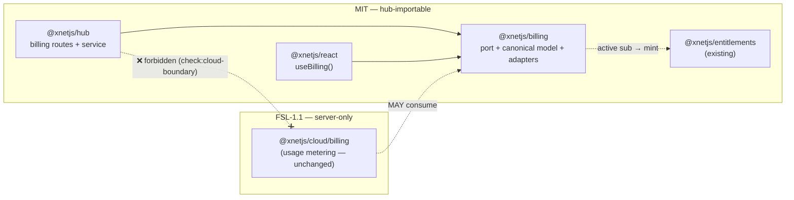
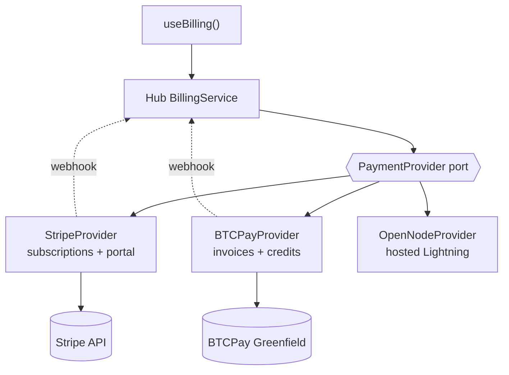
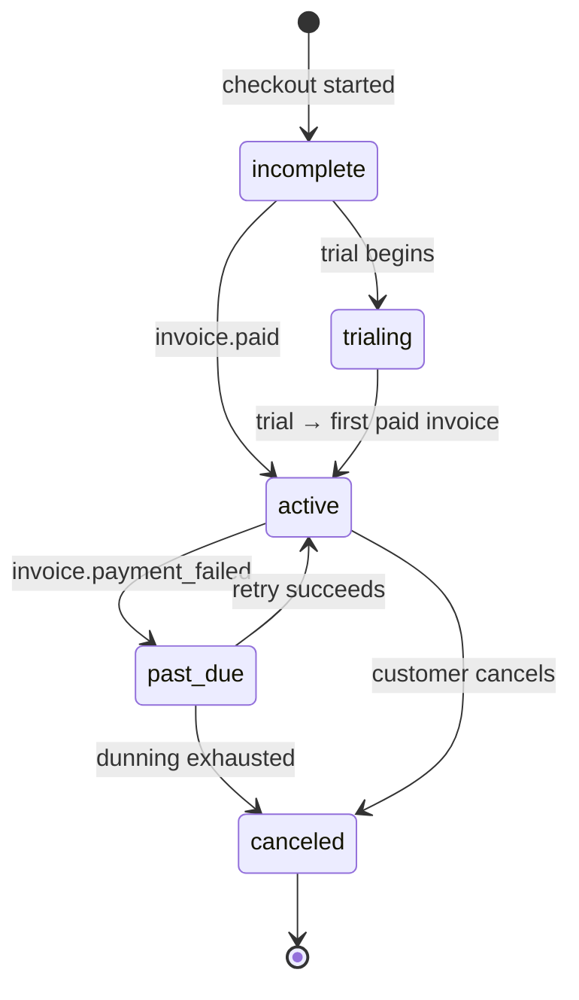
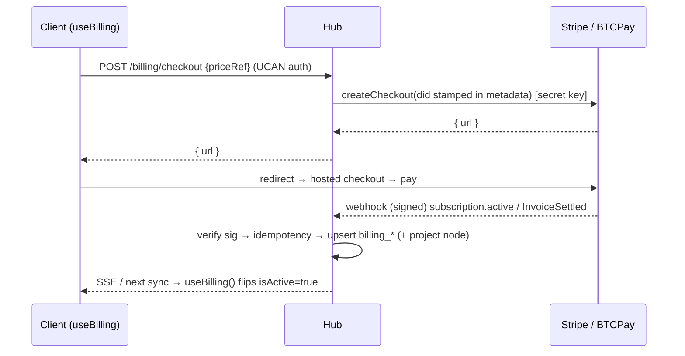

# Plug-and-Play Billing: Stripe and Bitcoin Through the Hub and a `useBilling` Hook

## Problem Statement

A developer building an app on xNet should be able to add billing the same way
they add identity: install a package, drop two secrets into the hub, one
publishable key into the client, and get a reactive hook. The ask, in the user's
words:

> "Maybe built into the hub there is a Stripe integration and that Stripe
> integration passes down through into the hooks. So the same way you have a
> `useIdentity` hook, you also have a `useStripe` hook or `useBilling`… the end
> user just needs to put in their Stripe API keys… and we kind of wire
> everything together for them so Stripe just kind of works… and we even do the
> database management too — track billing and subscriptions automatically inside
> our own schema, set up the webhooks, and stream all the data in."

And critically: **not just Stripe.** The same seam should accept **Bitcoin**
(self-hosted, no-KYC, via BTCPay Server / Lightning) so that the billing rail
matches xNet's decentralization ethos. This must land in the **open-source MIT
repository** — a feature of the hub itself, usable by anyone — _not_ locked
behind the FSL-licensed `@xnetjs/cloud` control plane.

The question this exploration answers: **what is the smallest, most secure,
genuinely plug-and-play billing layer we can build into the hub + hooks, that is
provider-agnostic (Stripe _and_ Bitcoin) and that turns billing state into
first-class, reactive xNet data?**

The short answer: a new MIT package **`@xnetjs/billing`** defining a
provider-agnostic **`PaymentProvider` port** and a canonical billing data model;
a thin **hub billing service** (Hono routes for `checkout` + `webhook`, a
DID-scoped read endpoint, a SQLite mirror table) modeled directly on the
proven [Stripe Sync Engine](https://github.com/supabase/stripe-sync-engine)
pattern; and a **`useBilling()` hook** that reads it. Start with the secret key
**server-side only** (the user's "keys on the client" instinct needs one
correction — only the _publishable_ key is ever client-side), and grow the
client surface from a fetch-hook into full node-sync once the server-authored
node path exists.

## Executive Summary

1. **xNet already has Stripe code — but it's the wrong shape and the wrong
   license for this.** `@xnetjs/cloud/billing`
   (`packages/cloud/src/billing/`) is **FSL-1.1**, and it is **usage-metering**
   billing (Stripe Billing Meters: token-usage → marked-up USD → meter event),
   built for xNet's _own_ managed cloud. It is not subscription/checkout billing,
   and the hub is **forbidden** from importing it (the `check:cloud-boundary`
   ESLint rule). So we reuse its _patterns_ (idempotent ledger, `verifyWebhook`,
   the port/adapter shape) but must re-implement them MIT-side.

2. **The hub is already a Hono server with a working webhook precedent.** The
   GitHub webhook in `packages/hub/src/routes/tasks.ts` reads the raw body,
   verifies an HMAC signature, parses, and dispatches. A Stripe/BTCPay webhook is
   the _exact same shape_. The hub also already loads secrets from env
   (`packages/hub/src/config.ts`), owns a SQLite store
   (`packages/hub/src/storage/sqlite.ts`), and authenticates clients by DID via
   UCAN. Every seam billing needs already exists.

3. **The hook pattern is trivial to extend.** `useIdentity`
   (`packages/react/src/hooks/useIdentity.ts`) just reads `useXNet()` context;
   `useQuery`/`useMutate` subscribe to the `DataBridge`→`NodeStore` chain. A
   `useBilling()` hook slots in the same way and exports from
   `packages/react/src/index.ts`.

4. **"Track billing in our own schema" maps onto two strategies.** Either (A)
   billing lives in **hub-owned SQLite tables** exposed via a DID-scoped REST
   read (`GET /billing/me`) — the literal Stripe Sync Engine model, simplest and
   most secure; or (B) billing becomes **server-authored xNet nodes**
   (`Customer`/`Subscription`/`Invoice`/`Payment`) that sync to the owner so
   `useBilling()` is just `useQuery(SubscriptionSchema)` and billing shows up in
   dashboards/graph for free. (B) requires a **server-authoritative node-write
   path that does not exist yet** — the schema research confirmed "no
   server-authoritative push." **Recommendation: ship A first, layer B as a
   projection on top (hybrid).**

5. **Stripe and Bitcoin are genuinely different billing shapes** and the
   abstraction must respect that. Stripe = native recurring subscriptions +
   hosted customer portal + rich lifecycle webhooks. Bitcoin/Lightning (BTCPay
   Greenfield API) = one-shot invoices that settle instantly, **no native
   subscriptions** — recurring is simulated via credits/top-ups or scheduled
   invoices. The canonical model needs both a `Subscription` concept and a
   `Payment`/credit concept.

6. **One correction to the brief:** the **secret key never goes on the client.**
   Only the _publishable_ key (`pk_…`) is client-side (it can only create
   tokens, not move money). The _secret_ key (`sk_…`) and the _webhook signing
   secret_ (`whsec_…`) live **only in the hub**. Checkout sessions are created
   _by the hub_ (secret-key call) and the client just redirects to the returned
   URL. This keeps the app out of PCI scope and out of key-leak risk.

## Current State In The Repository

### The hub is a Hono server with a webhook precedent

`packages/hub` is a multi-protocol (WebSocket + HTTP) server built on **Hono**
(`@hono/node-server`). Routes live in `packages/hub/src/routes/` and are mounted
in `packages/hub/src/server.ts`. The relevant existing pieces:

- **Config / secrets** — `packages/hub/src/config.ts` resolves env vars at
  startup (`HUB_PORT`, `HUB_DATA_DIR`, `HUB_GITHUB_WEBHOOK_SECRET`,
  `XNET_PLAN_SECRET`, etc.). Secrets are injected by the platform (Railway / Fly
  / Cloud Run), never committed. This is exactly where
  `STRIPE_SECRET_KEY` / `STRIPE_WEBHOOK_SECRET` / `BTCPAY_API_KEY` would land.
- **The webhook template already exists** — `packages/hub/src/routes/tasks.ts`
  (the GitHub webhook):

  ```ts
  app.post('/github/webhook', async (c) => {
    const secret = options.githubWebhookSecret
    if (!secret) return c.json({ error: 'GitHub integration is not configured' }, 503)
    const rawBody = await c.req.text() // raw body BEFORE JSON parse
    const signature = c.req.header('x-hub-signature-256')
    if (!verifyWebhookSignature(secret, rawBody, signature))
      // HMAC verify
      return c.json({ error: 'Invalid webhook signature' }, 401)
    const actions = processGithubEvent(c.req.header('x-github-event') ?? '', JSON.parse(rawBody))
    if (actions.length && options.applyAutomationActions)
      await options.applyAutomationActions(actions)
    return c.json({ ok: true, actions: actions.length })
  })
  ```

  A Stripe webhook is the identical shape — read raw body, verify
  `stripe-signature`, dispatch by `event.type`. BTCPay is the same with an
  `InvoiceSettled` event and a store-webhook HMAC.

- **Auth by DID** — `packages/hub/src/auth/ucan.ts` exposes
  `authenticateHttpRequest()`, used by a `requireAuth` middleware in `server.ts`
  to gate routes. A `GET /billing/me` read endpoint reuses it directly:
  `c.get('auth').did` is the caller's DID.
- **Storage** — `packages/hub/src/storage/interface.ts` (the `HubStorage`
  contract) + `packages/hub/src/storage/sqlite.ts` (schema SQL). Adding
  `billing_customers` / `billing_subscriptions` / `billing_invoices` /
  `billing_events` tables is a localized change here.
- **Dockerfile** — `packages/hub/Dockerfile` already injects runtime env; new
  secrets are operator configuration, no code change.

### The existing (FSL, metering) Stripe code we must _not_ import

`packages/cloud/src/billing/` — licensed **FSL-1.1-Apache-2.0**
(`packages/cloud/package.json` → `"license": "FSL-1.1-Apache-2.0"`,
`"stripe": "^17.0.0"`). It exposes, via the `@xnetjs/cloud/billing` subpath:

- `StripeBillingAdapter` / `FakeStripeBilling` — wrap `stripe.billing.meterEvents.create(...)`
- `verifyWebhook(stripe, payload, signature, secret)` — pure HMAC via `stripe.webhooks.constructEvent`
- `MemoryUsageLedger` — idempotent ledger keyed by `tenant:session:request`
- pricing math in `packages/cloud/src/cost/pricing.ts` (includes
  `stripePercent: 0.029`, `stripeFixedPerCharge: 0.3`)

This is **usage-based metering** for xNet's own cloud, not general
subscription/checkout billing. And the **boundary is enforced**: an ESLint rule

- `check:cloud-boundary` CI step forbid the hub (and any MIT package) from
  importing `@xnetjs/cloud`. The hub's `package.json` depends only on the MIT
  `@xnetjs/entitlements`.

### The entitlements contract — the licensing-clean precedent to copy

`packages/entitlements` (**MIT**, zero external deps) is the _only_ billing-ish
thing the hub already imports. `packages/entitlements/src/plans.ts` defines a
`PlanId` catalog (`demo`→`enterprise`) and `PlanEntitlements`
(`quotaBytes`, `maxConnections`, `seats`, `aiEnabled`, `sla`…), and
`entitlements.ts` signs/verifies entitlement tokens the hub reads **locally**
(anti-lock-in). This is the exact licensing shape `@xnetjs/billing` should
follow — **MIT, dependency-light, hub-importable** — and there's a natural
integration: _an active paid subscription mints entitlements_.

### The hook + provider system a `useBilling` hook plugs into

- `packages/react/src/hooks/useIdentity.ts` — the model to copy. It's ~10 lines:
  read `useXNet()` context, return `{ identity, isAuthenticated, did }`.
- `packages/react/src/context.ts` — `XNetProvider` / `XNetContext` /
  `DataBridgeContext`. The provider already holds `hubUrl`, `getHubAuthToken`,
  `nodeStore`, `syncManager`. Billing config (the publishable key + a
  `billingApiBase`) would be added to `XNetConfig` here.
- `packages/react/src/hooks/useQuery.ts` / `useMutate.ts` — the reactive
  read/write hooks (`DataBridge.query()` → `useSyncExternalStore`). If billing
  becomes nodes, `useBilling` wraps `useQuery`.
- `packages/data/src/store/store.ts` (`NodeStore`) +
  `packages/data-bridge/src/main-thread-bridge.ts` + `packages/runtime/src/sync/`
  — the sync chain billing nodes would ride.
- Public surface: `packages/react/src/index.ts` (where `useIdentity` is
  exported — `useBilling` exports beside it).

### The schema + authorization DSL for billing-as-nodes

`packages/data/src/schema/` defines schemas via `defineSchema({...})` with
property helpers (`text`, `number`, `select`, `relation`, `date`, `email`,
`json`…) and an **authorization DSL** in `packages/core/src/auth-types.ts` /
`packages/data/src/auth/builders.ts`: `role.creator()`, `role.property('owners')`,
`role.members({...})`, and `allow('owner', …)` per action. Sensitive schemas
default `visibility: 'private'` (see `Metric` in
`packages/data/src/schema/schemas/metric.ts`). Billing nodes would be
**owner-only private**. The one gap the schema research surfaced: **there is no
server-authoritative push yet** — clients pull what they're authorized for, and
nodes are authored by the client that signs them. Hub-authored, user-readable
billing nodes need a new write path (discussed under Options).

## External Research

### Stripe Sync Engine — the canonical "mirror Stripe into your DB" pattern

[Stripe Sync Engine](https://github.com/supabase/stripe-sync-engine) (built by
Supabase, now transferred to Stripe, **Apache-2.0**) is precisely the "track
billing in our own schema, set up webhooks, stream the data in" idea the user
described — already battle-tested:

- It's a **webhook listener that transforms Stripe webhooks into structured
  rows** (`customers`, `subscriptions`, `invoices`, `products`, `prices`,
  `charges`, `payment_intents`, …) in Postgres, kept current by **webhooks for
  real-time + scheduled backfill for history**.
- Stripe engineers contributed **incremental sync, flexible JSONB storage, and a
  CLI**. The JSONB-per-object detail matters: rather than model every Stripe
  field, store the canonical columns you query on **plus the raw object as
  JSON** for fidelity and forward-compat.
- Ships as a **standalone npm package** (`@supabase/stripe-sync-engine`) and a
  Fastify server / Docker image — proving the "drop-in billing sync" packaging
  is viable.

**Lesson for xNet:** don't invent a billing model from scratch. Mirror the
provider's objects into a small canonical table/schema + a raw JSON blob, driven
by webhooks, with a backfill path. The xNet twist is that "our own schema" can
be _nodes that sync to the client_, not just server rows.

### Stripe webhook security & subscription best practices

From Stripe's docs and practitioner guides
([Hookdeck](https://hookdeck.com/webhooks/platforms/guide-to-stripe-webhooks-features-and-best-practices),
[Stripe](https://docs.stripe.com/billing/subscriptions/webhooks),
[dev.to](https://dev.to/wecasa/secure-your-stripe-webhooks-and-protect-yourself-from-captain-hook-4mmo)):

- **Verify the signature** with the `whsec_…` signing secret against the **raw
  body** (Hono's `c.req.text()` before JSON-parsing — the hub's GitHub webhook
  already does exactly this).
- **Idempotency:** dedupe by `event.id` to survive Stripe's at-least-once
  retries (Stripe retries on slow/failed responses).
- **Lifecycle events to handle:** `checkout.session.completed`,
  `customer.subscription.created|updated|deleted`, `invoice.paid`,
  `invoice.payment_failed`. For SaaS, `invoice.paid` is the primary
  "access-granting" event (covers both first charge and renewals).
- **Out-of-order delivery:** Stripe does **not** guarantee event order; the
  robust pattern is to treat the event as a _signal_ and, for critical objects,
  refetch the current object from the API (or accept the object only if newer).

### Bitcoin / Lightning — BTCPay Server vs hosted (OpenNode)

For the Bitcoin rail, the self-hosted, no-KYC, zero-fee option is the strongest
thematic and practical fit:

- **BTCPay Server** ([docs](https://docs.btcpayserver.org/API/Greenfield/v1/)) —
  self-hosted, open-source, **zero-fee, no KYC, no third-party risk**. Its
  **Greenfield REST API** lets you run it headless: create an invoice → register
  a **store webhook** → receive an **`InvoiceSettled`** event (for Lightning,
  settlement is effectively instant). Official **C#, Python, and Node.js** client
  libraries exist. API keys are created in the BTCPay UI.
- **OpenNode** (hosted) — 1% fee (free on Lightning), instant settlement, fiat
  settlement and compliance support, **but** counterparty risk + KYC.
- **LNbits / Lightning addresses / BOLT12 offers** — lighter-weight Lightning
  options; BOLT12 offers in particular enable _recurring_-ish payments.

**Key structural difference from Stripe:** Lightning/Bitcoin has **no native
subscription primitive**. Recurring revenue is modeled as repeated invoices, a
prepaid **credit/top-up balance**, or BOLT12 recurrence. The canonical model
must therefore support _both_ `Subscription` (Stripe-native) and
`Payment`/credit (Bitcoin-native) shapes. This is the crux of making one
`useBilling()` cover both rails honestly rather than pretending Bitcoin is
Stripe.

### Other webhook-fanout prior art

[Hook0](https://www.blog.brightcoding.dev/2025/08/10/hook0-the-open-source-webhook-server-that-lets-your-app-speak-to-the-world/)
and Hookdeck show the broader "webhook gateway" ecosystem, but for xNet the hub
_is_ the webhook receiver — we don't need an external gateway, just signature
verification + idempotency + a durable store, all of which the hub already has
primitives for.

## Key Findings

1. **Every seam already exists in the hub.** Hono routing, a raw-body HMAC
   webhook precedent, env-based secrets, DID auth middleware, and a SQLite store.
   Billing is _additive wiring_, not new infrastructure.

2. **Reuse patterns, not code, from `@xnetjs/cloud/billing`.** The license
   boundary is real and CI-enforced. `verifyWebhook`, the idempotent ledger, and
   the port/adapter shape are excellent — re-implement them MIT-side in a new
   `@xnetjs/billing` package.

3. **The user's "our own schema" instinct is the Stripe Sync Engine pattern**,
   and it's the right one. The differentiator: xNet can make that schema
   _reactive nodes that sync to the owner_, so `useBilling()` updates live with
   no polling.

4. **The secret-key-on-client idea must be corrected.** Publishable key →
   client; secret + webhook secret → hub only; checkout sessions created by the
   hub. This is both more secure and _simpler_ (the app never touches the Stripe
   SDK's money-moving surface).

5. **The hard architectural unknown is server-authored, user-readable nodes.**
   Billing is authoritative on the server and originates from webhooks, which
   clashes with xNet's client-signs-its-own-nodes model. This is the single
   decision that gates whether billing is "REST read" or "first-class nodes."

6. **Bitcoin is not a drop-in Stripe clone.** A genuine multi-rail abstraction
   must model one-shot/credit payments, not just subscriptions.

## Options And Tradeoffs

### Where billing state lives + how the client reads it

```mermaid
flowchart TB
    subgraph A["Option A — Hub tables + REST read"]
      A1[Stripe/BTCPay webhook] --> A2[hub billing_* SQLite tables]
      A2 --> A3["GET /billing/me (DID-scoped)"]
      A3 --> A4["useBilling() = fetch + SSE/poll"]
    end
    subgraph B["Option B — Server-authored nodes"]
      B1[webhook] --> B2[hub mints Subscription node\nauthored-by-system, readable-by-user]
      B2 --> B3[sync down on user's connection]
      B3 --> B4["useBilling() = useQuery(SubscriptionSchema)"]
    end
    subgraph C["Option C — Hybrid (recommended)"]
      C1[webhook] --> C2[billing_* tables = source of truth]
      C2 --> C3[projection shim writes read-only nodes per user]
      C2 --> C3b["GET /billing/me (always available)"]
      C3 --> C4["useBilling(): nodes when present, REST fallback"]
    end
```



| Option                        | Pros                                                                                                    | Cons                                                                                                                                                              | Verdict                 |
| ----------------------------- | ------------------------------------------------------------------------------------------------------- | ----------------------------------------------------------------------------------------------------------------------------------------------------------------- | ----------------------- |
| **A — Hub tables + REST**     | Simplest; exact Sync-Engine model; secret stays server-side; no CRDT/identity work; ships in days       | Billing isn't in the node/query/offline/graph model; separate read path; no offline cache                                                                         | **Ship first (MVP)**    |
| **B — Server-authored nodes** | Fully unified: billing is queryable, offline-cached, reactive, shows in dashboards/graph for free       | Needs a **new server-authoritative write+grant path** (doesn't exist); encryption-recipient computation; system-DID key mgmt; must guarantee client can't _write_ | **Aspirational**        |
| **C — Hybrid projection**     | Authoritative server tables **and** node-native client surface; REST always works, nodes when available | Projection shim is net-new; two representations to keep consistent                                                                                                | **Target architecture** |

### Package placement + licensing



- **New MIT `@xnetjs/billing`** — `PaymentProvider` port, canonical schemas,
  Stripe + BTCPay adapters, webhook normalizers, idempotent ledger. Hub-safe.
- The FSL `@xnetjs/cloud` stays as-is (usage metering). It _may_ later consume
  `@xnetjs/billing`, never the reverse. The boundary check is unchanged.
- Optional tie-in: `@xnetjs/billing` depends on `@xnetjs/entitlements` so an
  active subscription can mint a `PlanEntitlements` token the hub already knows
  how to enforce.

### Provider abstraction — one port, many rails



The port normalizes both rails into the same canonical events. Stripe maps
cleanly to `Subscription`; BTCPay maps to `Payment`/credit and (optionally)
synthesizes a `Subscription` from recurring invoices. Apps pick a provider by
config; advanced apps can offer _both_ at checkout.

### Checkout flow — who creates the session

Recommended: **hub-created checkout** (secret key never leaves the server). The
client calls an authenticated `POST /billing/checkout`; the hub creates the
Stripe Checkout Session / BTCPay invoice (stamping the caller's DID into
metadata — _server-set, never client-trusted_) and returns the redirect URL.
Alternative (Stripe Elements with the publishable key + a hub-created
PaymentIntent) is available later for embedded UIs, but redirect-to-hosted is
the zero-PCI, zero-friction default.

## Recommendation

**Build `@xnetjs/billing` (MIT) + a hub billing service + a `useBilling()` hook,
shipped as Option A first and evolved toward Option C.** Concretely:

1. **`@xnetjs/billing` (MIT, hub-safe).** Define the `PaymentProvider` port, the
   canonical billing model (`Customer`, `Subscription`, `Invoice`, `Payment`,
   `Price`/plan, each with `provider`, `externalRef`, and a raw JSON blob à la
   Sync Engine), an idempotent ledger, webhook-normalizers, and \*\*StripeProvider
   - BTCPayProvider\*\* adapters. Re-implement `verifyWebhook`/ledger MIT-side
     (don't import the FSL cloud package).

2. **Hub billing service + routes.** `packages/hub/src/services/billing.ts` +
   `packages/hub/src/routes/billing.ts`, mounted in `server.ts`. Endpoints:
   `POST /billing/checkout` (authed, secret-key call → redirect URL),
   `POST /billing/webhook/:provider` (raw-body HMAC verify → normalize →
   upsert), `GET /billing/me` (authed, DID-scoped read),
   `POST /billing/portal` (authed, Stripe customer-portal URL). Add
   `billing_*` tables to `packages/hub/src/storage/sqlite.ts`. Load
   `STRIPE_SECRET_KEY` / `STRIPE_WEBHOOK_SECRET` / `BTCPAY_*` in
   `packages/hub/src/config.ts`.

3. **`useBilling()` hook.** `packages/react/src/hooks/useBilling.ts`, exported
   from `packages/react/src/index.ts`. v1 fetches `GET /billing/me` (with
   `getHubAuthToken()`) and live-updates via SSE/short-poll; surface
   `{ subscription, isActive, plan, status, openCheckout(), openPortal(), loading }`.
   Add `billing` to `XNetConfig` (publishable key + `billingApiBase`).

4. **Then Option C projection** — once a server-authored, read-only,
   user-scoped node path exists, project each user's `billing_*` rows into
   `Subscription`/`Invoice` nodes so `useBilling()` becomes a thin wrapper over
   `useQuery` and billing appears in dashboards/graph/offline automatically.
   Track this as a follow-up exploration (it needs the "hub system identity"
   decision).

5. **Entitlements tie-in (bonus).** On `subscription.active`, the hub mints a
   `PlanEntitlements` token via `@xnetjs/entitlements` so quota enforcement and
   billing share one source of truth.

Rationale: Option A delivers the user's "plug-and-play, it just works" goal in
the smallest, most secure footprint, reusing the hub's existing webhook/auth/
storage seams and the proven Sync Engine pattern. The provider port makes
Bitcoin a first-class peer of Stripe from day one. Option C is the
xNet-distinctive payoff (reactive billing nodes) but depends on an architectural
decision we shouldn't block the MVP on.

## Example Code

### 1. Provider port + canonical model (`@xnetjs/billing`)

```ts
// packages/billing/src/provider.ts  (MIT)
export type ProviderId = 'stripe' | 'btcpay' | 'opennode'

export interface CheckoutRequest {
  did: DID // server-set into provider metadata; NEVER from client body
  priceRef: string // provider price/plan id, or a sats amount for BTCPay
  successUrl: string
  cancelUrl: string
  mode: 'subscription' | 'payment'
}

export interface PaymentProvider {
  readonly id: ProviderId
  createCheckout(req: CheckoutRequest): Promise<{ url: string; externalRef: string }>
  verifyWebhook(rawBody: string, headers: Record<string, string>): Promise<ProviderEvent>
  /** Normalize a provider event into canonical upserts (LWW by `updatedAt`). */
  normalize(event: ProviderEvent): BillingMutation[]
  getPortalUrl?(customerExternalRef: string, returnUrl: string): Promise<{ url: string }>
}

// Canonical, provider-agnostic shape (also the schema shape if/when nodes land)
export interface Subscription {
  id: string
  did: DID
  provider: ProviderId
  externalRef: string
  status: 'trialing' | 'active' | 'past_due' | 'canceled' | 'incomplete'
  priceRef: string
  currentPeriodEnd: number | null
  raw: unknown // full provider object — JSONB-style fidelity
  updatedAt: number
}
export type BillingMutation =
  | { kind: 'subscription'; data: Subscription }
  | { kind: 'invoice'; data: Invoice }
  | { kind: 'payment'; data: Payment }
```

### 2. Stripe adapter (secret-key, server-only)

```ts
// packages/billing/src/providers/stripe.ts  (MIT)
import Stripe from 'stripe'

export function createStripeProvider(cfg: {
  secretKey: string
  webhookSecret: string
}): PaymentProvider {
  const stripe = new Stripe(cfg.secretKey)
  return {
    id: 'stripe',
    async createCheckout(req) {
      const s = await stripe.checkout.sessions.create({
        mode: req.mode,
        line_items: [{ price: req.priceRef, quantity: 1 }],
        success_url: req.successUrl,
        cancel_url: req.cancelUrl,
        client_reference_id: req.did, // server-stamped DID
        metadata: { did: req.did } // tamper-proof binding
      })
      return { url: s.url!, externalRef: s.id }
    },
    async verifyWebhook(rawBody, headers) {
      return stripe.webhooks.constructEvent(rawBody, headers['stripe-signature'], cfg.webhookSecret)
    },
    normalize(event) {
      switch (event.type) {
        case 'customer.subscription.created':
        case 'customer.subscription.updated':
        case 'customer.subscription.deleted': {
          const s = event.data.object as Stripe.Subscription
          return [
            {
              kind: 'subscription',
              data: {
                id: s.id,
                did: (s.metadata.did ?? '') as DID,
                provider: 'stripe',
                externalRef: s.id,
                status: s.status as Subscription['status'],
                priceRef: s.items.data[0]?.price.id ?? '',
                currentPeriodEnd: s.current_period_end * 1000,
                raw: s,
                updatedAt: Date.now()
              }
            }
          ]
        }
        default:
          return []
      }
    },
    async getPortalUrl(customerRef, returnUrl) {
      const p = await stripe.billingPortal.sessions.create({
        customer: customerRef,
        return_url: returnUrl
      })
      return { url: p.url }
    }
  }
}
```

### 3. Hub webhook route (mirrors the GitHub webhook precedent)

```ts
// packages/hub/src/routes/billing.ts
export function createBillingRoutes(deps: BillingDeps): Hono {
  const app = new Hono()

  app.post('/webhook/:provider', async (c) => {
    const provider = deps.providers[c.req.param('provider')]
    if (!provider) return c.json({ error: 'provider not configured' }, 503)
    const rawBody = await c.req.text() // raw, like tasks.ts
    let event
    try {
      event = await provider.verifyWebhook(rawBody, Object.fromEntries(c.req.raw.headers))
    } catch {
      return c.json({ error: 'invalid signature' }, 401)
    }
    if (await deps.store.seenEvent(event.id)) return c.json({ received: true }) // idempotency
    for (const m of provider.normalize(event)) await deps.store.upsert(m) // DB sync
    await deps.store.markSeen(event.id)
    return c.json({ received: true })
  })

  app.post('/checkout', deps.requireAuth, async (c) => {
    const { priceRef, provider = 'stripe' } = await c.req.json()
    const { url } = await deps.providers[provider].createCheckout({
      did: c.get('auth').did, // server-trusted DID
      priceRef,
      mode: 'subscription',
      successUrl: deps.appUrl + '/billing/ok',
      cancelUrl: deps.appUrl + '/billing/cancel'
    })
    return c.json({ url })
  })

  app.get('/me', deps.requireAuth, async (c) => c.json(await deps.store.forDid(c.get('auth').did))) // DID-scoped read only
  return app
}
```

### 4. `useBilling()` hook (mirrors `useIdentity`)

```ts
// packages/react/src/hooks/useBilling.ts
export function useBilling(): UseBillingResult {
  const { hubUrl, getHubAuthToken, billingConfig } = useXNet()
  const [state, setState] = useState<BillingState>({ loading: true })

  useEffect(() => {
    if (!hubUrl) return
    const es = new EventSource(`${billingConfig.apiBase}/billing/me/stream`) // or poll GET /billing/me
    es.onmessage = (e) => setState({ loading: false, ...JSON.parse(e.data) })
    return () => es.close()
  }, [hubUrl, billingConfig.apiBase])

  const openCheckout = useCallback(
    async (priceRef: string) => {
      const token = await getHubAuthToken?.()
      const res = await fetch(`${billingConfig.apiBase}/billing/checkout`, {
        method: 'POST',
        headers: { authorization: `Bearer ${token}`, 'content-type': 'application/json' },
        body: JSON.stringify({ priceRef })
      })
      window.location.href = (await res.json()).url
    },
    [getHubAuthToken, billingConfig.apiBase]
  )

  return {
    subscription: state.subscription ?? null,
    isActive: state.subscription?.status === 'active' || state.subscription?.status === 'trialing',
    plan: state.subscription?.priceRef ?? null,
    loading: state.loading,
    openCheckout,
    openPortal: state.portalUrl ? () => (window.location.href = state.portalUrl!) : undefined
  }
}
```

### 5. The whole DX a downstream developer sees

```bash
# Hub (operator): server-side secrets only
XNET_BILLING_PROVIDER=stripe
STRIPE_SECRET_KEY=sk_live_…
STRIPE_WEBHOOK_SECRET=whsec_…
# Bitcoin instead/also:
BTCPAY_URL=https://btcpay.example.com
BTCPAY_API_KEY=…
BTCPAY_STORE_ID=…
BTCPAY_WEBHOOK_SECRET=…
```

```tsx
// App: publishable key only, then one hook
<XNetProvider config={{ /* …identity… */, billing: { publishableKey: 'pk_live_…' } }}>
  <App />
</XNetProvider>

function Upgrade() {
  const { isActive, plan, openCheckout, openPortal, loading } = useBilling()
  if (loading) return <Spinner />
  return isActive
    ? <button onClick={openPortal}>Manage {plan}</button>
    : <button onClick={() => openCheckout('price_pro_monthly')}>Upgrade to Pro</button>
}
```

### Subscription lifecycle the webhook keeps in sync



### End-to-end checkout → reactive update



## Risks And Open Questions

- **Server-authoritative, user-readable nodes (Option B/C) don't exist yet.**
  This is the gating unknown. Needs a "hub system identity" (a DID + key the hub
  authors with) plus a grant/recipient model so a user can _read but not write_
  their billing nodes, and the encryption layer can produce a copy they can
  decrypt. Until then, Option A's REST read is the honest path.
- **Secret handling.** `STRIPE_SECRET_KEY` / `whsec_…` / BTCPay keys must be
  hub-only env, never bundled, never logged. The publishable key is the only
  client-side credential. Document this loudly to counter the "keys on the
  client" instinct.
- **DID↔customer binding must be tamper-proof.** Always set the DID server-side
  in checkout metadata; never trust a client-supplied customer/subscription id
  on the read path. Every read is DID-scoped from the authenticated session.
- **Out-of-order / duplicate webhooks.** Dedupe by event id; LWW by the
  provider object's timestamp; for critical transitions, refetch the object from
  the API (Sync Engine does incremental refetch).
- **Bitcoin has no native subscriptions.** Recurring BTC must be modeled
  (credits/top-ups, scheduled invoices, or BOLT12). Don't paper over this —
  `useBilling()` should expose a `balance`/`credits` concept for the BTC rail,
  not a fake `Subscription`.
- **Multi-tenant scope.** In self-host, one app = one provider account (the
  operator's). Confirm we're not accidentally building a marketplace where many
  merchants' keys live in one hub (that's a much bigger PCI/secrets problem).
- **Refunds, disputes, chargebacks, proration, tax (Stripe Tax), and trials**
  all have webhook events — decide v1 coverage (recommend: subscriptions +
  invoices + payments; defer tax/disputes UI).
- **Test vs live keys**, and a `FakeProvider` for keyless CI (mirror
  `FakeStripeBilling` in the FSL package — the repo already values keyless
  testing, see exploration 0176).
- **Bundling the `stripe` SDK** adds weight to the hub; keep the adapter behind a
  lazy import and the port so a BTC-only or self-host-only operator doesn't pay
  for it.
- **Relationship to `@xnetjs/cloud/billing`.** Avoid confusion/overlap: cloud =
  _usage metering for xNet's own product_; `@xnetjs/billing` = _general
  subscription/checkout billing for any app_. Document the split; optionally let
  cloud consume the new package later.

## Implementation Checklist

Shipped in the implementation PR (as-built notes where it diverged from the plan):

- [x] Create **`packages/billing`** (MIT) with `package.json`, `tsconfig`,
      README; wired into root `vitest.config.ts` (alias + `unit` glob). No own
      `LICENSE` file (matches `@xnetjs/entitlements`); workspace auto-discovers
      `packages/*`.
- [x] Define the **`PaymentProvider` port** + canonical model
      (`Customer`/`Subscription`/`Invoice`/`Payment`, money in integer minor
      units; `Price` modeled as a `priceRef` string, not an entity).
- [x] Implement **`createStripeProvider`** (checkout, signature-verified
      `parseWebhook`, `normalize`, portal) and a **`FakeProvider`** for keyless
      tests. Webhook verification is local HMAC (`verifyStripeSignature`), no SDK.
- [x] Implement **`createBtcpayProvider`** (Greenfield invoice create,
      `BTCPay-Sig` verify, `InvoiceSettled` → `Payment` normalize).
- [x] **Idempotent event dedup** — folded into the `BillingStore`
      (`hasSeenEvent`/`markEventSeen`) rather than a separate ledger object.
- [x] Add **`billing_*` tables** — implemented as a separate durable
      `SqliteBillingStore` over its own `billing.db`
      (`packages/hub/src/services/billing-store.ts`), following the telemetry-db
      precedent, instead of extending the core `HubStorage`.
- [x] Add **billing config** — `billingProviderFromEnv()` in `@xnetjs/billing`
      reads `XNET_BILLING_PROVIDER` / `STRIPE_*` / `BTCPAY_*`; resolved at the
      `server.ts` mount (the GitHub-webhook precedent), not `config.ts`.
- [x] Add **`routes/billing.ts`** (`/webhook`, `/checkout`, `/me`, `/portal`),
      reusing `requireAuth`; mounted in `packages/hub/src/server.ts`. Single
      configured provider (not `/webhook/:provider`); `/me/stream` deferred — v1
      uses fetch + `reload()`.
- [x] Add **`useBilling()`** in `packages/react/src/hooks/useBilling.ts`; export
      from `packages/react/src/index.ts`; extend `XNetConfig`/`XNetContext` with
      `billing` (`apiBase` + publishable key — secret never client-side).
- [ ] Wire an **entitlements tie-in**: on `subscription.active`, mint a
      `PlanEntitlements` token via `@xnetjs/entitlements`. _(deferred follow-up)_
- [x] **Docs**: [`docs/guides/add-billing.md`](../guides/add-billing.md) — hub
      env + webhook URL + the `useBilling` snippet, Stripe + Bitcoin + fake.
- [ ] **(Phase 2 / follow-up)** spec the server-authored read-only node path and
      the Option C projection shim; open a follow-up exploration for the "hub
      system identity" decision. _(deferred)_

## Validation Checklist

- [x] `@xnetjs/billing` tests pass with the **`FakeProvider`** (no real keys):
      normalize + idempotency + LWW upserts + signature paths (38 unit tests).
- [x] **Signature rejection**: a webhook with a bad/absent signature returns 401
      and writes nothing (hub route test + provider tests).
- [x] **Idempotency**: replaying the same `event.id` is a no-op (store +
      `processWebhook` tests; durable `SqliteBillingStore` test).
- [x] **DID scoping**: `GET /billing/me` returns only the caller's own records
      (hub route test; store scoping tests).
- [x] **Secret hygiene** _(design-enforced)_: only the publishable key is ever
      client-side; `useBilling` uses a **type-only** import from `@xnetjs/billing`
      so no `node:crypto`/adapter code reaches the browser bundle. _(No dedicated
      CI grep added.)_
- [ ] **End-to-end Stripe (test mode, real keys)** via the Stripe CLI. _(deferred
      — needs a real account; simulated end-to-end is covered by signed-payload
      tests through `processWebhook`.)_
- [ ] **End-to-end BTCPay (regtest)** with a live node. _(deferred — needs a
      BTCPay instance; simulated end-to-end covered in tests.)_
- [x] **`check:cloud-boundary` + ESLint** pass — `@xnetjs/billing` is MIT,
      zero-runtime-dep, imports **no** `@xnetjs/cloud`; the hub imports only
      `@xnetjs/billing`.
- [x] **Portal**: `/billing/portal` returns the provider portal URL for a
      customer, 404s without one, 503s when unsupported (hub route tests).
- [x] **Fallow/quality gate** green — `fallow audit --changed-since origin/main`
      passes (no new complexity/duplication findings); typecheck + lint green;
      package wired into the `unit` vitest project.

## References

### Codebase

- `packages/hub/src/routes/tasks.ts` — existing raw-body HMAC webhook precedent (GitHub)
- `packages/hub/src/server.ts`, `packages/hub/src/config.ts` — route mounting + env-based secrets
- `packages/hub/src/auth/ucan.ts` — `authenticateHttpRequest()` / `requireAuth` (DID auth)
- `packages/hub/src/storage/interface.ts`, `packages/hub/src/storage/sqlite.ts` — `HubStorage` + schema SQL
- `packages/cloud/src/billing/` (`billing.ts`, `ledger.ts`, `pricing.ts`) — FSL usage-metering Stripe code (patterns to reuse, not import)
- `packages/cloud/package.json` — FSL license + `stripe ^17.0.0`; `check:cloud-boundary`
- `packages/entitlements/src/plans.ts`, `entitlements.ts` — MIT plan catalog + signed entitlement tokens (the licensing-clean precedent + quota tie-in)
- `packages/react/src/hooks/useIdentity.ts` — the hook shape to mirror
- `packages/react/src/context.ts`, `packages/react/src/index.ts` — provider/config + export surface
- `packages/react/src/hooks/useQuery.ts`, `useMutate.ts` — reactive read/write chain (for Option C nodes)
- `packages/data/src/schema/` + `packages/core/src/auth-types.ts` — `defineSchema` + authorization DSL (`role.creator()`, `allow()`)
- `packages/data/src/schema/schemas/metric.ts` — private-default schema example
- `docs/explorations/0181_[x]_CONSOLIDATE_CLOUD_INTO_ONE_PACKAGE.md` — the FSL/MIT boundary rationale
- `docs/explorations/0176_[_]_TESTABLE_CLOUD_INTEGRATIONS_WITHOUT_API_KEYS.md` — keyless-testing patterns (`FakeProvider`)

### External

- [Stripe Sync Engine (supabase → stripe, Apache-2.0)](https://github.com/supabase/stripe-sync-engine) — webhook→DB mirror pattern
- [Stripe Sync Engine as a standalone library](https://supabase.com/blog/stripe-engine-as-sync-library) — incremental sync + JSONB storage + CLI
- [We're transferring the Stripe Sync Engine to Stripe](https://supabase.com/blog/stripe-sync-engine-transfer)
- [Using webhooks with subscriptions — Stripe docs](https://docs.stripe.com/billing/subscriptions/webhooks)
- [Guide to Stripe Webhooks: features & best practices (Hookdeck)](https://hookdeck.com/webhooks/platforms/guide-to-stripe-webhooks-features-and-best-practices)
- [Secure your Stripe Webhooks (dev.to)](https://dev.to/wecasa/secure-your-stripe-webhooks-and-protect-yourself-from-captain-hook-4mmo)
- [BTCPay Server Greenfield API (v1)](https://docs.btcpayserver.org/API/Greenfield/v1/)
- [BTCPay eCommerce integration guide](https://docs.btcpayserver.org/Development/ecommerce-integration-guide/)
- [BTCPay Lightning Network docs](https://docs.btcpayserver.org/LightningNetwork/)
- [Mainstreaming Lightning: 3 options for merchants (Breez)](https://medium.com/breez-technology/mainstreaming-lightning-3-practical-options-for-merchants-7cc21826dc0d)
- [Bitcoin payment provider comparison (Coincharge)](https://coincharge.io/en/bitcoin-payment-provider/)
- [Hook0 — open-source webhook server](https://www.blog.brightcoding.dev/2025/08/10/hook0-the-open-source-webhook-server-that-lets-your-app-speak-to-the-world/)
