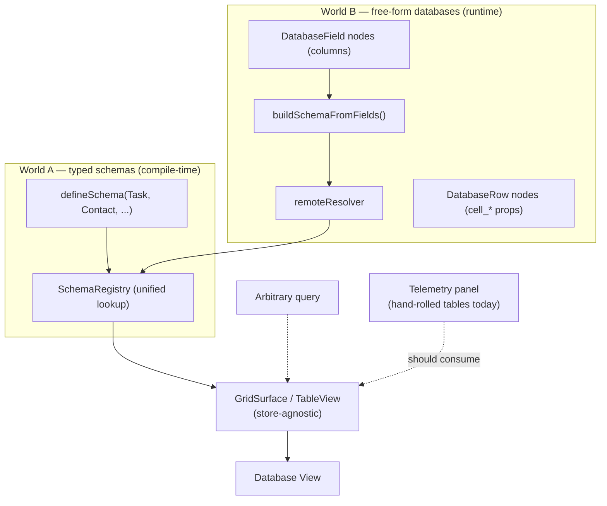
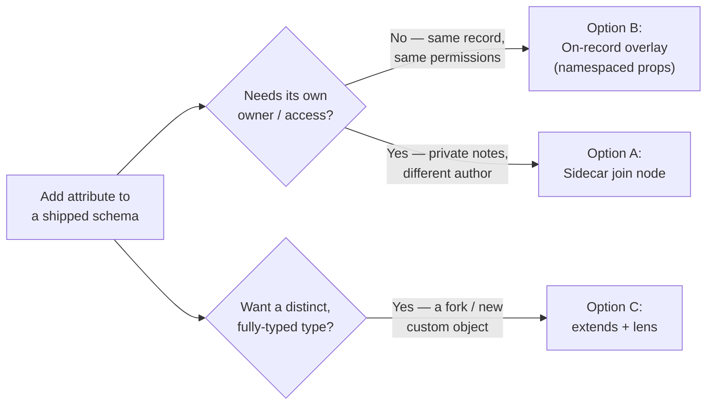
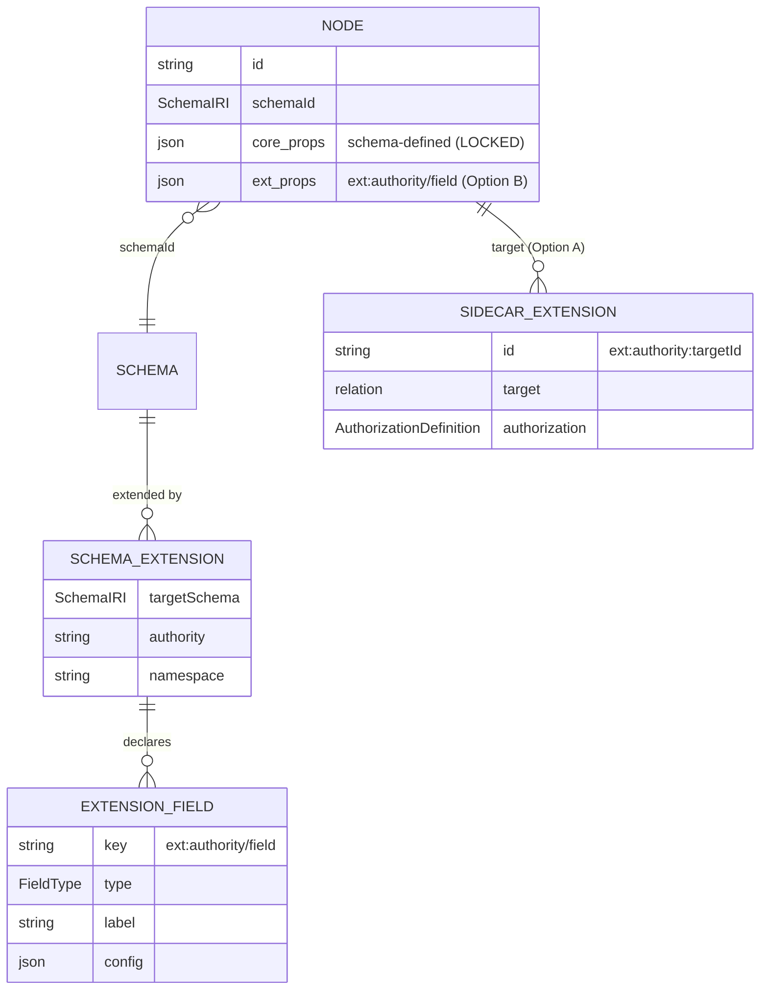

# Extensible Schemas And A Universal Database View

> Status: unimplemented (`[_]`). Sequence `0188`. Builds on the schema
> system (`packages/data`), the database/grid UI (`packages/views`,
> `apps/web/src/components/DatabaseView.tsx`), and the authorization
> cascade explored in
> [`0181_[_]_SPACES_AS_NESTED_GROUPINGS_AND_SCHEMA_AUTHORIZATION.md`](0181_[_]_SPACES_AS_NESTED_GROUPINGS_AND_SCHEMA_AUTHORIZATION.md).

## Problem Statement

xNet ships a growing library of **typed, compile-time schemas** — `Task`,
`Page`, `Account`/`Transaction`/`Posting` (the ledger), `Metric`/`Observation`
(experiments), and soon a `Contact` for the CRM push. These are great defaults,
but their property set is fixed in code. A user who wants to track
`leadScore` on a Contact, `billableRate` on a Task, or `vintage` on a wine
record has no first-class way to add their own attributes.

Three intertwined asks fall out of this:

1. **Extend shipped schemas.** Let a user (or an org) attach their own
   attributes to a built-in schema without forking it — and without being
   able to corrupt the fields the schema hard-codes.
2. **A universal database view.** Make *any* node in the database
   browsable and editable through the existing database table UI: pick a
   schema (or a saved database, or run a query), see the rows, edit cells,
   and have edits write straight back. The telemetry/devtools "Usage" panel
   should stop hand-rolling tables and consume this same native component.
3. **Render permissions.** Show "who can do what" for a given schema/database
   — ideally surfaced automatically in the share dialog, with schema-locked
   fields and inherited access made legible.

The user's instinct in the prompt — *"the easiest way to add custom fields is
a record joined to whatever thing they want to extend"* — is the right
starting hypothesis. This document sanity-checks it against the codebase and
the alternatives, and lands on a layered recommendation.

## Executive Summary

The good news: **most of the machinery already exists**, scattered across
the data and views packages. xNet's node model is physically open
(`Node` is `{ ...fields, [key: string]: unknown }`, with per-property LWW), it
already has a free-form database model (`DatabaseField` columns +
`DatabaseRow` cells), a schema registry that can resolve runtime-defined
schemas through a remote resolver, an `extends`/`migrateFrom` field already
plumbed onto `defineSchema`, and a Cambria-style bidirectional **lens** system
for schema evolution. The work is mostly *connecting and exposing* these, not
inventing them.

Recommended path, in dependency order:

1. **Universal database view first** (the user's "better first step"). Teach
   the grid to render any `Schema` — built-in typed schemas, database-derived
   schemas, or an arbitrary query — by reusing the existing
   `Schema → columns` machinery. This is high-value on its own and is the
   substrate everything else rides on.
2. **Additive overlay extensions (primary).** Store custom attributes as
   **namespaced properties directly on the node** (`ext:authority/field`),
   described by a registered `SchemaExtension` (reusing the `DatabaseField`
   column primitive but targeting a `schemaId` instead of a `databaseId`). The
   grid renders the *effective schema* = core + registered extensions, with
   core (schema-defined) fields rendered **locked/read-only**.
3. **Sidecar extensions (secondary).** Keep the user's join-node idea for the
   cases the overlay can't serve: *independently authored or
   differently-permissioned* attributes (e.g. "my private CRM notes" on a
   Contact someone else owns). This is just the existing edge-node pattern
   (`SpaceMembership`, `Grant`) pointed at arbitrary nodes.
4. **Permissions panel.** Reflect the schema's `authorization` DSL into a
   role × action matrix, resolve concrete members via the existing evaluator,
   and surface it as a tab in `ShareDialog`.

The overlay-vs-sidecar split maps cleanly onto the classic **JSONB vs EAV**
tradeoff: on-record overlay wins on storage and query speed (and xNet's
per-key-LWW storage is essentially "JSONB with CRDT timestamps"); the sidecar
join wins when an attribute needs its own owner or its own access rules.

## Current State In The Repository

### Two worlds for "what a row is"

xNet today has two largely-separate ways data gets structured.

**World A — typed, compile-time schemas.** Defined with `defineSchema` in
[`packages/data/src/schema/define.ts`](packages/data/src/schema/define.ts),
property set fixed in code via builders from
[`packages/data/src/schema/properties/`](packages/data/src/schema/properties/index.ts):

```typescript
// packages/data/src/schema/schemas/task.ts
export const TaskSchema = defineSchema({
  name: 'Task',
  namespace: 'xnet://xnet.fyi/',
  properties: {
    title: text({ required: true, maxLength: 500 }),
    status: select({ options: [/* todo / in-progress / done */] as const }),
    dueDate: date({}),
    assignee: person({}),
    project: relation({ target: 'xnet://xnet.fyi/Project@1.0.0' as const }),
  },
  document: 'yjs',
  authorization: spaceCascadeAuthorization(),
})
```

All ~50 built-ins are lazy-registered through a barrel in
[`packages/data/src/schema/schemas/index.ts`](packages/data/src/schema/schemas/index.ts)
and resolved by the `SchemaRegistry`
([`packages/data/src/schema/registry.ts`](packages/data/src/schema/registry.ts)).

**World B — free-form user databases.** A `Database` node holds only metadata;
the *columns* are separate `DatabaseField` nodes and the *rows* are
`DatabaseRow` nodes whose cell values are stored as **dynamic, namespaced
properties** with a `cell_` prefix
([`packages/data/src/database/cell-types.ts:57`](packages/data/src/database/cell-types.ts:57)):

```typescript
export const CELL_PREFIX = 'cell_'
export function cellKey(columnId: string): string { return CELL_PREFIX + columnId }
// A row node: { id, database: 'db456', sortKey: 'a0', cell_name: 'John', cell_status: 'active' }
```

Crucially, the two worlds **already converge** at the registry. A database's
columns get synthesized into a real `Schema` object on demand by
[`buildSchemaFromFields`](packages/data/src/database/schema-from-fields.ts),
and that resolver is wired into the same registry the typed schemas use:

```typescript
// packages/data/src/database/schema-from-fields.ts
schemaRegistry.setRemoteResolver(createNodeDatabaseSchemaResolver({ store }))
// resolves IRIs like  xnet://xnet.fyi/db/<databaseId>@<version>
```

So the registry is *already* a unified lookup over (built-in typed schemas)
∪ (runtime database-derived schemas). This is the seam the universal view and
extensions both exploit.

### The node model is physically open

Storage is per-property, last-writer-wins. `NodePayload.properties` is
`Record<PropertyKey, unknown>` and `Node` is open
([`packages/data/src/schema/node.ts`](packages/data/src/schema/node.ts),
[`packages/data/src/store/types.ts`](packages/data/src/store/types.ts)):

```typescript
export interface Node {
  id: string; schemaId: SchemaIRI; createdAt: number; createdBy: DID
  [key: string]: unknown   // ← schema-defined *and* arbitrary properties
}
```

That means an extra attribute can *physically* live on a `Task` today — it
syncs and conflict-resolves per-key like any other property. What's missing is
a way to (a) *describe* the extra attribute so the UI knows it exists, (b)
*validate* it without rejecting it as unknown, and (c) *lock* the core fields.

### Latent primitives already in the tree

These exist but are under-exposed — the recommendation leans on all of them:

- **Schema inheritance.** `defineSchema` already accepts `extends?` and
  `migrateFrom?`, and serializes them onto the schema record
  ([`define.ts:55`](packages/data/src/schema/define.ts:55),
  [`define.ts:148-150`](packages/data/src/schema/define.ts:148)). The
  `Schema` type carries `extends?: SchemaIRI`
  ([`packages/data/src/schema/types.ts:100`](packages/data/src/schema/types.ts:100)).
  The plumbing is present; consumption (validation/merge/UI) is not built out.
- **Cambria-style lenses.** A full bidirectional lens system with BFS
  pathfinding lives in
  [`packages/data/src/schema/lens.ts`](packages/data/src/schema/lens.ts) and
  [`lens-builders.ts`](packages/data/src/schema/lens-builders.ts)
  (`LensRegistry`, `forward`/`backward`, `lossless`, `convert()`). This is the
  evolution story for when an extension graduates into a real schema bump.
- **Schemas-as-nodes.** `SchemaDefinitionSchema`
  ([`packages/data/src/schema/schemas/system.ts`](packages/data/src/schema/schemas/system.ts))
  models a published schema as a signed, versioned, authority-stamped node,
  indexed by
  [`SystemSchemaIndex`](packages/data/src/schema/system-index.ts). User- or
  org-defined schemas are already a modeled concept.
- **Edge-node pattern.** `SpaceMembership`
  ([`space-membership.ts`](packages/data/src/schema/schemas/space-membership.ts))
  and `Grant` ([`grant.ts`](packages/data/src/schema/schemas/grant.ts)) are
  first-class join nodes with deterministic IDs (`spacemember:<space>:<did>`)
  so re-adds upsert. The "sidecar extension" is this exact pattern.

### The grid is store-agnostic; the telemetry panel is not

[`packages/views/src/grid/GridSurface.tsx`](packages/views/src/grid/GridSurface.tsx)
takes `fields: GridField[]` + `rows: GridRowData[]` and routes all mutations
through callbacks — it has no opinion about where data comes from.
[`packages/views/src/table/TableView.tsx`](packages/views/src/table/TableView.tsx)
already accepts a `schema`, a `view`, and `data`. The piece that maps schema
property definitions → grid columns exists for the database direction
(`fieldsToStoredColumns` / `buildDatabaseSchema`).

By contrast, the devtools telemetry/Usage panel
([`packages/devtools/src/panels/TelemetryPanel/TelemetryPanel.tsx`](packages/devtools/src/panels/TelemetryPanel/TelemetryPanel.tsx))
hand-rolls bespoke list components (`SecurityEventEntry`, `BucketDistribution`)
over aggregated objects that aren't even nodes. This is exactly the "should use
the native component" case from the prompt.



## External Research

- **EAV vs JSONB.** Across multiple write-ups, on-record JSON columns beat
  Entity-Attribute-Value for storage (~3× smaller incl. indexes) and for most
  query mixes (sometimes dramatically without indexes), while EAV only wins at
  "find rows with a specific attribute value" and at per-attribute concurrency
  / locking. The consensus recommendation is a **hybrid**: model frequent,
  important attributes as real columns and put rare/custom ones in a JSON
  column. xNet's per-property-LWW store is effectively "JSONB with a CRDT
  timestamp per key," which makes the **on-record overlay the cheap default**
  and the join-node the deliberate exception. ([coussej](https://coussej.github.io/2016/01/14/Replacing-EAV-with-JSONB-in-PostgreSQL/),
  [Leapcell](https://leapcell.io/blog/storing-dynamic-attributes-sparse-columns-eav-and-jsonb-explained),
  [Cybertec — "don't do EAV"](https://www.cybertec-postgresql.com/en/entity-attribute-value-eav-design-in-postgresql-dont-do-it/))
- **Notion / Airtable / Salesforce.** Airtable and Salesforce enforce schema
  at the table/object level with strongly-typed custom fields and custom
  objects; Notion mixes structured and unstructured content and keeps a
  smaller, friendlier field-type set. The lesson for xNet: typed defaults +
  user-added custom fields is the proven CRM/database UX, and "custom object"
  (a whole new schema) and "custom field" (an attribute on an existing one)
  are *distinct* features users expect. ([Airtable vs Notion](https://www.jotform.com/blog/airtable-vs-notion/),
  [Airtable vs Salesforce](https://builtonair.com/airtable-vs-salesforce/))
- **RDF / JSON-LD open-world assumption.** xNet schemas are already JSON-LD
  shaped (`@id`, `@type`, IRIs per property). RDF's open-world model — *anyone
  can say anything about anything*, schemas are open and extensible by mixing
  vocabularies — is the philosophical match for the user's join-node instinct
  and for the namespaced-overlay approach: an extension is just additional
  statements about an existing resource, under a different authority's
  namespace. ([W3C DCAT rationale](https://arxiv.org/pdf/2303.08883),
  [RDF 1.1 overview](https://arxiv.org/pdf/2001.00432))
- **Local-first schema evolution.** Project Cambria provides bidirectional
  lenses for local-first apps; Evolu sidesteps migrations by making all
  non-id columns nullable so out-of-order CRDT messages always converge;
  ElectricSQL streams DDL with causal consistency. The takeaway: **additive,
  nullable, namespaced changes are safe by construction** in a CRDT world (an
  old client simply doesn't have the key), whereas renames/retypes need a lens.
  xNet already ships the lens registry for the latter.
  ([Evolu migrations](https://www.evolu.dev/docs/migrations),
  [Synking with CRDTs](https://dev.to/charlietap/synking-all-the-things-with-crdts-local-first-development-3241))

## Key Findings

1. **The registry already unifies typed and runtime schemas.** Everything the
   universal view needs to render "any schema" is reachable behind
   `schemaRegistry.get(iri)` — built-ins, database-derived schemas, and
   (via `SystemSchemaIndex`) published schema nodes.
2. **The node store is open and per-key LWW.** Namespaced overlay attributes
   are storable *today*; the missing parts are description, validation
   allow-listing, and field locking — all UI/metadata concerns, not storage
   ones.
3. **The `cell_` prefix is the precedent for safe namespacing.** Extensions
   should use an analogous `ext:<authority>/<field>` convention so user
   attributes can never collide with or overwrite schema-defined keys.
4. **Inheritance + lenses already exist** for the heavier "fork into a real
   schema" path, so the lightweight overlay doesn't have to pretend to be the
   only extension mechanism.
5. **The grid is ready; the consumers aren't.** `GridSurface`/`TableView` are
   store-agnostic. The work is a `schema → GridField[]` adapter for typed
   schemas plus a node-backed data source, after which the telemetry panel and
   future workbenches can all drop their bespoke tables.
6. **Permissions are fully derivable.** The `authorization` DSL on each schema
   plus the evaluator's `resolveRoles`
   ([`packages/data/src/auth/evaluator.ts`](packages/data/src/auth/evaluator.ts))
   already compute "who has which role." A permissions panel is *reflection +
   resolution*, not new policy.

## Options And Tradeoffs

### How to extend a schema



#### Option A — Sidecar / join-node extension (the prompt's instinct)

A separate node referencing the base node via `relation`, holding the custom
attributes. This is the existing edge-node pattern, generalized.

```typescript
const ContactCrmExtension = defineSchema({
  name: 'ContactCrmExtension',
  namespace: 'xnet://acme.com/',
  properties: {
    target: relation({ target: 'xnet://xnet.fyi/Contact@1.0.0', required: true }),
    leadScore: number({ min: 0, max: 100 }),
    nextTouch: date({}),
  },
  authorization: presets.private(),   // ← its own access rules
})
// deterministic id  ext:<authority>:<targetId>  → upsert, one overlay per (authority, node)
```

- **Pros:** zero changes to the base schema; the extension carries *its own*
  authorization (your private CRM notes on a Contact you don't own); naturally
  multi-tenant (each org/user namespaces its own overlay); matches RDF
  open-world and the existing `SpaceMembership`/`Grant` precedent; easy to
  revoke/delete wholesale.
- **Cons:** **read amplification** — every row render is a join; sorting and
  filtering across base + extension needs the planner to join; the UI must
  merge two nodes into one logical row; "find Contacts where leadScore > 80"
  is the EAV-weak-spot query unless the overlay is indexed.

#### Option B — On-record overlay (namespaced properties) — *recommended primary*

Write custom attributes straight onto the base node under a reserved
namespace, described by a registered extension descriptor.

```typescript
// stored on the Contact node itself:
{ id: 'contact1', schemaId: '.../Contact@1.0.0',
  name: 'Ada', email: 'ada@x.com',
  'ext:acme.com/leadScore': 87,           // ← overlay attribute, per-key LWW
  'ext:acme.com/nextTouch': 1718409600000 }
```

The attribute is *described* by a `SchemaExtension` field node (see Example
Code) so the grid knows its type, label, and that it's editable.

- **Pros:** **no join** — one node, fast sort/filter, value travels and syncs
  with the record and inherits its authorization automatically; this is the
  JSONB approach the research favors; reuses per-key LWW conflict resolution
  for free; the `cell_` precedent proves the namespacing pattern works.
- **Cons:** the overlay inherits the base node's access (can't be *more*
  private than the record — use Option A for that); the validator must
  allow-list `ext:*` keys instead of rejecting unknowns; the schema handed to
  the grid must be the **effective** schema (core + registered extensions),
  computed at resolve time.

#### Option C — Inheritance (`extends`) + lens migration

Define `ContactPlus extends Contact`, add typed fields, migrate existing
Contacts forward with a registered lens.

- **Pros:** fully typed and first-class; correct when the user is really
  creating a *new custom object* (a fork), not just decorating an existing one;
  the `extends`/`migrateFrom`/`LensRegistry` plumbing already exists.
- **Cons:** forks the type — `Contact` and `ContactPlus` are different
  `schemaId`s, so "all contacts" queries must union; doesn't *compose* when two
  parties each want to extend the same base; heavyweight for "just add a
  column." Best reserved for deliberate schema authorship, with the overlay as
  the everyday path.

| Dimension | A — Sidecar | B — Overlay (rec.) | C — extends/lens |
|---|---|---|---|
| Base schema changes | none | none | new schema |
| Storage shape | extra node (EAV-like) | on-record (JSONB-like) | on-record, new type |
| Read cost | join | none | none |
| Sort/filter on attr | join/index needed | native | native |
| Independent access | ✅ own auth | ❌ inherits base | ✅ (separate type) |
| Composes (N extenders) | ✅ | ✅ (namespaced) | ❌ |
| Typed at compile time | ✅ (extension type) | ⚠️ descriptor-typed | ✅ |
| Best for | private/foreign overlays | everyday custom fields | custom objects / forks |

### How to surface "any node" in the database view

- **B1 — Schema picker.** A dropdown of registered schemas (typed + databases),
  rendering the chosen schema's nodes. Simplest; matches the prompt's "select
  an existing database or select an existing schema."
- **B2 — Arbitrary query.** A query input (descriptor or a small query
  language) feeding `useSavedView`/`useQuery`, with the schema picker as a
  quick-select shortcut that *prefills* a query. The prompt explicitly lands
  here: *"maybe we just support performing arbitrary queries, but we also have
  some UI to quick-select based on the table."*
- **B3 — Saved view nodes.** Persist B2 as `SavedView`/`DatabaseView` nodes
  (both already exist), so a constructed view becomes a durable, shareable tab.

Recommend **all three as one feature**: quick-select (B1) writes a descriptor
(B2) that can be saved (B3). It reuses `SavedViewDescriptor` and the existing
view-node schemas end-to-end.

### How to render permissions

- **C1 — Static badges only** (today's `SpaceHomeView` / `ShareDialog`
  level): list members + role chips. Cheap, but doesn't explain *why* someone
  has access or *what* a role can do.
- **C2 — Role × action matrix.** Reflect the schema's `authorization` actions
  (`read/comment/write/delete/share/admin`) against its roles, then resolve
  concrete members per role via the evaluator. Explains both "what each role
  can do" and "who is in each role, and how they got there"
  (creator / space cascade / share-link grant).
- **C3 — Per-row effective permissions.** Evaluate the current viewer's
  decision per node and annotate locked/uneditable rows or fields. Most
  precise, most expensive; good as a later refinement (e.g. greying cells the
  viewer can't write).

Recommend **C2 as a new tab in `ShareDialog`**, auto-populated from the
schema, with a small **per-viewer summary** ("You: can edit · via Space admin")
borrowed from C3. For extended schemas, render base auth and any
sidecar-extension auth as distinct sections so the access boundary is legible.

## Recommendation

Ship in four layers, each independently valuable:

1. **Universal database view** — generalize the grid to render any schema and
   make the telemetry panel its first new consumer.
2. **On-record overlay extensions (Option B)** as the default "add a custom
   field" path, with **field locking** so schema-defined properties are
   read-only and only `ext:*` keys are user-editable.
3. **Sidecar extensions (Option A)** retained for private/foreign overlays,
   reusing the edge-node pattern.
4. **Permissions matrix (Option C2)** in the share dialog, plus
   `extends`/lens (Option C) documented as the "graduate to a real schema"
   escape hatch.

Why this order: layer 1 is the substrate the user themselves identified as the
"better first step," and it pays for itself (telemetry, finance, experiments
all stop hand-rolling tables). Layer 2 is the lowest-friction extension model
and the one the storage engine already rewards. Layers 3–4 round out the
sharp edges (independent access, legibility) without blocking the first two.

### Data model



### Editing flow (overlay)

```mermaid
sequenceDiagram
  participant U as User
  participant V as Database View (grid)
  participant R as SchemaRegistry
  participant M as useMutate
  participant S as NodeStore (per-key LWW)
  participant Q as live useQuery

  U->>V: open schema "Contact"
  V->>R: get effective schema (core + extensions)
  R-->>V: columns; core=locked, ext:*=editable
  U->>V: edit ext:acme.com/leadScore = 87 on row contact1
  V->>M: update(contact1, { 'ext:acme.com/leadScore': 87 })
  M->>S: write single property change (LWW)
  S-->>Q: change notification
  Q-->>V: row re-renders with new value
  Note over U,V: editing a *locked* core field is rejected client-side
```

## Example Code

A `SchemaExtension` reuses the proven `DatabaseField` column primitive but
targets a `schemaId` rather than a `databaseId`. Sketch only — names/paths
indicative:

```typescript
// packages/data/src/schema/schemas/schema-extension.ts  (new)
export const SchemaExtensionSchema = defineSchema({
  name: 'SchemaExtension',
  namespace: 'xnet://xnet.fyi/',
  properties: {
    targetSchema: text({ required: true }),   // e.g. 'xnet://xnet.fyi/Contact@1.0.0'
    authority: text({ required: true }),       // e.g. 'acme.com' or a did:key
    label: text({ maxLength: 200 }),
  },
  authorization: spaceCascadeAuthorization(),  // extensions are themselves nodes
})

// An ExtensionField is a DatabaseField whose `database` points at a SchemaExtension.
// Reuse fieldsToStoredColumns() unchanged.

// ── Effective schema = core (locked) + registered extension fields ──
function buildEffectiveSchema(core: Schema, exts: ExtensionField[]): Schema {
  const lockedCore = core.properties.map((p) => ({ ...p, readonly: true }))
  const extProps = exts.map((f) => ({
    '@id': `${core['@id']}#ext/${f.authority}/${f.name}`,
    name: `ext:${f.authority}/${f.name}`,   // namespaced — never collides with core
    ...storedColumnToPropertyDef(f),
    readonly: false,
  }))
  return { ...core, properties: [...lockedCore, ...extProps] }
}

// Wire it into the SAME resolver seam databases already use:
schemaRegistry.setRemoteResolver(async (iri) => {
  const core = await resolveCoreOrDatabaseSchema(iri)      // existing path
  if (!core) return null
  const exts = await getExtensionFields(store, core['@id']) // SchemaExtension query
  return exts.length ? buildEffectiveSchema(core, exts) : core
})
```

```typescript
// Reading + writing an overlay attribute from the UI — no new store API.
const { data: contacts } = useQuery(ContactSchema)              // overlay keys ride along
const { update } = useMutate()
await update(ContactSchema, contact.id, { 'ext:acme.com/leadScore': 87 })

// Validation guard (in defineSchema's validate / the write path):
//   allow keys that are schema-defined OR match /^ext:[^/]+\/.+/
//   reject writes to a schema-defined key flagged readonly via the grid
```

```typescript
// Permissions reflection for the ShareDialog tab (C2):
const schema = await schemaRegistry.get(node.schemaId)
const auth = deserializeAuthorization(schema.authorization)        // roles + actions
const matrix = ACTIONS.map((a) => ({ action: a, roles: rolesAllowing(auth, a) }))
const members = await Promise.all(
  Object.keys(auth.roles).map(async (role) => ({
    role,
    members: await resolveRoleMembers(auth.roles[role], node, schema, deps),
  })),
)
// render: action × role matrix  +  members grouped by how they got the role
```

## Risks And Open Questions

- **Validator behavior on unknown keys.** Need to confirm whether
  `defineSchema().validate()` and the write path currently reject keys not in
  `properties`. The overlay requires they *accept* `ext:*` keys. (Storage
  already persists them; this is a validation-policy decision.)
- **Field locking enforcement layer.** Read-only on core fields must be
  enforced where writes happen (mutate/store), not just hidden in the grid —
  otherwise a programmatic client could overwrite `status`. Tie locking to
  "key is schema-defined and not `ext:*`."
- **Query pushdown for overlay attributes.** `where: { 'ext:acme.com/leadScore':
  ... }` should push down to indexed storage like core props
  (cf. the auth-pushdown work in
  [`0182`](0182_[_]_USEQUERY_USEMUTATE_PERFORMANCE_FRONTIER.md)); otherwise
  filtering custom fields falls back to scans — the EAV weak spot.
- **Namespace governance.** Who owns `ext:acme.com/*`? Recommend authority =
  the extending Space's id or the creator DID, mirroring the `xnet://authority/`
  IRI convention, so collisions are impossible across tenants.
- **Sync recipients for sidecars.** A more-private sidecar on a shared node
  must compute its *own* recipients (`computeRecipients`) — confirm the
  encryption path treats the sidecar independently, not inheriting the base's
  recipient set.
- **Migration when an overlay graduates.** Promoting `ext:acme.com/leadScore`
  into a real schema property is a lens (`forward` copies overlay→core,
  `backward` reverses). Define the lens authoring UX before users accumulate
  large overlays.
- **Telemetry as nodes vs adapter.** The telemetry panel's data isn't nodes
  today. Decide: persist usage events as nodes (reuse
  `packages/abuse/src/usage-events.ts` schema) so the grid renders them
  natively, or provide a thin `GridField[]/GridRowData[]` adapter for
  non-node sources. Persisting is cleaner long-term; the adapter is faster to
  ship.
- **Permissions matrix accuracy.** Reflecting the DSL can drift from runtime
  reality (grants, deny precedence, parent-chain cascade). The panel should
  resolve through the *evaluator*, not re-implement the rules.

## Implementation Checklist

- [ ] **Layer 1 — Universal view**
  - [x] Add `schemaToGridFields(schema)` adapter (mirror of
        `fieldsToStoredColumns`) so any `Schema` yields `GridField[]`.
        → `packages/views/src/grid/schema-to-grid-fields.ts` (carries
        `readonly`, unwraps `ext:` labels, resolves select options).
  - [x] Add the schema half of the node-backed grid source:
        `useEffectiveSchema(schemaId)` resolves core + live extensions reactively
        (`packages/react/src/hooks/useEffectiveSchema.ts`), feeding
        `schemaToGridFields`. Rows/edit callbacks bind via the existing
        `useQuery`/`useMutate` (cells = node properties; keys map 1:1).
  - [ ] Extend `DatabaseView` (or a new `/data` mode) with a **schema/database
        quick-select** that builds a `SavedViewDescriptor`. *(Deferred —
        follow-up. Keystone shipped: `useEffectiveSchema` + `schemaToGridFields`
        + `GridSurface` are all that a `useSchemaGrid` route needs to bind.)*
  - [ ] Support an **arbitrary query** input feeding `useSavedView`, savable as
        a `SavedView`/`DatabaseView` node. *(Deferred — follow-up.)*
  - [ ] Refactor `TelemetryPanel` to render via the shared grid. *(Deferred —
        follow-up; first consumer of the universal grid route above.)*
- [ ] **Layer 2 — Overlay extensions**
  - [x] Add `SchemaExtensionSchema` + an `ExtensionField` (reuse
        `DatabaseField`) targeting a `schemaId`.
        → `packages/data/src/schema/schemas/schema-extension.ts`
  - [x] Implement `buildEffectiveSchema(core, exts)` and wire it into schema
        resolution alongside the database resolver.
        → `buildEffectiveSchema` (`effective-schema.ts`) + `resolveEffectiveSchema`
        / `loadExtensionFields` (`extension-resolver.ts`). NOTE: built-ins
        short-circuit the registry's `remoteResolver` and effective schemas are
        dynamic, so composition happens **reactively at read time**, not cached
        in the registry. Tests prove built-ins + DB schemas both compose.
  - [x] Reserve the `ext:<authority>/<field>` namespace; update `validate()` to
        allow-list it and to flag schema-defined keys `readonly`.
        → `packages/data/src/schema/extension.ts` (`ext:` namespace),
        `PropertyDefinition.readonly`, `buildEffectiveSchema` locks core props.
        `validate()` already passes unknown keys, so `ext:*` overlays persist.
  - [x] Enforce field locking (structural: no rename/retype/delete of core
        columns; cell *values* stay editable).
        → `canModifyColumn` / `findLockedColumns` (data) + `GridField.readonly`
        carried by `schemaToGridFields`; the grid's field menu honors it.
  - [x] "+ Add field" on a typed schema creates an `ExtensionField` (logic);
        core columns render locked, `ext:*` columns editable.
        → `createExtensionField` / `ensureSchemaExtension`
        (`packages/data/src/database/extension-field-operations.ts`), tested.
  - [x] Push overlay keys through query pushdown for `where`/`orderBy`.
        → No new code needed: overlay keys are ordinary node properties, so the
        existing `NodeQueryDescriptor.where` path handles them. Proven by
        `extension-resolver.test.ts` ("filterable through the standard where path").
- [ ] **Layer 3 — Sidecar extensions**
  - [x] Scaffold the join-node pattern (deterministic `sidecar:<authority>:<targetId>`
        id) with its own `authorization`.
        → `packages/data/src/schema/sidecar.ts` (`sidecarId`), tested.
  - [x] Grid merges sidecar attributes into the logical row under the same
        `ext:<authority>/<field>` keys overlays use.
        → `sidecarOverlayKeys` / `mergeSidecarsIntoRow`, tested.
  - [ ] Verify independent recipient computation for sidecars (uses existing
        `computeRecipients` against the sidecar's own authorization — left as a
        follow-up integration check).
- [ ] **Layer 4 — Permissions**
  - [x] Build the role × action matrix from `schema.authorization`.
        → `packages/data/src/auth/permission-matrix.ts`
        (`buildPermissionMatrix`, negation-aware allow/deny/public/authenticated
        summary + `describeRoleResolver` provenance). Fully unit-tested.
  - [~] Resolve members per role via the evaluator (creator / space cascade /
        grants), grouped by provenance.
        → roles + provenance are shown structurally; actual grantees appear in
        the existing People tab. Full per-role member *enumeration* via the
        evaluator is left as a follow-up.
  - [x] Add a "Permissions" tab to `ShareDialog`, auto-populated.
        → `apps/web/src/components/PermissionMatrixPanel.tsx` + new tab in
        `ShareDialog.tsx` (role × action grid, public/authenticated/deny badges,
        role provenance). apps/web typechecks clean.
  - [ ] Render base vs sidecar-extension auth as distinct sections. (follow-up)
- [ ] **Cross-cutting**
  - [x] Author a lens template for "overlay → core property" graduation.
        → `promoteOverlay(authority, field, coreProp)` in
        `packages/data/src/schema/lens-builders.ts` (lossless), tested.
  - [x] Docs page: custom fields (overlay), custom overlays (sidecar), custom
        objects (`extends`).
        → `site/src/content/docs/docs/schemas/extending-schemas.mdx`
        (+ registered in `site/src/sidebar.mjs`).

## Validation Checklist

Status legend: [x] verified by automated tests in this PR · [~] partially
verified · [ ] deferred to the follow-up UI-surface work.

- [x] `useEffectiveSchema` composes a built-in schema (e.g. `Task`) with live
      extension fields → `schemaToGridFields` yields the columns the grid
      renders. (`useEffectiveSchema.test.tsx`, `schema-to-grid-fields.test.ts`)
- [ ] End-to-end in the live app: selecting a schema in a universal view and
      editing cells writes back. *(Deferred — needs the universal route.)*
- [ ] The telemetry/Usage panel renders through the shared grid. *(Deferred.)*
- [x] Adding a custom field creates an `ExtensionField` and the overlay value
      persists on the node under `ext:*`. (`extension-field-operations.test.ts`,
      `extension-resolver.test.ts` — persist + update round-trip)
- [x] Schema-defined (core) columns are flagged `readonly` (structurally
      locked); `canModifyColumn`/`findLockedColumns` reject restructuring them.
      (`effective-schema.test.ts`)
- [x] `where: { 'ext:authority/field': ... }` filters through the standard query
      path. (`extension-resolver.test.ts` — "filterable through the where path")
- [x] Sidecar projection + deterministic id + row merge.
      (`sidecar.test.ts`); independent-recipient verification deferred.
- [x] The permission matrix matches the schema policy (private / publicRead /
      space cascade), incl. deny/public/authenticated. (`permission-matrix.test.ts`)
- [x] Overlay → core lens round-trips losslessly. (`lens-promote-overlay.test.ts`)
- [x] No regression: full `@xnetjs/data` suite (1412 tests) and the views grid
      suite (152 tests, incl. `GridSurface`) pass with these changes.

## References

### Codebase
- [`packages/data/src/schema/define.ts`](packages/data/src/schema/define.ts) — `defineSchema`, `extends`/`migrateFrom` plumbing
- [`packages/data/src/schema/types.ts`](packages/data/src/schema/types.ts) — `Schema` (`extends`, properties)
- [`packages/data/src/schema/registry.ts`](packages/data/src/schema/registry.ts) — registry + `setRemoteResolver`
- [`packages/data/src/schema/lens.ts`](packages/data/src/schema/lens.ts), [`lens-builders.ts`](packages/data/src/schema/lens-builders.ts) — Cambria-style migration lenses
- [`packages/data/src/schema/schemas/system.ts`](packages/data/src/schema/schemas/system.ts), [`system-index.ts`](packages/data/src/schema/system-index.ts) — schemas-as-nodes
- [`packages/data/src/database/schema-from-fields.ts`](packages/data/src/database/schema-from-fields.ts) — `buildSchemaFromFields`, node-backed resolver
- [`packages/data/src/database/cell-types.ts`](packages/data/src/database/cell-types.ts) — `cell_` namespacing precedent
- [`packages/data/src/schema/schemas/database.ts`](packages/data/src/schema/schemas/database.ts), [`database-field.ts`](packages/data/src/schema/schemas/database-field.ts), [`database-row.ts`](packages/data/src/schema/schemas/database-row.ts), [`database-view.ts`](packages/data/src/schema/schemas/database-view.ts), [`saved-view.ts`](packages/data/src/schema/schemas/saved-view.ts)
- [`packages/data/src/schema/schemas/space-membership.ts`](packages/data/src/schema/schemas/space-membership.ts), [`grant.ts`](packages/data/src/schema/schemas/grant.ts) — edge-node pattern
- [`packages/data/src/auth/builders.ts`](packages/data/src/auth/builders.ts), [`presets.ts`](packages/data/src/auth/presets.ts), [`evaluator.ts`](packages/data/src/auth/evaluator.ts), [`recipients.ts`](packages/data/src/auth/recipients.ts), [`space-authorization.ts`](packages/data/src/schema/schemas/space-authorization.ts)
- [`packages/views/src/grid/GridSurface.tsx`](packages/views/src/grid/GridSurface.tsx), [`table/TableView.tsx`](packages/views/src/table/TableView.tsx), [`builtins.ts`](packages/views/src/builtins.ts), [`registry.ts`](packages/views/src/registry.ts)
- [`apps/web/src/components/DatabaseView.tsx`](apps/web/src/components/DatabaseView.tsx), [`DataWorkspaceView.tsx`](apps/web/src/components/DataWorkspaceView.tsx), [`ShareDialog.tsx`](apps/web/src/components/ShareDialog.tsx), [`SpaceHomeView.tsx`](apps/web/src/components/SpaceHomeView.tsx)
- [`packages/devtools/src/panels/TelemetryPanel/TelemetryPanel.tsx`](packages/devtools/src/panels/TelemetryPanel/TelemetryPanel.tsx), [`packages/abuse/src/usage-events.ts`](packages/abuse/src/usage-events.ts)
- [`packages/react/src/hooks/useQuery.ts`](packages/react/src/hooks/useQuery.ts), [`useMutate.ts`](packages/react/src/hooks/useMutate.ts), [`useSavedView.ts`](packages/react/src/hooks/useSavedView.ts), [`useGridDatabase.ts`](packages/react/src/hooks/useGridDatabase.ts)

### Related explorations
- [`0181_[_]_SPACES_AS_NESTED_GROUPINGS_AND_SCHEMA_AUTHORIZATION.md`](0181_[_]_SPACES_AS_NESTED_GROUPINGS_AND_SCHEMA_AUTHORIZATION.md)
- [`0182_[_]_USEQUERY_USEMUTATE_PERFORMANCE_FRONTIER.md`](0182_[_]_USEQUERY_USEMUTATE_PERFORMANCE_FRONTIER.md)
- [`0187_[_]_DOUBLE_ENTRY_ACCOUNTING_AND_PERSONAL_FINANCE.md`](0187_[_]_DOUBLE_ENTRY_ACCOUNTING_AND_PERSONAL_FINANCE.md)

### External
- [Replacing EAV with JSONB in PostgreSQL — coussej](https://coussej.github.io/2016/01/14/Replacing-EAV-with-JSONB-in-PostgreSQL/)
- [Storing Dynamic Attributes: Sparse Columns, EAV, and JSONB — Leapcell](https://leapcell.io/blog/storing-dynamic-attributes-sparse-columns-eav-and-jsonb-explained)
- [EAV design in PostgreSQL — don't do it — Cybertec](https://www.cybertec-postgresql.com/en/entity-attribute-value-eav-design-in-postgresql-dont-do-it/)
- [Airtable vs Notion 2026 — Jotform](https://www.jotform.com/blog/airtable-vs-notion/)
- [Airtable vs Salesforce — BuiltOnAir](https://builtonair.com/airtable-vs-salesforce/)
- [W3C DCAT v2: Rationale & Design Principles (RDF open-world)](https://arxiv.org/pdf/2303.08883)
- [RDF 1.1 overview](https://arxiv.org/pdf/2001.00432)
- [Evolu — Migrations (local-first, no-migration approach)](https://www.evolu.dev/docs/migrations)
- [Synking all the things with CRDTs — DEV](https://dev.to/charlietap/synking-all-the-things-with-crdts-local-first-development-3241)
