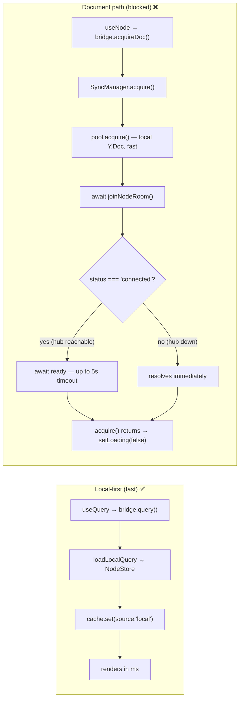
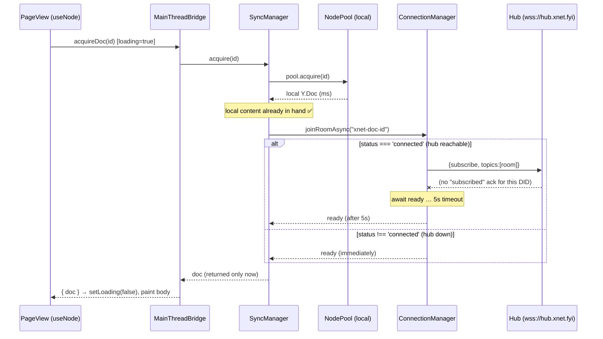
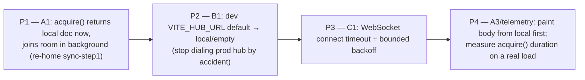

# Slow Page Loads: the Hub Blocks the Local Document Load

## Problem Statement

Opening the app — and opening "any of the pages" — shows nothing for **10, 20,
even 30 seconds** before content appears, despite a **mostly-empty local
database**. The reporter's intuition: *"it should load from local disk first,
before even bothering with the hub server."* That intuition is exactly right.
This exploration pins down **why** the local-first promise is broken on the
document path, and how to restore sub-second first paint.

This is a different failure than [exploration
0184](0184_%5Bx%5D_INITIAL_LOAD_PERFORMANCE_AT_LARGE_DATABASE_SCALE.md), which
explained the *large-database* cold-start stall (1 GB OPFS file, missing
`ANALYZE`, single serialized worker). 0184's levers don't apply here: the
database is empty, so there is no I/O to be slow. The cost here scales with
**network round-trips to the hub**, not with database size.

## Executive Summary

There are two independent code paths behind a "page load," and they behave very
differently:

1. **List reads — `useQuery`** are genuinely **local-first** and do *not* block
   on the hub. `MainThreadBridge.query()` loads from the local `NodeStore`,
   writes the result into the cache, and only *then* (optionally) consults a
   remote client; on an empty DB the local result returns in milliseconds
   ([`main-thread-bridge.ts:226-243`](../../packages/data-bridge/src/main-thread-bridge.ts)).
   A default query never goes "remote-only" unless it explicitly asks for
   `mode: 'remote'`
   ([`remote-query-execution.ts:68`](../../packages/data-bridge/src/remote-query-execution.ts)).
   **`useQuery` is not the bottleneck** — this rules out a whole class of
   suspicion.

2. **Document reads — `useNode`** (every *page*, canvas, or rich-text doc) are
   **not** local-first. `useNode` keeps `loading = true` until
   `bridge.acquireDoc(id)` resolves
   ([`useNode.ts:339,426,505`](../../packages/react/src/hooks/useNode.ts)), and
   `SyncManager.acquire()` loads the local Y.Doc from the pool **and then awaits
   a hub room-subscription confirmation before returning**
   ([`sync-manager.ts:1019-1045`](../../packages/runtime/src/sync/sync-manager.ts)).
   That confirmation has a **5-second timeout** and only blocks when the socket
   is in the `connected` state
   ([`connection-manager.ts:323-347`](../../packages/runtime/src/sync/connection-manager.ts)).

The trigger that turns (2) from "harmless" into "30 seconds" is the **default
hub URL**: the web app dials the **real production hub `wss://hub.xnet.fyi`** on
every load unless `VITE_HUB_URL` overrides it
([`App.tsx:67`](../../apps/web/src/App.tsx)). In local development that host is
*reachable* (so the socket reaches `connected`) but does not usefully ack the
client's per-document `subscribe` messages for an unknown/unauthorized DID — so
**every freshly-opened document eats up to the full 5 s timeout**, and the
already-in-hand local content is withheld behind it. Multiple documents per
route, React StrictMode double-mounting in dev, and reconnect churn
(`reconnectDelay = 2000`, `maxReconnects = Infinity`,
[`connection-manager.ts:82-83`](../../packages/runtime/src/sync/connection-manager.ts))
stack those 5 s waits into the 10–30 s the user observes.



The one-line fix: **`acquire()` must return the local doc immediately and join
the hub room in the background** (and dev should not default to the production
hub). Today the cheap local read is held hostage by a network round-trip that
provides no value at first paint.

## Current State In The Repository

### Path A — `useQuery` is correctly local-first (the innocent party)

`MainThreadBridge.query()` kicks off `loadInitialQuery`, which loads **local
first** and writes the local result to the cache *before* any remote work:

```ts
// packages/data-bridge/src/main-thread-bridge.ts:226-243
private async loadInitialQuery(queryId, descriptor) {
  if (shouldUseRemoteOnlyQuery(descriptor)) {       // only when mode === 'remote'
    await this.loadRemoteQuery(queryId, descriptor)
    return
  }
  const result = await this.loadLocalQuery(queryId, descriptor)  // ← cache.set(source:'local')
  const route = routeRemoteNodeQuery({ descriptor, hasRemoteClient: ..., localRowCount: ... })
  if (route.shouldRunRemote) {                       // background enrichment only
    await this.loadRemoteQuery(queryId, descriptor, route)
  }
}
```

`routeRemoteNodeQuery`
([`remote-query-execution.ts:81-214`](../../packages/data-bridge/src/remote-query-execution.ts))
defaults to **local** for the common case: `auto` source + no remote client →
`reason: 'auto-no-remote-client'`; small result → `reason: 'auto-small-result'`.
Remote only kicks in for `search`/`spatial`, very large local results
(≥10k/≥100k rows), or an explicit `mode`. The web app does not configure a
`remoteNodeQueryClient` by default, so even those routes fail *fast* with
"Remote query client unavailable"
([`main-thread-bridge.ts:314-316`](../../packages/data-bridge/src/main-thread-bridge.ts)) —
not a 30 s hang. **Conclusion: list views paint from local storage immediately.**

### Path B — `useNode` gates first paint on a hub round-trip (the culprit)

`useNode` is the hook behind page/canvas/document views. Its loader sets
`loading = true` and only clears it in a `finally` after the whole async body —
including doc acquisition — completes:

```ts
// packages/react/src/hooks/useNode.ts (load callback)
269  const [loading, setLoading] = useState(true)
...
334  if (hasDocument && !disableSync && !syncManager) { setLoading(true); return } // wait for SM
339  setLoading(true)
...
386  setData(flattenNode<P>(node))                  // node *properties* paint early (title etc.)
...
426  const acquired = await bridge.acquireDoc(id)   // ← BLOCKS here (the document body)
432  const storedContent = await store.getDocumentContent(id)  // local content applied AFTER
434  if (storedContent?.length) Y.applyUpdate(ydoc, storedContent, 'storage')
...
505  } finally { setLoading(false) }
```

Note line **432**: the local document content is read **after** `acquireDoc`
returns — so even though the bytes are on local disk the whole time, the view
cannot show the document body until the network-coupled `acquireDoc` resolves.

`acquireDoc` delegates to the SyncManager:

```ts
// packages/data-bridge/src/main-thread-bridge.ts:1206-1222
async acquireDoc(nodeId) {
  if (!this._syncManager) throw new Error('… requires SyncManager …')
  const doc = await this._syncManager.acquire(nodeId)   // ← awaits room join inside
  const awareness = this._syncManager.getAwareness(nodeId)
  return { doc, awareness }
}
```

And `SyncManager.acquire()` is where local-first is violated — it loads the
local doc, then **awaits the room join before returning**:

```ts
// packages/runtime/src/sync/sync-manager.ts:1019-1045
async acquire(nodeId) {
  registry.touch(nodeId)
  const doc = await pool.acquire(nodeId)        // local Y.Doc (fast — see below)
  setupDocBroadcast(nodeId, doc)
  getOrCreateAwareness(nodeId, doc)
  if (!roomCleanups.has(nodeId)) {
    await joinNodeRoom(nodeId)                   // ← AWAITS the hub subscription
  }
  if (connection.status === 'connected') sendSyncStep1(nodeId, doc)
  // …returns doc only after the await above…
}
```

`pool.acquire()` itself is purely local — `loadDoc` reads
`storage.getDocumentContent(nodeId)`, no network
([`node-pool.ts:67-71,145-159`](../../packages/runtime/src/sync/node-pool.ts)).
The blocking is entirely in `joinNodeRoom → await ready`:

```ts
// packages/runtime/src/sync/sync-manager.ts:616-650
async function joinNodeRoom(nodeId) {
  const room = `xnet-doc-${nodeId}`
  const { unsubscribe, ready } = connection.joinRoomAsync(room, (data) => handleSyncMessage(nodeId, data))
  roomCleanups.set(nodeId, unsubscribe)
  await ready                                    // ← up to 5s (see joinRoomAsync)
  …
}
```

```ts
// packages/runtime/src/sync/connection-manager.ts:323-347
if (isNewRoom && status === 'connected') {
  ready = new Promise<void>((resolve) => {
    pendingSubscriptions.set(room, { resolve, reject: () => resolve() })
    send({ type: 'subscribe', topics: [room] })
    setTimeout(() => {                           // resolve anyway after 5s
      if (pendingSubscriptions.has(room)) { pendingSubscriptions.delete(room); resolve() }
    }, 5000)
  })
} else {
  ready = Promise.resolve()                       // ← disconnected ⇒ instant
}
```

The asymmetry is the whole story:

| Hub state | `status` | `joinRoomAsync` `ready` | First paint of a document |
| --------- | -------- | ----------------------- | ------------------------- |
| Down / unreachable / DNS-fail | `connecting`/`error`/`disconnected` | `Promise.resolve()` (instant) | **fast** |
| **Reachable but doesn't ack `subscribe`** (default `wss://hub.xnet.fyi` for an unknown DID) | `connected` | resolves on the **5 s timeout** | **5 s per new document** |

### Why it reaches "connected" against the production hub by default

```ts
// apps/web/src/App.tsx:67
const DEFAULT_HUB_URL = import.meta.env.VITE_HUB_URL || 'wss://hub.xnet.fyi'
// :301  const [{ hubUrl, authToken }] = useState(() => resolveHubSessionFromLocation())
```

If `VITE_HUB_URL` is unset, every local/dev session opens a WebSocket to the
live hub. `doConnect()` sets `status = 'connected'` on `ws.onopen`
([`connection-manager.ts:207-219`](../../packages/runtime/src/sync/connection-manager.ts))
— i.e. as soon as the TLS/WS handshake completes, *before* any
application-level subscription is confirmed. From that moment, every new
document's `subscribe` waits the full 5 s because the production hub never sends
back a matching `{type:'subscribed'}` for rooms it won't serve this client.

### Why the magnitude reaches 10–30 s (not just 5 s)

- **Several docs per route.** A workbench view can mount more than one `useNode`
  (the open document plus referenced/embedded nodes, breadcrumbs, side panels).
  Each *new* room is an independent 5 s wait; mounting N fresh docs ≈ up to
  `N × 5 s` of perceived "loading."
- **React StrictMode (dev).** Effects mount→unmount→mount, doubling acquisitions
  and room churn during development.
- **Reconnect churn.** `reconnectDelay = 2000`, `maxReconnects = Infinity`
  ([`connection-manager.ts:82-83`](../../packages/runtime/src/sync/connection-manager.ts)).
  If the hub closes the socket (auth rejected) the client loops
  `connected → close → reconnect(2 s) → connected …`. Each brief `connected`
  window re-arms 5 s subscription waits for in-flight acquisitions.
- **No WebSocket connect timeout.** `new WebSocket(url, …)` has no explicit
  timeout ([`connection-manager.ts:205`](../../packages/runtime/src/sync/connection-manager.ts));
  the browser default governs how a *stalled* (not refused) handshake behaves,
  which can itself be tens of seconds before `onerror`/`onclose`.

### The startup gate (a secondary, one-time contributor)

Before *any* hook resolves, the app must finish a boot chain — SQLite WASM +
OPFS open ([`App.tsx:338-361`](../../apps/web/src/App.tsx),
[`web.ts:136-245`](../../packages/sqlite/src/adapters/web.ts)), identity
resume/unlock ([`App.tsx:387-417`](../../apps/web/src/App.tsx)), then
`NodeStore.initialize()` + `resolveRuntimeBridge()` before `setDataBridge(...)`
([`context.ts:633-692`](../../packages/react/src/context.ts)). While
`dataBridge` is `null`, every `useQuery` returns a loading snapshot. On an
**empty** DB this is normally sub-2 s, so it does not explain 30 s — but it is
the first slice of "before anything loads," and `useNode` additionally waits for
the SyncManager to exist ([`useNode.ts:334-337`](../../packages/react/src/hooks/useNode.ts)),
which is created only after `nodeStoreReady`
([`context.ts:782-862`](../../packages/react/src/context.ts)). Critically,
`sm.start()` is **fire-and-forget** ([`context.ts:862-869`](../../packages/react/src/context.ts)),
so the SyncManager's own `start()` (which `await`s `Promise.all(tracked.map(joinNodeRoom))`,
[`sync-manager.ts:978`](../../packages/runtime/src/sync/sync-manager.ts)) does
**not** block the bridge or queries — only per-`acquire` joins do.



## External Research

- **Local-first first principle: reads never block on the network.** RxDB's
  offline-first guidance and the broader local-first literature treat the local
  store as the source of truth for reads; the network is a background
  reconciler, not a gate. ([RxDB — Local/Offline First](https://rxdb.info/offline-first.html),
  [Holtwick — Resilient Sync for Local First](https://holtwick.de/en/blog/localfirst-resilient-sync))
- **Yjs / y-websocket separate "have a doc" from "is synced."** The provider
  exposes a `sync` event that fires *after* the server round-trip; the document
  is usable immediately and the `sync`/`synced` signal is an *enhancement*, not
  a precondition for rendering. Our `acquire()` conflates the two by awaiting
  the room before returning the doc. ([Yjs — y-websocket](https://docs.yjs.dev/ecosystem/connection-provider/y-websocket))
- **Browser WebSocket has no connect timeout and no native ping/pong.** You must
  implement application-layer heartbeats and your own connect/idle timeouts;
  intermediaries (proxies, NAT) commonly drop idle sockets at ~30 s, and a
  stalled handshake can hang far longer than a refused one. ([websockets —
  Timeouts](https://websockets.readthedocs.io/en/stable/topics/timeouts.html),
  [WebSocket.org — Fix WebSocket Timeout](https://websocket.org/guides/troubleshooting/timeout/))
- **Prior xNet work.** [0184 large-DB cold start](0184_%5Bx%5D_INITIAL_LOAD_PERFORMANCE_AT_LARGE_DATABASE_SCALE.md)
  (this is the *empty-DB / network* complement), [0182 useQuery/useMutate perf
  frontier](0182_%5B_%5D_USEQUERY_USEMUTATE_PERFORMANCE_FRONTIER.md), [0164
  worker-resident data layer](0164_%5Bx%5D_WORKER_RESIDENT_DATA_LAYER.md).

## Key Findings

| # | Finding | Where | Blocks first paint? | Lever |
| - | ------- | ----- | ------------------- | ----- |
| 1 | `useNode` holds `loading=true` until `acquireDoc()` resolves; local doc content is applied *after* the network-coupled acquire | [useNode.ts:339,426,432,505](../../packages/react/src/hooks/useNode.ts) | **Yes** (documents) | render local doc before joining room |
| 2 | `SyncManager.acquire()` `await`s `joinNodeRoom()` before returning the (already-loaded) local Y.Doc | [sync-manager.ts:1024-1034](../../packages/runtime/src/sync/sync-manager.ts) | **Yes** | make room-join fire-and-forget |
| 3 | New-room subscription waits up to **5 s** — but only while `status === 'connected'` | [connection-manager.ts:323-347](../../packages/runtime/src/sync/connection-manager.ts) | **Yes** when hub reachable | shorten/remove the blocking await; lower timeout |
| 4 | Web app defaults to the **production hub** `wss://hub.xnet.fyi` when `VITE_HUB_URL` unset → socket reaches `connected` and arms the 5 s waits | [App.tsx:67](../../apps/web/src/App.tsx) | Enables #3 | local/dev should not dial prod hub |
| 5 | No WebSocket connect timeout; reconnect loops forever at 2 s | [connection-manager.ts:82-83,205](../../packages/runtime/src/sync/connection-manager.ts) | Indirect (churn) | add connect timeout + heartbeat |
| 6 | One-time boot gate (WASM/OPFS + identity + bridge) before any hook resolves; `useNode` also waits for SyncManager to exist | [App.tsx:338-417](../../apps/web/src/App.tsx), [context.ts:633-862](../../packages/react/src/context.ts), [useNode.ts:334-337](../../packages/react/src/hooks/useNode.ts) | One-time, minor on empty DB | not the 30 s, but trims "before anything loads" |
| 7 | `useQuery` / list reads are local-first and **not** implicated | [main-thread-bridge.ts:226-243](../../packages/data-bridge/src/main-thread-bridge.ts), [remote-query-execution.ts:81-214](../../packages/data-bridge/src/remote-query-execution.ts) | No | (rule-out) |

**Honest non-findings.** The local stores are fast on an empty DB. The 5 s value
is a *fallback*, not the design intent — the code comment even says "resolve
anyway to avoid blocking." The bug is that `acquire()` treats that fallback as a
precondition for returning the doc. And `sm.start()` does **not** block render
(it is fire-and-forget); only per-document `acquire` joins do.

## Options And Tradeoffs

### A — Decouple local doc availability from the hub room-join (the real fix)

| Option | Pros | Cons |
| ------ | ---- | ---- |
| **A1. `acquire()` returns the local doc immediately; join the room in the background** (fire-and-forget, like `track()` already does at [sync-manager.ts:1007-1012](../../packages/runtime/src/sync/sync-manager.ts)) | Restores true local-first; sub-second paint regardless of hub; smallest behavioral change to the contract | Must ensure `sync-step1` still fires once the room is confirmed (move it into the room-join continuation / on `subscribed`) |
| **A2. Keep `acquire()` awaiting, but race the join against a short deadline** (e.g. 150–300 ms) | Tiny diff; still returns fast | Still pays a small tax on every open; arbitrary deadline |
| **A3. Apply local `storedContent` to the doc *before* `acquireDoc` in `useNode`** so the body shows even while acquire is pending | Targeted UI fix without touching sync | Splits doc-loading logic across two layers; doc identity/ownership gets subtle (who created the Y.Doc?) |

**Lean: A1.** It matches how `track()` already joins rooms (fire-and-forget) and
how Yjs providers separate "doc ready" from "synced." The only care item is
re-homing the initial `sendSyncStep1` so it runs when the subscription is
actually confirmed (the `subscribed` handler already exists,
[connection-manager.ts:124-133](../../packages/runtime/src/sync/connection-manager.ts)).

### B — Don't dial the production hub in local/dev (the trigger)

| Option | Pros | Cons |
| ------ | ---- | ---- |
| **B1. Default `VITE_HUB_URL` to empty/local in dev** so `status` never reaches `connected` against a server that won't ack | Removes the 5 s arming entirely for local work | Loses real-hub testing unless explicitly opted in |
| **B2. Document/standardize a local hub** (`ws://localhost:4444`) for `pnpm dev` | Real sync locally; honest test of the path | Requires running the hub; onboarding friction |
| **B3. Gate sync behind a "connect to hub" user action** | No surprise network on load | Changes product behavior |

**Lean: B1 for dev ergonomics now, B2 for anyone exercising sync.** B1 + A1
together make the symptom impossible: even if a dev *does* point at a slow hub,
A1 means the doc still paints immediately.

### C — Harden the connection layer (defense in depth)

| Option | Pros | Cons |
| ------ | ---- | ---- |
| **C1. Add an explicit WebSocket connect timeout** (e.g. 8–10 s) → treat as `error` and back off | Bounds the worst case for stalled handshakes | Another timer to maintain |
| **C2. Lower the subscription timeout** (5 s → ~1.5 s) and/or make it adaptive | Smaller tax if A1 isn't taken | Masks, doesn't fix, the coupling |
| **C3. Application-layer ping/pong heartbeat** (browsers expose no native ping) | Detects dead/idle sockets; avoids proxy 30 s drops | Net-new protocol surface on both ends |

**Lean: C1 now; C3 when sync is exercised in earnest.** C2 only matters if A1 is
deferred.

## Recommendation

Treat this as a **local-first correctness bug on the document path**, not a perf
tuning exercise. Two changes eliminate the symptom; the rest is hardening.



1. **P1 (highest leverage).** Make `SyncManager.acquire()` non-blocking on the
   room join: return the local doc immediately, join the room fire-and-forget,
   and send `sync-step1` from the join continuation / `subscribed` handler.
   `useNode` then flips `loading=false` as soon as local content is in the doc.
2. **P2.** Default the dev hub URL to local/empty so an unset `VITE_HUB_URL`
   doesn't open a socket to `wss://hub.xnet.fyi`. Make the production hub an
   explicit opt-in.
3. **P3.** Add a connect timeout to `doConnect()` and confirm the reconnect
   backoff can't spin hot.
4. **P4.** Add lightweight timing around `acquireDoc`/`acquire` (devtools query
   tracker already registers `useNode`,
   [useNode.ts:309-321](../../packages/react/src/hooks/useNode.ts)) to *prove*
   the before/after on a real load, and apply local `storedContent` before the
   acquire await as belt-and-suspenders.

Expected outcome: P1 alone returns first paint to "local read speed" (sub-second
on an empty DB) whether or not a hub is configured or reachable; P2 removes the
accidental trigger; P3 bounds pathological handshakes.

## Example Code

### P1 — `acquire()` returns the local doc immediately; join in the background

```ts
// packages/runtime/src/sync/sync-manager.ts — acquire()
async acquire(nodeId) {
  registry.touch(nodeId)
  const doc = await pool.acquire(nodeId)      // local — already fast
  setupDocBroadcast(nodeId, doc)
  getOrCreateAwareness(nodeId, doc)

  // Join the hub room in the BACKGROUND. Do not block the caller on a
  // network round-trip — the doc is already usable from local storage.
  if (!roomCleanups.has(nodeId)) {
    void joinNodeRoom(nodeId)
      .then(() => {
        // sync-step1 runs once the subscription is actually confirmed.
        if (connection.status === 'connected') sendSyncStep1(nodeId, doc)
      })
      .catch((err) => log('Background room join failed:', err))
  } else if (connection.status === 'connected') {
    sendSyncStep1(nodeId, doc)
  }

  return doc                                   // ← returns without awaiting the hub
}
```

### P2 — stop defaulting to the production hub in dev

```ts
// apps/web/src/App.tsx:67 (or .env.development)
const DEFAULT_HUB_URL =
  import.meta.env.VITE_HUB_URL ??
  (import.meta.env.DEV ? '' : 'wss://hub.xnet.fyi')   // dev: no hub unless opted in
```

### P3 — bound the WebSocket connect

```ts
// packages/runtime/src/sync/connection-manager.ts — doConnect()
ws = new WebSocket(config.url, buildProtocols(token))
const connectTimer = setTimeout(() => {
  if (status === 'connecting') { log('connect timeout'); setStatus('error'); ws?.close() }
}, config.connectTimeout ?? 10_000)
ws.onopen = () => { clearTimeout(connectTimer); /* …existing… */ }
ws.onclose = (e) => { clearTimeout(connectTimer); /* …existing… */ }
```

### P4 — belt-and-suspenders: paint the body from local first

```ts
// packages/react/src/hooks/useNode.ts — before the acquireDoc await
if (bridge?.acquireDoc && !disableSync) {
  // Apply any locally-stored content immediately so the body shows even
  // while acquire()'s background room-join is still in flight.
  const acquired = await bridge.acquireDoc(id)   // now fast (P1)
  ydoc = acquired.doc
  const storedContent = await store.getDocumentContent(id)
  if (storedContent?.length) Y.applyUpdate(ydoc, storedContent, 'storage')
}
```

### Diagnose on the live app (no code change)

```js
// In the browser console while a page hangs:
// 1) What hub is it dialing?
performance.getEntriesByType('resource').filter(e => e.name.includes('hub'))
// 2) Is the socket 'connected'? Watch the [ConnectionManager]/[SyncManager] logs.
// 3) Time an acquire: the devtools Usage/query tracker registers useNode entries.
// 4) Quick confirmation: set VITE_HUB_URL='' (or localStorage 'xnet:hub'='') and reload —
//    if pages paint instantly, the hub round-trip was the cause.
```

## Risks And Open Questions

- **Confirm the magnitude empirically.** This is a strong, code-grounded
  hypothesis; the *proof* is a timing trace of `acquireDoc` on the user's real
  load and a count of how many `useNode` instances mount per route. The 5 s ×
  N-docs (× StrictMode × reconnects) model needs one real measurement to lock
  the ordering.
- **`sync-step1` re-homing.** Moving `sendSyncStep1` out of the synchronous
  `acquire()` body must still guarantee it fires exactly once after the room is
  confirmed — verify against the existing `subscribed` handler and the
  `joinNodeRoom` "doc already in pool" branch
  ([sync-manager.ts:634-649](../../packages/runtime/src/sync/sync-manager.ts)).
- **Awareness/presence ordering.** `acquireDoc` also returns awareness
  ([main-thread-bridge.ts:1215-1219](../../packages/data-bridge/src/main-thread-bridge.ts));
  ensure presence still attaches after a background join.
- **Electron/IPC SyncManager.** The provider has a separate external-SyncManager
  branch ([context.ts:752-779](../../packages/react/src/context.ts)); confirm
  the IPC `acquire` has the same (or no) blocking behavior so the fix lands
  everywhere `useNode` runs.
- **Dev-hub default change** must not silently disable sync for someone who
  *wants* to test against prod; gate behind an explicit env/flag and log the
  resolved hub URL at startup.
- **Worker runtime path.** `WorkerBridge.acquireDoc`
  ([worker-bridge.ts:386-410](../../packages/data-bridge/src/worker-bridge.ts))
  forwards to the same SyncManager semantics — verify the fix is transport-agnostic.

## Implementation Checklist

- [ ] **P1:** Change `SyncManager.acquire()` to return the local doc without
      `await`ing `joinNodeRoom`; join in the background and send `sync-step1`
      from the confirmation continuation ([sync-manager.ts:1019-1045](../../packages/runtime/src/sync/sync-manager.ts)).
- [ ] **P1:** Verify the legacy `useNode` SyncManager branch and `WorkerBridge`
      path inherit the non-blocking behavior ([useNode.ts:441-453](../../packages/react/src/hooks/useNode.ts), [worker-bridge.ts:386-410](../../packages/data-bridge/src/worker-bridge.ts)).
- [ ] **P2:** Default `VITE_HUB_URL` to empty/local in dev; require explicit
      opt-in for the production hub ([App.tsx:67](../../apps/web/src/App.tsx)).
      Log the resolved hub URL at startup.
- [ ] **P3:** Add a connect timeout to `doConnect()` and assert reconnect
      backoff is bounded/non-hot ([connection-manager.ts:189-253](../../packages/runtime/src/sync/connection-manager.ts)).
- [ ] **P4 (optional):** In `useNode`, apply local `storedContent` before/around
      the acquire await so the body never waits on the network ([useNode.ts:426-435](../../packages/react/src/hooks/useNode.ts)).
- [ ] Consider lowering the 5 s subscription timeout (C2) only if P1 is deferred
      ([connection-manager.ts:338](../../packages/runtime/src/sync/connection-manager.ts)).
- [ ] Add a `console.time`/devtools timing around `acquireDoc` to capture
      before/after numbers on a real load.

## Validation Checklist

- [ ] With `VITE_HUB_URL` **unset**, opening any page paints the document body in
      **< 1 s** on the empty DB (was 10–30 s).
- [ ] With `VITE_HUB_URL` pointed at a deliberately **slow/non-acking** hub, page
      open is still **< 1 s** (P1 proves local-first independent of hub health).
- [ ] With a **healthy local hub** (`ws://localhost:4444`), edits still sync
      between two tabs (background join + `sync-step1` still works).
- [ ] `useQuery` list views are unchanged and still local-first (no regression).
- [ ] A stalled WebSocket handshake resolves to `error` within the connect
      timeout instead of hanging.
- [ ] Sync/runtime unit suites green: `connection-manager`, `sync-manager`,
      `node-store-sync-provider`, `main-thread-bridge`, plus `react` `useNode`
      tests.
- [ ] Devtools timing shows `acquireDoc` duration in the low-ms range regardless
      of hub state.

## References

- [packages/react/src/hooks/useNode.ts:269,334-337,339,386,426,432,505](../../packages/react/src/hooks/useNode.ts) — `loading` gate; properties paint early, body waits on `acquireDoc`
- [packages/data-bridge/src/main-thread-bridge.ts:226-243,254-303,1206-1222](../../packages/data-bridge/src/main-thread-bridge.ts) — local-first `loadInitialQuery`; `acquireDoc` delegates to SyncManager
- [packages/data-bridge/src/remote-query-execution.ts:64-214](../../packages/data-bridge/src/remote-query-execution.ts) — remote routing defaults to local; remote-only only on `mode:'remote'`
- [packages/runtime/src/sync/sync-manager.ts:616-650,952-1045](../../packages/runtime/src/sync/sync-manager.ts) — `joinNodeRoom`, `start()` (fire-and-forget), `acquire()` awaits the join
- [packages/runtime/src/sync/connection-manager.ts:82-83,124-133,189-253,309-359](../../packages/runtime/src/sync/connection-manager.ts) — reconnect defaults, `subscribed` ack, `doConnect` (no connect timeout), `joinRoomAsync` 5 s timeout
- [packages/runtime/src/sync/node-pool.ts:67-71,145-159](../../packages/runtime/src/sync/node-pool.ts) — `pool.acquire`/`loadDoc` are purely local
- [apps/web/src/App.tsx:67,301,305-417](../../apps/web/src/App.tsx) — `DEFAULT_HUB_URL = wss://hub.xnet.fyi`; storage + identity boot
- [packages/react/src/context.ts:633-747,752-862](../../packages/react/src/context.ts) — bridge init chain; SyncManager creation; `sm.start()` fire-and-forget
- [packages/sqlite/src/adapters/web.ts:136-245](../../packages/sqlite/src/adapters/web.ts) — OPFS-SAHPool open + PRAGMAs
- Prior: [0184](0184_%5Bx%5D_INITIAL_LOAD_PERFORMANCE_AT_LARGE_DATABASE_SCALE.md) · [0182](0182_%5B_%5D_USEQUERY_USEMUTATE_PERFORMANCE_FRONTIER.md) · [0164](0164_%5Bx%5D_WORKER_RESIDENT_DATA_LAYER.md)
- [RxDB — Local/Offline First](https://rxdb.info/offline-first.html) · [Yjs — y-websocket](https://docs.yjs.dev/ecosystem/connection-provider/y-websocket) · [websockets — Timeouts](https://websockets.readthedocs.io/en/stable/topics/timeouts.html) · [WebSocket.org — Fix WebSocket Timeout](https://websocket.org/guides/troubleshooting/timeout/) · [Holtwick — Resilient Sync for Local First](https://holtwick.de/en/blog/localfirst-resilient-sync)
</content>
</invoke>
