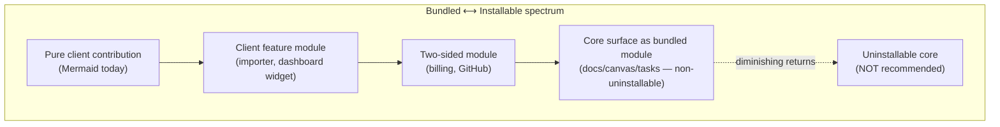
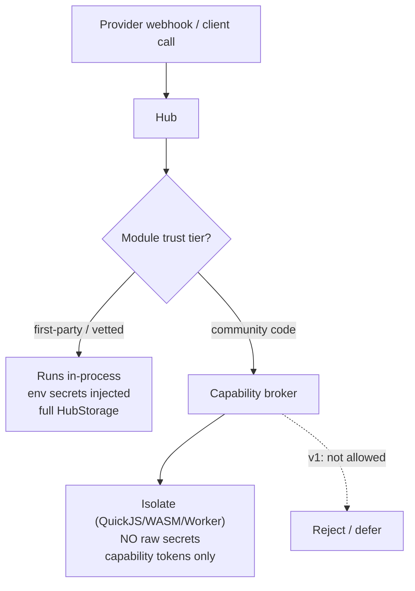
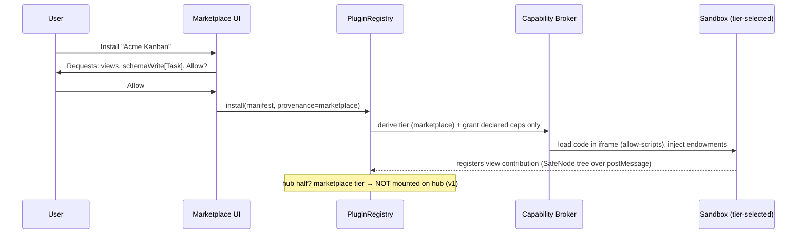
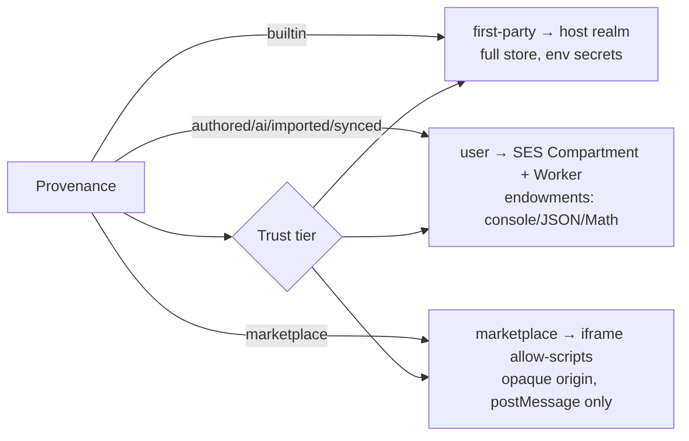

# Everything Is A Plugin: A Unified Feature-Module Platform (Client + Hub)

## Problem Statement

xNet's first-party integrations are hardcoded into the monolith. Billing lives as
`packages/hub/src/routes/billing.ts` + `packages/react/src/hooks/useBilling.ts`;
the GitHub integration is `packages/hub/src/services/github-integration.ts` wired
into `routes/tasks.ts`; the Instagram/YouTube/X/TikTok importers are baked into a
first-party registry in `packages/social/src/importers/registry.ts`. Each was
built bespoke, each occupies a different shape, and none is installable,
removable, or usable as a worked example for a third-party developer.

The user's ask, distilled:

> "Extract the billing/Stripe stuff, the GitHub integration, and any
> integration — the Instagram/YouTube/social importers — into **plugins**.
> Build a **marketplace** where you don't have to have this stuff installed but
> can easily install it. Others use these as references to build their own
> plugins. In theory **everything** could be a plugin — documents, canvases,
> tasks. Make it a good **programming convention**, a good **UX**, and
> **secure**."

The question this exploration answers: **what is the smallest set of new
abstractions that lets billing, GitHub, importers — and eventually docs/canvas/
tasks — all be the same kind of thing (a "feature module"), installable from a
marketplace, secure by construction, and pleasant to author?**

The short answer: xNet already has ~80% of the machinery. There is a mature
**client** plugin system (`@xnetjs/plugins`, 17 working contribution points), a
production **trust-tier + sandbox** stack (`packages/labs` runtime ladder +
`packages/dashboard` SES/Worker/iframe widget tiers), and the importers are
_already_ a uniform adapter registry. Three things are genuinely missing, and
they are the spine of this exploration:

1. A **two-sided (client + hub) plugin contract** — today plugins are
   client-only, main-thread; billing/GitHub need a _hub half_ (webhook routes,
   secret-key calls) that no plugin abstraction covers.
2. A **unified capability manifest** that folds the existing trust tiers,
   sandbox tiers, and 0006's permission model into one MetaMask-Snaps-style
   "endowments" declaration.
3. **Registries to replace hardcoded mounting** — a client _route_ registry
   (web routing is file-based today) and a hub _feature_ registry (every route
   is a hand-written `app.route(...)` in `server.ts`).

This is the natural successor to two existing explorations:
[0006](./0006_[x]_PLUGIN_ARCHITECTURE.md) (the implemented client plugin
architecture) and [0047](./0047_[_]_PLUGIN_MARKETPLACE.md) (GitHub-registry
distribution). 0006 is the engine, 0047 is the storefront; **0189 is the chassis
that makes first-party features ride the same rails as community plugins.**

## Executive Summary

1. **The client plugin system is real and broad, not aspirational.**
   `packages/plugins/src/contributions.ts` has **17 live contribution points**
   (views, widgets, commands, slashCommands, editorExtensions, propertyHandlers,
   blocks, sidebarItems, settings, plus 7 canvas-specific ones). Plugins persist
   as `PluginSchema` nodes (`packages/plugins/src/schemas/plugin.ts`) so they
   **sync P2P for free**. Mermaid is the only bundled plugin today.

2. **Security is mostly solved — and unusually good.** xNet already runs
   untrusted widget code in a **three-tier sandbox**
   (`packages/dashboard/src/sandbox/`): _first-party_ (host realm), _user_ (SES
   `Compartment` inside a Web Worker, endowments limited to `console`/`JSON`/
   `Math`), _marketplace_ (sandboxed `iframe sandbox="allow-scripts"`, opaque
   origin, postMessage props-in/SafeNodes-out). Trust tiers are **derived from
   provenance, never self-declared**, and **synced nodes re-confirm on the
   receiver** (`packages/labs/src/trust.ts`). This is the same model MetaMask
   Snaps uses (SES `lockdown()` + Compartment + manifest "endowments"). The
   marketplace's hard problem is already in production for widgets.

3. **The blocking gap is the hub.** There is **no hub-side plugin execution**.
   Hub routes are all hardcoded in `packages/hub/src/server.ts`; billing and
   GitHub webhooks are bespoke mounts. A "billing plugin" or "GitHub plugin" is
   fundamentally **two-sided** — it needs a server half holding secrets and
   receiving webhooks. No abstraction spans that seam today.

4. **The importers are already plugins in disguise.**
   `packages/social/src/importers/registry.ts` is a uniform
   `SocialImportAdapter` registry (`detect`/`probe`/`stage`) with 8 live + 5
   planned adapters. Pulling them out as installable plugins is the _easiest_
   first migration and the best reference example.

5. **"Everything is a plugin" is a spectrum, not a binary.** The WordPress
   lesson: _"plugins are not second-class — many core features are implemented
   through the same hooks system."_ Recommend the same: make first-party
   features **bundled feature modules that ride the plugin rails but ship
   non-uninstallable**, rather than chasing literally-removable documents/canvas/
   tasks (which buys little and costs perf, stability, and a much larger API
   surface). Canvas already _defines_ `canvasCards`/`canvasTools`/`canvasIngestors`
   contribution points but **does not consume them yet** — closing that gap is
   the highest-value dogfooding step.

6. **Recommendation:** introduce one **`FeatureModule`** manifest (client
   `contributes` + `hub` features + declared `capabilities`/endowments + trust
   tier), add a **client route registry** and a **hub feature registry**, then
   migrate importers → billing → GitHub onto it as bundled modules, and wire
   0047's marketplace on top. Hub-side _community_ code stays first-party/vetted
   only until a server isolate story (QuickJS/WASM/Workers-style) is justified;
   client community code rides the existing tiered sandbox immediately.

## Current State In The Repository

### The client plugin system (mature, client-only)

- `packages/plugins/src/registry.ts` — `PluginRegistry`: `install`/`uninstall`/
  `activate`/`deactivate`/`loadFromStore`/`rehydrate`. Plugins are stored as
  `PluginSchema` nodes (`packages/plugins/src/schemas/plugin.ts`) — manifest
  JSON-stringified, non-serializable functions/components stripped and
  **rehydrated** on load (the trick that lets TipTap extensions / React
  components survive being "data").
- `packages/plugins/src/contributions.ts` — `ContributionRegistry` with 17
  `TypedRegistry`s: `views`, `widgets`, `commands`, `slashCommands`,
  `editorExtensions`, `propertyHandlers`, `blocks`, `sidebarItems`, `settings`,
  and canvas's `canvasCards`/`canvasIngestors`/`canvasTools`/`canvasLayouts`/
  `canvasEdges`/`canvasInspectors`/`canvasTemplates`.
- `packages/plugins/src/context.ts` — `ExtensionContext` handed to
  `activate(ctx)`: `store`, `query`, `subscribe`, the 17 `register*` methods,
  extension-private `storage`, `capabilities`, `addMiddleware`.
- `packages/plugins/src/sandbox/{sandbox.ts,ast-validator.ts}` — acorn AST
  validation + global shadowing + 1 s timeout for **Layer-1 scripts** (sync,
  no network/DOM/imports/async).
- Web consumption: `apps/web/src/plugins/index.ts` (`BUNDLED_PLUGINS`),
  `apps/web/src/components/{PluginManager,BundledPluginInstaller}.tsx`,
  `apps/web/src/workbench/contributions.tsx` (bridges sidebar/command/statusbar
  contributions into the shell), `packages/react/src/hooks/usePlugins.ts`,
  `packages/react/src/context.ts` (`PluginRegistry` created when NodeStore is
  ready; `XNetConfig.disablePlugins`).

### The "services" that look server-side but aren't in the hub

`packages/plugins/src/services/{mcp-server,local-api,process-manager,webhook-emitter}.ts`
(exported via `@xnetjs/plugins/node`) are real, but they run in the **Electron
main process / standalone Node**, never in the hub. So "background services"
exist, but not as _hub_ extensibility.

### The trust + sandbox stack (the security foundation)

- `packages/labs/src/trust.ts` — provenance → tier: `builtin→first-party`,
  `authored/ai-generated/imported/synced→user`, `marketplace→marketplace`;
  **synced never inherits tier across devices** (receiver re-derives).
- `packages/labs/src/runtime/ladder.ts` — runtime ladder selecting by
  `(language, tier)`: **SES Compartment**, **QuickJS-WASM** (memory cap +
  interrupt handler, sync-only), **iframe ("app")**, **Pyodide**, **server**.
  Invariant: deterministic rungs only for computed/`onView` code; _even SES
  cannot interrupt a synchronous busy loop_ — only Worker termination can.
- `packages/dashboard/src/sandbox/` — the widget tiers in production:
  `compartment.ts` (`lockdown()` + `Compartment({ globals:{console,JSON,Math} })`
  in a Worker), `UserWidgetHost.tsx`, `IframeWidgetHost.tsx` (marketplace tier,
  `sandbox="allow-scripts"`, postMessage, 3 s render timeout, output sanitized).

### The integrations to extract (three different shapes)

| Integration                              | Client surface                                                                           | Hub surface                                                                                               | Secrets                           | Schemas owned                                 |
| ---------------------------------------- | ---------------------------------------------------------------------------------------- | --------------------------------------------------------------------------------------------------------- | --------------------------------- | --------------------------------------------- |
| **Billing** (`packages/billing`)         | `useBilling()` hook, `XNetConfig.billing`                                                | `routes/billing.ts` (`/webhook`,`/checkout`,`/me`,`/portal`) + `services/billing-store.ts` (`billing.db`) | `STRIPE_*` / `BTCPAY_*` (hub env) | `Customer`/`Subscription`/`Invoice`/`Payment` |
| **GitHub**                               | none (webhook-driven)                                                                    | `routes/tasks.ts` `/github/webhook` + `services/github-integration.ts` (`applyAutomationActions`)         | `HUB_GITHUB_WEBHOOK_SECRET`       | none (mutates `Task`/`ExternalReference`)     |
| **Social importers** (`packages/social`) | `SocialImportAdapter` registry + import worker (`apps/web/src/routes/social-import.tsx`) | shared `routes/unfurl.ts` (metadata + CDN image proxy)                                                    | none (user data exports)          | ~10 `Social*` schemas                         |

Each is mounted by hand in `packages/hub/src/server.ts` (`app.route('/billing',…)`,
`app.route('/tasks',…)`, `app.route('/unfurl',…)`). The three shapes — _client
hook + hub routes + secrets + schemas_ (billing), _hub-only webhook_ (GitHub),
_client adapter + shared hub proxy + schemas_ (importers) — are exactly the
surface a uniform `FeatureModule` must cover.

### Core surfaces (docs / canvas / tasks)

- `packages/data/src/schema/schemas/{page,canvas,task}.ts` — schemas.
- `apps/web/src/routes/{doc.$docId,canvas.$canvasId,tasks}.tsx` →
  `components/{PageView,CanvasView,TasksView}.tsx`. **File-based TanStack Router
  (`routeTree.gen.ts`) — no dynamic/registry route mounting.**
- Canvas **defines** `canvasCards`/`canvasTools`/`canvasIngestors`/… contribution
  points but `CanvasView` **does not consume them yet** — dormant infrastructure.

## External Research

- **MetaMask Snaps** — the closest production analog to what xNet should
  formalize: each Snap runs in a **SES `Compartment`** after global `lockdown()`;
  capabilities are **"endowments"** (`endowment:*`) declared in
  `snap.manifest.json` (`initialPermissions`) and requestable dynamically. xNet's
  dashboard SES-Compartment-in-Worker tier is _the same architecture_; the work
  is to lift "endowments" into the plugin manifest.
  ([docs](https://docs.metamask.io/snaps/learn/about-snaps/execution-environment/),
  [permissions](https://docs.metamask.io/snaps/reference/permissions/),
  [security review](https://osec.io/blog/2023-11-01-metamask-snaps/))
- **VS Code** — micro-kernel: `contributes` points in `package.json` +
  **activation events** + a separate **extension host** process. The
  contribution-point catalog is the model for declarative client capability;
  the separate host is the model for _not_ running extensions on the UI thread.
- **Figma** — sandboxed main (QuickJS) + iframe UI over postMessage — validates
  xNet's iframe marketplace tier.
- **Obsidian** — single JSON in a GitHub repo lists ~2000 community plugins;
  reviews only on first submission (0047's chosen distribution model).
- **WordPress hooks** — _"plugins are not second-class functionality; many core
  WordPress features are implemented through the hooks system."_ The canonical
  "everything is a plugin" precedent, with the honest tradeoff: hooks _"push
  complexity onto the systems that interact with them,"_ but let core update
  independently of plugins. ([wpshout](https://wpshout.com/wordpress-event-system-understanding-hooks/))
- **Microkernel / plug-in architecture** — separate minimal core from features
  behind well-defined interfaces; VS Code/Firefox/Chrome/WordPress cited as
  exemplars. ([TechTarget](https://www.techtarget.com/searchapparchitecture/tip/What-is-a-microkernel-architecture-and-is-it-right-for-you))

**Lesson:** nobody runs _untrusted server-side_ plugin code casually — Snaps,
Figma, VS Code all sandbox on the _client_ and treat server reach as a
_permissioned capability_, not arbitrary hosted code. This directly shapes the
hub recommendation below.

## Key Findings

1. **Client extensibility is a strength to build on, not rebuild.** 17
   contribution points, P2P-syncable plugin nodes, rehydration, and a
   three-tier sandbox already exist and ship.

2. **The hub is the real frontier.** "Plugin" today means "client contribution."
   Billing/GitHub prove that real integrations are _two-sided_. A
   `FeatureModule` must declare a **hub half** — and the hub must gain a
   **feature registry** (so `server.ts` iterates modules instead of hardcoding
   mounts) and a **capability/secret broker** (so module code never sees raw
   secrets it didn't earn).

3. **Secrets are the security crux on the hub.** A community "Stripe plugin"
   must never receive `STRIPE_SECRET_KEY`. The hub should inject secrets only
   into **first-party/vetted** hub features, and expose to others only
   **capability tokens** (e.g., "may receive a signature-verified webhook at
   `/x/<id>`," "may write nodes of schema `X` for the authed DID").

4. **Importers are the cheapest, highest-signal first migration.** They're
   already a uniform registry with zero secrets and clean schema ownership.

5. **"Everything a plugin" pays off as dogfooding, not as removability.** Making
   canvas _consume_ its dormant contribution points, and expressing docs/canvas/
   tasks as bundled feature packs, gives third parties real extension power. True
   uninstallable-core is mostly downside (perf, stability, giant stable API).

6. **A route registry is the missing client primitive.** Sidebar/panel/command
   contributions work; **routes don't**. A catch-all `/x/$pluginId/$rest` plus a
   registry-driven route table unblocks "a plugin adds a workbench surface."

## Options And Tradeoffs

### A. The plugin granularity — what is a "plugin"?



| Option                                       | Pros                                            | Cons                                                        | Verdict                                                     |
| -------------------------------------------- | ----------------------------------------------- | ----------------------------------------------------------- | ----------------------------------------------------------- |
| **Client-only plugins** (status quo)         | Already works; safe                             | Can't express billing/GitHub; integrations stay bespoke     | Insufficient                                                |
| **Two-sided `FeatureModule`** (client + hub) | Covers every real integration; one mental model | New hub registry + capability broker                        | **Recommended core**                                        |
| **Everything incl. uninstallable core**      | Maximal purity                                  | Perf tax, giant stable API, fragile core, little user value | Reject the _uninstallable_ part; keep the _dogfooding_ part |

### B. The hub-plugin security model (the hard one)



| Option                                                                                  | Pros                                                                                                  | Cons                                                                                                      | Verdict           |
| --------------------------------------------------------------------------------------- | ----------------------------------------------------------------------------------------------------- | --------------------------------------------------------------------------------------------------------- | ----------------- |
| **First-party hub features only** (community = client-only)                             | Zero server-RCE risk; ship now; matches Snaps/Figma/VSCode (server reach is permissioned, not hosted) | Community can't add hub webhooks/secrets                                                                  | **v1**            |
| **Declarative hub manifests** (webhook route + capability grants, _no arbitrary code_)  | Community can register a signature-verified webhook → node writes, without running code               | Limited to declarative shapes; needs a safe "normalize" DSL                                               | **v2 (strong)**   |
| **Sandboxed hub code** (QuickJS/WASM/Workers-isolate per request, capability injection) | Arbitrary community server logic, safely                                                              | Heavy; cold starts; the runtime ladder's `server` rung is "compiled off-device," not a hosted isolate yet | **v3 / deferred** |

The runtime ladder (`packages/labs`) already conceptualizes a `server` tier and
QuickJS/WASM isolation client-side — v3 is "lift that to the hub," which is real
but not v1.

### C. Distribution — reuse 0047, extend the manifest

0047's GitHub-registry/auto-index/`plugins.json` model stands. The only change:
the index entry gains `hub` + `capabilities`/`endowments` + `trustTier` fields so
the install UI can show a **capability-consent dialog** (à la Snaps) and route
the plugin into the correct sandbox tier.

## Recommendation

**Adopt a single `FeatureModule` abstraction that unifies client contributions,
hub features, owned schemas, and declared capabilities — then migrate the
existing integrations onto it bundled-first, and put 0047's marketplace on top.**
Concretely:

1. **Define `FeatureModule`** (a superset of today's `XNetExtension`) in
   `@xnetjs/plugins`: `contributes` (the 17 client points, **+ a new `routes`
   point**), `hub` (route factories + webhook handlers + store migrations),
   `schemas`, and `capabilities`/`endowments` (MetaMask-style, manifest-declared).
   Trust tier is **derived** (`packages/labs/src/trust.ts`), never declared.

2. **Add the two missing registries.**
   - _Client route registry_: a catch-all `/x/$pluginId/$rest` TanStack route +
     a registry so a module can own a workbench surface (unblocks docs/canvas/
     tasks-as-modules later). Sidebar/panel/command bridges already exist
     (`apps/web/src/workbench/contributions.tsx`).
   - _Hub feature registry_: replace the hand-written `app.route(...)` block in
     `packages/hub/src/server.ts` with iteration over a list of first-party
     `HubFeature`s; add a **capability/secret broker** so a feature only sees the
     env secrets and node-write scopes it declared.

3. **Unify the sandbox under the manifest.** The dashboard tiers
   (`packages/dashboard/src/sandbox`) and labs ladder (`packages/labs`) become
   _the_ plugin sandbox: `first-party→host`, `user→SES+Worker`,
   `marketplace→iframe`. Endowments in the manifest gate which host APIs the
   sandbox injects (start from the dashboard's `console/JSON/Math` set and grow
   deliberately).

4. **Migrate in this order (bundled feature modules, each a reference example):**
   1. **Social importers** — wrap `SocialImportAdapter` as a `FeatureModule`
      `importers` contribution; ship each platform as its own bundled module.
      Zero secrets, clean schemas, immediate "uninstall TikTok importer" UX.
   2. **Billing** — the canonical _two-sided_ module: client `useBilling` +
      settings UI as contributions, `hub` half = the existing `routes/billing.ts`
      - `billing-store.ts`, capability = `secret:STRIPE_*` + `schema-write`.
        First-party tier (holds secrets).
   3. **GitHub** — _hub-only_ module: `hub.webhook('/github')` + `mutates: Task`
      capability; proves the declarative-webhook (v2) shape.

5. **Wire 0047's marketplace** on top, extended to show capability consent and
   route by trust tier. Community plugins are **client-side** at first (ride the
   tiered sandbox); hub-side community code stays first-party/vetted until v2/v3.

6. **Dogfood core carefully:** make `CanvasView` actually consume its dormant
   `canvasCards`/`canvasTools`/`canvasIngestors` registries; express docs/canvas/
   tasks as bundled feature packs that third parties can _extend_ — but keep them
   **non-uninstallable** (the WordPress model). Do **not** pursue uninstallable
   core.

Rationale: this reuses the strongest assets (client contributions + trust/sandbox
tiers + importer registry), adds the genuinely missing piece (a two-sided
contract + hub registry), keeps server-side attack surface near zero in v1, and
gives the user the marketplace and "everything is a plugin" feel without the tax
of literally removable core.

## Example Code

### The unified `FeatureModule` manifest

```ts
// packages/plugins/src/feature-module.ts
export interface FeatureModule {
  id: string // reverse-domain, e.g. "fyi.xnet.billing"
  name: string
  version: string
  xnetVersion: string
  platforms?: Platform[]

  /** Schemas this module owns (registered into the schema registry). */
  schemas?: DefinedSchema[]

  /** CLIENT contributions — the existing 17 points + a new `routes` point. */
  contributes?: {
    views?: ViewContribution[]
    sidebarItems?: SidebarContribution[]
    slashCommands?: SlashCommandContribution[]
    importers?: ImporterContribution[] // NEW: wraps SocialImportAdapter
    routes?: RouteContribution[] // NEW: registry-driven workbench surfaces
    settings?: SettingContribution[]
    // …all existing contribution points…
  }

  /** HUB half — declarative; first-party gets code, community gets manifests. */
  hub?: {
    routes?: HubRouteFactory[] // e.g. createBillingRoutes(...)
    webhooks?: HubWebhook[] // { path, verify, normalize → mutations }
    store?: HubStoreMigration // its own subsystem DB (like billing.db)
  }

  /** Capability/endowment declarations (MetaMask-Snaps style). The hub/sandbox
   *  injects ONLY what is declared and granted. */
  capabilities?: {
    secrets?: string[] // env keys, first-party tier only
    schemaWrite?: SchemaIRI[] // node-write scopes
    schemaRead?: SchemaIRI[]
    network?: string[] // domain allowlist (unfurl-style)
    endowments?: string[] // host APIs the client sandbox exposes
  }

  activate?(ctx: ExtensionContext): void | Promise<void>
  deactivate?(): void | Promise<void>
}
```

### Billing as a two-sided bundled module (re-expressing what exists)

```ts
// packages/billing/src/module.ts  (bundled, first-party tier)
import { createBillingRoutes } from '@xnetjs/hub/billing' // the existing factory
import { billingProviderFromEnv, createBillingStore } from '@xnetjs/billing'

export const BillingModule: FeatureModule = {
  id: 'fyi.xnet.billing',
  name: 'Billing (Stripe + Bitcoin)',
  version: '1.0.0',
  xnetVersion: '>=0.6.0',
  schemas: [CustomerSchema, SubscriptionSchema, InvoiceSchema, PaymentSchema],

  contributes: {
    settings: [{ id: 'billing', name: 'Billing', component: BillingSettings }]
    // useBilling() stays the public hook; the module just owns its registration
  },

  hub: {
    routes: [
      (deps) =>
        createBillingRoutes({
          provider: billingProviderFromEnv(deps.env), // broker-scoped env
          store: createBillingStore({ storage: deps.storage, dataDir: deps.dataDir }),
          requireAuth: deps.requireAuth,
          appUrl: deps.appUrl
        })
    ]
  },

  capabilities: {
    secrets: ['STRIPE_SECRET_KEY', 'STRIPE_WEBHOOK_SECRET', 'BTCPAY_*'],
    schemaWrite: ['xnet://xnet.fyi/Subscription@1.0.0' /* … */]
  }
}
```

### The hub feature registry (replaces hardcoded mounts)

```ts
// packages/hub/src/features/registry.ts
export function mountFeatures(app: Hono, modules: FeatureModule[], deps: HubDeps) {
  for (const m of modules) {
    if (!m.hub) continue
    const env = deps.broker.scopedEnv(m.id, m.capabilities?.secrets ?? []) // only declared keys
    for (const factory of m.hub.routes ?? []) {
      app.route(`/x/${m.id}`, factory({ ...deps, env })) // namespaced mount
    }
    for (const wh of m.hub.webhooks ?? []) {
      app.post(`/x/${m.id}/webhooks/${wh.path}`, makeWebhookHandler(wh, deps))
    }
  }
}
// server.ts: mountFeatures(app, FIRST_PARTY_MODULES, deps)  — billing/github/unfurl become entries
```

### GitHub as a declarative hub-only webhook module (v2 shape)

```ts
export const GithubModule: FeatureModule = {
  id: 'fyi.xnet.github',
  name: 'GitHub → Tasks',
  version: '1.0.0',
  hub: {
    webhooks: [
      {
        path: 'github',
        secretRef: 'HUB_GITHUB_WEBHOOK_SECRET',
        verify: verifyWebhookSignature, // existing helper
        normalize: processGithubEvent // existing pure fn → TaskAutomationAction[]
      }
    ]
  },
  capabilities: {
    schemaWrite: ['xnet://xnet.fyi/Task@1.0.0', 'xnet://xnet.fyi/ExternalReference@1.0.0']
  }
}
```

### Install flow with capability consent + tier routing



### Trust tier → sandbox mapping (already implemented for widgets)



## Risks And Open Questions

- **Hub RCE is the showstopper risk.** Never run marketplace server code in v1.
  Even v2 declarative webhooks must constrain `normalize` to a safe transform (no
  arbitrary fetch/exec). Secrets are injected _only_ into first-party modules via
  the broker; community modules get capability tokens, never raw keys.
- **Capability creep / consent fatigue.** If every plugin asks for `schemaWrite:*`
  the dialog becomes meaningless (the npm/permissions problem). Default to
  narrow, schema-scoped grants; show human-readable summaries; make `*` a loud
  red flag.
- **Route registry vs file-based routing.** TanStack `routeTree.gen.ts` is
  build-time. A catch-all `/x/$pluginId/$rest` is the pragmatic unblock; full
  dynamic typed routes are a larger lift. Mind deep-link/SSR/preview behavior.
- **Performance of "everything a plugin."** Indirection through registries on the
  doc/canvas/task hot paths could regress first-load and interaction latency
  (see exploration 0184). Keep core surfaces _bundled_ and avoid sandboxing
  first-party code; measure before pluginizing any hot path.
- **API stability tax.** The moment core is expressed via contribution points,
  those points become a public API you can't break (the WordPress hook-stability
  burden). Version the contract on `xnetVersion`; treat contribution points as
  semver-stable.
- **Schema namespace ownership / squatting.** `xnet://` IRIs need ownership
  rules so a plugin can't hijack `Task@1.0.0`. Tie schema namespaces to the
  author DID (the `share-via-url`/schema-registry precedent) and reserve
  `xnet.fyi` for first-party.
- **Secrets a _community_ hub feature would need** (e.g., a community payment
  rail) — no clean answer in v1; that's exactly why hub-side community code is
  deferred to v2/v3.
- **Conflicts & ordering** — two plugins registering the same slash command /
  route / schema. Last-wins-with-warning + user override (0006's open question)
  applies; routes must be namespaced (`/x/<id>/…`).
- **Mobile** — hub features are platform-agnostic, but client sandbox tiers
  differ (no Worker/iframe parity on RN). Marketplace plugins likely web/desktop
  first.
- **Does pluginizing core actually help users, or just developers?** Be honest:
  the win is _third-party extension_ + _one mental model_, not removability.
  Resist pluginizing where it doesn't add user-visible capability.

## Implementation Checklist

- [x] Write `FeatureModule` type in `@xnetjs/plugins`
      (`packages/plugins/src/feature-module.ts`) as a superset of `XNetExtension`
      with `capabilities`/`endowments` and a declarative `hub: { featureId }`
      pointer; add the **`importers`** client contribution point
      (`ImporterContribution` + `registerImporter` + registry + manifest +
      static-apply). _As-built: the contribution point is **consumable** —
      `useImporters()` (react) + `importerAdapters`/`resolveImporters`
      (`packages/plugins/src/importers.ts`) merge plugin importers with a built-in
      set (deduped by id). The `routes` contribution point + `schemas` array, and
      wiring importers into the live social-import **detection** path (the
      worker-client; functions can't cross the worker boundary, so plugin importers
      run main-thread — see "Migrate importers" below), are deferred._
- [ ] Add a **client route registry** + a catch-all `/x/$pluginId/$rest`
      TanStack route in `apps/web`; bridge to the existing workbench
      contributions (`apps/web/src/workbench/contributions.tsx`). _(deferred — web
      routing is build-time/file-based; larger lift.)_
- [x] Add a **hub feature registry** (`packages/hub/src/features/registry.ts` +
      `types.ts` + `first-party.ts`) and refactor `server.ts` to iterate
      `HubFeature`s (`mountFeatures([billingFeature(), tasksFeature(…),
unfurlFeature(…)], …)`) instead of hardcoded `app.route(...)`.
      _As-built: behaviour-preserving (full hub suite green); community `/x/<id>`
      namespacing is deferred to the marketplace phase._
- [x] Add a **capability/secret broker** in the hub
      (`packages/hub/src/features/broker.ts`): `scopedEnv(env, declaredKeys)` with
      exact + `PREFIX_*` globs, so a feature only sees the env secrets it declared
      (billing reads `STRIPE_*`/`BTCPAY_*`, never the GitHub secret).
      _As-built: node-write scope enforcement keyed to `capabilities.schemaWrite`
      is deferred._
- [ ] Unify the sandbox: route plugin code through the dashboard tiers
      (`packages/dashboard/src/sandbox`) + labs trust derivation
      (`packages/labs/src/trust.ts`); gate host-API endowments by manifest.
- [~] **Migrate importers**: wrap `SocialImportAdapter`
  (`packages/social/src/importers/registry.ts`) as bundled `FeatureModule`s
  with an `importers` contribution; ship one per platform; add uninstall UX.
  _As-built: the consumer plumbing exists (`useImporters` + `resolveImporters`);
  the remaining work is the bundled per-platform modules + threading
  plugin importers through the social-import worker-client (main-thread path)
  so they participate in archive detection — left as its own focused PR to
  avoid destabilising the shipped social-import flow._
- [ ] **Migrate billing**: re-express as `BillingModule` (client settings + hook
      contribution; hub routes/store via the feature registry; first-party tier
      with `secrets`).
- [x] **Migrate GitHub**: re-expressed as a declarative `HubFeature` **webhook**
      (`HubFeature.webhooks: [{ path, secretRef, verify, normalize, apply? }]`,
      mounted generically by `features/webhooks.ts` `mountWebhook`) — the GitHub
      handler left `routes/tasks.ts` (now short-ids only) for the v2 shape;
      behaviour preserved (full hub suite green). **Note:** the `apply` step —
      writing normalized `TaskAutomationAction[]` onto a workspace's `Task` nodes
      — is intentionally **not** wired in `server.ts` (and was never wired in the
      old route either): it needs server-authoritative node writes the hub lacks
      today, so the webhook verifies + normalizes + reports `{ ok, actions }` but
      does not mutate. The injection seam (`applyAutomationActions`) is in place
      for a future hub system identity. _(Deferred — same gap as 0187 Option C.)_
- [ ] Extend 0047's marketplace index entry with `hub`/`capabilities`/`trustTier`;
      add a **capability-consent dialog** to the install flow; route installs by
      tier into the correct sandbox.
- [ ] **Dogfood canvas**: make `CanvasView` consume the dormant
      `canvasCards`/`canvasTools`/`canvasIngestors` registries.
- [ ] Publish a **plugin template repo** + `npx create-xnet-plugin` (0047 Phase 4)
      using billing/importer modules as the worked reference examples.
- [ ] Docs: "Anatomy of a Feature Module" guide tying it to the migrated
      examples.

## Validation Checklist

- [x] Billing, GitHub-tasks, and unfurl behave identically after being mounted
      through the feature registry — the full hub integration suite (341 tests,
      incl. `routes/billing.test.ts` + the tasks/github webhook tests) is green.
      _(Full client-side importer/billing/github migration remains.)_
- [ ] A bundled module can be **disabled** in the Plugin Manager and its
      surfaces/routes/hub-mounts disappear; re-enabling restores them.
- [x] **Secret isolation**: the broker scopes each feature's env to its declared
      keys — a feature without `STRIPE_*`/`BTCPAY_*` in `secrets` cannot read them,
      and billing cannot read `HUB_GITHUB_WEBHOOK_SECRET`
      (`packages/hub/src/features/features.test.ts`). _(Marketplace per-module
      enforcement remains.)_
- [ ] **Tier routing**: a `marketplace`-provenance plugin loads in the iframe
      sandbox and cannot touch host DOM/storage/secrets; a `user` one runs in
      SES+Worker with only declared endowments (mirror `packages/dashboard`
      sandbox tests).
- [ ] **Capability enforcement**: a plugin attempting `schemaWrite` outside its
      grant is rejected; a hub webhook with a bad signature returns 401.
- [ ] **Route namespacing**: two plugins can't collide; community hub mounts are
      confined to `/x/<id>/…`; no community code runs in-process on the hub.
- [ ] **Perf guardrail**: doc/canvas/task first-load + interaction latency does
      not regress vs. baseline (exploration 0184 budgets) after the registry
      indirection.
- [ ] Install → capability consent → activate → P2P-sync of the `PluginSchema`
      node works end-to-end; a synced plugin **re-confirms trust** on the
      receiver (`packages/labs/src/trust.ts` invariant).
- [x] fallow audit (`--changed-since origin/main`), `turbo typecheck`
      (`@xnetjs/plugins` + `@xnetjs/hub`), eslint, and prettier all green for the
      foundations; full plugins suite (373 tests) + hub suite (341 tests) pass.

## References

### Codebase

- `packages/plugins/src/{registry.ts,contributions.ts,context.ts,manifest.ts}` — client plugin core (17 contribution points)
- `packages/plugins/src/sandbox/{sandbox.ts,ast-validator.ts}` — AST script sandbox
- `packages/plugins/src/services/{mcp-server,local-api,process-manager,webhook-emitter,node}.ts` — Electron/Node services (not hub)
- `packages/plugins/src/schemas/plugin.ts` — plugins-as-nodes (P2P sync)
- `packages/labs/src/trust.ts`, `packages/labs/src/runtime/ladder.ts` — provenance→tier + runtime ladder (SES/QuickJS/iframe/Pyodide/server)
- `packages/dashboard/src/sandbox/{compartment.ts,UserWidgetHost.tsx,IframeWidgetHost.tsx}`, `packages/dashboard/src/types.ts` — production three-tier widget sandbox
- `packages/billing/`, `packages/hub/src/routes/billing.ts`, `packages/hub/src/services/billing-store.ts`, `packages/react/src/hooks/useBilling.ts` — billing (two-sided integration)
- `packages/hub/src/services/github-integration.ts`, `packages/hub/src/routes/tasks.ts` — GitHub webhook integration
- `packages/social/src/importers/registry.ts`, `packages/social/src/import/types.ts`, `apps/web/src/routes/social-import.tsx`, `packages/hub/src/routes/unfurl.ts` — importer adapter registry + unfurl proxy
- `packages/hub/src/server.ts` — hardcoded `app.route(...)` mounts (the hub registry target)
- `apps/web/src/workbench/{Workbench.tsx,contributions.tsx,views/register.ts}` — workbench shell + contribution bridges
- `apps/web/src/routes/{doc.$docId,canvas.$canvasId,tasks}.tsx`, `apps/web/src/components/{PageView,CanvasView,TasksView}.tsx`, `packages/data/src/schema/schemas/{page,canvas,task}.ts` — core surfaces
- `apps/web/src/plugins/index.ts`, `apps/web/src/components/{PluginManager,BundledPluginInstaller}.tsx`, `packages/react/src/hooks/usePlugins.ts` — bundled-plugin install path

### Prior explorations

- [0006 Plugin Architecture](./0006_[x]_PLUGIN_ARCHITECTURE.md) — the implemented client plugin system (the engine)
- [0047 Plugin Marketplace](./0047_[_]_PLUGIN_MARKETPLACE.md) — GitHub-registry distribution (the storefront)
- [0162 Dashboard Builder With Pluggable Widgets](./0162_[x]_DASHBOARD_BUILDER_WITH_PLUGGABLE_WIDGETS.md) — widget contract + sandbox tiers
- [0180 Code As A First-Class Citizen / Labs](./0180_[x]_CODE_AS_A_FIRST_CLASS_CITIZEN_LABS_AND_RUNTIMES.md) — runtime ladder + trust model
- [0187 Plug-And-Play Billing](./0187_[x]_PLUG_AND_PLAY_BILLING_STRIPE_AND_BITCOIN.md) — the first two-sided integration to extract

### External

- [MetaMask Snaps — execution environment](https://docs.metamask.io/snaps/learn/about-snaps/execution-environment/), [permissions/endowments](https://docs.metamask.io/snaps/reference/permissions/), [security review (osec)](https://osec.io/blog/2023-11-01-metamask-snaps/)
- [VS Code — extension contribution points](https://code.visualstudio.com/api/references/contribution-points) and [activation events](https://code.visualstudio.com/api/references/activation-events)
- [WordPress hooks — event system](https://wpshout.com/wordpress-event-system-understanding-hooks/)
- [Microkernel (plug-in) architecture (TechTarget)](https://www.techtarget.com/searchapparchitecture/tip/What-is-a-microkernel-architecture-and-is-it-right-for-you)
- [Figma plugin security model](https://www.figma.com/plugin-docs/how-plugins-run/)
