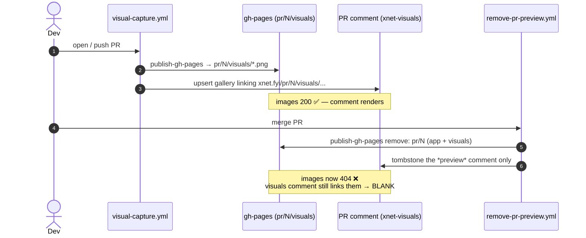
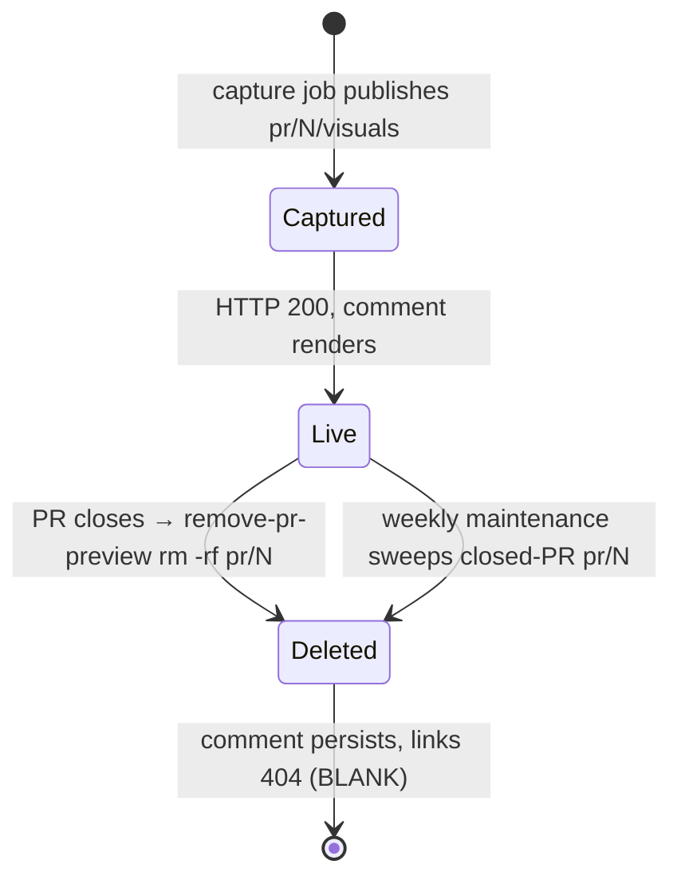
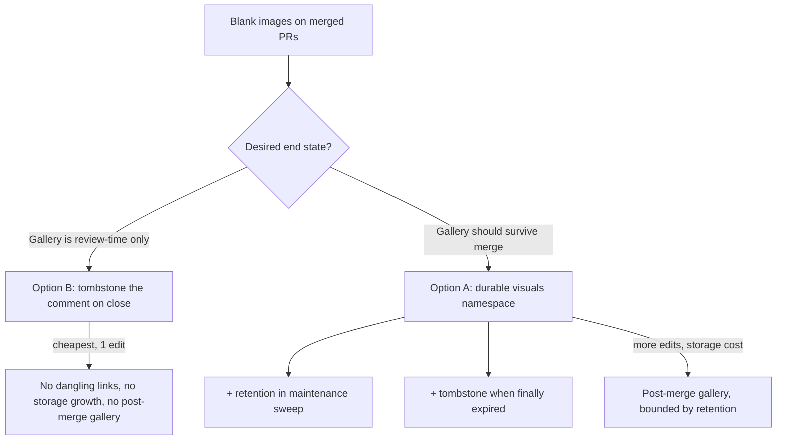

# PR Visual Screenshots Vanish On Merge

## Problem Statement

The "🖼️ UI changes in this PR" comment posted by CI (the Visual UI Capture
pipeline) shows **blank / broken images** on merged PRs. Reported instance:
[PR #100, comment `4713458578`](https://github.com/crs48/xNet/pull/100#issuecomment-4713458578).
The comment markdown is intact and the SSIM number renders (`SSIM 0.978`), but
all three image cells — `before`, `after`, `diff` — are empty.

The comment references three URLs, all of which now return **HTTP 404**:

```
https://xnet.fyi/pr/100/visuals/before/routes/home.png   → 404
https://xnet.fyi/pr/100/visuals/routes/home.png          → 404
https://xnet.fyi/pr/100/visuals/diff/routes/home.png     → 404
```

This is not cosmetic for the team's review loop: the whole point of the
pipeline ([exploration 0185](0185_[x]_CI_VISUAL_UI_CAPTURE_SCREENSHOTS_GIFS_ON_PRS.md))
is to leave a durable visual record of what a PR changed. A merged PR is exactly
when people revisit "what did this actually change?" — and that is precisely when
the images disappear.

## Executive Summary

**The images are not failing to capture — they are being deleted on merge.**

The visuals are published to gh-pages at `pr/<N>/visuals/`, *inside* the same
`pr/<N>/` directory that holds the ephemeral app preview. When a PR closes,
[`remove-pr-preview.yml`](../../.github/workflows/remove-pr-preview.yml) runs
`publish-gh-pages` in removal mode with `remove: pr/<N>` — deleting the **entire**
`pr/<N>` subtree, app preview *and* visuals together. But the sticky
`<!-- xnet-visuals -->` comment is **permanent** in the PR thread and keeps
pointing at the now-deleted image URLs. Result: blank images forever after merge.

This was confirmed with a clean control:

| PR | State | `…/visuals/routes/home.png` |
| --- | --- | --- |
| #104, #105 | **open** | **HTTP 200** (images render) |
| #94, #97, #98, #99, #100, #101, #102, #103 | **merged** | **HTTP 404** (blank) |
| `visuals-baseline/routes/home.png` | n/a (durable) | **HTTP 200** |

The live gh-pages `pr/` tree contains only the currently-open PRs (`104`, `105`,
`9`). Every merged PR's `pr/<N>` directory is gone. The baseline, which lives in
its own top-level `visuals-baseline/` directory, is untouched and serves fine —
proving gh-pages serving itself is healthy and the fault is purely the
*lifecycle coupling* of visuals to the ephemeral preview namespace.

The README even documents the coupling as intended behavior
([`scripts/visuals/README.md`](../../scripts/visuals/README.md)):

> Cleanup is automatic: `remove-pr-preview.yml` deletes the whole `pr/<N>` tree
> (app preview + visuals) when the PR closes.

So this is "working as designed" — but the design forgot that the comment
out-lives the images. The fix is to **decouple the visuals' storage lifecycle
from the preview's**, and to **never leave a comment pointing at deleted images**.

## Current State In The Repository

### The pipeline and where images land

The capture pipeline is five `.mjs` scripts under
[`scripts/visuals/`](../../scripts/visuals/), orchestrated by
[`.github/workflows/visual-capture.yml`](../../.github/workflows/visual-capture.yml):

```
changed-capture-set.mjs → capture.mjs → diff.mjs → comment.mjs
   (which changed?)        (screenshot)   (vs baseline)  (gallery body)
```

On a PR the `capture` job:

1. Captures changed stories/routes, diffs them vs the `main` baseline.
2. Publishes the output to gh-pages at **`pr/<N>/visuals`**:

   ```yaml
   # .github/workflows/visual-capture.yml — capture job
   - name: Publish visuals to gh-pages
     uses: ./.github/actions/publish-gh-pages
     with:
       source: tmp/visuals
       target: pr/${{ github.event.pull_request.number }}/visuals
   ```

3. Builds the comment with `BASE_URL="https://xnet.fyi/pr/<N>/visuals"` and
   upserts a sticky `<!-- xnet-visuals -->` comment via
   [`comment.mjs`](../../scripts/visuals/comment.mjs). The image URLs are pure
   string concatenation off that base — `comment.mjs` has no knowledge of the
   lifecycle; it just emits `` etc.

### The app preview shares the same parent directory

[`deploy-pr-preview.yml`](../../.github/workflows/deploy-pr-preview.yml) publishes
the web app to **`pr/<N>/app`** — a sibling of `pr/<N>/visuals`:

```yaml
target: pr/${{ github.event.pull_request.number }}/app
```

So the gh-pages layout for an open PR is:

```
gh-pages/
├── pr/
│   └── 100/
│       ├── app/        ← deploy-pr-preview.yml   (ephemeral, by design)
│       └── visuals/    ← visual-capture.yml      (we want this durable)
├── visuals-baseline/   ← visual-capture.yml baseline job (already durable)
└── … (production site) ← deploy-site.yml
```

### The deletion: `remove-pr-preview.yml`

On `pull_request: closed` (which fires on merge),
[`remove-pr-preview.yml`](../../.github/workflows/remove-pr-preview.yml) removes
the whole parent:

```yaml
# remove-pr-preview.yml
- name: Remove preview from gh-pages
  uses: ./.github/actions/publish-gh-pages
  with:
    remove: pr/${{ github.event.pull_request.number }}   # ← deletes app AND visuals
```

It then rewrites the **app-preview** comment to a tombstone — *"Preview removed
for PR #100."* — which is exactly why that second bot comment on PR #100 reads
that way. The crucial asymmetry: it tombstones the `<!-- xnet-pr-preview -->`
comment but **never touches the `<!-- xnet-visuals -->` comment**, so the visuals
comment is left dangling with dead image links.

### The publish/remove primitive

[`.github/actions/publish-gh-pages/action.yml`](../../.github/actions/publish-gh-pages/action.yml)
is a small composite action with two modes:

- **Sync mode** (`source` set): `rsync -a --delete` into `target`, with an
  `exclude` list of top-level dirs protected from the root `--delete`.
- **Removal mode** (`source` empty, `remove` set): `rm -rf "$worktree/<path>"`
  for each newline-separated path. This is what deletes `pr/<N>`.

It retries the fetch→apply→push cycle 3× so concurrent writers (production
deploy, previews, cleanup) don't fail each other.

### The two *other* deletion vectors (for completeness)

There are two more things that can wipe a `pr/<N>` tree, both already
accounted-for or harmless to this analysis:

1. **`deploy-site.yml` root `--delete`.** Every push to `main` rsyncs the
   gh-pages root with `--delete`. It protects `pr`, `branch`, and
   `visuals-baseline` via its `exclude:` list. So production deploys do *not*
   wipe `pr/`. (This is the "root --delete wipes non-excluded dirs" gotcha noted
   in [exploration 0185](0185_[x]_CI_VISUAL_UI_CAPTURE_SCREENSHOTS_GIFS_ON_PRS.md)
   — already mitigated for the baseline.)
2. **`gh-pages-maintenance.yml` weekly sweep.** Removes `pr/<dir>` for any PR no
   longer open. Even if `remove-pr-preview.yml` had *not* run, this weekly job
   would eventually delete a merged PR's `pr/<N>` anyway — so any durability fix
   must address the sweeper too, not just the close hook.





## External Research

- **GitHub proxies every comment image through Camo**
  (`camo.githubusercontent.com`). Camo fetches the origin, caches it, and serves
  over HTTPS. When the origin returns 404, Camo has nothing to serve and the
  reader sees a broken-image placeholder. A stale Camo cache can be nudged with a
  `?v=N` cache-buster, but that does **not** help here — the origin is genuinely
  deleted, so no cache-busting brings it back. ([community #140885](https://github.com/orgs/community/discussions/140885),
  [community #183464](https://github.com/orgs/community/discussions/183464))
- **Data-URI / base64 inlining does not work.** GitHub's markdown sanitizer
  strips `data:` image sources in issue/PR comments, so "just embed the PNG in
  the comment" is a dead end. Durable hosting is required.
- **GitHub `user-attachments`** (`github.com/user-attachments/assets/<uuid>`) is
  the durable host the web composer uses, and these URLs outlive everything. But
  there is no clean, supported API to upload to it from CI outside the
  browser/GraphQL composer flow — pushing bytes into the repo (which is what
  gh-pages already is) is the practical CI-friendly equivalent.
- **Every mature visual-regression tool hosts snapshots on durable storage,
  decoupled from the CI run.** reg-suit uploads snapshots to S3/GCS so the
  comparison "can be reviewed at any time," then comments via
  `reg-notify-github-plugin`. [Argos](https://argos-ci.com/),
  [Chromatic](https://www.chromatic.com/), and [Percy](https://percy.io/) all
  keep snapshots on their own CDN with explicit retention windows. The universal
  lesson: **the artifact must persist independently of the ephemeral
  preview/build lifecycle, with its own retention policy** — which is exactly the
  coupling this repo got wrong. ([reg-suit](https://github.com/reg-viz/reg-suit),
  [Percy: screenshot testing tools](https://percy.io/blog/screenshot-testing-tools))

## Key Findings

1. **Capture works; storage lifecycle is the bug.** Open PRs serve their visuals
   at 200; the diff/SSIM math ran fine on #100. Nothing about screenshotting is
   broken.
2. **Visuals inherit the *preview's* lifecycle by being nested in `pr/<N>/`.**
   They are durable goods stored in an ephemeral drawer.
3. **The comment out-lives the images.** The sticky `<!-- xnet-visuals -->`
   comment is permanent; the images it links are deleted on close → guaranteed
   dangling links on every merged PR.
4. **The removal hook already knows how to tombstone a comment** — it does it for
   the preview comment — but it never updates the visuals comment.
5. **Two deletion vectors must be handled** for a real fix: the on-close
   `remove-pr-preview.yml` *and* the weekly `gh-pages-maintenance.yml` sweep.
6. **`comment.mjs` is lifecycle-agnostic and parameterized by `--base-url`** — so
   moving the storage location is a workflow-config change, not a script rewrite.
7. **The baseline is the existing proof of the right pattern**:
   `visuals-baseline/` is a top-level, durable, exclude-protected directory that
   never 404s. Visuals should mirror it.

## Options And Tradeoffs

The decision is fundamentally: **should a merged PR's gallery be ephemeral (and
the comment honestly say so) or durable (and survive merge)?**



### Option A — Move visuals to a durable, top-level namespace

Publish to **`visuals/pr/<N>/`** (a new top-level dir) instead of
`pr/<N>/visuals/`. Because they're no longer under `pr/<N>`, the preview-removal
hook and the per-PR sweep no longer touch them. Add `visuals` to
`deploy-site.yml`'s `exclude:` list (exactly as `visuals-baseline` already is),
and change the comment's `BASE_URL` to `https://xnet.fyi/visuals/pr/<N>`.

- **Pros:** images survive merge; the existing comment keeps working with zero
  changes to `comment.mjs` (just the `--base-url`); mirrors the proven
  `visuals-baseline` pattern; matches how every real VR tool behaves.
- **Cons:** nothing reclaims the space → unbounded growth unless paired with
  retention. (gh-pages history is squashed weekly, so only the *live tree* grows;
  a handful of PNGs/PR × hundreds of PRs is tens–low-hundreds of MB against
  GitHub's 1 GB soft limit — affordable, but should be bounded eventually.)
- **Without retention it still 404s eventually**, just later — so on its own it
  postpones rather than eliminates the dangling-link case.

### Option B — Keep visuals ephemeral, tombstone the comment on close

Leave storage where it is, but when `remove-pr-preview.yml` tears down the
preview, **also rewrite the `<!-- xnet-visuals -->` comment** to a short note
(e.g. *"Visuals expire when a PR closes — see the [CI run] artifact (14-day
retention)."*), mirroring what it already does for the preview comment.

- **Pros:** one workflow edit; no storage growth; no dangling links ever;
  consistent with the existing preview-removal UX; the 14-day
  `actions/upload-artifact` already preserves a downloadable copy.
- **Cons:** merged PRs no longer show inline screenshots — the historical gallery
  is lost (mitigated only by the 14-day artifact and git/baseline history).

### Option C — Durable + retention + tombstone (A ∪ B, the robust end state)

Move to `visuals/pr/<N>/` (A), give it bounded retention in
`gh-pages-maintenance.yml` (e.g. keep merged-PR visuals 90 days), and when the
sweep finally removes a PR's visuals, **rewrite that PR's visuals comment to a
tombstone** so links never dangle even after expiry.

- **Pros:** best reviewer experience (gallery survives the window most people
  care about) *and* never a broken image; storage stays bounded.
- **Cons:** the most moving parts — touches `visual-capture.yml`,
  `deploy-site.yml`, `gh-pages-maintenance.yml`, and adds comment-rewrite logic
  reusable by both the sweep and (optionally) the close hook.

### Option D — Don't move; just stop the close hook from deleting visuals

Change `remove-pr-preview.yml` from `remove: pr/<N>` to `remove: pr/<N>/app`.

- **Pros:** tiny diff; visuals survive the merge.
- **Cons:** the **weekly maintenance sweep still removes the whole `pr/<N>`**, so
  visuals vanish at the next Sunday cron anyway. Incomplete unless the sweeper is
  also taught to spare `pr/<N>/visuals` — at which point you've added complexity
  to keep durable goods in the ephemeral drawer. Option A is cleaner.

### Option E — Host images outside gh-pages (release assets / user-attachments)

Upload PNGs as release assets or via the user-attachments flow.

- **Pros:** fully decoupled from the site lifecycle.
- **Cons:** no clean CI upload path for user-attachments; release assets mean a
  per-PR (or giant shared) release with ugly URLs and their own cleanup problem.
  No advantage over a durable gh-pages dir, which the repo already operates.
  **Rejected.**

| Option | Survives merge? | Never dangles? | Storage bounded? | Files touched |
| --- | --- | --- | --- | --- |
| A (durable namespace) | ✅ | ⚠️ until expiry | ⚠️ needs retention | 2 |
| B (tombstone on close) | ❌ | ✅ | ✅ | 1 |
| **C (A∪B + retention)** | ✅ (window) | ✅ | ✅ | 3–4 |
| D (spare app only) | ⚠️ until weekly sweep | ❌ | ✅ | 1 |
| E (external host) | ✅ | ⚠️ | ⚠️ | many |

## Recommendation

**Adopt Option C, staged — ship Option A first, then layer B's tombstone +
retention.** Rationale: the user's complaint is "the screenshots don't render on
my merged PR," i.e. they *want to keep seeing them*. Tombstoning alone (B) fixes
the broken-image eyesore but throws away the thing they wanted. Durable storage
(A) restores it; the tombstone (B) guarantees no broken image ever survives even
after the durable copy is finally swept.

Concretely:

1. **Stage 1 (fixes the report immediately):** move visuals to the top-level
   `visuals/pr/<N>/` namespace, exclude `visuals` from the production root
   `--delete`, and point the comment at the new base URL. Because the visuals
   leave the `pr/<N>` tree, `remove-pr-preview.yml` and the per-PR sweep stop
   deleting them with **no change to those workflows**. Merged-PR galleries work
   again the next time CI runs on each PR.
2. **Stage 2 (bounds storage + closes the loop):** add an age-based retention
   pass for `visuals/pr/<N>` to `gh-pages-maintenance.yml`, and have that pass
   (and optionally the close hook) rewrite the corresponding `<!-- xnet-visuals -->`
   comment to a tombstone when it removes a PR's visuals.

This keeps `comment.mjs` and `capture.mjs` untouched (pure-logic, already
unit-tested), confines the change to workflow YAML + one small comment-rewrite
snippet, and converges the visuals onto the same durable pattern the baseline
already proves works.

Note: a one-off backfill of *already-merged* PRs (#94–103) is impossible —
those images were deleted and the capture inputs are gone. The fix is forward-
looking. We *can* optionally run a small script to tombstone the existing dead
`<!-- xnet-visuals -->` comments on those merged PRs so they stop showing blanks
(see Example Code).

## Example Code

### Stage 1 — durable namespace (in `visual-capture.yml`)

```yaml
# capture job — publish step
- name: Publish visuals to gh-pages
  if: hashFiles('tmp/visuals/**') != ''
  uses: ./.github/actions/publish-gh-pages
  with:
    source: tmp/visuals
    target: visuals/pr/${{ github.event.pull_request.number }}   # was: pr/<N>/visuals

# Build comment body — base URL follows the new location
- name: Build comment body
  run: |
    mkdir -p tmp/visuals
    BASE_URL="https://xnet.fyi/visuals/pr/${{ github.event.pull_request.number }}"  # was: /pr/<N>/visuals
    ...
```

```yaml
# deploy-site.yml — protect the new top-level dir from the root --delete
exclude: |
  pr
  branch
  visuals-baseline
  visuals            # ← add
```

> A tidier long-term layout nests the baseline under the same root —
> `visuals/baseline/` and `visuals/pr/<N>/` — so a single `visuals` exclude
> covers both. That changes `BASELINE_URL` and the baseline publish `target`, so
> defer it to a follow-up to keep Stage 1 a minimal, low-risk diff.

### Stage 2 — retention + tombstone (in `gh-pages-maintenance.yml`)

Extend the existing sweep to also collect `visuals/pr/<N>` dirs whose PR merged
more than `RETENTION_DAYS` ago, feed them to the same `remove:` step, and rewrite
each comment:

```js
// after removing visuals/pr/<N>, neutralize its sticky comment
const MARKER = '<!-- xnet-visuals -->'
const body = `${MARKER}\n## 🖼️ UI changes in this PR\n\n` +
  `_Visual captures for this PR have expired. ` +
  `Download them from the [CI run](${runUrl}) artifacts while available._`
// find the github-actions[bot] comment containing MARKER on PR <N>, updateComment(...)
```

### Optional — neutralize the *already-dead* comments on #94–103

A one-shot `gh` loop to stop the existing blanks (run locally with repo write
access):

```bash
for n in 94 97 98 99 100 101 102 103; do
  id=$(gh api "repos/crs48/xNet/issues/$n/comments" \
        --jq '.[] | select(.user.login=="github-actions[bot]")
                  | select(.body|contains("<!-- xnet-visuals -->")) | .id' | head -1)
  [ -n "$id" ] && gh api -X PATCH "repos/crs48/xNet/issues/comments/$id" \
    -f body=$'<!-- xnet-visuals -->\n## 🖼️ UI changes in this PR\n\n_Captures expired (PR merged). The gallery is regenerated for open PRs._'
done
```

## Risks And Open Questions

- **Storage growth (Stage 1 alone).** Without retention, `visuals/pr/<N>` grows
  monotonically. Acceptable short-term (history is squashed weekly; live tree is
  small), but Stage 2 retention should follow promptly. **Open:** what retention
  window — 90 days? last-N-merged-PRs? keep-forever-until-1GB?
- **Camo cache staleness.** After moving the path, Camo may briefly cache the old
  404 for an image URL that changes meaning. New PRs use new URLs so this is
  mostly moot; if an *open* PR re-runs and reuses a URL, a `?v=<run_id>` suffix
  on image URLs would defeat any stale cache. **Open:** worth adding a cache-bust
  query param to `comment.mjs` URLs?
- **Concurrent writers.** Adding `visuals/` as another top-level writer increases
  contention on the `publish-gh-pages` retry loop, but it's the same 3×-retry
  pattern already shared by previews/deploys — low risk.
- **`deploy-site.yml` exclude drift.** If someone renames the visuals path again
  and forgets the exclude, the root `--delete` wipes it on the next `main` push
  (the original 0185 gotcha). Mitigation: a comment in both workflows and a note
  in `scripts/visuals/README.md` (the README already warns about this for the
  baseline).
- **Backfill is impossible** for #94–103 images; only comment-tombstoning is
  available for those.
- **Cross-fork PRs** already get no preview/visuals (the jobs are guarded on
  `head.repo.full_name == github.repository`), so nothing changes for them.

## Implementation Checklist

- [x] `visual-capture.yml`: change capture-job publish `target` to
  `visuals/pr/<N>` and the comment `BASE_URL` to `https://xnet.fyi/visuals/pr/<N>`.
- [x] `deploy-site.yml`: add `visuals` to the `exclude:` list.
- [x] `scripts/visuals/README.md`: update the layout/cleanup section to reflect
  that visuals now live in a durable top-level `visuals/` dir (and update the
  gh-pages-layout-coupling warning to list `visuals` too).
- [x] Confirm `remove-pr-preview.yml` needs **no** change (visuals no longer
  under `pr/<N>`), and that the per-PR sweep in `gh-pages-maintenance.yml` no
  longer touches them. (The sweep only enumerates the `pr` and `branch` trees.)
- [x] Stage 2: add age-based retention for `visuals/pr/<N>` to
  `gh-pages-maintenance.yml`, removing dirs for PRs merged > `VISUALS_RETENTION_DAYS`
  (default 30) days ago.
- [x] Stage 2: when retention removes a PR's visuals, rewrite its
  `<!-- xnet-visuals -->` comment to a tombstone (new github-script step).
- [ ] Optional: one-shot `gh` script to tombstone the dead visuals comments on
  #94–103.
- [ ] Optional follow-up: add a `?v=<run_id>` cache-bust suffix to image URLs in
  `comment.mjs` to defeat stale Camo caching on re-runs.

## Validation Checklist

- [ ] On a **new open PR** that touches UI, the visuals comment renders and
  `curl -I https://xnet.fyi/visuals/pr/<N>/routes/<route>.png` → **200**.
- [ ] **Merge** that PR; re-`curl` the same URL → still **200** (no longer
  deleted by `remove-pr-preview.yml`).
- [ ] Push an unrelated change to `main` (triggers `deploy-site.yml` root
  `--delete`); re-`curl` → still **200** (proves the `visuals` exclude works).
- [ ] Run `gh-pages-maintenance.yml` via `workflow_dispatch`; confirm an
  in-retention PR's visuals survive and an out-of-retention PR's visuals are
  removed **and** its comment is tombstoned (no dangling links).
- [ ] Confirm `visuals-baseline/` and existing open-PR app previews are
  unaffected (regression guard).
- [ ] `pnpm test:visuals` still green (pure-logic scripts untouched).

## References

- [PR #100 comment (the reported blank gallery)](https://github.com/crs48/xNet/pull/100#issuecomment-4713458578)
- [`docs/explorations/0185_[x]_CI_VISUAL_UI_CAPTURE_SCREENSHOTS_GIFS_ON_PRS.md`](0185_[x]_CI_VISUAL_UI_CAPTURE_SCREENSHOTS_GIFS_ON_PRS.md) — original design of the pipeline
- [`.github/workflows/visual-capture.yml`](../../.github/workflows/visual-capture.yml) — publishes `pr/<N>/visuals`, builds the comment
- [`.github/workflows/remove-pr-preview.yml`](../../.github/workflows/remove-pr-preview.yml) — deletes `pr/<N>` on close (the proximate cause)
- [`.github/workflows/deploy-pr-preview.yml`](../../.github/workflows/deploy-pr-preview.yml) — publishes `pr/<N>/app` (the sibling whose lifecycle visuals inherited)
- [`.github/workflows/deploy-site.yml`](../../.github/workflows/deploy-site.yml) — root `--delete` with `exclude:` list
- [`.github/workflows/gh-pages-maintenance.yml`](../../.github/workflows/gh-pages-maintenance.yml) — weekly sweep of closed-PR `pr/<N>` (the second deletion vector)
- [`.github/actions/publish-gh-pages/action.yml`](../../.github/actions/publish-gh-pages/action.yml) — sync/remove primitive
- [`scripts/visuals/comment.mjs`](../../scripts/visuals/comment.mjs) — lifecycle-agnostic gallery renderer (parameterized by `--base-url`)
- [`scripts/visuals/README.md`](../../scripts/visuals/README.md) — documents the (now-problematic) "deletes the whole `pr/<N>` tree" cleanup
- [reg-suit](https://github.com/reg-viz/reg-suit) — prior art: snapshots stored on durable S3/GCS, reviewable any time
- [Argos CI](https://argos-ci.com/) · [Chromatic](https://www.chromatic.com/) · [Percy: screenshot testing tools](https://percy.io/blog/screenshot-testing-tools) — durable, retention-managed snapshot hosting
- [GitHub community #140885](https://github.com/orgs/community/discussions/140885), [#183464](https://github.com/orgs/community/discussions/183464) — Camo proxy caching / broken-image behavior
