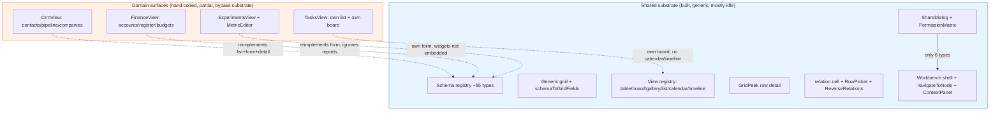
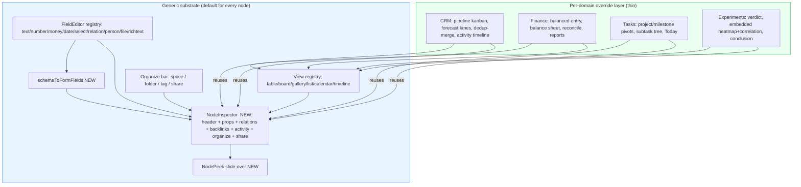
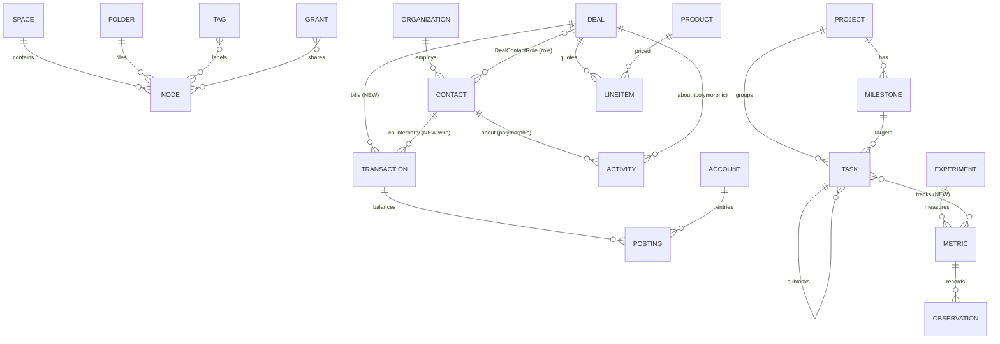
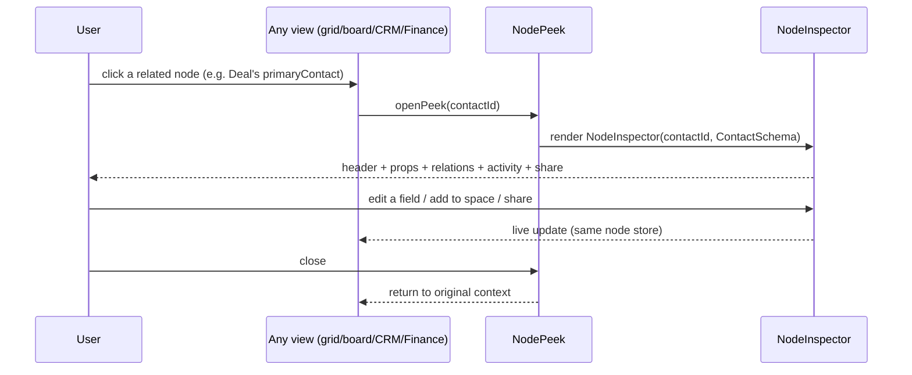

# Cohesive, Feature-Complete Domain UIs: Unifying CRM, Accounting, Tasks, Experiments, Spaces & Sharing

## Problem Statement

We have shipped a remarkable amount of *capability* but only a fraction of
the *surface area* needed to use it. Over the last several PRs the app grew a
native CRM (#102), double-entry accounting (#101), task/project/milestone
primitives, a habit-tracker and experiment journal (#89/#90), spaces (#84),
folders/tags (#53), and durable share links (#52). Each landed as its own
bespoke screen.

The result is an app where:

- **The CRM and accounting "don't have much UI"** — most of the schema and
  logic is built, but the screens expose maybe a third of it. Forecast lanes,
  duplicate-merge, vCard, line-items, balance sheets, reconciliation, and
  spending reports all exist in code with *zero* surface.
- **Tasks/projects/milestones feel underbuilt** — Milestones have no UI at
  all; Projects only exist as a sidebar filter; subtasks, timelines, and
  project-grouped boards are missing even though the data supports them.
- **Habits/experiments feel underbuilt** — you can't record a conclusion,
  attach a note to an observation, or see a heatmap/correlation inside the
  experiment that owns the metric.
- **Workspaces are janky** — you can rename a space and set visibility, but
  you cannot edit its icon, color, or description from the UI, and there is no
  affordance to *put something into* a space.
- **Sharing is uneven** — you can share a page, database, canvas, dashboard,
  saved view, or space via link, but you cannot share a contact, a deal, an
  account, or a task even though every one of those carries a full
  authorization model.
- **Nothing is cohesive** — each domain reinvents its own list, its own detail
  pane, and its own edit form. There is no single way to link a deal to a
  transaction, file a contact into a space, attach a habit-metric to a task,
  or open "the thing this references" in a consistent inspector.

The user's ask is explicitly holistic: *go through everything, make every UI
feature-complete, make them cohesive, expose editing everywhere, and let the
domains integrate* (CRM ↔ accounting, accounting ↔ experiments, projects ↔
tasks ↔ milestones, everything ↔ spaces/folders/tags/sharing).

This exploration argues the fix is **not** "build N more bespoke screens." It
is to finish the *shared substrate* that already exists and route every domain
through it, keeping bespoke surfaces only where a workflow genuinely demands
one.

## Executive Summary

The good news, established by reading the code: **xNet is already a unified,
schema-driven node graph with most of the cohesion primitives built.** There
is one schema registry, one relation system, one workbench shell, one
navigation dispatcher, a generic grid that renders any schema, a view registry
with table/board/gallery/list/calendar/timeline, a generic row-detail "peek",
backlinks/reverse-relations, and a sharing dialog. The fragmentation is almost
entirely in the *domain surface layer* — CRM, Finance, Tasks, and Experiments
each bypass the substrate with hand-coded lists, forms, and detail panes that
expose only a sliver of their own schemas.

The recommendation is a **"generic substrate, bespoke overrides"** strategy,
the same pattern Anytype, Capacities, Notion, and Salesforce Lightning all
converged on:

1. **Build the three missing substrate pieces:** a `schemaToFormFields`
   generator (the inverse of the existing `schemaToGridFields`), one universal
   **`NodeInspector`** detail panel (header + properties + relations +
   backlinks + activity + sharing + space/folder/tags), and a global
   **`NodePeek`** slide-over so any related node opens in place.
2. **Route every domain entity through the generic view system** so CRM,
   Finance, Tasks, and Experiments inherit table/board/calendar/gallery/
   timeline *for free*, then keep bespoke surfaces only for genuine workflow
   needs (balanced transaction entry, pipeline kanban, the Today panel).
3. **Make organization uniform:** one shared affordance — "Add to space / Move
   to folder / Add tag / Share" — wired generically to every node, plus
   extending the `folder` relation and `ShareDocType` to all node types.
4. **Wire cross-domain integration** through first-class typed relations and
   rollups: Deal ↔ Transaction, the polymorphic Activity timeline, Task ↔
   Metric, and the Project → Milestone → Task → Subtask hierarchy.
5. **Fill the orphaned-logic gaps** per domain — these are mostly "expose what
   already exists" tickets, not new engineering.

The headline: **most of this is wiring and exposure, not invention.** The hard
architecture is done.

## Current State In The Repository

### The shell and the substrate (cohesive, reusable)

The workbench is a VS Code-style shell with a consistent, extensible model:

- **Shell** — [`apps/web/src/workbench/Workbench.tsx`](apps/web/src/workbench/Workbench.tsx):
  rail + left panel + tabbed editor area + right context panel + bottom panel.
- **Navigation** —
  [`apps/web/src/workbench/navigation.ts`](apps/web/src/workbench/navigation.ts):
  a single `navigateToNode(navigate, nodeType, nodeId)` switch over 13 node
  types. Cohesive dispatch; no per-domain navigation hacks.
- **Contributions / commands** —
  [`contributions.tsx`](apps/web/src/workbench/contributions.tsx),
  [`commands.ts`](apps/web/src/workbench/commands.ts): plugin rail items,
  status items, and a command registry.
- **Context panel** —
  [`context-panel.tsx`](apps/web/src/workbench/context-panel.tsx): a view can
  publish `ContextPanelSection[]` (Properties / Comments / Backlinks) for the
  active tab. The mechanism is generic; only some views use it.

The data substrate is genuinely unified:

- **One schema registry** —
  [`packages/data/src/schema/registry.ts`](packages/data/src/schema/registry.ts)
  with ~55 built-in schemas enumerable via `getAllIRIs()`.
- **Generic grid** — [`DatabaseView.tsx`](apps/web/src/components/DatabaseView.tsx)
  + `useGridDatabase()` + `GridSurface` render *any* schema.
- **Schema → grid columns** —
  [`packages/views/src/grid/schema-to-grid-fields.ts`](packages/views/src/grid/schema-to-grid-fields.ts)
  converts any `Schema` to `GridField[]`.
- **View registry** —
  [`packages/views/src/builtins.ts`](packages/views/src/builtins.ts) registers
  **table, board, gallery, list, timeline (Gantt-style), and calendar** views,
  all driven by `{ schema, view, data }`.
- **Generic row detail / peek** —
  [`packages/views/src/grid/GridPeek.tsx`](packages/views/src/grid/GridPeek.tsx).
- **Relations** — `relation()` fields across every schema; the relation cell
  editor `RelationCell` + `RowPickerModal` link any row to any row;
  `ReverseRelationsPanel` shows incoming edges; wiki-link backlinks in
  [`BacklinksPanel.tsx`](apps/web/src/components/BacklinksPanel.tsx).
- **Sharing** — [`ShareDialog.tsx`](apps/web/src/components/ShareDialog.tsx) +
  [`useShareLinks.ts`](apps/web/src/hooks/useShareLinks.ts) with a three-tab
  (Links / People / Permissions) dialog and `PermissionMatrixPanel`.

### The domain surfaces (bespoke, partial)

Every domain bypasses the substrate above with hand-coded UI that exposes a
fraction of its schema. Concrete gaps:

#### CRM — `apps/web/src/components/crm/*`, schema `packages/data/src/schema/schemas/crm.ts`

[`CrmView.tsx`](apps/web/src/components/crm/CrmView.tsx) has four tabs
(Contacts, Pipeline, Companies, Keep-in-touch). Of **10 CRM entity types**,
only 3 are well-surfaced:

| Entity | UI today | Orphaned |
|---|---|---|
| Contact | name, lifecycle, org, email, phone, title, cadence, howWeMet | firstName/lastName, tags, introducedBy, did, actor, owner, GDPR erasure |
| Deal | title, stage, amount | primaryContact, org, probability, closeDate, **forecastCategory**, source, owner, collaborators, won/lost timestamps, lostReason, tags |
| Organization | name, domain | website, industry, size, revenue, phone, full address, parent, owner, tags |
| Activity | kind, summary, occurredAt (read-only timeline) | body, direction, duration, outcome, dueAt, completed, polymorphic `about` |
| **Relationship** | — | **no UI** (contact↔contact graph, 11 kinds) |
| **DealContactRole** | — | **no UI** (deal stakeholder roles: champion, decision-maker…) |
| **Product** | — | **no UI** |
| **LineItem** | — | **no UI** (quote/line-item building) |
| Pipeline / Stage | render as columns | cannot create/reorder/recolor stages or pipelines |

`@xnetjs/crm` logic with **zero surface**: `forecast.ts` (4-lane forecast
rollup), `dedup.ts` (Jaro-Winkler duplicate detection), `vcard.ts` (RFC-6350
import/export), `catalog.ts` (line-item math), `erasure.ts` (GDPR), and the
analytics in `pipeline.ts` (`averageSalesCycleDays`, `pipelineVelocity`,
`funnelConversion`). Notably, **every CRM schema already has `space: space()`**
(verified in `crm.ts`) — so CRM is space-addressable in the data model and only
the *UI affordance* is missing.

#### Finance — `apps/web/src/components/finance/*`, schemas under `schema/schemas/accounting/`

[`FinanceView.tsx`](apps/web/src/components/finance/FinanceView.tsx) shows a
flat chart of accounts, a register, quick entry
([`TransactionForm.tsx`](apps/web/src/components/finance/TransactionForm.tsx)),
budgets, and statement import
([`ImportPanel.tsx`](apps/web/src/components/finance/ImportPanel.tsx)). The
`@xnetjs/ledger` package computes far more than is shown:

- `report.ts` — `balanceSheet()`, `incomeStatement()`, `spendingByCategory()`,
  `netWorth()`: only net-worth + a two-line summary are surfaced. **No balance
  sheet, income statement, or spending breakdown UI.**
- `balance.ts` — `trialBalance()`, imbalance detection: **no UI.**
- `reconcile.ts` — matching logic exists; **no reconciliation workflow UI**
  (the `status` pending/cleared/reconciled field is hardwired to "cleared").
- Account tree (`parent`, `isGroup`) renders **flat**; `code`, per-account
  currency, memos, counterparty, transaction splits across 3+ accounts, budget
  period selection (weekly/yearly), and import-batch history/rollback are all
  orphaned.

#### Tasks / Projects / Milestones — `apps/web/src/components/Tasks*`, `packages/views/src/tasks/*`

[`TasksView.tsx`](apps/web/src/components/TasksView.tsx) is genuinely good —
list + board, inline editing of status/priority/due/assignees/tags via
[`TaskInlineEditor.tsx`](apps/web/src/components/TaskInlineEditor.tsx). But:

- **Milestones have no UI anywhere.** The schema
  ([`milestone.ts`](packages/data/src/schema/schemas/milestone.ts)) is complete
  and `Task.milestone` exists, but there is no milestone picker, no milestone
  view, no grouping.
- **Projects** ([`project.ts`](packages/data/src/schema/schemas/project.ts))
  exist only as a sidebar count and a `?project=` filter; there is **no project
  detail view** (lead, target date, milestones, grouped tasks).
- **Subtasks** (`Task.parent`) have no tree/nesting rendering.
- The board is **always status-grouped** — no project- or milestone-pivoted
  board, no Gantt/timeline even though `Task.dueDate` + `Milestone.targetDate`
  exist and a generic timeline view is already registered.
- Tasks have their **own** `TaskBoard`/`TaskListGrouped` in
  `packages/views/src/tasks/` — a *second* board implementation parallel to the
  generic `GridSurface` board.

#### Habits / Experiments — `apps/web/src/components/experiments/*`

[`ExperimentDetail.tsx`](apps/web/src/components/experiments/ExperimentDetail.tsx),
[`MetricEditor.tsx`](apps/web/src/components/experiments/MetricEditor.tsx), and
the [`TodayPanel.tsx`](apps/web/src/workbench/views/TodayPanel.tsx) are
reasonably complete for logging, but:

- **No UI to record an experiment `conclusion`** (the schema field exists).
- **Observation `note` is orphaned** — you can log a value but not annotate it.
- **Metric ↔ Experiment binding** has no picker (`Metric.experiment` must be
  set via the database).
- **Heatmap and correlation widgets** live in `@xnetjs/dashboard`
  (`streak-heatmap-widget`, `correlation-widget`) and are **not embedded in the
  experiment that owns the metric** — you only get them by building a dashboard.
- `startDate`/`endDate`, `source` (sensor/import), and metric folder/tags are
  not editable in the UI.

#### Spaces / Folders / Tags / Sharing — the four organizational axes

- **Spaces** ([`SpaceHomeView.tsx`](apps/web/src/components/SpaceHomeView.tsx)):
  you can create, rename, set visibility, and manage member roles. But **icon,
  color, and description are render-only** — the `updateSpace()` hook accepts
  them, yet no UI calls it (this is the "janky workspace editing"). And although
  `setNodeSpace()` exists, **there is no UI to file a node into a space.**
- **Folders**
  ([`ExplorerFolderTree.tsx`](apps/web/src/workbench/views/ExplorerFolderTree.tsx)):
  create/rename/drag-drop/nest — but only for **explorer types** (page,
  database, canvas, dashboard, map, lab; see
  [`explorer-items.ts`](apps/web/src/workbench/views/explorer-items.ts)).
  Tasks, CRM, and finance cannot be filed even though Metric, Experiment, and
  Project *do* carry a `folder` relation. Verified: `folder: relation` exists on
  page, database, canvas, dashboard, map, channel, **project, metric,
  experiment** — but not on task, contact, deal, account, transaction.
- **Tags** ([`TagView.tsx`](apps/web/src/components/TagView.tsx)): a tag *page*
  exists (rename, merge, archive, attach channel), but tags are applied via
  hashtag mentions in editors, **not via a picker** at create/edit time, and
  there is no tag-filter in the explorer.
- **Sharing**: `ShareDocType = 'page' | 'database' | 'canvas' | 'dashboard' |
  'view' | 'space'` (verified). Spaces *are* shareable; **CRM, finance, tasks,
  projects, experiments are not**, despite every one carrying a full
  `authorization` block. The Permissions tab is read-only.

### What this looks like architecturally



The dotted lines are the waste: each domain *reimplements* what the substrate
already provides, then exposes less of its own schema than the generic grid
would have for free.

## External Research

Prior art across the "everything app" category converges hard on a small set
of patterns. (Synthesized from Notion, Anytype, Tana, Capacities, Linear,
Salesforce/HubSpot, and the schema-driven-UI tooling ecosystem.)

- **Notion** — Relations + Rollups are *the* cohesion primitive. Views (table/
  board/calendar/gallery/timeline) are projections over one property set, never
  separate stores. Every database row is a page with a generic property editor,
  so no domain needs a hand-coded form. Pitfall: relations are only
  database-to-database, and generic editors feel cramped for complex domains
  (e.g. multi-currency line items).
- **Anytype** — Local-first, "everything is an object," and *Types and
  Relations are themselves objects*. One generic object editor renders any
  type; "Sets" are saved queries that can span types via shared relations.
  Lesson: a node's type changes *which fields render*, not its structural
  identity — exactly the 0188 schema-overlay model.
- **Tana** — Supertags add typed fields to any node; multiple supertags union
  their fields; live search nodes are inline views. Confirms "one node model,
  many domain interpretations." Pitfall: no inheritance/composition between
  supertags; relational data (line items) is awkward in an outliner.
- **Capacities** — A *consistent object-page shell* for every type: title +
  type badge + metadata + properties + always-visible backlinks + body. The
  shell is identical; only the properties differ. This is the
  `NodeInspector`-with-slots pattern, validated.
- **Linear** — Cohesion through a deliberately locked hierarchy (Team →
  Project → Cycle → Issue → Sub-issue, Milestones on Projects) plus typed
  issue-to-issue relations (Blocks/Related/Duplicate) and a right-hand
  relations+activity panel. Lesson: *define the hierarchy before shipping*, and
  make cross-hierarchy links first-class relation types, not text fields.
- **Salesforce / HubSpot** — The canonical feature-complete CRM record page =
  header with key fields + pinned highlights + **related lists grouped by
  type** + an **append-only activity timeline** (calls/emails/meetings/tasks/
  notes as heterogeneous entries) + a notes body. HubSpot "Associations" prove
  that **relation edges must carry metadata** (a labeled role like "Decision
  Maker"), i.e. a join model, not a bare foreign key — exactly our
  `DealContactRole`.
- **Schema-driven UI (RJSF, Salesforce Lightning, Directus, Budibase, Retool,
  Airtable Interfaces)** — The durable principle is **"the field type is the
  unit of reuse, not the form."** Build a canonical `FieldEditor` per property
  type (text/number/money/date/select/relation/rich-text/file); a generic form
  is just an ordered list of those; a bespoke form reuses the same editors but
  adds layout, conditional logic, and computed displays. Pitfall: fully generic
  generation fails for workflows with cross-field invariants (debit/credit
  balance, "reason for closing"), so the **override escape hatch must be
  intentional**, not accidental.

### Cross-cutting takeaways (the design spine of this doc)

1. **Relations + rollups are the cohesion primitive.** Deal→Transaction with a
   rollup beats a bespoke "billing tab."
2. **One generic object view with per-type overrides beats N bespoke surfaces.**
3. **Field types — not forms — are the unit of reuse.**
4. **The activity timeline is its own append-only heterogeneous log,** distinct
   from comments, backlinks, and edit history. Activity should be a node with a
   polymorphic `about` edge (we already have `Activity`).
5. **A global "peek" slide-over is essential** for cross-domain navigation.
6. **Relations with labeled roles** unlock structured many-to-many (we have
   `DealContactRole`; generalize it).
7. **Views are projections over shared data,** never copies.

## Key Findings

1. **The substrate is ~80% built and ~20% used.** Schema registry, generic
   grid, six view types, peek, relations, backlinks, sharing, and a cohesive
   shell already exist. CRM/Finance/Tasks/Experiments simply don't flow through
   them.
2. **"Feature-complete" is mostly an exposure problem, not an engineering one.**
   Forecast lanes, dedup/merge, vCard, line items, balance sheet, income
   statement, spending-by-category, reconciliation, trial balance — all are
   computed today with no surface. The work is UI wiring.
3. **There are two parallel board implementations** (generic `GridSurface`
   board + bespoke `TaskBoard`) and several parallel detail/edit forms
   (`CrmContacts` detail, `TransactionForm`, `MetricEditor`). This is the
   fragmentation tax.
4. **The data model already supports cross-domain integration** via `relation()`
   everywhere, a polymorphic `Activity.about`, and `space()` on (almost) every
   node — but the *editing UI* for relations only exists inside the generic
   grid, not inside the bespoke domain surfaces.
5. **Four organizational axes (space/folder/tag/share) are inconsistent and
   incomplete:**
   - Space metadata is half-editable; "file into space" has no UI.
   - Folders cover only 6 "explorer" types; tasks/CRM/finance can't be filed.
   - Tags have no picker; applied only via hashtag syntax.
   - Sharing covers 6 types; domain entities can't be link-shared.
   These should be **one** organize-and-share affordance attached to every node.
6. **The missing substrate pieces are few and high-leverage:**
   `schemaToFormFields` (form generation — does not exist today),
   a universal `NodeInspector` (consistent detail shell), and a global
   `NodePeek` (slide-over). `schemaToGridFields` and `GridPeek` already exist as
   the proof points that this is tractable.
7. **0189's FeatureModule platform is the right home for this.** Making each
   domain a uniform two-sided plugin aligns with routing every domain through
   the substrate; the generic surfaces become the default rendering and each
   feature module contributes only its overrides.

## Options And Tradeoffs

### Option A — Keep building bespoke screens per domain

Finish CRM, then Finance, then Tasks, then Experiments as independent
hand-coded surfaces.

- **Pros:** Each screen can be perfectly tuned; no shared-abstraction risk;
  fastest path to *one* polished domain.
- **Cons:** N× the work; N× the maintenance; cohesion never emerges (every new
  field needs N edits); cross-domain integration stays a special case each
  time; the substrate keeps rotting unused. This is how we got here.

### Option B — Pure generic, schema-driven everything

Delete bespoke surfaces; render every entity through the generic grid + a
fully auto-generated form/detail.

- **Pros:** Maximum cohesion and consistency; one place to add a field;
  smallest code surface.
- **Cons:** Generic generation genuinely fails for cross-field workflows
  (balanced double-entry, pipeline stage transitions with capture dialogs, the
  daily habit logging ergonomics). Every prior-art product that tried pure
  generation added an override layer. A money field, a sparkline, a heatmap, a
  balance validator are not expressible as "field N of a form."

### Option C — Generic substrate with bespoke overrides (recommended)

Make the generic path the *default* for every node (list/board/calendar/
gallery/timeline + a universal `NodeInspector` detail + peek), and let each
domain contribute a thin **override layer**: a custom header, pinned
highlights, computed panels, and domain actions — reusing the shared field
editors underneath. This is the Anytype/Capacities/Salesforce-Lightning model
and matches takeaway #2.

- **Pros:** Cohesion by construction (every node gets the same shell, sharing,
  organization, relations, backlinks); feature-completeness becomes "expose the
  field," not "build a screen"; bespoke effort is spent only where it earns its
  keep; cross-domain integration is free because relations are first-class
  everywhere; aligns with the FeatureModule platform (0189).
- **Cons:** Requires building the three substrate pieces first
  (`schemaToFormFields`, `NodeInspector`, `NodePeek`) before the payoff;
  needs discipline to keep overrides thin; a migration period where old and new
  detail panes coexist.

### Comparison

| Dimension | A: Bespoke | B: Pure generic | C: Substrate + overrides |
|---|---|---|---|
| Cohesion | ✗ none | ✓✓ total | ✓ strong |
| Feature-completeness effort | high (per domain) | low | low after substrate |
| Handles complex workflows | ✓ | ✗ | ✓ (via overrides) |
| Cross-domain integration | special-cased | free | free |
| Maintenance (add a field) | N edits | 1 edit | 1 edit |
| Upfront investment | low | medium | medium (3 pieces) |
| Aligns with 0189 plugins | ✗ | partial | ✓✓ |

## Recommendation

Adopt **Option C**. Concretely, in four workstreams that can largely proceed in
parallel after Workstream 1's substrate lands.

### Target architecture



### Workstream 1 — Build the cohesion substrate (unblocks everything)

1. **`schemaToFormFields(schema, opts)`** in `packages/views/src/form/` — the
   inverse of `schemaToGridFields`. Returns ordered `FormField[]` and a
   `<SchemaForm>` that reuses the existing grid cell editors (TextCell,
   SelectCell, RelationCell, PersonCell, DateCell, money, file). Honors
   effective-schema overlays (0188) and `readonly`.
2. **`<NodeInspector nodeId schema sections />`** — the universal detail shell
   (the Capacities/Salesforce pattern): editable header, pinned highlights,
   `SchemaForm` properties, **outgoing relations grouped by type**, **backlinks
   via `ReverseRelationsPanel`**, an **activity timeline** (query `Activity`
   nodes whose polymorphic `about` points here), and an **organize+share bar**.
   Publish it through the existing `ContextPanel` mechanism *and* make it
   standalone.
3. **`<NodePeek>`** — a global slide-over that renders `NodeInspector` for any
   node id without losing context (Notion/Linear "peek"). This is what makes
   "open the contact behind this deal" feel cohesive.
4. **Shared `<OrganizeBar>`** — one component exposing *Move to space / Move to
   folder / Add tag / Share* for any node, wired to `setNodeSpace`,
   folder-move, the tags relation, and `ShareDialog`.

### Workstream 2 — Make organization & sharing uniform

5. Add a `folder` relation to **Task, Contact, Organization, Deal, Account,
   Transaction, Budget** (Metric/Experiment/Project already have it) and add
   those types to the explorer item set so they can be filed.
6. Extend `ShareDocType` to include `task | contact | organization | deal |
   account | project | experiment` and wire `ShareButton` into their inspectors
   (the authorization model already exists for all of them).
7. Build the **space editor** (icon/color/description via the existing
   `updateSpace`) and a **space content browser** that lists everything with
   `space === id`, grouped by type — fixing the "janky workspace" complaint.
8. Add an inline **tag picker** to `NodeInspector` (and the create flow) instead
   of hashtag-only tagging.

### Workstream 3 — Close the per-domain feature gaps (exposure)

Mostly "surface logic that already exists," now cheap because the inspector and
generic views do the heavy lifting:

- **CRM:** forecast-lane view (`forecast.ts`), duplicate finder + merge
  (`dedup.ts`), vCard import/export (`vcard.ts`), Product catalog + LineItem
  quote builder (`catalog.ts`), `DealContactRole` stakeholder editor, the
  Relationship graph, full Organization/Contact/Deal field editing via the
  inspector, an Activity timeline, GDPR erasure action.
- **Finance:** Reports tab (balance sheet / income statement / spending-by-
  category / trial balance from `report.ts` + `balance.ts`), reconciliation
  workflow (`reconcile.ts` + the `status` field), account-tree rendering,
  transaction splits & memos, counterparty linking, budget period selector,
  import-batch history.
- **Tasks/Projects/Milestones:** Project detail view, Milestone CRUD + picker,
  subtask tree in the list, project/milestone-pivoted board, and a
  Gantt/timeline via the already-registered timeline view.
- **Experiments/Habits:** record `conclusion`, observation notes, Metric ↔
  Experiment picker, **embed the existing heatmap + correlation widgets inside
  `ExperimentDetail`**, start/end dates, observation `source`.

### Workstream 4 — Cross-domain integration (the payoff)

9. **Deal ↔ Transaction / LineItem:** add relations so a won deal can spawn (or
   link to) ledger transactions; rollup deal revenue from linked transactions.
10. **Activity as the universal timeline:** generalize `Activity.about` so any
    node (contact, deal, account, task, experiment) shows a consistent activity
    feed in its inspector.
11. **Task ↔ Metric / Experiment:** allow a task to reference a metric
    ("complete = log observation") and an experiment to reference its tasks.
12. **Counterparty ↔ Contact/Organization:** link `Transaction.counterparty` to
    CRM, enabling AR/AP and "revenue by contact."

### The integration backbone (data model that already exists)



Solid edges mostly exist in the schema today; the `(NEW)` edges are the
integration wiring of Workstream 4.

### Navigation model after the change



## Example Code

### `schemaToFormFields` — the missing inverse of `schemaToGridFields`

```ts
// packages/views/src/form/schema-to-form-fields.ts
import type { Schema } from '@xnetjs/data'
import { schemaToGridFields, type GridField } from '../grid/schema-to-grid-fields.js'

export interface FormField extends GridField {
  /** rendered in the pinned header zone of the inspector */
  highlight?: boolean
  /** grouping for sectioned forms (e.g. "Address", "Forecast") */
  group?: string
}

export interface SchemaToFormOptions {
  /** field keys to pin to the inspector header */
  highlights?: string[]
  /** field keys to hide (e.g. internal: sortKey, anchorBlockId) */
  hidden?: string[]
  /** explicit ordering; unlisted fields follow in schema order */
  order?: string[]
  groups?: Record<string, string> // fieldKey -> group label
}

const ALWAYS_HIDDEN = new Set(['sortKey', 'shortId', 'anchorBlockId', 'source'])

export function schemaToFormFields(
  schema: Schema,
  opts: SchemaToFormOptions = {}
): FormField[] {
  const hidden = new Set([...ALWAYS_HIDDEN, ...(opts.hidden ?? [])])
  const fields = schemaToGridFields(schema)
    .filter((f) => !hidden.has(f.key))
    .map((f) => ({
      ...f,
      highlight: opts.highlights?.includes(f.key) ?? false,
      group: opts.groups?.[f.key]
    }))

  if (!opts.order) return fields
  const rank = new Map(opts.order.map((k, i) => [k, i]))
  return fields.sort(
    (a, b) => (rank.get(a.key) ?? 999) - (rank.get(b.key) ?? 999)
  )
}
```

### `<SchemaForm>` — reuse existing cell editors, no new field widgets

```tsx
// packages/views/src/form/SchemaForm.tsx
import { CellEditor } from '../grid/CellEditor.js' // existing per-type editor
import { schemaToFormFields, type SchemaToFormOptions } from './schema-to-form-fields.js'
import type { Schema } from '@xnetjs/data'

export function SchemaForm(props: {
  schema: Schema
  value: Record<string, unknown>
  onChange: (key: string, next: unknown) => void
  options?: SchemaToFormOptions
}) {
  const fields = schemaToFormFields(props.schema, props.options)
  return (
    <div className="schema-form">
      {fields.map((f) => (
        <label key={f.key} className="schema-form__row" data-readonly={f.readonly}>
          <span className="schema-form__label">{f.title}</span>
          <CellEditor
            field={f}                       // text/number/money/date/select/relation/person/file
            value={props.value[f.key]}
            readOnly={f.readonly}
            onCommit={(next) => props.onChange(f.key, next)}
          />
        </label>
      ))}
    </div>
  )
}
```

### Domain override stays thin — Deal inspector = generic + a few panels

```tsx
// apps/web/src/components/crm/DealInspector.tsx
import { NodeInspector } from '../NodeInspector'
import { DealSchema } from '@xnetjs/data'
import { forecastRollup } from '@xnetjs/crm'

export function DealInspector({ dealId }: { dealId: string }) {
  return (
    <NodeInspector
      nodeId={dealId}
      schema={DealSchema}
      // pin the fields a salesperson always wants visible
      formOptions={{
        highlights: ['title', 'stage', 'amount', 'closeDate', 'forecastCategory'],
        groups: { source: 'Attribution', owner: 'Ownership', collaborators: 'Ownership' }
      }}
      // bespoke panels layered on top of the generic shell
      extraPanels={[
        { id: 'stakeholders', title: 'Stakeholders', render: () => <DealContactRoles dealId={dealId} /> },
        { id: 'lineitems',    title: 'Line items',   render: () => <DealLineItems dealId={dealId} /> },
        { id: 'forecast',     title: 'Forecast',     render: () => <ForecastBadge dealId={dealId} /> }
      ]}
      // relations + backlinks + activity timeline + organize/share come for free
    />
  )
}
```

### Uniform organize/share bar for any node

```tsx
// apps/web/src/components/OrganizeBar.tsx
export function OrganizeBar({ nodeId, schema }: { nodeId: string; schema: Schema }) {
  return (
    <div className="organize-bar">
      <SpacePicker  value={getField(nodeId, 'space')}  onChange={(s) => setNodeSpace(nodeId, s)} />
      <FolderPicker value={getField(nodeId, 'folder')} onChange={(f) => moveToFolder(nodeId, f)} />
      <TagPicker    value={getField(nodeId, 'tags')}   onChange={(t) => setTags(nodeId, t)} />
      <ShareButton  docId={nodeId} docType={shareTypeFor(schema)} />
    </div>
  )
}
```

## Risks And Open Questions

- **Override creep.** The whole bet is that override layers stay thin. Without
  discipline they regrow into bespoke screens. Mitigation: forbid domain code
  from re-implementing field editors; lint/review for it; the FeatureModule
  contract (0189) can enforce "contribute panels, not forms."
- **Cross-field invariants in a generic form.** Double-entry balance, "reason
  for closing a deal," and habit-logging ergonomics cannot be auto-generated.
  These stay bespoke *actions/forms* — `SchemaForm` is for property editing, not
  for transactional workflows. Keep `TransactionForm` for balanced entry.
- **Two board implementations.** Do we migrate `TaskBoard` onto the generic
  `GridSurface` board, or keep it? Recommendation: keep the bespoke task board
  for now (it has document-mirroring semantics) but expose tasks through the
  generic views too (calendar/timeline). Revisit consolidation later.
- **Folder vs. space vs. tag overlap.** Three containment axes risk confusing
  users. Open question: is folder purely cosmetic (per-user organization) while
  space is the security boundary and tags are cross-cutting labels? We should
  document the mental model before exposing all three everywhere.
- **Activity timeline performance.** A polymorphic `about` query per inspector
  must be indexed; a node referenced by hundreds of activities needs pagination
  (the Salesforce "related list" scaling lesson).
- **Sharing a sub-record vs. its space.** If a contact is in a shared space and
  also link-shared individually, which grant wins? The grant-override semantics
  from PR #52 should be reused, but the interaction with space cascade
  (PR #84/#109 broker) needs a written rule.
- **Effective-schema (0188) in forms.** `SchemaForm` must honor extension fields
  and read-time composition, not just core schema — otherwise extended fields
  won't be editable.
- **Scope.** This is large. The phasing must let Workstream 1 ship and prove
  value on *one* domain (CRM is the best candidate — most orphaned logic) before
  rolling across all four.

## Implementation Checklist

### Workstream 1 — Substrate
- [x] Add `packages/views/src/form/schema-to-form-fields.ts` (+ test) mirroring `schema-to-grid-fields`.
- [x] Add `SchemaForm` reusing existing grid property editors; honor effective-schema overlays (0188) and `readonly`.
- [ ] Build `NodeInspector` (header + highlights + `SchemaForm` + relations-by-type + `ReverseRelationsPanel` backlinks + activity timeline + organize/share bar).
- [ ] Build global `NodePeek` slide-over rendering `NodeInspector` for any node id.
- [ ] Build shared `OrganizeBar` (space / folder / tag / share).
- [ ] Wire `NodeInspector` through the existing `ContextPanel` contribution mechanism.

### Workstream 2 — Uniform organization & sharing
- [x] Add `folder` relation to Task, Contact, Organization, Deal, Account, Transaction, Budget.
- [ ] Add those types to `explorer-items.ts` so they can be filed/dragged.
- [ ] Extend `ShareDocType` + hub endpoints to task/contact/organization/deal/account/project/experiment.
- [ ] Build the Space editor (icon/color/description via `updateSpace`).
- [ ] Build the Space content browser (everything `space === id`, grouped by type).
- [ ] Add inline tag picker to `NodeInspector` and create flows.
- [ ] Document the space-vs-folder-vs-tag mental model.

### Workstream 3 — Per-domain feature completeness
- [ ] CRM: forecast lanes, dedup finder + merge, vCard import/export, Product/LineItem quote builder, `DealContactRole` editor, Relationship graph, Activity timeline, full field editing, GDPR erasure action.
- [ ] Finance: Reports tab (balance sheet, income statement, spending-by-category, trial balance), reconciliation workflow, account tree, splits/memos, counterparty link, budget period selector, import-batch history.
- [ ] Tasks: Project detail view, Milestone CRUD + picker, subtask tree, project/milestone-pivoted board, timeline/Gantt via registered timeline view.
- [ ] Experiments: conclusion recording, observation notes, Metric↔Experiment picker, embed heatmap + correlation widgets in `ExperimentDetail`, start/end dates, observation source.

### Workstream 4 — Cross-domain integration
- [x] Deal ↔ Transaction relations (`Deal.transactions`, `Transaction.deal`) — revenue rollup UI pending.
- [ ] Generalize `Activity.about` as the universal timeline; render in every inspector.
- [x] Task ↔ Metric/Experiment relations (`Task.metric`, `Task.experiment`).
- [ ] Wire `Transaction.counterparty` to CRM Contact/Organization (AR/AP, revenue-by-contact).

## Validation Checklist

- [ ] A new schema field appears in list, form, inspector, and peek with **no per-domain code change** (proves substrate reuse).
- [ ] Every node type (page, contact, deal, account, task, metric, experiment, space) opens in the **same** `NodeInspector` shell.
- [ ] From a Deal, clicking `primaryContact` opens the Contact in `NodePeek` without losing the Deal; editing the contact updates live.
- [ ] A contact/deal/task/account can be filed into a folder, added to a space, tagged, and link-shared — through one `OrganizeBar`.
- [ ] Editing a space's icon/color/description from the UI persists (no DB poking).
- [ ] CRM forecast lanes, dedup-merge, vCard, and a line-item quote are reachable from the UI; finance shows a balance sheet, income statement, and reconciliation.
- [ ] Milestones are creatable and selectable on tasks; a project detail view lists its milestones and grouped tasks; a task timeline renders.
- [ ] An experiment shows its heatmap + correlation inline and lets you record a conclusion.
- [ ] A won Deal links to a ledger Transaction and the Deal shows rolled-up revenue.
- [ ] Lint/review confirms no domain surface re-implements a field editor.
- [ ] `pnpm test` + typecheck pass across `packages/views`, `packages/data`, `apps/web`; existing CRM/Finance/Tasks/Experiments e2e remain green.

## References

### Internal — substrate
- [`apps/web/src/workbench/Workbench.tsx`](apps/web/src/workbench/Workbench.tsx) — shell
- [`apps/web/src/workbench/navigation.ts`](apps/web/src/workbench/navigation.ts) — `navigateToNode`
- [`apps/web/src/workbench/context-panel.tsx`](apps/web/src/workbench/context-panel.tsx) — right-panel contributions
- [`packages/data/src/schema/registry.ts`](packages/data/src/schema/registry.ts) — schema registry
- [`packages/views/src/grid/schema-to-grid-fields.ts`](packages/views/src/grid/schema-to-grid-fields.ts) — schema→columns (model for `schemaToFormFields`)
- [`packages/views/src/builtins.ts`](packages/views/src/builtins.ts) — table/board/gallery/list/calendar/timeline registry
- [`packages/views/src/grid/GridPeek.tsx`](packages/views/src/grid/GridPeek.tsx) — generic row detail
- [`apps/web/src/components/DatabaseView.tsx`](apps/web/src/components/DatabaseView.tsx) — generic grid host
- [`apps/web/src/components/BacklinksPanel.tsx`](apps/web/src/components/BacklinksPanel.tsx) / `ReverseRelationsPanel`
- [`apps/web/src/components/ShareDialog.tsx`](apps/web/src/components/ShareDialog.tsx) + [`useShareLinks.ts`](apps/web/src/hooks/useShareLinks.ts) — sharing (`ShareDocType`)

### Internal — domain surfaces & schemas
- CRM: [`CrmView.tsx`](apps/web/src/components/crm/CrmView.tsx), [`crm.ts`](packages/data/src/schema/schemas/crm.ts), `packages/crm/src/{forecast,dedup,vcard,catalog,pipeline,erasure}.ts`
- Finance: [`FinanceView.tsx`](apps/web/src/components/finance/FinanceView.tsx), [`TransactionForm.tsx`](apps/web/src/components/finance/TransactionForm.tsx), `packages/ledger/src/{report,balance,reconcile,budget}.ts`
- Tasks: [`TasksView.tsx`](apps/web/src/components/TasksView.tsx), [`task.ts`](packages/data/src/schema/schemas/task.ts), [`project.ts`](packages/data/src/schema/schemas/project.ts), [`milestone.ts`](packages/data/src/schema/schemas/milestone.ts), `packages/views/src/tasks/*`
- Experiments: [`ExperimentDetail.tsx`](apps/web/src/components/experiments/ExperimentDetail.tsx), [`MetricEditor.tsx`](apps/web/src/components/experiments/MetricEditor.tsx), `packages/experiments/src/*`, `packages/dashboard/src/widgets/{streak-heatmap,correlation}-widget.tsx`
- Organization: [`SpaceHomeView.tsx`](apps/web/src/components/SpaceHomeView.tsx), [`ExplorerFolderTree.tsx`](apps/web/src/workbench/views/ExplorerFolderTree.tsx), [`explorer-items.ts`](apps/web/src/workbench/views/explorer-items.ts), [`TagView.tsx`](apps/web/src/components/TagView.tsx)

### Internal — prior explorations
- `0189_[_]_EVERYTHING_AS_PLUGINS_FEATURE_MODULE_PLATFORM.md` — the FeatureModule home for override layers
- `0188_[_]_EXTENSIBLE_SCHEMAS_AND_UNIVERSAL_DATABASE_VIEW.md` — `schemaToGridFields`, effective-schema, universal view
- `0188_[_]_NATIVE_CRM_AND_ERP_FOUNDATION.md` — CRM schema pack + logic
- `0187_[_]_DOUBLE_ENTRY_ACCOUNTING_AND_PERSONAL_FINANCE.md` — ledger schema + logic
- `0181_[_]_SPACES_AS_NESTED_GROUPINGS_AND_SCHEMA_AUTHORIZATION.md` — space auth cascade
- `0180_[_]_EXPOSING_SPACES_IN_THE_UI.md` — prior spaces-UI thinking
- `0183_[_]_XNET_POWER_USERS_PERSONAS_AND_WORKFLOWS.md` — who these integrations serve

### External — prior art
- Notion — databases as projections; Relation + Rollup property types
- Anytype — local-first "everything is an object"; Types/Relations as objects; Sets/Collections
- Tana — supertags; fields on any node; live-search views
- Capacities — consistent typed object-page shell; always-on backlinks
- Linear — locked Project→Milestone→Issue→Sub-issue hierarchy; typed issue relations; relations+activity panel
- Salesforce / HubSpot — record page (highlights + related lists + activity timeline); HubSpot Associations (labeled-role relation edges)
- Schema-driven UI: react-jsonschema-form, Salesforce Lightning App Builder, Directus, Budibase, Retool, Airtable Interfaces — "field type is the unit of reuse; generic by default, bespoke override"
