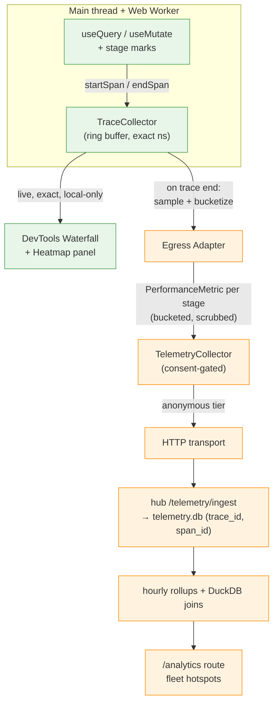
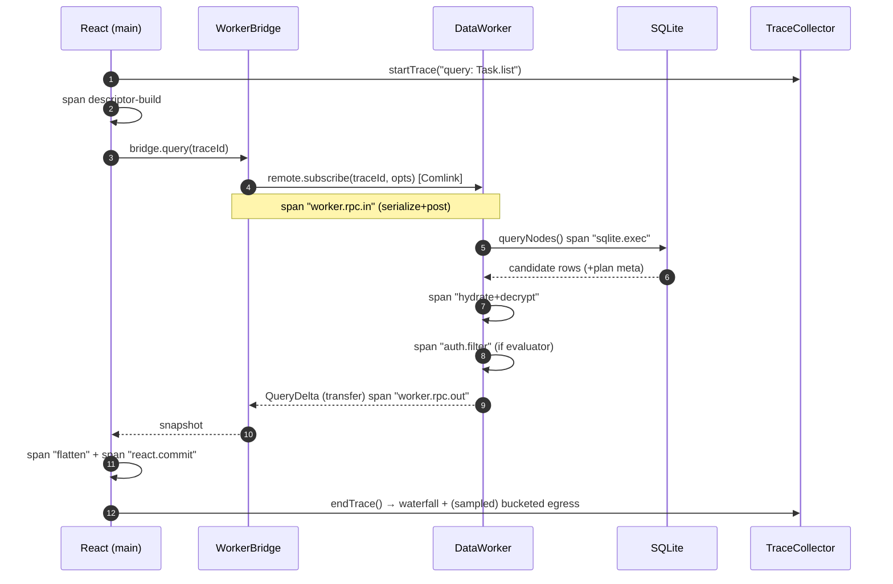

# Deep Performance Telemetry & Full-Stack Tracing

> Make every `useQuery` and `useMutate` self-measuring: capture the time spent in
> each stage of the read and write paths — worker hop, SQLite, decrypt, auth,
> flatten, render, queue, encrypt, persist, sync — assemble them into per-call
> **trace waterfalls** in devtools, and ship **bucketed, anonymous** aggregates to
> the hub so we can chart fleet-wide hotspots, slowest queries, and most expensive
> mutations.

## Problem Statement

Today xNet measures performance with a scattering of `Date.now()` deltas. `useQuery`
reports a single `react.useQuery` first-load number; `useMutate` reports one
aggregate number per `create`/`update`/`delete`/`transaction`
([packages/react/src/hooks/useQuery.ts:642-660](../../packages/react/src/hooks/useQuery.ts),
[packages/react/src/hooks/useMutate.ts:304-482](../../packages/react/src/hooks/useMutate.ts)).
That tells us _that_ a query was slow, never _why_. A 250 ms query could be 240 ms
of SQLite, 240 ms of decryption, 240 ms of auth-filter fallback, or 240 ms of React
reconciliation — the number alone can't distinguish them.

We want the opposite: a **causal breakdown** of every read and write, end to end:

- **Reads:** descriptor build → worker RPC → SQLite execute → candidate hydrate →
  decrypt → auth filter → snapshot transfer → flatten → React commit.
- **Writes:** mutate call → worker RPC → authorize → clock tick → encrypt →
  persist (SQLite write) → emit to sync → offline-queue enqueue → WebSocket → hub ack.

…plus context — _how many rows came back, how big the database is, whether a full
table scan happened, which index was used_ — and we want it (a) visualised as
waterfalls and heatmaps in devtools at the user's fingertips, and (b) automatically
collected in **anonymous, bucketed** form on the hub so we can answer "what are the
slowest queries across the fleet, and on what hardware?" — without ever shipping the
user's content.

The hard part is not collection — it is doing it **cheaply** (the read path runs on
every keystroke), **privately** (full traces are high-cardinality and content-adjacent),
and **without a second telemetry system** (we already have a good one).

## Executive Summary

xNet already has ~80% of the machinery. There is a full privacy-preserving telemetry
client (`@xnetjs/telemetry`: consent tiers, bucketing, scrubbing, durable buffer, HTTP
transport), a hub ingest pipeline with a SQLite store + hourly rollups + DuckDB joins +
Parquet tiering (`packages/hub/src/telemetry/*`, shipped in PR #100), a devtools
`TelemetryPanel` and a `QueryTracker` that **already captures query-plan metadata and
render time** ([packages/devtools/src/instrumentation/query.ts](../../packages/devtools/src/instrumentation/query.ts)),
and a flag-gated `/analytics` route. Critically, the hub event table **already has
`trace_id`, `span_id`, and `attributes` columns that nothing populates**
([packages/hub/src/telemetry/store.ts:22-39](../../packages/hub/src/telemetry/store.ts)).

What is missing is the connective tissue:

1. **A span/trace model.** Today a `PerformanceMetric` is a flat leaf
   ([packages/telemetry/src/schemas/performance.ts](../../packages/telemetry/src/schemas/performance.ts)).
   Waterfalls need a tree: `traceId`, `spanId`, `parentSpanId`, `startOffset`, `duration`, `attributes`.
2. **Stage instrumentation + context propagation across the worker boundary.** The
   read/write paths must emit child spans, and the `traceId` must ride the Comlink RPC
   into the worker and back.
3. **A two-track split.** Full-fidelity exact-timing traces stay **local** in a ring
   buffer for the devtools waterfall; only **bucketed, scrubbed** per-stage aggregates
   are eligible for the hub. This reconciles "rich waterfalls at my fingertips" with
   "anonymous fleet telemetry."
4. **Waterfall + heatmap views.** The charts package today is ECharts bar/line/area/pie
   only; a hand-rolled SVG waterfall (the `HabitHeatmap` precedent) is the lightest path.
5. **A consent default decision.** Auto-opting users into _performance-only, bucketed_
   collection means flipping the default tier from `off` to `anonymous` for a narrow
   schema — the most sensitive decision here, addressed explicitly below.

**Recommendation: Option C — a two-track design.** Build a local `TraceCollector` (ring
buffer, never leaves the device) that the read/write paths feed, render it as a devtools
waterfall, and add a thin **egress adapter** that converts completed traces into the
existing bucketed `PerformanceMetric` records for the hub. Phase the work so Phases 1–2
deliver pure local dev value with **zero** privacy surface, and only Phase 3+ touches
consent and the network.

## Current State In The Repository

### The read (query) hot path

```
useQuery (packages/react/src/hooks/useQuery.ts:394)
  → bridge.query(schema, options)                         # data-bridge
  → WorkerBridge.query  (packages/data-bridge/src/worker-bridge.ts:142)
  → remote.subscribe()  (Comlink RPC — crosses Worker boundary)
  → DataWorker.subscribe  (packages/data-bridge/src/worker/data-worker-host.ts:228)
  → NodeStore.query  (packages/data/src/store/store.ts:718)
      ├─ storage.queryNodes()        # compiled SQL, sqlite-adapter.ts
      ├─ auth-pushdown / list-fallback
      └─ decrypt + hydrate
  → QueryDelta back over Comlink (transfer() for zero-copy)
  → flattenNodeCached()  (useQuery.ts:507)
  → useSyncExternalStore → React commit
```

`NodeStore.query` already produces a rich plan object,
[`NodeQueryPlanMetadata`](../../packages/data/src/store/query.ts) (query.ts:113):

```ts
export interface NodeQueryPlanMetadata {
  strategy: 'storage-query' | 'list-fallback' | 'auth-pushdown-candidates'
  candidateNodeCount: number // rows SQLite produced
  hydratedNodeCount: number // rows after decrypt/auth
  returnedNodeCount: number // rows after pagination
  durationMs: number
  usedIndexNames?: string[]
  fullTableScan?: boolean
  materializedCacheHit?: boolean
  // …
}
```

This is exactly the per-query context the prompt asks for ("how many results it pulled
back," "how large…," "most expensive queries") — it is **already computed** and already
forwarded to the devtools `QueryTracker.recordUpdate(id, resultCount, renderTime,
metadata)` ([query.ts:138](../../packages/devtools/src/instrumentation/query.ts)), which
also records `renderTime`, `avgRenderTime`, `peakRenderTime`. It just isn't assembled
into a trace, persisted, or charted.

### The write (mutation) hot path

```
useMutate.create  (packages/react/src/hooks/useMutate.ts:304)
  → bridge.create → WorkerBridge.create → remote.create (Comlink)
  → DataWorker.create (data-worker-host.ts:282)
  → NodeStore.create (packages/data/src/store/store.ts:221)
      ├─ assertAuthorized()                 # permission check
      ├─ tick(clock)                        # Lamport clock
      ├─ createChange()                     # build change
      ├─ persistEncryptedNodeSnapshot()     # encrypt (nodeContentCipher)
      └─ applyChange() → storage.setNode()  # SQLite write
  → emit(change) → SyncManager.track (packages/runtime/src/sync/sync-manager.ts)
      ├─ NodePool Y.Doc          (node-pool.ts)
      ├─ OfflineQueue.enqueue    (offline-queue.ts:132, SAVE_DEBOUNCE_MS=100)
      └─ ConnectionManager → WebSocket → hub
```

`useMutate` already wraps each op with `telemetry?.reportPerformance('react.useMutate.create',
Date.now() - start)` — but only the **outer** number; the queue/encrypt/persist/sync
stages inside are invisible.

### The existing telemetry stack (what we build on, not around)

| Layer         | Location                                                                                                 | What it gives us                                                                         |
| ------------- | -------------------------------------------------------------------------------------------------------- | ---------------------------------------------------------------------------------------- |
| Consent       | [packages/telemetry/src/consent/manager.ts](../../packages/telemetry/src/consent/manager.ts)             | 5 tiers `off → local → crashes → anonymous → identified`; `DEFAULT_CONSENT.tier = 'off'` |
| Collector     | [packages/telemetry/src/collection/collector.ts](../../packages/telemetry/src/collection/collector.ts)   | `reportPerformance(name, ms, ns?)`, tier-gating, durable buffer                          |
| Bucketing     | [packages/telemetry/src/collection/bucketing.ts](../../packages/telemetry/src/collection/bucketing.ts)   | `bucketLatency` `<10ms…>1000ms`, `bucketCount`, `bucketSize`, `bucketTimestamp`          |
| Scrubbing     | [packages/telemetry/src/collection/scrubbing.ts](../../packages/telemetry/src/collection/scrubbing.ts)   | paths/emails/IPs/UUIDs/DIDs/tokens redaction                                             |
| Schemas       | [packages/telemetry/src/schemas/performance.ts](../../packages/telemetry/src/schemas/performance.ts)     | flat `PerformanceMetric` (leaf, no hierarchy)                                            |
| Transport     | [packages/telemetry/src/sync/http-transport.ts](../../packages/telemetry/src/sync/http-transport.ts)     | `POST {hub}/telemetry/ingest`, Bearer auth                                               |
| React bridge  | [packages/react/src/context/telemetry-context.ts](../../packages/react/src/context/telemetry-context.ts) | duck-typed `TelemetryReporter` injected via context                                      |
| Hub ingest    | [packages/hub/src/routes/telemetry.ts](../../packages/hub/src/routes/telemetry.ts)                       | DID-hashed ingest + admin-gated summary/rollups/events                                   |
| Hub store     | [packages/hub/src/telemetry/store.ts:22](../../packages/hub/src/telemetry/store.ts)                      | `telemetry_events(… trace_id, span_id, attributes)` + hourly rollups                     |
| Hub analytics | [packages/hub/src/telemetry/analytics.ts](../../packages/hub/src/telemetry/analytics.ts)                 | DuckDB ATTACH telemetry.db + hub.db joins; Parquet/R2 tiering                            |
| Devtools      | [packages/devtools/src/panels/TelemetryPanel](../../packages/devtools/src/panels/TelemetryPanel)         | Security/Performance/Usage/Consent tabs; `QueryTracker` with plan+render metadata        |
| Web           | [apps/web/src/routes/analytics.tsx](../../apps/web/src/routes/analytics.tsx)                             | flag-gated (`VITE_TELEMETRY_DASHBOARD=1`), admin-gated, inline bars (no charts dep)      |

### What is conspicuously absent

- **No span hierarchy.** `PerformanceMetric` cannot express "stage X is a child of trace Y."
- **No worker-boundary trace propagation.** The worker
  ([data-worker-host.ts](../../packages/data-bridge/src/worker/data-worker-host.ts)) has
  _no_ timing instrumentation; everything is measured on the main thread, so the RPC hop
  and the SQLite time are lumped together.
- **No waterfall / heatmap primitive.** [packages/charts](../../packages/charts) is
  ECharts `bar|line|area|pie` only; the only grid-style viz is the hand-rolled SVG
  `HabitHeatmap` in [packages/dashboard](../../packages/dashboard).
- **The hub already has the columns** (`trace_id`, `span_id`) — the schema was built
  trace-ready and never wired up.

## External Research

**OpenTelemetry browser RUM = the canonical model.** OTel's browser SDK auto-instruments
page load and resource timing into a **span waterfall**: a top-level span with child spans
for each asset/fetch, visualised as a horizontal timeline that shows _where_ time went, not
just total. Frontend spans link to backend spans via **W3C Trace Context** propagation
([Honeycomb](https://www.honeycomb.io/blog/opentelemetry-browser-instrumentation),
[Dash0](https://www.dash0.com/guides/website-monitoring-with-opentelemetry-and-dash0)).
This is exactly the data shape we want — our "backend" hops are the Web Worker and the hub.
**Takeaway:** adopt OTel's _data model_ (trace/span/parent/attributes, `service.*` semantic
names — already half-done per exploration 0015) without adopting the OTel _SDK_ (heavy,
server-shaped, and our 0015 exploration already rejected the protocol for a local-first P2P
world).

**Sampling controls overhead.** Tracing every request is expensive; the standard split is
**head-based** (decide at span start, propagate the decision) vs **tail-based** (decide after
the trace completes, so you can keep _slow_ or _errored_ traces)
([Uptrace](https://uptrace.dev/opentelemetry/sampling),
[Datadog](https://www.datadoghq.com/architecture/mastering-distributed-tracing-data-volume-challenges-and-datadogs-approach-to-efficient-sampling/)).
Guidance: 100% in low-traffic, 1–5% in high-traffic. **Takeaway:** the read path fires on
every keystroke, so we need head-based sampling (full span tree only for ~1-in-N calls) plus
a "keep-if-slow" tail rule — and since the trace ring buffer is _local_, tail sampling is
free (we already have the whole trace before deciding to keep it).

**Privacy aggregation has a real ladder.** Beyond bucketing, the field has
**RAPPOR** (Google/Chrome — on-device randomized response, never sends raw values),
**Prio** (Firefox — secret-shared across two non-colluding aggregators, "learn nearly
nothing"), and **Divvi Up / DAP** (ISRG's hosted distributed aggregation with differential
privacy) ([Privacy Guides](https://www.privacyguides.org/articles/2025/09/30/differential-privacy/),
[Divvi Up](https://divviup.org/blog/combining-privacy-preserving-telemetry-with-differential-privacy/)).
**Takeaway:** our current bucket-and-scrub is the pragmatic v1 (matches what 0007 chose);
DP/Prio is a credible _future_ upgrade for the hub egress path, not a v1 blocker — but the
design should keep the egress mapping pluggable so a DAP aggregator can slot in later.

## Key Findings

1. **The data we want mostly already exists, unassembled.** Plan metadata
   (`candidate/hydrated/returnedNodeCount`, `durationMs`, `usedIndexNames`, `fullTableScan`)
   and React `renderTime` are computed and already pushed to the devtools `QueryTracker`.
   The gap is a _trace spine_ to hang them on and a _persistence/visualisation_ path.
2. **The hub is already trace-shaped.** `trace_id`/`span_id`/`attributes` columns exist and
   the DuckDB join layer can already correlate telemetry with hub data ("slow queries by
   Space"). Egress is a mapping problem, not a schema migration.
3. **The worker boundary is the one true blind spot.** Without propagating `traceId` into the
   worker and timing inside `DataWorker`, we cannot separate "RPC + serialization cost" from
   "SQLite cost" — which is the single most valuable split for deciding whether the
   flag-gated worker runtime (0182 Frontier #1) actually helps.
4. **Privacy and waterfalls are in direct tension** and must be resolved by _where the data
   lives_, not by collecting less. Exact per-stage timings are what make a waterfall useful,
   but exact timings + query shape are high-cardinality and content-adjacent. The resolution:
   **exact stays local; only bucketed leaves.**
5. **Overhead is the real constraint, not feasibility.** `performance.now()` is sub-microsecond,
   but allocating a span object per stage on a path that runs per keystroke is not free.
   Instrumentation must be sampled, off by default in prod, and allocation-light on the hot path.
6. **The consent default is the only genuinely hard product decision.** Everything else is
   engineering. "Automatically opt users into anonymous performance" = flipping `DEFAULT_CONSENT`
   for a narrow performance-only schema, which deserves explicit, conservative treatment.

## Options And Tradeoffs

### Option A — More flat metrics

Keep `PerformanceMetric`, just emit more named numbers (`react.useQuery.sqlite`,
`react.useQuery.flatten`, …).

- ✅ Trivial; no schema change; reuses everything.
- ✅ Buckets fine for the hub.
- ❌ **No hierarchy → no waterfalls.** You get more bars, never a causal timeline. A stage
  emitted as a sibling metric can't be attributed to the trace it belongs to.
- ❌ Can't answer "for _this slow_ query, where did the time go?"

### Option B — Full OTel-style spans, end-to-end, synced

Adopt a real span tree (`traceId/spanId/parentSpanId/start/duration/attributes`), propagate
context everywhere, and sync spans to the hub.

- ✅ True waterfalls; industry-standard model; future-proof.
- ❌ **High-cardinality, content-adjacent data on the hot path and on the wire** — a privacy
  and volume problem (every keystroke a trace).
- ❌ Overhead if unsampled; meaningful work to make it allocation-light.
- ❌ Syncing raw spans collides head-on with the anonymous-telemetry goal.

### Option C — Two-track: local full-fidelity traces + bucketed hub egress _(recommended)_

A local `TraceCollector` (ring buffer, exact timings, **never synced**) feeds the devtools
waterfall. A thin **egress adapter** folds each completed trace into the _existing_ bucketed
`PerformanceMetric` records (one per stage: `name = data.query.sqlite`, `durationBucket`,
`valueBucket` for row counts) that flow through the _existing_ consent/scrub/transport/hub
pipeline.

- ✅ Rich, exact waterfalls locally with **zero** network/privacy surface (Phases 1–2 ship
  before consent is ever touched).
- ✅ Hub sees only buckets — same privacy posture as today; reuses the entire shipped pipeline
  and the dormant `trace_id`/`span_id` columns.
- ✅ Tail sampling is free locally ("keep-if-slow"); head sampling bounds egress volume.
- ✅ Pluggable egress leaves room for a DAP/Prio aggregator later.
- ❌ Two representations (rich local span vs bucketed metric) — but the adapter is ~50 lines
  and the boundary is exactly where privacy should live.



### Decision sub-axes

| Axis                   | Choice                                                        | Rationale                                                          |
| ---------------------- | ------------------------------------------------------------- | ------------------------------------------------------------------ |
| Data model             | Lightweight span tree (not OTel SDK)                          | Waterfalls need hierarchy; SDK is too heavy / server-shaped (0015) |
| Where exact data lives | Local ring buffer only                                        | Resolves privacy↔fidelity tension by _location_                    |
| Hub data               | Bucketed per-stage `PerformanceMetric`                        | Reuses shipped pipeline + dormant columns; preserves anonymity     |
| Sampling               | Head (~1/N) + tail "keep-if-slow" locally                     | Bounds hot-path overhead and egress volume                         |
| Worker boundary        | Propagate `traceId` in Comlink payload; time inside worker    | Only way to split RPC cost from SQLite cost                        |
| Viz                    | Hand-rolled SVG waterfall + heatmap (HabitHeatmap precedent)  | Lightest; charts dep is bar/line/area/pie only                     |
| Consent                | New `performance` sub-tier; opt-in default debated in Phase 4 | Most sensitive lever; isolate it                                   |

## Recommendation

Adopt **Option C**, sequenced so value lands early and the privacy-sensitive bits land last:

1. **Phase 1 — Local trace spine + read-path waterfall (no network, no consent).** Add a
   `Span`/`Trace` model and a `TraceCollector` ring buffer in `@xnetjs/telemetry`. Instrument
   the read path stages. Render a waterfall in the devtools Queries panel by hanging the
   already-captured plan metadata + render time on the trace. **Pure dev win, zero privacy
   surface.**
2. **Phase 2 — Write-path stages + worker-boundary propagation.** Propagate `traceId` across
   Comlink, time inside `DataWorker`, and instrument the mutation pipeline
   (authorize/encrypt/persist/emit/queue/sync). Now both waterfalls are complete and we can
   finally see RPC-vs-SQLite split.
3. **Phase 3 — Bucketed hub egress + fleet views.** Add the egress adapter (trace → bucketed
   `PerformanceMetric` per stage, populating `trace_id`/`span_id`), wire it through the existing
   collector/transport, and add waterfall + latency-heatmap widgets to `/analytics`
   (reading hub rollups + a DuckDB span-tree join).
4. **Phase 4 — Auto-anonymous performance consent.** Introduce a `performance`-only consent
   surface and a _transparent_ default: first run shows a one-line, one-tap disclosure ("Share
   anonymous performance stats? Buckets only, never your content — see exactly what in
   DevTools"). Only this phase changes any default; gate it behind a flag and a real consent UX.

Then, as follow-ups: explore a Prio/DAP aggregator for the egress path, and use the now-visible
RPC-vs-SQLite split to make the data-driven call on flipping the worker runtime to default
(closes the loop on [0182](0182_[_]_USEQUERY_USEMUTATE_PERFORMANCE_FRONTIER.md) Frontier #1).

### What a query trace looks like (target)



Rendered, that trace is a Gantt-style waterfall — the devtools view:

```mermaid
gantt
  title useQuery("Task.list") — 41ms total (example)
  dateFormat x
  axisFormat %Lms
  section main
  descriptor-build      :0, 2
  worker.rpc.in         :2, 5
  section worker
  sqlite.exec           :7, 18
  hydrate+decrypt       :25, 9
  auth.filter           :34, 1
  worker.rpc.out        :35, 3
  section main (cont.)
  flatten               :38, 1
  react.commit          :39, 2
```



## Example Code

### 1. Span / trace model (`@xnetjs/telemetry`)

```ts
// packages/telemetry/src/tracing/types.ts
export interface Span {
  spanId: string
  parentSpanId?: string
  name: string // e.g. 'data.query.sqlite'
  startOffsetMs: number // relative to trace start (keeps it low-cardinality)
  durationMs: number
  attributes?: SpanAttributes // exact locally; bucketed on egress
}

export interface SpanAttributes {
  candidateRows?: number
  returnedRows?: number
  fullTableScan?: boolean
  usedIndex?: string
  bytes?: number // payload / snapshot size
  thread?: 'main' | 'worker'
}

export interface Trace {
  traceId: string
  rootName: string // 'query:Task.list' | 'mutate:create'
  startTime: number // wall clock (local only)
  totalMs: number
  spans: Span[]
  sampled: boolean // chosen for egress (head sample or kept-if-slow)
}
```

### 2. Low-overhead local collector with tail "keep-if-slow"

```ts
// packages/telemetry/src/tracing/trace-collector.ts
export class TraceCollector {
  private ring: Trace[] = [] // bounded; never synced
  private readonly cap = 200
  private active = new Map<string, { trace: Trace; perfStart: number }>()

  constructor(private opts: { sampleRate: number; slowMs: number; enabled: () => boolean }) {}

  start(traceId: string, rootName: string): boolean {
    if (!this.opts.enabled()) return false
    // head sample: full span capture only for a fraction of traces…
    const headSampled = hashToUnit(traceId) < this.opts.sampleRate
    this.active.set(traceId, {
      trace: {
        traceId,
        rootName,
        startTime: Date.now(),
        totalMs: 0,
        spans: [],
        sampled: headSampled
      },
      perfStart: performance.now()
    })
    return headSampled
  }

  span(traceId: string, name: string, durationMs: number, attrs?: SpanAttributes, parent?: string) {
    const a = this.active.get(traceId)
    if (!a) return
    a.trace.spans.push({
      spanId: `${name}#${a.trace.spans.length}`,
      parentSpanId: parent,
      name,
      startOffsetMs: performance.now() - a.perfStart - durationMs,
      durationMs,
      attributes: attrs
    })
  }

  end(traceId: string, emit?: (t: Trace) => void) {
    const a = this.active.get(traceId)
    if (!a) return
    this.active.delete(traceId)
    a.trace.totalMs = performance.now() - a.perfStart
    // tail rule: keep-if-slow even when not head-sampled (free — it's all local)
    a.trace.sampled = a.trace.sampled || a.trace.totalMs >= this.opts.slowMs
    this.ring.push(a.trace)
    if (this.ring.length > this.cap) this.ring.shift()
    if (a.trace.sampled) emit?.(a.trace) // → devtools + egress adapter
  }

  recent(): readonly Trace[] {
    return this.ring
  }
}
```

### 3. Minimal instrumentation in `useQuery` (main-thread spans)

```ts
// in useQuery.ts — gated so it compiles out / no-ops when tracing is off
const tracing = useTracing() // null unless enabled
const traceId = tracing?.beginQuery(queryKey) // returns id or undefined

// around the bridge call:
const t0 = performance.now()
const sub = bridge.query(schema, options, { traceId }) // traceId rides into worker
tracing?.span(traceId, 'react.bridge.dispatch', performance.now() - t0)

// when results land (the existing telemetry effect, extended):
tracing?.span(traceId, 'react.flatten', flattenMs, { returnedRows: data.length })
tracing?.endQuery(traceId, plan) // folds NodeQueryPlanMetadata into worker spans
```

### 4. Worker-boundary propagation + worker-side spans

```ts
// data-worker-host.ts — worker now reports its own spans back with the traceId
async subscribe(queryId, schemaId, opts, onDelta, traceId?: string) {
  const t0 = performance.now()
  const result = await this.store.query(toDescriptor(opts))
  // ship worker timings home alongside the delta (cheap: numbers only)
  this.reportSpans(traceId, [
    { name: 'data.sqlite.exec', durationMs: result.plan.durationMs, attributes: {
        candidateRows: result.plan.candidateNodeCount,
        returnedRows: result.plan.returnedNodeCount,
        fullTableScan: result.plan.fullTableScan,
        usedIndex: result.plan.usedIndexNames?.[0], thread: 'worker' } },
    { name: 'data.query.total', durationMs: performance.now() - t0, attributes: { thread: 'worker' } }
  ])
  // …existing subscribe logic…
}
```

### 5. Egress adapter — exact trace → bucketed `PerformanceMetric`

```ts
// packages/telemetry/src/tracing/egress.ts
export function emitTraceAsBuckets(trace: Trace, collector: TelemetryCollector) {
  for (const span of trace.spans) {
    // reuses the SHIPPED bucketing + consent + scrub + transport pipeline.
    // exact ms NEVER leaves; only the bucket label + the trace/span ids do.
    collector.reportPerformance(span.name, span.durationMs, 'data') // → durationBucket
    if (span.attributes?.returnedRows != null)
      collector.reportUsage(`${span.name}.rows`, span.attributes.returnedRows) // → metricBucket
  }
  // trace_id / span_id columns in telemetry_events finally get populated.
}
```

### 6. Devtools waterfall (hand-rolled SVG — HabitHeatmap precedent)

```tsx
// packages/devtools/src/panels/QueriesPanel/Waterfall.tsx
function Waterfall({ trace }: { trace: Trace }) {
  const scale = WIDTH / Math.max(trace.totalMs, 1)
  return (
    <svg width={WIDTH} height={trace.spans.length * ROW}>
      {trace.spans.map((s, i) => (
        <g key={s.spanId} transform={`translate(${s.startOffsetMs * scale}, ${i * ROW})`}>
          <rect
            width={Math.max(s.durationMs * scale, 1)}
            height={ROW - 2}
            fill={colorForStage(s.name)}
          />
          <title>
            {s.name}: {s.durationMs.toFixed(1)}ms {s.attributes?.fullTableScan ? '⚠ full scan' : ''}
          </title>
        </g>
      ))}
    </svg>
  )
}
```

### 7. Hub egress shape (already-supported columns)

```ts
// telemetry_events row, post-normalize (store.ts) — no migration needed:
{ kind: 'performance', name: 'data.sqlite.exec',
  value_bucket: '10-50ms', trace_id: '…', span_id: 'data.sqlite.exec#0',
  attributes: '{"returnedRows":"6-20","fullTableScan":false}' }  // scrubbed + bucketed
```

## Risks And Open Questions

- **Hot-path overhead.** The read path runs per keystroke. Mitigation: head sampling
  (~1/50 by default), no-op when tracing disabled, allocation-light span pushes, and a hard
  rule that production default sampling is low. **Open:** what sample rate keeps p99 input
  latency unmoved? (Validate with the worker-runtime A/B from 0182.)
- **Consent default (the big one).** Auto-opting users into _any_ network collection is a
  values decision. Even bucketed, per-stage timing + query-shape is more revealing than
  today's coarse usage metrics. Proposal: a dedicated `performance` schema allowlist that the
  user can see _exactly_ (the same waterfall they get in devtools), one-tap off, and **no**
  content/labels ever — but whether the default is on-with-disclosure or off-until-asked is a
  product call, not an engineering one. Default to **off-with-prominent-prompt** unless there's
  an explicit decision otherwise.
- **High cardinality of `name`.** `data.query.sqlite` is fine; `query:<userSchemaName>` could
  leak schema names. Mitigation: hash or allowlist root names on egress (scrubbing already
  handles DIDs/UUIDs; extend to schema authority where needed).
- **Worker payload bloat.** Shipping spans back with every delta adds bytes. Mitigation: only
  attach worker spans when the trace is sampled; otherwise send a single total.
- **Trace context with no async-context API in browsers.** No `AsyncLocalStorage` in the
  worker/DOM; we pass `traceId` explicitly through the existing RPC args rather than rely on
  ambient context. Keeps it simple and avoids a polyfill.
- **Render timing fidelity.** `renderTime` from `QueryTracker` is coarse; a true "slow UI"
  story may want the React Profiler `onRender` or a `PerformanceObserver` long-task feed.
  **Open:** is commit-time attribution enough, or do we need component-level profiling?
- **DP/Prio later?** Buckets resist trivial correlation but aren't differentially private.
  Keep the egress adapter pluggable so a Divvi Up / DAP aggregator can replace direct ingest
  without touching instrumentation.

## Implementation Checklist

### Phase 1 — Local trace spine + read waterfall (no network, no consent)

- [x] Add `Span`/`Trace`/`SpanAttributes` types in `packages/telemetry/src/tracing/types.ts`.
- [x] Implement `TraceCollector` (ring buffer, head sample, tail keep-if-slow) + unit tests.
- [x] Add a `useTracing()` React context (duck-typed, null when disabled), parallel to `TelemetryReporter`.
- [x] Instrument `useQuery`/`useMutate` main-thread stages (query commit + row count; mutate bridge span). Folding `NodeQueryPlanMetadata` + finer stages happens via worker spans in Phase 2.
- [ ] Build the devtools `Waterfall` SVG component; add a "Trace" view to the Queries panel listing `traceCollector.recent()`.
- [ ] Gate everything behind `localStorage['xnet:trace'] === '1'` (dev-only default).

### Phase 2 — Write path + worker boundary

- [ ] Thread an optional `{ traceId }` through `WorkerBridge.query/create/update/delete/transaction` and the Comlink RPC signatures.
- [ ] Time stages inside `DataWorker` (sqlite.exec via plan, hydrate, auth.filter, rpc.out) and ship spans back with the delta when sampled.
- [ ] Instrument the mutation pipeline: authorize → tick → encrypt → persist → emit → offline-queue.enqueue → ws-send/ack.
- [ ] Add a mutation waterfall view; verify RPC-vs-SQLite split is visible.

### Phase 3 — Bucketed hub egress + fleet views

- [ ] Implement `emitTraceAsBuckets` egress adapter (per-stage `PerformanceMetric` + row-count `UsageMetric`, populating `trace_id`/`span_id`).
- [ ] Extend hub normalize/store to retain `trace_id`/`span_id`/`attributes` end-to-end (columns already exist; confirm ingest path carries them).
- [ ] Add an aggregate "stage latency" rollup (p50/p95 per stage name) — or compute on read via DuckDB.
- [ ] Add waterfall + latency-heatmap widgets (query name × hour, color = p95) to `/analytics`; reuse `HabitHeatmap` for the heatmap, hand-rolled SVG for the waterfall.
- [ ] DuckDB join: "slowest query stages by Space / by os_type / by db-size bucket."

### Phase 4 — Auto-anonymous performance consent

- [ ] Add a `performance` schema allowlist + a first-run disclosure surface (one line, one-tap off, "view what's collected" → opens devtools waterfall).
- [ ] Decide + implement the default (recommend off-with-prompt) behind a config flag.
- [ ] Document the data dictionary (every stage name + bucket) in `docs/`.

### Follow-ups

- [ ] Use the RPC-vs-SQLite split to make the worker-runtime default-flip call (0182 Frontier #1).
- [ ] Spike a Divvi Up / DAP aggregator behind the egress adapter.

## Validation Checklist

- [ ] With tracing **off**, a benchmark of 1k `useQuery` mounts shows no measurable regression vs `main` (overhead is opt-in).
- [ ] With tracing **on** at default sample rate, p99 keystroke-to-paint latency is statistically unchanged in the editor-ux e2e.
- [ ] A deliberately slow query (forced full table scan) appears in the devtools waterfall with `sqlite.exec` dominating and the ⚠ full-scan marker set.
- [ ] A mutation waterfall shows distinct encrypt/persist/sync segments; killing the network shows the sync span pending/queued (offline-queue path).
- [ ] Worker-runtime on vs off produces visibly different `worker.rpc.*` vs `sqlite.exec` proportions in the same trace view.
- [ ] Egress: an exact 41.3 ms span arrives at the hub as `value_bucket:'10-50ms'` with **no** exact value and **no** content; `trace_id`/`span_id` populated; scrub leaves no DID/UUID/path.
- [ ] `/analytics` renders a stage-latency heatmap and a representative waterfall from hub rollups; route chunk stays small (no charts dep added).
- [ ] Consent: with tier `off`, **zero** trace egress occurs while the local devtools waterfall still works; flipping to `anonymous` begins bucketed egress within one sync interval.
- [ ] DuckDB join answers "top 5 slowest query stages by os_type over the last 24h" against telemetry.db + hub.db.

## References

### In-repo

- Read path: [packages/react/src/hooks/useQuery.ts](../../packages/react/src/hooks/useQuery.ts), [packages/data-bridge/src/worker-bridge.ts](../../packages/data-bridge/src/worker-bridge.ts), [packages/data-bridge/src/worker/data-worker-host.ts](../../packages/data-bridge/src/worker/data-worker-host.ts), [packages/data/src/store/store.ts](../../packages/data/src/store/store.ts), [packages/data/src/store/query.ts](../../packages/data/src/store/query.ts)
- Write path: [packages/react/src/hooks/useMutate.ts](../../packages/react/src/hooks/useMutate.ts), [packages/runtime/src/sync/sync-manager.ts](../../packages/runtime/src/sync/sync-manager.ts), [packages/runtime/src/sync/offline-queue.ts](../../packages/runtime/src/sync/offline-queue.ts)
- Telemetry client: [packages/telemetry/src/collection/collector.ts](../../packages/telemetry/src/collection/collector.ts), [bucketing.ts](../../packages/telemetry/src/collection/bucketing.ts), [scrubbing.ts](../../packages/telemetry/src/collection/scrubbing.ts), [consent/manager.ts](../../packages/telemetry/src/consent/manager.ts), [schemas/performance.ts](../../packages/telemetry/src/schemas/performance.ts), [sync/http-transport.ts](../../packages/telemetry/src/sync/http-transport.ts)
- Hub: [packages/hub/src/telemetry/store.ts](../../packages/hub/src/telemetry/store.ts), [normalize.ts](../../packages/hub/src/telemetry/normalize.ts), [analytics.ts](../../packages/hub/src/telemetry/analytics.ts), [tiering.ts](../../packages/hub/src/telemetry/tiering.ts), [routes/telemetry.ts](../../packages/hub/src/routes/telemetry.ts)
- Devtools/web: [packages/devtools/src/instrumentation/query.ts](../../packages/devtools/src/instrumentation/query.ts), [packages/devtools/src/panels/TelemetryPanel](../../packages/devtools/src/panels/TelemetryPanel), [apps/web/src/routes/analytics.tsx](../../apps/web/src/routes/analytics.tsx)
- Viz primitives: [packages/charts](../../packages/charts) (ECharts bar/line/area/pie), [packages/dashboard](../../packages/dashboard) (`HabitHeatmap`, widget registry)
- Prior explorations: 0007 Telemetry Design, 0015 OpenTelemetry Evaluation, 0087 Instrumentation Strategy, 0163 Query/Mutation Hot Path, 0182 Perf Frontier, 0187 Hub Telemetry Store

### External

- [Honeycomb — Understanding OpenTelemetry's Browser Instrumentation](https://www.honeycomb.io/blog/opentelemetry-browser-instrumentation)
- [Dash0 — Website Monitoring with OpenTelemetry](https://www.dash0.com/guides/website-monitoring-with-opentelemetry-and-dash0)
- [OpenTelemetry — Browser getting started](https://opentelemetry.io/docs/languages/js/getting-started/browser/)
- [Uptrace — Head-based vs Tail-based sampling](https://uptrace.dev/opentelemetry/sampling)
- [Datadog — Mastering distributed tracing data volume](https://www.datadoghq.com/architecture/mastering-distributed-tracing-data-volume-challenges-and-datadogs-approach-to-efficient-sampling/)
- [Privacy Guides — What is Differential Privacy?](https://www.privacyguides.org/articles/2025/09/30/differential-privacy/)
- [Divvi Up — Combining Privacy-Preserving Telemetry with Differential Privacy](https://divviup.org/blog/combining-privacy-preserving-telemetry-with-differential-privacy/)
- [RAPPOR — Differentially Private Data Analytics](https://www.emergentmind.com/topics/rappor)
