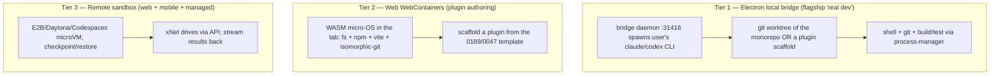
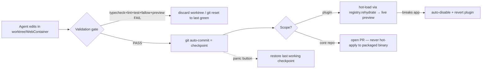
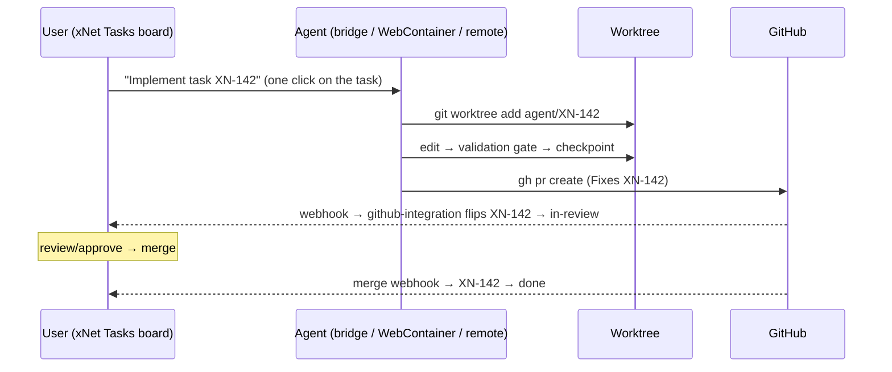
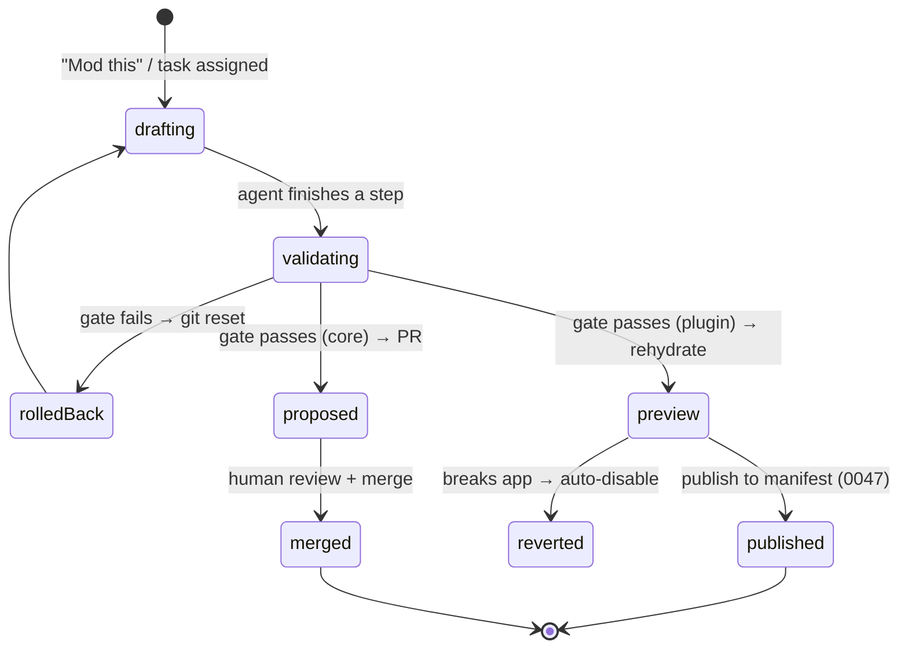

# In-App Agentic Vibe Coding: Modding Plugins And The Repo Itself

## Problem Statement

A user is in xNet, hits a bug or wants a feature, and instead of filing an issue
they just… fix it. They open an AI terminal, point their own Claude Code / Codex
/ Aider subscription at the running app, and the agent reads the repo, edits the
source (or a plugin, or a package), validates it, previews it live, and — one
click — either opens a PR to the open-source repo or publishes a new plugin to
xNet's plugin manifest. Everything is versioned and sandboxed; if it breaks, you
roll back to a working state. The whole thing is project-managed _inside xNet_
using its own projects and tasks, with xNet as the source of truth.

The user's ask, distilled:

> "A user could vibe-code any plugin — or a fix to the main repo — directly in
> the app. Mod the original source, the installed packages, generate new
> packages/plugins. Use your existing Claude Code / Codex subscription to live-
> edit. Web, Electron, or React Native. Secure, safe, sandboxed — you won't
> delete your data or break everything; you can go back in time, everything
> versioned/historied; auto-revert if something goes awry. Then one button:
> create a PR to the open-source repo, or create your own plugin repo and add it
> to the plugin manifest. Project-manage it all from xNet with projects and
> tasks; xNet is the source of truth for docs/plugins/tasks; live editor flow
> that integrates with Git/GitHub/PRs/publishing — secure, sandboxed, trusted,
> validated, with remediation if something goes wrong."

The question this exploration answers: **what does it take to productize the
"AI-coding-agent-in-a-git-worktree" loop _inside_ xNet — across Electron, web,
and mobile — safely, with versioning and rollback, and one-click PR / plugin-
publish?**

The short answer: xNet already has the **agent brain** — a deep MCP/AI surface, a
files-first workspace projection, a connector ladder (including a _designed but
unbuilt_ "local bridge" to the user's own CLI agent), a sandbox runtime ladder
with trust tiers, plugin hot-reload, and node-level undo. What's missing is the
**dev-loop body**: a place to actually run code (filesystem + shell + git +
build/test), an AI terminal, source-level versioning, and the one-click
PR/publish wiring. And the proof it works is sitting in front of us: **this very
exploration was written by an AI coding agent (Claude Code) running in a git
worktree of this repo, reading the code, and committing — the exact loop the user
describes.** The recommendation is to productize that loop with three host tiers
matching xNet's three platforms, and git-checkpoints + the validation gate as the
safety spine.

## Executive Summary

1. **The agent brain is real and deep.** `packages/plugins` ships an MCP server
   (`services/mcp-server.ts`, 23+ tools), a loopback REST Local API
   (`services/local-api.ts`, token-scoped), an AI surface with **mutation plans**
   carrying `risk` (low→critical), `requiredScopes`, `validation`, `audit`, and
   `rollback` (`ai-surface/{service,types}.ts`), an agent runtime with threads/
   approvals/streaming (`ai/runtime.ts`), and a **files-first workspace exporter**
   that projects pages/databases/canvases to a vault dir with a sha256 manifest,
   `.xnet/pending/` plans, and an auto-generated `SKILL.md` + `.mcp.json` +
   `.codex/config.toml` (`services/ai-workspace-exporter.ts`, exploration 0161).
   An agent can already read, query, and propose-with-approval changes to xNet
   _data_.

2. **The "bring-your-own-agent" bridge is designed but not built.** The connector
   ladder (`ai/connectors/detect.ts`, exploration 0174) ranks a **`bridge`** tier
   first, probing `http://127.0.0.1:31416/health` — the intended home of a daemon
   that wraps the user's `claude`/`codex` CLI as an OpenAI-compatible endpoint.
   **The detection is wired; the daemon does not exist.** This is the single
   highest-leverage missing piece.

3. **The dev-loop body is the gap.** There is **no shell/exec tool, no in-app git
   (no `isomorphic-git`/`simple-git`/git-spawn), no source-level versioning, and
   no AI terminal UI.** Process spawning exists only in Electron main
   (`apps/electron/src/main/{storybook-ipc,cloudflare-tunnel-manager}.ts` via
   `services/process-manager.ts`) and is **not connected to the agent**.
   Versioning (`packages/history`: `UndoManager` + `DocumentHistoryEngine`) covers
   _nodes/documents_, not _files_. The Electron app is a **packaged binary** — it
   can HMR in dev (Vite) but cannot rebuild itself in production.

4. **The safety primitives mostly exist; they need to be pointed at code.** The
   labs **runtime ladder** (`packages/labs/src/runtime/`: SES, QuickJS-WASM,
   Worker, iframe, Pyodide) + **trust tiers** (`packages/labs/src/trust.ts`:
   provenance-derived; `ai-generated` → `user` tier; synced re-confirms) + the
   dashboard SES/Worker/iframe sandbox + the **0189 capability broker** + the
   **0047 marketplace revocation list** are exactly the isolation/trust/
   remediation layers a code-modding feature needs — for running the _result_.

5. **Honest security boundary.** Running the user's _own_ CLI agent with shell on
   their machine is "as safe as the user running Claude Code themselves" — a git
   worktree isolates the _repo_, **not the OS**. Genuine OS-isolation (delete-all-
   your-data-proof) requires a container/microVM (remote sandbox) or an in-browser
   micro-OS (**WebContainers**). So the recommendation tiers _power_ against
   _isolation_: plugin authoring is genuinely sandboxable; "real" core-repo dev
   with the user's CLI is a power-user, opt-in tier.

6. **This loop is the prototype.** The whole session that produced explorations
   0187–0190 _and shipped two merged PRs_ is Claude Code in a git worktree:
   read repo → edit → `typecheck`/`lint`/`test`/`fallow` gate → commit
   (checkpoint) → `gh pr create` → admin-merge. **Productizing it is mostly
   wiring + UX, not new science.**

7. **Recommendation:** build it as three host tiers (Electron local bridge → Web
   WebContainers → Remote sandbox), with **git-checkpoints + the validation gate**
   as the versioning/rollback/verification spine, **two output paths** (PR to the
   open-source repo via `gh`, or publish-to-manifest via 0047), and **Projects/
   Tasks as the agentic board** (the GitHub↔Task link already exists). Start with
   the Electron bridge daemon — highest value, bring-your-own-agent (no token cost
   to xNet), prototype proven.

## Current State In The Repository

### The agent brain (real)

- `packages/plugins/src/services/mcp-server.ts` — MCP server, core tools
  (`xnet_search`, `xnet_read_page_markdown`, `xnet_plan_page_patch`,
  `xnet_apply_page_markdown`, `xnet_database_query`) + ~18 deferred; risk-gated
  writes via `McpWriteGuardrail`.
- `packages/plugins/src/services/local-api.ts` — loopback REST (default 31415),
  scopes `nodes.read/write`, `ai.read/write`, `admin`.
- `packages/plugins/src/ai-surface/{service,types.ts}` — `AiMutationPlan`
  (`intent`, `risk: low|medium|high|critical`, `requiredScopes` (18), `changes[]`,
  `validation`, `status: proposed→validated→applied|rejected`), audit log, rollback.
- `packages/plugins/src/ai/runtime.ts` — `AiAgentRuntime` (threads, turns,
  streaming, approvals, tool dispatch).
- `packages/plugins/src/ai/connectors/detect.ts` — 5-tier ladder
  (`bridge`⭐ → `cloud-key` → `local-server` → `webllm` → `prompt-api`);
  `ai/providers.ts` (Anthropic/OpenAI/Ollama/OpenAI-compatible).
- `packages/plugins/src/services/ai-workspace-exporter.ts` — bidirectional
  workspace↔filesystem projection: `Pages/*.md` (frontmatter `xnet.id/revision`),
  `Databases/*.{schema.json,views.json,rows.jsonl}`, `.xnet/manifest.jsonl`
  (path/kind/id/revision/sha256), `.xnet/pending/*.plan.json`, a 250 ms watcher
  (`AiWorkspaceWatcher`) that turns edits → mutation plans, and `renderAgentsMd()`
  → a cross-harness `SKILL.md` + `.mcp.json` + `.codex/config.toml`.
- `packages/cli/` — `checkout`, `status`, `commit`, `search`, `query`, `db`,
  `run`, `daemon`, `mcp serve` (works on mutation plans + file checkout; **no git**).
- `apps/web/src/workbench/views/AiChatPanel.tsx` — AI chat + connector picker +
  "agentic vs propose-only" write-mode indicator. **No terminal, no shell, no
  command palette.**

### The safety primitives (real, but aimed at Labs/widgets/plugins, not files)

- `packages/history/src/{undo-manager,document-history}.ts` — node-property undo
  (compensating, P2P-safe, ~100/node) + Yjs document snapshots (~100/node).
  **Node/document versioning only — not files/source.**
- `packages/labs/src/runtime/` (SES `ses.ts`, QuickJS `quickjs.ts`, `worker.ts`,
  `app.ts`, `python.ts`) + `packages/labs/src/trust.ts` (provenance → tier;
  synced re-confirms). `packages/dashboard/src/sandbox/` (SES+Worker+iframe tiers).
  `packages/plugins/src/sandbox/ast-validator.ts` (acorn pre-flight).
- `packages/plugins/src/registry.ts` — `rehydrate()` = deactivate → swap manifest
  → re-activate (the **plugin hot-reload** seam).
- `apps/electron/src/main/index.ts` — `sandbox:true`, `contextIsolation:true`,
  `nodeIntegration:false`; `preload/index.ts` `contextBridge`; renderer has **no
  fs/spawn** (only specific IPC). Packaged binary (`loadFile()` in prod).

### What's wired but unbuilt / missing

- **Bridge daemon** (`:31416`) that spawns the user's CLI agent — detection ready,
  daemon absent.
- **Shell/exec MCP tool** + an Electron-main↔web-agent IPC to run commands.
- **In-app git** (branch/commit/PR) + **source-level checkpoints**.
- **AI terminal** UI (streaming subprocess stdout) + one-click PR/publish.
- **A build/test pipeline** the agent can drive in-app.

### The targets the loop publishes into (already built this session)

- **Plugin manifest / marketplace** — exploration 0047 (GitHub-registry
  `plugins.json`, install, revocation).
- **Feature modules** — exploration 0189 (the merged `FeatureModule` +
  `importers` contribution point + hub feature registry + capability broker).
- **GitHub↔Task automation** — `packages/hub/src/services/github-integration.ts`
  links PRs/branches to `Task` nodes (`Fixes XN-142`) and flips status
  in-review→done on merge. **The PM loop's backbone already exists.**

## External Research

- **StackBlitz WebContainers / bolt.new** — a WebAssembly "micro-OS" that boots a
  full Node.js dev environment (filesystem, npm, terminal, dev server) **inside a
  browser tab**, securely sandboxed; "an Electron polyfill delivered on page
  load." bolt.new gives the LLM "complete control over the environment —
  filesystem, node server, package manager, terminal, browser console." This is
  the web-side enabler for vibe-coding _plugins_ in-browser.
  ([WebContainers](https://webcontainers.io/),
  [bolt.new](https://github.com/stackblitz/bolt.new))
- **Claude Code git worktrees** — the canonical agent-isolation pattern: each
  session in its own worktree, edits never touch other sessions; headless mode for
  CI/background; `isolation: worktree` frontmatter / `--worktree` flag; run N
  agents in parallel, one per feature. **This is exactly how the current session
  works**, and the model for the Electron tier.
  ([Claude Code worktrees](https://code.claude.com/docs/en/worktrees))
- **Replit Agent** — git-backed **checkpoints** + "App History" (roll back across
  agent sessions to any prior version); positioned as "the safest place for vibe
  coding." The rollback/versioning UX model.
  ([Replit safe vibe coding](https://blog.replit.com/safe-vibe-coding))
- **AI agent sandboxes (E2B / Daytona / Modal / Sprites)** — Firecracker microVMs
  (E2B ~150 ms boot) or containers (Daytona) with **checkpoint/restore now a
  standard feature**; hardware-isolated code execution for agents. The remote tier
  for web/mobile and "go back in time."
  ([sandbox comparison](https://www.softwareseni.com/e2b-daytona-modal-and-sprites-dev-choosing-the-right-ai-agent-sandbox-platform/))
- **Aider / OpenAI Codex CLI / Cursor / Windsurf** — agentic coders that already
  edit a repo + auto-commit; "bring your own agent" means xNet hosts _these_
  rather than building a coder.

**Lesson:** every serious system isolates the _workspace_ (worktree / WebContainer
/ microVM) and versions via _git checkpoints_ with one-click rollback — and the
agent itself is increasingly a commodity the user brings. xNet should host, not
rebuild, the agent; and lean on git + the validation gate for safety.

## Key Findings

1. **xNet has ~70% of the pieces, mis-aimed.** The MCP/AI surface, files-first
   projection, connector ladder, sandbox tiers, hot-reload, and undo all exist —
   pointed at _data_. The work is to add the _code_ dimension (fs+git+shell+build)
   and an agent host.

2. **The bridge daemon is the keystone.** It turns "bring your own Claude Code/
   Codex subscription" from a designed tier into reality, at _zero model cost to
   xNet_ — the user's own agent does the work.

3. **Git is the versioning answer; nodes are a second history.** Code → git
   checkpoints (Replit model). Data the agent touches → the existing
   `UndoManager`/`DocumentHistoryEngine`. A "restore point" must unify both.

4. **Two scopes, two ceilings.** _Plugin authoring_ can be fully sandboxed
   (WebContainer/labs tiers) **and hot-applied** to the running app via
   `registry.rehydrate()`. _Core-repo modding_ can be worktree-isolated and
   validated but **cannot hot-apply to a packaged binary** — it's PR-only (dev
   mode can HMR).

5. **The PM loop is half-built.** GitHub↔Task automation already exists; the
   files-first exporter already projects the workspace + `SKILL.md`. Extend both
   to make Projects/Tasks the agentic board with xNet as source of truth.

6. **Security must be told truthfully.** "Sandboxed, won't delete your data" is
   true for the plugin/WebContainer/remote tiers; the local-CLI-with-shell tier
   is power-user trust (the user's own agent, their own OS privileges).

## Options And Tradeoffs

### Where the coding agent runs (host tiers — mirrors the connector ladder)



| Tier                      | Power                                | Isolation                              | Cost / privacy                          | Verdict                        |
| ------------------------- | ------------------------------------ | -------------------------------------- | --------------------------------------- | ------------------------------ |
| **Electron local bridge** | Full (monorepo, shell, git, build)   | repo via worktree; **OS not isolated** | free (BYO agent); local                 | **Phase 1 flagship**           |
| **Web WebContainers**     | Plugin authoring (not full monorepo) | fully browser-sandboxed                | free; local                             | **Phase 2 mass-market**        |
| **Remote sandbox**        | Full                                 | hardware (microVM)                     | $$ compute + tokens; code leaves device | **Phase 3 fallback / managed** |

### How edits take effect + roll back



### Output paths (one click)

| Path                       | Mechanism                                                       | Trust                                                    |
| -------------------------- | --------------------------------------------------------------- | -------------------------------------------------------- |
| **PR to open-source repo** | `gh pr create` from the worktree branch                         | human review on the public repo                          |
| **Publish a plugin**       | push to user's GitHub repo + PR to add to `plugins.json` (0047) | CI-validated entry + provenance + marketplace revocation |
| **Keep private / local**   | install as a `user`-tier `FeatureModule` (0189), synced P2P     | re-confirm trust on each device (labs)                   |

## Recommendation

**Productize the "AI-coding-agent-in-a-git-worktree" loop inside xNet, host-tiered
by platform, with git-checkpoints + the validation gate as the safety spine and
Projects/Tasks as the driver.** Concretely, phased:

1. **Phase 1 — Electron local bridge (the flagship).** Build the **bridge daemon**
   the connector ladder already expects (`:31416`): it spawns the user's own
   `claude`/`codex`/`aider` CLI in a **git worktree** (the monorepo for core mods,
   or a `create-xnet-plugin` scaffold for plugins), wires **shell + git + build/
   test** through `process-manager`, streams stdout to a new **AI terminal** panel
   (xterm.js), runs the **validation gate** (`turbo typecheck` + `lint` + `vitest`
   - `fallow audit` + preview), and exposes one-click **"Open PR"** (`gh`) and
     **"Publish plugin"** (0047). Mostly wiring of existing parts; the prototype is
     this session.

2. **Phase 2 — Web WebContainers for plugin authoring.** A bolt.new-style surface:
   scaffold a `FeatureModule` (0189) into a WebContainer, let the agent edit/build/
   preview in-tab (`isomorphic-git` for checkpoints), **hot-load into the running
   app** via `registry.rehydrate()` for instant preview, then publish to a GitHub
   repo + manifest. The zero-install, fully-sandboxed mass path; scoped to plugins,
   not the monorepo.

3. **Phase 3 — Remote sandbox fallback + the PM loop.** For web/mobile/managed,
   drive an E2B/Daytona/Codespaces microVM (checkpoint/restore) via API. Wire
   **Projects/Tasks as the agentic board**: a Task → the agent spins a worktree,
   codes, validates, opens a PR, and the existing GitHub↔Task automation flips the
   task in-review→done on merge. Extend `ai-workspace-exporter` to project the
   **repo + the task** as the agent's context, making xNet the source of truth.

4. **Safety spine (all phases):**
   - **Isolation:** worktree / WebContainer / microVM per task — never the live
     install. Run the _resulting_ plugin through the labs ladder + trust tiers.
   - **Versioning / "go back in time":** git auto-commit per agent step = restore
     points (Replit model); a unified checkpoint = git commit + node-store snapshot
     (`history`); a **panic button** restores the last green checkpoint.
   - **Verification:** the validation gate is the gate before hot-apply or PR;
     reuse the `AiMutationPlan` `risk`/`scopes`/`validation`/`audit` model for code.
   - **Remediation:** hot-applied plugin breaks the app → auto-disable + revert
     (`registry.deactivate` + the 0047 revocation list); core mods are PR-only.
   - **Trust:** provenance (`ai-generated` → `user` tier), 0189 capability
     manifests + hub secret broker, 0047 signing + blocklist.

5. **Tell the truth about the shell tier.** Label the local-CLI tier "power user —
   runs your own agent with your OS privileges, isolated to a repo worktree but not
   your whole machine." Reserve "fully sandboxed, can't touch your data" for the
   WebContainer / remote / plugin tiers.

Rationale: this reuses xNet's biggest assets (the AI surface, files-first
projection, connector ladder, sandbox tiers, hot-reload, undo, the GitHub↔Task
link, and 0047/0189), adds the genuinely-missing dev-loop body, keeps token cost
at zero for the flagship tier (bring-your-own-agent), and is _proven_ — the loop
already shipped this session's PRs.

## Example Code

### The bridge daemon — host the user's own CLI agent (Phase 1)

```ts
// packages/plugins/src/services/agent-bridge.ts  (Electron main / Node)
// Implements the connector ladder's `bridge` tier (:31416, already detected).
export function startAgentBridge(opts: { repoRoot: string; agent: 'claude' | 'codex' | 'aider' }) {
  const http = createServer(async (req, res) => {
    if (req.url === '/health') return res.end(JSON.stringify({ ok: true, agent: opts.agent }))
    if (req.url === '/run') {
      const { task, scope } = await readJson(req)
      // 1. Isolate: a fresh git worktree per task (the Claude Code pattern).
      const wt = await gitWorktreeAdd(opts.repoRoot, `agent/${task.id}`)
      // 2. Project context: repo SKILL.md + the task as the agent's working set.
      await writeAgentContext(wt, task)
      // 3. Spawn the user's OWN subscription CLI (no model cost to xNet).
      const proc = spawn(opts.agent, ['--workdir', wt, '--print', task.prompt], { cwd: wt })
      streamToTerminal(proc, res) // → the AI terminal panel (SSE)
      proc.on('exit', () => onAgentDone(wt, task, scope)) // → run the validation gate
    }
  })
  http.listen(31416, '127.0.0.1') // connector detection finds it automatically
}
```

### The validation gate + checkpoint (the verification/rollback spine)

```ts
// Run the SAME gate this session runs every change, then checkpoint or roll back.
export async function gateAndCheckpoint(wt: string, task: Task): Promise<GateResult> {
  const steps = [
    () => sh(wt, 'pnpm turbo typecheck --filter=...changed'),
    () => sh(wt, 'pnpm eslint $(git -C $wt diff --name-only) --max-warnings 0'),
    () => sh(wt, 'pnpm vitest run $(changedTestGlobs(wt))'),
    () => sh(wt, 'pnpm fallow audit --changed-since origin/main --fail-on-issues')
  ]
  for (const step of steps) {
    const r = await step()
    if (!r.ok) {
      await gitResetHard(wt) // roll back to last green; remediation
      return { ok: false, failedAt: r.cmd, log: r.log }
    }
  }
  await sh(wt, `git commit -am "checkpoint: ${task.id}"`) // a restore point
  return { ok: true }
}
```

### Two output paths — one click each

```ts
export async function openPullRequest(wt: string, task: Task) {
  await sh(wt, `git push -u origin agent/${task.id}`)
  const { url } = await gh(wt, ['pr', 'create', '--fill', '--base', 'main'])
  await linkTaskToPr(task.id, url) // the GitHub↔Task automation flips status on merge
  return url
}

export async function publishPlugin(wt: string, mod: FeatureModule) {
  await gateAndCheckpoint(wt /* … */) // must pass first
  const repo = await gh(wt, ['repo', 'create', `xnet-plugin-${mod.id}`, '--source=.', '--push'])
  await gh(wt, ['pr', 'create', '--repo', 'crs48/xnet-plugins' /* add to registry.yaml (0047) */])
  // provenance = authored/ai-generated → user tier; capability manifest = 0189
}
```

### The PM loop — a task drives the agent (Phase 3)



### A mod's lifecycle



## Risks And Open Questions

- **The shell tier is genuinely dangerous and must not be oversold.** A git
  worktree isolates the _repo_, not the _OS_ — the user's CLI agent runs with their
  full privileges and _can_ delete files outside the worktree, exfiltrate, or run
  arbitrary commands. "Safe/sandboxed" applies to WebContainer/remote/plugin tiers;
  the local-CLI tier is "your own agent, your own trust." Default deny network +
  scope the worktree; offer the sandboxed tiers as the default.
- **Packaged-binary can't self-rebuild.** Core-repo edits can't hot-apply in
  production Electron — they're PR-only; only dev-mode HMRs. Don't promise
  "live-edit xNet's core in the shipped app." Plugins _can_ hot-apply (rehydrate).
- **Two version histories.** Git (code) and the node `UndoManager`/snapshots (data)
  are separate. A unified "restore point" needs to snapshot both atomically, or the
  user rolls back code but not the data the agent mutated (or vice-versa).
- **WebContainers limits.** Great for a single plugin; **cannot build the full
  monorepo** (too heavy), and Safari/cross-origin-isolation support is constrained.
  Core mods on web need the remote or local-bridge tier.
- **Remote sandbox = privacy + cost tradeoff.** Code leaves the device (conflicts
  with local-first ethos) and burns compute + tokens. Make it opt-in and clearly
  labeled; prefer local tiers.
- **Mobile (React Native) has no local dev.** Realistically: review/approve PRs,
  drive a remote sandbox, or chat-only. Be honest that "mod from your phone" means
  "kick off a remote agent and review the PR."
- **Agent-introduced supply-chain risk.** An AI-generated plugin can ship malware;
  publishing must go through 0047's CI validation + capability consent + signing +
  revocation, and hot-applied AI plugins run at `user` tier in the sandbox, never
  first-party.
- **Hub-side mods.** A mod that touches the _hub_ (server code, secrets) can't be
  hot-applied or community-trusted (0189: hub-side community code is deferred);
  those are PR-to-open-source only.
- **Validation gate cost/latency.** Running `typecheck+lint+test+fallow` per step
  is slow; scope to changed files (as this session does) and cache aggressively.
- **Conflict with a live, syncing app.** The agent edits files while the user edits
  data; the worktree isolates code, but if the agent also mutates nodes (via MCP),
  those hit the live CRDT — needs the existing approval/risk gate.

## Implementation Checklist

- [~] **Bridge daemon** (Electron main): spawn the user's `claude`/`codex`/`aider`
  CLI; expose `:31416/health` + `/run`. _As-built: the bring-your-own-agent
  seam (`AgentRunner` port + `cliAgentRunner` that spawns the user's CLI) ships
  in `@xnetjs/devkit`; the HTTP daemon + connector-ladder wiring is deferred to
  the Electron phase._
- [x] **Git module** (`@xnetjs/devkit/src/git.ts`): worktree add/remove, branch,
      commit, reset, push, log/status over an injectable `CommandRunner`.
      _(`gh pr create` is in `openPullRequest`.)_
- [ ] **Shell/exec seam**: an Electron-main↔renderer IPC (and an MCP `run_shell`
      tool, risk `critical`, confirm-gated) routed through `process-manager`,
      scoped to the worktree. _(deferred — Electron phase.)_
- [ ] **AI terminal panel** (`apps/web/src/workbench/views/AiTerminal.tsx`):
      xterm.js streaming the agent subprocess + the validation-gate log; one-click
      "Open PR" / "Publish plugin" / "Restore checkpoint". _(deferred — UI phase.)_
- [x] **Validation gate runner** (`@xnetjs/devkit/src/validation-gate.ts`):
      `runValidationGate` runs ordered steps, short-circuits on failure;
      `defaultXnetGate` encodes typecheck/lint/test/fallow as data. The dev loop
      `git reset --hard`s on fail and checkpoints on pass.
- [x] **Checkpoint model** (`@xnetjs/devkit/src/git.ts`): `checkpoint(label)` =
      commit, `restore(sha)` = hard reset (the git half). _As-built: atomic
      node-store snapshot via `packages/history` + the timeline/panic-button UI are
      deferred._
- [ ] **Plugin scaffold + hot-preview**: `create-xnet-plugin` (0047/0189) →
      WebContainer/worktree → build → `registry.rehydrate()` live-load. _(deferred.)_
- [~] **Publish paths**: `gh pr create` to the open-source repo
  (`@xnetjs/devkit` `openPullRequest`); pushing a plugin repo + a `registry.yaml`
  PR (0047) with provenance + capability manifest (0189) is deferred.
- [ ] **WebContainers surface** (web): boot a plugin scaffold, `isomorphic-git`
      checkpoints, in-tab preview.
- [ ] **Remote sandbox adapter** (E2B/Daytona/Codespaces) for web/mobile/managed,
      with checkpoint/restore.
- [ ] **PM loop**: extend `ai-workspace-exporter` to project the repo + a `Task` as
      agent context; "Run with AI" on a task → bridge `/run`; rely on the existing
      GitHub↔Task automation for status.
- [ ] **Trust/remediation wiring**: AI plugins → `user` tier sandbox; auto-disable
      on crash; surface capability consent + 0047 revocation.
- [ ] **Docs + honesty**: a "Mod xNet" guide that states the per-tier security
      boundary plainly.

## Validation Checklist

- [ ] A user with a Claude Code subscription clicks "Mod this", the bridge spawns
      their CLI in a worktree, and the AI terminal streams its output.
- [x] An agent edit that fails the gate is **automatically rolled back**
      (`git reset --hard`), discarding the edits; a passing edit becomes a
      checkpoint commit on the branch (`@xnetjs/devkit` dev-loop tests, real temp
      repo). _(End-to-end with a real Claude Code subscription is the Electron
      phase.)_
- [ ] A passing plugin edit **hot-loads** into the running app (`rehydrate`) and is
      visible without restart; a crashing one **auto-disables** and the app stays up.
- [ ] "Restore checkpoint" returns code **and** data to a prior working point.
- [ ] One click opens a real PR to the open-source repo (`gh`), and the linked
      `Task` flips to in-review then done on merge (existing automation).
- [ ] One click publishes a plugin to a new GitHub repo + a `registry.yaml` PR;
      after CI it appears in the marketplace at `user`/community trust.
- [ ] On web, a plugin is authored end-to-end in a WebContainer with no local
      install and previewed live.
- [ ] The shell tier is OFF by default and labeled "power user — your own agent,
      your OS privileges"; the sandboxed tiers are the default.
- [ ] An AI-authored plugin runs at `user` tier in the labs sandbox (no first-party
      access); a malicious one is blockable via 0047 revocation.
- [ ] `check:cloud-boundary`, fallow, typecheck, and lint stay green for the new
      packages.

## References

### Codebase

- `packages/plugins/src/services/{mcp-server,local-api,process-manager,ai-workspace-exporter,mcp-http}.ts` — AI/agent surface + workspace projection + (Electron) process spawning
- `packages/plugins/src/ai-surface/{service,types}.ts` — mutation plans (risk/scopes/validation/audit/rollback)
- `packages/plugins/src/ai/{runtime,providers}.ts`, `ai/connectors/detect.ts` — agent runtime + provider router + the `bridge` (:31416) connector tier
- `packages/cli/` — `checkout`/`status`/`commit`/`run`/`daemon`/`mcp serve` (no git yet)
- `apps/web/src/workbench/views/AiChatPanel.tsx`, `ai-chat-connector.ts` — chat + connector picker (no terminal/shell)
- `packages/history/src/{undo-manager,document-history}.ts` — node/document versioning (not files)
- `packages/labs/src/runtime/`, `packages/labs/src/trust.ts`, `packages/dashboard/src/sandbox/`, `packages/plugins/src/sandbox/ast-validator.ts` — sandbox ladder + trust tiers
- `packages/plugins/src/registry.ts` (`rehydrate`) — plugin hot-reload seam
- `apps/electron/src/main/{index,ipc,storybook-ipc,cloudflare-tunnel-manager}.ts`, `preload/index.ts` — Electron security + the only existing `child_process.spawn` sites
- `packages/hub/src/services/github-integration.ts`, `routes/tasks.ts` — GitHub↔Task automation (the PM-loop backbone)
- `packages/hub/src/features/{registry,broker,first-party}.ts` — 0189 feature registry + capability broker (publish target)

### Prior explorations

- [0174 Bring Your Own Model / AI Chat Panel](./0174_[_]_BRING_YOUR_OWN_MODEL_AI_CHAT_PANEL.md) — the connector ladder + the `bridge` tier this builds on
- [0161 Token-Efficient Agent Interfaces](./0161_[x]_TOKEN_EFFICIENT_AGENT_INTERFACES.md) — the files-first workspace projection
- [0180 Code As A First-Class Citizen / Labs](./0180_[x]_CODE_AS_A_FIRST_CLASS_CITIZEN_LABS_AND_RUNTIMES.md) — the sandbox runtime ladder + trust
- [0331 Developing xNet From Inside xNet](./0331_[x]_DEVELOPING_XNET_FROM_INSIDE_XNET_SPEC_TO_PLUGIN_LOOP.md) — implements this exploration's **Loop A** (workspace plugins) as a shipped runtime: `PluginSource` nodes → in-browser build → opaque-origin iframe → contribution RPC → hot reload → agent feedback. NOTE: the **bridge daemon (0194) has shipped** since this doc was written (`xnet bridge serve`, `KNOWN_BRIDGE_AGENTS`, Electron `agent-bridge-manager`), so the "point your own Claude Code at the running app" premise is now real; 0331 closes the remaining gap on the runtime (not model) side.
- [0189 Everything Is A Plugin / Feature Modules](./0189_[_]_EVERYTHING_AS_PLUGINS_FEATURE_MODULE_PLATFORM.md) — the FeatureModule + capability broker (publish target)
- [0047 Plugin Marketplace](./0047_[_]_PLUGIN_MARKETPLACE.md) — GitHub-registry publish + revocation
- [0119 xNet As A Developer Tool](./0119_[_]_XNET_AS_A_COMPELLING_WEB_AND_MOBILE_DEVELOPER_TOOL.md) and [0160 xNet As An AI Operating System](./0160_[_]_XNET_AS_AN_AI_OPERATING_SYSTEM.md) — the strategic framing

### External

- [WebContainers](https://webcontainers.io/) · [bolt.new](https://github.com/stackblitz/bolt.new) — in-browser Node dev env + AI control of the environment
- [Claude Code — git worktrees](https://code.claude.com/docs/en/worktrees) — the agent-isolation pattern this session uses
- [Replit — safe vibe coding / checkpoints](https://blog.replit.com/safe-vibe-coding) — git-backed rollback UX
- [E2B / Daytona / Modal / Sprites sandbox comparison](https://www.softwareseni.com/e2b-daytona-modal-and-sprites-dev-choosing-the-right-ai-agent-sandbox-platform/) — microVM/container agent sandboxes with checkpoint/restore
- [OpenAI Codex CLI](https://github.com/openai/codex) · [Aider](https://aider.chat/) — bring-your-own agentic coders
