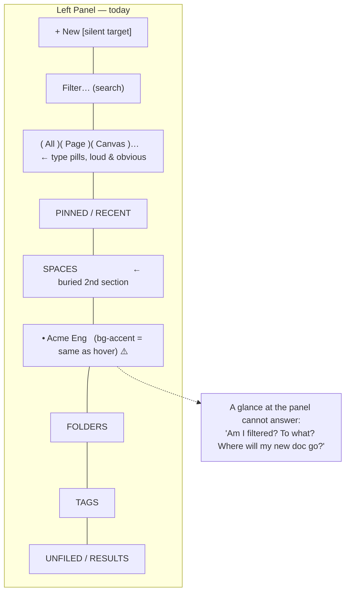
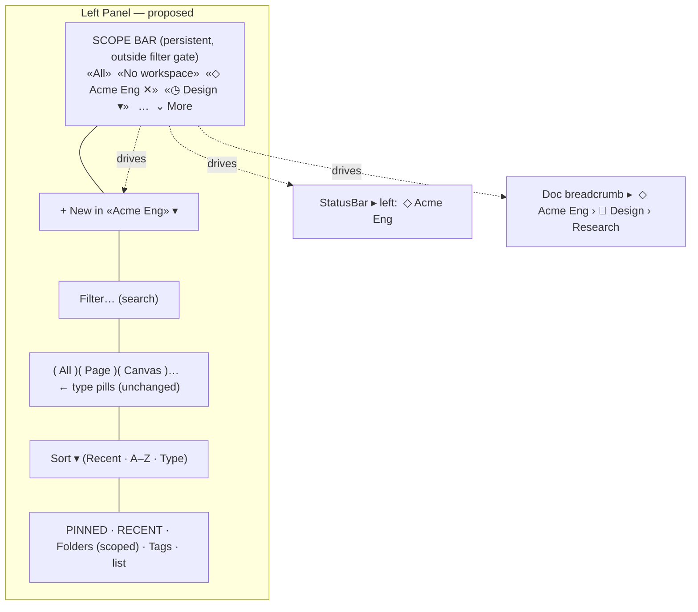
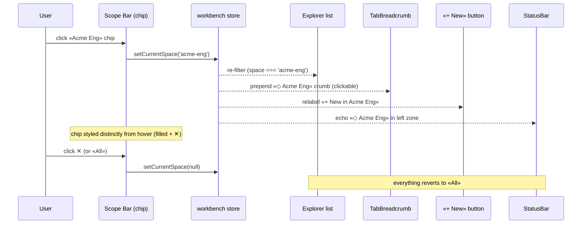
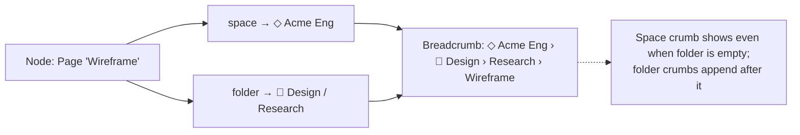
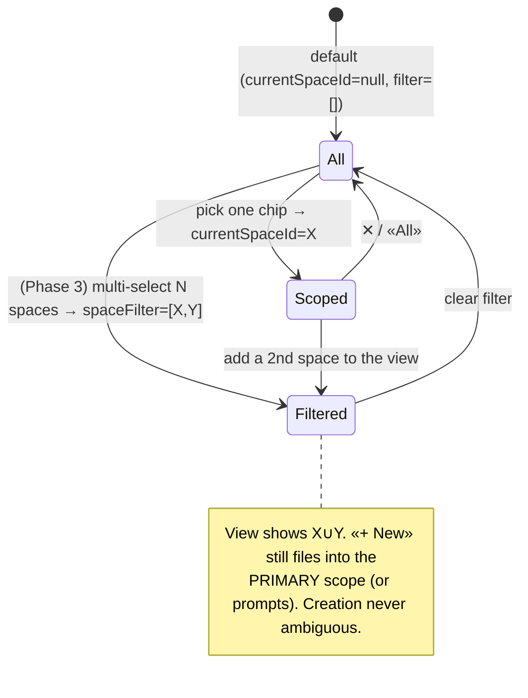

# Obvious Workspace Filtering: A Scope Bar, a Space Breadcrumb, and a Clear "Create Here" Target

## Problem Statement

Today, clicking a Space in the left bar **does** filter every document, canvas,
database, dashboard, and map down to that Space — the plumbing shipped in
exploration [0180](docs/explorations/0180_[_]_EXPOSING_SPACES_IN_THE_UI.md). The
machinery works. The **UX does not communicate that it is working.** Concretely:

1. **The switcher is in the middle of the panel.** The Spaces section renders
   *after* Pinned/Recent and *before* Folders/Tags
   ([Explorer.tsx:252-255](apps/web/src/workbench/views/Explorer.tsx)), so the
   thing that re-scopes the entire panel is visually a peer of "Tags," buried
   below the fold.
2. **The "active scope" cue is indistinguishable from hover.** The selected
   Space row gets `bg-accent text-ink-1`
   ([ExplorerSpacesSection.tsx:166-168](apps/web/src/workbench/views/ExplorerSpacesSection.tsx)) —
   the *exact* class the row already applies on `:hover`. There is no persistent,
   panel-level banner saying "you are filtered to **Acme Eng**."
3. **Filtering by type *hides* the scope entirely.** When a type pill or the
   search box is active, the Spaces section is unmounted
   (`{!filterActive && <ExplorerSpacesSection />}`,
   [Explorer.tsx:253](apps/web/src/workbench/views/Explorer.tsx)) — so the one
   weak scope indicator vanishes precisely when the list is most aggressively
   filtered.
4. **The breadcrumb above a document shows folders but not the Space.** The
   `TabBreadcrumb` strip renders `📁 Design / Research`
   ([TabBreadcrumb.tsx:44-52](apps/web/src/workbench/TabBreadcrumb.tsx)) and
   *nothing at all* for a node that isn't in a folder — even if it lives in a
   Space. You cannot tell from a document which workspace it belongs to.
5. **Creation gives no signal about its target.** `handleCreate` quietly files
   the new node into `currentSpaceId` when set
   ([Explorer.tsx:299-307](apps/web/src/workbench/views/Explorer.tsx)), but the
   "+ New" button says only "New" — never "New in **Acme Eng**" or "New (no
   workspace)." The user cannot tell, before clicking, where their document will
   land.

The ask, distilled from the prompt:

- **Make the filter loud.** When a Space is selected, the left bar must *look*
  filtered — a persistent, top-of-panel affordance, not a same-as-hover row tint.
- **Promote Spaces to a first-class filter zone at the top**, alongside (or
  echoing) the type pills that already sit there.
- **Consider multi-select** — "select one or multiple workspaces," or "all."
- **Surface the Space in the breadcrumb** above a document: `Workspace › Folder ›
  Folder › Doc`, the way folders already appear.
- **Make the create target obvious** — which workspace (or none) a new document
  files into.
- More broadly: **better left-bar filtering and sorting** as a theme.

This is an **IA + interaction-design** exploration. The data model is done; the
job is to make scope *perceivable* without growing a second rail or breaking the
clean single-home-per-node model.

## Executive Summary

- **The model is right; the surfacing is wrong.** `currentSpaceId: string | null`
  in the persisted workbench store
  ([state.ts](apps/web/src/workbench/state.ts)) is the correct primitive: one
  active scope that filters the Explorer and chooses the create target. We keep
  it. We change **where it lives, how loud it is, and how it propagates** to the
  breadcrumb, the create button, and the status bar.
- **Add a persistent Scope Bar at the very top of the Explorer panel**, above the
  "+ New" / search / type-pills cluster, *outside* the `filterActive` gate so it
  never disappears. It shows the current scope as a prominent, removable chip
  (`◇ Acme Eng ✕`) plus an `All` affordance. This is the single highest-leverage
  change and directly answers complaints (1)–(3).
- **Prepend the Space to the breadcrumb.** `TabBreadcrumb` becomes
  `◇ Acme Eng › 📁 Design › Research`. The Space crumb renders **even when the
  node has no folder** (today's blank-breadcrumb case), is clickable to re-scope,
  and mirrors Notion's "click the teamspace in the breadcrumb" pattern. Answers
  complaint (4).
- **Make "+ New" state its target.** Relabel to `+ New in Acme Eng ▾` (or render
  a small space chip beside it) and add a target line to the create menu
  ("Creating in **Acme Eng**" / "Not in any workspace — choose one ▾"). Answers
  complaint (5).
- **Keep single-select as the primary scope; offer multi-select as an additive,
  view-only filter later.** The user floated both single ("you're in this
  workspace") and multi ("select one or multiple"). These pull in opposite
  directions for the *creation* story (a multi-selection has no single "create
  here" target). Resolve by separating concepts: **one primary scope** drives
  identity / breadcrumb / create target; an optional **multi-select filter**
  (Phase 3) widens the *view* without touching creation — exactly how Linear
  separates "current team" from an "All teams + filter" view.
- **Add an explicit "No workspace" scope.** Today, clearing scope shows *all*
  Spaces' items mixed together; there is no way to deliberately view (or create
  into) "items in no workspace." A first-class **Unfiled / Personal** scope makes
  "not in any workspace at all" a place you can be — which the prompt explicitly
  calls for.
- **Echo scope in the StatusBar's left "workspace scope" zone**
  ([StatusBar.tsx:74](apps/web/src/workbench/StatusBar.tsx)) — an ambient,
  always-on confirmation (0180 deferred this; it's cheap now).

```mermaid
flowchart LR
  subgraph today["Today (0180 shipped)"]
    direction TB
    A["currentSpaceId in store ✅"]
    B["Explorer filters by space ✅"]
    C["Switcher mid-panel, hover-colored ⚠️"]
    D["Breadcrumb = folders only ⚠️"]
    E["+ New is silent about target ⚠️"]
    F["Scope hidden when type-filtering ⚠️"]
  end
  subgraph this["This exploration (UI clarity)"]
    direction TB
    G["Scope Bar atop panel (persistent chip)"]
    H["Space prepended to breadcrumb (clickable)"]
    I["+ New in «Space» ▾ + target line"]
    J["Explicit «No workspace» scope"]
    K["StatusBar scope echo"]
    L["(later) multi-select view filter"]
  end
  today ==>|"surface the existing scope"| this
  classDef have fill:#1b5e20,color:#fff;
  classDef warn fill:#7a5b00,color:#fff;
  classDef new fill:#0d47a1,color:#fff;
  class A,B have
  class C,D,E,F warn
  class G,H,I,J,K,L new
```



## Current State In The Repository

### Where scope lives and how it filters

| Concern | File | Today |
| --- | --- | --- |
| Active scope state | [state.ts:118-122, 196-198](apps/web/src/workbench/state.ts) | `currentSpaceId: string \| null` + `setCurrentSpace`; persisted under `xnet:workbench:v1`. Single-valued. |
| The filter itself | [Explorer.tsx:141-160](apps/web/src/workbench/views/Explorer.tsx) | Client predicate in `collectItems`: `spaceScope === null \|\| (doc.space ?? '') === spaceScope`. Not pushed to storage; runs over the in-memory query results. |
| Switcher / scope UI | [ExplorerSpacesSection.tsx:45-138](apps/web/src/workbench/views/ExplorerSpacesSection.tsx) | A mid-panel section: header (`Spaces` label + `All` clear-link when scoped + `+`), inline create (kind `<select>` + name), then a recursive `SpaceRow` tree. Row click = `setCurrentSpace(id)` + navigate to the Space home. |
| Active-row styling | [ExplorerSpacesSection.tsx:165-168](apps/web/src/workbench/views/ExplorerSpacesSection.tsx) | `isActive ? 'bg-accent text-ink-1' : ''` **on a row whose hover is also `hover:bg-accent hover:text-ink-1`.** The active and hover states are visually identical. |
| Mount order | [Explorer.tsx:249-258](apps/web/src/workbench/views/Explorer.tsx) | `PinnedAndRecent` → **`ExplorerSpacesSection`** → `ExplorerFoldersSection` → `ExplorerTagsSection` → list. Spaces is the 2nd-of-4 stacked sections. |
| Filter gate | [Explorer.tsx:253-255](apps/web/src/workbench/views/Explorer.tsx) | Spaces/Folders/Tags are all gated on `{!filterActive && …}` — they unmount whenever a type pill or text filter is active. |
| Type pills (the prompt's reference) | [Explorer.tsx:29-36, 330-345](apps/web/src/workbench/views/Explorer.tsx) | `TYPE_FILTERS` = All/Page/Database/Canvas/Dashboard/Map, rendered as rounded pills in the top tools cluster; local `useState`, active pill = `border-accent-ink bg-accent text-ink-1`. **This is the visual vocabulary the user wants Spaces to adopt.** |
| Create target | [Explorer.tsx:299-307](apps/web/src/workbench/views/Explorer.tsx), [useCreateInSpace.ts](apps/web/src/hooks/useCreateInSpace.ts) | `handleCreate` → `createInSpace(type, currentSpaceId)` when scoped, else `navigateToNewDoc`. The "+ New" button label is always just "New." |
| Breadcrumb | [TabBreadcrumb.tsx](apps/web/src/workbench/TabBreadcrumb.tsx), mounted at [EditorArea.tsx:229](apps/web/src/workbench/EditorArea.tsx) | Folder path only (`📁 Design / Research`); returns `null` when the node has no folder. No Space. Hidden in zen mode. |
| StatusBar | [StatusBar.tsx:73-78](apps/web/src/workbench/StatusBar.tsx) | Left zone is literally commented "Workspace scope" but only shows hub/sync + runtime — **no Space.** A ready-made home for an ambient scope indicator. |
| Per-row "Move to Space" | explorer-rows.tsx (`MoveToSpaceButton`) | Hover affordance to re-home a node after creation — the manual escape hatch that the create-target signal should make rarely necessary. |

### The data model underneath (unchanged by this work)

- A node's Space is a **single-valued `space` relation** — its canonical security
  home ([page.ts:37](packages/data/src/schema/schemas/page.ts),
  [task.ts:116](packages/data/src/schema/schemas/task.ts), plus
  database/canvas/dashboard/map). `Space.kind ∈ {personal, workspace,
  organization, team, community, family}` —
  [space.ts:40-47](packages/data/src/schema/schemas/space.ts) (the `project` kind
  was removed in 0181; projects are work-groupings, not containers).
- **Folder is orthogonal to Space.** A node carries both `folder` (position in a
  per-Space tree) and `space` (security home) —
  [folder.ts](packages/data/src/schema/schemas/folder.ts). This is exactly why a
  breadcrumb of `Space › Folder › Folder` is well-defined.
- `useSpaces()` ([useSpaces.ts](apps/web/src/hooks/useSpaces.ts)) already returns
  `spaces`, `allSpaces`, and a nested `tree` (via `buildSpaceTree`) plus
  `createSpace` / `renameSpace` / `setNodeSpace`. Everything the new UI needs to
  read and mutate is present.

### The "you can't tell what's filtered" failure, visualized



## External Research

- **Notion — the Space lives in the breadcrumb, and clicking it acts on the
  Space.** Notion shows a breadcrumb at the top-left of every sub-page; clicking
  the *teamspace name* in that breadcrumb offers to join/scope it. The sidebar
  renders teamspaces in a parent-child folder layout. This is direct validation
  for (a) putting the Space as the **root crumb** above a document and (b) making
  that crumb **interactive** (click → re-scope), not just a label.
  ([Navigate with the sidebar](https://www.notion.com/help/navigate-with-the-sidebar),
  [Intro to teamspaces](https://www.notion.com/help/intro-to-teamspaces),
  [Structure your sidebar with teamspaces](https://www.notion.com/help/guides/structure-sidebar-focused-work-teamspaces))
- **Linear — separate "current scope" from "multi-team filter."** Linear's model
  is an **"All teams" view refined by filters** to one or more teams, versus a
  single team you're working in. Filters refine a *view*; they are not your
  identity. This is the cleanest precedent for our recommendation: keep one
  *primary scope* (identity + create target) and treat multi-select as a
  *view-only filter* layered on top.
  ([Filters](https://linear.app/docs/filters),
  [Custom views](https://linear.app/docs/custom-views),
  [Workspaces](https://linear.app/docs/workspaces))
- **Filter-chip UX — active filters belong in visible, removable chips.** The
  consensus pattern across enterprise filter design: surface active filters as
  **chips/pills with a clear remove (✕)**, placed *directly above* the data they
  slice, so "what am I looking at" is answerable at a glance. A category/scope is
  chosen *before* detailed filters to narrow the set early. This validates a
  persistent **Scope Bar of chips** at the top of the panel, distinct from (and
  above) the type pills.
  ([UXPin: Filter UI/UX](https://www.uxpin.com/studio/blog/filter-ui-and-ux/),
  [Pencil & Paper: enterprise filtering](https://www.pencilandpaper.io/articles/ux-pattern-analysis-enterprise-filtering),
  [Smart Interface Design Patterns: badges/chips/tags/pills](https://smart-interface-design-patterns.com/articles/badges-chips-tags-pills/))
- **Badges vs. chips vs. pills — pick the right element.** A *badge* is a passive
  status indicator; a *chip/pill* is interactive and removable. The active scope
  should be a **chip** (removable, the source of truth) in the panel, and a
  **badge** (passive echo) in the StatusBar and on the create button.
  ([Smart Interface Design Patterns](https://smart-interface-design-patterns.com/articles/badges-chips-tags-pills/))

## Key Findings

1. **The single biggest fix is moving + amplifying what already exists.** A
   persistent Scope Bar above the tools cluster, rendered *outside* the
   `filterActive` gate, with a chip whose styling is *distinct from hover*, fixes
   complaints (1), (2), and (3) at once. No data change.
2. **Active ≠ hover is a literal one-line bug-class issue.** The active Space row
   reuses the hover class, so the only persistent cue is invisible until you
   mouse away — and then looks like nothing. Even before any redesign, the active
   state must get its own treatment (filled accent, left inset bar, or
   checkmark).
3. **The breadcrumb has a perfect, unused slot for the Space.** `TabBreadcrumb`
   already composes `root-first` segments; prepending one Space segment is
   additive. It also fixes the "blank breadcrumb for folderless nodes" gap — a
   spaced-but-unfoldered node currently shows *nothing*; it should show its Space.
4. **Single-select and multi-select serve different jobs.** Single-select = "I am
   *in* this workspace; new things go here" (identity + creation). Multi-select =
   "show me items from these N workspaces" (a wide read view). Conflating them
   breaks the create-target story the user *also* asked to be obvious. Ship
   single-select clarity first; add multi-select as a non-destructive view filter
   later.
5. **"No workspace" must be a place, not just the absence of a selection.**
   Clearing scope today means "All" (every Space mixed). There is no deliberate
   "show only things in no workspace" view, yet the prompt explicitly wants "if
   you're not creating a document in any workspace at all" to be obvious. A
   first-class **Unfiled/Personal** scope closes this.
6. **The type-pill vocabulary is the user's stated mental model.** They pointed at
   the All/Page/Canvas pills as the bar to clear. Reusing that exact pill
   styling for the scope chips makes the feature feel native on day one — at the
   cost of horizontal space, which constrains the design to small-N (favorites)
   or a switcher+overflow.
7. **Scope should propagate to three passive echoes.** Breadcrumb (per-doc),
   create button (pre-action), StatusBar (ambient). Redundant, glanceable
   confirmation is the whole point — one source of truth (the chip), three quiet
   mirrors.
8. **Sorting is a real but secondary ask.** "Better sort the left bar" is worth a
   small sort control (Recent / A–Z / Type), but it's independent of the scope
   clarity work and shouldn't gate it.

## Options And Tradeoffs

### A. Where the scope control lives

| | A1: Persistent Scope Bar atop the panel ⭐ | A2: Keep mid-panel section, just restyle | A3: Switcher header (Notion/Linear dropdown) |
| --- | --- | --- | --- |
| Matches "put it at the very top" | ✅ | ❌ (stays in the middle) | ✅ |
| Survives type-filtering | ✅ (outside the gate) | ❌ (still gated) unless also moved | ✅ |
| Scales to dozens of Spaces | chips overflow → "More ▾" | tree scrolls | ✅ best (menu + search) |
| Discoverability | high (always visible) | low | high |
| Reuses type-pill vocabulary | ✅ | partial | ✗ (different idiom) |
| Effort | small–medium | small | medium |
| Verdict | ✅ **primary** | ❌ insufficient alone | ⭐ fold into A1 for large-N |

**A1 in practice** is a hybrid: a thin bar showing the **current scope as a loud
chip** plus a compact set of pills for the user's few Spaces (and `All` /
`No workspace`). When there are more Spaces than fit, the chip doubles as a
**dropdown switcher** (A3) with search — so we get the discoverability of pills
for the common small-N case and the scalability of a menu for power users.

### B. Single scope vs. multi-select

| | B1: Single primary scope (today's model), made loud ⭐ | B2: Multi-select replaces scope | B3: Single scope + optional multi-select *filter* (later) ⭐⭐ |
| --- | --- | --- | --- |
| "Where does +New go?" | unambiguous | **ambiguous** (which of N?) | unambiguous (the primary) |
| Breadcrumb root | one Space | undefined | one Space |
| Cross-space browsing | no (switch to see) | yes | yes (filter widens the view) |
| Model change | none (`string \| null`) | `string[]` everywhere + creation rules | additive: scope stays, add `spaceFilter: string[]` |
| Matches prompt | "you're in this workspace" ✅ | "select one or multiple" ✅ | both ✅ |
| Verdict | ✅ ship first | ❌ breaks creation | ⭐ the destination |

**Resolution:** ship **B1 now** (single scope, loud), architect for **B3 next**.
Multi-select arrives as a *view filter* that never changes the create target;
when ≥2 Spaces are filtered, "+ New" falls back to the primary scope (or prompts
"which workspace?"). This is the Linear "All teams + filter" split applied to
xNet.

### C. How the scope is represented visually

| | C1: Pills (echo type-pills) | C2: Loud chip + dropdown switcher | C3: Both (chip is source of truth, pills for favorites) ⭐ |
| --- | --- | --- | --- |
| Familiar to the user | ✅ (their reference) | medium | ✅ |
| Scales | ✗ (wraps badly >6) | ✅ | ✅ (favorites as pills, rest in menu) |
| "Am I filtered?" clarity | high when few | high | high |
| Remove/clear | per-pill ✕ | chip ✕ / `All` | both |
| Verdict | small-N only | large-N only | ⭐ adaptive |

### D. Breadcrumb integration

| | D1: Prepend Space crumb, clickable ⭐ | D2: Space as a separate badge near the title | D3: Leave breadcrumb folders-only |
| --- | --- | --- | --- |
| Matches "show the workspace up there too" | ✅ | partial | ❌ |
| Fixes blank breadcrumb for folderless nodes | ✅ | ✅ | ❌ |
| Re-scope from a doc | ✅ (click the crumb, Notion-style) | needs its own affordance | ✗ |
| Effort | small (additive segment) | small | none |
| Verdict | ✅ | acceptable secondary | ❌ |

### E. Creation-target clarity

| | E1: Relabel "+ New in «Space» ▾" + target line in menu ⭐ | E2: A separate "filing" picker in the create menu | E3: Toast after creation ("Filed into Acme Eng") |
| --- | --- | --- | --- |
| Pre-action clarity | ✅ (before you click) | ✅ | ✗ (after the fact) |
| Lets you change target inline | via the ▾ | ✅ | ✗ |
| Effort | small | medium | small |
| Verdict | ✅ | ⭐ optional add-on | ⚠️ complement, not a substitute |

## Recommendation

Adopt **A1 (Scope Bar atop the panel) + B1 now → B3 later + C3 (adaptive
chip/pills/switcher) + D1 (Space breadcrumb crumb) + E1 (create-target label)**,
plus a first-class **"No workspace" scope** and a **StatusBar echo**. Ship in
four small, independently shippable phases.

### The new left-bar anatomy



### Selecting a scope (one source of truth, three echoes)



### Breadcrumb composition (the orthogonal axes resolve cleanly)



### Scope vs. filter, when multi-select lands (Phase 3)



## Example Code

**1. A multi-aware-ready scope model (Phase 1 stays single; Phase 3 adds the
filter array) — `state.ts`:**

```ts
// apps/web/src/workbench/state.ts  (Phase 1: unchanged primary; Phase 3: add filter)
interface WorkbenchState {
  // …existing…
  currentSpaceId: string | null            // primary scope: identity + create target
  setCurrentSpace: (id: string | null) => void
  // Phase 3 (additive, view-only):
  spaceFilter: string[]                    // [] = follow currentSpaceId; else widen the view
  setSpaceFilter: (ids: string[]) => void
}
// A 'no-workspace' sentinel makes "items in no Space" a real, selectable scope:
export const NO_SPACE = '__none__' as const   // currentSpaceId === NO_SPACE ⇒ show space-less nodes
```

**2. The persistent Scope Bar — `ExplorerScopeBar.tsx` (new), mounted at the top
of `Explorer`, outside the `filterActive` gate:**

```tsx
// apps/web/src/workbench/views/ExplorerScopeBar.tsx
export function ExplorerScopeBar() {
  const { spaces } = useSpaces()
  const current = useWorkbench((s) => s.currentSpaceId)
  const setCurrent = useWorkbench((s) => s.setCurrentSpace)
  const favorites = spaces.slice(0, 4) // small-N inline; rest via the «More ▾» menu

  return (
    <div className="flex flex-wrap items-center gap-1 border-b border-hairline px-2 py-1.5">
      <ScopeChip label="All" active={current === null} onClick={() => setCurrent(null)} />
      <ScopeChip label="No workspace" active={current === NO_SPACE}
                 onClick={() => setCurrent(NO_SPACE)} />
      {favorites.map((sp) => (
        <ScopeChip
          key={sp.id}
          label={sp.name}
          icon={sp.icon}
          active={current === sp.id}
          onClick={() => setCurrent(current === sp.id ? null : sp.id)}
          onRemove={current === sp.id ? () => setCurrent(null) : undefined}
        />
      ))}
      {spaces.length > favorites.length && <ScopeMoreMenu spaces={spaces} />}
    </div>
  )
}

// Active styling is DISTINCT from hover — the core fix for complaint (2):
function ScopeChip({ label, icon, active, onClick, onRemove }: ScopeChipProps) {
  return (
    <button
      onClick={onClick}
      className={`flex items-center gap-1 rounded-full px-2 py-px text-[11px] transition-colors ${
        active
          ? 'bg-accent-ink text-accent-fg ring-1 ring-accent-ink' // filled + ring: unmistakable
          : 'border border-hairline text-ink-3 hover:bg-accent hover:text-ink-1'
      }`}
    >
      {icon ? <span>{icon}</span> : null}
      <span className="max-w-28 truncate">{label}</span>
      {active && onRemove && <X size={10} onClick={(e) => { e.stopPropagation(); onRemove() }} />}
    </button>
  )
}
```

**3. Make the filter understand the `NO_SPACE` sentinel — `Explorer.tsx`:**

```ts
// collectItems(): null = all, NO_SPACE = space-less only, else exact match
.filter((doc) => {
  if (spaceScope === null) return true
  if (spaceScope === NO_SPACE) return (doc.space ?? '') === ''
  return (doc.space ?? '') === spaceScope
})
```

**4. Prepend the Space to the breadcrumb — `TabBreadcrumb.tsx`:**

```tsx
// apps/web/src/workbench/TabBreadcrumb.tsx  (additive)
const space = useNodeSpace(tab)          // reads the node's `space` relation → SpaceEntry | null
const folderNames = useFolderPathNames(tab)
if (!space && folderNames.length === 0) return null   // truly unfiled: still nothing
return (
  <div className="flex h-6 items-center gap-1.5 border-b border-hairline px-3 text-[11px] text-ink-3">
    {space && (
      <button onClick={() => setCurrentSpace(space.id)} className="flex items-center gap-1 hover:text-ink-1">
        {space.icon ?? <Users size={11} />}<span className="max-w-40 truncate">{space.name}</span>
      </button>
    )}
    {space && folderNames.length > 0 && <span>›</span>}
    <FolderClosed size={11} className={space ? 'hidden' : ''} />
    {folderNames.map((name, i) => (
      <Fragment key={i}>{i > 0 && <span>/</span>}<span className="max-w-40 truncate">{name}</span></Fragment>
    ))}
  </div>
)
```

**5. State the create target — `Explorer.tsx` "+ New" button:**

```tsx
const space = useSpaces().getSpace(currentSpaceId)
<button onClick={onToggle} className="…">
  <Plus size={13} /> New
  {space ? <span className="ml-1 truncate text-ink-3">in {space.name}</span>
         : <span className="ml-1 text-ink-3">(no workspace)</span>}
  <ChevronDown size={12} />
</button>
// …and a header line in the dropdown:
<div className="px-3 py-1 text-[10px] uppercase tracking-wider text-ink-3">
  {space ? `Creating in ${space.name}` : 'Not in any workspace'}
</div>
```

**6. StatusBar echo — `StatusBar.tsx` left zone:**

```tsx
const space = useSpaces().getSpace(useWorkbench((s) => s.currentSpaceId))
{/* after the hub/runtime spans, in the "Workspace scope" group */}
{space && (
  <button onClick={openSpaceHome} title="Current workspace scope"
          className="flex items-center gap-1 hover:text-ink-1">
    <span>{space.icon ?? '◇'}</span><span className="truncate">{space.name}</span>
  </button>
)}
```

## Risks And Open Questions

- **Q1 — Horizontal space in a 280px panel.** A wrapping pill bar can grow tall
  with long Space names or many favorites. Mitigation: cap inline chips (≈4),
  `max-w-28 truncate` per chip, overflow into a `More ▾` menu; consider a single
  collapsed switcher chip on very narrow panels.
- **Q2 — Single→multi migration semantics.** When Phase 3 adds `spaceFilter:
  string[]`, define precedence: an explicit multi-filter overrides
  `currentSpaceId` for the *view* but `currentSpaceId` remains the create target.
  Persist both; on load, if `spaceFilter` has ≥2 entries, render the filter UI,
  else fall back to the single chip.
- **Q3 — "No workspace" vs "Unfiled" naming collision.** The bottom list already
  uses "Unfiled" for *folderless* items ([Explorer.tsx:256](apps/web/src/workbench/views/Explorer.tsx)).
  "No workspace" (space-less) is a different axis. Use distinct words —
  "No workspace" / "Personal" for the scope; keep "Unfiled" strictly for folders
  — to avoid the same overloading trap 0180 flagged for "workspace."
- **Q4 — Breadcrumb cost.** Resolving a node's Space adds a `space` lookup plus a
  `useSpaces()` read per active tab. `useSpaces` is already subscribed app-wide;
  reuse it rather than a fresh query (mirror the comment in `TabBreadcrumb` about
  sharing Explorer subscriptions).
- **Q5 — Scope persists across reloads and can surprise.** `currentSpaceId` is
  persisted; a user who scoped to "Acme Eng" yesterday returns to a filtered
  panel and may think content is "missing." The loud Scope Bar is itself the
  mitigation (the filter is now obvious), but consider a one-time "you're viewing
  Acme Eng — show All?" nudge if the list is empty under scope.
- **Q6 — Empty-under-scope state.** A freshly created Space has no content;
  scoping to it shows "No items." Provide an explicit empty state ("Nothing in
  Acme Eng yet — + New files here") rather than the bare "No items" string.
- **Q7 — Folders are not yet space-scoped in the tree.** The Folders section
  shows folders globally; under a Space scope the folder tree should arguably show
  only that Space's folders. Folders carry no `space` today beyond their nodes'
  membership — decide whether to filter folders by the spaces of their contents or
  to leave folders global in v1 (recommended: leave global, note the seam).
- **Q8 — Create target for richer types.** `useCreateInSpace` eager-files
  page/database/canvas/map but **not** dashboard/lab (they need richer
  creation) — those still land unspaced and require "Move to Space." The create
  menu's target line must be honest for those ("Dashboard — file after creating").
- **Q9 — The Space home vs. scope-on-click overload.** Today a row click both
  *scopes* and *navigates to the Space home*. Keep that, but the Scope Bar chip
  should **scope without navigating** (filtering shouldn't yank you to a new tab).
  Two affordances: chip = scope; a row/menu item = open home.
- **Q10 — Accessibility.** Active chip must not rely on color alone (the current
  bug, generalized): use a ✕ / checkmark / ring and `aria-pressed`. Breadcrumb
  Space crumb is a real button with a label.

## Implementation Checklist

### Phase 1 — Make the current scope unmistakable (the core ask)
- [ ] New `ExplorerScopeBar` mounted at the **top** of `Explorer`, **outside** the
  `{!filterActive && …}` gate ([Explorer.tsx](apps/web/src/workbench/views/Explorer.tsx))
- [ ] `ScopeChip` with **active styling distinct from hover** (filled + ring + ✕),
  fixing [ExplorerSpacesSection.tsx:166-168](apps/web/src/workbench/views/ExplorerSpacesSection.tsx)
- [ ] `All` and `No workspace` scopes; `NO_SPACE` sentinel + `collectItems`
  handles it ([Explorer.tsx:141-160](apps/web/src/workbench/views/Explorer.tsx))
- [ ] Favorites-as-pills inline (cap ~4) + `More ▾` switcher menu (search) for
  large-N, reading `useSpaces().spaces`
- [ ] De-emphasize the old mid-panel Spaces section to *navigation/manage* only
  (open home, create, invite) — scope lives in the bar now
- [ ] Empty-under-scope state ("Nothing in «Space» yet — + New files here") (Q6)

### Phase 2 — Propagate scope to the passive echoes
- [ ] Prepend a clickable **Space crumb** to `TabBreadcrumb`; render it even when
  the node has no folder ([TabBreadcrumb.tsx](apps/web/src/workbench/TabBreadcrumb.tsx), [EditorArea.tsx:229](apps/web/src/workbench/EditorArea.tsx))
- [ ] `useNodeSpace(tab)` helper reusing the shared `useSpaces()` subscription (Q4)
- [ ] Relabel **"+ New in «Space» ▾"** + add a target line to the create menu;
  honest copy for dashboard/lab (Q8) ([Explorer.tsx:41-85, 299-307](apps/web/src/workbench/views/Explorer.tsx))
- [ ] **StatusBar** left-zone scope badge, click → open Space home
  ([StatusBar.tsx:73-78](apps/web/src/workbench/StatusBar.tsx)) (0180-deferred)

### Phase 3 — Multi-select view filter (additive, view-only)
- [ ] Add `spaceFilter: string[]` + `setSpaceFilter` to the store (B3); precedence
  rules vs `currentSpaceId` (Q2)
- [ ] Scope Bar gains multi-select (cmd/ctrl-click or a checklist in `More ▾`);
  active filter renders as multiple removable chips
- [ ] `collectItems` honors `spaceFilter` (∈ set) when non-empty; **creation still
  targets the single primary scope** (or prompts when ambiguous)
- [ ] "All teams"-style saved scope presets (optional, Linear-style)

### Phase 4 — Better left-bar filtering & sorting (the broader ask)
- [ ] **Sort control** (Recent · A–Z · Type · Created) for the list — small `Sort ▾`
  in the tools cluster
- [ ] Combine scope + type + text into one coherent "active filters" chip row with
  per-chip ✕ (so type+space+tag filters are all visible & removable together)
- [ ] Optionally scope the **Folders** tree to the active Space (Q7) — decide the
  folder↔space rule first
- [ ] Persist sort + filter preferences per the existing `xnet:workbench:v1` store

## Validation Checklist

- [ ] With a Space selected, the panel is *visibly* filtered: the Scope Bar chip
  is filled + carries a ✕, and the active state is distinguishable from hover
  with the mouse away (Q10)
- [ ] Selecting a type pill / typing a search no longer hides the scope indicator
  (Scope Bar stays mounted) — the [Explorer.tsx:253](apps/web/src/workbench/views/Explorer.tsx) gate no longer affects it
- [ ] `All` shows every Space's items; `No workspace` shows only space-less items;
  a specific Space shows only its items (`collectItems` three-way) (Q3)
- [ ] Opening any document shows `◇ Space › 📁 Folder › …` in the breadcrumb;
  a spaced-but-folderless node shows the Space crumb (no longer blank) (D1)
- [ ] Clicking the Space crumb re-scopes the panel without navigating away (Q9)
- [ ] "+ New" states its target before clicking; creating files the node into the
  active Space (verify `space` via reload); "(no workspace)" path creates unspaced
- [ ] Dashboard/Lab creation copy is honest about deferred filing (Q8)
- [ ] StatusBar shows the current Space; clicking opens its home
- [ ] Empty-under-scope renders the guided empty state, not a bare "No items" (Q6)
- [ ] (Phase 3) A 2-Space filter widens the view to X∪Y while "+ New" still files
  into the single primary scope (no ambiguous creation) (Q2)
- [ ] Persisted scope survives reload and is *obvious* on return (no "where did my
  docs go?" — the loud bar answers it) (Q5)
- [ ] e2e (Playwright): scope → create-in-space → verify breadcrumb + statusbar →
  clear → "No workspace" → create unspaced. (Same passkey-onboarding gate 0179/0180
  hit headless; unit + typecheck stand in until a virtual-authenticator e2e runs.)

## References

### Internal
- The scope plumbing this builds on: [0180_[_]_EXPOSING_SPACES_IN_THE_UI.md](docs/explorations/0180_[_]_EXPOSING_SPACES_IN_THE_UI.md)
- Spaces data/hub foundation: [0179_[_]_SPACES_GROUPS_AND_UNIFIED_SHARING.md](docs/explorations/0179_[_]_SPACES_GROUPS_AND_UNIFIED_SHARING.md), [0181_[_]_SPACES_AS_NESTED_GROUPINGS_AND_SCHEMA_AUTHORIZATION.md](docs/explorations/0181_[_]_SPACES_AS_NESTED_GROUPINGS_AND_SCHEMA_AUTHORIZATION.md)
- Content organization (folders/tags, the breadcrumb): [0169_[x]_CONTENT_ORGANIZATION_FOLDERS_TAGS_AND_CHANNELS.md](docs/explorations/0169_[x]_CONTENT_ORGANIZATION_FOLDERS_TAGS_AND_CHANNELS.md)
- Left bar / Explorer: [Explorer.tsx](apps/web/src/workbench/views/Explorer.tsx), [ExplorerSpacesSection.tsx](apps/web/src/workbench/views/ExplorerSpacesSection.tsx), [explorer-rows.tsx](apps/web/src/workbench/views/explorer-rows.tsx), [explorer-folders.ts](apps/web/src/workbench/views/explorer-folders.ts)
- Breadcrumb + editor host: [TabBreadcrumb.tsx](apps/web/src/workbench/TabBreadcrumb.tsx), [EditorArea.tsx](apps/web/src/workbench/EditorArea.tsx)
- Scope state + status: [state.ts](apps/web/src/workbench/state.ts), [StatusBar.tsx](apps/web/src/workbench/StatusBar.tsx), [navigation.ts](apps/web/src/workbench/navigation.ts), [tabs.ts](apps/web/src/workbench/tabs.ts)
- Spaces + creation hooks: [useSpaces.ts](apps/web/src/hooks/useSpaces.ts), [useCreateInSpace.ts](apps/web/src/hooks/useCreateInSpace.ts)
- Schemas: [space.ts](packages/data/src/schema/schemas/space.ts), [folder.ts](packages/data/src/schema/schemas/folder.ts), [page.ts](packages/data/src/schema/schemas/page.ts)

### External
- Notion — sidebar, teamspaces, breadcrumb-to-join: https://www.notion.com/help/navigate-with-the-sidebar · https://www.notion.com/help/intro-to-teamspaces · https://www.notion.com/help/guides/structure-sidebar-focused-work-teamspaces
- Linear — filters, custom views, workspaces (scope vs. multi-team filter): https://linear.app/docs/filters · https://linear.app/docs/custom-views · https://linear.app/docs/workspaces
- Filter UX — chips/pills, active-filter visibility, scope-before-filter: https://www.uxpin.com/studio/blog/filter-ui-and-ux/ · https://www.pencilandpaper.io/articles/ux-pattern-analysis-enterprise-filtering
- Badges vs. chips vs. pills vs. tags (passive badge vs. interactive chip): https://smart-interface-design-patterns.com/articles/badges-chips-tags-pills/
