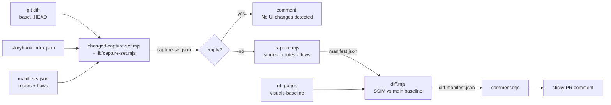
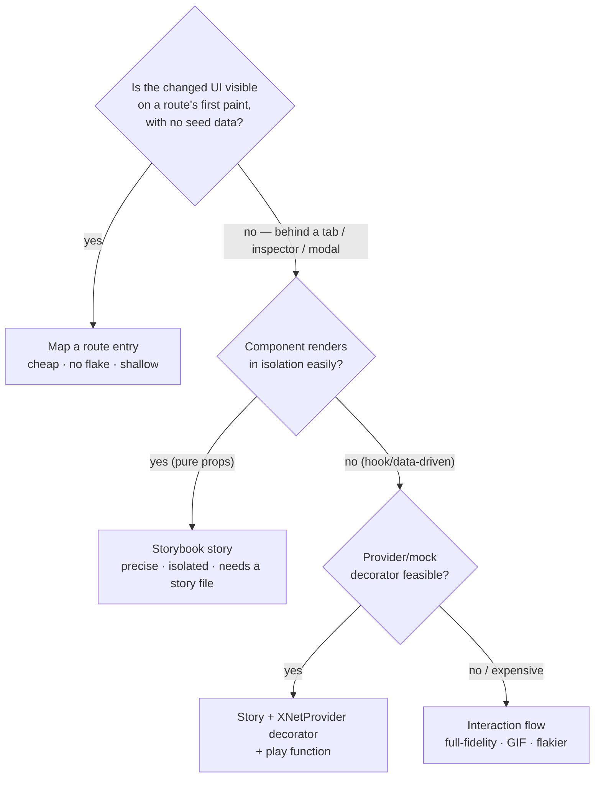

# Visual Capture Misses Unmapped & Interaction‑Gated Surfaces

> Why the CI visual screenshotter reported **"No visual differences detected"**
> on [PR #118](https://github.com/crs48/xNet/pull/118) (`feat: product catalog +
> deal line‑item quote builder`) — a PR that very much changed the UI — and how
> to fix the mapping so new workbench surfaces stop slipping through silently.

## Problem Statement

PR #118 added two brand‑new CRM screens — a **Products** catalog tab
([`ProductsPanel.tsx`](apps/web/src/components/crm/ProductsPanel.tsx), +115) and
an in‑inspector **deal line‑item quote builder**
([`DealLineItems.tsx`](apps/web/src/components/crm/DealLineItems.tsx), +164) —
and wired both into the CRM surface
([`CrmView.tsx`](apps/web/src/components/crm/CrmView.tsx),
[`CrmPipeline.tsx`](apps/web/src/components/crm/CrmPipeline.tsx)). All four files
live under `apps/web/src/components/crm/`.

The "Visual UI Capture" workflow ([`.github/workflows/visual-capture.yml`](.github/workflows/visual-capture.yml))
ran — the path filter matched `apps/web/src/**` — and posted its sticky comment:

```
<!-- xnet-visuals -->
## 🖼️ UI changes in this PR

_No visual differences detected in the changed UI._

<sub>[CI run](https://github.com/crs48/xNet/actions/runs/27601851126)</sub>
```

That message is wrong. The PR shipped two new screens. The screenshotter took a
picture of the **wrong page** (the document‑list home at `/`), found it
unchanged, and concluded the PR had no visual impact. This exploration explains
the three compounding reasons and recommends a layered fix that also prevents
the next surface from regressing the same way.

## Executive Summary

The capture pipeline never looked at the CRM surface. The failure is a
**target‑selection / coverage gap**, not a rendering or diffing bug:

1. **The `/crm` surface isn't in the route manifest.** [`manifests.json`](scripts/visuals/manifests.json)
   maps source globs → capturable routes, but it only lists 7 of the app's ~15
   singleton routes. `crm`, `finance`, and `analytics` — all recently‑shipped
   workbench surfaces — are missing entirely.
2. **A catch‑all `home` glob swallowed the change.** The `home` route's globs
   include `apps/web/src/components/**`, so *every* CRM file matched `home`
   (path `/`). The capture set was therefore `{ routes: ['home'] }` — non‑empty,
   so the job ran, but it screenshotted the document‑list home page where no CRM
   exists. Diff vs. baseline → identical → `unchanged` → "no differences."
3. **Even a correct `/crm` route wouldn't have captured the meat.** The new UI
   is interaction‑ and data‑gated: the Products table lives behind a tab click,
   the line‑item builder behind selecting a deal and opening its inspector, and
   both need seed data the route capture deliberately doesn't create. Static
   route screenshots only ever see the **top of funnel**.

The system already has the right primitive for #3 — **flows** (scripted
Playwright interactions recorded to GIF, see [`flows.mjs`](scripts/visuals/flows.mjs)) —
and for isolated component diffs — **stories**. The fix is to (a) map the
missing surfaces, (b) stop `home` from greedily claiming sub‑surfaces, (c) add a
CRM interaction flow, and (d) add a drift guard so an unmapped singleton route
fails a test instead of failing silently in CI.

## Current State In The Repository

### The pipeline



The mapping is **pure and unit‑tested** in
[`lib/capture-set.mjs`](scripts/visuals/lib/capture-set.mjs) (`computeCaptureSet`).
There are three target *types*:

| Type   | Source of truth                              | Renders                                   | Needs seed data? |
| ------ | -------------------------------------------- | ----------------------------------------- | ---------------- |
| story  | Storybook index + sibling‑component match    | component in isolation (static SB build)  | no — mock props  |
| route  | `manifests.json#routes[].globs → path`       | live app at `path`, test‑bypass identity  | **no** (by rule) |
| flow   | `manifests.json#flows[].globs` + `flows.mjs` | scripted interaction recorded to GIF/MP4  | created in‑flow  |

### The route manifest, today

[`manifests.json`](scripts/visuals/manifests.json) lists routes
`home(/), discover, data, tasks, experiments, settings, requests`. The app
actually ships these singleton (non‑parameterized) routes:

```
analytics  crm  data  discover  experiments  finance  requests  settings
social-import  share  stories  tasks  welcome
```

So `analytics`, `crm`, and `finance` — three real, content‑bearing surfaces —
have **no manifest entry**. (`share`, `social-import`, `welcome`, `stories` are
reasonably out of scope.) Both `packages/crm` and `packages/ledger` exist but
appear in **no** route glob either.

### How PR #118 resolved — traced

`computeCaptureSet` ([`lib/capture-set.mjs:80`](scripts/visuals/lib/capture-set.mjs))
runs three independent matchers over the four changed CRM files:

```mermaid
flowchart TD
  CH["changed files:<br/>components/crm/{CrmView,CrmPipeline,<br/>DealLineItems,ProductsPanel}.tsx"]

  CH --> S{any story importPath<br/>or sibling dir match?}
  S -- "no CRM stories exist" --> S0[stories = []]

  CH --> R{any route glob match?}
  R -- "home glob<br/>apps/web/src/components/**" --> R1["routes = [home → / ]"]
  R -- "no crm/finance/analytics entry" --> R1

  CH --> FL{any flow glob match?}
  FL -- "no canvas/editor match" --> F0[flows = []]

  R1 --> CAP["capture / (home)"]
  CAP --> DF["SSIM vs baseline ≈ 1.0<br/>→ unchanged"]
  DF --> OUT["changedCount = 0<br/>→ 'No visual differences detected'"]
```

The decisive line is the `home` route's glob list in
[`manifests.json:8`](scripts/visuals/manifests.json):

```json
"globs": [
  "apps/web/src/routes/index.tsx",
  "apps/web/src/routes/__root.tsx",
  "apps/web/src/App.tsx",
  "apps/web/src/workbench/**",
  "apps/web/src/components/**",   // ← matches EVERY component change
  "packages/ui/**"
]
```

`apps/web/src/components/**` matches `apps/web/src/components/crm/CrmView.tsx`
(the `**` regex is `.*`, see `globToRegExp`), so `home` matches **positively**.
Because `routes.length > 0`, the home **fallback** at
[`capture-set.mjs:86`](scripts/visuals/lib/capture-set.mjs) is moot — but it
would have selected `home` anyway. Either path lands on `/`.

[`index.tsx`](apps/web/src/routes/index.tsx) is `HomePage` — "Home page —
document list with all types." No CRM. So [`capture.mjs`](scripts/visuals/capture.mjs)
screenshots the doc list, [`diff.mjs`](scripts/visuals/diff.mjs) scores it
against the baseline `home`, SSIM ≥ `0.998` → `unchanged`,
[`comment.mjs:66`](scripts/visuals/comment.mjs) hits the `total === 0` branch and
prints the no‑op message. The pipeline behaved exactly as written; the **map was
wrong**.

### Why even a `/crm` route is necessary‑but‑not‑sufficient

[`CrmView.tsx`](apps/web/src/components/crm/CrmView.tsx) defaults to the
`contacts` tab. The PR's visible surface area:

- **Products tab** — only rendered when `tab === 'products'`
  ([`CrmView.tsx:113`](apps/web/src/components/crm/CrmView.tsx)); needs a tab
  click. The table itself shows "No products yet." until a product exists.
- **Deal line items** — rendered in the Deal inspector's panel slot
  ([`DealLineItems.tsx`](apps/web/src/components/crm/DealLineItems.tsx)); needs a
  pipeline with a deal, a click to open the inspector, and products to pick from.

A static `/crm` capture lands on **Contacts**, with an empty store. The *one*
thing it would catch is the new **"Products" tab button** added to the
`TABS` array in `CrmView` — a real but tiny header delta. The actual feature is
invisible to a static route shot. That is by design: the manifest comment says
"Routes must render without URL params and without bespoke seed data."
Interaction‑gated UI is the **flow** primitive's job (today only `create-page`
and `canvas` flows exist).

## External Research

The route‑vs‑component coverage gap xNet just hit is a well‑documented tradeoff
in the visual‑regression world, and every mature tool resolves it by running
**both** layers:

- **Component VRT (Storybook + Chromatic / Playwright).** Each story is rendered
  in isolation with **mock data and props**, and Chromatic "captures an image
  snapshot of every story." Storybook's `play` functions drive interactions so a
  snapshot can be taken *at a specific interaction state* (menu open, row
  selected). Strength: catches subtle component‑level changes precisely; weak at
  integration/layout‑in‑context. ([Storybook visual tests](https://storybook.js.org/docs/writing-tests/visual-testing),
  [Chromatic](https://www.chromatic.com/features/visual-test))
- **Page / route VRT.** Catches integration and real‑data layout shifts, but
  "misses subtle component‑level changes that get lost in the noise of a full
  page and edge‑case component states that don't appear in normal page flows."
  ([Bug0 knowledge base](https://bug0.com/knowledge-base/storybook-visual-regression-testing-chromatic))
- **Free DIY stacks** (Storybook + Playwright, the model xNet's pipeline is built
  on) reach parity by screenshotting stories *and* scripting page interactions —
  exactly the story/route/flow trichotomy already in `capture.mjs`.
  ([Oberlehner: Storybook + Playwright VRT for free](https://markus.oberlehner.net/blog/running-visual-regression-tests-with-storybook-and-playwright-for-free))

The consensus, applied to this bug: **data‑dependent, interaction‑gated UI must
be captured either as a Storybook story with mock data (+`play`) or as a scripted
flow — a bare route screenshot will systematically miss it.** xNet already owns
all three primitives; it just didn't point any of them at `/crm`.

A second, structural lesson from the same literature: **manifest/coverage drift
is the chronic failure mode.** Whenever the map of "what to snapshot" is
maintained by hand and separately from the code it describes, new surfaces are
forgotten. The durable fixes are (a) auto‑derivation (every story is auto‑tested
in Chromatic) and (b) a guard that fails when a new surface is unmapped.

## Key Findings

1. **Coverage gap, not a bug.** Every script did exactly what it was coded to do.
   The defect is data: a stale `manifests.json` plus an over‑broad `home` glob.
2. **`home` is a greedy catch‑all.** `apps/web/src/components/**` + `packages/ui/**`
   make `home` match on nearly every UI PR, then almost always report
   `unchanged` — diluting signal and, worse, *pre‑empting* the more specific
   surface that should have been chosen. It also defeats the purpose of the
   existing fallback, which was meant to be the *only* way home gets picked.
3. **The route layer can't see deep UI.** Tabs, inspectors, modals, and anything
   needing seed data are invisible to static route captures. This is the
   intended boundary between **route** and **flow** targets — but no CRM flow
   exists.
4. **No CRM/finance/analytics stories exist.** The cleanest isolation primitive
   (a story for `ProductsPanel`/`DealLineItems`) isn't available because these
   hook‑driven app components have no Storybook coverage and would need an
   `XNetProvider` decorator with seeded data.
5. **Silent by construction.** The job is `continue-on-error` and non‑required
   (correctly — it must never block merges), so a wrong "no changes" verdict
   produces zero signal. Only a human reading the comment would notice. This is
   the same class of issue flagged in
   [`0189_[_]_PR_VISUAL_SCREENSHOTS_VANISH_ON_MERGE.md`](docs/explorations/0189_%5B_%5D_PR_VISUAL_SCREENSHOTS_VANISH_ON_MERGE.md):
   the visual pipeline fails *quietly*.
6. **It will recur.** Three surfaces are already unmapped. The next workbench tab
   (`/foo`) will repeat PR #118 verbatim unless drift is guarded.

## Options And Tradeoffs

### Decision: how should interaction‑gated, data‑dependent UI be captured?



| Option                                                 | Pros                                                                              | Cons                                                                                   | Effort |
| ------------------------------------------------------ | -------------------------------------------------------------------------------- | -------------------------------------------------------------------------------------- | ------ |
| **A. Add missing route entries** (`crm/finance/analytics`) | Trivial; catches header/top‑of‑funnel deltas (e.g. the new Products tab); no new code | Misses tab/inspector/seed‑gated UI — wouldn't fully fix #118                            | XS     |
| **B. Narrow the `home` globs**                          | Stops greedy pre‑emption; forces real surfaces to map; fallback still covers strays | Shared `packages/ui/**` changes fall back to home‑only (acceptable — they have stories) | XS     |
| **C. Add a `crm-quote` flow**                           | Captures the *actual* feature (products + line items) as a GIF; matches design    | Flow runners are the flakiest target; must seed data deterministically                 | M      |
| **D. Storybook stories for new components**             | Gold‑standard isolation & precision; auto‑captured via sibling match; no flake    | Hook components need a provider/seed decorator; net‑new Storybook infra for app comps   | M–L    |
| **E. Drift guard test** (every singleton route is mapped or exempt) | Prevents the *next* PR #118; cheap; self‑documenting                              | One‑time exemption list to maintain                                                    | S      |
| **F. Capture *all* routes on every PR**                 | Zero mapping to maintain                                                          | Slow, noisy, defeats the "only what changed" design; many unchanged shots              | S      |

A, B, C, and E are complementary and cheap; D is the long‑term ideal but heavier.
F is rejected — it throws away the changed‑set design that keeps the job fast.

## Recommendation

Ship a **layered fix**: map the surfaces, de‑greed the catch‑all, add one flow,
and guard against drift. Concretely:

1. **(A) Add `crm`, `finance`, `analytics` route entries** to `manifests.json`,
   each globbing its route file, its `components/<domain>/**`, and its package.
2. **(B) Narrow `home`** to its own shell files (`index.tsx`, `__root.tsx`,
   `App.tsx`, `workbench/**`). Drop `components/**` and `packages/ui/**` from
   `home` — `packages/ui` is covered by stories, and unmapped components still
   reach home via the existing **fallback**. This makes specific surfaces win.
3. **(C) Add a `crm-quote` flow** (`manifests.json#flows` + a runner in
   `flows.mjs`) that navigates to `/crm`, opens **Products**, creates a product,
   opens **Pipeline**, opens a deal's inspector, and adds a line item — recording
   the real feature as a GIF.
4. **(E) Add a drift‑guard unit test** asserting every non‑parameterized route
   file under `apps/web/src/routes/` is either mapped in `manifests.json#routes`
   or in an explicit `EXEMPT` set. New surface, no map → red test.
5. **(D, follow‑up)** File a task to give hook‑driven app components an
   `XNetProvider` story decorator so `ProductsPanel`/`DealLineItems` get isolated
   story coverage — the most robust long‑term answer, but out of scope here.

This fixes #118 (the flow captures the feature; the route captures the new tab),
restores signal precision (home stops false‑matching), and stops the bug class
from recurring (the guard test).

## Example Code

### 1 + 2 — `manifests.json` routes (add surfaces, de‑greed home)

```jsonc
"routes": [
  {
    "id": "home", "label": "Home", "path": "/",
    // Narrowed: shell only. Sub‑surfaces map themselves; unmapped
    // components still reach home via the fallback in capture-set.mjs.
    "globs": [
      "apps/web/src/routes/index.tsx",
      "apps/web/src/routes/__root.tsx",
      "apps/web/src/App.tsx",
      "apps/web/src/workbench/**"
    ]
  },
  {
    "id": "crm", "label": "CRM", "path": "/crm",
    "globs": [
      "apps/web/src/routes/crm.tsx",
      "apps/web/src/components/crm/**",
      "packages/crm/**"
    ]
  },
  {
    "id": "finance", "label": "Finance", "path": "/finance",
    "globs": [
      "apps/web/src/routes/finance.tsx",
      "apps/web/src/components/finance/**",
      "packages/ledger/**"
    ]
  },
  {
    "id": "analytics", "label": "Analytics", "path": "/analytics",
    "globs": ["apps/web/src/routes/analytics.tsx"]
  }
  // …existing discover/data/tasks/experiments/settings/requests…
]
```

### 3 — `manifests.json` flow + `flows.mjs` runner

```jsonc
// manifests.json#flows
{
  "id": "crm-quote",
  "label": "Build a CRM quote (product + line item)",
  "globs": ["apps/web/src/components/crm/**", "packages/crm/**"]
}
```

```js
// scripts/visuals/flows.mjs — add to FLOWS
'crm-quote': {
  label: 'Build a CRM quote',
  async run(page) {
    await page.goto(new URL('/crm', page.url()).toString(), {
      waitUntil: 'domcontentloaded'
    })
    // Products tab → create one so the table (not the empty state) renders.
    await page.getByRole('button', { name: /^Products$/ }).click()
    await page.getByRole('button', { name: /New product/i }).click()
    await wait(page, 600)
    // Pipeline → open a deal's inspector → the line‑item builder lives there.
    await page.getByRole('button', { name: /^Pipeline$/ }).click()
    await wait(page, 800)
    // (deal seeded by the default pipeline / created here) open inspector…
    await wait(page, 800)
  }
}
```

> Flows are best‑effort: a throw is swallowed and the flow skipped
> ([`capture.mjs:194`](scripts/visuals/capture.mjs)), so an over‑specific
> selector degrades to "no GIF," never a failed job.

### 4 — drift guard (`lib/capture-set.test.mjs` or a sibling test)

```js
import { test } from 'node:test'
import assert from 'node:assert/strict'
import { readdirSync, readFileSync } from 'node:fs'

// Singleton routes that intentionally have no visual baseline.
const EXEMPT = new Set(['__root', 'index', 'welcome', 'share', 'social-import', 'stories'])

test('every singleton route is mapped in manifests.json (or exempt)', () => {
  const manifest = JSON.parse(readFileSync('scripts/visuals/manifests.json', 'utf8'))
  const mappedPaths = new Set(manifest.routes.map((r) => r.path))
  const routeFiles = readdirSync('apps/web/src/routes')
    .filter((f) => f.endsWith('.tsx') && !f.includes('$')) // skip parameterized
    .map((f) => f.replace(/\.tsx$/, ''))

  const missing = routeFiles.filter(
    (name) => !EXEMPT.has(name) && !mappedPaths.has(name === 'index' ? '/' : `/${name}`)
  )
  assert.deepEqual(missing, [], `Unmapped singleton routes: ${missing.join(', ')}`)
})
```

### Regression test for the mapping itself

```js
test('CRM component change maps to the /crm route, not just home', () => {
  const set = computeCaptureSet({
    changedFiles: ['apps/web/src/components/crm/ProductsPanel.tsx'],
    storyEntries: [],
    routeManifest: [
      { id: 'home', label: 'Home', path: '/', globs: ['apps/web/src/routes/index.tsx'] },
      { id: 'crm', label: 'CRM', path: '/crm', globs: ['apps/web/src/components/crm/**'] }
    ],
    flowManifest: [{ id: 'crm-quote', label: 'Quote', globs: ['apps/web/src/components/crm/**'] }]
  })
  assert.deepEqual(set.routes.map((r) => r.id), ['crm'])
  assert.deepEqual(set.flows.map((f) => f.id), ['crm-quote'])
})
```

## Risks And Open Questions

- **Flow flake & seeding.** `crm-quote` depends on `CrmView`'s default‑pipeline
  seeding ([`CrmView.tsx:60`](apps/web/src/components/crm/CrmView.tsx)) and on
  selectors that may shift. Mitigation: flows are non‑fatal; keep the script
  short and resilient. Open question: is the seeded pipeline guaranteed to expose
  a clickable deal in CI, or must the flow create one?
- **Inspector selector stability.** Opening the Deal inspector to reach
  `DealLineItems` needs a stable hook (a `data-testid` or an `aria-label`). May
  warrant a tiny test‑id addition in `CrmPipeline.tsx`.
- **Baseline must include the new routes.** New route entries only diff once the
  `main` `baseline` job has captured them (it runs `--all`). The first PR after
  merge will see `crm`/`finance`/`analytics` as **`new`** (no baseline yet),
  which is the correct, informative behavior — not a failure.
- **Narrowing `home` could under‑capture shared UI.** Dropping `packages/ui/**`
  from `home` relies on `packages/ui` having Storybook coverage (it does — the
  existing stories are the precise diff path for primitives). A pure‑`ui` PR with
  no story would fall back to home only. Acceptable; flag if a gap appears.
- **Should stories be the primary fix?** Long‑term yes (Option D), but it needs
  an `XNetProvider` + seed decorator for hook‑driven app components — a larger
  investment tracked as follow‑up, not blocking this fix.
- **Drift guard scope.** The `EXEMPT` list is a manual seam; a reviewer adding a
  surface must either map it or exempt it. That friction is the point.

## Implementation Checklist

- [x] Add `crm`, `finance`, `analytics` route entries to
      [`manifests.json`](scripts/visuals/manifests.json) with route‑file +
      `components/<domain>/**` + package globs. (The drift‑guard below also
      surfaced `social-import` as a real unmapped surface — mapped it too.)
- [x] Narrow the `home` route globs to shell files only (drop
      `apps/web/src/components/**` and `packages/ui/**`); broaden the fallback
      `webUiPattern` in [`capture-set.mjs`](scripts/visuals/lib/capture-set.mjs)
      to also cover `packages/ui/src` so story‑less ui changes still reach home.
- [x] Add a `crm-quote` flow entry to `manifests.json#flows` and a matching
      runner in [`flows.mjs`](scripts/visuals/flows.mjs).
- [x] ~~Add a `data-testid`/`aria-label` to the deal row / inspector opener~~ —
      not needed: [`CrmPipeline.tsx:155`](apps/web/src/components/crm/CrmPipeline.tsx)
      already exposes `aria-label="Deal details"`, and its `opacity-0` is still
      clickable in Playwright, so the flow needs no app source change.
- [x] Add the **drift‑guard** test (every singleton route mapped or exempt) —
      [`manifest-coverage.test.mjs`](scripts/visuals/lib/manifest-coverage.test.mjs);
      also guards against broad‑`home`‑glob re‑introduction and flow/runner skew.
- [x] Add the **regression** test (CRM change → `/crm` route + `crm-quote` flow) —
      in both [`capture-set.test.mjs`](scripts/visuals/lib/capture-set.test.mjs)
      (pure) and `manifest-coverage.test.mjs` (against the real manifest).
- [x] Update [`scripts/visuals/README.md`](scripts/visuals/README.md) "Tuning"
      to note: *new workbench surface ⇒ add a route entry (and a flow if the UI
      is interaction‑gated); the drift test enforces it.*
- [x] File a follow‑up task for Option D (XNetProvider story decorator →
      `ProductsPanel`/`DealLineItems` stories).

## Validation Checklist

- [x] `pnpm test:visuals` passes (20/20), including the new drift‑guard +
      regression tests; the drift test goes **red** if `crm`/`finance`/`analytics`
      are removed from the manifest (verified by simulating `/crm`'s removal →
      `missing = ["crm"]`).
- [x] Local dry run on the PR #118 diff:
      `node scripts/visuals/changed-capture-set.mjs --diff-from-file <crm-files.txt> --out tmp/set.json`
      yields `routes: ['crm']` (not `home`) and `flows: ['crm-quote']`. ✔
- [ ] On a re‑run of an equivalent CRM PR, the sticky comment shows a **Screens →
      CRM** entry and an **Interactions → Build a CRM quote** GIF — *not* "No
      visual differences detected." _(CI‑only — needs the app boot; the mapping +
      flow‑runner wiring is unit‑covered, but the rendered GIF can't be produced
      in this env.)_
- [x] A pure‑`packages/ui` PR with a story still diffs via the **Components**
      section; a shell‑only `apps/web/src/App.tsx` change still captures `home`
      via the fallback. _(Both paths asserted by `capture-set.test.mjs`.)_
- [ ] The `main` `baseline` job captures `crm`/`finance`/`analytics`; the first
      post‑merge PR touching them shows `new` (baseline seeded), then `changed`
      thereafter. _(CI‑only — happens on the next push to `main`.)_

## References

- PR under study: [crs48/xNet#118 — product catalog + deal line‑item quote builder](https://github.com/crs48/xNet/pull/118)
- Pipeline design: [`docs/explorations/0185_[_]_CI_VISUAL_UI_CAPTURE_SCREENSHOTS_GIFS_ON_PRS.md`](docs/explorations/0185_%5B_%5D_CI_VISUAL_UI_CAPTURE_SCREENSHOTS_GIFS_ON_PRS.md)
- Related silent‑failure exploration: [`docs/explorations/0189_[_]_PR_VISUAL_SCREENSHOTS_VANISH_ON_MERGE.md`](docs/explorations/0189_%5B_%5D_PR_VISUAL_SCREENSHOTS_VANISH_ON_MERGE.md)
- Code: [`scripts/visuals/manifests.json`](scripts/visuals/manifests.json) ·
  [`lib/capture-set.mjs`](scripts/visuals/lib/capture-set.mjs) ·
  [`capture.mjs`](scripts/visuals/capture.mjs) ·
  [`diff.mjs`](scripts/visuals/diff.mjs) ·
  [`comment.mjs`](scripts/visuals/comment.mjs) ·
  [`flows.mjs`](scripts/visuals/flows.mjs) ·
  [`.github/workflows/visual-capture.yml`](.github/workflows/visual-capture.yml)
- Prior art:
  [Storybook visual testing](https://storybook.js.org/docs/writing-tests/visual-testing) ·
  [Chromatic — visual testing for components and pages](https://www.chromatic.com/features/visual-test) ·
  [Bug0 — Storybook VRT with Chromatic](https://bug0.com/knowledge-base/storybook-visual-regression-testing-chromatic) ·
  [Oberlehner — Storybook + Playwright VRT for free](https://markus.oberlehner.net/blog/running-visual-regression-tests-with-storybook-and-playwright-for-free)
