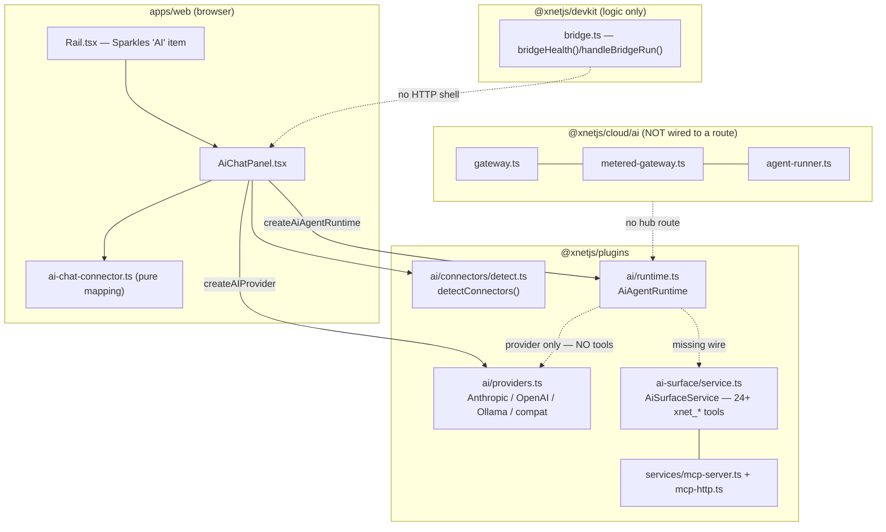
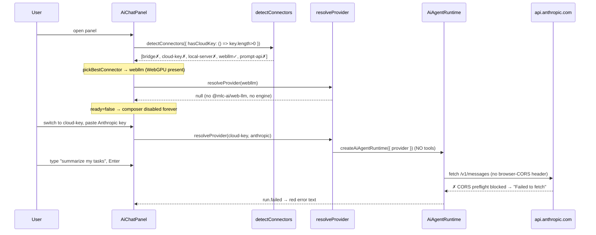
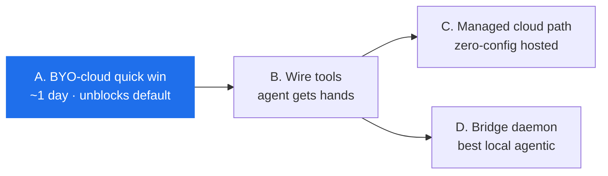

# Getting xNet AI Working — Diagnosing And Fixing The Chat Panel

## Problem Statement

> "The xNet AI doesn't seem to work. What can we do to get xNet AI working?"

xNet ships a substantial, well-tested AI subsystem — five real model
providers, a tiered "bring-your-own-model" connector ladder, an agent runtime
with threads/turns/approvals, a 2,500-line workspace tool surface, and a
managed cloud gateway. The icons are all there: there's a **Sparkles "AI"**
item in the left rail that opens a chat panel. Yet when a typical user opens
it and types a message, **nothing useful happens** — the composer is greyed
out, or the first message dies with a "Failed to fetch", or the assistant
replies as a plain chatbot that can't actually touch the workspace.

This exploration traces *exactly why* the visible AI feature fails for the
common cases, separates "broken" from "not yet wired", and lays out the
smallest set of changes that turn it from "dead on arrival" into "works the
moment you paste a key", then the path to the agentic experience the panel
promises.

## Executive Summary

The AI **backend** is real and mostly works. The **last mile into the web app
is broken or missing** in five concrete places. In priority order:

1. **The default cloud provider (Anthropic) is CORS-blocked in the browser.**
   `AnthropicProvider` calls `api.anthropic.com` from browser JS but omits the
   required `anthropic-dangerous-direct-browser-access: true` header. The web
   app is a browser. Anthropic is the *default* cloud provider. So the most
   obvious path — "paste my Claude key" — fails on the first send.
   ([providers.ts:374](packages/plugins/src/ai/providers.ts:374))

2. **On a fresh Chrome desktop the panel auto-selects WebLLM, a dead end.**
   `pickBestConnector` picks the highest-preference *available* tier; on a
   default Chromium that's `webllm` (WebGPU is present). But `@mlc-ai/web-llm`
   is **not a dependency** and the panel has no engine-injection path for it,
   so `resolveProvider` returns `null`, the runtime is never built, and the
   composer stays permanently disabled ("Select and configure a model above").
   ([AiChatPanel.tsx:349](apps/web/src/workbench/views/AiChatPanel.tsx:349),
   [ai-chat-connector.ts:77](apps/web/src/workbench/views/ai-chat-connector.ts:77))

3. **The agent has no hands.** The panel builds
   `createAiAgentRuntime({ provider })` with **no tool surface** — the
   `AiSurfaceService` (24+ `xnet_*` tools, mutation plans, approvals) is
   imported *nowhere* in `apps/web`. So even a *working* chat is a plain text
   bot; the panel's own promise — "Chat with an AI that can help manage your
   workspace" — is unfulfilled. The header comment admits it: *"Live tool
   execution … is the next integration step."*
   ([AiChatPanel.tsx:14](apps/web/src/workbench/views/AiChatPanel.tsx:14))

4. **The preferred tier ("Local bridge", preference #1) has no daemon.** Only
   the *pure logic* exists in `packages/devkit/src/bridge.ts`; nothing serves
   `/health` or `/run` on `:31416`, so the bridge tier is always "unavailable".
   ([bridge.ts:1](packages/devkit/src/bridge.ts:1))

5. **There is no zero-config managed path.** `packages/cloud/src/ai/`
   (`gateway`, `metered-gateway`, `agent-runner`) is implemented and tested but
   **no hub route calls it**. A brand-new user with no key, no Ollama, and no
   bridge has nothing that works out of the box.

**The single highest-leverage fix is #1 + #2** — a one-line header and a
one-line availability guard turn "broken on default" into "works with a pasted
key". **The highest-*value* fix is #3** — wiring the existing tool surface into
the runtime delivers the agent the UI already advertises.

## Current State In The Repository

### The architecture is layered and (mostly) complete



**What exists and works:**

- **Providers** ([providers.ts](packages/plugins/src/ai/providers.ts)) —
  `AnthropicProvider`, `OpenAIProvider`, `OllamaProvider`,
  `OpenAICompatibleProvider` (+ presets: OpenRouter, LM Studio, vLLM, LiteLLM),
  and an `AIProviderRouter`. Real `fetch` calls, streaming, tool specs, usage
  accounting. Solid.
- **Connector ladder** ([detect.ts](packages/plugins/src/ai/connectors/detect.ts))
  — probes five tiers concurrently and ranks them: `bridge` (1) >
  `cloud-key` (2) > `local-server` (3) > `webllm` (4) > `prompt-api` (5).
  Pure given its `ConnectorEnv`. (Exploration 0174.)
- **Agent runtime** ([runtime.ts](packages/plugins/src/ai/runtime.ts)) —
  threads, turns, streaming deltas, approvals, background jobs, telemetry,
  pluggable storage (in-memory default). `runTurn` → `completeRun` calls the
  real provider; emits `model.delta` / `run.completed` / `run.failed` events
  the panel already reduces correctly.
- **Workspace tool surface**
  ([ai-surface/service.ts](packages/plugins/src/ai-surface/service.ts)) —
  `AiSurfaceService` exposes resources (`xnet://workspace/summary`, pages,
  schemas…) and 24+ tools (`xnet_search`, `xnet_plan_page_patch`,
  `xnet_apply_database_mutation`, canvas ops…) behind a mutation-plan +
  approval + audit guardrail. Needs a `store` (NodeStore) and `schemas`
  (SchemaRegistry) injected.
- **MCP substrate** ([mcp-server.ts](packages/plugins/src/services/mcp-server.ts),
  [mcp-http.ts](packages/plugins/src/services/mcp-http.ts), and the CLI
  `xnet mcp serve` at [mcp.ts](packages/cli/src/commands/mcp.ts)) — lets
  *external* coding agents (Claude Code, Codex, OpenClaw) drive the workspace
  through the same guarded surface, backed by the Electron local API on
  `:31415`. This is the **most complete agentic path today** — but it lives
  outside the in-app panel and requires CLI setup. (Explorations 0161, 0175.)

### The web panel — where it breaks

The panel ([AiChatPanel.tsx](apps/web/src/workbench/views/AiChatPanel.tsx)) is
registered unconditionally — **no feature flag, always visible**
([register.ts:20](apps/web/src/workbench/views/register.ts), Sparkles icon in
[Rail.tsx](apps/web/src/workbench/Rail.tsx)). Its flow:



Concretely:

- **Detection** re-runs when the key changes:
  `detectConnectors({ hasCloudKey: () => apiKey.length > 0 })`
  ([AiChatPanel.tsx:89](apps/web/src/workbench/views/AiChatPanel.tsx:89)).
  Note `hasCloudKey` defaults to `() => false` in `detect.ts`, so cloud-key is
  *only* available once a key is typed.
- **Provider resolution**
  ([AiChatPanel.tsx:349](apps/web/src/workbench/views/AiChatPanel.tsx:349)):
  `prompt-api` → `createPromptApiProvider()`; everything else →
  `providerConfigForConnector` → `createAIProvider`. For `webllm` the mapping
  returns `null` (default case,
  [ai-chat-connector.ts:77](apps/web/src/workbench/views/ai-chat-connector.ts:77)),
  so selecting WebLLM yields no provider and no runtime.
- **Runtime build**: `createAiAgentRuntime({ provider })` — **provider only**
  ([AiChatPanel.tsx:111](apps/web/src/workbench/views/AiChatPanel.tsx:111)).
- **Anthropic request** omits the browser header
  ([providers.ts:376](packages/plugins/src/ai/providers.ts:376)); a repo-wide
  grep for `dangerous-direct-browser-access` / `dangerouslyAllowBrowser`
  returns **zero hits**.

### What actually works *today* (and what doesn't)

| Tier / provider | In-app panel result | Why |
| --- | --- | --- |
| **Cloud → Anthropic** (default) | ❌ CORS "Failed to fetch" | Missing `anthropic-dangerous-direct-browser-access` header |
| **Cloud → OpenAI** | ⚠️ Usually works at network level, exposes key | OpenAI serves CORS; key sits in `localStorage` |
| **Cloud → OpenRouter** | ✅ Works (text only) | OpenRouter is CORS-friendly |
| **Local → Ollama / LM Studio** | ⚠️ Works *only if* CORS allowlisted | Needs `OLLAMA_ORIGINS` / LM Studio CORS toggle |
| **WebLLM (in-browser)** | ❌ Dead end, auto-selected | `@mlc-ai/web-llm` not installed; no engine injection |
| **Prompt API (Gemini Nano)** | ⚠️ Chrome-only, niche | Needs Chrome with model downloaded |
| **Local bridge (:31416)** | ❌ Never available | Daemon HTTP shell unbuilt |
| **Managed cloud** | ❌ Doesn't exist in UI | `cloud/ai` gateway not wired to a hub route |
| **Any working tier** | ⚠️ Text chat only | No `AiSurfaceService` tools wired to the runtime |

So the feature *can* work — paste an **OpenRouter** key, or run Ollama with
`OLLAMA_ORIGINS=*` — but every default and the headline "Anthropic" path is
broken, and even success is a toothless chatbot.

## External Research

- **Anthropic browser CORS.** Anthropic added CORS support in Aug 2024 behind
  an explicit, initially-undocumented header:
  `anthropic-dangerous-direct-browser-access: true`. Without it, browser
  requests to `api.anthropic.com` are blocked by the preflight. This is the
  exact gap in `AnthropicProvider`. The "dangerous" naming reflects the real
  tradeoff: a browser-side key is visible to the user — acceptable for a
  **BYO-key** pattern (the user supplies *their own* key), which is precisely
  xNet's model. ([Simon Willison](https://simonwillison.net/2024/Aug/23/anthropic-dangerous-direct-browser-access/))
- **Provider CORS landscape.** OpenAI, Anthropic, Google, and OpenRouter all
  support client-side CORS calls; Anthropic is the one that *requires* the
  extra header. ([CO/AI](https://getcoai.com/news/claudes-api-now-supports-cors-requests/))
- **Ollama CORS.** Ollama rejects cross-origin browser requests unless
  `OLLAMA_ORIGINS` includes the calling origin — a well-known friction point
  for web apps talking to local models; LM Studio has an equivalent CORS
  toggle. (Ollama FAQ / docs.)
- **WebLLM.** `@mlc-ai/web-llm` runs quantized LLMs in-browser on WebGPU. It's
  a heavy dependency (multi-hundred-MB model downloads) and its OpenAI-style
  tool calling is unreliable — consistent with the ladder marking `webllm`
  `toolCalling: 'weak'`. Worth shipping, but as an opt-in, not an
  auto-selected default.
- **BYO-key web clients** (LibreChat, NextChat, page-assist, big-AGI) converge
  on the same pattern xNet already has: detect/choose provider, store the key
  locally, call the provider directly with the per-provider CORS header.
  xNet's design matches the field — it just hasn't flipped the header on.

## Key Findings

1. **"Doesn't work" is not one bug — it's a layered last-mile failure.** The
   backend is healthy; the breakage is concentrated in the panel ↔ provider
   ↔ runtime seams.
2. **The two defaults are both broken.** Auto-selected tier (WebLLM) is a dead
   end; the default cloud provider (Anthropic) is CORS-blocked. A new user hits
   *both* before reaching a working path by luck (OpenRouter / Ollama).
3. **The capability badge over-promises.** The `cloud-key` tier reports
   `toolCalling: 'reliable'` → an **"agentic"** write-mode badge, but
   `AnthropicProvider` implements neither `generateWithTools` nor `stream`, and
   no tools are wired anyway — so the badge claims agency the panel can't
   deliver.
4. **The most capable agent path is the CLI/MCP one, not the panel.**
   Ironically, *external* agents (Claude Code/Codex via `xnet mcp serve`) get
   the full guarded tool surface, while the first-party in-app panel gets none
   of it.
5. **A zero-config path is the real product gap.** Power users can BYO key or
   model; everyone else has nothing. The `cloud/ai` metered gateway is the
   intended answer and is built — it's just not exposed.

## Options And Tradeoffs

### A. Quick-win: make BYO-cloud actually work (Phase 0)

Flip the Anthropic browser header, kill the WebLLM trap, prefer a tier that can
actually produce a provider, and surface CORS errors clearly.

- **Pros:** ~1 day; turns the visible feature from broken→working with a key;
  no new deps; no architecture change.
- **Cons:** Still text-only; still requires the user to bring a key/model.

### B. Give the agent hands: wire `AiSurfaceService` into the runtime (Phase 1)

Construct the tool surface from the web app's NodeStore + SchemaRegistry, pass
its tools into `createAiAgentRuntime`, and render the approval/mutation-plan
flow (`classifyAiAgentDisplayState` already exists for this).

- **Pros:** Delivers the advertised "manage your workspace" agent; reuses the
  guardrail already used by MCP; large value jump.
- **Cons:** Needs a tool-capable provider (OpenAI/OpenRouter/local — *not* the
  current `AnthropicProvider`, which lacks `generateWithTools`); approval UI is
  net-new; biggest scope of the three.

### C. Zero-config managed path: wire `cloud/ai` behind a hub route (Phase 2)

Expose `MeteredGateway` + `AgentRunner` via a hub endpoint so hosted-hub users
get AI with no key, metered against billing/entitlements.

- **Pros:** "It just works" for non-technical users; monetizable; classes
  already built and tested.
- **Cons:** Requires a hub deployment + billing wiring; cost/abuse controls;
  only benefits hosted users (the local-first/self-host user still BYO).

### D. Build the bridge daemon (Phase 3)

Ship the Electron HTTP shell serving devkit's `bridgeHealth()`/`handleBridgeRun()`
on `:31416`, wrapping the user's own Claude Code/Codex subscription.

- **Pros:** Best local agentic UX; **zero model cost** (rides the user's
  existing subscription); reliable tool calling; this is the 0190 keystone.
- **Cons:** Electron-only; most engineering; depends on the user having a CLI
  agent installed.



## Recommendation

**Do A now, B next, then C and D as parallel follow-ups.**

1. **Phase 0 (A) — immediately.** Four small, independent changes (below) that
   make the panel work with a pasted key on every provider and stop
   auto-selecting a dead tier. This is the literal answer to "get xNet AI
   working".
2. **Phase 1 (B) — next sprint.** Wire `AiSurfaceService` tools into the panel
   runtime behind the existing approval guardrail; default the agentic path to
   a tool-capable provider. This is where the feature becomes *valuable*.
3. **Phase 2 (C) & Phase 3 (D) — follow-ups.** Managed gateway for hosted
   users (zero-config); bridge daemon for the best local experience. Pick by
   audience: C for the hosted/SaaS user, D for the local-first power user.

Rationale: the backend investment is already paid; the failure is entirely in
the last mile. Phase 0 is cheap and removes the embarrassing "looks broken"
state today; Phase 1 unlocks the differentiated value (an agent that operates
on your *own* local-first data through a guarded surface) that the MCP path
already proves out.

## Example Code

### Fix 1 — Anthropic browser CORS (the headline unblock)

`packages/plugins/src/ai/providers.ts` — `AnthropicProvider`:

```diff
 export class AnthropicProvider implements AIProvider {
   readonly name = 'Anthropic'
+  /** Send the CORS-enabling header when running in a browser (BYO-key). */
+  private readonly browserAccess: boolean
+
+  constructor(options: AIProviderOptions) {
+    // ...existing assignments...
+    this.browserAccess = options.allowBrowser ?? typeof window !== 'undefined'
+  }

   async generate(prompt: string): Promise<string> {
     const response = await fetch(`${this.baseUrl}/v1/messages`, {
       method: 'POST',
       headers: {
         'content-type': 'application/json',
         'x-api-key': this.apiKey,
-        'anthropic-version': '2023-06-01'
+        'anthropic-version': '2023-06-01',
+        ...(this.browserAccess
+          ? { 'anthropic-dangerous-direct-browser-access': 'true' }
+          : {})
       },
       // ...
```

(Add `allowBrowser?: boolean` to `AIProviderOptions`. The web app already runs
in a browser, so the `typeof window` default flips it on automatically.)

### Fix 2 — stop auto-selecting tiers that can't produce a provider

`apps/web/src/workbench/views/AiChatPanel.tsx` — only auto-pick a tier the
panel can actually instantiate:

```ts
import { providerConfigForConnector, PROVIDER_CONFIG_TIERS } from './ai-chat-connector'

// A tier is "usable" if it maps to a provider config, or is an in-tab tier we
// can build (prompt-api today; webllm once @mlc-ai/web-llm is wired).
const usableTiers = new Set<ConnectorTier>([...PROVIDER_CONFIG_TIERS, 'prompt-api'])

void detectConnectors({ hasCloudKey: () => apiKey.length > 0 }).then((result) => {
  if (cancelled) return
  setDetections(result)
  const best = result.find((d) => d.available && usableTiers.has(d.tier))
  setSelectedTier((current) => current ?? best?.tier ?? null)
})
```

This removes the "fresh Chrome auto-selects the dead WebLLM tier" trap without
hiding WebLLM from the dropdown (it stays selectable for when it's wired).

### Fix 3 — clearer error when a provider call is CORS/network-blocked

`apps/web/src/workbench/views/ai-chat-connector.ts`:

```ts
export function errorMessage(err: unknown): string {
  const raw = err instanceof Error ? err.message : String(err)
  if (/failed to fetch|networkerror|load failed/i.test(raw)) {
    return 'Could not reach the model. For a cloud key this is usually a CORS '
      + 'block; for a local model, allow this origin (OLLAMA_ORIGINS / LM Studio CORS).'
  }
  return raw
}
```

### Fix 4 (Phase 1a — shipped) — ground the runtime in the workspace

Reality check against the code: `createAiAgentRuntime` has **no `tools`/`callTool`**
config, and `completeRun` sent only `[{ role:'user', content }]` — no system
prompt, no history, and the `generate()` fallback (Anthropic) ignored the
request entirely. So before any tool-calling, the runtime needed history +
context plumbing. What shipped (Phase 1a):

```ts
// Runtime: AiAgentRuntimeConfig gains systemPrompt + contextProvider; completeRun
// composes [system, context, ...thread history, latest user] for every provider.
const runtime = createAiAgentRuntime({
  provider,
  systemPrompt: AI_SYSTEM_PROMPT,
  contextProvider: async ({ content }) => {
    const pack = await surface.createContextPack({ query: content, limit: 6 })
    return formatContextMessages(pack) // read-only system message, with citations
  }
})

// Web: the local NodeStore satisfies NodeStoreAPI directly; schemas need a thin
// DefinedSchema → SchemaData adapter (see ai-schemas.ts).
const surface = createAiSurfaceService({ store, schemas: schemaRegistryApi() })
```

### Fix 5 (Phase 1b — deferred) — live tool execution + approval-gated writes

This is the larger piece: the runtime has **no tool-execution loop** (it surfaces
`tool.call` events but never runs the tool or feeds the result back). Real
agentic writes need (a) a loop that executes `AiSurfaceService.callTool` and
continues the turn, (b) the mutation-plan → approval flow rendered via
`classifyAiAgentDisplayState`, and (c) a tool-capable provider (OpenAI/OpenRouter/
local — `AnthropicProvider` implements neither `generateWithTools` nor `stream`).

## Risks And Open Questions

- **Browser-side keys are visible to the user.** That's inherent to BYO-key and
  acceptable (the key is *theirs*), but the UI copy should say so plainly. Never
  send a user key to the hub (the panel already promises this).
- **Anthropic via `AnthropicProvider` can't do tools or streaming.** For the
  agentic Phase 1, default to a tool-capable provider (OpenAI/OpenRouter/local),
  or extend `AnthropicProvider` with `generateWithTools`/`stream`. The
  `cloud-key` "agentic" badge is misleading until then — fix the badge or the
  provider.
- **WebLLM is a heavy dependency.** Gate behind explicit opt-in + a download
  consent step; don't bundle eagerly.
- **Tool execution mutates user data.** Phase 1 must route every write through
  the existing mutation-plan + approval guardrail (`AiSurfaceService` already
  enforces it); do not bypass it for the in-app path.
- **Managed gateway (Phase 2) needs abuse/cost controls.** `MeteredGateway` has
  budget stops, but rate limiting, prompt-injection screening
  (`agent-runner` has a pre-tool hook), and per-tenant quotas need a real hub.
- **Open question:** should the panel's connector config move to the `/settings`
  surface (discoverable) instead of living inline only when `cloud-key` is
  selected? Likely yes.
- **Open question:** is `webllm` worth wiring at all given `toolCalling: 'weak'`,
  or should the in-tab story be prompt-api + managed-cloud only?

## Implementation Checklist

**Phase 0 — make BYO-cloud work (target: 1 day)** — ✅ shipped
- [x] Add `allowBrowser?: boolean` to `AIProviderOptions` and send
      `anthropic-dangerous-direct-browser-access: true` from `AnthropicProvider`
      when in a browser.
- [x] Auto-select only *usable* tiers in `AiChatPanel` (skip `webllm` until it
      has an engine) via `pickUsableConnector`.
- [x] Map CORS/network `fetch` failures to an actionable message in
      `errorMessage`.
- [x] Persist the selected tier (new `xnet:ai-tier` key) so the choice survives
      reload.
- [x] Update panel copy: clarify BYO-key visibility and the Ollama/LM Studio
      CORS step; the write-mode badge is now an honest "chat" badge (no
      "agentic" claim) until tools are wired.
- [x] Unit-test the new header + tier-selection logic (mirror existing
      `ai-chat-connector.test.ts` / `providers.test.ts`).

**Phase 1a — read-only workspace grounding** — ✅ shipped
- [x] Construct `AiSurfaceService` in the web app from the live NodeStore +
      SchemaRegistry (store satisfies `NodeStoreAPI` directly; schemas via a thin
      `DefinedSchema → SchemaData` adapter, `ai-schemas.ts`).
- [x] Carry conversation history + a system prompt + injected context in the
      runtime (`systemPrompt` + `contextProvider` on `AiAgentRuntimeConfig`;
      `completeRun` composes the full message list for every provider).
- [x] Inject workspace context into turns (per-message `createContextPack` →
      `formatContextMessages`, read-only with citations).

**Phase 1b — live tool execution + writes (target: 1 sprint)** — deferred
- [ ] Add a tool-execution loop to the runtime (today it surfaces `tool.call`
      events but never runs the tool or feeds the result back).
- [ ] Pass `getTools()` / `callTool` from `AiSurfaceService` into the loop.
- [ ] Render the approval / mutation-plan flow using
      `classifyAiAgentDisplayState` (`applied` / `proposed` / `read-only`).
- [ ] Default the agentic path to a tool-capable provider; either extend
      `AnthropicProvider` with tools/streaming or document the limitation.
- [ ] Selection-aware context (current page / selection) in addition to the
      query-based search grounding shipped in 1a.

**Phase 2 — managed cloud (optional)**
- [ ] Add a hub route that calls `MeteredGateway` → `AgentRunner`.
- [ ] Wire billing/entitlements budget + per-tenant quota + injection screen.
- [ ] Add a "Managed (no key needed)" connector tier for hosted hubs.

**Phase 3 — bridge daemon (optional)**
- [ ] Build the Electron HTTP shell serving `bridgeHealth()` / `handleBridgeRun()`
      on `:31416` from `@xnetjs/devkit`.
- [ ] Pair-token / loopback hardening (mirror `mcp-http.ts`).
- [ ] Detect-and-prefer the bridge tier in the panel when present.

## Validation Checklist

- [ ] With an **Anthropic** key pasted, a message round-trips and the assistant
      replies (no "Failed to fetch") in Chrome **and** Safari. *(Header in place
      and unit-tested; needs a live key to confirm end-to-end.)*
- [x] On a **fresh Chrome desktop** with no key/model, the panel does **not**
      auto-select WebLLM; it lands on a usable tier or shows a clear
      "configure a model" prompt — never a silently-disabled composer.
      *(Covered by `pickUsableConnector` unit tests.)*
- [ ] **OpenRouter** and **OpenAI** keys still work after the change.
      *(Provider paths unchanged; needs live keys to confirm.)*
- [ ] **Ollama** with `OLLAMA_ORIGINS` set streams a reply; without it, the
      error explains the CORS fix.
- [x] A CORS/network failure shows the actionable message, not raw
      "Failed to fetch". *(Covered by `errorMessage` unit tests.)*
- [x] Selected tier survives a page reload (`xnet:ai-tier` persistence).
- [x] (Phase 1a) Each turn carries the system prompt + grounding context + prior
      history; a failing context provider never breaks the run. *(Covered by
      runtime message-composition + resilience unit tests.)*
- [ ] (Phase 1a) With a real key/model, asking "what's in my workspace?" returns
      an answer grounded in the user's own nodes. *(Needs a live model to confirm
      end-to-end; the context pack + injection are unit-tested.)*
- [ ] (Phase 1b) Asking the agent to "create a task / edit this page" produces a
      **mutation plan** that requires approval, then applies through the
      guardrail and is visible in the workspace.
- [ ] (Phase 1b) A tool failure surfaces in the thread without crashing the
      panel.
- [x] Targeted tests green for `@xnetjs/plugins` (integration) and `apps/web`
      (dom) view tests + `typecheck` + `eslint` + `prettier`; full suite +
      visual capture run by CI on the PR.

## References

- Panel & wiring: [AiChatPanel.tsx](apps/web/src/workbench/views/AiChatPanel.tsx),
  [ai-chat-connector.ts](apps/web/src/workbench/views/ai-chat-connector.ts),
  [register.ts](apps/web/src/workbench/views/register.ts),
  [Rail.tsx](apps/web/src/workbench/Rail.tsx)
- Providers & ladder: [providers.ts](packages/plugins/src/ai/providers.ts),
  [connectors/detect.ts](packages/plugins/src/ai/connectors/detect.ts),
  [connectors/webllm-provider.ts](packages/plugins/src/ai/connectors/webllm-provider.ts),
  [connectors/prompt-api-provider.ts](packages/plugins/src/ai/connectors/prompt-api-provider.ts)
- Runtime & tools: [runtime.ts](packages/plugins/src/ai/runtime.ts),
  [ai-surface/service.ts](packages/plugins/src/ai-surface/service.ts),
  [services/mcp-server.ts](packages/plugins/src/services/mcp-server.ts),
  [services/mcp-http.ts](packages/plugins/src/services/mcp-http.ts),
  [cli/commands/mcp.ts](packages/cli/src/commands/mcp.ts)
- Managed & bridge: [cloud/src/ai/gateway.ts](packages/cloud/src/ai/gateway.ts),
  [cloud/src/ai/metered-gateway.ts](packages/cloud/src/ai/metered-gateway.ts),
  [cloud/src/ai/agent-runner.ts](packages/cloud/src/ai/agent-runner.ts),
  [devkit/src/bridge.ts](packages/devkit/src/bridge.ts)
- Prior explorations: `0174_BRING_YOUR_OWN_MODEL_AI_CHAT_PANEL`,
  `0175_XNET_AS_A_SUBSTRATE_FOR_OPENCLAW`,
  `0175_MANAGED_HUB_FLEET_DEPLOYMENT_AND_AI_GATEWAY`,
  `0138_AI_DEEP_INTEGRATION_WITH_PAGES_DATABASES_CANVASES`,
  `0161_TOKEN_EFFICIENT_AGENT_INTERFACES`,
  `0190_IN_APP_AGENTIC_VIBE_CODING_AND_SELF_MODIFICATION`
- Web: [Anthropic browser CORS (Simon Willison)](https://simonwillison.net/2024/Aug/23/anthropic-dangerous-direct-browser-access/),
  [Claude API CORS (CO/AI)](https://getcoai.com/news/claudes-api-now-supports-cors-requests/)
