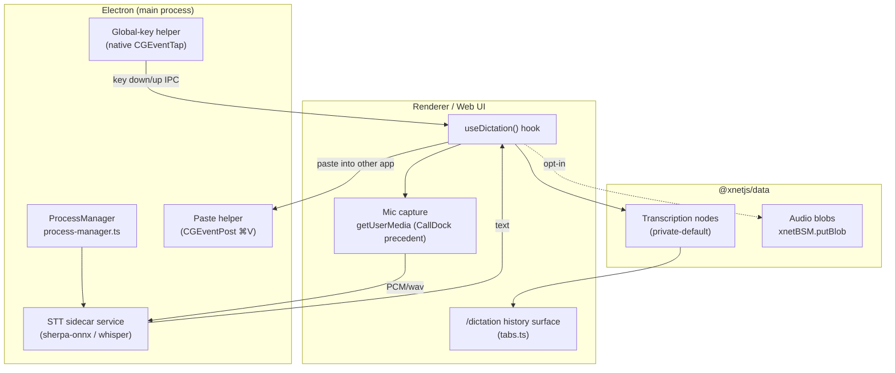
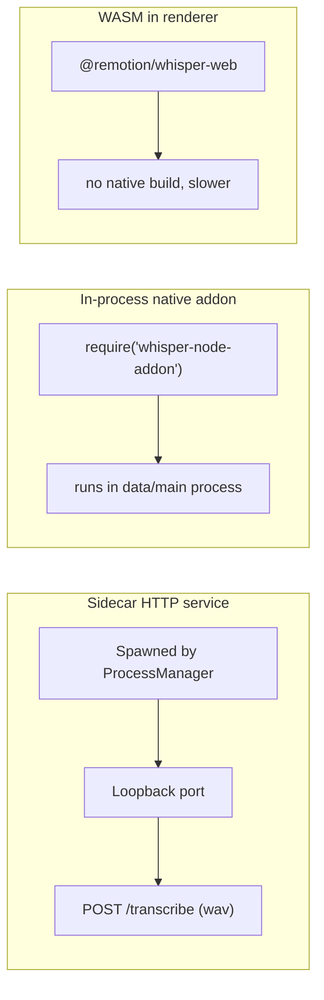
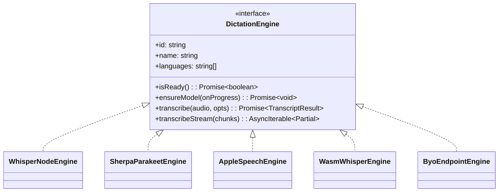
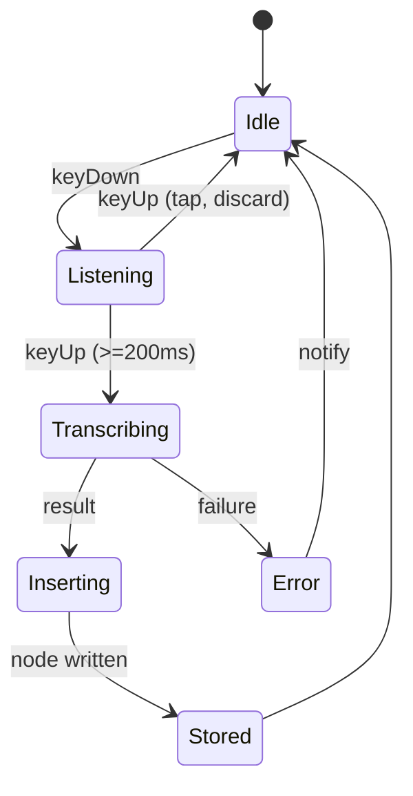
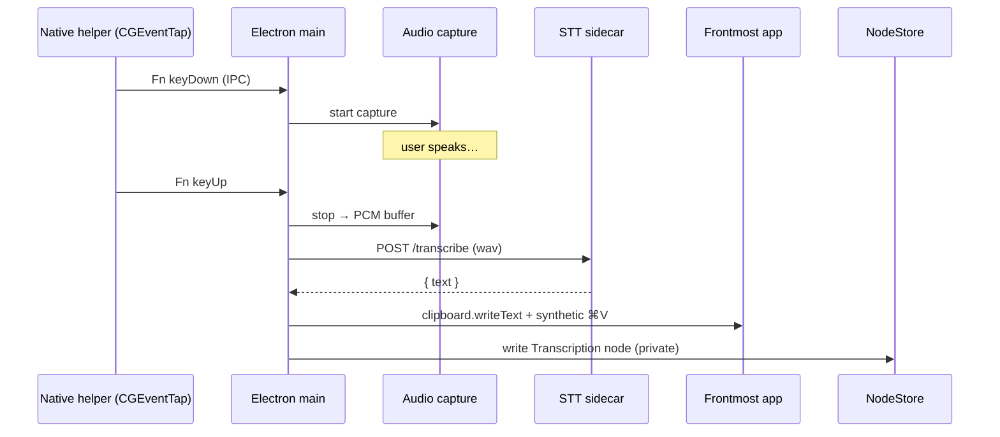

# On-Device Speech-to-Text Dictation (Push-to-Talk + Transcription History)

## Problem Statement

We want speech-to-text (STT) **built into xNet** rather than bolted on from the
outside. The desired experience, in the user's own words:

> "At least in the Electron and the iOS app, we could download a model like the
> NVIDIA open-source one — English-only, super fast, super accurate, free — and
> leverage it for STT… I have it installed through a tool called **VoiceInk**.
> I hold the **Fn** key, it transcribes, I release, and it pastes what I said
> into the text field. I love that workflow."

Three concrete asks fall out of that:

1. **In-app dictation** — talk into any xNet text field (page editor, chat
   composer, database cell, comment) instead of typing.
2. **System-wide push-to-talk** — hold a hotkey in *any* app (xNet running in
   the background), speak, release, and the text is pasted into the frontmost
   app. This is the VoiceInk / Wispr Flow / superwhisper workflow.
3. **Transcription history** — every dictation is stored with its full text (and
   optionally its audio) so the user can scroll back through time and re-copy an
   old transcription.

Plus two posture requirements that the rest of xNet already lives by:

- **Local-first / private by default.** Audio and transcripts are about as
  sensitive as data gets. Nothing should leave the device unless the user
  explicitly opts in. This mirrors `MetricSchema`'s `visibility: private`
  default (`packages/data/src/schema/schemas/metric.ts`).
- **Plug-and-play, provider-agnostic.** Just as `@xnetjs/billing` abstracts
  Stripe vs BTCPay behind a `PaymentProvider` port, STT should abstract NVIDIA
  Parakeet vs Whisper vs Apple's on-device model vs "bring your own" behind a
  single `DictationEngine` port.

## Executive Summary

- **The model the user means is NVIDIA Parakeet** (`parakeet-tdt-0.6b-v2`,
  English, **CC-BY-4.0**, **1.69 % WER** on LibriSpeech test-clean, ~630 MB as
  int8 ONNX). It is the most accurate open model on the Open ASR Leaderboard
  today, and **VoiceInk runs it via the FluidAudio CoreML SDK**. Parakeet does
  *not* require an NVIDIA GPU or a Python/NeMo stack at inference time — it runs
  on CPU / Apple Silicon through **sherpa-onnx** (ONNX Runtime) or **FluidAudio**
  (CoreML).
- **Recommended architecture: a new MIT, zero-dep `@xnetjs/dictation` package**
  defining a `DictationEngine` port + a hold-to-talk state machine + transcript
  history logic, exactly mirroring the `@xnetjs/billing` / `@xnetjs/ledger`
  pattern. Concrete engines plug in per platform.
- **Electron** already has every seam we need: `ProcessManager`
  (`packages/plugins/src/services/process-manager.ts`) spawns background
  services on a loopback HTTP port; `cloudflare-tunnel-manager.ts` is a working
  precedent for **downloading + SHA-256-verifying + spawning a native binary**.
  An STT engine is just another managed service.
- **The hard part is not the model — it's the OS plumbing.** Electron's
  `globalShortcut` **cannot capture the Fn key** (electron/electron#16714) and
  cannot paste into another app's text field. Both require a tiny **native macOS
  helper** (a `CGEventTap` listening for `NSEventModifierFlagFunction`, plus a
  synthetic ⌘V via `CGEventPost`) gated behind the **Accessibility permission**.
  This is precisely how VoiceInk and superwhisper do it, and it is why they are
  native Swift apps.
- **Transcriptions become first-class nodes** (`Transcription` schema,
  `private`-default visibility, FTS-indexed text, optional audio blob via the
  content-addressed blob store `xnetBSM.putBlob`). A `/dictation` workbench
  surface lists history — same pattern as `/finance`, `/crm`, `/experiments`
  (`apps/web/src/workbench/tabs.ts`).
- **iOS is a different beast.** A 600 MB model download on cellular is hostile.
  Recommend **Apple's on-device `SpeechAnalyzer`/`SpeechTranscriber`** (iOS 26+,
  shared model cache → *zero* per-app download) with `SFSpeechRecognizer` as the
  pre-26 fallback, exposed through an **Expo native module**. Parakeet via
  FluidAudio is the "best accuracy" upgrade path.
- **Recommended phasing:** Phase 1 = in-app dictation + history (Electron via
  whisper.cpp default, Parakeet opt-in; iOS via Apple Speech). Phase 2 =
  system-wide push-to-talk on macOS via the native helper. Phase 3 = Windows/
  Linux parity + "bring-your-own endpoint".

## Current State In The Repository

There is **no speech, audio-capture, or transcription code today** beyond
WebRTC call audio. A repo-wide grep for `speech|transcri|whisper|parakeet|
microphone|getUserMedia|MediaRecorder` returns only:

- `apps/web/src/comms/CallDock.tsx` — calls
  `navigator.mediaDevices.getUserMedia({ audio: true })` for WebRTC calls. This
  is our **only existing microphone-capture precedent** and confirms the web
  layer already requests mic permission cleanly (exploration 0167/0168 comms).
- `packages/social/src/importers/*` — "transcript" only as a noun for imported
  chat logs; irrelevant.

So this is greenfield. The good news is that every *seam* it needs already
exists:

### Electron: background-service + native-binary plumbing

| Seam | File | Why it matters for STT |
| --- | --- | --- |
| **Process manager** | `packages/plugins/src/services/process-manager.ts`, `ServiceDefinition` in `packages/plugins/src/services/types.ts` | Spawns a child process, assigns a loopback port, supervises lifecycle (`restartCount`, health). An STT sidecar (sherpa-onnx server, achetronic/parakeet) is exactly this. |
| **Service IPC** | `apps/electron/src/main/service-ipc.ts` | Already exposes `start/stop/restart/status/call`. `CALL` does `fetch("http://127.0.0.1:${port}${path}")` — the transcription request path drops straight in. |
| **Native-binary download + verify + spawn** | `apps/electron/src/main/cloudflare-tunnel-manager.ts` | Working precedent: `spawn()` an external binary, **SHA-256 verify** (`expectedSha256`), per-platform install hints (`getCloudflaredInstallHint`), parse stdout for a "ready" signal (`READY_LOG_RE`), `EventEmitter` health status. Model/engine download follows the same shape. |
| **Preload bridge** | `apps/electron/src/preload/index.ts` | `contextBridge.exposeInMainWorld` with an **allowlisted-channel** pattern (`ALLOWED_SERVICE_CHANNELS`, "SEC-02"). A new `xnetDictation` bridge slots in next to `xnetServices`, `xnetTunnel`, `xnetSocialImport`. |
| **App menu / accelerators** | `apps/electron/src/main/menu.ts` | Today only `CmdOrCtrl+N`, `CmdOrCtrl+Shift+D` — sends IPC to the renderer. There is **no `globalShortcut` registration anywhere yet**, so the global-hotkey work is net-new. |
| **Deep-link / single-instance** | `apps/electron/src/main/index.ts` | `app.requestSingleInstanceLock()`, `xnet://` protocol, `titleBarStyle: 'hiddenInset'`. Confirms the app is already structured for "stays resident / one instance" — a prerequisite for background push-to-talk. |
| **Content-addressed blob store** | `xnetBSM.putBlob / getBlob / hasBlob` in `apps/electron/src/preload/index.ts` | Audio recordings (if the user opts to keep them) are stored as CID-addressed blobs, same as canvas media. |

### Data layer: how a Transcription node would be modeled

- `defineSchema()` in `packages/data/src/schema/define.ts`; property builders
  `text / number / select / json / relation / file` in
  `packages/data/src/schema/properties`.
- **`MediaAssetSchema`** (`packages/data/src/schema/schemas/media-asset.ts`)
  shows the `file({ required: true })` + `kind: 'audio'` pattern for referencing
  a stored audio blob.
- **`MetricSchema`** (`packages/data/src/schema/schemas/metric.ts`) is the model
  citizen for a *sensitive* node type: `visibility` defaults to `private`, plus
  the standard `folder` / `tags` / `space` / `sortKey` relations every domain
  node carries (explorations 0169, 0179, 0180).
- New schemas register in `packages/data/src/schema/schemas/index.ts`.
- FTS: name/note text is indexed for search (experiments journal precedent,
  exploration 0180) — transcript text would be FTS-indexed so history is
  searchable.

### Workbench surface registration

`apps/web/src/workbench/tabs.ts` is the single registry of surface kinds.
`experiments`, `crm`, `finance` are **singleton** surfaces with a fixed route
(`/experiments`, `/crm`, `/finance`) and a Lucide icon. A `/dictation` (or
`/transcriptions`) history surface registers identically; routes live in
`apps/web/src/routes/*.tsx`.

### iOS / Expo

- The Expo app is a **WebView wrapper** around the React UI
  (`apps/expo/src/components/WebViewEditor.tsx`, `XNetProvider`,
  `apps/expo/src/screens/*`). There is **no native module** today.
- Per memory `0186-multi-framework-and-deployment-targets`, expo currently ships
  a duplicated provider and a fake `did:key`, and `NativeBridge.acquireDoc`
  throws — i.e. the native bridge story is thin. A STT native module would be
  among the first real Swift bridges in the app.

### Plugin substrate (relevant but optional)

Exploration 0189 (`packages/plugins/src/feature-module.ts`) introduced
`FeatureModule` — a two-sided client+hub plugin with declared `ModuleCapabilities`.
Dictation is a natural FeatureModule (it contributes a surface, a settings
panel, schemas, and a background service), but it does **not** need a hub side,
so this is a "nice alignment," not a dependency.



## External Research

### NVIDIA Parakeet — the model the user is describing

| Model | License | Lang | WER (LS clean / Open-ASR avg) | Size (int8 ONNX) |
| --- | --- | --- | --- | --- |
| **parakeet-tdt-0.6b-v2** | CC-BY-4.0 | English | **1.69 % / 6.05 %** | ~630 MB |
| parakeet-tdt-0.6b-v3 | CC-BY-4.0 | 25 EU langs | ~2 % / 6.34 % | ~640 MB |

- FastConformer-TDT (Token-and-Duration Transducer) architecture, 600 M params,
  trained on ~120 k h of English. RTFx **3,386** on a GPU (batched) — "an hour
  of audio in ~1 second." On CPU/Apple Silicon RTFx is far lower (~20–50× on an
  M2), but for **push-to-talk clips of 5–30 s that is still real-time-feeling.**
- **CC-BY-4.0 means commercial use is fine *with attribution*** — we must
  surface a credit line. (Whisper is MIT — no attribution burden.)
- It does **not** need CUDA / NeMo at inference. Pre-exported int8 ONNX weights
  exist on HuggingFace; runtimes below load them directly.

### How to run Parakeet *without* Python (the three real paths)

1. **sherpa-onnx** (`k2-fsa/sherpa-onnx`) — C++ + ONNX Runtime, **explicitly
   supports Parakeet** (pre-built `sherpa-onnx-nemo-parakeet-tdt-0.6b-*` model
   packs). Has an **npm native addon** (`sherpa-onnx-node`, ~v1.13) *and* an iOS
   XCFramework / community SPM (`willwade/sherpa-onnx-spm`). **One model format,
   Electron + iOS, no Python.** This is the most "same codebase everywhere" path.
2. **FluidAudio** (`FluidInference/FluidAudio`, **Apache-2.0**) — Swift **CoreML**
   SDK, Parakeet v2/v3 as CoreML, ANE-accelerated (~110× RTF on M4 Pro), macOS
   14+/iOS 17+. **This is what VoiceInk uses for its Parakeet engine.** Best Apple
   accuracy, but Apple-only and needs a Swift bridge.
3. **achetronic/parakeet** (MIT) — a Go server exposing an **OpenAI-Whisper-
   compatible HTTP API**, CPU-only ONNX. Ship the prebuilt binary as an Electron
   sidecar and `fetch('http://127.0.0.1:5092/v1/audio/transcriptions')`. Zero
   ONNX integration in Node itself.

### Whisper family (the pragmatic default)

| Model | License | WER clean | Size (Q5) | Electron pkg | iOS pkg |
| --- | --- | --- | --- | --- | --- |
| whisper large-v3-turbo | MIT | ~2.1 % | ~800 MB | `whisper-node-addon` | `whisper.rn` |
| whisper small.en | MIT | ~4.2 % | 182 MB | `whisper-node-addon` | `whisper.rn` |
| whisper base.en | MIT | ~7 % | 57 MB | (bundle-able) | `whisper.rn` |

- **`whisper-node-addon`** ships **pre-built `.node` binaries** for mac (x64/
  arm64), Windows, Linux — zero-config for Electron, **CoreML acceleration on
  macOS automatically**. This is the lowest-friction cross-platform default.
- **`whisper.rn`** is the React Native binding (requires Expo *prebuild*, not
  Expo Go), CoreML on iOS ANE. `@remotion/whisper-web` exists for a WASM
  fallback in the renderer.
- Whisper is **MIT** (no attribution), slightly less accurate than Parakeet on
  English but with a far deeper JS/mobile ecosystem **today**.

### Apple on-device speech (the iOS answer)

- **`SpeechAnalyzer` + `SpeechTranscriber`** (WWDC 2025, **iOS 26 / macOS 26**):
  fully on-device, free, ~2× faster than Whisper-turbo, **shared model cache** so
  if any app already downloaded the model there is **no download at all** — this
  single fact dissolves the "600 MB on cellular" problem on modern iOS. ~8 % WER
  (good, not Parakeet-level). No Expo bridge exists yet → we'd write one.
- **`SFSpeechRecognizer`** (iOS 10+/macOS 10.15+): the pre-26 fallback, on-device
  for many languages since iOS 13.

### The OS plumbing (the genuinely hard part)

- **Fn key is NOT capturable by Electron `globalShortcut`** (open issue
  electron/electron#16714); CapsLock excluded too; `globalShortcut` can also
  break on non-QWERTY layouts on macOS.
- **Capturing Fn requires a native event tap.** A `CGEventTap` at
  `kCGHIDEventTap` (or `NSEvent.addGlobalMonitorForEventsMatchingMask`) checks
  `NSEventModifierFlagFunction`, gated behind the **Accessibility permission**
  (`AXIsProcessTrusted()`; `node-mac-permissions` prompts for it). Alternatively,
  **double-tap Globe/Fn** hooks macOS's own dictation activation. This is exactly
  why VoiceInk/superwhisper are native Swift apps.
- **Pasting into the frontmost app** = `clipboard.writeText(text)` then a
  synthetic ⌘V via `CGEventPost` (also Accessibility-gated). **Not possible from
  a Mac App Store sandboxed build** — distribution implication.
- **`uiohook-napi`** is a Node global-hook option for *ordinary* keys/modifiers
  (good for a chord fallback), but Fn specifically still needs the native tap.

### VoiceInk (the user's reference app)

`Beingpax/VoiceInk` — **GPL-3**, native Swift, macOS 14+. Engines: **whisper.cpp**
(all Whisper sizes) + **FluidAudio** (Parakeet). Global shortcut via Sindre
Sorhus's `KeyboardShortcuts` SPM (default: double-tap Fn/Globe, with Toggle /
Push-to-Talk / Hybrid modes). Text insertion via `SelectedTextKit` + clipboard +
synthetic ⌘V. **GPL-3 means we cannot copy its code into our MIT/FSL tree** — we
re-implement the *pattern*, we don't fork it.

### Model-download UX in shipping apps

First-run lazy download with a progress bar into an app cache dir; a **tier
picker** ("Fast 57 MB / Accurate 800 MB / Best — Parakeet 640 MB"); tiny models
sometimes bundled. Parakeet sits in the same size tier as Whisper-turbo, so
"more accurate, same download" is an honest framing.

## Key Findings

1. **The accuracy/portability tradeoff is real but bounded.** Parakeet wins on
   English WER; Whisper wins on integration breadth *today*. The
   `DictationEngine` port lets us **ship Whisper first and add Parakeet without
   touching callers** — same move as billing's `PaymentProvider`.
2. **xNet's Electron service infrastructure already fits a STT sidecar like a
   glove.** `ProcessManager` + the `cloudflared` download/verify/spawn precedent
   mean the *engine-hosting* problem is mostly solved; we are wiring, not
   inventing.
3. **The differentiator vs VoiceInk is the data model, not the transcription.**
   xNet can store every transcription as a **private-by-default, FTS-searchable,
   syncable node** with optional audio, folders, tags, and links to the doc it
   was dictated into. "Scroll back through time and re-copy" is a query over
   nodes — something a standalone dictation tool fundamentally cannot offer.
4. **System-wide push-to-talk forces a native helper and an Accessibility
   prompt.** This is the single biggest scope/effort line, is **macOS-first**,
   and is **incompatible with MAS sandboxing**. In-app dictation has none of
   these constraints.
5. **iOS should not download Parakeet by default.** Apple's on-device
   `SpeechAnalyzer` (26+) with shared model cache is the right default; Whisper/
   Parakeet are opt-in "power" engines. This keeps the mobile install painless.
6. **Privacy is the headline feature, not a footnote.** Everything on-device,
   `private` default, audio retention off by default, with a visible "100 %
   local, nothing uploaded" assurance. This is consistent with the whole repo's
   local-first ethos (explorations 0188 local-first load, 0180 private metrics).

## Options And Tradeoffs

### A. Engine — which STT to ship

| Option | Accuracy | Cross-platform | Integration effort | License note |
| --- | --- | --- | --- | --- |
| **Whisper via `whisper-node-addon` (Electron) + Apple Speech (iOS)** | High | Excellent | **Low** | MIT, no attribution |
| **Parakeet via sherpa-onnx (both)** | **Highest (EN)** | Good (npm + iOS XCFramework) | Medium | CC-BY-4.0 attribution |
| **Parakeet via achetronic Go sidecar (Electron)** | Highest (EN) | Electron-only | Low–Med | MIT code, CC-BY model |
| **Parakeet via FluidAudio (Apple)** | Highest (EN, ANE) | Apple-only | Medium (Swift bridge) | Apache-2.0 |
| **OS dictation only (SFSpeech / SpeechAnalyzer / Win)** | Medium | Per-OS | Low | Free, no download |

**Lean:** Whisper default (lowest friction, MIT), **Parakeet as an opt-in
"Best (English)" engine** behind the same port. On iOS, Apple Speech default.

### B. Where the engine runs (Electron)



- **Sidecar (recommended):** isolates native deps from the app binary, reuses
  `ProcessManager` + the `cloudflared` download/verify pattern, crash-isolated,
  language-agnostic (could even be the Go Parakeet server). Cost: IPC/HTTP hop,
  manage a child process.
- **In-process native addon:** simplest call path, but couples a native `.node`
  to our packaging/notarization and can crash the host process.
- **WASM in renderer:** zero native build, but slowest and memory-heavy; good
  only as a no-install fallback / web-app story.

### C. The global hotkey (macOS)

| Option | Captures Fn? | Permission | Works backgrounded | Notes |
| --- | --- | --- | --- | --- |
| Electron `globalShortcut` | **No** | none | yes | Fine for a chord (⌘⇧Space), not Fn |
| `uiohook-napi` | partial | none/Accessibility | yes | Ordinary keys/modifiers |
| **Native `CGEventTap` helper** | **Yes** | Accessibility | yes | The VoiceInk path; most effort |
| Double-tap Globe (system dictation hook) | yes | none | yes | Hooks macOS dictation, less control |

**Lean:** ship a **chord default via `globalShortcut`** (works everywhere, zero
permission) and offer **Fn / hold-to-talk via an opt-in native helper** that
requests Accessibility. Be honest in the UI that Fn requires the permission.

### D. Storage of transcriptions

- **Text-only node (default):** small, syncable, FTS-searchable, private.
- **Text + audio blob (opt-in):** lets the user replay/re-transcribe; audio
  stored as a CID blob via `xnetBSM.putBlob`, never synced unless shared.
- **Ephemeral (no history):** for the privacy-maximalist; transcribe → paste →
  forget.

**Lean:** text-history **on by default**, audio retention **off by default**,
both toggottleable, with a retention cap (e.g. keep last N / auto-prune).

### E. iOS engine

- **Apple `SpeechAnalyzer` (26+) + `SFSpeechRecognizer` fallback (recommended):**
  no download, free, native quality, but needs an Expo native module and 26+ for
  the best path.
- **`whisper.rn`:** ships today, CoreML, but Expo *prebuild* + a real model
  download.
- **sherpa-onnx Parakeet on iOS:** best accuracy, most build friction.

## Recommendation

Ship STT as a **provider-agnostic, local-first capability** in three phases.

### New package: `@xnetjs/dictation` (MIT, zero-dep)

Mirror `@xnetjs/billing` / `@xnetjs/ledger`: a pure-logic package that owns the
**port, types, the hold-to-talk state machine, and history/store helpers**, with
**no platform code**. Platform adapters (Electron sidecar, Apple native, WASM)
implement the port.



### Phase 1 — In-app dictation + transcription history (no special permissions)

- A **mic button** in xNet text fields (page editor, chat composer, DB cell,
  comment). Press/hold to record (reusing the `getUserMedia` pattern from
  `CallDock.tsx`), release to transcribe, insert at the caret.
- **Electron engine:** `whisper-node-addon` as the default, run as a
  `ProcessManager` sidecar; model downloaded + SHA-256-verified on first use via
  the `cloudflare-tunnel-manager` download pattern. **Parakeet (sherpa-onnx)**
  offered as an opt-in "Best (English)" engine.
- **iOS engine:** Apple `SpeechAnalyzer`/`SFSpeechRecognizer` via a new Expo
  native module (no model download).
- **`Transcription` schema** (private default), FTS-indexed, stored on every
  dictation; a **`/dictation` history surface** registered in `tabs.ts`.
- **Settings panel** (shared settings kit from exploration 0179): engine picker,
  model download/manage, language, history retention, audio-retention toggle.

### Phase 2 — System-wide push-to-talk (macOS first)

- A **signed native helper** installing a `CGEventTap` for Fn / a configurable
  hold-key, plus a `CGEventPost` ⌘V paste-into-frontmost-app, both behind an
  **Accessibility permission** flow (`node-mac-permissions`).
- A clean **onboarding** that explains the permission and offers a no-permission
  **chord fallback** (`globalShortcut` ⌘⇧Space).
- xNet "runs in the background" (menu-bar/tray presence) so push-to-talk works in
  any app — the single-instance lock already exists in `index.ts`.

### Phase 3 — Parity + BYO

- **Windows** (`SendInput` paste, `RegisterHotKey`) and **Linux** (X11/Wayland —
  document the Wayland limitations) global-key + paste adapters.
- **"Bring your own"**: a `ByoEndpointEngine` pointing at any local
  OpenAI-`/v1/audio/transcriptions`-compatible server — this is how a user who
  *already runs* a Parakeet/Whisper server (or VoiceInk-adjacent tooling) reuses
  it, satisfying the "use their existing one" ask without us shelling into
  another app.

### Why this shape

It matches the repo's grain (ports + adapters like billing/ledger; sidecar like
the tunnel; private-default nodes like metrics; surface registration like
finance/crm), front-loads the **zero-permission, cross-platform** value
(in-app dictation + searchable history — the part standalone tools can't do),
and **quarantines the OS-specific, permission-heavy, macOS-only** work into a
later, independently-shippable phase.

## Example Code

### The port and a result type (`@xnetjs/dictation`)

```ts
// packages/dictation/src/types.ts
export interface TranscriptResult {
  text: string
  language?: string
  durationMs: number
  /** Word/segment timings when the engine provides them. */
  segments?: { text: string; startMs: number; endMs: number }[]
  engineId: string
  modelId: string
}

export interface DictationEngine {
  readonly id: string
  readonly name: string
  readonly languages: string[]
  /** Is the model present + loadable right now? */
  isReady(): Promise<boolean>
  /** Download/verify the model; reports 0..1 progress. */
  ensureModel(onProgress?: (fraction: number) => void): Promise<void>
  transcribe(audio: Float32Array | Uint8Array, opts?: { language?: string }): Promise<TranscriptResult>
}
```

### Hold-to-talk state machine (pure, unit-testable — lives in the package)



### Electron: register the STT sidecar via the existing ProcessManager

```ts
// shape mirrors ServiceDefinition (packages/plugins/src/services/types.ts)
const sttService: ServiceDefinition = {
  id: 'xnet.dictation.parakeet',
  name: 'Parakeet STT (sherpa-onnx)',
  process: { command: parakeetBinPath, args: ['--port', '0', '--model', modelDir] },
  lifecycle: { autoRestart: true, healthCheckPath: '/healthz' },
  communication: { protocol: 'http' }
}
await manager.start(sttService) // → loopback port; renderer calls SERVICE_IPC_CHANNELS.CALL
```

### Push-to-talk → paste sequence (Phase 2)



### `Transcription` schema (modeled on Metric + MediaAsset)

```ts
// packages/data/src/schema/schemas/transcription.ts
export const TranscriptionSchema = defineSchema({
  name: 'Transcription',
  namespace: 'xnet://xnet.fyi/',
  properties: {
    text: text({ required: true }),                       // FTS-indexed
    language: text({ maxLength: 16 }),
    engineId: text({ maxLength: 120 }),                   // "whisper" | "parakeet" | "apple"
    modelId: text({ maxLength: 200 }),
    durationMs: number({ integer: true, min: 0 }),
    source: select({ options: [
      { id: 'inApp', name: 'In-app field' },
      { id: 'pushToTalk', name: 'Global push-to-talk' }
    ] as const, default: 'inApp' }),
    audio: file({}),                                      // optional blob; off by default
    pastedInto: text({ maxLength: 300 }),                 // app/field it was inserted into
    folder: relation({ target: 'xnet://xnet.fyi/Folder@1.0.0' as const }),
    tags: relation({ target: 'xnet://xnet.fyi/Tag@1.0.0' as const, multiple: true }),
    space: relation({ target: 'xnet://xnet.fyi/Space@1.0.0' as const }),
    sortKey: text({ maxLength: 500 }),
    visibility: select({ options: [
      { id: 'inherit', name: 'Inherit', color: 'gray' },
      { id: 'private', name: 'Private', color: 'gray' },
      { id: 'unlisted', name: 'Unlisted', color: 'yellow' },
      { id: 'public', name: 'Public', color: 'green' }
    ] as const, default: 'private' })                     // sensitive → private default
  }
})
```

## Risks And Open Questions

- **Fn capture reliability.** Fn is intercepted by the Apple keyboard driver
  before user-space taps on many configs; "hold Fn" may be flaky vs "double-tap
  Globe." Mitigation: default to a chord, treat Fn as opt-in/advanced, test
  across keyboards.
- **Accessibility permission friction + MAS sandbox.** Push-to-talk paste needs
  Accessibility and **cannot ship in a sandboxed Mac App Store build**. Decide
  distribution (Developer-ID notarized DMG vs MAS) — likely notarized DMG for the
  power feature.
- **Native packaging / notarization.** A signed helper + native addons/sidecar
  binaries must be codesigned and notarized; `electron-builder.json5` and the
  self-signed script (`apps/electron/scripts/build-macos-self-signed.sh`) need
  updating. New native deps risk the CI "WORKSPACE_PKG_NOT_FOUND" / Dockerfile-
  closure gotchas from prior explorations (0187/0189) — though STT is client-only,
  so the **hub Dockerfile is untouched**.
- **CC-BY-4.0 attribution for Parakeet.** Must show a credit line; keep Whisper
  (MIT) as the no-attribution default. Confirm we're comfortable redistributing
  the model weights or only *downloading* them at runtime (prefer download).
- **iOS model size + iOS 26 floor.** Apple `SpeechAnalyzer` is 26+; pre-26 users
  fall to `SFSpeechRecognizer` (lower quality) or a Whisper download. Quantify
  our minimum iOS target.
- **Latency on CPU for long dictation.** Parakeet/Whisper on CPU are fine for
  short clips but degrade for minutes-long monologues; consider chunked/streaming
  transcription and a max-duration guard.
- **Battery/thermals of a resident listener.** Push-to-talk only records on
  key-hold (cheap); avoid any always-on VAD by default.
- **Privacy of stored audio.** Even private nodes sync if a Space is shared.
  Audio retention off by default; make the sync/visibility implications explicit
  in the UI.
- **Windows/Linux paste + hotkey parity.** Different APIs (Win `SendInput`,
  Linux X11 vs Wayland — Wayland blocks synthetic input in many compositors).
  Scope Phase 3 honestly; Wayland may be "in-app only."
- **Open question:** do we *also* want streaming/live captions (show text as you
  speak) or only finalize-on-release? Finalize-on-release matches the user's
  VoiceInk workflow and is simpler.
- **Open question:** "use their existing install" — directly driving VoiceInk/
  another app is brittle (GPL, no stable API). Is the `ByoEndpointEngine`
  (point at a local OpenAI-compatible STT server) an acceptable interpretation?

## Implementation Checklist

- [ ] Create **`@xnetjs/dictation`** (MIT, zero-dep): `DictationEngine` port,
      `TranscriptResult`/options types, hold-to-talk **state machine**, and
      history/store helpers (retention/prune). Unit-test the state machine and
      helpers (mirror `@xnetjs/billing` layout). Run `pnpm install` + commit the
      lockfile (new workspace package — CI frozen-install gotcha).
- [ ] Add **`TranscriptionSchema`** in
      `packages/data/src/schema/schemas/transcription.ts`; export from the schema
      barrel `index.ts`; FTS-index `text`; `visibility` default `private`.
- [ ] **Web/renderer:** `useDictation()` hook + a mic button component for text
      fields; reuse the `getUserMedia` pattern from `apps/web/src/comms/CallDock.tsx`.
- [ ] **Electron engine (sidecar):** wrap `whisper-node-addon` (default) as a
      `ServiceDefinition` started by `ProcessManager`; add a model
      **download + SHA-256-verify + spawn** module modeled on
      `apps/electron/src/main/cloudflare-tunnel-manager.ts`.
- [ ] Add a **`xnetDictation` preload bridge** (`apps/electron/src/preload/index.ts`)
      with an allowlisted-channel set (follow the "SEC-02" `ALLOWED_SERVICE_CHANNELS`
      pattern); wire main-process IPC.
- [ ] **Parakeet opt-in engine** via `sherpa-onnx-node` (or the achetronic Go
      sidecar) behind the same port; surface CC-BY-4.0 attribution.
- [ ] **iOS Expo native module** wrapping Apple `SpeechAnalyzer` (26+) with
      `SFSpeechRecognizer` fallback; expose through the WebView bridge.
- [ ] **`/dictation` history surface:** register the surface kind in
      `apps/web/src/workbench/tabs.ts`, add a route in `apps/web/src/routes/`,
      list/search/re-copy transcriptions (NodePeek "All fields" reuse per 0190).
- [ ] **Settings panel** (shared kit, exploration 0179): engine picker, model
      manager (download/size/delete), language, hotkey config, history retention,
      audio-retention toggle, privacy assurance copy.
- [ ] **Phase 2 — native global-key helper:** `CGEventTap` for Fn / configurable
      hold-key + `CGEventPost` ⌘V paste; Accessibility permission flow via
      `node-mac-permissions`; `globalShortcut` chord fallback; menu-bar/tray
      presence for background operation.
- [ ] **Codesigning/notarization:** update `electron-builder.json5` +
      `build/entitlements.mac.plist` for the helper and native binaries; verify
      notarized DMG (decide MAS vs Developer-ID given the sandbox limitation).
- [ ] **Phase 3:** Windows (`SendInput`/`RegisterHotKey`) + Linux (X11; document
      Wayland limits) adapters; `ByoEndpointEngine` (local OpenAI-compatible STT).

## Validation Checklist

- [ ] `@xnetjs/dictation` unit tests pass: state-machine transitions
      (tap-vs-hold, error, discard) and retention/prune logic; CRAP/Fallow gate
      green.
- [ ] **In-app dictation E2E (Electron):** hold mic button, speak a known
      phrase, release → correct text inserted at the caret; a `Transcription`
      node is written with `visibility: private` and FTS-searchable text.
- [ ] **Model lifecycle:** first-run download shows progress, SHA-256 verifies,
      a corrupted/tampered model is rejected; engine reports `isReady()` correctly
      after download and after deletion.
- [ ] **Engine swap:** switching Whisper ↔ Parakeet in Settings changes
      `engineId`/`modelId` on new transcriptions with no caller changes; Parakeet
      attribution is visible.
- [ ] **Privacy invariants:** with audio-retention off, no `audio` blob is
      written; nothing leaves the device (network panel shows no STT upload);
      private nodes do not appear on public/feed surfaces.
- [ ] **History surface:** `/dictation` lists transcriptions newest-first,
      search finds by text, "copy" re-copies an old transcription to the clipboard.
- [ ] **iOS:** dictation works on a 26+ device with **no model download**
      (shared cache) and on a pre-26 device via `SFSpeechRecognizer`; transcript
      syncs as a private node.
- [ ] **Phase 2 push-to-talk:** with Accessibility granted, holding the hotkey in
      a *non-xNet* app transcribes and pastes into that app; revoking the
      permission degrades gracefully to the in-app mic button; chord fallback
      works with no permission.
- [ ] **Cross-platform smoke:** Whisper sidecar starts and transcribes on macOS,
      Windows, and Linux; failures are surfaced via service `lastError`, not silent.
- [ ] Latency budget met: a 10 s English clip transcribes end-to-end in a
      "feels-instant" window on a typical laptop (record target on first run).

## References

**Codebase**
- `apps/electron/src/main/index.ts` — app lifecycle, single-instance, `xnet://` deep links
- `apps/electron/src/main/menu.ts` — accelerators (no `globalShortcut` yet)
- `apps/electron/src/main/service-ipc.ts` — `ProcessManager` IPC (`start/stop/call`)
- `apps/electron/src/main/cloudflare-tunnel-manager.ts` — download + SHA-256-verify + spawn native binary precedent
- `apps/electron/src/preload/index.ts` — `contextBridge` + allowlisted-channel pattern; `xnetBSM.putBlob` blob store
- `packages/plugins/src/services/process-manager.ts`, `packages/plugins/src/services/types.ts` — `ServiceDefinition`
- `packages/plugins/src/feature-module.ts` — two-sided plugin substrate (0189)
- `packages/data/src/schema/define.ts`, `packages/data/src/schema/properties` — schema builders
- `packages/data/src/schema/schemas/metric.ts` — private-default sensitive node model
- `packages/data/src/schema/schemas/media-asset.ts` — audio file/blob reference
- `packages/data/src/schema/schemas/index.ts` — schema registry barrel
- `apps/web/src/workbench/tabs.ts`, `apps/web/src/routes/*.tsx` — surface registration
- `apps/web/src/comms/CallDock.tsx` — `getUserMedia` mic-capture precedent
- `apps/expo/src/components/WebViewEditor.tsx`, `apps/expo/src/context/XNetProvider.tsx` — WebView wrapper (no native module yet)

**Models**
- NVIDIA Parakeet TDT 0.6B v2 — https://huggingface.co/nvidia/parakeet-tdt-0.6b-v2
- NVIDIA Parakeet TDT 0.6B v3 (25 langs) — https://huggingface.co/nvidia/parakeet-tdt-0.6b-v3
- Canary-1B-v2 / Parakeet-v3 paper — https://arxiv.org/html/2509.14128v1
- Open ASR Leaderboard paper — https://arxiv.org/pdf/2510.06961

**Runtimes / SDKs**
- sherpa-onnx — https://github.com/k2-fsa/sherpa-onnx ; npm `sherpa-onnx-node` ; Parakeet models: https://k2-fsa.github.io/sherpa/onnx/pretrained_models/offline-transducer/nemo-transducer-models.html ; iOS SPM https://swiftpackageindex.com/willwade/sherpa-onnx-spm
- FluidAudio (Parakeet CoreML, used by VoiceInk) — https://github.com/FluidInference/FluidAudio ; CoreML weights https://huggingface.co/FluidInference/parakeet-tdt-0.6b-v3-coreml
- achetronic/parakeet (Go, OpenAI-compatible, CPU ONNX) — https://github.com/achetronic/parakeet
- whisper.cpp — https://github.com/ggml-org/whisper.cpp ; `whisper-node-addon` https://www.npmjs.com/package/whisper-node-addon ; `whisper.rn` https://www.npmjs.com/package/whisper.rn ; `@remotion/whisper-web`
- whisper-kit-expo — https://github.com/seb-sep/whisper-kit-expo

**Apple Speech**
- WWDC25 `SpeechAnalyzer` — https://developer.apple.com/videos/play/wwdc2025/277/
- Argmax on Apple SpeechAnalyzer accuracy — https://www.argmaxinc.com/blog/apple-and-argmax

**OS plumbing**
- Electron Fn-key limitation — https://github.com/electron/electron/issues/16714
- `node-mac-permissions` — https://github.com/codebytere/node-mac-permissions
- `uiohook-napi` global hook — referenced via https://github.com/hcfyapp/uiohook-shoutcut

**Reference app**
- VoiceInk (GPL-3, Swift, whisper.cpp + FluidAudio) — https://github.com/Beingpax/VoiceInk
