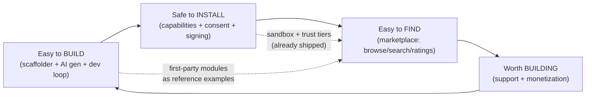
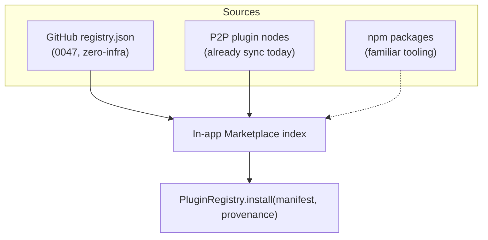
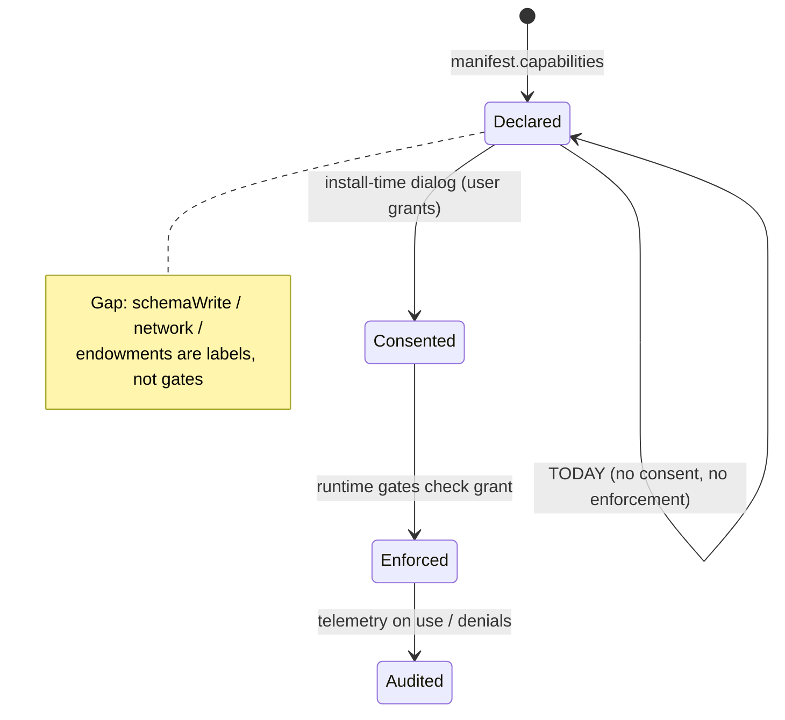
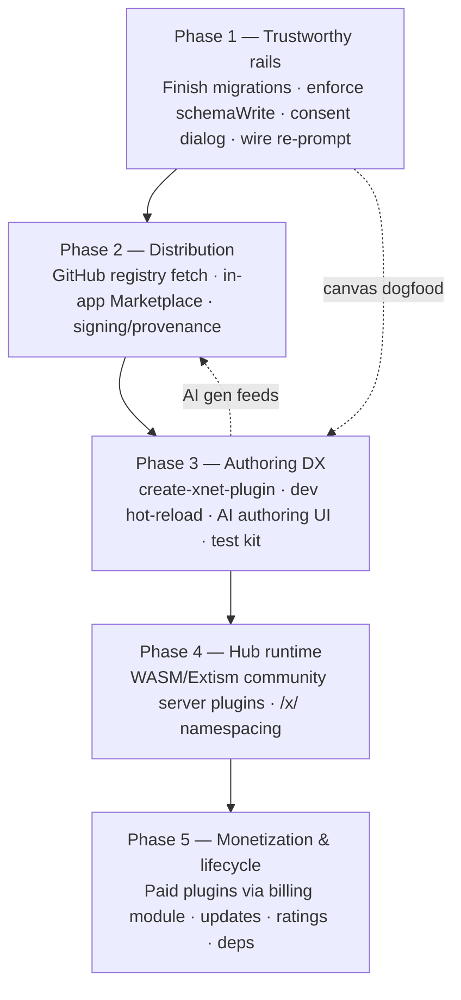
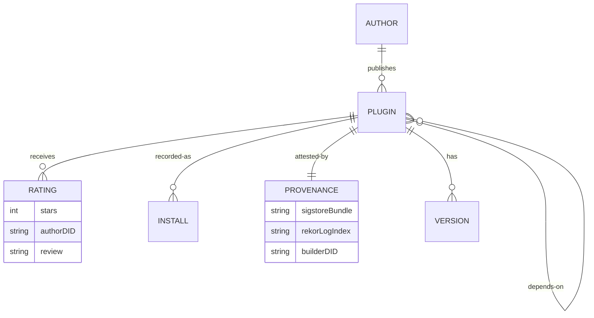

# A Thriving Plugin Ecosystem: Marketplace, Authoring DX, Trust, And Monetization

## Problem Statement

[0189](./0189_[_]_EVERYTHING_AS_PLUGINS_FEATURE_MODULE_PLATFORM.md) built the
**chassis**: a uniform `FeatureModule` manifest, a hub feature registry, a
capability/secret broker, and an `importers` contribution point — the
abstractions that let billing, GitHub, importers, and (eventually) docs/canvas/
tasks all be "the same kind of thing." That shipped as PR #109.

But a chassis is not an ecosystem. The user's ask now is the rest of the car:

> "Continue making xNet a really powerful plug-in ecosystem where both the
> internal and third-party plugins are **readily available**, **highly
> supported**, **easy to build**, have a **good marketplace**, are **secure**,
> and all the other features that make xNet a really powerful work surface for
> you to customize."

The honest current state, from a fresh audit of the repo, is a **production-grade
plugin _runtime_ wrapped in a near-empty _ecosystem_**:

- **Runtime** (✅ real): `PluginRegistry` install/activate/uninstall lifecycle,
  P2P-syncable plugin nodes, a three-tier execution sandbox (host / SES-in-Worker
  / iframe), provenance-derived trust tiers, and a hub secret broker.
- **Distribution** (❌ ~0%): no remote registry, no browse/search, no ratings —
  the _only_ install path for a non-bundled plugin is **pasting raw JSON** into a
  dialog (`apps/web/src/components/PluginManager.tsx`).
- **Authoring DX** (⚠️ partial): a 738-line docs guide and `defineExtension`/
  `defineFeatureModule` type helpers exist, but there is **no scaffolder, no
  local dev / hot-reload, no test harness**. Meanwhile a genuinely differentiated
  asset — **AI plugin generation** (`packages/plugins/src/ai/generator.ts`) —
  exists with multi-provider routing but **has no UI**.
- **Trust** (⚠️ sandbox-centric, not capability-centric): execution isolation is
  hardened, but `schemaWrite`/`schemaRead`/`network`/`endowments` in
  `ModuleCapabilities` are **declared-but-never-enforced**, there is **no
  capability-consent dialog for plugins** (only for dashboard widgets), and there
  is **no code signing / provenance** at all.
- **Monetization & lifecycle** (❌ absent): no paid plugins, no updates, no
  compatibility gating beyond a `xnetVersion` string, no inter-plugin deps.

This exploration answers: **what is the highest-leverage sequence of work that
turns the existing chassis into a flywheel — where plugins are easy to make
(ideally AI-authored), safe to install (capability-scoped + signed), easy to
find (a real marketplace), and worth building (supported + monetizable)?**

## Executive Summary

1. **xNet is unusually well-positioned to leapfrog, not catch up.** Three assets
   most platforms lack are already in-tree: (a) a hardened **sandbox stack**
   (`packages/dashboard/src/sandbox`, `packages/labs`), (b) **AI plugin
   generation** with a provider router (`packages/plugins/src/ai/*`), and (c) a
   **billing engine** (`packages/billing`) that can power plugin monetization.
   The differentiated vision is **"describe it → AI generates a capability-scoped,
   sandboxed plugin → publish to a P2P/GitHub marketplace → optionally sell it."**
   No incumbent fuses all four.

2. **The marketplace is a storefront with no shelves.**
   [0047](./0047_[_]_PLUGIN_MARKETPLACE.md) designed a zero-infra,
   GitHub-backed registry; none of the _install path_ was built. The fastest
   win that makes plugins "readily available" is wiring a remote
   `registry.json` → in-app **Browse/Search/Install** on top of the existing
   `PluginRegistry`.

3. **Security must move from sandbox-centric to capability-centric.** The
   sandbox tiers are excellent, but `ModuleCapabilities` is currently
   _documentation_. Until `schemaWrite` is enforced at mutation time, a
   consent dialog is shown at install, and packages carry **provenance/signature**
   (the 2025 VS Code/Open VSX malware wave — GlassWorm, OctoRAT, ransomware — is
   the cautionary tale), "marketplace" means "install arbitrary code." This is
   the gate on opening to third parties.

4. **The hub is still the frontier.** 0189 deferred community _server_ code to
   "v2/v3." The clean answer in 2026 is **WASM (Extism/component-model)**: a
   capability-based, language-agnostic, per-call-metered isolate for community
   hub logic — the same model that already protects client widgets, applied
   server-side.

5. **DX is the multiplier.** `create-xnet-plugin` + a dev-mode hot-reload loader
   + a `@xnetjs/plugin-testing` harness turn "paste JSON" into a real authoring
   loop. The 0190 **devkit** (`packages/devkit`) already encodes
   isolate→edit→validate→checkpoint — point it at plugin authoring.

6. **First-party-as-plugins is the proof and the reference.** Finish the 0189
   migrations (importers → billing → GitHub as bundled modules) and make
   `CanvasView` consume its dormant `canvasCards`/`canvasTools` registries. Every
   migrated module becomes a worked example and a forcing function for the API.

7. **Recommendation:** a five-phase flywheel — **(1) Make the rails trustworthy**
   (finish migrations + enforce `schemaWrite` + consent dialog), **(2)
   Distribution** (remote registry + in-app marketplace + signing/provenance),
   **(3) Authoring DX** (scaffolder + dev loop + AI authoring UI), **(4) Hub
   runtime** (WASM community server plugins), **(5) Monetization & lifecycle**
   (paid plugins via the billing module + updates + ratings). Each phase ships
   independent user value and compounds the next.

## Current State In The Repository

### What's real and strong (the runtime)

- **Lifecycle & persistence** — `packages/plugins/src/registry.ts`
  (`PluginRegistry`: `install`/`activate`/`deactivate`/`uninstall`/
  `loadFromStore`/`rehydrate`), plugins persisted as `PluginSchema` nodes
  (`packages/plugins/src/schemas/plugin.ts`) → **sync P2P for free**.
- **Contribution points** — `packages/plugins/src/contributions.ts` (17 typed
  registries) + `packages/plugins/src/importers.ts` (the 0189 addition:
  `resolveImporters` merges plugin importers with built-ins, deduped by id).
- **Manifest + typing** — `packages/plugins/src/manifest.ts` (`validateManifest`
  enforces reverse-domain ids + semver; `defineExtension`),
  `packages/plugins/src/feature-module.ts` (`FeatureModule`, `ModuleCapabilities`,
  `defineFeatureModule`).
- **Sandbox tiers (production)** — `packages/dashboard/src/sandbox/compartment.ts`
  (SES `lockdown()` + `Compartment` with `{console,JSON,Math}` endowments in a
  Worker, 2 s timeout), `IframeWidgetHost.tsx` (`sandbox="allow-scripts"`, opaque
  origin, postMessage SafeNode tree, 3 s timeout). `packages/labs/src/trust.ts`
  derives tier from **provenance** (`builtin→first-party`,
  `authored/ai/imported/synced→user`, `marketplace→marketplace`) and **synced
  nodes re-derive on the receiver**. `packages/labs/src/runtime/ladder.ts` selects
  SES/QuickJS/iframe/Pyodide/server by `(language, tier)`.
- **Hub broker** — `packages/hub/src/features/broker.ts` (`scopedEnv` exact +
  `PREFIX_*` globs), `registry.ts` (`mountFeatures` injects only declared
  secrets), `first-party.ts` (`billingFeature`/`tasksFeature`/`unfurlFeature`).
  Proven by `packages/hub/src/features/features.test.ts` (billing can't read the
  GitHub secret).
- **AI plugin generation** — `packages/plugins/src/ai/generator.ts`
  (`ScriptGenerator`: NL intent → AST-validated code, retry-with-error-feedback),
  `prompt.ts` (`buildScriptPrompt` injects schema context + API docs),
  `providers.ts` (Anthropic/OpenAI/Ollama/OpenAI-compatible + `AIProviderRouter`
  that routes by task risk, `createAIProvider` factory), `runtime.ts` (agent
  threads with approval gates + telemetry), `connectors/` (WebLLM, PromptAPI for
  in-browser/local inference).
- **Docs** — `site/src/content/docs/docs/guides/plugins.mdx` (738 lines, all
  contribution points + Mermaid worked example), `docs/guides/add-billing.md`.

### What's missing or dormant (the ecosystem)

| Capability | State | Evidence |
| --- | --- | --- |
| Remote registry / marketplace fetch | **Missing** | only `BUNDLED_PLUGINS` in `apps/web/src/plugins/index.ts`; no `registry.json` fetch |
| In-app browse / search / ratings | **Missing** | `PluginManager.tsx` is list + JSON-paste install only |
| Capability-consent dialog (plugins) | **Missing** | consent exists for **widgets** (`packages/dashboard/src/components/WidgetPicker.tsx`), not plugins |
| `schemaWrite`/`schemaRead` enforcement | **Declared-only** | `feature-module.ts` types; zero enforcement at mutation time |
| `network` allowlist enforcement | **Declared-only** | enforced for canvas (`sandbox/canvas.ts`) but not modules |
| Code signing / provenance | **Missing** | `validateManifest` checks shape, no signature/digest |
| `requiresCapabilityReprompt` | **Dead code** | defined in `labs/src/trust.ts`, never called |
| Scaffolder / `create-xnet-plugin` | **Missing** | `packages/cli` has no plugin commands |
| Local dev / hot-reload | **Missing** | full restart to test; no FS plugin loader |
| Test harness (mock `ExtensionContext`) | **Missing** | fixtures exist (`packages/plugins/src/fixtures`), no public testing kit |
| AI authoring UI | **Missing** | generator exists, no "Generate with AI" surface |
| Hub-side community code | **Deferred** | broker scopes secrets, but only first-party features mount |
| Client `routes` contribution point | **Deferred** | file-based TanStack routing; no `/x/$pluginId` catch-all |
| Canvas consuming its registries | **Dormant** | `canvasCards`/`canvasTools` defined, `CanvasView` ignores them |
| Paid plugins / updates / deps | **Missing** | no monetization, version-pin, or dependency graph |

### The integrations still to migrate (the 0189 backlog)

`packages/hub/src/server.ts` now iterates `mountFeatures([...])`, but the
_client_ halves remain bespoke: billing (`packages/react/src/hooks/useBilling.ts`
+ `routes/billing.ts`), GitHub (`packages/hub/src/services/github-integration.ts`),
importers (`packages/social/src/importers/registry.ts`). None is yet a fully
bundled `FeatureModule` that a user can disable and watch disappear.

## External Research

- **The 2025–26 marketplace-malware wave is the design driver.** Malicious-
  extension detections **quadrupled in 2025**; concrete incidents include
  `prettier-vscode-plus` (typosquat → Anivia loader → OctoRAT), **GlassWorm**
  (self-propagating worm across **Open VSX**), and marketplace ransomware. The
  recurring failure: **"Verified Publisher" badges verify domain ownership, not
  code safety**, so users implicitly trust malware.
  ([hunt.io](https://hunt.io/blog/malicious-vscode-extension-anivia-octorat-attack-chain),
  [Dark Reading / GlassWorm](https://www.darkreading.com/application-security/fresh-glassworm-vs-code-extensions-supply-chain),
  [The Hacker News](https://thehackernews.com/2025/03/vscode-marketplace-removes-two.html),
  [Wiz](https://www.wiz.io/blog/supply-chain-risk-in-vscode-extension-marketplaces)).
  **Lesson for xNet:** lean on its sandbox + capability model (most marketplaces
  have neither) and add **provenance**, not just badges.
- **Sigstore/npm provenance is the supply-chain answer, now GA.** npm Trusted
  Publishing went **GA July 2025**: OIDC publish → **keyless Sigstore signature**
  → logged in the **Rekor** transparency ledger; SLSA-aligned, tamper-evident.
  ([Sigstore blog](https://blog.sigstore.dev/npm-provenance-ga/),
  [GitHub blog](https://github.blog/security/supply-chain-security/introducing-npm-package-provenance/)).
  xNet's GitHub-backed registry (0047) can adopt the same: build attestations on
  the publishing CI, verified at install.
- **Extism = the WASM plug-in runtime to copy for the hub.** Capability-based
  security (grant only needed syscalls), host functions for controlled HTTP/
  config/vars, runtime limiters + timers, **host SDK for Node**, and an explicit
  **"sandboxing LLM-generated code"** story. This is precisely the deferred
  hub-side community-code tier.
  ([extism.org](https://extism.org/docs/concepts/plug-in-system/),
  [Sandboxing LLM code](https://extism.org/blog/sandboxing-llm-generated-code/),
  [Server-side Wasm 2026](https://zeonedge.com/blog/webassembly-server-side-wasm-wasi-component-model-2026)).
- **Raycast = the DX bar.** 2,000+ extensions, **open-source + reviewed**, React/
  TS API with a built-in component library, a `prepare-an-extension-for-store`
  checklist. The takeaway: **open source + lightweight review + first-class SDK**
  beats a closed, unreviewed store.
  ([Raycast for Developers](https://www.raycast.com/developers),
  [Prepare for Store](https://developers.raycast.com/basics/prepare-an-extension-for-store)).
- **Figma = the monetization caution.** Successful plugin devs run **freemium**
  (free for discovery, Pro paywall) but find native monetization **restrictive**
  re: pricing + customer data, so they bolt on external payments.
  ([Dodo Payments](https://dodopayments.com/blogs/sell-figma-plugins),
  [Figma Community publishing](https://help.figma.com/hc/en-us/articles/360042293394-Publish-plugins-to-the-Figma-Community)).
  **xNet's edge:** it _owns_ a billing engine (`packages/billing`) — monetization
  can be native, with the developer keeping the customer relationship.
- **Prior art carried from 0189:** MetaMask Snaps (SES + manifest "endowments"),
  VS Code (`contributes` + activation events + separate extension host),
  WordPress (`"core features are implemented through the same hooks"`).

## Key Findings

1. **The bottleneck is no longer abstraction — it's the loop around it.** 0189
   gave us one mental model; what's missing is the path from _idea → authored →
   trusted → discovered → installed → supported → (paid)_. Every gap above sits
   on that loop.

2. **Security is half-built in the most dangerous way: it _looks_ done.** A
   declared `capabilities.schemaWrite` with no enforcement is worse than nothing —
   it implies a guarantee that doesn't exist. Closing the declared→enforced gap is
   the precondition for any third-party opening.

3. **AI authoring is the unfair advantage, stranded behind no UI.** The hard part
   (NL→validated code, provider routing, retry loops) is built. A "Generate a
   plugin" surface + the scaffolder turns xNet into the first "vibe-code your own
   workspace plugin" product. This directly serves the user's literal phrasing:
   _"a powerful work surface for you to customize."_

4. **Distribution is a small lift on a big foundation.** `PluginRegistry.install`
   already takes a manifest; the marketplace is "fetch `registry.json` → render
   cards → call the method we have." 0047 designed it; it just needs building.

5. **The hub frontier finally has a clean answer.** In 2023 "sandboxed hub code"
   was hand-wavy; in 2026 it's **Extism/WASM** — same capability model as the
   client sandbox, language-agnostic, meterable. That de-risks community server
   plugins.

6. **Monetization can be native and developer-friendly** precisely because xNet
   owns billing — turning Figma's biggest complaint into xNet's pitch.

## Options And Tradeoffs

### The ecosystem flywheel (what we're building toward)



### A. Distribution model — where do plugins live?



| Option | Pros | Cons | Verdict |
| --- | --- | --- | --- |
| **GitHub `registry.json`** (0047) | Zero infra, transparent PR audit trail, stars/forks as trust signals, offline-cacheable | Degrades at huge scale; review is manual | **v1 backbone** |
| **P2P plugin nodes** | Already works; share a plugin like any node; no central point | No discovery; trust re-derived per receiver | **Complement** (share-a-plugin) |
| **npm + provenance** | Familiar publish, Sigstore attestation for free, versioning/deps solved | Heavier; node-centric; another account | **v2 for "pro" devs** |

**Recommendation:** GitHub registry as the canonical index (reuse 0047), P2P as
the "send someone a plugin" path (reuse plugin-nodes), npm-with-provenance as an
opt-in pro track later.

### B. The security model — sandbox-centric → capability-centric



| Layer | Today | Target |
| --- | --- | --- |
| Execution isolation | ✅ host / SES+Worker / iframe | keep; route plugin code through it |
| Secret scoping (hub) | ✅ `scopedEnv` broker | keep; extend to per-`/x/<id>` mount |
| `schemaWrite`/`Read` | ❌ declared-only | **enforce** in a store middleware keyed to grants |
| `network` allowlist | ⚠️ canvas-only | **enforce** for all module fetch endowments |
| Consent dialog | ⚠️ widgets-only | **plugin install consent** surfacing capabilities |
| Provenance/signing | ❌ none | **Sigstore-style attestation** verified at install |
| Synced re-prompt | ❌ dead code | **wire `requiresCapabilityReprompt`** |

### C. Hub-side community code — the deferred frontier

| Option (from 0189) | 2026 lens | Verdict |
| --- | --- | --- |
| First-party hub only | Safe, shipping now | **status quo** |
| Declarative webhooks (no code) | Covers GitHub-shape integrations | **v2 (cheap)** |
| **Sandboxed hub code via WASM/Extism** | Capability-based, language-agnostic, meterable; LLM-code story | **v3 — now de-risked** |

### D. Authoring DX — meet developers where they are

| Track | Tooling | Audience |
| --- | --- | --- |
| **No-code / AI** | "Generate a plugin" UI over `ai/generator.ts` | end-users customizing their surface |
| **Scaffolded** | `npx create-xnet-plugin` + dev-mode hot reload + test kit | hobbyist/pro devs |
| **Full module** | `defineFeatureModule` + hub half + WASM | integration vendors |

The three tracks share one manifest (`FeatureModule`) and one trust pipeline —
so an AI-generated plugin and a vendor's signed module are the _same kind of
thing_, just different provenance/tiers.

## Recommendation

**Build the flywheel in five phases, each independently shippable, ordered so
trust precedes openness and DX precedes scale.** The unifying bet: xNet's
edge is **AI-authored, capability-secure, P2P-or-GitHub-distributed, natively
monetizable plugins** — fuse the four assets nobody else has together.



**Phase 1 — Make the rails trustworthy (gate on everything else).**
Finish the 0189 migrations so first-party features are real bundled modules
(importers → billing → GitHub); make `CanvasView` consume its dormant
`canvasCards`/`canvasTools` registries (the highest-value dogfood). Then close the
single most dangerous gap: **enforce `schemaWrite`** via a `NodeStore` middleware
keyed to the active module's grant, add a **capability-consent dialog** to the
install flow (generalize `WidgetPicker`'s pattern to plugins), and **wire
`requiresCapabilityReprompt`** so synced/marketplace plugins re-consent. Outcome:
a declared capability now _means_ something.

**Phase 2 — Distribution (make plugins readily available).**
Implement the 0047 registry _consumer_: fetch a GitHub-hosted `registry.json`,
render a **Browse/Search/Featured** Marketplace view, and install via the
existing `PluginRegistry.install(manifest, { provenance: 'marketplace' })` — which
already routes to the iframe tier. Add **Sigstore-style provenance**
(publish-CI attestation, verified at install) so trust is cryptographic, not a
badge. Keep P2P "send a plugin" as the share path.

**Phase 3 — Authoring DX (make plugins easy to build).**
Ship `npx create-xnet-plugin` (templates for client-only, two-sided, and
AI-script plugins, with the Mermaid/billing modules as references), a **dev-mode
hot-reload loader** (watch a local manifest, re-`activate` on change — point
`packages/devkit`'s isolate→validate→checkpoint loop at plugin authoring), a
`@xnetjs/plugin-testing` kit (mock `ExtensionContext` + registry), and — the
differentiator — a **"Generate a plugin with AI" UI** over the existing
`ScriptGenerator`/`AIProviderRouter`, with streaming + a capability preview
before install.

**Phase 4 — Hub runtime (unlock community server logic).**
Add an **Extism/WASM community tier** to `mountFeatures`: community hub plugins
mount at `/x/<id>`, run in a WASM isolate with **only** the host functions their
capabilities grant (scoped HTTP, scoped node-write), metered per call. This lifts
the labs runtime ladder's `server` rung onto the hub safely.

**Phase 5 — Monetization & lifecycle (make plugins worth building).**
Use the **billing module xNet already owns** to offer native paid plugins
(one-time + subscription, freemium gates), with the developer keeping the
customer relationship (Figma's pain → xNet's pitch). Add update/version pinning
(`xnetVersion` compatibility gating), ratings/reviews (as nodes — they sync), and
inter-plugin dependency resolution.

Rationale: Phase 1 makes "third-party plugin" not mean "arbitrary code"; Phase 2
delivers the user-visible "good marketplace" on a tiny lift; Phase 3 makes
authoring (and AI-authoring) real; Phases 4–5 are the harder frontier and the
business model. Trust before openness, DX before scale.

## Example Code

### Enforcing `schemaWrite` at the store seam (Phase 1) — _as shipped_

The enforcement point is the `NodeStore` handle a plugin gets in its
`ExtensionContext` (plugins call `ctx.store` directly, so wrapping it is the one
choke point they can't route around). `createExtensionContext` applies the guard
when a manifest declares `capabilities`; `guardStore` is a `Proxy` so it keeps
working as `NodeStore` grows methods.

```ts
// packages/plugins/src/ecosystem/capability-guard.ts (shipped)
export function guardStore<T extends object>(
  store: T,
  caps: ModuleCapabilities | undefined,
  pluginId: string
): T {
  if (!caps?.schemaWrite && !caps?.schemaRead) return store // unguarded by design
  const wrappers = caps.schemaWrite ? writeWrappers(store, caps, pluginId) : {}
  return new Proxy(store, {
    get(obj, prop, receiver) {
      const wrapper = wrappers[prop as string] // create/update/delete → assert first
      if (wrapper) return wrapper
      const original = Reflect.get(obj, prop, receiver)
      return typeof original === 'function' ? original.bind(obj) : original
    }
  })
}
// create asserts options.schemaId; update/delete resolve the node's schema via
// get() then assertSchemaWrite(caps, iri, pluginId) — outside the grant → throw.
```

### Generalizing the consent dialog from widgets to plugins (Phase 1)

```ts
// derived from packages/dashboard/src/components/WidgetPicker.tsx (widget-only today)
function describeCapabilities(c: ModuleCapabilities): ConsentLine[] {
  return [
    ...(c.schemaWrite ?? []).map((s) => ({ icon: 'edit', text: `Modify your ${shortName(s)} data`, danger: s.endsWith('*') })),
    ...(c.network ?? []).map((d) => ({ icon: 'globe', text: `Connect to ${d}` })),
    ...(c.secrets ?? []).map((k) => ({ icon: 'key', text: `Use server secret ${k}`, danger: true })), // first-party only
  ]
}
// install gate: show describeCapabilities(manifest.capabilities) → user Allow/Deny → install with provenance
```

### Marketplace fetch on the existing registry (Phase 2)

```ts
// apps/web/src/marketplace/index.ts
const REGISTRY = 'https://raw.githubusercontent.com/xnetjs/plugins/main/registry.json'

export async function browseMarketplace(query: string): Promise<MarketplaceEntry[]> {
  const index: MarketplaceEntry[] = await (await fetch(REGISTRY)).json()
  return index.filter((e) => matches(e, query)) // name/desc/keywords/capabilities
}

export async function installFromMarketplace(entry: MarketplaceEntry, registry: PluginRegistry) {
  await verifyProvenance(entry) // Sigstore-style attestation check (Phase 2)
  const manifest = await fetchManifest(entry.manifestUrl)
  await consentToCapabilities(manifest.capabilities) // Phase 1 dialog
  return registry.install(manifest, { provenance: 'marketplace' }) // → iframe tier already
}
```

### AI authoring surface over the existing generator (Phase 3)

```ts
// the hard part already exists: packages/plugins/src/ai/{generator,providers}.ts
import { generateScript } from '@xnetjs/plugins/ai'

async function vibeCodePlugin(intent: string, ctx: SchemaContext) {
  const res = await generateScript(intent, {
    provider: AIProviderRouter.fromSettings(), // local-first, escalate by risk
    schemaContext: ctx, // buildScriptPrompt injects schemas + API docs
  })
  // res.validated === true (AST-checked); res.suggestedName/Trigger ready
  return toPluginManifest(res) // wrap script → installable manifest → consent → install
}
```

### Community hub plugin in a WASM isolate (Phase 4)

```ts
// packages/hub/src/features/wasm-tier.ts — the deferred frontier, now concrete
import createPlugin from '@extism/extism'

export function mountWasmFeature(app: Hono, entry: CommunityHubPlugin, deps: HubDeps) {
  app.all(`/x/${entry.id}/*`, async (c) => {
    const plugin = await createPlugin(entry.wasmUrl, {
      useWasi: false,
      allowedHosts: entry.capabilities.network ?? [], // capability-scoped egress
      functions: scopedHostFns(deps, entry.capabilities), // only granted node-write/HTTP
      timeoutMs: 2000, // metered + interruptible
    })
    const out = await plugin.call('handle', await c.req.text())
    return c.body(out?.text() ?? '')
  })
}
```

### Marketplace data model (ratings/installs as syncable nodes)



## Risks And Open Questions

- **Capability theater is the top risk.** Shipping the consent dialog _before_
  enforcement would train users to click "Allow" on guarantees that aren't kept.
  **Enforce `schemaWrite` first, then surface consent** — never the reverse.
- **Consent fatigue / `*` grants.** If every plugin asks for `schemaWrite:*`, the
  dialog is noise (the npm-permissions failure). Default to narrow schema-scoped
  grants; render `*` as a loud red warning; let trusted authors pre-justify.
- **Hub RCE remains the showstopper.** Even with WASM, host functions are the
  attack surface — keep them minimal, capability-checked, and metered. Never
  inject raw secrets into a community isolate (broker stays first-party-only).
- **Provenance ≠ safety.** Sigstore proves _who built it from what source_, not
  that the source is benign (the GlassWorm lesson — a signed worm is still a
  worm). Provenance + sandbox + capability scoping + lightweight review together,
  not any one alone.
- **AI-generated plugin liability.** An AI-authored plugin inherits `user` tier
  and runs sandboxed — good — but a generated `network`/`schemaWrite` request must
  still go through consent. Don't let "the AI made it" bypass the gate.
- **Registry scale + squatting.** GitHub `registry.json` degrades at scale; tie
  schema/`xnet://` namespaces and plugin ids to the author DID to prevent
  `Task@1.0.0` hijacking; reserve `xnet.fyi` for first-party.
- **Route registry still deferred.** Plugins that want a full workbench surface
  need the `/x/$pluginId` catch-all (0189 open item); file-based TanStack routing
  makes this a real lift. Sidebar/command/panel contributions already work, so
  this is not blocking v1.
- **Monetization trust + tax/compliance.** Native billing means xNet touches
  money flows (refunds, chargebacks, VAT). Lean on the existing provider
  adapters; start with one-time + subscription, defer marketplace-wide payout.
- **Mobile parity.** Sandbox tiers differ on RN (no Worker/iframe parity);
  marketplace plugins are web/desktop-first. Be explicit in the install UI.
- **Perf of registry indirection on hot paths.** Keep docs/canvas/tasks _bundled_
  and unsandboxed; measure against 0184 budgets before pluginizing any hot path.

## Implementation Checklist

### Phase 1 — Trustworthy rails

- [ ] Migrate **importers** to per-platform bundled `FeatureModule`s; thread
      plugin importers through the social-import worker-client detection path.
- [ ] Migrate **billing** to `BillingModule` (client settings/hook contribution +
      hub feature via the registry, first-party tier).
- [ ] Migrate **GitHub** to a declarative hub-only webhook module
      (`hub.webhooks` + `verify`/`normalize`).
- [ ] Make `CanvasView` (`apps/web/src/components/CanvasView.tsx`) consume the
      dormant `canvasCards`/`canvasTools`/`canvasIngestors` registries.
- [x] Add `packages/plugins/src/ecosystem/capability-guard.ts`: enforce
      `schemaWrite`/`schemaRead` keyed to the active module grant. _As-built: a
      `guardStore` `Proxy` over the plugin's `ExtensionContext` store handle (the
      one choke point a plugin can't route around) rather than a middleware-chain
      entry — `createExtensionContext` wraps the store when `capabilities` are
      present; `assertSchemaWrite`/`matchSchemaIri` enforce exact/version/authority/
      `*` patterns. End-to-end test: a write outside the grant throws
      `CapabilityError` and never reaches the store._
- [x] Enforce `network` allowlist for module fetch endowments. _As-built:
      `isNetworkAllowed`/`assertNetwork` (exact host + leading-dot subdomain
      suffix, closed by default) plus `ecosystem/network-endowment.ts`'s
      `guardedFetch(caps, pluginId, fetchImpl)` — the fetch the host injects as a
      plugin's `network` endowment; a request to an undeclared host rejects with
      `CapabilityError` before leaving, and a plugin with no `network` grant gets
      no egress (`ecosystem-network-endowment.test.ts`)._
- [~] Add a **capability-consent dialog** to the plugin install flow; render `*`
      as danger. _As-built: the headless logic ships — `describeCapabilities`
      (danger-flags `*`/secrets) + `evaluateInstallConsent` + an `onConsent` gate
      in `install()` that aborts on decline. The React dialog (generalizing
      `WidgetPicker`) is app-side and deferred._
- [x] Wire `requiresCapabilityReprompt` into the install path so synced/
      marketplace plugins re-consent. _As-built: mirrored into
      `ecosystem/provenance-trust.ts` (no `@xnetjs/plugins`→`@xnetjs/labs` edge);
      `evaluateInstallConsent` consults it and `install()` invokes `onConsent`
      only when a re-prompt is required and capabilities are requested._

### Phase 2 — Distribution

- [ ] Publish the 0047 `registry.json` index repo + auto-index CI.
- [~] Build an in-app **Marketplace** view (browse/search/featured) calling
      `PluginRegistry.install(manifest, { provenance: 'marketplace' })`. _As-built:
      the data layer ships — `MarketplaceEntry`, `searchMarketplace`/
      `sortMarketplace`/`filterByCategory`, rating aggregation, and a
      `MarketplaceClient` with an injectable `fetchJson` (fetch-once + in-memory
      search). The React view is app-side and deferred._
- [~] Add **Sigstore-style provenance**: verified at install; show "verified build
      from `<source>`" in the consent dialog. _As-built: the verification contract
      (`Provenance`, `ProvenanceVerifier`, `verifyProvenance`, `summarizeProvenance`)
      ships and **fails closed** by default (no verifier ⇒ "unverified", never a
      false green). The real cosign/rekor verifier + publish-CI attestation are
      deferred._
- [ ] P2P "send a plugin" share path over existing plugin nodes.

### Phase 3 — Authoring DX

- [x] `create-xnet-plugin` (client / two-sided / ai-script templates) in
      `packages/cli`. _As-built: the pure `scaffoldPlugin(spec)` core in
      `@xnetjs/plugins` (`ecosystem/scaffold.ts`) emits a path→content map
      (manifest + harness test + package.json + tsconfig + README) for the three
      templates; `xnet plugin scaffold <id> --template …` writes it to disk via an
      injectable filesystem (`packages/cli/src/commands/plugin.ts`). The generated
      manifest passes `validateManifest`; the generated test uses
      `createTestPluginHarness`._
- [ ] Dev-mode **hot-reload** loader (watch local manifest → re-`activate`),
      reusing `packages/devkit` isolate→validate→checkpoint.
- [x] `@xnetjs/plugin-testing` kit. _As-built: `createTestPluginHarness` +
      `createTestNodeStore` (in-memory store wired into a real `PluginRegistry`),
      shipped in-package as `@xnetjs/plugins` exports to avoid a new workspace dep._
- [~] **"Generate a plugin with AI"** over `packages/plugins/src/ai/generator.ts`.
      _As-built: the headless transform `scriptToPluginManifest`
      (`ecosystem/ai-authoring.ts`) wraps a **validated** generated script into an
      installable `ai-generated`-provenance plugin and **refuses unvalidated
      code** (the AI never bypasses the gate); its command runs the script via an
      injected executor, and declared capabilities still flow to consent. The
      streaming UI + provider picker are app-side and deferred._
- [x] Expand `plugins.mdx` with an **Ecosystem APIs** section (capabilities,
      provenance/consent, compatibility, dependencies, marketplace, testing) tied
      to the shipped layer. _("Anatomy of a Feature Module" + paid-plugin pages
      remain for when those migrations land.)_

### Phase 4 — Hub runtime

- [ ] Add an **Extism/WASM community tier** to `mountFeatures`
      (`packages/hub/src/features/`): `/x/<id>` mount, capability-scoped host
      functions, metered timeouts.
- [ ] Add the client `routes` contribution point + a `/x/$pluginId/$rest`
      TanStack catch-all (0189 deferred item).

### Phase 5 — Monetization & lifecycle

- [ ] Native **paid plugins** via the billing module (one-time + subscription,
      freemium gates), developer keeps the customer relationship.
- [~] Version pinning + `xnetVersion` **compatibility gating** + update prompts.
      _As-built: `ecosystem/compatibility.ts` (dependency-free semver:
      `satisfiesRange`/`isHostCompatible`/`hasUpdate`) + an install gate on
      `manifest.xnetVersion`. The update-prompt UI is app-side and deferred._
- [~] **Ratings/reviews as nodes** (sync P2P); surface in Marketplace. _As-built:
      `PluginRating` + `aggregateRatings` (count/average/histogram) ship; the node
      schema + UI are deferred._
- [x] **Inter-plugin dependency** declaration + resolution at install. _As-built:
      `manifest.dependencies` + `ecosystem/dependencies.ts`
      (`findMissingDependencies`, `resolveInstallOrder` with cycle detection),
      wired into the `install()` dependency gate._

## Validation Checklist

- [ ] A bundled module (importer/billing/GitHub) can be **disabled** in the
      Plugin Manager and its surfaces/routes/hub-mounts disappear; re-enabling
      restores them.
- [x] A plugin attempting `schemaWrite` outside its grant is **rejected at
      mutation time** (`ecosystem-install-gates.test.ts`: the write throws
      `CapabilityError` and never reaches the store; an in-grant write succeeds).
      _(Hub webhook signature check is out of this PR's scope.)_
- [~] The **consent decision** lists every declared capability in human terms;
      declining aborts install; `*`/secret grants flag danger
      (`ecosystem-trust-consent.test.ts` + `ecosystem-install-gates.test.ts`). _The
      visual dialog is app-side._
- [ ] A `marketplace`-provenance plugin installs into the **iframe tier** and
      cannot touch host DOM/storage/secrets; a `user` one runs SES+Worker with
      only declared endowments. _(`deriveTrustTier`/`sandboxForTier` map provenance
      → tier; routing install code into the sandbox host is app-side.)_
- [ ] Installing from the **Marketplace** end-to-end: browse → search →
      consent → install → activate → `PluginSchema` node syncs P2P → receiver
      **re-confirms trust**. _(Search/sort/client unit-tested; the UI + P2P round
      trip remain.)_
- [x] **Provenance verification** fails closed: an unsigned/unverifiable package
      is flagged `unverified` (never a false green), and a throwing verifier
      degrades to `unverified` rather than throwing
      (`ecosystem-marketplace.test.ts`).
- [~] `create-xnet-plugin` scaffolds a project whose generated manifest passes
      `validateManifest` and whose generated test uses `createTestPluginHarness`
      (`ecosystem-scaffold.test.ts` + `packages/cli/.../plugin.test.ts`). _The dev
      loader / hot-reload remains._
- [x] The **AI authoring** transform refuses an unvalidated script and produces an
      `ai-generated`-provenance plugin whose declared capabilities flow to consent
      (`ecosystem-ai-authoring.test.ts`).
- [x] A guarded **network** endowment (`guardedFetch`) rejects an undeclared host
      with `CapabilityError` before the request leaves; no `network` grant ⇒ no
      egress (`ecosystem-network-endowment.test.ts`).
- [ ] A community **WASM hub plugin** at `/x/<id>` can only reach its
      capability-granted hosts/secrets; exceeding the grant or the timeout fails
      closed; it never sees first-party secrets.
- [ ] A **paid plugin** gates Pro features behind a billing entitlement; freemium
      install works without payment.
- [x] **Compatibility + dependency gates**: install is blocked when the host is
      too old or a dependency is missing/mismatched, and proceeds once satisfied
      (`ecosystem-install-gates.test.ts`, `ecosystem-compatibility.test.ts`,
      `ecosystem-dependencies.test.ts`).
- [x] **Back-compatibility**: `install(manifest)` with no options still works
      (default provenance `imported` → `user` tier); the existing 25-test
      `registry.test.ts` suite is unchanged and green.
- [ ] **Perf guardrail**: doc/canvas/task first-load + interaction latency does
      not regress vs. 0184 budgets after registry/marketplace indirection.
- [x] fallow audit (`--changed-since origin/main`, with coverage), `tsc`, eslint,
      and prettier green; full `@xnetjs/plugins` suite (432 tests, incl. 56 new
      ecosystem tests) passes.

## References

### Codebase

- `packages/plugins/src/{registry.ts,contributions.ts,context.ts,manifest.ts,feature-module.ts,importers.ts}` — plugin runtime + 0189 chassis
- `packages/plugins/src/ai/{generator.ts,prompt.ts,providers.ts,runtime.ts,connectors/}` — AI plugin generation + provider router (no UI yet)
- `packages/plugins/src/sandbox/{sandbox.ts,ast-validator.ts,canvas.ts,agent-api.ts}` — AST sandbox + canvas permission validation
- `packages/dashboard/src/sandbox/{compartment.ts,UserWidgetHost.tsx,IframeWidgetHost.tsx}`, `packages/dashboard/src/components/WidgetPicker.tsx` — production widget sandbox + the consent dialog to generalize
- `packages/labs/src/{trust.ts,runtime/ladder.ts,runtime/ses.ts}` — provenance→tier, runtime ladder, dead `requiresCapabilityReprompt`
- `packages/hub/src/features/{broker.ts,registry.ts,types.ts,first-party.ts,features.test.ts}` — hub feature registry + secret broker
- `packages/billing/`, `packages/hub/src/routes/billing.ts`, `packages/react/src/hooks/useBilling.ts` — the billing engine to power monetization
- `packages/devkit/` — isolate→edit→validate→checkpoint loop to repoint at plugin authoring
- `apps/web/src/components/{PluginManager.tsx,BundledPluginInstaller.tsx}`, `apps/web/src/plugins/{index.ts,mermaid-plugin.ts}` — install path (JSON-paste only) + bundled example
- `site/src/content/docs/docs/guides/plugins.mdx`, `docs/guides/add-billing.md` — authoring docs

### Prior explorations

- [0006 Plugin Architecture](./0006_[x]_PLUGIN_ARCHITECTURE.md) — the implemented client engine
- [0047 Plugin Marketplace](./0047_[_]_PLUGIN_MARKETPLACE.md) — GitHub-registry distribution (designed, install path unbuilt)
- [0162 Dashboard Builder With Pluggable Widgets](./0162_[x]_DASHBOARD_BUILDER_WITH_PLUGGABLE_WIDGETS.md) — widget contract + sandbox tiers
- [0180 Code As A First-Class Citizen / Labs](./0180_[x]_CODE_AS_A_FIRST_CLASS_CITIZEN_LABS_AND_RUNTIMES.md) — runtime ladder + trust model
- [0187 Plug-And-Play Billing](./0187_[x]_PLUG_AND_PLAY_BILLING_STRIPE_AND_BITCOIN.md) — the monetization engine
- [0189 Everything Is A Plugin: Feature-Module Platform](./0189_[_]_EVERYTHING_AS_PLUGINS_FEATURE_MODULE_PLATFORM.md) — the chassis this builds on
- [0190 In-App Agentic Vibe-Coding](./0190_[_]_IN_APP_AGENTIC_VIBE_CODING_AND_SELF_MODIFICATION.md) — the devkit dev-loop
- [0331 Developing xNet From Inside xNet](./0331_[x]_DEVELOPING_XNET_FROM_INSIDE_XNET_SPEC_TO_PLUGIN_LOOP.md) — takes this exploration's trust tiers, capability guard, consent, and revocation off the shelf for a NEW distribution model: workspace plugins whose source is a synced node, hot-loaded into an opaque-origin iframe. The slow parts of the marketplace path this doc designs (paste JSON, rebuild, GitHub-registry PR) are shown to be *distribution* choices, not security requirements.

### External

- [Malicious VS Code extension → OctoRAT (hunt.io)](https://hunt.io/blog/malicious-vscode-extension-anivia-octorat-attack-chain), [GlassWorm across Open VSX (Dark Reading)](https://www.darkreading.com/application-security/fresh-glassworm-vs-code-extensions-supply-chain), [VSCode ransomware extensions (The Hacker News)](https://thehackernews.com/2025/03/vscode-marketplace-removes-two.html), [Supply-chain risk in VSCode marketplaces (Wiz)](https://www.wiz.io/blog/supply-chain-risk-in-vscode-extension-marketplaces)
- [npm provenance GA (Sigstore)](https://blog.sigstore.dev/npm-provenance-ga/), [Introducing npm package provenance (GitHub)](https://github.blog/security/supply-chain-security/introducing-npm-package-provenance/)
- [Extism plug-in system](https://extism.org/docs/concepts/plug-in-system/), [Sandboxing LLM-generated code with Extism](https://extism.org/blog/sandboxing-llm-generated-code/), [Server-side Wasm / Component Model 2026](https://zeonedge.com/blog/webassembly-server-side-wasm-wasi-component-model-2026)
- [Raycast for Developers](https://www.raycast.com/developers), [Prepare an Extension for Store](https://developers.raycast.com/basics/prepare-an-extension-for-store)
- [Monetize Figma plugins (Dodo Payments)](https://dodopayments.com/blogs/sell-figma-plugins), [Publish plugins to Figma Community](https://help.figma.com/hc/en-us/articles/360042293394-Publish-plugins-to-the-Figma-Community)
- [MetaMask Snaps — permissions/endowments](https://docs.metamask.io/snaps/reference/permissions/), [VS Code contribution points](https://code.visualstudio.com/api/references/contribution-points)
