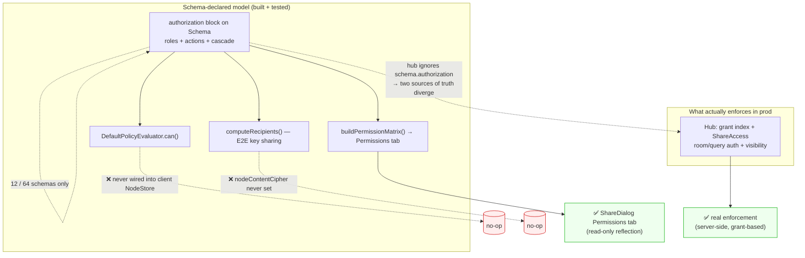
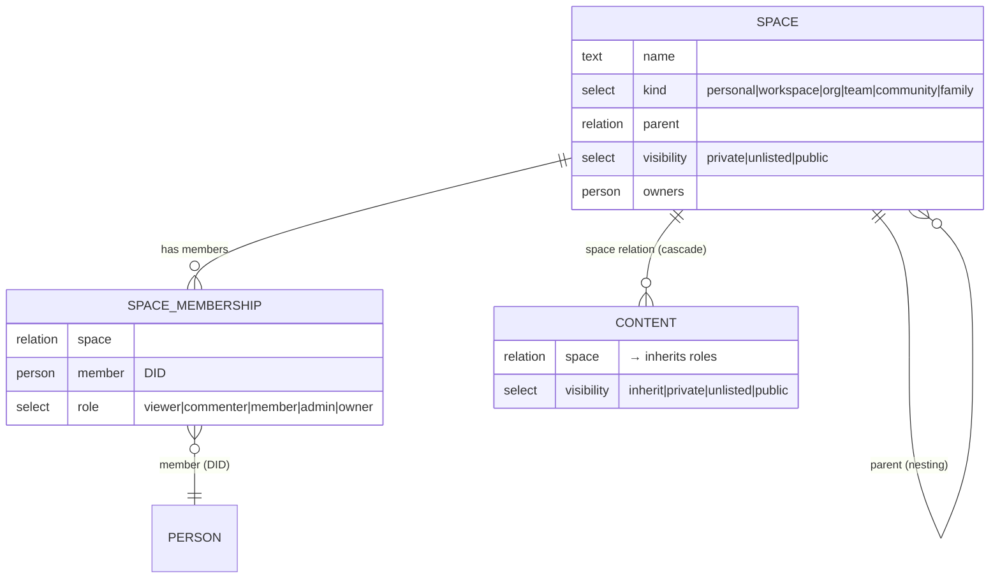
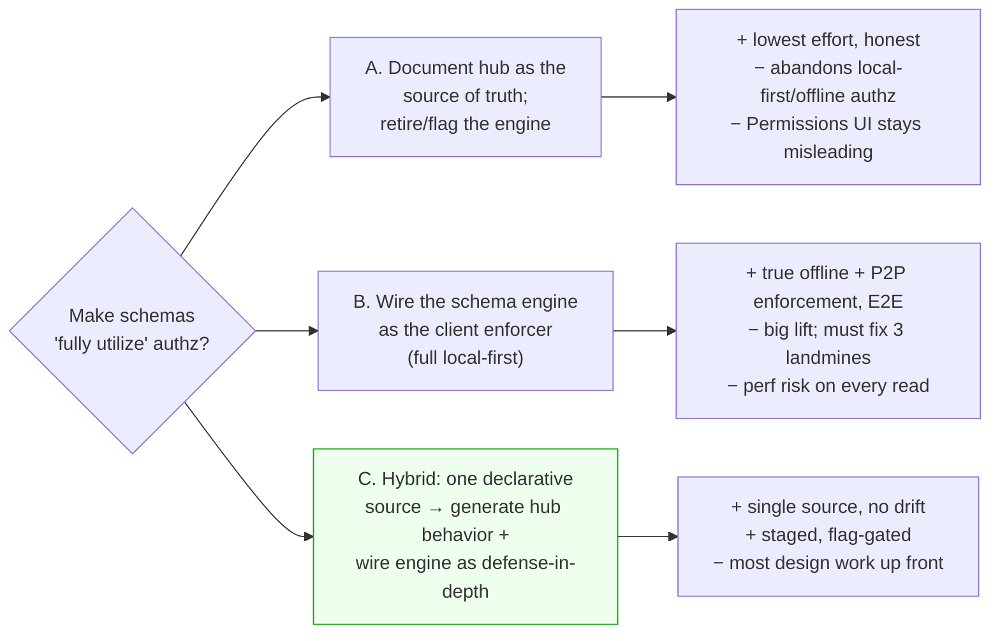

# Schema Authorization, Permissions, and Roles: Coverage and Enforcement Audit

## Problem Statement

xNet ships a sophisticated, declarative, schema-native authorization model
(roles, action grants, cascading membership, an evaluator, an E2E
recipient-computation path, and a "who-can-do-what" permission matrix UI). The
question this exploration answers is narrow and concrete:

> **Do the existing schemas fully utilize authorization, permissions, and roles
> properly?**

Short answer: **No — on two independent axes.**

1. **Coverage gap.** Only **12 of ~64** registered schemas declare an
   `authorization` block. The highest-traffic content types — `Page`,
   `Database` (+ rows/fields/views), `Canvas`, `Folder`, `Channel`,
   `Dashboard`, `Map`, `Comment`, `ChatMessage`, `Tag`, `MediaAsset`,
   `Profile`, `Experiment`, `Metric`, `Observation` — carry `space` and
   `visibility` *properties* but **no authorization block**. Per
   `getAuthMode()` they are "legacy = owner-only."

2. **Wiring gap.** The schema-native authorization engine
   (`DefaultPolicyEvaluator`) and the authorized sync provider
   (`AuthorizedYjsSyncProvider` / `YjsAuthGate`) are **built, tested, and
   exported, but never instantiated in any production client**. The React,
   Electron, and Expo `NodeStore`s are constructed with no `authEvaluator`, no
   `auth`, and no `nodeContentCipher`. Production sync uses the plain
   `NodeStoreSyncProvider`. The only thing actually enforcing access today is
   **the hub** (server-side grants, room/query auth, `visibility`), which does
   **not** read the schema `authorization` blocks at all.

The net effect: the schema `authorization` blocks are, in practice, **design
intent + a UI reflection (the Permissions tab)** — not the live policy. The two
systems (schema-declared roles vs. hub grants) have drifted, and there are
latent correctness landmines that would break collaboration the day someone
"turns the evaluator on."

## Executive Summary



The authorization *machinery* is mature and well-designed (a hybrid of
policy-as-data, ReBAC-style relationship cascade, and capability grants — see
[External Research](#external-research)). The *adoption* is incomplete: most
schemas don't declare policy, and the client never runs the engine. Today's
real, working access control is entirely the hub's grant model. This is a
defensible MVP posture, but it is not "schemas fully utilizing authorization,"
and the gap is currently undocumented and unguarded, so it silently widens with
every new schema.

This document maps exactly what exists, where the gaps and landmines are, and
recommends a staged path to make the schema layer the single declarative source
of truth while keeping the hub authoritative for untrusted peers.

## Current State In The Repository

### The authorization DSL (rich, complete)

The schema type carries an optional policy:

- `packages/data/src/schema/types.ts` — `Schema.authorization?: SerializedAuthorization`.
- `packages/data/src/auth/builders.ts` — the DSL:
  `role.creator()`, `role.property(name)`, `role.relation(name, targetRole)`,
  `role.members({ edgeSchema, containerProp, memberProp, roleProp, minRole, roleOrder, parentProp })`;
  combinators `allow/deny/and/or/not`; constants `PUBLIC`, `AUTHENTICATED`.
- `packages/data/src/auth/presets.ts` — reusable shapes:
  `private()`, `publicRead()`, `open()`, `collaborative(parentRelation)`,
  `team(editorsProperty)`.
- `packages/data/src/schema/schemas/space-authorization.ts` — the two cascade
  builders:
  - `spaceOwnAuthorization()` — for `Space` nodes; roles resolved via
    `SpaceMembership` edges and the `parent` chain.
  - `spaceCascadeAuthorization(relationName = 'space')` — for content; roles are
    `role.relation('space', 'spaceOwner' | 'spaceAdmin' | …)`, i.e. inherited
    from the linked Space. No `space` set ⇒ owner-only (private by default).

### Roles and membership model



- `packages/data/src/schema/schemas/space.ts` —
  `SPACE_ROLES = ['viewer','commenter','member','admin','owner']`,
  `spaceRoleGrantActions(role)` maps roles → hub actions
  (`viewer→[read]`, `member→[read,comment,write]`, `admin/owner→+share,admin`).
- `packages/data/src/schema/schemas/space-membership.ts` —
  `SpaceMembership { space, member, role }` with deterministic id
  `spaceMembershipId(spaceId, memberDid)`. **No authorization block of its
  own** (it is an edge node).

### The evaluator (built, tested — not wired)

`packages/data/src/auth/evaluator.ts`:

- `DefaultPolicyEvaluator.can(input)` (lines ~443–543): stale-check → cache →
  load node + schema → **auth mode** → role resolution → field rules → action
  expression → deny-precedence → allow → **grant-index fallback** → deny.
- `DefaultRoleResolver.resolveRoles()` (lines ~142–295): resolves `creator` /
  `property` / `relation` / `membership` roles, walking the container/`parent`
  chain up to `MAX_CONTAINER_DEPTH = 32`.
- `createPolicyEvaluator()` factory (line ~865).

**The auth-mode switch is the crux.** `packages/data/src/auth/mode.ts`:

```ts
export function getAuthMode(schema: Schema): AuthMode {
  if (!schema.authorization) return 'legacy'
  return 'enforce'
}
```

And in `can()`:

```ts
const mode = getAuthMode(schema.schema)
if (mode === 'legacy') {
  const allowed = node.createdBy === input.subject   // owner-only
  return this.decision(input, allowed, allowed ? ['owner'] : [], start) // RETURNS EARLY
}
if (!schema.schema.authorization) {                  // ⚠️ DEAD CODE (unreachable)
  return this.deny(input, ['DENY_NO_ROLE_MATCH'], start)
}
```

So a schema without an `authorization` block is **owner-only, and the function
returns *before* the grant-index fallback**. The `!authorization` deny branch is
**unreachable** dead code.

### The store integration (no-op without an evaluator)

`packages/data/src/store/store.ts`:

- `canReadNode(node)` / `filterReadableNodes(nodes)` — **return the node(s)
  unfiltered when `this.authEvaluator` is undefined** (≈ lines 2445–2471).
- `assertAuthorized()` / `assertAuthorizedBatch()` — **no-op when neither
  `this.auth` nor `this.authEvaluator` is set** (≈ lines 2420–2509).
- Auth-pushdown read path (≈ lines 734–765) is gated on
  `this.authEvaluator && !this.nodeContentCipher`.

### Where stores are actually constructed (the wiring gap)

- `packages/react/src/context.ts:660` — the **web/electron renderer** path:
  ```ts
  const ns = new NodeStore({ storage: nodeStorageAdapter, authorDID, signingKey })
  ```
  No `authEvaluator`, no `auth`, no `nodeContentCipher`. ⇒ all reads/writes are
  allow-all client-side.
- `packages/runtime/src/client.ts:248` — the SDK/CLI path passes
  `authEvaluator: options.authEvaluator` and `auth: options.auth` **through**,
  but these are optional seams that default to `undefined`.
- `apps/expo/.../XNetProvider.tsx:195`, `apps/electron/.../data-service.ts:1657`
  — likewise no evaluator.
- `grep` for `createPolicyEvaluator` and `new DefaultPolicyEvaluator` across
  `packages/**` and `apps/**` (excluding `/dist/` and `*.test.*`) returns
  **zero** production call sites.

### The sync path uses the *unauthorized* provider

- `packages/runtime/src/sync/sync-manager.ts:387` — production sync uses
  `new NodeStoreSyncProvider(...)`.
- `AuthorizedYjsSyncProvider` and `YjsAuthGate`
  (`packages/sync/src/yjs-authorized-sync.ts`, `.../yjs-authorization.ts`) are
  **exported from `packages/sync/src/index.ts` but never used** outside their
  own tests.

### E2E recipients also short-circuit, and ignore `visibility`

`packages/data/src/auth/recipients.ts` — `computeRecipients()`:

```ts
recipients.add(node.createdBy)
if (!schema.authorization) {
  return [...recipients]          // owner-only for the 52 auth-less schemas
}
```

It also **never reads `node.properties.visibility`** — "public" is determined
solely by `hasPublicAccess(readExpr)` on the schema's `read` action. None of the
content cascade schemas put `PUBLIC` in their `read` action, so
`visibility: 'public'` on a node is invisible to the schema model. (And
`nodeContentCipher` is never set in any client, so this path is dead in
production anyway.)

### What *does* enforce: the hub

`packages/hub/src/...` (this is the real, working access control):

- `server.ts` — `authorizeRoomAction()` (≈ 318–425): token expiry → revocation →
  UCAN capability → **doc-level grant** (`listGrantedDocIds`) → **space
  membership** (`shareAccess.canAccessNode`). Query auth (≈ 1196–1243) checks
  `query/read` / `index/write` capabilities. `visibility` is read at
  `server.ts:263`.
- `services/share-access.ts` — share-link roles → action allowlists
  (`read` / `comment` / `write`), grant status with revocation + expiry.
- `routes/public.ts` — `resolveEffectiveVisibility()`; only `visibility ===
  'public'` bypasses the grant model.
- The hub **does not deserialize `schema.authorization`** anywhere — it runs an
  independent grant + visibility model.

### The one live consumer of `schema.authorization` on the client

- `packages/data/src/auth/permission-matrix.ts` — `buildPermissionMatrix()`.
- `apps/web/src/components/PermissionMatrixPanel.tsx` — the **Permissions tab**
  in `apps/web/src/components/ShareDialog.tsx`. This reflects the schema's
  declared roles/actions as "who can do what." For the ~52 auth-less schemas it
  has nothing to show (or shows owner-only), so the panel silently
  under-reports for most content.

### Coverage table

| Declares `authorization` (12 files) | Auth-less — "legacy/owner-only" (representative) |
|---|---|
| `space.ts` (`spaceOwnAuthorization`) | `page.ts`, `database.ts`, `database-field.ts`, `database-row.ts`, `database-view.ts`, `database-select-option.ts` |
| `task.ts`, `project.ts`, `milestone.ts` | `canvas.ts`, `folder.ts`, `channel.ts`, `dashboard.ts`, `map.ts` |
| `crm.ts` (10 entity types) | `comment.ts`, `commentAnchors.ts`, `commentOrphans.ts`, `commentReferences.ts`, `mentions.ts`, `reaction.ts` |
| `account.ts`, `transaction.ts`, `posting.ts`, `budget.ts` | `chat-message.ts`, `media-asset.ts`, `external-reference.ts`, `tag.ts` |
| `schema-extension.ts`, `import-batch.ts` | `profile.ts`, `user-widget.ts`, `inbox-state.ts`, `saved-view.ts`, `task-view.ts` |
| `moderation.ts` (custom roles) | `experiment.ts`, `metric.ts`, `observation.ts`, `grant.ts`, `system.ts`, `space-membership.ts` |

> `warnLegacySchema()` exists in `mode.ts` to warn devs about missing
> authorization — but it is **never called** in production (test-only). New
> schemas ship auth-less with zero friction.

## External Research

xNet's design is a credible hybrid of three well-known authorization families.
Naming them clarifies which guarantees xNet already targets and which it leaves
on the table.

- **Policy-as-data / policy-as-code (OPA, AWS Cedar).** Rules are evaluated
  against inputs. xNet's `actions: { read: allow('owner', 'spaceMember', …) }`
  is exactly this: a serialized policy attached to each schema. Cedar/OPA
  guidance is that policy engines are easy for point checks but need extra work
  for *list filtering at scale* — which is precisely the `filterReadableNodes`
  post-filter + auth-pushdown work in `store.ts`.
  ([Oso: OPA vs Cedar vs Zanzibar](https://www.osohq.com/learn/opa-vs-cedar-vs-zanzibar))
- **Relationship-based access control / Zanzibar (SpiceDB, OpenFGA).** Access
  derives from a graph of relationships and inherits along it. xNet's
  `role.relation('space', …)` cascade and `role.members({ parentProp })`
  ancestor walk are a hand-rolled ReBAC: "you can read this Task because you are
  a member of its Space (or an ancestor Space)."
  ([AuthZed: PBAC vs ReBAC](https://authzed.com/blog/policy-based-access-control),
  [WorkOS: ReBAC vs PBAC](https://workos.com/blog/relationship-based-vs-policy-based-authorization))
- **Capabilities / UCAN.** Instead of a central ACL, holders present
  cryptographically-provable certificates. xNet's hub grants + share-links +
  UCAN capability checks (`authorizeRoomAction`) are this model. UCAN is the
  canonical local-first/P2P authorization scheme.
  ([UCAN spec](https://github.com/ucan-wg/spec/blob/main/README.md),
  [localfirst.fm #19 — UCAN/Beehive/Beelay](https://www.localfirst.fm/19/transcript))
- **Local-first access control (Ink & Switch *Keyhive*).** The frontier work on
  this exact problem: a Group-Management CRDT with **coordination-free
  revocation**, plus E2EE with causal keys and post-compromise security. xNet's
  `SpaceMembership` edges (CRDT nodes) + `computeRecipients` + content-key
  rotation on revocation are an early, partial version of the same idea — but
  Keyhive's lesson is that *the access-control state and the encryption keys
  must be the same CRDT*, which xNet has not yet unified.
  ([Ink & Switch: Keyhive](https://www.inkandswitch.com/keyhive/notebook/))

**Takeaway for xNet:** the model is on the right track and matches the state of
the art. The deficiency is not the *design* — it is that (a) most schemas don't
declare policy, (b) the declarative model isn't the live enforcer, and (c) the
two enforcement systems (schema vs. hub) are not derived from one source, so
they can disagree. Mature systems (SpiceDB, Cedar) treat "every resource type
has an explicit policy" and "one policy, many enforcement points" as
non-negotiable invariants. xNet has the parts but not the invariants.

## Key Findings

1. **Coverage: ~19% of schemas declare authorization.** 12 of 64. The most-used
   content types are auth-less. (`packages/data/src/schema/schemas/*`)

2. **The declarative engine is unwired in every client.** No production
   `NodeStore` is constructed with `authEvaluator`/`auth`;
   `createPolicyEvaluator` has zero non-test call sites. Client-side reads and
   writes are allow-all. (`packages/react/src/context.ts:660`,
   `packages/runtime/src/client.ts:248`)

3. **The authorized sync provider is dead code in prod.**
   `AuthorizedYjsSyncProvider`/`YjsAuthGate` are exported but unused; sync uses
   `NodeStoreSyncProvider`. (`packages/runtime/src/sync/sync-manager.ts:387`)

4. **Two divergent sources of truth.** The hub enforces via grants + visibility
   and never reads `schema.authorization`. The schema blocks drive only the
   (unwired) evaluator, the (unwired) recipients path, and the Permissions UI.
   Nothing keeps them in lockstep — exactly the "Phase 4: unify enforcement"
   that exploration 0181 explicitly deferred.

5. **Landmine #1 — legacy mode skips grants.** `can()` returns owner-only for
   auth-less schemas *before* the grant-index fallback
   (`evaluator.ts` ~482–488). If the evaluator were wired today, every shared
   `Page`/`Database`/`Canvas` would become invisible to collaborators despite
   valid hub grants.

6. **Landmine #2 — dead deny branch.** `if (!schema.authorization) deny(...)`
   at `evaluator.ts:490` is unreachable (getAuthMode returns `'legacy'` first).
   It signals confused intent: was the design owner-only-fallback, or
   deny-closed? They contradict.

7. **Landmine #3 — recipients lock out collaborators.** `computeRecipients`
   returns owner-only for auth-less schemas and never consults the grant index
   for them. If `nodeContentCipher` were enabled, E2E content would be
   undecryptable by anyone but the author for 52 schema types.

8. **`visibility` is decorative in the schema model.** `computeRecipients` and
   the cascade builders never read it; only the hub honors it. A node marked
   `visibility: 'public'` is *not* public per the schema model — a real
   disagreement between the property users edit and the policy that (would)
   run.

9. **No guard rails.** `warnLegacySchema` is never called; there is no
   conformance test asserting "every content schema declares authorization or
   is explicitly auth-exempt." Coverage silently erodes.

10. **The good news.** The hub enforcement is real and reasonably complete
    (room/query auth, grant revocation, expiry, space-membership cascade,
    public reads). The declarative model is well-tested in isolation
    (`auth/space-cascade.test.ts` proves cascade, most-permissive-wins, sibling
    isolation, deny precedence). The pieces are sound; the assembly is missing.

## Options And Tradeoffs



### Option A — Accept the hub as the source of truth; demote the engine

Treat `schema.authorization` as documentation. Mark the evaluator + recipients +
authorized-sync as "experimental / server-parity (not wired)." Fix the
Permissions UI to reflect *hub* behavior (grants + visibility), not the schema
blocks.

- **Pros:** least effort; removes the misleading "we have schema authz"
  impression; honest about what's enforced.
- **Cons:** abandons the local-first promise (offline/P2P access control, E2E
  recipients); leaves a lot of good code as a museum; the schema blocks that
  *do* exist (CRM, finance) still don't enforce client-side.

### Option B — Wire the schema engine as the client enforcer

Add authorization to all content schemas, construct the client `NodeStore` with
a `createPolicyEvaluator`, swap in `AuthorizedYjsSyncProvider`, and fix the three
landmines.

- **Pros:** real offline + peer-to-peer enforcement; E2E recipients become
  viable; one engine, many call sites.
- **Cons:** large blast radius; every read now pays an auth post-filter (the
  perf work in 0182 exists for exactly this, but it's still cost);
  client-enforced authz on an untrusted client is advisory anyway — the hub must
  *still* enforce, so you now maintain two enforcers unless you also do C.

### Option C — Hybrid: one declarative source → generated hub behavior + wired engine (recommended)

Make `schema.authorization` the **single declarative source**. Derive the hub's
grant/visibility expectations from it (so they cannot diverge), and wire the
evaluator into the client as **defense-in-depth + an offline gate**, with the
hub remaining authoritative for untrusted peers.

- **Pros:** kills the drift (Finding #4) structurally; preserves local-first;
  honors the existing investment; can be staged behind a flag with a
  conformance test as the ratchet.
- **Cons:** the most design work to define "derive hub behavior from schema";
  must still fix the three landmines first.

## Recommendation

**Adopt Option C, staged.** Concretely, in priority order:

1. **Stop the bleeding (guard rails first).** Add a conformance test over the
   schema registry: *every registered schema must either declare an
   `authorization` block or appear in an explicit `AUTH_EXEMPT` allowlist with a
   one-line justification.* Wire `warnLegacySchema` (or a build-time lint) so
   new auth-less schemas are loud, not silent. This freezes coverage where it is
   and forces a decision per schema henceforth. *(Low effort, high leverage —
   do this regardless of the rest.)*

2. **Fix the three landmines** so the engine is safe to enable:
   - In `can()`, when `mode === 'legacy'`, **fall through to the grant-index
     fallback** instead of returning owner-only early (or better: eliminate
     legacy mode entirely once coverage is complete). Delete the dead
     `!authorization` deny branch.
   - In `computeRecipients`, expand grants for legacy schemas too (move the
     grant loop before the `!authorization` return, or remove that return once
     coverage is complete).
   - Make `visibility` authoritative in the model: have the cascade builder emit
     a `read` action that includes `PUBLIC` when the node's effective visibility
     is `public`, so the schema model and the hub agree.

3. **Backfill coverage** with a shared default. Almost every auth-less content
   schema already has `space` + `visibility`, so the mechanical fix is to add
   `spaceCascadeAuthorization()` to each (`page`, `database*`, `canvas`,
   `folder`, `channel`, `dashboard`, `map`, `comment*`, `chat-message`,
   `reaction`, `tag`, `media-asset`, `experiment`, `metric`, `observation`, …).
   Edge/system nodes (`space-membership`, `grant`, `system`, `inbox-state`,
   `profile`) get an explicit decision (owner-only preset or auth-exempt).

4. **Single source → derive hub behavior.** Add (or formalize) a
   `schemaToHubPolicy(schema)` that produces the grant-action / visibility
   expectations the hub enforces, so `spaceRoleGrantActions` and the hub's
   `canAccessNode` are *generated from* the same `authorization` block the
   evaluator reads. Add a parity test (declared read-roles ⇔ hub grant actions).

5. **Wire the engine behind a flag.** Construct the client `NodeStore` with
   `createPolicyEvaluator` and swap `AuthorizedYjsSyncProvider` into sync, both
   gated by a feature flag (mirrors the worker-runtime and labs ladders). Keep
   the hub authoritative; the client engine is defense-in-depth + the offline
   answer. Default off until the parity test and perf budgets are green.

This sequence is safe: steps 1–2 are pure correctness/guard-rail work with no
behavior change; step 3 is additive; steps 4–5 are flag-gated.

## Example Code

### 1. Conformance test (guard rail — ship first)

```ts
// packages/data/src/schema/schemas/authorization-coverage.test.ts
import { describe, it, expect } from 'vitest'
import { allSchemas } from './index'        // registry of registered schemas
import { getAuthMode } from '../../auth/mode'

// Edge/system nodes that intentionally carry no policy of their own.
const AUTH_EXEMPT = new Set<string>([
  'xnet://xnet.fyi/SpaceMembership@1.0.0', // edge node; secured by its Space
  'xnet://xnet.fyi/Grant@1.0.0',           // the grant record itself
  'xnet://xnet.fyi/System@1.0.0',          // singleton system config
  // …each entry needs a one-line justification in review
])

describe('authorization coverage', () => {
  it('every registered schema declares authorization or is explicitly exempt', async () => {
    const offenders: string[] = []
    for (const schema of await allSchemas()) {
      if (AUTH_EXEMPT.has(schema['@id'])) continue
      if (getAuthMode(schema) === 'legacy') offenders.push(schema.name)
    }
    expect(offenders, `schemas missing an authorization block: ${offenders.join(', ')}`)
      .toEqual([])
  })
})
```

### 2. Backfill a content schema (mechanical)

```ts
// packages/data/src/schema/schemas/page.ts  (illustrative diff)
import { spaceCascadeAuthorization } from './space-authorization'

export const PageSchema = defineSchema({
  name: 'Page',
  namespace: 'xnet://xnet.fyi/',
  properties: { /* …unchanged… space + visibility already present… */ },
  document: 'page',
+ authorization: spaceCascadeAuthorization() // inherit roles from the linked Space
})
```

### 3. Fix Landmine #1 — legacy must consult grants (transitional)

```ts
// packages/data/src/auth/evaluator.ts  (inside can())
  const mode = getAuthMode(schema.schema)
  if (mode === 'legacy') {
    if (node.createdBy === input.subject) {
      return this.decision(input, true, ['owner'], start)
    }
-   return this.decision(input, false, [], start)   // ❌ ignores valid grants
+   // Fall through to the grant-index fallback so hub grants still apply
+   const grant = this.findMatchingGrant(
+     input,
+     this.grantIndex?.findGrants(input.nodeId, input.subject) ?? []
+   )
+   return this.decision(input, Boolean(grant), [], start, grant ? [grant.id] : undefined)
  }
- if (!schema.schema.authorization) {               // ❌ dead code — delete
-   return this.deny(input, ['DENY_NO_ROLE_MATCH'], start)
- }
```

### 4. Wire the evaluator into the client (flag-gated)

```ts
// packages/react/src/context.ts  (illustrative)
const ns = new NodeStore({ storage: nodeStorageAdapter, authorDID, signingKey })

if (flags.clientSideAuthEnforcement) {
  ns.attachAuthEvaluator(
    await createPolicyEvaluator({ store: ns, schemaRegistry, grantIndex })
  )
}
```

## Risks And Open Questions

- **Turning on client enforcement could lock users out of their own shared
  data** if landmines #1/#3 aren't fixed first, or if a content schema's `space`
  is null when it shouldn't be. Mitigation: fix landmines, ship the conformance
  test, default the flag off, and dry-run against real data.
- **Performance.** Every list read gains an auth post-filter. The 0182 auth
  pushdown helps, but it's disabled when `nodeContentCipher` is set — so E2E and
  cheap auth currently trade off. Need a perf budget before flipping the flag.
- **Client enforcement is advisory.** An untrusted client can be patched to
  ignore the evaluator, so the hub must remain authoritative. This is *why*
  Option C (one source → both enforcers) matters more than Option B alone.
- **What is the intended default for an unshared node?** Owner-only (current
  cascade behavior with empty `space`) seems right, but it should be explicit
  and tested, not an emergent property of `role.relation` returning nothing.
- **Edge/system nodes:** which truly need no policy (`SpaceMembership`,
  `Grant`, `System`, `Profile`, `InboxState`)? Each `AUTH_EXEMPT` entry needs a
  justification — e.g. is a `Profile` world-readable by design? Today it's
  owner-only-in-the-model but hub-published in practice.
- **`visibility` semantics:** is it a per-node override of the Space's
  visibility, or advisory metadata? The schema model ignores it; the hub honors
  it. Pick one and make both agree.
- **Migration:** adding `authorization` to existing schemas changes the
  effective schema. Does `useEffectiveSchema` / the schema-version machinery
  need a bump, or is `authorization` non-versioned metadata? (0188 made
  effective schema read-time-composed — confirm authz rides along.)

## Implementation Checklist

- [ ] Add `authorization-coverage.test.ts` over the schema registry with an
      explicit, justified `AUTH_EXEMPT` allowlist (guard rail).
- [ ] Call `warnLegacySchema` from `defineSchema` (dev-only) **or** add a lint
      rule, so new auth-less schemas are loud.
- [ ] Fix Landmine #1: legacy branch in `can()` falls through to the
      grant-index fallback (or remove legacy mode after backfill).
- [ ] Delete the unreachable `!authorization` deny branch in `evaluator.ts`.
- [ ] Fix Landmine #3: `computeRecipients` expands grants for (and/or removes
      the early return for) auth-less schemas.
- [ ] Make `visibility: 'public'` emit `PUBLIC` in the cascade `read` action so
      the schema model and hub agree.
- [ ] Backfill `spaceCascadeAuthorization()` on content schemas: `page`,
      `database`, `database-field`, `database-row`, `database-view`,
      `database-select-option`, `canvas`, `folder`, `channel`, `dashboard`,
      `map`, `comment(+anchors/orphans/references)`, `mentions`, `reaction`,
      `chat-message`, `tag`, `media-asset`, `external-reference`, `experiment`,
      `metric`, `observation`, `saved-view`, `task-view`, `user-widget`.
- [ ] Decide + apply policy (preset or `AUTH_EXEMPT`) for edge/system schemas:
      `space-membership`, `grant`, `system`, `inbox-state`, `profile`.
- [ ] Add `schemaToHubPolicy()` (or equivalent) so hub grant actions +
      visibility are derived from `schema.authorization`; add a schema↔hub
      parity test.
- [ ] Add `NodeStore.attachAuthEvaluator()` (or constructor wiring) and
      construct `createPolicyEvaluator` in `packages/react/src/context.ts`,
      `packages/runtime/src/client.ts`, electron, and expo — behind a flag.
- [ ] Swap `AuthorizedYjsSyncProvider`/`YjsAuthGate` into the sync path behind
      the same flag.
- [ ] Update `PermissionMatrixPanel` to reflect the unified (post-backfill)
      policy, including inherited Space roles and public state.

## Validation Checklist

- [ ] `authorization-coverage.test.ts` is green (no un-exempted legacy schema).
- [ ] `auth/space-cascade.test.ts` extended with `Page`/`Database`/`Canvas`
      cases proving Space members can read/write shared content via the cascade.
- [ ] Regression test: a node shared purely via a **hub grant** (no schema role)
      is readable through the evaluator (Landmine #1 fixed).
- [ ] Test: `computeRecipients` for a shared `Page` includes grantees, not just
      the author (Landmine #3 fixed).
- [ ] Test: a node with effective `visibility: 'public'` yields `PUBLIC` from
      both `computeRecipients` and the hub's `resolveEffectiveVisibility`.
- [ ] schema↔hub parity test: declared `read`-roles ⇔ hub grant actions for a
      representative content schema.
- [ ] With the flag on, manual E2E: two identities in a shared Space both see a
      Page; a non-member does not; revocation removes access and rotates keys.
- [ ] Perf: list-read latency with the evaluator wired stays within budget at
      the 0184 large-DB scale (auth pushdown engaged).
- [ ] With the flag **off**, behavior is byte-for-byte unchanged (hub remains
      the sole enforcer).

## References

### Internal

- `packages/data/src/schema/types.ts` — `Schema.authorization`.
- `packages/data/src/auth/builders.ts`, `presets.ts` — the DSL + presets.
- `packages/data/src/auth/mode.ts` — `getAuthMode`, `warnLegacySchema` (uncalled).
- `packages/data/src/auth/evaluator.ts` — `DefaultPolicyEvaluator.can()`,
  `resolveRoles`, `createPolicyEvaluator` (lines ~443–543, ~142–295, ~865).
- `packages/data/src/auth/recipients.ts` — `computeRecipients`.
- `packages/data/src/auth/permission-matrix.ts` — `buildPermissionMatrix`.
- `packages/data/src/schema/schemas/space-authorization.ts` — cascade builders.
- `packages/data/src/schema/schemas/space.ts`, `space-membership.ts` — roles + edges.
- `packages/data/src/store/store.ts` — `canReadNode`, `filterReadableNodes`,
  `assertAuthorized`, auth-pushdown (lines ~734–765, ~2420–2509).
- `packages/react/src/context.ts:660`, `packages/runtime/src/client.ts:248` —
  client store construction (no evaluator).
- `packages/runtime/src/sync/sync-manager.ts:387` — plain `NodeStoreSyncProvider`.
- `packages/sync/src/yjs-authorized-sync.ts`, `yjs-authorization.ts` — unused
  authorized provider.
- `packages/hub/src/server.ts` (`authorizeRoomAction`, query auth, visibility),
  `services/share-access.ts`, `routes/public.ts` — the real enforcement.
- `apps/web/src/components/ShareDialog.tsx`, `PermissionMatrixPanel.tsx` — UI.
- `docs/explorations/0181_[_]_SPACES_AS_NESTED_GROUPINGS_AND_SCHEMA_AUTHORIZATION.md`
  (deferred "Phase 4: unify enforcement"),
  `0188_[_]_EXTENSIBLE_SCHEMAS_AND_UNIVERSAL_DATABASE_VIEW.md`
  (`buildPermissionMatrix`),
  `0179_[_]_SPACES_GROUPS_AND_UNIFIED_SHARING.md`,
  `0182_[_]_USEQUERY_USEMUTATE_PERFORMANCE_FRONTIER.md` (auth pushdown).

### External

- [Ink & Switch — Keyhive: Local-first access control](https://www.inkandswitch.com/keyhive/notebook/)
- [UCAN specification](https://github.com/ucan-wg/spec/blob/main/README.md)
- [localfirst.fm #19 — Brooklyn Zelenka: UCAN, Beehive, Beelay](https://www.localfirst.fm/19/transcript)
- [AuthZed — Policy-Based vs Relationship-Based Access Control](https://authzed.com/blog/policy-based-access-control)
- [WorkOS — ReBAC vs PBAC](https://workos.com/blog/relationship-based-vs-policy-based-authorization)
- [Oso — OPA vs Cedar vs Zanzibar (2025 guide)](https://www.osohq.com/learn/opa-vs-cedar-vs-zanzibar)
- [Permit.io — Zanzibar vs OPA](https://www.permit.io/blog/zanzibar-vs-opa)
