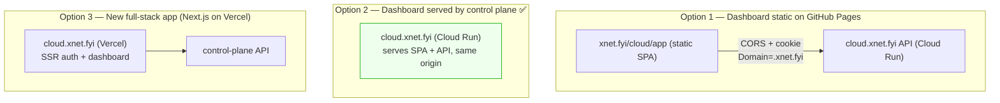
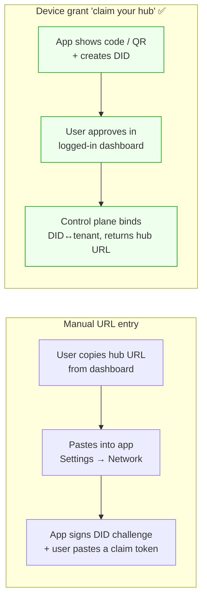
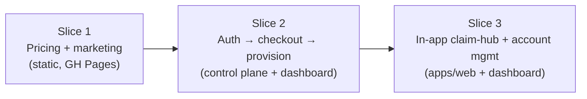
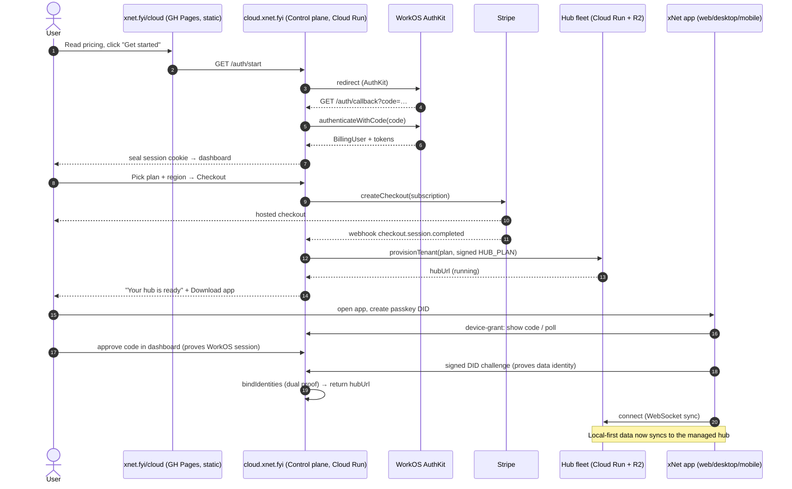
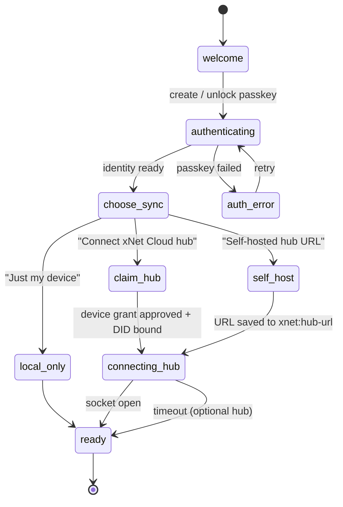
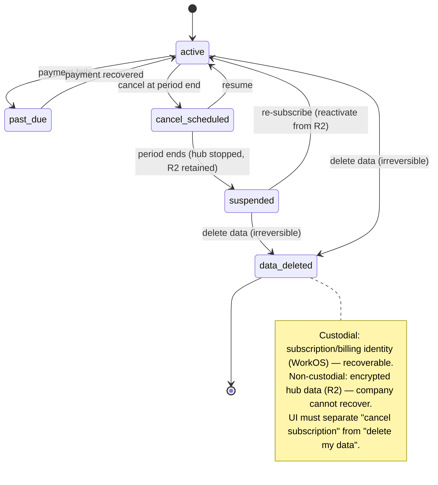

# xNet Cloud — The Onboarding Journey, the Dashboard UI, and Where to Host It

## Problem Statement

xNet Cloud is **architecturally complete and code-incomplete** (exploration
[0180](0180_[_]_XNET_CLOUD_ARCHITECTURE_AND_COMPLETION_STATUS.md)): the brain
(plan catalog, signed entitlements, two-identity binding, billing math, the
`ControlPlane` lifecycle) is shipped and tested, the hands (real provisioner
adapters) are stubs, and **the face does not exist**. There is no signup, no
pricing page, no checkout, no `/auth/callback`, no dashboard, and no in-app
"connect my cloud hub" flow.

This exploration answers the *face* question, which is really three questions
tangled together:

1. **Where do we host it, cheaply?** The marketing/pricing surface, the
   authenticated dashboard, and the dynamic backend (auth callback, Stripe
   webhook, provisioning) have very different hosting needs. GitHub Pages is
   free but static. What goes where?
2. **What is the end-to-end onboarding flow?** From "stranger reads the pricing
   page" → "signs up with WorkOS" → "pays" → "gets a hub provisioned" → "opens
   the app and connects to that hub" → "binds their data identity" → "manages
   billing / cancels / deletes." Every hand-off in that chain is a design
   decision.
3. **How does the app *connect* to a freshly-provisioned hub** without leaking
   the custodial billing identity into the non-custodial data plane — i.e. how
   do the two identities (WorkOS billing ↔ data DID) get bound through a UI a
   human can actually follow?

## Executive Summary

**Recommended topology — keep everything free that can be free, and put exactly
one scale-to-zero service behind the dynamic surface:**

| Surface | Host | Cost | Why |
|---|---|---|---|
| Marketing + pricing (`/cloud`, `/cloud/pricing`) | **GitHub Pages** (existing Astro site, `xnet.fyi`) | $0 | Static; reuse the site we already deploy |
| The product app (web) | **GitHub Pages** (existing `xnet.fyi/app`) | $0 | Already there; gains a "Cloud" account surface |
| Auth callback, Stripe webhook, provisioning, **dashboard** | **`xnet-cloud` Hono service on Cloud Run** (`cloud.xnet.fyi`), scale-to-zero | ~$0 at low volume | The only irreducibly-dynamic surface; same-origin sealed-cookie sessions |
| Per-tenant hubs | Cloud Run + Litestream→R2 (the fleet) | COGS-modeled | Already designed (0177/0178) |

The single most important UX insight: **the onboarding flow is a hand-off
between two identities that must be bound, and the cleanest way to bind them in
a UI is the OAuth 2.0 Device Authorization Grant ([RFC 8628](https://oauth.net/2/device-flow/))** —
a "claim your hub" pairing flow. The app creates a passkey DID locally and
displays/sends a short device code; the user approves it in the
already-authenticated dashboard; the control plane performs the existing
`bindIdentities` dual-proof (DID-signed challenge + WorkOS session) and hands the
hub URL back to the app. This re-uses code that is **already shipped and tested**
(`bindIdentities`, the `DidChallenge` dual-proof in
`packages/cloud/src/identity/binding.ts`) and never embeds WorkOS in the
non-custodial app.

**Phasing:** ship the marketing + pricing page first (pure static, zero backend
risk, immediately useful), then the control-plane auth/checkout/provision spine
(Option B from 0180), then the in-app claim-hub + account-management surface.
This is the "money path" half of 0180's recommendation, made concrete as UI.

## Current State In The Repository

### The site is static Astro on GitHub Pages — and that is good

The marketing/docs site is **Astro 5 + Starlight**, built and published to the
`gh-pages` branch by [.github/workflows/deploy-site.yml](.github/workflows/deploy-site.yml).
The custom domain is `xnet.fyi` ([site/public/CNAME](site/public/CNAME),
[site/astro.config.mjs:37](site/astro.config.mjs)). The deploy bundles two
artifacts onto one branch:

- `site/dist` → `/` (Astro marketing + docs)
- `apps/web/dist` → `/app/` (the React PWA, built with
  `VITE_BASE_PATH=/app/` and `VITE_USE_HASH_ROUTER=true`)

The site already single-sources structured data into plain TypeScript modules
that Astro renders at build time — [site/src/data/roadmap.ts](site/src/data/roadmap.ts)
and [site/src/data/compare.ts](site/src/data/compare.ts) (which already has a
`pricing` column for *competitors*). **There is a proven pattern here for a
pricing page: a `site/src/data/pricing.ts` module rendered by an Astro page.**
There is currently **no** `/cloud`, `/pricing`, or `/signup` route, and the
roadmap does not mention paid hosting.

The site is **purely static** — it cannot run server code, hold a secret, or
seal a session. Anything dynamic must live elsewhere.

### The control plane already has the seams — and the holes

[apps/cloud/src/server.ts](apps/cloud/src/server.ts) is a Hono app with:

- `GET /auth/start` ([server.ts:40](apps/cloud/src/server.ts)) — redirects to
  WorkOS AuthKit via `billing.getAuthorizationUrl()`.
- `GET /tenants/:id`, `POST /internal/tenants`, `POST /internal/tenants/:id/plan`,
  `POST /internal/account/recover` — all gated by a shared `x-internal-secret`.

**The holes that block a real signup:**

- **No `GET /auth/callback`.** The comment at
  [server.ts:38](apps/cloud/src/server.ts) admits the callback "is not built
  here." Nothing exchanges the WorkOS code or seals a session.
- **No `/checkout` / Stripe subscription path.** Provisioning is driven only by
  the internal `POST /internal/tenants` route; there is no route that creates a
  Stripe Checkout session for the *plan subscription* or routes a
  `checkout.session.completed` webhook into `provisionTenant`.
- **No dashboard.** The control plane serves JSON, not HTML; there is no
  authenticated UI for a tenant to see their hub, change plans, or cancel.
- **DID verification is a stub** ([index.ts:44](apps/cloud/src/index.ts),
  `devDidVerifier` only checks shape) and the default plan secret is
  `dev-insecure-plan-secret` ([index.ts:68](apps/cloud/src/index.ts)).
- **All stores are in-memory** ([registry.ts](apps/cloud/src/registry.ts)).

The identity primitives the signup flow needs are **shipped and tested**:
`WorkOSAuthKitProvider` (`getAuthorizationUrl` / `authenticateWithCode` /
`getUser`) and the dual-proof `bindIdentities` / `recoverPaidAccount` /
`completeRebind` in `packages/cloud/src/identity/binding.ts`. The two-identity
binding requires *both* a proven WorkOS session (`billingUserId`) *and* a fresh
DID challenge (signature over a nonce) — exactly the two halves a UI hand-off
must collect.

### The plan catalog is a ready-made pricing data source

[packages/entitlements/src/plans.ts](packages/entitlements/src/plans.ts) defines
seven tiers and their limits — and crucially `@xnetjs/entitlements` is **MIT**,
not the FSL `@xnetjs/cloud`, so the static site can import it without crossing
the open-core boundary:

| Plan | Isolation | Storage | Seats | AI | SLA |
|---|---|---|---|---|---|
| demo | pooled | 10 MiB | 1 | – | none |
| personal | dedicated-sleep | 25 GiB | 1 | ✓ | best-effort |
| family | dedicated-sleep | 250 GiB | 5 | ✓ | best-effort |
| team | dedicated-warm | 100 GiB | 3 | ✓ | best-effort |
| community | dedicated-project | 500 GiB | 10 | ✓ | 99.9 |
| company | dedicated-project | 1 TiB | 10 | ✓ | 99.9 |
| enterprise | region-pinned | 5 TiB | 25 | ✓ | custom |

`PLAN_PRICING` and `estimateCogs` (in `@xnetjs/cloud`, FSL) hold the USD numbers;
the public-facing prices should be mirrored into a small **MIT** site data module
(`site/src/data/pricing.ts`) to keep the FSL package out of the static build.

### The app's connect-hub flow exists — with one real bug

The web app's onboarding is a state machine
([packages/react/src/onboarding/machine.ts](packages/react/src/onboarding/machine.ts)):
`welcome → authenticating → connecting-hub → ready → complete`. Passkey/WebAuthn
creates an Ed25519 `did:key` locally (`packages/identity/src/did.ts`), and
[HubConnectScreen.tsx](packages/react/src/onboarding/screens/HubConnectScreen.tsx)
shows the hub URL while it connects (the hub is optional; it auto-advances).

The hub URL today comes from `VITE_HUB_URL` or the hardcoded
`wss://hub.xnet.fyi` ([apps/web/src/App.tsx:66](apps/web/src/App.tsx)). There is
a **Network** settings panel
([apps/web/src/routes/settings.tsx:355](apps/web/src/routes/settings.tsx)) that
writes the hub URL to `localStorage['xnet:hub-url']` — **but `App.tsx` never
reads it back on startup.** So the one piece of UI that *looks* like "point me
at my cloud hub" is inert. **Fixing this read path is a hard prerequisite for
any connect-your-cloud-hub experience.**

Billing is half-wired: `XNetConfig.billing` exists
([packages/react/src/context.ts:343](packages/react/src/context.ts)) and
`useBilling()` ([packages/react/src/hooks/useBilling.ts](packages/react/src/hooks/useBilling.ts))
already exposes `openCheckout(priceRef)` / `openPortal()` against the hub's
billing routes — but **nothing in `apps/web` renders it.** The Account settings
panel shows only the DID and a logout button.

### Two billing surfaces, do not conflate them

This is a subtle trap. There are **two** billing concepts in the repo:

1. **Plan subscription** — "$5/mo for Personal." This is recurring SaaS billing.
   `@xnetjs/billing` (MIT, PR #106) already implements it: a `PaymentProvider`
   port with `createCheckout({ mode: 'subscription' })` and
   `createPortalSession()`, Stripe + BTCPay adapters, local-HMAC webhook verify
   ([packages/billing/src/provider.ts](packages/billing/src/provider.ts),
   [packages/hub/src/routes/billing.ts](packages/hub/src/routes/billing.ts)).
   Today it is **DID-scoped on the hub**; for cloud-tenant plans the *same
   provider port* should be driven by the **control plane**, keyed by the WorkOS
   customer/tenant instead of a DID.
2. **AI usage metering** — pay-as-you-go tokens. `@xnetjs/cloud/billing`
   (`computeChargeUsd`, the idempotent ledger, Stripe Meters). Separate surface,
   separate UI line item.

The onboarding/checkout UI is concerned with **(1)**. The dashboard's "usage"
view surfaces **(2)**.

## External Research

**WorkOS AuthKit supports both the server-sealed-cookie pattern and SPA
sessions.** The canonical flow is: configure a Redirect URI in the WorkOS
dashboard, exchange the code server-side in a callback, and store an **encrypted
session cookie** (the `WORKOS_COOKIE_PASSWORD` must be ≥32 chars). There is a
framework-agnostic [`@workos/authkit-session`](https://github.com/workos/authkit-session)
library plus first-party Next.js / React-Router integrations, and AuthKit's free
tier covers up to ~1M MAU — so the auth layer adds no fixed cost. The
[Session management for frontend apps](https://workos.com/blog/session-management-for-frontend-apps-with-authkit)
post confirms SPAs are supported, but the **sealed httpOnly cookie on a
same-origin callback** is the more secure default for a billing dashboard.

**The OAuth 2.0 Device Authorization Grant (RFC 8628) is the textbook answer for
"connect this app to my cloud account."** It exists precisely for clients that
shouldn't run the full browser-redirect dance themselves: the device shows a
short code (or QR), the user approves it on a second device that *is* logged in,
and the device polls until it receives its grant. This maps almost perfectly
onto xNet's two-identity split — the non-custodial app should *not* embed WorkOS;
it should create its DID locally and get "claimed" by the already-authenticated
dashboard. Okta, Microsoft, AWS Cognito, and Ping all document this flow; it is
the standard for desktop/CLI/TV apps.

**Supabase's onboarding is the friction benchmark to beat.** Across the
[Supabase / Neon / PlanetScale comparisons](https://www.bytebase.com/blog/neon-vs-supabase/),
Supabase "has the smoothest onboarding" because it asks for only **two inputs
(project name + region)** before provisioning, whereas PlanetScale front-loads
engine/cluster/size decisions. The lesson for xNet Cloud: ask for as little as
possible before the hub exists (ideally just *plan* and *region*), and defer
everything else (data import, plugins, seats) to after the user is in.

**Neon's scale-to-zero (~150 ms cold start) is the model for the cold-tier and
for the control plane itself.** A scale-to-zero Cloud Run service for the
control plane means the dashboard costs effectively nothing when idle, which is
the whole point of the "cheap" requirement.

Sources:
[RFC 8628 device flow](https://oauth.net/2/device-flow/),
[WorkOS AuthKit sessions](https://workos.com/docs/authkit/sessions),
[WorkOS frontend session mgmt](https://workos.com/blog/session-management-for-frontend-apps-with-authkit),
[`@workos/authkit-session`](https://github.com/workos/authkit-session),
[Okta device authorization grant](https://developer.okta.com/docs/guides/device-authorization-grant/main/),
[Neon vs Supabase (Bytebase)](https://www.bytebase.com/blog/neon-vs-supabase/),
[Supabase vs PlanetScale vs Neon (DevToolReviews)](https://www.devtoolreviews.com/reviews/supabase-vs-planetscale-vs-neon).

## Key Findings

1. **The hosting answer is a clean split, not a single platform.** Static
   marketing + app stay on free GitHub Pages; only auth callback + webhook +
   provisioning + dashboard need a server, and that is *one* scale-to-zero Cloud
   Run service. No Vercel/Netlify/Next.js is required.
2. **Serve the dashboard from the control plane, same-origin.** A billing
   dashboard wants httpOnly sealed cookies. Serving the dashboard SPA from the
   same Cloud Run origin (`cloud.xnet.fyi`) makes WorkOS sessions trivial and
   eliminates CORS. (A static-on-Pages dashboard talking cross-origin to the API
   is possible with `Domain=.xnet.fyi` cookies, but it trades security and
   simplicity for no real cost saving.)
3. **The two-identity binding is the crux of the connect-hub UX, and the device
   grant solves it.** `bindIdentities` already wants a WorkOS session *and* a
   signed DID challenge. RFC 8628 is the UI shape that collects both without
   embedding WorkOS in the app.
4. **The pricing page is the cheapest, lowest-risk first deliverable** — pure
   static Astro reading an MIT `pricing.ts`, no backend, immediately shippable,
   and it makes the offering legible (which the user explicitly wants).
5. **`@xnetjs/billing` already implements plan subscriptions + customer portal;
   reuse it in the control plane.** Don't build a second Stripe integration —
   drive the existing `PaymentProvider` port from the control plane keyed by
   tenant.
6. **The `xnet:hub-url` localStorage read-path bug must be fixed** before
   "connect your cloud hub" can work; it is a small, contained fix in
   `App.tsx`.
7. **Account deletion has two halves that must be visibly separated** —
   *delete subscription* (custodial, WorkOS/Stripe, reversible-ish) vs *delete
   data* (destroy the hub + R2 replica, irreversible, non-custodial). The UI
   must make the asymmetry obvious because the company *cannot* recover the
   encrypted data.

## Options And Tradeoffs

### Where does the authenticated dashboard live?



| Option | Cost | Session security | Complexity | Verdict |
|---|---|---|---|---|
| **1. Static dashboard on Pages + API on Cloud Run** | $0 hosting | Cross-origin cookies (`SameSite=None`) or bearer token in fragment | CORS, credentialed fetch, token handling | Viable, but trades security/simplicity for ~$0 saving |
| **2. Dashboard served by the control plane (same origin)** | ~$0 (scale-to-zero) | httpOnly sealed cookie, WorkOS-documented | Lowest; no CORS | **Recommended** |
| **3. New Next.js app on Vercel** | New vendor + bill | SSR-native | Highest; new app, new ToS, new deploy | Over-build; rejected |

**Recommendation: Option 2.** The dashboard is a thin SPA (or even server-rendered
Hono+HTML) baked into the `xnet-cloud` container and served from `cloud.xnet.fyi`,
same origin as the API. Cost is negligible (scale-to-zero), sessions are simple
and secure, and there is no new vendor.

### How does the app connect + bind to a provisioned hub?



- **Manual URL + claim token:** simplest to build, but clunky (copy/paste two
  values) and error-prone. Acceptable as a v0 fallback and for self-hosters.
- **Device grant (RFC 8628):** the app polls; the user just approves a code in
  the dashboard they're already signed into. Cleanest UX, standards-based, and
  it slots straight onto the existing dual-proof `bindIdentities`. **Recommended**,
  with manual entry kept as the self-host / power-user fallback.

### Where do checkout + provisioning fire?

The marketing page is static, so "Subscribe" must hand off to the control plane.
Two sub-options:

- **A. Checkout-first:** dashboard creates a Stripe Checkout (subscription) →
  `checkout.session.completed` webhook → `provisionTenant`. Tenant has paid
  before the hub exists. Clean billing story; ~1–2 s provisioning wait shown as
  a progress screen.
- **B. Provision-first (trial):** provision a `demo`/trial hub immediately on
  sign-in, collect payment later to upgrade. Lower friction to "wow," but you
  provision unpaid infra (abuse/cost risk) and the upgrade is a plan *flip*.

**Recommendation: A for paid tiers, with the free `demo` tier as the
provision-first trial.** A signed-in user can get a pooled `demo` hub instantly
(no card), and upgrading to `personal+` runs Checkout → webhook → plan flip (an
in-tier flip when possible, a migration when crossing isolation tiers, per
`changePlan`).

## Recommendation

**Build the face in three shippable slices, cheapest-and-safest first.**



1. **Slice 1 — Pricing & marketing (static, GitHub Pages).** A `site/src/data/pricing.ts`
   MIT module + `site/src/pages/cloud/index.astro` and `.../pricing.astro`,
   styled like the existing landing sections. "Get started" links to
   `https://cloud.xnet.fyi/auth/start`. Add a roadmap entry. **Zero backend
   risk, immediately useful.**
2. **Slice 2 — The money + provision spine.** In `xnet-cloud`: add
   `GET /auth/callback` (exchange code via `authenticateWithCode`, seal a WorkOS
   cookie), `POST /checkout` (reuse `@xnetjs/billing` Stripe `createCheckout`,
   keyed by tenant), `POST /webhook` (verify, route `checkout.session.completed`
   → `provisionTenant`), `POST /portal` (Stripe customer portal), and serve a
   minimal **dashboard** SPA (plan, hub status, usage, billing, danger zone).
   Swap the four in-memory stores for durable ones and rotate the plan secret.
   Deploy on Cloud Run at `cloud.xnet.fyi`. (This is 0180's Option B made into UI.)
3. **Slice 3 — Connect + manage in the app.** Fix the `xnet:hub-url` read path;
   add a **device-grant "claim your hub"** branch to the onboarding state
   machine (`welcome → choose-sync → claim-hub → connecting-hub → ready`); render
   `useBilling()` in Account settings (plan, manage-billing link, usage); and add
   the **danger zone** (cancel subscription, delete data) with the
   custodial/non-custodial asymmetry made explicit.

### End-to-end onboarding journey (the whole picture)



### Extended onboarding state machine (Slice 3)



### Account management & the deletion asymmetry (Slice 3 danger zone)



## Example Code

### Slice 1 — single-sourced pricing data the static site can import (MIT)

```ts
// site/src/data/pricing.ts — mirrors PLAN_CATALOG (MIT @xnetjs/entitlements)
// into public-facing copy. Numbers live here; do NOT import FSL @xnetjs/cloud
// into the static build.
export interface PricingTier {
  id: 'personal' | 'family' | 'team' | 'company' | 'enterprise'
  name: string
  priceUsdMonthly: number | 'custom'
  billing: 'annual-default' | 'monthly'
  storage: string
  seats: number
  highlights: string[]
  cta: { label: string; href: string }
}

export const PRICING: PricingTier[] = [
  {
    id: 'personal', name: 'Personal', priceUsdMonthly: 5, billing: 'annual-default',
    storage: '25 GiB', seats: 1,
    highlights: ['Your own dedicated hub', 'Passkey identity', 'Managed AI'],
    cta: { label: 'Get started', href: 'https://cloud.xnet.fyi/auth/start?plan=personal' }
  },
  // family / team / company …, enterprise → { label: 'Contact us', href: '/cloud/enterprise' }
]
```

### Slice 2 — the missing control-plane routes (sketch)

```ts
// apps/cloud/src/server.ts (additions)
// Seal a WorkOS session after AuthKit (the hole at server.ts:38).
app.get('/auth/callback', async (c) => {
  const code = c.req.query('code')
  if (!code) return c.json({ error: 'bad_request' }, 400)
  const { user } = await deps.billing.authenticateWithCode(code)
  await sealSession(c, { billingUserId: user.id }) // httpOnly cookie, WORKOS_COOKIE_PASSWORD
  return c.redirect('/dashboard')
})

// Plan-subscription checkout — reuse @xnetjs/billing's Stripe PaymentProvider,
// keyed by the WorkOS customer/tenant (NOT the data DID).
app.post('/checkout', requireSession, async (c) => {
  const { plan } = await c.req.json<{ plan: PlanId }>()
  const session = await deps.payments.createCheckout({
    customerRef: c.get('billingUserId'),
    priceRef: PRICE_BY_PLAN[plan], mode: 'subscription',
    successUrl: `${BASE}/dashboard?provisioning=1`, cancelUrl: `${BASE}/cloud/pricing`
  })
  return c.json({ url: session.url })
})

// Stripe webhook → provision (verify signature first; then dual-proof binding is
// completed later via the device-grant claim flow).
app.post('/webhook', async (c) => {
  const event = verifyWebhook(stripe, await c.req.text(), c.req.header('stripe-signature')!, SECRET)
  if (event.type === 'checkout.session.completed') {
    await deps.controlPlane.provisionTenant({ /* tenantId, plan, billingUserId, challenge… */ })
  }
  return c.json({ received: true })
})
```

### Slice 3 — fix the inert hub-URL read path

```ts
// apps/web/src/App.tsx — read the persisted hub URL the Settings panel already writes.
const DEFAULT_HUB_URL =
  import.meta.env.VITE_HUB_URL ?? (import.meta.env.DEV ? '' : 'wss://hub.xnet.fyi')

const hubUrl =
  localStorage.getItem('xnet:hub-url') ?? DEFAULT_HUB_URL // ← was never consulted
```

### Slice 3 — device-grant claim (binds DID↔tenant via the existing dual-proof)

```ts
// App side: create DID locally, request a device code, poll until bound.
const { userCode, deviceCode, verifyUrl } = await fetch(`${CLOUD}/device/start`).then(r => r.json())
showClaimCode(userCode, verifyUrl) // "Enter ABCD-1234 at cloud.xnet.fyi/claim"
const challenge = await identity.signChallenge(deviceCode) // proves the data DID
const { hubUrl } = await poll(`${CLOUD}/device/token`, { deviceCode, challenge })
localStorage.setItem('xnet:hub-url', hubUrl) // now actually read on startup

// Control-plane side: the approver's WorkOS session proves billingUserId; the
// app's signed challenge proves the DID → bindIdentities (already shipped).
```

## Risks And Open Questions

- **Cookie/session topology across `xnet.fyi` (Pages) and `cloud.xnet.fyi`
  (Cloud Run).** Serving the dashboard from the control plane (Option 2) keeps
  sessions same-origin and sidesteps this; the marketing → dashboard hop is just
  a top-level redirect, which is fine. Confirm the WorkOS Redirect URI is
  `https://cloud.xnet.fyi/auth/callback`.
- **Provisioning latency in the funnel.** A real hub takes seconds to come up;
  the post-checkout screen must show progress and tolerate a webhook that lands
  before/after the redirect. (Stripe webhooks are not ordered w.r.t. the
  redirect.)
- **Device-grant security.** Short-lived device codes, rate-limited polling, a
  human-readable `user_code`, and binding the DID challenge to the `device_code`
  (not just any nonce) to prevent a stolen code from binding an attacker's DID.
- **The deletion asymmetry is a support and trust landmine.** "Delete my data"
  destroys the hub + R2 replica irreversibly and the company *cannot* recover it
  (non-custodial). The UI must require explicit confirmation and clearly
  distinguish it from "cancel subscription." Consider a grace period
  (suspended → R2-retained) before hard delete.
- **Self-host parity.** Every cloud-only affordance (managed hub URL, billing
  portal) must degrade gracefully for self-hosters — the self-host path stays
  free and `HUB_PLAN`-less (the anti-lock-in invariant from 0180). The
  "choose-sync" screen's "Self-hosted hub URL" branch preserves this.
- **Mobile (`apps/expo`) claim flow.** The device grant + QR works well on
  mobile, but expo currently ships a duplicated provider and a fake `did:key`
  (per the 0185/0186 notes) — the claim flow depends on real passkey DID creation
  landing on mobile first.
- **Open question: server-rendered dashboard vs SPA?** A tiny Hono+HTML
  dashboard avoids shipping a second React bundle and keeps everything in one
  service; a React SPA reuses `@xnetjs/ui`. Lean SPA only if it meaningfully
  reuses the settings kit.
- **Open question: does account management live in the dashboard, the app, or
  both?** Proposed split: *custodial* concerns (plan, payment method, invoices,
  cancel) in the dashboard; *data/sovereign* concerns (connect hub, delete data,
  DID) in the app — mirroring the two-identity model. Billing portal link can
  appear in both via `useBilling().openPortal()`.

## Implementation Checklist

**Slice 1 — Pricing & marketing (static):**
- [ ] Add `site/src/data/pricing.ts` (MIT; mirror `PLAN_CATALOG` + public USD prices).
- [ ] Add `site/src/pages/cloud/index.astro` (offering) and `.../pricing.astro` (tier grid).
- [ ] Link "Get started" → `https://cloud.xnet.fyi/auth/start?plan=…`; add enterprise "Contact us".
- [ ] Add an xNet Cloud entry to `site/src/data/roadmap.ts`; register pages in `site/src/sidebar.mjs` if docs-linked.

**Slice 2 — Auth + checkout + provision + dashboard:**
- [ ] `GET /auth/callback`: `authenticateWithCode` + seal httpOnly session (`WORKOS_COOKIE_PASSWORD` ≥32 chars).
- [ ] `POST /checkout`: reuse `@xnetjs/billing` Stripe `createCheckout({mode:'subscription'})`, keyed by tenant/WorkOS customer.
- [ ] `POST /webhook`: `verifyWebhook` → route `checkout.session.completed` → `provisionTenant`; handle redirect/webhook race.
- [ ] `POST /portal`: Stripe customer portal (`createPortalSession`).
- [ ] Serve a minimal dashboard at `cloud.xnet.fyi/dashboard` (plan, hub status, usage, billing, danger zone).
- [ ] Replace the four `Memory*` stores with durable implementations; stand up the control-plane DB.
- [ ] Wire real DID verification (replace `devDidVerifier` with `@xnetjs/identity`); rotate `XNET_PLAN_SECRET` + `XNET_CLOUD_INTERNAL_SECRET`.
- [ ] Deploy `xnet-cloud` on Cloud Run at `cloud.xnet.fyi`; configure WorkOS Redirect URI + Stripe webhook endpoint.

**Slice 3 — In-app connect + account management:**
- [ ] Fix the `xnet:hub-url` read path in `apps/web/src/App.tsx` (consume the value Settings already writes).
- [ ] Add `GET /device/start` + `POST /device/token` (RFC 8628) to the control plane; complete `bindIdentities` on approval.
- [ ] Add a "claim your hub" approval page to the dashboard (`/claim`).
- [ ] Extend the onboarding state machine with `choose-sync` (local / cloud-claim / self-host) and a `claim-hub` screen.
- [ ] Render `useBilling()` in Account settings (plan, manage-billing via `openPortal`, usage line for AI metering).
- [ ] Add the danger zone: cancel subscription (portal) and delete data (destroy hub + R2), with the custodial/non-custodial asymmetry shown explicitly and a confirmation + optional grace period.

## Validation Checklist

- [ ] A stranger can read `xnet.fyi/cloud/pricing`, click "Get started," sign in with WorkOS, pay via Stripe, and see "your hub is ready" — with no manual steps.
- [ ] The post-checkout flow is correct whether the webhook lands before or after the browser redirect.
- [ ] Opening the app, creating a passkey DID, and approving the device code in the dashboard binds the DID to the tenant (dual-proof) and the app syncs to the managed hub.
- [ ] The hub URL set via the device-grant (or Settings) is **persisted and read on startup** (the `xnet:hub-url` bug is fixed).
- [ ] "Manage billing" opens the Stripe customer portal scoped to the right customer.
- [ ] "Cancel subscription" schedules cancel-at-period-end; the hub keeps running until the period ends, then suspends with the R2 replica retained.
- [ ] "Delete my data" destroys the hub + R2 replica, is clearly irreversible, requires explicit confirmation, and is visibly distinct from cancellation.
- [ ] A self-hoster can still complete onboarding with a manual hub URL and **no** WorkOS/Stripe involvement (anti-lock-in preserved).
- [ ] A control-plane restart preserves all tenants and sessions (durable stores).
- [ ] The dashboard, marketing, and app all share the workbench/Starlight visual idiom (no orphan styling).

## References

- Predecessor: [0180 — xNet Cloud Architecture and Completion Status](0180_[_]_XNET_CLOUD_ARCHITECTURE_AND_COMPLETION_STATUS.md)
- Lineage: [0174 — Managed Hosting As Open Core](0174_[_]_MANAGED_HOSTING_AS_OPEN_CORE_IN_THE_PUBLIC_MONOREPO.md), [0175 — Managed Hub Fleet Deployment And AI Gateway](0175_[_]_MANAGED_HUB_FLEET_DEPLOYMENT_AND_AI_GATEWAY.md), [0178 — Cost-Efficient SQLite Hosting](0178_[_]_COST_EFFICIENT_SQLITE_HOSTING_NO_LIBSQL_MIGRATION.md), [0181 — Consolidate Cloud Into One Package](0181_[x]_CONSOLIDATE_CLOUD_INTO_ONE_PACKAGE.md), [0187 — Plug-and-Play Billing](0187_[x]_PLUG_AND_PLAY_BILLING_STRIPE_AND_BITCOIN.md)
- Control plane: [apps/cloud/src/server.ts](apps/cloud/src/server.ts), [apps/cloud/src/control-plane.ts](apps/cloud/src/control-plane.ts), [apps/cloud/src/index.ts](apps/cloud/src/index.ts), [apps/cloud/src/registry.ts](apps/cloud/src/registry.ts)
- Identity + plans: [packages/cloud/src/identity/binding.ts](packages/cloud/src/identity/binding.ts), [packages/cloud/src/identity/workos.ts](packages/cloud/src/identity/workos.ts), [packages/entitlements/src/plans.ts](packages/entitlements/src/plans.ts)
- Billing: [packages/billing/src/provider.ts](packages/billing/src/provider.ts), [packages/hub/src/routes/billing.ts](packages/hub/src/routes/billing.ts), [packages/react/src/hooks/useBilling.ts](packages/react/src/hooks/useBilling.ts), [packages/react/src/context.ts](packages/react/src/context.ts)
- App onboarding + settings: [packages/react/src/onboarding/machine.ts](packages/react/src/onboarding/machine.ts), [packages/react/src/onboarding/screens/HubConnectScreen.tsx](packages/react/src/onboarding/screens/HubConnectScreen.tsx), [apps/web/src/App.tsx](apps/web/src/App.tsx), [apps/web/src/routes/settings.tsx](apps/web/src/routes/settings.tsx)
- Site + deploy: [site/astro.config.mjs](site/astro.config.mjs), [site/src/data/roadmap.ts](site/src/data/roadmap.ts), [site/src/data/compare.ts](site/src/data/compare.ts), [.github/workflows/deploy-site.yml](.github/workflows/deploy-site.yml)
- External: [RFC 8628 device flow](https://oauth.net/2/device-flow/), [WorkOS AuthKit sessions](https://workos.com/docs/authkit/sessions), [WorkOS frontend session mgmt](https://workos.com/blog/session-management-for-frontend-apps-with-authkit), [`@workos/authkit-session`](https://github.com/workos/authkit-session), [Okta device authorization grant](https://developer.okta.com/docs/guides/device-authorization-grant/main/), [Neon vs Supabase (Bytebase)](https://www.bytebase.com/blog/neon-vs-supabase/)
