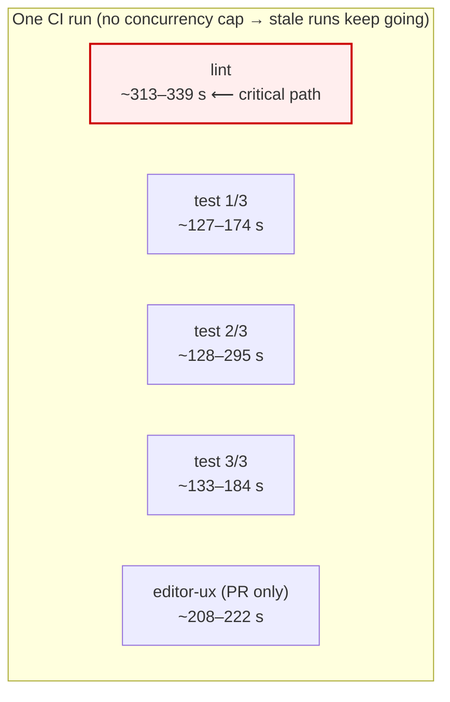
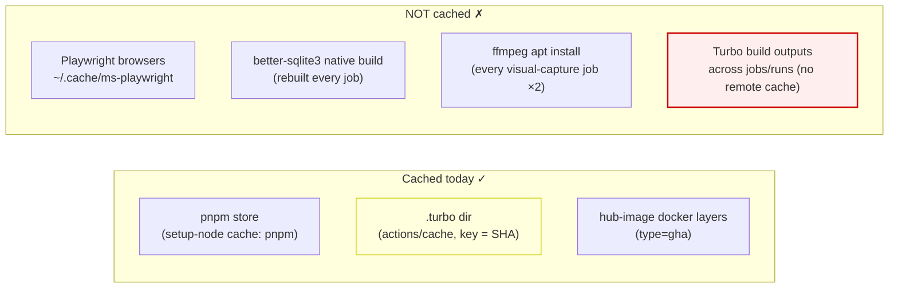
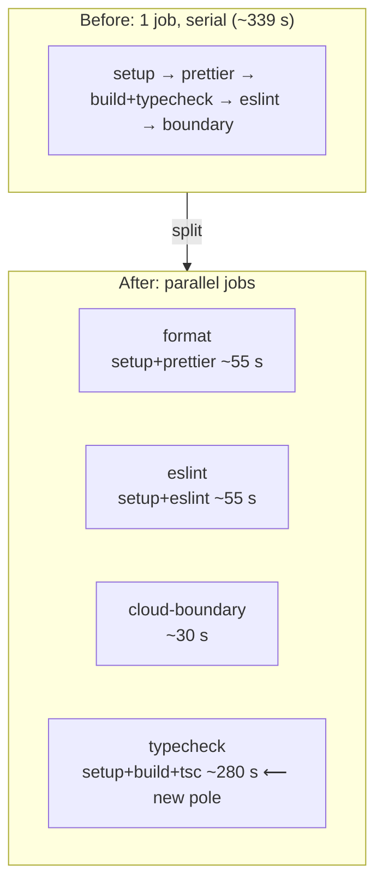
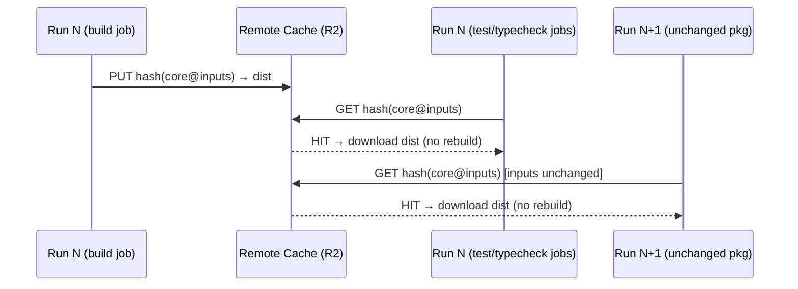
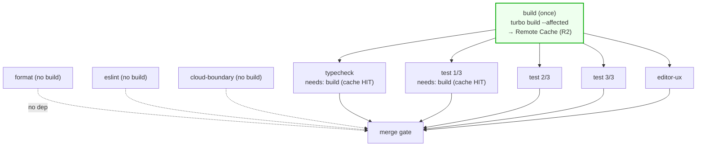

# Parallelizing And Caching The CI Pipeline

## Problem Statement

CI feels slower than it should. The questions on the table:

1. **Can we parallelize more CI work?** Specifically, can `lint` run in
   parallel with `test`? Can we run several things at once instead of in a
   serial chain?
2. **Are we caching everything we should?** Are we silently paying to rebuild
   or re-download things that a cache could give us for free?

This exploration measures the *actual* pipeline (per-job and per-step timings
pulled from real GitHub Actions runs), finds where wall-clock and runner
minutes leak, and proposes a concrete, prioritized plan.

## Executive Summary

The headline answer to "can lint run in parallel with test?" is: **they already
do.** `lint`, `test` (×3 shards), and `editor-ux` are separate jobs that run
concurrently today. The real waste is *inside* the `lint` job and *across*
every job:

- **The `lint` job is the critical path (~313–339 s) and 73 % of it is one
  serial step — `pnpm turbo run build typecheck` (249 s).** Prettier (29 s) and
  ESLint (28 s) are tiny but sit serially *behind* that build, even though
  neither needs it. Splitting them out is a near-free win.
- **The build is recomputed from scratch in ~6 jobs and never shared within a
  run.** There is **no Turbo Remote Cache** — only a local `.turbo` directory
  cached by `actions/cache` keyed on the commit SHA, which parallel jobs cannot
  share (the cache is only written in a job's post-step). This is the single
  biggest lever.
- **`ci.yml` and `schema-check.yml` have no `concurrency` block.** Push three
  commits to a PR and three full CI runs execute in parallel; none get
  cancelled. Every other workflow already sets `cancel-in-progress: true`.
- **Caching gaps:** Playwright browsers (re-downloaded in `editor-ux` and twice
  in `visual-capture`), `better-sqlite3` (rebuilt every job), and `ffmpeg`
  (apt-installed every visual run) are all uncached.
- **A likely-removable build:** the `test` job runs `turbo run build
  --filter='./packages/*'` (85 s/shard), but Vitest aliases every `@xnetjs/*`
  import to `src/` — no test imports `dist/`. That build is probably dead weight
  for the test run and is worth an experiment to delete.

Recommended path, in three tiers:

| Tier | Change | Risk | Est. wall-clock impact |
|------|--------|------|------------------------|
| 1 | `concurrency` on `ci.yml`/`schema-check.yml` | trivial | saves runner minutes; faster feedback on latest push |
| 1 | Split `lint` → `format` + `eslint` + `typecheck` + `boundary` jobs | low | linters stop hiding behind the 249 s build |
| 1 | Cache Playwright browsers + `better-sqlite3` | low | shaves setup off `editor-ux`/`visual-capture` |
| 2 | **Turbo Remote Cache (self-hosted on R2)** + a single upstream `build` job | medium | the build becomes a cache hit; target ~5.5 min → ~2–3 min on warm cache |
| 3 | Drop `build` from the `test` job (verify first) | low after verify | ~85 s off every shard |
| 3 | `turbo run build --affected` in PR CI; trim `fetch-depth` | low | only build/clone what changed |

## Current State In The Repository

### Workflows

```
.github/workflows/
  ci.yml                   ← lint + test (×3 shards) + editor-ux   ← focus
  fallow.yml               ← code-health audit (own build + coverage)
  schema-check.yml         ← schema-diff (own build)
  visual-capture.yml       ← screenshots/diffs (own build + storybook + playwright)
  hub-image.yml            ← docker build + smoke (GHA docker cache ✓)
  deploy-pr-preview.yml    ← builds web app, publishes preview
  deploy-branch-preview.yml / deploy-site.yml / undeploy-site.yml
  electron-release.yml / hub-release.yml / npm-release.yml
  gh-pages-maintenance.yml / remove-*-preview.yml
.github/actions/setup/action.yml   ← shared checkout/install composite
```

The shared setup composite ([.github/actions/setup/action.yml](.github/actions/setup/action.yml))
does: `pnpm/action-setup` → `setup-node` with `cache: 'pnpm'` → restore `.turbo`
(`actions/cache`) → `pnpm install --frozen-lockfile` → **rebuild
`better-sqlite3`** (every job, via `prebuild-install`).

### The main CI graph today

[ci.yml](.github/workflows/ci.yml) defines three independent jobs (already
parallel):



### Where the time actually goes (real `gh run view` data)

`lint` job, push to `main` (run `27703817469`, total **339 s**):

```mermaid
gantt
    title lint job — steps run serially in ONE job
    dateFormat X
    axisFormat %s s
    section lint
    setup (install + sqlite rebuild)  :0, 27
    Format check (prettier)           :27, 29
    Build & Type check (turbo)        :56, 249
    Lint (eslint)                     :305, 28
    Cloud boundary                    :333, 0
```



The single `Build & Type check` step is **249 s of 339 s (73 %)**. Prettier
(29 s), ESLint (28 s), and the cloud-boundary check (≈0 s) are rounding error by
comparison — but because they live in the same job, they run *before/after* the
build instead of *alongside* it.

`test (2/3)` shard, same run (total **295 s**):

| Step | Time |
|------|------|
| checkout (`fetch-depth: 0`) | **115 s** |
| setup | 40 s |
| **Build packages (`turbo run build --filter=packages/*`)** | **85 s** |
| Run changed tests | 49 s |

Two more leaks here: the full-history checkout (`fetch-depth: 0`, needed for
`--changed`) cost 115 s in this run, and an 85 s package build precedes a 49 s
test step.

### The caching picture



The `.turbo` cache is keyed `turbo-${{ runner.os }}-${{ github.sha }}` with a
prefix restore-key `turbo-${{ runner.os }}-`
([setup/action.yml:30-35](.github/actions/setup/action.yml)). Consequences:

- **Within one run, parallel jobs cannot share build outputs** — `actions/cache`
  only *writes* in a job's post-step, so when `lint`, `test`, and `editor-ux`
  start simultaneously, none of them can see another's freshly-built `.turbo`.
  Each rebuilds.
- **Only one job per run wins the `turbo-os-<sha>` save**; the rest get "cache
  already exists, skipping save."
- **Cross-run hits are noisy:** the prefix restore-key pulls the single
  most-recent prior `.turbo`, which may have been written by any of the six jobs
  with different output sets. This is why builds still cost 85–249 s instead of
  being near-instant cache hits.

There is **no `TURBO_TOKEN`/`TURBO_TEAM`/remote-cache configuration anywhere** in
the repo (confirmed by grep). Turbo's content-addressed caching — its whole
reason for being — is running with one hand tied behind its back.

### Vitest aliases to `src`, not `dist`

[vitest.config.ts](vitest.config.ts) maps **every** `@xnetjs/*` specifier to the
package's `src/index.ts` (e.g. `'@xnetjs/core': …/packages/core/src/index.ts`).
No test file imports from `dist/` (grep returns nothing), and the only
"artifact" a test touches — canvas-core's optional WASM — has a TypeScript
fallback and a committed-source path, not a build product. The native dependency
that tests *do* need, `better-sqlite3`, comes from `node_modules` (rebuilt in
setup), not from any workspace `dist/`. **This strongly suggests the `test`
job's `turbo run build --filter='./packages/*'` is unnecessary for the test run
itself** — a hypothesis worth one experiment.

## External Research

### Turbo Remote Cache on GitHub Actions

Turborepo's caching is content-addressed: a task's output is keyed by a hash of
its inputs (source, deps, env). A **remote cache** lets that hash be resolved by
*any* machine — so an unchanged package built on a previous run, or in a sibling
job, is a download instead of a rebuild. Options:

- **Vercel Remote Cache (managed, free tier).** Set `TURBO_TOKEN` +
  `TURBO_TEAM`; zero infrastructure. Simplest, but couples CI to Vercel and
  ships build outputs to a third party.
- **Self-hosted `ducktors/turborepo-remote-cache`** backed by S3-compatible
  storage. There's a wrapper action (`trappar/turborepo-remote-cache-gh-action`)
  that runs it as a background process during the job. xNet **already uses
  Cloudflare R2** (Litestream/storage), and R2 is S3-API-compatible — so the
  cache can live in an existing bucket with no new vendor.
- **`zwave-js/turborepo-cache`** (Cloudflare KV/Workers) and
  **`brunojppb/turbo-cache-server`** (Rust) are other self-host paths; the
  Cloudflare option again fits the existing stack.
- ⚠️ **Avoid the "GHA-cache-as-turbo-backend" action.** The community action
  that turned GitHub's own Actions Cache into a turbo remote backend is
  **no longer maintained and is broken** by upstream Cache Service API changes.
  Don't build on it.

Real-world reports (e.g. Mercari Engineering) describe remote caching turning
multi-minute monorepo CI into seconds on warm caches.

### Turbo `--affected`

Turbo 2.0+ (we're on `^2.0.0`) supports `turbo run <task> --affected`, which
uses git to build/test only packages changed relative to a base ref — a natural
fit for PR CI, complementary to (not a replacement for) remote caching.

### Playwright browser caching

Playwright downloads browsers to `~/.cache/ms-playwright`. Best practice is to
`actions/cache` that path keyed on the **Playwright version** (we pin
`@playwright/test` `1.58.1`, so the key is stable), and gate the
`playwright install` step on `cache-hit != 'true'`. Keying on the pinned version
(not the lockfile) maximizes hits.

### `concurrency` / `cancel-in-progress`

GitHub Actions' standard pattern for PR-driven workflows is a `concurrency`
group keyed on the PR/ref with `cancel-in-progress: true`, so a new push cancels
the superseded run. Every xNet workflow uses this **except `ci.yml` and
`schema-check.yml`**.

## Key Findings

1. **Lint and test are already parallel jobs.** The premise "could we run lint
   in parallel with test" is satisfied at the job level. The bottleneck is
   intra-job serialization and cross-job duplication, not job-level
   parallelism.
2. **The critical path is `lint`, and within it, `build typecheck` (249 s).**
   Everything else in that job is < 30 s.
3. **Prettier and ESLint don't need a build but wait behind it.** Free latency
   if split into their own jobs.
4. **The build runs ~6× per push, shared 0×.** No remote cache + SHA-keyed local
   cache + parallel job start = every job rebuilds.
5. **No `concurrency` on `ci.yml`/`schema-check.yml`** → superseded runs keep
   burning minutes.
6. **Uncached: Playwright browsers, `better-sqlite3`, `ffmpeg`.**
7. **The `test` job's package build is probably unnecessary** (Vitest → `src`).
8. **`fetch-depth: 0` on the test job** can cost > 100 s; only the base ref is
   actually needed for `--changed`.
9. Good things to keep: pnpm-store cache, docker `type=gha` cache, test
   sharding (3×), `paths-ignore` for docs.

## Options And Tradeoffs

### A. Split the monolithic `lint` job

Turn one serial job into parallel jobs that each do one thing:



- **Pro:** Prettier/ESLint/boundary failures surface in < 1 min instead of after
  the 249 s build. The pipeline's true long pole (`typecheck`) is now isolated
  and obvious.
- **Con:** More jobs = more `setup` repetitions (install + sqlite rebuild ~30 s
  each). Without shared caching the build still happens in `typecheck` *and*
  `test`. So A is necessary but not sufficient — it pairs with D.
- **Note:** `typecheck` needs `^build` (turbo builds dependencies first), so it
  genuinely needs a build; `eslint`/`prettier` do not.

### B. Build once, fan out via artifacts (no external service)

A dedicated `build` job builds all `dist/`, uploads it as an artifact;
downstream jobs `needs: build` and download.

- **Pro:** No third-party cache; build computed exactly once per run.
- **Con:** Serializes build → everything (downstream jobs idle until build
  finishes); artifact upload/download of dozens of `dist/` folders has real
  overhead; gives **no cross-run** reuse. Weaker than remote caching.

### C. Turbo Remote Cache (the real fix)

Back turbo's content cache with shared storage so build outputs are reused
across jobs **and** across runs.



- **C1 — Vercel free tier:** add `TURBO_TOKEN`/`TURBO_TEAM` secrets. Minimal
  effort; external dependency.
- **C2 — self-hosted on Cloudflare R2 (recommended):** run
  `ducktors/turborepo-remote-cache` against an existing R2 bucket via
  `trappar/turborepo-remote-cache-gh-action`, set
  `TURBO_API`/`TURBO_TOKEN`/`TURBO_TEAM` env. Keeps build artifacts in
  infrastructure xNet already operates; no new vendor.
- **Pro (both):** the build collapses to a cache hit on unchanged packages —
  the 249 s/85 s steps approach seconds. Pairs perfectly with a single upstream
  `build` job so even within a cold run the build happens once.
- **Con:** operational surface (a bucket, secrets, a background server for C2);
  cache-poisoning hygiene (scope keys per-OS/per-node-version).

### D. Trim redundant work

- **D1:** Delete the `build` step from the `test` job (Vitest aliases to `src`).
  Verify by running the full suite without it.
- **D2:** `turbo run build --affected` in PR CI (build only changed packages).
- **D3:** Replace `fetch-depth: 0` on the test job with a targeted
  `git fetch origin <base>` (the only ref `--changed` needs).
- **D4:** Cache `~/.cache/ms-playwright` (key on `1.58.1`) and
  `better-sqlite3` build output (key on node + pkg version); gate installs on
  cache-miss. Drop `apt-get update` before `ffmpeg` or use a cached setup-ffmpeg
  action.

### E. Concurrency

Add to `ci.yml` and `schema-check.yml`:

```yaml
concurrency:
  group: ci-${{ github.event.pull_request.number || github.ref }}
  cancel-in-progress: true
```

- **Pro:** stops N parallel runs per PR; latest push wins; frees runner minutes.
- **Con:** none meaningful for PRs. (Keep `main` pushes uncancelled if you want a
  full record per merge — the `||` ref grouping already isolates each `main`
  commit by SHA-less ref, so consecutive main pushes share a group; if that's
  undesirable, gate cancellation to `pull_request` only.)

## Recommendation

Adopt the three tiers in order — each is independently shippable and each tier
de-risks the next.

**Tier 1 (this PR-sized change, low risk, immediate):**

1. Add `concurrency` blocks to `ci.yml` and `schema-check.yml` (Option E).
2. Split `lint` into `format`, `eslint`, `cloud-boundary`, and `typecheck` jobs
   (Option A).
3. Cache Playwright browsers + `better-sqlite3`; fix `ffmpeg` install (D4).

**Tier 2 (the structural win):**

4. Stand up **Turbo Remote Cache on R2** (Option C2) and add a single upstream
   `build` job that the others `needs:`. This is where ~5.5 min → ~2–3 min on
   warm caches comes from, because the build stops being recomputed six times.

**Tier 3 (verify-then-cut):**

5. Experiment: remove the `build` step from `test` (D1); if the suite is green,
   keep it removed.
6. Switch PR builds to `--affected` (D2) and trim the test job's checkout depth
   (D3).

Rationale: Tiers 1 and 3 are cheap and partly independent of caching, so they
pay off even if remote caching slips. Tier 2 is the highest-leverage change but
carries operational surface, so it lands once the cheap wins are banked and the
job graph is already split (so the remote cache has a clean `build` job to feed).

### Target job graph



`format`/`eslint`/`cloud-boundary` run without waiting on `build`;
`typecheck`/`test`/`editor-ux` depend on `build` but hit the remote cache, so
they download `dist/` instead of recomputing it.

## Example Code

### Tier 1 — concurrency (ci.yml header)

```yaml
name: CI
on:
  push: { branches: [main], paths-ignore: ['*.md','**/*.md','docs/**','.github/*.md'] }
  pull_request: { branches: [main], paths-ignore: ['*.md','**/*.md','docs/**','.github/*.md'] }

concurrency:
  group: ci-${{ github.event.pull_request.number || github.ref }}
  cancel-in-progress: ${{ github.event_name == 'pull_request' }}
```

### Tier 1 — split lint into parallel jobs

```yaml
jobs:
  format:
    runs-on: ubuntu-latest
    steps:
      - uses: actions/checkout@v4
      - uses: ./.github/actions/setup
      - run: pnpm prettier --check "packages/**/*.{ts,tsx}" "apps/**/*.{ts,tsx}"

  eslint:
    runs-on: ubuntu-latest
    steps:
      - uses: actions/checkout@v4
      - uses: ./.github/actions/setup
      - run: pnpm lint        # eslint needs no build

  cloud-boundary:
    runs-on: ubuntu-latest
    steps:
      - uses: actions/checkout@v4
      - uses: ./.github/actions/setup
      - run: pnpm check:cloud-boundary

  typecheck:
    runs-on: ubuntu-latest
    steps:
      - uses: actions/checkout@v4
      - uses: ./.github/actions/setup
      - run: pnpm turbo run build typecheck   # genuinely needs ^build
```

### Tier 1 — cache Playwright browsers (editor-ux / visual-capture)

```yaml
- name: Cache Playwright browsers
  id: pw-cache
  uses: actions/cache@v4
  with:
    path: ~/.cache/ms-playwright
    key: playwright-${{ runner.os }}-1.58.1   # pinned @playwright/test version
- name: Install Playwright browsers
  if: steps.pw-cache.outputs.cache-hit != 'true'
  run: pnpm --filter @xnetjs/e2e-tests exec playwright install --with-deps chromium webkit
- name: Install Playwright system deps (always — cheap, not in the cached path)
  if: steps.pw-cache.outputs.cache-hit == 'true'
  run: pnpm --filter @xnetjs/e2e-tests exec playwright install-deps chromium webkit
```

### Tier 1 — cache better-sqlite3 build (setup/action.yml)

```yaml
- name: Cache better-sqlite3 build
  id: sqlite-cache
  uses: actions/cache@v4
  with:
    path: node_modules/.pnpm/better-sqlite3@*/node_modules/better-sqlite3/build
    key: bsqlite-${{ runner.os }}-node${{ inputs.node-version }}-${{ hashFiles('pnpm-lock.yaml') }}
- name: Rebuild better-sqlite3
  if: steps.sqlite-cache.outputs.cache-hit != 'true'
  run: |
    rm -rf node_modules/.pnpm/better-sqlite3@*/node_modules/better-sqlite3/build
    cd node_modules/.pnpm/better-sqlite3@*/node_modules/better-sqlite3 && npx --yes prebuild-install || npm run build-release
  shell: bash
```

### Tier 2 — self-hosted Turbo Remote Cache on R2

```yaml
  build:
    runs-on: ubuntu-latest
    env:
      TURBO_API: http://127.0.0.1:3000
      TURBO_TOKEN: ${{ secrets.TURBO_CACHE_TOKEN }}
      TURBO_TEAM: xnet
    steps:
      - uses: actions/checkout@v4
      - uses: ./.github/actions/setup
      - uses: trappar/turborepo-remote-cache-gh-action@v2   # background ducktors server → R2
        with:
          storage-provider: s3
          storage-path: ${{ secrets.R2_TURBO_BUCKET }}
        env:
          S3_ENDPOINT: ${{ secrets.R2_S3_ENDPOINT }}
          S3_ACCESS_KEY_ID: ${{ secrets.R2_ACCESS_KEY_ID }}
          S3_SECRET_ACCESS_KEY: ${{ secrets.R2_SECRET_ACCESS_KEY }}
      - run: pnpm turbo run build --affected --remote-only
  # downstream jobs set the same TURBO_* env and `needs: build`
```

## Risks And Open Questions

- **Is the `test` job's build truly removable?** Evidence says yes (Vitest →
  `src`, no `dist` imports, WASM has a TS fallback). But the `integration`
  project spins real servers and the `data-bridge`/`runtime`/`labs` projects use
  Yjs/SES/WASM — verify the *whole* suite green without the build before
  cutting. Treat D1 as an experiment, not a foregone conclusion.
- **Remote cache poisoning / correctness.** Cache keys must include OS and node
  version; a bad entry can serve stale `dist`. Scope keys, and keep
  `--remote-only` off for the `build` job's first populate.
- **Self-hosted cache availability.** If the R2-backed server hiccups, builds
  must fall back to local compute (turbo does this automatically) — confirm CI
  degrades gracefully rather than failing.
- **More jobs ⇒ more `setup` repetitions.** Splitting `lint` multiplies the
  ~30 s install/sqlite-rebuild cost across jobs. Tier-1 caching (sqlite) and
  Tier-2 (sharing the build) offset this; without them, splitting trades one
  long job for several medium ones (still a latency win, possibly a
  runner-minutes wash).
- **`fetch-depth` for `--changed`.** Trimming to a targeted fetch must still
  give Vitest the base ref; validate `--changed=origin/<base>` resolves.
- **`cancel-in-progress` on `main`.** Decide whether consecutive `main` pushes
  should cancel each other (the example gates cancellation to PRs to preserve a
  full record per merge).
- **Timings are samples, not averages.** The 115 s checkout and 295 s shard are
  from specific runs and include network variance; treat them as
  order-of-magnitude, and re-measure after each tier.

## Implementation Checklist

**Tier 1 — parallelize + cheap caches**

- [ ] Add `concurrency` (PR-scoped `cancel-in-progress`) to `ci.yml`.
- [ ] Add `concurrency` to `schema-check.yml`.
- [ ] Split `lint` job into `format`, `eslint`, `cloud-boundary`, `typecheck`.
- [ ] Update branch-protection required checks to the new job names
      (`format`, `eslint`, `typecheck`, …) — renaming `lint` will orphan the
      old required check.
- [ ] Cache `~/.cache/ms-playwright` (key on `1.58.1`) in `editor-ux` and both
      `visual-capture` jobs; gate `playwright install` on cache-miss.
- [ ] Cache `better-sqlite3` build output in the setup composite; gate rebuild.
- [ ] Drop `apt-get update` (or adopt a cached ffmpeg setup) in `visual-capture`.

**Tier 2 — remote cache + single build**

- [ ] Provision an R2 bucket + scoped credentials for the turbo cache (or decide
      on Vercel free tier).
- [ ] Add `TURBO_*` (+ `R2_*`) repo secrets.
- [ ] Add a `build` job that populates the remote cache via `--affected`.
- [ ] Add `needs: build` + `TURBO_*` env to `typecheck`, `test`, `editor-ux`.
- [ ] Make the setup composite remote-cache aware (env wiring), keep local
      `.turbo` as fallback.
- [ ] Roll remote-cache env into `fallow.yml`, `schema-check.yml`,
      `visual-capture.yml`, `deploy-*` so they hit the cache too.

**Tier 3 — trim**

- [ ] Experiment: remove `turbo run build` from the `test` job; run full suite.
- [ ] If green, delete it (and from `editor-ux` if equally unneeded).
- [ ] Switch PR `build`/`test` to `--affected`.
- [ ] Replace `fetch-depth: 0` on `test` with a targeted base-ref fetch.

## Validation Checklist

- [ ] Pushing two commits in quick succession to a PR leaves exactly **one**
      running CI run (the older is cancelled).
- [ ] A formatting-only error fails the `format` job in < 90 s (no longer waits
      on the 249 s build).
- [ ] `gh run view <id> --json jobs` shows the new parallel job graph; no single
      job dominates at > ~300 s on a warm cache.
- [ ] On a no-op change (touch a comment), the `build` job reports turbo
      **cache hits** for unchanged packages (`>>> FULL TURBO`), and total
      wall-clock drops toward the ~2–3 min target.
- [ ] Playwright step logs "cache hit" and skips the browser download on the
      second run with an unchanged version.
- [ ] `better-sqlite3` rebuild is skipped on a cache hit; native-module tests
      still pass.
- [ ] Full Vitest suite (all projects: unit/dom/integration/editor/data-bridge/
      runtime/labs) passes **without** the `test`-job build step.
- [ ] Required status checks on `main` match the renamed jobs; PRs can still
      merge.
- [ ] Remote-cache outage simulation (bad `TURBO_API`) degrades to local build
      rather than failing CI.

## References

- [.github/workflows/ci.yml](.github/workflows/ci.yml) — lint/test/editor-ux jobs
- [.github/actions/setup/action.yml](.github/actions/setup/action.yml) — shared install + `.turbo` cache + sqlite rebuild
- [turbo.json](turbo.json) — task graph (`build` `^build`, `typecheck` `^build`, `test` deps `build`)
- [vitest.config.ts](vitest.config.ts) — `@xnetjs/*` → `src` aliases; project sharding
- [.github/workflows/visual-capture.yml](.github/workflows/visual-capture.yml) — Playwright + ffmpeg installs
- [.github/workflows/fallow.yml](.github/workflows/fallow.yml) / [schema-check.yml](.github/workflows/schema-check.yml) — extra builds
- [.github/workflows/hub-image.yml](.github/workflows/hub-image.yml) — docker `type=gha` cache (good prior art)
- [Turborepo Remote Caching](https://turborepo.com/docs/core-concepts/remote-caching) — concepts + custom-server API
- [ducktors/turborepo-remote-cache](https://github.com/ducktors/turborepo-remote-cache) — self-hosted server (S3/R2)
- [trappar/turborepo-remote-cache-gh-action](https://github.com/trappar/turborepo-remote-cache-gh-action) — runs it in CI
- [zwave-js/turborepo-cache](https://github.com/zwave-js/turborepo-cache) — Cloudflare-KV self-host
- [Mercari: Turborepo Remote Cache accelerating CI](https://engineering.mercari.com/en/blog/entry/20260216-turborepo-remote-cache-accelerating-ci-to-move-fast/)
- [Setting up Turborepo Remote Cache with S3 + GitHub Actions](https://januschung.github.io/blog/2025/05/17/setting-up-turborepo-remote-cache-with-s3-and-github-actions/)
- [Cache Playwright browsers on GitHub Actions](https://playwrightsolutions.com/playwright-github-action-to-cache-the-browser-binaries/)
- [GitHub Actions: concurrency / cancel-in-progress](https://docs.github.com/en/actions/using-jobs/using-concurrency)
