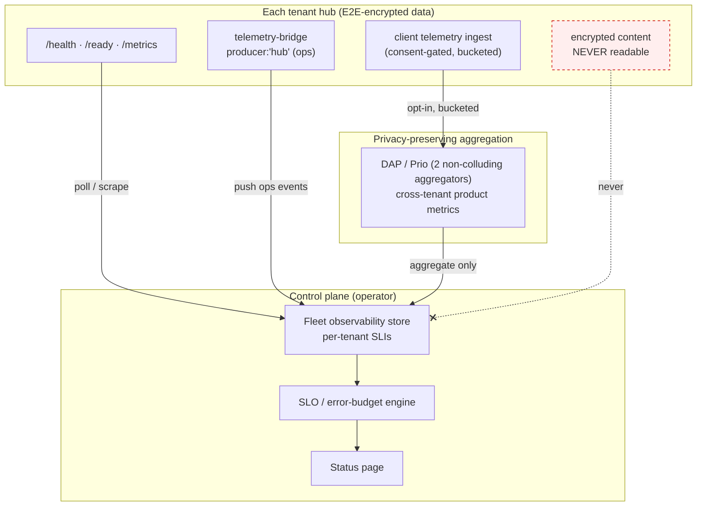
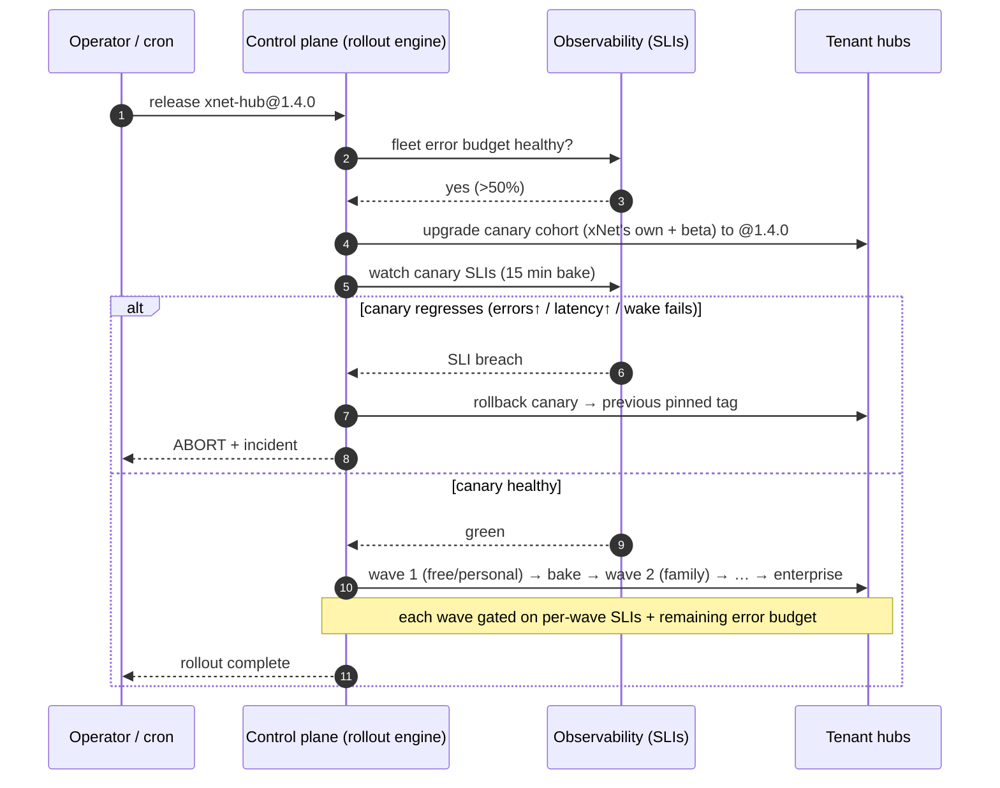
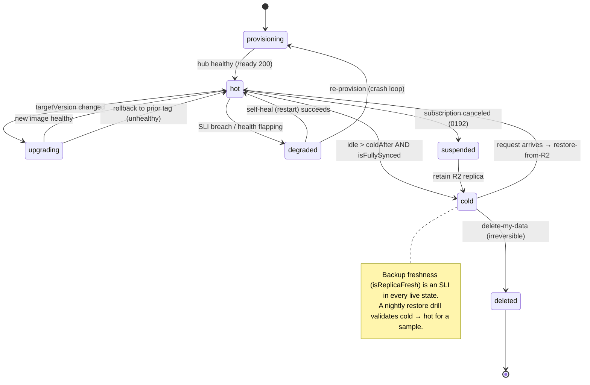
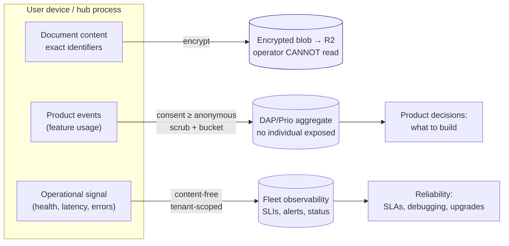

# xNet Cloud — Operating the Fleet: Upgrades, Backups, Telemetry, and SLAs

## Problem Statement

xNet Cloud provisions one isolated, end-to-end-encrypted hub per paying tenant
(exploration [0180](0180_[_]_XNET_CLOUD_ARCHITECTURE_AND_COMPLETION_STATUS.md);
the signup→provision→connect "face" landed in
[0192](0192_[_]_XNET_CLOUD_ONBOARDING_AND_UI_HOSTING.md)). Running that fleet for
real raises four entangled operational questions:

1. **Upgrades** — how do we roll a new hub image to thousands of tenant hubs
   without breaking them, and roll back fast when one regresses?
2. **Backups** — how is each tenant's data continuously protected, and how do we
   *prove* we can actually restore it?
3. **Telemetry** — the hard one. The data is E2E-encrypted; **we hold bytes we
   cannot read**. Yet we still need (a) operational signal to keep hubs healthy
   and debug incidents, and (b) product signal — "how are people using this?" —
   to know what to build. How do we get both *without* breaking the privacy
   promise that is the entire point of xNet?
4. **Uptime / SLAs** — what do we promise, how do we measure it, and how do we
   automate enough that tenants get high uptime with minimal human toil?

The tension the user named directly: **secure & private vs. observable**. This
document argues that the tension is already largely resolved in the codebase —
xNet shipped a privacy-preserving telemetry stack (0187/0190) that respects the
encryption boundary by construction — and that the real work is *operationalizing*
it for the fleet and wiring it to upgrades, backups, and SLOs.

## Executive Summary

**The good news: the hard primitives exist and are tested.** Continuous backups
(Litestream → R2, drain-before-close, restore-on-boot), the cold-tier lifecycle
(`demoteIfCold`/`reactivate` with a sync gate), per-tenant immutable image tags,
the one-step `upgradeTenant`, the hub's `/health` + `/ready`, and a full
privacy-first telemetry pipeline (consent-gated, scrubbed, bucketed client events
+ a separate `telemetry.db` with hashed DIDs and hourly rollups) are all shipped.

**What's missing is orchestration and measurement, not primitives:**

- **Upgrades** are a single per-tenant step with no cohorting, no automatic
  rollback, and no signal to gate on. There is no fleet-level rollout engine.
- **Backups** replicate continuously but there is **no automated restore drill**
  (we have never proven a real tenant restores), no retention/PITR policy, and
  no backup-freshness alert wired up.
- **Telemetry** is built for the *single hub / single user*, not the *fleet
  operator*. The pieces (`telemetry-bridge` Prometheus→events, `/health`,
  `/metrics`) exist but nothing aggregates them centrally into per-tenant SLIs.
- **SLAs** are **declared but not enforced**: `SlaLevel` is a field in the plan
  catalog (`none`/`best-effort`/`99.9`/`custom`) that nothing measures, alerts
  on, or honors.

**The core design move** is a **three-plane telemetry model** aligned to xNet's
two-identity split, plus a **control-plane reconciliation loop** that turns
health signal into automated upgrades, self-healing, and SLO accounting:

| Plane | What it is | Who it belongs to | Default |
|---|---|---|---|
| **Operational** | per-hub up/down, latency, error rate, backup freshness, wake latency, resource use — **no content, tenant-scoped** | xNet (we run the infra) | **on** for managed hubs |
| **Product** | feature-usage events — *which* surfaces get used | the user (it's their behavior) | **consent-gated**, scrubbed, bucketed; cross-tenant only via privacy-preserving aggregation |
| **Encrypted** | document content, exact identifiers, plaintext | the user, end-to-end | **never leaves the device unencrypted; we cannot read it** |

**Recommendation:** operationalize the existing telemetry for the fleet (Plane 1
by default, Plane 2 by consent), define SLIs/SLOs/error budgets per plan tier,
and build an **error-budget-gated canary→waves→auto-rollback upgrade engine** on
top of the existing one-step `upgradeTenant`. Make the control plane a
**reconciliation loop** (desired vs. actual per tenant) so uptime, backups,
upgrades, and self-healing are all automated convergence rather than scripts.

## Current State In The Repository

### Upgrades — one immutable step, no orchestration

[`ControlPlane.upgradeTenant`](apps/cloud/src/control-plane.ts) rolls a single
tenant to a new image and records the version:

```
apps/cloud/src/control-plane.ts
  async upgradeTenant(tenantId, targetVersion) {
    const handle = await this.deps.provisioner.upgrade(record.substrateRef, targetVersion)
    await this.deps.tenants.put({ ...record, targetVersion: handle.targetVersion })
  }
```

- The [`Provisioner`](packages/cloud/src/provisioner/types.ts) interface
  (`provision`/`upgrade`/`setEnv`/`sleep`/`destroy`/`get`) is the swappable seam.
  `MemoryProvisioner` works; **`CloudRunLitestreamProvisioner` and
  `FargateLitestreamProvisioner` throw `NotImplementedError`** — nothing has ever
  upgraded a real hub.
- **Image tags are immutable and pinned per tenant, never `:latest`** (the
  comment in `provisioner/types.ts` is explicit); the default is
  `HUB_IMAGE_TAG` (e.g. `xnet-hub@0.0.1`). This is what makes instant rollback
  *possible* (just re-point to the previous tag) — but no code does it.
- The hub `Dockerfile` pins **Litestream v0.5.3** (v0.5.6/0.5.7 have a
  silent-replication bug #1083). The hub image is content-built, not `:latest`.
- **Gap:** no cohorting, no canary, no health-gated promotion, no rollback. The
  caller is expected to drive the sequence by hand.

### Backups — continuous, gated, but never restore-tested

The Litestream module (`packages/cloud/src/litestream/`) is complete:

- [`config.ts`](packages/cloud/src/litestream/config.ts) — per-tenant replica at
  R2 path `t/<tenantId>/db`, `syncInterval: 1s` (≈1 s RPO on hard kill,
  near-zero on graceful shutdown), secrets injected as env refs.
- [`controller.ts`](packages/cloud/src/litestream/controller.ts) —
  `LitestreamController.drain(graceMs)` SIGTERMs Litestream and waits for it to
  flush final WAL frames before the machine dies (drain-before-close).
- [`litestream-entrypoint.sh`](packages/hub/litestream-entrypoint.sh) —
  restore-on-boot for **both** `hub.db` and `telemetry.db`, then
  `litestream replicate -exec node`.
- [`freshness.ts`](packages/cloud/src/litestream/freshness.ts) — `isFullySynced`
  (the demotion gate: never destroy a live DB until its last write is durable)
  and `isReplicaFresh` (lag alert).
- The hub gates `PRAGMA wal_autocheckpoint=0` behind `LITESTREAM=1`
  ([`storage/litestream.ts`](packages/hub/src/storage/litestream.ts)) so SQLite
  doesn't race Litestream and lose frames.

**Gaps:** no **retention / point-in-time-recovery policy** (R2 lifecycle is
external IaC that doesn't exist yet); **no automated restore-verification drill**
(0180's validation checklist flags that RPO/wake have never been measured against
a real deploy); the **single-writer fence** relies on the control plane plus a
Litestream S3 conditional-write lease that isn't exercised.

### Cold tiering — the uptime/cost lever, implemented on the fake

[`demoteIfCold`/`reactivate`/`markActive`](apps/cloud/src/control-plane.ts)
implement the 0178 model: an idle hot tenant is confirmed synced
(`assertSynced`), its machine destroyed, marked `cold`; on demand a fresh hub is
provisioned with `restoreFromR2`. Plan isolation tiers
([`packages/entitlements/src/plans.ts`](packages/entitlements/src/plans.ts)) set
the uptime posture: `dedicated-sleep` (personal/family, scale-to-zero) vs
`dedicated-warm` (team, always-on). Cost is modeled in
[`cost/pricing.ts`](packages/cloud/src/cost/pricing.ts) (warm ≈ $6/mo vs active
$0.00266/h; R2 $0.015/GB).

### Health — exists on the hub, unused by the fleet

The hub serves `GET /health` (uptime, room count, doc pool, connections, memory,
platform/region/machineId) and `GET /ready` (writes a readiness key)
([`packages/hub/src/server.ts`](packages/hub/src/server.ts)), and fingerprints
its substrate (`K_SERVICE`→Cloud Run, etc.) in
[`config.ts`](packages/hub/src/config.ts). **Nothing in the control plane polls
these or derives availability from them.**

### Telemetry — a privacy-first pipeline already exists (0187 + 0190)

This is the crux, and it is **already built to respect the encryption boundary**:

- **Client** ([`@xnetjs/telemetry`](packages/telemetry/src/)): a 5-tier consent
  model (`off`(default)/`local`/`crashes`/`anonymous`/`identified`,
  [`consent/types.ts`](packages/telemetry/src/consent/types.ts)); a collector
  that **scrubs** PII (UUIDs, DIDs, tokens, paths, emails, IPs —
  [`collection/scrubbing.ts`](packages/telemetry/src/collection/scrubbing.ts))
  and **buckets** values (latency/count/size —
  [`collection/bucketing.ts`](packages/telemetry/src/collection/bucketing.ts));
  OTel-aligned schemas (Crash/Usage/Performance/Security); an IndexedDB durable
  buffer; an HTTP transport with `keepalive`.
- **Tracing** (0190, [`tracing/`](packages/telemetry/src/tracing/)): exact-timing
  waterfalls stay in a **local ring buffer that never syncs**; only
  `emitTraceAsBuckets` ([`tracing/egress.ts`](packages/telemetry/src/tracing/egress.ts))
  ships **bucketed** per-stage metrics with opaque trace/span IDs.
- **Hub store** (0187, [`packages/hub/src/telemetry/`](packages/hub/src/telemetry/store.ts)):
  a **separate `telemetry.db`**; DIDs **hashed server-side** with a salt
  ([`normalize.ts`](packages/hub/src/telemetry/normalize.ts)); `POST
  /telemetry/ingest` (UCAN-auth, ≤500/batch); **hourly rollups maintained on
  ingest**; admin-gated reads; lazy DuckDB `ATTACH` joins
  ([`analytics.ts`](packages/hub/src/telemetry/analytics.ts)); Parquet cold tier
  on R2 with 7-day raw retention ([`tiering.ts`](packages/hub/src/telemetry/tiering.ts)).
- **Ops bridge** ([`middleware/telemetry-bridge.ts`](packages/hub/src/middleware/telemetry-bridge.ts)):
  reads Prometheus `/metrics` every 60 s and emits `producer:'hub'` events
  (ws connections, sync docs, backup uploads, query duration, rate-limit
  rejections). **This is the seam the fleet operator should consume — it's off by
  default.**

**What the hub can see today:** hashed DIDs, OS/version, error *kinds*, bucketed
latencies/counts, opaque trace IDs. **What it cannot see:** content, exact
identifiers, plaintext timings. The privacy posture is genuinely good.

**Gap for the fleet:** every bit of this is scoped to *one hub serving its own
users*. There is no **central, cross-tenant operator view**: no place the
control plane aggregates per-tenant health into SLIs, no fleet dashboard, no
alerting, no status page. AI usage *is* metered centrally
([`cloud/src/ai/metering.ts`](packages/cloud/src/ai/metering.ts), idempotent
ledger + Stripe meter), which is the one existing example of central per-tenant
accounting to mirror.

### SLAs — a field nobody enforces

`SlaLevel` (`none`/`best-effort`/`99.9`/`custom`) is declared per plan in
[`plans.ts`](packages/entitlements/src/plans.ts) and rides inside the signed
`HUB_PLAN` token, but **no SLI is measured, no SLO is published, no error budget
is computed, and no alert or credit is triggered**. It is documentation, not
control.

## External Research

**SRE SLO/error-budget discipline is the right backbone.** Google's practice:
an **SLI** is a ratio of good events to valid events (availability = successful
requests / valid requests); an **SLO** is a target over a rolling window; the
**error budget = 100% − SLO**. The numbers matter for what we can promise: 99.9%
≈ **43 min/month** of allowed downtime, 99.99% ≈ **4 min/month**. The
**error-budget policy** is the automation hook: budget healthy (>50%) → ship
fast; low (<25%) → slow down, extra review; exhausted → **freeze non-reliability
deploys**. This directly answers "how do upgrades and SLAs relate" — the error
budget *gates the rollout*.

**Privacy-preserving aggregate telemetry is a solved, deployed problem.**
**Prio / DAP (Distributed Aggregation Protocol)**, operated by ISRG's **Divvi
Up** with the **Janus** aggregator, splits each metric across **two
non-colluding servers** so that — as long as one server is honest — the
operators "learn nearly nothing" about any individual; only the *aggregate* is
revealed, and recent versions compose it with **differential privacy**. **Firefox
ships this in production** (Mozilla + Divvi Up as DAP provider, Fastly as the
OHTTP relay that strips client IPs). This is the gold standard for Plane 2 ("how
are people using the product?") **across tenants** without ever exposing one
tenant's behavior — and xNet's egress adapter is already a pluggable seam to feed
it.

**Progressive delivery with automatic rollback is standard.** The canary pattern
(e.g. Argo Rollouts): shift a small cohort first (20% → 50% → 100%), watch
error-rate/latency against thresholds, and **auto-rollback** if they regress;
fleets are addressed by generating one rollout per cell/cohort. Per-tenant
immutable tags make xNet's rollback trivial (re-point to the prior tag). A
public **status page** fed by the same SLIs is the standard transparency layer.

**Litestream is built for this backup story.** v0.5's LTX format + hierarchical
compaction give point-in-time recovery and fast restores (≈1–3 s for 100 MB,
10–30 s for 1 GB), and S3 conditional writes provide the single-writer lease —
but the operational maturity caveat (pin a known-good version; test restores)
stands.

Sources:
[Google SRE — SLOs](https://sre.google/sre-book/service-level-objectives/),
[Google SRE — Error Budget Policy](https://sre.google/workbook/error-budget-policy/),
[Error budgets guide (OneUptime)](https://oneuptime.com/blog/post/2025-09-03-what-are-error-budgets/view),
[Divvi Up — privacy-preserving telemetry + DP](https://divviup.org/blog/combining-privacy-preserving-telemetry-with-differential-privacy/),
[Divvi Up in Firefox](https://divviup.org/blog/divvi-up-in-firefox/),
[Divvi Up (LWN)](https://lwn.net/Articles/983843/),
[Argo Rollouts — canary](https://argo-rollouts.readthedocs.io/en/stable/features/canary/),
[Canary + automated rollback (Headout)](https://www.headout.studio/canary-deployment-with-automated-rollback/),
[Litestream v0.5 (Fly)](https://fly.io/blog/litestream-v050-is-here/).

## Key Findings

1. **The privacy/observability tension is already resolved in code — for one
   hub.** The consent + scrub + bucket + hash pipeline means the operator can see
   *operational* signal and *opt-in aggregate* usage without ever touching
   content. The job is to lift it to the *fleet*, not to invent it.
2. **Three planes, not two.** Conflating "operational health" (ours by necessity)
   with "product usage" (theirs, consented) is the trap. Operational telemetry
   for a managed hub is legitimately the operator's — it's the infra we run — and
   must be content-free and tenant-scoped. Product usage must stay consent-gated
   and, across tenants, privacy-preserving (DAP/Prio).
3. **SLAs only become real once SLIs are measured.** Until the control plane
   derives availability/latency from `/health` + the ops bridge, `SlaLevel` is
   theater. Measurement first, then published SLOs, then error budgets.
4. **Error budgets are the missing link between upgrades and SLAs.** The same
   number that defines the promise also governs how aggressively we roll new
   images. One mechanism, two payoffs.
5. **Backups are continuous but unproven.** "We replicate to R2" is not "we can
   restore your hub." An automated restore-verification drill is the single
   highest-trust, lowest-glamour win.
6. **Uptime is a wake-latency problem, not an always-on problem.** Scale-to-zero
   means the honest SLI for entry tiers is "did it wake quickly and serve?" — so
   the SLO must be defined on *successful requests including cold starts*, not
   raw machine uptime.
7. **A reconciliation loop is the simplest automation that delivers all four.**
   Desired-state-per-tenant + a controller that converges (provision, upgrade,
   demote, restart-unhealthy, alert) is less code and more robust than four
   separate scripts — and it's how the user's "automate as much as possible /
   keep it simple / max uptime" goals are actually met.

## Options And Tradeoffs

### A. Telemetry collection topology



- **(A1) Reuse the hub telemetry-bridge + `/health`, push to a central store.**
  Lowest new surface (the bridge exists); reuses the OTel event shape. Ops plane
  only. **Recommended for Plane 1.**
- **(A2) Standard OTel/Prometheus scrape from the control plane.** Industry
  standard, great tooling, but adds a metrics stack to operate and a scrape path
  into every tenant network. Good *later* if the bridge proves limiting.
- **(A3) DAP/Prio for cross-tenant product analytics.** The only way to learn
  "which features people use" across tenants **without** per-tenant exposure.
  Higher integration cost (two aggregators, OHTTP relay) — **defer to a Plane-2
  milestone**, but design the egress seam for it now (it already exists).

### B. Upgrade strategy

| Option | Mechanism | Pros | Cons |
|---|---|---|---|
| **B1. Per-tenant one-at-a-time** (today) | loop `upgradeTenant` | trivial | no safety, no rollback, manual |
| **B2. Canary → waves → auto-rollback** ✅ | cohort by risk/plan, gate on SLI, re-point tag on regression | catches bad images at ~1% blast radius; immutable tags = instant rollback | needs SLIs + a rollout engine |
| **B3. Blue-green per tenant** | run new+old, cut over | zero-downtime cutover | ~2× cost per tenant during rollout; overkill at entry tiers |

**Recommended: B2.** Cohorts: **xNet's own hubs → opt-in beta tenants → wave by
plan tier (free/personal → family → team → enterprise last)**, each wave gated on
the fleet error budget and per-tenant health, auto-rollback by re-pointing to the
previous pinned tag.

### C. Uptime model per tier

- **C1. Always-warm everything** — simplest mental model, but kills the entry
  margin (warm ≈ $6/mo vs $5/mo revenue).
- **C2. Scale-to-zero everywhere** — cheapest, but every request can eat a cold
  start; bad for `team`+.
- **C3. Hybrid by plan tier** ✅ — `dedicated-warm` (min-instances 1) for team+,
  `dedicated-sleep` for personal/family with fast Litestream restore. This is
  already the catalog's intent; make the SLO tier-aware (warm tiers get a latency
  SLO; sleep tiers get a *wake-success* SLO).

### D. SLA posture per tier

| Plan | Isolation | Published SLO (proposed) | Error budget / 30d | Enforcement |
|---|---|---|---|---|
| demo | pooled | none | — | best-effort |
| personal / family | dedicated-sleep | "best-effort," internal wake-success ≥ 99% | informational | monitor only |
| team | dedicated-warm | **99.9%** availability | ~43 min | alert + status page |
| community / company | dedicated-project | **99.9%** | ~43 min | alert + status page |
| enterprise | region-pinned | **custom** (e.g. 99.95%) | ~22 min | contractual credits |

## Recommendation

**Make the control plane a reconciliation loop with an observability spine, then
layer SLO-gated upgrades and a restore drill on top.** Concretely, in four
phases that each ship value:

1. **Phase 1 — See the fleet (Plane 1, ops).** Control plane polls each hub's
   `/health`/`/ready` and consumes the `telemetry-bridge` ops events into a
   central per-tenant store; derive three SLIs — **availability** (successful /
   valid requests, *including* cold-start waits), **latency** (bucketed), **error
   rate** — plus **backup freshness** (`isReplicaFresh`) and **wake latency**.
   Surface them in an operator dashboard and a public status page. *No new
   privacy surface: ops telemetry is content-free and tenant-scoped.*
2. **Phase 2 — Promise & protect (SLAs).** Compute per-tenant + fleet **error
   budgets** from the SLIs against the per-tier SLO table above. Wire alerting and
   the **error-budget policy** (freeze risky deploys when exhausted). Enterprise
   `custom` adds contractual credits.
3. **Phase 3 — Upgrade safely (automation).** Build the rollout engine on
   `upgradeTenant`: **canary cohort → waves by tier → automatic rollback** (re-point
   to the previous immutable tag) when a wave's SLIs regress or the error budget
   dips. Drive it from desired-state (`targetVersion` per tenant) so it's
   restartable and idempotent.
4. **Phase 4 — Prove backups + learn the product.** Add an **automated
   restore-verification drill** (nightly: restore a sample of tenants into a
   throwaway hub, assert row counts / a health query, alert on failure), an R2
   **retention/PITR lifecycle**, and — for Plane 2 — route the existing
   consent-gated client usage egress through **DAP/Prio** so cross-tenant product
   insight never exposes an individual tenant.

This keeps faith with the user's three asks: **private** (three-plane model, DAP
for cross-tenant, encryption boundary never crossed), **observable** (ops SLIs +
opt-in aggregate usage), and **simple/high-uptime** (one reconciliation loop +
continuous backups + scale-to-zero with fast wake + auto-rollback).

### Error-budget-gated canary upgrade (the upgrade↔SLA link)



### Tenant lifecycle as a reconciliation state machine



### The three telemetry planes vs. the encryption boundary



## Example Code

### Phase 1 — derive SLIs from health polling (sketch, control plane)

```ts
// apps/cloud/src/observability/sli.ts (sketch)
export interface HealthSample { ok: boolean; latencyMs: number; atMs: number }

/** Availability over a window: successful / valid probes (cold-start waits count as valid). */
export function availability(samples: HealthSample[]): number {
  if (!samples.length) return 1
  return samples.filter((s) => s.ok).length / samples.length
}

/** Error budget remaining as a fraction of the allowance (1 = full, 0 = exhausted). */
export function errorBudgetRemaining(sli: number, slo: number): number {
  const allowed = 1 - slo // e.g. 0.001 for 99.9%
  const used = Math.max(0, 1 - sli)
  return allowed === 0 ? 1 : Math.max(0, 1 - used / allowed)
}

/** Backup freshness SLI reuses the shipped helper. */
import { isReplicaFresh } from '@xnetjs/cloud/litestream'
export const backupHealthy = (lastWriteMs: number, lastSyncMs: number) =>
  isReplicaFresh(lastWriteMs, lastSyncMs, 5 * 60_000) // 5-min lag budget
```

### Phase 3 — error-budget-gated rollout over the existing one-step upgrade

```ts
// apps/cloud/src/rollout/engine.ts (sketch)
export async function rollWave(
  cp: ControlPlane, tenants: TenantRecord[], target: string,
  sli: (id: string) => Promise<number>, opts: { slo: number; bakeMs: number }
): Promise<{ promoted: string[]; rolledBack: string[] }> {
  const promoted: string[] = [], rolledBack: string[] = []
  for (const t of tenants) {
    const prev = t.targetVersion
    await cp.upgradeTenant(t.tenantId, target)          // immutable tag (never :latest)
    await sleep(opts.bakeMs)                              // bake
    if ((await sli(t.tenantId)) < opts.slo) {
      await cp.upgradeTenant(t.tenantId, prev)           // instant rollback: re-point tag
      rolledBack.push(t.tenantId)
    } else promoted.push(t.tenantId)
  }
  return { promoted, rolledBack }
}
```

### Phase 4 — nightly restore-verification drill (the trust win)

```ts
// apps/cloud/src/backup/restore-drill.ts (sketch)
// Provision a THROWAWAY hub from a tenant's R2 replica and assert it restores.
export async function verifyRestore(cp: ControlPlane, p: Provisioner, tenantId: string) {
  const probe = await p.provision({
    tenantId: `drill-${tenantId}`, /* …entitlements… */
    restoreFromR2: `t/${tenantId}/db`, env: {}
  })
  const res = await fetch(`${probe.hubUrl}/ready`)          // restored + writable?
  await p.destroy(probe.substrateRef)                       // always tear down
  if (!res.ok) throw new Error(`restore drill failed for ${tenantId}`)
}
```

## Risks And Open Questions

- **"Operational telemetry is ours" must be stated in the privacy policy and the
  dashboard.** Even content-free, tenant-scoped health data is *data about the
  tenant*. Be explicit: what we collect (health, latency buckets, error kinds,
  backup freshness), what we never collect (content, plaintext), and let
  enterprise pin/region-scope it. Getting this wording wrong erodes the core
  promise.
- **Polling vs. push, and the cold tenant problem.** A scale-to-zero hub has no
  process to scrape; availability for sleep tiers must be measured at the *edge*
  (did a real request wake + succeed?), not by polling a hub that's intentionally
  off. Synthetic wake-probes cost money (they defeat scale-to-zero) — sample,
  don't probe-every-minute.
- **DAP/Prio needs a second non-colluding aggregator.** The privacy guarantee is
  only real with two independent operators; running both ourselves defeats it.
  This is an org/partnership decision (e.g. ISRG Divvi Up), not just code.
- **Error-budget-gated freezes can starve security fixes.** The policy must
  exempt reliability/security patches from the freeze (Google's does).
- **Restore drills cost real money and write amplification.** Sample a rotating
  subset nightly, not the whole fleet; tear down throwaway hubs promptly.
- **Single-writer fence under partition.** A control-plane partition during
  upgrade/reactivate could start a second writer; the Litestream S3
  conditional-write lease must be exercised and chaos-tested before GA.
- **Provisioner adapters are still stubs.** None of upgrades/cold-tiering/restore
  runs on a real substrate until `CloudRunLitestreamProvisioner` is implemented —
  this is the upstream blocker for *all* of the above (0180).
- **Open question: where does the fleet observability store live?** It is
  itself a tenant-zero hosting problem (same as the control-plane DB). Reusing a
  `telemetry.db`-style SQLite + Litestream for the operator's own metrics is the
  consistent answer.
- **Open question: status-page granularity.** Per-tenant status leaks fleet
  composition; a single aggregate status is safe but coarse. Likely: aggregate
  public status + per-tenant health in the authenticated dashboard.

## Implementation Checklist

**Phase 1 — Fleet observability (ops plane):**
- [ ] Control-plane poller for each hot tenant's `/health` + `/ready`; record `HealthSample`s.
- [ ] Consume the hub `telemetry-bridge` ops events centrally (enable it for managed hubs).
- [ ] Per-tenant SLI store: availability, latency buckets, error rate, backup freshness (`isReplicaFresh`), wake latency.
- [ ] Operator fleet dashboard + a public aggregate status page.
- [ ] Privacy-policy + dashboard copy: what ops telemetry we collect and what we never collect.

**Phase 2 — SLAs (measure → promise → protect):**
- [ ] Per-tier SLO table (warm tiers 99.9% availability; sleep tiers wake-success; enterprise custom).
- [ ] Error-budget computation per tenant + fleet; alerting on burn rate.
- [ ] Error-budget policy (freeze risky deploys when exhausted; exempt security/reliability).
- [ ] Enterprise contractual credits hook.

**Phase 3 — Upgrade engine (automation):**
- [ ] Rollout engine over `upgradeTenant`: canary cohort → waves by tier, desired-state driven.
- [ ] SLI bake + automatic rollback (re-point to previous pinned immutable tag).
- [ ] Gate each wave on remaining error budget; record rollout state for restartability.
- [ ] Implement `CloudRunLitestreamProvisioner.upgrade` (unblocks real rollouts).

**Phase 4 — Backups proven + product learning:**
- [ ] Automated nightly **restore-verification drill** over a rotating sample; alert on failure.
- [ ] R2 retention / point-in-time-recovery lifecycle policy (e.g. 30-day PITR + 90-day daily snapshots).
- [ ] Backup-freshness alert wired to the SLI store; exercise the single-writer S3 lease (chaos test).
- [ ] Route consent-gated client usage egress through **DAP/Prio** for cross-tenant aggregates (Plane 2).
- [ ] Reconciliation loop: converge desired vs. actual (provision/upgrade/demote/self-heal/restart-unhealthy).

## Validation Checklist

- [ ] A bad hub image is caught in the canary cohort and auto-rolled-back before any paying wave is touched.
- [ ] A tenant's availability/latency/error SLIs are visible per-tenant and in aggregate, derived from real health signal.
- [ ] An exhausted error budget freezes feature rollouts but not a security patch.
- [ ] The nightly restore drill provisions a throwaway hub from R2 and passes `/ready`; a deliberately corrupted replica trips the alert.
- [ ] Measured RPO ≤ 1 s on hard kill and ~0 on graceful drain; measured cold wake latency meets the sleep-tier wake-success SLO.
- [ ] The public status page reflects a real induced incident; per-tenant health shows only in the authenticated dashboard.
- [ ] An auditor can confirm the operator never receives document content or plaintext identifiers — only hashed DIDs, buckets, and ops signal.
- [ ] Cross-tenant product metrics (Plane 2) reveal aggregates only; no single tenant's usage is recoverable from the aggregator output.
- [ ] A control-plane restart resumes an in-flight rollout from recorded desired-state without double-upgrading.

## References

- Predecessors: [0180 — xNet Cloud Architecture & Completion Status](0180_[_]_XNET_CLOUD_ARCHITECTURE_AND_COMPLETION_STATUS.md), [0192 — xNet Cloud Onboarding & UI Hosting](0192_[_]_XNET_CLOUD_ONBOARDING_AND_UI_HOSTING.md)
- Lineage: [0175 — Fleet Deployment & AI Gateway](0175_[_]_MANAGED_HUB_FLEET_DEPLOYMENT_AND_AI_GATEWAY.md), [0177/0178 — Cost-Efficient SQLite Hosting & Cold Tiering](0178_[_]_COST_EFFICIENT_SQLITE_HOSTING_NO_LIBSQL_MIGRATION.md), [0187 — Hub-Hosted Telemetry Store](0187_[x]_HUB_HOSTED_TELEMETRY_STORE_AND_ANALYTICS_DASHBOARD.md), [0190 — Deep Performance Telemetry & Tracing](0190_[_]_DEEP_PERFORMANCE_TELEMETRY_AND_STACK_TRACING.md)
- Upgrades/provisioning: [apps/cloud/src/control-plane.ts](apps/cloud/src/control-plane.ts), [packages/cloud/src/provisioner/types.ts](packages/cloud/src/provisioner/types.ts), [packages/hub/Dockerfile](packages/hub/Dockerfile)
- Backups/tiering: [packages/cloud/src/litestream/](packages/cloud/src/litestream/index.ts), [packages/hub/litestream-entrypoint.sh](packages/hub/litestream-entrypoint.sh), [packages/hub/src/storage/litestream.ts](packages/hub/src/storage/litestream.ts)
- Health/SLA: [packages/hub/src/server.ts](packages/hub/src/server.ts), [packages/hub/src/config.ts](packages/hub/src/config.ts), [packages/entitlements/src/plans.ts](packages/entitlements/src/plans.ts), [packages/cloud/src/cost/pricing.ts](packages/cloud/src/cost/pricing.ts)
- Telemetry: [packages/telemetry/src/](packages/telemetry/src/index.ts), [packages/hub/src/telemetry/](packages/hub/src/telemetry/store.ts), [packages/hub/src/middleware/telemetry-bridge.ts](packages/hub/src/middleware/telemetry-bridge.ts), [packages/cloud/src/ai/metering.ts](packages/cloud/src/ai/metering.ts)
- External: [Google SRE — SLOs](https://sre.google/sre-book/service-level-objectives/), [Error Budget Policy](https://sre.google/workbook/error-budget-policy/), [Divvi Up — DAP + differential privacy](https://divviup.org/blog/combining-privacy-preserving-telemetry-with-differential-privacy/), [Divvi Up in Firefox](https://divviup.org/blog/divvi-up-in-firefox/), [Argo Rollouts — canary](https://argo-rollouts.readthedocs.io/en/stable/features/canary/), [Litestream v0.5 (Fly)](https://fly.io/blog/litestream-v050-is-here/)
