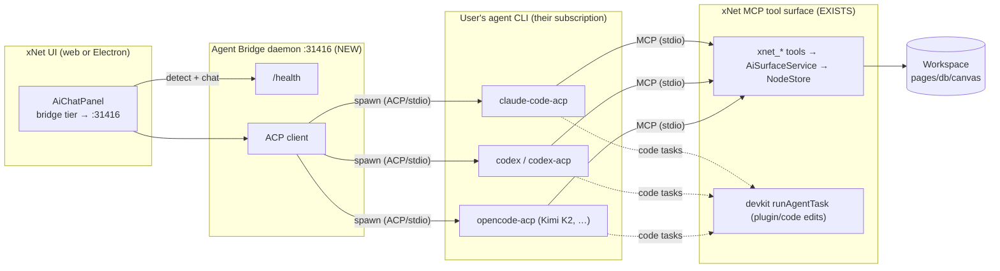
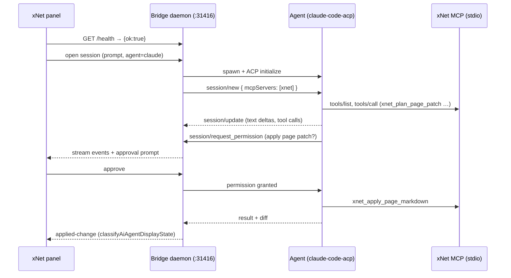

# Agent Bridge — Driving Claude Code, Codex, And Any Agent From xNet's UI

## Problem Statement

> "Get Claude Code and Codex working with xNet. Ideally on the web deployment,
> but at least the Electron app. They should leverage your existing Claude Code
> or Codex subscription. Ideally it works with **any** agent (OpenCode, Kimi
> K2.5, a local coding agent…), primarily Claude and Codex, and the integration
> *just works* across all surfaces — so you can use xNet's UI directly to drive
> an agent that creates/edits plugins, modifies your workspace, writes
> documents, and builds canvases."

xNet's in-app AI chat (exploration 0192) can now talk to a raw model and
read the workspace, but a raw model is not an *agent*: it has no tool-execution
loop, no file editing, no plan/approve/apply cycle. Meanwhile the user already
pays for **Claude Code** and **Codex** — agents that already have all of that.
The opportunity is to **drive those existing agents from xNet's UI** rather than
rebuild them, so the assistant can actually *do* things: edit pages, build
canvases, mutate databases, and author plugins.

## Executive Summary

The pieces are unusually well-aligned for this:

- xNet already **exposes its workspace + code surface as MCP tools**
  (`xnet mcp serve`, `AiSurfaceService`, 20+ `xnet_*` tools). That's the
  *agent-to-tool* layer — done.
- xNet's chat panel already **probes for a "local bridge" daemon at
  `http://127.0.0.1:31416/health`** (the `bridge` connector tier, preference
  #1). That's the *UI-to-agent* hook — but **nothing serves it**.
- The whole industry just standardized the *UI-to-agent* layer as **ACP (Agent
  Client Protocol)** — JSON-RPC over stdio, the "LSP for coding agents." Zed,
  JetBrains, and others drive **Claude Code, Codex, Gemini CLI, and OpenCode**
  through ACP adapters today. ACP sessions even declare their `mcpServers` in
  the handshake, so **ACP (agent) + MCP (tools) compose in one wire-up**.
- The ToS-safe way to "use your subscription" is to **spawn the user's own
  installed CLI** (`claude`, `codex`, …) as a subprocess — exactly xNet's
  existing `cliAgentRunner` "bring-your-own-agent" model. (Reusing the
  subscription *OAuth token* directly is banned; spawning the CLI is sanctioned
  and now draws from a subscription "Agent SDK credit.")

**The missing 20% is one component: the agent bridge daemon.** A loopback
process that (a) answers `/health` so the panel lights up the bridge tier,
(b) launches the chosen agent (Claude Code / Codex / OpenCode / …) as an ACP
subprocess, (c) hands that agent xNet's MCP tool server, and (d) streams the
agent's events (text, tool calls, permission requests, diffs) back to the panel.



**Recommendation:** build the **ACP-based agent bridge daemon** as the single
unifying seam. It runs in Electron (spawns agents directly) and as a standalone
`xnet bridge serve` for the web deployment (browser → loopback daemon, reusing
the hardened-loopback pattern already built for MCP HTTP). This gets "any agent"
for free (ACP adapters exist for Claude/Codex/Gemini/OpenCode), reuses xNet's
MCP tools wholesale, and — because the *agent* owns the tool loop — delivers
full agentic workspace editing **without** xNet having to build its own tool
loop (exploration 0192, Phase 1b).

## Current State In The Repository

### The agent-to-tool layer is built (MCP)

- **`xnet mcp serve`** ([cli/src/commands/mcp.ts](packages/cli/src/commands/mcp.ts))
  — stdio (default) + a hardened **`--http`** loopback transport. Backed by the
  local API (`createRemoteAgentBackend`, default `http://127.0.0.1:31415`).
- **MCP HTTP transport** ([mcp-http.ts](packages/plugins/src/services/mcp-http.ts))
  — binds loopback only, **default port `31416`**, pairing-token (constant-time),
  Origin allowlist (no wildcard), `Access-Control-Allow-Private-Network` +
  `OPTIONS` preflight for Chrome's Local Network Access, and an unauthenticated
  `GET /health` returning `{ ok: true, server }`.
- **MCP server + tools** ([mcp-server.ts](packages/plugins/src/services/mcp-server.ts))
  — `createMCPServer({ store, schemas })` wires `AiSurfaceService`; core tools
  `xnet_search`, `xnet_read_page_markdown`, `xnet_plan_page_patch`,
  `xnet_apply_page_markdown`, `xnet_database_query`, plus `xnet_create`,
  `xnet_update`, `xnet_create_page`, `xnet_create_task`, canvas ops, etc., all
  behind the mutation-plan + approval guardrail.

### The UI-to-agent hook exists but is unserved

- **Bridge detection** ([connectors/detect.ts:55](packages/plugins/src/ai/connectors/detect.ts))
  — `DEFAULT_BRIDGE_URL = 'http://127.0.0.1:31416'`; `defaultProbeBridge` GETs
  `/health` and requires `{ ok: true }`. The `bridge` tier is **preference #1**
  ("Local bridge (Claude Code / Codex subscription)").
- **Bridge → provider mapping**
  ([ai-chat-connector.ts:68](apps/web/src/workbench/views/ai-chat-connector.ts))
  — today maps the bridge tier to `{ type: 'openai-compatible', baseUrl }`, i.e.
  it expects an OpenAI-style `/v1/chat/completions` at `:31416`.
- **⚠️ Port collision / gap:** the MCP HTTP transport's default port is **also
  `31416`**, and it serves `/health` returning `{ ok: true }` — so
  `xnet mcp serve --http` would make the panel *detect* a bridge, but POSTing
  `/v1/chat/completions` there 404s (MCP serves `/mcp` JSON-RPC, not chat). The
  ports already converge on `:31416`; what's missing at that address is an
  **agent-chat / ACP endpoint**, not the tool surface.

### The bring-your-own-agent runner is built (devkit)

- **`cliAgentRunner`** ([devkit/src/agent.ts](packages/devkit/src/agent.ts)) —
  spawns the user's own `claude` / `codex` / `aider` CLI (default args
  `['-p', '{prompt}']` = Claude Code headless). "Zero model cost — it's the
  user's subscription." `AgentRunner` port + `fakeAgentRunner` for tests.
- **`runAgentTask`** ([devkit/src/dev-loop.ts](packages/devkit/src/dev-loop.ts))
  — isolate (worktree) → agent edits → validation gate → **checkpoint on pass /
  reset on fail** → `openPullRequest`. This is the *code/plugin authoring* path.
- **Bridge daemon logic** ([devkit/src/bridge.ts](packages/devkit/src/bridge.ts))
  — `bridgeHealth()`, `handleBridgeRun()`, `BridgeDeps`, `resolveWorktreePath`
  (path-traversal hardened). **Pure logic only — no HTTP server serves it.** The
  doc comment literally says "The Electron HTTP server is a thin shell" — that
  shell does not exist.

### Electron can host it; the precedent is right there

- **Boot** ([apps/electron/src/main/index.ts](apps/electron/src/main/index.ts))
  — `app.whenReady()` runs `setupIPC()`, `setupLocalAPIIPC()`,
  `setupCloudflareTunnelIPC()`, then `await startLocalAPI()`; teardown stops them
  on quit. A bridge would slot in beside `startLocalAPI()`.
- **Child-process precedent**
  ([cloudflare-tunnel-manager.ts](apps/electron/src/main/cloudflare-tunnel-manager.ts))
  — `spawn()`s `cloudflared`, parses stdout for readiness, auto-restarts on
  crash, stops on quit. The exact lifecycle pattern an agent-bridge manager
  needs.
- **`ProcessManager`** ([plugins/services/process-manager.ts](packages/plugins/src/services/process-manager.ts))
  — a full spawn/lifecycle/restart/health library… **built but not wired** into
  the Electron boot. Ready to reuse.
- **Local API** ([electron/main/local-api.ts](apps/electron/src/main/local-api.ts))
  — already serves a loopback API on **`:31415`** with an IPC proxy to the
  renderer's `NodeStore` + schema registry. The bridge's MCP server can point at
  this (`--api-url http://127.0.0.1:31415`) so agent writes flow through the real
  store.

### The chat runtime anticipates this

- **`AiAgentRuntime`** ([ai/runtime.ts](packages/plugins/src/ai/runtime.ts)) —
  `AiAgentOrchestratorMode = 'custom' | 'codex-app-server' | 'hybrid'`. The
  **`codex-app-server`** mode is already named: the design anticipates plugging
  in Codex's app-server protocol. Approvals (`requestApproval` /
  `resolveApproval`), `classifyAiAgentDisplayState`
  (`read-only-answer` / `proposed-change` / `applied-change`), and a `tool.call`
  event type already exist — the scaffolding for rendering agent activity.
- **0192 Phase 1a (shipped)** grounded the panel in the workspace (read-only
  context). **Phase 1b** (build xNet's *own* tool loop) is open — but the bridge
  path makes it **optional for agent tiers**, because Claude Code/Codex run their
  own loop.

## External Research

### ACP — the "LSP for coding agents" (the UI-to-agent layer)

- **What:** JSON-RPC 2.0 over stdio between a *client* (editor/UI) and an
  *agent* subprocess; explicitly modeled on LSP. Zed/JetBrains implement it;
  Anthropic's Claude Code and OpenAI's Codex plug in via adapters.
  ([agentclientprotocol.com](https://agentclientprotocol.com/get-started/agents),
  [Zed blog](https://zed.dev/blog/claude-code-via-acp))
- **Composes with MCP:** "ACP handles the editor-to-agent layer, MCP handles the
  agent-to-tool layer. Sessions are bootstrapped via `session/new`, which can
  declare the `mcpServers` the agent should connect to — so ACP and MCP wire up
  in a single handshake."
  ([Morph](https://www.morphllm.com/agent-client-protocol))
- **Adapters that already exist** (= "any agent" for free):
  - `@zed-industries/claude-code-acp` / `claude-agent-acp` — Claude Code via the
    Agent SDK over ACP. ([npm](https://www.npmjs.com/package/@zed-industries/claude-code-acp),
    [claude-agent-acp](https://github.com/zed-industries/claude-agent-acp))
  - `codex-acp` — Codex over ACP. ([Codex+Zed](https://codex.danielvaughan.com/2026/05/05/codex-cli-in-zed-parallel-agents-acp-integration-ide-workflows/))
  - **Gemini CLI** — native ACP.
  - `opencode-acp` — OpenCode over ACP; connects to a running OpenCode server via
    `OPENCODE_URL`. OpenCode supports many providers/models (incl. **Kimi K2**).
    ([opencode-acp](https://github.com/josephschmitt/opencode-acp))

### Driving the agents directly (without ACP)

- **Claude Agent SDK (TS)** — `query()` returns an async generator streaming
  messages; built-in **MCP** support; **`canUseTool`** permission callback
  (allow/deny per tool call) — perfect for surfacing approvals in xNet's UI.
  ([Agent SDK TS](https://code.claude.com/docs/en/agent-sdk/typescript),
  [permissions](https://docs.claude.com/en/docs/agent-sdk/permissions))
- **Codex app-server** — a long-lived process speaking **JSON-RPC as JSONL over
  stdio**, hosting Codex "threads"; plus `codex exec --json` (one-shot JSONL) and
  TS/Python SDKs that drive the app-server. MCP servers configured in
  `~/.codex/config.toml` or via `codex mcp`.
  ([Codex app-server](https://developers.openai.com/codex/app-server),
  [Codex SDK](https://developers.openai.com/codex/sdk))

### The authentication / ToS reality (critical)

- Anthropic **bans reusing Claude Free/Pro/Max OAuth tokens** for the Agent SDK
  *outside* Claude Code and Claude.ai; third-party SDK integrations are expected
  to use **API keys**.
  ([alternativeto](https://alternativeto.net/news/2026/2/anthropic-officially-bans-using-subscription-authentication-for-third-party-claude-use))
- **But** spawning the user's own installed CLI is the sanctioned path: as of
  **2026-06-15**, "Agent SDK and `claude -p` usage on Claude subscription plans
  draws from a monthly Agent SDK credit, separate from interactive limits."
  ([Agent SDK overview](https://code.claude.com/docs/en/agent-sdk/overview))
- **Implication:** xNet must **never extract or proxy the user's subscription
  token**. It should **spawn the user's own CLI/adapter** (which authenticates
  itself), or let the user supply an **API key**. This is exactly devkit's
  `cliAgentRunner` model and keeps xNet on the right side of every provider ToS.

### Optional: AG-UI for the panel event stream

CopilotKit's **AG-UI** standardizes streaming *agent→UI* events (text deltas,
tool calls, state). If xNet wants a provider-neutral panel event contract beyond
ACP's own client methods, AG-UI is prior art — but ACP's client-side methods
(`session/update`, `session/request_permission`, `fs/*`) already cover it, so
this is a "nice to know," not a dependency.

## Key Findings

1. **The tool side is done; only the agent side is missing.** xNet already
   speaks MCP. The gap is a daemon that *launches an agent* and streams it back.
2. **ACP makes "any agent" a config choice, not N integrations.** One ACP client
   in xNet + off-the-shelf adapters = Claude Code, Codex, Gemini, OpenCode/Kimi.
3. **The bridge path sidesteps 0192 Phase 1b.** Claude Code/Codex bring their own
   tool loop; xNet doesn't have to build one for agent tiers. The panel's
   `bridge` tier (preference #1) is the intended home for this.
4. **`:31416` is already the agreed address** — the panel probes it; the MCP HTTP
   transport defaults to it. The daemon should *own* `:31416` and serve `/health`
   + an agent endpoint, and mount/launch the MCP tool surface alongside.
5. **Electron is the "just works" surface; web works too, with the same loopback
   hardening** (pairing token + Origin allowlist + Private Network Access) the
   MCP HTTP transport already implements. A *purely hosted* web user with nothing
   local still needs the managed-cloud path — out of scope here.
6. **Two distinct "do" surfaces, both already present:** workspace edits via MCP
   (`AiSurfaceService`), and code/plugin authoring via devkit `runAgentTask`
   (worktree + gate + PR) and the plugin scaffolder. The agent can be given both.
7. **ToS is a hard constraint, not a footnote:** spawn the user's CLI; never
   reuse their subscription token. This shapes the whole design toward
   subprocess-launching.

## Options And Tradeoffs

### Transport from xNet UI → agent

| Option | What | Pros | Cons |
| --- | --- | --- | --- |
| **A. OpenAI-compat facade** | Daemon exposes `/v1/chat/completions` wrapping the CLI agent | Zero panel changes (bridge tier already maps to it); fast | Lossy: no native tool-call/approval/diff events; stateless chat ↔ stateful agent mismatch |
| **B. ACP bridge (recommended)** | Daemon is an ACP *client*; launches agent adapters; panel renders ACP events | "Any agent" via existing adapters; full fidelity (tools, permissions, diffs); MCP wired in the handshake | New ACP client + a native panel provider; more work than A |
| **C. Direct SDK embed** | Electron main embeds Claude Agent SDK / Codex app-server directly | Tight control, no extra adapter | Per-agent code; ToS pushes SDK→API-key (not subscription); least "any agent" |
| **D. MCP-only (inverse)** | User runs Claude Code in *their* terminal pointed at `xnet mcp serve` | Works today; minimal build | Not UI-driven — the opposite of the ask |

### Where the daemon runs

| Surface | Feasibility | Notes |
| --- | --- | --- |
| **Electron** | ✅ Best | Spawns agents directly (cloudflare-tunnel precedent); MCP over stdio; FS access for code tasks |
| **Web + local daemon** | ✅ Good | Browser → `:31416` loopback; reuse MCP HTTP's pairing + Origin allowlist + PNA. User runs `xnet bridge serve` (or Electron in the tray) |
| **Web, fully hosted, nothing local** | ❌ N/A here | No local subscription/CLI to drive → managed-cloud gateway (exploration 0192, Phase 2) |

### Recommendation

**Build the ACP agent bridge daemon (Option B), Electron-hosted with a
standalone `xnet bridge serve` for web, phased:**



- **Phase 0 — daemon skeleton + detection (Electron).** Serve `/health` at
  `:31416` from the Electron main (wrap devkit `bridgeHealth()`); the panel's
  bridge tier lights up. No agent yet.
- **Phase 1 — one agent, end to end (Claude Code via ACP).** Bridge spawns
  `@zed-industries/claude-code-acp`, opens a session declaring xNet's MCP server,
  streams text. The agent can already *read* the workspace via MCP.
- **Phase 2 — writes with approvals.** Map ACP `session/request_permission` →
  xNet's existing approval flow (`requestApproval` / `classifyAiAgentDisplayState`);
  render diffs. Now the agent edits pages/databases/canvases with user consent.
- **Phase 3 — "any agent."** Add a small **agent registry** (command + adapter +
  args) so the panel offers Claude Code / Codex / Gemini / OpenCode (Kimi);
  detect which CLIs are installed.
- **Phase 4 — web + code/plugins.** Ship `xnet bridge serve` (reuse MCP HTTP
  hardening) so the web deployment drives the same daemon; wire devkit
  `runAgentTask` + the plugin scaffolder as agent-invokable "code" tasks
  (worktree + gate + PR) so "create/edit a plugin" works from the UI.

Rationale: maximum leverage of what exists (MCP tools, `:31416` probe, devkit
runner, Electron spawn precedent, runtime approval scaffolding), "any agent" by
construction, ToS-safe (spawns the user's CLI), and it delivers agentic
workspace editing **sooner** than building xNet's own tool loop.

## Example Code

### Electron: an agent-bridge manager (mirrors cloudflare-tunnel-manager)

```ts
// apps/electron/src/main/agent-bridge-manager.ts (new)
import { spawn } from 'node:child_process'
import { bridgeHealth } from '@xnetjs/devkit'
import { createServer } from 'node:http'

// Phase 0: serve /health so the panel's bridge tier detects us.
export function startAgentBridge(opts: { port?: number; agent: string } ) {
  const port = opts.port ?? 31416
  const server = createServer((req, res) => {
    if (req.method === 'GET' && req.url?.startsWith('/health')) {
      res.setHeader('content-type', 'application/json')
      return res.end(JSON.stringify(bridgeHealth({ agent: opts.agent, version: '0.1.0' })))
    }
    // Phase 1+: /session (SSE) → drive the ACP agent (below)
    res.statusCode = 404; res.end()
  })
  server.listen(port, '127.0.0.1')
  return server
}
```

### Bridge ↔ agent over ACP, with xNet's MCP tools declared in the handshake

```ts
// Phase 1: launch an ACP agent and open a session that connects to xNet's MCP.
import { spawn } from 'node:child_process'

const agent = spawn('npx', ['-y', '@zed-industries/claude-code-acp'], {
  stdio: ['pipe', 'pipe', 'inherit'] // JSON-RPC over stdin/stdout
})
// ACP: initialize → session/new declaring the xnet MCP server (stdio).
rpc(agent, 'initialize', { protocolVersion: 1, clientCapabilities: { fs: true } })
const { sessionId } = await rpc(agent, 'session/new', {
  cwd: workspaceDir,
  mcpServers: [{ name: 'xnet', command: 'xnet', args: ['mcp', 'serve', '--api-url', 'http://127.0.0.1:31415'] }]
})
// Stream the user's turn; forward session/update + request_permission to the UI.
await rpc(agent, 'session/prompt', { sessionId, prompt: userMessage })
```

### Panel: a native "bridge/agent" provider (Phase 2)

Today `bridge` → `openai-compatible`. Add an agent-aware provider so tool calls,
`session/request_permission`, and diffs render natively — reusing the runtime's
`requestApproval` + `classifyAiAgentDisplayState` instead of flattening the
agent into plain chat text. (Phase 0–1 can ship behind the existing
openai-compatible facade for a quick win, then graduate to this.)

### Agent registry ("any agent")

```ts
// Pluggable: command + ACP adapter + how to detect it.
export const AGENTS = {
  'claude-code': { label: 'Claude Code', detect: 'claude', acp: ['npx','-y','@zed-industries/claude-code-acp'] },
  codex:         { label: 'Codex',       detect: 'codex',  acp: ['npx','-y','codex-acp'] },
  gemini:        { label: 'Gemini CLI',  detect: 'gemini', acp: ['gemini','--experimental-acp'] },
  opencode:      { label: 'OpenCode',    detect: 'opencode', acp: ['npx','-y','opencode-acp'] } // Kimi K2 etc.
} as const
```

## Risks And Open Questions

- **ToS / auth (highest):** never extract or proxy the subscription OAuth token.
  Spawn the user's own CLI/adapter (self-authenticating) or take an API key. Make
  this explicit in code and docs. Revisit per provider before shipping.
- **Security of a loopback agent runner:** the daemon can edit files and the
  workspace. Reuse the MCP HTTP hardening (loopback-only bind, pairing token,
  Origin allowlist, PNA). Gate code edits behind devkit's worktree isolation +
  validation gate; gate workspace writes behind the mutation-plan approval flow.
  An agent with shell access is power-user territory — default to
  approval-required, surface clearly.
- **`:31416` ownership:** decide whether the bridge daemon *also* serves the MCP
  surface (one process, one port) or launches `xnet mcp serve` as a child and
  gives the agent stdio MCP. Stdio MCP avoids a second port + pairing for the
  Electron case; the web case still needs the hardened HTTP transport.
- **ACP maturity / version drift:** ACP and the adapters are young and moving.
  Pin adapter versions; treat the ACP client as a thin, well-tested seam.
- **Web without a local daemon:** a hosted-only user has nothing to drive →
  needs the managed-cloud gateway (exploration 0192, Phase 2). Be honest
  in the UI about when the bridge tier is unavailable.
- **Approval fatigue vs safety:** map ACP permission requests to batched,
  legible approvals (per-plan, not per-keystroke) using the existing
  `AiMutationPlan` granularity.
- **Plugin authoring scope:** "create/edit a plugin" spans (a) generating a
  plugin from a script (AI script generator + `scaffoldPlugin` /
  `scriptToPluginManifest`, already built) and (b) hand-coding via `runAgentTask`.
  Decide which the UI exposes first (the scaffolder is the lower-risk start).
- **Windows/macOS/Linux spawn differences:** `npx`/path resolution, shell quoting
  (devkit already uses split/join, not `replace`, for prompt safety).

## Implementation Checklist

**Phase 0 — daemon skeleton + detection + facade chat** — ✅ shipped
- [x] Export the bridge daemon pieces from `@xnetjs/devkit`: `bridgeHealth`
      (already), plus the new `createBridgeServer` + `ChatAgent`/`cliChatAgent`.
- [x] `createBridgeServer` (in devkit) serves `GET /health` on `:31416` so the
      panel detects the bridge tier; `apps/electron/src/main/agent-bridge-manager.ts`
      runs it on boot (mirrors `cloudflare-tunnel-manager` lifecycle), gated on a
      `--version` probe so it only advertises when the agent CLI is runnable.
- [x] Start/stop in `apps/electron/src/main/index.ts` boot/quit; preload IPC
      (`window.xnetAgentBridge` → `xnet:agent-bridge:status/start/stop`).
- [x] **Facade chat (the quick win):** `POST /v1/chat/completions` (OpenAI-compatible,
      streaming SSE + one-shot) backed by the user's own `claude -p` / `codex exec`
      CLI — so the existing `bridge` tier (which maps to `openai-compatible`) chats
      through the agent with **zero panel changes**.
- [ ] Verify in a running Electron build that the tier flips to "available" and a
      prompt round-trips (covered by unit tests; not exercised in CI).

**Phase 1 — agent gets xNet's tools (read + write)** — ✅ shipped (via the facade, not ACP)
- [x] Give the spawned agent xNet's MCP tools: `buildAgentArgs` adds
      `--mcp-config` + `--allowedTools "mcp__xnet__*"` (Claude Code); `xnet bridge
      serve --mcp` writes a self-referential MCP config (`node <cli> mcp serve
      --api-url :31415`) so it resolves without `xnet` on PATH. The agent can now
      search/read **and** create/update pages, databases, and canvases.
- [ ] Graduate to a real ACP client (`@zed-industries/claude-code-acp`,
      `session/new` declaring the MCP server) + native `session/update` streaming,
      replacing the OpenAI-compatible facade for full tool/diff fidelity.

**Phase 2 — writes + approvals**
- [x] `xnet_*` writes flow through the server-side guardrail (`McpWriteGuardrail`):
      low/medium-risk auto-apply; high-risk/outward-facing require `confirm:true`.
- [ ] Surface the approval in the panel UI: map agent permission requests →
      `AiAgentRuntime.requestApproval` + `classifyAiAgentDisplayState`; render diffs.
- [ ] Add a native "bridge/agent" panel provider (graduate off the facade).

**Phase 3 — any agent**
- [x] Agent registry (`KNOWN_BRIDGE_AGENTS`: Claude Code / Codex / Gemini /
      OpenCode) surfaced in the panel: when the bridge is selected it shows the
      running agent + status from `/health`, with an agent picker where a control
      channel exists (Electron `window.xnetAgentBridge`). Installed-CLI detection
      is daemon-side (the Electron `--version` probe).
- [ ] Per-agent adapter args beyond claude/codex (gemini/opencode) + smoke test;
      live agent-switch for the web/CLI daemon (needs a control channel).

**Phase 4 — web + code/plugins**
- [x] `xnet bridge serve [--agent claude|codex] [--port] [--allow-origin] [--cwd]`
      standalone daemon — loopback-only bind, Origin allowlist, Private Network
      Access — so the web deployment drives the same bridge. (Pairing-token gate
      deferred; loopback + Origin allowlist is the current protection.)
- [x] Expose devkit `runAgentTask` as a command: `xnet code "<intent>"`
      (worktree → gate → checkpoint/rollback → optional `--pr`), so an agent can
      author/edit xNet or a scaffolded plugin from the CLI.
- [x] Bridge daemon `POST /run` endpoint over devkit `handleBridgeRun`
      (opt-in via `xnet bridge serve --code`; 501 when disabled) — the HTTP seam
      the in-app UI will call to trigger a gated code task.
- [ ] Wire a "create/edit plugin" button in the UI to `POST /run` + combine with
      the plugin scaffolder.
- [ ] Surface honest unavailability when no local daemon/agent is present (the
      Electron manager already records a `detail` reason; surface it in the panel).

## Validation Checklist

- [x] The daemon serves `/health` (so the tier detects) and a streaming
      OpenAI-compatible chat endpoint that drives the agent CLI — covered by
      `bridge-server.test.ts` (real ephemeral server, SSE, agent error → 502).
- [ ] With the Electron app running and `claude` installed, the panel shows
      **Local bridge — available** and a prompt round-trips through Claude Code.
      *(Needs a packaged build + installed CLI; not exercised in CI.)*
- [x] Switching the agent CLI is a config choice (`--agent` / `XNET_BRIDGE_AGENT`):
      Codex uses `['exec','{prompt}']`, others the Claude headless default —
      covered by `chat-agent.test.ts` + `bridge.test.ts`.
- [x] The **web** deployment can drive the bridge via `xnet bridge serve` on
      loopback (Origin allowlist + Private Network Access; no CORS errors for an
      allowed origin) — covered by the preflight/origin tests.
- [x] **No subscription token is ever read by xNet** — the bridge spawns the
      user's own CLI, which authenticates itself (BYO-agent by construction).
- [x] Bridge daemon refuses non-loopback binds; Origin allowlist enforced —
      covered by `bridge-server.test.ts`. *(Pairing-token gate deferred.)*
- [x] The agent is wired to xNet's MCP tools: `buildAgentArgs` emits the
      `--mcp-config` + `--allowedTools` flags and `xnet bridge serve --mcp` writes
      the config — covered by `agent-launch.test.ts` + the bridge MCP-args test.
- [ ] With a real `claude` + `xnet` CLI, "create a page titled X" actually edits
      the workspace via `xnet_*` (end-to-end; needs a live agent, not in CI).
- [x] (Phase 4) `xnet code "<intent>"` runs a coding agent in a worktree, gates,
      and checkpoints/rolls back — covered by `code.test.ts` (config + summary)
      atop devkit's real-temp-git dev-loop tests. *(End-to-end with a live agent
      not in CI; in-app UI wiring still pending.)*

## References

- Repo — tools: [mcp.ts](packages/cli/src/commands/mcp.ts),
  [mcp-http.ts](packages/plugins/src/services/mcp-http.ts),
  [mcp-server.ts](packages/plugins/src/services/mcp-server.ts),
  [ai-surface/service.ts](packages/plugins/src/ai-surface/service.ts)
- Repo — bridge hook: [connectors/detect.ts](packages/plugins/src/ai/connectors/detect.ts),
  [ai-chat-connector.ts](apps/web/src/workbench/views/ai-chat-connector.ts),
  [devkit/src/bridge.ts](packages/devkit/src/bridge.ts),
  [devkit/src/agent.ts](packages/devkit/src/agent.ts),
  [devkit/src/dev-loop.ts](packages/devkit/src/dev-loop.ts)
- Repo — Electron host: [main/index.ts](apps/electron/src/main/index.ts),
  [cloudflare-tunnel-manager.ts](apps/electron/src/main/cloudflare-tunnel-manager.ts),
  [process-manager.ts](packages/plugins/src/services/process-manager.ts),
  [local-api.ts](apps/electron/src/main/local-api.ts),
  [local-api-config.ts](apps/electron/src/main/local-api-config.ts)
- Repo — runtime: [ai/runtime.ts](packages/plugins/src/ai/runtime.ts)
  (`codex-app-server` mode, approvals, `classifyAiAgentDisplayState`)
- Prior explorations: `0174_BRING_YOUR_OWN_MODEL_AI_CHAT_PANEL`,
  `0175_XNET_AS_A_SUBSTRATE_FOR_OPENCLAW`, `0161_TOKEN_EFFICIENT_AGENT_INTERFACES`,
  `0190_IN_APP_AGENTIC_VIBE_CODING_AND_SELF_MODIFICATION`,
  `0192_GETTING_XNET_AI_WORKING_FIXING_THE_CHAT_PANEL`
- ACP: [agentclientprotocol.com](https://agentclientprotocol.com/get-started/agents),
  [Zed — ACP](https://zed.dev/acp),
  [Claude Code via ACP](https://zed.dev/blog/claude-code-via-acp),
  [ACP vs MCP (Morph)](https://www.morphllm.com/agent-client-protocol),
  [ACP intro (Marc Nuri)](https://blog.marcnuri.com/agent-client-protocol-acp-introduction)
- Adapters: [@zed-industries/claude-code-acp](https://www.npmjs.com/package/@zed-industries/claude-code-acp),
  [claude-agent-acp](https://github.com/zed-industries/claude-agent-acp),
  [opencode-acp](https://github.com/josephschmitt/opencode-acp),
  [Codex CLI in Zed (ACP)](https://codex.danielvaughan.com/2026/05/05/codex-cli-in-zed-parallel-agents-acp-integration-ide-workflows/)
- SDKs: [Claude Agent SDK (TS)](https://code.claude.com/docs/en/agent-sdk/typescript),
  [Agent SDK permissions](https://docs.claude.com/en/docs/agent-sdk/permissions),
  [Codex app-server](https://developers.openai.com/codex/app-server),
  [Codex SDK](https://developers.openai.com/codex/sdk)
- Auth/ToS: [Agent SDK overview](https://code.claude.com/docs/en/agent-sdk/overview),
  [subscription-auth ban](https://alternativeto.net/news/2026/2/anthropic-officially-bans-using-subscription-authentication-for-third-party-claude-use)
