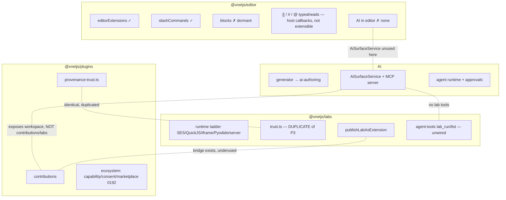
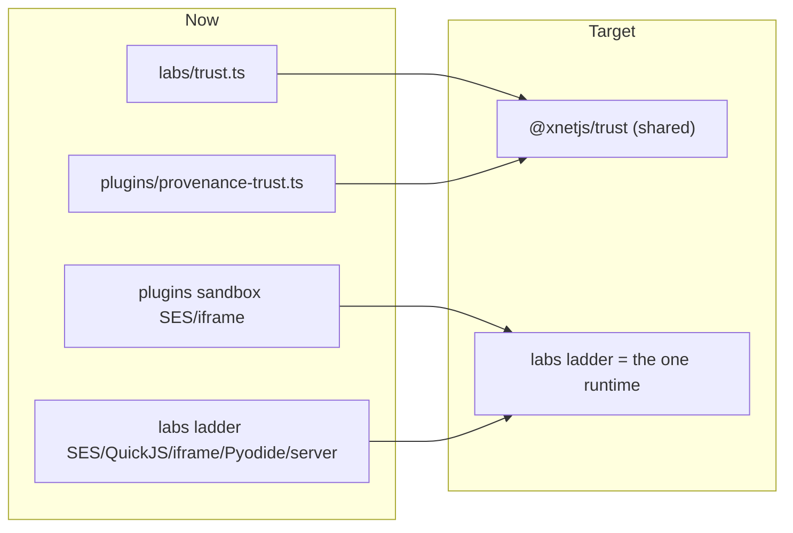
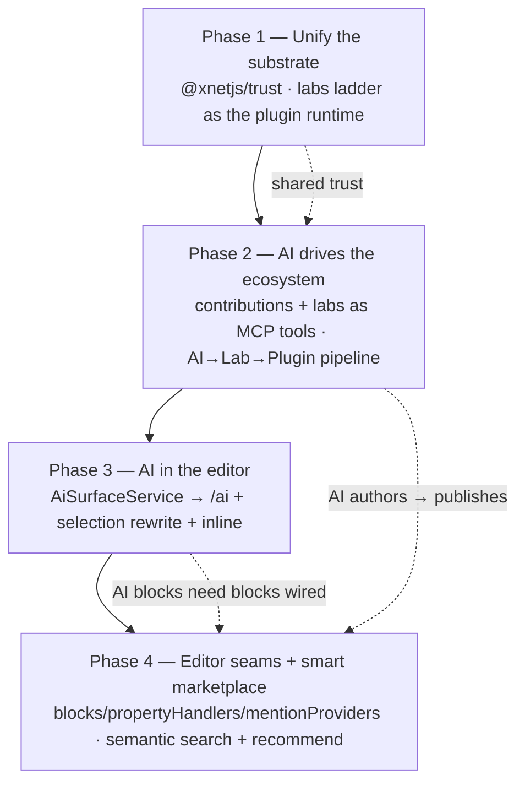
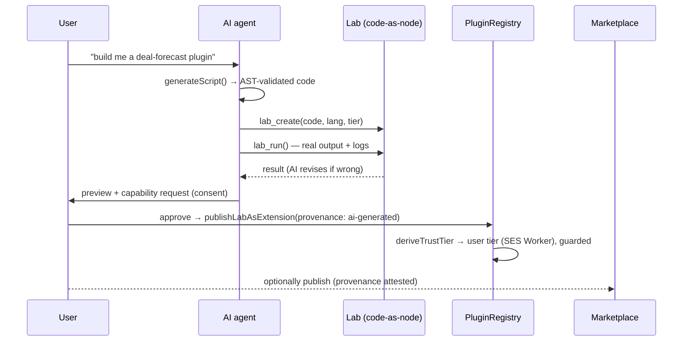
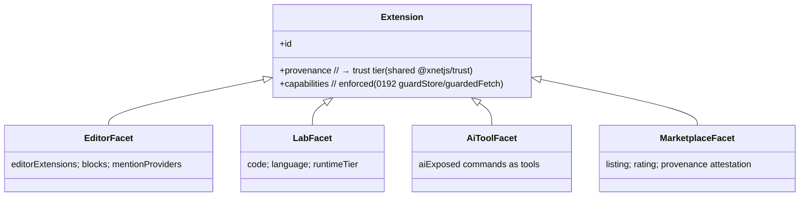

# The Extensibility Fabric: Unifying Plugins, Labs, AI, And The Editor

## Problem Statement

xNet has built four powerful extensibility systems — and they barely know about
each other:

1. **Plugins** (`@xnetjs/plugins`) — a contribution system + sandbox + the 0189
   `FeatureModule` chassis + the 0192 ecosystem platform (capability enforcement,
   marketplace, scaffolder, provenance, AI-authoring transform).
2. **Labs** (`@xnetjs/labs`) — code-as-a-first-class-node, with a runtime ladder
   (SES / QuickJS / iframe / Pyodide / server), provenance-derived trust, and a
   `publishLabAsExtension` path.
3. **AI** (`@xnetjs/plugins/ai` + `ai-surface` + the MCP server) — NL→validated
   script generation, a multi-provider router, an agent runtime with approvals,
   an `AiSurfaceService` (resources/tools/mutation-plans), and an MCP server
   exposing the workspace to external agents.
4. **The editor** (`@xnetjs/editor`) — a TipTap editor that consumes plugin
   `editorExtensions` / `slashCommands` / `toolbarItems`.

Each is real. But they are **siloed**, and the seams between them are dormant or
duplicated:

- **Labs and plugins duplicate the same trust model.** `packages/labs/src/trust.ts`
  and `packages/plugins/src/ecosystem/provenance-trust.ts` (which **this codebase
  shipped in 0192**) are byte-for-byte mirrors — two `deriveTrustTier`s, two
  `requiresCapabilityReprompt`s, two sandbox-tier stacks.
- **The AI can't drive the ecosystem.** The agent can't run/discover Labs
  (`lab_run`/`lab_list` exist but aren't wired to the MCP server or in-app
  runtime), can't invoke plugin commands as tools, and can't run-then-publish.
- **The editor has no AI.** `AiSurfaceService` exists; nothing in
  `packages/editor` consumes it. No `/ai`, no inline rewrite, no AI blocks.
- **Editor extension points are half-wired.** `blocks` and `propertyHandlers`
  contributions are defined but never consumed; the `[[`/`#`/`@` typeaheads are
  host-callback-driven and **not plugin-extensible**.

The question this exploration answers: **what is the smallest set of unifications
that turns these four silos into one "extensibility fabric" — where a capability
authored by a human, generated by AI, or graduated from a Lab is the same kind of
thing, runs on the same trust-tiered runtime, can be driven by the AI, surfaces
in the editor, and ships through one marketplace?**

The thesis: xNet already has every primitive. The win is **convergence**, not
construction.

## Executive Summary

1. **The duplication is the tell.** 0192 deliberately mirrored `labs/trust.ts`
   into `plugins/ecosystem/provenance-trust.ts` to dodge a dependency edge. That
   mirror is a flashing sign that trust/provenance/sandbox-tier belong in a
   **shared `@xnetjs/trust` package** both consume — the cheapest, highest-signal
   first unification.

2. **Labs and plugins are the same thing at different lifecycle stages.** A Lab
   is *authored, runnable code-as-node*; a plugin is *packaged, installable
   capability*. `publishLabAsExtension` already bridges them. The convergence:
   **one runtime substrate** (the labs ladder becomes the plugin execution engine,
   giving plugins Python/server tiers) and **one trust pipeline** — a Lab
   "graduates" into a marketplace plugin without changing runtime or trust.

3. **AI should be a first-class ecosystem participant, not a bolt-on.** The 2026
   market lesson (Cursor/Copilot/Claude Code) is that **MCP is the universal
   composable layer** and AI is first-class. xNet should: expose **plugin
   contributions + lab tools as AI-callable tools**, wire the **AI→Lab→Plugin
   assembly line** (generate → run/test in a Lab → publish), and route every AI
   action through 0192's capability-consent + provenance gates.

4. **The editor is the biggest dormant AI surface.** Wiring `AiSurfaceService`
   into the TipTap editor — `/ai` slash command, selection→rewrite, AI blocks,
   inline transforms — turns the writing surface into an AI surface, reusing the
   mutation-plan + approval machinery that already exists.

5. **Light up the half-wired editor seams.** Consume `blocks`/`propertyHandlers`;
   make the `[[`/`#`/`@` typeaheads **plugin-extensible** via a `mentionProviders`
   contribution so a plugin can add a new entity type to the universal typeahead.

6. **The marketplace gets an AI brain.** With labs + plugins + AI-tools all
   modeled as one "extension," add **semantic search** (reuse `@xnetjs/vectors`)
   and **AI recommendations** ("you query CRM deals a lot → install the Forecast
   plugin"), plus one-click publish of AI-authored extensions.

7. **Recommendation:** a four-phase convergence — **(1) Unify trust + runtime**
   (`@xnetjs/trust`, labs ladder as plugin engine), **(2) AI drives the ecosystem**
   (contributions + labs as MCP tools, AI→Lab→Plugin pipeline), **(3) AI in the
   editor** (`AiSurfaceService` → `/ai` + inline), **(4) Editor seams + smart
   marketplace** (blocks/handlers/mentionProviders + semantic search/recommend).
   Each phase reuses the 0192 capability/consent/provenance substrate so security
   is inherited, not rebuilt.

## Current State In The Repository

### Plugins (the chassis + ecosystem platform)

- `packages/plugins/src/{registry.ts,contributions.ts,context.ts,feature-module.ts}`
  — lifecycle + 17 contribution points + the `FeatureModule` manifest.
- `packages/plugins/src/ecosystem/` (shipped in PRs #138/#142):
  `capability-guard.ts` (`guardStore`), `provenance-trust.ts`, `consent.ts`,
  `compatibility.ts`, `dependencies.ts`, `marketplace.ts`, `provenance.ts`,
  `testing.ts`, `network-endowment.ts` (`guardedFetch`), `scaffold.ts`,
  `ai-authoring.ts` (`scriptToPluginManifest`).

### Labs (code-as-node + runtime ladder)

- `packages/labs/src/schema.ts` — `LabSchema`: code + language + runtime tier,
  output/logs/errors persisted on the node (syncs P2P).
- `packages/labs/src/trust.ts` — `deriveTrustTier`/`requiresCapabilityReprompt`
  (**identical** to `plugins/ecosystem/provenance-trust.ts`).
- `packages/labs/src/runtime/{ladder.ts,ses.ts,quickjs.ts,app.ts,python.ts,server.ts}`
  — selects an engine by `(language, tier)`; deterministic rungs for computed code.
- `packages/labs/src/host.ts` — `xnet.<tool>()` host bridge (permission-gated).
- `packages/labs/src/extension.ts` — `buildLabExtensionManifest` +
  `publishLabAsExtension` (**the Lab→plugin bridge already exists**).
- `packages/labs/src/agent-tools.ts` — `lab_run`/`lab_create`/`lab_get`/`lab_list`/
  `lab_run_saved` (MCP-shaped, **not wired** to the workspace AI/MCP server).
- `apps/web/src/components/LabView.tsx`, `apps/web/src/lib/lab-runtime.ts` —
  the UI + `createWebLabLadder()`.

### AI (generation, surface, agent, MCP)

- `packages/plugins/src/ai/{generator.ts,prompt.ts,providers.ts,runtime.ts,connectors/}`
  — NL→validated script, provider router, agent runtime with approvals.
- `packages/plugins/src/ai-surface/{service.ts,types.ts,validation.ts}` —
  `AiSurfaceService`: resources + `AiToolDefinition`s + `AiMutationPlan`
  (proposed→validated→applied + audit).
- `packages/plugins/src/services/mcp-server.ts` — exposes `xnet_search`,
  `xnet_read_page_markdown`, `xnet_plan_page_patch`, `xnet_database_query`, …;
  registers `AiSurfaceService.getTools()` as MCP tools. **No lab tools; no plugin
  commands as tools.**

### The editor (TipTap)

- `packages/editor/src/components/RichTextEditor.tsx` — consumes `extensions`,
  `toolbarItems`, `slashCommands` props; ~28 built-in extensions.
- `packages/editor/src/hooks/{useEditorExtensions.ts,useSlashCommands.ts}` —
  merge plugin contributions with built-ins.
- `apps/web/src/components/Editor.tsx`, `apps/web/src/workbench/contributions.tsx`
  — the host wiring; `apps/web/src/plugins/mermaid-plugin.ts` is the worked example.
- **Dormant**: `BlockContribution`/`PropertyHandlerContribution`
  (`contributions.ts`) are defined but no editor consumer.
- **Not plugin-extensible**: `extensions/wikilink-suggestion/`, `extensions/hashtag/`,
  `extensions/task-metadata/` typeaheads take host callbacks, not contributions.

### The current silo map



## External Research

- **MCP is the universal composable layer (2026).** "Nearly every tool now
  supports MCP for connecting agents to external data sources, APIs, and tools —
  creating a composable ecosystem where agents can be extended without custom
  integrations." Cursor ships a **plugin marketplace** (Amplitude/AWS/Figma/
  Linear/Stripe). The strategic lesson: **AI first-class, not bolted on** — Cursor
  forked VS Code to make AI native rather than an extension.
  ([Scrimba — best AI assistants 2026](https://scrimba.com/articles/best-ai-coding-assistants-2026/),
  [SitePoint comparison](https://www.sitepoint.com/ai-coding-tools-comparison-2026/)).
  xNet already *has* an MCP server (`mcp-server.ts`) — the gap is that it exposes
  workspace data but not the *extension surface* (labs, plugin commands).
- **Notion / Lexical / ProseMirror block ecosystems** — custom block types are
  the unit of editor extensibility; plugin-contributed nodes + node-views are the
  norm. xNet's `BlockContribution` is the right primitive, just unconsumed.
- **Observable / Jupyter** — "code-as-first-class document" is mainstream; the
  novelty in xNet is that a Lab is a *syncable node* with provenance trust. The
  prior art validates "graduate a runnable cell into a shareable package."
- **VS Code micro-kernel + extension host** — contribution points + a separate
  host process. xNet's contribution registry is the same idea; the labs runtime
  ladder is the "host process" it never formally adopted for plugins.
- **MetaMask Snaps / Sigstore** (carried from 0189/0192) — capability endowments
  + keyless provenance remain the security spine; the fabric should make every
  facet (lab, plugin, AI-tool) ride them.

**Lesson:** the market is converging on *one composable agent-driven extension
layer*. xNet's differentiator is that its layer is **local-first, P2P-syncable,
and provenance-trusted** — but only if the four silos become one.

## Key Findings

1. **One trust model, written twice.** The `labs/trust.ts` ≡
   `plugins/ecosystem/provenance-trust.ts` duplication is the clearest, cheapest
   convergence: extract `@xnetjs/trust`. Everything else composes on top.

2. **The Lab→plugin bridge is built but underused.** `publishLabAsExtension`
   already turns a Lab into an installable extension. The runtime is the
   divergence: plugins run in their own SES/iframe sandbox; labs run on the
   ladder. **Unify on the ladder** and a Lab and a plugin are one substrate.

3. **The AI is blind to the ecosystem it could drive.** It can read/write the
   workspace (MCP) but cannot *run a Lab*, *invoke a plugin command*, or
   *publish*. Exposing those as tools (capability-scoped via 0192) is the unlock
   that makes xNet "AI-native," not "AI-adjacent."

4. **The editor is an AI surface waiting to happen.** Mutation-plans + approvals
   + `AiSurfaceService` exist; the editor just needs to call them from a slash
   command and a selection toolbar.

5. **Half-wired editor seams are low-hanging fruit.** Consuming `blocks`/
   `propertyHandlers` and making typeaheads plugin-extensible are small, additive
   changes that materially expand what a plugin can do *inside* a document.

6. **Security is already designed — inherit it.** Every new pathway (AI runs a
   lab, plugin command as a tool, AI edits a doc) must pass through 0192's
   capability guard + consent + provenance. The fabric's safety is *reuse*, not
   new policy.

## Options And Tradeoffs

### A. Trust + runtime unification — how far to merge labs and plugins?



| Option | Pros | Cons | Verdict |
| --- | --- | --- | --- |
| **Keep separate** (status quo) | No churn | Permanent duplication; plugins lack Python/server tiers; two security audits | Reject |
| **Shared `@xnetjs/trust` only** | Kills the duplication; tiny PR; no runtime risk | Sandboxes still diverge | **Phase 1 (do first)** |
| **Shared trust + ladder as plugin engine** | One runtime, one audit; plugins gain Python/server; Lab↔plugin is one substrate | Bigger lift; must not regress plugin perf | **Phase 1–2 (the real win)** |
| **Collapse Lab and Plugin into one node type** | Maximal purity | Breaks two schemas; large migration; little extra user value over "graduate" | Defer/avoid |

### B. How the AI participates

| Option | Pros | Cons | Verdict |
| --- | --- | --- | --- |
| **AI reads/writes workspace only** (today) | Shipping | Can't drive extensions; not "AI-native" | Insufficient |
| **Contributions + labs as MCP tools** | AI invokes plugin commands + runs labs; composable | Must capability-scope every tool (reuse 0192) | **Recommended** |
| **AI→Lab→Plugin assembly line** | Generate → run/test → publish in one flow; closes the authoring loop | Needs approval gates at each hop | **Recommended (high value)** |
| **Autonomous AI publishing to marketplace** | Maximal automation | Trust/abuse risk; provenance must be airtight | Gate behind human consent; defer auto-publish |

### C. AI in the editor

| Option | Pros | Cons | Verdict |
| --- | --- | --- | --- |
| **`/ai` slash command + selection toolbar** | Reuses slashCommands + mutation-plan + approval; smallest wire-up | Single entry point | **Phase 3 start** |
| **Inline ghost-text completions** | Cursor-like feel | Latency/cost; needs streaming + accept/reject UX | **Phase 3 stretch** |
| **AI blocks (a Lab embedded as a live block)** | Code/AI output lives in the doc; dogfoods labs-in-editor | Block contribution must be consumed first | **Phase 4 (after blocks wired)** |

## Recommendation

**Adopt the "extensibility fabric" model: one trust library, one runtime, one
AI-callable tool surface, and one editor that speaks AI — built in four phases,
each inheriting 0192's capability/consent/provenance substrate so security comes
for free.**



**Phase 1 — Unify the substrate.** Extract `@xnetjs/trust` (`InstallProvenance`,
`TrustTier`, `deriveTrustTier`, `requiresCapabilityReprompt`, `sandboxForTier`);
have both `@xnetjs/labs` and `@xnetjs/plugins/ecosystem` re-export from it (delete
the mirror). Then make the labs **runtime ladder the plugin execution engine**:
plugin code (user/marketplace tier) runs on the same SES-Worker/iframe rungs labs
use, and plugins gain the Python/server tiers for free. One sandbox, one audit.

**Phase 2 — AI drives the ecosystem.** Register `@xnetjs/labs/agent-tools` with
the MCP server + in-app agent runtime (AI can `lab_run`/`lab_list`/`lab_create`).
Expose **plugin contributions as AI tools** — a `getToolableContributions()` that
wraps each opted-in command as an `AiToolDefinition` (capability-scoped, consent-
gated). Wire the **AI→Lab→Plugin assembly line**: AI generates → saves a Lab →
runs it (sees real output) → on approval, `publishLabAsExtension` →
`scriptToPluginManifest`-style consent → marketplace.

**Phase 3 — AI in the editor.** Wire `AiSurfaceService` into `@xnetjs/editor`: an
`/ai` slash command and a selection toolbar that build an `AiMutationPlan`
(rewrite/summarize/translate/extend), show a diff, and apply through the existing
approval path. This makes the editor the primary AI surface with zero new
security model.

**Phase 4 — Editor seams + smart marketplace.** Consume `BlockContribution`
(plugin-contributed TipTap nodes, incl. an **AI/Lab block**) and
`PropertyHandlerContribution`; add a **`mentionProviders`** contribution so
plugins extend the `[[`/`#`/`@` typeaheads with new entity types. Give the
marketplace an AI brain: **semantic search** over extension descriptions
(`@xnetjs/vectors`) and **recommendations** from workspace usage, plus one-click
publish for AI-authored extensions.

Rationale: Phase 1 removes the structural duplication and unifies the runtime
(the foundation everything rests on); Phase 2 makes xNet genuinely AI-native (the
market's converging requirement) without inventing new trust policy; Phase 3
delivers the most visible user value (AI where people write) cheaply; Phase 4
broadens what extensions can do and closes the discovery loop. Convergence, not
construction.

## Example Code

### Phase 1 — the shared trust package (delete the mirror)

```ts
// packages/trust/src/index.ts  (NEW @xnetjs/trust)
export type InstallProvenance =
  | 'builtin' | 'authored' | 'ai-generated' | 'imported' | 'marketplace' | 'synced'
export type TrustTier = 'first-party' | 'user' | 'marketplace'
export type SandboxKind = 'host' | 'ses-worker' | 'iframe'

export function deriveTrustTier(p: InstallProvenance): TrustTier {
  if (p === 'builtin') return 'first-party'
  if (p === 'marketplace') return 'marketplace'
  return 'user' // authored / ai-generated / imported / synced
}
export function requiresCapabilityReprompt(p: InstallProvenance): boolean {
  return p !== 'builtin' && p !== 'authored'
}
// labs/trust.ts and plugins/ecosystem/provenance-trust.ts BOTH re-export this.
```

### Phase 1 — the labs ladder as the plugin runtime

```ts
// packages/plugins/src/ecosystem/runtime.ts
import type { RuntimeLadder } from '@xnetjs/labs'
import { sandboxForTier } from '@xnetjs/trust'

/** Run plugin code on the labs ladder, picking the rung by trust tier. */
export function runPluginCode(ladder: RuntimeLadder, code: string, tier: TrustTier, host: PluginHost) {
  // first-party → host realm; user → SES Worker; marketplace → iframe — the SAME
  // rungs labs already select, so there is one sandbox and one security audit.
  return ladder.run({ language: 'javascript', tier: tierToLadderTier(tier), code, host })
}
```

### Phase 2 — plugin contributions as AI tools

```ts
// packages/plugins/src/ai-surface/contribution-tools.ts
import type { AiToolDefinition } from './types'

/** Wrap opted-in plugin commands as capability-scoped, consent-gated AI tools. */
export function contributionsAsAiTools(registry: ContributionRegistry): AiToolDefinition[] {
  return registry.commands
    .getAll()
    .filter((c) => c.aiExposed) // opt-in, not every command
    .map((c) => ({
      name: `plugin.${c.id}`,
      title: c.name,
      description: c.description ?? c.name,
      risk: 'medium',
      requiredScopes: c.capabilities ?? [], // checked against the plugin's grant
      inputSchema: c.inputSchema ?? { type: 'object', properties: {} },
      invoke: async (args) => c.execute(args) // runs guarded, like any plugin code
    }))
}
```

### Phase 2 — the AI→Lab→Plugin assembly line



### Phase 3 — `/ai` in the editor over the existing surface

```ts
// packages/editor/src/extensions/ai/ai-slash-command.ts
import type { AiSurfaceService } from '@xnetjs/plugins'

export function aiSlashCommand(ai: AiSurfaceService): SlashCommandContribution {
  return {
    id: 'ai',
    name: 'Ask AI',
    aliases: ['rewrite', 'summarize', 'translate'],
    icon: 'sparkles',
    execute: async ({ editor, range }) => {
      const selection = editor.state.doc.textBetween(range.from, range.to)
      const plan = await ai.planTextTransform({ text: selection, intent: 'rewrite' })
      // plan is an AiMutationPlan — show a diff, await approval, then apply.
      await ai.applyWithApproval(plan, (patch) => editor.commands.insertContentAt(range, patch))
    }
  }
}
```

### Phase 4 — a `mentionProviders` contribution (extensible typeaheads)

```ts
// packages/plugins/src/contributions.ts (NEW point)
export interface MentionProviderContribution {
  id: string
  trigger: '[[' | '#' | '@' | string // a plugin can add its own trigger
  getSuggestions: (query: string) => Promise<MentionSuggestion[]>
  render?: (s: MentionSuggestion) => unknown
}
// The editor's typeaheads merge host suggestions with all contributed providers,
// so a "GitHub" plugin can make `@` resolve issues, a "CRM" plugin make it resolve
// contacts — the universal typeahead becomes open.
```

### The fabric: one extension, many facets



## Risks And Open Questions

- **Dependency direction.** 0192 mirrored trust precisely to avoid
  `@xnetjs/plugins → @xnetjs/labs`. A shared `@xnetjs/trust` (zero-dep, MIT) that
  *both* depend on is the clean fix — but it must stay tiny and policy-only
  (no runtime), or it becomes a coupling magnet.
- **Runtime unification perf.** Routing plugin code through the labs ladder must
  not regress activation latency or the doc/canvas/task hot paths (exploration
  0184 budgets). Keep first-party plugins on the host rung (unsandboxed) and
  measure before moving user-tier plugins onto the ladder.
- **AI tool blast radius.** Exposing plugin commands + lab execution to the agent
  multiplies what a prompt-injected model could do. Every tool must carry
  `requiredScopes` checked against the plugin's grant, and writes stay
  mutation-plan + approval gated. Default high-risk tools to *off*.
- **Auto-publish abuse.** AI→Lab→Plugin→marketplace without a human in the loop
  is a supply-chain risk (the GlassWorm lesson). Require human consent at publish;
  attest provenance; never auto-publish marketplace-visible extensions.
- **Editor AI cost/latency + offline.** Inline completions need streaming and a
  graceful local-model/offline story (reuse the 0174 BYO-model connectors); don't
  make the editor depend on a paid cloud call to feel alive.
- **Typeahead conflicts.** Multiple `mentionProviders` on the same trigger need
  ordering + dedup (the 0006 last-wins-with-warning rule); a slow provider must
  not block the menu (timeout + async merge).
- **Block contribution security.** Plugin-contributed TipTap node-views render in
  the host DOM — marketplace-tier blocks must render through the sanitized
  SafeNode/iframe path (the dashboard widget precedent), not raw host nodes.
- **Schema/version skew.** Lab nodes and plugin nodes evolve independently;
  "graduate a Lab" must pin the manifest/`xnetVersion` (0192 compatibility gate)
  so a published Lab doesn't break on a host upgrade.
- **Does collapsing help users or just architecture?** Be honest: the user-visible
  wins are *AI in the editor*, *one marketplace*, and *plugins that do more inside
  docs*. The trust/runtime unification is mostly developer-facing hygiene — worth
  doing, but sequence the user-visible phases to ship value early.

## Implementation Checklist

### Phase 1 — Unify the substrate

- [x] Create `@xnetjs/trust` (zero-dep MIT leaf): `InstallProvenance`,
      `TrustTier`, `SandboxKind`, `deriveTrustTier`, `requiresCapabilityReprompt`,
      `sandboxForTier`, with tests (`packages/trust/`).
- [x] Re-export from `packages/labs/src/trust.ts` and
      `packages/plugins/src/ecosystem/provenance-trust.ts`; delete the duplicated
      bodies; keep the public APIs stable. _As-built: `LabInstallSource`/
      `PluginTrustTier`/`InstallProvenance`/`SandboxKind` preserved as aliases of
      the shared types; `LabTrustTier` (in `labs/runtime/types.ts`) aliased to the
      shared `TrustTier`. labs (46) + plugins (452) suites unchanged & green._
- [~] Add `packages/plugins/src/ecosystem/runtime.ts`: run user/marketplace-tier
      plugin code on the labs `RuntimeLadder`; first-party stays host-realm.
      _As-built: `runPluginCode(ladder, {code, trustTier, …})` + `ladderTierForTrust`
      route `user`→`sandbox` (SES/QuickJS) and `marketplace`→`app` (iframe), and
      **reject first-party** (host realm only). The ladder is a structural port
      (`PluginRuntimeLadder`), not an `@xnetjs/labs` import, so there's no
      `plugins→labs` cycle — the host passes its concrete ladder. The registry
      *switch* to this (replacing the current sandbox) + the benchmark below are
      the remaining work._
- [ ] Benchmark plugin activation + a representative editor interaction against
      0184 budgets; gate the runtime switch on no regression. _(deferred with the
      runtime switch above.)_

### Phase 2 — AI drives the ecosystem

- [~] Register `@xnetjs/labs/agent-tools` (`lab_run`/`lab_list`/`lab_create`/
      `lab_get`/`lab_run_saved`) with `mcp-server.ts` and the in-app agent runtime,
      backed by an injected `LabAgentBackend`. _As-built: `labs/agent-tools-ai.ts`'s
      `labAgentToolsToAiTools()` adapts the (already MCP-shaped) `LabAgentTool`s to
      the `AiCallableTool` shape `@xnetjs/plugins` uses — execution tools (`lab_run`
      etc.) flagged `high` risk, reads `low`, input schemas pass straight through
      (`LabToolPropertySchema ⊆ AiJsonSchema`). Lives in labs (which already
      depends on plugins, avoiding the cycle). The app/electron MCP-server +
      agent-runtime registration of the result is the remaining wiring._
- [x] Add `contributionsAsAiTools()` + an `aiExposed`/`inputSchema` opt-in on
      `CommandContribution`; expose them as capability-scoped, callable
      `AiToolDefinition`s. _As-built: `AiCommandExposure` adds
      `aiExposed`/`aiInputSchema`/`aiRisk`/`aiScopes`/`aiInvoke` to
      `CommandContribution`; `ai-surface/contribution-tools.ts`'s
      `contributionsAsAiTools` wraps only opted-in commands into `AiCallableTool`s
      (`AiToolDefinition` + `invoke`), defaulting risk `medium` / no scopes. The
      MCP-server registration of these is the app-side wiring._
- [x] Implement the AI→Lab→Plugin pipeline (generate → run-in-lab → approval →
      publish) with consent + provenance at publish. _As-built:
      `ecosystem/ai-pipeline.ts`'s `runAiPluginPipeline(input, ports)` — pure
      orchestration over injected `generate`/`runLab`/`consent`/`publish` ports
      (no `plugins→labs` edge). Refuses unvalidated generations, never publishes
      without `consent`, stamps `ai-generated` provenance via
      `scriptToPluginManifest`. Returns a tagged result per stop-stage._

### Phase 3 — AI in the editor

- [~] Add an `ai` editor surface: `/ai` slash command + selection-toolbar
      transforms. _As-built: `packages/editor/src/extensions/ai/ai-commands.ts` —
      `AI_INTENTS` (improve/rewrite/summarize/expand/shorten/fix-grammar),
      `applyAiTransform(editor, intent, deps)` (read selection → injected
      `AiTransformFn` → replace via `insertContentAt`, errors routed to `onError`
      never thrown), and `createAiSlashCommands(deps)` (one slash item per intent).
      Exported via `@xnetjs/editor/extensions`; tested with a fake editor (6
      tests). The transform is **injected** (provider-agnostic). The selection
      toolbar button + the `AiSurfaceService`/BYO-model wiring are app-side._
- [~] Diff + approval before applying; wire apply through `insertContentAt`.
      _As-built: `previewAiTransform` runs the transform and returns an
      `AiTransformPreview` (`{intent, from, to, before, after}`) **without touching
      the document** — the data a diff renders; `acceptAiTransform` applies an
      approved preview; declining = never calling accept (tested). The visual diff
      component is app-side; the gate logic + apply are here._
- [~] Offline/local-model path via the 0174 BYO-model connectors; honest "AI
      unavailable" state. _As-built: the provider-agnostic injected `AiTransformFn`
      is the seam — the host can supply a local/offline transform; the connector
      wiring + unavailable-state UI are app-side._

### Phase 4 — Editor seams + smart marketplace

- [ ] Consume `BlockContribution` (register plugin TipTap nodes/node-views;
      marketplace-tier blocks render through the sanitized path) and
      `PropertyHandlerContribution` in the editor/database views.
- [x] Add a `mentionProviders` contribution point; merge host + contributed
      providers (ordered, deduped, timeout-safe). _As-built: full contribution
      point (`MentionProviderContribution` + `ContributionRegistry.mentionProviders`
      + `ctx.registerMentionProvider` + manifest field + static registration,
      mirroring `importers`) plus the consumer logic `resolveMentionProviders`
      (`packages/plugins/src/mention-providers.ts`): parallel fan-out, priority
      merge, id dedup, per-provider timeout, throw-resilient. The editor wiring of
      the resolver into the `[[`/`#`/`@` extensions is app-side._
- [ ] Add an **AI/Lab block** (a live Lab embedded in a document) on top of the
      consumed `blocks` point.
- [~] Marketplace **semantic search** over extension metadata via `@xnetjs/vectors`;
      **AI recommendations** from workspace usage; one-click publish of AI-authored
      extensions. _As-built: `recommendExtensions(index, signals, opts)`
      (`ecosystem/marketplace.ts`) — weighted category/keyword ranking over the
      index, excludes installed, install-count tiebreak: the "AI brain" supplies
      the signals, this returns the shortlist. Embedding-based semantic search via
      `@xnetjs/vectors` + one-click publish UI are deferred._

## Validation Checklist

- [x] `@xnetjs/trust` is the single source of trust logic; `labs` and `plugins`
      both consume it; the byte-identical mirror is gone; all existing trust tests
      pass against the shared package (trust 10, plugins 452, labs 46 — green;
      typecheck/eslint/prettier/fallow clean).
- [ ] A user-tier plugin and a user-tier Lab run on the **same** ladder rung
      (SES Worker); a marketplace one on the iframe rung; first-party stays
      host-realm; no plugin activation/editor-latency regression vs 0184 budgets.
- [ ] The AI agent can `lab_list`/`lab_run`/`lab_create` through the MCP server,
      bounded by capability scopes; a lab that exceeds its grant or times out
      fails closed.
- [x] The AI can invoke an `aiExposed` plugin command as a tool; a non-exposed
      command is not in the tool set (`ecosystem-contribution-tools.test.ts`).
- [x] The AI→Lab→Plugin pipeline refuses unvalidated generations, stops at
      run-failed / declined without publishing, and publishes only after consent
      (`ecosystem-ai-pipeline.test.ts`).
- [~] `applyAiTransform` reads the selection, runs the injected transform, and
      replaces the selection; `previewAiTransform` returns the proposed change
      without touching the doc and `acceptAiTransform` applies it on approval
      (declining = no change); a no-selection call is a no-op and a transform error
      routes to `onError`, never thrown (`ai-commands.test.ts`). _The visible
      diff/approval UI + offline-state UI are app-side._
- [x] A plugin contributes a **mentionProvider** that adds a new `@`/`[[` entity
      type; two providers on one trigger are ordered + deduped, and a slow/throwing
      provider can't block or break the menu (`mention-providers.test.ts`). _(The
      custom-**block** rendering in the editor is app-side.)_
- [x] `recommendExtensions` ranks the index by weighted usage signals, excludes
      installed, and breaks ties by installs (`ecosystem-recommend.test.ts`).
      _(Embedding-based semantic search is deferred.)_
- [ ] fallow audit (with coverage), `tsc`, eslint, prettier green across `labs`,
      `plugins`, `editor`, and the new `trust` package; suites pass.

## References

### Codebase

- `packages/plugins/src/ecosystem/{provenance-trust.ts,capability-guard.ts,consent.ts,marketplace.ts,provenance.ts,ai-authoring.ts,scaffold.ts,network-endowment.ts}` — the 0192 ecosystem platform
- `packages/labs/src/{trust.ts,schema.ts,extension.ts,agent-tools.ts,host.ts}`, `packages/labs/src/runtime/{ladder.ts,ses.ts,quickjs.ts,app.ts,python.ts,server.ts}` — labs runtime + Lab→plugin bridge
- `packages/plugins/src/ai-surface/{service.ts,types.ts}`, `packages/plugins/src/ai/{generator.ts,runtime.ts,providers.ts}`, `packages/plugins/src/services/mcp-server.ts` — AI surface + agent + MCP
- `packages/editor/src/components/RichTextEditor.tsx`, `packages/editor/src/hooks/{useEditorExtensions.ts,useSlashCommands.ts}`, `packages/editor/src/extensions/{wikilink-suggestion,hashtag,task-metadata}/` — editor + typeaheads
- `packages/plugins/src/contributions.ts` (`BlockContribution`/`PropertyHandlerContribution` — dormant), `apps/web/src/plugins/mermaid-plugin.ts`, `apps/web/src/workbench/contributions.tsx` — contribution wiring
- `apps/web/src/components/LabView.tsx`, `apps/web/src/lib/lab-runtime.ts` — labs UI + ladder setup
- `packages/vectors/` — semantic-search substrate for the marketplace brain

### Prior explorations

- [0006 Plugin Architecture](./0006_[x]_PLUGIN_ARCHITECTURE.md), [0047 Plugin Marketplace](./0047_[_]_PLUGIN_MARKETPLACE.md)
- [0180 Code As A First-Class Citizen / Labs](./0180_[x]_CODE_AS_A_FIRST_CLASS_CITIZEN_LABS_AND_RUNTIMES.md) — the runtime ladder + trust
- [0189 Everything Is A Plugin: Feature-Module Platform](./0189_[_]_EVERYTHING_AS_PLUGINS_FEATURE_MODULE_PLATFORM.md) — the chassis
- [0192 Plugin Ecosystem: Marketplace, DX, And Trust](./0192_[_]_PLUGIN_ECOSYSTEM_MARKETPLACE_DX_AND_TRUST.md) — the ecosystem platform this converges on
- [0174 Bring-Your-Own-Model AI Chat](./0174_[_]_BRING_YOUR_OWN_MODEL_AI_CHAT_PANEL.md) — BYO-model connectors for offline editor AI

### External

- [Best AI coding assistants 2026 (Scrimba)](https://scrimba.com/articles/best-ai-coding-assistants-2026/), [AI coding tools comparison (SitePoint)](https://www.sitepoint.com/ai-coding-tools-comparison-2026/) — MCP as the composable layer; AI-first-class
- [MetaMask Snaps — permissions/endowments](https://docs.metamask.io/snaps/reference/permissions/), [npm provenance GA (Sigstore)](https://blog.sigstore.dev/npm-provenance-ga/) — capability + provenance spine
- [VS Code contribution points](https://code.visualstudio.com/api/references/contribution-points) — the micro-kernel model
