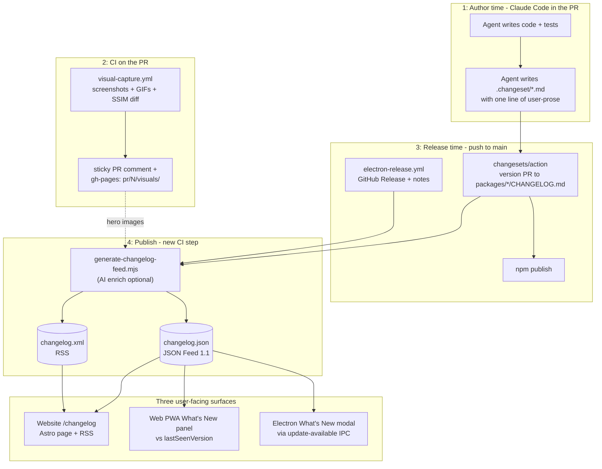
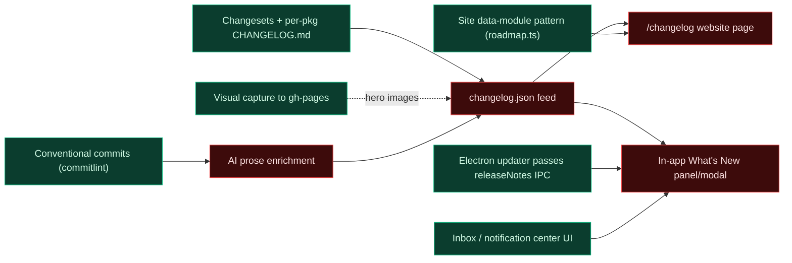
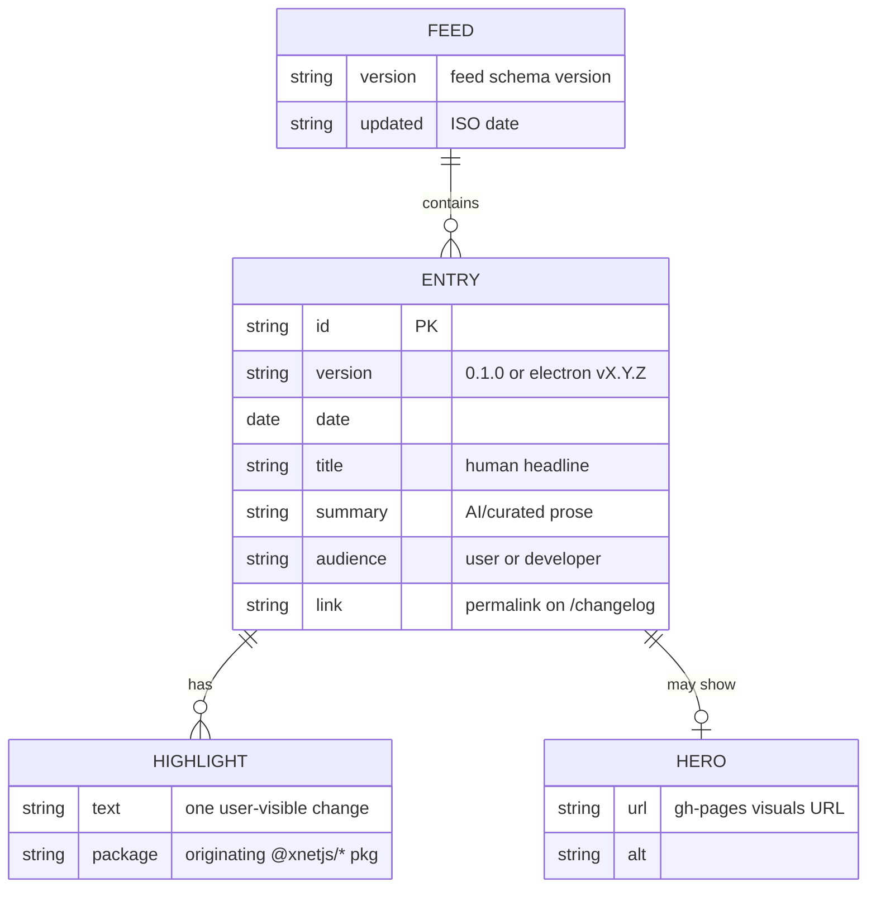
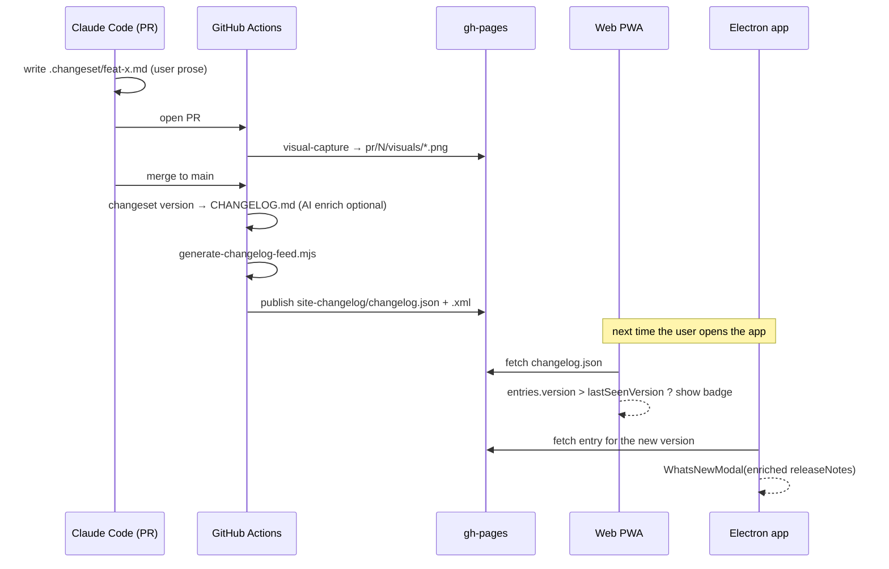
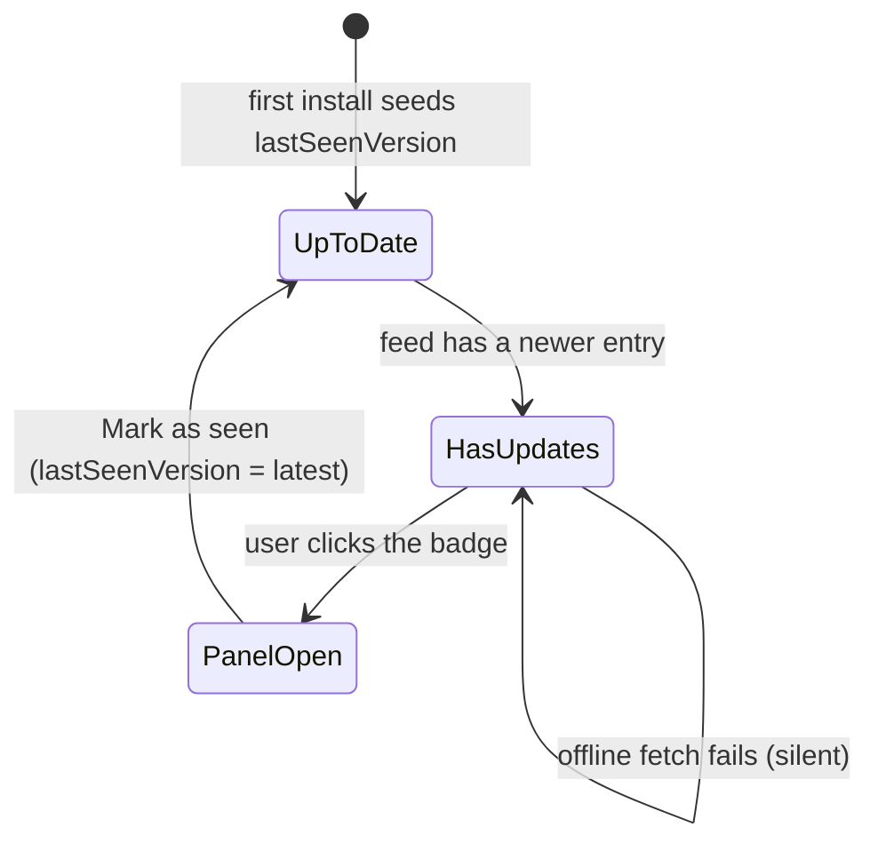

# AI-Assisted Changelog System

## Problem Statement

xNet ships to three audiences simultaneously — npm package consumers, web PWA
users, and Electron desktop users — but has no systematic way to tell any of
them what changed and why they should care. The current state is:

- **CHANGELOG.md files exist per package** (Changesets generates them) but they
  are developer-facing: raw commit hashes and bump types, no human summaries.
- **The public website has no changelog or "What's New" page.** The
  `site/src/sidebar.mjs` single-source tracks docs, but changelog is absent.
- **The Electron app's `updater.ts` fires a native dialog** ("Version X is
  available. Download?") but sends zero context about what changed — no
  in-app "What's New" surface.
- **The release notes in `electron-release.yml`** are auto-generated from `git
  log --pretty=format:"- %s"` — raw commit subjects verbatim, no summarization.
- **The CI visual capture pipeline** (exploration 0185) already produces
  per-PR screenshots and GIFs on gh-pages, but they are never surfaced to end
  users in any changelog context.

The gap: every release ships silently. This exploration designs a
fully-automated, AI-assisted changelog system that closes that gap without
adding manual overhead to every PR.

## Executive Summary

1. **Changesets is the right versioning substrate** for this monorepo. It
   already runs, it correctly handles the `fixed[]` group and `ignored[]`
   packages, and it integrates with `npm-release.yml`. The right move is to
   enrich it, not replace it.

2. **The critical split: developer changelog vs user changelog.** Changesets
   CHANGELOG.md files are the developer record. User-facing "What's New" must
   be a separate artifact — authored in human prose, not assembled from commit
   messages.

3. **The Changesets custom changelog hook is the injection point.** The
   `getReleaseLine` async function in `.changeset/config.json`'s `changelog`
   field can call an LLM at version time to enrich changeset summaries into
   user-readable prose. This is the cleanest AI integration point — it runs
   once per release, not per commit.

4. **`communique` (jdx) is the most purpose-built AI release notes tool** in
   the ecosystem. It calls Claude/OpenAI, replaces GitHub Release notes, and
   supports CHANGELOG.md output. Worth evaluating as a complement to
   Changesets rather than a replacement.

5. **The in-app "What's New" surface** should be a thin JSON feed fetched from
   gh-pages, compared against a `lastSeenVersion` stored in the xNet
   workbench store. No third-party service needed.

6. **The existing visual capture pipeline** (exploration 0185) already produces
   the screenshots. The work is wiring them into the changelog feed, not
   re-capturing them.

7. **Claude Code as the authoring agent** — changeset files are Markdown with a
   YAML front-matter header. An agent writing a changeset at PR time (with a
   human summary of what changed) is the highest-leverage integration: it makes
   the human summary available before CI runs, so the LLM enrichment step has
   real context.

### System at a glance

One artifact (a `changelog.json` JSON feed on gh-pages) is produced by CI and
fanned out to three surfaces. AI enriches the prose at two points (author time
and release time); the visual-capture pipeline supplies the hero images.



The diagram below colours what already exists in the repo (green) against the
work this exploration scopes (red).



## Current State In The Repository

### Versioning and release infrastructure

| File | Role |
|---|---|
| `.changeset/config.json` | Changesets config — `fixed[]` group, `ignored[]` apps/private pkgs, `changelog: "@changesets/cli/changelog"` (default, no enrichment) |
| `package.json` scripts | `changeset`, `version-packages`, `release` |
| `.github/workflows/npm-release.yml` | Runs `changesets/action@v1`, creates version PR or publishes |
| `.github/workflows/electron-release.yml` | Assembles release notes via `git log --pretty=format:"- %s"`, creates GitHub Release |
| `packages/*/CHANGELOG.md` | Machine-generated by Changesets — e.g. `packages/core/CHANGELOG.md` has `## 0.0.2 / Patch Changes / cd2a564: Set up automated npm publishing…` |

### Electron auto-updater

`apps/electron/src/main/updater.ts` — polls GitHub Releases every 4 hours,
prompts the user with a native dialog, and sends `update-available` IPC with
`{ version, releaseNotes }` to the renderer. The renderer currently receives
`releaseNotes` but has **no UI to display them** — the native dialog says only
"Version X is available."

### Visual capture pipeline

`.github/workflows/visual-capture.yml` (exploration 0185) captures Storybook
stories + web routes on PR, diffs with SSIM vs `visuals-baseline/`, and posts a
sticky PR comment (`<!-- xnet-visuals -->`, built by `scripts/visuals/comment.mjs`).
The capture flow is `changed-capture-set.mjs → capture.mjs → diff.mjs →
comment.mjs`, each emitting a JSON manifest. The gh-pages layout is:

- `pr/<N>/visuals/…` — the live per-PR gallery (URL
  `https://xnet.fyi/pr/<N>/visuals/<path>`).
- `visuals/…` — **durable** merged-PR galleries that survive PR-preview cleanup
  (exploration 0189/0191; protected by the `--delete` exclude list in
  `deploy-site.yml`).
- `visuals-baseline/…` — the main-branch baseline every PR diffs against.

Each image carries a label/caption in the manifest (story `title`/`name`, route
`label`, flow `label`) and a `status` (`new`/`changed`/`unchanged`) plus SSIM
score — exactly the metadata a changelog hero-image picker needs.

**These visuals are already on gh-pages and labelled, but are never referenced
from any changelog.**

### Web app notification infrastructure

xNet has a full notification center (PR #47, exploration 0168) that is the
natural host for a "What's New" entry:

- `packages/comms/src/notify/types.ts` — `InboxItem` with a
  `NotificationReason` union (`mention | dm | assigned | reply | comment |
  keyword | call-missed | connection-request | message-request | system`).
  Adding a `changelog` (or reusing `system`) reason is a one-line extension.
- `packages/comms/src/notify/notifier.ts` — a worker-local notifier with a
  `push(item)` method for **synthetic** items (already used for
  `call-missed`/`system`). A version-bump check can `push` a single changelog
  item; these are deliberately not synced.
- `packages/data/src/schema/schemas/inbox-state.ts` — `InboxStateSchema`
  holds per-user triage (`watermarks`, `ackedMentions`, `items`, `prefs`),
  user-owned and synced across devices. A "last seen changelog version" could
  live here (cross-device) **or** in the local workbench store (per-device).
- `apps/web/src/comms/InboxTray.tsx` + `apps/web/src/workbench/views/tray.tsx`
  (`NotificationsTray`) — the GitHub-grade triage UI already renders the
  `system` reason; a changelog card slots in at the top.
- `apps/web/src/components/StorageWarningBanner.tsx` — the dismissible
  top-of-screen banner pattern (CSS var `--storage-banner-height`); an
  analogous one-line `WhatsNewBanner` is immediately constructable.

Critically, **the web app has no notion of its own version today.** There is no
`VITE_APP_VERSION`, no build-time injection in `apps/web/vite.config.ts`, and
no service-worker update hook even though the PWA uses `registerType:
'autoUpdate'`. Build-time version injection is a prerequisite for the
`lastSeenVersion` comparison.

Local per-device state lives in the zustand `persist` store at
`apps/web/src/workbench/state.ts` (key `xnet:workbench:v1`) — the right place
for a per-device `lastSeenChangelogVersion`.

### Public website (Starlight / Astro)

`site/` is a Starlight + Astro static site deployed to `xnet.fyi`. It has an
established **single-sourced data-module pattern** that a changelog should
mirror exactly:

- `site/src/data/roadmap.ts` and `site/src/data/compare.ts` are typed data
  modules (exported `interface` + array + `updated` date). `roadmap.ts` →
  `components/sections/Roadmap.astro`; `compare.ts` → `pages/compare.astro`.
- `site/scripts/validate-compare.ts` runs at build time (`pnpm build` →
  `validate:compare && build:llms && astro build`) and fails on malformed
  data, HTTPS-only URLs, dangling footnotes — the template for a
  `validate-changelog.ts` gate.
- `site/src/sidebar.mjs` is the single source of nav; the `build:llms` step
  **fails the build** if a docs page exists that is neither listed there nor
  explicitly excluded. Any new docs-collection page must be registered.
- `site/src/content.config.ts` defines the Starlight `docs` content
  collection; a parallel `changelog` collection is the idiomatic home for
  per-release MDX entries.
- Public assets are served from `site/public/` (e.g.
  `https://xnet.fyi/images/workbench-dark.png`); the page can also embed
  gh-pages-hosted visuals directly. `@astrojs/rss` adds a `/changelog.xml`
  endpoint with minimal effort.

Note: the repo-root `docs/` tree (where this exploration lives) is **not**
synced into the site — site content is authored separately under
`site/src/content/`.

## External Research

### Changelog generation tools

#### Changesets (`@changesets/cli`)

- **Model**: human-authored changeset files (`.changeset/*.md`) created per
  PR, then aggregated into version bumps and CHANGELOG.md at release time.
  Changeset files are YAML front-matter + human summary body.
- **Monorepo fit**: designed for monorepos. `fixed[]` groups, `linked[]`
  groups, per-package CHANGELOG. Already in use here.
- **Custom changelog**: the `changelog` field in `config.json` points to any
  module exporting `{ getReleaseLine, getDependencyReleaseLine }`. Both are
  async — you can make HTTP calls to an LLM. This is the **primary AI
  injection point**.
- **Failure mode**: quality is bounded by the changeset summary the author
  wrote. If developers write terse summaries ("fix bug"), the AI has nothing
  to expand. Incentive problem.
- **Does not generate user-facing notes by default.** The raw changeset summary
  becomes the CHANGELOG line. No automatic human prose.

#### release-please (Google)

- **Model**: reads Conventional Commits, maintains `release-please-manifest.json`,
  opens a "Release PR" with CHANGELOG updates, publishes on merge.
- **Monorepo fit**: strong via `release-please-config.json` per-package. Supports
  `changelog-sections` to map commit types to human-readable section labels.
- **User-facing**: no native AI summarization. Human-readable section labels
  (`feat: → Features`, `fix: → Bug Fixes`) improve readability over raw commits
  but are still technical.
- **Conflict with Changesets**: this repo already uses Changesets. Migrating to
  release-please would mean abandoning the intentional changeset authoring flow.
  Not recommended unless Changesets is dropped.
- **Failure mode**: in a monorepo, "Release PR explosion" — every commit to any
  package opens or updates a release PR. With 30+ packages, noise is high.

#### semantic-release

- **Model**: fully automated — reads all commits since last tag, determines
  version bump, publishes. No changeset files.
- **Monorepo fit**: poor without plugins (`@semantic-release/exec`,
  `semantic-release-monorepo`). Requires careful per-package config.
- **User-facing**: changelogs are raw commit lists unless a custom plugin
  summarizes them.
- **Failure mode**: one bad merge commit can trigger an unintended major release.
  No human review step. The intentional authoring model of Changesets is
  deliberately absent.
- **Verdict for xNet**: incompatible. The team already chose Changesets for
  its intentionality. Semantic-release is the opposite philosophy.

#### git-cliff

- **Model**: pure CHANGELOG generation from git history. Written in Rust, fast.
  Jinja2-template-based output. Configured via `cliff.toml`.
- **Monorepo fit**: supports per-package scoping via `--include-path`.
- **AI integration**: git-cliff itself is not LLM-aware, but in v2.6.0+
  there are hooks and preprocessor options. Teams use an LLM to write the
  `cliff.toml` config, then use git-cliff to format the raw commits, then pipe
  that output to an LLM for summarization.
- **Complementary role**: git-cliff is excellent for generating the **developer
  CHANGELOG** format as a standalone step (e.g., in the electron release
  workflow), while Changesets handles the npm versioning. The two can coexist.
- **Failure mode**: depends entirely on commit message quality. With Conventional
  Commits enforced by `commitlint`, the input is clean here. But user-facing
  summaries still require a human or LLM step.

#### auto (intuit/auto)

- **Model**: PR label-based. Merge a PR with `major`/`minor`/`patch`/`skip-release`
  labels, auto handles versioning and CHANGELOG.
- **Monorepo fit**: has `sub-package` plugin for per-package changelogs.
- **User-facing**: section headers are customizable by label. Still technical.
  No AI summarization built in.
- **Verdict**: a third versioning philosophy (label-based). Switching to it
  would discard the changeset file authoring model. Not recommended.

#### release-drafter

- **Model**: GitHub Action that maintains a draft GitHub Release, aggregating
  PR titles by label into sections.
- **Monorepo fit**: weak — one draft release for the whole repo.
- **User-facing**: section labels from PR titles. Quality depends on PR title
  quality.
- **Verdict**: best as a lightweight supplement for the Electron release notes
  (fills the `electron-release.yml` gap), not a replacement for Changesets.

#### communique (jdx)

- **Model**: a standalone tool and GitHub Action. After a release tool (e.g.,
  release-plz, Changesets) creates a release, communique takes the git range,
  calls Claude or OpenAI, and replaces the release notes with AI-editorialized
  prose. Configured via `communique.toml`.
- **AI support**: first-class. Supports `model = "claude-opus-4"` or
  OpenAI-compatible endpoints.
- **Output**: can write to CHANGELOG.md, GitHub Release notes, or both.
- **Failure mode**: LLM API dependency in CI. Needs an API key secret. If the
  key is missing or rate-limited, the step fails (unless wrapped in
  `continue-on-error`). Also: the AI reads git commit messages and PR titles,
  so if your commits are noisy it still generates noise, just in more readable
  prose.
- **Verdict**: the best off-the-shelf AI release notes tool. Worth integrating
  in `electron-release.yml` as a post-release step, without replacing
  Changesets.

### AI-assisted changelog generation patterns

#### GitHub's native auto-generated release notes

GitHub's `generate-notes` REST endpoint (and the UI "Generate release notes"
button) reads merged PRs since the last tag, groups them by label via a
`.github/release.yml` categories config, and outputs a changelog. No LLM —
it's PR title aggregation. Quality gate: PR titles.

**Existing use**: `electron-release.yml` uses `gh release create --notes-file
release-notes.md` but generates that file from `git log`, not from GitHub's
native API. Switching to `gh release create --generate-notes` would be a
one-line improvement.

#### reservamos/ai-release-notes-action

A GitHub Action that calls OpenAI to summarize commits/PRs into release notes.
Supports `en`/`es`/`br`. Simple, but OpenAI-only and no Claude support.

#### ascend.io AI release notes pipeline

A pattern documented by Ascend: on release tag, run a job that calls an LLM
with the git range, PR descriptions, and a template prompt, then posts the
result back to the GitHub Release. Works for any LLM provider.

#### anthropics/claude-code-action

The official Claude Code GitHub Action — runs Claude as an agent in CI. Can be
used as a release notes step: pass it the git range + a prompt asking for a
user-facing summary. Handles the API key rotation and streaming natively.

#### Changefish AI pattern (author-time injection)

The highest-signal approach documented in the ecosystem: at PR authoring time
(not CI release time), an AI agent reads the diff and writes a changeset file
with a human-prose summary. By the time `changeset version` runs, the input
is already good. This avoids the "garbage in, garbage out" problem with purely
commit-driven AI summaries.

This is the **Claude Code pattern**: the agent writing the code writes the
changeset file as part of the PR. The CLAUDE.md or AGENTS.md can instruct
Claude to always create a `.changeset/*.md` file with a human-readable
description of what changed and why.

### Developer changelog vs user changelog split

The industry consensus, well-documented (Appcues, Beamer, ReleasePad):

| Dimension | Developer changelog | User changelog / What's New |
|---|---|---|
| Audience | Engineers, library consumers | End users, non-technical stakeholders |
| Format | Semver + Conventional Commit types | Prose headlines + bullets |
| Tone | Technical, precise | Benefit-focused, friendly |
| Scope | All changes including internal | Only user-visible changes |
| Examples | `fix(schema): correct relation validation` | "Deals now sync correctly after import" |
| Location | CHANGELOG.md in package | /changelog on website, in-app panel |

**Best practice**: generate the developer changelog automatically (Changesets),
then **either** extract user-facing items from it via AI, **or** author a
separate `WHATS_NEW.md` / content collection entry for major releases.

Linear's changelog is the canonical example of user-facing excellence: each
release gets a dedicated page with a hero image, a headline describing the user
benefit, and a brief paragraph. Not a commit list.

### In-app "What's New" patterns

**Pattern: "last seen version" badge**
- Store `lastSeenVersion` in localStorage / IndexedDB / app state.
- On app load, compare against the current `APP_VERSION` env var.
- If current > last seen, show a badge on a "What's New" button.
- On open, update `lastSeenVersion` to current.

**Pattern: changelog feed widget**
- Fetch a JSON feed (e.g., `/changelog.json`) from the public site.
- Filter entries newer than `lastSeenVersion`.
- Render in a panel or modal.

**Industry examples**:
- **VS Code**: on every minor version bump, opens an in-editor "Release Notes"
  tab showing the web release notes page (`code.visualstudio.com/updates/v1_NN`)
  via `vscode.window.showTextDocument`. The URL is composed from the version.
  Tracks `lastSeenVersion` in global state; only shows once per version.
- **Linear**: changelog is the website (`linear.app/changelog`). In-app, a
  "What's New" entry appears in the notification center with a link to the
  changelog entry.
- **Figma**: shows a changelog dot in the help menu. Fetches from a CDN JSON
  file. Compares against a `lastChangelogId` in user preferences.
- **Slack**: shows "What's new" in the help menu, fetching from Slack's CDN.

**Commercial widget services**: Headway, Beamer, Canny, LaunchNotes,
AnnounceKit, Changefeed, changelog.is. All require embedding a script tag and
paying for hosting. They add dependencies and data egress. For an open-source
local-first product, self-hosting from gh-pages is better.

**Open-source self-hosted**: Quackback (full-featured, includes changelog + roadmap + feedback).

### Visual changelogs

Linear is the gold standard: every changelog entry has one strong hero image
or GIF. The key insight: **one well-chosen visual communicates a UI change
faster than three paragraphs of text**. Studies cited by Frill and others show
3–5x engagement lift for visual changelogs.

The xNet visual capture pipeline (exploration 0185) already generates:
- Per-PR screenshots for each changed Storybook story and web route
- SSIM diffs (changed vs baseline)
- Interaction GIFs/MP4s for tagged flows
- Published live at `https://xnet.fyi/pr/<N>/visuals/` and, after merge,
  durably under `https://xnet.fyi/visuals/`

These are **available for use in changelog entries**. The work is selecting one
canonical "hero image" per release, not generating new screenshots.

### Machine-readable changelog formats

**Keep a Changelog format** (`keepachangelog.com`): the de-facto standard.
Markdown with `## [version] - YYYY-MM-DD` headers, sections Added/Changed/
Deprecated/Removed/Fixed/Security. parseable by `oscarotero/keep-a-changelog`.

**Common Changelog** (`common-changelog.org`): adds references, authors, and
breaking-change callouts to the Keep a Changelog format. No Unreleased section.

**JSON Feed 1.1** (`jsonfeed.org`): JSON-based feed (analogous to Atom/RSS).
Item schema: `id`, `title`, `content_html`, `date_published`, `url`, `image`.
Can carry changelog entries. Natively renderable by any RSS reader.

**Astro `@astrojs/rss`**: exposes a `/rss.xml` (Atom/RSS) from any content
collection. The site already uses Starlight/Astro — adding a `/changelog.xml`
feed is low-effort.

**Proposed `changelog.json` schema for xNet**:
```json
{
  "version": "1.0",
  "entries": [
    {
      "id": "2026-06-17",
      "version": "0.1.0",
      "date": "2026-06-17",
      "title": "Extensibility fabric: plugins, labs, AI, editor",
      "summary": "Human-prose paragraph...",
      "highlights": ["item1", "item2"],
      "heroImage": "https://xnet.fyi/visuals/routes/discover.png",
      "heroAlt": "Plugin marketplace screenshot",
      "tags": ["plugins", "ai", "editor"],
      "audience": "user",
      "link": "https://xnet.fyi/changelog/2026-06-17"
    }
  ]
}
```

This file is published to gh-pages and consumed by: the Astro site
(changelog page), the web PWA (What's New panel), and the Electron app
(IPC-fetched on startup, shown in the update dialog).



### Claude Code as authoring agent

The key insight from the ecosystem research: **AI at release time reads noisy
signals; AI at authoring time reads the full context**.

When Claude Code writes a PR (as in this repo, via `@xnetjs/devkit`
`AgentRunner`), it has access to:
- The full diff
- The PR description it wrote
- The exploration document that motivated the work
- The test names that describe the behavior

This is the ideal moment to write a changeset file with a human summary.
The `AGENTS.md` or CLAUDE.md can instruct the agent: "after making changes,
create a `.changeset/your-change-name.md` file describing what changed in
one sentence of user-facing prose."

The Changeset's custom `getReleaseLine` then becomes an optional enrichment
step — the raw summary may already be good enough.

## Key Findings

1. **Changesets already supports a custom async `getReleaseLine` hook** that
   can call an LLM. This is the right AI injection point for enriching
   developer changeset summaries into user-facing prose at version time.

2. **`communique` (jdx) is the most mature off-the-shelf AI release notes
   generator** targeting the electron release use case. It calls Claude
   natively and replaces the `git log --pretty=format:"- %s"` raw output.

3. **The visual capture pipeline already produces the hero images.** Wiring
   them into a structured feed requires selecting one image per release — a
   metadata problem, not a capture problem.

4. **The xNet Electron updater already passes `releaseNotes` to the renderer**
   via IPC `update-available`. Adding a "What's New" panel is a renderer-only
   change.

5. **A changelog JSON feed on gh-pages** is the correct data layer. It allows
   the website, the PWA, and the Electron app to share the same data source
   without a backend.

6. **The "garbage in, garbage out" problem** is real for AI-generated release
   notes from raw commits. The mitigation is author-time changeset authoring
   (with Claude Code writing changeset files as part of PRs) rather than
   retroactive LLM summarization from commit messages.

7. **Release-please is the right alternative to Changesets if the team wanted
   to move to a fully automated flow**, but migration has significant cost and
   loses the intentional changeset authoring model that works well for a library.

8. **SaaS changelog widgets (Beamer, Headway, etc.) add vendor dependencies**
   and data egress inconsistent with a local-first, privacy-first product
   philosophy. Self-hosting from gh-pages is preferable.

## Options And Tradeoffs

### Option A: Minimal enrichment (30% effort, 60% value)

Improve what exists without a new architecture:

1. Switch `electron-release.yml` from raw `git log` to `gh release create --generate-notes`
   (GitHub native PR title aggregation via `.github/release.yml`).
2. Add a `communique.toml` + post-release `communique` step to the electron
   release workflow, replacing the raw release notes with AI prose.
3. Instruct Claude Code (in AGENTS.md) to write a `.changeset/*.md` file with
   a user-prose summary on every significant PR.

Tradeoffs:
- No structured feed, no website changelog page, no in-app "What's New" panel.
- Electron release notes get dramatically better.
- Zero new infrastructure.

### Option B: Full three-surface system (100% effort, 100% value)

The complete system described in this exploration:

1. Author-time: Claude Code writes changeset files with human summaries.
2. Version time: custom `getReleaseLine` calls Claude to enrich changelogs.
3. Release time: `communique` enriches Electron release notes.
4. Publish time: a `generate-changelog-feed.mjs` script in CI produces
   `changelog.json` and `changelog.xml` from the CHANGELOG.md files and
   selected visuals, pushed to gh-pages.
5. Website: a new `/changelog` Astro page renders entries from the content
   collection, with RSS via `@astrojs/rss`.
6. PWA: a `useWhatsNew` hook compares `lastSeenVersion` against current app
   version, fetches the feed, shows a What's New panel.
7. Electron: the renderer displays `releaseNotes` (now enriched HTML from
   the feed) in a real "What's New" modal, not just the native dialog.

Tradeoffs:
- Highest value. All three surfaces covered.
- ~3–4 PRs to implement fully.
- LLM API key dependency in CI (mitigated by `continue-on-error`).
- The visual selection step (which screenshot is the "hero"?) needs a convention
  or a manual override mechanism.

### Option C: Third-party changelog widget (20% effort, 40% value)

Embed Headway or Beamer:
- `<script src="//cdn.headwayapp.co/widget.js">` in the web app.
- Manual publishing of changelog entries in the Headway dashboard.
- Widget auto-shows badge when new entries exist.

Tradeoffs:
- Instant in-app What's New with zero backend work.
- External dependency, data leaves the user's browser.
- No connection to the automated build pipeline.
- Manual publishing step — defeats the automation goal.
- Conflicts with local-first / privacy-first positioning.

### Option D: git-cliff for developer CHANGELOG + AI for user notes (hybrid)

Use git-cliff in `electron-release.yml` instead of `git log`, then pipe its
structured output to Claude for user summarization:

```yaml
- run: git-cliff --latest -o tmp/raw-changelog.md
- run: |
    claude -p "Rewrite this as user-facing What's New entries..." \
      < tmp/raw-changelog.md > release-notes.md
```

Tradeoffs:
- Decouples versioning (Changesets) from changelog formatting (git-cliff).
- Better commit grouping than raw `git log`.
- Still "garbage in" if commit messages are noisy.
- Adds a Rust binary dependency to CI.

**Recommendation: Option B (phased), with Option A as Phase 0.**

## Recommendation

Implement Option B in four phases, shipping each as an independent PR. The
end-to-end flow once all phases land:



### Phase 0 — Electron release notes (immediate, 1 PR)

Replace the raw `git log` notes in `electron-release.yml` with:
1. `gh release create --generate-notes` (GitHub native PR aggregation).
2. A `communique` post-release step using `ANTHROPIC_API_KEY` to rewrite
   notes in user-facing prose.

Update `.github/release.yml` to categorize PR labels into user-friendly
sections (`enhancement: → Features`, `bug: → Fixed`, etc.).

**Expected outcome**: Electron release notes go from `- chore(ci): bump
playwright` to `"Plugins now load faster thanks to revised dependency caching."`

### Phase 1 — Changelog feed (1 PR)

Add a `scripts/generate-changelog-feed.mjs` script that:
1. Reads `packages/*/CHANGELOG.md` files (filtered to non-ignored packages).
2. Optionally reads a `WHATS_NEW.md` in the repo root for curated user entries.
3. Merges into `changelog.json` and `changelog.xml` (JSON Feed 1.1 + RSS).
4. Embeds hero image URLs from `visuals-baseline/` manifest (or defaults to
   a generic placeholder).
5. Publishes to `gh-pages: site-changelog/`.

Wire this script into `npm-release.yml` as a post-release step.

### Phase 2 — Website changelog page (1 PR)

Add `site/src/content/changelog/` as a new Astro content collection with a
`changelogEntrySchema` (date, version, title, summary, heroImage, tags).

Add `site/src/pages/changelog/index.astro` and per-entry
`site/src/pages/changelog/[slug].astro`.

Add `/changelog.xml` via `@astrojs/rss`.

Add `{ slug: 'changelog' }` to `site/src/sidebar.mjs`.

Wire the feed script (Phase 1) to auto-populate the collection from the JSON
feed, so future releases appear automatically.

### Phase 3 — In-app What's New (1 PR)

The in-app "last seen version" lifecycle:



Seeding `lastSeenVersion` from the app's own `APP_VERSION` on first install
(not from the feed) avoids showing a wall of historical entries to brand-new
users.

**Web PWA** (`apps/web/`):
- Inject `VITE_APP_VERSION` at build time (`apps/web/vite.config.ts` +
  `apps/web/src/env.d.ts`) — prerequisite for the version comparison.
- Add `packages/core/src/whats-new.ts` — `useWhatsNew` hook that:
  - Reads `lastSeenVersion` from the workbench store (persisted via SQLite).
  - Fetches `https://xnet.fyi/site-changelog/changelog.json` lazily on open.
  - Returns `{ hasNew: boolean, entries: ChangelogEntry[], markSeen: () => void }`.
- Add `WhatsNewPanel` component rendered in the notification center or as a
  dedicated workbench panel view.
- Show an unread badge on the panel trigger when `hasNew`.

**Electron** (`apps/electron/`):
- In `updater.ts`, augment the `update-available` IPC payload with the
  changelog feed entry for the new version (fetched via the feed URL).
- Add a `WhatsNewModal` in the renderer that renders the entry HTML instead
  of the native dialog.

### Phase 4 — Author-time agent integration (AGENTS.md update, 0 PRs)

Add a standing instruction to `AGENTS.md`:

```
## Changeset authoring

When you make a change that users will notice (new feature, fixed bug, UX
improvement), create a .changeset/<kebab-slug>.md file:

---
"<package-name>": minor
---

<One sentence in user-facing prose describing the benefit. No commit hashes,
no internal jargon. Good example: "Contacts can now be merged by email
address, preventing duplicates when importing from multiple sources.">
```

This ensures the Changesets source already contains human prose before CI runs.
The `getReleaseLine` hook (optional Phase B enhancement) becomes polish, not
the primary source.

## Example Code

### `.github/release.yml` — PR label categories

```yaml
changelog:
  categories:
    - title: "New Features"
      labels: ["enhancement", "feature"]
    - title: "Bug Fixes"
      labels: ["bug", "fix"]
    - title: "Performance"
      labels: ["performance", "perf"]
    - title: "Documentation"
      labels: ["documentation", "docs"]
    - title: "Other Changes"
      labels: ["*"]
  exclude:
    labels: ["skip-release", "internal", "dependencies"]
```

### `scripts/generate-changelog-feed.mjs` (skeleton)

```js
import { readFile, writeFile, mkdir } from 'node:fs/promises'
import { glob } from 'glob'

const PACKAGES_WITH_CHANGELOGS = [
  'packages/core', 'packages/plugins', 'packages/identity',
  // ... non-ignored packages from .changeset/config.json
]

async function parseChangelog(path) {
  const text = await readFile(path, 'utf8')
  // Parse Keep a Changelog format: ## version / ### section / - item
  const entries = []
  let currentEntry = null
  for (const line of text.split('\n')) {
    const versionMatch = line.match(/^## (\d+\.\d+\.\d+)/)
    if (versionMatch) {
      if (currentEntry) entries.push(currentEntry)
      currentEntry = { version: versionMatch[1], lines: [] }
    } else if (currentEntry && line.startsWith('- ')) {
      currentEntry.lines.push(line.slice(2).trim())
    }
  }
  if (currentEntry) entries.push(currentEntry)
  return entries
}

async function generateFeed() {
  const allEntries = []
  for (const pkg of PACKAGES_WITH_CHANGELOGS) {
    try {
      const entries = await parseChangelog(`${pkg}/CHANGELOG.md`)
      allEntries.push(...entries.map(e => ({ ...e, pkg })))
    } catch { /* package may not have released yet */ }
  }

  // Deduplicate by date/version, merge package changes
  const byVersion = new Map()
  for (const entry of allEntries) {
    const key = entry.version
    if (!byVersion.has(key)) byVersion.set(key, { version: key, packages: [] })
    byVersion.get(key).packages.push({ pkg: entry.pkg, changes: entry.lines })
  }

  const feed = {
    version: '1.0',
    entries: [...byVersion.values()].map(v => ({
      id: v.version,
      version: v.version,
      date: new Date().toISOString().slice(0, 10), // approximation
      title: `xNet ${v.version}`,
      summary: v.packages.flatMap(p => p.changes).slice(0, 3).join('. '),
      highlights: v.packages.flatMap(p => p.changes),
      audience: 'user'
    }))
  }

  await mkdir('tmp/changelog', { recursive: true })
  await writeFile('tmp/changelog/changelog.json', JSON.stringify(feed, null, 2))
}

generateFeed()
```

### `useWhatsNew` hook (web PWA sketch)

```ts
// packages/core/src/whats-new.ts
export interface ChangelogEntry {
  id: string
  version: string
  date: string
  title: string
  summary: string
  highlights: string[]
  heroImage?: string
  heroAlt?: string
  link?: string
}

const CHANGELOG_URL = 'https://xnet.fyi/site-changelog/changelog.json'
const LAST_SEEN_KEY = 'xnet:lastSeenChangelogVersion'

export function useWhatsNew(currentVersion: string) {
  const [entries, setEntries] = useState<ChangelogEntry[]>([])
  const [open, setOpen] = useState(false)

  const lastSeen = useMemo(() => localStorage.getItem(LAST_SEEN_KEY) ?? '0.0.0', [])
  const hasNew = useMemo(
    () => entries.some(e => compareVersions(e.version, lastSeen) > 0),
    [entries, lastSeen]
  )

  const load = useCallback(async () => {
    try {
      const res = await fetch(CHANGELOG_URL)
      const data = await res.json()
      setEntries(data.entries ?? [])
    } catch { /* offline — fail silently */ }
  }, [])

  const markSeen = useCallback(() => {
    localStorage.setItem(LAST_SEEN_KEY, currentVersion)
    setOpen(false)
  }, [currentVersion])

  return { entries, hasNew, open, setOpen, load, markSeen }
}
```

### `communique.toml` for Electron releases

```toml
[defaults]
model = "claude-opus-4-8" # latest Opus; use claude-haiku-4-5 for cheaper runs

[[prompts]]
name = "user-facing"
system = """
You are writing release notes for xNet, a local-first data platform.
Your audience: developers and power users who use the desktop app.
Tone: clear, benefit-focused, not marketing-speak.
- Lead with the most impactful user-visible change.
- Group changes: New Features / Bug Fixes / Under the Hood.
- Skip internal refactors unless they affect stability.
- Max 300 words.
"""
user = """
Here are the commits and PR titles for this release:
{{commits}}

Write release notes.
"""
```

### Custom Changesets changelog function (AI-enriched)

```js
// .changeset/changelog-with-ai.cjs
const { Anthropic } = require('@anthropic-ai/sdk')

async function getReleaseLine(changeset, _type, _options) {
  const { summary } = changeset
  // Only call the API if ANTHROPIC_API_KEY is set (CI has it, local dev skips)
  if (!process.env.ANTHROPIC_API_KEY || summary.length > 200) {
    return `- ${summary}`
  }
  try {
    const client = new Anthropic()
    const msg = await client.messages.create({
      model: 'claude-haiku-4-5', // cheap + fast; enrichment is one sentence
      max_tokens: 150,
      messages: [{
        role: 'user',
        content: `Rewrite this developer changelog entry as a one-sentence user-facing note.
No jargon, no commit hashes. Focus on user benefit.
Original: "${summary}"
Reply with only the rewritten sentence.`
      }]
    })
    const text = msg.content[0].type === 'text' ? msg.content[0].text.trim() : summary
    return `- ${text}`
  } catch {
    return `- ${summary}` // graceful degradation
  }
}

async function getDependencyReleaseLine() { return null }

module.exports = { getReleaseLine, getDependencyReleaseLine }
```

```json
// .changeset/config.json (changelog field only)
{
  "changelog": "./.changeset/changelog-with-ai.cjs"
}
```

## Risks And Open Questions

### Risks

**LLM API key in CI**
The `communique` step and the custom `getReleaseLine` hook both require an
`ANTHROPIC_API_KEY` secret in CI. If the key expires or is rate-limited, the
step must degrade gracefully (`continue-on-error: true` for communique; try/
catch returning the raw summary for the Changesets hook). The key should be
a repository secret, not hardcoded.

**AI hallucination in release notes**
LLMs can invent features or misrepresent bug fixes when summarizing commit
messages. Mitigation: feed structured input (PR titles + changeset summaries,
not raw diffs), use a temperature of 0, and treat AI output as a **draft** —
the changelog entry should be human-reviewable before publication. The Phase 1
`WHATS_NEW.md` curation file is the override mechanism.

**Visual hero image selection**
The capture pipeline generates many images per PR. Selecting one canonical
"hero" per release requires a convention. Options: (a) the first non-diff
screenshot in the release's PR set, (b) a manually specified `hero:` field
in the changeset file, (c) an AI step that scores images by salience. Option
(b) is the safest for Phase 1.

**Version drift between packages and the Electron app**
`apps/electron` is in the `ignore[]` list in `.changeset/config.json`, so
Changesets never bumps it. The Electron version in `apps/electron/package.json`
is managed manually. The changelog feed versioning needs to handle both the
npm package version series and the Electron app version series.

**Feed staleness in offline scenarios**
The PWA `useWhatsNew` hook fetches from gh-pages. If the user is offline, the
fetch fails silently (good). But if the user is on an old cached version of the
app that was installed months ago, the "last seen" logic might show stale
entries or miss the concept of "things new since you installed." Mitigation:
seed `lastSeenVersion` from the app's own `APP_VERSION` on first install, not
from the feed.

**Open questions**

1. Should the changelog feed be at `xnet.fyi/changelog.json` (public docs site)
   or `xnet.fyi/site-changelog/changelog.json` (gh-pages, separate path)?
   The docs site Starlight build overwrites gh-pages root on every deploy
   (`--delete` flag in `deploy-site.yml`). The safe pattern (matching
   `visuals-baseline/`) is a separate top-level path excluded from `--delete`.

2. Who curates the user-facing summary for a multi-package release? The AI
   draft from `communique` or the Changesets hook gives a starting point, but
   a marketing/product review step may be desirable for major releases.

3. Should the Electron "What's New" modal appear on every update or only on
   minor/major bumps? Patch releases should probably not interrupt the user.

4. Does the Astro changelog page need a separate Markdown content collection,
   or can it dynamically fetch from the JSON feed at build time?

## Implementation Checklist

### Phase 0 — Electron release notes

- [ ] Add `.github/release.yml` with PR label categories
  (`enhancement→New Features`, `bug→Bug Fixes`, `perf→Performance`,
  `documentation→Documentation`)
- [ ] Replace `git log --pretty=format:"- %s"` block in `electron-release.yml`
  with `gh release create --generate-notes`
- [ ] Add `communique.toml` to repo root with Claude prompt config
- [ ] Add `ANTHROPIC_API_KEY` to GitHub repository secrets
- [ ] Add `communique` post-release step in `electron-release.yml`
  (`continue-on-error: true`)
- [ ] Test: trigger `workflow_dispatch` on `electron-release.yml`, confirm
  release notes are AI-enriched prose
- [ ] Add standing instruction to `AGENTS.md` for changeset file authoring

### Phase 1 — Changelog feed

- [ ] Write `scripts/generate-changelog-feed.mjs`
  - [ ] Parse all non-ignored package CHANGELOG.md files
  - [ ] Parse optional `WHATS_NEW.md` for curated overrides
  - [ ] Emit `tmp/changelog/changelog.json` (JSON Feed 1.1 schema)
  - [ ] Emit `tmp/changelog/changelog.xml` (RSS/Atom)
  - [ ] Link hero images from `visuals/pr/$PR/` manifest if available
- [ ] Add step to `npm-release.yml` post-changesets: run the feed script
- [ ] Add `.github/actions/publish-gh-pages` call targeting `site-changelog/`
- [ ] Add `site-changelog` to the `--exclude` list in `deploy-site.yml`
- [ ] Verify feed is accessible at `https://xnet.fyi/site-changelog/changelog.json`

### Phase 2 — Website changelog page

- [ ] Add `changelogEntry` schema to `site/src/content.config.ts`
  (`date`, `version`, `title`, `summary`, `heroImage`, `heroAlt`, `tags`)
- [ ] Create `site/src/content/changelog/` directory
- [ ] Add `site/src/pages/changelog/index.astro` (listing page)
- [ ] Add `site/src/pages/changelog/[slug].astro` (per-entry page)
- [ ] Add `site/src/pages/changelog.xml.ts` (RSS endpoint via `@astrojs/rss`)
- [ ] Add `{ label: 'Changelog', slug: 'changelog' }` to `site/src/sidebar.mjs`
- [ ] Wire `generate-changelog-feed.mjs` output to populate
  `site/src/content/changelog/` automatically (in `deploy-site.yml` or
  `npm-release.yml`)
- [ ] Verify `https://xnet.fyi/changelog` renders entries with visuals

### Phase 3 — In-app What's New

- [ ] Inject `VITE_APP_VERSION` at build time (`apps/web/vite.config.ts` `define`
  + `apps/web/src/env.d.ts`) — the app currently has no notion of its version
- [ ] Add `ChangelogEntry` type and `useWhatsNew` hook to a shared location
  (e.g., `packages/core/src/whats-new.ts` or `apps/web/src/hooks/useWhatsNew.ts`)
- [ ] Add `lastSeenChangelogVersion` to the workbench store
  (`apps/web/src/workbench/state.ts`, persisted; seed from `VITE_APP_VERSION`
  on first install)
- [ ] (Alternative) reuse the notification center: add a `changelog`/`system`
  `NotificationReason` and `notifier.push()` one synthetic item on version bump
  (`packages/comms/src/notify/`, rendered by `InboxTray`)
- [ ] Add `WhatsNewPanel` component
  - [ ] Renders `ChangelogEntry[]` as a feed (title, summary, hero image,
    date, link-to-website)
  - [ ] "Mark as seen" button updates `lastSeenChangelogVersion`
- [ ] Register `WhatsNewPanel` as a workbench panel view
- [ ] Add badge to workbench panel trigger when `hasNew`
- [ ] In `apps/electron/src/main/updater.ts`, augment `update-available` IPC
  with the changelog feed entry for the new version
- [ ] Add `WhatsNewModal` to the Electron renderer, rendering the enriched
  entry instead of using native `dialog.showMessageBox`
- [ ] Electron: skip native dialog for patch releases (`versionBump < 'minor'`)

### Phase 4 — Author-time agent integration

- [ ] Update `AGENTS.md` with changeset authoring instructions
- [ ] (Optional) Implement custom `.changeset/changelog-with-ai.cjs` Changesets
  hook using Claude Haiku for one-sentence enrichment
- [ ] (Optional) Update `.changeset/config.json` `changelog` field to point
  to the custom module
- [ ] Wire `ANTHROPIC_API_KEY` into the `version-packages` CI step

## Validation Checklist

- [ ] A merged PR with a `feature` label appears in the Electron release notes
  under "New Features" (not under "Other Changes")
- [ ] The AI-generated release notes for a real release contain no hallucinated
  features (manual review of first 3 releases)
- [ ] `https://xnet.fyi/site-changelog/changelog.json` returns valid JSON Feed
  1.1 with at least one entry after a release
- [ ] `https://xnet.fyi/changelog` renders with at least one hero image
- [ ] `https://xnet.fyi/changelog.xml` is a valid RSS feed that can be
  subscribed to in a feed reader
- [ ] In the web PWA, opening a fresh session (cleared localStorage) shows the
  What's New badge on the first load
- [ ] After clicking "Mark as seen," the badge disappears and does not reappear
  on refresh
- [ ] In the Electron app, after an update, the What's New modal shows the
  AI-enriched release notes (not the raw git log)
- [ ] In the Electron app, a patch release (`0.x.y → 0.x.y+1`) does not show
  the What's New modal
- [ ] If the `ANTHROPIC_API_KEY` is absent from CI, `changeset version` still
  succeeds (using the raw summary as fallback)
- [ ] A Claude Code agent writing a new PR creates a `.changeset/*.md` file
  with a human-prose summary (verify by reviewing 3 consecutive agent PRs)

## References

- [Changesets monorepo versioning](https://github.com/changesets/changesets)
- [Changesets: modifying changelog format](https://github.com/changesets/changesets/blob/main/docs/modifying-changelog-format.md)
- [communique — AI editorialized release notes](https://github.com/jdx/communique)
- [release-please](https://github.com/googleapis/release-please)
- [git-cliff](https://git-cliff.org/)
- [auto (intuit)](https://intuit.github.io/auto/)
- [reservamos/ai-release-notes-action](https://github.com/reservamos/ai-release-notes-action)
- [GitHub: automatically generated release notes](https://docs.github.com/en/repositories/releasing-projects-on-github/automatically-generated-release-notes)
- [anthropics/claude-code-action](https://github.com/anthropics/claude-code-action)
- [changeish — AI-powered commit/changelog CLI](https://github.com/itlackey/changeish)
- [Keep a Changelog](https://keepachangelog.com/)
- [Common Changelog spec](https://common-changelog.org/)
- [JSON Feed 1.1](https://jsonfeed.org/)
- [Beamer — changelog widget](https://www.getbeamer.com/)
- [Headway alternatives (Featurebase)](https://www.featurebase.app/blog/headway-alternatives)
- [Quackback — open-source changelog + roadmap](https://quackback.io/)
- [Changelog vs release notes (Appcues)](https://www.appcues.com/blog/changelog-vs-release-notes)
- [ReleasePad: in-app changelog widgets](https://www.releasepad.io/blog/in-app-changelog-widgets-build-vs-buy/)
- [Linear changelog — visual example](https://linear.app/changelog)
- [Visual changelog best practices (Frill)](https://frill.co/blog/posts/changelog-format)
- [Astro RSS recipe](https://docs.astro.build/en/recipes/rss/)
- [AI changelog pipeline (Ascend)](https://www.ascend.io/blog/how-we-built-an-ai-powered-release-notes-pipeline)
- [Generating CHANGELOG.md with AI agents (flori.dev)](https://flori.dev/reads/changelogen-ai-agent/)
