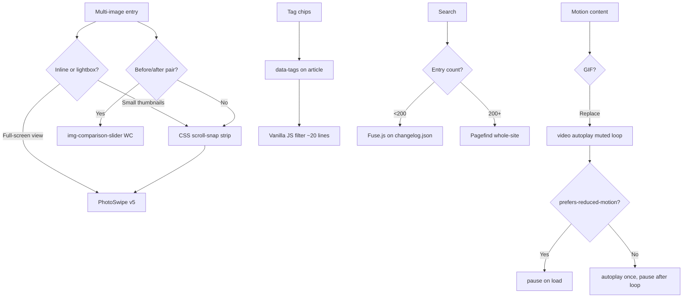
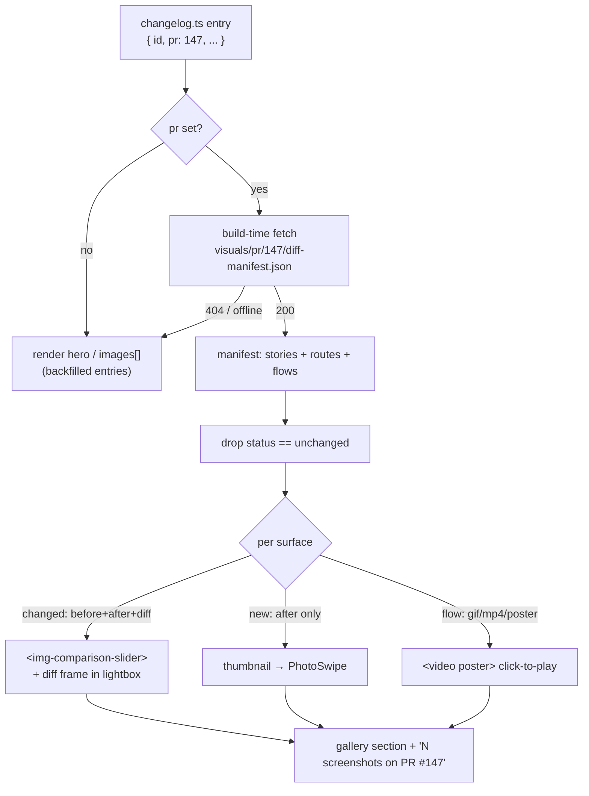
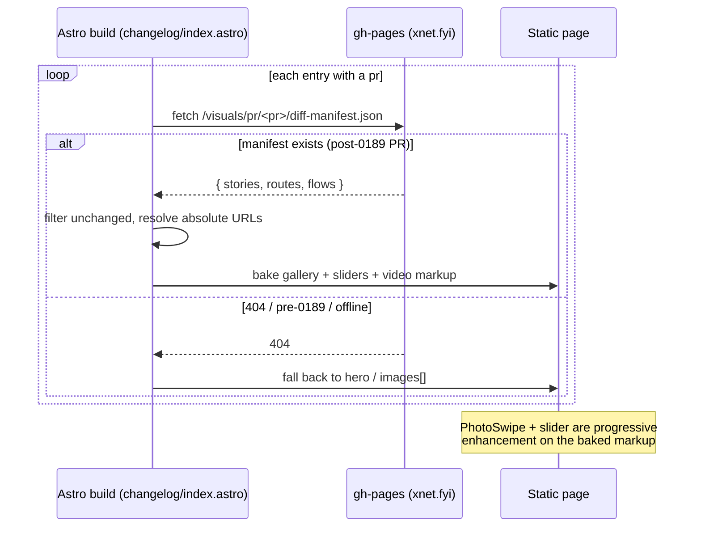

# Image-Rich & Interactive Changelog Page

## Problem Statement

The xNet public changelog page (`site/src/pages/changelog/index.astro`) is a
clean vertical timeline of text entries with optional hero images. That
foundation is solid — RSS, JSON feed, dark mode, PR links, tag badges — but it
treats media as an afterthought. Entries carry a single optional `hero` image
and the `ChangelogEntry` type has no fields for image galleries, before/after
comparisons, or video clips. Meanwhile the CI visual-capture pipeline
(exploration 0185) already produces per-PR screenshot sets including baseline,
current, and diff frames — exactly the raw material a great changelog page
wants.

The gaps this exploration addresses:

- **No image gallery**: multi-screenshot entries show at most one image.
- **No before/after comparison**: the CI pipeline produces baseline + current
  pairs but there is no UI to compare them.
- **No search or tag filtering**: the `tagColor` map in `index.astro` renders
  badges but clicking them does nothing.
- **No video support**: `ChangelogEntry` has no video field; features that are
  better shown than described get a screenshot if they're lucky.
- **No contributor attribution**: entries link to a PR number but don't surface
  the author avatar or name from the GitHub API.
- **No copy-link affordance**: the `<h2>` links to `#entry-id` but there's no
  visible "copy anchor link" button.

This is a static Astro site (no server, no framework JS). Any solution must
work as vanilla JS islands or pure CSS.

## Executive Summary

The headline answer to "show most/all of the images from the diff,
automatically": each changelog entry already carries a `pr` number, and every
post-0189 PR has a **durable `diff-manifest.json`** enumerating every captured
screenshot (with before/after/diff frames, captions, and SSIM). So the gallery
should be **auto-derived from that manifest at build time** — fetch it in the
Astro page's frontmatter, drop the `unchanged` rows, and render the rest. No
manual image curation; the gallery grows itself as CI captures more surfaces.
A curated `images[]`/`hero` override stays available for backfilled entries (no
manifest) and for hand-picking a hero.

Around that core, the right approach for a minimal-JS static changelog is a
**layered upgrade**:

0. **Auto-gallery from the visual-capture manifest** — at SSG time, for each
   entry with a `pr`, fetch `https://xnet.fyi/visuals/pr/<pr>/diff-manifest.json`,
   keep `status !== "unchanged"`, and feed the results into the gallery +
   before/after sliders + video below. This is the centerpiece.
1. **Multi-image support in the data model** — extend `ChangelogEntry` with an
   `images` array (each with `src`, `alt`, optionally `caption`, and an
   optional `before`/`after` pair marker) as the manual override / fallback.
2. **PhotoSwipe v5 as the lightbox** — 26 KB gzipped, zero runtime deps,
   framework-free, best-in-class keyboard nav and ARIA. Load it only when the
   page has gallery entries (a single `<script type="module">` island).
3. **CSS scroll-snap thumbnail strip** — no-JS horizontal scroller showing
   images inline; clicking opens PhotoSwipe. Degrades gracefully without JS.
4. **`` web component** for before/after pairs — a
   single 6 KB custom element, keyboard-accessible, no framework.
5. **`<video autoplay muted loop playsinline>` not GIF** for motion features —
   10× smaller, `prefers-reduced-motion` pauses them.
6. **Vanilla JS tag filter** — one `<script>` block; no Pagefind needed for a
   dozen entries. Pagefind becomes the right choice at ~100+ entries.
7. **Copy-link and permalink affordances** — zero-dep Clipboard API in an
   inline `<script>`.

The result: ~40 KB of net-new JS on a page that already had IntersectionObserver
scroll animations — well within performance budget.

## Current State In The Repository

### Data model

`site/src/data/changelog.ts` — `ChangelogEntry` interface has:

```ts
hero?: { src: string; alt: string }
pr?: number
```

No `images`, no `video`, no `before`/`after`, no `author`.

### Page

`site/src/pages/changelog/index.astro` renders:
- A single `` for `entry.hero` with `loading="lazy"`.
- Tag badges with `tagColor` styles but no interactive filter.
- `<a href="#${entry.id}">` on the heading (permalink exists, no copy button).
- PR link as a plain `<a>` tag.
- `animate-on-scroll` class driven by IntersectionObserver in `Base.astro`.

### Layout

`site/src/layouts/Base.astro` includes:
- An inline `<script is:inline>` for theme flash prevention.
- A `<script>` block for IntersectionObserver and copy-button initialization
  (already a pattern for vanilla JS islands).

### Site dependencies

`site/package.json`: `astro`, `@astrojs/starlight`, `@astrojs/tailwind`,
`tailwindcss`, `tsx` only. **No carousel, lightbox, or search library.**

### CI visual pipeline — the durable diff manifest (the key enabler)

This is the most important fact for this exploration, and it changes the whole
design. The visual-capture pipeline (explorations 0185 → 0189 → 0191) already
publishes, for **every PR**, a **durable, permanently-hosted manifest** of all
captured images. Verified firsthand against the live site:

- `.github/workflows/visual-capture.yml:158` publishes captures to
  `visuals/pr/<N>/` on gh-pages (NOT the ephemeral `pr/<N>/` preview namespace).
- `.github/workflows/deploy-site.yml:79` lists `visuals` in the `--delete`
  exclude, so the galleries survive merge and production deploys (0189 fix).
- `https://xnet.fyi/visuals/pr/147/diff-manifest.json` → **HTTP 200** (the PR
  that shipped the changelog itself). `https://xnet.fyi/visuals/pr/142/...` →
  **404** (it predates the 0189 durable-path move).

**The manifest** lives at `https://xnet.fyi/visuals/pr/<N>/diff-manifest.json`
(written by `scripts/visuals/diff.mjs`) and enumerates every captured surface:

```jsonc
{
  "threshold": 0.998,
  "baseline": "https://xnet.fyi/visuals-baseline",
  "stories": [
    { "id": "ui-button--default", "title": "UI/Button", "name": "Default",
      "status": "changed", "ssim": 0.96,
      "before": "before/stories/ui-button--default.png",   // baseline frame
      "after":  "stories/ui-button--default.png",           // this PR's frame
      "diff":   "diff/stories/ui-button--default.png" }      // amplified diff
  ],
  "routes": [ { "id": "home", "label": "Home", "status": "new",
                "after": "routes/home.png" } ],
  "flows":  [ { "id": "create-page", "label": "Create a page",
                "gif": "flows/create-page.gif",
                "mp4": "flows/create-page.mp4",
                "poster": "flows/create-page.poster.png" } ],
  "changedCount": 1
}
```

Every path is relative to `https://xnet.fyi/visuals/pr/<N>/`. Each image already
carries the metadata a rich gallery needs: a human caption (`title`/`name` for
stories, `label` for routes/flows), a `status` (`new` | `changed` | `unchanged`),
an `ssim` score, and — crucially — a **before/after/diff triple** for changed
surfaces, which is exactly the input an image-comparison slider wants.

**Implication:** the changelog already stores a `pr` number per entry. So it can
**automatically pull every diff image for a release by fetching that PR's
manifest** — no manual `images[]` curation. Three caveats: (1) only PRs merged
after 0189 shipped have a durable manifest (older backfilled entries won't —
fall back to `hero`); (2) `status: "unchanged"` rows (ssim 1) must be filtered
out or the gallery floods with no-op frames; (3) galleries grow unbounded on
gh-pages (no retention job yet — noted in 0189 Stage 2).

### In-app consumer

`apps/web/src/whats-new/feed.ts` + `WhatsNewButton.tsx` (exploration 0195) read
the JSON feed and render `image` per entry. Any new media fields added to the
feed must degrade gracefully there.

## External Research

### Gallery / lightbox libraries

| Library | Gzipped | ARIA | Keyboard | Focus trap | Touch | Framework-free | Notes |
|---|---|---|---|---|---|---|---|
| CSS scroll-snap only | 0 KB | Manual only | Arrow keys on focusable items | n/a | Native scroll | Yes | No lightbox; see accessibility caveats |
| **PhotoSwipe v5** | **~26 KB** | role=dialog, aria-label | Arrow/Home/End/Esc | Yes (manual JS) | Yes, flick | Yes | Best-in-class; v6 adds native `<dialog>` |
| GLightbox | ~11 KB | Partial | Arrow/Esc | Partial | Yes | Yes | Less polished keyboard handling |
| Swiper.js | ~20–47 KB | Partial, requires config | Yes with a11y module | No (not a lightbox) | Yes | Yes | Overkill for static changelogs |
| Embla Carousel | ~7 KB | Optional plugin | Tab through slides | No (not a lightbox) | Yes | Yes | Headless — you write all ARIA manually |
| keen-slider | ~6 KB | **None built-in** | None built-in | No | Yes | Yes | Solo maintainer, stalled since 2022 |
| baguetteBox.js | ~3.2 KB | Partial | Arrow/Esc | Partial | Yes | Yes | v1.13 (Nov 2024), actively maintained |
| lightgallery v2 | ~30 KB | Yes | Yes | Yes | Yes | Yes | **GPLv3 / commercial license** — wrong for MIT site |
| `` | ~6 KB | role=slider, aria-label | Arrow keys | n/a | Yes | Yes (web component) | Best before/after option |

**PhotoSwipe v5 details**: The package is ~46 KB minified, ~26 KB gzipped
(bundlephobia; no runtime deps). It is framework-independent: you initialize
it with a JS array of `{ src, width, height, alt }` objects or from
data-attributes on anchor elements. It uses a `<div role="dialog">` overlay,
traps focus in the slide region, maps Arrow/Home/End/PageUp/PageDown, and
returns focus to the trigger element on close. The v6 roadmap adds native
`<dialog>` with `showModal()` for automatic browser-native focus trapping.
Accessibility issues that remain in v5: the close button label is
`aria-label="Close"` but in some themes it appears as a bare SVG, requiring
`data-pswp-close` markup discipline.

**GLightbox**: 11 KB gzipped, MIT license, pure JS, handles images + videos +
iframes. Touch swipe works. Keyboard nav covers Arrow and Esc. Weaknesses:
focus-trap implementation is hand-rolled and has known gaps (tabbing past the
last button reaches the page behind the overlay in some browsers). Good for
projects that want a zero-config drop-in at the cost of some accessibility
polish.

**Embla Carousel**: 7 KB gzipped, headless, superb swipe UX. Best choice if
you want to build a *carousel* (not a fullscreen lightbox). The `accessibility`
plugin (separate ~2 KB) adds `aria-label` to prev/next buttons and
`role="region"` to the container. You still hand-author slide ARIA. Tab-key
behavior: tabbing reaches focusable elements inside hidden slides — this
requires `visibility: hidden` or `inert` on off-screen slides if you want
correct tab behavior.

**CSS-only scroll-snap**: Sara Soueidan's 2024 analysis ([see ref][soueidan])
documents that the new CSS carousel `::scroll-marker()` API (Chrome 135+,
Safari TP) exposes incorrect ARIA roles — markers become `tab` roles inside a
`tablist`, which is semantically wrong for a sequential scroller. A pure-CSS
scroll-snap strip without scroll markers is fine as a **thumbnail tray** (just
`overflow-x: auto; scroll-snap-type: x mandatory`), but calling it a fully
accessible carousel is aspirational in 2025.

**baguetteBox.js**: 3.2 KB gzipped, updated November 2024 (RTL + AVIF
support). Works fine for simple gallery+lightbox. The accessibility story is
weaker than PhotoSwipe: ARIA attributes are minimal. Recommended only if bundle
budget is extremely tight.

**lightgallery v2**: Feature-rich but dual-licensed (GPLv3 for open source,
paid for commercial use). For a public marketing site this is a dealbreaker.

### Before/after comparison

**`` by @sneas** ([sneas/img-comparison-slider][ics]):
A Custom Element (``). Works with a `<script type="module">` import. ~6 KB gzipped. Publishes `role="slider"` with
`aria-valuemin`, `aria-valuemax`, `aria-valuenow`. Arrow keys move the
divider. On mobile: touch drag. Customizable via CSS custom properties
(`--divider-width`, `--divider-color`). No framework required. Registers as
a custom element; Astro renders the tag server-side and the element upgrades
client-side. This is the clear winner.

**JuxtaposeJS** (Knight Lab): Embeds via an iframe or requires a script that
mutates a specific DOM structure. Touch support but keyboard navigation is
absent in the original; accessibility is poor. Requires a CDN or bundling.
Not recommended.

**Hand-rolled CSS `input[type=range]`**: Overlay two `` elements, use a
range input as the drag handle, update `clip-path` or `width` of the top image
via `input` event. Fully accessible: range inputs have native keyboard support,
native `aria-valuemin/max/now`, accept `aria-label`. ~30 lines of CSS + ~10
lines of JS. **Best choice if you want zero extra dependencies**, but needs
careful CSS z-index and pointer-events management. The Cloud Four writeup
([see ref][cloudfour]) describes this pattern in detail.

### Carousel / gallery accessibility

**Nielsen Norman Group** ([NNG][nng]): Auto-advancing carousels "annoy users
and reduce visibility." Key finding: on a test site a £100 discount was visible
20% of the time; users missed it. Only ~1% of visitors click past the first
carousel slide. Auto-rotation stops when focus enters the component (required
by WAI-ARIA); if you re-start rotation on blur you risk trapping users in a
cycle. **Recommendation: never auto-advance unless it is video/animation
content that is inherently time-based.**

**WCAG requirements for moving content**:
- **2.2.2 Pause, Stop, Hide (Level A)**: Any content that moves, blinks, or
  scrolls for more than 5 seconds must have a mechanism to pause, stop, or
  hide it. The `prefers-reduced-motion` media query is a sufficient technique
  for *animation* (SC 2.3.3) but the W3C has not formally listed it as
  sufficient for 2.2.2 — in practice, auditors accept it for decorative motion
  alongside an explicit pause button for functional carousels.
- **2.1.1 Keyboard (Level A)**: All functionality operable by keyboard.
- **2.1.2 No Keyboard Trap (Level A)**: Focus must not be trapped unless there
  is a documented way to escape (e.g. Esc closes a modal).
- **2.4.3 Focus Order (Level A)**: Focus sequence must be logical.
- **2.4.11 Focus Appearance (Level AA, WCAG 2.2)**: Focus indicator must have
  minimum area and 3:1 contrast ratio.
- **1.1.1 Non-text Content (Level A)**: Every `` needs a non-empty `alt`
  attribute unless decorative (then `alt=""`).

**WAI-ARIA carousel pattern** ([W3C APG][apg-carousel]): Prescribes
`role="region"` + `aria-roledescription="carousel"` + `aria-label="[name]"`
on the container; each slide gets `role="group"` + `aria-roledescription="slide"` + `aria-label="N of M"`. Live region
(`aria-live="polite"`) announces slide changes. Prev/next buttons need
`aria-label`. Autoplay control needs `aria-pressed` toggle. This is substantial
markup — another argument for not building a true carousel unless the feature
truly demands it.

**Lazy loading and LCP**:
- `loading="lazy"` is supported in all modern browsers and should be used for
  all images **below the fold**. The current `index.astro` already sets it.
- **Never lazy-load the first image / LCP candidate.** If the hero image for
  the first entry is the LCP element, `loading="eager"` (the default) or
  `fetchpriority="high"` is required. The changelog page renders all entries at
  SSG time — the topmost `entry.hero` should not have `loading="lazy"`.
- `srcset` + `sizes` enables responsive images. For changelog screenshots at
  max-width 672px (the `max-w-3xl px-6` container), appropriate sizes are
  `(max-width: 768px) 100vw, 672px` with WebP sources.

**WebP vs AVIF vs PNG**: For UI screenshots, WebP is universal (Chrome/Safari/
Firefox/Edge). AVIF offers ~30% better compression but Safari 16+ only and
encoding is slow (bad for CI pipelines). Recommendation: WebP at 85% quality
for the majority; fall back to PNG for complex screenshots with text that would
artifact.

### What makes a great product changelog page

Surveying Linear, Vercel, Stripe, GitHub, Sentry, Resend, Mintlify, Raycast:

**Information architecture that works**:
- **Timeline layout** (all of the above) — newest first, date as the primary
  separator. Linear uses large bold dates as section dividers.
- **Per-entry permalink and deep-link** (all): anchor `#YYYY-MM-DD`. Vercel
  and GitHub link directly to these from in-product notification emails.
- **Tag / category filter** (Vercel, GitHub, Mintlify, Raycast): Vercel uses
  product-area tags (Next.js, Edge Network, Dashboard); clicking a tag filters
  the timeline via client JS. Mintlify generates tag filter UI from frontmatter
  automatically. This is the single highest-value interactive feature.
- **RSS + JSON feed** (Vercel, Stripe, Resend, GitHub): already implemented
  in xNet. Stripe's feed is aggressively minimal — no images, just text and
  API version tags. Resend includes a hero image URL in their JSON feed.

**Rich media patterns that actually help**:
- **Screenshots for every UI change** (Linear, Vercel, Resend, Figma): The
  standard is: feature entries get at least one screenshot; a lede paragraph
  below the image explains the change.
- **Animated GIF / video walkthroughs** (Notion, Loom): 30–60 second screen
  recordings or short GIFs showing the interaction flow. Loom embeds video
  inline. Notion uses GIFs. Both are more persuasive than static screenshots
  for interaction-heavy features.
- **Before/after comparisons** (Figma): Figma shows UI changes with a
  drag-handle comparison slider for design-system updates. This is particularly
  relevant for xNet given the CI visual-diff output.
- **Code blocks** (Stripe, Supabase, GitHub): API-facing changes include
  inline syntax-highlighted code. Already supported in the xNet site via the
  `CodeBlock.astro` component — but `ChangelogEntry` has no `code` field.
- **Author attribution** (Vercel): Author avatar + name creates human
  connection. GitHub uses GitHub usernames with avatars. xNet already links to
  PRs; adding the PR author's GitHub avatar (`https://github.com/${login}.png?size=40`) requires no API key.
- **Reactions/emoji** (Raycast, Canny): Some products allow thumbs-up or emoji
  reactions on entries. These require a backend or a service like utterances/
  giscus (GitHub Discussions as comments). Not viable on a pure static site
  without a third-party service.
- **Reading time** (Medium, some docs): Rarely seen in changelogs specifically;
  adds noise more than value for short entries. Skip.
- **"Copy link" button**: Common in Linear, Vercel, Notion. A clipboard button
  next to the heading copies `location.origin + '#' + entry.id`. Already
  partially implemented (the `<h2>` is a link) — needs the affordance to be
  visible.

**Navigation**:
- **Year/month jump nav** (GitHub, Stripe): For long changelogs (50+ entries),
  a sticky sidebar or top-of-page jump navigation by year is standard. GitHub
  uses a sidebar with year groups. Below ~30 entries the page doesn't need it.
- **Infinite scroll vs pagination vs all-on-page**: The consensus for
  developer audiences is **all on one page** (Stripe, Vercel, Linear, Resend,
  Raycast all do this). `loading="lazy"` on images means the DOM is heavy but
  network is fine. At ~200+ entries, pagination or virtual scroll may be needed.

**Subscription**:
- RSS and JSON feed (already done). Email subscription (Resend, Raycast) uses
  an embedded `<form>` posting to ConvertKit / Mailchimp / Loops. Not in scope
  for a static site without a form handler, but a `mailto:` fallback or a
  Buttondown embed works.

### Linking entries to source

The `pr?: number` field already links to `github.com/crs48/xNet/pull/{pr}`.
Additional patterns:

- **Commit link**: include the merge commit SHA and link to
  `github.com/crs48/xNet/commit/{sha}`. Displayable as first 7 chars.
- **Diff link**: `github.com/crs48/xNet/compare/{base-tag}...{head-tag}` shows
  the full diff between releases. Linear and GitHub use this for release tags.
- **Contributor avatar**: GitHub serves avatars as
  `https://github.com/${login}.png?size=40` — no API key required. The PR
  author login is available in the CI environment as `${{ github.actor }}` and
  can be baked into the changelog entry by the AI-release-notes script
  (`scripts/changelog/ai-release-notes.mjs`).
- **Issue cross-links**: conventional commit trailers (`Fixes #123`) or
  a separate `issues?: number[]` field in `ChangelogEntry`.

### Interactive elements for static/SSG context

**Search**:
- **Fuse.js**: 24 KB gzipped. Works on a JSON index you generate at build
  time. Perfect for a changelog page with a small entry set (<200). No build
  step post-Astro; just ship `changelog.json` (already generated) and fuzzy-
  search it in the browser. One `<script>` island of ~40 lines.
- **Pagefind**: 25–30 KB initial load (WASM + manifest); lazy-loads index
  chunks on demand. Superior at scale (1000+ pages). Requires running
  `pagefind --source dist` after `astro build`. The `astro-pagefind` integration
  handles this. Best choice if the entire docs site (not just changelog) needs
  search — it already powers Starlight (which xNet uses).
- **For the changelog alone**: Fuse.js against the already-generated
  `changelog.json` is simpler, lower-complexity, and sufficient. If the team
  wants whole-site search, Pagefind is the right choice and the changelog
  entries would be indexed automatically.

**Tag filtering**:
- No library needed. `data-tags="app crm"` attributes on each `<article>`,
  a row of `<button>` chips at the top, and ~20 lines of vanilla JS to toggle
  a CSS class. The active filter state can live in the URL hash
  (`?tag=ai#2026-06-17`) for shareability.

### Video and GIF in changelogs

**`<video>` vs GIF**:
- An animated GIF at 640×400 showing a 3-second UI interaction is typically
  800 KB–3 MB. The same content as an H.264 MP4 is 50–300 KB (5–10× smaller).
  WebM VP9 is another 20–30% smaller than MP4.
- Use `<video autoplay muted loop playsinline>` + a `poster` frame (a static
  screenshot shown while the video loads). This mimics GIF autoplay while
  being orders of magnitude smaller.
- **`prefers-reduced-motion`**: In CSS: `@media (prefers-reduced-motion: reduce) { video { animation-play-state: paused; } }` does not stop video — you
  must use JS: `if (window.matchMedia('(prefers-reduced-motion: reduce)').matches) { video.pause(); }`.  Alternatively, the video can be click-to-play only,
  eliminating the motion concern entirely for non-autoplay use.
- **WCAG 2.2.2**: A looping `<video>` that plays for more than 5 seconds
  needs a Pause control or must not start automatically. A common pattern:
  pause the video on page load when `prefers-reduced-motion` is set; otherwise
  autoplay once and stop (remove `loop`). Alternatively, make all changelog
  videos click-to-play with a visible poster frame.
- **`<video>` in the data model**: add `video?: { src: string; poster: string; alt: string }` to `ChangelogEntry`. The `alt` describes the motion for
  screen readers (the `<video>` tag itself should have `aria-label` or a
  linked `<track kind="descriptions">`).

## Key Findings

1. **The diff images are already durable and enumerable.** Every post-0189 PR
   publishes `https://xnet.fyi/visuals/pr/<N>/diff-manifest.json` (verified: 200
   for #147, 404 for #142). Each changelog entry has a `pr`, so the gallery can
   be auto-derived at build time — this is the highest-leverage change and the
   direct answer to "show most/all images from the diff." No per-entry curation.
2. **The manifest gives before/after/diff triples**, which map perfectly onto an
   image-comparison slider for `changed` surfaces and a plain lightbox thumbnail
   for `new` ones. `unchanged` rows (ssim 1) must be dropped.
3. **Never auto-advance**. The NN/g research is unambiguous. Use scroll/click-driven carousels only.
2. **PhotoSwipe v5 is the right lightbox** for this stack: framework-free, 26 KB, best keyboard/ARIA in class. `<dialog>` with `showModal()` is an equally valid hand-rolled alternative for a single image at a time (zero deps, browser handles focus trap).
3. **``** is the right before/after component: a standard Custom Element, 6 KB, keyboard-accessible, styling via CSS custom properties.
4. **A CSS scroll-snap thumbnail strip** (no JS) is the right inline gallery for the changelog page — it's a disclosure, not a carousel. Clicking a thumbnail opens the PhotoSwipe lightbox.
5. **`<video autoplay muted loop playsinline>`** over GIF, always. Add JS to respect `prefers-reduced-motion`.
6. **Tag filtering with vanilla JS** (no library) is sufficient for the current ~12-entry changelog. Fuse.js (not Pagefind) is the right search library if you want in-page search on just the changelog entries.
7. **Extend `ChangelogEntry`** with `images`, `video`, `author`, and `issues` fields — the data model is the right place to gate what the page can render.
8. **LCP fix needed**: the first entry's hero image should not carry `loading="lazy"`.
9. **`srcset` + WebP** should be used for all changelog images. The CI visual capture pipeline should output WebP in addition to PNG.
10. **lightgallery is disqualified** (GPL/commercial licensing). **keen-slider is disqualified** (no accessibility, stalled maintenance). **JuxtaposeJS is disqualified** (no keyboard accessibility).

## Options And Tradeoffs



### Option A0: Auto-gallery from the diff manifest (recommended core)

For each entry with a `pr`, fetch the durable manifest at build time and derive
the gallery. This is what directly answers "show all the diff images" and "link
to the specific PRs."



The build-time flow that bakes static HTML (no client fetch, no runtime 404s):



- **Build-time fetch (recommended)**: resolve manifests in the page frontmatter
  so the gallery is static HTML. A 404 or a failed fetch silently falls back to
  the curated `hero`. The build must tolerate the network being unavailable
  (wrap in try/catch, cache nothing). Pin a per-entry image cap (e.g. 12) so a
  noisy PR doesn't bloat the page.
- **Runtime fetch (alternative)**: fetch the manifest client-side when an entry
  scrolls into view. Avoids coupling the build to gh-pages availability, but
  adds a network request and the e2e/console-error considerations the in-app
  surface already had to dodge in 0195. Build-time is cleaner for a static page.
- **Caption & link**: each surface's `title`/`name`/`label` becomes the image
  caption; the whole gallery gets a "View all N screenshots on PR #<pr>" link
  pointing at the durable gallery and the PR thread.

### Option A: Minimal — thumbnail strip + PhotoSwipe only

Extend `ChangelogEntry.images`, render a CSS scroll-snap `<ul>` of thumbnails,
load PhotoSwipe as a module island on pages that have gallery entries. No
before/after, no video, no search.

- **Pros**: ~30 KB new JS; very few moving parts; no new dependencies at build
  time; PhotoSwipe's accessibility is production-ready.
- **Cons**: No before/after comparison; no video; no discoverability
  improvements (no search/filter).

### Option B: Full upgrade — all features

Extend data model + implement: scroll-snap thumbnail strip, PhotoSwipe lightbox,
`` for before/after pairs, `<video>` support, vanilla JS
tag filter, Fuse.js search, copy-link button, author attribution.

- **Pros**: Maximally useful changelog; aligns with best-in-class examples.
- **Cons**: ~50 KB new JS; multiple new fields in `ChangelogEntry`; validation
  script (`validate-changelog.ts`) needs updating; CI pipeline needs to populate
  new fields.

### Option C: Video-first — replace GIFs, defer gallery

Prioritize: `<video>` support in the data model + autoplay behavior +
`prefers-reduced-motion` handling. Defer gallery/lightbox.

- **Pros**: Highest performance gain per KB of new code. A single new field
  and 15 lines of script.
- **Cons**: Doesn't address the multi-image or before/after use cases.

### Option D: Hand-rolled everything — zero new npm deps

CSS scroll-snap strip, native `<dialog>` lightbox, CSS `input[type=range]`
before/after slider, all vanilla JS.

- **Pros**: Zero new npm packages; complete control.
- **Cons**: Substantially more custom code to maintain; the `<dialog>`-based
  lightbox needs ~100 lines of JS for keyboard handling; the range-slider
  before/after needs CSS z-index discipline.

## Recommendation

**Lead with Option A0 (auto-gallery from the manifest), then Option B in two
phases.** The manifest auto-pull is the highest-leverage piece — it's what makes
the changelog "way more images" with zero per-entry curation — and it's mostly a
build-time data step, so it lands before the UI polish.

**Phase 0 (auto-gallery from the diff manifest)** — the centerpiece:

1. Add `site/src/lib/changelog-gallery.ts` — `loadPrGallery(pr)` fetches
   `visuals/pr/<pr>/diff-manifest.json`, filters `unchanged`, resolves absolute
   URLs, and returns `{ images, comparisons, videos, prUrl, galleryUrl }`.
2. In `changelog/index.astro` frontmatter, resolve a gallery per entry with a
   `pr` (build-time, try/catch, capped at ~12 surfaces).
3. Render the gallery below the summary; entries with no manifest fall back to
   `hero`/`images[]`.
4. Add a "View all N screenshots on PR #<pr>" link to the durable gallery.

**Phase 1 (data model + video + filter + copy-link)** — highest value, lowest
complexity for the manual/override path:
1. Extend `ChangelogEntry` with `images`, `video`, `author`, `issues` fields.
2. Update `validate-changelog.ts` to enforce `images[].alt` is non-empty.
3. Render `<video autoplay muted loop playsinline poster=…>` for entries with
   `video`. Pause on `prefers-reduced-motion`. Static poster fallback.
4. Render `` for all images with WebP where
   available.
5. Fix LCP: first entry's hero gets `loading="eager"` instead of `loading="lazy"`.
6. Add vanilla JS tag filter (chips above the timeline, `data-tags` on articles).
7. Add copy-link button to each `<h2>` using the Clipboard API.
8. Add author attribution: `author?: { login: string }` in the entry, rendered
   as `` + a
   link to their GitHub profile.

**Phase 2 (gallery + before/after)**:
1. Render a CSS scroll-snap `<ul class="thumbnail-strip">` for entries with
   `images.length > 0`.
2. Wrap each thumbnail in `<a data-pswp-src="…" data-pswp-width="…">`.
3. Load PhotoSwipe v5 as `<script type="module">` only when the page has
   gallery entries (injected at SSG time via Astro `Astro.props`).
4. For entries with before/after pairs (marked in `images` with `role: 'before' | 'after'`), render `` web component via
   `<script type="module" src="https://cdn.jsdelivr.net/npm/img-comparison-slider/…">`.
5. Add Fuse.js search input (searches `title + summary + highlights + tags`).

## Example Code

### Auto-gallery from the durable diff manifest (the centerpiece)

```ts
// site/src/lib/changelog-gallery.ts
const VISUALS = 'https://xnet.fyi/visuals/pr'

interface DiffEntry {
  id: string
  title?: string
  name?: string
  label?: string
  status?: 'new' | 'changed' | 'unchanged'
  before?: string
  after?: string
  diff?: string
  gif?: string
  mp4?: string
  poster?: string
}

export interface PrGallery {
  images: { src: string; alt: string }[]
  comparisons: { before: string; after: string; alt: string }[]
  videos: { mp4: string; poster: string; alt: string }[]
  prUrl: string
  galleryUrl: string
  count: number
}

const caption = (e: DiffEntry) =>
  e.label ?? [e.title, e.name].filter(Boolean).join(' — ') ?? e.id

/** Build-time fetch. Returns null on 404 / offline so the caller falls back. */
export async function loadPrGallery(pr: number, cap = 12): Promise<PrGallery | null> {
  const base = `${VISUALS}/${pr}`
  let manifest: { stories?: DiffEntry[]; routes?: DiffEntry[]; flows?: DiffEntry[] }
  try {
    const res = await fetch(`${base}/diff-manifest.json`)
    if (!res.ok) return null
    manifest = await res.json()
  } catch {
    return null // gh-pages unreachable during the build — degrade to hero
  }

  const surfaces = [...(manifest.stories ?? []), ...(manifest.routes ?? [])].filter(
    (s) => s.status !== 'unchanged' && s.after
  )
  const images = surfaces
    .filter((s) => s.status === 'new')
    .map((s) => ({ src: `${base}/${s.after}`, alt: caption(s) }))
  const comparisons = surfaces
    .filter((s) => s.status === 'changed' && s.before)
    .map((s) => ({ before: `${base}/${s.before}`, after: `${base}/${s.after}`, alt: caption(s) }))
  const videos = (manifest.flows ?? [])
    .filter((f) => f.mp4 && f.poster)
    .map((f) => ({ mp4: `${base}/${f.mp4}`, poster: `${base}/${f.poster}`, alt: caption(f) }))

  const count = images.length + comparisons.length + videos.length
  if (count === 0) return null
  return {
    images: images.slice(0, cap),
    comparisons: comparisons.slice(0, cap),
    videos,
    prUrl: `https://github.com/crs48/xNet/pull/${pr}`,
    galleryUrl: base,
    count
  }
}
```

```astro
---
// changelog/index.astro frontmatter — resolve galleries at build time
import { loadPrGallery } from '../../lib/changelog-gallery'
const galleries = await Promise.all(
  entries.map((e) => (e.pr ? loadPrGallery(e.pr) : Promise.resolve(null)))
)
// galleries[i] aligns with entries[i]; null → fall back to hero/images[]
---
```

### Extended ChangelogEntry type

```ts
export interface ChangelogImage {
  src: string
  alt: string
  caption?: string
  /** Marks this image as part of a before/after pair */
  role?: 'before' | 'after'
  /** Natural dimensions (required for PhotoSwipe) */
  width?: number
  height?: number
}

export interface ChangelogEntry {
  id: string
  date: string
  title: string
  summary: string
  highlights: string[]
  tags: ChangelogTag[]
  hero?: { src: string; alt: string }
  /** Multiple images for a gallery strip */
  images?: ChangelogImage[]
  /** Autoplay-muted video (replaces GIF) */
  video?: { src: string; poster: string; alt: string }
  pr?: number
  /** Additional linked issues */
  issues?: number[]
  /** GitHub login of primary author */
  author?: { login: string }
}
```

### CSS scroll-snap thumbnail strip (no JS)

```html
<ul
  class="thumbnail-strip"
  role="list"
  aria-label="Screenshots for this release"
>
  {entry.images.map((img, i) => (
    <li>
      <a
        href={img.src}
        data-pswp-src={img.src}
        data-pswp-width={img.width ?? 1280}
        data-pswp-height={img.height ?? 800}
        aria-label={img.alt}
      >
        
      </a>
    </li>
  ))}
</ul>
```

```css
.thumbnail-strip {
  display: flex;
  gap: 0.5rem;
  overflow-x: auto;
  scroll-snap-type: x mandatory;
  scrollbar-width: thin;
  list-style: none;
  padding: 0;
  margin: 0;
}
.thumbnail-strip li {
  scroll-snap-align: start;
  flex: 0 0 auto;
}
.thumbnail-strip img {
  width: 200px;
  height: 125px;
  object-fit: cover;
  border-radius: 0.375rem;
  border: 1px solid var(--lp-border);
}
```

### PhotoSwipe island (module script)

```html
<script type="module">
  import PhotoSwipeLightbox from 'https://cdn.jsdelivr.net/npm/photoswipe/dist/photoswipe-lightbox.esm.min.js'

  const lightbox = new PhotoSwipeLightbox({
    gallery: '.thumbnail-strip',
    children: 'a[data-pswp-src]',
    pswpModule: () => import('https://cdn.jsdelivr.net/npm/photoswipe/dist/photoswipe.esm.min.js'),
  })
  lightbox.init()
</script>
```

### Before/after comparison slider

```html
<script type="module" src="https://cdn.jsdelivr.net/npm/img-comparison-slider@8/dist/index.js"></script>


  
  
</img-comparison-slider>
```

### Video with prefers-reduced-motion

```html
<figure>
  <video
    src={entry.video.src}
    poster={entry.video.poster}
    aria-label={entry.video.alt}
    autoplay
    muted
    loop
    playsinline
    class="changelog-video"
  ></video>
  <figcaption class="sr-only">{entry.video.alt}</figcaption>
</figure>

<script>
  // Respect prefers-reduced-motion
  const mq = window.matchMedia('(prefers-reduced-motion: reduce)')
  document.querySelectorAll('video.changelog-video').forEach((v) => {
    if (mq.matches) {
      v.pause()
      v.removeAttribute('autoplay')
    }
  })
</script>
```

### Vanilla JS tag filter

```html
<!-- Filter chips -->
<div role="group" aria-label="Filter by category" class="flex flex-wrap gap-2 mb-8">
  <button
    data-tag="all"
    class="filter-chip active"
    aria-pressed="true"
  >All</button>
  {Object.keys(tagColor).map(tag => (
    <button
      data-tag={tag}
      class="filter-chip"
      aria-pressed="false"
    >{tag}</button>
  ))}
</div>

<script>
  const chips = document.querySelectorAll('.filter-chip')
  const articles = document.querySelectorAll('article[data-tags]')

  chips.forEach(chip => {
    chip.addEventListener('click', () => {
      const tag = chip.dataset.tag
      chips.forEach(c => { c.classList.remove('active'); c.setAttribute('aria-pressed', 'false') })
      chip.classList.add('active')
      chip.setAttribute('aria-pressed', 'true')

      articles.forEach(article => {
        const tags = article.dataset.tags?.split(' ') ?? []
        const show = tag === 'all' || tags.includes(tag)
        article.hidden = !show
      })
    })
  })
</script>
```

### Copy-link button

```html
<h2 class="group relative …">
  <a href={`#${entry.id}`} class="hover:text-indigo-400">{entry.title}</a>
  <button
    class="copy-anchor-btn ml-2 opacity-0 group-hover:opacity-100 focus:opacity-100 transition-opacity"
    data-anchor={entry.id}
    aria-label="Copy link to this entry"
    title="Copy link"
  >
    <svg …><!-- link icon --></svg>
  </button>
</h2>

<script>
  document.querySelectorAll('.copy-anchor-btn').forEach(btn => {
    btn.addEventListener('click', async () => {
      const url = `${location.origin}/changelog#${btn.dataset.anchor}`
      await navigator.clipboard.writeText(url)
      btn.setAttribute('aria-label', 'Link copied!')
      setTimeout(() => btn.setAttribute('aria-label', 'Copy link to this entry'), 2000)
    })
  })
</script>
```

## Risks And Open Questions

1. **PhotoSwipe CDN vs bundled**: Using a CDN `<script type="module">` avoids
   adding PhotoSwipe to `site/package.json` but breaks offline use and
   introduces an external dependency. Bundling it via Astro's Vite pipeline is
   safer. The tradeoff is `astro build` includes it in the JS bundle even for
   pages without galleries unless you use dynamic import.
2. **`validate-changelog.ts` must be updated** to enforce `images[].alt`,
   `video.poster`, and `author.login` format when those fields are present.
   Skipping this will cause broken `alt` texts to silently ship.
3. **CI image dimensions**: PhotoSwipe requires `data-pswp-width` and
   `data-pswp-height`. If CI captures screenshots without embedding dimensions
   in the changelog data, a fallback is required (e.g. default 1280×800).
   Sharp or native `` element's `naturalWidth`/`naturalHeight` can probe
   dimensions at runtime but this is ugly. The right fix is to bake dimensions
   into the `ChangelogImage` at the time CI writes the entry.
4. **`` custom element registration**: In some SSR
   contexts custom elements must be registered client-side. In Astro SSG this
   is fine — the element upgrades after hydration. But the element must not be
   used before the module script runs; an `aria-busy` indicator on the slot
   during upgrade would be ideal.
5. **The tag filter URL state**: If `?tag=ai` is in the query string on load,
   the JS filter should read it and pre-activate the chip. This is a small
   feature but important for shareability.
6. **Author attribution privacy**: Surfacing GitHub usernames and avatars is
   standard open-source practice, but should be a conscious decision. A
   `showAuthor: false` guard in the template is easy to add.
7. **Feed compatibility**: `ChangelogImage[]` and `video` fields should be
   reflected in the JSON feed (`site/src/pages/changelog.json.ts` via
   `buildJsonFeed` in `site/src/lib/changelog-feed.ts`). The in-app "What's New"
   surface (`apps/web/src/whats-new/feed.ts` + `WhatsNewButton.tsx`, exploration
   0195) parses the feed and must handle the new fields gracefully — its
   `parseFeed` currently reads only `image`/`_xnet`, so extra fields are ignored
   safely, but rendering a gallery in-app is a follow-up.
8. **Manifest auto-pull caveats**: only PRs merged after 0189 have a durable
   manifest (older entries fall back to `hero`); galleries grow unbounded on
   gh-pages (0189 Stage 2 retention is still open); and a build-time fetch
   couples `astro build` to gh-pages being reachable — the `loadPrGallery`
   try/catch must degrade, not fail, when offline.
8. **WebP support in the CI pipeline**: `scripts/visuals/capture.mjs` (PR #94)
   outputs PNG. A `cwebp` or `sharp` post-process step would need to be added
   to produce `.webp` variants.

## Implementation Checklist

### Phase 0 — auto-gallery from the diff manifest (centerpiece)

- [ ] Add `site/src/lib/changelog-gallery.ts` with `loadPrGallery(pr)` (build-time
  fetch of `visuals/pr/<pr>/diff-manifest.json`, filter `unchanged`, cap surfaces)
- [ ] Resolve a gallery per entry with a `pr` in `changelog/index.astro`
  frontmatter (`Promise.all`, try/catch, tolerant of offline builds)
- [ ] Render the gallery below each entry's summary (thumbnails + before/after
  sliders + click-to-play video), falling back to `hero`/`images[]` on null
- [ ] Add "View all N screenshots on PR #<pr>" link → durable gallery + PR thread
- [ ] Filter out `status: "unchanged"` rows; cap at ~12 surfaces per entry
- [ ] Verify build still succeeds when the manifest is 404 (older PRs) or the
  network is unavailable (CI offline) — no hard failure
- [ ] Backfill: confirm pre-0189 entries (no manifest) still render their `hero`

### Phase 1 — data model + video + filter + copy-link

- [ ] Extend `ChangelogEntry` with `images?: ChangelogImage[]`, `video?: {...}`, `author?: { login: string }`, `issues?: number[]`
- [ ] Update `validate-changelog.ts`: enforce non-empty `alt` on each `images[]` element; enforce `video.poster` is present when `video` is set
- [ ] Fix LCP bug: first `entry.hero` should use `loading="eager"` not `loading="lazy"` in `changelog/index.astro`
- [ ] Add `srcset` + WebP `<source>` for hero images (`<picture>` element)
- [ ] Render `<video autoplay muted loop playsinline poster=…>` when `entry.video` is present
- [ ] Add `prefers-reduced-motion` JS hook that pauses all `.changelog-video` elements on load
- [ ] Add `data-tags={entry.tags.join(' ')}` attribute to each `<article>`
- [ ] Add tag filter chip row above the timeline
- [ ] Wire filter chips to `article.hidden` toggling via vanilla JS
- [ ] Persist active tag in URL `?tag=X` and read it on load
- [ ] Add copy-link `<button>` to each `<h2>` entry title using Clipboard API
- [ ] Add `author` rendering: GitHub avatar + login link when `entry.author` is set
- [ ] Update `buildJsonFeed()` in `changelog-feed.ts` to include `images` and `video` in JSON output
- [ ] Update `ChangelogEntry` Zod/TypeScript types in any downstream consumers (in-app What's New)

### Phase 2 — gallery + before/after

- [ ] Render CSS scroll-snap `<ul class="thumbnail-strip">` for entries with `entry.images`
- [ ] Add `aria-label` to the thumbnail strip `<ul>`
- [ ] Wrap thumbnails in `<a data-pswp-src data-pswp-width data-pswp-height>`
- [ ] Add PhotoSwipe v5 as a bundled Astro import (not CDN) conditionally when `hasGalleryEntries`
- [ ] Initialize PhotoSwipe on the thumbnail strip anchors
- [ ] Detect `before`/`after` image pairs and render `` instead of thumbnails
- [ ] Add `<script type="module">` import for `img-comparison-slider`
- [ ] Add keyboard focus style to `` (CSS custom property override)
- [ ] Add Fuse.js search: generate search index at build, add `<input>` island
- [ ] Add `data-pswp-width`/`data-pswp-height` support in CI's `ai-release-notes.mjs`
- [ ] Add WebP output to `scripts/visuals/capture.mjs`
- [ ] Document gallery fields in `site/src/data/changelog.ts` JSDoc

## Validation Checklist

- [ ] For an entry with a post-0189 `pr`, the page renders a gallery sourced
  from that PR's `diff-manifest.json` (e.g. PR #147 shows its captured surfaces)
- [ ] `status: "unchanged"` surfaces do NOT appear in the gallery
- [ ] An entry whose `pr` has no manifest (404) falls back to its `hero` cleanly
- [ ] `astro build` succeeds with the network disabled (manifest fetch degrades,
  no hard failure) — `loadPrGallery` returns null
- [ ] "View all N screenshots on PR #<pr>" links resolve to a live gallery + PR
- [ ] Run axe DevTools or Lighthouse accessibility audit: zero critical violations on the changelog page
- [ ] Verify keyboard-only navigation: Tab reaches each article, Enter activates copy-link, Escape closes lightbox, Arrow keys navigate lightbox slides
- [ ] Verify `` is keyboard-operable: focus the slider and use Left/Right arrow keys to move the divider
- [ ] `prefers-reduced-motion: reduce` in OS settings: all videos pause; no carousel animation
- [ ] LCP score: first entry hero image should be LCP element with ≥90 score in Lighthouse
- [ ] `loading="lazy"` is absent from the first hero image; present on all others
- [ ] Tag filter: clicking a tag hides unrelated articles; "All" restores all; `aria-pressed` state matches visual state
- [ ] URL `?tag=crm` on page load pre-activates the CRM chip
- [ ] Copy-link button: clicking copies the correct URL including `#` anchor
- [ ] JSON feed (`/changelog.json`) includes `images` and `video` fields for entries that have them
- [ ] RSS feed includes image URLs for entries with galleries
- [ ] PhotoSwipe lightbox renders at 100vw/100vh; Escape closes it; focus returns to the trigger thumbnail
- [ ] `<video>` renders a `poster` frame before playback; no layout shift on load
- [ ] No console errors on a page with all new field types populated

## References

- [PhotoSwipe v5 Documentation](https://photoswipe.com/)
- [img-comparison-slider by @sneas](https://github.com/sneas/img-comparison-slider)
- [Building an accessible image comparison web component — Cloud Four][cloudfour]
- [Are 'CSS Carousels' accessible? — Sara Soueidan][soueidan]
- [Auto-Forwarding Carousels Annoy Users — Nielsen Norman Group][nng]
- [WAI-ARIA Carousel Pattern — W3C APG][apg-carousel]
- [Dialog (Modal) Pattern — W3C APG](https://www.w3.org/WAI/ARIA/apg/patterns/dialog-modal/)
- [Carousel Accessibility Tutorial — W3C WAI](https://www.w3.org/WAI/tutorials/carousels/functionality/)
- [WCAG 2.2.2 Pause, Stop, Hide — wcag.dock.codes](https://wcag.dock.codes/documentation/wcag222/)
- [Meeting 2.2.2 with prefers-reduced-motion — Hidde de Vries](https://hidde.blog/meeting-2-22-pause-stop-hide-with-prefers-reduced-motion/)
- [Smashing Magazine: Designing Better Carousel UX](https://www.smashingmagazine.com/2022/04/designing-better-carousel-ux/)
- [GLightbox](https://biati-digital.github.io/glightbox/)
- [Embla Carousel Accessibility Plugin](https://www.embla-carousel.com/docs/plugins/accessibility)
- [baguetteBox.js](https://feimosi.github.io/baguetteBox.js/)
- [Pagefind](https://pagefind.app/)
- [Fuse.js](https://www.fusejs.io/)
- [Mintlify: Five changelog principles from best-in-class developer brands](https://www.mintlify.com/blog/five-changelog-principles-from-best-developer-brands)
- [Best Changelog Page Designs — worknotes.ai](https://www.worknotes.ai/blog/best-changelog-page-designs)
- [Five changelog principles from best-in-class developer brands — Mintlify](https://www.mintlify.com/blog/five-changelog-principles-from-best-developer-brands)
- [Video performance — web.dev](https://web.dev/learn/performance/video-performance)
- [Lazy loading video — web.dev](https://web.dev/articles/lazy-loading-video)
- [Embla vs Swiper vs Splide 2026 — PkgPulse](https://www.pkgpulse.com/guides/embla-carousel-vs-swiper-vs-splide-2026)
- [WCAG Focus Appearance SC 2.4.11](https://www.w3.org/WAI/WCAG22/Understanding/focus-appearance.html)

[cloudfour]: https://cloudfour.com/thinks/building-an-accessible-image-comparison-web-component/
[soueidan]: https://www.sarasoueidan.com/blog/css-carousels-accessibility/
[nng]: https://www.nngroup.com/articles/auto-forwarding/
[apg-carousel]: https://www.w3.org/WAI/ARIA/apg/patterns/carousel/
[ics]: https://github.com/sneas/img-comparison-slider
