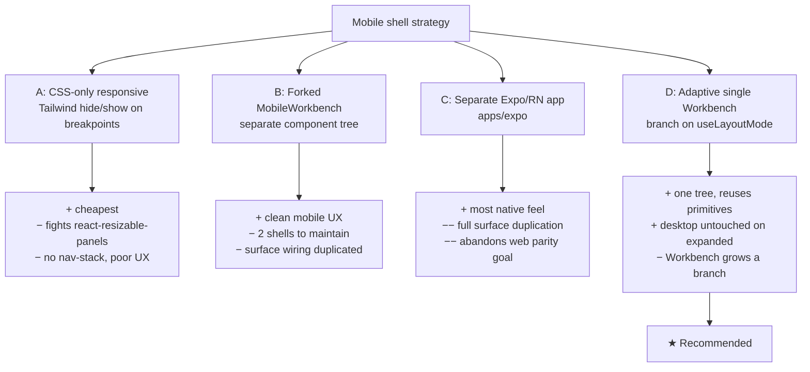
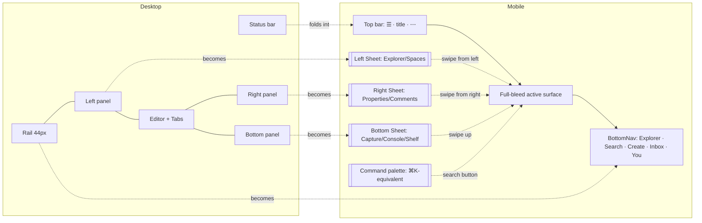
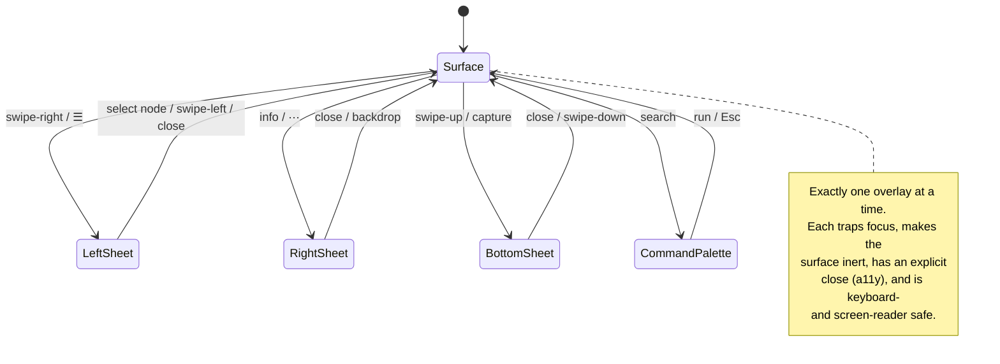

# Mobile Optimization: Adaptive Shell And Touch Surfaces

## Problem Statement

The xNet web app (`apps/web`) is a desktop-first, VS Code–style workbench: a
fixed icon **Rail**, a resizable **left panel** (Explorer/Chats/Tasks/Data/AI), a
center **editor area** with a tab strip and breadcrumb, a resizable **right
context panel** (Properties/Comments/Backlinks), a resizable **bottom panel**
(Shelf/Capture/Notifications/Sync/Console), and a **status bar**. The whole thing
is laid out with `react-resizable-panels` and pixel min-widths.

On a 375 px phone that layout literally cannot fit: the Rail (44 px) + left panel
(min 200 px) + right panel (min 240 px) already overflow the viewport before any
content is drawn. Beyond the shell, the *content surfaces* — the TipTap page
editor, the database/table grid, schema forms, kanban boards, toolbars — assume a
mouse: hover affordances, 32 px hit targets, right-click menus, side-by-side
label/field forms, and horizontal-scroll tables.

We want the same web app to be **genuinely usable on a phone** without forking it
into a separate product. The user's framing is right: there is no VS Code mobile
to copy. We need our own paradigm — **content fills the screen; chrome is summoned
on demand** from the edges (left/right/bottom/top), takes over when expanded, and
dismisses when you're done.

This document maps what exists, what's dormant, what prior art teaches, and
recommends a concrete adaptive-shell path.

## Executive Summary

The headline finding: **xNet already built most of a mobile foundation and never
wired it in.** A "Phase 8" commit (`eba1fec4`, *feat(ui): implement responsive
layout components*) shipped a full responsive primitive kit in `@xnetjs/ui` —
`ResponsiveSidebar`, `BottomNav`/`BottomNavSpacer`, `ResponsiveDialog` (modal↔bottom
sheet), `ResponsiveTable` (table↔cards), a `Sheet` primitive for all four edges, and
SSR-safe `useMediaQuery`/`useIsMobile`/`useIsTablet`/`useIsDesktop` hooks. The editor
package built a complete keyboard-aware mobile toolbar mode
(`editor-ux-state.ts`: `resolveIsMobile`, `visualViewport` keyboard tracking,
`mobile-fixed` presentation). The canvas already runs entirely on Pointer Events
with real pinch-zoom math. The PWA manifest, service worker, and viewport meta tag
are all configured.

**None of it is consumed.** Grep proves:

- `ResponsiveSidebar`, `BottomNav`, `ResponsiveTable` have **zero importers** outside
  `packages/ui` itself (only the build artifact `dist/index.d.ts` references them).
- `useIsMobile` is used in exactly one file — `ResponsiveDialog.tsx` — and nothing
  renders a `ResponsiveDialog`.
- `packages/ui/src/theme/responsive.css` (which defines `.touch-target`,
  `.safe-area-inset-*`, `@media (hover: none)` hover suppression) is **imported
  nowhere** — `globals.css` only pulls `tokens.css`, so those utility classes never
  reach the bundle.
- `apps/web/src/components/Editor.tsx:93` hardcodes `toolbarMode="desktop"`, which
  forces `resolveIsMobile()` to always return `false`, neutering the entire mobile
  toolbar machinery.

So this is **not** a greenfield build — it's an **integration and adaptive-shell**
problem. The recommendation: introduce a single `useLayoutMode()` breakpoint signal
(compact / medium / expanded, mirroring Material's window size classes) and make the
`Workbench` shell **adaptive** — on `compact` it renders a content-first
composition (one active surface, a thumb-reach `BottomNav`, edge-summoned
full-takeover `Sheet`s for the panels, the command palette as universal escape
hatch); on `expanded` it renders today's `react-resizable-panels` grid unchanged.
Reuse the dormant primitives rather than rebuild. Then do a per-surface touch pass
(flip the editor to `toolbarMode="auto"`, wire `ResponsiveTable`/card mode into the
grid, restack forms, tune `dnd-kit` activation constraints). This is sequenced so
that **every phase ships value independently** and desktop is never regressed.

## Current State In The Repository

### The desktop shell (the hard part)

`apps/web/src/workbench/Workbench.tsx` composes the shell with
`react-resizable-panels` and pixel sizing:

| Region | File | Size | Notes |
| --- | --- | --- | --- |
| Rail | `apps/web/src/workbench/Rail.tsx` | `w-11` (44 px), `shrink-0` | always visible icon spine |
| Left panel | `apps/web/src/workbench/PanelViewHost.tsx` | default 280, **min 200**, max 420 | Explorer/Chats/Tasks/Today/Data/AI |
| Editor area | `apps/web/src/workbench/EditorArea.tsx` | remaining | tab strip + split groups + router `<Outlet/>` |
| Right panel | `apps/web/src/workbench/ContextPanel.tsx` | default 320, **min 240**, max 520 | Properties/Comments/Backlinks |
| Bottom panel | `PanelViewHost.tsx` | default 240, min 120, max 60% | Shelf/Capture/Notifications/Sync/Console |
| Status bar | `apps/web/src/workbench/StatusBar.tsx` | `h-6` (24 px) | ambient, never modal |
| Tab bar | `apps/web/src/workbench/TabBar.tsx` | `h-9`, `overflow-x-auto` | drag-reorder, middle-click close, preview tabs |
| Breadcrumb | `apps/web/src/workbench/TabBreadcrumb.tsx` | `h-6` | Space › Folder path |

**Math that breaks mobile:** `44 (rail) + 200 (left min) + 240 (right min) = 484 px`
of irreducible chrome before content — already 109 px past a 375 px viewport with
both side panels open. The shell has **no breakpoint logic today**; it's the same
tree at every width.

All chrome state lives in one Zustand store, `apps/web/src/workbench/state.ts`
(persisted to `xnet:workbench:v1`): `left/right/bottom` `{ open, activeViewId }`,
`mode: 'default' | 'zen'`, editor `groups[]` + `activeGroupId`, `pinnedNodeIds`,
`recents`, `spaceFilter`, etc. Crucially, **panel open/close is already modeled as
boolean state** — exactly what an overlay-sheet model needs. Zen mode
(`toggleZen`, `Cmd+.`) already proves the shell can collapse all chrome to bare
editor and restore it from a snapshot.

Routing is TanStack Router (`apps/web/src/App.tsx`, `routeTree.gen.ts`). Top-level
surfaces: `/doc/$docId` (page), `/db/$dbId` (database), `/canvas/$canvasId`,
`/dashboard/$dashboardId`, `/map/$mapId`, `/view/$viewId`, plus singletons `/tasks`,
`/data`, `/crm`, `/finance`, `/experiments`, `/space/$spaceId`, `/channel/$channelId`,
`/tag/$tagId`, `/person/$did`, `/lab/$labId`, `/settings`.

### The dormant Phase-8 responsive kit (the gift)

`packages/ui/src/` already contains, fully built and exported, but **unconsumed**:

- `components/ResponsiveSidebar.tsx` — hamburger→`Sheet` on `<768px`, icon-rail on
  768–1023, full sidebar on `≥1024`; 44 px touch targets. (0 importers.)
- `components/BottomNav.tsx` + `BottomNavSpacer` — fixed bottom tab bar, `md:hidden`,
  `min-h-[56px] min-w-[64px]` items, `safe-area-inset-bottom`, badge support. (0
  importers.)
- `components/ResponsiveDialog.tsx` — centered modal on desktop, **bottom sheet
  (85vh, rounded top)** on mobile via `useIsMobile()`. (Only self-referencing.)
- `components/ResponsiveTable.tsx` — traditional table `≥md`, **card layout** (label/value
  pairs) `<md`. (0 importers.)
- `primitives/Sheet.tsx` — Base UI Dialog–backed slide-in for `top|bottom|left|right`,
  `w-3/4 sm:max-w-sm`, translate animations. **This is the edge-panel primitive the
  user described.**
- `hooks/useMediaQuery.ts` — `useMediaQuery`, `useIsMobile` (`max-width:767px`),
  `useIsTablet`, `useIsDesktop`, `usePrefersReducedMotion`, `usePrefersDarkMode`.
- `theme/responsive.css` — `.touch-target` (44/48/56), `.safe-area-*`, `.scrollbar-hide`,
  `.tap-highlight-none`, `@media (hover: none)` hover suppression, responsive type/space
  scales. **Not imported anywhere** → dead CSS today.

### The editor's dormant mobile toolbar

`packages/editor/src/components/editor-ux-state.ts` is a genuinely good piece of
work: `resolveIsMobile(mode)` returns true when `'ontouchstart' in window ||
navigator.maxTouchPoints > 0 || window.innerWidth < 768`; `useEditorUxState` tracks
selection shape, focus, and — via `window.visualViewport` resize/scroll —
**on-screen-keyboard height** (`deriveKeyboardState`), so a mobile toolbar can sit
*above the keyboard*. `resolveToolbarPolicy` yields `mobile-fixed` /
`desktop-floating` / `canvas-compact` / `hidden`. `FloatingToolbar.tsx` consumes all
of it. The doc comment literally says *"Mobile: Fixed at bottom, above keyboard,
horizontally scrollable."*

But `apps/web/src/components/Editor.tsx:93` passes `toolbarMode="desktop"`,
hardcoding the floating bubble menu and disabling the entire mobile path. Flipping
this one prop to `"auto"` activates a large amount of finished work.

### The bright spot: canvas is already touch-native

`packages/canvas/src/renderer/CanvasV3.tsx` uses **Pointer Events** throughout
(`onPointerDown/Move/Up/Cancel`), tracks a multi-pointer map, and calls
`measureTouchPinch`/`computePinchViewport` (`renderer/pinch-zoom.ts`) for two-finger
zoom that pins a world point to a screen point. Pan, pinch-zoom, and node-drag work
on touch today. Gaps are polish: touch-feedback states, long-press context menus,
edge-pan.

### Content surfaces and their touch gaps

| Surface | File(s) | Touch readiness | Gap |
| --- | --- | --- | --- |
| Page editor | `apps/web/src/components/Editor.tsx`, `PageView.tsx`, `packages/editor/.../FloatingToolbar.tsx` | mobile mode **built, disabled** | flip to `auto`; comment markers are hover-based |
| Table/grid | `packages/views/src/table/{TableView,VirtualizedTableView,TableCell,TableHeader}.tsx` | desktop-only; `@tanstack/react-virtual` rows | no card fallback; small header/cell targets; right-click menus |
| Forms | `packages/views/src/form/SchemaForm.tsx` | desktop-only | `w-32` label column + 28 px inputs too dense; hover affordances |
| Board (kanban) | `packages/views/src/board/{BoardView,BoardColumn,BoardCard}.tsx` | `@dnd-kit` PointerSensor (touch-capable) | needs activation constraint (long-press/tolerance) so drag ≠ scroll |
| Toolbars | `packages/editor/.../EditorToolbar.tsx`, `apps/web/.../CanvasView.tsx` quick-actions | `flex-wrap`, 32 px buttons, `gap-1` | targets < 44 px; spacing < 8 px |
| Chat composer | `apps/web/src/comms/ChannelChat.tsx` | native input, mostly fine | typeahead popovers need viewport clamping |
| Dialogs | `packages/ui/src/primitives/Modal.tsx` | desktop-only | should route through `ResponsiveDialog` |

### Platform plumbing already in place

- `apps/web/index.html`: `<meta name="viewport" content="width=device-width, initial-scale=1.0">` ✓, `theme-color #000` ✓.
- `apps/web/public/manifest.json`: `display: standalone`, icons 192/512 ✓.
- `apps/web/vite.config.ts`: `vite-plugin-pwa` (`autoUpdate`), Workbox precache, WASM lazy-loaded ✓.
- `apps/web/src/App.tsx`: already detects `display-mode: standalone` and `prefers-color-scheme`.
- `apps/expo/` (React Native) and `apps/electron/` exist as separate targets.

## External Research

**There is no "VS Code mobile" to copy — and that's confirmed prior art, not an
excuse.** `github.dev` and Codespaces-in-browser are explicitly *not* optimized for
phones: limited editing room, no zen mode, broken Codespace creation in the mobile
app. The community ask is "a simplified UI with basic file editing, git, and
terminal." The lesson: **don't port the multi-pane IDE; redesign for a single
focused surface plus summonable chrome.**

**Adaptive layout = window size classes (Material / Android 16, Compose).** The
mature pattern is three breakpoints — *compact* (<600 dp), *medium* (600–840),
*expanded* (≥840) — that decide *how many panes show at once*. The canonical
**list-detail** behavior: compact shows list **or** detail (navigation stack,
back returns to list); expanded shows them **side by side**. This maps directly onto
xNet: Explorer = list, editor surface = detail; on a phone they become a navigation
stack, on desktop they stay side-by-side. `ListDetailPaneScaffold`/`Scene`
strategies formalize "stack vs side-by-side based on width + device state."

**Bottom navigation is the mobile gold standard** for primary destinations — within
thumb reach, with at least one entry point (home/search/back) always visible.
**Bottom sheets** are the right surface for contextual panels, but NN/g and
accessibility guides are strict: move focus in on open, **trap focus**, return focus
on close, provide an **explicit close** (not just swipe), make background `inert`,
announce to screen readers. xNet's `Sheet` (Base UI Dialog) gives focus trap + inert
for free; we must keep an explicit close affordance.

**Touch targets:** Apple 44×44, Material 48×48, WCAG 2.5.8 AA ≥24 with spacing, AAA
44; adjacent targets ≥8 px apart. xNet's dormant `.touch-target` (44/48/56) already
encodes this — it just isn't bundled. `@media (hover: none)` to drop hover-only
affordances is already written in `responsive.css`.

**Responsive tables:** the consensus is that **horizontal-scroll-everything is a
poor default**; the **card pattern** (each row → a card, headers become inline labels,
actions promoted to the card header) is preferred for browse/edit on phones, with
`overflow-x: auto; -webkit-overflow-scrolling: touch` reserved for cases where column
comparison genuinely matters. xNet's `ResponsiveTable` already implements exactly the
card↔table swap — but the real grid (`TableView`) doesn't use it.

**Gestures:** for swipe-to-open-sheet, pinch, and drag, `@use-gesture/react`
(pmndrs) is the lean choice (gesture detection, pair with any animator);
Framer/Motion bundles gestures **and** animation. The canvas already hand-rolls
pointer math, so a small targeted gesture lib (or continued hand-rolling) beats a
heavy dependency. Prefer Pointer Events + `touch-action` CSS for scroll/drag
disambiguation before reaching for a library.

## Key Findings

1. **The work is integration, not invention.** A planned mobile effort ("Phase 8")
   built the primitives and stopped before wiring them into the app. This is the
   same recurring xNet shape as the dormant schema-authz engine (0192) and the
   exported-but-unused AI surface — *capability exists, adoption doesn't.*
2. **The shell is the only genuinely hard problem.** Pixel min-widths make today's
   tree physically impossible at 375 px. Everything else is per-surface polish that
   can land incrementally.
3. **Panel state is already boolean and centralized.** `state.ts` models each panel
   as `{ open, activeViewId }` — an overlay-sheet model is a *rendering* change, not
   a state-model change. Zen mode proves chrome can fully collapse and restore.
4. **One prop flip (`toolbarMode`) unlocks the editor.** The keyboard-aware mobile
   toolbar is finished and tested; it's disabled by a hardcoded string.
5. **Canvas is the template for "do it right."** Pointer Events + `touch-action`,
   not `onMouse*`. New touch code should follow CanvasV3's model.
6. **`responsive.css` must be imported** or all touch-target/safe-area utilities are
   phantom classes. This is a one-line bug with large blast radius.
7. **Don't fork into Expo.** The user's explicit goal is "the website still usable on
   mobile." A separate React Native app duplicates every surface and abandons local-first
   parity. Adaptive web shell is the answer; Expo can stay a separate bet.

## Options And Tradeoffs

### The shell strategy (the central decision)



- **A — CSS-only.** Hiding panels with `md:hidden` is tempting but
  `react-resizable-panels` wants pixel/percent sizes and a `Group` with all panels
  present; you can't cleanly "remove" a panel at a breakpoint without re-mounting the
  group, and you get no navigation-stack semantics (back button, surface-at-a-time).
  Dead end for real UX.
- **B — Forked `MobileWorkbench`.** Pick the shell at the root by window size class.
  Clean mobile UX, but two shells drift and each new surface must be wired twice.
- **C — Expo/RN app.** Best native feel, but duplicates every surface and the
  local-first data layer's UI; directly contradicts "same website, usable on mobile."
  Keep as an independent track, not the answer here.
- **D — Adaptive single `Workbench`.** Keep one component; it reads `useLayoutMode()`
  and renders the **expanded** composition (today's resizable grid, byte-for-byte) or
  the **compact** composition (single surface + `BottomNav` + edge `Sheet`s). Surfaces
  (`PageView`, `TableView`, …) are shared; only the *chrome arrangement* branches.
  Reuses the dormant primitives. Desktop is provably unchanged because the expanded
  branch is the current code.

**Recommendation: D**, with B's separation applied only *within* the compact branch
(extract `MobileShell.tsx` so the file stays readable), and a small shared
`useLayoutMode` driving both.

### The mobile chrome paradigm: desktop region → mobile equivalent



- **Rail → BottomNav.** The five most-used destinations move to a thumb-reach bottom
  bar (`BottomNav` already built). Overflow rail items live behind a "More" sheet.
- **Left panel → left `Sheet` (full-takeover).** Explorer/Spaces/Tasks slide over the
  surface, dismiss on selection (list-detail navigation-stack semantics).
- **Right panel → right `Sheet` or bottom sheet.** Node Properties/Comments/Backlinks
  summoned by a `⋯`/info button; bottom sheet is friendlier one-handed.
- **Bottom panel → bottom `Sheet`.** Capture/Console/Shelf as an upward sheet.
- **Tab bar → surface switcher.** On compact, default to *one surface at a time*
  (router-authoritative); the tab strip becomes a horizontally scrollable switcher or
  an overflow menu — no split groups on phones.
- **Status bar → top bar chips / fold away.** Sync + scope shrink into the top bar;
  detail on tap.
- **Command palette stays the universal escape hatch** — the one piece of desktop
  muscle memory that translates perfectly (a prominent Search in the BottomNav).

### Table strategy

| Approach | When | xNet fit |
| --- | --- | --- |
| Card layout (row→card) | browse/edit, few key columns | `ResponsiveTable` already does this; wire `schemaToGridFields` → card primary/secondary |
| Horizontal scroll | column comparison matters (finance ledger) | `overflow-x-auto` + scroll affordance; keep first column sticky |
| Hybrid (cards default, "table view" toggle) | power users | best UX, most work |

Recommend **card-by-default with an opt-in table toggle**, matching the prior-art
consensus.

### Gesture library

| Option | Verdict |
| --- | --- |
| Pointer Events + `touch-action` CSS | **default** — already proven in CanvasV3, zero deps |
| `@use-gesture/react` | add only if swipe-to-open/close sheets need velocity/rubber-band feel |
| Framer Motion | heavy; only if we adopt it for animation broadly |

## Recommendation

Adopt **Option D — one adaptive `Workbench`** driven by a new `useLayoutMode()`, and
**reuse the dormant Phase-8 kit** instead of building new. Sequence the work so each
phase is independently shippable and desktop is never regressed:

1. **Foundation (1 PR, no visible desktop change):** import `responsive.css`; add
   `useLayoutMode()` (compact `<768` / medium `768–1023` / expanded `≥1024`) wrapping
   `useMediaQuery`; confirm viewport meta + safe-area. This lights up the touch-target
   and safe-area utilities and gives every component a single breakpoint signal.
2. **Adaptive shell:** extract `MobileShell.tsx`; `Workbench` renders it on `compact`,
   the existing resizable grid on `expanded`. Map Rail→`BottomNav`, panels→edge
   `Sheet`s, tabs→single-surface switcher. Reuse `state.ts` booleans verbatim.
3. **Editor:** flip `Editor.tsx` `toolbarMode="desktop"` → `"auto"`; verify the
   keyboard-aware `mobile-fixed` toolbar; make comment markers tap-friendly.
4. **Tables & forms:** route the grid through `ResponsiveTable` card mode on compact;
   restack `SchemaForm` (label-above-field, 44 px controls) below `md`.
5. **Boards & touch polish:** add `dnd-kit` activation constraints (long-press +
   tolerance) so drag ≠ scroll; canvas touch-feedback + long-press menus; promote
   `Modal` usage to `ResponsiveDialog`.
6. **PWA polish:** install prompt, safe-area insets everywhere, offline check on a
   phone, Lighthouse mobile pass.

Why this order: Phase 1 is invisible-but-enabling, Phase 2 makes the app *navigable*
on a phone (the biggest single jump), Phase 3 is a one-prop unlock with outsized
payoff, and 4–6 are independent surface passes that can be parallelized or deferred
without blocking each other.

### Overlay state model (compact mode)



## Example Code

A single breakpoint hook the whole app shares (`apps/web/src/workbench/use-layout-mode.ts`):

```ts
import { useMediaQuery } from '@xnetjs/ui'

export type LayoutMode = 'compact' | 'medium' | 'expanded'

/** Window size classes à la Material: compact <768, medium 768–1023, expanded ≥1024. */
export function useLayoutMode(): LayoutMode {
  const expanded = useMediaQuery('(min-width: 1024px)')
  const medium = useMediaQuery('(min-width: 768px)')
  if (expanded) return 'expanded'
  if (medium) return 'medium'
  return 'compact'
}
```

The adaptive shell — desktop tree is the *unchanged* current code:

```tsx
// apps/web/src/workbench/Workbench.tsx (sketch)
export function Workbench() {
  const mode = useLayoutMode()
  if (mode === 'compact') return <MobileShell />
  return <DesktopWorkbench /> // ← today's react-resizable-panels grid, verbatim
}
```

The compact composition reuses the dormant primitives — panels become edge sheets,
the rail becomes a bottom nav, and `state.ts` booleans drive `open`:

```tsx
// apps/web/src/workbench/MobileShell.tsx (sketch)
import { BottomNav, BottomNavSpacer, Sheet, SheetContent } from '@xnetjs/ui'
import { useWorkbench } from './state'

export function MobileShell() {
  const { left, right, bottom, setPanelOpen } = useWorkbench()
  return (
    <div className="flex h-[100dvh] flex-col">
      <MobileTopBar /> {/* ☰ · title · ⋯ · search */}
      <main className="min-h-0 flex-1 overflow-y-auto">
        <Outlet /> {/* one router-authoritative surface, full-bleed */}
      </main>
      <BottomNavSpacer />
      <BottomNav items={PRIMARY_DESTINATIONS} />

      <Sheet side="left" open={left.open} onOpenChange={(o) => setPanelOpen('left', o)}>
        <SheetContent side="left" className="w-[88vw] safe-area-inset-left">
          <PanelViewHost slot="left" />
        </SheetContent>
      </Sheet>

      <Sheet side="bottom" open={right.open} onOpenChange={(o) => setPanelOpen('right', o)}>
        <SheetContent side="bottom" className="h-[85vh] safe-area-inset-bottom">
          <ContextPanel /> {/* Properties / Comments / Backlinks */}
        </SheetContent>
      </Sheet>

      <Sheet side="bottom" open={bottom.open} onOpenChange={(o) => setPanelOpen('bottom', o)}>
        <SheetContent side="bottom" className="h-[70vh] safe-area-inset-bottom">
          <PanelViewHost slot="bottom" /> {/* Capture / Console / Shelf */}
        </SheetContent>
      </Sheet>
    </div>
  )
}
```

The one-line editor unlock:

```tsx
// apps/web/src/components/Editor.tsx:93
- toolbarMode="desktop"
+ toolbarMode="auto"  // resolveIsMobile() now drives the keyboard-aware mobile toolbar
```

And the missing CSS import:

```css
/* apps/web/src/styles/globals.css */
@import '@xnetjs/ui/tokens.css';
+ @import '@xnetjs/ui/responsive.css'; /* .touch-target, .safe-area-*, hover suppression */
```

## Risks And Open Questions

- **`react-resizable-panels` at the boundary.** Switching whole trees on a breakpoint
  remounts surfaces, which can drop editor/Y.Doc state mid-resize. Mitigate: branch as
  high as possible (one `<Outlet/>` shared), debounce the mode switch, and test a
  desktop→narrow drag.
- **`responsive.css` import side-effects.** It's been dead since Phase 8; importing it
  may reveal class collisions or specificity surprises. Diff a few desktop screenshots
  after import (the CI visual pipeline from 0185/0191 is perfect for this).
- **`100vh` vs `100dvh` and the keyboard.** Mobile browser chrome + on-screen keyboard
  make `100vh` lie. Use `100dvh` and lean on the editor's existing `visualViewport`
  tracking; the storage-banner offset (`--storage-banner-height`) must compose with safe-area.
- **Tab model on phones.** Multi-tab + split groups don't translate. Decide:
  single-surface-with-history (recommended, simplest) vs a compact tab switcher. Affects
  `state.ts` `groups` semantics on compact.
- **Drag vs scroll disambiguation.** Boards, canvas, and explorer reorder all compete
  with page scroll. `touch-action` + `dnd-kit` activation constraints must be tuned per
  surface; getting this wrong makes the app feel broken.
- **Hover-only affordances.** Comment markers, row hover actions, tooltips. `@media
  (hover: none)` suppresses styling but the *interactions* still need tap/long-press
  equivalents.
- **Right-click context menus** (tables, canvas, explorer) have no touch equivalent —
  need long-press or an explicit `⋯` affordance.
- **Testing.** `editor-ux` Playwright e2e is desktop-sized; we need mobile-viewport +
  touch-emulation runs. Open question: extend the existing e2e project or add a mobile one.
- **Medium (tablet) is underspecified.** Is it "expanded minus one panel," or
  "compact plus a persistent rail"? Recommend starting it as expanded-with-narrower-mins
  and refining later.
- **Scope.** Some surfaces (Console/query runner, Lab code editor, complex dashboards)
  may be acceptably "view-only / degraded" on phones for v1. Decide the v1 surface matrix.

## Implementation Checklist

- [ ] Add `apps/web/src/workbench/use-layout-mode.ts` (`compact`/`medium`/`expanded`) over `useMediaQuery`.
- [ ] Import `@xnetjs/ui/responsive.css` in `apps/web/src/styles/globals.css`; verify `.touch-target`/`.safe-area-*` reach the bundle.
- [ ] Confirm/adjust viewport meta for `viewport-fit=cover` so safe-area insets apply.
- [ ] Extract today's shell into `DesktopWorkbench.tsx` (no behavior change) and branch `Workbench` on `useLayoutMode()`.
- [ ] Build `MobileShell.tsx`: full-bleed `<Outlet/>`, `MobileTopBar`, `BottomNav` (5 primary destinations + More), `BottomNavSpacer`.
- [ ] Map left/right/bottom panels to edge `Sheet`s driven by existing `state.ts` `{ open }` booleans; enforce one-overlay-at-a-time.
- [ ] Decide + implement compact tab semantics (single-surface history vs compact switcher); disable split groups on compact.
- [ ] Flip `Editor.tsx` `toolbarMode` → `"auto"`; verify `mobile-fixed` keyboard-aware toolbar; make comment markers tappable.
- [ ] Route the grid through `ResponsiveTable` card mode on compact; add an opt-in "table view" toggle with sticky first column.
- [ ] Restack `SchemaForm` below `md` (label above field, ≥44 px controls, no hover-only affordances).
- [ ] Tune `dnd-kit` `PointerSensor` activation (long-press + tolerance) on `BoardView`; verify drag ≠ scroll.
- [ ] Canvas: touch-feedback states, long-press context menu, optional edge-pan.
- [ ] Replace `Modal` usages with `ResponsiveDialog` so dialogs become bottom sheets on mobile.
- [ ] Clamp typeahead/popover positioners (mentions, link, hashtag, command palette) to the visual viewport.
- [ ] PWA: install prompt, safe-area insets on all fixed elements, `100dvh` audit, offline smoke on a phone.
- [ ] Add mobile-viewport + touch-emulation e2e (extend `editor-ux` or new project).

## Validation Checklist

- [ ] App is fully navigable on a 375×667 viewport: open any surface, switch destinations, summon and dismiss each panel sheet.
- [ ] No horizontal overflow / no element wider than the viewport on the home, page, database, tasks, and CRM surfaces at 375 px.
- [ ] All interactive controls meet ≥44×44 px with ≥8 px spacing (axe/Lighthouse + manual spot-check).
- [ ] Page editor: select text → mobile toolbar appears above the keyboard, horizontally scrollable, doesn't cover the caret.
- [ ] Table: card layout renders on compact; "table view" toggle scrolls horizontally with a sticky first column.
- [ ] Form: fields stack, inputs are thumb-tappable, no clipped labels.
- [ ] Board: a card can be dragged between columns on touch without triggering page scroll; a short drag scrolls.
- [ ] Canvas: pan, pinch-zoom, and node-drag all work; long-press opens the context menu.
- [ ] Each overlay sheet traps focus, is screen-reader-announced, makes the surface inert, and has an explicit close.
- [ ] Desktop (≥1024 px) is visually and behaviorally identical to pre-change (CI visual diff from 0185/0191 is clean).
- [ ] Lighthouse mobile: PWA installable, no critical a11y/contrast regressions, layout-shift within budget.
- [ ] Offline: load the app installed-to-home-screen with no network; core surfaces render.

## References

### Internal (code)

- Shell: `apps/web/src/workbench/Workbench.tsx`, `Rail.tsx`, `EditorArea.tsx`, `PanelViewHost.tsx`, `ContextPanel.tsx`, `StatusBar.tsx`, `TabBar.tsx`, `TabBreadcrumb.tsx`
- Shell state: `apps/web/src/workbench/state.ts` (`xnet:workbench:v1`)
- Dormant kit: `packages/ui/src/components/{ResponsiveSidebar,BottomNav,ResponsiveDialog,ResponsiveTable}.tsx`, `packages/ui/src/primitives/Sheet.tsx`, `packages/ui/src/hooks/useMediaQuery.ts`, `packages/ui/src/theme/responsive.css` (added in `eba1fec4`, *feat(ui): responsive layout components (Phase 8)*)
- Editor mobile mode: `packages/editor/src/components/editor-ux-state.ts`, `FloatingToolbar.tsx`; disabled at `apps/web/src/components/Editor.tsx:93`
- Canvas touch: `packages/canvas/src/renderer/CanvasV3.tsx`, `renderer/pinch-zoom.ts`
- Surfaces: `packages/views/src/{table,form,board}/…`, `apps/web/src/components/{PageView,CanvasView,DataWorkspaceView}.tsx`
- Platform: `apps/web/index.html`, `apps/web/public/manifest.json`, `apps/web/vite.config.ts`

### External (prior art)

- [Build adaptive Android apps across form factors — Google I/O 2025](https://android-developers.googleblog.com/2025/05/adaptiveapps-io25.html) — window size classes, list-detail scaffold
- [Build responsive navigation — Android Developers](https://developer.android.com/develop/ui/views/layout/build-responsive-navigation)
- [Bottom Sheets: Definition and UX Guidelines — NN/g](https://www.nngroup.com/articles/bottom-sheet/)
- [Mobile Patterns that Break (and Make) Accessibility — TestParty](https://testparty.ai/blog/mobile-accessibility-patterns) — focus trap, inert, explicit close
- [How to design bottom sheets for optimized UX — LogRocket](https://blog.logrocket.com/ux-design/bottom-sheets-optimized-ux/)
- [The Best Mobile Layout for Complex Data Tables — UX Movement](https://uxmovement.medium.com/the-best-mobile-layout-for-complex-data-tables-e3ced21ce425)
- [Responsive tables with CSS Grid & Tailwind — Hoverify](https://tryhoverify.com/blog/how-to-build-responsive-tables-that-dont-break-on-mobile-a-step-by-step-guide-with-css-grid-and-tailwind/)
- [github.dev web-based editor — GitHub Docs](https://docs.github.com/en/codespaces/the-githubdev-web-based-editor) + [Codespaces mobile limitations discussion](https://github.com/orgs/community/discussions/16753)
- [pmndrs/use-gesture](https://github.com/pmndrs/use-gesture) · [Motion (Framer) gestures](https://www.framer.com/motion/gestures/)
- [Mobile App Design Trends 2026 — Muzli](https://muz.li/blog/whats-changing-in-mobile-app-design-ui-patterns-that-matter-in-2026/) (adaptive toolbars, dark-chrome/light-content)
- [Responsive design best practices 2025 — UXPin](https://www.uxpin.com/studio/blog/best-practices-examples-of-excellent-responsive-design/)
