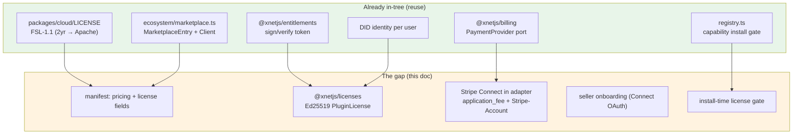
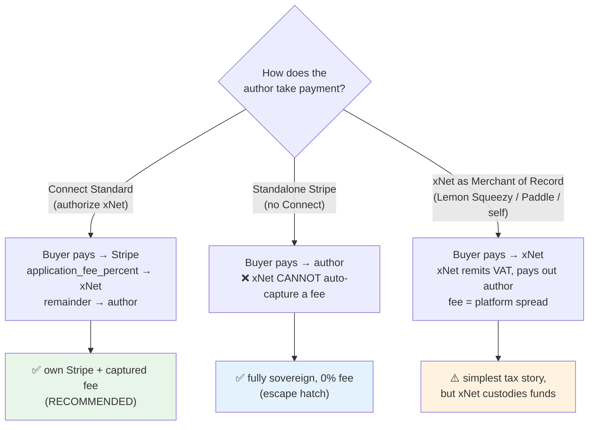
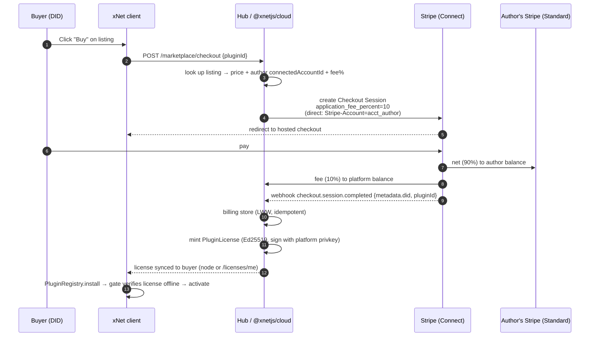
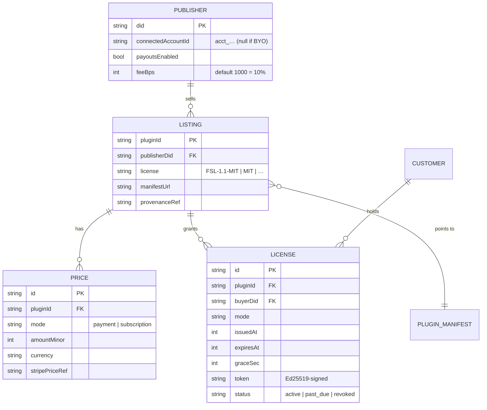
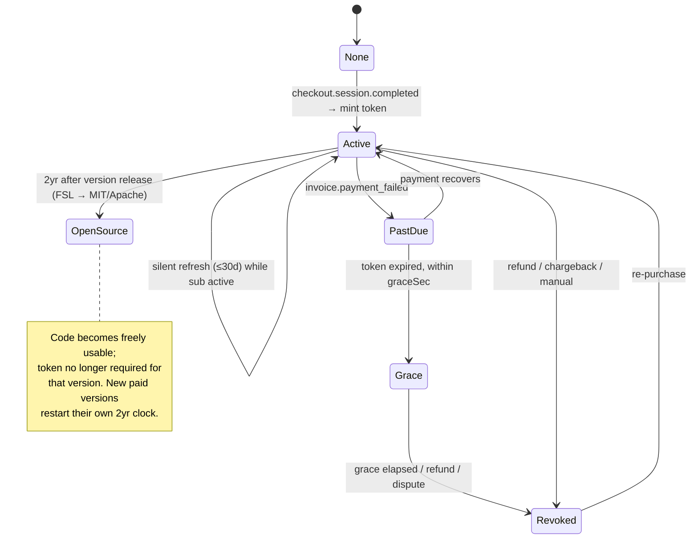

# Paying Plugin Authors: A Monetized Marketplace, Stripe, And Delayed-Open Licensing

## Problem Statement

The user wants **financial incentives to build and maintain xNet tooling** — an
"App Store for plugins" where an author can charge a one-time fee or a monthly
subscription, and xNet makes the billing "really seamless and easy to set up …
and manage all that for you." Verbatim, the ask braids three sub-questions that
have to be answered together:

1. **The storefront.** Let a plugin author price their work (one-time _or_
   recurring) and have xNet handle checkout, receipts, renewals, and refunds —
   like the App Store, but without the 30% Apple tax. A "small fee, like 10 or
   15%."

2. **The money plumbing.** Two instincts that _seem_ to conflict:
   - "Use your own Stripe account … I think that's part of the xNet ethos" (the
     author is the merchant; xNet doesn't custody their revenue).
   - "Have some sort of xNet fee for hosting on our marketplace and maybe we can
     capture that" — possibly via Stripe Connect, _or_ "ask Stripe to pay us some
     commission on every transaction. I don't know if that's viable."

   > **The crux finding (Section "Key Findings"): you can have both, but only
   > through Stripe Connect _Standard_ accounts.** There is **no** Stripe
   > mechanism by which a third party skims a commission off a _standalone_
   > account it doesn't control. Connect Standard _is_ "bring your own Stripe" —
   > the author keeps their own dashboard, Stripe does their KYC/payouts/disputes
   > — and it is also the only path that lets xNet take an `application_fee` on
   > each charge. The two instincts reconcile into one product.

3. **The license.** Paid plugins should still be _source-available_ and
   eventually open: "like xNet Cloud, where after two years it becomes MIT or
   Apache." xNet **already ships exactly this license** —
   [`packages/cloud/LICENSE`](../../packages/cloud/LICENSE) is **FSL-1.1-ALv2**
   (Functional Source License, 2-year conversion to Apache-2.0). The job is to
   make it the _blanket, pre-approved_ license for paid plugins.

This exploration is the deep-dive on the monetization phase that
[0192](./0192_[_]_PLUGIN_ECOSYSTEM_MARKETPLACE_DX_AND_TRUST.md) explicitly
deferred ("**Monetization & lifecycle (❌ absent): no paid plugins**") and that
[0194](./0194_[_]_EXTENSIBILITY_FABRIC_PLUGINS_LABS_AI_EDITOR.md) left as future
work. It is grounded in three subsystems that **already exist and fit together
almost suspiciously well**: the billing engine, the entitlements signer, and the
FSL license.

## Executive Summary

1. **xNet has ~70% of the parts already in the tree.** A provider-agnostic
   **billing engine** ([`packages/billing`](../../packages/billing), PR #106), a
   **signed-entitlement** signer/verifier pattern
   ([`packages/entitlements`](../../packages/entitlements)), a real **FSL
   license** ([`packages/cloud/LICENSE`](../../packages/cloud/LICENSE)), a
   **marketplace index + client** ([`packages/plugins/src/ecosystem/marketplace.ts`](../../packages/plugins/src/ecosystem/marketplace.ts)),
   a **capability-gated install flow**
   ([`packages/plugins/src/registry.ts`](../../packages/plugins/src/registry.ts)),
   and a **DID identity** for every user. No incumbent (Apple, Shopify, Freemius)
   has a DID-rooted local-first identity to anchor licenses to. The work is
   **wiring + 2 new fields + 1 new MIT package + a Connect extension to the
   Stripe adapter**, not greenfield.

2. **Resolve "own Stripe vs. capture a fee" with Stripe Connect _Standard_.**
   The author connects their _existing_ Stripe account via OAuth (1 click, Stripe
   owns their KYC/disputes/payouts — minimal xNet liability), and xNet attaches
   `application_fee_percent` (recommend **10%**) to each charge. This is genuinely
   "your own Stripe" _and_ a captured marketplace fee. The dead-end the user
   half-suspected — Stripe paying xNet a commission on a standalone account — is
   **not viable**; Connect is the supported version of that same wish.

3. **Offer a "fully sovereign" escape hatch for the purists.** An author who
   refuses Connect can still list a **BYO-billing** plugin: xNet takes **0%**, the
   author handles their own checkout/license issuance, and xNet only verifies the
   resulting license token. This keeps faith with the local-first/sovereignty
   ethos — you can always go fully independent; you just forgo _managed_ billing
   and don't owe the fee.

4. **Enforcement is a signed, DID-scoped license token verified offline.** Mirror
   the existing `signEntitlements`/`verifyEntitlements`
   ([`packages/entitlements/src/entitlements.ts`](../../packages/entitlements/src/entitlements.ts))
   pattern, but with **Ed25519, not HMAC** — the client is the adversary here, so
   verification must be asymmetric (hub holds the private key; the plugin runtime
   embeds the public key). A new MIT `@xnetjs/licenses` package mints/verifies a
   `PluginLicense` token bound to `{ pluginId, buyerDID, expiry, grace }`. The
   `PluginRegistry` install/activate gate checks it offline before running paid
   code.

5. **FSL is the right license and xNet already uses it.** Adopt **FSL-1.1-MIT**
   / **FSL-1.1-Apache-2.0** as the _pre-approved_ paid-plugin license (blanket
   policy = no per-plugin legal review, unlike BUSL's per-instance Additional Use
   Grant). Add a `license` field to the manifest, a CI check (clone of
   [`scripts/check-cloud-boundary.sh`](../../scripts/check-cloud-boundary.sh)),
   and an `LICENSE` template in the scaffolder. The 2-year auto-conversion is a
   feature, not a footnote.

6. **The managed-billing brain belongs in `@xnetjs/cloud` (FSL); the contract is
   MIT.** The Connect platform secret, fee capture, and seller payouts are a
   _hosted_ xNet feature → they live behind the existing open-core boundary in
   FSL `@xnetjs/cloud`. The manifest fields, the license verifier, the install
   gate, and BYO-billing are **MIT** so self-hosters keep a working (un-monetized
   or BYO-monetized) marketplace. This maps cleanly onto the
   [0181](./0181_[x]_CONSOLIDATE_CLOUD_INTO_ONE_PACKAGE.md) cloud boundary.

7. **Recommendation:** a 5-phase build — **(0)** paid-aware catalog + FSL policy
   (no money yet), **(1)** the `@xnetjs/licenses` entitlement spine + install gate
   (works with manual fulfillment), **(2)** managed billing via Connect Standard +
   fee capture, **(3)** the BYO-billing sovereign path, **(4)** lifecycle
   (updates, revocation, payouts dashboard, the 2-year auto-open job). Each phase
   ships value alone.

## Current State In The Repository

### Billing engine — provider-agnostic, single-account today

[`packages/billing`](../../packages/billing) (MIT, PR #106) is a clean port:

- **The port:** [`PaymentProvider`](../../packages/billing/src/provider.ts) —
  `createCheckout(req)`, `parseWebhook(rawBody, headers)`, `normalize(event)`,
  optional `createPortalSession(req)`. Stripe / BTCPay / fake all implement it;
  swapping is an env var (`billingProviderFromEnv`).
- **Money model:** [`types.ts`](../../packages/billing/src/types.ts) — `Customer`,
  `Subscription`, `Invoice`, `Payment`, all amounts **integer minor units**, every
  row `did`-scoped.
- **The store:** [`MemoryBillingStore`](../../packages/billing/src/store.ts) +
  durable [`SqliteBillingStore`](../../packages/hub/src/services/billing-store.ts)
  (`billing.db`), idempotent on provider event id, LWW by `updatedAt`, with a
  _pending buffer_ that replays mutations once a `customerRef → did` mapping
  arrives.
- **Hub routes:** [`createBillingRoutes`](../../packages/hub/src/routes/billing.ts)
  — `POST /billing/webhook` (unauth, signature-verified), `POST /billing/checkout`
  (auth; **server injects `did`**, never the client), `GET /billing/me`,
  `GET /billing/entitlements`, `POST /billing/portal`.
- **Client:** [`useBilling()`](../../packages/react/src/hooks/useBilling.ts) +
  `XNetConfig.billing { apiBase?, publishableKey? }`
  ([`context.ts`](../../packages/react/src/context.ts)).

**The Stripe adapter today is single-account.** In
[`packages/billing/src/providers/stripe.ts`](../../packages/billing/src/providers/stripe.ts)
the checkout `POST /v1/checkout/sessions` injects the buyer's DID into
`client_reference_id` / `metadata[did]` but sets **no** `application_fee_amount`,
`transfer_data[destination]`, `on_behalf_of`, or `Stripe-Account` header. Every
charge lands in the _operator's_ one Stripe account. This is precisely the seam a
marketplace must extend.

### Entitlements — the signed-token pattern to mirror

[`packages/entitlements`](../../packages/entitlements) (MIT, the "hub-only
contract" from [0181](./0181_[x]_CONSOLIDATE_CLOUD_INTO_ONE_PACKAGE.md)) already
encodes "sign a capability claim, verify it elsewhere":

```ts
// packages/entitlements/src/entitlements.ts
export function signEntitlements(e: PlanEntitlements, secret: string): string // base64url(json).base64url(HMAC-SHA256)
export function verifyEntitlements(token: string, secret: string): PlanEntitlements
```

And [`plans.ts`](../../packages/entitlements/src/plans.ts) maps a Stripe
`priceRef → PlanEntitlements`. The hub already bridges billing→entitlements in
[`billing-entitlements.ts`](../../packages/hub/src/services/billing-entitlements.ts)
via `XNET_BILLING_PRICE_PLANS`. A **plugin license is the same shape** — except
the verifier (the plugin runtime) is untrusted, so HMAC must become Ed25519.

### Plugin ecosystem — capability-gated, but money-blind

- **Manifest:** [`FeatureModule`](../../packages/plugins/src/feature-module.ts) /
  [`XNetExtension`](../../packages/plugins/src/manifest.ts). `author` is a bare
  **string** (no DID); there is **no `pricing` and no `license` field**.
- **Marketplace:** [`MarketplaceEntry` + `MarketplaceClient`](../../packages/plugins/src/ecosystem/marketplace.ts)
  fetch a `registry.json` from an `indexUrl` and cache it. Entries carry
  `installs`/`stars`/`provenance` but **no price/license**. A `PluginRating
{ authorDID }` type exists but isn't wired in. No publish path, no registry
  backend.
- **Install gate:** [`PluginRegistry.install`](../../packages/plugins/src/registry.ts)
  runs validate → platform → dup → host-version → deps (topo) →
  **capability consent** ([`evaluateInstallConsent`](../../packages/plugins/src/ecosystem/consent.ts))
  → persist node → activate. There is **no entitlement/license step**. This is
  exactly where a paid-license gate slots in.
- **Trust:** [`@xnetjs/trust`](../../packages/trust/src/index.ts) derives tiers
  from provenance; [`provenance.ts`](../../packages/plugins/src/ecosystem/provenance.ts)
  has a fail-closed Sigstore-style verifier with a `builderDID` (CI identity, not
  a _publisher_ account).

### Licensing — FSL is already in the repo

- [`packages/cloud/LICENSE`](../../packages/cloud/LICENSE): **"Functional Source
  License, Version 1.1, ALv2 Future License … Copyright 2026 Chris Smothers"** —
  Change Date = "the second anniversary of the date we make the Software
  available", Change License = Apache-2.0.
- [`packages/cloud/package.json`](../../packages/cloud/package.json) /
  [`apps/cloud/package.json`](../../apps/cloud/package.json):
  `"license": "FSL-1.1-Apache-2.0"`. **Everything else in the monorepo is MIT.**
- [`scripts/check-cloud-boundary.sh`](../../scripts/check-cloud-boundary.sh) (run
  in the `lint` CI job) asserts the FSL package has a real `LICENSE` file and that
  the MIT hub never imports the FSL package — the **exact precedent** for a
  per-plugin license check.



## External Research

### Stripe: how a platform takes a cut (and the one thing that's impossible)

- **Connect account types** decide who carries the burden:
  - **Standard** — seller owns a full Stripe Dashboard; **Stripe handles their
    KYC, disputes, and payouts**; platform liability is minimal; **no $2/mo
    per-active-account fee**. This is the "bring your own Stripe" model.
  - **Express** — platform creates/manages accounts, Stripe-hosted lite
    dashboard, platform assists with disputes; **$2/mo per active account +
    $0.25/payout**.
  - **Custom** — platform builds everything and owns all compliance/liability.
- **Taking the fee** (any account type): **direct charges** with
  `application_fee_amount` / `application_fee_percent`, or **destination charges**
  with `transfer_data[destination]` (+ optional `application_fee_amount`), or
  **separate charges & transfers**. For **subscriptions**,
  `application_fee_percent` on the Subscription applies to every cycle invoice
  (but **not** mid-cycle proration invoices — those need a manual
  `application_fee_amount` set on `invoice.created`).
- **`on_behalf_of`** makes the connected account the business-of-record (its
  statement descriptor, its settlement currency).
- **The dead end:** there is **no supported way to capture a commission from a
  seller's _standalone_ Stripe account** you don't control. `application_fee_*`
  only exists inside a Connect relationship. The Stripe **Partner Program** pays a
  _one-time_ referral, not a per-transaction cut; the App Marketplace OAuth scopes
  don't let you create charges or take fees. So "ask Stripe to pay us a commission
  on every transaction" → **only via Connect**, which requires the seller to link
  the account.



### App-store fee models (prior art)

| Platform               | Platform cut            | Who's the merchant?     | BYO processor?                 |
| ---------------------- | ----------------------- | ----------------------- | ------------------------------ |
| Apple App Store        | 30% (15% < $1M)         | Apple (MoR)             | ❌                             |
| Google Play            | 30% one-time / 15% subs | Google (MoR)            | ❌                             |
| Steam                  | 30 → 25 → 20% tiered    | Valve (MoR)             | ❌                             |
| Shopify App Store      | 0% first $1M, then 15%  | Shopify Payments        | ❌                             |
| **Ghost**              | **0%**                  | **Seller's own Stripe** | ✅ (Ghost charges _you_ a sub) |
| **Freemius**           | ~5–10% (→0.5% at scale) | Freemius (MoR)          | ❌ (purpose-built for plugins) |
| Gumroad                | 10% flat                | Gumroad (MoR)           | ❌                             |
| Lemon Squeezy / Paddle | 5% + $0.50              | them (MoR)              | ❌                             |

xNet's stated **10–15%** sits below Apple/Steam/Google and is in the band of
Freemius/Gumroad. **Ghost is the spiritual model**: seller connects their own
Stripe; the platform monetizes elsewhere — except xNet _also_ wants the per-sale
fee, which Connect Standard provides and Ghost forgoes.

### Source-available licensing (FSL vs BUSL vs Fair Source)

- **FSL** (Sentry, 2023): two flavors **FSL-1.1-MIT** / **FSL-1.1-Apache-2.0**.
  Forbids only **Competing Use** (a product/service that competes with the
  software). **Every version auto-converts to MIT/Apache exactly 2 years after
  release** — unconditional, per-version. **Standardized** terms → a platform can
  approve "FSL" once, globally. Not OSI-approved (intentionally; it's "Fair
  Source").
- **BUSL 1.1** (MariaDB/HashiCorp): up to **4-year** change date, change license
  must be GPL-compatible, and a **per-instance Additional Use Grant** → every
  adopter's license text differs → **per-plugin legal review**. Worse fit for a
  blanket marketplace policy.
- **Fair Source / DOSP**: the umbrella (fair.io) for "public source + time-limited
  restriction + committed open conversion." FSL is the flagship.
- **Caveat for _local-first_ code:** FSL's Competing-Use clause is tuned for SaaS
  (API exposure, hosted substitutes). For a desktop plugin it gives _weaker_
  anti-clone protection than a hard EULA. xNet's real anti-piracy lever is the
  **license token + install gate**, not the copyright license. The license governs
  _redistribution & eventual openness_; the token governs _who can run it now_.

### Offline license enforcement

Modern practice (Keygen, Cryptlex, JetBrains): **asymmetric-signed license
certificates** (Ed25519 preferred — 64-byte sigs, fast, timing-safe), embedded
public key, **fully offline verification**, short lifetime (≈30 days) with silent
online refresh, an embedded **grace period** for connectivity gaps, and an
optional CDN **revocation list**. Bind to an _identity_, not hardware, where you
can — and xNet uniquely _has_ a portable identity: the **DID**. A DID-bound
license is portable across the user's devices and revocable hub-side, with no
hardware-fingerprint support pain.

## Key Findings

1. **"Own Stripe" and "capture a fee" are the same product: Connect Standard.**
   The user framed these as competing options; they aren't. Connect Standard _is_
   bring-your-own-Stripe with an authorized platform fee. This is the single most
   important reframing in this doc.

2. **The "Stripe pays us a commission on a standalone account" idea is not
   viable.** Worth stating plainly so it's not re-litigated: no `application_fee`
   without Connect; the Partner Program is a one-time referral, not per-tx.

3. **The Stripe adapter is ~30 lines from Connect-ready.** It already form-encodes
   the checkout body; adding `payment_intent_data[application_fee_amount]` /
   `subscription_data[application_fee_percent]` + a `Stripe-Account` header (direct
   charges) or `payment_intent_data[transfer_data][destination]` (destination
   charges) is a localized change behind the existing `PaymentProvider` port.

4. **The license token is a near-copy of `signEntitlements` — but must be
   asymmetric.** HMAC works for hub↔hub (`HUB_PLAN`); it fails when the _client_
   verifies, because the client would hold the secret and could forge tokens. Use
   Ed25519 (the hub signs, the runtime verifies with a baked-in public key).

5. **FSL is already shipping in this repo** — adopting it for plugins is a
   _policy + template + CI check_, not a legal R&D project. Reuse
   [`packages/cloud/LICENSE`](../../packages/cloud/LICENSE) verbatim with the
   author's copyright line.

6. **The open-core boundary tells us where each piece lives.** Managed fee capture
   = hosted xNet value = **FSL `@xnetjs/cloud`**. Manifest fields + verifier +
   install gate + BYO billing = **MIT** so self-hosters keep a functional
   marketplace. `check-cloud-boundary.sh` already enforces this seam.

7. **DID-rooted licensing is a genuine differentiator.** No surveyed competitor
   can issue a license bound to a portable cryptographic identity the user already
   owns. It removes device-binding friction _and_ gives clean hub-side revocation.

## Options And Tradeoffs

### A. Payment topology

| Option                                     | "Own Stripe" ethos       | xNet captures fee            | Seller burden          | xNet liability                   | Tax/VAT                          |
| ------------------------------------------ | ------------------------ | ---------------------------- | ---------------------- | -------------------------------- | -------------------------------- |
| **A1. Connect Standard** ⭐                | ✅ yes (own dashboard)   | ✅ `application_fee_percent` | 1-click OAuth          | low (Stripe owns disputes/KYC)   | seller's problem (or Stripe Tax) |
| A2. Connect Express                        | ⚠️ Stripe-lite dashboard | ✅                           | xNet manages account   | medium ($2/mo, payout liability) | seller/Stripe Tax                |
| A3. Standalone Stripe (BYO)                | ✅✅ maximal             | ❌ impossible                | author does everything | none                             | author                           |
| A4. xNet as MoR (Paddle/LemonSqueezy/self) | ❌ xNet custodies funds  | ✅ spread                    | minimal                | high (MoR = tax + chargebacks)   | ✅ handled                       |

**Recommendation: A1 as the default, A3 as the sovereign escape hatch.** Defer A4
(MoR) as a future "we'll handle your global taxes" premium — it contradicts the
ethos but is the best answer for indie authors drowning in VAT, so keep the door
open without building it now.

### B. License enforcement strength

| Option                                              | Offline? | Forge-resistant          | Revocable          | UX friction               |
| --------------------------------------------------- | -------- | ------------------------ | ------------------ | ------------------------- |
| B1. Honor system (no token)                         | ✅       | ❌                       | n/a                | none                      |
| B2. HMAC token (like entitlements)                  | ✅       | ❌ (client holds secret) | weak               | low                       |
| **B3. Ed25519 token, DID-bound, 30-day + grace** ⭐ | ✅       | ✅                       | ✅ (refresh fails) | low                       |
| B4. Mandatory online activation per launch          | ❌       | ✅                       | ✅ instant         | high (breaks local-first) |

**Recommendation: B3.** It's the only option that's both forge-resistant _and_
local-first-friendly. Start fulfillment with B1 (manual) in Phase 1 so the token
plumbing ships before the billing does.

### C. License (legal)

| Option                                          | Blanket-approvable      | Converts to open | Anti-clone strength | Community optics           |
| ----------------------------------------------- | ----------------------- | ---------------- | ------------------- | -------------------------- |
| **C1. FSL-1.1-MIT/Apache** ⭐                   | ✅ (fixed terms)        | ✅ 2 yr          | ⚠️ weak for desktop | good (Fair Source)         |
| C2. BUSL 1.1                                    | ❌ (per-instance grant) | ✅ ≤4 yr (GPL)   | ⚠️                  | mixed (HashiCorp backlash) |
| C3. Proprietary EULA                            | ✅                      | ❌ never         | ✅ strong           | poor (closed)              |
| C4. Author's free choice (MIT…AGPL…proprietary) | ❌ chaos                | varies           | varies              | author-friendly            |

**Recommendation: C1 as the _pre-approved_ default**, with C4 allowed for authors
who declare an OSI-approved license (MIT/Apache/AGPL) — those need no review
either. Disallow opaque proprietary EULAs in the _managed_ marketplace (they can
still BYO-host). Anti-clone protection comes from the token (B3), not the license.

### D. Package boundary

- **MIT (ships to self-hosters):** new `@xnetjs/licenses` (sign is hub-side but
  the _verify_ + types are MIT and bundled client-side), `pricing`/`license`
  manifest fields, the install-gate, BYO-billing.
- **FSL `@xnetjs/cloud`:** Connect platform secret, seller-onboarding OAuth,
  fee-capture config, payout/ledger views, the hosted marketplace registry write
  path. Enforced by `check-cloud-boundary.sh`.

## Recommendation

Build the **"Plugin Storefront"** in five phases. Default payment = **Stripe
Connect Standard with a 10% `application_fee_percent`**; default license =
**FSL-1.1-MIT** (pre-approved); enforcement = **Ed25519 DID-bound `PluginLicense`
token** checked at install/activate. Keep a **0%-fee sovereign BYO-billing path**.



```mermaid
sequenceDiagram
  autonumber
  participant Author
  participant Web as xNet client
  participant Hub as @xnetjs/cloud
  participant Stripe as Stripe Connect

  Author->>Web: "Become a publisher" → set price + pick FSL license
  Web->>Hub: POST /marketplace/connect/start
  Hub->>Stripe: create Standard account link (OAuth)
  Stripe-->>Author: Stripe-hosted onboarding (KYC, payout bank)
  Stripe-->>Hub: callback → connectedAccountId
  Hub->>Hub: store Publisher{ did, connectedAccountId, payoutsEnabled }
  Author->>Web: Publish listing (manifestUrl + provenance + price + license)
  Web->>Hub: POST /marketplace/listings (signed by author DID)
  Hub->>Hub: validate license ∈ allowed; append to registry.json
```

### Data model (additive — extends billing, not a fork)



### License lifecycle



## Example Code

### 1. Manifest gains `pricing` + `license` (MIT, additive)

```ts
// packages/plugins/src/feature-module.ts  (additive fields)
export interface PluginPricing {
  mode: 'free' | 'one-time' | 'subscription'
  amountMinor?: number // integer minor units; omit for free
  currency?: string // ISO-4217
  billing?: 'managed' | 'byo' // managed = xNet Connect; byo = author-hosted
  trialDays?: number
}

export interface XNetExtension {
  // …existing…
  /** SPDX id. Paid plugins must be FSL-1.1-* or an OSI id; default 'MIT'. */
  license?: string
  pricing?: PluginPricing
  /** Publisher's DID — supersedes the bare `author` string for paid plugins. */
  publisherDid?: string
}
```

```ts
// MarketplaceEntry mirrors it (ecosystem/marketplace.ts)
export interface MarketplaceEntry {
  // …existing id/name/version/author/capabilities/manifestUrl/provenance…
  license: string
  pricing: PluginPricing
  publisherDid?: string
}
```

### 2. `@xnetjs/licenses` — Ed25519 PluginLicense (NEW, MIT)

```ts
// packages/licenses/src/token.ts
import { ed25519Sign, ed25519Verify } from '@xnetjs/crypto'

export interface PluginLicenseClaims {
  pluginId: string
  buyerDid: string
  mode: 'one-time' | 'subscription'
  issuedAt: number // epoch ms
  expiresAt: number // epoch ms (one-time: far future)
  graceSec: number // keep running this long past expiry
  v: 1
}

/** Hub-side ONLY: signs with the platform private key. */
export function signPluginLicense(claims: PluginLicenseClaims, privateKey: Uint8Array): string {
  const payload = b64url(JSON.stringify(claims))
  const sig = b64url(ed25519Sign(privateKey, utf8(payload)))
  return `${payload}.${sig}`
}

/** Client/runtime-safe: verifies with the embedded public key. Offline. */
export function verifyPluginLicense(
  token: string,
  publicKey: Uint8Array,
  now: number
): { ok: true; claims: PluginLicenseClaims } | { ok: false; reason: string } {
  const [payload, sig] = token.split('.')
  if (!payload || !sig) return { ok: false, reason: 'malformed' }
  if (!ed25519Verify(publicKey, utf8(payload), unb64url(sig)))
    return { ok: false, reason: 'bad-signature' }
  const claims = JSON.parse(utf8d(unb64url(payload))) as PluginLicenseClaims
  if (now > claims.expiresAt + claims.graceSec * 1000) return { ok: false, reason: 'expired' }
  return { ok: true, claims }
}
```

> Why not reuse `signEntitlements`? It's **HMAC** — fine for hub↔hub (`HUB_PLAN`),
> unsafe here because the verifying client would need the secret and could mint
> its own licenses. Asymmetric is mandatory when the verifier is the adversary.

### 3. The install-time gate (extends `PluginRegistry.install`)

```ts
// packages/plugins/src/registry.ts  (new step, after capability consent)
if (manifest.pricing && manifest.pricing.mode !== 'free') {
  const token = await this.licenses?.tokenFor(manifest.id, this.viewerDid)
  const v = token
    ? verifyPluginLicense(token, MARKETPLACE_PUBKEY, Date.now())
    : ({ ok: false, reason: 'no-license' } as const)
  if (!v.ok) {
    throw new LicenseRequiredError(manifest.id, v.reason) // UI → "Buy" / "Restore purchase"
  }
}
```

### 4. Stripe adapter: capture the fee (extends the existing form-encode)

```ts
// packages/billing/src/providers/stripe.ts  (createCheckout, when connect config present)
if (req.connect) {
  if (req.mode === 'subscription') {
    body.set('subscription_data[application_fee_percent]', String(req.connect.feePercent))
    body.set('subscription_data[transfer_data][destination]', req.connect.connectedAccountId)
  } else {
    body.set('payment_intent_data[application_fee_amount]', String(req.connect.feeMinor))
    body.set('payment_intent_data[transfer_data][destination]', req.connect.connectedAccountId)
  }
}
// `req.connect` is populated by @xnetjs/cloud's marketplace route, never the client.
```

### 5. FSL-for-plugins CI check (clone of `check-cloud-boundary.sh`)

```bash
# scripts/check-plugin-licenses.sh — fail CI if a paid listing has a disallowed license
ALLOWED='FSL-1.1-MIT FSL-1.1-Apache-2.0 MIT Apache-2.0 AGPL-3.0-only'
# for each entry in registry.json where pricing.mode != free:
#   assert entry.license ∈ ALLOWED
#   assert FSL entries ship a real LICENSE file at manifestUrl's repo root
```

## Risks And Open Questions

- **Connect onboarding friction.** Even 1-click OAuth + Stripe KYC is a wall for a
  hobbyist who just wants $3. Mitigate: free plugins need _no_ Connect; only show
  the publisher flow when an author sets a non-zero price.
- **Refunds & chargebacks revoke a _running_ license.** A 30-day token means up to
  30 days of post-refund use. Accept it (matches industry) or add a CDN revocation
  list for fast-revoke. Don't break offline use chasing the tail.
- **Tax/VAT under Connect Standard is the _author's_ obligation**, not xNet's.
  Document this loudly; offer Stripe Tax as opt-in; keep MoR (Option A4) as the
  future "we handle taxes" upsell.
- **FSL's weak anti-clone for desktop code.** Someone could fork an FSL plugin and
  relist it. Defenses: the license token (forked copy has no valid token for
  buyers), publisher-DID provenance + verified badges, and marketplace ToS
  ("Competing Use" includes relisting). The token, not the copyright, is the moat.
- **`@xnetjs/crypto` Ed25519 availability** — confirm it exposes
  sign/verify (it backs DID identity, so almost certainly yes); otherwise vendor a
  zero-dep Ed25519 (e.g. `@noble/ed25519`) into `@xnetjs/licenses`.
- **Where does the platform private key live, and key rotation?** Hub-side secret
  (`XNET_LICENSE_PRIVKEY`), public key baked into client builds. Rotation needs a
  `kid` in the token + a small published JWKS-style pubkey set. Design for it in v1
  (add `kid` to claims) even if there's one key.
- **Subscription proration fees** aren't covered by `application_fee_percent` — the
  hub must set `application_fee_amount` on `invoice.created` for mid-cycle changes.
- **Marketplace registry as a write target.** Today `registry.json` is read-only
  fetch. A _publish_ path needs an authenticated, DID-signed write — scope: a
  GitHub-PR-backed registry (per [0047](./0047_[_]_PLUGIN_MARKETPLACE.md)) vs. a
  hub-hosted registry. Likely hub-hosted for paid listings (needs auth anyway).
- **Self-hoster experience.** With no Connect platform, self-hosted hubs get the
  catalog + BYO-billing + license _verification_ but cannot _mint_ managed
  licenses. Confirm that degradation is graceful (free + BYO plugins still work).
- **Number collision.** Per repo convention, recompute the `NNNN` at PR time —
  0193/0194 already have duplicate-numbered siblings.

## Implementation Checklist

**Phase 0 — Paid-aware catalog + FSL policy (MIT, no money)** ✅ shipped

- [x] Add `license`, `pricing`, `publisherDid` to `XNetExtension`
      ([manifest.ts](../../packages/plugins/src/manifest.ts)) + `PluginPricing`
      type + `isPaidPricing` + validation.
- [x] Mirror them on `MarketplaceEntry`
      ([marketplace.ts](../../packages/plugins/src/ecosystem/marketplace.ts)).
      _(Marketplace-UI badges still pending — no marketplace view exists yet.)_
- [x] Adopt **FSL-1.1-MIT / FSL-1.1-Apache-2.0** as the pre-approved paid license;
      `LICENSE` generation in the scaffolder via
      [license-policy.ts](../../packages/plugins/src/ecosystem/license-policy.ts) +
      [scaffold.ts](../../packages/plugins/src/ecosystem/scaffold.ts).
- [x] Add `scripts/check-plugin-licenses.mjs` (the CI license gate); wired into
      the `lint` CI job + `pnpm check:plugin-licenses`.
- [x] Write [`docs/guides/sell-a-plugin.md`](../guides/sell-a-plugin.md).

**Phase 1 — Entitlement spine (MIT; manual fulfillment)**

- [x] New [`@xnetjs/licenses`](../../packages/licenses) package: `signPluginLicense`
      (hub), `verifyPluginLicense` (client), `mintPluginLicense`/`checkLicenseFor`,
      `PluginLicenseClaims` with `kid`.
- [x] Standardize on Ed25519 via [`@xnetjs/crypto`](../../packages/crypto); public
      key transported as hex (`publicKeyFromHex`) for client bake-in.
- [x] Add the `LicenseRequiredError` gate to
      [`PluginRegistry.install`](../../packages/plugins/src/registry.ts) (after
      capability consent) via an injected `checkLicense` callback (fail-closed).
- [ ] Hub route to _manually_ mint a license (admin/grant) + a client license
      store/sync path (license-as-node or `GET /licenses/me`). _(Deferred — hub.)_

**Phase 2 — Managed billing via Connect Standard**

- [ ] Seller onboarding: `POST /marketplace/connect/start` → Stripe Standard
      account link; store `Publisher { did, connectedAccountId, feeBps }`. _(Deferred — needs live Stripe.)_
- [x] Extend the Stripe adapter
      ([stripe.ts](../../packages/billing/src/providers/stripe.ts)) with optional
      `CheckoutRequest.connect` → `application_fee_*` + `transfer_data[destination]`,
      plus fee math ([connect.ts](../../packages/billing/src/connect.ts)).
- [ ] `POST /marketplace/checkout`: resolve listing → price + connected account +
      fee; `application_fee_percent = 10`. _(Deferred — hub.)_
- [ ] Webhook handler: on `checkout.session.completed` /
      `customer.subscription.*`, mint/refresh the `PluginLicense`; reuse the
      idempotent LWW [billing store](../../packages/hub/src/services/billing-store.ts). _(Deferred — hub.)_
- [ ] Handle subscription proration fee on `invoice.created`. _(Deferred — hub.)_

**Phase 3 — Sovereign BYO-billing path (MIT)**

- [ ] `pricing.billing = 'byo'`: author hosts checkout + mints their own license
      (publish their pubkey in provenance); xNet takes 0% and only _verifies_.
- [ ] Spec the per-publisher pubkey trust (provenance-rooted, DID-signed).

**Phase 4 — Lifecycle**

- [ ] Refund/chargeback → revoke; optional CDN revocation list.
- [ ] Plugin updates honor existing licenses; new _major_ paid versions can
      re-price (restart the 2-yr FSL clock).
- [ ] Publisher payout/earnings dashboard (reads Connect balance).
- [ ] Ratings: wire `PluginRating { authorDid }` into entries; gate reviews on a
      verified purchase license.
- [ ] **2-year auto-open job:** track each version's release date; surface/relabel
      versions whose FSL Change Date has passed as MIT/Apache.

## Validation Checklist

- [x] **Fee math + Connect routing:** unit tests assert a 10% (1000 bps) fee →
      `$1.00` on a `$10` charge and the correct `application_fee_*` /
      `transfer_data[destination]` form fields for subs + one-time
      ([connect.test.ts](../../packages/billing/src/connect.test.ts),
      [stripe.test.ts](../../packages/billing/src/providers/stripe.test.ts)).
      _(End-to-end test-mode capture against real Connect accounts: deferred.)_
- [x] **Offline gate:** a valid token activates; a tampered token
      (`bad-signature`) and an expired-past-grace token are rejected; a
      fresh-but-expiring token inside grace still activates
      ([token.test.ts](../../packages/licenses/src/token.test.ts)).
- [x] **Forge resistance:** a token signed by any other key is rejected; the
      verifier holds only the public key, so a client cannot mint a license
      (asymmetric — proven in `token.test.ts`).
- [x] **DID portability:** `checkLicenseFor` accepts the buyer's DID regardless of
      device and rejects a different `buyerDid` (`wrong-buyer`).
- [ ] **Revocation:** after a simulated refund, the next token refresh fails and
      the plugin deactivates after grace. _(Deferred — needs the hub refresh path.)_
- [ ] **Subscription proration fee** on `invoice.created`. _(Deferred — hub.)_
- [x] **License policy CI:** a paid listing with `license: "Proprietary"` fails
      `check-plugin-licenses`; an FSL/MIT listing passes (verified against fixtures).
- [x] **Open-core boundary intact:** `check-cloud-boundary.sh` stays green — the
      new MIT packages never import `@xnetjs/cloud`.
- [x] **Free plugins unaffected + paid fail-closed:** a free plugin installs with
      no license check; a priced plugin with no provider is blocked
      ([ecosystem-install-gates.test.ts](../../packages/plugins/src/__tests__/ecosystem-install-gates.test.ts)).
- [ ] **Sovereign / self-host degradation paths.** _(Deferred — Phase 3 + hub.)_
- [x] `@xnetjs/licenses` has unit coverage for sign/verify/expiry/grace/tamper/mint
      (executes every fn — `maxCrap` gate); package + plugins + billing typecheck
      and tests green.

## References

**In-repo**

- [`packages/billing`](../../packages/billing) — PaymentProvider port, Stripe/BTCPay/fake adapters, store
- [`packages/billing/src/providers/stripe.ts`](../../packages/billing/src/providers/stripe.ts) — the single-account checkout to extend for Connect
- [`packages/entitlements/src/entitlements.ts`](../../packages/entitlements/src/entitlements.ts) — `signEntitlements`/`verifyEntitlements` (HMAC) pattern to mirror (→ Ed25519)
- [`packages/cloud/LICENSE`](../../packages/cloud/LICENSE) + [`packages/cloud/package.json`](../../packages/cloud/package.json) — FSL-1.1-ALv2 / FSL-1.1-Apache-2.0 in-tree
- [`scripts/check-cloud-boundary.sh`](../../scripts/check-cloud-boundary.sh) — precedent for the license CI check
- [`packages/plugins/src/ecosystem/marketplace.ts`](../../packages/plugins/src/ecosystem/marketplace.ts) — `MarketplaceEntry`/`MarketplaceClient`
- [`packages/plugins/src/registry.ts`](../../packages/plugins/src/registry.ts) — install/consent gate to extend
- [`packages/plugins/src/feature-module.ts`](../../packages/plugins/src/feature-module.ts) / [`manifest.ts`](../../packages/plugins/src/manifest.ts) — manifest fields
- [0192](./0192_[_]_PLUGIN_ECOSYSTEM_MARKETPLACE_DX_AND_TRUST.md) (deferred "monetization phase"), [0194](./0194_[_]_EXTENSIBILITY_FABRIC_PLUGINS_LABS_AI_EDITOR.md), [0181](./0181_[x]_CONSOLIDATE_CLOUD_INTO_ONE_PACKAGE.md) (cloud boundary), [0047](./0047_[_]_PLUGIN_MARKETPLACE.md) (GitHub-backed registry), [0187 billing](./0187_[x]_PLUG_AND_PLAY_BILLING_STRIPE_AND_BITCOIN.md)

**External**

- Stripe Connect account types — https://docs.stripe.com/connect/accounts
- Stripe Connect charge types (direct/destination/separate, `application_fee_*`, `transfer_data`, `on_behalf_of`) — https://docs.stripe.com/connect/charges
- Stripe Connect subscriptions (`application_fee_percent`) — https://docs.stripe.com/connect/subscriptions
- Stripe Connect pricing — https://stripe.com/connect/pricing
- Stripe Partner Ecosystem (referral, not per-tx) — https://stripe.com/partners/become-a-partner
- Functional Source License — https://fsl.software/ ; intro: https://blog.sentry.io/introducing-the-functional-source-license-freedom-without-free-riding/
- Business Source License 1.1 — https://mariadb.com/bsl11/
- Fair Source / DOSP — https://fair.io/about/
- Freemius (plugin-marketplace MoR + licensing) — https://freemius.com/wordpress/software-licensing/
- Lemon Squeezy / Paddle (merchant of record) — https://docs.lemonsqueezy.com/help/payments/merchant-of-record , https://www.paddle.com/pricing
- Ghost (own-Stripe, 0% model) — https://ghost.org/
- Keygen offline licenses (Ed25519, grace, revocation) — https://keygen.sh/docs/choosing-a-licensing-model/offline-licenses/
- JetBrains floating/offline licenses — https://www.jetbrains.com/help/ide-services/floating-licenses.html
- Apple Small Business Program (15% tier) — https://developer.apple.com/app-store/small-business-program/
- Steam revenue tiers — https://steamcommunity.com/groups/steamworks/announcements/detail/1697191267930157838
