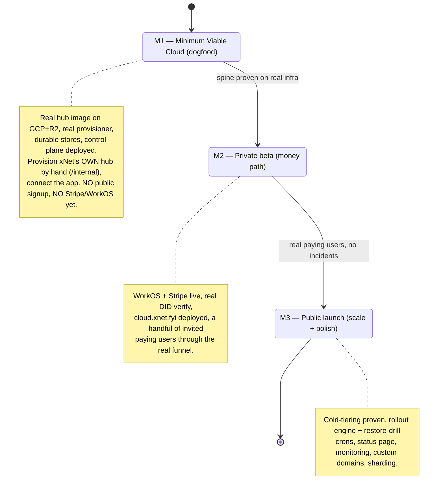
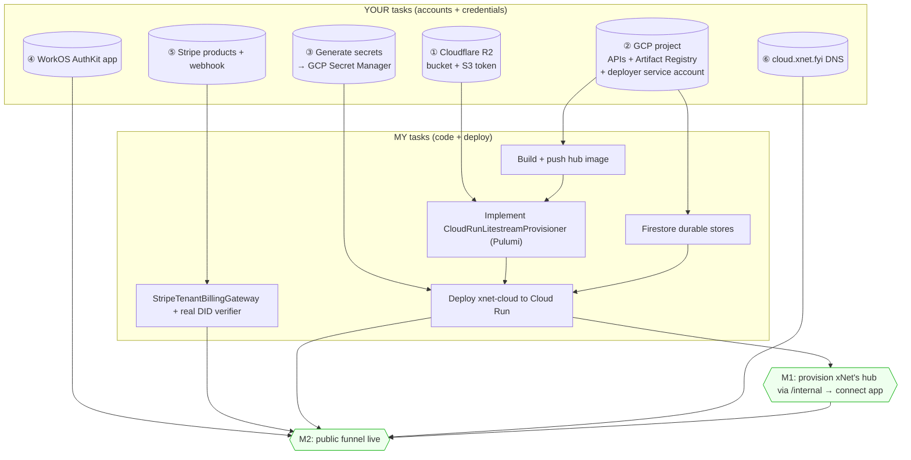
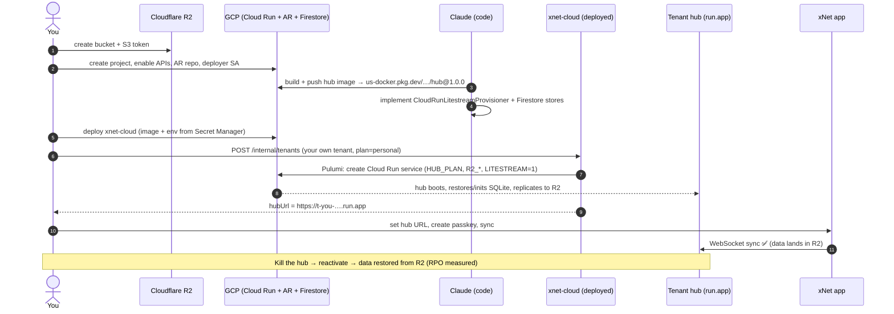

# xNet Cloud — The Path to Production: A Step-by-Step Runbook

## Problem Statement

xNet Cloud is **architecturally complete and code-incomplete** (0180): the brain,
the face (signup/dashboard/claim — 0192), and the operations spine
(SLIs/SLOs/rollouts/restore-drill — 0193) are all built and tested **against
in-memory fakes**. Nothing has ever provisioned a real hub on a real substrate,
because the parts that touch real money, real cloud APIs, and real users are
deliberately stubbed behind clean interfaces.

This document is the bridge from "tested logic + fakes" to "a stranger can pay
and get a hub." Its job is unusual for an exploration: it is a **runbook** that
splits the remaining work into **what you (the human) must provision** — the
accounts, credentials, and access I cannot and should not create — and **what I
(Claude) will then implement and deploy** with those credentials in hand. You
asked "what tools do you need?" — this answers it precisely, in dependency order.

## Executive Summary

**The division of labor is clean and non-negotiable on one point:** I will not
create cloud accounts, generate API keys, or enter your credentials — those are
yours to provision (it's also a hard safety boundary for me). You create the
accounts and drop credentials into a secret store / local `.env`; I write the
code that consumes them, the deploy scripts, and run them *with* you.

**There are exactly five external dependencies to provision** (Cloudflare R2,
GCP, WorkOS, Stripe, and DNS), and **four code gaps to close** (the Cloud Run
provisioner adapter, durable stores, a real Stripe gateway + DID verifier, and
the deploy itself). The standing cost of the minimum viable cloud is **≈ $0**:
R2, Cloud Run (scale-to-zero), Artifact Registry, and Firestore all have free
tiers or near-zero idle cost; WorkOS is free under 1M MAU; Stripe is per-txn.

**Sequence it as three milestones, smallest blast radius first:**



**Recommendation:** do **M1 first and resist everything else.** The single
highest-value, highest-risk unit of work is the `CloudRunLitestreamProvisioner` —
until one real hub boots on Cloud Run with Litestream→R2, nothing else about the
cloud is real. M1 needs only R2 + GCP (no WorkOS, no Stripe), because you can
provision by hand through the `/internal` API. Money and public signup (M2) come
*after* the spine is proven.

## Current State In The Repository

What's shipped, tested, and **waiting on credentials**:

- **Provisioner contract + sharding + fake** — [`packages/cloud/src/provisioner/types.ts`](packages/cloud/src/provisioner/types.ts),
  [`sharding.ts`](packages/cloud/src/provisioner/sharding.ts) (rolls to a new GCP
  project at 800 services, under the **1,000-service/project cap**), and a working
  `MemoryProvisioner`. The real adapter
  [`cloud-run-litestream.ts`](packages/cloud/src/provisioner/adapters/cloud-run-litestream.ts)
  is a skeleton: every method throws `NotImplementedError`, with a `TODO(0180):
  Pulumi Automation API` marker. Its config is already shaped:
  `{ projectPrefix, region, imageRepository, r2Bucket }`.
- **Control-plane lifecycle** — [`apps/cloud/src/control-plane.ts`](apps/cloud/src/control-plane.ts):
  provision/changePlan/upgrade/recover/demote/reactivate + the 0192/0193
  additions (provisionForBilling, suspend, delete, bindDataIdentity, listTenants).
- **The funnel + dashboard + claim** (0192) and **observability + rollout +
  restore-drill + reconcile** (0193) — all real logic, all driven by fakes.
- **The hub image** — [`packages/hub/Dockerfile`](packages/hub/Dockerfile) builds
  the hub, installs **Litestream pinned to v0.5.3** (v0.5.6/0.5.7 silent-replication
  bug), and [`litestream-entrypoint.sh`](packages/hub/litestream-entrypoint.sh)
  restores-on-boot then `replicate -exec`. **No registry push is configured.**
- **The hub reads a signed `HUB_PLAN`** locally ([`packages/hub/src/config.ts`](packages/hub/src/config.ts))
  and fingerprints `K_SERVICE`→Cloud Run — so a provisioned hub Just Works once
  the env is set.

The gaps (the deferred items from 0180/0192/0193), each now a concrete task:

| Gap | Where | Blocks |
|---|---|---|
| **Cloud Run provisioner unimplemented** | `cloud-run-litestream.ts` (throws) | *everything* — no real hub without it |
| **All stores in-memory** | `MemoryTenantStore` (`registry.ts`), `MemoryBindingStore`/`MemoryUsageLedger` (`packages/cloud`), `MemoryDeviceGrantStore`, `HealthSampleStore` | a restart forgets every tenant |
| **DID verification is a stub** | `devDidVerifier` ([`index.ts:44`](apps/cloud/src/index.ts)) only checks field presence | the non-custodial guarantee, server-side |
| **Control-plane billing gateway is a fake** | `FakeTenantBillingGateway` ([`billing-gateway.ts`](apps/cloud/src/billing-gateway.ts)) | real Stripe checkout/portal/webhook |
| **`dev-insecure-plan-secret`** | [`index.ts:68`](apps/cloud/src/index.ts) | forgeable entitlements — deploy-blocker |
| **No deploy** | `railway.toml` deploys only the demo hub; `xnet-cloud` is undeployed | the whole service |
| **Litestream download 404** | Dockerfile `wget` of the pinned binary has 404'd in CI | the hub image build (`build-and-smoke`) |

### Exact credentials/env the code already consumes

The runbook below maps 1:1 to what the code reads today:

- **WorkOS** ([`identity/workos.ts`](packages/cloud/src/identity/workos.ts), resolved in [`index.ts:34`](apps/cloud/src/index.ts)): `WORKOS_CLIENT_ID`, `WORKOS_API_KEY`, `WORKOS_REDIRECT_URI` (absent → in-memory fake).
- **R2** ([`litestream/config.ts`](packages/cloud/src/litestream/config.ts), injected into the hub): `R2_ACCESS_KEY_ID`, `R2_SECRET_ACCESS_KEY`, bucket + `https://<acct>.r2.cloudflarestorage.com` endpoint.
- **Stripe** ([`packages/billing/src/config.ts`](packages/billing/src/config.ts)): `STRIPE_SECRET_KEY`, `STRIPE_WEBHOOK_SECRET`, + per-plan price ids (`PRICE_BY_PLAN` in [`billing-gateway.ts`](apps/cloud/src/billing-gateway.ts)).
- **Control plane** ([`index.ts`](apps/cloud/src/index.ts)): `XNET_PLAN_SECRET`, `XNET_CLOUD_SESSION_SECRET`, `XNET_CLOUD_INTERNAL_SECRET`, `XNET_CLOUD_BASE_URL`, `XNET_CLOUD_MARKETING_URL`, `HUB_IMAGE_TAG`, `PORT`.
- **Provisioner adapter** config: `projectPrefix`, `region`, `imageRepository` (Artifact Registry path), `r2Bucket`.

## External Research

**Pulumi Automation API is the right provisioning engine.** It exposes the
Pulumi engine as a Node SDK — create/update/destroy infra programmatically from
the control plane, no CLI — with first-class `gcp.cloudrunv2.Service` support.
This matches the adapter's `TODO` exactly and keeps provisioning *in-process* and
testable with `pulumi.runtime.setMocks` before real credentials, then against a
live project.

**Cloudflare R2 is a few dashboard clicks.** Create a bucket; under
R2 → Manage API Tokens create an **Object Read & Write token scoped to that
bucket**; copy the Access Key ID + Secret (shown once); the endpoint is
`https://<ACCOUNT_ID>.r2.cloudflarestorage.com`. R2's S3 compatibility means
Litestream and the AWS SDK work unchanged — and **egress is free**, which is why
0177/0178 chose it.

**GCP least-privilege is well-trodden.** Use a **user-managed deployer service
account** (not the default Compute SA) with only the roles the control plane
needs: `run.admin` (create/upgrade tenant services), `artifactregistry.writer`
(push images) / `reader` (pull), `iam.serviceAccountUser` (act-as the runtime
SA), and `secretmanager.secretAccessor`. Each *tenant* hub runs as a minimal
runtime SA (secret-accessor only). **Cloud Run domain mapping doesn't support
wildcard certs** and needs broad project rights — so for the MVC, **use the
auto-assigned `*.run.app` URL as `hubUrl`** (zero DNS), and defer pretty
subdomains (`*.hub.xnet.fyi` via a load balancer + wildcard cert) to M3.

**WorkOS AuthKit and Stripe are standard SaaS setup.** WorkOS: create an AuthKit
application → Client ID + API key, register the Redirect URI
(`https://cloud.xnet.fyi/auth/callback`), free under ~1M MAU. Stripe: create
Products with recurring Prices (the `price_…` ids feed `PRICE_BY_PLAN`), grab the
secret key, and register a webhook endpoint (`/webhook`) subscribed to
`checkout.session.completed` + `customer.subscription.deleted` → the webhook
signing secret.

**Stateless Cloud Run needs external durable state.** The control plane scales to
zero, so its registry/bindings/ledger can't live in process memory or on local
disk. **Firestore** (serverless, scale-to-zero, generous free tier, no idle cost)
fits the "cheap + simple" ethos best; **Cloud SQL Postgres** is the SQL
alternative (~$8–10/mo smallest instance, always-on). Either satisfies the
existing `TenantStore`/`BindingStore`/`UsageLedger` interfaces.

Sources:
[Pulumi Automation API](https://www.pulumi.com/docs/iac/automation-api/getting-started-automation-api/),
[gcp.cloudrunv2.Service](https://www.pulumi.com/registry/packages/gcp/api-docs/cloudrunv2/service/),
[Cloudflare R2 tokens](https://developers.cloudflare.com/r2/api/tokens/),
[R2 S3 API](https://developers.cloudflare.com/r2/get-started/s3/),
[Cloud Run least-privilege](https://cloud.google.com/blog/products/identity-security/securing-cloud-run-deployments-with-least-privilege-access/),
[Cloud Run custom domains](https://docs.cloud.google.com/run/docs/mapping-custom-domains),
[A wildcard for Cloud Run](https://dev.to/googlecloud/a-wildcard-for-your-cloud-run-services-4haa).

## Key Findings

1. **The provisioner adapter is the keystone and the critical path.** Build it
   first; everything downstream (cold-tiering, rollouts, restore drills) is
   theory until one real hub boots.
2. **M1 needs only R2 + GCP.** Because you can provision by hand via `/internal`,
   the dogfood milestone needs *neither* WorkOS *nor* Stripe. This dramatically
   shrinks the first credential ask.
3. **Use `*.run.app` URLs to start.** Skipping custom DNS removes a whole class
   of setup (domain verification, wildcard certs, load balancers) from M1/M2.
4. **Durable state is mechanical but mandatory before any real tenant.** The
   interfaces exist; a Firestore (or Postgres) implementation is a drop-in. A
   control-plane restart currently forgets every tenant.
5. **The standing cost of M1 is ≈ $0.** Scale-to-zero compute + free-tier
   storage/identity means dogfooding costs almost nothing until there's traffic.
6. **Secrets must move to a real store and rotate.** `dev-insecure-plan-secret`
   et al. must become random values in GCP Secret Manager before deploy; a forged
   `HUB_PLAN` otherwise grants enterprise quotas to anyone.
7. **I can't create your accounts — and shouldn't.** Account creation and key
   generation are yours; I consume the results. This isn't a limitation to work
   around, it's the correct security boundary.

## Options And Tradeoffs

### Substrate: Cloud Run vs Fargate vs a single VM

- **Cloud Run + Litestream→R2** ✅ — scale-to-zero (cheap idle), the adapter is
  already shaped for it, 0175/0178 chose it. Cap: 1,000 services/project (sharded).
- **Fargate + Litestream→S3** — the second adapter (also stubbed); AWS-native,
  but no scale-to-zero parity and more moving parts. Defer to a later "BYOC" need.
- **One big multi-tenant VM** — cheapest to stand up, but throws away the
  per-tenant isolation that is the product. Rejected.

### Control-plane durable store: Firestore vs Cloud SQL vs SQLite+Litestream

- **Firestore** ✅ — serverless, scale-to-zero, free tier, no idle cost; matches
  the cheap ethos. New adapter, but the interfaces are tiny.
- **Cloud SQL Postgres** — familiar SQL, transactions, but ~$8–10/mo always-on
  and an instance to manage. Fine if you prefer SQL.
- **SQLite + Litestream (tenant-zero)** — elegant symmetry with the hubs, but
  awkward on stateless Cloud Run (no durable local disk); needs a sidecar/volume.
  Reserve for a single-VM control plane.

### Provisioning mechanism: Pulumi Automation API vs raw GCP SDK vs gcloud shell

- **Pulumi Automation API** ✅ — declarative, stateful (knows what exists),
  mockable in tests, matches the adapter `TODO`. Adds a dep + a Pulumi state
  backend (can be a GCS bucket — no Pulumi Cloud account needed).
- **Raw `@google-cloud/run` SDK** — fewer deps, but you hand-roll
  create-or-update/destroy idempotency that Pulumi gives free.
- **Shelling out to `gcloud`** — quickest hack, worst for testing/observability.
  Rejected beyond a one-off spike.

### First-deploy ownership: who runs the deploy?

- **You run it, I author it** ✅ — I write the deploy script / Pulumi program and
  the exact commands; you run them with your credentials (or paste them into a
  GitHub Actions secret + I wire the workflow). Keeps secrets in your hands.
- **GitHub Actions with Workload Identity Federation** — best long-term (no
  long-lived keys); slightly more setup. Recommended by M2.

## Recommendation

**Drive to M1 (Minimum Viable Cloud) on Cloud Run + R2 + Firestore, provisioning
xNet's own hub by hand — then stop and prove it before touching money.**

Concretely, the path and who owns each step:



### The M1 dogfood path, end to end



## Example Code

### The provisioner adapter, wired (sketch — replaces the `NotImplementedError`s)

```ts
// packages/cloud/src/provisioner/adapters/cloud-run-litestream.ts (sketch)
import { LocalWorkspace } from '@pulumi/pulumi/automation'

async provision(spec: ProvisionSpec): Promise<HubHandle> {
  const project = this.allocator.allocate()              // GCP 1000-svc/project cap
  const stack = await LocalWorkspace.createOrSelectStack({
    stackName: spec.tenantId, projectName: 'xnet-hub',
    program: async () => {
      const svc = new gcp.cloudrunv2.Service(spec.tenantId, {
        project, location: this.config.region,
        template: {
          containers: [{
            image: `${this.config.imageRepository}:${spec.targetVersion}`, // immutable, never :latest
            envs: toEnv({ ...spec.env, LITESTREAM: '1', R2_BUCKET: this.config.r2Bucket,
              ...(spec.restoreFromR2 ? { LITESTREAM_RESTORE: spec.restoreFromR2 } : {}) }),
          }],
          scaling: { minInstanceCount: spec.entitlements.isolation === 'dedicated-warm' ? 1 : 0 },
        },
      })
      return { url: svc.uri }
    },
  })
  const up = await stack.up()
  return { tenantId: spec.tenantId, hubUrl: up.outputs.url.value,
    substrateRef: `${project}/${spec.tenantId}`, region: this.config.region,
    targetVersion: spec.targetVersion, state: 'running' }
}
// upgrade/setEnv/sleep/destroy/get → stack.up() with new inputs / stack.destroy().
```

### A durable store is a drop-in for the existing interface

```ts
// apps/cloud/src/stores/firestore-tenant-store.ts (sketch)
export class FirestoreTenantStore implements TenantStore {       // same interface as MemoryTenantStore
  constructor(private col: CollectionReference) {}
  async get(id: string) { const d = await this.col.doc(id).get(); return d.exists ? (d.data() as TenantRecord) : null }
  async put(r: TenantRecord) { await this.col.doc(r.tenantId).set(r) }
  async list() { return (await this.col.get()).docs.map((d) => d.data() as TenantRecord) }
  async delete(id: string) { await this.col.doc(id).delete() }
}
```

### Generating the secrets you'll store (you run this)

```bash
# Three random secrets → paste into GCP Secret Manager (M1 step ③)
for name in XNET_PLAN_SECRET XNET_CLOUD_SESSION_SECRET XNET_CLOUD_INTERNAL_SECRET; do
  echo "$name=$(openssl rand -hex 32)"
done
```

## Risks And Open Questions

- **The control plane holding `run.admin` is powerful.** For M1 it's acceptable
  (one operator, your own project); by M3, isolate provisioning to a worker with
  a narrowly-scoped SA and audit every call.
- **Litestream operational maturity / the download 404.** Pin v0.5.3, mirror the
  binary into Artifact Registry or vendor it so the image build can't 404; measure
  RPO and cold-wake against the real deploy (never validated — 0180/0193).
- **Single-writer fence under failure.** `demoteIfCold`/`reactivate` assume the
  control plane is the only writer; exercise Litestream's S3 conditional-write
  lease before relying on cold-tiering with real data.
- **Pulumi state backend.** Use a GCS bucket as the Pulumi backend (no Pulumi
  Cloud account needed); back it up — losing it orphans tenant infra.
- **Secrets in my hands.** I should never receive raw secret *values*; the deploy
  reads them from Secret Manager at runtime. If a step seems to require me to
  handle a key directly, that's a smell — route it through the secret store.
- **Firestore vs SQL lock-in.** Firestore is cheapest but a NoSQL model; if the
  ledger/reporting later wants SQL joins, Cloud SQL may be the better long-term
  home. The interface boundary keeps this swappable.
- **GCP project quota for provisioning velocity.** New Cloud Run services and new
  projects (sharding) have rate limits; fine at dogfood scale, watch at launch.
- **Open question: GitHub Actions + Workload Identity Federation now or later?**
  Recommended by M2 to avoid long-lived SA keys; M1 can use a local key you hold.

## Implementation Checklist

### Milestone 1 — Minimum Viable Cloud (dogfood). Needs R2 + GCP only.

**YOUR tasks (accounts + credentials):**
- [ ] **Cloudflare R2:** create a bucket (e.g. `xnet-hub-data`); create an **Object Read & Write** S3 API token scoped to it; record `R2_ACCESS_KEY_ID`, `R2_SECRET_ACCESS_KEY`, the `https://<ACCOUNT_ID>.r2.cloudflarestorage.com` endpoint, and the bucket name.
- [ ] **GCP project:** create `xnet-cloud-0` (sharding prefix `xnet-cloud`); enable APIs: Cloud Run, Artifact Registry, Firestore, Secret Manager, IAM.
- [ ] **Artifact Registry:** create a Docker repo (e.g. `us-docker.pkg.dev/xnet-cloud-0/hub`).
- [ ] **Deployer service account:** create `xnet-deployer@…` with roles `run.admin`, `artifactregistry.writer`, `iam.serviceAccountUser`, `secretmanager.secretAccessor`, `datastore.user` (Firestore); generate a key JSON **or** prepare Workload Identity Federation, and hold it yourself.
- [ ] **Firestore:** create the database (Native mode) in your region.
- [ ] **Generate + store secrets** in Secret Manager: `XNET_PLAN_SECRET`, `XNET_CLOUD_SESSION_SECRET`, `XNET_CLOUD_INTERNAL_SECRET` (`openssl rand -hex 32` each), plus the R2 keys.
- [ ] Tell me the non-secret config: project id, region, Artifact Registry path, R2 bucket + endpoint.

**MY tasks (code + deploy):**
- [ ] Fix the hub Dockerfile Litestream v0.5.3 download and build the hub image; push to Artifact Registry as `hub@1.0.0`. _(Dockerfile fixed + `scripts/cloud-build-hub-image.sh` shipped in #166 — build-and-smoke is green; the build + push to AR is your operator step.)_
- [x] Implement `CloudRunLitestreamProvisioner` (provision/upgrade/setEnv/sleep/destroy/get) over a `CloudRunClient` port — built on the **direct Google Cloud SDK** (`@google-cloud/run`), not Pulumi (#168 port + `FakeCloudRunClient`; #175 `GoogleCloudRunClient` real wrapper, env-selected by `cloudRunProvisionerFromEnv`). Proven by fakes; needs a live smoke test at first deploy.
- [x] Implement Firestore durable stores for `TenantStore` + `BindingStore` and wire `buildControlPlane` to use them when `GCP_FIRESTORE_DATABASE` is set (#175: `DocStore` port → `InMemoryDocStore`/`FirestoreDocStore`). _Deferred:_ `UsageLedger`, `DeviceGrantStore`, and health samples stay in memory for now (losing them on restart costs a re-claim or a rebuilt window, not a tenant).
- [ ] Author the `xnet-cloud` Cloud Run deploy (its own image + service), reading env from Secret Manager; rotate off `dev-insecure-*`.
- [x] Provide the exact `gcloud` commands for you to bootstrap + deploy with your credentials (`docs/cloud/SETUP.md` + `scripts/cloud-gcp-bootstrap.sh`).

**Validation gate for M1:** provision your own tenant via `POST /internal/tenants`, get a `*.run.app` hub URL, connect the app, sync data, then kill + reactivate and confirm the data restores from R2.

### Milestone 2 — Private beta (the money path). Adds WorkOS + Stripe + DNS.

**YOUR tasks:**
- [ ] **WorkOS:** create an AuthKit application; record `WORKOS_CLIENT_ID` + `WORKOS_API_KEY`; register Redirect URI `https://cloud.xnet.fyi/auth/callback` (+ a dev URI).
- [ ] **Stripe:** create Products with recurring Prices for personal/family/team; record the `price_…` ids; record `STRIPE_SECRET_KEY`; create a webhook endpoint `https://cloud.xnet.fyi/webhook` subscribed to `checkout.session.completed` + `customer.subscription.deleted`; record `STRIPE_WEBHOOK_SECRET`. (Start in **test mode**.)
- [ ] **DNS:** point `cloud.xnet.fyi` at the control-plane Cloud Run service (domain mapping or load balancer); add all secrets/price-ids to Secret Manager.

**MY tasks:**
- [x] Implement `StripeTenantBillingGateway` (replace the fake) over a narrow Stripe client, keyed by the WorkOS `customerRef`; `PRICE_BY_PLAN` from `STRIPE_PRICE_*`; env-selected by `stripeGatewayFromEnv`, webhook signature verified via `webhooks.constructEvent` (#175).
- [ ] Replace `devDidVerifier` with real `@xnetjs/identity` passkey-challenge verification.
- [ ] Set `XNET_CLOUD_BASE_URL=https://cloud.xnet.fyi`, wire WorkOS + Stripe env; deploy. _(Env wiring is code-complete — `resolveBillingProvider`/`resolveBillingGateway` + store/provisioner selection are all env-driven (#175); the deploy is your operator step.)_
- [ ] Recommend/author GitHub Actions + Workload Identity Federation for keyless deploys.

**Validation gate for M2:** a hand-invited user completes the real funnel (WorkOS sign-in → Stripe test checkout → webhook → provision → claim → sync) with no manual steps.

### Milestone 3 — Public launch (scale + polish).

**YOUR tasks:**
- [ ] Stripe **live mode** keys; tax/business settings; a status-page host (or a static page on the existing site).
- [ ] DNS for pretty hub subdomains (`*.hub.xnet.fyi` via a load balancer + wildcard cert), if desired.
- [ ] Decide region(s) for residency + the second GCP project for sharding headroom.

**MY tasks:**
- [ ] Cron the rollout engine (canary→waves) and the nightly restore-verification drill; wire the health poller + `/internal/fleet/health` to alerting.
- [ ] Prove cold-tiering on real infra (RPO/wake measured); exercise the single-writer S3 lease (chaos test).
- [ ] Flip the public signup live on `xnet.fyi/cloud`; add the status page; tighten the provisioning SA to least-privilege.

## Validation Checklist

- [ ] A hub image `hub@1.0.0` exists in Artifact Registry and boots locally with `LITESTREAM=1` + R2 env, replicating to the bucket.
- [ ] `CloudRunLitestreamProvisioner.provision` creates a real Cloud Run service reachable at its `*.run.app` URL, with the signed `HUB_PLAN` enforced (a forged token is rejected).
- [ ] A control-plane restart preserves every tenant (Firestore stores proven).
- [ ] M1: xNet's own hub is provisioned via `/internal`, the app syncs to it, and a kill→reactivate round-trips data from R2 with measured RPO.
- [ ] M2: the full WorkOS→Stripe→provision→claim funnel works end-to-end in Stripe test mode for an invited user.
- [ ] No `dev-insecure-*` secret survives into the deployed environment; all secrets resolve from Secret Manager.
- [ ] I never received a raw secret value — every credential flowed through your accounts and Secret Manager.
- [ ] M3: a bad image is auto-rolled-back by the canary; the nightly restore drill passes; the status page reflects a real induced incident.

## References

- Predecessors: [0180 — Architecture & Completion Status](0180_[_]_XNET_CLOUD_ARCHITECTURE_AND_COMPLETION_STATUS.md), [0192 — Onboarding & UI Hosting](0192_[_]_XNET_CLOUD_ONBOARDING_AND_UI_HOSTING.md), [0193 — Operations: Uptime, Backups, Telemetry](0193_[_]_XNET_CLOUD_OPERATIONS_UPTIME_BACKUPS_AND_TELEMETRY.md)
- Lineage: [0175 — Fleet Deployment & AI Gateway](0175_[_]_MANAGED_HUB_FLEET_DEPLOYMENT_AND_AI_GATEWAY.md), [0177/0178 — SQLite Hosting & Cold Tiering](0178_[_]_COST_EFFICIENT_SQLITE_HOSTING_NO_LIBSQL_MIGRATION.md)
- Provisioner: [cloud-run-litestream.ts](packages/cloud/src/provisioner/adapters/cloud-run-litestream.ts), [sharding.ts](packages/cloud/src/provisioner/sharding.ts), [types.ts](packages/cloud/src/provisioner/types.ts)
- Control plane + env: [apps/cloud/src/index.ts](apps/cloud/src/index.ts), [control-plane.ts](apps/cloud/src/control-plane.ts), [registry.ts](apps/cloud/src/registry.ts), [billing-gateway.ts](apps/cloud/src/billing-gateway.ts)
- Hub image + R2: [packages/hub/Dockerfile](packages/hub/Dockerfile), [litestream-entrypoint.sh](packages/hub/litestream-entrypoint.sh), [packages/cloud/src/litestream/config.ts](packages/cloud/src/litestream/config.ts), [packages/hub/src/config.ts](packages/hub/src/config.ts)
- Identity + billing: [identity/workos.ts](packages/cloud/src/identity/workos.ts), [identity/binding.ts](packages/cloud/src/identity/binding.ts), [packages/billing/src/config.ts](packages/billing/src/config.ts)
- External: [Pulumi Automation API](https://www.pulumi.com/docs/iac/automation-api/getting-started-automation-api/), [gcp.cloudrunv2.Service](https://www.pulumi.com/registry/packages/gcp/api-docs/cloudrunv2/service/), [Cloudflare R2 tokens](https://developers.cloudflare.com/r2/api/tokens/), [Cloud Run least-privilege](https://cloud.google.com/blog/products/identity-security/securing-cloud-run-deployments-with-least-privilege-access/), [WorkOS AuthKit](https://workos.com/docs/authkit), [Stripe webhooks](https://stripe.com/docs/webhooks)
