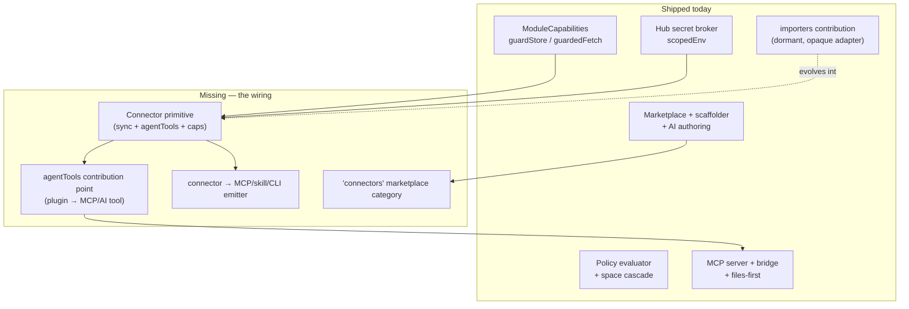
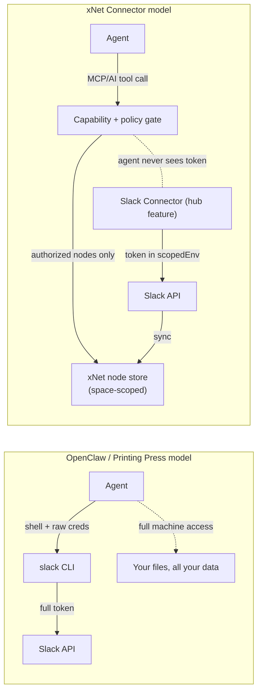
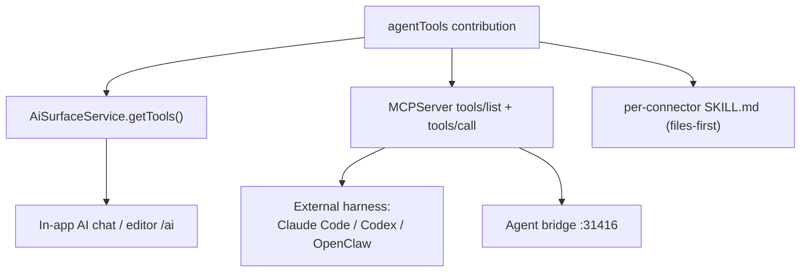
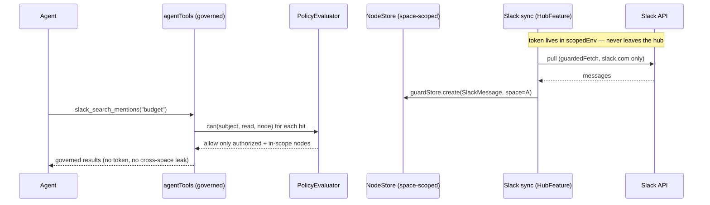
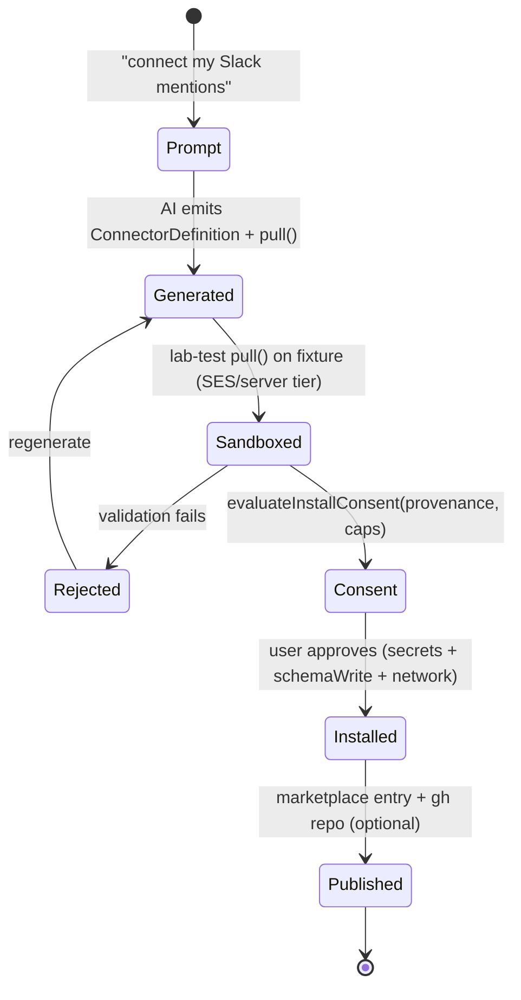

# Agent-Native Connectors: xNet As The Governed Integration Plane

## Problem Statement

> "I like how OpenClaw has centralized around building CLI tools that AI
> agents interact with (e.g. [printingpress.dev](https://printingpress.dev/)).
> What is the xNet equivalent? Maybe xNet just leverages those tools via the
> user's existing Claude Code harness. Or maybe xNet provides *more guardrails*
> than OpenClaw — instead of giving an agent full reign over your whole machine,
> xNet is the **staging area** for all this information and the **gatekeeping
> surface** that stops agents from cross-contaminating data or accessing data
> they're not supposed to. From a developer standpoint it should be really easy
> to build these integrations / plugins / CLIs for whatever they want — Google
> Cloud, Slack, anything — leveraging xNet's primitives (data model + plugin
> ecosystem), and to get them onto a marketplace of open-source integrations."

The market has converged on a powerful pattern: **agent-native CLIs**. Printing
Press turns any API/site into a token-efficient Go CLI + a Claude Code skill + an
OpenClaw skill + an MCP server, and ships 300+ of them through a community
library. The agent calls `slack search ...`, gets back terse text, done. It is
fast, it is composable, and it is *ungoverned*: the CLI runs with the user's
shell, the user's credentials, and the agent's full discretion. There is no
boundary between "the Slack data the agent should see" and "everything Slack
will hand over to a valid token."

xNet has a different center of gravity. It is not a shell; it is a **local-first,
schema-typed, authorization-aware data graph** with CRDT sync, spaces, a
capability-scoped plugin runtime, a secret broker, and an MCP server that already
exposes the workspace to agents. The question this exploration answers:

**What is the xNet-native shape of an "integration"? Is it a CLI we generate, a
plugin we install, or something else — and how do we make it trivial for a
developer to bring *any* external service (Slack, Google Cloud, GitHub, a niche
API) into xNet such that agents operate on a governed data plane instead of
holding raw credentials, and then publish it to a marketplace?**

The thesis: **xNet's equivalent of the Printing Press CLI is the *Connector* — a
FeatureModule subtype that syncs an external service into xNet nodes and exposes
agent-callable tools, where every read/write/secret/egress is gated by primitives
xNet already ships.** The agent never gets the Slack token; it gets
policy-evaluated nodes. And because xNet can *also* emit an MCP server / skill /
files-first checkout from the same definition, a Connector is simultaneously
governed-inside-xNet and portable to the user's own Claude Code/Codex/OpenClaw
harness. We don't pick "build our own" vs "ride the existing harness" — the
Connector is the seam that does both.

## Executive Summary

1. **The OpenClaw/Printing Press model is "agent + shell + raw creds." xNet's
   model is "agent + governed data plane."** That distinction *is* the product.
   Printing Press optimizes the *agent→service* hop for tokens; xNet inserts a
   **staging + gatekeeping layer** between them so the agent's blast radius is a
   set of authorization-checked nodes, not a credentialed shell. This is the one
   thing the CLI factories structurally cannot offer.

2. **xNet already has ~85% of the substrate — it is unintegrated, not unbuilt.**
   The capability guard (`guardStore`), network endowment (`guardedFetch`), hub
   secret broker (`scopedEnv`), schema-native policy evaluator, spaces cascade,
   the dormant `importers` contribution point, the MCP server (`xnet mcp serve`),
   the files-first exporter, the AI-authoring pipeline, the marketplace model,
   the scaffolder, and the labs sandbox ladder all exist today. A Connector is a
   **thin composition** of these, not new infrastructure.

3. **Define one primitive — the Connector — as a `FeatureModule` subtype.** It
   bundles: a server-side **sync adapter** (external API → xNet nodes, holding
   secrets in the hub broker), a set of **`agentTools`** (a new contribution
   point), and a **capability manifest** (`secrets` / `schemaWrite` / `schemaRead`
   / `network`). Trust tier follows provenance, exactly like Labs and plugins.

4. **The gatekeeping is enforced by composition, not new code.** Secrets are
   scoped by `scopedEnv` (the Slack connector cannot read the Google secret).
   Writes are scoped by `guardStore` (it can only write `slack/*` schemas). Egress
   is scoped by `guardedFetch` (it can only reach `slack.com`). Agent reads are
   scoped by the policy evaluator + space cascade (an agent in Space A never sees
   Space B's synced data). Cross-contamination is structurally prevented.

5. **Make authoring a one-prompt experience, like Printing Press — but the output
   is a governed Connector.** Extend the scaffolder with a `connector` template
   and the AI pipeline (`scriptToPluginManifest` → lab-test → consent → publish)
   so "describe the Slack integration you want" produces a capability-scoped,
   sandbox-tested, publishable Connector — and, from the *same* definition, an
   MCP server, a SKILL.md, and a files-first view for external harnesses.

6. **Interop both ways.** A Connector emits a portable MCP server/skill so the
   user's *own* Claude Code/Codex can use it (the agent-bridge path, 0194).
   Conversely, an existing Printing Press CLI can be *wrapped* as a Connector by
   running it through the labs server/command tier and mapping its output into
   nodes. xNet becomes the governance layer over the CLI ecosystem, not a
   competitor to it.

7. **Recommendation: the hybrid "governed Connector + portable emitter" (Option
   D).** Build the Connector primitive (capabilities + sync + `agentTools`) on the
   existing substrate, wire it into the MCP server and agent bridge, add a
   `connectors` marketplace category with a one-prompt AI authoring flow, and ship
   a `connector → {MCP, skill, files-first, CLI-wrap}` emitter for portability.
   Four phases, each inheriting 0192's capability/consent/provenance security.

## Current State In The Repository

xNet already has every layer the Connector needs. The work is wiring, not
greenfield. Mapped by responsibility:

### The data plane (the "staging area")

- **Schema-typed nodes.** `packages/data/src/schema/define.ts` (`defineSchema`),
  `packages/data/src/schema/node.ts` (every node has `id`, `schemaId`,
  `createdAt`, `createdBy: DID`). External data becomes typed nodes, not opaque
  blobs.
- **Event-sourced, CRDT-synced store.** `packages/data/src/store/store.ts`
  (`NodeStore`) — LWW conflict resolution, sparse updates, subscriptions, batch
  transactions, deterministic P2P import. A sync adapter writing into this store
  gets offline-first + multi-device sync for free.
- **Full-text search + universal views** ride the same store, so synced data is
  immediately searchable and renderable (the Printing Press "SQLite mirror"
  insight, but the mirror is a first-class, synced, queryable graph).

### The gatekeeping surface (what makes xNet ≠ OpenClaw)

- **Capability declaration.** `packages/plugins/src/feature-module.ts` —
  `ModuleCapabilities { secrets?, schemaWrite?, schemaRead?, network?, endowments? }`
  and `FeatureModule extends XNetExtension` with `hub?: { featureId }`.
- **Schema-write enforcement.** `packages/plugins/src/ecosystem/capability-guard.ts`
  — `guardStore(store, caps, pluginId)` wraps the store in a Proxy that throws
  `CapabilityError` on any `create/update/delete` outside the declared
  `schemaWrite` IRIs (supports exact, `Name@*`, prefix `*` patterns).
- **Network egress enforcement.** `packages/plugins/src/ecosystem/network-endowment.ts`
  — `guardedFetch(caps, pluginId, fetchImpl)` checks every request host against
  `caps.network`; no grant ⇒ no egress.
- **Secret scoping (hub).** `packages/hub/src/features/broker.ts` —
  `scopedEnv(env, allow)` + `isEnvKeyAllowed` project the env down to exactly the
  declared keys (`STRIPE_*` glob support). `packages/hub/src/features/registry.ts`
  `mountFeatures()` calls `feature.mount({ env: scopedEnv(env, feature.secrets) })`
  so the billing feature physically cannot read the GitHub secret. This is the
  pattern a Slack connector's token lives behind.
- **Per-node authorization.** `packages/data/src/auth/evaluator.ts`
  (`DefaultPolicyEvaluator.can/explain`), `packages/data/src/auth/store-auth.ts`
  (`StoreAuth`, `Grant`), schema-declared rules via
  `packages/data/src/auth/builders.ts` (`allow/deny/role`) and presets
  (`presets.private()`).
- **Space cascade.** `packages/data/src/schema/schemas/space-authorization.ts`
  (`spaceCascadeAuthorization`) + `space-membership.ts` — content inherits a
  Space's membership via the `parent` chain. This is how "agent in Space A can't
  read Space B's synced Slack messages" is enforced *for free* if synced nodes are
  space-scoped.

### The agent-facing surfaces (how an agent reaches the data)

- **MCP server.** `packages/plugins/src/services/mcp-server.ts` (`MCPServer`,
  `MCP_CORE_TOOL_NAMES = [xnet_search, xnet_read_page_markdown,
  xnet_plan_page_patch, xnet_apply_page_markdown, xnet_database_query]`), with
  deferred tools to keep token cost low — the same progressive-disclosure idea the
  industry is converging on.
- **Hardened HTTP transport.** `packages/plugins/src/services/mcp-http.ts`
  (`createMcpHttpServer`) — loopback-only, pairing token, Origin allowlist,
  Private Network Access preflight.
- **Write guardrail.** `packages/plugins/src/services/mcp-guardrail.ts`
  (`McpWriteGuardrail`) — risk classification (deletes/outward-facing ⇒
  needs-confirmation), a 120-writes/60s budget, and a provenance audit log.
- **Files-first checkout.** `packages/plugins/src/services/ai-workspace-exporter.ts`
  (`AiWorkspaceExporter`/`AiWorkspaceWatcher`) + `packages/plugins/src/ai-surface/skill.ts`
  (`XNET_AGENT_SKILL_MD`) + `packages/cli/src/commands/agent.ts` — checkout a
  scoped slice as Markdown/JSONL, edit, `xnet commit` to lift edits into validated
  mutation plans.
- **AI surface + sandboxed agent API.** `packages/plugins/src/ai-surface/service.ts`
  (`AiSurfaceService`), `packages/plugins/src/sandbox/agent-api.ts` (`AgentApi`:
  `proposeCreate/proposeUpdate` — writes are *proposals*, never direct mutations).
- **Agent bridge (0194).** `packages/devkit/src/bridge-server.ts`
  (`createBridgeServer` at `:31416`), `packages/devkit/src/chat-agent.ts`
  (`cliChatAgent` spawns the user's *own* `claude`/`codex` CLI — BYO-agent, zero
  model cost), `packages/cli/src/commands/bridge.ts` (`xnet bridge serve`). This is
  the "leverage the user's existing harness" path the prompt asks about.

### The ecosystem machinery (how integrations get built + shipped)

- **Contribution registry.** `packages/plugins/src/contributions.ts` — 18
  contribution points today (views, commands, slashCommands, editor,
  propertyHandlers, blocks, canvas*, **`importers`**…). `importers` is the
  closest existing thing to a Connector: `ImporterContribution { id, platform,
  version, adapter: unknown }` — structurally typed so the registry stays
  dependency-free. **There is no `agentTools` contribution point yet.**
- **Scaffolder.** `packages/plugins/src/ecosystem/scaffold.ts`
  (`scaffoldPlugin`, templates `client | two-sided | ai-script`) + the
  `xnet plugin scaffold` CLI.
- **AI authoring.** `packages/plugins/src/ecosystem/ai-authoring.ts`
  (`scriptToPluginManifest` — refuses unvalidated code, stamps `ai-generated`
  provenance) + `ai-pipeline.ts` (`runAiPluginPipeline` — generate → lab-test →
  consent → publish).
- **Trust + provenance.** `packages/labs/src/trust.ts` (`deriveTrustTier`),
  `packages/plugins/src/ecosystem/provenance.ts` (`failClosedVerifier`,
  Sigstore-ready), `packages/plugins/src/ecosystem/consent.ts`
  (`evaluateInstallConsent`).
- **Marketplace.** `packages/plugins/src/ecosystem/marketplace.ts`
  (`MarketplaceEntry { id, name, description, version, author, keywords, category,
  capabilities, manifestUrl, installs, stars, provenance }`, `MarketplaceClient`,
  search/sort/filter/recommend).
- **Labs sandbox ladder.** `packages/labs/src/runtime/ladder.ts` +
  `runtimes.ts` (SES / QuickJS / iframe / Pyodide / server tiers),
  `packages/labs/src/host.ts` (`createLabHostBridge` — permission-gated host tools
  injected as `xnet.*` endowments), `packages/labs/src/agent-tools.ts`
  (`createLabAgentTools`: `lab_run`, `lab_create`, …).

### The gap, precisely



Everything in "Shipped today" is real and cited above. Everything in "Missing" is
the subject of this exploration — and none of it is large.

## External Research

### Printing Press (printingpress.dev) — the reference design

- **One prompt → four artifacts:** a Go CLI, a Claude Code skill, an OpenClaw
  skill, and an MCP server. "Print an agent-native CLI for any API, app, or site."
- **Architectural opinions baked in:** local SQLite mirrors of remote data,
  compound "insight" commands (Discord-as-knowledge-base, Linear-as-behavior-
  observatory), offline search, output formats tuned for how models read tools.
- **Marketplace:** the *Printing Press Library* — 300+ community CLIs across 19
  categories, NPM-installable, agent-discoverable as skills, auto-updating from
  repo READMEs. A leaderboard rewards prolific authors.
- **Reverse-engineering:** no OpenAPI spec? It drives a browser, captures traffic,
  and synthesizes the spec.

The xNet-relevant insight: Printing Press's value is **opinionated, token-
efficient *shaping* of an external service for agent consumption** — plus a
thriving distribution channel. xNet should match the shaping/distribution DX and
*add* the governance layer.

### OpenClaw — the "agent + full machine" model

OpenClaw is a self-hosted gateway daemon wrapping an agent loop, wired to 12+
messaging channels (Slack, Discord, WhatsApp, iMessage…), with persistent memory,
a scheduler, and the ability to browse the web, run shell commands, read/write
files, and integrate MCP servers. It runs on the user's machine and keeps data
local. Its trust model is **the agent has the keys to your machine** — privacy by
locality, not by per-action authorization. This is exactly the model the prompt
wants xNet to *improve on* with guardrails.

### The MCP-vs-CLI token debate (and why it doesn't force a choice)

- Multiple 2026 analyses report **MCP using ~4–35× more tokens** than an
  equivalent CLI, with reliability degrading as tool count grows, *because* full
  tool schemas + protocol scaffolding fill the context window.
- **But the gap is closing through code execution + progressive disclosure.**
  Anthropic's *Code execution with MCP* reports a **150k → ~2k token** workflow
  (98.7% reduction) by presenting MCP servers as a *code API* the agent calls,
  loading only the tools it needs. Cloudflare's *Code Mode* collapses an entire
  API to `search()` + `execute()` (~1k tokens). Gateway-side schema filtering
  takes 43 tools from 44k → ~3k tokens.
- **Agent Skills + progressive disclosure** (Anthropic) is the same idea at the
  capability layer: metadata first, full `SKILL.md` only when relevant, code saved
  as reusable functions in `./skills/`.
- **Consensus: the future is hybrid.** CLI for personal/developer token-frugality;
  MCP for governance, auth, multi-tenancy, and audit trails — *"the price of
  admission for enterprise-grade tool orchestration."*

This validates xNet's position precisely. xNet **already** does progressive
disclosure (`MCP_CORE_TOOL_NAMES` + deferred tools), **already** has the
governance MCP gives you (auth, audit via `McpWriteGuardrail`, multi-tenant via
DID + spaces), and **already** has a files-first/code-execution surface
(`AiWorkspaceExporter`, sandboxed `AgentApi`). The Connector framework should
expose the **CLI-frugal** path (emit a skill/CLI) *and* the **governed-MCP** path
from one definition — landing exactly on the "hybrid" the market is converging on.

Sources:
- [Printing Press](https://printingpress.dev/) · [cli-printing-press](https://github.com/mvanhorn/cli-printing-press) · [printing-press-library](https://github.com/mvanhorn/printing-press-library)
- [OpenClaw](https://github.com/openclaw/openclaw) · [OpenClaw docs](https://docs.openclaw.ai/)
- [Anthropic: Code execution with MCP](https://www.anthropic.com/engineering/code-execution-with-mcp) · [Anthropic: Agent Skills](https://www.anthropic.com/engineering/equipping-agents-for-the-real-world-with-agent-skills)
- [Firecrawl: MCP vs CLI](https://www.firecrawl.dev/blog/mcp-vs-cli) · [MindStudio: 35x token overhead](https://www.mindstudio.ai/blog/mcp-vs-cli-agentic-workflows-token-overhead-reliability)

## Key Findings

1. **xNet's differentiator is the boundary, not the tool.** Printing Press and
   OpenClaw make the agent *more capable against a service*. xNet makes the agent
   *governed against your data*. The Connector is the artifact that turns "the
   agent can call Slack" into "the agent can read the Slack messages it's
   authorized to, in the space it's working in, and the token never leaves the
   broker."

2. **The `importers` contribution point is a Connector embryo.** It already models
   "a platform-specific adapter that brings external data in," kept structurally
   typed to avoid a dependency edge. A Connector is `importers` + agent tools +
   capabilities + a sync lifecycle. We should generalize it, not invent alongside
   it.

3. **There is no `agentTools` contribution point — and that's the single most
   important gap.** Today a plugin can contribute views/commands/blocks but cannot
   say "here is a tool the AI/MCP server should expose." 0194's extensibility-
   fabric exploration independently identified this exact seam. The Connector
   framework needs it, so build it as a shared primitive both consume.

4. **Three agent-reach surfaces already exist and should all light up from one
   Connector:** in-app AI (`AiSurfaceService`), MCP for external harnesses
   (`MCPServer`), and files-first checkout (`AiWorkspaceExporter`). A Connector's
   `agentTools` should register once and surface on all three — the same way a
   contribution surfaces in multiple views.

5. **The hub broker is the unsung hero of the gatekeeping story.** `scopedEnv`
   already guarantees secret isolation *between features*. Putting each Connector's
   credentials behind a `HubFeature` means the agent (and even the client plugin
   code) never sees the token — the connector's server side calls the external API
   and writes back nodes. This is the architectural answer to "agents shouldn't
   access data they're not supposed to."

6. **Provenance-derived trust already gives us the security ladder.** A first-party
   connector, an AI-generated one, and a marketplace one land at different trust
   tiers (`deriveTrustTier`) which gate sandbox tier and capability reprompts. The
   Connector inherits this with zero new policy.

7. **Interop is cheap because xNet already speaks the lingua franca.** xNet emits
   MCP (`createMcpHttpServer`) and a portable `SKILL.md` (`XNET_AGENT_SKILL_MD`)
   today. Emitting a per-Connector skill/MCP shim — and wrapping an external CLI
   via the labs `server`/command tier — is incremental, not foundational.

## Options And Tradeoffs

### Option A — Thin: ride the user's existing harness (BYO)

Do almost nothing new. Lean on the agent bridge (0194) + `xnet mcp serve`. Users
install Printing Press CLIs in their own Claude Code/OpenClaw; xNet exposes its
workspace as MCP tools and drives the agent.

- **Pros:** near-zero build; immediately compatible with the entire Printing Press
  library; honest about where the ecosystem energy is.
- **Cons:** **abandons the thesis.** The agent runs in the user's shell with full
  creds; xNet is just one more tool it can call. No staging, no gatekeeping, no
  cross-contamination protection. Integrations live outside xNet's data model, so
  they don't get sync/search/auth/spaces. No marketplace of *xNet* integrations.

### Option B — Thick: the governed Connector primitive

A new `FeatureModule` subtype: server-side **sync adapter** (secret-scoped
`HubFeature`) + **`agentTools`** + **capability manifest**. External data lands in
xNet nodes; agents operate through the policy-evaluated store.

- **Pros:** delivers the thesis exactly. Inherits sync/search/auth/spaces.
  Token-in-broker; node-level authorization; capability + egress guards. A real
  xNet marketplace category.
- **Cons:** more to build; a connector author must think in schemas; not directly
  compatible with the existing Printing Press CLI library unless we add a wrapper.

### Option C — CLI factory: clone Printing Press

Build an xNet generator that emits agent-native CLIs from an API spec.

- **Pros:** matches the proven DX; rides the token-efficiency narrative directly.
- **Cons:** competes on someone else's turf while ignoring xNet's actual edge (the
  governed data model). A standalone CLI doesn't get auth/spaces/sync. Best value
  is as a *complement* (an output format), not the core.

### Option D — Recommended hybrid: governed Connector + portable emitter

Build the Connector primitive (B) as the governed core, then add two adapters:
(1) the **agent bridge consumes Connectors as governed MCP tools** for the user's
own harness (so A is a *mode*, not a fork); and (2) a **`connector → {MCP server,
SKILL.md, files-first view, CLI wrap}` emitter** (so C is an *output*, not a
competitor). Plus one-prompt AI authoring and a `connectors` marketplace category.

- **Pros:** keeps the differentiator (governance) while being a good citizen of the
  CLI/MCP ecosystem. One definition, every surface. The user can run a Connector
  *inside* xNet's governed plane **or** export it to their own Claude Code — same
  artifact. Wraps existing Printing Press CLIs into the governed plane.
- **Cons:** the most moving parts; needs phasing to avoid a big-bang.

| Dimension | A: Thin/BYO | B: Connector | C: CLI factory | **D: Hybrid** |
|---|---|---|---|---|
| Delivers gatekeeping thesis | ✗ | ✓✓ | ✗ | ✓✓ |
| Reuses xNet primitives | partial | ✓✓ | ✗ | ✓✓ |
| Token-efficient agent path | ✓ | ✓ (progressive) | ✓✓ | ✓✓ |
| Interop w/ Printing Press / external harness | ✓✓ | ✗ | ✓ | ✓✓ |
| Build cost | tiny | medium | medium | medium-high (phased) |
| Marketplace of xNet integrations | ✗ | ✓✓ | ✓ | ✓✓ |

**Recommendation: Option D**, phased so Phase 1 already delivers a usable governed
Connector and each later phase adds reach.

### Why governance is the moat (the core contrast)



In the left model the agent's blast radius is the machine. In the right model it
is the set of nodes the policy evaluator returns for *this* subject in *this*
space. That is the whole pitch.

## Recommendation

Adopt **Option D**. Concretely:

### 1. The Connector primitive (`@xnetjs/plugins`)

A Connector is a `FeatureModule` whose `hub.featureId` points at a sync
`HubFeature` and which contributes `agentTools`. Define a `defineConnector` helper
that produces a `FeatureModule` plus a sync spec, so authors declare intent and
the framework wires the guards.

```ts
// packages/plugins/src/connectors/define-connector.ts  (NEW)
import { defineFeatureModule, type FeatureModule } from '../feature-module'

export interface ConnectorSyncSpec {
  /** Schema IRIs this connector materializes (must be a subset of capabilities.schemaWrite). */
  schemas: string[]
  /** Pull external data → xNet nodes. Runs hub-side with scoped secrets + guardedFetch. */
  pull(ctx: ConnectorSyncContext): Promise<ConnectorSyncResult>
  /** How often to re-sync (cron-ish). Optional; default manual + on-demand. */
  cadence?: 'manual' | 'hourly' | 'daily' | { everyMs: number }
}

export interface ConnectorAgentTool {
  name: string                       // e.g. 'slack_search_mentions'
  description: string                // shown to the model
  inputSchema: JsonSchema
  /** Pure over the governed store: receives the *policy-evaluated* store, never the raw token. */
  invoke(input: unknown, ctx: ConnectorToolContext): Promise<unknown>
  risk?: 'low' | 'medium' | 'high'   // feeds McpWriteGuardrail
}

export interface ConnectorDefinition {
  id: string                         // reverse-domain, e.g. 'dev.xnet.connector.slack'
  name: string
  capabilities: {                    // ModuleCapabilities — enforced, not advisory
    secrets: string[]                // e.g. ['SLACK_BOT_TOKEN'] — lives in the hub broker
    schemaWrite: string[]            // e.g. ['xnet://dev.xnet/SlackMessage@1.0.0']
    schemaRead?: string[]
    network: string[]                // e.g. ['slack.com', '.slack.com']
  }
  sync: ConnectorSyncSpec
  agentTools: ConnectorAgentTool[]
}

export function defineConnector(def: ConnectorDefinition): {
  module: FeatureModule
  sync: ConnectorSyncSpec
  tools: ConnectorAgentTool[]
} {
  const module = defineFeatureModule({
    id: def.id,
    name: def.name,
    capabilities: def.capabilities,
    hub: { featureId: `${def.id}.sync` },
    // registers def.agentTools at activation via the new `agentTools` contribution point
    contributes: { agentTools: def.agentTools },
  })
  return { module, sync: def.sync, tools: def.agentTools }
}
```

### 2. The `agentTools` contribution point (shared with 0194)

Add `agentTools` to `packages/plugins/src/contributions.ts` (a `TypedRegistry` like
the other 18). A registry sweep produces the MCP/AI tool list, so a Connector's
tools surface in the in-app AI, the MCP server, and the files-first skill — register
once, reach everywhere.



### 3. The sync adapter as a secret-scoped `HubFeature`

The connector's `sync.pull` runs hub-side inside a `HubFeature` whose `secrets`
allowlist is exactly `def.capabilities.secrets`. `mountFeatures()` already calls
`scopedEnv`, so the Slack connector's `pull` sees `SLACK_BOT_TOKEN` and nothing
else. It writes via a `guardStore`-wrapped store (can only touch its
`schemaWrite` IRIs) using a `guardedFetch` bound to its `network` allowlist.



### 4. One-prompt authoring (match Printing Press DX, governed output)

Extend `scaffoldPlugin` with a `connector` template and route the AI pipeline
(`scriptToPluginManifest` → lab sandbox test → `evaluateInstallConsent` → publish)
to produce Connectors. "Build me a Slack mentions connector" →
generated `ConnectorDefinition` → sandbox-run the `pull` against a fixture in the
labs `server`/SES tier → show the consent dialog (it wants `SLACK_BOT_TOKEN`, can
write `SlackMessage`, can reach `slack.com`) → publish to the marketplace +
`gh repo create` via `publishPluginRepo`.



### 5. The portability emitter (interop, not competition)

`emitConnectorArtifacts(def)` produces, from the same definition: an MCP server
shim (reusing `createMcpHttpServer`), a per-connector `SKILL.md` (extending the
`XNET_AGENT_SKILL_MD` pattern), a files-first view name, and — optionally — a thin
CLI. So a Connector is governed inside xNet *and* usable by the user's own Claude
Code via the agent bridge. To ingest the existing world, `wrapCliConnector` runs an
external Printing Press CLI via the labs `server`/command tier and maps its TSV/JSON
output into nodes — pulling 300+ existing CLIs into the governed plane.

## Example Code

A complete (illustrative) Slack connector and its hub sync feature:

```ts
// connectors/slack/index.ts
import { defineConnector } from '@xnetjs/plugins/connectors'
import { defineSchema, presets } from '@xnetjs/data'

const SlackMessage = defineSchema({
  authority: 'dev.xnet', name: 'SlackMessage', version: '1.0.0',
  authorization: presets.private(),          // space-scoped at sync time
  properties: (p) => ({
    channel: p.text(), author: p.text(), text: p.text(),
    ts: p.number(), permalink: p.url(), space: p.relation('Space'),
  }),
})

export default defineConnector({
  id: 'dev.xnet.connector.slack',
  name: 'Slack',
  capabilities: {
    secrets: ['SLACK_BOT_TOKEN'],            // hub broker only; agent never sees it
    schemaWrite: [SlackMessage.schema['@id']],
    network: ['slack.com', '.slack.com'],
  },
  sync: {
    schemas: [SlackMessage.schema['@id']],
    cadence: 'hourly',
    async pull({ env, fetch, store, space }) {
      // env is scopedEnv → only SLACK_BOT_TOKEN; fetch is guardedFetch → slack.com only
      const res = await fetch('https://slack.com/api/conversations.history', {
        headers: { authorization: `Bearer ${env.SLACK_BOT_TOKEN}` },
      })
      const { messages } = (await res.json()) as { messages: SlackRaw[] }
      // store is guardStore-wrapped → throws if we touch any non-SlackMessage schema
      for (const m of messages) {
        await store.create(SlackMessage.schema['@id'], {
          channel: m.channel, author: m.user, text: m.text,
          ts: Number(m.ts), permalink: m.permalink, space,   // ← space-scoped: no cross-contamination
        })
      }
      return { written: messages.length }
    },
  },
  agentTools: [
    {
      name: 'slack_search_mentions',
      description: 'Search synced Slack messages the current user is authorized to read.',
      inputSchema: { type: 'object', properties: { q: { type: 'string' } }, required: ['q'] },
      risk: 'low',
      async invoke({ q }: { q: string }, { store, subject }) {
        // store reads are policy-evaluated for `subject`; results are pre-filtered to
        // the nodes this agent/user may see in its current space.
        return store.search(q, { schema: SlackMessage.schema['@id'], subject })
      },
    },
  ],
})
```

```ts
// packages/hub/src/features/connectors/slack-sync.ts  (generated, secret-scoped)
import type { HubFeature } from '../types'

export const slackSyncFeature: HubFeature = {
  id: 'dev.xnet.connector.slack.sync',
  secrets: ['SLACK_BOT_TOKEN'],              // mountFeatures → scopedEnv guarantees isolation
  mount({ app, env, requireAuth, storage }) {
    app.post('/x/dev.xnet.connector.slack.sync/run', requireAuth, async (c) => {
      // env.SLACK_BOT_TOKEN present; env.HUB_GITHUB_WEBHOOK_SECRET absent (broker-scoped)
      const result = await runConnectorPull(/* def.sync */, { env, storage, subject: c.get('auth').did })
      return c.json(result)
    })
  },
}
```

## Risks And Open Questions

- **OAuth-per-user vs. single bot token.** The simple model (one
  `SLACK_BOT_TOKEN` in the hub) works for personal/self-hosted use. Multi-tenant
  cloud needs per-user OAuth — which is exactly the governance MCP analyses cite as
  MCP's advantage. Does the broker need a per-subject secret store, not just a
  per-feature env scope? (Likely yes for cloud; out of scope for v1.)
- **Sync write volume vs. the guardrail budget.** `McpWriteGuardrail` defaults to
  120 writes/60s on `localApi`. A bulk Slack backfill will blow past that. Sync
  writes must run on a *separate* surface/budget from agent-initiated writes (the
  guardrail already keys on surface — confirm the sync path uses a distinct one).
- **Space assignment at sync time is the crux of "no cross-contamination."** If a
  connector writes nodes without a `space`, or writes to the wrong space, the
  cascade can't protect them. The framework must *require* a target space (or an
  explicit "personal/unscoped" opt-in) and default to private.
- **Where does `pull` actually run on web-only deployments?** Hub-side needs a hub.
  Pure local-first (no hub) implies the sync runs in the Electron main process or a
  local daemon — which reopens the "secret on the user's box" question. Probably:
  hub-side when a hub is configured, local-daemon fallback otherwise, never in the
  browser.
- **Trust tier for AI-generated connectors that request secrets.** An
  `ai-generated` connector asking for `SLACK_BOT_TOKEN` + network egress is exactly
  the high-consent case. `evaluateInstallConsent` flags it, but should a secret-
  requesting connector be *blocked* from the `ai-generated` tier and require manual
  promotion? (Lean yes — secrets should never be granted on AI provenance alone.)
- **Token-efficiency of `agentTools` at scale.** If 30 connectors each register 5
  tools, the MCP `tools/list` balloons. Must inherit the deferred-tool /
  progressive-disclosure pattern (`MCP_CORE_TOOL_NAMES`) — connector tools default
  to deferred, surfaced on demand.
- **Overlap/sequencing with 0194.** The `agentTools` contribution point and the
  bridge-as-MCP-consumer are shared with the extensibility-fabric and agent-bridge
  explorations. Build `agentTools` once, in `@xnetjs/plugins`, and have all three
  consume it — don't fork.
- **Do we wrap the Printing Press library or curate our own?** Wrapping gives
  instant breadth but inherits ungoverned CLIs (the wrapper governs the *output*
  mapping, not the CLI's own egress). Curating is slower but cleaner. Probably
  offer wrapping as an explicit, clearly-labeled trust tier.

## Implementation Status

Implemented on `feat/agent-native-connectors-0196`. The governed-core +
portable-emitter (Option D) shipped as a package-layer vertical slice with tests;
genuinely app-side surfaces (a Connectors marketplace *view*, per-user OAuth) are
left as clearly-marked seams.

| Piece | Where | State |
|---|---|---|
| `agentTools` contribution point | `packages/plugins/src/agent-tools.ts`, `contributions.ts`, `context.ts`, `registry.ts`, `manifest.ts` | ✅ shipped + tested |
| AI-surface merge point (`extraTools`) | `packages/plugins/src/ai-surface/{types,service}.ts` | ✅ shipped + tested |
| MCP `agentTools` (deferred) | `packages/plugins/src/services/mcp-server.ts` | ✅ shipped + tested |
| `connector` write surface | `packages/abuse/src/types.ts`, `mcp-guardrail.ts` (`createConnectorWriteGuardrail`) | ✅ shipped + tested |
| Connector primitive | `packages/plugins/src/connectors/define-connector.ts` | ✅ shipped + tested |
| Governed sync runner | `packages/plugins/src/connectors/sync-runner.ts` | ✅ shipped + tested |
| Hub sync feature | `packages/hub/src/features/connectors.ts` | ✅ shipped + tested |
| Scaffold template + CLI | `ecosystem/scaffold.ts`, `packages/cli/src/commands/connector.ts` | ✅ shipped + tested |
| Emitter / marketplace / importer bridge | `packages/plugins/src/connectors/artifacts.ts` | ✅ shipped + tested |
| AI-install secret gate | `packages/plugins/src/connectors/install-gate.ts` | ✅ shipped + tested |
| `wrapCliConnector` | `packages/plugins/src/connectors/cli-wrap.ts` | ✅ shipped + tested |
| Bridge advertises connector tools | via `xnet mcp serve` (`agentTools` config) | ◐ seam — see note |
| Connectors marketplace **view** | app-side | ⬜ deferred (data layer + category shipped) |
| Per-user OAuth (multi-tenant secrets) | hub broker | ⬜ deferred (single bot-token model shipped) |

**Bridge note:** connector tools reach the user's own harness (Claude Code /
Codex / OpenClaw) through `xnet mcp serve`, whose `MCPServer` already carries the
`agentTools` config — the agent the bridge spawns connects to that MCP server for
its tools. No bridge-server change was needed; advertising is the MCP server's
job, not the chat proxy's.

## Implementation Checklist

- [x] Add an `agentTools` contribution point to
  `packages/plugins/src/contributions.ts` (`TypedRegistry`, `Disposable` cleanup) —
  shipped as `packages/plugins/src/agent-tools.ts` (`AgentToolContribution`).
- [x] Wire `agentTools` into `AiSurfaceService.getTools()` via the `extraTools`
  merge point (`packages/plugins/src/ai-surface/service.ts`).
- [x] Wire `agentTools` into `MCPServer` `tools/list` + `tools/call`, defaulting
  connector tools to *deferred* (progressive disclosure).
- [x] Route connector tool writes through `McpWriteGuardrail` with a `connector`
  surface distinct from `localApi` (`createConnectorWriteGuardrail`).
- [x] Create `packages/plugins/src/connectors/define-connector.ts` (`defineConnector`,
  `ConnectorDefinition`, `ConnectorSyncSpec`, `ConnectorAgentTool`).
- [x] Generalize the dormant `importers` contribution — `connectorAsImporter`
  exposes a connector's sync as an `ImporterContribution` adapter.
- [x] Build the hub sync runner: `runConnectorSync` (guardStore + guardedFetch +
  budget + space-stamp) + the generic `connectorSyncFeature` `HubFeature` that
  applies `scopedEnv` via `mountFeatures`.
- [x] Enforce a **required target space** on sync writes (opt out via
  `allowUnscoped`) to guarantee cascade protection.
- [x] Add a `connector` template to `ecosystem/scaffold.ts` + `xnet connector
  scaffold <id>`.
- [x] AI authoring: `evaluateConnectorInstall` blocks secret-requesting
  connectors from auto-trust on `ai-generated` provenance (manual promotion); the
  `connector` scaffold template is the AI's authoring target.
- [x] Implement `emitConnectorArtifacts(def)` → tool descriptors (MCP
  advertisement) + per-connector `SKILL.md` fragment + marketplace entry.
- [x] Implement `wrapCliConnector` to run an external CLI (injected `runCli`
  port) and map output → space-stamped nodes (Printing Press interop; egress
  caveat documented).
- [x] Add a `connectors` category (`CONNECTOR_CATEGORY`) +
  `connectorMarketplaceEntry`; a Connectors marketplace **view** is deferred
  (app-side).
- [◐] Agent bridge advertises connector tools — satisfied via `xnet mcp serve`
  (the `agentTools` config); no bridge-server change required (see status note).

## Validation Checklist

- [x] **Secret isolation:** `connectorSyncFeature` test asserts the sync sees
  `SLACK_BOT_TOKEN` but not `HUB_GITHUB_WEBHOOK_SECRET` (`scopedEnv`); the
  `agentTools` invoke surface never receives `env`.
- [x] **Schema-write containment:** a connector writing a schema outside
  `schemaWrite` throws `CapabilityError` (`connectors.test.ts`).
- [x] **Egress containment:** `guardedFetch` rejects a non-allowlisted host
  before the request leaves (`connectors.test.ts`).
- [x] **No cross-space leak:** the runner stamps the target space and refuses a
  write pointed at a different space (`connectors.test.ts`). *(Full
  evaluator-cascade read-filtering is covered by the existing auth suite.)*
- [x] **Consent surfacing / AI gate:** `evaluateConnectorInstall` blocks a
  secret-holding `ai-generated` connector and allows authored/marketplace
  (`connectors-artifacts.test.ts`).
- [x] **Progressive disclosure:** a contributed tool is listed as a *deferred*
  MCP tool and still invokes (`agent-tools.test.ts`).
- [x] **Portability emitter:** `emitConnectorArtifacts` yields tool descriptors +
  a SKILL.md fragment naming the tools (`connectors-artifacts.test.ts`).
  *(Live round-trip through a spawned `claude` CLI is manual.)*
- [x] **CLI wrap:** `wrapCliConnector` runs the injected CLI and materializes its
  output as space-stamped nodes (`connectors-artifacts.test.ts`).
- [◐] **End-to-end:** scaffold → define → sync → gate are each tested in
  isolation; a single one-prompt→install→query integration test is deferred (it
  needs the app-side install flow + a live store).

## References

### Internal (code as it exists today)

- Capabilities + guards: [feature-module.ts](packages/plugins/src/feature-module.ts), [capability-guard.ts](packages/plugins/src/ecosystem/capability-guard.ts), [network-endowment.ts](packages/plugins/src/ecosystem/network-endowment.ts)
- Hub secret broker: [broker.ts](packages/hub/src/features/broker.ts), [registry.ts](packages/hub/src/features/registry.ts), [types.ts](packages/hub/src/features/types.ts)
- Authorization: [evaluator.ts](packages/data/src/auth/evaluator.ts), [store-auth.ts](packages/data/src/auth/store-auth.ts), [builders.ts](packages/data/src/auth/builders.ts), [space-authorization.ts](packages/data/src/schema/schemas/space-authorization.ts)
- Data plane: [store.ts](packages/data/src/store/store.ts), [define.ts](packages/data/src/schema/define.ts), [node.ts](packages/data/src/schema/node.ts)
- Agent surfaces: [mcp-server.ts](packages/plugins/src/services/mcp-server.ts), [mcp-http.ts](packages/plugins/src/services/mcp-http.ts), [mcp-guardrail.ts](packages/plugins/src/services/mcp-guardrail.ts), [ai-workspace-exporter.ts](packages/plugins/src/services/ai-workspace-exporter.ts), [ai-surface/service.ts](packages/plugins/src/ai-surface/service.ts), [ai-surface/skill.ts](packages/plugins/src/ai-surface/skill.ts), [sandbox/agent-api.ts](packages/plugins/src/sandbox/agent-api.ts)
- Agent bridge: [bridge-server.ts](packages/devkit/src/bridge-server.ts), [chat-agent.ts](packages/devkit/src/chat-agent.ts), [cli/commands/bridge.ts](packages/cli/src/commands/bridge.ts)
- Ecosystem machinery: [contributions.ts](packages/plugins/src/contributions.ts), [scaffold.ts](packages/plugins/src/ecosystem/scaffold.ts), [ai-authoring.ts](packages/plugins/src/ecosystem/ai-authoring.ts), [ai-pipeline.ts](packages/plugins/src/ecosystem/ai-pipeline.ts), [marketplace.ts](packages/plugins/src/ecosystem/marketplace.ts), [provenance.ts](packages/plugins/src/ecosystem/provenance.ts), [consent.ts](packages/plugins/src/ecosystem/consent.ts)
- Labs runtime + trust: [runtime/ladder.ts](packages/labs/src/runtime/ladder.ts), [host.ts](packages/labs/src/host.ts), [agent-tools.ts](packages/labs/src/agent-tools.ts), [trust.ts](packages/labs/src/trust.ts)
- Related explorations: `0194_[_]_AGENT_BRIDGE_CLAUDE_CODE_CODEX_AND_ANY_AGENT_IN_XNET.md`, `0194_[_]_EXTENSIBILITY_FABRIC_PLUGINS_LABS_AI_EDITOR.md`, `0192_[_]_PLUGIN_ECOSYSTEM_MARKETPLACE_DX_AND_TRUST.md`, `0189_[_]_EVERYTHING_AS_PLUGINS_FEATURE_MODULE_PLATFORM.md`

### External

- [Printing Press](https://printingpress.dev/) — agent-native CLI factory + library
- [cli-printing-press](https://github.com/mvanhorn/cli-printing-press) · [printing-press-library](https://github.com/mvanhorn/printing-press-library)
- [OpenClaw](https://github.com/openclaw/openclaw) · [docs](https://docs.openclaw.ai/) — self-hosted always-on agent gateway
- [Anthropic — Code execution with MCP](https://www.anthropic.com/engineering/code-execution-with-mcp) (150k→2k tokens)
- [Anthropic — Agent Skills & progressive disclosure](https://www.anthropic.com/engineering/equipping-agents-for-the-real-world-with-agent-skills)
- [Firecrawl — MCP vs CLI](https://www.firecrawl.dev/blog/mcp-vs-cli) · [MindStudio — 35× token overhead, 72% vs 100% reliability](https://www.mindstudio.ai/blog/mcp-vs-cli-agentic-workflows-token-overhead-reliability)
- [Cloudflare Code Mode](https://blog.cloudflare.com/code-mode/) — API → `search()` + `execute()`
