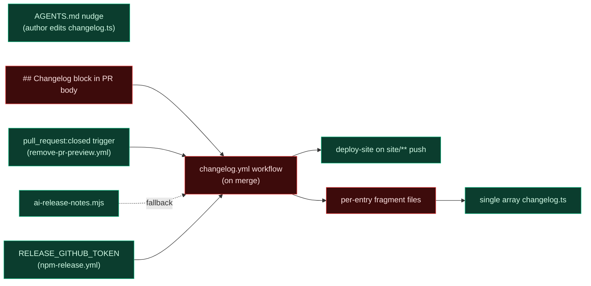
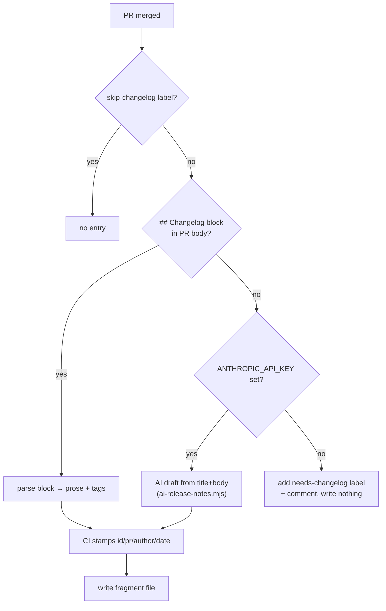
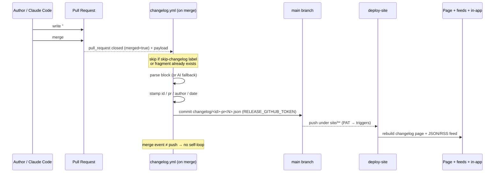
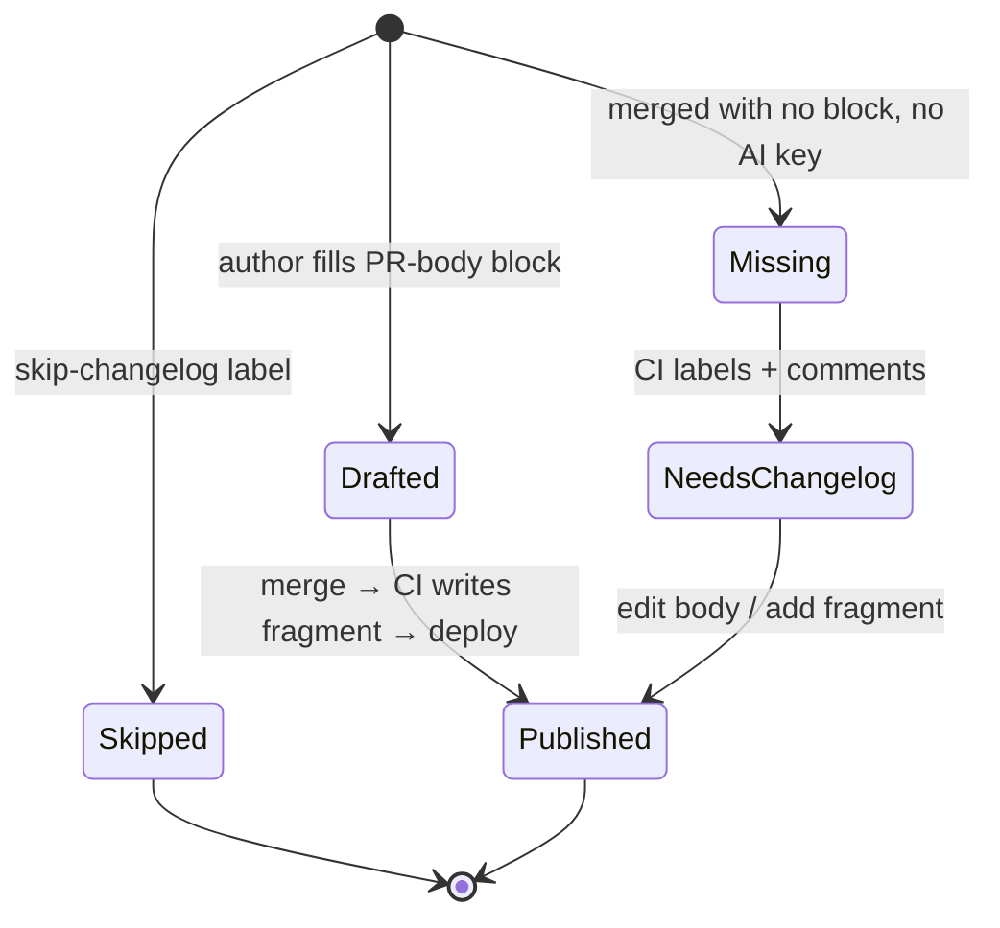

# Automated Changelog Updates On PR Merge

> **Revision (post-implementation).** The original design here — a workflow that
> writes the entry and **commits it to `main` on merge** — proved unworkable
> against the branch ruleset: the bot's push to protected `main` is rejected
> ("changes must be made through a pull request"), and the token-free escapes
> (bot PR, Actions bypass) each had fatal flaws (a `GITHUB_TOKEN`-created PR
> doesn't trigger CI; a bypass loosens `main`). The shipped design instead
> **never writes to `main`**: the author commits a changelog **fragment**
> (`site/src/data/changelog/<id>.json`) as part of the PR — Changesets-style — so
> it lands with the merge. A required `changelog-section` check enforces it, and
> `deploy-site` fills in the PR number from git history at build time (so authors
> don't need a second commit). See the "Author-commits-the-fragment" path below;
> the on-merge writer was removed.

## Problem Statement

The changelog (`site/src/data/changelog.ts`, exploration 0195) is a **hand-edited
TypeScript array**. The only thing that keeps it current is a standing
instruction in `AGENTS.md` telling whoever (or whatever) authors a PR to prepend
an entry. That is best-effort and unenforced, so:

- Any PR merged **without** the author editing `changelog.ts` silently skips the
  changelog. Several recently-merged PRs did exactly this — the page lags reality.
- There is **no CI step** that touches the changelog. Nothing reconciles a merge
  with a changelog entry.
- The auto-image gallery (exploration 0196) pulls screenshots from CI, but the
  **entry itself** (title, summary, highlights, tags, date, PR number) is still
  100% manual.

The ask: make the changelog update **automatically, as part of CI/CD, exactly
once when a PR is merged** — so merging is the only action required.

## Executive Summary



1. **The fix is a single new workflow** triggered on `pull_request: closed` +
   `merged == true` — the exact pattern `remove-pr-preview.yml` already uses.
   It fires once per merge and carries the full PR payload (title, body, author,
   labels, merge date).

2. **Source the entry from a `## Changelog` block in the PR description.** The
   author (human or Claude Code agent) writes the user-facing prose where they
   already write everything else — the PR body — prompted by the PR template.
   CI parses that block on merge. This keeps quality high and matches the repo's
   existing "Docs & site sync" PR-template discipline.

3. **CI stamps the authoritative metadata** — `id` (the merge date), `pr` (the
   number), `author` (the login) — from the event payload, so they can't be
   wrong. The author only supplies the prose.

4. **Store entries as per-entry fragment files**, not array edits. Refactor
   `changelog.ts` to load `site/src/data/changelog/*.json`. Each merge drops one
   new file — atomic, no TS-array surgery, and **no merge conflicts** between
   concurrent PRs (the Changesets/Towncrier insight).

5. **Commit back with `RELEASE_GITHUB_TOKEN`** (already a repo secret), not the
   default `GITHUB_TOKEN`. This is load-bearing: commits pushed with
   `GITHUB_TOKEN` **do not trigger downstream workflows**, so `deploy-site` would
   never fire. A PAT (or GitHub App token) makes the changelog commit republish
   the site + JSON/RSS feed + in-app "What's New".

6. **No loop, by construction.** The workflow triggers on the *merge event*, not
   on *push*, so the bot's own commit to `main` cannot re-trigger it.

7. **AI fallback + escape hatch.** If a PR has no `## Changelog` block, optionally
   draft one with `scripts/changelog/ai-release-notes.mjs` (guarded on
   `ANTHROPIC_API_KEY`); a `skip-changelog` label opts a PR out entirely.

## Current State In The Repository

### The changelog is manual

- `site/src/data/changelog.ts` — one exported `entries: ChangelogEntry[]` array,
  newest-first. Every changelog change edits this shared file.
- `AGENTS.md` (the "Changelog Entries" section added in 0195) instructs the agent
  to prepend an entry for user-facing changes. **This is the only automation, and
  it's a soft instruction to the author, not a CI step.**
- `site/scripts/validate-changelog.ts` — build-time gate; imports the array.
- `site/src/pages/changelog/index.astro` + `changelog.json.ts` + `changelog.xml.ts`
  + `site/src/lib/changelog-feed.ts` — all import `entries`.
- `apps/web/src/whats-new/feed.ts` — the in-app surface reads the published
  `changelog.json` at runtime (not the TS array).

### The CI building blocks already exist

| Building block | File | What it gives us |
|---|---|---|
| Merge trigger | `.github/workflows/remove-pr-preview.yml` | `on: pull_request: types: [closed]` + own-repo guard + `github-script` reading PR metadata + sticky comments |
| Commit-back token | `.github/workflows/npm-release.yml:38` | `RELEASE_GITHUB_TOKEN \|\| GITHUB_TOKEN`, `commitMode: github-api` — proves a PAT secret exists for writing to the repo |
| Site redeploy | `.github/workflows/deploy-site.yml` | `on: push: branches:[main], paths:['site/**']` — a commit under `site/` auto-rebuilds the page + feeds |
| AI drafting | `scripts/changelog/ai-release-notes.mjs` | fail-open Claude call (Haiku) that turns raw text into user-facing prose |
| AI secret | `.github/workflows/electron-release.yml` | `ANTHROPIC_API_KEY` already wired into a workflow |
| PR template | `.github/pull_request_template.md` | already has `## What`, `## Verification`, `## Docs & site sync` — a `## Changelog` section slots right in |
| Durable visuals | `visuals/pr/<N>/diff-manifest.json` (0196) | the gallery auto-fills from the `pr` number — so the entry only needs prose + tags |

The pieces are all here; what's missing is the workflow that connects "a PR
merged" to "a changelog entry exists."

## External Research

(Full findings + sources in the References section.)

- **`pull_request: closed` + `if: merged == true` is the right trigger** for
  "exactly once on merge," and gives the PR payload directly. Caveat: GitHub has
  had incidents where the `closed` event doesn't fire; mitigate with
  **idempotency** (skip if an entry for PR #N already exists). `on: push` to main
  is more reliable to *fire* but loses the payload (needs a
  `listPullRequestsAssociatedWithCommit` API call) and is fragile with squash
  merges + `paths` filters.
- **`GITHUB_TOKEN` pushes do not trigger downstream workflows** — the single most
  important gotcha. A changelog commit made with `GITHUB_TOKEN` would never fire
  `deploy-site`. Use a PAT (`RELEASE_GITHUB_TOKEN`) or a GitHub App token.
- **`pull_request_target` is a trap** ("pwn requests"). Don't use it. The
  own-repo guard (`head.repo.full_name == github.repository`) plus a post-merge
  trigger is the safe pattern; fork PRs simply update the changelog after merge.
- **Fragment-files beat a shared file** for concurrent PRs. Changesets
  (`.changeset/*.md`), Towncrier (`changelog.d/`), and scriv all converge on
  "one file per change" to avoid merge-conflict hell. Random/unique filenames
  mean two PRs never collide.
- **Content sourcing**: a structured PR-body section is the best
  quality/friction trade; PR-title+labels (release-drafter) is low quality; an
  LLM reading the diff is zero-friction but risks "confident vagueness" (plausible
  but wrong/too-vague entries) and adds an API-failure surface. Constrain the LLM
  and treat its output as a draft.
- **Enforcement**: Changesets' own maintainers advise a *soft* prompt (a bot
  comment) over a hard `changeset status` CI gate, with a `skip-changelog`-style
  label escape. Hard gates breed meaningless "Updated." entries.
- **Auto-commit actions**: `stefanzweifel/git-auto-commit-action` (simple, but no
  `git pull` → races), `EndBug/add-and-commit` (more control),
  `peter-evans/create-pull-request` (bot PR instead of direct push — satisfies
  branch protection cleanly).
- **CI owns merge metadata**: PR number, merge date, and author should come from
  the `github` event context, never be guessed by the author.

## Key Findings

1. **The gap is purely the missing workflow.** Trigger, token, redeploy, AI
   script, and PR template all already exist in this repo.
2. **Trigger on the merge event, not on push** — it carries the payload and
   cannot self-loop (the bot's push to `main` isn't a merge event).
3. **A PAT is mandatory** for the commit-back, or `deploy-site` won't fire.
4. **Editing the TS array from CI is the wrong move** — fragile to parse, and it
   merge-conflicts across in-flight PRs. Refactor to fragment files first.
5. **The loader must be plain `node:fs`, not `import.meta.glob`** —
   `changelog.ts` is consumed by `tsx` (the validate script) and by Astro SSR
   endpoints, and `import.meta.glob` only exists under Vite. `fs.readdirSync` at
   build/SSR time works for every consumer (none are client-side).
6. **The author writes prose; CI writes facts.** A `## Changelog` block is the
   author's only job; everything structural is stamped by CI.
7. **The image gallery already auto-fills from `pr`** (0196), so an entry needs
   only prose + tags to become rich.

## Options And Tradeoffs

### Decision 1 — Where does the entry content come from?



| Source | Quality | Friction | Failure mode |
|---|---|---|---|
| **PR-body `## Changelog` block** (recommended) | High | Low (already writing the body) | Author leaves it blank → AI fallback / `needs-changelog` |
| PR title + labels | Low | Zero | Titles are dev-facing (`fix(schema): …`) |
| LLM from diff | Medium | Zero | Confident vagueness; API outage; describes reverted code |

Recommendation: **block-first, AI-fallback**. The block is the high-quality path;
the AI fallback guarantees coverage so nothing slips through; the label is the
escape hatch.

### Decision 2 — How are entries stored?

| Approach | Concurrency-safe | CI write complexity | Migration |
|---|---|---|---|
| Append to `entries[]` array | ❌ races + conflicts | High (AST/regex insert) | none |
| **Per-entry fragment files** (recommended) | ✅ unique filenames | Low (write one JSON) | one-time: split the array into files |

Fragment files (`site/src/data/changelog/<id>-pr<N>.json`) are the keystone:
each merge writes a brand-new file, so two PRs merging minutes apart never touch
the same path. `changelog.ts` becomes a thin loader.

### Decision 3 — How does the commit land on `main`?

| Approach | Branch-protection fit | Triggers deploy-site | Notes |
|---|---|---|---|
| **Direct push, `RELEASE_GITHUB_TOKEN`** (recommended) | needs admin/ruleset bypass | ✅ (PAT) | simplest; this repo already admin-merges |
| Bot PR (`peter-evans/create-pull-request`) | ✅ clean | ✅ on the bot-PR merge | adds a second merge cycle; human can review |
| Direct push, `GITHUB_TOKEN` | needs bypass | ❌ **deploy never fires** | disqualified |

### Decision 4 — Trigger

`pull_request: closed` (+ `merged`, + own-repo) gives the payload and can't
self-loop. `on: push` is more reliable to fire but needs an API round-trip for
metadata and is squash-fragile. Recommendation: **`pull_request: closed`**, with
idempotency as the reliability hedge.

## Recommendation

**Author-drafts-in-PR-body → CI-assembles-on-merge → fragment files.** Phased:

### Phase 1 — Refactor storage to fragment files (no behaviour change)
Split the `entries[]` array into `site/src/data/changelog/<id>-pr<N>.json` files
and make `changelog.ts` load + sort them via `node:fs`. Update
`validate-changelog.ts` to validate every fragment. Ship this alone first so the
data layer is ready and nothing visible changes.

### Phase 2 — The merge workflow
Add `.github/workflows/changelog.yml`:
- `on: pull_request: types: [closed]`, `if: merged == true && head.repo own-repo
  && !contains(labels, 'skip-changelog')`.
- `concurrency: { group: changelog, cancel-in-progress: false }` (serialize).
- Checkout `main` with `RELEASE_GITHUB_TOKEN`.
- Run `scripts/changelog/from-pr.mjs`: parse the `## Changelog` block from the PR
  body; if absent and `ANTHROPIC_API_KEY` present, AI-draft; stamp
  `id`/`pr`/`author`/`date` from the payload; **skip if the fragment already
  exists** (idempotent); write the JSON.
- Commit + push to `main` (the merge event, not the push, is the trigger → no
  loop). `deploy-site` fires on the `site/**` change and republishes everything.
- If nothing was written (no block, no key), add a `needs-changelog` label + a
  one-line comment instead.

### Phase 3 — Author ergonomics
Add a `## Changelog` section to `.github/pull_request_template.md`, and update the
`AGENTS.md` "Changelog Entries" section: the agent now fills the PR-body block
(and picks tags) instead of editing `changelog.ts`. Optionally a soft CI comment
on PRs that touch user-facing code but have an empty block.

### End-to-end flow once it's wired



The entry's lifecycle as state:



## Example Code

### `changelog.ts` — fragment loader (works under tsx + Astro SSR)

```ts
import { readdirSync, readFileSync } from 'node:fs'
import { fileURLToPath } from 'node:url'
import { dirname, join } from 'node:path'

const dir = join(dirname(fileURLToPath(import.meta.url)), 'changelog')

export const entries: ChangelogEntry[] = readdirSync(dir)
  .filter((f) => f.endsWith('.json'))
  .map((f) => JSON.parse(readFileSync(join(dir, f), 'utf8')) as ChangelogEntry)
  .sort((a, b) => (a.id < b.id ? 1 : -1)) // newest-first
```

### Fragment file — `site/src/data/changelog/2026-06-18-pr152.json`

```json
{
  "id": "2026-06-18",
  "date": "June 2026",
  "title": "Agent bridge: your local AI gets workspace tools",
  "summary": "The local bridge now hands your Claude Code / Codex CLI xNet's own tools…",
  "highlights": ["…"],
  "tags": ["ai", "platform"],
  "author": { "login": "crs48" },
  "pr": 152
}
```

### `.github/workflows/changelog.yml`

```yaml
name: Changelog
on:
  pull_request:
    types: [closed]
    branches: [main]

permissions:
  contents: write
  pull-requests: write

concurrency:
  group: changelog
  cancel-in-progress: false

jobs:
  entry:
    if: >-
      github.event.pull_request.merged == true &&
      github.event.pull_request.head.repo.full_name == github.repository &&
      !contains(github.event.pull_request.labels.*.name, 'skip-changelog')
    runs-on: ubuntu-latest
    steps:
      - uses: actions/checkout@v4
        with:
          ref: main
          # PAT so the resulting commit triggers deploy-site (GITHUB_TOKEN won't).
          token: ${{ secrets.RELEASE_GITHUB_TOKEN }}
      - uses: ./.github/actions/setup
      - name: Build changelog fragment from the merged PR
        id: gen
        env:
          ANTHROPIC_API_KEY: ${{ secrets.ANTHROPIC_API_KEY }}
          PR_NUMBER: ${{ github.event.pull_request.number }}
          PR_TITLE: ${{ github.event.pull_request.title }}
          PR_BODY: ${{ github.event.pull_request.body }}
          PR_AUTHOR: ${{ github.event.pull_request.user.login }}
          MERGED_AT: ${{ github.event.pull_request.merged_at }}
        run: node scripts/changelog/from-pr.mjs
      - name: Commit fragment
        if: steps.gen.outputs.written == 'true'
        run: |
          git config user.name 'github-actions[bot]'
          git config user.email '41898282+github-actions[bot]@users.noreply.github.com'
          git add site/src/data/changelog/
          git commit -m "docs(changelog): entry for PR #${{ github.event.pull_request.number }}"
          git push origin main
      - name: Prompt for a changelog when none was produced
        if: steps.gen.outputs.written != 'true'
        uses: actions/github-script@v7
        with:
          script: |
            await github.rest.issues.addLabels({ ...context.repo,
              issue_number: ${{ github.event.pull_request.number }},
              labels: ['needs-changelog'] })
```

### `scripts/changelog/from-pr.mjs` (sketch)

```js
import { existsSync, writeFileSync, appendFileSync } from 'node:fs'

const pr = process.env.PR_NUMBER
const id = (process.env.MERGED_AT || '').slice(0, 10) // YYYY-MM-DD (merge date)
const out = `site/src/data/changelog/${id}-pr${pr}.json`
const setOut = (k, v) => appendFileSync(process.env.GITHUB_OUTPUT, `${k}=${v}\n`)

if (existsSync(out)) { setOut('written', 'false'); process.exit(0) } // idempotent

// 1) Prefer a "## Changelog" block in the PR body.
const block = (process.env.PR_BODY || '').match(/##+\s*Changelog\s*([\s\S]*?)(?=\n##\s|$)/i)?.[1]?.trim()
let prose = block && !/^<!--/.test(block) ? block : ''

// 2) Fallback: AI draft (fail-open; only if a key is present).
if (!prose && process.env.ANTHROPIC_API_KEY) {
  prose = await draftWithClaude(process.env.PR_TITLE, process.env.PR_BODY) // reuse ai-release-notes pattern
}
if (!prose) { setOut('written', 'false'); process.exit(0) }

const { title, summary, highlights, tags } = parseProse(prose, process.env.PR_TITLE)
writeFileSync(out, JSON.stringify({
  id, date: monthLabel(id), title, summary, highlights, tags,
  author: { login: process.env.PR_AUTHOR }, pr: Number(pr)
}, null, 2) + '\n')
setOut('written', 'true')
```

### PR template addition (`.github/pull_request_template.md`)

```markdown
## Changelog

<!--
One user-facing entry for the changelog (omit or add the `skip-changelog`
label for internal-only PRs). First line = headline. Then a sentence of
benefit-focused prose, then `- ` bullets. End with `tags: app, ai`.
CI stamps the date, PR number, and author automatically.
-->
```

## Risks And Open Questions

- **`pull_request: closed` flakiness.** GitHub occasionally drops the event.
  Mitigations: idempotency (already designed in), and an optional nightly
  reconcile job (`on: push` to main or a cron) that back-fills any merged PR
  lacking a fragment by querying the API.
- **Branch protection vs. bot push.** Pushing to a protected `main` needs the
  PAT/App to have bypass, or switch to the `create-pull-request` bot-PR variant.
  This repo already admin-merges, so a bypass actor is consistent.
- **Race on concurrent merges.** `concurrency` serializes runs; fragment files
  avoid path conflicts; add `git pull --rebase` before push as belt-and-braces.
- **AI quality.** The fallback can produce vague/wrong entries. Keep it a
  *fallback* (block-first), constrain the prompt to title+body (not the raw
  diff), and consider routing AI-drafted entries through a `needs-review` label
  rather than publishing silently.
- **Secret availability.** `RELEASE_GITHUB_TOKEN` is referenced by npm-release
  (so it likely exists); `ANTHROPIC_API_KEY` may not be set yet (noted in 0195).
  The workflow must degrade: no AI key → block-only; no PAT → bot-PR fallback.
- **Migration correctness.** Splitting the array into 13 JSON files must preserve
  every field and the newest-first order; the validate gate + a build diff guard
  this.
- **Squash vs merge commit.** Because the trigger is the PR event (not commit
  parsing), squash/rebase/merge all behave identically here — a point in favour
  of the `pull_request` trigger.

## Implementation Checklist

> **Refinements during build:** (1) the loader uses Vite's `import.meta.glob`,
> not `node:fs` — a runtime `fs` read keyed on `import.meta.url` breaks once the
> module is bundled into `dist/` (ENOENT); the validator reads the fragments via
> `fs` since it runs under `tsx`. (2) Existing entries keep their bare-date ids;
> CI-written entries use `<date>-pr<N>` ids (unique per PR, so same-day merges
> never collide). (3) **No `[skip ci]`** on the bot commit — `deploy-site` *must*
> fire to republish, and there's no loop because the trigger is the merge event,
> not a push.

### Phase 1 — fragment storage
- [x] Split the 13 entries into `site/src/data/changelog/<id>.json` fragments
- [x] Refactor `changelog.ts` to load + sort fragments (via `import.meta.glob`)
- [x] `validate-changelog.ts` reads + validates every fragment (type-only import
      so `tsx` doesn't evaluate the Vite glob); id accepts a `-pr<N>` suffix
- [x] `astro build`, `/changelog.json`, `/changelog.xml`, and the page render
      identically (13 items, #140 before/after gallery intact)

### Phase 2 — merge workflow
- [x] `scripts/changelog/from-pr.mjs`: parse `## Changelog` block → AI fallback →
      stamp id/pr/author/date → idempotent write → `GITHUB_OUTPUT` `written`
      (tested locally: block, idempotent re-run, and no-block paths)
- [x] `.github/workflows/changelog.yml`: `pull_request: closed` + merged +
      own-repo + `skip-changelog` guard + `concurrency` + PAT checkout + rebase +
      commit + `needs-changelog` fallback (valid YAML)
- [x] Commit uses `RELEASE_GITHUB_TOKEN` (PAT) so it triggers `deploy-site`
- [x] No self-loop by construction (merge event ≠ push)
- [x] Created `skip-changelog` and `needs-changelog` labels in the repo
- [ ] (Live, post-merge) confirm a real merge writes a fragment + redeploys

### Phase 3 — author ergonomics
- [x] Added a `## Changelog` section to the PR template
- [x] Rewrote the `AGENTS.md` "Changelog Entries" section: fill the PR-body block
- [ ] (Optional, deferred) soft CI comment when a user-facing PR has an empty block
- [ ] (Optional, deferred) nightly/`push` reconcile job that back-fills misses

## Validation Checklist

Verified locally:
- [x] `from-pr.mjs` with a `## Changelog` block → valid fragment with correct
      id/date/pr/author; tag filtering drops unknown tags
- [x] Idempotent re-run on an existing fragment → `written=false`, no overwrite
- [x] Block-less PR with no `ANTHROPIC_API_KEY` → `written=false` (→ label path)
- [x] `validate:changelog` accepts a generated fragment; `astro build` clean
- [x] Workflow YAML parses; `skip-changelog`/`needs-changelog` labels exist

Requires the workflow to be on `main` (post-merge):
- [ ] Merge a PR **with** a block → fragment lands on `main` within ~a minute
- [ ] `deploy-site` runs off that commit; the live page + `/changelog.json` show
      the entry (and its auto-gallery if the PR captured surfaces)
- [ ] Merge **without** a block → `needs-changelog` label, no broken build
- [ ] Merge with `skip-changelog` → workflow skips entirely
- [ ] Two PRs merged seconds apart → both fragments land (concurrency + rebase)
- [ ] The in-app "What's New" panel shows the new entry after the feed redeploys

## References

- [GITHUB_TOKEN does not trigger workflows — GitHub Docs](https://docs.github.com/en/actions/concepts/security/github_token)
- [Push by workflow does not trigger another workflow — GitHub Community](https://github.com/orgs/community/discussions/37103)
- [`pull_request` closed sometimes doesn't fire — GitHub Community](https://github.com/orgs/community/discussions/26657)
- [Trigger GitHub Actions on PR close — shipit.dev](https://shipit.dev/posts/trigger-github-actions-on-pr-close.html)
- [Preventing pwn requests (`pull_request_target`) — GitHub Security Lab](https://securitylab.github.com/resources/github-actions-preventing-pwn-requests/)
- [Changesets — automating changesets](https://github.com/changesets/changesets/blob/main/docs/automating-changesets.md)
- [Changesets — checking for changesets](https://github.com/changesets/changesets/blob/main/docs/checking-for-changesets.md)
- [release-please](https://github.com/googleapis/release-please)
- [release-drafter](https://github.com/release-drafter/release-drafter)
- [git-cliff](https://github.com/orhun/git-cliff)
- [Towncrier — fragment files](https://towncrier.readthedocs.io/en/stable/)
- [action-towncrier-changelog (PR enforcement)](https://github.com/scientific-python/action-towncrier-changelog)
- [stefanzweifel/git-auto-commit-action](https://github.com/marketplace/actions/git-auto-commit)
- [EndBug/add-and-commit](https://github.com/EndBug/add-and-commit)
- [peter-evans/create-pull-request](https://github.com/peter-evans/create-pull-request)
- [actions/create-github-app-token](https://github.com/actions/create-github-app-token)
- [claude-code-changelog action](https://github.com/marketplace/actions/claude-code-changelog)
- [Using an LLM in GitHub Actions — Tony Baloney](https://tonybaloney.github.io/posts/using-llm-in-github-actions.html)
- [listPullRequestsAssociatedWithCommit — GitHub REST](https://docs.github.com/en/rest/commits/commits#list-pull-requests-associated-with-a-commit)
